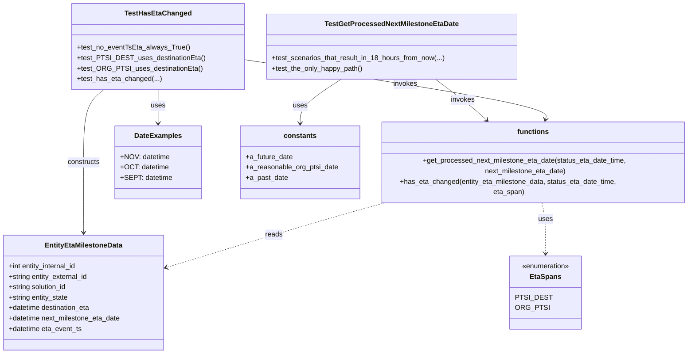
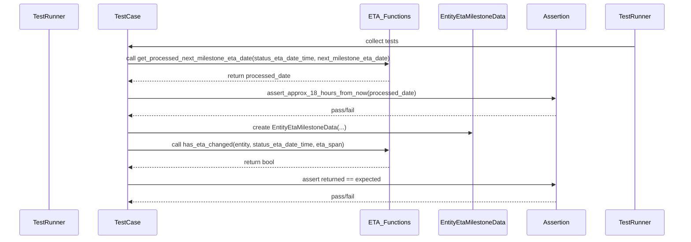

# Diagram: shipment_core/shipment_service/shipment_service/eta/eta_milestone_update/tests/test_common.py

> Auto-generated by Obscura crawlers

## Diagram 1

### SVG

<svg id="container" width="1592.70703125" xmlns="http://www.w3.org/2000/svg" class="classDiagram" height="794" viewBox="0 0 1592.70703125 794" role="graphics-document document" aria-roledescription="class"><g><defs><marker id="container_class-aggregationStart" class="marker aggregation class" refX="18" refY="7" markerWidth="190" markerHeight="240" orient="auto"><path d="M 18,7 L9,13 L1,7 L9,1 Z"></path></marker></defs><defs><marker id="container_class-aggregationEnd" class="marker aggregation class" refX="1" refY="7" markerWidth="20" markerHeight="28" orient="auto"><path d="M 18,7 L9,13 L1,7 L9,1 Z"></path></marker></defs><defs><marker id="container_class-extensionStart" class="marker extension class" refX="18" refY="7" markerWidth="190" markerHeight="240" orient="auto"><path d="M 1,7 L18,13 V 1 Z"></path></marker></defs><defs><marker id="container_class-extensionEnd" class="marker extension class" refX="1" refY="7" markerWidth="20" markerHeight="28" orient="auto"><path d="M 1,1 V 13 L18,7 Z"></path></marker></defs><defs><marker id="container_class-compositionStart" class="marker composition class" refX="18" refY="7" markerWidth="190" markerHeight="240" orient="auto"><path d="M 18,7 L9,13 L1,7 L9,1 Z"></path></marker></defs><defs><marker id="container_class-compositionEnd" class="marker composition class" refX="1" refY="7" markerWidth="20" markerHeight="28" orient="auto"><path d="M 18,7 L9,13 L1,7 L9,1 Z"></path></marker></defs><defs><marker id="container_class-dependencyStart" class="marker dependency class" refX="6" refY="7" markerWidth="190" markerHeight="240" orient="auto"><path d="M 5,7 L9,13 L1,7 L9,1 Z"></path></marker></defs><defs><marker id="container_class-dependencyEnd" class="marker dependency class" refX="13" refY="7" markerWidth="20" markerHeight="28" orient="auto"><path d="M 18,7 L9,13 L14,7 L9,1 Z"></path></marker></defs><defs><marker id="container_class-lollipopStart" class="marker lollipop class" refX="13" refY="7" markerWidth="190" markerHeight="240" orient="auto"><circle stroke="black" fill="transparent" cx="7" cy="7" r="6"></circle></marker></defs><defs><marker id="container_class-lollipopEnd" class="marker lollipop class" refX="1" refY="7" markerWidth="190" markerHeight="240" orient="auto"><circle stroke="black" fill="transparent" cx="7" cy="7" r="6"></circle></marker></defs><g class="root"><g class="clusters"></g><g class="edgePaths"><path d="M987.221,182L1001.361,192.167C1015.501,202.333,1043.781,222.667,1066.814,239.879C1089.847,257.091,1107.634,271.183,1116.528,278.228L1125.421,285.274" id="id_TestGetProcessedNextMilestoneEtaDate_functions_1" class="edge-thickness-normal edge-pattern-solid relation" style=";;;" data-edge="true" data-et="edge" data-id="id_TestGetProcessedNextMilestoneEtaDate_functions_1" data-points="W3sieCI6OTg3LjIyMTAzMzQzMjkwNDQsInkiOjE4Mn0seyJ4IjoxMDcyLjA2MDU0Njg3NSwieSI6MjQzfSx7IngiOjExMzAuMTI0MTEyMjE1OTA5LCJ5IjoyODl9XQ==" marker-end="url(#container_class-dependencyEnd)"></path><path d="M549.645,135.477L668.434,153.397C787.223,171.318,1024.801,207.159,1141.505,231.791C1258.209,256.423,1254.04,269.847,1251.955,276.558L1249.87,283.27" id="id_TestHasEtaChanged_functions_2" class="edge-thickness-normal edge-pattern-solid relation" style=";;;" data-edge="true" data-et="edge" data-id="id_TestHasEtaChanged_functions_2" data-points="W3sieCI6NTQ5LjY0NDUzMTI1LCJ5IjoxMzUuNDc2NjU1NTU5NTUxNn0seyJ4IjoxMjYyLjM3ODkwNjI1LCJ5IjoyNDN9LHsieCI6MTI0OC4wOTAwMzc0NDgzNDcyLCJ5IjoyODl9XQ==" marker-end="url(#container_class-dependencyEnd)"></path><path d="M238.674,206L231.062,212.167C223.449,218.333,208.225,230.667,200.612,257C193,283.333,193,323.667,193,364C193,404.333,193,444.667,193,470C193,495.333,193,505.667,193,510.833L193,516" id="id_TestHasEtaChanged_EntityEtaMilestoneData_3" class="edge-thickness-normal edge-pattern-solid relation" style=";;;" data-edge="true" data-et="edge" data-id="id_TestHasEtaChanged_EntityEtaMilestoneData_3" data-points="W3sieCI6MjM4LjY3NDAwMDQ1OTU1ODg0LCJ5IjoyMDZ9LHsieCI6MTkzLCJ5IjoyNDN9LHsieCI6MTkzLCJ5IjozNjR9LHsieCI6MTkzLCJ5Ijo0ODV9LHsieCI6MTkzLCJ5Ijo1MjJ9XQ==" marker-end="url(#container_class-dependencyEnd)"></path><path d="M928.708,439L898.442,446.667C868.175,454.333,807.642,469.667,716.814,495.804C625.986,521.942,504.862,558.884,444.301,577.355L383.739,595.826" id="id_functions_EntityEtaMilestoneData_4" class="edge-thickness-normal edge-pattern-dashed relation" style=";;;" data-edge="true" data-et="edge" data-id="id_functions_EntityEtaMilestoneData_4" data-points="W3sieCI6OTI4LjcwODA5NjU5MDkwOSwieSI6NDM5fSx7IngiOjc0Ny4xMDkzNzUsInkiOjQ4NX0seyJ4IjozNzgsInkiOjU5Ny41NzYxMjE1OTE1MTc5fV0=" marker-end="url(#container_class-dependencyEnd)"></path><path d="M1242.303,439L1244.093,446.667C1245.883,454.333,1249.463,469.667,1251.253,490.5C1253.043,511.333,1253.043,537.667,1253.043,550.833L1253.043,564" id="id_functions_EtaSpans_5" class="edge-thickness-normal edge-pattern-dashed relation" style=";;;" data-edge="true" data-et="edge" data-id="id_functions_EtaSpans_5" data-points="W3sieCI6MTI0Mi4zMDMyOTkzMjg1MTI0LCJ5Ijo0Mzl9LHsieCI6MTI1My4wNDI5Njg3NSwieSI6NDg1fSx7IngiOjEyNTMuMDQyOTY4NzUsInkiOjU3MH1d" marker-end="url(#container_class-dependencyEnd)"></path><path d="M360.883,206L360.883,212.167C360.883,218.333,360.883,230.667,360.883,242C360.883,253.333,360.883,263.667,360.883,268.833L360.883,274" id="id_TestHasEtaChanged_DateExamples_6" class="edge-thickness-normal edge-pattern-solid relation" style=";;;" data-edge="true" data-et="edge" data-id="id_TestHasEtaChanged_DateExamples_6" data-points="W3sieCI6MzYwLjg4MjgxMjUsInkiOjIwNn0seyJ4IjozNjAuODgyODEyNSwieSI6MjQzfSx7IngiOjM2MC44ODI4MTI1LCJ5IjoyODB9XQ==" marker-end="url(#container_class-dependencyEnd)"></path><path d="M770.244,182L754.972,192.167C739.699,202.333,709.154,222.667,693.882,238C678.609,253.333,678.609,263.667,678.609,268.833L678.609,274" id="id_TestGetProcessedNextMilestoneEtaDate_constants_7" class="edge-thickness-normal edge-pattern-solid relation" style=";;;" data-edge="true" data-et="edge" data-id="id_TestGetProcessedNextMilestoneEtaDate_constants_7" data-points="W3sieCI6NzcwLjI0NDI4NDIzNzEzMjMsInkiOjE4Mn0seyJ4Ijo2NzguNjA5Mzc1LCJ5IjoyNDN9LHsieCI6Njc4LjYwOTM3NSwieSI6MjgwfV0=" marker-end="url(#container_class-dependencyEnd)"></path></g><g class="edgeLabels"><g class="edgeLabel" transform="translate(1059.71293, 234.122)"><g class="label" data-id="id_TestGetProcessedNextMilestoneEtaDate_functions_1" transform="translate(-27.5859375, -12)"><foreignObject width="55.171875" height="24">

invokes

</foreignObject></g></g><g class="edgeLabel" transform="translate(929.82633, 192.83101)"><g class="label" data-id="id_TestHasEtaChanged_functions_2" transform="translate(-27.5859375, -12)"><foreignObject width="55.171875" height="24">

invokes

</foreignObject></g></g><g class="edgeLabel" transform="translate(193, 364)"><g class="label" data-id="id_TestHasEtaChanged_EntityEtaMilestoneData_3" transform="translate(-37.84375, -12)"><foreignObject width="75.6875" height="24">

constructs

</foreignObject></g></g><g class="edgeLabel" transform="translate(652.14741, 513.96282)"><g class="label" data-id="id_functions_EntityEtaMilestoneData_4" transform="translate(-20.0078125, -12)"><foreignObject width="40.015625" height="24">

reads

</foreignObject></g></g><g class="edgeLabel" transform="translate(1253.04296875, 485)"><g class="label" data-id="id_functions_EtaSpans_5" transform="translate(-16.4921875, -12)"><foreignObject width="32.984375" height="24">

uses

</foreignObject></g></g><g class="edgeLabel" transform="translate(360.8828125, 243)"><g class="label" data-id="id_TestHasEtaChanged_DateExamples_6" transform="translate(-16.4921875, -12)"><foreignObject width="32.984375" height="24">

uses

</foreignObject></g></g><g class="edgeLabel" transform="translate(678.609375, 243)"><g class="label" data-id="id_TestGetProcessedNextMilestoneEtaDate_constants_7" transform="translate(-16.4921875, -12)"><foreignObject width="32.984375" height="24">

uses

</foreignObject></g></g></g><g class="nodes"><g class="node default" id="classId-EntityEtaMilestoneData-0" transform="translate(193, 654)"><g class="basic label-container"><path d="M-185 -132 L185 -132 L185 132 L-185 132" stroke="none" stroke-width="0" fill="#ECECFF" style=""></path><path d="M-185 -132 C-62.570278309832574 -132, 59.85944338033485 -132, 185 -132 M-185 -132 C-89.64123246018971 -132, 5.717535079620575 -132, 185 -132 M185 -132 C185 -63.343692633807706, 185 5.3126147323845885, 185 132 M185 -132 C185 -73.89358812110429, 185 -15.787176242208574, 185 132 M185 132 C76.21913813242094 132, -32.561723735158125 132, -185 132 M185 132 C57.247444906749635 132, -70.50511018650073 132, -185 132 M-185 132 C-185 37.044964595069615, -185 -57.91007080986077, -185 -132 M-185 132 C-185 32.52713535749827, -185 -66.94572928500347, -185 -132" stroke="#9370DB" stroke-width="1.3" fill="none" stroke-dasharray="0 0" style=""></path></g><g class="annotation-group text" transform="translate(0, -108)"></g><g class="label-group text" transform="translate(-85.421875, -108)"><g class="label" style="font-weight: bolder" transform="translate(0,-12)"><foreignObject width="170.84375" height="24">

EntityEtaMilestoneData

</foreignObject></g></g><g class="members-group text" transform="translate(-173, -60)"><g class="label" style="" transform="translate(0,-12)"><foreignObject width="161.015625" height="24">

+int entity_internal_id

</foreignObject></g><g class="label" style="" transform="translate(0,12)"><foreignObject width="185.109375" height="24">

+string entity_external_id

</foreignObject></g><g class="label" style="" transform="translate(0,36)"><foreignObject width="136.09375" height="24">

+string solution_id

</foreignObject></g><g class="label" style="" transform="translate(0,60)"><foreignObject width="139.75" height="24">

+string entity_state

</foreignObject></g><g class="label" style="" transform="translate(0,84)"><foreignObject width="191.703125" height="24">

+datetime destination_eta

</foreignObject></g><g class="label" style="" transform="translate(0,108)"><foreignObject width="260.578125" height="24">

+datetime next_milestone_eta_date

</foreignObject></g><g class="label" style="" transform="translate(0,132)"><foreignObject width="170.15625" height="24">

+datetime eta_event_ts

</foreignObject></g></g><g class="methods-group text" transform="translate(-173, 132)"></g><g class="divider" style=""><path d="M-185 -84 C-75.49025790965366 -84, 34.01948418069267 -84, 185 -84 M-185 -84 C-78.51597958545608 -84, 27.96804082908784 -84, 185 -84" stroke="#9370DB" stroke-width="1.3" fill="none" stroke-dasharray="0 0" style=""></path></g><g class="divider" style=""><path d="M-185 108 C-46.23925303201213 108, 92.52149393597574 108, 185 108 M-185 108 C-68.01767602738873 108, 48.96464794522254 108, 185 108" stroke="#9370DB" stroke-width="1.3" fill="none" stroke-dasharray="0 0" style=""></path></g></g><g class="node default" id="classId-EtaSpans-1" transform="translate(1253.04296875, 654)"><g class="basic label-container"><path d="M-76.75390625 -84 L76.75390625 -84 L76.75390625 84 L-76.75390625 84" stroke="none" stroke-width="0" fill="#ECECFF" style=""></path><path d="M-76.75390625 -84 C-16.927885700627243 -84, 42.898134848745514 -84, 76.75390625 -84 M-76.75390625 -84 C-28.629558293434933 -84, 19.494789663130135 -84, 76.75390625 -84 M76.75390625 -84 C76.75390625 -23.175239582926068, 76.75390625 37.649520834147864, 76.75390625 84 M76.75390625 -84 C76.75390625 -26.740759958441387, 76.75390625 30.518480083117225, 76.75390625 84 M76.75390625 84 C19.525515162411196 84, -37.70287592517761 84, -76.75390625 84 M76.75390625 84 C25.9141981803986 84, -24.9255098892028 84, -76.75390625 84 M-76.75390625 84 C-76.75390625 48.89526916174849, -76.75390625 13.790538323496975, -76.75390625 -84 M-76.75390625 84 C-76.75390625 46.832109550646194, -76.75390625 9.664219101292389, -76.75390625 -84" stroke="#9370DB" stroke-width="1.3" fill="none" stroke-dasharray="0 0" style=""></path></g><g class="annotation-group text" transform="translate(-55.5546875, -60)"><g class="label" style="" transform="translate(0,-12)"><foreignObject width="111.109375" height="24">

«enumeration»

</foreignObject></g></g><g class="label-group text" transform="translate(-33.578125, -36)"><g class="label" style="font-weight: bolder" transform="translate(0,-12)"><foreignObject width="67.15625" height="24">

EtaSpans

</foreignObject></g></g><g class="members-group text" transform="translate(-64.75390625, 12)"><g class="label" style="" transform="translate(0,-12)"><foreignObject width="73.953125" height="24">

PTSI_DEST

</foreignObject></g><g class="label" style="" transform="translate(0,12)"><foreignObject width="69.3125" height="24">

ORG_PTSI

</foreignObject></g></g><g class="methods-group text" transform="translate(-64.75390625, 84)"></g><g class="divider" style=""><path d="M-76.75390625 -12 C-29.466151080345973 -12, 17.821604089308053 -12, 76.75390625 -12 M-76.75390625 -12 C-28.900369740330234 -12, 18.953166769339532 -12, 76.75390625 -12" stroke="#9370DB" stroke-width="1.3" fill="none" stroke-dasharray="0 0" style=""></path></g><g class="divider" style=""><path d="M-76.75390625 60 C-29.30251849390553 60, 18.14886926218894 60, 76.75390625 60 M-76.75390625 60 C-29.938862806271707 60, 16.876180637456585 60, 76.75390625 60" stroke="#9370DB" stroke-width="1.3" fill="none" stroke-dasharray="0 0" style=""></path></g></g><g class="node default" id="classId-functions-2" transform="translate(1224.79296875, 364)"><g class="basic label-container"><path d="M-359.9140625 -75 L359.9140625 -75 L359.9140625 75 L-359.9140625 75" stroke="none" stroke-width="0" fill="#ECECFF" style=""></path><path d="M-359.9140625 -75 C-182.66219104835008 -75, -5.4103195967001625 -75, 359.9140625 -75 M-359.9140625 -75 C-81.81965713208751 -75, 196.27474823582497 -75, 359.9140625 -75 M359.9140625 -75 C359.9140625 -29.417468483395666, 359.9140625 16.165063033208668, 359.9140625 75 M359.9140625 -75 C359.9140625 -32.02561258396448, 359.9140625 10.948774832071038, 359.9140625 75 M359.9140625 75 C208.71288541238238 75, 57.511708324764754 75, -359.9140625 75 M359.9140625 75 C208.04729813457513 75, 56.18053376915026 75, -359.9140625 75 M-359.9140625 75 C-359.9140625 32.833087377324304, -359.9140625 -9.333825245351392, -359.9140625 -75 M-359.9140625 75 C-359.9140625 27.511809638832915, -359.9140625 -19.97638072233417, -359.9140625 -75" stroke="#9370DB" stroke-width="1.3" fill="none" stroke-dasharray="0 0" style=""></path></g><g class="annotation-group text" transform="translate(0, -51)"></g><g class="label-group text" transform="translate(-34.375, -51)"><g class="label" style="font-weight: bolder" transform="translate(0,-12)"><foreignObject width="68.75" height="24">

functions

</foreignObject></g></g><g class="members-group text" transform="translate(-347.9140625, -3)"></g><g class="methods-group text" transform="translate(-347.9140625, 27)"><g class="label" style="" transform="translate(0,-12)"><foreignObject width="661.453125" height="24">

+get_processed_next_milestone_eta_date(status_eta_date_time, next_milestone_eta_date)

</foreignObject></g><g class="label" style="" transform="translate(0,12)"><foreignObject width="575.578125" height="24">

+has_eta_changed(entity_eta_milestone_data, status_eta_date_time, eta_span)

</foreignObject></g></g><g class="divider" style=""><path d="M-359.9140625 -27 C-135.60919667318538 -27, 88.69566915362924 -27, 359.9140625 -27 M-359.9140625 -27 C-85.39396728064145 -27, 189.1261279387171 -27, 359.9140625 -27" stroke="#9370DB" stroke-width="1.3" fill="none" stroke-dasharray="0 0" style=""></path></g><g class="divider" style=""><path d="M-359.9140625 -3 C-81.09530014350634 -3, 197.72346221298733 -3, 359.9140625 -3 M-359.9140625 -3 C-149.98066984349848 -3, 59.95272281300305 -3, 359.9140625 -3" stroke="#9370DB" stroke-width="1.3" fill="none" stroke-dasharray="0 0" style=""></path></g></g><g class="node default" id="classId-DateExamples-3" transform="translate(360.8828125, 364)"><g class="basic label-container"><path d="M-95.0390625 -84 L95.0390625 -84 L95.0390625 84 L-95.0390625 84" stroke="none" stroke-width="0" fill="#ECECFF" style=""></path><path d="M-95.0390625 -84 C-40.31436707488272 -84, 14.410328350234565 -84, 95.0390625 -84 M-95.0390625 -84 C-24.593816990189467 -84, 45.85142851962107 -84, 95.0390625 -84 M95.0390625 -84 C95.0390625 -17.388276013406013, 95.0390625 49.22344797318797, 95.0390625 84 M95.0390625 -84 C95.0390625 -49.82455152146021, 95.0390625 -15.649103042920416, 95.0390625 84 M95.0390625 84 C46.830908702087974 84, -1.3772450958240512 84, -95.0390625 84 M95.0390625 84 C47.07474528425056 84, -0.8895719314988781 84, -95.0390625 84 M-95.0390625 84 C-95.0390625 44.66845652505007, -95.0390625 5.3369130501001365, -95.0390625 -84 M-95.0390625 84 C-95.0390625 21.93386368596819, -95.0390625 -40.13227262806362, -95.0390625 -84" stroke="#9370DB" stroke-width="1.3" fill="none" stroke-dasharray="0 0" style=""></path></g><g class="annotation-group text" transform="translate(0, -60)"></g><g class="label-group text" transform="translate(-51.59375, -60)"><g class="label" style="font-weight: bolder" transform="translate(0,-12)"><foreignObject width="103.1875" height="24">

DateExamples

</foreignObject></g></g><g class="members-group text" transform="translate(-83.0390625, -12)"><g class="label" style="" transform="translate(0,-12)"><foreignObject width="111.96875" height="24">

+NOV: datetime

</foreignObject></g><g class="label" style="" transform="translate(0,12)"><foreignObject width="108.828125" height="24">

+OCT: datetime

</foreignObject></g><g class="label" style="" transform="translate(0,36)"><foreignObject width="114.484375" height="24">

+SEPT: datetime

</foreignObject></g></g><g class="methods-group text" transform="translate(-83.0390625, 84)"></g><g class="divider" style=""><path d="M-95.0390625 -36 C-24.86372253722874 -36, 45.31161742554252 -36, 95.0390625 -36 M-95.0390625 -36 C-38.42532792565295 -36, 18.188406648694098 -36, 95.0390625 -36" stroke="#9370DB" stroke-width="1.3" fill="none" stroke-dasharray="0 0" style=""></path></g><g class="divider" style=""><path d="M-95.0390625 60 C-56.35830041808801 60, -17.677538336176013 60, 95.0390625 60 M-95.0390625 60 C-20.347247961346483 60, 54.344566577307035 60, 95.0390625 60" stroke="#9370DB" stroke-width="1.3" fill="none" stroke-dasharray="0 0" style=""></path></g></g><g class="node default" id="classId-TestGetProcessedNextMilestoneEtaDate-4" transform="translate(882.91015625, 107)"><g class="basic label-container"><path d="M-283.265625 -75 L283.265625 -75 L283.265625 75 L-283.265625 75" stroke="none" stroke-width="0" fill="#ECECFF" style=""></path><path d="M-283.265625 -75 C-129.67338588546846 -75, 23.918853229063075 -75, 283.265625 -75 M-283.265625 -75 C-129.32496648974652 -75, 24.61569202050697 -75, 283.265625 -75 M283.265625 -75 C283.265625 -20.483071601662353, 283.265625 34.033856796675295, 283.265625 75 M283.265625 -75 C283.265625 -29.121491163963178, 283.265625 16.757017672073644, 283.265625 75 M283.265625 75 C155.67340503545734 75, 28.0811850709147 75, -283.265625 75 M283.265625 75 C87.26948392731563 75, -108.72665714536873 75, -283.265625 75 M-283.265625 75 C-283.265625 20.076380110185703, -283.265625 -34.847239779628595, -283.265625 -75 M-283.265625 75 C-283.265625 39.1307509902639, -283.265625 3.2615019805277967, -283.265625 -75" stroke="#9370DB" stroke-width="1.3" fill="none" stroke-dasharray="0 0" style=""></path></g><g class="annotation-group text" transform="translate(0, -51)"></g><g class="label-group text" transform="translate(-146.09375, -51)"><g class="label" style="font-weight: bolder" transform="translate(0,-12)"><foreignObject width="292.1875" height="24">

TestGetProcessedNextMilestoneEtaDate

</foreignObject></g></g><g class="members-group text" transform="translate(-271.265625, -3)"></g><g class="methods-group text" transform="translate(-271.265625, 27)"><g class="label" style="" transform="translate(0,-12)"><foreignObject width="396.4375" height="24">

+test_scenarios_that_result_in_18_hours_from_now(...)

</foreignObject></g><g class="label" style="" transform="translate(0,12)"><foreignObject width="210.234375" height="24">

+test_the_only_happy_path()

</foreignObject></g></g><g class="divider" style=""><path d="M-283.265625 -27 C-159.60632156418262 -27, -35.94701812836527 -27, 283.265625 -27 M-283.265625 -27 C-76.99199393045245 -27, 129.2816371390951 -27, 283.265625 -27" stroke="#9370DB" stroke-width="1.3" fill="none" stroke-dasharray="0 0" style=""></path></g><g class="divider" style=""><path d="M-283.265625 -3 C-132.4781167894359 -3, 18.309391421128225 -3, 283.265625 -3 M-283.265625 -3 C-69.13920729452732 -3, 144.98721041094535 -3, 283.265625 -3" stroke="#9370DB" stroke-width="1.3" fill="none" stroke-dasharray="0 0" style=""></path></g></g><g class="node default" id="classId-TestHasEtaChanged-5" transform="translate(360.8828125, 107)"><g class="basic label-container"><path d="M-188.76171875 -99 L188.76171875 -99 L188.76171875 99 L-188.76171875 99" stroke="none" stroke-width="0" fill="#ECECFF" style=""></path><path d="M-188.76171875 -99 C-56.73532579638251 -99, 75.29106715723498 -99, 188.76171875 -99 M-188.76171875 -99 C-47.62314828366374 -99, 93.51542218267252 -99, 188.76171875 -99 M188.76171875 -99 C188.76171875 -52.56565496560432, 188.76171875 -6.131309931208634, 188.76171875 99 M188.76171875 -99 C188.76171875 -34.857720160161776, 188.76171875 29.28455967967645, 188.76171875 99 M188.76171875 99 C76.82212615509742 99, -35.117466439805156 99, -188.76171875 99 M188.76171875 99 C63.459466506888546 99, -61.84278573622291 99, -188.76171875 99 M-188.76171875 99 C-188.76171875 44.464639956694256, -188.76171875 -10.070720086611487, -188.76171875 -99 M-188.76171875 99 C-188.76171875 34.07002158750312, -188.76171875 -30.85995682499376, -188.76171875 -99" stroke="#9370DB" stroke-width="1.3" fill="none" stroke-dasharray="0 0" style=""></path></g><g class="annotation-group text" transform="translate(0, -75)"></g><g class="label-group text" transform="translate(-71.7734375, -75)"><g class="label" style="font-weight: bolder" transform="translate(0,-12)"><foreignObject width="143.546875" height="24">

TestHasEtaChanged

</foreignObject></g></g><g class="members-group text" transform="translate(-176.76171875, -27)"></g><g class="methods-group text" transform="translate(-176.76171875, 3)"><g class="label" style="" transform="translate(0,-12)"><foreignObject width="253.890625" height="24">

+test_no_eventTsEta_always_True()

</foreignObject></g><g class="label" style="" transform="translate(0,12)"><foreignObject width="281.75" height="24">

+test_PTSI_DEST_uses_destinationEta()

</foreignObject></g><g class="label" style="" transform="translate(0,36)"><foreignObject width="277.265625" height="24">

+test_ORG_PTSI_uses_destinationEta()

</foreignObject></g><g class="label" style="" transform="translate(0,60)"><foreignObject width="191.234375" height="24">

+test_has_eta_changed(...)

</foreignObject></g></g><g class="divider" style=""><path d="M-188.76171875 -51 C-91.60939152330829 -51, 5.542935703383421 -51, 188.76171875 -51 M-188.76171875 -51 C-84.1805651291095 -51, 20.400588491781008 -51, 188.76171875 -51" stroke="#9370DB" stroke-width="1.3" fill="none" stroke-dasharray="0 0" style=""></path></g><g class="divider" style=""><path d="M-188.76171875 -27 C-44.35258377222195 -27, 100.0565512055561 -27, 188.76171875 -27 M-188.76171875 -27 C-85.45590439846046 -27, 17.849909953079077 -27, 188.76171875 -27" stroke="#9370DB" stroke-width="1.3" fill="none" stroke-dasharray="0 0" style=""></path></g></g><g class="node default" id="classId-constants-6" transform="translate(678.609375, 364)"><g class="basic label-container"><path d="M-136.26953125 -84 L136.26953125 -84 L136.26953125 84 L-136.26953125 84" stroke="none" stroke-width="0" fill="#ECECFF" style=""></path><path d="M-136.26953125 -84 C-59.55681828317135 -84, 17.155894683657294 -84, 136.26953125 -84 M-136.26953125 -84 C-46.17219207805883 -84, 43.925147093882345 -84, 136.26953125 -84 M136.26953125 -84 C136.26953125 -34.02978647790374, 136.26953125 15.940427044192518, 136.26953125 84 M136.26953125 -84 C136.26953125 -35.63976803895312, 136.26953125 12.720463922093757, 136.26953125 84 M136.26953125 84 C63.15446736428683 84, -9.96059652142634 84, -136.26953125 84 M136.26953125 84 C59.170952028891506 84, -17.92762719221699 84, -136.26953125 84 M-136.26953125 84 C-136.26953125 38.11897897154452, -136.26953125 -7.762042056910957, -136.26953125 -84 M-136.26953125 84 C-136.26953125 18.649905205502236, -136.26953125 -46.70018958899553, -136.26953125 -84" stroke="#9370DB" stroke-width="1.3" fill="none" stroke-dasharray="0 0" style=""></path></g><g class="annotation-group text" transform="translate(0, -60)"></g><g class="label-group text" transform="translate(-35.7734375, -60)"><g class="label" style="font-weight: bolder" transform="translate(0,-12)"><foreignObject width="71.546875" height="24">

constants

</foreignObject></g></g><g class="members-group text" transform="translate(-124.26953125, -12)"><g class="label" style="" transform="translate(0,-12)"><foreignObject width="108.84375" height="24">

+a_future_date

</foreignObject></g><g class="label" style="" transform="translate(0,12)"><foreignObject width="212.765625" height="24">

+a_reasonable_org_ptsi_date

</foreignObject></g><g class="label" style="" transform="translate(0,36)"><foreignObject width="96.4375" height="24">

+a_past_date

</foreignObject></g></g><g class="methods-group text" transform="translate(-124.26953125, 84)"></g><g class="divider" style=""><path d="M-136.26953125 -36 C-42.850737721720236 -36, 50.56805580655953 -36, 136.26953125 -36 M-136.26953125 -36 C-70.00119350470972 -36, -3.7328557594194365 -36, 136.26953125 -36" stroke="#9370DB" stroke-width="1.3" fill="none" stroke-dasharray="0 0" style=""></path></g><g class="divider" style=""><path d="M-136.26953125 60 C-64.9748213582854 60, 6.319888533429207 60, 136.26953125 60 M-136.26953125 60 C-54.590958308624295 60, 27.08761463275141 60, 136.26953125 60" stroke="#9370DB" stroke-width="1.3" fill="none" stroke-dasharray="0 0" style=""></path></g></g></g></g></g></svg>

## Diagram 2

### SVG

<svg id="container" width="1841" xmlns="http://www.w3.org/2000/svg" height="651" viewBox="-50 -10 1841 651" role="graphics-document document" aria-roledescription="sequence"><g><rect x="1591" y="565" fill="#eaeaea" stroke="#666" width="150" height="65" name="TestRunner" rx="3" ry="3" class="actor actor-bottom"></rect><text x="1666" y="597.5" dominant-baseline="central" alignment-baseline="central" class="actor actor-box" style="text-anchor: middle; font-size: 16px; font-weight: 400;"><tspan x="1666" dy="0">TestRunner</tspan></text></g><g><rect x="1391" y="565" fill="#eaeaea" stroke="#666" width="150" height="65" name="Assert" rx="3" ry="3" class="actor actor-bottom"></rect><text x="1466" y="597.5" dominant-baseline="central" alignment-baseline="central" class="actor actor-box" style="text-anchor: middle; font-size: 16px; font-weight: 400;"><tspan x="1466" dy="0">Assertion</tspan></text></g><g><rect x="1153" y="565" fill="#eaeaea" stroke="#666" width="188" height="65" name="Entity" rx="3" ry="3" class="actor actor-bottom"></rect><text x="1247" y="597.5" dominant-baseline="central" alignment-baseline="central" class="actor actor-box" style="text-anchor: middle; font-size: 16px; font-weight: 400;"><tspan x="1247" dy="0">EntityEtaMilestoneData</tspan></text></g><g><rect x="953" y="565" fill="#eaeaea" stroke="#666" width="150" height="65" name="Funcs" rx="3" ry="3" class="actor actor-bottom"></rect><text x="1028" y="597.5" dominant-baseline="central" alignment-baseline="central" class="actor actor-box" style="text-anchor: middle; font-size: 16px; font-weight: 400;"><tspan x="1028" dy="0">ETA_Functions</tspan></text></g><g><rect x="200" y="565" fill="#eaeaea" stroke="#666" width="150" height="65" name="Test" rx="3" ry="3" class="actor actor-bottom"></rect><text x="275" y="597.5" dominant-baseline="central" alignment-baseline="central" class="actor actor-box" style="text-anchor: middle; font-size: 16px; font-weight: 400;"><tspan x="275" dy="0">TestCase</tspan></text></g><g><rect x="0" y="565" fill="#eaeaea" stroke="#666" width="150" height="65" name="Pytest" rx="3" ry="3" class="actor actor-bottom"></rect><text x="75" y="597.5" dominant-baseline="central" alignment-baseline="central" class="actor actor-box" style="text-anchor: middle; font-size: 16px; font-weight: 400;"><tspan x="75" dy="0">TestRunner</tspan></text></g><g><line id="actor5" x1="1666" y1="65" x2="1666" y2="565" class="actor-line 200" stroke-width="0.5px" stroke="#999" name="TestRunner"></line><g id="root-5"><rect x="1591" y="0" fill="#eaeaea" stroke="#666" width="150" height="65" name="TestRunner" rx="3" ry="3" class="actor actor-top"></rect><text x="1666" y="32.5" dominant-baseline="central" alignment-baseline="central" class="actor actor-box" style="text-anchor: middle; font-size: 16px; font-weight: 400;"><tspan x="1666" dy="0">TestRunner</tspan></text></g></g><g><line id="actor4" x1="1466" y1="65" x2="1466" y2="565" class="actor-line 200" stroke-width="0.5px" stroke="#999" name="Assert"></line><g id="root-4"><rect x="1391" y="0" fill="#eaeaea" stroke="#666" width="150" height="65" name="Assert" rx="3" ry="3" class="actor actor-top"></rect><text x="1466" y="32.5" dominant-baseline="central" alignment-baseline="central" class="actor actor-box" style="text-anchor: middle; font-size: 16px; font-weight: 400;"><tspan x="1466" dy="0">Assertion</tspan></text></g></g><g><line id="actor3" x1="1247" y1="65" x2="1247" y2="565" class="actor-line 200" stroke-width="0.5px" stroke="#999" name="Entity"></line><g id="root-3"><rect x="1153" y="0" fill="#eaeaea" stroke="#666" width="188" height="65" name="Entity" rx="3" ry="3" class="actor actor-top"></rect><text x="1247" y="32.5" dominant-baseline="central" alignment-baseline="central" class="actor actor-box" style="text-anchor: middle; font-size: 16px; font-weight: 400;"><tspan x="1247" dy="0">EntityEtaMilestoneData</tspan></text></g></g><g><line id="actor2" x1="1028" y1="65" x2="1028" y2="565" class="actor-line 200" stroke-width="0.5px" stroke="#999" name="Funcs"></line><g id="root-2"><rect x="953" y="0" fill="#eaeaea" stroke="#666" width="150" height="65" name="Funcs" rx="3" ry="3" class="actor actor-top"></rect><text x="1028" y="32.5" dominant-baseline="central" alignment-baseline="central" class="actor actor-box" style="text-anchor: middle; font-size: 16px; font-weight: 400;"><tspan x="1028" dy="0">ETA_Functions</tspan></text></g></g><g><line id="actor1" x1="275" y1="65" x2="275" y2="565" class="actor-line 200" stroke-width="0.5px" stroke="#999" name="Test"></line><g id="root-1"><rect x="200" y="0" fill="#eaeaea" stroke="#666" width="150" height="65" name="Test" rx="3" ry="3" class="actor actor-top"></rect><text x="275" y="32.5" dominant-baseline="central" alignment-baseline="central" class="actor actor-box" style="text-anchor: middle; font-size: 16px; font-weight: 400;"><tspan x="275" dy="0">TestCase</tspan></text></g></g><g><line id="actor0" x1="75" y1="65" x2="75" y2="565" class="actor-line 200" stroke-width="0.5px" stroke="#999" name="Pytest"></line><g id="root-0"><rect x="0" y="0" fill="#eaeaea" stroke="#666" width="150" height="65" name="Pytest" rx="3" ry="3" class="actor actor-top"></rect><text x="75" y="32.5" dominant-baseline="central" alignment-baseline="central" class="actor actor-box" style="text-anchor: middle; font-size: 16px; font-weight: 400;"><tspan x="75" dy="0">TestRunner</tspan></text></g></g><g></g><defs><symbol id="computer" width="24" height="24"><path transform="scale(.5)" d="M2 2v13h20v-13h-20zm18 11h-16v-9h16v9zm-10.228 6l.466-1h3.524l.467 1h-4.457zm14.228 3h-24l2-6h2.104l-1.33 4h18.45l-1.297-4h2.073l2 6zm-5-10h-14v-7h14v7z"></path></symbol></defs><defs><symbol id="database" fill-rule="evenodd" clip-rule="evenodd"><path transform="scale(.5)" d="M12.258.001l.256.004.255.005.253.008.251.01.249.012.247.015.246.016.242.019.241.02.239.023.236.024.233.027.231.028.229.031.225.032.223.034.22.036.217.038.214.04.211.041.208.043.205.045.201.046.198.048.194.05.191.051.187.053.183.054.18.056.175.057.172.059.168.06.163.061.16.063.155.064.15.066.074.033.073.033.071.034.07.034.069.035.068.035.067.035.066.035.064.036.064.036.062.036.06.036.06.037.058.037.058.037.055.038.055.038.053.038.052.038.051.039.05.039.048.039.047.039.045.04.044.04.043.04.041.04.04.041.039.041.037.041.036.041.034.041.033.042.032.042.03.042.029.042.027.042.026.043.024.043.023.043.021.043.02.043.018.044.017.043.015.044.013.044.012.044.011.045.009.044.007.045.006.045.004.045.002.045.001.045v17l-.001.045-.002.045-.004.045-.006.045-.007.045-.009.044-.011.045-.012.044-.013.044-.015.044-.017.043-.018.044-.02.043-.021.043-.023.043-.024.043-.026.043-.027.042-.029.042-.03.042-.032.042-.033.042-.034.041-.036.041-.037.041-.039.041-.04.041-.041.04-.043.04-.044.04-.045.04-.047.039-.048.039-.05.039-.051.039-.052.038-.053.038-.055.038-.055.038-.058.037-.058.037-.06.037-.06.036-.062.036-.064.036-.064.036-.066.035-.067.035-.068.035-.069.035-.07.034-.071.034-.073.033-.074.033-.15.066-.155.064-.16.063-.163.061-.168.06-.172.059-.175.057-.18.056-.183.054-.187.053-.191.051-.194.05-.198.048-.201.046-.205.045-.208.043-.211.041-.214.04-.217.038-.22.036-.223.034-.225.032-.229.031-.231.028-.233.027-.236.024-.239.023-.241.02-.242.019-.246.016-.247.015-.249.012-.251.01-.253.008-.255.005-.256.004-.258.001-.258-.001-.256-.004-.255-.005-.253-.008-.251-.01-.249-.012-.247-.015-.245-.016-.243-.019-.241-.02-.238-.023-.236-.024-.234-.027-.231-.028-.228-.031-.226-.032-.223-.034-.22-.036-.217-.038-.214-.04-.211-.041-.208-.043-.204-.045-.201-.046-.198-.048-.195-.05-.19-.051-.187-.053-.184-.054-.179-.056-.176-.057-.172-.059-.167-.06-.164-.061-.159-.063-.155-.064-.151-.066-.074-.033-.072-.033-.072-.034-.07-.034-.069-.035-.068-.035-.067-.035-.066-.035-.064-.036-.063-.036-.062-.036-.061-.036-.06-.037-.058-.037-.057-.037-.056-.038-.055-.038-.053-.038-.052-.038-.051-.039-.049-.039-.049-.039-.046-.039-.046-.04-.044-.04-.043-.04-.041-.04-.04-.041-.039-.041-.037-.041-.036-.041-.034-.041-.033-.042-.032-.042-.03-.042-.029-.042-.027-.042-.026-.043-.024-.043-.023-.043-.021-.043-.02-.043-.018-.044-.017-.043-.015-.044-.013-.044-.012-.044-.011-.045-.009-.044-.007-.045-.006-.045-.004-.045-.002-.045-.001-.045v-17l.001-.045.002-.045.004-.045.006-.045.007-.045.009-.044.011-.045.012-.044.013-.044.015-.044.017-.043.018-.044.02-.043.021-.043.023-.043.024-.043.026-.043.027-.042.029-.042.03-.042.032-.042.033-.042.034-.041.036-.041.037-.041.039-.041.04-.041.041-.04.043-.04.044-.04.046-.04.046-.039.049-.039.049-.039.051-.039.052-.038.053-.038.055-.038.056-.038.057-.037.058-.037.06-.037.061-.036.062-.036.063-.036.064-.036.066-.035.067-.035.068-.035.069-.035.07-.034.072-.034.072-.033.074-.033.151-.066.155-.064.159-.063.164-.061.167-.06.172-.059.176-.057.179-.056.184-.054.187-.053.19-.051.195-.05.198-.048.201-.046.204-.045.208-.043.211-.041.214-.04.217-.038.22-.036.223-.034.226-.032.228-.031.231-.028.234-.027.236-.024.238-.023.241-.02.243-.019.245-.016.247-.015.249-.012.251-.01.253-.008.255-.005.256-.004.258-.001.258.001zm-9.258 20.499v.01l.001.021.003.021.004.022.005.021.006.022.007.022.009.023.01.022.011.023.012.023.013.023.015.023.016.024.017.023.018.024.019.024.021.024.022.025.023.024.024.025.052.049.056.05.061.051.066.051.07.051.075.051.079.052.084.052.088.052.092.052.097.052.102.051.105.052.11.052.114.051.119.051.123.051.127.05.131.05.135.05.139.048.144.049.147.047.152.047.155.047.16.045.163.045.167.043.171.043.176.041.178.041.183.039.187.039.19.037.194.035.197.035.202.033.204.031.209.03.212.029.216.027.219.025.222.024.226.021.23.02.233.018.236.016.24.015.243.012.246.01.249.008.253.005.256.004.259.001.26-.001.257-.004.254-.005.25-.008.247-.011.244-.012.241-.014.237-.016.233-.018.231-.021.226-.021.224-.024.22-.026.216-.027.212-.028.21-.031.205-.031.202-.034.198-.034.194-.036.191-.037.187-.039.183-.04.179-.04.175-.042.172-.043.168-.044.163-.045.16-.046.155-.046.152-.047.148-.048.143-.049.139-.049.136-.05.131-.05.126-.05.123-.051.118-.052.114-.051.11-.052.106-.052.101-.052.096-.052.092-.052.088-.053.083-.051.079-.052.074-.052.07-.051.065-.051.06-.051.056-.05.051-.05.023-.024.023-.025.021-.024.02-.024.019-.024.018-.024.017-.024.015-.023.014-.024.013-.023.012-.023.01-.023.01-.022.008-.022.006-.022.006-.022.004-.022.004-.021.001-.021.001-.021v-4.127l-.077.055-.08.053-.083.054-.085.053-.087.052-.09.052-.093.051-.095.05-.097.05-.1.049-.102.049-.105.048-.106.047-.109.047-.111.046-.114.045-.115.045-.118.044-.12.043-.122.042-.124.042-.126.041-.128.04-.13.04-.132.038-.134.038-.135.037-.138.037-.139.035-.142.035-.143.034-.144.033-.147.032-.148.031-.15.03-.151.03-.153.029-.154.027-.156.027-.158.026-.159.025-.161.024-.162.023-.163.022-.165.021-.166.02-.167.019-.169.018-.169.017-.171.016-.173.015-.173.014-.175.013-.175.012-.177.011-.178.01-.179.008-.179.008-.181.006-.182.005-.182.004-.184.003-.184.002h-.37l-.184-.002-.184-.003-.182-.004-.182-.005-.181-.006-.179-.008-.179-.008-.178-.01-.176-.011-.176-.012-.175-.013-.173-.014-.172-.015-.171-.016-.17-.017-.169-.018-.167-.019-.166-.02-.165-.021-.163-.022-.162-.023-.161-.024-.159-.025-.157-.026-.156-.027-.155-.027-.153-.029-.151-.03-.15-.03-.148-.031-.146-.032-.145-.033-.143-.034-.141-.035-.14-.035-.137-.037-.136-.037-.134-.038-.132-.038-.13-.04-.128-.04-.126-.041-.124-.042-.122-.042-.12-.044-.117-.043-.116-.045-.113-.045-.112-.046-.109-.047-.106-.047-.105-.048-.102-.049-.1-.049-.097-.05-.095-.05-.093-.052-.09-.051-.087-.052-.085-.053-.083-.054-.08-.054-.077-.054v4.127zm0-5.654v.011l.001.021.003.021.004.021.005.022.006.022.007.022.009.022.01.022.011.023.012.023.013.023.015.024.016.023.017.024.018.024.019.024.021.024.022.024.023.025.024.024.052.05.056.05.061.05.066.051.07.051.075.052.079.051.084.052.088.052.092.052.097.052.102.052.105.052.11.051.114.051.119.052.123.05.127.051.131.05.135.049.139.049.144.048.147.048.152.047.155.046.16.045.163.045.167.044.171.042.176.042.178.04.183.04.187.038.19.037.194.036.197.034.202.033.204.032.209.03.212.028.216.027.219.025.222.024.226.022.23.02.233.018.236.016.24.014.243.012.246.01.249.008.253.006.256.003.259.001.26-.001.257-.003.254-.006.25-.008.247-.01.244-.012.241-.015.237-.016.233-.018.231-.02.226-.022.224-.024.22-.025.216-.027.212-.029.21-.03.205-.032.202-.033.198-.035.194-.036.191-.037.187-.039.183-.039.179-.041.175-.042.172-.043.168-.044.163-.045.16-.045.155-.047.152-.047.148-.048.143-.048.139-.05.136-.049.131-.05.126-.051.123-.051.118-.051.114-.052.11-.052.106-.052.101-.052.096-.052.092-.052.088-.052.083-.052.079-.052.074-.051.07-.052.065-.051.06-.05.056-.051.051-.049.023-.025.023-.024.021-.025.02-.024.019-.024.018-.024.017-.024.015-.023.014-.023.013-.024.012-.022.01-.023.01-.023.008-.022.006-.022.006-.022.004-.021.004-.022.001-.021.001-.021v-4.139l-.077.054-.08.054-.083.054-.085.052-.087.053-.09.051-.093.051-.095.051-.097.05-.1.049-.102.049-.105.048-.106.047-.109.047-.111.046-.114.045-.115.044-.118.044-.12.044-.122.042-.124.042-.126.041-.128.04-.13.039-.132.039-.134.038-.135.037-.138.036-.139.036-.142.035-.143.033-.144.033-.147.033-.148.031-.15.03-.151.03-.153.028-.154.028-.156.027-.158.026-.159.025-.161.024-.162.023-.163.022-.165.021-.166.02-.167.019-.169.018-.169.017-.171.016-.173.015-.173.014-.175.013-.175.012-.177.011-.178.009-.179.009-.179.007-.181.007-.182.005-.182.004-.184.003-.184.002h-.37l-.184-.002-.184-.003-.182-.004-.182-.005-.181-.007-.179-.007-.179-.009-.178-.009-.176-.011-.176-.012-.175-.013-.173-.014-.172-.015-.171-.016-.17-.017-.169-.018-.167-.019-.166-.02-.165-.021-.163-.022-.162-.023-.161-.024-.159-.025-.157-.026-.156-.027-.155-.028-.153-.028-.151-.03-.15-.03-.148-.031-.146-.033-.145-.033-.143-.033-.141-.035-.14-.036-.137-.036-.136-.037-.134-.038-.132-.039-.13-.039-.128-.04-.126-.041-.124-.042-.122-.043-.12-.043-.117-.044-.116-.044-.113-.046-.112-.046-.109-.046-.106-.047-.105-.048-.102-.049-.1-.049-.097-.05-.095-.051-.093-.051-.09-.051-.087-.053-.085-.052-.083-.054-.08-.054-.077-.054v4.139zm0-5.666v.011l.001.02.003.022.004.021.005.022.006.021.007.022.009.023.01.022.011.023.012.023.013.023.015.023.016.024.017.024.018.023.019.024.021.025.022.024.023.024.024.025.052.05.056.05.061.05.066.051.07.051.075.052.079.051.084.052.088.052.092.052.097.052.102.052.105.051.11.052.114.051.119.051.123.051.127.05.131.05.135.05.139.049.144.048.147.048.152.047.155.046.16.045.163.045.167.043.171.043.176.042.178.04.183.04.187.038.19.037.194.036.197.034.202.033.204.032.209.03.212.028.216.027.219.025.222.024.226.021.23.02.233.018.236.017.24.014.243.012.246.01.249.008.253.006.256.003.259.001.26-.001.257-.003.254-.006.25-.008.247-.01.244-.013.241-.014.237-.016.233-.018.231-.02.226-.022.224-.024.22-.025.216-.027.212-.029.21-.03.205-.032.202-.033.198-.035.194-.036.191-.037.187-.039.183-.039.179-.041.175-.042.172-.043.168-.044.163-.045.16-.045.155-.047.152-.047.148-.048.143-.049.139-.049.136-.049.131-.051.126-.05.123-.051.118-.052.114-.051.11-.052.106-.052.101-.052.096-.052.092-.052.088-.052.083-.052.079-.052.074-.052.07-.051.065-.051.06-.051.056-.05.051-.049.023-.025.023-.025.021-.024.02-.024.019-.024.018-.024.017-.024.015-.023.014-.024.013-.023.012-.023.01-.022.01-.023.008-.022.006-.022.006-.022.004-.022.004-.021.001-.021.001-.021v-4.153l-.077.054-.08.054-.083.053-.085.053-.087.053-.09.051-.093.051-.095.051-.097.05-.1.049-.102.048-.105.048-.106.048-.109.046-.111.046-.114.046-.115.044-.118.044-.12.043-.122.043-.124.042-.126.041-.128.04-.13.039-.132.039-.134.038-.135.037-.138.036-.139.036-.142.034-.143.034-.144.033-.147.032-.148.032-.15.03-.151.03-.153.028-.154.028-.156.027-.158.026-.159.024-.161.024-.162.023-.163.023-.165.021-.166.02-.167.019-.169.018-.169.017-.171.016-.173.015-.173.014-.175.013-.175.012-.177.01-.178.01-.179.009-.179.007-.181.006-.182.006-.182.004-.184.003-.184.001-.185.001-.185-.001-.184-.001-.184-.003-.182-.004-.182-.006-.181-.006-.179-.007-.179-.009-.178-.01-.176-.01-.176-.012-.175-.013-.173-.014-.172-.015-.171-.016-.17-.017-.169-.018-.167-.019-.166-.02-.165-.021-.163-.023-.162-.023-.161-.024-.159-.024-.157-.026-.156-.027-.155-.028-.153-.028-.151-.03-.15-.03-.148-.032-.146-.032-.145-.033-.143-.034-.141-.034-.14-.036-.137-.036-.136-.037-.134-.038-.132-.039-.13-.039-.128-.041-.126-.041-.124-.041-.122-.043-.12-.043-.117-.044-.116-.044-.113-.046-.112-.046-.109-.046-.106-.048-.105-.048-.102-.048-.1-.05-.097-.049-.095-.051-.093-.051-.09-.052-.087-.052-.085-.053-.083-.053-.08-.054-.077-.054v4.153zm8.74-8.179l-.257.004-.254.005-.25.008-.247.011-.244.012-.241.014-.237.016-.233.018-.231.021-.226.022-.224.023-.22.026-.216.027-.212.028-.21.031-.205.032-.202.033-.198.034-.194.036-.191.038-.187.038-.183.04-.179.041-.175.042-.172.043-.168.043-.163.045-.16.046-.155.046-.152.048-.148.048-.143.048-.139.049-.136.05-.131.05-.126.051-.123.051-.118.051-.114.052-.11.052-.106.052-.101.052-.096.052-.092.052-.088.052-.083.052-.079.052-.074.051-.07.052-.065.051-.06.05-.056.05-.051.05-.023.025-.023.024-.021.024-.02.025-.019.024-.018.024-.017.023-.015.024-.014.023-.013.023-.012.023-.01.023-.01.022-.008.022-.006.023-.006.021-.004.022-.004.021-.001.021-.001.021.001.021.001.021.004.021.004.022.006.021.006.023.008.022.01.022.01.023.012.023.013.023.014.023.015.024.017.023.018.024.019.024.02.025.021.024.023.024.023.025.051.05.056.05.06.05.065.051.07.052.074.051.079.052.083.052.088.052.092.052.096.052.101.052.106.052.11.052.114.052.118.051.123.051.126.051.131.05.136.05.139.049.143.048.148.048.152.048.155.046.16.046.163.045.168.043.172.043.175.042.179.041.183.04.187.038.191.038.194.036.198.034.202.033.205.032.21.031.212.028.216.027.22.026.224.023.226.022.231.021.233.018.237.016.241.014.244.012.247.011.25.008.254.005.257.004.26.001.26-.001.257-.004.254-.005.25-.008.247-.011.244-.012.241-.014.237-.016.233-.018.231-.021.226-.022.224-.023.22-.026.216-.027.212-.028.21-.031.205-.032.202-.033.198-.034.194-.036.191-.038.187-.038.183-.04.179-.041.175-.042.172-.043.168-.043.163-.045.16-.046.155-.046.152-.048.148-.048.143-.048.139-.049.136-.05.131-.05.126-.051.123-.051.118-.051.114-.052.11-.052.106-.052.101-.052.096-.052.092-.052.088-.052.083-.052.079-.052.074-.051.07-.052.065-.051.06-.05.056-.05.051-.05.023-.025.023-.024.021-.024.02-.025.019-.024.018-.024.017-.023.015-.024.014-.023.013-.023.012-.023.01-.023.01-.022.008-.022.006-.023.006-.021.004-.022.004-.021.001-.021.001-.021-.001-.021-.001-.021-.004-.021-.004-.022-.006-.021-.006-.023-.008-.022-.01-.022-.01-.023-.012-.023-.013-.023-.014-.023-.015-.024-.017-.023-.018-.024-.019-.024-.02-.025-.021-.024-.023-.024-.023-.025-.051-.05-.056-.05-.06-.05-.065-.051-.07-.052-.074-.051-.079-.052-.083-.052-.088-.052-.092-.052-.096-.052-.101-.052-.106-.052-.11-.052-.114-.052-.118-.051-.123-.051-.126-.051-.131-.05-.136-.05-.139-.049-.143-.048-.148-.048-.152-.048-.155-.046-.16-.046-.163-.045-.168-.043-.172-.043-.175-.042-.179-.041-.183-.04-.187-.038-.191-.038-.194-.036-.198-.034-.202-.033-.205-.032-.21-.031-.212-.028-.216-.027-.22-.026-.224-.023-.226-.022-.231-.021-.233-.018-.237-.016-.241-.014-.244-.012-.247-.011-.25-.008-.254-.005-.257-.004-.26-.001-.26.001z"></path></symbol></defs><defs><symbol id="clock" width="24" height="24"><path transform="scale(.5)" d="M12 2c5.514 0 10 4.486 10 10s-4.486 10-10 10-10-4.486-10-10 4.486-10 10-10zm0-2c-6.627 0-12 5.373-12 12s5.373 12 12 12 12-5.373 12-12-5.373-12-12-12zm5.848 12.459c.202.038.202.333.001.372-1.907.361-6.045 1.111-6.547 1.111-.719 0-1.301-.582-1.301-1.301 0-.512.77-5.447 1.125-7.445.034-.192.312-.181.343.014l.985 6.238 5.394 1.011z"></path></symbol></defs><defs><marker id="arrowhead" refX="7.9" refY="5" markerUnits="userSpaceOnUse" markerWidth="12" markerHeight="12" orient="auto-start-reverse"><path d="M -1 0 L 10 5 L 0 10 z"></path></marker></defs><defs><marker id="crosshead" markerWidth="15" markerHeight="8" orient="auto" refX="4" refY="4.5"><path fill="none" stroke="#000000" stroke-width="1pt" d="M 1,2 L 6,7 M 6,2 L 1,7" style="stroke-dasharray: 0, 0;"></path></marker></defs><defs><marker id="filled-head" refX="15.5" refY="7" markerWidth="20" markerHeight="28" orient="auto"><path d="M 18,7 L9,13 L14,7 L9,1 Z"></path></marker></defs><defs><marker id="sequencenumber" refX="15" refY="15" markerWidth="60" markerHeight="40" orient="auto"><circle cx="15" cy="15" r="6"></circle></marker></defs><text x="972" y="80" text-anchor="middle" dominant-baseline="middle" alignment-baseline="middle" class="messageText" dy="1em" style="font-size: 16px; font-weight: 400;">collect tests</text><line x1="1665" y1="113" x2="279" y2="113" class="messageLine0" stroke-width="2" stroke="none" marker-end="url(#arrowhead)" style="fill: none;"></line><text x="650" y="128" text-anchor="middle" dominant-baseline="middle" alignment-baseline="middle" class="messageText" dy="1em" style="font-size: 16px; font-weight: 400;">call get_processed_next_milestone_eta_date(status_eta_date_time, next_milestone_eta_date)</text><line x1="276" y1="161" x2="1024" y2="161" class="messageLine0" stroke-width="2" stroke="none" marker-end="url(#arrowhead)" style="fill: none;"></line><text x="653" y="176" text-anchor="middle" dominant-baseline="middle" alignment-baseline="middle" class="messageText" dy="1em" style="font-size: 16px; font-weight: 400;">return processed_date</text><line x1="1027" y1="209" x2="279" y2="209" class="messageLine1" stroke-width="2" stroke="none" marker-end="url(#arrowhead)" style="stroke-dasharray: 3, 3; fill: none;"></line><text x="869" y="224" text-anchor="middle" dominant-baseline="middle" alignment-baseline="middle" class="messageText" dy="1em" style="font-size: 16px; font-weight: 400;">assert_approx_18_hours_from_now(processed_date)</text><line x1="276" y1="257" x2="1462" y2="257" class="messageLine0" stroke-width="2" stroke="none" marker-end="url(#arrowhead)" style="fill: none;"></line><text x="872" y="272" text-anchor="middle" dominant-baseline="middle" alignment-baseline="middle" class="messageText" dy="1em" style="font-size: 16px; font-weight: 400;">pass/fail</text><line x1="1465" y1="305" x2="279" y2="305" class="messageLine1" stroke-width="2" stroke="none" marker-end="url(#arrowhead)" style="stroke-dasharray: 3, 3; fill: none;"></line><text x="760" y="320" text-anchor="middle" dominant-baseline="middle" alignment-baseline="middle" class="messageText" dy="1em" style="font-size: 16px; font-weight: 400;">create EntityEtaMilestoneData(...)</text><line x1="276" y1="353" x2="1243" y2="353" class="messageLine0" stroke-width="2" stroke="none" marker-end="url(#arrowhead)" style="fill: none;"></line><text x="650" y="368" text-anchor="middle" dominant-baseline="middle" alignment-baseline="middle" class="messageText" dy="1em" style="font-size: 16px; font-weight: 400;">call has_eta_changed(entity, status_eta_date_time, eta_span)</text><line x1="276" y1="401" x2="1024" y2="401" class="messageLine0" stroke-width="2" stroke="none" marker-end="url(#arrowhead)" style="fill: none;"></line><text x="653" y="416" text-anchor="middle" dominant-baseline="middle" alignment-baseline="middle" class="messageText" dy="1em" style="font-size: 16px; font-weight: 400;">return bool</text><line x1="1027" y1="449" x2="279" y2="449" class="messageLine1" stroke-width="2" stroke="none" marker-end="url(#arrowhead)" style="stroke-dasharray: 3, 3; fill: none;"></line><text x="869" y="464" text-anchor="middle" dominant-baseline="middle" alignment-baseline="middle" class="messageText" dy="1em" style="font-size: 16px; font-weight: 400;">assert returned == expected</text><line x1="276" y1="497" x2="1462" y2="497" class="messageLine0" stroke-width="2" stroke="none" marker-end="url(#arrowhead)" style="fill: none;"></line><text x="872" y="512" text-anchor="middle" dominant-baseline="middle" alignment-baseline="middle" class="messageText" dy="1em" style="font-size: 16px; font-weight: 400;">pass/fail</text><line x1="1465" y1="545" x2="279" y2="545" class="messageLine1" stroke-width="2" stroke="none" marker-end="url(#arrowhead)" style="stroke-dasharray: 3, 3; fill: none;"></line></svg>
