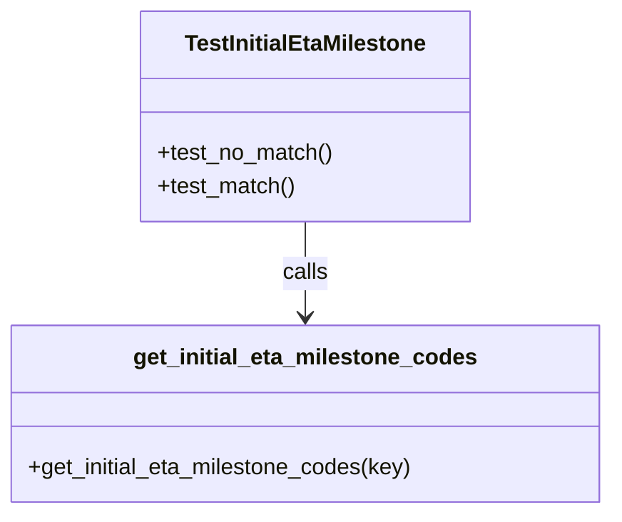

# Diagram: shipment_core/shipment_service/shipment_service/eta/eta_milestone_update/tests/test_config.py


> Auto-generated by Obscura crawlers

## Diagram 1



### SVG

<svg id="container" width="435.796875" xmlns="http://www.w3.org/2000/svg" class="classDiagram" height="366" viewBox="0 0 435.796875 366" role="graphics-document document" aria-roledescription="class"><style>#container{font-family:"trebuchet ms",verdana,arial,sans-serif;font-size:16px;fill:#333;}@keyframes edge-animation-frame{from{stroke-dashoffset:0;}}@keyframes dash{to{stroke-dashoffset:0;}}#container .edge-animation-slow{stroke-dasharray:9,5!important;stroke-dashoffset:900;animation:dash 50s linear infinite;stroke-linecap:round;}#container .edge-animation-fast{stroke-dasharray:9,5!important;stroke-dashoffset:900;animation:dash 20s linear infinite;stroke-linecap:round;}#container .error-icon{fill:#552222;}#container .error-text{fill:#552222;stroke:#552222;}#container .edge-thickness-normal{stroke-width:1px;}#container .edge-thickness-thick{stroke-width:3.5px;}#container .edge-pattern-solid{stroke-dasharray:0;}#container .edge-thickness-invisible{stroke-width:0;fill:none;}#container .edge-pattern-dashed{stroke-dasharray:3;}#container .edge-pattern-dotted{stroke-dasharray:2;}#container .marker{fill:#333333;stroke:#333333;}#container .marker.cross{stroke:#333333;}#container svg{font-family:"trebuchet ms",verdana,arial,sans-serif;font-size:16px;}#container p{margin:0;}#container g.classGroup text{fill:#9370DB;stroke:none;font-family:"trebuchet ms",verdana,arial,sans-serif;font-size:10px;}#container g.classGroup text .title{font-weight:bolder;}#container .nodeLabel,#container .edgeLabel{color:#131300;}#container .edgeLabel .label rect{fill:#ECECFF;}#container .label text{fill:#131300;}#container .labelBkg{background:#ECECFF;}#container .edgeLabel .label span{background:#ECECFF;}#container .classTitle{font-weight:bolder;}#container .node rect,#container .node circle,#container .node ellipse,#container .node polygon,#container .node path{fill:#ECECFF;stroke:#9370DB;stroke-width:1px;}#container .divider{stroke:#9370DB;stroke-width:1;}#container g.clickable{cursor:pointer;}#container g.classGroup rect{fill:#ECECFF;stroke:#9370DB;}#container g.classGroup line{stroke:#9370DB;stroke-width:1;}#container .classLabel .box{stroke:none;stroke-width:0;fill:#ECECFF;opacity:0.5;}#container .classLabel .label{fill:#9370DB;font-size:10px;}#container .relation{stroke:#333333;stroke-width:1;fill:none;}#container .dashed-line{stroke-dasharray:3;}#container .dotted-line{stroke-dasharray:1 2;}#container #compositionStart,#container .composition{fill:#333333!important;stroke:#333333!important;stroke-width:1;}#container #compositionEnd,#container .composition{fill:#333333!important;stroke:#333333!important;stroke-width:1;}#container #dependencyStart,#container .dependency{fill:#333333!important;stroke:#333333!important;stroke-width:1;}#container #dependencyStart,#container .dependency{fill:#333333!important;stroke:#333333!important;stroke-width:1;}#container #extensionStart,#container .extension{fill:transparent!important;stroke:#333333!important;stroke-width:1;}#container #extensionEnd,#container .extension{fill:transparent!important;stroke:#333333!important;stroke-width:1;}#container #aggregationStart,#container .aggregation{fill:transparent!important;stroke:#333333!important;stroke-width:1;}#container #aggregationEnd,#container .aggregation{fill:transparent!important;stroke:#333333!important;stroke-width:1;}#container #lollipopStart,#container .lollipop{fill:#ECECFF!important;stroke:#333333!important;stroke-width:1;}#container #lollipopEnd,#container .lollipop{fill:#ECECFF!important;stroke:#333333!important;stroke-width:1;}#container .edgeTerminals{font-size:11px;line-height:initial;}#container .classTitleText{text-anchor:middle;font-size:18px;fill:#333;}#container .label-icon{display:inline-block;height:1em;overflow:visible;vertical-align:-0.125em;}#container .node .label-icon path{fill:currentColor;stroke:revert;stroke-width:revert;}#container :root{--mermaid-font-family:"trebuchet ms",verdana,arial,sans-serif;}</style><g><defs><marker id="container_class-aggregationStart" class="marker aggregation class" refX="18" refY="7" markerWidth="190" markerHeight="240" orient="auto"><path d="M 18,7 L9,13 L1,7 L9,1 Z"></path></marker></defs><defs><marker id="container_class-aggregationEnd" class="marker aggregation class" refX="1" refY="7" markerWidth="20" markerHeight="28" orient="auto"><path d="M 18,7 L9,13 L1,7 L9,1 Z"></path></marker></defs><defs><marker id="container_class-extensionStart" class="marker extension class" refX="18" refY="7" markerWidth="190" markerHeight="240" orient="auto"><path d="M 1,7 L18,13 V 1 Z"></path></marker></defs><defs><marker id="container_class-extensionEnd" class="marker extension class" refX="1" refY="7" markerWidth="20" markerHeight="28" orient="auto"><path d="M 1,1 V 13 L18,7 Z"></path></marker></defs><defs><marker id="container_class-compositionStart" class="marker composition class" refX="18" refY="7" markerWidth="190" markerHeight="240" orient="auto"><path d="M 18,7 L9,13 L1,7 L9,1 Z"></path></marker></defs><defs><marker id="container_class-compositionEnd" class="marker composition class" refX="1" refY="7" markerWidth="20" markerHeight="28" orient="auto"><path d="M 18,7 L9,13 L1,7 L9,1 Z"></path></marker></defs><defs><marker id="container_class-dependencyStart" class="marker dependency class" refX="6" refY="7" markerWidth="190" markerHeight="240" orient="auto"><path d="M 5,7 L9,13 L1,7 L9,1 Z"></path></marker></defs><defs><marker id="container_class-dependencyEnd" class="marker dependency class" refX="13" refY="7" markerWidth="20" markerHeight="28" orient="auto"><path d="M 18,7 L9,13 L14,7 L9,1 Z"></path></marker></defs><defs><marker id="container_class-lollipopStart" class="marker lollipop class" refX="13" refY="7" markerWidth="190" markerHeight="240" orient="auto"><circle stroke="black" fill="transparent" cx="7" cy="7" r="6"></circle></marker></defs><defs><marker id="container_class-lollipopEnd" class="marker lollipop class" refX="1" refY="7" markerWidth="190" markerHeight="240" orient="auto"><circle stroke="black" fill="transparent" cx="7" cy="7" r="6"></circle></marker></defs><g class="root"><g class="clusters"></g><g class="edgePaths"><path d="M217.898,158L217.898,164.167C217.898,170.333,217.898,182.667,217.898,194C217.898,205.333,217.898,215.667,217.898,220.833L217.898,226" id="id_TestInitialEtaMilestone_get_initial_eta_milestone_codes_1" class="edge-thickness-normal edge-pattern-solid relation" style=";;;" data-edge="true" data-et="edge" data-id="id_TestInitialEtaMilestone_get_initial_eta_milestone_codes_1" data-points="W3sieCI6MjE3Ljg5ODQzNzUsInkiOjE1OH0seyJ4IjoyMTcuODk4NDM3NSwieSI6MTk1fSx7IngiOjIxNy44OTg0Mzc1LCJ5IjoyMzJ9XQ==" marker-end="url(#container_class-dependencyEnd)"></path></g><g class="edgeLabels"><g class="edgeLabel" transform="translate(217.8984375, 195)"><g class="label" data-id="id_TestInitialEtaMilestone_get_initial_eta_milestone_codes_1" transform="translate(-16.4453125, -12)"><foreignObject width="32.890625" height="24"><div xmlns="http://www.w3.org/1999/xhtml" class="labelBkg" style="display: table-cell; white-space: nowrap; line-height: 1.5; max-width: 200px; text-align: center;"><span class="edgeLabel"><p>calls</p></span></div></foreignObject></g></g></g><g class="nodes"><g class="node default" id="classId-TestInitialEtaMilestone-0" transform="translate(217.8984375, 83)"><g class="basic label-container"><path d="M-116.76953125 -75 L116.76953125 -75 L116.76953125 75 L-116.76953125 75" stroke="none" stroke-width="0" fill="#ECECFF" style=""></path><path d="M-116.76953125 -75 C-40.903648920914165 -75, 34.96223340817167 -75, 116.76953125 -75 M-116.76953125 -75 C-31.356182411232112 -75, 54.057166427535776 -75, 116.76953125 -75 M116.76953125 -75 C116.76953125 -35.477917035594565, 116.76953125 4.04416592881087, 116.76953125 75 M116.76953125 -75 C116.76953125 -20.744930117671117, 116.76953125 33.510139764657765, 116.76953125 75 M116.76953125 75 C45.407291272114804 75, -25.95494870577039 75, -116.76953125 75 M116.76953125 75 C69.88005075111832 75, 22.990570252236637 75, -116.76953125 75 M-116.76953125 75 C-116.76953125 19.910869044586583, -116.76953125 -35.17826191082683, -116.76953125 -75 M-116.76953125 75 C-116.76953125 33.9971456571763, -116.76953125 -7.005708685647406, -116.76953125 -75" stroke="#9370DB" stroke-width="1.3" fill="none" stroke-dasharray="0 0" style=""></path></g><g class="annotation-group text" transform="translate(0, -51)"></g><g class="label-group text" transform="translate(-83.7421875, -51)"><g class="label" style="font-weight: bolder" transform="translate(0,-12)"><foreignObject width="167.484375" height="24"><div xmlns="http://www.w3.org/1999/xhtml" style="display: table-cell; white-space: nowrap; line-height: 1.5; max-width: 215px; text-align: center;"><span class="nodeLabel markdown-node-label" style=""><p>TestInitialEtaMilestone</p></span></div></foreignObject></g></g><g class="members-group text" transform="translate(-104.76953125, -3)"></g><g class="methods-group text" transform="translate(-104.76953125, 27)"><g class="label" style="" transform="translate(0,-12)"><foreignObject width="125.796875" height="24"><div xmlns="http://www.w3.org/1999/xhtml" style="display: table-cell; white-space: nowrap; line-height: 1.5; max-width: 183px; text-align: center;"><span class="nodeLabel markdown-node-label" style=""><p>+test_no_match()</p></span></div></foreignObject></g><g class="label" style="" transform="translate(0,12)"><foreignObject width="99.078125" height="24"><div xmlns="http://www.w3.org/1999/xhtml" style="display: table-cell; white-space: nowrap; line-height: 1.5; max-width: 156px; text-align: center;"><span class="nodeLabel markdown-node-label" style=""><p>+test_match()</p></span></div></foreignObject></g></g><g class="divider" style=""><path d="M-116.76953125 -27 C-47.63030754685232 -27, 21.508916156295356 -27, 116.76953125 -27 M-116.76953125 -27 C-38.291459430838174 -27, 40.18661238832365 -27, 116.76953125 -27" stroke="#9370DB" stroke-width="1.3" fill="none" stroke-dasharray="0 0" style=""></path></g><g class="divider" style=""><path d="M-116.76953125 -3 C-41.28151709735266 -3, 34.206497055294676 -3, 116.76953125 -3 M-116.76953125 -3 C-49.235565132611114 -3, 18.29840098477777 -3, 116.76953125 -3" stroke="#9370DB" stroke-width="1.3" fill="none" stroke-dasharray="0 0" style=""></path></g></g><g class="node default" id="classId-get_initial_eta_milestone_codes-1" transform="translate(217.8984375, 295)"><g class="basic label-container"><path d="M-209.8984375 -63 L209.8984375 -63 L209.8984375 63 L-209.8984375 63" stroke="none" stroke-width="0" fill="#ECECFF" style=""></path><path d="M-209.8984375 -63 C-55.51911153150721 -63, 98.86021443698559 -63, 209.8984375 -63 M-209.8984375 -63 C-95.44838432467571 -63, 19.00166885064857 -63, 209.8984375 -63 M209.8984375 -63 C209.8984375 -24.670134094817108, 209.8984375 13.659731810365784, 209.8984375 63 M209.8984375 -63 C209.8984375 -31.237138623004196, 209.8984375 0.5257227539916087, 209.8984375 63 M209.8984375 63 C97.2589202493295 63, -15.380597001340988 63, -209.8984375 63 M209.8984375 63 C119.29276556286379 63, 28.687093625727584 63, -209.8984375 63 M-209.8984375 63 C-209.8984375 25.44485994728972, -209.8984375 -12.110280105420557, -209.8984375 -63 M-209.8984375 63 C-209.8984375 20.664416574216368, -209.8984375 -21.671166851567264, -209.8984375 -63" stroke="#9370DB" stroke-width="1.3" fill="none" stroke-dasharray="0 0" style=""></path></g><g class="annotation-group text" transform="translate(0, -39)"></g><g class="label-group text" transform="translate(-118.546875, -39)"><g class="label" style="font-weight: bolder" transform="translate(0,-12)"><foreignObject width="237.09375" height="24"><div xmlns="http://www.w3.org/1999/xhtml" style="display: table-cell; white-space: nowrap; line-height: 1.5; max-width: 284px; text-align: center;"><span class="nodeLabel markdown-node-label" style=""><p>get_initial_eta_milestone_codes</p></span></div></foreignObject></g></g><g class="members-group text" transform="translate(-197.8984375, 9)"></g><g class="methods-group text" transform="translate(-197.8984375, 39)"><g class="label" style="" transform="translate(0,-12)"><foreignObject width="277.25" height="24"><div xmlns="http://www.w3.org/1999/xhtml" style="display: table-cell; white-space: nowrap; line-height: 1.5; max-width: 335px; text-align: center;"><span class="nodeLabel markdown-node-label" style=""><p>+get_initial_eta_milestone_codes(key)</p></span></div></foreignObject></g></g><g class="divider" style=""><path d="M-209.8984375 -15 C-42.7651406150263 -15, 124.3681562699474 -15, 209.8984375 -15 M-209.8984375 -15 C-122.95414058579533 -15, -36.00984367159066 -15, 209.8984375 -15" stroke="#9370DB" stroke-width="1.3" fill="none" stroke-dasharray="0 0" style=""></path></g><g class="divider" style=""><path d="M-209.8984375 9 C-89.11669640040088 9, 31.665044699198234 9, 209.8984375 9 M-209.8984375 9 C-97.43364560606713 9, 15.031146287865738 9, 209.8984375 9" stroke="#9370DB" stroke-width="1.3" fill="none" stroke-dasharray="0 0" style=""></path></g></g></g></g></g></svg>

## Diagram 2

```mermaid
flowchart TD
    A[TestInitialEtaMilestone.test_no_match] --> B[get_initial_eta_milestone_codes("FV_TEST")]
    B --> C{Result is None?}
    C -->|Yes| D[Assertion passed]
    A2[TestInitialEtaMilestone.test_match] --> E[Set INITIAL_ETA_MILESTONES env var]
    E --> F[get_initial_eta_milestone_codes("FV_DPU_F")]
    F --> G{Result is not None and length == 2?}
    G -->|Yes| H[Assertions: contains "FPGR" and "400"]
    H --> I[Assertion passed]
```

> SVG rendering failed for this diagram.
