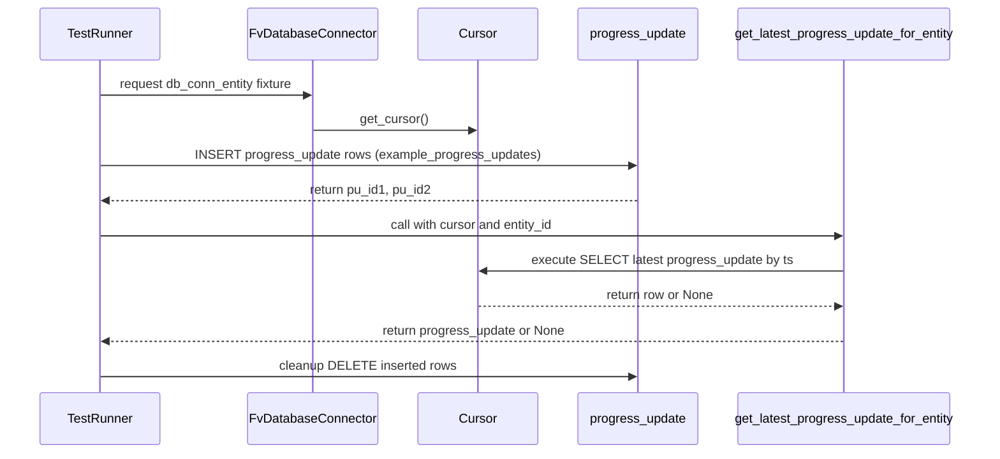
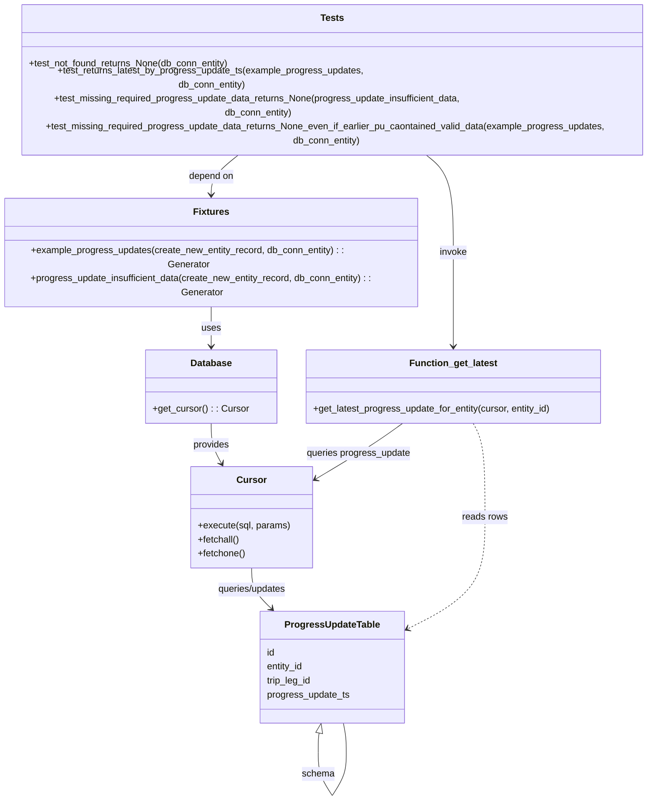

# Diagram: shipment_core/shipment_service/shipment_service/eta/eta_milestone_update/tests/test_db_queries.py

> Auto-generated by Obscura crawlers

## Diagram 1

### SVG

<svg id="container" width="1303.5" xmlns="http://www.w3.org/2000/svg" height="603" viewBox="-50 -10 1303.5 603" role="graphics-document document" aria-roledescription="sequence"><g><rect x="905.5" y="517" fill="#eaeaea" stroke="#666" width="298" height="65" name="Function" rx="3" ry="3" class="actor actor-bottom"></rect><text x="1054.5" y="549.5" dominant-baseline="central" alignment-baseline="central" class="actor actor-box" style="text-anchor: middle; font-size: 16px; font-weight: 400;"><tspan x="1054.5" dy="0">get_latest_progress_update_for_entity</tspan></text></g><g><rect x="705.5" y="517" fill="#eaeaea" stroke="#666" width="150" height="65" name="ProgressUpdateTable" rx="3" ry="3" class="actor actor-bottom"></rect><text x="780.5" y="549.5" dominant-baseline="central" alignment-baseline="central" class="actor actor-box" style="text-anchor: middle; font-size: 16px; font-weight: 400;"><tspan x="780.5" dy="0">progress_update</tspan></text></g><g><rect x="505.5" y="517" fill="#eaeaea" stroke="#666" width="150" height="65" name="Cursor" rx="3" ry="3" class="actor actor-bottom"></rect><text x="580.5" y="549.5" dominant-baseline="central" alignment-baseline="central" class="actor actor-box" style="text-anchor: middle; font-size: 16px; font-weight: 400;"><tspan x="580.5" dy="0">Cursor</tspan></text></g><g><rect x="278.5" y="517" fill="#eaeaea" stroke="#666" width="177" height="65" name="DB" rx="3" ry="3" class="actor actor-bottom"></rect><text x="367" y="549.5" dominant-baseline="central" alignment-baseline="central" class="actor actor-box" style="text-anchor: middle; font-size: 16px; font-weight: 400;"><tspan x="367" dy="0">FvDatabaseConnector</tspan></text></g><g><rect x="0" y="517" fill="#eaeaea" stroke="#666" width="150" height="65" name="TestRunner" rx="3" ry="3" class="actor actor-bottom"></rect><text x="75" y="549.5" dominant-baseline="central" alignment-baseline="central" class="actor actor-box" style="text-anchor: middle; font-size: 16px; font-weight: 400;"><tspan x="75" dy="0">TestRunner</tspan></text></g><g><line id="actor4" x1="1054.5" y1="65" x2="1054.5" y2="517" class="actor-line 200" stroke-width="0.5px" stroke="#999" name="Function"></line><g id="root-4"><rect x="905.5" y="0" fill="#eaeaea" stroke="#666" width="298" height="65" name="Function" rx="3" ry="3" class="actor actor-top"></rect><text x="1054.5" y="32.5" dominant-baseline="central" alignment-baseline="central" class="actor actor-box" style="text-anchor: middle; font-size: 16px; font-weight: 400;"><tspan x="1054.5" dy="0">get_latest_progress_update_for_entity</tspan></text></g></g><g><line id="actor3" x1="780.5" y1="65" x2="780.5" y2="517" class="actor-line 200" stroke-width="0.5px" stroke="#999" name="ProgressUpdateTable"></line><g id="root-3"><rect x="705.5" y="0" fill="#eaeaea" stroke="#666" width="150" height="65" name="ProgressUpdateTable" rx="3" ry="3" class="actor actor-top"></rect><text x="780.5" y="32.5" dominant-baseline="central" alignment-baseline="central" class="actor actor-box" style="text-anchor: middle; font-size: 16px; font-weight: 400;"><tspan x="780.5" dy="0">progress_update</tspan></text></g></g><g><line id="actor2" x1="580.5" y1="65" x2="580.5" y2="517" class="actor-line 200" stroke-width="0.5px" stroke="#999" name="Cursor"></line><g id="root-2"><rect x="505.5" y="0" fill="#eaeaea" stroke="#666" width="150" height="65" name="Cursor" rx="3" ry="3" class="actor actor-top"></rect><text x="580.5" y="32.5" dominant-baseline="central" alignment-baseline="central" class="actor actor-box" style="text-anchor: middle; font-size: 16px; font-weight: 400;"><tspan x="580.5" dy="0">Cursor</tspan></text></g></g><g><line id="actor1" x1="367" y1="65" x2="367" y2="517" class="actor-line 200" stroke-width="0.5px" stroke="#999" name="DB"></line><g id="root-1"><rect x="278.5" y="0" fill="#eaeaea" stroke="#666" width="177" height="65" name="DB" rx="3" ry="3" class="actor actor-top"></rect><text x="367" y="32.5" dominant-baseline="central" alignment-baseline="central" class="actor actor-box" style="text-anchor: middle; font-size: 16px; font-weight: 400;"><tspan x="367" dy="0">FvDatabaseConnector</tspan></text></g></g><g><line id="actor0" x1="75" y1="65" x2="75" y2="517" class="actor-line 200" stroke-width="0.5px" stroke="#999" name="TestRunner"></line><g id="root-0"><rect x="0" y="0" fill="#eaeaea" stroke="#666" width="150" height="65" name="TestRunner" rx="3" ry="3" class="actor actor-top"></rect><text x="75" y="32.5" dominant-baseline="central" alignment-baseline="central" class="actor actor-box" style="text-anchor: middle; font-size: 16px; font-weight: 400;"><tspan x="75" dy="0">TestRunner</tspan></text></g></g><g></g><defs><symbol id="computer" width="24" height="24"><path transform="scale(.5)" d="M2 2v13h20v-13h-20zm18 11h-16v-9h16v9zm-10.228 6l.466-1h3.524l.467 1h-4.457zm14.228 3h-24l2-6h2.104l-1.33 4h18.45l-1.297-4h2.073l2 6zm-5-10h-14v-7h14v7z"></path></symbol></defs><defs><symbol id="database" fill-rule="evenodd" clip-rule="evenodd"><path transform="scale(.5)" d="M12.258.001l.256.004.255.005.253.008.251.01.249.012.247.015.246.016.242.019.241.02.239.023.236.024.233.027.231.028.229.031.225.032.223.034.22.036.217.038.214.04.211.041.208.043.205.045.201.046.198.048.194.05.191.051.187.053.183.054.18.056.175.057.172.059.168.06.163.061.16.063.155.064.15.066.074.033.073.033.071.034.07.034.069.035.068.035.067.035.066.035.064.036.064.036.062.036.06.036.06.037.058.037.058.037.055.038.055.038.053.038.052.038.051.039.05.039.048.039.047.039.045.04.044.04.043.04.041.04.04.041.039.041.037.041.036.041.034.041.033.042.032.042.03.042.029.042.027.042.026.043.024.043.023.043.021.043.02.043.018.044.017.043.015.044.013.044.012.044.011.045.009.044.007.045.006.045.004.045.002.045.001.045v17l-.001.045-.002.045-.004.045-.006.045-.007.045-.009.044-.011.045-.012.044-.013.044-.015.044-.017.043-.018.044-.02.043-.021.043-.023.043-.024.043-.026.043-.027.042-.029.042-.03.042-.032.042-.033.042-.034.041-.036.041-.037.041-.039.041-.04.041-.041.04-.043.04-.044.04-.045.04-.047.039-.048.039-.05.039-.051.039-.052.038-.053.038-.055.038-.055.038-.058.037-.058.037-.06.037-.06.036-.062.036-.064.036-.064.036-.066.035-.067.035-.068.035-.069.035-.07.034-.071.034-.073.033-.074.033-.15.066-.155.064-.16.063-.163.061-.168.06-.172.059-.175.057-.18.056-.183.054-.187.053-.191.051-.194.05-.198.048-.201.046-.205.045-.208.043-.211.041-.214.04-.217.038-.22.036-.223.034-.225.032-.229.031-.231.028-.233.027-.236.024-.239.023-.241.02-.242.019-.246.016-.247.015-.249.012-.251.01-.253.008-.255.005-.256.004-.258.001-.258-.001-.256-.004-.255-.005-.253-.008-.251-.01-.249-.012-.247-.015-.245-.016-.243-.019-.241-.02-.238-.023-.236-.024-.234-.027-.231-.028-.228-.031-.226-.032-.223-.034-.22-.036-.217-.038-.214-.04-.211-.041-.208-.043-.204-.045-.201-.046-.198-.048-.195-.05-.19-.051-.187-.053-.184-.054-.179-.056-.176-.057-.172-.059-.167-.06-.164-.061-.159-.063-.155-.064-.151-.066-.074-.033-.072-.033-.072-.034-.07-.034-.069-.035-.068-.035-.067-.035-.066-.035-.064-.036-.063-.036-.062-.036-.061-.036-.06-.037-.058-.037-.057-.037-.056-.038-.055-.038-.053-.038-.052-.038-.051-.039-.049-.039-.049-.039-.046-.039-.046-.04-.044-.04-.043-.04-.041-.04-.04-.041-.039-.041-.037-.041-.036-.041-.034-.041-.033-.042-.032-.042-.03-.042-.029-.042-.027-.042-.026-.043-.024-.043-.023-.043-.021-.043-.02-.043-.018-.044-.017-.043-.015-.044-.013-.044-.012-.044-.011-.045-.009-.044-.007-.045-.006-.045-.004-.045-.002-.045-.001-.045v-17l.001-.045.002-.045.004-.045.006-.045.007-.045.009-.044.011-.045.012-.044.013-.044.015-.044.017-.043.018-.044.02-.043.021-.043.023-.043.024-.043.026-.043.027-.042.029-.042.03-.042.032-.042.033-.042.034-.041.036-.041.037-.041.039-.041.04-.041.041-.04.043-.04.044-.04.046-.04.046-.039.049-.039.049-.039.051-.039.052-.038.053-.038.055-.038.056-.038.057-.037.058-.037.06-.037.061-.036.062-.036.063-.036.064-.036.066-.035.067-.035.068-.035.069-.035.07-.034.072-.034.072-.033.074-.033.151-.066.155-.064.159-.063.164-.061.167-.06.172-.059.176-.057.179-.056.184-.054.187-.053.19-.051.195-.05.198-.048.201-.046.204-.045.208-.043.211-.041.214-.04.217-.038.22-.036.223-.034.226-.032.228-.031.231-.028.234-.027.236-.024.238-.023.241-.02.243-.019.245-.016.247-.015.249-.012.251-.01.253-.008.255-.005.256-.004.258-.001.258.001zm-9.258 20.499v.01l.001.021.003.021.004.022.005.021.006.022.007.022.009.023.01.022.011.023.012.023.013.023.015.023.016.024.017.023.018.024.019.024.021.024.022.025.023.024.024.025.052.049.056.05.061.051.066.051.07.051.075.051.079.052.084.052.088.052.092.052.097.052.102.051.105.052.11.052.114.051.119.051.123.051.127.05.131.05.135.05.139.048.144.049.147.047.152.047.155.047.16.045.163.045.167.043.171.043.176.041.178.041.183.039.187.039.19.037.194.035.197.035.202.033.204.031.209.03.212.029.216.027.219.025.222.024.226.021.23.02.233.018.236.016.24.015.243.012.246.01.249.008.253.005.256.004.259.001.26-.001.257-.004.254-.005.25-.008.247-.011.244-.012.241-.014.237-.016.233-.018.231-.021.226-.021.224-.024.22-.026.216-.027.212-.028.21-.031.205-.031.202-.034.198-.034.194-.036.191-.037.187-.039.183-.04.179-.04.175-.042.172-.043.168-.044.163-.045.16-.046.155-.046.152-.047.148-.048.143-.049.139-.049.136-.05.131-.05.126-.05.123-.051.118-.052.114-.051.11-.052.106-.052.101-.052.096-.052.092-.052.088-.053.083-.051.079-.052.074-.052.07-.051.065-.051.06-.051.056-.05.051-.05.023-.024.023-.025.021-.024.02-.024.019-.024.018-.024.017-.024.015-.023.014-.024.013-.023.012-.023.01-.023.01-.022.008-.022.006-.022.006-.022.004-.022.004-.021.001-.021.001-.021v-4.127l-.077.055-.08.053-.083.054-.085.053-.087.052-.09.052-.093.051-.095.05-.097.05-.1.049-.102.049-.105.048-.106.047-.109.047-.111.046-.114.045-.115.045-.118.044-.12.043-.122.042-.124.042-.126.041-.128.04-.13.04-.132.038-.134.038-.135.037-.138.037-.139.035-.142.035-.143.034-.144.033-.147.032-.148.031-.15.03-.151.03-.153.029-.154.027-.156.027-.158.026-.159.025-.161.024-.162.023-.163.022-.165.021-.166.02-.167.019-.169.018-.169.017-.171.016-.173.015-.173.014-.175.013-.175.012-.177.011-.178.01-.179.008-.179.008-.181.006-.182.005-.182.004-.184.003-.184.002h-.37l-.184-.002-.184-.003-.182-.004-.182-.005-.181-.006-.179-.008-.179-.008-.178-.01-.176-.011-.176-.012-.175-.013-.173-.014-.172-.015-.171-.016-.17-.017-.169-.018-.167-.019-.166-.02-.165-.021-.163-.022-.162-.023-.161-.024-.159-.025-.157-.026-.156-.027-.155-.027-.153-.029-.151-.03-.15-.03-.148-.031-.146-.032-.145-.033-.143-.034-.141-.035-.14-.035-.137-.037-.136-.037-.134-.038-.132-.038-.13-.04-.128-.04-.126-.041-.124-.042-.122-.042-.12-.044-.117-.043-.116-.045-.113-.045-.112-.046-.109-.047-.106-.047-.105-.048-.102-.049-.1-.049-.097-.05-.095-.05-.093-.052-.09-.051-.087-.052-.085-.053-.083-.054-.08-.054-.077-.054v4.127zm0-5.654v.011l.001.021.003.021.004.021.005.022.006.022.007.022.009.022.01.022.011.023.012.023.013.023.015.024.016.023.017.024.018.024.019.024.021.024.022.024.023.025.024.024.052.05.056.05.061.05.066.051.07.051.075.052.079.051.084.052.088.052.092.052.097.052.102.052.105.052.11.051.114.051.119.052.123.05.127.051.131.05.135.049.139.049.144.048.147.048.152.047.155.046.16.045.163.045.167.044.171.042.176.042.178.04.183.04.187.038.19.037.194.036.197.034.202.033.204.032.209.03.212.028.216.027.219.025.222.024.226.022.23.02.233.018.236.016.24.014.243.012.246.01.249.008.253.006.256.003.259.001.26-.001.257-.003.254-.006.25-.008.247-.01.244-.012.241-.015.237-.016.233-.018.231-.02.226-.022.224-.024.22-.025.216-.027.212-.029.21-.03.205-.032.202-.033.198-.035.194-.036.191-.037.187-.039.183-.039.179-.041.175-.042.172-.043.168-.044.163-.045.16-.045.155-.047.152-.047.148-.048.143-.048.139-.05.136-.049.131-.05.126-.051.123-.051.118-.051.114-.052.11-.052.106-.052.101-.052.096-.052.092-.052.088-.052.083-.052.079-.052.074-.051.07-.052.065-.051.06-.05.056-.051.051-.049.023-.025.023-.024.021-.025.02-.024.019-.024.018-.024.017-.024.015-.023.014-.023.013-.024.012-.022.01-.023.01-.023.008-.022.006-.022.006-.022.004-.021.004-.022.001-.021.001-.021v-4.139l-.077.054-.08.054-.083.054-.085.052-.087.053-.09.051-.093.051-.095.051-.097.05-.1.049-.102.049-.105.048-.106.047-.109.047-.111.046-.114.045-.115.044-.118.044-.12.044-.122.042-.124.042-.126.041-.128.04-.13.039-.132.039-.134.038-.135.037-.138.036-.139.036-.142.035-.143.033-.144.033-.147.033-.148.031-.15.03-.151.03-.153.028-.154.028-.156.027-.158.026-.159.025-.161.024-.162.023-.163.022-.165.021-.166.02-.167.019-.169.018-.169.017-.171.016-.173.015-.173.014-.175.013-.175.012-.177.011-.178.009-.179.009-.179.007-.181.007-.182.005-.182.004-.184.003-.184.002h-.37l-.184-.002-.184-.003-.182-.004-.182-.005-.181-.007-.179-.007-.179-.009-.178-.009-.176-.011-.176-.012-.175-.013-.173-.014-.172-.015-.171-.016-.17-.017-.169-.018-.167-.019-.166-.02-.165-.021-.163-.022-.162-.023-.161-.024-.159-.025-.157-.026-.156-.027-.155-.028-.153-.028-.151-.03-.15-.03-.148-.031-.146-.033-.145-.033-.143-.033-.141-.035-.14-.036-.137-.036-.136-.037-.134-.038-.132-.039-.13-.039-.128-.04-.126-.041-.124-.042-.122-.043-.12-.043-.117-.044-.116-.044-.113-.046-.112-.046-.109-.046-.106-.047-.105-.048-.102-.049-.1-.049-.097-.05-.095-.051-.093-.051-.09-.051-.087-.053-.085-.052-.083-.054-.08-.054-.077-.054v4.139zm0-5.666v.011l.001.02.003.022.004.021.005.022.006.021.007.022.009.023.01.022.011.023.012.023.013.023.015.023.016.024.017.024.018.023.019.024.021.025.022.024.023.024.024.025.052.05.056.05.061.05.066.051.07.051.075.052.079.051.084.052.088.052.092.052.097.052.102.052.105.051.11.052.114.051.119.051.123.051.127.05.131.05.135.05.139.049.144.048.147.048.152.047.155.046.16.045.163.045.167.043.171.043.176.042.178.04.183.04.187.038.19.037.194.036.197.034.202.033.204.032.209.03.212.028.216.027.219.025.222.024.226.021.23.02.233.018.236.017.24.014.243.012.246.01.249.008.253.006.256.003.259.001.26-.001.257-.003.254-.006.25-.008.247-.01.244-.013.241-.014.237-.016.233-.018.231-.02.226-.022.224-.024.22-.025.216-.027.212-.029.21-.03.205-.032.202-.033.198-.035.194-.036.191-.037.187-.039.183-.039.179-.041.175-.042.172-.043.168-.044.163-.045.16-.045.155-.047.152-.047.148-.048.143-.049.139-.049.136-.049.131-.051.126-.05.123-.051.118-.052.114-.051.11-.052.106-.052.101-.052.096-.052.092-.052.088-.052.083-.052.079-.052.074-.052.07-.051.065-.051.06-.051.056-.05.051-.049.023-.025.023-.025.021-.024.02-.024.019-.024.018-.024.017-.024.015-.023.014-.024.013-.023.012-.023.01-.022.01-.023.008-.022.006-.022.006-.022.004-.022.004-.021.001-.021.001-.021v-4.153l-.077.054-.08.054-.083.053-.085.053-.087.053-.09.051-.093.051-.095.051-.097.05-.1.049-.102.048-.105.048-.106.048-.109.046-.111.046-.114.046-.115.044-.118.044-.12.043-.122.043-.124.042-.126.041-.128.04-.13.039-.132.039-.134.038-.135.037-.138.036-.139.036-.142.034-.143.034-.144.033-.147.032-.148.032-.15.03-.151.03-.153.028-.154.028-.156.027-.158.026-.159.024-.161.024-.162.023-.163.023-.165.021-.166.02-.167.019-.169.018-.169.017-.171.016-.173.015-.173.014-.175.013-.175.012-.177.01-.178.01-.179.009-.179.007-.181.006-.182.006-.182.004-.184.003-.184.001-.185.001-.185-.001-.184-.001-.184-.003-.182-.004-.182-.006-.181-.006-.179-.007-.179-.009-.178-.01-.176-.01-.176-.012-.175-.013-.173-.014-.172-.015-.171-.016-.17-.017-.169-.018-.167-.019-.166-.02-.165-.021-.163-.023-.162-.023-.161-.024-.159-.024-.157-.026-.156-.027-.155-.028-.153-.028-.151-.03-.15-.03-.148-.032-.146-.032-.145-.033-.143-.034-.141-.034-.14-.036-.137-.036-.136-.037-.134-.038-.132-.039-.13-.039-.128-.041-.126-.041-.124-.041-.122-.043-.12-.043-.117-.044-.116-.044-.113-.046-.112-.046-.109-.046-.106-.048-.105-.048-.102-.048-.1-.05-.097-.049-.095-.051-.093-.051-.09-.052-.087-.052-.085-.053-.083-.053-.08-.054-.077-.054v4.153zm8.74-8.179l-.257.004-.254.005-.25.008-.247.011-.244.012-.241.014-.237.016-.233.018-.231.021-.226.022-.224.023-.22.026-.216.027-.212.028-.21.031-.205.032-.202.033-.198.034-.194.036-.191.038-.187.038-.183.04-.179.041-.175.042-.172.043-.168.043-.163.045-.16.046-.155.046-.152.048-.148.048-.143.048-.139.049-.136.05-.131.05-.126.051-.123.051-.118.051-.114.052-.11.052-.106.052-.101.052-.096.052-.092.052-.088.052-.083.052-.079.052-.074.051-.07.052-.065.051-.06.05-.056.05-.051.05-.023.025-.023.024-.021.024-.02.025-.019.024-.018.024-.017.023-.015.024-.014.023-.013.023-.012.023-.01.023-.01.022-.008.022-.006.023-.006.021-.004.022-.004.021-.001.021-.001.021.001.021.001.021.004.021.004.022.006.021.006.023.008.022.01.022.01.023.012.023.013.023.014.023.015.024.017.023.018.024.019.024.02.025.021.024.023.024.023.025.051.05.056.05.06.05.065.051.07.052.074.051.079.052.083.052.088.052.092.052.096.052.101.052.106.052.11.052.114.052.118.051.123.051.126.051.131.05.136.05.139.049.143.048.148.048.152.048.155.046.16.046.163.045.168.043.172.043.175.042.179.041.183.04.187.038.191.038.194.036.198.034.202.033.205.032.21.031.212.028.216.027.22.026.224.023.226.022.231.021.233.018.237.016.241.014.244.012.247.011.25.008.254.005.257.004.26.001.26-.001.257-.004.254-.005.25-.008.247-.011.244-.012.241-.014.237-.016.233-.018.231-.021.226-.022.224-.023.22-.026.216-.027.212-.028.21-.031.205-.032.202-.033.198-.034.194-.036.191-.038.187-.038.183-.04.179-.041.175-.042.172-.043.168-.043.163-.045.16-.046.155-.046.152-.048.148-.048.143-.048.139-.049.136-.05.131-.05.126-.051.123-.051.118-.051.114-.052.11-.052.106-.052.101-.052.096-.052.092-.052.088-.052.083-.052.079-.052.074-.051.07-.052.065-.051.06-.05.056-.05.051-.05.023-.025.023-.024.021-.024.02-.025.019-.024.018-.024.017-.023.015-.024.014-.023.013-.023.012-.023.01-.023.01-.022.008-.022.006-.023.006-.021.004-.022.004-.021.001-.021.001-.021-.001-.021-.001-.021-.004-.021-.004-.022-.006-.021-.006-.023-.008-.022-.01-.022-.01-.023-.012-.023-.013-.023-.014-.023-.015-.024-.017-.023-.018-.024-.019-.024-.02-.025-.021-.024-.023-.024-.023-.025-.051-.05-.056-.05-.06-.05-.065-.051-.07-.052-.074-.051-.079-.052-.083-.052-.088-.052-.092-.052-.096-.052-.101-.052-.106-.052-.11-.052-.114-.052-.118-.051-.123-.051-.126-.051-.131-.05-.136-.05-.139-.049-.143-.048-.148-.048-.152-.048-.155-.046-.16-.046-.163-.045-.168-.043-.172-.043-.175-.042-.179-.041-.183-.04-.187-.038-.191-.038-.194-.036-.198-.034-.202-.033-.205-.032-.21-.031-.212-.028-.216-.027-.22-.026-.224-.023-.226-.022-.231-.021-.233-.018-.237-.016-.241-.014-.244-.012-.247-.011-.25-.008-.254-.005-.257-.004-.26-.001-.26.001z"></path></symbol></defs><defs><symbol id="clock" width="24" height="24"><path transform="scale(.5)" d="M12 2c5.514 0 10 4.486 10 10s-4.486 10-10 10-10-4.486-10-10 4.486-10 10-10zm0-2c-6.627 0-12 5.373-12 12s5.373 12 12 12 12-5.373 12-12-5.373-12-12-12zm5.848 12.459c.202.038.202.333.001.372-1.907.361-6.045 1.111-6.547 1.111-.719 0-1.301-.582-1.301-1.301 0-.512.77-5.447 1.125-7.445.034-.192.312-.181.343.014l.985 6.238 5.394 1.011z"></path></symbol></defs><defs><marker id="arrowhead" refX="7.9" refY="5" markerUnits="userSpaceOnUse" markerWidth="12" markerHeight="12" orient="auto-start-reverse"><path d="M -1 0 L 10 5 L 0 10 z"></path></marker></defs><defs><marker id="crosshead" markerWidth="15" markerHeight="8" orient="auto" refX="4" refY="4.5"><path fill="none" stroke="#000000" stroke-width="1pt" d="M 1,2 L 6,7 M 6,2 L 1,7" style="stroke-dasharray: 0, 0;"></path></marker></defs><defs><marker id="filled-head" refX="15.5" refY="7" markerWidth="20" markerHeight="28" orient="auto"><path d="M 18,7 L9,13 L14,7 L9,1 Z"></path></marker></defs><defs><marker id="sequencenumber" refX="15" refY="15" markerWidth="60" markerHeight="40" orient="auto"><circle cx="15" cy="15" r="6"></circle></marker></defs><text x="220" y="80" text-anchor="middle" dominant-baseline="middle" alignment-baseline="middle" class="messageText" dy="1em" style="font-size: 16px; font-weight: 400;">request db_conn_entity fixture</text><line x1="76" y1="113" x2="363" y2="113" class="messageLine0" stroke-width="2" stroke="none" marker-end="url(#arrowhead)" style="fill: none;"></line><text x="472" y="128" text-anchor="middle" dominant-baseline="middle" alignment-baseline="middle" class="messageText" dy="1em" style="font-size: 16px; font-weight: 400;">get_cursor()</text><line x1="368" y1="161" x2="576.5" y2="161" class="messageLine0" stroke-width="2" stroke="none" marker-end="url(#arrowhead)" style="fill: none;"></line><text x="426" y="176" text-anchor="middle" dominant-baseline="middle" alignment-baseline="middle" class="messageText" dy="1em" style="font-size: 16px; font-weight: 400;">INSERT progress_update rows (example_progress_updates)</text><line x1="76" y1="209" x2="776.5" y2="209" class="messageLine0" stroke-width="2" stroke="none" marker-end="url(#arrowhead)" style="fill: none;"></line><text x="429" y="224" text-anchor="middle" dominant-baseline="middle" alignment-baseline="middle" class="messageText" dy="1em" style="font-size: 16px; font-weight: 400;">return pu_id1, pu_id2</text><line x1="779.5" y1="257" x2="79" y2="257" class="messageLine1" stroke-width="2" stroke="none" marker-end="url(#arrowhead)" style="stroke-dasharray: 3, 3; fill: none;"></line><text x="563" y="272" text-anchor="middle" dominant-baseline="middle" alignment-baseline="middle" class="messageText" dy="1em" style="font-size: 16px; font-weight: 400;">call with cursor and entity_id</text><line x1="76" y1="305" x2="1050.5" y2="305" class="messageLine0" stroke-width="2" stroke="none" marker-end="url(#arrowhead)" style="fill: none;"></line><text x="819" y="320" text-anchor="middle" dominant-baseline="middle" alignment-baseline="middle" class="messageText" dy="1em" style="font-size: 16px; font-weight: 400;">execute SELECT latest progress_update by ts</text><line x1="1053.5" y1="353" x2="584.5" y2="353" class="messageLine0" stroke-width="2" stroke="none" marker-end="url(#arrowhead)" style="fill: none;"></line><text x="816" y="368" text-anchor="middle" dominant-baseline="middle" alignment-baseline="middle" class="messageText" dy="1em" style="font-size: 16px; font-weight: 400;">return row or None</text><line x1="581.5" y1="401" x2="1050.5" y2="401" class="messageLine1" stroke-width="2" stroke="none" marker-end="url(#arrowhead)" style="stroke-dasharray: 3, 3; fill: none;"></line><text x="566" y="416" text-anchor="middle" dominant-baseline="middle" alignment-baseline="middle" class="messageText" dy="1em" style="font-size: 16px; font-weight: 400;">return progress_update or None</text><line x1="1053.5" y1="449" x2="79" y2="449" class="messageLine1" stroke-width="2" stroke="none" marker-end="url(#arrowhead)" style="stroke-dasharray: 3, 3; fill: none;"></line><text x="426" y="464" text-anchor="middle" dominant-baseline="middle" alignment-baseline="middle" class="messageText" dy="1em" style="font-size: 16px; font-weight: 400;">cleanup DELETE inserted rows</text><line x1="76" y1="497" x2="776.5" y2="497" class="messageLine0" stroke-width="2" stroke="none" marker-end="url(#arrowhead)" style="fill: none;"></line></svg>

## Diagram 2

### SVG

<svg id="container" width="1152.439453125" xmlns="http://www.w3.org/2000/svg" class="classDiagram" height="1276.25" viewBox="0 0 1152.439453125 1276.25" role="graphics-document document" aria-roledescription="class"><g><defs><marker id="container_class-aggregationStart" class="marker aggregation class" refX="18" refY="7" markerWidth="190" markerHeight="240" orient="auto"><path d="M 18,7 L9,13 L1,7 L9,1 Z"></path></marker></defs><defs><marker id="container_class-aggregationEnd" class="marker aggregation class" refX="1" refY="7" markerWidth="20" markerHeight="28" orient="auto"><path d="M 18,7 L9,13 L1,7 L9,1 Z"></path></marker></defs><defs><marker id="container_class-extensionStart" class="marker extension class" refX="18" refY="7" markerWidth="190" markerHeight="240" orient="auto"><path d="M 1,7 L18,13 V 1 Z"></path></marker></defs><defs><marker id="container_class-extensionEnd" class="marker extension class" refX="1" refY="7" markerWidth="20" markerHeight="28" orient="auto"><path d="M 1,1 V 13 L18,7 Z"></path></marker></defs><defs><marker id="container_class-compositionStart" class="marker composition class" refX="18" refY="7" markerWidth="190" markerHeight="240" orient="auto"><path d="M 18,7 L9,13 L1,7 L9,1 Z"></path></marker></defs><defs><marker id="container_class-compositionEnd" class="marker composition class" refX="1" refY="7" markerWidth="20" markerHeight="28" orient="auto"><path d="M 18,7 L9,13 L1,7 L9,1 Z"></path></marker></defs><defs><marker id="container_class-dependencyStart" class="marker dependency class" refX="6" refY="7" markerWidth="190" markerHeight="240" orient="auto"><path d="M 5,7 L9,13 L1,7 L9,1 Z"></path></marker></defs><defs><marker id="container_class-dependencyEnd" class="marker dependency class" refX="13" refY="7" markerWidth="20" markerHeight="28" orient="auto"><path d="M 18,7 L9,13 L14,7 L9,1 Z"></path></marker></defs><defs><marker id="container_class-lollipopStart" class="marker lollipop class" refX="13" refY="7" markerWidth="190" markerHeight="240" orient="auto"><circle stroke="black" fill="transparent" cx="7" cy="7" r="6"></circle></marker></defs><defs><marker id="container_class-lollipopEnd" class="marker lollipop class" refX="1" refY="7" markerWidth="190" markerHeight="240" orient="auto"><circle stroke="black" fill="transparent" cx="7" cy="7" r="6"></circle></marker></defs><g class="root"><g class="clusters"></g><g class="edgePaths"><path d="M368.715,430L368.715,436.167C368.715,442.333,368.715,454.667,368.715,466C368.715,477.333,368.715,487.667,368.715,492.833L368.715,498" id="id_Fixtures_Database_1" class="edge-thickness-normal edge-pattern-solid relation" style=";;;" data-edge="true" data-et="edge" data-id="id_Fixtures_Database_1" data-points="W3sieCI6MzY4LjcxNDg0Mzc1LCJ5Ijo0MzB9LHsieCI6MzY4LjcxNDg0Mzc1LCJ5Ijo0Njd9LHsieCI6MzY4LjcxNDg0Mzc1LCJ5Ijo1MDR9XQ==" marker-end="url(#container_class-dependencyEnd)"></path><path d="M368.715,630L368.715,636.167C368.715,642.333,368.715,654.667,371.732,666.131C374.748,677.595,380.781,688.191,383.798,693.488L386.815,698.786" id="id_Database_Cursor_2" class="edge-thickness-normal edge-pattern-solid relation" style=";;;" data-edge="true" data-et="edge" data-id="id_Database_Cursor_2" data-points="W3sieCI6MzY4LjcxNDg0Mzc1LCJ5Ijo2MzB9LHsieCI6MzY4LjcxNDg0Mzc1LCJ5Ijo2Njd9LHsieCI6Mzg5Ljc4Mzc3MDE2MTI5MDMsInkiOjcwNH1d" marker-end="url(#container_class-dependencyEnd)"></path><path d="M439.324,878L439.324,884.167C439.324,890.333,439.324,902.667,445.054,914.309C450.784,925.952,462.244,936.903,467.974,942.379L473.704,947.855" id="id_Cursor_ProgressUpdateTable_3" class="edge-thickness-normal edge-pattern-solid relation" style=";;;" data-edge="true" data-et="edge" data-id="id_Cursor_ProgressUpdateTable_3" data-points="W3sieCI6NDM5LjMyNDIxODc1LCJ5Ijo4Nzh9LHsieCI6NDM5LjMyNDIxODc1LCJ5Ijo5MTV9LHsieCI6NDc4LjA0MTc0OTg4MjUxODgsInkiOjk1Mn1d" marker-end="url(#container_class-dependencyEnd)"></path><path d="M425.788,206L416.276,212.167C406.764,218.333,387.739,230.667,378.227,242C368.715,253.333,368.715,263.667,368.715,268.833L368.715,274" id="id_Tests_Fixtures_4" class="edge-thickness-normal edge-pattern-solid relation" style=";;;" data-edge="true" data-et="edge" data-id="id_Tests_Fixtures_4" data-points="W3sieCI6NDI1Ljc4ODIxNTE4ODQxOTE0LCJ5IjoyMDZ9LHsieCI6MzY4LjcxNDg0Mzc1LCJ5IjoyNDN9LHsieCI6MzY4LjcxNDg0Mzc1LCJ5IjoyODB9XQ==" marker-end="url(#container_class-dependencyEnd)"></path><path d="M731.208,206L740.72,212.167C750.232,218.333,769.257,230.667,778.769,255.5C788.281,280.333,788.281,317.667,788.281,355C788.281,392.333,788.281,429.667,788.281,453.5C788.281,477.333,788.281,487.667,788.281,492.833L788.281,498" id="id_Tests_Function_get_latest_5" class="edge-thickness-normal edge-pattern-solid relation" style=";;;" data-edge="true" data-et="edge" data-id="id_Tests_Function_get_latest_5" data-points="W3sieCI6NzMxLjIwNzg3ODU2MTU4MDksInkiOjIwNn0seyJ4Ijo3ODguMjgxMjUsInkiOjI0M30seyJ4Ijo3ODguMjgxMjUsInkiOjM1NX0seyJ4Ijo3ODguMjgxMjUsInkiOjQ2N30seyJ4Ijo3ODguMjgxMjUsInkiOjUwNH1d" marker-end="url(#container_class-dependencyEnd)"></path><path d="M700.602,630L692.019,636.167C683.437,642.333,666.272,654.667,640.725,670.861C615.177,687.056,581.247,707.111,564.282,717.139L547.318,727.167" id="id_Function_get_latest_Cursor_6" class="edge-thickness-normal edge-pattern-solid relation" style=";;;" data-edge="true" data-et="edge" data-id="id_Function_get_latest_Cursor_6" data-points="W3sieCI6NzAwLjYwMTczODI4MTI0OTksInkiOjYzMH0seyJ4Ijo2NDkuMTA3NDIxODc1LCJ5Ijo2Njd9LHsieCI6NTQyLjE1MjM0Mzc1LCJ5Ijo3MzAuMjE5NjkyOTQ5MzgwNH1d" marker-end="url(#container_class-dependencyEnd)"></path><path d="M556.184,1160.923L555.918,1162.269C555.652,1163.615,555.12,1166.308,554.854,1171.82C554.588,1177.333,554.588,1185.667,554.588,1189.833L554.588,1194" id="ProgressUpdateTable-cyclic-special-1" class="edge-thickness-normal edge-pattern-solid relation" style=";;;" data-edge="true" data-et="edge" data-id="ProgressUpdateTable-cyclic-special-1" data-points="W3sieCI6NTU5LjUyODAwNTU1MjY4NiwieSI6MTE0NH0seyJ4Ijo1NTQuNTg3ODkwNjI1LCJ5IjoxMTY5fSx7IngiOjU1NC41ODc4OTA2MjUsInkiOjExOTR9XQ==" marker-start="url(#container_class-extensionStart)"></path><path d="M554.588,1194.1L554.588,1200.267C554.588,1206.433,554.588,1218.767,558.568,1231.1C562.547,1243.433,570.506,1255.767,574.486,1261.933L578.466,1268.1" id="ProgressUpdateTable-cyclic-special-mid" class="edge-thickness-normal edge-pattern-solid relation" style=";;;" data-edge="true" data-et="edge" data-id="ProgressUpdateTable-cyclic-special-mid" data-points="W3sieCI6NTU0LjU4Nzg5MDYyNSwieSI6MTE5NC4xMDAwMDAwMDE0OTAxfSx7IngiOjU1NC41ODc4OTA2MjUsInkiOjEyMzEuMTAwMDAwMDAxNDkwMX0seyJ4Ijo1NzguNDY1Nzc5NDU3MTc4NCwieSI6MTI2OC4xMDAwMDAwMDE0OTAxfV0="></path><path d="M578.53,1268.1L582.51,1261.933C586.49,1255.767,594.449,1243.433,598.429,1231.092C602.408,1218.75,602.408,1206.4,602.408,1196.05C602.408,1185.7,602.408,1177.35,601.585,1169.008C600.761,1160.667,599.115,1152.333,598.291,1148.167L597.468,1144" id="ProgressUpdateTable-cyclic-special-2" class="edge-thickness-normal edge-pattern-solid relation" style=";;;" data-edge="true" data-et="edge" data-id="ProgressUpdateTable-cyclic-special-2" data-points="W3sieCI6NTc4LjUzMDMxNDI5MjgyMTYsInkiOjEyNjguMTAwMDAwMDAxNDkwMX0seyJ4Ijo2MDIuNDA4MjAzMTI1LCJ5IjoxMjMxLjEwMDAwMDAwMTQ5MDF9LHsieCI6NjAyLjQwODIwMzEyNSwieSI6MTE5NC4wNTAwMDAwMDA3NDV9LHsieCI6NjAyLjQwODIwMzEyNSwieSI6MTE2OX0seyJ4Ijo1OTcuNDY4MDg4MTk3MzE0LCJ5IjoxMTQ0fV0="></path><path d="M822.902,630L826.29,636.167C829.679,642.333,836.457,654.667,839.846,681.5C843.234,708.333,843.234,749.667,843.234,791C843.234,832.333,843.234,873.667,820.35,905.83C797.466,937.993,751.698,960.987,728.814,972.483L705.93,983.98" id="id_Function_get_latest_ProgressUpdateTable_8" class="edge-thickness-normal edge-pattern-dashed relation" style=";;;" data-edge="true" data-et="edge" data-id="id_Function_get_latest_ProgressUpdateTable_8" data-points="W3sieCI6ODIyLjkwMTcxODc1LCJ5Ijo2MzB9LHsieCI6ODQzLjIzNDM3NSwieSI6NjY3fSx7IngiOjg0My4yMzQzNzUsInkiOjc5MX0seyJ4Ijo4NDMuMjM0Mzc1LCJ5Ijo5MTV9LHsieCI6NzAwLjU2ODM1OTM3NSwieSI6OTg2LjY3MzUwMzI2NDU5ODV9XQ==" marker-end="url(#container_class-dependencyEnd)"></path></g><g class="edgeLabels"><g class="edgeLabel" transform="translate(368.71484375, 467)"><g class="label" data-id="id_Fixtures_Database_1" transform="translate(-16.4921875, -12)"><foreignObject width="32.984375" height="24">

uses

</foreignObject></g></g><g class="edgeLabel" transform="translate(368.71484375, 667)"><g class="label" data-id="id_Database_Cursor_2" transform="translate(-31.3125, -12)"><foreignObject width="62.625" height="24">

provides

</foreignObject></g></g><g class="edgeLabel" transform="translate(439.32421875, 915)"><g class="label" data-id="id_Cursor_ProgressUpdateTable_3" transform="translate(-60.5703125, -12)"><foreignObject width="121.140625" height="24">

queries/updates

</foreignObject></g></g><g class="edgeLabel" transform="translate(368.71484375, 243)"><g class="label" data-id="id_Tests_Fixtures_4" transform="translate(-39.2109375, -12)"><foreignObject width="78.421875" height="24">

depend on

</foreignObject></g></g><g class="edgeLabel" transform="translate(788.28125, 355)"><g class="label" data-id="id_Tests_Function_get_latest_5" transform="translate(-23.8515625, -12)"><foreignObject width="47.703125" height="24">

invoke

</foreignObject></g></g><g class="edgeLabel" transform="translate(622.92288, 682.47732)"><g class="label" data-id="id_Function_get_latest_Cursor_6" transform="translate(-89.90625, -12)"><foreignObject width="179.8125" height="24">

queries progress_update

</foreignObject></g></g><g class="edgeLabel"><g class="label" data-id="ProgressUpdateTable-cyclic-special-1" transform="translate(0, 0)"><foreignObject width="0" height="0">

</foreignObject></g></g><g class="edgeLabel" transform="translate(554.587890625, 1231.1000000014901)"><g class="label" data-id="ProgressUpdateTable-cyclic-special-mid" transform="translate(-27.8203125, -12)"><foreignObject width="55.640625" height="24">

schema

</foreignObject></g></g><g class="edgeLabel"><g class="label" data-id="ProgressUpdateTable-cyclic-special-2" transform="translate(0, 0)"><foreignObject width="0" height="0">

</foreignObject></g></g><g class="edgeLabel" transform="translate(843.234375, 791)"><g class="label" data-id="id_Function_get_latest_ProgressUpdateTable_8" transform="translate(-39.1171875, -12)"><foreignObject width="78.234375" height="24">

reads rows

</foreignObject></g></g></g><g class="nodes"><g class="node default" id="classId-Fixtures-0" transform="translate(368.71484375, 355)"><g class="basic label-container"><path d="M-360.71484375 -75 L360.71484375 -75 L360.71484375 75 L-360.71484375 75" stroke="none" stroke-width="0" fill="#ECECFF" style=""></path><path d="M-360.71484375 -75 C-174.33998127862156 -75, 12.03488119275687 -75, 360.71484375 -75 M-360.71484375 -75 C-91.79377426501964 -75, 177.12729521996073 -75, 360.71484375 -75 M360.71484375 -75 C360.71484375 -25.269262149502616, 360.71484375 24.461475700994768, 360.71484375 75 M360.71484375 -75 C360.71484375 -23.579781244212228, 360.71484375 27.840437511575544, 360.71484375 75 M360.71484375 75 C147.93099776453556 75, -64.85284822092888 75, -360.71484375 75 M360.71484375 75 C128.00589286232756 75, -104.70305802534489 75, -360.71484375 75 M-360.71484375 75 C-360.71484375 21.74481021087253, -360.71484375 -31.51037957825494, -360.71484375 -75 M-360.71484375 75 C-360.71484375 34.286276495427586, -360.71484375 -6.427447009144828, -360.71484375 -75" stroke="#9370DB" stroke-width="1.3" fill="none" stroke-dasharray="0 0" style=""></path></g><g class="annotation-group text" transform="translate(0, -51)"></g><g class="label-group text" transform="translate(-28.9296875, -51)"><g class="label" style="font-weight: bolder" transform="translate(0,-12)"><foreignObject width="57.859375" height="24">

Fixtures

</foreignObject></g></g><g class="members-group text" transform="translate(-348.71484375, -3)"></g><g class="methods-group text" transform="translate(-348.71484375, 27)"><g class="label" style="" transform="translate(0,-12)"><foreignObject width="615.421875" height="24">

+example_progress_updates(create_new_entity_record, db_conn_entity) : : Generator

</foreignObject></g><g class="label" style="" transform="translate(0,12)"><foreignObject width="668.5" height="24">

+progress_update_insufficient_data(create_new_entity_record, db_conn_entity) : : Generator

</foreignObject></g></g><g class="divider" style=""><path d="M-360.71484375 -27 C-181.07196689652122 -27, -1.4290900430424358 -27, 360.71484375 -27 M-360.71484375 -27 C-191.81094373968267 -27, -22.90704372936534 -27, 360.71484375 -27" stroke="#9370DB" stroke-width="1.3" fill="none" stroke-dasharray="0 0" style=""></path></g><g class="divider" style=""><path d="M-360.71484375 -3 C-152.4597310558418 -3, 55.79538163831643 -3, 360.71484375 -3 M-360.71484375 -3 C-85.83025590469344 -3, 189.0543319406131 -3, 360.71484375 -3" stroke="#9370DB" stroke-width="1.3" fill="none" stroke-dasharray="0 0" style=""></path></g></g><g class="node default" id="classId-Database-1" transform="translate(368.71484375, 567)"><g class="basic label-container"><path d="M-110.0703125 -63 L110.0703125 -63 L110.0703125 63 L-110.0703125 63" stroke="none" stroke-width="0" fill="#ECECFF" style=""></path><path d="M-110.0703125 -63 C-36.911073819872556 -63, 36.24816486025489 -63, 110.0703125 -63 M-110.0703125 -63 C-28.651963242144987 -63, 52.766386015710026 -63, 110.0703125 -63 M110.0703125 -63 C110.0703125 -14.458751417678705, 110.0703125 34.08249716464259, 110.0703125 63 M110.0703125 -63 C110.0703125 -25.965302884705856, 110.0703125 11.069394230588287, 110.0703125 63 M110.0703125 63 C38.14996734552773 63, -33.770377808944545 63, -110.0703125 63 M110.0703125 63 C33.65825373029945 63, -42.7538050394011 63, -110.0703125 63 M-110.0703125 63 C-110.0703125 34.081595001383505, -110.0703125 5.163190002767017, -110.0703125 -63 M-110.0703125 63 C-110.0703125 13.677482210206932, -110.0703125 -35.645035579586136, -110.0703125 -63" stroke="#9370DB" stroke-width="1.3" fill="none" stroke-dasharray="0 0" style=""></path></g><g class="annotation-group text" transform="translate(0, -39)"></g><g class="label-group text" transform="translate(-34.171875, -39)"><g class="label" style="font-weight: bolder" transform="translate(0,-12)"><foreignObject width="68.34375" height="24">

Database

</foreignObject></g></g><g class="members-group text" transform="translate(-98.0703125, 9)"></g><g class="methods-group text" transform="translate(-98.0703125, 39)"><g class="label" style="" transform="translate(0,-12)"><foreignObject width="161.96875" height="24">

+get_cursor() : : Cursor

</foreignObject></g></g><g class="divider" style=""><path d="M-110.0703125 -15 C-46.917807365869265 -15, 16.23469776826147 -15, 110.0703125 -15 M-110.0703125 -15 C-31.99825601261651 -15, 46.07380047476698 -15, 110.0703125 -15" stroke="#9370DB" stroke-width="1.3" fill="none" stroke-dasharray="0 0" style=""></path></g><g class="divider" style=""><path d="M-110.0703125 9 C-57.3799413481507 9, -4.689570196301403 9, 110.0703125 9 M-110.0703125 9 C-35.563534063789504 9, 38.94324437242099 9, 110.0703125 9" stroke="#9370DB" stroke-width="1.3" fill="none" stroke-dasharray="0 0" style=""></path></g></g><g class="node default" id="classId-Cursor-2" transform="translate(439.32421875, 791)"><g class="basic label-container"><path d="M-102.828125 -87 L102.828125 -87 L102.828125 87 L-102.828125 87" stroke="none" stroke-width="0" fill="#ECECFF" style=""></path><path d="M-102.828125 -87 C-26.979681752372414 -87, 48.86876149525517 -87, 102.828125 -87 M-102.828125 -87 C-44.55817399656614 -87, 13.71177700686772 -87, 102.828125 -87 M102.828125 -87 C102.828125 -29.899166111254466, 102.828125 27.201667777491068, 102.828125 87 M102.828125 -87 C102.828125 -49.000958143902764, 102.828125 -11.001916287805528, 102.828125 87 M102.828125 87 C32.098475902794945 87, -38.63117319441011 87, -102.828125 87 M102.828125 87 C42.66592729419012 87, -17.49627041161976 87, -102.828125 87 M-102.828125 87 C-102.828125 51.71252664257367, -102.828125 16.425053285147342, -102.828125 -87 M-102.828125 87 C-102.828125 38.774021076307896, -102.828125 -9.451957847384207, -102.828125 -87" stroke="#9370DB" stroke-width="1.3" fill="none" stroke-dasharray="0 0" style=""></path></g><g class="annotation-group text" transform="translate(0, -63)"></g><g class="label-group text" transform="translate(-23.90625, -63)"><g class="label" style="font-weight: bolder" transform="translate(0,-12)"><foreignObject width="47.8125" height="24">

Cursor

</foreignObject></g></g><g class="members-group text" transform="translate(-90.828125, -15)"></g><g class="methods-group text" transform="translate(-90.828125, 15)"><g class="label" style="" transform="translate(0,-12)"><foreignObject width="157.75" height="24">

+execute(sql, params)

</foreignObject></g><g class="label" style="" transform="translate(0,12)"><foreignObject width="72.515625" height="24">

+fetchall()

</foreignObject></g><g class="label" style="" transform="translate(0,36)"><foreignObject width="82.046875" height="24">

+fetchone()

</foreignObject></g></g><g class="divider" style=""><path d="M-102.828125 -39 C-42.86341938660101 -39, 17.10128622679798 -39, 102.828125 -39 M-102.828125 -39 C-32.502036136916985 -39, 37.82405272616603 -39, 102.828125 -39" stroke="#9370DB" stroke-width="1.3" fill="none" stroke-dasharray="0 0" style=""></path></g><g class="divider" style=""><path d="M-102.828125 -15 C-35.83324626177419 -15, 31.161632476451615 -15, 102.828125 -15 M-102.828125 -15 C-29.925945701355303 -15, 42.976233597289394 -15, 102.828125 -15" stroke="#9370DB" stroke-width="1.3" fill="none" stroke-dasharray="0 0" style=""></path></g></g><g class="node default" id="classId-ProgressUpdateTable-3" transform="translate(578.498046875, 1048)"><g class="basic label-container"><path d="M-122.0703125 -96 L122.0703125 -96 L122.0703125 96 L-122.0703125 96" stroke="none" stroke-width="0" fill="#ECECFF" style=""></path><path d="M-122.0703125 -96 C-42.727011114412335 -96, 36.61629027117533 -96, 122.0703125 -96 M-122.0703125 -96 C-30.071328434228306 -96, 61.92765563154339 -96, 122.0703125 -96 M122.0703125 -96 C122.0703125 -36.24718556366575, 122.0703125 23.505628872668495, 122.0703125 96 M122.0703125 -96 C122.0703125 -38.45321291237793, 122.0703125 19.093574175244143, 122.0703125 96 M122.0703125 96 C62.13943662753101 96, 2.208560755062024 96, -122.0703125 96 M122.0703125 96 C32.83533811004301 96, -56.39963627991398 96, -122.0703125 96 M-122.0703125 96 C-122.0703125 35.82484699628339, -122.0703125 -24.35030600743322, -122.0703125 -96 M-122.0703125 96 C-122.0703125 46.780371384311664, -122.0703125 -2.439257231376672, -122.0703125 -96" stroke="#9370DB" stroke-width="1.3" fill="none" stroke-dasharray="0 0" style=""></path></g><g class="annotation-group text" transform="translate(0, -72)"></g><g class="label-group text" transform="translate(-78.109375, -72)"><g class="label" style="font-weight: bolder" transform="translate(0,-12)"><foreignObject width="156.21875" height="24">

ProgressUpdateTable

</foreignObject></g></g><g class="members-group text" transform="translate(-110.0703125, -24)"><g class="label" style="" transform="translate(0,-12)"><foreignObject width="14.09375" height="24">

id

</foreignObject></g><g class="label" style="" transform="translate(0,12)"><foreignObject width="63.875" height="24">

entity_id

</foreignObject></g><g class="label" style="" transform="translate(0,36)"><foreignObject width="77.921875" height="24">

trip_leg_id

</foreignObject></g><g class="label" style="" transform="translate(0,60)"><foreignObject width="142.03125" height="24">

progress_update_ts

</foreignObject></g></g><g class="methods-group text" transform="translate(-110.0703125, 96)"></g><g class="divider" style=""><path d="M-122.0703125 -48 C-33.5183080388736 -48, 55.0336964222528 -48, 122.0703125 -48 M-122.0703125 -48 C-67.90054473904443 -48, -13.730776978088869 -48, 122.0703125 -48" stroke="#9370DB" stroke-width="1.3" fill="none" stroke-dasharray="0 0" style=""></path></g><g class="divider" style=""><path d="M-122.0703125 72 C-44.37735653193219 72, 33.315599436135614 72, 122.0703125 72 M-122.0703125 72 C-65.91379803495315 72, -9.757283569906278 72, 122.0703125 72" stroke="#9370DB" stroke-width="1.3" fill="none" stroke-dasharray="0 0" style=""></path></g></g><g class="node default" id="classId-Function_get_latest-4" transform="translate(788.28125, 567)"><g class="basic label-container"><path d="M-254.59375 -63 L254.59375 -63 L254.59375 63 L-254.59375 63" stroke="none" stroke-width="0" fill="#ECECFF" style=""></path><path d="M-254.59375 -63 C-98.57961509183963 -63, 57.434519816320744 -63, 254.59375 -63 M-254.59375 -63 C-120.528427061385 -63, 13.536895877229995 -63, 254.59375 -63 M254.59375 -63 C254.59375 -25.577207926470265, 254.59375 11.84558414705947, 254.59375 63 M254.59375 -63 C254.59375 -34.61340219298801, 254.59375 -6.226804385976024, 254.59375 63 M254.59375 63 C130.85881754097397 63, 7.123885081947947 63, -254.59375 63 M254.59375 63 C78.17220045337805 63, -98.2493490932439 63, -254.59375 63 M-254.59375 63 C-254.59375 23.837239308727035, -254.59375 -15.32552138254593, -254.59375 -63 M-254.59375 63 C-254.59375 12.755726422629962, -254.59375 -37.488547154740075, -254.59375 -63" stroke="#9370DB" stroke-width="1.3" fill="none" stroke-dasharray="0 0" style=""></path></g><g class="annotation-group text" transform="translate(0, -39)"></g><g class="label-group text" transform="translate(-72.40625, -39)"><g class="label" style="font-weight: bolder" transform="translate(0,-12)"><foreignObject width="144.8125" height="24">

Function_get_latest

</foreignObject></g></g><g class="members-group text" transform="translate(-242.59375, 9)"></g><g class="methods-group text" transform="translate(-242.59375, 39)"><g class="label" style="" transform="translate(0,-12)"><foreignObject width="412.78125" height="24">

+get_latest_progress_update_for_entity(cursor, entity_id)

</foreignObject></g></g><g class="divider" style=""><path d="M-254.59375 -15 C-132.28992808782368 -15, -9.986106175647336 -15, 254.59375 -15 M-254.59375 -15 C-101.30342172191527 -15, 51.98690655616946 -15, 254.59375 -15" stroke="#9370DB" stroke-width="1.3" fill="none" stroke-dasharray="0 0" style=""></path></g><g class="divider" style=""><path d="M-254.59375 9 C-84.9972780694946 9, 84.5991938610108 9, 254.59375 9 M-254.59375 9 C-125.66418098314898 9, 3.2653880337020382 9, 254.59375 9" stroke="#9370DB" stroke-width="1.3" fill="none" stroke-dasharray="0 0" style=""></path></g></g><g class="node default" id="classId-Tests-5" transform="translate(578.498046875, 107)"><g class="basic label-container"><path d="M-565.94140625 -99 L565.94140625 -99 L565.94140625 99 L-565.94140625 99" stroke="none" stroke-width="0" fill="#ECECFF" style=""></path><path d="M-565.94140625 -99 C-312.17664456027893 -99, -58.41188287055786 -99, 565.94140625 -99 M-565.94140625 -99 C-251.8279127483624 -99, 62.28558075327521 -99, 565.94140625 -99 M565.94140625 -99 C565.94140625 -45.45143401417003, 565.94140625 8.097131971659934, 565.94140625 99 M565.94140625 -99 C565.94140625 -45.71410038815253, 565.94140625 7.5717992236949385, 565.94140625 99 M565.94140625 99 C167.7399803117737 99, -230.4614456264526 99, -565.94140625 99 M565.94140625 99 C252.41256996908925 99, -61.116266311821505 99, -565.94140625 99 M-565.94140625 99 C-565.94140625 44.04834117443178, -565.94140625 -10.903317651136433, -565.94140625 -99 M-565.94140625 99 C-565.94140625 34.11047221375762, -565.94140625 -30.779055572484765, -565.94140625 -99" stroke="#9370DB" stroke-width="1.3" fill="none" stroke-dasharray="0 0" style=""></path></g><g class="annotation-group text" transform="translate(0, -75)"></g><g class="label-group text" transform="translate(-19.1171875, -75)"><g class="label" style="font-weight: bolder" transform="translate(0,-12)"><foreignObject width="38.234375" height="24">

Tests

</foreignObject></g></g><g class="members-group text" transform="translate(-553.94140625, -27)"></g><g class="methods-group text" transform="translate(-553.94140625, 3)"><g class="label" style="" transform="translate(0,-12)"><foreignObject width="348.75" height="24">

+test_not_found_returns_None(db_conn_entity)

</foreignObject></g><g class="label" style="" transform="translate(0,12)"><foreignObject width="648.890625" height="24">

+test_returns_latest_by_progress_update_ts(example_progress_updates, db_conn_entity)

</foreignObject></g><g class="label" style="" transform="translate(0,36)"><foreignObject width="827.640625" height="24">

+test_missing_required_progress_update_data_returns_None(progress_update_insufficient_data, db_conn_entity)

</foreignObject></g><g class="label" style="" transform="translate(0,60)"><foreignObject width="1088.765625" height="24">

+test_missing_required_progress_update_data_returns_None_even_if_earlier_pu_caontained_valid_data(example_progress_updates, db_conn_entity)

</foreignObject></g></g><g class="divider" style=""><path d="M-565.94140625 -51 C-304.835159085636 -51, -43.728911921272015 -51, 565.94140625 -51 M-565.94140625 -51 C-311.80036069642375 -51, -57.659315142847504 -51, 565.94140625 -51" stroke="#9370DB" stroke-width="1.3" fill="none" stroke-dasharray="0 0" style=""></path></g><g class="divider" style=""><path d="M-565.94140625 -27 C-179.79720045386216 -27, 206.34700534227568 -27, 565.94140625 -27 M-565.94140625 -27 C-295.85333518712577 -27, -25.76526412425153 -27, 565.94140625 -27" stroke="#9370DB" stroke-width="1.3" fill="none" stroke-dasharray="0 0" style=""></path></g></g><g class="label edgeLabel" id="ProgressUpdateTable---ProgressUpdateTable---1" transform="translate(554.587890625, 1194.050000000745)"><rect width="0.1" height="0.1"></rect><g class="label" style="" transform="translate(0, 0)"><rect></rect><foreignObject width="0" height="0">

</foreignObject></g></g><g class="label edgeLabel" id="ProgressUpdateTable---ProgressUpdateTable---2" transform="translate(578.498046875, 1268.1500000022352)"><rect width="0.1" height="0.1"></rect><g class="label" style="" transform="translate(0, 0)"><rect></rect><foreignObject width="0" height="0">

</foreignObject></g></g></g></g></g></svg>
