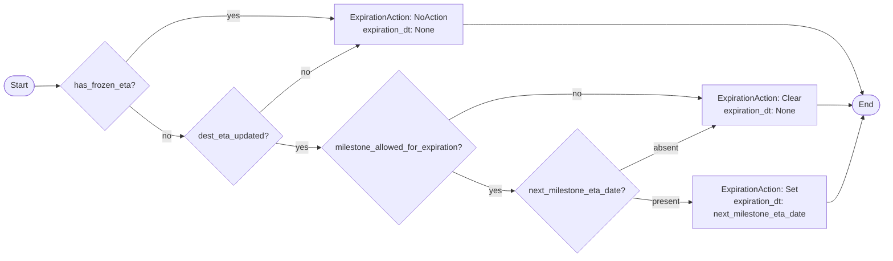

# Diagram: shipment_core/shipment_service/shipment_service/eta/eta_milestone_update/tests/test_determine_expiration_action.py

> Auto-generated by Obscura crawlers

## Mermaid

### SVG

<svg id="container" width="1723.5068359375" xmlns="http://www.w3.org/2000/svg" class="flowchart" height="503.6640625" viewBox="0.0000019073486328125 0 1723.5068359375 503.6640625" role="graphics-document document" aria-roledescription="flowchart-v2"><g><marker id="container_flowchart-v2-pointEnd" class="marker flowchart-v2" viewBox="0 0 10 10" refX="5" refY="5" markerUnits="userSpaceOnUse" markerWidth="8" markerHeight="8" orient="auto"><path d="M 0 0 L 10 5 L 0 10 z" class="arrowMarkerPath" style="stroke-width: 1; stroke-dasharray: 1, 0;"></path></marker><marker id="container_flowchart-v2-pointStart" class="marker flowchart-v2" viewBox="0 0 10 10" refX="4.5" refY="5" markerUnits="userSpaceOnUse" markerWidth="8" markerHeight="8" orient="auto"><path d="M 0 5 L 10 10 L 10 0 z" class="arrowMarkerPath" style="stroke-width: 1; stroke-dasharray: 1, 0;"></path></marker><marker id="container_flowchart-v2-circleEnd" class="marker flowchart-v2" viewBox="0 0 10 10" refX="11" refY="5" markerUnits="userSpaceOnUse" markerWidth="11" markerHeight="11" orient="auto"><circle cx="5" cy="5" r="5" class="arrowMarkerPath" style="stroke-width: 1; stroke-dasharray: 1, 0;"></circle></marker><marker id="container_flowchart-v2-circleStart" class="marker flowchart-v2" viewBox="0 0 10 10" refX="-1" refY="5" markerUnits="userSpaceOnUse" markerWidth="11" markerHeight="11" orient="auto"><circle cx="5" cy="5" r="5" class="arrowMarkerPath" style="stroke-width: 1; stroke-dasharray: 1, 0;"></circle></marker><marker id="container_flowchart-v2-crossEnd" class="marker cross flowchart-v2" viewBox="0 0 11 11" refX="12" refY="5.2" markerUnits="userSpaceOnUse" markerWidth="11" markerHeight="11" orient="auto"><path d="M 1,1 l 9,9 M 10,1 l -9,9" class="arrowMarkerPath" style="stroke-width: 2; stroke-dasharray: 1, 0;"></path></marker><marker id="container_flowchart-v2-crossStart" class="marker cross flowchart-v2" viewBox="0 0 11 11" refX="-1" refY="5.2" markerUnits="userSpaceOnUse" markerWidth="11" markerHeight="11" orient="auto"><path d="M 1,1 l 9,9 M 10,1 l -9,9" class="arrowMarkerPath" style="stroke-width: 2; stroke-dasharray: 1, 0;"></path></marker><g class="root"><g class="clusters"></g><g class="edgePaths"><path d="M68.277,168.652L72.36,168.569C76.444,168.486,84.61,168.319,92.194,168.236C99.777,168.152,106.777,168.152,110.277,168.152L113.777,168.152" id="L_Start_A_0" class="edge-thickness-normal edge-pattern-solid edge-thickness-normal edge-pattern-solid flowchart-link" style=";" data-edge="true" data-et="edge" data-id="L_Start_A_0" data-points="W3sieCI6NjguMjc2ODM3NDMxODI3MjksInkiOjE2OC42NTIzNDM3NX0seyJ4Ijo5Mi43NzY4MzYzOTUyNjM2NywieSI6MTY4LjE1MjM0Mzc1fSx7IngiOjExNy43NzY4MzYzOTUyNjM2NywieSI6MTY4LjE1MjM0Mzc1fV0=" marker-end="url(#container_flowchart-v2-pointEnd)"></path><path d="M242.574,122.653L255.885,107.377C269.196,92.102,295.819,61.551,330.932,46.275C366.045,31,409.649,31,453.694,31C497.738,31,542.222,31,574.379,31.834C606.537,32.667,626.367,34.334,636.282,35.168L646.197,36.002" id="L_A_NoAction_0" class="edge-thickness-normal edge-pattern-solid edge-thickness-normal edge-pattern-solid flowchart-link" style=";" data-edge="true" data-et="edge" data-id="L_A_NoAction_0" data-points="W3sieCI6MjQyLjU3NDA0MTgxNTcyODgsInkiOjEyMi42NTI2NzQxNzA0NjUwOX0seyJ4IjozMjIuNDQwODk4ODk1MjYzNywieSI6MzF9LHsieCI6NDUzLjI1MzM5ODg5NTI2MzcsInkiOjMxfSx7IngiOjU4Ni43MDY1MjM4OTUyNjM3LCJ5IjozMX0seyJ4Ijo2NTAuMTgzMDg2Mzk1MjYzNywieSI6MzYuMzM2NjE3NDA1NTgyOTJ9XQ==" marker-end="url(#container_flowchart-v2-pointEnd)"></path><path d="M249.464,206.762L261.627,216.852C273.79,226.943,298.115,247.124,315.339,257.214C332.563,267.305,342.686,267.305,347.747,267.305L352.808,267.305" id="L_A_B_0" class="edge-thickness-normal edge-pattern-solid edge-thickness-normal edge-pattern-solid flowchart-link" style=";" data-edge="true" data-et="edge" data-id="L_A_B_0" data-points="W3sieCI6MjQ5LjQ2NDE4MzAxNzQzNDQ2LCJ5IjoyMDYuNzYxODcyMTI3ODI5MTh9LHsieCI6MzIyLjQ0MDg5ODg5NTI2MzcsInkiOjI2Ny4zMDQ2ODc1fSx7IngiOjM1Ni44MDgwODYzOTUyNjM3LCJ5IjoyNjcuMzA0Njg3NX1d" marker-end="url(#container_flowchart-v2-pointEnd)"></path><path d="M503.806,221.412L517.623,208.869C531.439,196.325,559.073,171.239,591.541,148.978C624.009,126.718,661.312,107.283,679.964,97.566L698.615,87.848" id="L_B_NoAction_0" class="edge-thickness-normal edge-pattern-solid edge-thickness-normal edge-pattern-solid flowchart-link" style=";" data-edge="true" data-et="edge" data-id="L_B_NoAction_0" data-points="W3sieCI6NTAzLjgwNTg0MTQ5NTY0MTA2LCJ5IjoyMjEuNDExODE3NjAwMzc3NDJ9LHsieCI6NTg2LjcwNjUyMzg5NTI2MzcsInkiOjE0Ni4xNTIzNDM3NX0seyJ4Ijo3MDIuMTYyNjIzOTQyNTM5NCwieSI6ODZ9XQ==" marker-end="url(#container_flowchart-v2-pointEnd)"></path><path d="M536.05,280.954L544.492,282.346C552.935,283.737,569.821,286.521,583.765,287.913C597.709,289.305,608.712,289.305,614.213,289.305L619.714,289.305" id="L_B_C_0" class="edge-thickness-normal edge-pattern-solid edge-thickness-normal edge-pattern-solid flowchart-link" style=";" data-edge="true" data-et="edge" data-id="L_B_C_0" data-points="W3sieCI6NTM2LjA0OTYwMDkzMTkwMDUsInkiOjI4MC45NTM3OTc5NjMzNjMyfSx7IngiOjU4Ni43MDY1MjM4OTUyNjM3LCJ5IjoyODkuMzA0Njg3NX0seyJ4Ijo2MjMuNzE0MzM2Mzk1MjYzNiwieSI6Mjg5LjMwNDY4NzV9XQ==" marker-end="url(#container_flowchart-v2-pointEnd)"></path><path d="M875.764,234.745L891.026,226.313C906.287,217.881,936.809,201.017,978.556,192.585C1020.303,184.152,1073.274,184.152,1128.85,184.152C1184.425,184.152,1242.605,184.152,1282.769,185.426C1322.934,186.699,1345.083,189.246,1356.158,190.519L1367.233,191.793" id="L_C_Clear_0" class="edge-thickness-normal edge-pattern-solid edge-thickness-normal edge-pattern-solid flowchart-link" style=";" data-edge="true" data-et="edge" data-id="L_C_Clear_0" data-points="W3sieCI6ODc1Ljc2NDQzNzk2NzM2OTMsInkiOjIzNC43NDU0MTQwNzIxMDU2M30seyJ4Ijo5NjcuMzMxNTIzODk1MjYzNywieSI6MTg0LjE1MjM0Mzc1fSx7IngiOjExMjYuMjQ1NTg2Mzk1MjYzNywieSI6MTg0LjE1MjM0Mzc1fSx7IngiOjEzMDAuNzg0NjQ4ODk1MjYzNywieSI6MTg0LjE1MjM0Mzc1fSx7IngiOjEzNzEuMjA2NTIzODk1MjYzNywieSI6MTkyLjI0OTc4OTk1NzgxMTF9XQ==" marker-end="url(#container_flowchart-v2-pointEnd)"></path><path d="M883.203,336.425L897.225,342.647C911.246,348.869,939.289,361.314,958.811,367.536C978.334,373.758,989.337,373.758,994.838,373.758L1000.339,373.758" id="L_C_D_0" class="edge-thickness-normal edge-pattern-solid edge-thickness-normal edge-pattern-solid flowchart-link" style=";" data-edge="true" data-et="edge" data-id="L_C_D_0" data-points="W3sieCI6ODgzLjIwMzMzNDAzMTc0MzcsInkiOjMzNi40MjUwNjQ4NjM1MjAwNX0seyJ4Ijo5NjcuMzMxNTIzODk1MjYzNywieSI6MzczLjc1NzgxMjV9LHsieCI6MTAwNC4zMzkzMzYzOTUyNjM3LCJ5IjozNzMuNzU3ODEyNX1d" marker-end="url(#container_flowchart-v2-pointEnd)"></path><path d="M1234.506,387.404L1245.552,388.796C1256.599,390.188,1278.692,392.973,1297.844,394.365C1316.996,395.758,1333.207,395.758,1341.312,395.758L1349.417,395.758" id="L_D_Set_0" class="edge-thickness-normal edge-pattern-solid edge-thickness-normal edge-pattern-solid flowchart-link" style=";" data-edge="true" data-et="edge" data-id="L_D_Set_0" data-points="W3sieCI6MTIzNC41MDYwMTIxNzEzODk2LCJ5IjozODcuNDAzNjM2NzIzODc0MDZ9LHsieCI6MTMwMC43ODQ2NDg4OTUyNjM3LCJ5IjozOTUuNzU3ODEyNX0seyJ4IjoxMzUzLjQxNzQ2MTM5NTI2MzcsInkiOjM5NS43NTc4MTI1fV0=" marker-end="url(#container_flowchart-v2-pointEnd)"></path><path d="M1208.496,334.102L1223.877,326.686C1239.259,319.27,1270.022,304.438,1301.18,289.726C1332.339,275.014,1363.894,260.423,1379.671,253.127L1395.448,245.831" id="L_D_Clear_0" class="edge-thickness-normal edge-pattern-solid edge-thickness-normal edge-pattern-solid flowchart-link" style=";" data-edge="true" data-et="edge" data-id="L_D_Clear_0" data-points="W3sieCI6MTIwOC40OTU3MTk0NjQzNDY0LCJ5IjozMzQuMTAxNjk1NTY5MDgyNjZ9LHsieCI6MTMwMC43ODQ2NDg4OTUyNjM3LCJ5IjoyODkuNjA1NDY4NzV9LHsieCI6MTM5OS4wNzg2MDg0ODEyOTUsInkiOjI0NC4xNTIzNDM3NX1d" marker-end="url(#container_flowchart-v2-pointEnd)"></path><path d="M903.855,47L914.434,47C925.014,47,946.173,47,983.238,47C1020.303,47,1073.274,47,1128.85,47C1184.425,47,1242.605,47,1302.134,47C1361.662,47,1422.54,47,1478.812,47C1535.084,47,1586.751,47,1619.92,69.558C1653.089,92.116,1667.76,137.232,1675.096,159.79L1682.431,182.348" id="L_NoAction_End_0" class="edge-thickness-normal edge-pattern-solid edge-thickness-normal edge-pattern-solid flowchart-link" style=";" data-edge="true" data-et="edge" data-id="L_NoAction_End_0" data-points="W3sieCI6OTAzLjg1NDk2MTM5NTI2MzcsInkiOjQ3fSx7IngiOjk2Ny4zMzE1MjM4OTUyNjM3LCJ5Ijo0N30seyJ4IjoxMTI2LjI0NTU4NjM5NTI2MzcsInkiOjQ3fSx7IngiOjEzMDAuNzg0NjQ4ODk1MjYzNywieSI6NDd9LHsieCI6MTQ4My40MTc0NjEzOTUyNjM3LCJ5Ijo0N30seyJ4IjoxNjM4LjQxNzQ2MTM5NTI2MzcsInkiOjQ3fSx7IngiOjE2ODMuNjY4MzgxMzg2MjQ3MSwieSI6MTg2LjE1MjM0Mzc1fV0=" marker-end="url(#container_flowchart-v2-pointEnd)"></path><path d="M1595.628,205.152L1602.76,205.152C1609.891,205.152,1624.154,205.152,1634.869,205.223C1645.584,205.293,1652.751,205.433,1656.335,205.504L1659.918,205.574" id="L_Clear_End_0" class="edge-thickness-normal edge-pattern-solid edge-thickness-normal edge-pattern-solid flowchart-link" style=";" data-edge="true" data-et="edge" data-id="L_Clear_End_0" data-points="W3sieCI6MTU5NS42MjgzOTg4OTUyNjM3LCJ5IjoyMDUuMTUyMzQzNzV9LHsieCI6MTYzOC40MTc0NjEzOTUyNjM3LCJ5IjoyMDUuMTUyMzQzNzV9LHsieCI6MTY2My45MTc0NjEzOTUyOTUsInkiOjIwNS42NTIzNDM3NTAwMDAwM31d" marker-end="url(#container_flowchart-v2-pointEnd)"></path><path d="M1613.417,395.758L1617.584,395.758C1621.751,395.758,1630.084,395.758,1641.797,367.967C1653.509,340.176,1668.6,284.594,1676.146,256.803L1683.692,229.013" id="L_Set_End_0" class="edge-thickness-normal edge-pattern-solid edge-thickness-normal edge-pattern-solid flowchart-link" style=";" data-edge="true" data-et="edge" data-id="L_Set_End_0" data-points="W3sieCI6MTYxMy40MTc0NjEzOTUyNjM3LCJ5IjozOTUuNzU3ODEyNX0seyJ4IjoxNjM4LjQxNzQ2MTM5NTI2MzcsInkiOjM5NS43NTc4MTI1fSx7IngiOjE2ODQuNzM5OTc2MDE4OTExLCJ5IjoyMjUuMTUyMzQzNzV9XQ==" marker-end="url(#container_flowchart-v2-pointEnd)"></path></g><g class="edgeLabels"><g class="edgeLabel"><g class="label" data-id="L_Start_A_0" transform="translate(0, 0)"><foreignObject width="0" height="0">

</foreignObject></g></g><g class="edgeLabel" transform="translate(453.2533988952637, 31)"><g class="label" data-id="L_A_NoAction_0" transform="translate(-12.0078125, -12)"><foreignObject width="24.015625" height="24">

yes

</foreignObject></g></g><g class="edgeLabel" transform="translate(322.4408988952637, 267.3046875)"><g class="label" data-id="L_A_B_0" transform="translate(-9.3671875, -12)"><foreignObject width="18.734375" height="24">

no

</foreignObject></g></g><g class="edgeLabel" transform="translate(594.78555, 141.94319)"><g class="label" data-id="L_B_NoAction_0" transform="translate(-9.3671875, -12)"><foreignObject width="18.734375" height="24">

no

</foreignObject></g></g><g class="edgeLabel" transform="translate(586.7065238952637, 289.3046875)"><g class="label" data-id="L_B_C_0" transform="translate(-12.0078125, -12)"><foreignObject width="24.015625" height="24">

yes

</foreignObject></g></g><g class="edgeLabel" transform="translate(1126.2455863952637, 184.15234375)"><g class="label" data-id="L_C_Clear_0" transform="translate(-9.3671875, -12)"><foreignObject width="18.734375" height="24">

no

</foreignObject></g></g><g class="edgeLabel" transform="translate(967.3315238952637, 373.7578125)"><g class="label" data-id="L_C_D_0" transform="translate(-12.0078125, -12)"><foreignObject width="24.015625" height="24">

yes

</foreignObject></g></g><g class="edgeLabel" transform="translate(1300.7846488952637, 395.7578125)"><g class="label" data-id="L_D_Set_0" transform="translate(-27.6328125, -12)"><foreignObject width="55.265625" height="24">

present

</foreignObject></g></g><g class="edgeLabel" transform="translate(1300.7846488952637, 289.60546875)"><g class="label" data-id="L_D_Clear_0" transform="translate(-24.78125, -12)"><foreignObject width="49.5625" height="24">

absent

</foreignObject></g></g><g class="edgeLabel"><g class="label" data-id="L_NoAction_End_0" transform="translate(0, 0)"><foreignObject width="0" height="0">

</foreignObject></g></g><g class="edgeLabel"><g class="label" data-id="L_Clear_End_0" transform="translate(0, 0)"><foreignObject width="0" height="0">

</foreignObject></g></g><g class="edgeLabel"><g class="label" data-id="L_Set_End_0" transform="translate(0, 0)"><foreignObject width="0" height="0">

</foreignObject></g></g></g><g class="nodes"><g class="node default" id="flowchart-Start-0" transform="translate(37.888418197631836, 168.15234375)"><g class="basic label-container outer-path"><path d="M-10.3984375 -19.5 C-6.097512188112499 -19.5, -1.796586876224998 -19.5, 10.3984375 -19.5 C10.3984375 -19.5, 10.3984375 -19.5, 10.398437499999998 -19.5 C10.694166915962684 -19.490516533232466, 10.98989633192537 -19.48103306646493, 11.6478067896239 -19.45993515863156 C12.010019895951508 -19.42499289588913, 12.372233002279115 -19.3900506331467, 12.892042152847864 -19.3399052695533 C13.291229215350564 -19.275367801029766, 13.690416277853263 -19.210830332506237, 14.126030759676757 -19.140403561325776 C14.447048720717111 -19.067133306556283, 14.768066681757468 -18.99386305178679, 15.34470188623539 -18.862249829261074 C15.751251268732256 -18.741588106557263, 16.15780065122912 -18.620926383853448, 16.543047751460602 -18.50658706670804 C16.8280941788501 -18.401687346488412, 17.1131406062396 -18.296787626268788, 17.716144095147794 -18.074876768247425 C18.081798060880466 -17.91301260435708, 18.44745202661314 -17.751148440466732, 18.85917041279238 -17.568892924097174 C19.10798933287158 -17.439084252867982, 19.35680825295078 -17.309275581638786, 19.967429764076783 -16.990714730406097 C20.390078528971365 -16.734502565367166, 20.812727293865947 -16.47829040032823, 21.036368073605697 -16.342718045390892 C21.39158566120041 -16.094933633406352, 21.746803248795125 -15.847149221421812, 22.061592844578712 -15.627565626425154 C22.35700269635443 -15.391984130820322, 22.652412548130147 -15.156402635215493, 23.03889120850187 -14.848196188198123 C23.279181451371695 -14.629970947355181, 23.519471694241524 -14.411745706512237, 23.964247236767985 -14.007812326905688 C24.298784324430436 -13.662375317888511, 24.633321412092887 -13.316938308871334, 24.833858442968648 -13.10986736009568 C24.99661064143164 -12.91868936691861, 25.159362839894634 -12.727511373741539, 25.644151408126582 -12.158051136245305 C25.926619532400014 -11.779569583094412, 26.209087656673447 -11.40108802994352, 26.391796464640635 -11.156274872382312 C26.616211748378134 -10.811512732620084, 26.840627032115634 -10.466750592857855, 27.073721378604247 -10.108655082055241 C27.251470505649657 -9.793043507935254, 27.429219632695066 -9.477431933815268, 27.6871239742735 -9.019496659696287 C27.86040384391422 -8.65967730279207, 28.033683713554936 -8.299857945887853, 28.22948364880834 -7.893275190886684 C28.354739998836568 -7.583889584650177, 28.4799963488648 -7.27450397841367, 28.698571729970325 -6.734618561215508 C28.850703775164042 -6.276421080041716, 29.00283582035776 -5.818223598867926, 29.09246063421488 -5.548287939305138 C29.168155356515236 -5.259631156873712, 29.243850078815594 -4.970974374442286, 29.40953178754556 -4.339158212148133 C29.496693210951765 -3.8916027245306264, 29.583854634357973 -3.44404723691312, 29.648482276581777 -3.1121979531509023 C29.68976451884107 -2.7920210342886307, 29.731046761100362 -2.4718441154263586, 29.808330202509367 -1.872449005199798 C29.82980421100743 -1.537973989334768, 29.851278219505495 -1.2034989734697379, 29.888418715913414 -0.6250057626472757 C29.888418715913414 -0.33735699475113323, 29.888418715913414 -0.04970822685499077, 29.888418715913414 0.625005762647271 C29.859259966442487 1.079176822175886, 29.830101216971563 1.533347881704501, 29.808330202509367 1.8724490051997846 C29.7687092364378 2.1797413940061365, 29.729088270366237 2.4870337828124884, 29.648482276581777 3.1121979531508885 C29.555900332809024 3.5875866672232255, 29.463318389036274 4.062975381295562, 29.40953178754556 4.339158212148129 C29.302482111523556 4.7473850224431065, 29.19543243550155 5.155611832738085, 29.092460634214884 5.548287939305125 C28.95219218135213 5.97075417058479, 28.81192372848938 6.393220401864455, 28.69857172997033 6.734618561215495 C28.55885841381967 7.079713153280826, 28.419145097669016 7.4248077453461585, 28.229483648808344 7.893275190886679 C28.04200007386238 8.28258884576785, 27.854516498916414 8.671902500649018, 27.687123974273504 9.019496659696284 C27.53040231382388 9.297771837613569, 27.373680653374258 9.576047015530856, 27.07372137860425 10.108655082055236 C26.850909138875366 10.450954515742644, 26.62809689914648 10.793253949430053, 26.39179646464064 11.156274872382301 C26.162006874890285 11.464171988385496, 25.932217285139927 11.772069104388692, 25.644151408126582 12.158051136245302 C25.423679698535015 12.417029751527222, 25.203207988943447 12.676008366809143, 24.83385844296866 13.10986736009567 C24.594762974058266 13.356753061848716, 24.355667505147878 13.603638763601763, 23.96424723676799 14.007812326905684 C23.734288904296218 14.216654400092482, 23.50433057182445 14.42549647327928, 23.038891208501887 14.848196188198111 C22.697034552198044 15.120817774412744, 22.3551778958942 15.39343936062738, 22.061592844578715 15.627565626425152 C21.721806346626956 15.864585978275874, 21.382019848675192 16.101606330126597, 21.036368073605708 16.34271804539089 C20.751803157026163 16.51522297011048, 20.467238240446616 16.687727894830072, 19.967429764076787 16.990714730406093 C19.678837180848948 17.141273296223684, 19.39024459762111 17.291831862041278, 18.859170412792388 17.56889292409717 C18.521214154476855 17.718496134537247, 18.183257896161326 17.868099344977324, 17.716144095147804 18.07487676824742 C17.26300879659534 18.24163474685151, 16.809873498042876 18.4083927254556, 16.543047751460616 18.506587066708033 C16.185099336902447 18.61282427723933, 15.82715092234428 18.719061487770624, 15.344701886235413 18.86224982926107 C15.077975799662447 18.92312831797097, 14.811249713089483 18.984006806680874, 14.126030759676766 19.140403561325773 C13.846041981749755 19.18566997559561, 13.566053203822745 19.230936389865448, 12.892042152847878 19.3399052695533 C12.545748312282827 19.373311819873333, 12.199454471717775 19.406718370193367, 11.6478067896239 19.45993515863156 C11.324741604348755 19.4702952303151, 11.001676419073611 19.480655301998635, 10.398437500000004 19.5 C10.398437500000002 19.5, 10.398437500000002 19.5, 10.3984375 19.5 C4.917402249245667 19.5, -0.5636330015086664 19.5, -10.398437499999996 19.5 C-10.831307292957778 19.48611870826978, -11.26417708591556 19.472237416539567, -11.647806789623893 19.45993515863156 C-11.95855030812619 19.4299581051254, -12.269293826628486 19.399981051619243, -12.892042152847871 19.3399052695533 C-13.323413966587333 19.27016442004628, -13.754785780326793 19.20042357053926, -14.126030759676759 19.140403561325773 C-14.467909383710547 19.06237199635658, -14.809788007744336 18.98434043138738, -15.344701886235388 18.862249829261074 C-15.650561252920909 18.77147237471739, -15.956420619606428 18.680694920173707, -16.54304775146059 18.506587066708043 C-16.883245646469778 18.381391096589795, -17.223443541478964 18.256195126471546, -17.716144095147797 18.074876768247425 C-17.978639141199356 17.95867799799928, -18.241134187250914 17.842479227751138, -18.85917041279238 17.568892924097174 C-19.163070451436667 17.410348468593714, -19.466970490080953 17.251804013090258, -19.96742976407678 16.990714730406097 C-20.28176293674502 16.800164113907847, -20.596096109413264 16.609613497409597, -21.036368073605686 16.3427180453909 C-21.345857176184214 16.126831844999437, -21.655346278762746 15.910945644607978, -22.061592844578712 15.627565626425156 C-22.352546644538023 15.39553771356339, -22.643500444497334 15.163509800701625, -23.03889120850187 14.848196188198125 C-23.40525268601759 14.515476387711859, -23.771614163533314 14.182756587225594, -23.964247236767974 14.007812326905697 C-24.180427151473125 13.784588816271551, -24.396607066178277 13.561365305637405, -24.833858442968655 13.109867360095677 C-25.09475594718933 12.803402306149527, -25.355653451410006 12.496937252203375, -25.64415140812658 12.158051136245307 C-25.872242438887078 11.852429934546613, -26.10033346964758 11.546808732847921, -26.391796464640635 11.156274872382316 C-26.648923206736836 10.761259148324637, -26.906049948833036 10.36624342426696, -27.073721378604244 10.108655082055249 C-27.283012371311884 9.737037731491734, -27.49230336401952 9.365420380928219, -27.6871239742735 9.019496659696289 C-27.88954151744944 8.599172300249846, -28.09195906062538 8.1788479408034, -28.22948364880834 7.893275190886686 C-28.396065614531857 7.481814514906394, -28.562647580255373 7.070353838926101, -28.698571729970325 6.73461856121551 C-28.800174682514882 6.428606656383382, -28.901777635059442 6.1225947515512535, -29.09246063421488 5.5482879393051325 C-29.187131747998336 5.187265951728555, -29.28180286178179 4.826243964151976, -29.409531787545557 4.339158212148136 C-29.491219454994557 3.919709304492157, -29.572907122443556 3.500260396836178, -29.648482276581777 3.112197953150904 C-29.702483756757534 2.6933731367061435, -29.75648523693329 2.274548320261383, -29.808330202509364 1.872449005199809 C-29.829787162504598 1.5382395335276924, -29.85124412249983 1.2040300618555757, -29.888418715913414 0.6250057626472781 C-29.888418715913414 0.22473675056392406, -29.888418715913414 -0.17553226151943002, -29.888418715913414 -0.6250057626472687 C-29.857906405589137 -1.1002596250414625, -29.827394095264864 -1.5755134874356562, -29.808330202509367 -1.8724490051997822 C-29.760712189071583 -2.2417649141829, -29.7130941756338 -2.611080823166018, -29.648482276581777 -3.112197953150895 C-29.556393012892276 -3.5850568591237217, -29.46430374920277 -4.057915765096548, -29.40953178754556 -4.339158212148126 C-29.3087379787943 -4.723528689229722, -29.207944170043042 -5.107899166311319, -29.092460634214884 -5.548287939305123 C-29.008442727071373 -5.801336489185791, -28.92442481992786 -6.054385039066458, -28.698571729970332 -6.734618561215485 C-28.600176846547157 -6.9776558256063845, -28.50178196312398 -7.220693089997284, -28.229483648808344 -7.893275190886676 C-28.034882723255887 -8.297368176589133, -27.84028179770343 -8.701461162291592, -27.687123974273504 -9.019496659696282 C-27.474167188536775 -9.397622996984744, -27.261210402800046 -9.775749334273206, -27.073721378604247 -10.108655082055243 C-26.930343579799455 -10.32892188334922, -26.78696578099466 -10.549188684643196, -26.39179646464064 -11.156274872382308 C-26.16168848599484 -11.464598600499572, -25.93158050734904 -11.772922328616838, -25.644151408126586 -12.158051136245302 C-25.389832822997157 -12.456788217475772, -25.135514237867728 -12.755525298706244, -24.833858442968662 -13.10986736009567 C-24.596996676603396 -13.354446580580484, -24.36013491023813 -13.599025801065299, -23.964247236767996 -14.007812326905677 C-23.648240920754944 -14.294800902039782, -23.33223460474189 -14.581789477173889, -23.038891208501887 -14.848196188198107 C-22.836553088299198 -15.009555454616244, -22.634214968096504 -15.17091472103438, -22.06159284457872 -15.627565626425149 C-21.75312618861154 -15.842738612321535, -21.444659532644362 -16.05791159821792, -21.03636807360571 -16.342718045390885 C-20.739786899769783 -16.52250729587466, -20.44320572593385 -16.70229654635844, -19.96742976407679 -16.99071473040609 C-19.607014824954323 -17.178742973289495, -19.246599885831852 -17.3667712161729, -18.859170412792388 -17.56889292409717 C-18.528386081432 -17.71532133522186, -18.197601750071613 -17.861749746346547, -17.716144095147804 -18.07487676824742 C-17.41360813924312 -18.186212796632063, -17.11107218333844 -18.297548825016708, -16.54304775146062 -18.506587066708033 C-16.235395710880606 -18.597896577453664, -15.927743670300591 -18.6892060881993, -15.344701886235413 -18.862249829261067 C-15.039279983737732 -18.93196038544199, -14.73385808124005 -19.00167094162291, -14.126030759676768 -19.140403561325773 C-13.841014454981558 -19.18648278713444, -13.555998150286346 -19.23256201294311, -12.89204215284788 -19.3399052695533 C-12.617399080277954 -19.3663997564575, -12.34275600770803 -19.3928942433617, -11.647806789623903 -19.45993515863156 C-11.196747641165157 -19.47439974758926, -10.74568849270641 -19.48886433654696, -10.398437500000005 -19.5 C-10.398437500000004 -19.5, -10.398437500000004 -19.5, -10.3984375 -19.5" stroke="none" stroke-width="0" fill="#ECECFF" style=""></path><path d="M-10.3984375 -19.5 C-5.294619443640198 -19.5, -0.19080138728039664 -19.5, 10.3984375 -19.5 M-10.3984375 -19.5 C-5.800814827421485 -19.5, -1.20319215484297 -19.5, 10.3984375 -19.5 M10.3984375 -19.5 C10.3984375 -19.5, 10.398437499999998 -19.5, 10.398437499999998 -19.5 M10.3984375 -19.5 C10.3984375 -19.5, 10.398437499999998 -19.5, 10.398437499999998 -19.5 M10.398437499999998 -19.5 C10.862050989887067 -19.485132817748237, 11.325664479774135 -19.470265635496474, 11.6478067896239 -19.45993515863156 M10.398437499999998 -19.5 C10.793848836929673 -19.487319928046144, 11.189260173859347 -19.474639856092285, 11.6478067896239 -19.45993515863156 M11.6478067896239 -19.45993515863156 C12.022343053492488 -19.423804095701914, 12.396879317361076 -19.387673032772273, 12.892042152847864 -19.3399052695533 M11.6478067896239 -19.45993515863156 C12.09816899230856 -19.416489258578363, 12.548531194993219 -19.373043358525166, 12.892042152847864 -19.3399052695533 M12.892042152847864 -19.3399052695533 C13.278970227788072 -19.277349739069003, 13.665898302728282 -19.214794208584706, 14.126030759676757 -19.140403561325776 M12.892042152847864 -19.3399052695533 C13.212220048284024 -19.288141390435843, 13.532397943720184 -19.236377511318388, 14.126030759676757 -19.140403561325776 M14.126030759676757 -19.140403561325776 C14.603186431764067 -19.0314958929036, 15.080342103851375 -18.922588224481427, 15.34470188623539 -18.862249829261074 M14.126030759676757 -19.140403561325776 C14.393084052167794 -19.079450390000293, 14.660137344658828 -19.01849721867481, 15.34470188623539 -18.862249829261074 M15.34470188623539 -18.862249829261074 C15.644250350700865 -18.773345417369697, 15.94379881516634 -18.68444100547832, 16.543047751460602 -18.50658706670804 M15.34470188623539 -18.862249829261074 C15.746022042074138 -18.74314011358062, 16.147342197912888 -18.624030397900164, 16.543047751460602 -18.50658706670804 M16.543047751460602 -18.50658706670804 C16.818534963613764 -18.405205226059802, 17.094022175766927 -18.303823385411565, 17.716144095147794 -18.074876768247425 M16.543047751460602 -18.50658706670804 C16.856880725126988 -18.391093631358604, 17.17071369879337 -18.275600196009165, 17.716144095147794 -18.074876768247425 M17.716144095147794 -18.074876768247425 C18.147033028763065 -17.88413501920202, 18.577921962378337 -17.693393270156616, 18.85917041279238 -17.568892924097174 M17.716144095147794 -18.074876768247425 C18.118734982734576 -17.896661724747123, 18.52132587032136 -17.718446681246817, 18.85917041279238 -17.568892924097174 M18.85917041279238 -17.568892924097174 C19.095168645135757 -17.445772797447717, 19.331166877479134 -17.32265267079826, 19.967429764076783 -16.990714730406097 M18.85917041279238 -17.568892924097174 C19.2578509178924 -17.360901559953543, 19.656531422992426 -17.152910195809913, 19.967429764076783 -16.990714730406097 M19.967429764076783 -16.990714730406097 C20.265020297776804 -16.81031360004105, 20.562610831476825 -16.629912469676, 21.036368073605697 -16.342718045390892 M19.967429764076783 -16.990714730406097 C20.295462609194953 -16.79185929196049, 20.623495454313122 -16.59300385351488, 21.036368073605697 -16.342718045390892 M21.036368073605697 -16.342718045390892 C21.268484186803985 -16.18080389296836, 21.500600300002272 -16.01888974054583, 22.061592844578712 -15.627565626425154 M21.036368073605697 -16.342718045390892 C21.359969140263892 -16.116987949754535, 21.683570206922088 -15.891257854118177, 22.061592844578712 -15.627565626425154 M22.061592844578712 -15.627565626425154 C22.278619980165395 -15.454492261129399, 22.49564711575208 -15.281418895833644, 23.03889120850187 -14.848196188198123 M22.061592844578712 -15.627565626425154 C22.430586414235457 -15.333303073955173, 22.799579983892205 -15.039040521485193, 23.03889120850187 -14.848196188198123 M23.03889120850187 -14.848196188198123 C23.361472379867482 -14.555236503393964, 23.68405355123309 -14.262276818589806, 23.964247236767985 -14.007812326905688 M23.03889120850187 -14.848196188198123 C23.40317997223292 -14.517358771530096, 23.76746873596397 -14.186521354862068, 23.964247236767985 -14.007812326905688 M23.964247236767985 -14.007812326905688 C24.155194901090123 -13.810643186398286, 24.346142565412258 -13.613474045890884, 24.833858442968648 -13.10986736009568 M23.964247236767985 -14.007812326905688 C24.300480693968616 -13.66062367706581, 24.636714151169247 -13.313435027225934, 24.833858442968648 -13.10986736009568 M24.833858442968648 -13.10986736009568 C25.10580760292783 -12.790420402462058, 25.37775676288701 -12.470973444828433, 25.644151408126582 -12.158051136245305 M24.833858442968648 -13.10986736009568 C25.07474924300858 -12.826903319293951, 25.31564004304851 -12.543939278492223, 25.644151408126582 -12.158051136245305 M25.644151408126582 -12.158051136245305 C25.879212618768538 -11.843090528501913, 26.11427382941049 -11.528129920758522, 26.391796464640635 -11.156274872382312 M25.644151408126582 -12.158051136245305 C25.939606889125542 -11.762167708254742, 26.235062370124503 -11.366284280264178, 26.391796464640635 -11.156274872382312 M26.391796464640635 -11.156274872382312 C26.635655497012333 -10.781641913340382, 26.879514529384032 -10.407008954298451, 27.073721378604247 -10.108655082055241 M26.391796464640635 -11.156274872382312 C26.578021696976588 -10.870182907037556, 26.764246929312545 -10.584090941692802, 27.073721378604247 -10.108655082055241 M27.073721378604247 -10.108655082055241 C27.261542453356782 -9.775159744885954, 27.449363528109316 -9.441664407716667, 27.6871239742735 -9.019496659696287 M27.073721378604247 -10.108655082055241 C27.243903068488827 -9.806480258900416, 27.414084758373402 -9.504305435745591, 27.6871239742735 -9.019496659696287 M27.6871239742735 -9.019496659696287 C27.837723778106383 -8.706772944717711, 27.988323581939266 -8.394049229739135, 28.22948364880834 -7.893275190886684 M27.6871239742735 -9.019496659696287 C27.800372175837197 -8.784334346025936, 27.913620377400893 -8.549172032355587, 28.22948364880834 -7.893275190886684 M28.22948364880834 -7.893275190886684 C28.36847165159554 -7.5499721368520705, 28.507459654382743 -7.2066690828174576, 28.698571729970325 -6.734618561215508 M28.22948364880834 -7.893275190886684 C28.342455880084895 -7.614231595464095, 28.455428111361446 -7.335188000041505, 28.698571729970325 -6.734618561215508 M28.698571729970325 -6.734618561215508 C28.841298815106065 -6.30474732125946, 28.984025900241804 -5.874876081303411, 29.09246063421488 -5.548287939305138 M28.698571729970325 -6.734618561215508 C28.80512429056829 -6.413699225539467, 28.911676851166256 -6.092779889863427, 29.09246063421488 -5.548287939305138 M29.09246063421488 -5.548287939305138 C29.190869526146823 -5.173012183685088, 29.289278418078762 -4.79773642806504, 29.40953178754556 -4.339158212148133 M29.09246063421488 -5.548287939305138 C29.20052943270315 -5.136174773355827, 29.308598231191418 -4.724061607406515, 29.40953178754556 -4.339158212148133 M29.40953178754556 -4.339158212148133 C29.479367119651638 -3.9805685414861003, 29.54920245175771 -3.6219788708240674, 29.648482276581777 -3.1121979531509023 M29.40953178754556 -4.339158212148133 C29.46364369176743 -4.061305020523839, 29.5177555959893 -3.783451828899544, 29.648482276581777 -3.1121979531509023 M29.648482276581777 -3.1121979531509023 C29.694870647988942 -2.752418904936973, 29.74125901939611 -2.3926398567230436, 29.808330202509367 -1.872449005199798 M29.648482276581777 -3.1121979531509023 C29.705078307000367 -2.6732503173746354, 29.761674337418956 -2.2343026815983684, 29.808330202509367 -1.872449005199798 M29.808330202509367 -1.872449005199798 C29.82669108042832 -1.586463510978234, 29.84505195834727 -1.3004780167566699, 29.888418715913414 -0.6250057626472757 M29.808330202509367 -1.872449005199798 C29.835900838324168 -1.4430140977676127, 29.863471474138965 -1.0135791903354274, 29.888418715913414 -0.6250057626472757 M29.888418715913414 -0.6250057626472757 C29.888418715913414 -0.2991341510428765, 29.888418715913414 0.026737460561522708, 29.888418715913414 0.625005762647271 M29.888418715913414 -0.6250057626472757 C29.888418715913414 -0.16365911020063012, 29.888418715913414 0.29768754224601546, 29.888418715913414 0.625005762647271 M29.888418715913414 0.625005762647271 C29.857170341177937 1.1117244223864486, 29.825921966442458 1.5984430821256264, 29.808330202509367 1.8724490051997846 M29.888418715913414 0.625005762647271 C29.87086603914891 0.8984028715200842, 29.85331336238441 1.1717999803928976, 29.808330202509367 1.8724490051997846 M29.808330202509367 1.8724490051997846 C29.774670458947682 2.133507329396023, 29.741010715386 2.3945656535922613, 29.648482276581777 3.1121979531508885 M29.808330202509367 1.8724490051997846 C29.772802562113533 2.147994368383749, 29.7372749217177 2.4235397315677134, 29.648482276581777 3.1121979531508885 M29.648482276581777 3.1121979531508885 C29.572931622302583 3.5001345952381113, 29.497380968023393 3.888071237325334, 29.40953178754556 4.339158212148129 M29.648482276581777 3.1121979531508885 C29.569619115382647 3.5171436181733986, 29.49075595418352 3.9220892831959087, 29.40953178754556 4.339158212148129 M29.40953178754556 4.339158212148129 C29.285073517591293 4.813771536039166, 29.160615247637022 5.288384859930202, 29.092460634214884 5.548287939305125 M29.40953178754556 4.339158212148129 C29.287904629316817 4.802975280018155, 29.166277471088073 5.266792347888181, 29.092460634214884 5.548287939305125 M29.092460634214884 5.548287939305125 C28.94193464476119 6.0016482364802, 28.791408655307492 6.455008533655274, 28.69857172997033 6.734618561215495 M29.092460634214884 5.548287939305125 C28.990513511068908 5.855336431152582, 28.888566387922932 6.162384923000039, 28.69857172997033 6.734618561215495 M28.69857172997033 6.734618561215495 C28.511901248717923 7.1956982589371785, 28.325230767465513 7.656777956658863, 28.229483648808344 7.893275190886679 M28.69857172997033 6.734618561215495 C28.59224778732111 6.9972407551926565, 28.485923844671888 7.259862949169818, 28.229483648808344 7.893275190886679 M28.229483648808344 7.893275190886679 C28.06687722349166 8.230930912276916, 27.904270798174974 8.568586633667154, 27.687123974273504 9.019496659696284 M28.229483648808344 7.893275190886679 C28.09902896731197 8.164167128296931, 27.968574285815592 8.435059065707184, 27.687123974273504 9.019496659696284 M27.687123974273504 9.019496659696284 C27.533357554844137 9.2925245079315, 27.379591135414774 9.565552356166716, 27.07372137860425 10.108655082055236 M27.687123974273504 9.019496659696284 C27.496288997183296 9.358343485656814, 27.305454020093087 9.697190311617346, 27.07372137860425 10.108655082055236 M27.07372137860425 10.108655082055236 C26.876553794029185 10.41155743887226, 26.679386209454123 10.714459795689283, 26.39179646464064 11.156274872382301 M27.07372137860425 10.108655082055236 C26.9336464927531 10.323847722096108, 26.793571606901942 10.53904036213698, 26.39179646464064 11.156274872382301 M26.39179646464064 11.156274872382301 C26.167252168282513 11.457143773095968, 25.942707871924384 11.758012673809635, 25.644151408126582 12.158051136245302 M26.39179646464064 11.156274872382301 C26.232056469791242 11.37031191286759, 26.072316474941843 11.58434895335288, 25.644151408126582 12.158051136245302 M25.644151408126582 12.158051136245302 C25.431447385040475 12.407905384964025, 25.21874336195437 12.657759633682748, 24.83385844296866 13.10986736009567 M25.644151408126582 12.158051136245302 C25.477198126010872 12.354163961329288, 25.310244843895163 12.550276786413274, 24.83385844296866 13.10986736009567 M24.83385844296866 13.10986736009567 C24.535371688065492 13.418079440751521, 24.236884933162326 13.72629152140737, 23.96424723676799 14.007812326905684 M24.83385844296866 13.10986736009567 C24.541016046267334 13.412251177497694, 24.24817364956601 13.714634994899717, 23.96424723676799 14.007812326905684 M23.96424723676799 14.007812326905684 C23.65623453501565 14.287541313067655, 23.34822183326331 14.567270299229625, 23.038891208501887 14.848196188198111 M23.96424723676799 14.007812326905684 C23.610187160289495 14.329360320447176, 23.256127083811002 14.650908313988667, 23.038891208501887 14.848196188198111 M23.038891208501887 14.848196188198111 C22.676514053409175 15.137182326123462, 22.31413689831646 15.426168464048812, 22.061592844578715 15.627565626425152 M23.038891208501887 14.848196188198111 C22.649124678243854 15.159024623955922, 22.25935814798582 15.469853059713731, 22.061592844578715 15.627565626425152 M22.061592844578715 15.627565626425152 C21.71170883128894 15.871629567861278, 21.361824817999167 16.115693509297405, 21.036368073605708 16.34271804539089 M22.061592844578715 15.627565626425152 C21.674843143445397 15.89734547581103, 21.288093442312082 16.167125325196906, 21.036368073605708 16.34271804539089 M21.036368073605708 16.34271804539089 C20.782896936399233 16.496373738327193, 20.52942579919276 16.650029431263498, 19.967429764076787 16.990714730406093 M21.036368073605708 16.34271804539089 C20.61213266926062 16.599892040588845, 20.18789726491553 16.8570660357868, 19.967429764076787 16.990714730406093 M19.967429764076787 16.990714730406093 C19.73947653526844 17.109637783864397, 19.511523306460095 17.2285608373227, 18.859170412792388 17.56889292409717 M19.967429764076787 16.990714730406093 C19.696594792519328 17.13200916158954, 19.42575982096187 17.27330359277299, 18.859170412792388 17.56889292409717 M18.859170412792388 17.56889292409717 C18.52568272892841 17.716518029183096, 18.192195045064427 17.86414313426902, 17.716144095147804 18.07487676824742 M18.859170412792388 17.56889292409717 C18.433148678337545 17.757480108454587, 18.007126943882703 17.946067292812003, 17.716144095147804 18.07487676824742 M17.716144095147804 18.07487676824742 C17.343740225624583 18.211924834695598, 16.97133635610136 18.348972901143778, 16.543047751460616 18.506587066708033 M17.716144095147804 18.07487676824742 C17.358343374439944 18.20655074094152, 17.000542653732087 18.338224713635615, 16.543047751460616 18.506587066708033 M16.543047751460616 18.506587066708033 C16.215313388977158 18.60385690518035, 15.887579026493702 18.70112674365267, 15.344701886235413 18.86224982926107 M16.543047751460616 18.506587066708033 C16.1330804837562 18.628263199800603, 15.723113216051779 18.749939332893174, 15.344701886235413 18.86224982926107 M15.344701886235413 18.86224982926107 C15.039859307945026 18.93182815847212, 14.735016729654637 19.00140648768317, 14.126030759676766 19.140403561325773 M15.344701886235413 18.86224982926107 C14.863570573822026 18.972064911644193, 14.382439261408638 19.081879994027318, 14.126030759676766 19.140403561325773 M14.126030759676766 19.140403561325773 C13.85556070786062 19.184131061776828, 13.585090656044475 19.227858562227887, 12.892042152847878 19.3399052695533 M14.126030759676766 19.140403561325773 C13.746439116690158 19.20177299438669, 13.36684747370355 19.263142427447608, 12.892042152847878 19.3399052695533 M12.892042152847878 19.3399052695533 C12.479327762792195 19.379719330400295, 12.066613372736514 19.419533391247295, 11.6478067896239 19.45993515863156 M12.892042152847878 19.3399052695533 C12.459642481786274 19.381618345783924, 12.027242810724667 19.42333142201455, 11.6478067896239 19.45993515863156 M11.6478067896239 19.45993515863156 C11.374487790302728 19.46869996695663, 11.101168790981559 19.4774647752817, 10.398437500000004 19.5 M11.6478067896239 19.45993515863156 C11.361939813748533 19.46910235614157, 11.076072837873166 19.47826955365158, 10.398437500000004 19.5 M10.398437500000004 19.5 C10.398437500000002 19.5, 10.398437500000002 19.5, 10.3984375 19.5 M10.398437500000004 19.5 C10.398437500000002 19.5, 10.3984375 19.5, 10.3984375 19.5 M10.3984375 19.5 C3.724303338427001 19.5, -2.949830823145998 19.5, -10.398437499999996 19.5 M10.3984375 19.5 C4.271838650821268 19.5, -1.8547601983574644 19.5, -10.398437499999996 19.5 M-10.398437499999996 19.5 C-10.843494332921088 19.485727893618794, -11.288551165842179 19.471455787237588, -11.647806789623893 19.45993515863156 M-10.398437499999996 19.5 C-10.883336986235166 19.48445021727603, -11.368236472470336 19.46890043455206, -11.647806789623893 19.45993515863156 M-11.647806789623893 19.45993515863156 C-11.90743793859043 19.434888853942898, -12.167069087556966 19.409842549254236, -12.892042152847871 19.3399052695533 M-11.647806789623893 19.45993515863156 C-12.07395934844082 19.418824733805927, -12.500111907257747 19.377714308980295, -12.892042152847871 19.3399052695533 M-12.892042152847871 19.3399052695533 C-13.207212725256497 19.288950935590563, -13.522383297665122 19.23799660162783, -14.126030759676759 19.140403561325773 M-12.892042152847871 19.3399052695533 C-13.34385430036511 19.266859785398246, -13.79566644788235 19.19381430124319, -14.126030759676759 19.140403561325773 M-14.126030759676759 19.140403561325773 C-14.429824019196111 19.071064732276767, -14.733617278715466 19.00172590322776, -15.344701886235388 18.862249829261074 M-14.126030759676759 19.140403561325773 C-14.46923794227321 19.062068761534306, -14.812445124869662 18.983733961742836, -15.344701886235388 18.862249829261074 M-15.344701886235388 18.862249829261074 C-15.732043606878126 18.74728883977249, -16.119385327520863 18.63232785028391, -16.54304775146059 18.506587066708043 M-15.344701886235388 18.862249829261074 C-15.668624042364012 18.766111433624193, -15.992546198492638 18.66997303798731, -16.54304775146059 18.506587066708043 M-16.54304775146059 18.506587066708043 C-16.893385077879014 18.377659692103318, -17.243722404297436 18.248732317498597, -17.716144095147797 18.074876768247425 M-16.54304775146059 18.506587066708043 C-16.858161491126925 18.390622297631356, -17.173275230793255 18.274657528554666, -17.716144095147797 18.074876768247425 M-17.716144095147797 18.074876768247425 C-18.13059919684313 17.891409789100674, -18.54505429853846 17.707942809953924, -18.85917041279238 17.568892924097174 M-17.716144095147797 18.074876768247425 C-17.988882939028816 17.954143372571643, -18.261621782909838 17.833409976895865, -18.85917041279238 17.568892924097174 M-18.85917041279238 17.568892924097174 C-19.160212065070397 17.41183968693011, -19.461253717348416 17.254786449763053, -19.96742976407678 16.990714730406097 M-18.85917041279238 17.568892924097174 C-19.297431251354872 17.340252525338588, -19.73569208991736 17.111612126580003, -19.96742976407678 16.990714730406097 M-19.96742976407678 16.990714730406097 C-20.1912728345982 16.855019745608118, -20.415115905119624 16.719324760810135, -21.036368073605686 16.3427180453909 M-19.96742976407678 16.990714730406097 C-20.295863124544162 16.791616497202106, -20.624296485011545 16.592518263998116, -21.036368073605686 16.3427180453909 M-21.036368073605686 16.3427180453909 C-21.4258017096255 16.071065999213875, -21.815235345645313 15.799413953036847, -22.061592844578712 15.627565626425156 M-21.036368073605686 16.3427180453909 C-21.296345468104615 16.16136906922847, -21.556322862603544 15.980020093066038, -22.061592844578712 15.627565626425156 M-22.061592844578712 15.627565626425156 C-22.326414045350386 15.416377765997861, -22.59123524612206 15.205189905570567, -23.03889120850187 14.848196188198125 M-22.061592844578712 15.627565626425156 C-22.28931605545706 15.445962425718816, -22.51703926633541 15.264359225012477, -23.03889120850187 14.848196188198125 M-23.03889120850187 14.848196188198125 C-23.259534050962618 14.647814196564978, -23.480176893423366 14.44743220493183, -23.964247236767974 14.007812326905697 M-23.03889120850187 14.848196188198125 C-23.3125502541821 14.599666283532914, -23.58620929986233 14.351136378867704, -23.964247236767974 14.007812326905697 M-23.964247236767974 14.007812326905697 C-24.29836332008047 13.662810039444953, -24.632479403392963 13.31780775198421, -24.833858442968655 13.109867360095677 M-23.964247236767974 14.007812326905697 C-24.252894300794033 13.709760534934109, -24.541541364820088 13.411708742962519, -24.833858442968655 13.109867360095677 M-24.833858442968655 13.109867360095677 C-25.0077115076581 12.90564965779183, -25.181564572347547 12.701431955487983, -25.64415140812658 12.158051136245307 M-24.833858442968655 13.109867360095677 C-25.10315855872764 12.793532120514488, -25.372458674486627 12.477196880933297, -25.64415140812658 12.158051136245307 M-25.64415140812658 12.158051136245307 C-25.816866243354905 11.92662899168453, -25.989581078583235 11.695206847123753, -26.391796464640635 11.156274872382316 M-25.64415140812658 12.158051136245307 C-25.814049040363955 11.930403787039932, -25.98394667260133 11.702756437834559, -26.391796464640635 11.156274872382316 M-26.391796464640635 11.156274872382316 C-26.60176715422497 10.833703508155976, -26.811737843809304 10.511132143929634, -27.073721378604244 10.108655082055249 M-26.391796464640635 11.156274872382316 C-26.652125890929238 10.756338965363986, -26.91245531721784 10.356403058345657, -27.073721378604244 10.108655082055249 M-27.073721378604244 10.108655082055249 C-27.225161049096194 9.839758612167289, -27.376600719588147 9.57086214227933, -27.6871239742735 9.019496659696289 M-27.073721378604244 10.108655082055249 C-27.212683670876526 9.86191346066786, -27.351645963148812 9.615171839280473, -27.6871239742735 9.019496659696289 M-27.6871239742735 9.019496659696289 C-27.8505841588403 8.68006808895567, -28.014044343407097 8.34063951821505, -28.22948364880834 7.893275190886686 M-27.6871239742735 9.019496659696289 C-27.821541341366604 8.740376120856542, -27.955958708459708 8.461255582016795, -28.22948364880834 7.893275190886686 M-28.22948364880834 7.893275190886686 C-28.37157764529475 7.542300272364724, -28.51367164178116 7.191325353842762, -28.698571729970325 6.73461856121551 M-28.22948364880834 7.893275190886686 C-28.371804013606507 7.541741138258149, -28.514124378404674 7.190207085629611, -28.698571729970325 6.73461856121551 M-28.698571729970325 6.73461856121551 C-28.797110100808823 6.437836688207247, -28.895648471647323 6.1410548151989826, -29.09246063421488 5.5482879393051325 M-28.698571729970325 6.73461856121551 C-28.842678039135272 6.300593318232997, -28.986784348300215 5.866568075250485, -29.09246063421488 5.5482879393051325 M-29.09246063421488 5.5482879393051325 C-29.170154633555104 5.252007047028551, -29.247848632895323 4.955726154751969, -29.409531787545557 4.339158212148136 M-29.09246063421488 5.5482879393051325 C-29.16852386623896 5.258225869584031, -29.244587098263036 4.968163799862929, -29.409531787545557 4.339158212148136 M-29.409531787545557 4.339158212148136 C-29.47541834010166 4.000844689900383, -29.541304892657756 3.6625311676526295, -29.648482276581777 3.112197953150904 M-29.409531787545557 4.339158212148136 C-29.50200192608636 3.864343594311819, -29.594472064627166 3.389528976475502, -29.648482276581777 3.112197953150904 M-29.648482276581777 3.112197953150904 C-29.68640609130639 2.8180683350510733, -29.724329906031002 2.523938716951243, -29.808330202509364 1.872449005199809 M-29.648482276581777 3.112197953150904 C-29.690801817573266 2.7839759501595167, -29.733121358564755 2.4557539471681293, -29.808330202509364 1.872449005199809 M-29.808330202509364 1.872449005199809 C-29.839129352740642 1.3927273797210684, -29.869928502971916 0.9130057542423277, -29.888418715913414 0.6250057626472781 M-29.808330202509364 1.872449005199809 C-29.83322528045737 1.4846880712144053, -29.858120358405372 1.0969271372290015, -29.888418715913414 0.6250057626472781 M-29.888418715913414 0.6250057626472781 C-29.888418715913414 0.3516473619435112, -29.888418715913414 0.07828896123974427, -29.888418715913414 -0.6250057626472687 M-29.888418715913414 0.6250057626472781 C-29.888418715913414 0.34299828917795083, -29.888418715913414 0.060990815708623525, -29.888418715913414 -0.6250057626472687 M-29.888418715913414 -0.6250057626472687 C-29.858781964953913 -1.086622081196282, -29.829145213994416 -1.548238399745295, -29.808330202509367 -1.8724490051997822 M-29.888418715913414 -0.6250057626472687 C-29.87051503166173 -0.9038700964610924, -29.852611347410043 -1.182734430274916, -29.808330202509367 -1.8724490051997822 M-29.808330202509367 -1.8724490051997822 C-29.753309818319725 -2.299176239970868, -29.698289434130086 -2.725903474741954, -29.648482276581777 -3.112197953150895 M-29.808330202509367 -1.8724490051997822 C-29.74966868022391 -2.3274161880179713, -29.691007157938454 -2.7823833708361603, -29.648482276581777 -3.112197953150895 M-29.648482276581777 -3.112197953150895 C-29.562541425856832 -3.5534860580182652, -29.476600575131883 -3.994774162885635, -29.40953178754556 -4.339158212148126 M-29.648482276581777 -3.112197953150895 C-29.5655489833013 -3.538042886188399, -29.482615690020825 -3.9638878192259024, -29.40953178754556 -4.339158212148126 M-29.40953178754556 -4.339158212148126 C-29.320123817625767 -4.680109551111581, -29.230715847705973 -5.021060890075037, -29.092460634214884 -5.548287939305123 M-29.40953178754556 -4.339158212148126 C-29.323631811680706 -4.666732049405853, -29.237731835815854 -4.9943058866635806, -29.092460634214884 -5.548287939305123 M-29.092460634214884 -5.548287939305123 C-28.959214994345285 -5.949602576782714, -28.82596935447568 -6.350917214260305, -28.698571729970332 -6.734618561215485 M-29.092460634214884 -5.548287939305123 C-28.978669216858158 -5.891009558183357, -28.864877799501432 -6.233731177061591, -28.698571729970332 -6.734618561215485 M-28.698571729970332 -6.734618561215485 C-28.594917520315683 -6.990646463080284, -28.491263310661033 -7.246674364945083, -28.229483648808344 -7.893275190886676 M-28.698571729970332 -6.734618561215485 C-28.604328815698914 -6.967400381528687, -28.51008590142749 -7.200182201841889, -28.229483648808344 -7.893275190886676 M-28.229483648808344 -7.893275190886676 C-28.110896071114308 -8.139524833336024, -27.992308493420275 -8.385774475785372, -27.687123974273504 -9.019496659696282 M-28.229483648808344 -7.893275190886676 C-28.050034465860943 -8.26590525887438, -27.87058528291354 -8.638535326862081, -27.687123974273504 -9.019496659696282 M-27.687123974273504 -9.019496659696282 C-27.564150763675137 -9.237848047501545, -27.44117755307677 -9.456199435306809, -27.073721378604247 -10.108655082055243 M-27.687123974273504 -9.019496659696282 C-27.50123020345197 -9.349569873575392, -27.31533643263044 -9.679643087454501, -27.073721378604247 -10.108655082055243 M-27.073721378604247 -10.108655082055243 C-26.85855103626613 -10.439214509213658, -26.643380693928012 -10.769773936372072, -26.39179646464064 -11.156274872382308 M-27.073721378604247 -10.108655082055243 C-26.92330277821486 -10.339738445303103, -26.77288417782548 -10.570821808550965, -26.39179646464064 -11.156274872382308 M-26.39179646464064 -11.156274872382308 C-26.197151249885824 -11.417081727609906, -26.002506035131006 -11.677888582837504, -25.644151408126586 -12.158051136245302 M-26.39179646464064 -11.156274872382308 C-26.10052759800108 -11.546548618539694, -25.809258731361513 -11.936822364697077, -25.644151408126586 -12.158051136245302 M-25.644151408126586 -12.158051136245302 C-25.344975660691695 -12.509479992764609, -25.045799913256808 -12.860908849283918, -24.833858442968662 -13.10986736009567 M-25.644151408126586 -12.158051136245302 C-25.3815349576827 -12.466535362236048, -25.11891850723881 -12.775019588226794, -24.833858442968662 -13.10986736009567 M-24.833858442968662 -13.10986736009567 C-24.5766589265055 -13.375446977316896, -24.31945941004234 -13.641026594538124, -23.964247236767996 -14.007812326905677 M-24.833858442968662 -13.10986736009567 C-24.643235845791022 -13.306700842087869, -24.452613248613382 -13.50353432408007, -23.964247236767996 -14.007812326905677 M-23.964247236767996 -14.007812326905677 C-23.612180954327773 -14.327549609454508, -23.260114671887553 -14.64728689200334, -23.038891208501887 -14.848196188198107 M-23.964247236767996 -14.007812326905677 C-23.65281024259087 -14.290651164846022, -23.34137324841375 -14.573490002786368, -23.038891208501887 -14.848196188198107 M-23.038891208501887 -14.848196188198107 C-22.76560086239587 -15.06613796665612, -22.49231051628985 -15.28407974511413, -22.06159284457872 -15.627565626425149 M-23.038891208501887 -14.848196188198107 C-22.73105927404731 -15.093683964173826, -22.423227339592735 -15.339171740149544, -22.06159284457872 -15.627565626425149 M-22.06159284457872 -15.627565626425149 C-21.793595922183872 -15.814508678088005, -21.525598999789025 -16.001451729750862, -21.03636807360571 -16.342718045390885 M-22.06159284457872 -15.627565626425149 C-21.728653454925542 -15.85980973193332, -21.395714065272365 -16.09205383744149, -21.03636807360571 -16.342718045390885 M-21.03636807360571 -16.342718045390885 C-20.763683169598924 -16.508021236674168, -20.490998265592136 -16.67332442795745, -19.96742976407679 -16.99071473040609 M-21.03636807360571 -16.342718045390885 C-20.75187569389861 -16.515178997832127, -20.467383314191515 -16.687639950273365, -19.96742976407679 -16.99071473040609 M-19.96742976407679 -16.99071473040609 C-19.536106806864353 -17.215735640908278, -19.104783849651916 -17.44075655141047, -18.859170412792388 -17.56889292409717 M-19.96742976407679 -16.99071473040609 C-19.59969410147239 -17.182562190040873, -19.23195843886799 -17.374409649675652, -18.859170412792388 -17.56889292409717 M-18.859170412792388 -17.56889292409717 C-18.571509171893183 -17.696232022275723, -18.28384793099398 -17.82357112045427, -17.716144095147804 -18.07487676824742 M-18.859170412792388 -17.56889292409717 C-18.487681842283994 -17.733339894444327, -18.1161932717756 -17.897786864791485, -17.716144095147804 -18.07487676824742 M-17.716144095147804 -18.07487676824742 C-17.44160170793756 -18.175910904582796, -17.16705932072732 -18.276945040918175, -16.54304775146062 -18.506587066708033 M-17.716144095147804 -18.07487676824742 C-17.39209359355029 -18.194130348325306, -17.06804309195277 -18.313383928403194, -16.54304775146062 -18.506587066708033 M-16.54304775146062 -18.506587066708033 C-16.1221562597246 -18.63150545215076, -15.701264767988585 -18.756423837593484, -15.344701886235413 -18.862249829261067 M-16.54304775146062 -18.506587066708033 C-16.2782023520761 -18.58519179104349, -16.013356952691577 -18.663796515378944, -15.344701886235413 -18.862249829261067 M-15.344701886235413 -18.862249829261067 C-14.858129251293665 -18.973306858003344, -14.371556616351917 -19.084363886745617, -14.126030759676768 -19.140403561325773 M-15.344701886235413 -18.862249829261067 C-15.08382967580635 -18.921792208941234, -14.822957465377286 -18.981334588621404, -14.126030759676768 -19.140403561325773 M-14.126030759676768 -19.140403561325773 C-13.755071860518639 -19.20037731931243, -13.384112961360511 -19.260351077299088, -12.89204215284788 -19.3399052695533 M-14.126030759676768 -19.140403561325773 C-13.77702265917794 -19.19682848441618, -13.428014558679111 -19.25325340750659, -12.89204215284788 -19.3399052695533 M-12.89204215284788 -19.3399052695533 C-12.411251973924394 -19.38628651987926, -11.930461795000905 -19.432667770205217, -11.647806789623903 -19.45993515863156 M-12.89204215284788 -19.3399052695533 C-12.583306589717349 -19.369688618019662, -12.274571026586816 -19.399471966486026, -11.647806789623903 -19.45993515863156 M-11.647806789623903 -19.45993515863156 C-11.382695902843546 -19.46843674876357, -11.117585016063188 -19.47693833889558, -10.398437500000005 -19.5 M-11.647806789623903 -19.45993515863156 C-11.270402346540056 -19.472037784548075, -10.892997903456207 -19.484140410464587, -10.398437500000005 -19.5 M-10.398437500000005 -19.5 C-10.398437500000004 -19.5, -10.398437500000002 -19.5, -10.3984375 -19.5 M-10.398437500000005 -19.5 C-10.398437500000004 -19.5, -10.398437500000002 -19.5, -10.3984375 -19.5" stroke="#9370DB" stroke-width="1.3" fill="none" stroke-dasharray="0 0" style=""></path></g><g class="label" style="" transform="translate(-17.5234375, -12)"><rect></rect><foreignObject width="35.046875" height="24">

Start

</foreignObject></g></g><g class="node default" id="flowchart-A-1" transform="translate(202.92527389526367, 168.15234375)"><polygon points="85.1484375,0 170.296875,-85.1484375 85.1484375,-170.296875 0,-85.1484375" class="label-container" transform="translate(-84.6484375, 85.1484375)"></polygon><g class="label" style="" transform="translate(-58.1484375, -12)"><rect></rect><foreignObject width="116.296875" height="24">

has_frozen_eta?

</foreignObject></g></g><g class="node default" id="flowchart-NoAction-3" transform="translate(777.0190238952637, 47)"><rect class="basic label-container" style="" x="-126.8359375" y="-39" width="253.671875" height="78"></rect><g class="label" style="" transform="translate(-96.8359375, -24)"><rect></rect><foreignObject width="193.671875" height="48">

ExpirationAction: NoAction expiration_dt: None

</foreignObject></g></g><g class="node default" id="flowchart-B-5" transform="translate(453.2533988952637, 267.3046875)"><polygon points="96.4453125,0 192.890625,-96.4453125 96.4453125,-192.890625 0,-96.4453125" class="label-container" transform="translate(-95.9453125, 96.4453125)"></polygon><g class="label" style="" transform="translate(-69.4453125, -12)"><rect></rect><foreignObject width="138.890625" height="24">

dest_eta_updated?

</foreignObject></g></g><g class="node default" id="flowchart-C-9" transform="translate(777.0190238952637, 289.3046875)"><polygon points="153.3046875,0 306.609375,-153.3046875 153.3046875,-306.609375 0,-153.3046875" class="label-container" transform="translate(-152.8046875, 153.3046875)"></polygon><g class="label" style="" transform="translate(-126.3046875, -12)"><rect></rect><foreignObject width="252.609375" height="24">

milestone_allowed_for_expiration?

</foreignObject></g></g><g class="node default" id="flowchart-Clear-11" transform="translate(1483.4174613952637, 205.15234375)"><rect class="basic label-container" style="" x="-112.2109375" y="-39" width="224.421875" height="78"></rect><g class="label" style="" transform="translate(-82.2109375, -24)"><rect></rect><foreignObject width="164.421875" height="48">

ExpirationAction: Clear expiration_dt: None

</foreignObject></g></g><g class="node default" id="flowchart-D-13" transform="translate(1126.2455863952637, 373.7578125)"><polygon points="121.90625,0 243.8125,-121.90625 121.90625,-243.8125 0,-121.90625" class="label-container" transform="translate(-121.40625, 121.90625)"></polygon><g class="label" style="" transform="translate(-94.90625, -12)"><rect></rect><foreignObject width="189.8125" height="24">

next_milestone_eta_date?

</foreignObject></g></g><g class="node default" id="flowchart-Set-15" transform="translate(1483.4174613952637, 395.7578125)"><rect class="basic label-container" style="" x="-130" y="-51" width="260" height="102"></rect><g class="label" style="" transform="translate(-100, -36)"><rect></rect><foreignObject width="200" height="72">

ExpirationAction: Set expiration_dt: next_milestone_eta_date

</foreignObject></g></g><g class="node default" id="flowchart-End-19" transform="translate(1689.4621295928955, 205.15234375)"><g class="basic label-container outer-path"><path d="M-6.5546875 -19.5 C-3.460593432053895 -19.5, -0.36649936410779027 -19.5, 6.5546875 -19.5 C6.5546875 -19.5, 6.554687499999999 -19.5, 6.554687499999999 -19.5 C6.958386733060793 -19.48705415134863, 7.362085966121588 -19.474108302697257, 7.8040567896239 -19.45993515863156 C8.124347376475313 -19.42903711092379, 8.444637963326725 -19.398139063216025, 9.048292152847864 -19.3399052695533 C9.428563363383855 -19.278425969281123, 9.808834573919846 -19.216946669008948, 10.282280759676757 -19.140403561325776 C10.626445986814124 -19.061850094119666, 10.97061121395149 -18.98329662691356, 11.50095188623539 -18.862249829261074 C11.853880488632157 -18.757502472629753, 12.206809091028923 -18.65275511599843, 12.699297751460602 -18.50658706670804 C13.128370818946653 -18.348684211565217, 13.557443886432706 -18.19078135642239, 13.872394095147794 -18.074876768247425 C14.275357087338067 -17.896497005077247, 14.678320079528342 -17.71811724190707, 15.015420412792382 -17.568892924097174 C15.298870698996797 -17.421017091342904, 15.582320985201212 -17.273141258588634, 16.123679764076783 -16.990714730406097 C16.511065363012353 -16.75587930380088, 16.898450961947923 -16.52104387719567, 17.192618073605697 -16.342718045390892 C17.42348827877993 -16.18167298447145, 17.654358483954162 -16.02062792355201, 18.217842844578712 -15.627565626425154 C18.490545302719987 -15.410092672974669, 18.763247760861262 -15.192619719524185, 19.19514120850187 -14.848196188198123 C19.424656016760803 -14.639756911966415, 19.65417082501974 -14.431317635734707, 20.120497236767985 -14.007812326905688 C20.405643996846614 -13.713374886140114, 20.690790756925246 -13.41893744537454, 20.990108442968648 -13.10986736009568 C21.199295801069393 -12.86414398617267, 21.40848315917014 -12.61842061224966, 21.800401408126582 -12.158051136245305 C22.03920779762594 -11.838072330025803, 22.2780141871253 -11.5180935238063, 22.548046464640635 -11.156274872382312 C22.774292509476457 -10.808700191944869, 23.00053855431228 -10.461125511507426, 23.229971378604247 -10.108655082055241 C23.416477697883796 -9.777494226361672, 23.60298401716334 -9.446333370668102, 23.8433739742735 -9.019496659696287 C23.984543349531855 -8.726355431431566, 24.12571272479021 -8.433214203166845, 24.38573364880834 -7.893275190886684 C24.53313053451845 -7.529202033457799, 24.680527420228557 -7.165128876028914, 24.854821729970325 -6.734618561215508 C24.979085922389128 -6.3603546124604025, 25.10335011480793 -5.986090663705296, 25.24871063421488 -5.548287939305138 C25.329110742801333 -5.241687479637506, 25.40951085138779 -4.935087019969876, 25.56578178754556 -4.339158212148133 C25.616668780289906 -4.077864259375637, 25.667555773034255 -3.816570306603141, 25.804732276581777 -3.1121979531509023 C25.868487631892 -2.617724007283762, 25.932242987202216 -2.1232500614166216, 25.964580202509367 -1.872449005199798 C25.995500759637395 -1.3908363693062802, 26.026421316765422 -0.9092237334127624, 26.044668715913414 -0.6250057626472757 C26.044668715913414 -0.14551225254374645, 26.044668715913414 0.3339812575597828, 26.044668715913414 0.625005762647271 C26.027546763806964 0.8916939872962486, 26.01042481170051 1.1583822119452263, 25.964580202509367 1.8724490051997846 C25.91583941207549 2.250472950847229, 25.867098621641606 2.628496896494674, 25.804732276581777 3.1121979531508885 C25.711555804499824 3.590639444437379, 25.61837933241787 4.0690809357238695, 25.56578178754556 4.339158212148129 C25.46773952724298 4.713035842466276, 25.3696972669404 5.086913472784422, 25.248710634214884 5.548287939305125 C25.1573413056191 5.823477799310099, 25.065971977023313 6.098667659315073, 24.85482172997033 6.734618561215495 C24.684898662349614 7.1543318234776825, 24.5149755947289 7.57404508573987, 24.385733648808344 7.893275190886679 C24.23118661904998 8.214195404956628, 24.076639589291613 8.535115619026577, 23.843373974273504 9.019496659696284 C23.70992197545128 9.256454197085374, 23.576469976629056 9.493411734474464, 23.22997137860425 10.108655082055236 C22.99045702078611 10.476613454274428, 22.75094266296797 10.844571826493619, 22.54804646464064 11.156274872382301 C22.29699055347428 11.492666921681202, 22.045934642307923 11.829058970980102, 21.800401408126582 12.158051136245302 C21.581721343719394 12.414925183146153, 21.363041279312206 12.671799230047004, 20.99010844296866 13.10986736009567 C20.711278527842342 13.397782139825361, 20.43244861271603 13.685696919555054, 20.12049723676799 14.007812326905684 C19.888383091879895 14.218612251889317, 19.6562689469918 14.42941217687295, 19.195141208501887 14.848196188198111 C18.88968611936691 15.091788493281957, 18.584231030231937 15.335380798365804, 18.217842844578715 15.627565626425152 C17.83659662031697 15.893506488587093, 17.455350396055227 16.159447350749033, 17.192618073605708 16.34271804539089 C16.843847767542414 16.554144654528276, 16.495077461479124 16.765571263665667, 16.123679764076787 16.990714730406093 C15.699747632055638 17.211879852140036, 15.275815500034492 17.433044973873976, 15.015420412792386 17.56889292409717 C14.747955063211027 17.687291900279142, 14.48048971362967 17.80569087646111, 13.872394095147804 18.07487676824742 C13.41200803552594 18.24430309395035, 12.951621975904077 18.41372941965328, 12.699297751460616 18.506587066708033 C12.401813683904953 18.594878776432818, 12.10432961634929 18.683170486157607, 11.500951886235413 18.86224982926107 C11.077671790496302 18.95886074895276, 10.654391694757193 19.05547166864445, 10.282280759676766 19.140403561325773 C10.013086534255773 19.183924796059443, 9.743892308834779 19.22744603079311, 9.048292152847878 19.3399052695533 C8.797256722418624 19.364122355612533, 8.546221291989369 19.388339441671764, 7.804056789623901 19.45993515863156 C7.381621000646123 19.473481852162696, 6.959185211668345 19.48702854569383, 6.5546875000000036 19.5 C6.554687500000003 19.5, 6.554687500000002 19.5, 6.5546875 19.5 C3.3638164681739675 19.5, 0.17294543634793502 19.5, -6.5546874999999964 19.5 C-6.934517415801339 19.487819593894333, -7.314347331602681 19.475639187788666, -7.8040567896238935 19.45993515863156 C-8.201285931119463 19.42161494108942, -8.598515072615033 19.38329472354728, -9.048292152847871 19.3399052695533 C-9.52325281919784 19.263117312392815, -9.99821348554781 19.186329355232328, -10.282280759676759 19.140403561325773 C-10.741053665036565 19.035691639450388, -11.199826570396372 18.930979717575003, -11.500951886235388 18.862249829261074 C-11.763443138768658 18.784343803353902, -12.025934391301927 18.70643777744673, -12.699297751460593 18.506587066708043 C-12.970647798813504 18.40672774094983, -13.241997846166413 18.30686841519162, -13.872394095147797 18.074876768247425 C-14.204036917405077 17.92806832866891, -14.535679739662356 17.781259889090396, -15.01542041279238 17.568892924097174 C-15.255800265768784 17.44348690877003, -15.496180118745187 17.318080893442882, -16.12367976407678 16.990714730406097 C-16.478057424755416 16.775888909948414, -16.83243508543405 16.56106308949073, -17.192618073605686 16.3427180453909 C-17.502039709478602 16.12687890685269, -17.811461345351514 15.91103976831448, -18.217842844578712 15.627565626425156 C-18.486413908642458 15.413387349810487, -18.754984972706204 15.199209073195817, -19.19514120850187 14.848196188198125 C-19.551687822909372 14.524389986699695, -19.908234437316878 14.200583785201266, -20.120497236767974 14.007812326905697 C-20.354037103248356 13.766663240785078, -20.587576969728737 13.52551415466446, -20.990108442968655 13.109867360095677 C-21.21662443057421 12.843788791929365, -21.443140418179762 12.577710223763052, -21.80040140812658 12.158051136245307 C-22.03455009882107 11.844313222099236, -22.268698789515565 11.530575307953166, -22.548046464640635 11.156274872382316 C-22.693563776345947 10.932721204733488, -22.839081088051255 10.709167537084658, -23.229971378604244 10.108655082055249 C-23.467329269910024 9.687202110949062, -23.70468716121581 9.265749139842876, -23.8433739742735 9.019496659696289 C-24.051866103065198 8.586558293243414, -24.260358231856895 8.153619926790538, -24.38573364880834 7.893275190886686 C-24.51854781188101 7.565221640310038, -24.651361974953677 7.23716808973339, -24.854821729970325 6.73461856121551 C-24.985190461189493 6.341968714219881, -25.115559192408657 5.949318867224251, -25.24871063421488 5.5482879393051325 C-25.331959819083444 5.2308227169763395, -25.41520900395201 4.9133574946475465, -25.565781787545557 4.339158212148136 C-25.62022387077322 4.059609621112452, -25.674665954000883 3.7800610300767694, -25.804732276581777 3.112197953150904 C-25.850539943422387 2.7569227348820844, -25.896347610263 2.4016475166132647, -25.964580202509364 1.872449005199809 C-25.984820348704176 1.5571923906636838, -26.005060494898984 1.2419357761275585, -26.044668715913414 0.6250057626472781 C-26.044668715913414 0.1682282987550952, -26.044668715913414 -0.2885491651370877, -26.044668715913414 -0.6250057626472687 C-26.028408901144747 -0.8782655023554968, -26.01214908637608 -1.131525242063725, -25.964580202509367 -1.8724490051997822 C-25.90725022626073 -2.317088979899923, -25.849920250012087 -2.761728954600064, -25.804732276581777 -3.112197953150895 C-25.72542357948109 -3.5194313508638424, -25.64611488238041 -3.9266647485767896, -25.56578178754556 -4.339158212148126 C-25.451729445428914 -4.774089223236655, -25.337677103312267 -5.209020234325184, -25.248710634214884 -5.548287939305123 C-25.16738458248855 -5.793229049558171, -25.086058530762216 -6.03817015981122, -24.854821729970332 -6.734618561215485 C-24.686390715287562 -7.150646423874067, -24.51795970060479 -7.566674286532648, -24.385733648808344 -7.893275190886676 C-24.210877603764832 -8.256367509739544, -24.036021558721323 -8.619459828592412, -23.843373974273504 -9.019496659696282 C-23.674404844942252 -9.319518458803607, -23.505435715611 -9.619540257910934, -23.229971378604247 -10.108655082055243 C-23.03916066582977 -10.401791576727478, -22.84834995305529 -10.694928071399714, -22.54804646464064 -11.156274872382308 C-22.357945546509658 -11.410992784127908, -22.167844628378678 -11.665710695873505, -21.800401408126586 -12.158051136245302 C-21.533299778970594 -12.471803908365183, -21.266198149814603 -12.785556680485067, -20.990108442968662 -13.10986736009567 C-20.799308961103588 -13.306883490050147, -20.608509479238514 -13.503899620004626, -20.120497236767996 -14.007812326905677 C-19.78343733409639 -14.3139212123957, -19.44637743142479 -14.620030097885722, -19.195141208501887 -14.848196188198107 C-18.81510714280881 -15.151263242457127, -18.43507307711573 -15.454330296716144, -18.21784284457872 -15.627565626425149 C-17.97326772957696 -15.798170639164287, -17.728692614575202 -15.968775651903426, -17.19261807360571 -16.342718045390885 C-16.919900415894073 -16.50804109216253, -16.64718275818244 -16.673364138934172, -16.12367976407679 -16.99071473040609 C-15.76825543904739 -17.176139373113784, -15.41283111401799 -17.361564015821475, -15.01542041279239 -17.56889292409717 C-14.778755084970216 -17.673657644296533, -14.542089757148041 -17.778422364495896, -13.872394095147806 -18.07487676824742 C-13.573813642469823 -18.184757134880368, -13.275233189791841 -18.294637501513314, -12.699297751460618 -18.506587066708033 C-12.390162601238655 -18.598336756610394, -12.081027451016693 -18.69008644651276, -11.500951886235413 -18.862249829261067 C-11.13582235412302 -18.94558826227285, -10.770692822010627 -19.028926695284632, -10.282280759676768 -19.140403561325773 C-9.79218483635379 -19.219638469457983, -9.302088913030815 -19.29887337759019, -9.04829215284788 -19.3399052695533 C-8.609321710878504 -19.38225222015089, -8.170351268909126 -19.424599170748476, -7.804056789623903 -19.45993515863156 C-7.365979466487539 -19.473983445718762, -6.927902143351174 -19.48803173280596, -6.554687500000006 -19.5 C-6.554687500000004 -19.5, -6.554687500000003 -19.5, -6.5546875 -19.5" stroke="none" stroke-width="0" fill="#ECECFF" style=""></path><path d="M-6.5546875 -19.5 C-2.8716622988688267 -19.5, 0.8113629022623465 -19.5, 6.5546875 -19.5 M-6.5546875 -19.5 C-3.6468295285762795 -19.5, -0.738971557152559 -19.5, 6.5546875 -19.5 M6.5546875 -19.5 C6.5546875 -19.5, 6.5546875 -19.5, 6.554687499999999 -19.5 M6.5546875 -19.5 C6.5546875 -19.5, 6.554687499999999 -19.5, 6.554687499999999 -19.5 M6.554687499999999 -19.5 C6.977557583507776 -19.48643937948859, 7.400427667015554 -19.47287875897718, 7.8040567896239 -19.45993515863156 M6.554687499999999 -19.5 C6.882878455959151 -19.489475554827333, 7.211069411918302 -19.478951109654666, 7.8040567896239 -19.45993515863156 M7.8040567896239 -19.45993515863156 C8.12119473092847 -19.429341242848086, 8.438332672233042 -19.39874732706461, 9.048292152847864 -19.3399052695533 M7.8040567896239 -19.45993515863156 C8.112971932606278 -19.430134486312863, 8.421887075588657 -19.40033381399417, 9.048292152847864 -19.3399052695533 M9.048292152847864 -19.3399052695533 C9.52122193095713 -19.2634456506538, 9.994151709066399 -19.186986031754298, 10.282280759676757 -19.140403561325776 M9.048292152847864 -19.3399052695533 C9.41045345656738 -19.281353838570784, 9.772614760286897 -19.222802407588272, 10.282280759676757 -19.140403561325776 M10.282280759676757 -19.140403561325776 C10.640830712861868 -19.05856687426838, 10.999380666046978 -18.976730187210986, 11.50095188623539 -18.862249829261074 M10.282280759676757 -19.140403561325776 C10.600443934306382 -19.06778489292531, 10.918607108936005 -18.995166224524844, 11.50095188623539 -18.862249829261074 M11.50095188623539 -18.862249829261074 C11.859251050981396 -18.755908517915156, 12.2175502157274 -18.649567206569237, 12.699297751460602 -18.50658706670804 M11.50095188623539 -18.862249829261074 C11.836543539705751 -18.762647988067606, 12.172135193176112 -18.66304614687414, 12.699297751460602 -18.50658706670804 M12.699297751460602 -18.50658706670804 C13.13380015630227 -18.346686165230103, 13.568302561143938 -18.18678526375217, 13.872394095147794 -18.074876768247425 M12.699297751460602 -18.50658706670804 C12.999609714514975 -18.396069488250674, 13.299921677569346 -18.285551909793313, 13.872394095147794 -18.074876768247425 M13.872394095147794 -18.074876768247425 C14.318475556754606 -17.877409737730495, 14.764557018361419 -17.679942707213566, 15.015420412792382 -17.568892924097174 M13.872394095147794 -18.074876768247425 C14.144994430563456 -17.95420468616055, 14.41759476597912 -17.833532604073678, 15.015420412792382 -17.568892924097174 M15.015420412792382 -17.568892924097174 C15.241257396670747 -17.451073914263322, 15.46709438054911 -17.333254904429474, 16.123679764076783 -16.990714730406097 M15.015420412792382 -17.568892924097174 C15.242379025843647 -17.45048876104226, 15.46933763889491 -17.332084597987347, 16.123679764076783 -16.990714730406097 M16.123679764076783 -16.990714730406097 C16.497303522415045 -16.764221812444525, 16.870927280753307 -16.53772889448295, 17.192618073605697 -16.342718045390892 M16.123679764076783 -16.990714730406097 C16.414343652627974 -16.814512573035756, 16.70500754117916 -16.638310415665416, 17.192618073605697 -16.342718045390892 M17.192618073605697 -16.342718045390892 C17.55788978289968 -16.087920313344856, 17.923161492193657 -15.833122581298822, 18.217842844578712 -15.627565626425154 M17.192618073605697 -16.342718045390892 C17.416194426711098 -16.186760859928903, 17.639770779816498 -16.03080367446691, 18.217842844578712 -15.627565626425154 M18.217842844578712 -15.627565626425154 C18.544988475475527 -15.366675691495798, 18.872134106372343 -15.105785756566442, 19.19514120850187 -14.848196188198123 M18.217842844578712 -15.627565626425154 C18.54082416099827 -15.36999662147435, 18.863805477417827 -15.112427616523545, 19.19514120850187 -14.848196188198123 M19.19514120850187 -14.848196188198123 C19.461191854526312 -14.606576030793077, 19.727242500550755 -14.36495587338803, 20.120497236767985 -14.007812326905688 M19.19514120850187 -14.848196188198123 C19.542916485285886 -14.532355883452471, 19.8906917620699 -14.216515578706819, 20.120497236767985 -14.007812326905688 M20.120497236767985 -14.007812326905688 C20.345231436673387 -13.775755814482405, 20.56996563657879 -13.543699302059123, 20.990108442968648 -13.10986736009568 M20.120497236767985 -14.007812326905688 C20.374169909988744 -13.745874464891452, 20.627842583209507 -13.483936602877218, 20.990108442968648 -13.10986736009568 M20.990108442968648 -13.10986736009568 C21.20919850262786 -12.852511709442414, 21.428288562287072 -12.595156058789147, 21.800401408126582 -12.158051136245305 M20.990108442968648 -13.10986736009568 C21.22962758320141 -12.828514548953109, 21.46914672343417 -12.547161737810537, 21.800401408126582 -12.158051136245305 M21.800401408126582 -12.158051136245305 C22.079108085155113 -11.784609579727686, 22.357814762183644 -11.411168023210065, 22.548046464640635 -11.156274872382312 M21.800401408126582 -12.158051136245305 C21.955444972731684 -11.950306884433779, 22.11048853733678 -11.742562632622255, 22.548046464640635 -11.156274872382312 M22.548046464640635 -11.156274872382312 C22.774395237771596 -10.808542373697124, 23.000744010902558 -10.460809875011938, 23.229971378604247 -10.108655082055241 M22.548046464640635 -11.156274872382312 C22.73754109312106 -10.865160236603861, 22.927035721601484 -10.574045600825409, 23.229971378604247 -10.108655082055241 M23.229971378604247 -10.108655082055241 C23.472478412080612 -9.678059287618002, 23.714985445556977 -9.24746349318076, 23.8433739742735 -9.019496659696287 M23.229971378604247 -10.108655082055241 C23.448150710424773 -9.72125558535486, 23.666330042245303 -9.33385608865448, 23.8433739742735 -9.019496659696287 M23.8433739742735 -9.019496659696287 C24.028034184920514 -8.63604578119221, 24.212694395567528 -8.252594902688134, 24.38573364880834 -7.893275190886684 M23.8433739742735 -9.019496659696287 C24.04472508851315 -8.601386762753975, 24.246076202752796 -8.183276865811665, 24.38573364880834 -7.893275190886684 M24.38573364880834 -7.893275190886684 C24.510443109753524 -7.585240411258678, 24.635152570698708 -7.277205631630672, 24.854821729970325 -6.734618561215508 M24.38573364880834 -7.893275190886684 C24.543743981789767 -7.502986613500594, 24.701754314771197 -7.112698036114505, 24.854821729970325 -6.734618561215508 M24.854821729970325 -6.734618561215508 C24.993188699782344 -6.317879293924468, 25.131555669594363 -5.901140026633428, 25.24871063421488 -5.548287939305138 M24.854821729970325 -6.734618561215508 C25.0051488208367 -6.281857314895262, 25.15547591170307 -5.829096068575017, 25.24871063421488 -5.548287939305138 M25.24871063421488 -5.548287939305138 C25.332069326055677 -5.230405119430606, 25.415428017896474 -4.912522299556073, 25.56578178754556 -4.339158212148133 M25.24871063421488 -5.548287939305138 C25.3591448467304 -5.127154424493, 25.469579059245916 -4.706020909680862, 25.56578178754556 -4.339158212148133 M25.56578178754556 -4.339158212148133 C25.656740005361332 -3.8721069876902945, 25.747698223177103 -3.4050557632324563, 25.804732276581777 -3.1121979531509023 M25.56578178754556 -4.339158212148133 C25.623971422644566 -4.04036673429848, 25.68216105774357 -3.7415752564488267, 25.804732276581777 -3.1121979531509023 M25.804732276581777 -3.1121979531509023 C25.839555538632265 -2.842115609318203, 25.874378800682756 -2.572033265485504, 25.964580202509367 -1.872449005199798 M25.804732276581777 -3.1121979531509023 C25.838669835107012 -2.8489849509581338, 25.872607393632247 -2.585771948765365, 25.964580202509367 -1.872449005199798 M25.964580202509367 -1.872449005199798 C25.987351855406217 -1.5177621303839723, 26.010123508303067 -1.163075255568147, 26.044668715913414 -0.6250057626472757 M25.964580202509367 -1.872449005199798 C25.980597985663515 -1.6229591032520743, 25.996615768817666 -1.3734692013043506, 26.044668715913414 -0.6250057626472757 M26.044668715913414 -0.6250057626472757 C26.044668715913414 -0.20576660978811767, 26.044668715913414 0.21347254307104035, 26.044668715913414 0.625005762647271 M26.044668715913414 -0.6250057626472757 C26.044668715913414 -0.179908811291975, 26.044668715913414 0.2651881400633257, 26.044668715913414 0.625005762647271 M26.044668715913414 0.625005762647271 C26.027581501473357 0.8911529201024204, 26.0104942870333 1.15730007755757, 25.964580202509367 1.8724490051997846 M26.044668715913414 0.625005762647271 C26.026411863350205 0.9093709779853978, 26.008155010786997 1.1937361933235247, 25.964580202509367 1.8724490051997846 M25.964580202509367 1.8724490051997846 C25.911828662753813 2.281579530574115, 25.859077122998254 2.690710055948446, 25.804732276581777 3.1121979531508885 M25.964580202509367 1.8724490051997846 C25.906872506430947 2.3200185003104803, 25.849164810352526 2.767587995421176, 25.804732276581777 3.1121979531508885 M25.804732276581777 3.1121979531508885 C25.751128012733197 3.387444518748182, 25.697523748884613 3.662691084345475, 25.56578178754556 4.339158212148129 M25.804732276581777 3.1121979531508885 C25.73815700572334 3.4540478983204843, 25.671581734864905 3.79589784349008, 25.56578178754556 4.339158212148129 M25.56578178754556 4.339158212148129 C25.482206058379685 4.657868689407768, 25.398630329213805 4.976579166667406, 25.248710634214884 5.548287939305125 M25.56578178754556 4.339158212148129 C25.443222969553936 4.806528102477907, 25.320664151562315 5.273897992807687, 25.248710634214884 5.548287939305125 M25.248710634214884 5.548287939305125 C25.096038850814633 6.008111025961391, 24.943367067414382 6.467934112617657, 24.85482172997033 6.734618561215495 M25.248710634214884 5.548287939305125 C25.114658058477165 5.952032939049716, 24.980605482739445 6.355777938794307, 24.85482172997033 6.734618561215495 M24.85482172997033 6.734618561215495 C24.725564484466023 7.053886456629968, 24.596307238961717 7.373154352044441, 24.385733648808344 7.893275190886679 M24.85482172997033 6.734618561215495 C24.68901633453303 7.14416109357487, 24.52321093909573 7.553703625934245, 24.385733648808344 7.893275190886679 M24.385733648808344 7.893275190886679 C24.174250282569947 8.332424925899858, 23.962766916331546 8.771574660913036, 23.843373974273504 9.019496659696284 M24.385733648808344 7.893275190886679 C24.270047069989463 8.133500847100336, 24.154360491170582 8.373726503313994, 23.843373974273504 9.019496659696284 M23.843373974273504 9.019496659696284 C23.6256665104651 9.406058306959327, 23.407959046656693 9.792619954222369, 23.22997137860425 10.108655082055236 M23.843373974273504 9.019496659696284 C23.625698628324177 9.406001278448244, 23.408023282374852 9.792505897200204, 23.22997137860425 10.108655082055236 M23.22997137860425 10.108655082055236 C22.99697931992054 10.466593451321394, 22.76398726123683 10.824531820587554, 22.54804646464064 11.156274872382301 M23.22997137860425 10.108655082055236 C23.069061632600775 10.355855662233392, 22.9081518865973 10.603056242411546, 22.54804646464064 11.156274872382301 M22.54804646464064 11.156274872382301 C22.256612904439336 11.546769292908529, 21.96517934423803 11.937263713434755, 21.800401408126582 12.158051136245302 M22.54804646464064 11.156274872382301 C22.373577941667424 11.390046798756991, 22.19910941869421 11.62381872513168, 21.800401408126582 12.158051136245302 M21.800401408126582 12.158051136245302 C21.585171297783084 12.410872670794992, 21.36994118743959 12.663694205344683, 20.99010844296866 13.10986736009567 M21.800401408126582 12.158051136245302 C21.52108781072843 12.486148781143102, 21.241774213330277 12.814246426040903, 20.99010844296866 13.10986736009567 M20.99010844296866 13.10986736009567 C20.741471023277416 13.366605909438674, 20.492833603586174 13.623344458781677, 20.12049723676799 14.007812326905684 M20.99010844296866 13.10986736009567 C20.73119977812597 13.377211813342452, 20.472291113283283 13.644556266589234, 20.12049723676799 14.007812326905684 M20.12049723676799 14.007812326905684 C19.912139009762015 14.19703775581592, 19.703780782756038 14.386263184726156, 19.195141208501887 14.848196188198111 M20.12049723676799 14.007812326905684 C19.82383379407024 14.277234216279213, 19.527170351372494 14.546656105652744, 19.195141208501887 14.848196188198111 M19.195141208501887 14.848196188198111 C18.854780585881443 15.11962472736136, 18.514419963261002 15.391053266524612, 18.217842844578715 15.627565626425152 M19.195141208501887 14.848196188198111 C18.96267698044978 15.03358022393676, 18.730212752397666 15.218964259675408, 18.217842844578715 15.627565626425152 M18.217842844578715 15.627565626425152 C17.869132418473423 15.870810924245154, 17.52042199236813 16.114056222065155, 17.192618073605708 16.34271804539089 M18.217842844578715 15.627565626425152 C17.89245216338709 15.854544079688868, 17.567061482195463 16.081522532952583, 17.192618073605708 16.34271804539089 M17.192618073605708 16.34271804539089 C16.954894707117415 16.48682734717366, 16.717171340629125 16.63093664895643, 16.123679764076787 16.990714730406093 M17.192618073605708 16.34271804539089 C16.858243772681476 16.54541771161266, 16.523869471757248 16.748117377834433, 16.123679764076787 16.990714730406093 M16.123679764076787 16.990714730406093 C15.851792726727659 17.132558023639174, 15.579905689378533 17.274401316872254, 15.015420412792386 17.56889292409717 M16.123679764076787 16.990714730406093 C15.891489894060367 17.11184803686895, 15.659300024043945 17.232981343331808, 15.015420412792386 17.56889292409717 M15.015420412792386 17.56889292409717 C14.780547852034692 17.672864039497632, 14.545675291277 17.776835154898095, 13.872394095147804 18.07487676824742 M15.015420412792386 17.56889292409717 C14.733429522088757 17.6937219264491, 14.451438631385129 17.818550928801034, 13.872394095147804 18.07487676824742 M13.872394095147804 18.07487676824742 C13.494937303214154 18.21378435685134, 13.117480511280503 18.35269194545526, 12.699297751460616 18.506587066708033 M13.872394095147804 18.07487676824742 C13.507200801255976 18.209271276209417, 13.142007507364147 18.34366578417141, 12.699297751460616 18.506587066708033 M12.699297751460616 18.506587066708033 C12.424113021071525 18.58826045021339, 12.148928290682434 18.669933833718748, 11.500951886235413 18.86224982926107 M12.699297751460616 18.506587066708033 C12.433160998855177 18.585575057901007, 12.167024246249738 18.66456304909398, 11.500951886235413 18.86224982926107 M11.500951886235413 18.86224982926107 C11.233415710486847 18.923313215538975, 10.965879534738281 18.984376601816884, 10.282280759676766 19.140403561325773 M11.500951886235413 18.86224982926107 C11.186407704621066 18.934042486121935, 10.871863523006722 19.0058351429828, 10.282280759676766 19.140403561325773 M10.282280759676766 19.140403561325773 C9.851552111739716 19.21004042877368, 9.420823463802666 19.279677296221593, 9.048292152847878 19.3399052695533 M10.282280759676766 19.140403561325773 C9.943604600044237 19.195158096342315, 9.604928440411708 19.24991263135886, 9.048292152847878 19.3399052695533 M9.048292152847878 19.3399052695533 C8.768496226566194 19.36689684605786, 8.488700300284508 19.39388842256242, 7.804056789623901 19.45993515863156 M9.048292152847878 19.3399052695533 C8.614560919996972 19.3817467999483, 8.180829687146067 19.4235883303433, 7.804056789623901 19.45993515863156 M7.804056789623901 19.45993515863156 C7.460495369627711 19.4709525046691, 7.116933949631522 19.48196985070664, 6.5546875000000036 19.5 M7.804056789623901 19.45993515863156 C7.3385455517490135 19.47486319796755, 6.873034313874126 19.48979123730354, 6.5546875000000036 19.5 M6.5546875000000036 19.5 C6.554687500000003 19.5, 6.554687500000002 19.5, 6.5546875 19.5 M6.5546875000000036 19.5 C6.554687500000003 19.5, 6.554687500000001 19.5, 6.5546875 19.5 M6.5546875 19.5 C2.180797591138589 19.5, -2.1930923177228223 19.5, -6.5546874999999964 19.5 M6.5546875 19.5 C2.540498472670876 19.5, -1.4736905546582477 19.5, -6.5546874999999964 19.5 M-6.5546874999999964 19.5 C-6.873365268864393 19.489780624221165, -7.19204303772879 19.479561248442334, -7.8040567896238935 19.45993515863156 M-6.5546874999999964 19.5 C-6.899789075032871 19.488933264188162, -7.244890650065744 19.477866528376325, -7.8040567896238935 19.45993515863156 M-7.8040567896238935 19.45993515863156 C-8.290717114103277 19.412987622423703, -8.777377438582661 19.36604008621585, -9.048292152847871 19.3399052695533 M-7.8040567896238935 19.45993515863156 C-8.143592855489436 19.427180522709374, -8.483128921354977 19.394425886787186, -9.048292152847871 19.3399052695533 M-9.048292152847871 19.3399052695533 C-9.332016244825123 19.29403495867561, -9.615740336802377 19.248164647797925, -10.282280759676759 19.140403561325773 M-9.048292152847871 19.3399052695533 C-9.533979340131264 19.26138313167371, -10.019666527414657 19.182860993794122, -10.282280759676759 19.140403561325773 M-10.282280759676759 19.140403561325773 C-10.62637015051019 19.06186740326116, -10.970459541343624 18.98333124519655, -11.500951886235388 18.862249829261074 M-10.282280759676759 19.140403561325773 C-10.640972497654426 19.05853451281471, -10.999664235632094 18.976665464303647, -11.500951886235388 18.862249829261074 M-11.500951886235388 18.862249829261074 C-11.809830085637897 18.770576401013166, -12.118708285040407 18.678902972765254, -12.699297751460593 18.506587066708043 M-11.500951886235388 18.862249829261074 C-11.89926856794392 18.74403152893691, -12.297585249652453 18.625813228612746, -12.699297751460593 18.506587066708043 M-12.699297751460593 18.506587066708043 C-13.032678899303393 18.383899722560344, -13.366060047146194 18.261212378412647, -13.872394095147797 18.074876768247425 M-12.699297751460593 18.506587066708043 C-13.040577125109662 18.38099310245324, -13.38185649875873 18.255399138198435, -13.872394095147797 18.074876768247425 M-13.872394095147797 18.074876768247425 C-14.249793364157803 17.907813307008247, -14.627192633167809 17.740749845769066, -15.01542041279238 17.568892924097174 M-13.872394095147797 18.074876768247425 C-14.165914106260507 17.9449441662896, -14.459434117373217 17.815011564331773, -15.01542041279238 17.568892924097174 M-15.01542041279238 17.568892924097174 C-15.290874898996279 17.42518849508162, -15.566329385200175 17.281484066066067, -16.12367976407678 16.990714730406097 M-15.01542041279238 17.568892924097174 C-15.452450763835477 17.34089446988929, -15.889481114878572 17.112896015681407, -16.12367976407678 16.990714730406097 M-16.12367976407678 16.990714730406097 C-16.412097753364336 16.81587405036774, -16.70051574265189 16.641033370329385, -17.192618073605686 16.3427180453909 M-16.12367976407678 16.990714730406097 C-16.35710025693198 16.8492138559062, -16.590520749787178 16.707712981406303, -17.192618073605686 16.3427180453909 M-17.192618073605686 16.3427180453909 C-17.525464160979933 16.11053902351352, -17.858310248354183 15.878360001636143, -18.217842844578712 15.627565626425156 M-17.192618073605686 16.3427180453909 C-17.53139501114937 16.10640191917769, -17.870171948693056 15.870085792964474, -18.217842844578712 15.627565626425156 M-18.217842844578712 15.627565626425156 C-18.598844166055176 15.323727211418646, -18.979845487531637 15.019888796412136, -19.19514120850187 14.848196188198125 M-18.217842844578712 15.627565626425156 C-18.43666087639572 15.453064069043467, -18.655478908212732 15.278562511661779, -19.19514120850187 14.848196188198125 M-19.19514120850187 14.848196188198125 C-19.55257000464429 14.523588812589292, -19.909998800786713 14.19898143698046, -20.120497236767974 14.007812326905697 M-19.19514120850187 14.848196188198125 C-19.465096546852607 14.603029892534835, -19.735051885203344 14.357863596871542, -20.120497236767974 14.007812326905697 M-20.120497236767974 14.007812326905697 C-20.375090467882064 13.74492391328739, -20.629683698996157 13.482035499669086, -20.990108442968655 13.109867360095677 M-20.120497236767974 14.007812326905697 C-20.34066497113094 13.780471065068774, -20.560832705493905 13.553129803231853, -20.990108442968655 13.109867360095677 M-20.990108442968655 13.109867360095677 C-21.22071642272705 12.838982105105687, -21.451324402485447 12.568096850115696, -21.80040140812658 12.158051136245307 M-20.990108442968655 13.109867360095677 C-21.2486108079601 12.80621577297546, -21.507113172951552 12.502564185855242, -21.80040140812658 12.158051136245307 M-21.80040140812658 12.158051136245307 C-22.04636891459729 11.82847708567537, -22.292336421068004 11.498903035105432, -22.548046464640635 11.156274872382316 M-21.80040140812658 12.158051136245307 C-22.066222629214742 11.8018749167986, -22.332043850302902 11.44569869735189, -22.548046464640635 11.156274872382316 M-22.548046464640635 11.156274872382316 C-22.73732311221021 10.865495113819, -22.926599759779783 10.574715355255684, -23.229971378604244 10.108655082055249 M-22.548046464640635 11.156274872382316 C-22.76525797576403 10.822579661839153, -22.98246948688742 10.48888445129599, -23.229971378604244 10.108655082055249 M-23.229971378604244 10.108655082055249 C-23.389181749901855 9.825960946018059, -23.548392121199466 9.543266809980869, -23.8433739742735 9.019496659696289 M-23.229971378604244 10.108655082055249 C-23.37177043406939 9.856876500365512, -23.513569489534532 9.605097918675776, -23.8433739742735 9.019496659696289 M-23.8433739742735 9.019496659696289 C-24.012682652085978 8.66792356759331, -24.181991329898455 8.31635047549033, -24.38573364880834 7.893275190886686 M-23.8433739742735 9.019496659696289 C-24.009573653436995 8.674379469809839, -24.175773332600485 8.329262279923388, -24.38573364880834 7.893275190886686 M-24.38573364880834 7.893275190886686 C-24.516281237745574 7.570820122245792, -24.646828826682807 7.248365053604897, -24.854821729970325 6.73461856121551 M-24.38573364880834 7.893275190886686 C-24.517908701503945 7.566800255297744, -24.65008375419955 7.2403253197088, -24.854821729970325 6.73461856121551 M-24.854821729970325 6.73461856121551 C-24.992769737625718 6.319141141187674, -25.13071774528111 5.903663721159838, -25.24871063421488 5.5482879393051325 M-24.854821729970325 6.73461856121551 C-25.008989189718235 6.27029073570376, -25.163156649466142 5.805962910192011, -25.24871063421488 5.5482879393051325 M-25.24871063421488 5.5482879393051325 C-25.35485059202643 5.143530278820982, -25.460990549837984 4.738772618336831, -25.565781787545557 4.339158212148136 M-25.24871063421488 5.5482879393051325 C-25.363502042373824 5.1105385490840725, -25.47829345053277 4.672789158863012, -25.565781787545557 4.339158212148136 M-25.565781787545557 4.339158212148136 C-25.620303587675956 4.059200291665087, -25.67482538780635 3.7792423711820384, -25.804732276581777 3.112197953150904 M-25.565781787545557 4.339158212148136 C-25.629232443467735 4.013352504288638, -25.69268309938991 3.6875467964291393, -25.804732276581777 3.112197953150904 M-25.804732276581777 3.112197953150904 C-25.85646350420624 2.7109807671819146, -25.9081947318307 2.3097635812129247, -25.964580202509364 1.872449005199809 M-25.804732276581777 3.112197953150904 C-25.85734817030136 2.704119471645247, -25.90996406402094 2.2960409901395895, -25.964580202509364 1.872449005199809 M-25.964580202509364 1.872449005199809 C-25.98173023902644 1.6053233431860332, -25.998880275543517 1.3381976811722576, -26.044668715913414 0.6250057626472781 M-25.964580202509364 1.872449005199809 C-25.993372628132633 1.423983735289747, -26.022165053755902 0.9755184653796853, -26.044668715913414 0.6250057626472781 M-26.044668715913414 0.6250057626472781 C-26.044668715913414 0.34824320437309053, -26.044668715913414 0.07148064609890292, -26.044668715913414 -0.6250057626472687 M-26.044668715913414 0.6250057626472781 C-26.044668715913414 0.23702592189983884, -26.044668715913414 -0.15095391884760045, -26.044668715913414 -0.6250057626472687 M-26.044668715913414 -0.6250057626472687 C-26.01371234938644 -1.1071761588342097, -25.982755982859466 -1.589346555021151, -25.964580202509367 -1.8724490051997822 M-26.044668715913414 -0.6250057626472687 C-26.016718165708152 -1.0603581433722908, -25.988767615502887 -1.495710524097313, -25.964580202509367 -1.8724490051997822 M-25.964580202509367 -1.8724490051997822 C-25.9191239287818 -2.2249988878742357, -25.873667655054238 -2.577548770548689, -25.804732276581777 -3.112197953150895 M-25.964580202509367 -1.8724490051997822 C-25.92707622640634 -2.163322437857125, -25.889572250303306 -2.454195870514468, -25.804732276581777 -3.112197953150895 M-25.804732276581777 -3.112197953150895 C-25.73909819829222 -3.449215073400419, -25.67346412000266 -3.7862321936499437, -25.56578178754556 -4.339158212148126 M-25.804732276581777 -3.112197953150895 C-25.755692912206786 -3.3640047247431424, -25.706653547831795 -3.615811496335389, -25.56578178754556 -4.339158212148126 M-25.56578178754556 -4.339158212148126 C-25.440898473009447 -4.815392415245217, -25.316015158473338 -5.291626618342307, -25.248710634214884 -5.548287939305123 M-25.56578178754556 -4.339158212148126 C-25.47747034609923 -4.675928012803818, -25.3891589046529 -5.012697813459511, -25.248710634214884 -5.548287939305123 M-25.248710634214884 -5.548287939305123 C-25.136593866808695 -5.885965779351569, -25.02447709940251 -6.223643619398014, -24.854821729970332 -6.734618561215485 M-25.248710634214884 -5.548287939305123 C-25.116856171394364 -5.945412573164847, -24.98500170857384 -6.342537207024572, -24.854821729970332 -6.734618561215485 M-24.854821729970332 -6.734618561215485 C-24.748056057686885 -6.998331835929447, -24.64129038540344 -7.262045110643408, -24.385733648808344 -7.893275190886676 M-24.854821729970332 -6.734618561215485 C-24.707909410143976 -7.097494831543063, -24.56099709031762 -7.460371101870641, -24.385733648808344 -7.893275190886676 M-24.385733648808344 -7.893275190886676 C-24.272346125010294 -8.128726810157678, -24.158958601212248 -8.36417842942868, -23.843373974273504 -9.019496659696282 M-24.385733648808344 -7.893275190886676 C-24.26567055047621 -8.142588783512121, -24.145607452144077 -8.391902376137566, -23.843373974273504 -9.019496659696282 M-23.843373974273504 -9.019496659696282 C-23.605106843773523 -9.442564077062219, -23.366839713273546 -9.865631494428158, -23.229971378604247 -10.108655082055243 M-23.843373974273504 -9.019496659696282 C-23.720389855311954 -9.237867416404969, -23.597405736350407 -9.456238173113656, -23.229971378604247 -10.108655082055243 M-23.229971378604247 -10.108655082055243 C-22.962423009716705 -10.519681223463056, -22.694874640829163 -10.930707364870868, -22.54804646464064 -11.156274872382308 M-23.229971378604247 -10.108655082055243 C-23.05239426369195 -10.381461216692573, -22.874817148779655 -10.654267351329901, -22.54804646464064 -11.156274872382308 M-22.54804646464064 -11.156274872382308 C-22.298244516459427 -11.490986725519495, -22.04844256827821 -11.825698578656679, -21.800401408126586 -12.158051136245302 M-22.54804646464064 -11.156274872382308 C-22.289988560866224 -11.502048953881358, -22.031930657091806 -11.847823035380406, -21.800401408126586 -12.158051136245302 M-21.800401408126586 -12.158051136245302 C-21.518826681608257 -12.488804832069555, -21.23725195508993 -12.819558527893806, -20.990108442968662 -13.10986736009567 M-21.800401408126586 -12.158051136245302 C-21.480922999826983 -12.53332865347043, -21.16144459152738 -12.90860617069556, -20.990108442968662 -13.10986736009567 M-20.990108442968662 -13.10986736009567 C-20.77632038687355 -13.330621080339705, -20.56253233077844 -13.551374800583742, -20.120497236767996 -14.007812326905677 M-20.990108442968662 -13.10986736009567 C-20.810722445386666 -13.295098130463384, -20.631336447804667 -13.480328900831097, -20.120497236767996 -14.007812326905677 M-20.120497236767996 -14.007812326905677 C-19.867697613191943 -14.237398256325939, -19.61489798961589 -14.4669841857462, -19.195141208501887 -14.848196188198107 M-20.120497236767996 -14.007812326905677 C-19.88409436926268 -14.222507156296887, -19.647691501757365 -14.437201985688096, -19.195141208501887 -14.848196188198107 M-19.195141208501887 -14.848196188198107 C-18.905594723819565 -15.079101804576707, -18.616048239137243 -15.310007420955307, -18.21784284457872 -15.627565626425149 M-19.195141208501887 -14.848196188198107 C-18.993802831475378 -15.008758186037523, -18.792464454448865 -15.169320183876938, -18.21784284457872 -15.627565626425149 M-18.21784284457872 -15.627565626425149 C-17.93113929738565 -15.82755760975051, -17.644435750192578 -16.02754959307587, -17.19261807360571 -16.342718045390885 M-18.21784284457872 -15.627565626425149 C-17.887348743285372 -15.85810400462833, -17.55685464199202 -16.088642382831512, -17.19261807360571 -16.342718045390885 M-17.19261807360571 -16.342718045390885 C-16.978807821613767 -16.472331076636912, -16.76499756962182 -16.601944107882936, -16.12367976407679 -16.99071473040609 M-17.19261807360571 -16.342718045390885 C-16.93540693196923 -16.498640950991366, -16.678195790332747 -16.65456385659185, -16.12367976407679 -16.99071473040609 M-16.12367976407679 -16.99071473040609 C-15.831387879564822 -17.143203219334097, -15.539095995052854 -17.295691708262105, -15.01542041279239 -17.56889292409717 M-16.12367976407679 -16.99071473040609 C-15.724548426438133 -17.198941293596356, -15.325417088799476 -17.40716785678662, -15.01542041279239 -17.56889292409717 M-15.01542041279239 -17.56889292409717 C-14.763100003977264 -17.680587684260633, -14.51077959516214 -17.7922824444241, -13.872394095147806 -18.07487676824742 M-15.01542041279239 -17.56889292409717 C-14.76706667891433 -17.678831754933228, -14.518712945036274 -17.78877058576928, -13.872394095147806 -18.07487676824742 M-13.872394095147806 -18.07487676824742 C-13.500871844243473 -18.211600390894255, -13.129349593339143 -18.348324013541088, -12.699297751460618 -18.506587066708033 M-13.872394095147806 -18.07487676824742 C-13.456907569450305 -18.227779650419443, -13.041421043752804 -18.380682532591464, -12.699297751460618 -18.506587066708033 M-12.699297751460618 -18.506587066708033 C-12.339424467820947 -18.613395568278875, -11.979551184181275 -18.720204069849714, -11.500951886235413 -18.862249829261067 M-12.699297751460618 -18.506587066708033 C-12.303008875027214 -18.62420352507071, -11.906719998593807 -18.74181998343338, -11.500951886235413 -18.862249829261067 M-11.500951886235413 -18.862249829261067 C-11.115407215722067 -18.95024788439164, -10.729862545208722 -19.038245939522213, -10.282280759676768 -19.140403561325773 M-11.500951886235413 -18.862249829261067 C-11.19630093286198 -18.93178442133529, -10.891649979488548 -19.001319013409514, -10.282280759676768 -19.140403561325773 M-10.282280759676768 -19.140403561325773 C-9.95209624565011 -19.193785232934456, -9.621911731623449 -19.247166904543136, -9.04829215284788 -19.3399052695533 M-10.282280759676768 -19.140403561325773 C-9.98604801136809 -19.188296174753045, -9.689815263059414 -19.23618878818032, -9.04829215284788 -19.3399052695533 M-9.04829215284788 -19.3399052695533 C-8.553668347211671 -19.387621033210866, -8.059044541575462 -19.43533679686843, -7.804056789623903 -19.45993515863156 M-9.04829215284788 -19.3399052695533 C-8.791878397023206 -19.364641196195045, -8.535464641198532 -19.389377122836795, -7.804056789623903 -19.45993515863156 M-7.804056789623903 -19.45993515863156 C-7.551727093492562 -19.468026880856534, -7.29939739736122 -19.476118603081506, -6.554687500000006 -19.5 M-7.804056789623903 -19.45993515863156 C-7.481206074767706 -19.470288352666202, -7.15835535991151 -19.48064154670085, -6.554687500000006 -19.5 M-6.554687500000006 -19.5 C-6.554687500000004 -19.5, -6.554687500000003 -19.5, -6.5546875 -19.5 M-6.554687500000006 -19.5 C-6.554687500000004 -19.5, -6.554687500000002 -19.5, -6.5546875 -19.5" stroke="#9370DB" stroke-width="1.3" fill="none" stroke-dasharray="0 0" style=""></path></g><g class="label" style="" transform="translate(-13.6796875, -12)"><rect></rect><foreignObject width="27.359375" height="24">

End

</foreignObject></g></g></g></g></g></svg>
