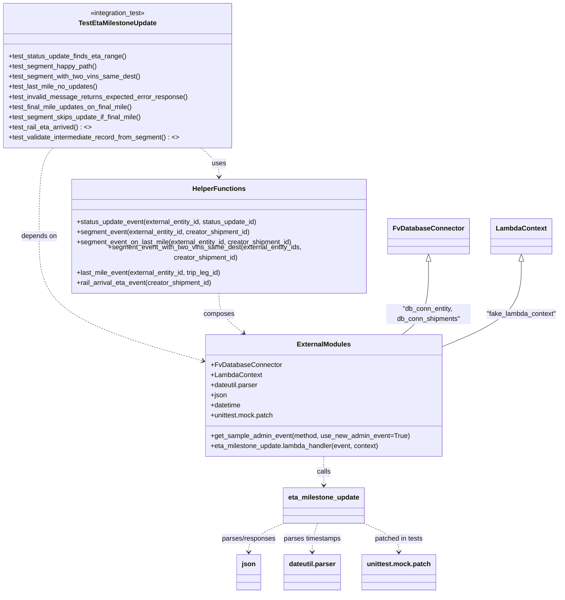

# Diagram: shipment_core/shipment_service/shipment_service/eta/eta_milestone_update/tests/test_eta_milestone_update.py

> Auto-generated by Obscura crawlers

## Mermaid

### SVG

<svg id="container" width="1312.521484375" xmlns="http://www.w3.org/2000/svg" class="classDiagram" height="1380" viewBox="0 0 1312.521484375 1380" role="graphics-document document" aria-roledescription="class"><g><defs><marker id="container_class-aggregationStart" class="marker aggregation class" refX="18" refY="7" markerWidth="190" markerHeight="240" orient="auto"><path d="M 18,7 L9,13 L1,7 L9,1 Z"></path></marker></defs><defs><marker id="container_class-aggregationEnd" class="marker aggregation class" refX="1" refY="7" markerWidth="20" markerHeight="28" orient="auto"><path d="M 18,7 L9,13 L1,7 L9,1 Z"></path></marker></defs><defs><marker id="container_class-extensionStart" class="marker extension class" refX="18" refY="7" markerWidth="190" markerHeight="240" orient="auto"><path d="M 1,7 L18,13 V 1 Z"></path></marker></defs><defs><marker id="container_class-extensionEnd" class="marker extension class" refX="1" refY="7" markerWidth="20" markerHeight="28" orient="auto"><path d="M 1,1 V 13 L18,7 Z"></path></marker></defs><defs><marker id="container_class-compositionStart" class="marker composition class" refX="18" refY="7" markerWidth="190" markerHeight="240" orient="auto"><path d="M 18,7 L9,13 L1,7 L9,1 Z"></path></marker></defs><defs><marker id="container_class-compositionEnd" class="marker composition class" refX="1" refY="7" markerWidth="20" markerHeight="28" orient="auto"><path d="M 18,7 L9,13 L1,7 L9,1 Z"></path></marker></defs><defs><marker id="container_class-dependencyStart" class="marker dependency class" refX="6" refY="7" markerWidth="190" markerHeight="240" orient="auto"><path d="M 5,7 L9,13 L1,7 L9,1 Z"></path></marker></defs><defs><marker id="container_class-dependencyEnd" class="marker dependency class" refX="13" refY="7" markerWidth="20" markerHeight="28" orient="auto"><path d="M 18,7 L9,13 L14,7 L9,1 Z"></path></marker></defs><defs><marker id="container_class-lollipopStart" class="marker lollipop class" refX="13" refY="7" markerWidth="190" markerHeight="240" orient="auto"><circle stroke="black" fill="transparent" cx="7" cy="7" r="6"></circle></marker></defs><defs><marker id="container_class-lollipopEnd" class="marker lollipop class" refX="1" refY="7" markerWidth="190" markerHeight="240" orient="auto"><circle stroke="black" fill="transparent" cx="7" cy="7" r="6"></circle></marker></defs><g class="root"><g class="clusters"></g><g class="edgePaths"><path d="M473.887,350L480.983,356.167C488.079,362.333,502.271,374.667,509.367,386C516.463,397.333,516.463,407.667,516.463,412.833L516.463,418" id="id_TestEtaMilestoneUpdate_HelperFunctions_1" class="edge-thickness-normal edge-pattern-dashed relation" style=";;;" data-edge="true" data-et="edge" data-id="id_TestEtaMilestoneUpdate_HelperFunctions_1" data-points="W3sieCI6NDczLjg4Njk3MjI4MDY0OTA1LCJ5IjozNTB9LHsieCI6NTE2LjQ2Mjg5MDYyNSwieSI6Mzg3fSx7IngiOjUxNi40NjI4OTA2MjUsInkiOjQyNH1d" marker-end="url(#container_class-dependencyEnd)"></path><path d="M120.034,350L114.369,356.167C108.704,362.333,97.375,374.667,91.71,407.5C86.045,440.333,86.045,493.667,86.045,549C86.045,604.333,86.045,661.667,151.439,708.968C216.833,756.268,347.621,793.537,413.015,812.171L478.409,830.805" id="id_TestEtaMilestoneUpdate_ExternalModules_2" class="edge-thickness-normal edge-pattern-dashed relation" style=";;;" data-edge="true" data-et="edge" data-id="id_TestEtaMilestoneUpdate_ExternalModules_2" data-points="W3sieCI6MTIwLjAzMzczODM1NjM3MDE4LCJ5IjozNTB9LHsieCI6ODYuMDQ0OTIxODc1LCJ5IjozODd9LHsieCI6ODYuMDQ0OTIxODc1LCJ5Ijo1NDd9LHsieCI6ODYuMDQ0OTIxODc1LCJ5Ijo3MTl9LHsieCI6NDg0LjE3OTY4NzUsInkiOjgzMi40NDkzNjcxNzk4NjI3fV0=" marker-end="url(#container_class-dependencyEnd)"></path><path d="M516.463,670L516.463,678.167C516.463,686.333,516.463,702.667,526.122,718.384C535.781,734.102,555.099,749.203,564.758,756.754L574.417,764.305" id="id_HelperFunctions_ExternalModules_3" class="edge-thickness-normal edge-pattern-dashed relation" style=";;;" data-edge="true" data-et="edge" data-id="id_HelperFunctions_ExternalModules_3" data-points="W3sieCI6NTE2LjQ2Mjg5MDYyNSwieSI6NjcwfSx7IngiOjUxNi40NjI4OTA2MjUsInkiOjcxOX0seyJ4Ijo1NzkuMTQ0NDcwNTMxMDg4LCJ5Ijo3Njh9XQ==" marker-end="url(#container_class-dependencyEnd)"></path><path d="M763.352,1056L763.352,1062.167C763.352,1068.333,763.352,1080.667,763.352,1092C763.352,1103.333,763.352,1113.667,763.352,1118.833L763.352,1124" id="id_ExternalModules_eta_milestone_update_4" class="edge-thickness-normal edge-pattern-dashed relation" style=";;;" data-edge="true" data-et="edge" data-id="id_ExternalModules_eta_milestone_update_4" data-points="W3sieCI6NzYzLjM1MTU2MjUsInkiOjEwNTZ9LHsieCI6NzYzLjM1MTU2MjUsInkiOjEwOTN9LHsieCI6NzYzLjM1MTU2MjUsInkiOjExMzB9XQ==" marker-end="url(#container_class-dependencyEnd)"></path><path d="M1010.24,606.25L1010.24,625.042C1010.24,643.833,1010.24,681.417,999.793,708.375C989.346,735.333,968.453,751.667,958.006,759.833L947.559,768" id="id_FvDatabaseConnector_ExternalModules_5" class="edge-thickness-normal edge-pattern-solid relation" style=";;;" data-edge="true" data-et="edge" data-id="id_FvDatabaseConnector_ExternalModules_5" data-points="W3sieCI6MTAxMC4yNDAyMzQzNzUsInkiOjU4OX0seyJ4IjoxMDEwLjI0MDIzNDM3NSwieSI6NzE5fSx7IngiOjk0Ny41NTg2NTQ0Njg5MTIsInkiOjc2OH1d" marker-start="url(#container_class-extensionStart)"></path><path d="M1220.842,606.25L1220.842,625.042C1220.842,643.833,1220.842,681.417,1191.122,712.746C1161.402,744.076,1101.963,769.151,1072.243,781.689L1042.523,794.227" id="id_LambdaContext_ExternalModules_6" class="edge-thickness-normal edge-pattern-solid relation" style=";;;" data-edge="true" data-et="edge" data-id="id_LambdaContext_ExternalModules_6" data-points="W3sieCI6MTIyMC44NDE3OTY4NzUsInkiOjU4OX0seyJ4IjoxMjIwLjg0MTc5Njg3NSwieSI6NzE5fSx7IngiOjEwNDIuNTIzNDM3NSwieSI6Nzk0LjIyNjYxODU2NjgyNH1d" marker-start="url(#container_class-extensionStart)"></path><path d="M669.383,1213.86L655.488,1220.05C641.592,1226.24,613.802,1238.62,599.907,1249.977C586.012,1261.333,586.012,1271.667,586.012,1276.833L586.012,1282" id="id_eta_milestone_update_json_7" class="edge-thickness-normal edge-pattern-dashed relation" style=";;;" data-edge="true" data-et="edge" data-id="id_eta_milestone_update_json_7" data-points="W3sieCI6NjY5LjM4MjgxMjUsInkiOjEyMTMuODYwNDgxNTA4NDAzMn0seyJ4Ijo1ODYuMDExNzE4NzUsInkiOjEyNTF9LHsieCI6NTg2LjAxMTcxODc1LCJ5IjoxMjg4fV0=" marker-end="url(#container_class-dependencyEnd)"></path><path d="M750.519,1214L748.635,1220.167C746.751,1226.333,742.983,1238.667,741.099,1250C739.215,1261.333,739.215,1271.667,739.215,1276.833L739.215,1282" id="id_eta_milestone_update_dateutil.parser_8" class="edge-thickness-normal edge-pattern-dashed relation" style=";;;" data-edge="true" data-et="edge" data-id="id_eta_milestone_update_dateutil.parser_8" data-points="W3sieCI6NzUwLjUxOTM4MjkxMTM5MjQsInkiOjEyMTR9LHsieCI6NzM5LjIxNDg0Mzc1LCJ5IjoxMjUxfSx7IngiOjczOS4yMTQ4NDM3NSwieSI6MTI4OH1d" marker-end="url(#container_class-dependencyEnd)"></path><path d="M857.32,1213.86L871.215,1220.05C885.111,1226.24,912.901,1238.62,926.796,1249.977C940.691,1261.333,940.691,1271.667,940.691,1276.833L940.691,1282" id="id_eta_milestone_update_unittest.mock.patch_9" class="edge-thickness-normal edge-pattern-dashed relation" style=";;;" data-edge="true" data-et="edge" data-id="id_eta_milestone_update_unittest.mock.patch_9" data-points="W3sieCI6ODU3LjMyMDMxMjUsInkiOjEyMTMuODYwNDgxNTA4NDAzMn0seyJ4Ijo5NDAuNjkxNDA2MjUsInkiOjEyNTF9LHsieCI6OTQwLjY5MTQwNjI1LCJ5IjoxMjg4fV0=" marker-end="url(#container_class-dependencyEnd)"></path></g><g class="edgeLabels"><g class="edgeLabel" transform="translate(516.462890625, 387)"><g class="label" data-id="id_TestEtaMilestoneUpdate_HelperFunctions_1" transform="translate(-16.4921875, -12)"><foreignObject width="32.984375" height="24">

uses

</foreignObject></g></g><g class="edgeLabel" transform="translate(86.044921875, 547)"><g class="label" data-id="id_TestEtaMilestoneUpdate_ExternalModules_2" transform="translate(-42.9453125, -12)"><foreignObject width="85.890625" height="24">

depends on

</foreignObject></g></g><g class="edgeLabel" transform="translate(516.462890625, 719)"><g class="label" data-id="id_HelperFunctions_ExternalModules_3" transform="translate(-36.453125, -12)"><foreignObject width="72.90625" height="24">

composes

</foreignObject></g></g><g class="edgeLabel" transform="translate(763.3515625, 1093)"><g class="label" data-id="id_ExternalModules_eta_milestone_update_4" transform="translate(-16.4453125, -12)"><foreignObject width="32.890625" height="24">

calls

</foreignObject></g></g><g class="edgeLabel" transform="translate(1010.240234375, 719)"><g class="label" data-id="id_FvDatabaseConnector_ExternalModules_5" transform="translate(-100, -24)"><foreignObject width="200" height="48">

"db_conn_entity, db_conn_shipments"

</foreignObject></g></g><g class="edgeLabel" transform="translate(1220.841796875, 719)"><g class="label" data-id="id_LambdaContext_ExternalModules_6" transform="translate(-83.6796875, -12)"><foreignObject width="167.359375" height="24">

"fake_lambda_context"

</foreignObject></g></g><g class="edgeLabel" transform="translate(586.01171875, 1251)"><g class="label" data-id="id_eta_milestone_update_json_7" transform="translate(-64.6328125, -12)"><foreignObject width="129.265625" height="24">

parses/responses

</foreignObject></g></g><g class="edgeLabel" transform="translate(739.21484375, 1251)"><g class="label" data-id="id_eta_milestone_update_dateutil.parser_8" transform="translate(-68.5703125, -12)"><foreignObject width="137.140625" height="24">

parses timestamps

</foreignObject></g></g><g class="edgeLabel" transform="translate(940.69140625, 1251)"><g class="label" data-id="id_eta_milestone_update_unittest.mock.patch_9" transform="translate(-58.125, -12)"><foreignObject width="116.25" height="24">

patched in tests

</foreignObject></g></g></g><g class="nodes"><g class="node default" id="classId-TestEtaMilestoneUpdate-0" transform="translate(277.1171875, 179)"><g class="basic label-container"><path d="M-269.1171875 -171 L269.1171875 -171 L269.1171875 171 L-269.1171875 171" stroke="none" stroke-width="0" fill="#ECECFF" style=""></path><path d="M-269.1171875 -171 C-137.54839500148813 -171, -5.979602502976263 -171, 269.1171875 -171 M-269.1171875 -171 C-94.15836096492563 -171, 80.80046557014873 -171, 269.1171875 -171 M269.1171875 -171 C269.1171875 -100.27280480123149, 269.1171875 -29.545609602462974, 269.1171875 171 M269.1171875 -171 C269.1171875 -69.66720969330616, 269.1171875 31.665580613387675, 269.1171875 171 M269.1171875 171 C140.08962278491308 171, 11.06205806982615 171, -269.1171875 171 M269.1171875 171 C132.14048938909457 171, -4.836208721810863 171, -269.1171875 171 M-269.1171875 171 C-269.1171875 102.2952029752822, -269.1171875 33.59040595056439, -269.1171875 -171 M-269.1171875 171 C-269.1171875 59.214395624823354, -269.1171875 -52.57120875035329, -269.1171875 -171" stroke="#9370DB" stroke-width="1.3" fill="none" stroke-dasharray="0 0" style=""></path></g><g class="annotation-group text" transform="translate(-66.78125, -147)"><g class="label" style="" transform="translate(0,-12)"><foreignObject width="133.5625" height="24">

«integration_test»

</foreignObject></g></g><g class="label-group text" transform="translate(-89.03125, -123)"><g class="label" style="font-weight: bolder" transform="translate(0,-12)"><foreignObject width="178.0625" height="24">

TestEtaMilestoneUpdate

</foreignObject></g></g><g class="members-group text" transform="translate(-257.1171875, -75)"></g><g class="methods-group text" transform="translate(-257.1171875, -45)"><g class="label" style="" transform="translate(0,-12)"><foreignObject width="280.390625" height="24">

+test_status_update_finds_eta_range()

</foreignObject></g><g class="label" style="" transform="translate(0,12)"><foreignObject width="210.453125" height="24">

+test_segment_happy_path()

</foreignObject></g><g class="label" style="" transform="translate(0,36)"><foreignObject width="312.34375" height="24">

+test_segment_with_two_vins_same_dest()

</foreignObject></g><g class="label" style="" transform="translate(0,60)"><foreignObject width="213.4375" height="24">

+test_last_mile_no_updates()

</foreignObject></g><g class="label" style="" transform="translate(0,84)"><foreignObject width="425.203125" height="24">

+test_invalid_message_returns_expected_error_response()

</foreignObject></g><g class="label" style="" transform="translate(0,108)"><foreignObject width="298.046875" height="24">

+test_final_mile_updates_on_final_mile()

</foreignObject></g><g class="label" style="" transform="translate(0,132)"><foreignObject width="317.765625" height="24">

+test_segment_skips_update_if_final_mile()

</foreignObject></g><g class="label" style="" transform="translate(0,156)"><foreignObject width="196.703125" height="24">

+test_rail_eta_arrived() : &lt;&gt;

</foreignObject></g><g class="label" style="" transform="translate(0,180)"><foreignObject width="408.5" height="24">

+test_validate_intermediate_record_from_segment() : &lt;&gt;

</foreignObject></g></g><g class="divider" style=""><path d="M-269.1171875 -99 C-161.46295096388815 -99, -53.808714427776295 -99, 269.1171875 -99 M-269.1171875 -99 C-86.68036832616502 -99, 95.75645084766995 -99, 269.1171875 -99" stroke="#9370DB" stroke-width="1.3" fill="none" stroke-dasharray="0 0" style=""></path></g><g class="divider" style=""><path d="M-269.1171875 -75 C-54.80476418879434 -75, 159.50765912241133 -75, 269.1171875 -75 M-269.1171875 -75 C-129.26450572257053 -75, 10.588176054858934 -75, 269.1171875 -75" stroke="#9370DB" stroke-width="1.3" fill="none" stroke-dasharray="0 0" style=""></path></g></g><g class="node default" id="classId-HelperFunctions-1" transform="translate(516.462890625, 547)"><g class="basic label-container"><path d="M-352.47265625 -123 L352.47265625 -123 L352.47265625 123 L-352.47265625 123" stroke="none" stroke-width="0" fill="#ECECFF" style=""></path><path d="M-352.47265625 -123 C-210.166441832804 -123, -67.860227415608 -123, 352.47265625 -123 M-352.47265625 -123 C-91.52885450823499 -123, 169.41494723353003 -123, 352.47265625 -123 M352.47265625 -123 C352.47265625 -35.684830985946874, 352.47265625 51.63033802810625, 352.47265625 123 M352.47265625 -123 C352.47265625 -68.4515083188338, 352.47265625 -13.903016637667605, 352.47265625 123 M352.47265625 123 C135.07732742013303 123, -82.31800140973394 123, -352.47265625 123 M352.47265625 123 C133.95595019258988 123, -84.56075586482024 123, -352.47265625 123 M-352.47265625 123 C-352.47265625 27.938346545282286, -352.47265625 -67.12330690943543, -352.47265625 -123 M-352.47265625 123 C-352.47265625 34.77301794087715, -352.47265625 -53.45396411824569, -352.47265625 -123" stroke="#9370DB" stroke-width="1.3" fill="none" stroke-dasharray="0 0" style=""></path></g><g class="annotation-group text" transform="translate(0, -99)"></g><g class="label-group text" transform="translate(-59.6484375, -99)"><g class="label" style="font-weight: bolder" transform="translate(0,-12)"><foreignObject width="119.296875" height="24">

HelperFunctions

</foreignObject></g></g><g class="members-group text" transform="translate(-340.47265625, -51)"></g><g class="methods-group text" transform="translate(-340.47265625, -21)"><g class="label" style="" transform="translate(0,-12)"><foreignObject width="434.625" height="24">

+status_update_event(external_entity_id, status_update_id)

</foreignObject></g><g class="label" style="" transform="translate(0,12)"><foreignObject width="417.671875" height="24">

+segment_event(external_entity_id, creator_shipment_id)

</foreignObject></g><g class="label" style="" transform="translate(0,36)"><foreignObject width="518.828125" height="24">

+segment_event_on_last_mile(external_entity_id, creator_shipment_id)

</foreignObject></g><g class="label" style="" transform="translate(0,60)"><foreignObject width="621.296875" height="24">

+segment_event_with_two_vins_same_dest(external_entity_ids, creator_shipment_id)

</foreignObject></g><g class="label" style="" transform="translate(0,84)"><foreignObject width="349.890625" height="24">

+last_mile_event(external_entity_id, trip_leg_id)

</foreignObject></g><g class="label" style="" transform="translate(0,108)"><foreignObject width="325.265625" height="24">

+rail_arrival_eta_event(creator_shipment_id)

</foreignObject></g></g><g class="divider" style=""><path d="M-352.47265625 -75 C-177.20313689399757 -75, -1.9336175379951328 -75, 352.47265625 -75 M-352.47265625 -75 C-103.60279897306 -75, 145.26705830388 -75, 352.47265625 -75" stroke="#9370DB" stroke-width="1.3" fill="none" stroke-dasharray="0 0" style=""></path></g><g class="divider" style=""><path d="M-352.47265625 -51 C-71.21070311125368 -51, 210.05125002749264 -51, 352.47265625 -51 M-352.47265625 -51 C-92.99791258534043 -51, 166.47683107931914 -51, 352.47265625 -51" stroke="#9370DB" stroke-width="1.3" fill="none" stroke-dasharray="0 0" style=""></path></g></g><g class="node default" id="classId-ExternalModules-2" transform="translate(763.3515625, 912)"><g class="basic label-container"><path d="M-279.171875 -144 L279.171875 -144 L279.171875 144 L-279.171875 144" stroke="none" stroke-width="0" fill="#ECECFF" style=""></path><path d="M-279.171875 -144 C-99.0249134598485 -144, 81.12204808030299 -144, 279.171875 -144 M-279.171875 -144 C-139.52608442013008 -144, 0.11970615973984877 -144, 279.171875 -144 M279.171875 -144 C279.171875 -49.890226714870735, 279.171875 44.21954657025853, 279.171875 144 M279.171875 -144 C279.171875 -62.40960210966924, 279.171875 19.180795780661526, 279.171875 144 M279.171875 144 C120.11709293447953 144, -38.93768913104094 144, -279.171875 144 M279.171875 144 C159.0174694476493 144, 38.86306389529858 144, -279.171875 144 M-279.171875 144 C-279.171875 44.2949197048504, -279.171875 -55.4101605902992, -279.171875 -144 M-279.171875 144 C-279.171875 54.92731122233971, -279.171875 -34.14537755532058, -279.171875 -144" stroke="#9370DB" stroke-width="1.3" fill="none" stroke-dasharray="0 0" style=""></path></g><g class="annotation-group text" transform="translate(0, -120)"></g><g class="label-group text" transform="translate(-61.125, -120)"><g class="label" style="font-weight: bolder" transform="translate(0,-12)"><foreignObject width="122.25" height="24">

ExternalModules

</foreignObject></g></g><g class="members-group text" transform="translate(-267.171875, -72)"><g class="label" style="" transform="translate(0,-12)"><foreignObject width="164.609375" height="24">

+FvDatabaseConnector

</foreignObject></g><g class="label" style="" transform="translate(0,12)"><foreignObject width="121" height="24">

+LambdaContext

</foreignObject></g><g class="label" style="" transform="translate(0,36)"><foreignObject width="115.0625" height="24">

+dateutil.parser

</foreignObject></g><g class="label" style="" transform="translate(0,60)"><foreignObject width="38.5" height="24">

+json

</foreignObject></g><g class="label" style="" transform="translate(0,84)"><foreignObject width="73.234375" height="24">

+datetime

</foreignObject></g><g class="label" style="" transform="translate(0,108)"><foreignObject width="151.78125" height="24">

+unittest.mock.patch

</foreignObject></g></g><g class="methods-group text" transform="translate(-267.171875, 96)"><g class="label" style="" transform="translate(0,-12)"><foreignObject width="473.21875" height="24">

+get_sample_admin_event(method, use_new_admin_event=True)

</foreignObject></g><g class="label" style="" transform="translate(0,12)"><foreignObject width="406.296875" height="24">

+eta_milestone_update.lambda_handler(event, context)

</foreignObject></g></g><g class="divider" style=""><path d="M-279.171875 -96 C-164.99153745762837 -96, -50.811199915256736 -96, 279.171875 -96 M-279.171875 -96 C-122.57128894163347 -96, 34.02929711673306 -96, 279.171875 -96" stroke="#9370DB" stroke-width="1.3" fill="none" stroke-dasharray="0 0" style=""></path></g><g class="divider" style=""><path d="M-279.171875 72 C-89.55147434175234 72, 100.06892631649532 72, 279.171875 72 M-279.171875 72 C-70.2400790048323 72, 138.6917169903354 72, 279.171875 72" stroke="#9370DB" stroke-width="1.3" fill="none" stroke-dasharray="0 0" style=""></path></g></g><g class="node default" id="classId-eta_milestone_update-3" transform="translate(763.3515625, 1172)"><g class="basic label-container"><path d="M-93.96875 -42 L93.96875 -42 L93.96875 42 L-93.96875 42" stroke="none" stroke-width="0" fill="#ECECFF" style=""></path><path d="M-93.96875 -42 C-48.73087124614488 -42, -3.4929924922897584 -42, 93.96875 -42 M-93.96875 -42 C-21.16417910206225 -42, 51.6403917958755 -42, 93.96875 -42 M93.96875 -42 C93.96875 -16.72488629513679, 93.96875 8.550227409726418, 93.96875 42 M93.96875 -42 C93.96875 -24.572716984315154, 93.96875 -7.145433968630307, 93.96875 42 M93.96875 42 C31.136186609055272 42, -31.696376781889455 42, -93.96875 42 M93.96875 42 C28.741495587284575 42, -36.48575882543085 42, -93.96875 42 M-93.96875 42 C-93.96875 13.870238023482184, -93.96875 -14.259523953035632, -93.96875 -42 M-93.96875 42 C-93.96875 22.461482305684825, -93.96875 2.9229646113696504, -93.96875 -42" stroke="#9370DB" stroke-width="1.3" fill="none" stroke-dasharray="0 0" style=""></path></g><g class="annotation-group text" transform="translate(0, -18)"></g><g class="label-group text" transform="translate(-81.96875, -18)"><g class="label" style="font-weight: bolder" transform="translate(0,-12)"><foreignObject width="163.9375" height="24">

eta_milestone_update

</foreignObject></g></g><g class="members-group text" transform="translate(-81.96875, 30)"></g><g class="methods-group text" transform="translate(-81.96875, 60)"></g><g class="divider" style=""><path d="M-93.96875 6 C-21.11448010014506 6, 51.73978979970988 6, 93.96875 6 M-93.96875 6 C-32.37536367543713 6, 29.218022649125743 6, 93.96875 6" stroke="#9370DB" stroke-width="1.3" fill="none" stroke-dasharray="0 0" style=""></path></g><g class="divider" style=""><path d="M-93.96875 24 C-32.42663625052524 24, 29.115477498949517 24, 93.96875 24 M-93.96875 24 C-33.33822732578098 24, 27.292295348438046 24, 93.96875 24" stroke="#9370DB" stroke-width="1.3" fill="none" stroke-dasharray="0 0" style=""></path></g></g><g class="node default" id="classId-FvDatabaseConnector-4" transform="translate(1010.240234375, 547)"><g class="basic label-container"><path d="M-91.3046875 -42 L91.3046875 -42 L91.3046875 42 L-91.3046875 42" stroke="none" stroke-width="0" fill="#ECECFF" style=""></path><path d="M-91.3046875 -42 C-29.362770104004305 -42, 32.57914729199139 -42, 91.3046875 -42 M-91.3046875 -42 C-28.436309154463366 -42, 34.43206919107327 -42, 91.3046875 -42 M91.3046875 -42 C91.3046875 -22.692583721590267, 91.3046875 -3.385167443180535, 91.3046875 42 M91.3046875 -42 C91.3046875 -22.98913807386487, 91.3046875 -3.978276147729737, 91.3046875 42 M91.3046875 42 C49.74535884978972 42, 8.186030199579434 42, -91.3046875 42 M91.3046875 42 C23.94599900596623 42, -43.41268948806754 42, -91.3046875 42 M-91.3046875 42 C-91.3046875 23.2186397597651, -91.3046875 4.4372795195302, -91.3046875 -42 M-91.3046875 42 C-91.3046875 10.116624183135038, -91.3046875 -21.766751633729925, -91.3046875 -42" stroke="#9370DB" stroke-width="1.3" fill="none" stroke-dasharray="0 0" style=""></path></g><g class="annotation-group text" transform="translate(0, -18)"></g><g class="label-group text" transform="translate(-79.3046875, -18)"><g class="label" style="font-weight: bolder" transform="translate(0,-12)"><foreignObject width="158.609375" height="24">

FvDatabaseConnector

</foreignObject></g></g><g class="members-group text" transform="translate(-79.3046875, 30)"></g><g class="methods-group text" transform="translate(-79.3046875, 60)"></g><g class="divider" style=""><path d="M-91.3046875 6 C-24.613920985893046 6, 42.07684552821391 6, 91.3046875 6 M-91.3046875 6 C-51.08913317503208 6, -10.873578850064163 6, 91.3046875 6" stroke="#9370DB" stroke-width="1.3" fill="none" stroke-dasharray="0 0" style=""></path></g><g class="divider" style=""><path d="M-91.3046875 24 C-43.388297107387174 24, 4.528093285225651 24, 91.3046875 24 M-91.3046875 24 C-25.10737093229568 24, 41.08994563540864 24, 91.3046875 24" stroke="#9370DB" stroke-width="1.3" fill="none" stroke-dasharray="0 0" style=""></path></g></g><g class="node default" id="classId-LambdaContext-5" transform="translate(1220.841796875, 547)"><g class="basic label-container"><path d="M-69.296875 -42 L69.296875 -42 L69.296875 42 L-69.296875 42" stroke="none" stroke-width="0" fill="#ECECFF" style=""></path><path d="M-69.296875 -42 C-40.24867781842988 -42, -11.200480636859773 -42, 69.296875 -42 M-69.296875 -42 C-35.699476557107616 -42, -2.1020781142152316 -42, 69.296875 -42 M69.296875 -42 C69.296875 -13.921609561742123, 69.296875 14.156780876515754, 69.296875 42 M69.296875 -42 C69.296875 -21.811174253197976, 69.296875 -1.6223485063959515, 69.296875 42 M69.296875 42 C20.030026728813795 42, -29.23682154237241 42, -69.296875 42 M69.296875 42 C28.550945873354635 42, -12.19498325329073 42, -69.296875 42 M-69.296875 42 C-69.296875 11.4864032211451, -69.296875 -19.0271935577098, -69.296875 -42 M-69.296875 42 C-69.296875 24.83516413797021, -69.296875 7.67032827594042, -69.296875 -42" stroke="#9370DB" stroke-width="1.3" fill="none" stroke-dasharray="0 0" style=""></path></g><g class="annotation-group text" transform="translate(0, -18)"></g><g class="label-group text" transform="translate(-57.296875, -18)"><g class="label" style="font-weight: bolder" transform="translate(0,-12)"><foreignObject width="114.59375" height="24">

LambdaContext

</foreignObject></g></g><g class="members-group text" transform="translate(-57.296875, 30)"></g><g class="methods-group text" transform="translate(-57.296875, 60)"></g><g class="divider" style=""><path d="M-69.296875 6 C-18.376390051122264 6, 32.54409489775547 6, 69.296875 6 M-69.296875 6 C-13.932753081874232 6, 41.431368836251536 6, 69.296875 6" stroke="#9370DB" stroke-width="1.3" fill="none" stroke-dasharray="0 0" style=""></path></g><g class="divider" style=""><path d="M-69.296875 24 C-32.03410372959049 24, 5.228667540819018 24, 69.296875 24 M-69.296875 24 C-38.50964769074328 24, -7.72242038148655 24, 69.296875 24" stroke="#9370DB" stroke-width="1.3" fill="none" stroke-dasharray="0 0" style=""></path></g></g><g class="node default" id="classId-json-6" transform="translate(586.01171875, 1330)"><g class="basic label-container"><path d="M-27.40625 -42 L27.40625 -42 L27.40625 42 L-27.40625 42" stroke="none" stroke-width="0" fill="#ECECFF" style=""></path><path d="M-27.40625 -42 C-14.761260386217995 -42, -2.116270772435989 -42, 27.40625 -42 M-27.40625 -42 C-9.391800835582423 -42, 8.622648328835155 -42, 27.40625 -42 M27.40625 -42 C27.40625 -9.507383467525209, 27.40625 22.985233064949583, 27.40625 42 M27.40625 -42 C27.40625 -24.135210745015698, 27.40625 -6.270421490031396, 27.40625 42 M27.40625 42 C7.014071963706968 42, -13.378106072586064 42, -27.40625 42 M27.40625 42 C14.748710720045947 42, 2.0911714400918946 42, -27.40625 42 M-27.40625 42 C-27.40625 21.1364920405661, -27.40625 0.27298408113220063, -27.40625 -42 M-27.40625 42 C-27.40625 21.080007953220836, -27.40625 0.16001590644167152, -27.40625 -42" stroke="#9370DB" stroke-width="1.3" fill="none" stroke-dasharray="0 0" style=""></path></g><g class="annotation-group text" transform="translate(0, -18)"></g><g class="label-group text" transform="translate(-15.40625, -18)"><g class="label" style="font-weight: bolder" transform="translate(0,-12)"><foreignObject width="30.8125" height="24">

json

</foreignObject></g></g><g class="members-group text" transform="translate(-15.40625, 30)"></g><g class="methods-group text" transform="translate(-15.40625, 60)"></g><g class="divider" style=""><path d="M-27.40625 6 C-10.680757955528076 6, 6.044734088943848 6, 27.40625 6 M-27.40625 6 C-6.975210262765053 6, 13.455829474469894 6, 27.40625 6" stroke="#9370DB" stroke-width="1.3" fill="none" stroke-dasharray="0 0" style=""></path></g><g class="divider" style=""><path d="M-27.40625 24 C-9.991721207226988 24, 7.422807585546025 24, 27.40625 24 M-27.40625 24 C-11.771503042477104 24, 3.8632439150457927 24, 27.40625 24" stroke="#9370DB" stroke-width="1.3" fill="none" stroke-dasharray="0 0" style=""></path></g></g><g class="node default" id="classId-dateutil.parser-7" transform="translate(739.21484375, 1330)"><g class="basic label-container"><path d="M-66.5078125 -42 L66.5078125 -42 L66.5078125 42 L-66.5078125 42" stroke="none" stroke-width="0" fill="#ECECFF" style=""></path><path d="M-66.5078125 -42 C-23.803299423986573 -42, 18.901213652026854 -42, 66.5078125 -42 M-66.5078125 -42 C-24.954803088241746 -42, 16.598206323516507 -42, 66.5078125 -42 M66.5078125 -42 C66.5078125 -22.952738051661164, 66.5078125 -3.9054761033223286, 66.5078125 42 M66.5078125 -42 C66.5078125 -24.032132502447432, 66.5078125 -6.064265004894864, 66.5078125 42 M66.5078125 42 C28.33586069920588 42, -9.836091101588238 42, -66.5078125 42 M66.5078125 42 C35.240225318554515 42, 3.97263813710903 42, -66.5078125 42 M-66.5078125 42 C-66.5078125 14.131950376198603, -66.5078125 -13.736099247602795, -66.5078125 -42 M-66.5078125 42 C-66.5078125 13.530681754766078, -66.5078125 -14.938636490467843, -66.5078125 -42" stroke="#9370DB" stroke-width="1.3" fill="none" stroke-dasharray="0 0" style=""></path></g><g class="annotation-group text" transform="translate(0, -18)"></g><g class="label-group text" transform="translate(-54.5078125, -18)"><g class="label" style="font-weight: bolder" transform="translate(0,-12)"><foreignObject width="109.015625" height="24">

dateutil.parser

</foreignObject></g></g><g class="members-group text" transform="translate(-54.5078125, 30)"></g><g class="methods-group text" transform="translate(-54.5078125, 60)"></g><g class="divider" style=""><path d="M-66.5078125 6 C-35.37929907788264 6, -4.250785655765284 6, 66.5078125 6 M-66.5078125 6 C-16.998741711468767 6, 32.510329077062465 6, 66.5078125 6" stroke="#9370DB" stroke-width="1.3" fill="none" stroke-dasharray="0 0" style=""></path></g><g class="divider" style=""><path d="M-66.5078125 24 C-30.208759961326564 24, 6.090292577346872 24, 66.5078125 24 M-66.5078125 24 C-31.244321565831754 24, 4.019169368336492 24, 66.5078125 24" stroke="#9370DB" stroke-width="1.3" fill="none" stroke-dasharray="0 0" style=""></path></g></g><g class="node default" id="classId-unittest.mock.patch-8" transform="translate(940.69140625, 1330)"><g class="basic label-container"><path d="M-84.96875 -42 L84.96875 -42 L84.96875 42 L-84.96875 42" stroke="none" stroke-width="0" fill="#ECECFF" style=""></path><path d="M-84.96875 -42 C-21.2069000228571 -42, 42.5549499542858 -42, 84.96875 -42 M-84.96875 -42 C-41.70731661298941 -42, 1.5541167740211819 -42, 84.96875 -42 M84.96875 -42 C84.96875 -21.50236845669432, 84.96875 -1.0047369133886406, 84.96875 42 M84.96875 -42 C84.96875 -15.555237785772267, 84.96875 10.889524428455466, 84.96875 42 M84.96875 42 C45.47899675705014 42, 5.989243514100281 42, -84.96875 42 M84.96875 42 C28.50830765179711 42, -27.95213469640578 42, -84.96875 42 M-84.96875 42 C-84.96875 18.053271088701358, -84.96875 -5.893457822597284, -84.96875 -42 M-84.96875 42 C-84.96875 24.568771973941743, -84.96875 7.137543947883486, -84.96875 -42" stroke="#9370DB" stroke-width="1.3" fill="none" stroke-dasharray="0 0" style=""></path></g><g class="annotation-group text" transform="translate(0, -18)"></g><g class="label-group text" transform="translate(-72.96875, -18)"><g class="label" style="font-weight: bolder" transform="translate(0,-12)"><foreignObject width="145.9375" height="24">

unittest.mock.patch

</foreignObject></g></g><g class="members-group text" transform="translate(-72.96875, 30)"></g><g class="methods-group text" transform="translate(-72.96875, 60)"></g><g class="divider" style=""><path d="M-84.96875 6 C-26.42962777551044 6, 32.10949444897912 6, 84.96875 6 M-84.96875 6 C-25.693525327959513 6, 33.581699344080974 6, 84.96875 6" stroke="#9370DB" stroke-width="1.3" fill="none" stroke-dasharray="0 0" style=""></path></g><g class="divider" style=""><path d="M-84.96875 24 C-36.465790506768265 24, 12.03716898646347 24, 84.96875 24 M-84.96875 24 C-25.628070634699725 24, 33.71260873060055 24, 84.96875 24" stroke="#9370DB" stroke-width="1.3" fill="none" stroke-dasharray="0 0" style=""></path></g></g></g></g></g></svg>
