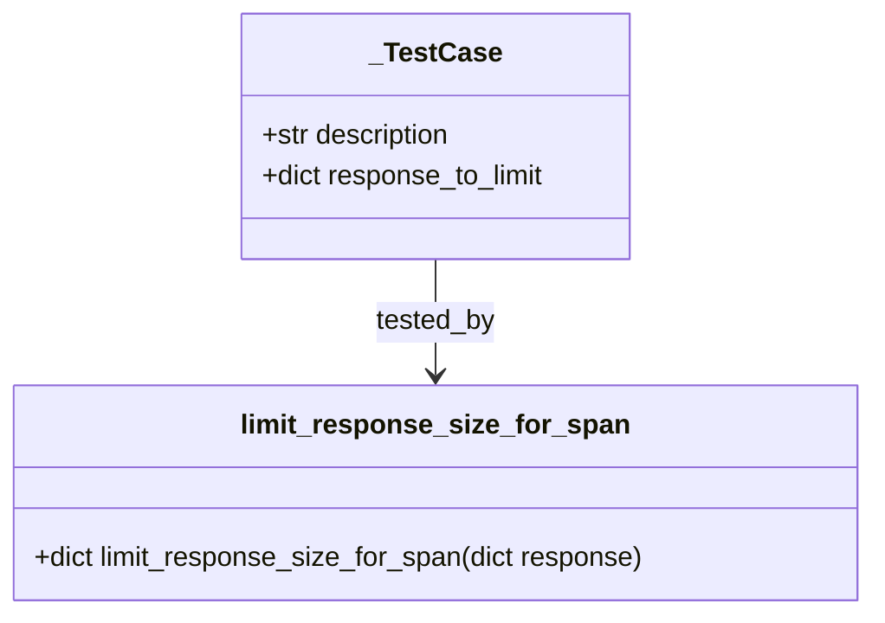

# Diagram: shipment_core/shipment_service/shipment_service/eta/eta_milestone_update/tests/test_limit_response_span_size.py


> Auto-generated by Obscura crawlers

## Diagram 1



### SVG

<svg id="container" width="510.0859375" xmlns="http://www.w3.org/2000/svg" class="classDiagram" height="360" viewBox="0 0 510.0859375 360" role="graphics-document document" aria-roledescription="class"><style>#container{font-family:"trebuchet ms",verdana,arial,sans-serif;font-size:16px;fill:#333;}@keyframes edge-animation-frame{from{stroke-dashoffset:0;}}@keyframes dash{to{stroke-dashoffset:0;}}#container .edge-animation-slow{stroke-dasharray:9,5!important;stroke-dashoffset:900;animation:dash 50s linear infinite;stroke-linecap:round;}#container .edge-animation-fast{stroke-dasharray:9,5!important;stroke-dashoffset:900;animation:dash 20s linear infinite;stroke-linecap:round;}#container .error-icon{fill:#552222;}#container .error-text{fill:#552222;stroke:#552222;}#container .edge-thickness-normal{stroke-width:1px;}#container .edge-thickness-thick{stroke-width:3.5px;}#container .edge-pattern-solid{stroke-dasharray:0;}#container .edge-thickness-invisible{stroke-width:0;fill:none;}#container .edge-pattern-dashed{stroke-dasharray:3;}#container .edge-pattern-dotted{stroke-dasharray:2;}#container .marker{fill:#333333;stroke:#333333;}#container .marker.cross{stroke:#333333;}#container svg{font-family:"trebuchet ms",verdana,arial,sans-serif;font-size:16px;}#container p{margin:0;}#container g.classGroup text{fill:#9370DB;stroke:none;font-family:"trebuchet ms",verdana,arial,sans-serif;font-size:10px;}#container g.classGroup text .title{font-weight:bolder;}#container .nodeLabel,#container .edgeLabel{color:#131300;}#container .edgeLabel .label rect{fill:#ECECFF;}#container .label text{fill:#131300;}#container .labelBkg{background:#ECECFF;}#container .edgeLabel .label span{background:#ECECFF;}#container .classTitle{font-weight:bolder;}#container .node rect,#container .node circle,#container .node ellipse,#container .node polygon,#container .node path{fill:#ECECFF;stroke:#9370DB;stroke-width:1px;}#container .divider{stroke:#9370DB;stroke-width:1;}#container g.clickable{cursor:pointer;}#container g.classGroup rect{fill:#ECECFF;stroke:#9370DB;}#container g.classGroup line{stroke:#9370DB;stroke-width:1;}#container .classLabel .box{stroke:none;stroke-width:0;fill:#ECECFF;opacity:0.5;}#container .classLabel .label{fill:#9370DB;font-size:10px;}#container .relation{stroke:#333333;stroke-width:1;fill:none;}#container .dashed-line{stroke-dasharray:3;}#container .dotted-line{stroke-dasharray:1 2;}#container #compositionStart,#container .composition{fill:#333333!important;stroke:#333333!important;stroke-width:1;}#container #compositionEnd,#container .composition{fill:#333333!important;stroke:#333333!important;stroke-width:1;}#container #dependencyStart,#container .dependency{fill:#333333!important;stroke:#333333!important;stroke-width:1;}#container #dependencyStart,#container .dependency{fill:#333333!important;stroke:#333333!important;stroke-width:1;}#container #extensionStart,#container .extension{fill:transparent!important;stroke:#333333!important;stroke-width:1;}#container #extensionEnd,#container .extension{fill:transparent!important;stroke:#333333!important;stroke-width:1;}#container #aggregationStart,#container .aggregation{fill:transparent!important;stroke:#333333!important;stroke-width:1;}#container #aggregationEnd,#container .aggregation{fill:transparent!important;stroke:#333333!important;stroke-width:1;}#container #lollipopStart,#container .lollipop{fill:#ECECFF!important;stroke:#333333!important;stroke-width:1;}#container #lollipopEnd,#container .lollipop{fill:#ECECFF!important;stroke:#333333!important;stroke-width:1;}#container .edgeTerminals{font-size:11px;line-height:initial;}#container .classTitleText{text-anchor:middle;font-size:18px;fill:#333;}#container .label-icon{display:inline-block;height:1em;overflow:visible;vertical-align:-0.125em;}#container .node .label-icon path{fill:currentColor;stroke:revert;stroke-width:revert;}#container :root{--mermaid-font-family:"trebuchet ms",verdana,arial,sans-serif;}</style><g><defs><marker id="container_class-aggregationStart" class="marker aggregation class" refX="18" refY="7" markerWidth="190" markerHeight="240" orient="auto"><path d="M 18,7 L9,13 L1,7 L9,1 Z"></path></marker></defs><defs><marker id="container_class-aggregationEnd" class="marker aggregation class" refX="1" refY="7" markerWidth="20" markerHeight="28" orient="auto"><path d="M 18,7 L9,13 L1,7 L9,1 Z"></path></marker></defs><defs><marker id="container_class-extensionStart" class="marker extension class" refX="18" refY="7" markerWidth="190" markerHeight="240" orient="auto"><path d="M 1,7 L18,13 V 1 Z"></path></marker></defs><defs><marker id="container_class-extensionEnd" class="marker extension class" refX="1" refY="7" markerWidth="20" markerHeight="28" orient="auto"><path d="M 1,1 V 13 L18,7 Z"></path></marker></defs><defs><marker id="container_class-compositionStart" class="marker composition class" refX="18" refY="7" markerWidth="190" markerHeight="240" orient="auto"><path d="M 18,7 L9,13 L1,7 L9,1 Z"></path></marker></defs><defs><marker id="container_class-compositionEnd" class="marker composition class" refX="1" refY="7" markerWidth="20" markerHeight="28" orient="auto"><path d="M 18,7 L9,13 L1,7 L9,1 Z"></path></marker></defs><defs><marker id="container_class-dependencyStart" class="marker dependency class" refX="6" refY="7" markerWidth="190" markerHeight="240" orient="auto"><path d="M 5,7 L9,13 L1,7 L9,1 Z"></path></marker></defs><defs><marker id="container_class-dependencyEnd" class="marker dependency class" refX="13" refY="7" markerWidth="20" markerHeight="28" orient="auto"><path d="M 18,7 L9,13 L14,7 L9,1 Z"></path></marker></defs><defs><marker id="container_class-lollipopStart" class="marker lollipop class" refX="13" refY="7" markerWidth="190" markerHeight="240" orient="auto"><circle stroke="black" fill="transparent" cx="7" cy="7" r="6"></circle></marker></defs><defs><marker id="container_class-lollipopEnd" class="marker lollipop class" refX="1" refY="7" markerWidth="190" markerHeight="240" orient="auto"><circle stroke="black" fill="transparent" cx="7" cy="7" r="6"></circle></marker></defs><g class="root"><g class="clusters"></g><g class="edgePaths"><path d="M255.043,152L255.043,158.167C255.043,164.333,255.043,176.667,255.043,188C255.043,199.333,255.043,209.667,255.043,214.833L255.043,220" id="id__TestCase_limit_response_size_for_span_1" class="edge-thickness-normal edge-pattern-solid relation" style=";;;" data-edge="true" data-et="edge" data-id="id__TestCase_limit_response_size_for_span_1" data-points="W3sieCI6MjU1LjA0Mjk2ODc1LCJ5IjoxNTJ9LHsieCI6MjU1LjA0Mjk2ODc1LCJ5IjoxODl9LHsieCI6MjU1LjA0Mjk2ODc1LCJ5IjoyMjZ9XQ==" marker-end="url(#container_class-dependencyEnd)"></path></g><g class="edgeLabels"><g class="edgeLabel" transform="translate(255.04296875, 189)"><g class="label" data-id="id__TestCase_limit_response_size_for_span_1" transform="translate(-35.59375, -12)"><foreignObject width="71.1875" height="24"><div xmlns="http://www.w3.org/1999/xhtml" class="labelBkg" style="display: table-cell; white-space: nowrap; line-height: 1.5; max-width: 200px; text-align: center;"><span class="edgeLabel"><p>tested_by</p></span></div></foreignObject></g></g></g><g class="nodes"><g class="node default" id="classId-_TestCase-0" transform="translate(255.04296875, 80)"><g class="basic label-container"><path d="M-114.87890625 -72 L114.87890625 -72 L114.87890625 72 L-114.87890625 72" stroke="none" stroke-width="0" fill="#ECECFF" style=""></path><path d="M-114.87890625 -72 C-28.96794357975756 -72, 56.94301909048488 -72, 114.87890625 -72 M-114.87890625 -72 C-56.69858240750635 -72, 1.481741434987299 -72, 114.87890625 -72 M114.87890625 -72 C114.87890625 -42.689336940957276, 114.87890625 -13.378673881914551, 114.87890625 72 M114.87890625 -72 C114.87890625 -26.511001524147858, 114.87890625 18.977996951704284, 114.87890625 72 M114.87890625 72 C30.03998611772319 72, -54.79893401455362 72, -114.87890625 72 M114.87890625 72 C59.877976794446646 72, 4.877047338893291 72, -114.87890625 72 M-114.87890625 72 C-114.87890625 19.467648453603296, -114.87890625 -33.06470309279341, -114.87890625 -72 M-114.87890625 72 C-114.87890625 35.31214981136835, -114.87890625 -1.3757003772632999, -114.87890625 -72" stroke="#9370DB" stroke-width="1.3" fill="none" stroke-dasharray="0 0" style=""></path></g><g class="annotation-group text" transform="translate(0, -48)"></g><g class="label-group text" transform="translate(-36.1171875, -48)"><g class="label" style="font-weight: bolder" transform="translate(0,-12)"><foreignObject width="72.234375" height="24"><div xmlns="http://www.w3.org/1999/xhtml" style="display: table-cell; white-space: nowrap; line-height: 1.5; max-width: 120px; text-align: center;"><span class="nodeLabel markdown-node-label" style=""><p>_TestCase</p></span></div></foreignObject></g></g><g class="members-group text" transform="translate(-102.87890625, 0)"><g class="label" style="" transform="translate(0,-12)"><foreignObject width="114.265625" height="24"><div xmlns="http://www.w3.org/1999/xhtml" style="display: table-cell; white-space: nowrap; line-height: 1.5; max-width: 172px; text-align: center;"><span class="nodeLabel markdown-node-label" style=""><p>+str description</p></span></div></foreignObject></g><g class="label" style="" transform="translate(0,12)"><foreignObject width="169.640625" height="24"><div xmlns="http://www.w3.org/1999/xhtml" style="display: table-cell; white-space: nowrap; line-height: 1.5; max-width: 227px; text-align: center;"><span class="nodeLabel markdown-node-label" style=""><p>+dict response_to_limit</p></span></div></foreignObject></g></g><g class="methods-group text" transform="translate(-102.87890625, 72)"></g><g class="divider" style=""><path d="M-114.87890625 -24 C-60.035161918716206 -24, -5.1914175874324116 -24, 114.87890625 -24 M-114.87890625 -24 C-58.00255688240617 -24, -1.1262075148123358 -24, 114.87890625 -24" stroke="#9370DB" stroke-width="1.3" fill="none" stroke-dasharray="0 0" style=""></path></g><g class="divider" style=""><path d="M-114.87890625 48 C-33.75007193246685 48, 47.378762385066295 48, 114.87890625 48 M-114.87890625 48 C-64.73518871624387 48, -14.591471182487723 48, 114.87890625 48" stroke="#9370DB" stroke-width="1.3" fill="none" stroke-dasharray="0 0" style=""></path></g></g><g class="node default" id="classId-limit_response_size_for_span-1" transform="translate(255.04296875, 289)"><g class="basic label-container"><path d="M-247.04296875 -63 L247.04296875 -63 L247.04296875 63 L-247.04296875 63" stroke="none" stroke-width="0" fill="#ECECFF" style=""></path><path d="M-247.04296875 -63 C-109.83046637909163 -63, 27.382035991816736 -63, 247.04296875 -63 M-247.04296875 -63 C-133.08958419632472 -63, -19.136199642649416 -63, 247.04296875 -63 M247.04296875 -63 C247.04296875 -18.654438462566297, 247.04296875 25.691123074867406, 247.04296875 63 M247.04296875 -63 C247.04296875 -23.768146066372438, 247.04296875 15.463707867255124, 247.04296875 63 M247.04296875 63 C97.07701605434497 63, -52.88893664131007 63, -247.04296875 63 M247.04296875 63 C120.96289302368618 63, -5.117182702627645 63, -247.04296875 63 M-247.04296875 63 C-247.04296875 20.204739688833293, -247.04296875 -22.590520622333415, -247.04296875 -63 M-247.04296875 63 C-247.04296875 32.06955686171412, -247.04296875 1.1391137234282454, -247.04296875 -63" stroke="#9370DB" stroke-width="1.3" fill="none" stroke-dasharray="0 0" style=""></path></g><g class="annotation-group text" transform="translate(0, -39)"></g><g class="label-group text" transform="translate(-108.1953125, -39)"><g class="label" style="font-weight: bolder" transform="translate(0,-12)"><foreignObject width="216.390625" height="24"><div xmlns="http://www.w3.org/1999/xhtml" style="display: table-cell; white-space: nowrap; line-height: 1.5; max-width: 264px; text-align: center;"><span class="nodeLabel markdown-node-label" style=""><p>limit_response_size_for_span</p></span></div></foreignObject></g></g><g class="members-group text" transform="translate(-235.04296875, 9)"></g><g class="methods-group text" transform="translate(-235.04296875, 39)"><g class="label" style="" transform="translate(0,-12)"><foreignObject width="361.890625" height="24"><div xmlns="http://www.w3.org/1999/xhtml" style="display: table-cell; white-space: nowrap; line-height: 1.5; max-width: 419px; text-align: center;"><span class="nodeLabel markdown-node-label" style=""><p>+dict limit_response_size_for_span(dict response)</p></span></div></foreignObject></g></g><g class="divider" style=""><path d="M-247.04296875 -15 C-95.42817886677463 -15, 56.18661101645074 -15, 247.04296875 -15 M-247.04296875 -15 C-92.22810265992376 -15, 62.58676343015247 -15, 247.04296875 -15" stroke="#9370DB" stroke-width="1.3" fill="none" stroke-dasharray="0 0" style=""></path></g><g class="divider" style=""><path d="M-247.04296875 9 C-57.48122298522961 9, 132.0805227795408 9, 247.04296875 9 M-247.04296875 9 C-113.45855457727095 9, 20.12585959545811 9, 247.04296875 9" stroke="#9370DB" stroke-width="1.3" fill="none" stroke-dasharray="0 0" style=""></path></g></g></g></g></g></svg>

## Diagram 2

```mermaid
flowchart LR
A[pytest.mark.parametrize over TEST_CASES] --> B[Select response_to_limit]
B --> C[initial_size = len(json.dumps(response_to_limit))]
C --> D[adjusted_response = limit_response_size_for_span(response_to_limit)]
D --> E{For each value v in adjusted_response.items()}
E --> |is list| F[assert len(v) <= 10]
E --> |not list| G[no list-length check]
F --> H[adjusted_size = len(json.dumps(adjusted_response))]
G --> H
H --> I[assert initial_size >= adjusted_size]
I --> J[Test passes if all assertions hold]
```

> SVG rendering failed for this diagram.
