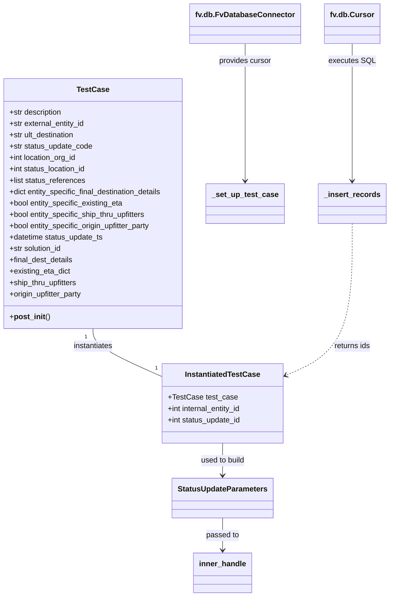

# Diagram: shipment_core/shipment_service/shipment_service/eta/eta_milestone_update/tests/test_status_update_calculation.py


> Auto-generated by Obscura crawlers

## Diagram 1



### SVG

<svg id="container" width="820.1953125" xmlns="http://www.w3.org/2000/svg" class="classDiagram" height="1260" viewBox="0 0 820.1953125 1260" role="graphics-document document" aria-roledescription="class"><style>#container{font-family:"trebuchet ms",verdana,arial,sans-serif;font-size:16px;fill:#333;}@keyframes edge-animation-frame{from{stroke-dashoffset:0;}}@keyframes dash{to{stroke-dashoffset:0;}}#container .edge-animation-slow{stroke-dasharray:9,5!important;stroke-dashoffset:900;animation:dash 50s linear infinite;stroke-linecap:round;}#container .edge-animation-fast{stroke-dasharray:9,5!important;stroke-dashoffset:900;animation:dash 20s linear infinite;stroke-linecap:round;}#container .error-icon{fill:#552222;}#container .error-text{fill:#552222;stroke:#552222;}#container .edge-thickness-normal{stroke-width:1px;}#container .edge-thickness-thick{stroke-width:3.5px;}#container .edge-pattern-solid{stroke-dasharray:0;}#container .edge-thickness-invisible{stroke-width:0;fill:none;}#container .edge-pattern-dashed{stroke-dasharray:3;}#container .edge-pattern-dotted{stroke-dasharray:2;}#container .marker{fill:#333333;stroke:#333333;}#container .marker.cross{stroke:#333333;}#container svg{font-family:"trebuchet ms",verdana,arial,sans-serif;font-size:16px;}#container p{margin:0;}#container g.classGroup text{fill:#9370DB;stroke:none;font-family:"trebuchet ms",verdana,arial,sans-serif;font-size:10px;}#container g.classGroup text .title{font-weight:bolder;}#container .nodeLabel,#container .edgeLabel{color:#131300;}#container .edgeLabel .label rect{fill:#ECECFF;}#container .label text{fill:#131300;}#container .labelBkg{background:#ECECFF;}#container .edgeLabel .label span{background:#ECECFF;}#container .classTitle{font-weight:bolder;}#container .node rect,#container .node circle,#container .node ellipse,#container .node polygon,#container .node path{fill:#ECECFF;stroke:#9370DB;stroke-width:1px;}#container .divider{stroke:#9370DB;stroke-width:1;}#container g.clickable{cursor:pointer;}#container g.classGroup rect{fill:#ECECFF;stroke:#9370DB;}#container g.classGroup line{stroke:#9370DB;stroke-width:1;}#container .classLabel .box{stroke:none;stroke-width:0;fill:#ECECFF;opacity:0.5;}#container .classLabel .label{fill:#9370DB;font-size:10px;}#container .relation{stroke:#333333;stroke-width:1;fill:none;}#container .dashed-line{stroke-dasharray:3;}#container .dotted-line{stroke-dasharray:1 2;}#container #compositionStart,#container .composition{fill:#333333!important;stroke:#333333!important;stroke-width:1;}#container #compositionEnd,#container .composition{fill:#333333!important;stroke:#333333!important;stroke-width:1;}#container #dependencyStart,#container .dependency{fill:#333333!important;stroke:#333333!important;stroke-width:1;}#container #dependencyStart,#container .dependency{fill:#333333!important;stroke:#333333!important;stroke-width:1;}#container #extensionStart,#container .extension{fill:transparent!important;stroke:#333333!important;stroke-width:1;}#container #extensionEnd,#container .extension{fill:transparent!important;stroke:#333333!important;stroke-width:1;}#container #aggregationStart,#container .aggregation{fill:transparent!important;stroke:#333333!important;stroke-width:1;}#container #aggregationEnd,#container .aggregation{fill:transparent!important;stroke:#333333!important;stroke-width:1;}#container #lollipopStart,#container .lollipop{fill:#ECECFF!important;stroke:#333333!important;stroke-width:1;}#container #lollipopEnd,#container .lollipop{fill:#ECECFF!important;stroke:#333333!important;stroke-width:1;}#container .edgeTerminals{font-size:11px;line-height:initial;}#container .classTitleText{text-anchor:middle;font-size:18px;fill:#333;}#container .label-icon{display:inline-block;height:1em;overflow:visible;vertical-align:-0.125em;}#container .node .label-icon path{fill:currentColor;stroke:revert;stroke-width:revert;}#container :root{--mermaid-font-family:"trebuchet ms",verdana,arial,sans-serif;}</style><g><defs><marker id="container_class-aggregationStart" class="marker aggregation class" refX="18" refY="7" markerWidth="190" markerHeight="240" orient="auto"><path d="M 18,7 L9,13 L1,7 L9,1 Z"></path></marker></defs><defs><marker id="container_class-aggregationEnd" class="marker aggregation class" refX="1" refY="7" markerWidth="20" markerHeight="28" orient="auto"><path d="M 18,7 L9,13 L1,7 L9,1 Z"></path></marker></defs><defs><marker id="container_class-extensionStart" class="marker extension class" refX="18" refY="7" markerWidth="190" markerHeight="240" orient="auto"><path d="M 1,7 L18,13 V 1 Z"></path></marker></defs><defs><marker id="container_class-extensionEnd" class="marker extension class" refX="1" refY="7" markerWidth="20" markerHeight="28" orient="auto"><path d="M 1,1 V 13 L18,7 Z"></path></marker></defs><defs><marker id="container_class-compositionStart" class="marker composition class" refX="18" refY="7" markerWidth="190" markerHeight="240" orient="auto"><path d="M 18,7 L9,13 L1,7 L9,1 Z"></path></marker></defs><defs><marker id="container_class-compositionEnd" class="marker composition class" refX="1" refY="7" markerWidth="20" markerHeight="28" orient="auto"><path d="M 18,7 L9,13 L1,7 L9,1 Z"></path></marker></defs><defs><marker id="container_class-dependencyStart" class="marker dependency class" refX="6" refY="7" markerWidth="190" markerHeight="240" orient="auto"><path d="M 5,7 L9,13 L1,7 L9,1 Z"></path></marker></defs><defs><marker id="container_class-dependencyEnd" class="marker dependency class" refX="13" refY="7" markerWidth="20" markerHeight="28" orient="auto"><path d="M 18,7 L9,13 L14,7 L9,1 Z"></path></marker></defs><defs><marker id="container_class-lollipopStart" class="marker lollipop class" refX="13" refY="7" markerWidth="190" markerHeight="240" orient="auto"><circle stroke="black" fill="transparent" cx="7" cy="7" r="6"></circle></marker></defs><defs><marker id="container_class-lollipopEnd" class="marker lollipop class" refX="1" refY="7" markerWidth="190" markerHeight="240" orient="auto"><circle stroke="black" fill="transparent" cx="7" cy="7" r="6"></circle></marker></defs><g class="root"><g class="clusters"></g><g class="edgePaths"><path d="M202.43,694L202.43,700.167C202.43,706.333,202.43,718.667,225.669,735.236C248.908,751.805,295.385,772.609,318.624,783.011L341.863,793.414" id="id_TestCase_InstantiatedTestCase_1" class="edge-thickness-normal edge-pattern-solid relation" style=";;;" data-edge="true" data-et="edge" data-id="id_TestCase_InstantiatedTestCase_1" data-points="W3sieCI6MjAyLjQyOTY4NzUsInkiOjY5NH0seyJ4IjoyMDIuNDI5Njg3NSwieSI6NzMxfSx7IngiOjM0MS44NjMyODEyNSwieSI6NzkzLjQxMzc2NTY5NzAyNzV9XQ=="></path><path d="M472.746,936L472.746,942.167C472.746,948.333,472.746,960.667,472.746,972C472.746,983.333,472.746,993.667,472.746,998.833L472.746,1004" id="id_InstantiatedTestCase_StatusUpdateParameters_2" class="edge-thickness-normal edge-pattern-solid relation" style=";;;" data-edge="true" data-et="edge" data-id="id_InstantiatedTestCase_StatusUpdateParameters_2" data-points="W3sieCI6NDcyLjc0NjA5Mzc1LCJ5Ijo5MzZ9LHsieCI6NDcyLjc0NjA5Mzc1LCJ5Ijo5NzN9LHsieCI6NDcyLjc0NjA5Mzc1LCJ5IjoxMDEwfV0=" marker-end="url(#container_class-dependencyEnd)"></path><path d="M472.746,1094L472.746,1100.167C472.746,1106.333,472.746,1118.667,472.746,1130C472.746,1141.333,472.746,1151.667,472.746,1156.833L472.746,1162" id="id_StatusUpdateParameters_inner_handle_3" class="edge-thickness-normal edge-pattern-solid relation" style=";;;" data-edge="true" data-et="edge" data-id="id_StatusUpdateParameters_inner_handle_3" data-points="W3sieCI6NDcyLjc0NjA5Mzc1LCJ5IjoxMDk0fSx7IngiOjQ3Mi43NDYwOTM3NSwieSI6MTEzMX0seyJ4Ijo0NzIuNzQ2MDkzNzUsInkiOjExNjh9XQ==" marker-end="url(#container_class-dependencyEnd)"></path><path d="M526.234,92L526.234,98.167C526.234,104.333,526.234,116.667,526.234,165C526.234,213.333,526.234,297.667,526.234,339.833L526.234,382" id="id_fv.db.FvDatabaseConnector__set_up_test_case_4" class="edge-thickness-normal edge-pattern-solid relation" style=";;;" data-edge="true" data-et="edge" data-id="id_fv.db.FvDatabaseConnector__set_up_test_case_4" data-points="W3sieCI6NTI2LjIzNDM3NSwieSI6OTJ9LHsieCI6NTI2LjIzNDM3NSwieSI6MTI5fSx7IngiOjUyNi4yMzQzNzUsInkiOjM4OH1d" marker-end="url(#container_class-dependencyEnd)"></path><path d="M743.063,92L743.063,98.167C743.063,104.333,743.063,116.667,743.063,165C743.063,213.333,743.063,297.667,743.063,339.833L743.063,382" id="id_fv.db.Cursor__insert_records_5" class="edge-thickness-normal edge-pattern-solid relation" style=";;;" data-edge="true" data-et="edge" data-id="id_fv.db.Cursor__insert_records_5" data-points="W3sieCI6NzQzLjA2MjUsInkiOjkyfSx7IngiOjc0My4wNjI1LCJ5IjoxMjl9LHsieCI6NzQzLjA2MjUsInkiOjM4OH1d" marker-end="url(#container_class-dependencyEnd)"></path><path d="M743.063,472L743.063,515.167C743.063,558.333,743.063,644.667,720.736,697.827C698.41,750.987,653.758,770.975,631.431,780.969L609.105,790.962" id="id__insert_records_InstantiatedTestCase_6" class="edge-thickness-normal edge-pattern-dashed relation" style=";;;" data-edge="true" data-et="edge" data-id="id__insert_records_InstantiatedTestCase_6" data-points="W3sieCI6NzQzLjA2MjUsInkiOjQ3Mn0seyJ4Ijo3NDMuMDYyNSwieSI6NzMxfSx7IngiOjYwMy42Mjg5MDYyNSwieSI6NzkzLjQxMzc2NTY5NzAyNzV9XQ==" marker-end="url(#container_class-dependencyEnd)"></path></g><g class="edgeLabels"><g class="edgeLabel" transform="translate(202.4296875, 731)"><g class="label" data-id="id_TestCase_InstantiatedTestCase_1" transform="translate(-42.9140625, -12)"><foreignObject width="85.828125" height="24"><div xmlns="http://www.w3.org/1999/xhtml" class="labelBkg" style="display: table-cell; white-space: nowrap; line-height: 1.5; max-width: 200px; text-align: center;"><span class="edgeLabel"><p>instantiates</p></span></div></foreignObject></g></g><g class="edgeLabel" transform="translate(472.74609375, 973)"><g class="label" data-id="id_InstantiatedTestCase_StatusUpdateParameters_2" transform="translate(-47.96875, -12)"><foreignObject width="95.9375" height="24"><div xmlns="http://www.w3.org/1999/xhtml" class="labelBkg" style="display: table-cell; white-space: nowrap; line-height: 1.5; max-width: 200px; text-align: center;"><span class="edgeLabel"><p>used to build</p></span></div></foreignObject></g></g><g class="edgeLabel" transform="translate(472.74609375, 1131)"><g class="label" data-id="id_StatusUpdateParameters_inner_handle_3" transform="translate(-35.046875, -12)"><foreignObject width="70.09375" height="24"><div xmlns="http://www.w3.org/1999/xhtml" class="labelBkg" style="display: table-cell; white-space: nowrap; line-height: 1.5; max-width: 200px; text-align: center;"><span class="edgeLabel"><p>passed to</p></span></div></foreignObject></g></g><g class="edgeLabel" transform="translate(526.234375, 129)"><g class="label" data-id="id_fv.db.FvDatabaseConnector__set_up_test_case_4" transform="translate(-56.296875, -12)"><foreignObject width="112.59375" height="24"><div xmlns="http://www.w3.org/1999/xhtml" class="labelBkg" style="display: table-cell; white-space: nowrap; line-height: 1.5; max-width: 200px; text-align: center;"><span class="edgeLabel"><p>provides cursor</p></span></div></foreignObject></g></g><g class="edgeLabel" transform="translate(743.0625, 129)"><g class="label" data-id="id_fv.db.Cursor__insert_records_5" transform="translate(-47.71875, -12)"><foreignObject width="95.4375" height="24"><div xmlns="http://www.w3.org/1999/xhtml" class="labelBkg" style="display: table-cell; white-space: nowrap; line-height: 1.5; max-width: 200px; text-align: center;"><span class="edgeLabel"><p>executes SQL</p></span></div></foreignObject></g></g><g class="edgeLabel" transform="translate(743.0625, 731)"><g class="label" data-id="id__insert_records_InstantiatedTestCase_6" transform="translate(-39.1640625, -12)"><foreignObject width="78.328125" height="24"><div xmlns="http://www.w3.org/1999/xhtml" class="labelBkg" style="display: table-cell; white-space: nowrap; line-height: 1.5; max-width: 200px; text-align: center;"><span class="edgeLabel"><p>returns ids</p></span></div></foreignObject></g></g><g class="edgeTerminals" transform="translate(187.42968875000003, 711.5000010714285)"><g class="inner" transform="translate(0, 0)"><foreignObject style="width: 9px; height: 12px;"><div xmlns="http://www.w3.org/1999/xhtml" style="display: inline-block; padding-right: 1px; white-space: nowrap;"><span class="edgeLabel">1</span></div></foreignObject></g></g><g class="edgeTerminals" transform="translate(327.0188826605717, 767.5729917912658)"><g class="inner" transform="translate(0, 0)"></g><foreignObject style="width: 9px; height: 12px;"><div xmlns="http://www.w3.org/1999/xhtml" style="display: inline-block; padding-right: 1px; white-space: nowrap;"><span class="edgeLabel">1</span></div></foreignObject></g></g><g class="nodes"><g class="node default" id="classId-TestCase-0" transform="translate(202.4296875, 430)"><g class="basic label-container"><path d="M-194.4296875 -264 L194.4296875 -264 L194.4296875 264 L-194.4296875 264" stroke="none" stroke-width="0" fill="#ECECFF" style=""></path><path d="M-194.4296875 -264 C-99.82948965957164 -264, -5.2292918191432705 -264, 194.4296875 -264 M-194.4296875 -264 C-107.23701557262353 -264, -20.044343645247068 -264, 194.4296875 -264 M194.4296875 -264 C194.4296875 -136.9706157347448, 194.4296875 -9.941231469489594, 194.4296875 264 M194.4296875 -264 C194.4296875 -85.0394863989647, 194.4296875 93.9210272020706, 194.4296875 264 M194.4296875 264 C89.53804007944761 264, -15.353607341104777 264, -194.4296875 264 M194.4296875 264 C91.35264326913138 264, -11.724400961737246 264, -194.4296875 264 M-194.4296875 264 C-194.4296875 63.87925902637639, -194.4296875 -136.24148194724722, -194.4296875 -264 M-194.4296875 264 C-194.4296875 103.22243541396668, -194.4296875 -57.55512917206664, -194.4296875 -264" stroke="#9370DB" stroke-width="1.3" fill="none" stroke-dasharray="0 0" style=""></path></g><g class="annotation-group text" transform="translate(0, -240)"></g><g class="label-group text" transform="translate(-32.359375, -240)"><g class="label" style="font-weight: bolder" transform="translate(0,-12)"><foreignObject width="64.71875" height="24"><div xmlns="http://www.w3.org/1999/xhtml" style="display: table-cell; white-space: nowrap; line-height: 1.5; max-width: 113px; text-align: center;"><span class="nodeLabel markdown-node-label" style=""><p>TestCase</p></span></div></foreignObject></g></g><g class="members-group text" transform="translate(-182.4296875, -192)"><g class="label" style="" transform="translate(0,-12)"><foreignObject width="114.265625" height="24"><div xmlns="http://www.w3.org/1999/xhtml" style="display: table-cell; white-space: nowrap; line-height: 1.5; max-width: 172px; text-align: center;"><span class="nodeLabel markdown-node-label" style=""><p>+str description</p></span></div></foreignObject></g><g class="label" style="" transform="translate(0,12)"><foreignObject width="162.90625" height="24"><div xmlns="http://www.w3.org/1999/xhtml" style="display: table-cell; white-space: nowrap; line-height: 1.5; max-width: 220px; text-align: center;"><span class="nodeLabel markdown-node-label" style=""><p>+str external_entity_id</p></span></div></foreignObject></g><g class="label" style="" transform="translate(0,36)"><foreignObject width="142.5625" height="24"><div xmlns="http://www.w3.org/1999/xhtml" style="display: table-cell; white-space: nowrap; line-height: 1.5; max-width: 200px; text-align: center;"><span class="nodeLabel markdown-node-label" style=""><p>+str ult_destination</p></span></div></foreignObject></g><g class="label" style="" transform="translate(0,60)"><foreignObject width="177.71875" height="24"><div xmlns="http://www.w3.org/1999/xhtml" style="display: table-cell; white-space: nowrap; line-height: 1.5; max-width: 235px; text-align: center;"><span class="nodeLabel markdown-node-label" style=""><p>+str status_update_code</p></span></div></foreignObject></g><g class="label" style="" transform="translate(0,84)"><foreignObject width="145.109375" height="24"><div xmlns="http://www.w3.org/1999/xhtml" style="display: table-cell; white-space: nowrap; line-height: 1.5; max-width: 202px; text-align: center;"><span class="nodeLabel markdown-node-label" style=""><p>+int location_org_id</p></span></div></foreignObject></g><g class="label" style="" transform="translate(0,108)"><foreignObject width="165.6875" height="24"><div xmlns="http://www.w3.org/1999/xhtml" style="display: table-cell; white-space: nowrap; line-height: 1.5; max-width: 223px; text-align: center;"><span class="nodeLabel markdown-node-label" style=""><p>+int status_location_id</p></span></div></foreignObject></g><g class="label" style="" transform="translate(0,132)"><foreignObject width="162.734375" height="24"><div xmlns="http://www.w3.org/1999/xhtml" style="display: table-cell; white-space: nowrap; line-height: 1.5; max-width: 220px; text-align: center;"><span class="nodeLabel markdown-node-label" style=""><p>+list status_references</p></span></div></foreignObject></g><g class="label" style="" transform="translate(0,156)"><foreignObject width="332.5" height="24"><div xmlns="http://www.w3.org/1999/xhtml" style="display: table-cell; white-space: nowrap; line-height: 1.5; max-width: 390px; text-align: center;"><span class="nodeLabel markdown-node-label" style=""><p>+dict entity_specific_final_destination_details</p></span></div></foreignObject></g><g class="label" style="" transform="translate(0,180)"><foreignObject width="245.0625" height="24"><div xmlns="http://www.w3.org/1999/xhtml" style="display: table-cell; white-space: nowrap; line-height: 1.5; max-width: 302px; text-align: center;"><span class="nodeLabel markdown-node-label" style=""><p>+bool entity_specific_existing_eta</p></span></div></foreignObject></g><g class="label" style="" transform="translate(0,204)"><foreignObject width="296.5625" height="24"><div xmlns="http://www.w3.org/1999/xhtml" style="display: table-cell; white-space: nowrap; line-height: 1.5; max-width: 354px; text-align: center;"><span class="nodeLabel markdown-node-label" style=""><p>+bool entity_specific_ship_thru_upfitters</p></span></div></foreignObject></g><g class="label" style="" transform="translate(0,228)"><foreignObject width="306.90625" height="24"><div xmlns="http://www.w3.org/1999/xhtml" style="display: table-cell; white-space: nowrap; line-height: 1.5; max-width: 364px; text-align: center;"><span class="nodeLabel markdown-node-label" style=""><p>+bool entity_specific_origin_upfitter_party</p></span></div></foreignObject></g><g class="label" style="" transform="translate(0,252)"><foreignObject width="201.828125" height="24"><div xmlns="http://www.w3.org/1999/xhtml" style="display: table-cell; white-space: nowrap; line-height: 1.5; max-width: 259px; text-align: center;"><span class="nodeLabel markdown-node-label" style=""><p>+datetime status_update_ts</p></span></div></foreignObject></g><g class="label" style="" transform="translate(0,276)"><foreignObject width="113.875" height="24"><div xmlns="http://www.w3.org/1999/xhtml" style="display: table-cell; white-space: nowrap; line-height: 1.5; max-width: 171px; text-align: center;"><span class="nodeLabel markdown-node-label" style=""><p>+str solution_id</p></span></div></foreignObject></g><g class="label" style="" transform="translate(0,300)"><foreignObject width="136.421875" height="24"><div xmlns="http://www.w3.org/1999/xhtml" style="display: table-cell; white-space: nowrap; line-height: 1.5; max-width: 194px; text-align: center;"><span class="nodeLabel markdown-node-label" style=""><p>+final_dest_details</p></span></div></foreignObject></g><g class="label" style="" transform="translate(0,324)"><foreignObject width="130.953125" height="24"><div xmlns="http://www.w3.org/1999/xhtml" style="display: table-cell; white-space: nowrap; line-height: 1.5; max-width: 189px; text-align: center;"><span class="nodeLabel markdown-node-label" style=""><p>+existing_eta_dict</p></span></div></foreignObject></g><g class="label" style="" transform="translate(0,348)"><foreignObject width="146.625" height="24"><div xmlns="http://www.w3.org/1999/xhtml" style="display: table-cell; white-space: nowrap; line-height: 1.5; max-width: 204px; text-align: center;"><span class="nodeLabel markdown-node-label" style=""><p>+ship_thru_upfitters</p></span></div></foreignObject></g><g class="label" style="" transform="translate(0,372)"><foreignObject width="157.28125" height="24"><div xmlns="http://www.w3.org/1999/xhtml" style="display: table-cell; white-space: nowrap; line-height: 1.5; max-width: 215px; text-align: center;"><span class="nodeLabel markdown-node-label" style=""><p>+origin_upfitter_party</p></span></div></foreignObject></g></g><g class="methods-group text" transform="translate(-182.4296875, 240)"><g class="label" style="" transform="translate(0,-12)"><foreignObject width="83.921875" height="24"><div xmlns="http://www.w3.org/1999/xhtml" style="display: table-cell; white-space: nowrap; line-height: 1.5; max-width: 172px; text-align: center;"><span class="nodeLabel markdown-node-label" style=""><p>+<strong>post_init</strong>()</p></span></div></foreignObject></g></g><g class="divider" style=""><path d="M-194.4296875 -216 C-49.22813483803398 -216, 95.97341782393204 -216, 194.4296875 -216 M-194.4296875 -216 C-112.75955701536141 -216, -31.089426530722818 -216, 194.4296875 -216" stroke="#9370DB" stroke-width="1.3" fill="none" stroke-dasharray="0 0" style=""></path></g><g class="divider" style=""><path d="M-194.4296875 216 C-50.387989132095726 216, 93.65370923580855 216, 194.4296875 216 M-194.4296875 216 C-56.06442578260271 216, 82.30083593479458 216, 194.4296875 216" stroke="#9370DB" stroke-width="1.3" fill="none" stroke-dasharray="0 0" style=""></path></g></g><g class="node default" id="classId-InstantiatedTestCase-1" transform="translate(472.74609375, 852)"><g class="basic label-container"><path d="M-130.8828125 -84 L130.8828125 -84 L130.8828125 84 L-130.8828125 84" stroke="none" stroke-width="0" fill="#ECECFF" style=""></path><path d="M-130.8828125 -84 C-36.92263895642138 -84, 57.03753458715724 -84, 130.8828125 -84 M-130.8828125 -84 C-53.32179447057614 -84, 24.239223558847726 -84, 130.8828125 -84 M130.8828125 -84 C130.8828125 -35.465991548077916, 130.8828125 13.068016903844168, 130.8828125 84 M130.8828125 -84 C130.8828125 -43.2271741842644, 130.8828125 -2.454348368528798, 130.8828125 84 M130.8828125 84 C44.912337107026644 84, -41.05813828594671 84, -130.8828125 84 M130.8828125 84 C30.90736604322356 84, -69.06808041355288 84, -130.8828125 84 M-130.8828125 84 C-130.8828125 24.342563345740345, -130.8828125 -35.31487330851931, -130.8828125 -84 M-130.8828125 84 C-130.8828125 37.98523351374678, -130.8828125 -8.029532972506445, -130.8828125 -84" stroke="#9370DB" stroke-width="1.3" fill="none" stroke-dasharray="0 0" style=""></path></g><g class="annotation-group text" transform="translate(0, -60)"></g><g class="label-group text" transform="translate(-77.0625, -60)"><g class="label" style="font-weight: bolder" transform="translate(0,-12)"><foreignObject width="154.125" height="24"><div xmlns="http://www.w3.org/1999/xhtml" style="display: table-cell; white-space: nowrap; line-height: 1.5; max-width: 201px; text-align: center;"><span class="nodeLabel markdown-node-label" style=""><p>InstantiatedTestCase</p></span></div></foreignObject></g></g><g class="members-group text" transform="translate(-118.8828125, -12)"><g class="label" style="" transform="translate(0,-12)"><foreignObject width="142.0625" height="24"><div xmlns="http://www.w3.org/1999/xhtml" style="display: table-cell; white-space: nowrap; line-height: 1.5; max-width: 199px; text-align: center;"><span class="nodeLabel markdown-node-label" style=""><p>+TestCase test_case</p></span></div></foreignObject></g><g class="label" style="" transform="translate(0,12)"><foreignObject width="160.703125" height="24"><div xmlns="http://www.w3.org/1999/xhtml" style="display: table-cell; white-space: nowrap; line-height: 1.5; max-width: 218px; text-align: center;"><span class="nodeLabel markdown-node-label" style=""><p>+int internal_entity_id</p></span></div></foreignObject></g><g class="label" style="" transform="translate(0,36)"><foreignObject width="157.40625" height="24"><div xmlns="http://www.w3.org/1999/xhtml" style="display: table-cell; white-space: nowrap; line-height: 1.5; max-width: 215px; text-align: center;"><span class="nodeLabel markdown-node-label" style=""><p>+int status_update_id</p></span></div></foreignObject></g></g><g class="methods-group text" transform="translate(-118.8828125, 84)"></g><g class="divider" style=""><path d="M-130.8828125 -36 C-46.64264108553583 -36, 37.59753032892834 -36, 130.8828125 -36 M-130.8828125 -36 C-65.65214124352912 -36, -0.4214699870582308 -36, 130.8828125 -36" stroke="#9370DB" stroke-width="1.3" fill="none" stroke-dasharray="0 0" style=""></path></g><g class="divider" style=""><path d="M-130.8828125 60 C-37.598659601116495 60, 55.68549329776701 60, 130.8828125 60 M-130.8828125 60 C-46.993521768064696 60, 36.89576896387061 60, 130.8828125 60" stroke="#9370DB" stroke-width="1.3" fill="none" stroke-dasharray="0 0" style=""></path></g></g><g class="node default" id="classId-fv.db.Cursor-2" transform="translate(743.0625, 50)"><g class="basic label-container"><path d="M-55.6328125 -42 L55.6328125 -42 L55.6328125 42 L-55.6328125 42" stroke="none" stroke-width="0" fill="#ECECFF" style=""></path><path d="M-55.6328125 -42 C-20.804944011504517 -42, 14.022924476990966 -42, 55.6328125 -42 M-55.6328125 -42 C-15.504552322198009 -42, 24.623707855603982 -42, 55.6328125 -42 M55.6328125 -42 C55.6328125 -17.332797898871465, 55.6328125 7.334404202257069, 55.6328125 42 M55.6328125 -42 C55.6328125 -16.955978052417514, 55.6328125 8.088043895164972, 55.6328125 42 M55.6328125 42 C32.01826833921382 42, 8.403724178427638 42, -55.6328125 42 M55.6328125 42 C31.748608981492143 42, 7.864405462984287 42, -55.6328125 42 M-55.6328125 42 C-55.6328125 10.749120653061748, -55.6328125 -20.501758693876504, -55.6328125 -42 M-55.6328125 42 C-55.6328125 15.127101189524765, -55.6328125 -11.74579762095047, -55.6328125 -42" stroke="#9370DB" stroke-width="1.3" fill="none" stroke-dasharray="0 0" style=""></path></g><g class="annotation-group text" transform="translate(0, -18)"></g><g class="label-group text" transform="translate(-43.6328125, -18)"><g class="label" style="font-weight: bolder" transform="translate(0,-12)"><foreignObject width="87.265625" height="24"><div xmlns="http://www.w3.org/1999/xhtml" style="display: table-cell; white-space: nowrap; line-height: 1.5; max-width: 136px; text-align: center;"><span class="nodeLabel markdown-node-label" style=""><p>fv.db.Cursor</p></span></div></foreignObject></g></g><g class="members-group text" transform="translate(-43.6328125, 30)"></g><g class="methods-group text" transform="translate(-43.6328125, 60)"></g><g class="divider" style=""><path d="M-55.6328125 6 C-28.13896511792456 6, -0.6451177358491194 6, 55.6328125 6 M-55.6328125 6 C-26.13645931122156 6, 3.3598938775568783 6, 55.6328125 6" stroke="#9370DB" stroke-width="1.3" fill="none" stroke-dasharray="0 0" style=""></path></g><g class="divider" style=""><path d="M-55.6328125 24 C-17.86701877719409 24, 19.89877494561182 24, 55.6328125 24 M-55.6328125 24 C-30.33777758961567 24, -5.042742679231338 24, 55.6328125 24" stroke="#9370DB" stroke-width="1.3" fill="none" stroke-dasharray="0 0" style=""></path></g></g><g class="node default" id="classId-fv.db.FvDatabaseConnector-3" transform="translate(526.234375, 50)"><g class="basic label-container"><path d="M-111.1953125 -42 L111.1953125 -42 L111.1953125 42 L-111.1953125 42" stroke="none" stroke-width="0" fill="#ECECFF" style=""></path><path d="M-111.1953125 -42 C-58.20598903355365 -42, -5.216665567107299 -42, 111.1953125 -42 M-111.1953125 -42 C-40.384929194601895 -42, 30.42545411079621 -42, 111.1953125 -42 M111.1953125 -42 C111.1953125 -15.392091305282399, 111.1953125 11.215817389435202, 111.1953125 42 M111.1953125 -42 C111.1953125 -10.064564451818633, 111.1953125 21.870871096362734, 111.1953125 42 M111.1953125 42 C32.63120730482929 42, -45.93289789034142 42, -111.1953125 42 M111.1953125 42 C55.07238226975474 42, -1.050547960490519 42, -111.1953125 42 M-111.1953125 42 C-111.1953125 10.037093207769704, -111.1953125 -21.92581358446059, -111.1953125 -42 M-111.1953125 42 C-111.1953125 18.76630499419006, -111.1953125 -4.467390011619877, -111.1953125 -42" stroke="#9370DB" stroke-width="1.3" fill="none" stroke-dasharray="0 0" style=""></path></g><g class="annotation-group text" transform="translate(0, -18)"></g><g class="label-group text" transform="translate(-99.1953125, -18)"><g class="label" style="font-weight: bolder" transform="translate(0,-12)"><foreignObject width="198.390625" height="24"><div xmlns="http://www.w3.org/1999/xhtml" style="display: table-cell; white-space: nowrap; line-height: 1.5; max-width: 246px; text-align: center;"><span class="nodeLabel markdown-node-label" style=""><p>fv.db.FvDatabaseConnector</p></span></div></foreignObject></g></g><g class="members-group text" transform="translate(-99.1953125, 30)"></g><g class="methods-group text" transform="translate(-99.1953125, 60)"></g><g class="divider" style=""><path d="M-111.1953125 6 C-66.36587714467794 6, -21.53644178935589 6, 111.1953125 6 M-111.1953125 6 C-30.064177388249234 6, 51.06695772350153 6, 111.1953125 6" stroke="#9370DB" stroke-width="1.3" fill="none" stroke-dasharray="0 0" style=""></path></g><g class="divider" style=""><path d="M-111.1953125 24 C-26.977044576153986 24, 57.24122334769203 24, 111.1953125 24 M-111.1953125 24 C-50.76831605078259 24, 9.658680398434825 24, 111.1953125 24" stroke="#9370DB" stroke-width="1.3" fill="none" stroke-dasharray="0 0" style=""></path></g></g><g class="node default" id="classId-StatusUpdateParameters-4" transform="translate(472.74609375, 1052)"><g class="basic label-container"><path d="M-103.6015625 -42 L103.6015625 -42 L103.6015625 42 L-103.6015625 42" stroke="none" stroke-width="0" fill="#ECECFF" style=""></path><path d="M-103.6015625 -42 C-36.11466451359111 -42, 31.372233472817783 -42, 103.6015625 -42 M-103.6015625 -42 C-30.0084222579882 -42, 43.5847179840236 -42, 103.6015625 -42 M103.6015625 -42 C103.6015625 -13.175915034850629, 103.6015625 15.648169930298742, 103.6015625 42 M103.6015625 -42 C103.6015625 -14.83650557203218, 103.6015625 12.326988855935639, 103.6015625 42 M103.6015625 42 C56.812708679210594 42, 10.023854858421188 42, -103.6015625 42 M103.6015625 42 C58.60650517152342 42, 13.611447843046847 42, -103.6015625 42 M-103.6015625 42 C-103.6015625 21.319900670259525, -103.6015625 0.6398013405190497, -103.6015625 -42 M-103.6015625 42 C-103.6015625 23.50890228183141, -103.6015625 5.017804563662821, -103.6015625 -42" stroke="#9370DB" stroke-width="1.3" fill="none" stroke-dasharray="0 0" style=""></path></g><g class="annotation-group text" transform="translate(0, -18)"></g><g class="label-group text" transform="translate(-91.6015625, -18)"><g class="label" style="font-weight: bolder" transform="translate(0,-12)"><foreignObject width="183.203125" height="24"><div xmlns="http://www.w3.org/1999/xhtml" style="display: table-cell; white-space: nowrap; line-height: 1.5; max-width: 230px; text-align: center;"><span class="nodeLabel markdown-node-label" style=""><p>StatusUpdateParameters</p></span></div></foreignObject></g></g><g class="members-group text" transform="translate(-91.6015625, 30)"></g><g class="methods-group text" transform="translate(-91.6015625, 60)"></g><g class="divider" style=""><path d="M-103.6015625 6 C-49.83575790509513 6, 3.9300466898097426 6, 103.6015625 6 M-103.6015625 6 C-44.86752222860272 6, 13.866518042794553 6, 103.6015625 6" stroke="#9370DB" stroke-width="1.3" fill="none" stroke-dasharray="0 0" style=""></path></g><g class="divider" style=""><path d="M-103.6015625 24 C-25.09811436076444 24, 53.40533377847112 24, 103.6015625 24 M-103.6015625 24 C-27.031445928733874 24, 49.53867064253225 24, 103.6015625 24" stroke="#9370DB" stroke-width="1.3" fill="none" stroke-dasharray="0 0" style=""></path></g></g><g class="node default" id="classId-inner_handle-5" transform="translate(472.74609375, 1210)"><g class="basic label-container"><path d="M-59.8046875 -42 L59.8046875 -42 L59.8046875 42 L-59.8046875 42" stroke="none" stroke-width="0" fill="#ECECFF" style=""></path><path d="M-59.8046875 -42 C-29.183434543245543 -42, 1.4378184135089143 -42, 59.8046875 -42 M-59.8046875 -42 C-16.16823009951296 -42, 27.46822730097408 -42, 59.8046875 -42 M59.8046875 -42 C59.8046875 -20.162902657664016, 59.8046875 1.674194684671967, 59.8046875 42 M59.8046875 -42 C59.8046875 -23.59878426433689, 59.8046875 -5.197568528673777, 59.8046875 42 M59.8046875 42 C27.110342433281396 42, -5.584002633437208 42, -59.8046875 42 M59.8046875 42 C24.56784168469745 42, -10.669004130605103 42, -59.8046875 42 M-59.8046875 42 C-59.8046875 12.542709263587373, -59.8046875 -16.914581472825255, -59.8046875 -42 M-59.8046875 42 C-59.8046875 21.180480919215025, -59.8046875 0.36096183843005036, -59.8046875 -42" stroke="#9370DB" stroke-width="1.3" fill="none" stroke-dasharray="0 0" style=""></path></g><g class="annotation-group text" transform="translate(0, -18)"></g><g class="label-group text" transform="translate(-47.8046875, -18)"><g class="label" style="font-weight: bolder" transform="translate(0,-12)"><foreignObject width="95.609375" height="24"><div xmlns="http://www.w3.org/1999/xhtml" style="display: table-cell; white-space: nowrap; line-height: 1.5; max-width: 146px; text-align: center;"><span class="nodeLabel markdown-node-label" style=""><p>inner_handle</p></span></div></foreignObject></g></g><g class="members-group text" transform="translate(-47.8046875, 30)"></g><g class="methods-group text" transform="translate(-47.8046875, 60)"></g><g class="divider" style=""><path d="M-59.8046875 6 C-12.614261681013026 6, 34.57616413797395 6, 59.8046875 6 M-59.8046875 6 C-33.30185087276984 6, -6.799014245539681 6, 59.8046875 6" stroke="#9370DB" stroke-width="1.3" fill="none" stroke-dasharray="0 0" style=""></path></g><g class="divider" style=""><path d="M-59.8046875 24 C-34.40233378335539 24, -8.999980066710783 24, 59.8046875 24 M-59.8046875 24 C-25.810215860949945 24, 8.184255778100109 24, 59.8046875 24" stroke="#9370DB" stroke-width="1.3" fill="none" stroke-dasharray="0 0" style=""></path></g></g><g class="node default" id="classId-_set_up_test_case-6" transform="translate(526.234375, 430)"><g class="basic label-container"><path d="M-79.375 -42 L79.375 -42 L79.375 42 L-79.375 42" stroke="none" stroke-width="0" fill="#ECECFF" style=""></path><path d="M-79.375 -42 C-32.81073120107185 -42, 13.753537597856294 -42, 79.375 -42 M-79.375 -42 C-43.101784787231765 -42, -6.828569574463529 -42, 79.375 -42 M79.375 -42 C79.375 -12.38962840617544, 79.375 17.22074318764912, 79.375 42 M79.375 -42 C79.375 -18.705898219250592, 79.375 4.5882035614988155, 79.375 42 M79.375 42 C41.31578656213205 42, 3.2565731242640936 42, -79.375 42 M79.375 42 C23.93707685593256 42, -31.50084628813488 42, -79.375 42 M-79.375 42 C-79.375 25.113578233088436, -79.375 8.227156466176872, -79.375 -42 M-79.375 42 C-79.375 12.462063372074496, -79.375 -17.075873255851008, -79.375 -42" stroke="#9370DB" stroke-width="1.3" fill="none" stroke-dasharray="0 0" style=""></path></g><g class="annotation-group text" transform="translate(0, -18)"></g><g class="label-group text" transform="translate(-67.375, -18)"><g class="label" style="font-weight: bolder" transform="translate(0,-12)"><foreignObject width="134.75" height="24"><div xmlns="http://www.w3.org/1999/xhtml" style="display: table-cell; white-space: nowrap; line-height: 1.5; max-width: 183px; text-align: center;"><span class="nodeLabel markdown-node-label" style=""><p>_set_up_test_case</p></span></div></foreignObject></g></g><g class="members-group text" transform="translate(-67.375, 30)"></g><g class="methods-group text" transform="translate(-67.375, 60)"></g><g class="divider" style=""><path d="M-79.375 6 C-17.341197737833774 6, 44.69260452433245 6, 79.375 6 M-79.375 6 C-16.10059930504869 6, 47.17380138990262 6, 79.375 6" stroke="#9370DB" stroke-width="1.3" fill="none" stroke-dasharray="0 0" style=""></path></g><g class="divider" style=""><path d="M-79.375 24 C-42.24924807528132 24, -5.123496150562644 24, 79.375 24 M-79.375 24 C-29.011305502448266 24, 21.352388995103468 24, 79.375 24" stroke="#9370DB" stroke-width="1.3" fill="none" stroke-dasharray="0 0" style=""></path></g></g><g class="node default" id="classId-_insert_records-7" transform="translate(743.0625, 430)"><g class="basic label-container"><path d="M-69.1328125 -42 L69.1328125 -42 L69.1328125 42 L-69.1328125 42" stroke="none" stroke-width="0" fill="#ECECFF" style=""></path><path d="M-69.1328125 -42 C-17.047979847897707 -42, 35.036852804204585 -42, 69.1328125 -42 M-69.1328125 -42 C-23.927792710400944 -42, 21.277227079198113 -42, 69.1328125 -42 M69.1328125 -42 C69.1328125 -23.261150152771386, 69.1328125 -4.522300305542771, 69.1328125 42 M69.1328125 -42 C69.1328125 -24.140441748392202, 69.1328125 -6.280883496784405, 69.1328125 42 M69.1328125 42 C39.62397516850854 42, 10.115137837017066 42, -69.1328125 42 M69.1328125 42 C27.57634650179537 42, -13.980119496409259 42, -69.1328125 42 M-69.1328125 42 C-69.1328125 14.611744859067219, -69.1328125 -12.776510281865562, -69.1328125 -42 M-69.1328125 42 C-69.1328125 21.60686821268532, -69.1328125 1.2137364253706409, -69.1328125 -42" stroke="#9370DB" stroke-width="1.3" fill="none" stroke-dasharray="0 0" style=""></path></g><g class="annotation-group text" transform="translate(0, -18)"></g><g class="label-group text" transform="translate(-57.1328125, -18)"><g class="label" style="font-weight: bolder" transform="translate(0,-12)"><foreignObject width="114.265625" height="24"><div xmlns="http://www.w3.org/1999/xhtml" style="display: table-cell; white-space: nowrap; line-height: 1.5; max-width: 163px; text-align: center;"><span class="nodeLabel markdown-node-label" style=""><p>_insert_records</p></span></div></foreignObject></g></g><g class="members-group text" transform="translate(-57.1328125, 30)"></g><g class="methods-group text" transform="translate(-57.1328125, 60)"></g><g class="divider" style=""><path d="M-69.1328125 6 C-31.332284955429834 6, 6.468242589140331 6, 69.1328125 6 M-69.1328125 6 C-38.16438100352368 6, -7.195949507047359 6, 69.1328125 6" stroke="#9370DB" stroke-width="1.3" fill="none" stroke-dasharray="0 0" style=""></path></g><g class="divider" style=""><path d="M-69.1328125 24 C-22.97223173637623 24, 23.18834902724754 24, 69.1328125 24 M-69.1328125 24 C-27.90908291471682 24, 13.314646670566361 24, 69.1328125 24" stroke="#9370DB" stroke-width="1.3" fill="none" stroke-dasharray="0 0" style=""></path></g></g></g></g></g></svg>

## Diagram 2

```mermaid
flowchart TD
    A[Define TestCase instances via fixtures] --> B[Insert entity and status_update rows (_insert_records)]
    B --> C[YIELD InstantiatedTestCase from _set_up_test_case]
    C --> D[Build StatusUpdateParameters]
    D --> E[Call inner_handle(params, shipments_conn, entity_conn)]
    E --> F{inner_handle logic}
    F -->|missing ult destination| G[Return destination_eta_updated: False\nnext_milestone_eta_updated: False\nlog: Missing resolved ultimate destination location]
    F -->|milestone not triggering| H[Return False/False\nlog: Milestone doesn't trigger eta or estimated eta]
    F -->|stale status| I[Return False/False\nlog: Old status message]
    F -->|successful trigger| J[Persist ETA expiration record\nReturn True/True]
    F -->|missing status_update row| K[Return False/False\nlog: Status update not found]
    F -->|no entity found| L[Return False/False\nlog: Entity UnfindableEntity not found for solution]
    J --> M[Assertions expect True/True and persistence logs]
    G & H & I & K & L --> N[Assertions expect False/False and matching logs]
```

> SVG rendering failed for this diagram.
