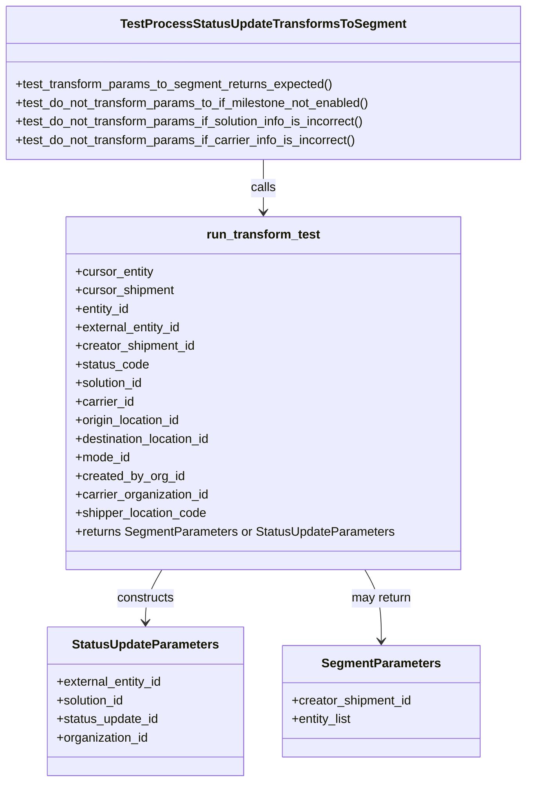

# Diagram: shipment_core/shipment_service/shipment_service/eta/eta_milestone_update/tests/test_transform_status_update_to_segment.py


> Auto-generated by Obscura crawlers

## Diagram 1



### SVG

<svg id="container" width="681.6796875" xmlns="http://www.w3.org/2000/svg" class="classDiagram" height="1010" viewBox="0 0 681.6796875 1010" role="graphics-document document" aria-roledescription="class"><style>#container{font-family:"trebuchet ms",verdana,arial,sans-serif;font-size:16px;fill:#333;}@keyframes edge-animation-frame{from{stroke-dashoffset:0;}}@keyframes dash{to{stroke-dashoffset:0;}}#container .edge-animation-slow{stroke-dasharray:9,5!important;stroke-dashoffset:900;animation:dash 50s linear infinite;stroke-linecap:round;}#container .edge-animation-fast{stroke-dasharray:9,5!important;stroke-dashoffset:900;animation:dash 20s linear infinite;stroke-linecap:round;}#container .error-icon{fill:#552222;}#container .error-text{fill:#552222;stroke:#552222;}#container .edge-thickness-normal{stroke-width:1px;}#container .edge-thickness-thick{stroke-width:3.5px;}#container .edge-pattern-solid{stroke-dasharray:0;}#container .edge-thickness-invisible{stroke-width:0;fill:none;}#container .edge-pattern-dashed{stroke-dasharray:3;}#container .edge-pattern-dotted{stroke-dasharray:2;}#container .marker{fill:#333333;stroke:#333333;}#container .marker.cross{stroke:#333333;}#container svg{font-family:"trebuchet ms",verdana,arial,sans-serif;font-size:16px;}#container p{margin:0;}#container g.classGroup text{fill:#9370DB;stroke:none;font-family:"trebuchet ms",verdana,arial,sans-serif;font-size:10px;}#container g.classGroup text .title{font-weight:bolder;}#container .nodeLabel,#container .edgeLabel{color:#131300;}#container .edgeLabel .label rect{fill:#ECECFF;}#container .label text{fill:#131300;}#container .labelBkg{background:#ECECFF;}#container .edgeLabel .label span{background:#ECECFF;}#container .classTitle{font-weight:bolder;}#container .node rect,#container .node circle,#container .node ellipse,#container .node polygon,#container .node path{fill:#ECECFF;stroke:#9370DB;stroke-width:1px;}#container .divider{stroke:#9370DB;stroke-width:1;}#container g.clickable{cursor:pointer;}#container g.classGroup rect{fill:#ECECFF;stroke:#9370DB;}#container g.classGroup line{stroke:#9370DB;stroke-width:1;}#container .classLabel .box{stroke:none;stroke-width:0;fill:#ECECFF;opacity:0.5;}#container .classLabel .label{fill:#9370DB;font-size:10px;}#container .relation{stroke:#333333;stroke-width:1;fill:none;}#container .dashed-line{stroke-dasharray:3;}#container .dotted-line{stroke-dasharray:1 2;}#container #compositionStart,#container .composition{fill:#333333!important;stroke:#333333!important;stroke-width:1;}#container #compositionEnd,#container .composition{fill:#333333!important;stroke:#333333!important;stroke-width:1;}#container #dependencyStart,#container .dependency{fill:#333333!important;stroke:#333333!important;stroke-width:1;}#container #dependencyStart,#container .dependency{fill:#333333!important;stroke:#333333!important;stroke-width:1;}#container #extensionStart,#container .extension{fill:transparent!important;stroke:#333333!important;stroke-width:1;}#container #extensionEnd,#container .extension{fill:transparent!important;stroke:#333333!important;stroke-width:1;}#container #aggregationStart,#container .aggregation{fill:transparent!important;stroke:#333333!important;stroke-width:1;}#container #aggregationEnd,#container .aggregation{fill:transparent!important;stroke:#333333!important;stroke-width:1;}#container #lollipopStart,#container .lollipop{fill:#ECECFF!important;stroke:#333333!important;stroke-width:1;}#container #lollipopEnd,#container .lollipop{fill:#ECECFF!important;stroke:#333333!important;stroke-width:1;}#container .edgeTerminals{font-size:11px;line-height:initial;}#container .classTitleText{text-anchor:middle;font-size:18px;fill:#333;}#container .label-icon{display:inline-block;height:1em;overflow:visible;vertical-align:-0.125em;}#container .node .label-icon path{fill:currentColor;stroke:revert;stroke-width:revert;}#container :root{--mermaid-font-family:"trebuchet ms",verdana,arial,sans-serif;}</style><g><defs><marker id="container_class-aggregationStart" class="marker aggregation class" refX="18" refY="7" markerWidth="190" markerHeight="240" orient="auto"><path d="M 18,7 L9,13 L1,7 L9,1 Z"></path></marker></defs><defs><marker id="container_class-aggregationEnd" class="marker aggregation class" refX="1" refY="7" markerWidth="20" markerHeight="28" orient="auto"><path d="M 18,7 L9,13 L1,7 L9,1 Z"></path></marker></defs><defs><marker id="container_class-extensionStart" class="marker extension class" refX="18" refY="7" markerWidth="190" markerHeight="240" orient="auto"><path d="M 1,7 L18,13 V 1 Z"></path></marker></defs><defs><marker id="container_class-extensionEnd" class="marker extension class" refX="1" refY="7" markerWidth="20" markerHeight="28" orient="auto"><path d="M 1,1 V 13 L18,7 Z"></path></marker></defs><defs><marker id="container_class-compositionStart" class="marker composition class" refX="18" refY="7" markerWidth="190" markerHeight="240" orient="auto"><path d="M 18,7 L9,13 L1,7 L9,1 Z"></path></marker></defs><defs><marker id="container_class-compositionEnd" class="marker composition class" refX="1" refY="7" markerWidth="20" markerHeight="28" orient="auto"><path d="M 18,7 L9,13 L1,7 L9,1 Z"></path></marker></defs><defs><marker id="container_class-dependencyStart" class="marker dependency class" refX="6" refY="7" markerWidth="190" markerHeight="240" orient="auto"><path d="M 5,7 L9,13 L1,7 L9,1 Z"></path></marker></defs><defs><marker id="container_class-dependencyEnd" class="marker dependency class" refX="13" refY="7" markerWidth="20" markerHeight="28" orient="auto"><path d="M 18,7 L9,13 L14,7 L9,1 Z"></path></marker></defs><defs><marker id="container_class-lollipopStart" class="marker lollipop class" refX="13" refY="7" markerWidth="190" markerHeight="240" orient="auto"><circle stroke="black" fill="transparent" cx="7" cy="7" r="6"></circle></marker></defs><defs><marker id="container_class-lollipopEnd" class="marker lollipop class" refX="1" refY="7" markerWidth="190" markerHeight="240" orient="auto"><circle stroke="black" fill="transparent" cx="7" cy="7" r="6"></circle></marker></defs><g class="root"><g class="clusters"></g><g class="edgePaths"><path d="M209.577,736L206.027,742.167C202.476,748.333,195.376,760.667,191.826,772C188.275,783.333,188.275,793.667,188.275,798.833L188.275,804" id="id_run_transform_test_StatusUpdateParameters_1" class="edge-thickness-normal edge-pattern-solid relation" style=";;;" data-edge="true" data-et="edge" data-id="id_run_transform_test_StatusUpdateParameters_1" data-points="W3sieCI6MjA5LjU3Njg0MjU3MDc1NDcsInkiOjczNn0seyJ4IjoxODguMjc1MzkwNjI1LCJ5Ijo3NzN9LHsieCI6MTg4LjI3NTM5MDYyNSwieSI6ODEwfV0=" marker-end="url(#container_class-dependencyEnd)"></path><path d="M472.103,736L475.653,742.167C479.203,748.333,486.304,760.667,489.854,776C493.404,791.333,493.404,809.667,493.404,818.833L493.404,828" id="id_run_transform_test_SegmentParameters_2" class="edge-thickness-normal edge-pattern-solid relation" style=";;;" data-edge="true" data-et="edge" data-id="id_run_transform_test_SegmentParameters_2" data-points="W3sieCI6NDcyLjEwMjg0NDkyOTI0NTMsInkiOjczNn0seyJ4Ijo0OTMuNDA0Mjk2ODc1LCJ5Ijo3NzN9LHsieCI6NDkzLjQwNDI5Njg3NSwieSI6ODM0fV0=" marker-end="url(#container_class-dependencyEnd)"></path><path d="M340.84,206L340.84,212.167C340.84,218.333,340.84,230.667,340.84,242C340.84,253.333,340.84,263.667,340.84,268.833L340.84,274" id="id_TestProcessStatusUpdateTransformsToSegment_run_transform_test_3" class="edge-thickness-normal edge-pattern-solid relation" style=";;;" data-edge="true" data-et="edge" data-id="id_TestProcessStatusUpdateTransformsToSegment_run_transform_test_3" data-points="W3sieCI6MzQwLjgzOTg0Mzc1LCJ5IjoyMDZ9LHsieCI6MzQwLjgzOTg0Mzc1LCJ5IjoyNDN9LHsieCI6MzQwLjgzOTg0Mzc1LCJ5IjoyODB9XQ==" marker-end="url(#container_class-dependencyEnd)"></path></g><g class="edgeLabels"><g class="edgeLabel" transform="translate(188.275390625, 773)"><g class="label" data-id="id_run_transform_test_StatusUpdateParameters_1" transform="translate(-37.84375, -12)"><foreignObject width="75.6875" height="24"><div xmlns="http://www.w3.org/1999/xhtml" class="labelBkg" style="display: table-cell; white-space: nowrap; line-height: 1.5; max-width: 200px; text-align: center;"><span class="edgeLabel"><p>constructs</p></span></div></foreignObject></g></g><g class="edgeLabel" transform="translate(493.404296875, 773)"><g class="label" data-id="id_run_transform_test_SegmentParameters_2" transform="translate(-39.6796875, -12)"><foreignObject width="79.359375" height="24"><div xmlns="http://www.w3.org/1999/xhtml" class="labelBkg" style="display: table-cell; white-space: nowrap; line-height: 1.5; max-width: 200px; text-align: center;"><span class="edgeLabel"><p>may return</p></span></div></foreignObject></g></g><g class="edgeLabel" transform="translate(340.83984375, 243)"><g class="label" data-id="id_TestProcessStatusUpdateTransformsToSegment_run_transform_test_3" transform="translate(-16.4453125, -12)"><foreignObject width="32.890625" height="24"><div xmlns="http://www.w3.org/1999/xhtml" class="labelBkg" style="display: table-cell; white-space: nowrap; line-height: 1.5; max-width: 200px; text-align: center;"><span class="edgeLabel"><p>calls</p></span></div></foreignObject></g></g></g><g class="nodes"><g class="node default" id="classId-run_transform_test-0" transform="translate(340.83984375, 508)"><g class="basic label-container"><path d="M-254.23046875 -228 L254.23046875 -228 L254.23046875 228 L-254.23046875 228" stroke="none" stroke-width="0" fill="#ECECFF" style=""></path><path d="M-254.23046875 -228 C-55.292014113540404 -228, 143.6464405229192 -228, 254.23046875 -228 M-254.23046875 -228 C-58.488216590192536 -228, 137.25403556961493 -228, 254.23046875 -228 M254.23046875 -228 C254.23046875 -53.6330707254306, 254.23046875 120.7338585491388, 254.23046875 228 M254.23046875 -228 C254.23046875 -71.94480050637267, 254.23046875 84.11039898725465, 254.23046875 228 M254.23046875 228 C107.9901338515185 228, -38.250201046963014 228, -254.23046875 228 M254.23046875 228 C78.07718881089752 228, -98.07609112820495 228, -254.23046875 228 M-254.23046875 228 C-254.23046875 76.59428884694611, -254.23046875 -74.81142230610777, -254.23046875 -228 M-254.23046875 228 C-254.23046875 115.84817995493384, -254.23046875 3.696359909867681, -254.23046875 -228" stroke="#9370DB" stroke-width="1.3" fill="none" stroke-dasharray="0 0" style=""></path></g><g class="annotation-group text" transform="translate(0, -204)"></g><g class="label-group text" transform="translate(-71.0078125, -204)"><g class="label" style="font-weight: bolder" transform="translate(0,-12)"><foreignObject width="142.015625" height="24"><div xmlns="http://www.w3.org/1999/xhtml" style="display: table-cell; white-space: nowrap; line-height: 1.5; max-width: 190px; text-align: center;"><span class="nodeLabel markdown-node-label" style=""><p>run_transform_test</p></span></div></foreignObject></g></g><g class="members-group text" transform="translate(-242.23046875, -156)"><g class="label" style="" transform="translate(0,-12)"><foreignObject width="102.390625" height="24"><div xmlns="http://www.w3.org/1999/xhtml" style="display: table-cell; white-space: nowrap; line-height: 1.5; max-width: 160px; text-align: center;"><span class="nodeLabel markdown-node-label" style=""><p>+cursor_entity</p></span></div></foreignObject></g><g class="label" style="" transform="translate(0,12)"><foreignObject width="129.203125" height="24"><div xmlns="http://www.w3.org/1999/xhtml" style="display: table-cell; white-space: nowrap; line-height: 1.5; max-width: 187px; text-align: center;"><span class="nodeLabel markdown-node-label" style=""><p>+cursor_shipment</p></span></div></foreignObject></g><g class="label" style="" transform="translate(0,36)"><foreignObject width="71.859375" height="24"><div xmlns="http://www.w3.org/1999/xhtml" style="display: table-cell; white-space: nowrap; line-height: 1.5; max-width: 129px; text-align: center;"><span class="nodeLabel markdown-node-label" style=""><p>+entity_id</p></span></div></foreignObject></g><g class="label" style="" transform="translate(0,60)"><foreignObject width="139.234375" height="24"><div xmlns="http://www.w3.org/1999/xhtml" style="display: table-cell; white-space: nowrap; line-height: 1.5; max-width: 197px; text-align: center;"><span class="nodeLabel markdown-node-label" style=""><p>+external_entity_id</p></span></div></foreignObject></g><g class="label" style="" transform="translate(0,84)"><foreignObject width="157.546875" height="24"><div xmlns="http://www.w3.org/1999/xhtml" style="display: table-cell; white-space: nowrap; line-height: 1.5; max-width: 215px; text-align: center;"><span class="nodeLabel markdown-node-label" style=""><p>+creator_shipment_id</p></span></div></foreignObject></g><g class="label" style="" transform="translate(0,108)"><foreignObject width="95.03125" height="24"><div xmlns="http://www.w3.org/1999/xhtml" style="display: table-cell; white-space: nowrap; line-height: 1.5; max-width: 152px; text-align: center;"><span class="nodeLabel markdown-node-label" style=""><p>+status_code</p></span></div></foreignObject></g><g class="label" style="" transform="translate(0,132)"><foreignObject width="90.21875" height="24"><div xmlns="http://www.w3.org/1999/xhtml" style="display: table-cell; white-space: nowrap; line-height: 1.5; max-width: 148px; text-align: center;"><span class="nodeLabel markdown-node-label" style=""><p>+solution_id</p></span></div></foreignObject></g><g class="label" style="" transform="translate(0,156)"><foreignObject width="77.0625" height="24"><div xmlns="http://www.w3.org/1999/xhtml" style="display: table-cell; white-space: nowrap; line-height: 1.5; max-width: 134px; text-align: center;"><span class="nodeLabel markdown-node-label" style=""><p>+carrier_id</p></span></div></foreignObject></g><g class="label" style="" transform="translate(0,180)"><foreignObject width="139.9375" height="24"><div xmlns="http://www.w3.org/1999/xhtml" style="display: table-cell; white-space: nowrap; line-height: 1.5; max-width: 197px; text-align: center;"><span class="nodeLabel markdown-node-label" style=""><p>+origin_location_id</p></span></div></foreignObject></g><g class="label" style="" transform="translate(0,204)"><foreignObject width="180.84375" height="24"><div xmlns="http://www.w3.org/1999/xhtml" style="display: table-cell; white-space: nowrap; line-height: 1.5; max-width: 238px; text-align: center;"><span class="nodeLabel markdown-node-label" style=""><p>+destination_location_id</p></span></div></foreignObject></g><g class="label" style="" transform="translate(0,228)"><foreignObject width="71.421875" height="24"><div xmlns="http://www.w3.org/1999/xhtml" style="display: table-cell; white-space: nowrap; line-height: 1.5; max-width: 129px; text-align: center;"><span class="nodeLabel markdown-node-label" style=""><p>+mode_id</p></span></div></foreignObject></g><g class="label" style="" transform="translate(0,252)"><foreignObject width="141.640625" height="24"><div xmlns="http://www.w3.org/1999/xhtml" style="display: table-cell; white-space: nowrap; line-height: 1.5; max-width: 199px; text-align: center;"><span class="nodeLabel markdown-node-label" style=""><p>+created_by_org_id</p></span></div></foreignObject></g><g class="label" style="" transform="translate(0,276)"><foreignObject width="175.421875" height="24"><div xmlns="http://www.w3.org/1999/xhtml" style="display: table-cell; white-space: nowrap; line-height: 1.5; max-width: 233px; text-align: center;"><span class="nodeLabel markdown-node-label" style=""><p>+carrier_organization_id</p></span></div></foreignObject></g><g class="label" style="" transform="translate(0,300)"><foreignObject width="172.25" height="24"><div xmlns="http://www.w3.org/1999/xhtml" style="display: table-cell; white-space: nowrap; line-height: 1.5; max-width: 230px; text-align: center;"><span class="nodeLabel markdown-node-label" style=""><p>+shipper_location_code</p></span></div></foreignObject></g><g class="label" style="" transform="translate(0,324)"><foreignObject width="413.453125" height="24"><div xmlns="http://www.w3.org/1999/xhtml" style="display: table-cell; white-space: nowrap; line-height: 1.5; max-width: 471px; text-align: center;"><span class="nodeLabel markdown-node-label" style=""><p>+returns SegmentParameters or StatusUpdateParameters</p></span></div></foreignObject></g></g><g class="methods-group text" transform="translate(-242.23046875, 228)"></g><g class="divider" style=""><path d="M-254.23046875 -180 C-148.16144416438914 -180, -42.092419578778276 -180, 254.23046875 -180 M-254.23046875 -180 C-76.11487512905822 -180, 102.00071849188356 -180, 254.23046875 -180" stroke="#9370DB" stroke-width="1.3" fill="none" stroke-dasharray="0 0" style=""></path></g><g class="divider" style=""><path d="M-254.23046875 204 C-121.51659335930611 204, 11.197282031387772 204, 254.23046875 204 M-254.23046875 204 C-67.76094567043316 204, 118.70857740913368 204, 254.23046875 204" stroke="#9370DB" stroke-width="1.3" fill="none" stroke-dasharray="0 0" style=""></path></g></g><g class="node default" id="classId-StatusUpdateParameters-1" transform="translate(188.275390625, 906)"><g class="basic label-container"><path d="M-127.41796875 -96 L127.41796875 -96 L127.41796875 96 L-127.41796875 96" stroke="none" stroke-width="0" fill="#ECECFF" style=""></path><path d="M-127.41796875 -96 C-66.07202348710393 -96, -4.726078224207853 -96, 127.41796875 -96 M-127.41796875 -96 C-59.544450078379754 -96, 8.329068593240493 -96, 127.41796875 -96 M127.41796875 -96 C127.41796875 -21.243823551866768, 127.41796875 53.512352896266464, 127.41796875 96 M127.41796875 -96 C127.41796875 -57.371182164637865, 127.41796875 -18.74236432927573, 127.41796875 96 M127.41796875 96 C44.546657863312475 96, -38.32465302337505 96, -127.41796875 96 M127.41796875 96 C72.70646384446945 96, 17.99495893893892 96, -127.41796875 96 M-127.41796875 96 C-127.41796875 20.423724888625188, -127.41796875 -55.152550222749625, -127.41796875 -96 M-127.41796875 96 C-127.41796875 45.03147225377497, -127.41796875 -5.937055492450057, -127.41796875 -96" stroke="#9370DB" stroke-width="1.3" fill="none" stroke-dasharray="0 0" style=""></path></g><g class="annotation-group text" transform="translate(0, -72)"></g><g class="label-group text" transform="translate(-91.6015625, -72)"><g class="label" style="font-weight: bolder" transform="translate(0,-12)"><foreignObject width="183.203125" height="24"><div xmlns="http://www.w3.org/1999/xhtml" style="display: table-cell; white-space: nowrap; line-height: 1.5; max-width: 230px; text-align: center;"><span class="nodeLabel markdown-node-label" style=""><p>StatusUpdateParameters</p></span></div></foreignObject></g></g><g class="members-group text" transform="translate(-115.41796875, -24)"><g class="label" style="" transform="translate(0,-12)"><foreignObject width="139.234375" height="24"><div xmlns="http://www.w3.org/1999/xhtml" style="display: table-cell; white-space: nowrap; line-height: 1.5; max-width: 197px; text-align: center;"><span class="nodeLabel markdown-node-label" style=""><p>+external_entity_id</p></span></div></foreignObject></g><g class="label" style="" transform="translate(0,12)"><foreignObject width="90.21875" height="24"><div xmlns="http://www.w3.org/1999/xhtml" style="display: table-cell; white-space: nowrap; line-height: 1.5; max-width: 148px; text-align: center;"><span class="nodeLabel markdown-node-label" style=""><p>+solution_id</p></span></div></foreignObject></g><g class="label" style="" transform="translate(0,36)"><foreignObject width="133.5" height="24"><div xmlns="http://www.w3.org/1999/xhtml" style="display: table-cell; white-space: nowrap; line-height: 1.5; max-width: 191px; text-align: center;"><span class="nodeLabel markdown-node-label" style=""><p>+status_update_id</p></span></div></foreignObject></g><g class="label" style="" transform="translate(0,60)"><foreignObject width="120.75" height="24"><div xmlns="http://www.w3.org/1999/xhtml" style="display: table-cell; white-space: nowrap; line-height: 1.5; max-width: 178px; text-align: center;"><span class="nodeLabel markdown-node-label" style=""><p>+organization_id</p></span></div></foreignObject></g></g><g class="methods-group text" transform="translate(-115.41796875, 96)"></g><g class="divider" style=""><path d="M-127.41796875 -48 C-28.714798159468913 -48, 69.98837243106217 -48, 127.41796875 -48 M-127.41796875 -48 C-70.43822598018438 -48, -13.458483210368769 -48, 127.41796875 -48" stroke="#9370DB" stroke-width="1.3" fill="none" stroke-dasharray="0 0" style=""></path></g><g class="divider" style=""><path d="M-127.41796875 72 C-43.66078625725454 72, 40.096396235490914 72, 127.41796875 72 M-127.41796875 72 C-33.23536224925587 72, 60.94724425148826 72, 127.41796875 72" stroke="#9370DB" stroke-width="1.3" fill="none" stroke-dasharray="0 0" style=""></path></g></g><g class="node default" id="classId-SegmentParameters-2" transform="translate(493.404296875, 906)"><g class="basic label-container"><path d="M-127.7109375 -72 L127.7109375 -72 L127.7109375 72 L-127.7109375 72" stroke="none" stroke-width="0" fill="#ECECFF" style=""></path><path d="M-127.7109375 -72 C-63.77914699716836 -72, 0.15264350566327778 -72, 127.7109375 -72 M-127.7109375 -72 C-34.94037724466584 -72, 57.83018301066832 -72, 127.7109375 -72 M127.7109375 -72 C127.7109375 -18.358653538193423, 127.7109375 35.282692923613155, 127.7109375 72 M127.7109375 -72 C127.7109375 -20.05983223315053, 127.7109375 31.88033553369894, 127.7109375 72 M127.7109375 72 C72.1208516785392 72, 16.530765857078393 72, -127.7109375 72 M127.7109375 72 C70.8821272250611 72, 14.053316950122195 72, -127.7109375 72 M-127.7109375 72 C-127.7109375 25.37447512109106, -127.7109375 -21.25104975781788, -127.7109375 -72 M-127.7109375 72 C-127.7109375 41.37886976351041, -127.7109375 10.757739527020817, -127.7109375 -72" stroke="#9370DB" stroke-width="1.3" fill="none" stroke-dasharray="0 0" style=""></path></g><g class="annotation-group text" transform="translate(0, -48)"></g><g class="label-group text" transform="translate(-73.875, -48)"><g class="label" style="font-weight: bolder" transform="translate(0,-12)"><foreignObject width="147.75" height="24"><div xmlns="http://www.w3.org/1999/xhtml" style="display: table-cell; white-space: nowrap; line-height: 1.5; max-width: 195px; text-align: center;"><span class="nodeLabel markdown-node-label" style=""><p>SegmentParameters</p></span></div></foreignObject></g></g><g class="members-group text" transform="translate(-115.7109375, 0)"><g class="label" style="" transform="translate(0,-12)"><foreignObject width="157.546875" height="24"><div xmlns="http://www.w3.org/1999/xhtml" style="display: table-cell; white-space: nowrap; line-height: 1.5; max-width: 215px; text-align: center;"><span class="nodeLabel markdown-node-label" style=""><p>+creator_shipment_id</p></span></div></foreignObject></g><g class="label" style="" transform="translate(0,12)"><foreignObject width="80.078125" height="24"><div xmlns="http://www.w3.org/1999/xhtml" style="display: table-cell; white-space: nowrap; line-height: 1.5; max-width: 138px; text-align: center;"><span class="nodeLabel markdown-node-label" style=""><p>+entity_list</p></span></div></foreignObject></g></g><g class="methods-group text" transform="translate(-115.7109375, 72)"></g><g class="divider" style=""><path d="M-127.7109375 -24 C-53.13707038876494 -24, 21.43679672247012 -24, 127.7109375 -24 M-127.7109375 -24 C-46.362605507834076 -24, 34.98572648433185 -24, 127.7109375 -24" stroke="#9370DB" stroke-width="1.3" fill="none" stroke-dasharray="0 0" style=""></path></g><g class="divider" style=""><path d="M-127.7109375 48 C-36.97531109073043 48, 53.76031531853914 48, 127.7109375 48 M-127.7109375 48 C-56.27891096875332 48, 15.153115562493355 48, 127.7109375 48" stroke="#9370DB" stroke-width="1.3" fill="none" stroke-dasharray="0 0" style=""></path></g></g><g class="node default" id="classId-TestProcessStatusUpdateTransformsToSegment-3" transform="translate(340.83984375, 107)"><g class="basic label-container"><path d="M-332.83984375 -99 L332.83984375 -99 L332.83984375 99 L-332.83984375 99" stroke="none" stroke-width="0" fill="#ECECFF" style=""></path><path d="M-332.83984375 -99 C-145.85533320749985 -99, 41.12917733500029 -99, 332.83984375 -99 M-332.83984375 -99 C-77.62884220573505 -99, 177.5821593385299 -99, 332.83984375 -99 M332.83984375 -99 C332.83984375 -25.32228169151402, 332.83984375 48.35543661697196, 332.83984375 99 M332.83984375 -99 C332.83984375 -51.5780078812736, 332.83984375 -4.156015762547199, 332.83984375 99 M332.83984375 99 C80.42718134803437 99, -171.98548105393127 99, -332.83984375 99 M332.83984375 99 C185.6118139863379 99, 38.383784222675786 99, -332.83984375 99 M-332.83984375 99 C-332.83984375 49.932028286559195, -332.83984375 0.8640565731183898, -332.83984375 -99 M-332.83984375 99 C-332.83984375 32.802397615462056, -332.83984375 -33.39520476907589, -332.83984375 -99" stroke="#9370DB" stroke-width="1.3" fill="none" stroke-dasharray="0 0" style=""></path></g><g class="annotation-group text" transform="translate(0, -75)"></g><g class="label-group text" transform="translate(-175.2734375, -75)"><g class="label" style="font-weight: bolder" transform="translate(0,-12)"><foreignObject width="350.546875" height="24"><div xmlns="http://www.w3.org/1999/xhtml" style="display: table-cell; white-space: nowrap; line-height: 1.5; max-width: 394px; text-align: center;"><span class="nodeLabel markdown-node-label" style=""><p>TestProcessStatusUpdateTransformsToSegment</p></span></div></foreignObject></g></g><g class="members-group text" transform="translate(-320.83984375, -27)"></g><g class="methods-group text" transform="translate(-320.83984375, 3)"><g class="label" style="" transform="translate(0,-12)"><foreignObject width="414.25" height="24"><div xmlns="http://www.w3.org/1999/xhtml" style="display: table-cell; white-space: nowrap; line-height: 1.5; max-width: 472px; text-align: center;"><span class="nodeLabel markdown-node-label" style=""><p>+test_transform_params_to_segment_returns_expected()</p></span></div></foreignObject></g><g class="label" style="" transform="translate(0,12)"><foreignObject width="466.40625" height="24"><div xmlns="http://www.w3.org/1999/xhtml" style="display: table-cell; white-space: nowrap; line-height: 1.5; max-width: 524px; text-align: center;"><span class="nodeLabel markdown-node-label" style=""><p>+test_do_not_transform_params_to_if_milestone_not_enabled()</p></span></div></foreignObject></g><g class="label" style="" transform="translate(0,36)"><foreignObject width="461.28125" height="24"><div xmlns="http://www.w3.org/1999/xhtml" style="display: table-cell; white-space: nowrap; line-height: 1.5; max-width: 519px; text-align: center;"><span class="nodeLabel markdown-node-label" style=""><p>+test_do_not_transform_params_if_solution_info_is_incorrect()</p></span></div></foreignObject></g><g class="label" style="" transform="translate(0,60)"><foreignObject width="447.8125" height="24"><div xmlns="http://www.w3.org/1999/xhtml" style="display: table-cell; white-space: nowrap; line-height: 1.5; max-width: 505px; text-align: center;"><span class="nodeLabel markdown-node-label" style=""><p>+test_do_not_transform_params_if_carrier_info_is_incorrect()</p></span></div></foreignObject></g></g><g class="divider" style=""><path d="M-332.83984375 -51 C-172.1470605765289 -51, -11.454277403057802 -51, 332.83984375 -51 M-332.83984375 -51 C-154.9056118745931 -51, 23.028620000813817 -51, 332.83984375 -51" stroke="#9370DB" stroke-width="1.3" fill="none" stroke-dasharray="0 0" style=""></path></g><g class="divider" style=""><path d="M-332.83984375 -27 C-134.05435904008377 -27, 64.73112566983247 -27, 332.83984375 -27 M-332.83984375 -27 C-141.56857150605003 -27, 49.70270073789993 -27, 332.83984375 -27" stroke="#9370DB" stroke-width="1.3" fill="none" stroke-dasharray="0 0" style=""></path></g></g></g></g></g></svg>

## Diagram 2

```mermaid
flowchart TD
    A[Start test run] --> B[call run_transform_test]
    B --> C[insert_stop(origin_location_id) -> origin_stop_id]
    B --> D[insert_stop(destination_location_id) -> destination_stop_id]
    C --> E[INSERT actual_trip_leg -> trip_leg_id]
    D --> E
    E --> F[UPDATE entity.last_position_update with trip_leg_id]
    F --> G[INSERT INTO status_update -> status_update_id]
    G --> H[INSERT INTO shipments]
    H --> I[Build StatusUpdateParameters(params)]
    I --> J[call transform_params_to_segment_if_enabled(cursor_entity, cursor_shipment, params)]
    J --> K{milestone enabled? solution & carrier match?}
    K -- yes --> L[Return SegmentParameters with creator_shipment_id and entity_list]
    K -- no --> M[Return StatusUpdateParameters]
    L --> N[Assertions in tests expect SegmentParameters]
    M --> O[Assertions in tests expect StatusUpdateParameters]
    N --> P[End]
    O --> P[End]
```

> SVG rendering failed for this diagram.
