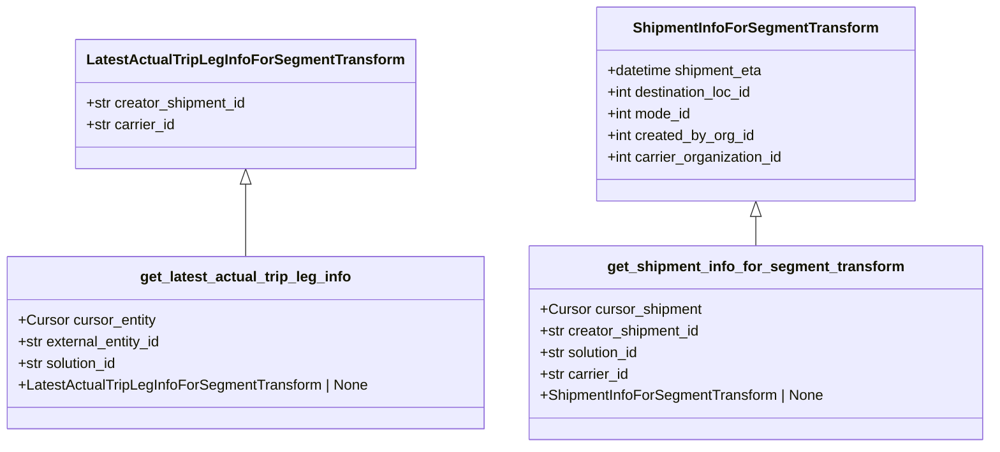

# Diagram: shipment_core/shipment_service/shipment_service/eta/eta_milestone_update/transform_status_update_to_segment/db_queries.py


> Auto-generated by Obscura crawlers

## Diagram 1



### SVG

<svg id="container" width="1096.734375" xmlns="http://www.w3.org/2000/svg" class="classDiagram" height="498" viewBox="0 0 1096.734375 498" role="graphics-document document" aria-roledescription="class"><style>#container{font-family:"trebuchet ms",verdana,arial,sans-serif;font-size:16px;fill:#333;}@keyframes edge-animation-frame{from{stroke-dashoffset:0;}}@keyframes dash{to{stroke-dashoffset:0;}}#container .edge-animation-slow{stroke-dasharray:9,5!important;stroke-dashoffset:900;animation:dash 50s linear infinite;stroke-linecap:round;}#container .edge-animation-fast{stroke-dasharray:9,5!important;stroke-dashoffset:900;animation:dash 20s linear infinite;stroke-linecap:round;}#container .error-icon{fill:#552222;}#container .error-text{fill:#552222;stroke:#552222;}#container .edge-thickness-normal{stroke-width:1px;}#container .edge-thickness-thick{stroke-width:3.5px;}#container .edge-pattern-solid{stroke-dasharray:0;}#container .edge-thickness-invisible{stroke-width:0;fill:none;}#container .edge-pattern-dashed{stroke-dasharray:3;}#container .edge-pattern-dotted{stroke-dasharray:2;}#container .marker{fill:#333333;stroke:#333333;}#container .marker.cross{stroke:#333333;}#container svg{font-family:"trebuchet ms",verdana,arial,sans-serif;font-size:16px;}#container p{margin:0;}#container g.classGroup text{fill:#9370DB;stroke:none;font-family:"trebuchet ms",verdana,arial,sans-serif;font-size:10px;}#container g.classGroup text .title{font-weight:bolder;}#container .nodeLabel,#container .edgeLabel{color:#131300;}#container .edgeLabel .label rect{fill:#ECECFF;}#container .label text{fill:#131300;}#container .labelBkg{background:#ECECFF;}#container .edgeLabel .label span{background:#ECECFF;}#container .classTitle{font-weight:bolder;}#container .node rect,#container .node circle,#container .node ellipse,#container .node polygon,#container .node path{fill:#ECECFF;stroke:#9370DB;stroke-width:1px;}#container .divider{stroke:#9370DB;stroke-width:1;}#container g.clickable{cursor:pointer;}#container g.classGroup rect{fill:#ECECFF;stroke:#9370DB;}#container g.classGroup line{stroke:#9370DB;stroke-width:1;}#container .classLabel .box{stroke:none;stroke-width:0;fill:#ECECFF;opacity:0.5;}#container .classLabel .label{fill:#9370DB;font-size:10px;}#container .relation{stroke:#333333;stroke-width:1;fill:none;}#container .dashed-line{stroke-dasharray:3;}#container .dotted-line{stroke-dasharray:1 2;}#container #compositionStart,#container .composition{fill:#333333!important;stroke:#333333!important;stroke-width:1;}#container #compositionEnd,#container .composition{fill:#333333!important;stroke:#333333!important;stroke-width:1;}#container #dependencyStart,#container .dependency{fill:#333333!important;stroke:#333333!important;stroke-width:1;}#container #dependencyStart,#container .dependency{fill:#333333!important;stroke:#333333!important;stroke-width:1;}#container #extensionStart,#container .extension{fill:transparent!important;stroke:#333333!important;stroke-width:1;}#container #extensionEnd,#container .extension{fill:transparent!important;stroke:#333333!important;stroke-width:1;}#container #aggregationStart,#container .aggregation{fill:transparent!important;stroke:#333333!important;stroke-width:1;}#container #aggregationEnd,#container .aggregation{fill:transparent!important;stroke:#333333!important;stroke-width:1;}#container #lollipopStart,#container .lollipop{fill:#ECECFF!important;stroke:#333333!important;stroke-width:1;}#container #lollipopEnd,#container .lollipop{fill:#ECECFF!important;stroke:#333333!important;stroke-width:1;}#container .edgeTerminals{font-size:11px;line-height:initial;}#container .classTitleText{text-anchor:middle;font-size:18px;fill:#333;}#container .label-icon{display:inline-block;height:1em;overflow:visible;vertical-align:-0.125em;}#container .node .label-icon path{fill:currentColor;stroke:revert;stroke-width:revert;}#container :root{--mermaid-font-family:"trebuchet ms",verdana,arial,sans-serif;}</style><g><defs><marker id="container_class-aggregationStart" class="marker aggregation class" refX="18" refY="7" markerWidth="190" markerHeight="240" orient="auto"><path d="M 18,7 L9,13 L1,7 L9,1 Z"></path></marker></defs><defs><marker id="container_class-aggregationEnd" class="marker aggregation class" refX="1" refY="7" markerWidth="20" markerHeight="28" orient="auto"><path d="M 18,7 L9,13 L1,7 L9,1 Z"></path></marker></defs><defs><marker id="container_class-extensionStart" class="marker extension class" refX="18" refY="7" markerWidth="190" markerHeight="240" orient="auto"><path d="M 1,7 L18,13 V 1 Z"></path></marker></defs><defs><marker id="container_class-extensionEnd" class="marker extension class" refX="1" refY="7" markerWidth="20" markerHeight="28" orient="auto"><path d="M 1,1 V 13 L18,7 Z"></path></marker></defs><defs><marker id="container_class-compositionStart" class="marker composition class" refX="18" refY="7" markerWidth="190" markerHeight="240" orient="auto"><path d="M 18,7 L9,13 L1,7 L9,1 Z"></path></marker></defs><defs><marker id="container_class-compositionEnd" class="marker composition class" refX="1" refY="7" markerWidth="20" markerHeight="28" orient="auto"><path d="M 18,7 L9,13 L1,7 L9,1 Z"></path></marker></defs><defs><marker id="container_class-dependencyStart" class="marker dependency class" refX="6" refY="7" markerWidth="190" markerHeight="240" orient="auto"><path d="M 5,7 L9,13 L1,7 L9,1 Z"></path></marker></defs><defs><marker id="container_class-dependencyEnd" class="marker dependency class" refX="13" refY="7" markerWidth="20" markerHeight="28" orient="auto"><path d="M 18,7 L9,13 L14,7 L9,1 Z"></path></marker></defs><defs><marker id="container_class-lollipopStart" class="marker lollipop class" refX="13" refY="7" markerWidth="190" markerHeight="240" orient="auto"><circle stroke="black" fill="transparent" cx="7" cy="7" r="6"></circle></marker></defs><defs><marker id="container_class-lollipopEnd" class="marker lollipop class" refX="1" refY="7" markerWidth="190" markerHeight="240" orient="auto"><circle stroke="black" fill="transparent" cx="7" cy="7" r="6"></circle></marker></defs><g class="root"><g class="clusters"></g><g class="edgePaths"><path d="M272.789,205.25L272.789,212.542C272.789,219.833,272.789,234.417,272.789,247.875C272.789,261.333,272.789,273.667,272.789,279.833L272.789,286" id="id_LatestActualTripLegInfoForSegmentTransform_get_latest_actual_trip_leg_info_1" class="edge-thickness-normal edge-pattern-solid relation" style=";;;" data-edge="true" data-et="edge" data-id="id_LatestActualTripLegInfoForSegmentTransform_get_latest_actual_trip_leg_info_1" data-points="W3sieCI6MjcyLjc4OTA2MjUsInkiOjE4OH0seyJ4IjoyNzIuNzg5MDYyNSwieSI6MjQ5fSx7IngiOjI3Mi43ODkwNjI1LCJ5IjoyODZ9XQ==" marker-start="url(#container_class-extensionStart)"></path><path d="M838.156,241.25L838.156,242.542C838.156,243.833,838.156,246.417,838.156,251.875C838.156,257.333,838.156,265.667,838.156,269.833L838.156,274" id="id_ShipmentInfoForSegmentTransform_get_shipment_info_for_segment_transform_2" class="edge-thickness-normal edge-pattern-solid relation" style=";;;" data-edge="true" data-et="edge" data-id="id_ShipmentInfoForSegmentTransform_get_shipment_info_for_segment_transform_2" data-points="W3sieCI6ODM4LjE1NjI1LCJ5IjoyMjR9LHsieCI6ODM4LjE1NjI1LCJ5IjoyNDl9LHsieCI6ODM4LjE1NjI1LCJ5IjoyNzR9XQ==" marker-start="url(#container_class-extensionStart)"></path></g><g class="edgeLabels"><g class="edgeLabel"><g class="label" data-id="id_LatestActualTripLegInfoForSegmentTransform_get_latest_actual_trip_leg_info_1" transform="translate(0, 0)"><foreignObject width="0" height="0"><div xmlns="http://www.w3.org/1999/xhtml" class="labelBkg" style="display: table-cell; white-space: nowrap; line-height: 1.5; max-width: 200px; text-align: center;"><span class="edgeLabel"></span></div></foreignObject></g></g><g class="edgeLabel"><g class="label" data-id="id_ShipmentInfoForSegmentTransform_get_shipment_info_for_segment_transform_2" transform="translate(0, 0)"><foreignObject width="0" height="0"><div xmlns="http://www.w3.org/1999/xhtml" class="labelBkg" style="display: table-cell; white-space: nowrap; line-height: 1.5; max-width: 200px; text-align: center;"><span class="edgeLabel"></span></div></foreignObject></g></g></g><g class="nodes"><g class="node default" id="classId-LatestActualTripLegInfoForSegmentTransform-0" transform="translate(272.7890625, 116)"><g class="basic label-container"><path d="M-186.6640625 -72 L186.6640625 -72 L186.6640625 72 L-186.6640625 72" stroke="none" stroke-width="0" fill="#ECECFF" style=""></path><path d="M-186.6640625 -72 C-99.72964598985658 -72, -12.795229479713157 -72, 186.6640625 -72 M-186.6640625 -72 C-69.0942530087077 -72, 48.47555648258461 -72, 186.6640625 -72 M186.6640625 -72 C186.6640625 -18.78650008108651, 186.6640625 34.42699983782698, 186.6640625 72 M186.6640625 -72 C186.6640625 -34.965651493310304, 186.6640625 2.068697013379392, 186.6640625 72 M186.6640625 72 C84.3136224985061 72, -18.036817502987788 72, -186.6640625 72 M186.6640625 72 C43.38971833193236 72, -99.88462583613529 72, -186.6640625 72 M-186.6640625 72 C-186.6640625 35.3431060357689, -186.6640625 -1.3137879284622045, -186.6640625 -72 M-186.6640625 72 C-186.6640625 30.795478163282155, -186.6640625 -10.40904367343569, -186.6640625 -72" stroke="#9370DB" stroke-width="1.3" fill="none" stroke-dasharray="0 0" style=""></path></g><g class="annotation-group text" transform="translate(0, -48)"></g><g class="label-group text" transform="translate(-168.125, -48)"><g class="label" style="font-weight: bolder" transform="translate(0,-12)"><foreignObject width="336.25" height="24"><div xmlns="http://www.w3.org/1999/xhtml" style="display: table-cell; white-space: nowrap; line-height: 1.5; max-width: 380px; text-align: center;"><span class="nodeLabel markdown-node-label" style=""><p>LatestActualTripLegInfoForSegmentTransform</p></span></div></foreignObject></g></g><g class="members-group text" transform="translate(-174.6640625, 0)"><g class="label" style="" transform="translate(0,-12)"><foreignObject width="181.203125" height="24"><div xmlns="http://www.w3.org/1999/xhtml" style="display: table-cell; white-space: nowrap; line-height: 1.5; max-width: 239px; text-align: center;"><span class="nodeLabel markdown-node-label" style=""><p>+str creator_shipment_id</p></span></div></foreignObject></g><g class="label" style="" transform="translate(0,12)"><foreignObject width="100.734375" height="24"><div xmlns="http://www.w3.org/1999/xhtml" style="display: table-cell; white-space: nowrap; line-height: 1.5; max-width: 158px; text-align: center;"><span class="nodeLabel markdown-node-label" style=""><p>+str carrier_id</p></span></div></foreignObject></g></g><g class="methods-group text" transform="translate(-174.6640625, 72)"></g><g class="divider" style=""><path d="M-186.6640625 -24 C-55.608465868600376 -24, 75.44713076279925 -24, 186.6640625 -24 M-186.6640625 -24 C-68.83310602309436 -24, 48.99785045381128 -24, 186.6640625 -24" stroke="#9370DB" stroke-width="1.3" fill="none" stroke-dasharray="0 0" style=""></path></g><g class="divider" style=""><path d="M-186.6640625 48 C-65.6149943969085 48, 55.434073706183 48, 186.6640625 48 M-186.6640625 48 C-75.43901559154877 48, 35.786031316902466 48, 186.6640625 48" stroke="#9370DB" stroke-width="1.3" fill="none" stroke-dasharray="0 0" style=""></path></g></g><g class="node default" id="classId-ShipmentInfoForSegmentTransform-1" transform="translate(838.15625, 116)"><g class="basic label-container"><path d="M-176.9375 -108 L176.9375 -108 L176.9375 108 L-176.9375 108" stroke="none" stroke-width="0" fill="#ECECFF" style=""></path><path d="M-176.9375 -108 C-63.35434151770822 -108, 50.22881696458356 -108, 176.9375 -108 M-176.9375 -108 C-67.92952401319441 -108, 41.07845197361118 -108, 176.9375 -108 M176.9375 -108 C176.9375 -21.907637122411344, 176.9375 64.18472575517731, 176.9375 108 M176.9375 -108 C176.9375 -63.162941950142546, 176.9375 -18.325883900285092, 176.9375 108 M176.9375 108 C96.75112435859351 108, 16.56474871718703 108, -176.9375 108 M176.9375 108 C98.40905704258455 108, 19.8806140851691 108, -176.9375 108 M-176.9375 108 C-176.9375 61.63686410069694, -176.9375 15.27372820139388, -176.9375 -108 M-176.9375 108 C-176.9375 47.68436517848446, -176.9375 -12.631269643031075, -176.9375 -108" stroke="#9370DB" stroke-width="1.3" fill="none" stroke-dasharray="0 0" style=""></path></g><g class="annotation-group text" transform="translate(0, -84)"></g><g class="label-group text" transform="translate(-130.5625, -84)"><g class="label" style="font-weight: bolder" transform="translate(0,-12)"><foreignObject width="261.125" height="24"><div xmlns="http://www.w3.org/1999/xhtml" style="display: table-cell; white-space: nowrap; line-height: 1.5; max-width: 308px; text-align: center;"><span class="nodeLabel markdown-node-label" style=""><p>ShipmentInfoForSegmentTransform</p></span></div></foreignObject></g></g><g class="members-group text" transform="translate(-164.9375, -36)"><g class="label" style="" transform="translate(0,-12)"><foreignObject width="177.015625" height="24"><div xmlns="http://www.w3.org/1999/xhtml" style="display: table-cell; white-space: nowrap; line-height: 1.5; max-width: 234px; text-align: center;"><span class="nodeLabel markdown-node-label" style=""><p>+datetime shipment_eta</p></span></div></foreignObject></g><g class="label" style="" transform="translate(0,12)"><foreignObject width="167.1875" height="24"><div xmlns="http://www.w3.org/1999/xhtml" style="display: table-cell; white-space: nowrap; line-height: 1.5; max-width: 225px; text-align: center;"><span class="nodeLabel markdown-node-label" style=""><p>+int destination_loc_id</p></span></div></foreignObject></g><g class="label" style="" transform="translate(0,36)"><foreignObject width="95.3125" height="24"><div xmlns="http://www.w3.org/1999/xhtml" style="display: table-cell; white-space: nowrap; line-height: 1.5; max-width: 153px; text-align: center;"><span class="nodeLabel markdown-node-label" style=""><p>+int mode_id</p></span></div></foreignObject></g><g class="label" style="" transform="translate(0,60)"><foreignObject width="165.546875" height="24"><div xmlns="http://www.w3.org/1999/xhtml" style="display: table-cell; white-space: nowrap; line-height: 1.5; max-width: 223px; text-align: center;"><span class="nodeLabel markdown-node-label" style=""><p>+int created_by_org_id</p></span></div></foreignObject></g><g class="label" style="" transform="translate(0,84)"><foreignObject width="199.3125" height="24"><div xmlns="http://www.w3.org/1999/xhtml" style="display: table-cell; white-space: nowrap; line-height: 1.5; max-width: 257px; text-align: center;"><span class="nodeLabel markdown-node-label" style=""><p>+int carrier_organization_id</p></span></div></foreignObject></g></g><g class="methods-group text" transform="translate(-164.9375, 108)"></g><g class="divider" style=""><path d="M-176.9375 -60 C-67.92106502640557 -60, 41.09536994718886 -60, 176.9375 -60 M-176.9375 -60 C-66.12025004826035 -60, 44.69699990347931 -60, 176.9375 -60" stroke="#9370DB" stroke-width="1.3" fill="none" stroke-dasharray="0 0" style=""></path></g><g class="divider" style=""><path d="M-176.9375 84 C-63.257996041795764 84, 50.42150791640847 84, 176.9375 84 M-176.9375 84 C-60.92841748313798 84, 55.080665033724046 84, 176.9375 84" stroke="#9370DB" stroke-width="1.3" fill="none" stroke-dasharray="0 0" style=""></path></g></g><g class="node default" id="classId-get_latest_actual_trip_leg_info-2" transform="translate(272.7890625, 382)"><g class="basic label-container"><path d="M-264.7890625 -96 L264.7890625 -96 L264.7890625 96 L-264.7890625 96" stroke="none" stroke-width="0" fill="#ECECFF" style=""></path><path d="M-264.7890625 -96 C-122.88655825779469 -96, 19.01594598441062 -96, 264.7890625 -96 M-264.7890625 -96 C-79.55431000743496 -96, 105.68044248513007 -96, 264.7890625 -96 M264.7890625 -96 C264.7890625 -45.60715095303227, 264.7890625 4.785698093935466, 264.7890625 96 M264.7890625 -96 C264.7890625 -39.46269044212213, 264.7890625 17.074619115755738, 264.7890625 96 M264.7890625 96 C156.59501483671906 96, 48.40096717343812 96, -264.7890625 96 M264.7890625 96 C63.94663050492434 96, -136.8958014901513 96, -264.7890625 96 M-264.7890625 96 C-264.7890625 31.08802988469448, -264.7890625 -33.82394023061104, -264.7890625 -96 M-264.7890625 96 C-264.7890625 54.7263337446564, -264.7890625 13.452667489312802, -264.7890625 -96" stroke="#9370DB" stroke-width="1.3" fill="none" stroke-dasharray="0 0" style=""></path></g><g class="annotation-group text" transform="translate(0, -72)"></g><g class="label-group text" transform="translate(-114.359375, -72)"><g class="label" style="font-weight: bolder" transform="translate(0,-12)"><foreignObject width="228.71875" height="24"><div xmlns="http://www.w3.org/1999/xhtml" style="display: table-cell; white-space: nowrap; line-height: 1.5; max-width: 274px; text-align: center;"><span class="nodeLabel markdown-node-label" style=""><p>get_latest_actual_trip_leg_info</p></span></div></foreignObject></g></g><g class="members-group text" transform="translate(-252.7890625, -24)"><g class="label" style="" transform="translate(0,-12)"><foreignObject width="153.5625" height="24"><div xmlns="http://www.w3.org/1999/xhtml" style="display: table-cell; white-space: nowrap; line-height: 1.5; max-width: 211px; text-align: center;"><span class="nodeLabel markdown-node-label" style=""><p>+Cursor cursor_entity</p></span></div></foreignObject></g><g class="label" style="" transform="translate(0,12)"><foreignObject width="162.90625" height="24"><div xmlns="http://www.w3.org/1999/xhtml" style="display: table-cell; white-space: nowrap; line-height: 1.5; max-width: 220px; text-align: center;"><span class="nodeLabel markdown-node-label" style=""><p>+str external_entity_id</p></span></div></foreignObject></g><g class="label" style="" transform="translate(0,36)"><foreignObject width="113.875" height="24"><div xmlns="http://www.w3.org/1999/xhtml" style="display: table-cell; white-space: nowrap; line-height: 1.5; max-width: 171px; text-align: center;"><span class="nodeLabel markdown-node-label" style=""><p>+str solution_id</p></span></div></foreignObject></g><g class="label" style="" transform="translate(0,60)"><foreignObject width="391.21875" height="24"><div xmlns="http://www.w3.org/1999/xhtml" style="display: table-cell; white-space: nowrap; line-height: 1.5; max-width: 449px; text-align: center;"><span class="nodeLabel markdown-node-label" style=""><p>+LatestActualTripLegInfoForSegmentTransform | None</p></span></div></foreignObject></g></g><g class="methods-group text" transform="translate(-252.7890625, 96)"></g><g class="divider" style=""><path d="M-264.7890625 -48 C-57.32299688953327 -48, 150.14306872093346 -48, 264.7890625 -48 M-264.7890625 -48 C-131.56683239283666 -48, 1.655397714326682 -48, 264.7890625 -48" stroke="#9370DB" stroke-width="1.3" fill="none" stroke-dasharray="0 0" style=""></path></g><g class="divider" style=""><path d="M-264.7890625 72 C-142.50768202999564 72, -20.22630155999127 72, 264.7890625 72 M-264.7890625 72 C-83.86116586856701 72, 97.06673076286597 72, 264.7890625 72" stroke="#9370DB" stroke-width="1.3" fill="none" stroke-dasharray="0 0" style=""></path></g></g><g class="node default" id="classId-get_shipment_info_for_segment_transform-3" transform="translate(838.15625, 382)"><g class="basic label-container"><path d="M-250.578125 -108 L250.578125 -108 L250.578125 108 L-250.578125 108" stroke="none" stroke-width="0" fill="#ECECFF" style=""></path><path d="M-250.578125 -108 C-87.6810816255389 -108, 75.21596174892221 -108, 250.578125 -108 M-250.578125 -108 C-146.49823156059142 -108, -42.41833812118281 -108, 250.578125 -108 M250.578125 -108 C250.578125 -24.386653557856008, 250.578125 59.226692884287985, 250.578125 108 M250.578125 -108 C250.578125 -41.40833581182052, 250.578125 25.183328376358958, 250.578125 108 M250.578125 108 C114.25702403253743 108, -22.06407693492514 108, -250.578125 108 M250.578125 108 C109.17623511338562 108, -32.22565477322877 108, -250.578125 108 M-250.578125 108 C-250.578125 32.82076917160549, -250.578125 -42.35846165678902, -250.578125 -108 M-250.578125 108 C-250.578125 51.53522768641703, -250.578125 -4.929544627165939, -250.578125 -108" stroke="#9370DB" stroke-width="1.3" fill="none" stroke-dasharray="0 0" style=""></path></g><g class="annotation-group text" transform="translate(0, -84)"></g><g class="label-group text" transform="translate(-158.625, -84)"><g class="label" style="font-weight: bolder" transform="translate(0,-12)"><foreignObject width="317.25" height="24"><div xmlns="http://www.w3.org/1999/xhtml" style="display: table-cell; white-space: nowrap; line-height: 1.5; max-width: 363px; text-align: center;"><span class="nodeLabel markdown-node-label" style=""><p>get_shipment_info_for_segment_transform</p></span></div></foreignObject></g></g><g class="members-group text" transform="translate(-238.578125, -36)"><g class="label" style="" transform="translate(0,-12)"><foreignObject width="180.375" height="24"><div xmlns="http://www.w3.org/1999/xhtml" style="display: table-cell; white-space: nowrap; line-height: 1.5; max-width: 238px; text-align: center;"><span class="nodeLabel markdown-node-label" style=""><p>+Cursor cursor_shipment</p></span></div></foreignObject></g><g class="label" style="" transform="translate(0,12)"><foreignObject width="181.203125" height="24"><div xmlns="http://www.w3.org/1999/xhtml" style="display: table-cell; white-space: nowrap; line-height: 1.5; max-width: 239px; text-align: center;"><span class="nodeLabel markdown-node-label" style=""><p>+str creator_shipment_id</p></span></div></foreignObject></g><g class="label" style="" transform="translate(0,36)"><foreignObject width="113.875" height="24"><div xmlns="http://www.w3.org/1999/xhtml" style="display: table-cell; white-space: nowrap; line-height: 1.5; max-width: 171px; text-align: center;"><span class="nodeLabel markdown-node-label" style=""><p>+str solution_id</p></span></div></foreignObject></g><g class="label" style="" transform="translate(0,60)"><foreignObject width="100.734375" height="24"><div xmlns="http://www.w3.org/1999/xhtml" style="display: table-cell; white-space: nowrap; line-height: 1.5; max-width: 158px; text-align: center;"><span class="nodeLabel markdown-node-label" style=""><p>+str carrier_id</p></span></div></foreignObject></g><g class="label" style="" transform="translate(0,84)"><foreignObject width="318.53125" height="24"><div xmlns="http://www.w3.org/1999/xhtml" style="display: table-cell; white-space: nowrap; line-height: 1.5; max-width: 376px; text-align: center;"><span class="nodeLabel markdown-node-label" style=""><p>+ShipmentInfoForSegmentTransform | None</p></span></div></foreignObject></g></g><g class="methods-group text" transform="translate(-238.578125, 108)"></g><g class="divider" style=""><path d="M-250.578125 -60 C-120.22346067097172 -60, 10.131203658056563 -60, 250.578125 -60 M-250.578125 -60 C-82.10246518277961 -60, 86.37319463444078 -60, 250.578125 -60" stroke="#9370DB" stroke-width="1.3" fill="none" stroke-dasharray="0 0" style=""></path></g><g class="divider" style=""><path d="M-250.578125 84 C-81.98640085805735 84, 86.6053232838853 84, 250.578125 84 M-250.578125 84 C-99.9591039014839 84, 50.6599171970322 84, 250.578125 84" stroke="#9370DB" stroke-width="1.3" fill="none" stroke-dasharray="0 0" style=""></path></g></g></g></g></g></svg>

## Diagram 2

```mermaid
flowchart LR
    A[get_latest_actual_trip_leg_info(cursor_entity, external_entity_id, solution_id)] --> B[Prepare SQL query selecting creator_shipment_id, carrier_id]
    B --> C[Execute cursor_entity.execute(sql, params)]
    C --> D[result = cursor_entity.fetchone()]
    D --> |no result| E[return None]
    D --> |result| F[Try: unpack creator_shipment_id, carrier_id]
    F --> G[Return LatestActualTripLegInfoForSegmentTransform(...)]
    F --> |TypeError or ValueError| H[logger.info(...) and return None]

    subgraph shipment_flow
        S[get_shipment_info_for_segment_transform(cursor_shipment, creator_shipment_id, solution_id, carrier_id)] --> S1[Prepare SQL query selecting shipment_eta, destination_loc_id, mode_id, created_by_org_id, carrier_organization_id]
        S1 --> S2[Build data dict and execute cursor_shipment.execute(sql, data)]
        S2 --> S3[result = cursor_shipment.fetchone()]
        S3 --> |no result| S4[return None]
        S3 --> |result| S5[Try: unpack shipment_eta, destination_loc_id, mode_id, created_by_org_id, carrier_organization_id]
        S5 --> S6[Return ShipmentInfoForSegmentTransform(...)]
        S5 --> |TypeError or ValueError| S7[logger.info(...) and return None]
    end
```

> SVG rendering failed for this diagram.
