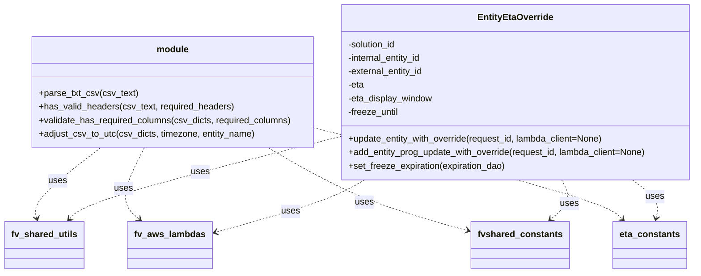

# Diagram: shipment_core/shipment_service/shipment_service/eta/eta_override_utils.py


> Auto-generated by Obscura crawlers

## Diagram 1



### SVG

<svg id="container" width="1235.203125" xmlns="http://www.w3.org/2000/svg" class="classDiagram" height="486" viewBox="0 0 1235.203125 486" role="graphics-document document" aria-roledescription="class"><style>#container{font-family:"trebuchet ms",verdana,arial,sans-serif;font-size:16px;fill:#333;}@keyframes edge-animation-frame{from{stroke-dashoffset:0;}}@keyframes dash{to{stroke-dashoffset:0;}}#container .edge-animation-slow{stroke-dasharray:9,5!important;stroke-dashoffset:900;animation:dash 50s linear infinite;stroke-linecap:round;}#container .edge-animation-fast{stroke-dasharray:9,5!important;stroke-dashoffset:900;animation:dash 20s linear infinite;stroke-linecap:round;}#container .error-icon{fill:#552222;}#container .error-text{fill:#552222;stroke:#552222;}#container .edge-thickness-normal{stroke-width:1px;}#container .edge-thickness-thick{stroke-width:3.5px;}#container .edge-pattern-solid{stroke-dasharray:0;}#container .edge-thickness-invisible{stroke-width:0;fill:none;}#container .edge-pattern-dashed{stroke-dasharray:3;}#container .edge-pattern-dotted{stroke-dasharray:2;}#container .marker{fill:#333333;stroke:#333333;}#container .marker.cross{stroke:#333333;}#container svg{font-family:"trebuchet ms",verdana,arial,sans-serif;font-size:16px;}#container p{margin:0;}#container g.classGroup text{fill:#9370DB;stroke:none;font-family:"trebuchet ms",verdana,arial,sans-serif;font-size:10px;}#container g.classGroup text .title{font-weight:bolder;}#container .nodeLabel,#container .edgeLabel{color:#131300;}#container .edgeLabel .label rect{fill:#ECECFF;}#container .label text{fill:#131300;}#container .labelBkg{background:#ECECFF;}#container .edgeLabel .label span{background:#ECECFF;}#container .classTitle{font-weight:bolder;}#container .node rect,#container .node circle,#container .node ellipse,#container .node polygon,#container .node path{fill:#ECECFF;stroke:#9370DB;stroke-width:1px;}#container .divider{stroke:#9370DB;stroke-width:1;}#container g.clickable{cursor:pointer;}#container g.classGroup rect{fill:#ECECFF;stroke:#9370DB;}#container g.classGroup line{stroke:#9370DB;stroke-width:1;}#container .classLabel .box{stroke:none;stroke-width:0;fill:#ECECFF;opacity:0.5;}#container .classLabel .label{fill:#9370DB;font-size:10px;}#container .relation{stroke:#333333;stroke-width:1;fill:none;}#container .dashed-line{stroke-dasharray:3;}#container .dotted-line{stroke-dasharray:1 2;}#container #compositionStart,#container .composition{fill:#333333!important;stroke:#333333!important;stroke-width:1;}#container #compositionEnd,#container .composition{fill:#333333!important;stroke:#333333!important;stroke-width:1;}#container #dependencyStart,#container .dependency{fill:#333333!important;stroke:#333333!important;stroke-width:1;}#container #dependencyStart,#container .dependency{fill:#333333!important;stroke:#333333!important;stroke-width:1;}#container #extensionStart,#container .extension{fill:transparent!important;stroke:#333333!important;stroke-width:1;}#container #extensionEnd,#container .extension{fill:transparent!important;stroke:#333333!important;stroke-width:1;}#container #aggregationStart,#container .aggregation{fill:transparent!important;stroke:#333333!important;stroke-width:1;}#container #aggregationEnd,#container .aggregation{fill:transparent!important;stroke:#333333!important;stroke-width:1;}#container #lollipopStart,#container .lollipop{fill:#ECECFF!important;stroke:#333333!important;stroke-width:1;}#container #lollipopEnd,#container .lollipop{fill:#ECECFF!important;stroke:#333333!important;stroke-width:1;}#container .edgeTerminals{font-size:11px;line-height:initial;}#container .classTitleText{text-anchor:middle;font-size:18px;fill:#333;}#container .label-icon{display:inline-block;height:1em;overflow:visible;vertical-align:-0.125em;}#container .node .label-icon path{fill:currentColor;stroke:revert;stroke-width:revert;}#container :root{--mermaid-font-family:"trebuchet ms",verdana,arial,sans-serif;}</style><g><defs><marker id="container_class-aggregationStart" class="marker aggregation class" refX="18" refY="7" markerWidth="190" markerHeight="240" orient="auto"><path d="M 18,7 L9,13 L1,7 L9,1 Z"></path></marker></defs><defs><marker id="container_class-aggregationEnd" class="marker aggregation class" refX="1" refY="7" markerWidth="20" markerHeight="28" orient="auto"><path d="M 18,7 L9,13 L1,7 L9,1 Z"></path></marker></defs><defs><marker id="container_class-extensionStart" class="marker extension class" refX="18" refY="7" markerWidth="190" markerHeight="240" orient="auto"><path d="M 1,7 L18,13 V 1 Z"></path></marker></defs><defs><marker id="container_class-extensionEnd" class="marker extension class" refX="1" refY="7" markerWidth="20" markerHeight="28" orient="auto"><path d="M 1,1 V 13 L18,7 Z"></path></marker></defs><defs><marker id="container_class-compositionStart" class="marker composition class" refX="18" refY="7" markerWidth="190" markerHeight="240" orient="auto"><path d="M 18,7 L9,13 L1,7 L9,1 Z"></path></marker></defs><defs><marker id="container_class-compositionEnd" class="marker composition class" refX="1" refY="7" markerWidth="20" markerHeight="28" orient="auto"><path d="M 18,7 L9,13 L1,7 L9,1 Z"></path></marker></defs><defs><marker id="container_class-dependencyStart" class="marker dependency class" refX="6" refY="7" markerWidth="190" markerHeight="240" orient="auto"><path d="M 5,7 L9,13 L1,7 L9,1 Z"></path></marker></defs><defs><marker id="container_class-dependencyEnd" class="marker dependency class" refX="13" refY="7" markerWidth="20" markerHeight="28" orient="auto"><path d="M 18,7 L9,13 L14,7 L9,1 Z"></path></marker></defs><defs><marker id="container_class-lollipopStart" class="marker lollipop class" refX="13" refY="7" markerWidth="190" markerHeight="240" orient="auto"><circle stroke="black" fill="transparent" cx="7" cy="7" r="6"></circle></marker></defs><defs><marker id="container_class-lollipopEnd" class="marker lollipop class" refX="1" refY="7" markerWidth="190" markerHeight="240" orient="auto"><circle stroke="black" fill="transparent" cx="7" cy="7" r="6"></circle></marker></defs><g class="root"><g class="clusters"></g><g class="edgePaths"><path d="M172.261,263L152.525,278.667C132.788,294.333,93.316,325.667,75.045,346.537C56.774,367.408,59.705,377.816,61.17,383.02L62.635,388.225" id="id_module_fv_shared_utils_1" class="edge-thickness-normal edge-pattern-dashed relation" style=";;;" data-edge="true" data-et="edge" data-id="id_module_fv_shared_utils_1" data-points="W3sieCI6MTcyLjI2MDc2NzQ4NzA0NjYyLCJ5IjoyNjN9LHsieCI6NTMuODQzNzUsInkiOjM1N30seyJ4Ijo2NC4yNjA5NzcwNTY5NjIwMiwieSI6Mzk0fV0=" marker-end="url(#container_class-dependencyEnd)"></path><path d="M248.208,263L240.49,278.667C232.773,294.333,217.338,325.667,215.955,346.844C214.573,368.021,227.243,379.042,233.578,384.552L239.913,390.062" id="id_module_fv_aws_lambdas_2" class="edge-thickness-normal edge-pattern-dashed relation" style=";;;" data-edge="true" data-et="edge" data-id="id_module_fv_aws_lambdas_2" data-points="W3sieCI6MjQ4LjIwNzkyMTc5NDA0MTQ1LCJ5IjoyNjN9LHsieCI6MjAxLjkwMjM0Mzc1LCJ5IjozNTd9LHsieCI6MjQ0LjQ0MDI2ODk4NzM0MTc3LCJ5IjozOTR9XQ==" marker-end="url(#container_class-dependencyEnd)"></path><path d="M468.61,263L495.77,278.667C522.931,294.333,577.253,325.667,637.735,350.429C698.218,375.191,764.861,393.382,798.183,402.477L831.505,411.573" id="id_module_fvshared_constants_3" class="edge-thickness-normal edge-pattern-dashed relation" style=";;;" data-edge="true" data-et="edge" data-id="id_module_fvshared_constants_3" data-points="W3sieCI6NDY4LjYwOTU1NzE1NjczNTcsInkiOjI2M30seyJ4Ijo2MzEuNTc0MjE4NzUsInkiOjM1N30seyJ4Ijo4MzcuMjkyOTY4NzUsInkiOjQxMy4xNTI1NjcwNzg3NjY5NH1d" marker-end="url(#container_class-dependencyEnd)"></path><path d="M549.172,227.391L635.111,248.993C721.049,270.594,892.927,313.797,984.395,340.862C1075.864,367.928,1086.922,378.855,1092.452,384.319L1097.981,389.783" id="id_module_eta_constants_4" class="edge-thickness-normal edge-pattern-dashed relation" style=";;;" data-edge="true" data-et="edge" data-id="id_module_eta_constants_4" data-points="W3sieCI6NTQ5LjE3MTg3NSwieSI6MjI3LjM5MTM5NDE1MTUyMzE3fSx7IngiOjEwNjQuODA0Njg3NSwieSI6MzU3fSx7IngiOjExMDIuMjQ5MjU4MzA2OTYyLCJ5IjozOTR9XQ==" marker-end="url(#container_class-dependencyEnd)"></path><path d="M642.736,320L632.045,326.167C621.354,332.333,599.972,344.667,554.611,360.414C509.251,376.162,439.911,395.325,405.242,404.906L370.572,414.487" id="id_EntityEtaOverride_fv_aws_lambdas_5" class="edge-thickness-normal edge-pattern-dashed relation" style=";;;" data-edge="true" data-et="edge" data-id="id_EntityEtaOverride_fv_aws_lambdas_5" data-points="W3sieCI6NjQyLjczNTUwODQxOTY4OSwieSI6MzIwfSx7IngiOjU3OC41ODk4NDM3NSwieSI6MzU3fSx7IngiOjM2NC43ODkwNjI1LCJ5Ijo0MTYuMDg1MTA0MDU3MDY0fV0=" marker-end="url(#container_class-dependencyEnd)"></path><path d="M599.172,243.298L524.13,262.248C449.087,281.199,299.003,319.099,218.953,343.481C138.903,367.863,128.888,378.726,123.881,384.157L118.874,389.589" id="id_EntityEtaOverride_fv_shared_utils_6" class="edge-thickness-normal edge-pattern-dashed relation" style=";;;" data-edge="true" data-et="edge" data-id="id_EntityEtaOverride_fv_shared_utils_6" data-points="W3sieCI6NTk5LjE3MTg3NSwieSI6MjQzLjI5Nzk2MTE4NjM4NjF9LHsieCI6MTQ4LjkxNzk2ODc1LCJ5IjozNTd9LHsieCI6MTE0LjgwNjc2NDI0MDUwNjM0LCJ5IjozOTR9XQ==" marker-end="url(#container_class-dependencyEnd)"></path><path d="M1115.462,320L1123.458,326.167C1131.454,332.333,1147.446,344.667,1154.213,356.027C1160.981,367.387,1158.524,377.774,1157.296,382.968L1156.068,388.161" id="id_EntityEtaOverride_eta_constants_7" class="edge-thickness-normal edge-pattern-dashed relation" style=";;;" data-edge="true" data-et="edge" data-id="id_EntityEtaOverride_eta_constants_7" data-points="W3sieCI6MTExNS40NjIxMTEzOTg5NjM4LCJ5IjozMjB9LHsieCI6MTE2My40Mzc1LCJ5IjozNTd9LHsieCI6MTE1NC42ODY5NTYwOTE3NzIxLCJ5IjozOTR9XQ==" marker-end="url(#container_class-dependencyEnd)"></path><path d="M992.911,320L996.063,326.167C999.214,332.333,1005.517,344.667,1002.334,356.344C999.15,368.021,986.48,379.042,980.145,384.552L973.809,390.062" id="id_EntityEtaOverride_fvshared_constants_8" class="edge-thickness-normal edge-pattern-dashed relation" style=";;;" data-edge="true" data-et="edge" data-id="id_EntityEtaOverride_fvshared_constants_8" data-points="W3sieCI6OTkyLjkxMTQzMTM0NzE1MDMsInkiOjMyMH0seyJ4IjoxMDExLjgyMDMxMjUsInkiOjM1N30seyJ4Ijo5NjkuMjgyMzg3MjYyNjU4MiwieSI6Mzk0fV0=" marker-end="url(#container_class-dependencyEnd)"></path></g><g class="edgeLabels"><g class="edgeLabel" transform="translate(97.99916, 321.94922)"><g class="label" data-id="id_module_fv_shared_utils_1" transform="translate(-16.4921875, -12)"><foreignObject width="32.984375" height="24"><div xmlns="http://www.w3.org/1999/xhtml" class="labelBkg" style="display: table-cell; white-space: nowrap; line-height: 1.5; max-width: 200px; text-align: center;"><span class="edgeLabel"><p>uses</p></span></div></foreignObject></g></g><g class="edgeLabel" transform="translate(212.5983, 335.28727)"><g class="label" data-id="id_module_fv_aws_lambdas_2" transform="translate(-16.4921875, -12)"><foreignObject width="32.984375" height="24"><div xmlns="http://www.w3.org/1999/xhtml" class="labelBkg" style="display: table-cell; white-space: nowrap; line-height: 1.5; max-width: 200px; text-align: center;"><span class="edgeLabel"><p>uses</p></span></div></foreignObject></g></g><g class="edgeLabel" transform="translate(643.68765, 360.30646)"><g class="label" data-id="id_module_fvshared_constants_3" transform="translate(-16.4921875, -12)"><foreignObject width="32.984375" height="24"><div xmlns="http://www.w3.org/1999/xhtml" class="labelBkg" style="display: table-cell; white-space: nowrap; line-height: 1.5; max-width: 200px; text-align: center;"><span class="edgeLabel"><p>uses</p></span></div></foreignObject></g></g><g class="edgeLabel" transform="translate(832.51483, 298.61201)"><g class="label" data-id="id_module_eta_constants_4" transform="translate(-16.4921875, -12)"><foreignObject width="32.984375" height="24"><div xmlns="http://www.w3.org/1999/xhtml" class="labelBkg" style="display: table-cell; white-space: nowrap; line-height: 1.5; max-width: 200px; text-align: center;"><span class="edgeLabel"><p>uses</p></span></div></foreignObject></g></g><g class="edgeLabel" transform="translate(507.37762, 376.67992)"><g class="label" data-id="id_EntityEtaOverride_fv_aws_lambdas_5" transform="translate(-16.4921875, -12)"><foreignObject width="32.984375" height="24"><div xmlns="http://www.w3.org/1999/xhtml" class="labelBkg" style="display: table-cell; white-space: nowrap; line-height: 1.5; max-width: 200px; text-align: center;"><span class="edgeLabel"><p>uses</p></span></div></foreignObject></g></g><g class="edgeLabel" transform="translate(349.64845, 306.30979)"><g class="label" data-id="id_EntityEtaOverride_fv_shared_utils_6" transform="translate(-16.4921875, -12)"><foreignObject width="32.984375" height="24"><div xmlns="http://www.w3.org/1999/xhtml" class="labelBkg" style="display: table-cell; white-space: nowrap; line-height: 1.5; max-width: 200px; text-align: center;"><span class="edgeLabel"><p>uses</p></span></div></foreignObject></g></g><g class="edgeLabel" transform="translate(1154.50331, 350.1097)"><g class="label" data-id="id_EntityEtaOverride_eta_constants_7" transform="translate(-16.4921875, -12)"><foreignObject width="32.984375" height="24"><div xmlns="http://www.w3.org/1999/xhtml" class="labelBkg" style="display: table-cell; white-space: nowrap; line-height: 1.5; max-width: 200px; text-align: center;"><span class="edgeLabel"><p>uses</p></span></div></foreignObject></g></g><g class="edgeLabel" transform="translate(1006.22701, 361.86512)"><g class="label" data-id="id_EntityEtaOverride_fvshared_constants_8" transform="translate(-16.4921875, -12)"><foreignObject width="32.984375" height="24"><div xmlns="http://www.w3.org/1999/xhtml" class="labelBkg" style="display: table-cell; white-space: nowrap; line-height: 1.5; max-width: 200px; text-align: center;"><span class="edgeLabel"><p>uses</p></span></div></foreignObject></g></g></g><g class="nodes"><g class="node default" id="classId-module-0" transform="translate(296.9765625, 164)"><g class="basic label-container"><path d="M-252.1953125 -99 L252.1953125 -99 L252.1953125 99 L-252.1953125 99" stroke="none" stroke-width="0" fill="#ECECFF" style=""></path><path d="M-252.1953125 -99 C-126.76284881808462 -99, -1.330385136169241 -99, 252.1953125 -99 M-252.1953125 -99 C-118.89254941570292 -99, 14.410213668594167 -99, 252.1953125 -99 M252.1953125 -99 C252.1953125 -46.26312299377426, 252.1953125 6.473754012451479, 252.1953125 99 M252.1953125 -99 C252.1953125 -26.590540589203044, 252.1953125 45.81891882159391, 252.1953125 99 M252.1953125 99 C122.26178876786827 99, -7.6717349642634645 99, -252.1953125 99 M252.1953125 99 C129.75795351414817 99, 7.32059452829634 99, -252.1953125 99 M-252.1953125 99 C-252.1953125 36.902915479452574, -252.1953125 -25.194169041094852, -252.1953125 -99 M-252.1953125 99 C-252.1953125 46.0559696741677, -252.1953125 -6.888060651664603, -252.1953125 -99" stroke="#9370DB" stroke-width="1.3" fill="none" stroke-dasharray="0 0" style=""></path></g><g class="annotation-group text" transform="translate(0, -75)"></g><g class="label-group text" transform="translate(-27.5625, -75)"><g class="label" style="font-weight: bolder" transform="translate(0,-12)"><foreignObject width="55.125" height="24"><div xmlns="http://www.w3.org/1999/xhtml" style="display: table-cell; white-space: nowrap; line-height: 1.5; max-width: 105px; text-align: center;"><span class="nodeLabel markdown-node-label" style=""><p>module</p></span></div></foreignObject></g></g><g class="members-group text" transform="translate(-240.1953125, -27)"></g><g class="methods-group text" transform="translate(-240.1953125, 3)"><g class="label" style="" transform="translate(0,-12)"><foreignObject width="174.140625" height="24"><div xmlns="http://www.w3.org/1999/xhtml" style="display: table-cell; white-space: nowrap; line-height: 1.5; max-width: 232px; text-align: center;"><span class="nodeLabel markdown-node-label" style=""><p>+parse_txt_csv(csv_text)</p></span></div></foreignObject></g><g class="label" style="" transform="translate(0,12)"><foreignObject width="347.34375" height="24"><div xmlns="http://www.w3.org/1999/xhtml" style="display: table-cell; white-space: nowrap; line-height: 1.5; max-width: 405px; text-align: center;"><span class="nodeLabel markdown-node-label" style=""><p>+has_valid_headers(csv_text, required_headers)</p></span></div></foreignObject></g><g class="label" style="" transform="translate(0,36)"><foreignObject width="452.828125" height="24"><div xmlns="http://www.w3.org/1999/xhtml" style="display: table-cell; white-space: nowrap; line-height: 1.5; max-width: 510px; text-align: center;"><span class="nodeLabel markdown-node-label" style=""><p>+validate_has_required_columns(csv_dicts, required_columns)</p></span></div></foreignObject></g><g class="label" style="" transform="translate(0,60)"><foreignObject width="385.171875" height="24"><div xmlns="http://www.w3.org/1999/xhtml" style="display: table-cell; white-space: nowrap; line-height: 1.5; max-width: 443px; text-align: center;"><span class="nodeLabel markdown-node-label" style=""><p>+adjust_csv_to_utc(csv_dicts, timezone, entity_name)</p></span></div></foreignObject></g></g><g class="divider" style=""><path d="M-252.1953125 -51 C-80.30725417559441 -51, 91.58080414881118 -51, 252.1953125 -51 M-252.1953125 -51 C-128.88791200715457 -51, -5.5805115143091655 -51, 252.1953125 -51" stroke="#9370DB" stroke-width="1.3" fill="none" stroke-dasharray="0 0" style=""></path></g><g class="divider" style=""><path d="M-252.1953125 -27 C-123.73283811596798 -27, 4.729636268064041 -27, 252.1953125 -27 M-252.1953125 -27 C-144.04873917125136 -27, -35.90216584250271 -27, 252.1953125 -27" stroke="#9370DB" stroke-width="1.3" fill="none" stroke-dasharray="0 0" style=""></path></g></g><g class="node default" id="classId-EntityEtaOverride-1" transform="translate(913.1875, 164)"><g class="basic label-container"><path d="M-314.015625 -156 L314.015625 -156 L314.015625 156 L-314.015625 156" stroke="none" stroke-width="0" fill="#ECECFF" style=""></path><path d="M-314.015625 -156 C-94.29310533194558 -156, 125.42941433610883 -156, 314.015625 -156 M-314.015625 -156 C-85.97579357251226 -156, 142.06403785497548 -156, 314.015625 -156 M314.015625 -156 C314.015625 -54.91292697985031, 314.015625 46.17414604029938, 314.015625 156 M314.015625 -156 C314.015625 -44.78719669572075, 314.015625 66.4256066085585, 314.015625 156 M314.015625 156 C84.82358156828226 156, -144.36846186343547 156, -314.015625 156 M314.015625 156 C78.79246479807861 156, -156.43069540384278 156, -314.015625 156 M-314.015625 156 C-314.015625 60.288231463338235, -314.015625 -35.42353707332353, -314.015625 -156 M-314.015625 156 C-314.015625 83.40665553353604, -314.015625 10.813311067072078, -314.015625 -156" stroke="#9370DB" stroke-width="1.3" fill="none" stroke-dasharray="0 0" style=""></path></g><g class="annotation-group text" transform="translate(0, -132)"></g><g class="label-group text" transform="translate(-64.59375, -132)"><g class="label" style="font-weight: bolder" transform="translate(0,-12)"><foreignObject width="129.1875" height="24"><div xmlns="http://www.w3.org/1999/xhtml" style="display: table-cell; white-space: nowrap; line-height: 1.5; max-width: 177px; text-align: center;"><span class="nodeLabel markdown-node-label" style=""><p>EntityEtaOverride</p></span></div></foreignObject></g></g><g class="members-group text" transform="translate(-302.015625, -84)"><g class="label" style="" transform="translate(0,-12)"><foreignObject width="88.6875" height="24"><div xmlns="http://www.w3.org/1999/xhtml" style="display: table-cell; white-space: nowrap; line-height: 1.5; max-width: 146px; text-align: center;"><span class="nodeLabel markdown-node-label" style=""><p>-solution_id</p></span></div></foreignObject></g><g class="label" style="" transform="translate(0,12)"><foreignObject width="135.25" height="24"><div xmlns="http://www.w3.org/1999/xhtml" style="display: table-cell; white-space: nowrap; line-height: 1.5; max-width: 193px; text-align: center;"><span class="nodeLabel markdown-node-label" style=""><p>-internal_entity_id</p></span></div></foreignObject></g><g class="label" style="" transform="translate(0,36)"><foreignObject width="137.703125" height="24"><div xmlns="http://www.w3.org/1999/xhtml" style="display: table-cell; white-space: nowrap; line-height: 1.5; max-width: 195px; text-align: center;"><span class="nodeLabel markdown-node-label" style=""><p>-external_entity_id</p></span></div></foreignObject></g><g class="label" style="" transform="translate(0,60)"><foreignObject width="29.546875" height="24"><div xmlns="http://www.w3.org/1999/xhtml" style="display: table-cell; white-space: nowrap; line-height: 1.5; max-width: 87px; text-align: center;"><span class="nodeLabel markdown-node-label" style=""><p>-eta</p></span></div></foreignObject></g><g class="label" style="" transform="translate(0,84)"><foreignObject width="152.8125" height="24"><div xmlns="http://www.w3.org/1999/xhtml" style="display: table-cell; white-space: nowrap; line-height: 1.5; max-width: 211px; text-align: center;"><span class="nodeLabel markdown-node-label" style=""><p>-eta_display_window</p></span></div></foreignObject></g><g class="label" style="" transform="translate(0,108)"><foreignObject width="91.546875" height="24"><div xmlns="http://www.w3.org/1999/xhtml" style="display: table-cell; white-space: nowrap; line-height: 1.5; max-width: 149px; text-align: center;"><span class="nodeLabel markdown-node-label" style=""><p>-freeze_until</p></span></div></foreignObject></g></g><g class="methods-group text" transform="translate(-302.015625, 84)"><g class="label" style="" transform="translate(0,-12)"><foreignObject width="462.578125" height="24"><div xmlns="http://www.w3.org/1999/xhtml" style="display: table-cell; white-space: nowrap; line-height: 1.5; max-width: 520px; text-align: center;"><span class="nodeLabel markdown-node-label" style=""><p>+update_entity_with_override(request_id, lambda_client=None)</p></span></div></foreignObject></g><g class="label" style="" transform="translate(0,12)"><foreignObject width="539.4375" height="24"><div xmlns="http://www.w3.org/1999/xhtml" style="display: table-cell; white-space: nowrap; line-height: 1.5; max-width: 597px; text-align: center;"><span class="nodeLabel markdown-node-label" style=""><p>+add_entity_prog_update_with_override(request_id, lambda_client=None)</p></span></div></foreignObject></g><g class="label" style="" transform="translate(0,36)"><foreignObject width="282.96875" height="24"><div xmlns="http://www.w3.org/1999/xhtml" style="display: table-cell; white-space: nowrap; line-height: 1.5; max-width: 340px; text-align: center;"><span class="nodeLabel markdown-node-label" style=""><p>+set_freeze_expiration(expiration_dao)</p></span></div></foreignObject></g></g><g class="divider" style=""><path d="M-314.015625 -108 C-155.51430002062506 -108, 2.9870249587498847 -108, 314.015625 -108 M-314.015625 -108 C-133.61899976384473 -108, 46.77762547231055 -108, 314.015625 -108" stroke="#9370DB" stroke-width="1.3" fill="none" stroke-dasharray="0 0" style=""></path></g><g class="divider" style=""><path d="M-314.015625 60 C-111.73243986345304 60, 90.55074527309392 60, 314.015625 60 M-314.015625 60 C-165.94213664780946 60, -17.868648295618925 60, 314.015625 60" stroke="#9370DB" stroke-width="1.3" fill="none" stroke-dasharray="0 0" style=""></path></g></g><g class="node default" id="classId-fv_shared_utils-2" transform="translate(76.0859375, 436)"><g class="basic label-container"><path d="M-68.0859375 -42 L68.0859375 -42 L68.0859375 42 L-68.0859375 42" stroke="none" stroke-width="0" fill="#ECECFF" style=""></path><path d="M-68.0859375 -42 C-32.64088643059865 -42, 2.8041646388027033 -42, 68.0859375 -42 M-68.0859375 -42 C-21.672838142672582 -42, 24.740261214654836 -42, 68.0859375 -42 M68.0859375 -42 C68.0859375 -18.566881535596554, 68.0859375 4.866236928806892, 68.0859375 42 M68.0859375 -42 C68.0859375 -12.56482430847737, 68.0859375 16.87035138304526, 68.0859375 42 M68.0859375 42 C30.62194304198178 42, -6.8420514160364405 42, -68.0859375 42 M68.0859375 42 C17.496170510514027 42, -33.093596478971946 42, -68.0859375 42 M-68.0859375 42 C-68.0859375 21.139662810917546, -68.0859375 0.2793256218350919, -68.0859375 -42 M-68.0859375 42 C-68.0859375 23.616575894676807, -68.0859375 5.233151789353613, -68.0859375 -42" stroke="#9370DB" stroke-width="1.3" fill="none" stroke-dasharray="0 0" style=""></path></g><g class="annotation-group text" transform="translate(0, -18)"></g><g class="label-group text" transform="translate(-56.0859375, -18)"><g class="label" style="font-weight: bolder" transform="translate(0,-12)"><foreignObject width="112.171875" height="24"><div xmlns="http://www.w3.org/1999/xhtml" style="display: table-cell; white-space: nowrap; line-height: 1.5; max-width: 160px; text-align: center;"><span class="nodeLabel markdown-node-label" style=""><p>fv_shared_utils</p></span></div></foreignObject></g></g><g class="members-group text" transform="translate(-56.0859375, 30)"></g><g class="methods-group text" transform="translate(-56.0859375, 60)"></g><g class="divider" style=""><path d="M-68.0859375 6 C-20.307492797452028 6, 27.470951905095944 6, 68.0859375 6 M-68.0859375 6 C-24.90723721190882 6, 18.271463076182357 6, 68.0859375 6" stroke="#9370DB" stroke-width="1.3" fill="none" stroke-dasharray="0 0" style=""></path></g><g class="divider" style=""><path d="M-68.0859375 24 C-39.16901056305587 24, -10.252083626111741 24, 68.0859375 24 M-68.0859375 24 C-23.01347305847323 24, 22.058991383053538 24, 68.0859375 24" stroke="#9370DB" stroke-width="1.3" fill="none" stroke-dasharray="0 0" style=""></path></g></g><g class="node default" id="classId-fv_aws_lambdas-3" transform="translate(292.7265625, 436)"><g class="basic label-container"><path d="M-72.0625 -42 L72.0625 -42 L72.0625 42 L-72.0625 42" stroke="none" stroke-width="0" fill="#ECECFF" style=""></path><path d="M-72.0625 -42 C-25.575094627628886 -42, 20.91231074474223 -42, 72.0625 -42 M-72.0625 -42 C-15.060346042658814 -42, 41.94180791468237 -42, 72.0625 -42 M72.0625 -42 C72.0625 -20.835966095174946, 72.0625 0.32806780965010773, 72.0625 42 M72.0625 -42 C72.0625 -22.79254805921683, 72.0625 -3.585096118433661, 72.0625 42 M72.0625 42 C25.974772987940042 42, -20.112954024119915 42, -72.0625 42 M72.0625 42 C41.41265053137758 42, 10.762801062755159 42, -72.0625 42 M-72.0625 42 C-72.0625 20.33579965873957, -72.0625 -1.3284006825208579, -72.0625 -42 M-72.0625 42 C-72.0625 13.997274702950833, -72.0625 -14.005450594098335, -72.0625 -42" stroke="#9370DB" stroke-width="1.3" fill="none" stroke-dasharray="0 0" style=""></path></g><g class="annotation-group text" transform="translate(0, -18)"></g><g class="label-group text" transform="translate(-60.0625, -18)"><g class="label" style="font-weight: bolder" transform="translate(0,-12)"><foreignObject width="120.125" height="24"><div xmlns="http://www.w3.org/1999/xhtml" style="display: table-cell; white-space: nowrap; line-height: 1.5; max-width: 168px; text-align: center;"><span class="nodeLabel markdown-node-label" style=""><p>fv_aws_lambdas</p></span></div></foreignObject></g></g><g class="members-group text" transform="translate(-60.0625, 30)"></g><g class="methods-group text" transform="translate(-60.0625, 60)"></g><g class="divider" style=""><path d="M-72.0625 6 C-18.781976905020983 6, 34.498546189958034 6, 72.0625 6 M-72.0625 6 C-23.0832692744766 6, 25.8959614510468 6, 72.0625 6" stroke="#9370DB" stroke-width="1.3" fill="none" stroke-dasharray="0 0" style=""></path></g><g class="divider" style=""><path d="M-72.0625 24 C-14.469436364013362 24, 43.12362727197328 24, 72.0625 24 M-72.0625 24 C-36.25052383949745 24, -0.4385476789948939 24, 72.0625 24" stroke="#9370DB" stroke-width="1.3" fill="none" stroke-dasharray="0 0" style=""></path></g></g><g class="node default" id="classId-fvshared_constants-4" transform="translate(920.99609375, 436)"><g class="basic label-container"><path d="M-83.703125 -42 L83.703125 -42 L83.703125 42 L-83.703125 42" stroke="none" stroke-width="0" fill="#ECECFF" style=""></path><path d="M-83.703125 -42 C-21.752889324191415 -42, 40.19734635161717 -42, 83.703125 -42 M-83.703125 -42 C-35.873287855577864 -42, 11.956549288844272 -42, 83.703125 -42 M83.703125 -42 C83.703125 -16.536646809654993, 83.703125 8.926706380690014, 83.703125 42 M83.703125 -42 C83.703125 -11.954423092667668, 83.703125 18.091153814664665, 83.703125 42 M83.703125 42 C19.565096669829018 42, -44.572931660341965 42, -83.703125 42 M83.703125 42 C39.75362918389563 42, -4.195866632208734 42, -83.703125 42 M-83.703125 42 C-83.703125 20.826745047356475, -83.703125 -0.34650990528704995, -83.703125 -42 M-83.703125 42 C-83.703125 17.305649792525642, -83.703125 -7.388700414948715, -83.703125 -42" stroke="#9370DB" stroke-width="1.3" fill="none" stroke-dasharray="0 0" style=""></path></g><g class="annotation-group text" transform="translate(0, -18)"></g><g class="label-group text" transform="translate(-71.703125, -18)"><g class="label" style="font-weight: bolder" transform="translate(0,-12)"><foreignObject width="143.40625" height="24"><div xmlns="http://www.w3.org/1999/xhtml" style="display: table-cell; white-space: nowrap; line-height: 1.5; max-width: 191px; text-align: center;"><span class="nodeLabel markdown-node-label" style=""><p>fvshared_constants</p></span></div></foreignObject></g></g><g class="members-group text" transform="translate(-71.703125, 30)"></g><g class="methods-group text" transform="translate(-71.703125, 60)"></g><g class="divider" style=""><path d="M-83.703125 6 C-23.75480587832339 6, 36.19351324335322 6, 83.703125 6 M-83.703125 6 C-30.640998123695645 6, 22.42112875260871 6, 83.703125 6" stroke="#9370DB" stroke-width="1.3" fill="none" stroke-dasharray="0 0" style=""></path></g><g class="divider" style=""><path d="M-83.703125 24 C-34.80775435171629 24, 14.087616296567418 24, 83.703125 24 M-83.703125 24 C-35.25279477318291 24, 13.197535453634174 24, 83.703125 24" stroke="#9370DB" stroke-width="1.3" fill="none" stroke-dasharray="0 0" style=""></path></g></g><g class="node default" id="classId-eta_constants-5" transform="translate(1144.75390625, 436)"><g class="basic label-container"><path d="M-63.5625 -42 L63.5625 -42 L63.5625 42 L-63.5625 42" stroke="none" stroke-width="0" fill="#ECECFF" style=""></path><path d="M-63.5625 -42 C-17.308039602191215 -42, 28.94642079561757 -42, 63.5625 -42 M-63.5625 -42 C-22.90118850823827 -42, 17.76012298352346 -42, 63.5625 -42 M63.5625 -42 C63.5625 -21.4148182912264, 63.5625 -0.8296365824527996, 63.5625 42 M63.5625 -42 C63.5625 -25.18951346350758, 63.5625 -8.379026927015161, 63.5625 42 M63.5625 42 C34.99608497532 42, 6.4296699506399975 42, -63.5625 42 M63.5625 42 C36.49401832507172 42, 9.425536650143442 42, -63.5625 42 M-63.5625 42 C-63.5625 17.680783163084204, -63.5625 -6.638433673831592, -63.5625 -42 M-63.5625 42 C-63.5625 15.689777893814114, -63.5625 -10.620444212371773, -63.5625 -42" stroke="#9370DB" stroke-width="1.3" fill="none" stroke-dasharray="0 0" style=""></path></g><g class="annotation-group text" transform="translate(0, -18)"></g><g class="label-group text" transform="translate(-51.5625, -18)"><g class="label" style="font-weight: bolder" transform="translate(0,-12)"><foreignObject width="103.125" height="24"><div xmlns="http://www.w3.org/1999/xhtml" style="display: table-cell; white-space: nowrap; line-height: 1.5; max-width: 152px; text-align: center;"><span class="nodeLabel markdown-node-label" style=""><p>eta_constants</p></span></div></foreignObject></g></g><g class="members-group text" transform="translate(-51.5625, 30)"></g><g class="methods-group text" transform="translate(-51.5625, 60)"></g><g class="divider" style=""><path d="M-63.5625 6 C-31.14576090393718 6, 1.2709781921256393 6, 63.5625 6 M-63.5625 6 C-35.17726940596482 6, -6.79203881192965 6, 63.5625 6" stroke="#9370DB" stroke-width="1.3" fill="none" stroke-dasharray="0 0" style=""></path></g><g class="divider" style=""><path d="M-63.5625 24 C-36.68217818764615 24, -9.801856375292303 24, 63.5625 24 M-63.5625 24 C-14.152216062807149 24, 35.2580678743857 24, 63.5625 24" stroke="#9370DB" stroke-width="1.3" fill="none" stroke-dasharray="0 0" style=""></path></g></g></g></g></g></svg>

## Diagram 2

```mermaid
flowchart TD
    A[Start adjust_csv_to_utc] --> B{For each csv_dict}
    B --> C[Get eta from csv_dict]
    C --> D[Try parse eta -> eta_datetime]
    D --> E[Convert local_to_utc -> eta_utc]
    E --> F{eta_utc < now(UTC)?}
    F -- yes --> G[Log warning: ETA in past] --> H[mark is_invalid]
    F -- no --> I[continue]
    D -- exception --> J[Log parsing error] --> H
    I --> K[Check freeze until present]
    K -- present --> L[parse and convert freeze_until -> freeze_until_utc]
    L -- exception --> J
    K -- not present --> M[freeze_until_utc = None]
    M --> N[collect location_code]
    H --> O[append csv_dict to invalid_rows]
    N --> P[append adjusted dict to adjusted_rows]
    B --> Q{end loop}
    Q --> R[Log valid & adjusted rows]
    R --> S[Log invalid rows]
    S --> T[Return adjusted_rows, invalid_rows]
```

> SVG rendering failed for this diagram.
