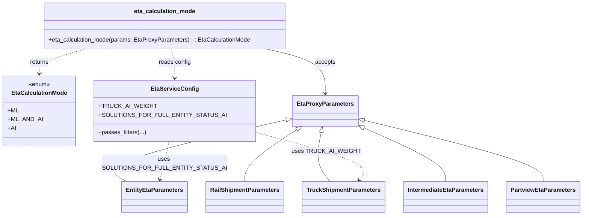

# Diagram: shipment_core/shipment_service/shipment_service/eta/eta_proxy/calculation_mode.py


> Auto-generated by Obscura crawlers

## Diagram 1

```mermaid
flowchart TD
    Start([eta_calculation_mode(params)]) --> TypeCheck{Type of params}
    TypeCheck --> |RailShipmentParameters| Rail[/"RailShipmentParameters"/]
    TypeCheck --> |TruckShipmentParameters| Truck[/"TruckShipmentParameters"/]
    TypeCheck --> |EntityEtaParameters(eta_span==ORG_PTSI)| EntityPtsi[/"EntityEtaParameters\n(eta_span == ORG_PTSI)"/]
    TypeCheck --> |EntityEtaParameters| Entity[/"EntityEtaParameters"/]
    TypeCheck --> |IntermediateEtaParameters| Intermediate[/"IntermediateEtaParameters"/]
    TypeCheck --> |PartviewEtaParameters(eta_span!=ORG_PTSI)| Partview[/"PartviewEtaParameters\n(eta_span != ORG_PTSI)"/]
    TypeCheck --> |Other / Fallback| Fallback([Return ML])

    Rail --> Return_ML_AND_AI1([Return ML_AND_AI])
    Truck --> TruckRand{random() < TRUCK_AI_WEIGHT?}
    TruckRand --> |Yes| Return_ML_AND_AI2([Return ML_AND_AI])
    TruckRand --> |No / fallthrough| Fallback
    EntityPtsi --> Return_ML([Return ML])
    Entity --> EntityFilter{passes_filters(SOLUTIONS_FOR_FULL_ENTITY_STATUS_AI, params)?}
    EntityFilter --> |Yes| Return_AI([Return AI])
    EntityFilter --> |No| Return_ML_AND_AI3([Return ML_AND_AI])
    Intermediate --> Return_AI2([Return AI])
    Partview --> Return_ML_AND_AI4([Return ML_AND_AI])
```

> SVG rendering failed for this diagram.

## Diagram 2



### SVG

<svg id="container" width="1504.82421875" xmlns="http://www.w3.org/2000/svg" class="classDiagram" height="590" viewBox="0 0 1504.82421875 590" role="graphics-document document" aria-roledescription="class"><style>#container{font-family:"trebuchet ms",verdana,arial,sans-serif;font-size:16px;fill:#333;}@keyframes edge-animation-frame{from{stroke-dashoffset:0;}}@keyframes dash{to{stroke-dashoffset:0;}}#container .edge-animation-slow{stroke-dasharray:9,5!important;stroke-dashoffset:900;animation:dash 50s linear infinite;stroke-linecap:round;}#container .edge-animation-fast{stroke-dasharray:9,5!important;stroke-dashoffset:900;animation:dash 20s linear infinite;stroke-linecap:round;}#container .error-icon{fill:#552222;}#container .error-text{fill:#552222;stroke:#552222;}#container .edge-thickness-normal{stroke-width:1px;}#container .edge-thickness-thick{stroke-width:3.5px;}#container .edge-pattern-solid{stroke-dasharray:0;}#container .edge-thickness-invisible{stroke-width:0;fill:none;}#container .edge-pattern-dashed{stroke-dasharray:3;}#container .edge-pattern-dotted{stroke-dasharray:2;}#container .marker{fill:#333333;stroke:#333333;}#container .marker.cross{stroke:#333333;}#container svg{font-family:"trebuchet ms",verdana,arial,sans-serif;font-size:16px;}#container p{margin:0;}#container g.classGroup text{fill:#9370DB;stroke:none;font-family:"trebuchet ms",verdana,arial,sans-serif;font-size:10px;}#container g.classGroup text .title{font-weight:bolder;}#container .nodeLabel,#container .edgeLabel{color:#131300;}#container .edgeLabel .label rect{fill:#ECECFF;}#container .label text{fill:#131300;}#container .labelBkg{background:#ECECFF;}#container .edgeLabel .label span{background:#ECECFF;}#container .classTitle{font-weight:bolder;}#container .node rect,#container .node circle,#container .node ellipse,#container .node polygon,#container .node path{fill:#ECECFF;stroke:#9370DB;stroke-width:1px;}#container .divider{stroke:#9370DB;stroke-width:1;}#container g.clickable{cursor:pointer;}#container g.classGroup rect{fill:#ECECFF;stroke:#9370DB;}#container g.classGroup line{stroke:#9370DB;stroke-width:1;}#container .classLabel .box{stroke:none;stroke-width:0;fill:#ECECFF;opacity:0.5;}#container .classLabel .label{fill:#9370DB;font-size:10px;}#container .relation{stroke:#333333;stroke-width:1;fill:none;}#container .dashed-line{stroke-dasharray:3;}#container .dotted-line{stroke-dasharray:1 2;}#container #compositionStart,#container .composition{fill:#333333!important;stroke:#333333!important;stroke-width:1;}#container #compositionEnd,#container .composition{fill:#333333!important;stroke:#333333!important;stroke-width:1;}#container #dependencyStart,#container .dependency{fill:#333333!important;stroke:#333333!important;stroke-width:1;}#container #dependencyStart,#container .dependency{fill:#333333!important;stroke:#333333!important;stroke-width:1;}#container #extensionStart,#container .extension{fill:transparent!important;stroke:#333333!important;stroke-width:1;}#container #extensionEnd,#container .extension{fill:transparent!important;stroke:#333333!important;stroke-width:1;}#container #aggregationStart,#container .aggregation{fill:transparent!important;stroke:#333333!important;stroke-width:1;}#container #aggregationEnd,#container .aggregation{fill:transparent!important;stroke:#333333!important;stroke-width:1;}#container #lollipopStart,#container .lollipop{fill:#ECECFF!important;stroke:#333333!important;stroke-width:1;}#container #lollipopEnd,#container .lollipop{fill:#ECECFF!important;stroke:#333333!important;stroke-width:1;}#container .edgeTerminals{font-size:11px;line-height:initial;}#container .classTitleText{text-anchor:middle;font-size:18px;fill:#333;}#container .label-icon{display:inline-block;height:1em;overflow:visible;vertical-align:-0.125em;}#container .node .label-icon path{fill:currentColor;stroke:revert;stroke-width:revert;}#container :root{--mermaid-font-family:"trebuchet ms",verdana,arial,sans-serif;}</style><g><defs><marker id="container_class-aggregationStart" class="marker aggregation class" refX="18" refY="7" markerWidth="190" markerHeight="240" orient="auto"><path d="M 18,7 L9,13 L1,7 L9,1 Z"></path></marker></defs><defs><marker id="container_class-aggregationEnd" class="marker aggregation class" refX="1" refY="7" markerWidth="20" markerHeight="28" orient="auto"><path d="M 18,7 L9,13 L1,7 L9,1 Z"></path></marker></defs><defs><marker id="container_class-extensionStart" class="marker extension class" refX="18" refY="7" markerWidth="190" markerHeight="240" orient="auto"><path d="M 1,7 L18,13 V 1 Z"></path></marker></defs><defs><marker id="container_class-extensionEnd" class="marker extension class" refX="1" refY="7" markerWidth="20" markerHeight="28" orient="auto"><path d="M 1,1 V 13 L18,7 Z"></path></marker></defs><defs><marker id="container_class-compositionStart" class="marker composition class" refX="18" refY="7" markerWidth="190" markerHeight="240" orient="auto"><path d="M 18,7 L9,13 L1,7 L9,1 Z"></path></marker></defs><defs><marker id="container_class-compositionEnd" class="marker composition class" refX="1" refY="7" markerWidth="20" markerHeight="28" orient="auto"><path d="M 18,7 L9,13 L1,7 L9,1 Z"></path></marker></defs><defs><marker id="container_class-dependencyStart" class="marker dependency class" refX="6" refY="7" markerWidth="190" markerHeight="240" orient="auto"><path d="M 5,7 L9,13 L1,7 L9,1 Z"></path></marker></defs><defs><marker id="container_class-dependencyEnd" class="marker dependency class" refX="13" refY="7" markerWidth="20" markerHeight="28" orient="auto"><path d="M 18,7 L9,13 L14,7 L9,1 Z"></path></marker></defs><defs><marker id="container_class-lollipopStart" class="marker lollipop class" refX="13" refY="7" markerWidth="190" markerHeight="240" orient="auto"><circle stroke="black" fill="transparent" cx="7" cy="7" r="6"></circle></marker></defs><defs><marker id="container_class-lollipopEnd" class="marker lollipop class" refX="1" refY="7" markerWidth="190" markerHeight="240" orient="auto"><circle stroke="black" fill="transparent" cx="7" cy="7" r="6"></circle></marker></defs><g class="root"><g class="clusters"></g><g class="edgePaths"><path d="M717.208,329.337L636.764,349.281C556.32,369.224,395.431,409.112,327.055,437.223C258.678,465.333,282.814,481.667,294.882,489.833L306.949,498" id="id_EtaProxyParameters_EntityEtaParameters_1" class="edge-thickness-normal edge-pattern-solid relation" style=";;;" data-edge="true" data-et="edge" data-id="id_EtaProxyParameters_EntityEtaParameters_1" data-points="W3sieCI6NzMzLjk1MTE3MTg3NSwieSI6MzI1LjE4NTcxMTA4OTM2NzV9LHsieCI6MjM0LjU0Mjk2ODc1LCJ5Ijo0NDl9LHsieCI6MzA2Ljk0OTIxODc1LCJ5Ijo0OTh9XQ==" marker-start="url(#container_class-extensionStart)"></path><path d="M743.912,355.754L721.242,371.295C698.573,386.836,653.234,417.918,630.564,441.626C607.895,465.333,607.895,481.667,607.895,489.833L607.895,498" id="id_EtaProxyParameters_RailShipmentParameters_2" class="edge-thickness-normal edge-pattern-solid relation" style=";;;" data-edge="true" data-et="edge" data-id="id_EtaProxyParameters_RailShipmentParameters_2" data-points="W3sieCI6NzU4LjEzOTM5OTI0NTY4OTcsInkiOjM0Nn0seyJ4Ijo2MDcuODk0NTMxMjUsInkiOjQ0OX0seyJ4Ijo2MDcuODk0NTMxMjUsInkiOjQ5OH1d" marker-start="url(#container_class-extensionStart)"></path><path d="M805.297,362.774L801.847,377.145C798.398,391.516,791.499,420.258,795.648,442.796C799.798,465.333,814.997,481.667,822.596,489.833L830.195,498" id="id_EtaProxyParameters_TruckShipmentParameters_3" class="edge-thickness-normal edge-pattern-solid relation" style=";;;" data-edge="true" data-et="edge" data-id="id_EtaProxyParameters_TruckShipmentParameters_3" data-points="W3sieCI6ODA5LjMyMjkzOTExNjM3OTMsInkiOjM0Nn0seyJ4Ijo3ODQuNTk5NjA5Mzc1LCJ5Ijo0NDl9LHsieCI6ODMwLjE5NTMxMjUsInkiOjQ5OH1d" marker-start="url(#container_class-extensionStart)"></path><path d="M920.58,349.67L957.255,366.225C993.93,382.78,1067.279,415.89,1103.954,440.612C1140.629,465.333,1140.629,481.667,1140.629,489.833L1140.629,498" id="id_EtaProxyParameters_IntermediateEtaParameters_4" class="edge-thickness-normal edge-pattern-solid relation" style=";;;" data-edge="true" data-et="edge" data-id="id_EtaProxyParameters_IntermediateEtaParameters_4" data-points="W3sieCI6OTA0Ljg1NzQyMTg3NSwieSI6MzQyLjU3MzMzMDgyMDE2NDUzfSx7IngiOjExNDAuNjI4OTA2MjUsInkiOjQ0OX0seyJ4IjoxMTQwLjYyODkwNjI1LCJ5Ijo0OTh9XQ==" marker-start="url(#container_class-extensionStart)"></path><path d="M921.593,329.521L1001.327,349.434C1081.061,369.347,1240.529,409.174,1320.262,437.254C1399.996,465.333,1399.996,481.667,1399.996,489.833L1399.996,498" id="id_EtaProxyParameters_PartviewEtaParameters_5" class="edge-thickness-normal edge-pattern-solid relation" style=";;;" data-edge="true" data-et="edge" data-id="id_EtaProxyParameters_PartviewEtaParameters_5" data-points="W3sieCI6OTA0Ljg1NzQyMTg3NSwieSI6MzI1LjM0MTUwNTY3MDA2MzJ9LHsieCI6MTM5OS45OTYwOTM3NSwieSI6NDQ5fSx7IngiOjEzOTkuOTk2MDkzNzUsInkiOjQ5OH1d" marker-start="url(#container_class-extensionStart)"></path><path d="M665.637,134L691.265,140.167C716.893,146.333,768.148,158.667,793.776,179C819.404,199.333,819.404,227.667,819.404,241.833L819.404,256" id="id_eta_calculation_mode_EtaProxyParameters_6" class="edge-thickness-normal edge-pattern-solid relation" style=";;;" data-edge="true" data-et="edge" data-id="id_eta_calculation_mode_EtaProxyParameters_6" data-points="W3sieCI6NjY1LjYzNjc3NzM0Mzc1LCJ5IjoxMzR9LHsieCI6ODE5LjQwNDI5Njg3NSwieSI6MTcxfSx7IngiOjgxOS40MDQyOTY4NzUsInkiOjI2Mn1d" marker-end="url(#container_class-dependencyEnd)"></path><path d="M212.779,134L194.079,140.167C175.38,146.333,137.981,158.667,119.281,170C100.582,181.333,100.582,191.667,100.582,196.833L100.582,202" id="id_eta_calculation_mode_EtaCalculationMode_7" class="edge-thickness-normal edge-pattern-dashed relation" style=";;;" data-edge="true" data-et="edge" data-id="id_eta_calculation_mode_EtaCalculationMode_7" data-points="W3sieCI6MjEyLjc3ODc1LCJ5IjoxMzR9LHsieCI6MTAwLjU4MjAzMTI1LCJ5IjoxNzF9LHsieCI6MTAwLjU4MjAzMTI1LCJ5IjoyMDh9XQ==" marker-end="url(#container_class-dependencyEnd)"></path><path d="M425.743,134L427.89,140.167C430.036,146.333,434.329,158.667,436.475,172C438.621,185.333,438.621,199.667,438.621,206.833L438.621,214" id="id_eta_calculation_mode_EtaServiceConfig_8" class="edge-thickness-normal edge-pattern-dashed relation" style=";;;" data-edge="true" data-et="edge" data-id="id_eta_calculation_mode_EtaServiceConfig_8" data-points="W3sieCI6NDI1Ljc0MzM1OTM3NSwieSI6MTM0fSx7IngiOjQzOC42MjEwOTM3NSwieSI6MTcxfSx7IngiOjQzOC42MjEwOTM3NSwieSI6MjIwfV0=" marker-end="url(#container_class-dependencyEnd)"></path><path d="M634.078,359.139L687.167,374.116C740.257,389.093,846.435,419.046,892.721,441.452C939.006,463.858,925.399,478.717,918.596,486.146L911.792,493.575" id="id_EtaServiceConfig_TruckShipmentParameters_9" class="edge-thickness-normal edge-pattern-dashed relation" style=";;;" data-edge="true" data-et="edge" data-id="id_EtaServiceConfig_TruckShipmentParameters_9" data-points="W3sieCI6NjM0LjA3ODEyNSwieSI6MzU5LjEzOTQ5NDc2MzcyMTV9LHsieCI6OTUyLjYxMzI4MTI1LCJ5Ijo0NDl9LHsieCI6OTA3Ljc0MDA4NDEzNDYxNTQsInkiOjQ5OH1d" marker-end="url(#container_class-dependencyEnd)"></path><path d="M418.458,388L416.018,398.167C413.578,408.333,408.697,428.667,403.49,446.066C398.284,463.465,392.751,477.931,389.985,485.163L387.219,492.396" id="id_EtaServiceConfig_EntityEtaParameters_10" class="edge-thickness-normal edge-pattern-dashed relation" style=";;;" data-edge="true" data-et="edge" data-id="id_EtaServiceConfig_EntityEtaParameters_10" data-points="W3sieCI6NDE4LjQ1ODM3ODIzMjc1ODYsInkiOjM4OH0seyJ4Ijo0MDMuODE2NDA2MjUsInkiOjQ0OX0seyJ4IjozODUuMDc1NDIwNjczMDc2OSwieSI6NDk4fV0=" marker-end="url(#container_class-dependencyEnd)"></path></g><g class="edgeLabels"><g class="edgeLabel"><g class="label" data-id="id_EtaProxyParameters_EntityEtaParameters_1" transform="translate(0, 0)"><foreignObject width="0" height="0"><div xmlns="http://www.w3.org/1999/xhtml" class="labelBkg" style="display: table-cell; white-space: nowrap; line-height: 1.5; max-width: 200px; text-align: center;"><span class="edgeLabel"></span></div></foreignObject></g></g><g class="edgeLabel"><g class="label" data-id="id_EtaProxyParameters_RailShipmentParameters_2" transform="translate(0, 0)"><foreignObject width="0" height="0"><div xmlns="http://www.w3.org/1999/xhtml" class="labelBkg" style="display: table-cell; white-space: nowrap; line-height: 1.5; max-width: 200px; text-align: center;"><span class="edgeLabel"></span></div></foreignObject></g></g><g class="edgeLabel"><g class="label" data-id="id_EtaProxyParameters_TruckShipmentParameters_3" transform="translate(0, 0)"><foreignObject width="0" height="0"><div xmlns="http://www.w3.org/1999/xhtml" class="labelBkg" style="display: table-cell; white-space: nowrap; line-height: 1.5; max-width: 200px; text-align: center;"><span class="edgeLabel"></span></div></foreignObject></g></g><g class="edgeLabel"><g class="label" data-id="id_EtaProxyParameters_IntermediateEtaParameters_4" transform="translate(0, 0)"><foreignObject width="0" height="0"><div xmlns="http://www.w3.org/1999/xhtml" class="labelBkg" style="display: table-cell; white-space: nowrap; line-height: 1.5; max-width: 200px; text-align: center;"><span class="edgeLabel"></span></div></foreignObject></g></g><g class="edgeLabel"><g class="label" data-id="id_EtaProxyParameters_PartviewEtaParameters_5" transform="translate(0, 0)"><foreignObject width="0" height="0"><div xmlns="http://www.w3.org/1999/xhtml" class="labelBkg" style="display: table-cell; white-space: nowrap; line-height: 1.5; max-width: 200px; text-align: center;"><span class="edgeLabel"></span></div></foreignObject></g></g><g class="edgeLabel" transform="translate(819.404296875, 171)"><g class="label" data-id="id_eta_calculation_mode_EtaProxyParameters_6" transform="translate(-27.421875, -12)"><foreignObject width="54.84375" height="24"><div xmlns="http://www.w3.org/1999/xhtml" class="labelBkg" style="display: table-cell; white-space: nowrap; line-height: 1.5; max-width: 200px; text-align: center;"><span class="edgeLabel"><p>accepts</p></span></div></foreignObject></g></g><g class="edgeLabel" transform="translate(100.58203125, 171)"><g class="label" data-id="id_eta_calculation_mode_EtaCalculationMode_7" transform="translate(-26.265625, -12)"><foreignObject width="52.53125" height="24"><div xmlns="http://www.w3.org/1999/xhtml" class="labelBkg" style="display: table-cell; white-space: nowrap; line-height: 1.5; max-width: 200px; text-align: center;"><span class="edgeLabel"><p>returns</p></span></div></foreignObject></g></g><g class="edgeLabel" transform="translate(438.62109375, 171)"><g class="label" data-id="id_eta_calculation_mode_EtaServiceConfig_8" transform="translate(-43.90625, -12)"><foreignObject width="87.8125" height="24"><div xmlns="http://www.w3.org/1999/xhtml" class="labelBkg" style="display: table-cell; white-space: nowrap; line-height: 1.5; max-width: 200px; text-align: center;"><span class="edgeLabel"><p>reads config</p></span></div></foreignObject></g></g><g class="edgeLabel" transform="translate(825.31902, 413.0896)"><g class="label" data-id="id_EtaServiceConfig_TruckShipmentParameters_9" transform="translate(-84.6796875, -12)"><foreignObject width="169.359375" height="24"><div xmlns="http://www.w3.org/1999/xhtml" class="labelBkg" style="display: table-cell; white-space: nowrap; line-height: 1.5; max-width: 200px; text-align: center;"><span class="edgeLabel"><p>uses TRUCK_AI_WEIGHT</p></span></div></foreignObject></g></g><g class="edgeLabel" transform="translate(405.01505, 444.00633)"><g class="label" data-id="id_EtaServiceConfig_EntityEtaParameters_10" transform="translate(-149.2734375, -24)"><foreignObject width="298.546875" height="48"><div xmlns="http://www.w3.org/1999/xhtml" class="labelBkg" style="display: table; white-space: break-spaces; line-height: 1.5; max-width: 200px; text-align: center; width: 200px;"><span class="edgeLabel"><p>uses SOLUTIONS_FOR_FULL_ENTITY_STATUS_AI</p></span></div></foreignObject></g></g></g><g class="nodes"><g class="node default" id="classId-EtaCalculationMode-0" transform="translate(100.58203125, 304)"><g class="basic label-container"><path d="M-92.58203125 -96 L92.58203125 -96 L92.58203125 96 L-92.58203125 96" stroke="none" stroke-width="0" fill="#ECECFF" style=""></path><path d="M-92.58203125 -96 C-44.85202063472147 -96, 2.877989980557061 -96, 92.58203125 -96 M-92.58203125 -96 C-39.79541827946666 -96, 12.991194691066681 -96, 92.58203125 -96 M92.58203125 -96 C92.58203125 -25.825464528614347, 92.58203125 44.349070942771306, 92.58203125 96 M92.58203125 -96 C92.58203125 -26.515080465155535, 92.58203125 42.96983906968893, 92.58203125 96 M92.58203125 96 C21.311657624080695 96, -49.95871600183861 96, -92.58203125 96 M92.58203125 96 C44.29850569115907 96, -3.9850198676818565 96, -92.58203125 96 M-92.58203125 96 C-92.58203125 37.50092977506477, -92.58203125 -20.998140449870462, -92.58203125 -96 M-92.58203125 96 C-92.58203125 19.98666857755427, -92.58203125 -56.02666284489146, -92.58203125 -96" stroke="#9370DB" stroke-width="1.3" fill="none" stroke-dasharray="0 0" style=""></path></g><g class="annotation-group text" transform="translate(-29.53125, -72)"><g class="label" style="" transform="translate(0,-12)"><foreignObject width="59.0625" height="24"><div xmlns="http://www.w3.org/1999/xhtml" style="display: table-cell; white-space: nowrap; line-height: 1.5; max-width: 109px; text-align: center;"><span class="nodeLabel markdown-node-label" style=""><p>«enum»</p></span></div></foreignObject></g></g><g class="label-group text" transform="translate(-72.4609375, -48)"><g class="label" style="font-weight: bolder" transform="translate(0,-12)"><foreignObject width="144.921875" height="24"><div xmlns="http://www.w3.org/1999/xhtml" style="display: table-cell; white-space: nowrap; line-height: 1.5; max-width: 194px; text-align: center;"><span class="nodeLabel markdown-node-label" style=""><p>EtaCalculationMode</p></span></div></foreignObject></g></g><g class="members-group text" transform="translate(-80.58203125, 0)"><g class="label" style="" transform="translate(0,-12)"><foreignObject width="28.40625" height="24"><div xmlns="http://www.w3.org/1999/xhtml" style="display: table-cell; white-space: nowrap; line-height: 1.5; max-width: 86px; text-align: center;"><span class="nodeLabel markdown-node-label" style=""><p>+ML</p></span></div></foreignObject></g><g class="label" style="" transform="translate(0,12)"><foreignObject width="88.703125" height="24"><div xmlns="http://www.w3.org/1999/xhtml" style="display: table-cell; white-space: nowrap; line-height: 1.5; max-width: 146px; text-align: center;"><span class="nodeLabel markdown-node-label" style=""><p>+ML_AND_AI</p></span></div></foreignObject></g><g class="label" style="" transform="translate(0,36)"><foreignObject width="21.71875" height="24"><div xmlns="http://www.w3.org/1999/xhtml" style="display: table-cell; white-space: nowrap; line-height: 1.5; max-width: 79px; text-align: center;"><span class="nodeLabel markdown-node-label" style=""><p>+AI</p></span></div></foreignObject></g></g><g class="methods-group text" transform="translate(-80.58203125, 96)"></g><g class="divider" style=""><path d="M-92.58203125 -24 C-43.29841839052615 -24, 5.985194468947697 -24, 92.58203125 -24 M-92.58203125 -24 C-55.04961104414172 -24, -17.51719083828344 -24, 92.58203125 -24" stroke="#9370DB" stroke-width="1.3" fill="none" stroke-dasharray="0 0" style=""></path></g><g class="divider" style=""><path d="M-92.58203125 72 C-42.16297250994011 72, 8.256086230119777 72, 92.58203125 72 M-92.58203125 72 C-31.71197071741051 72, 29.158089815178982 72, 92.58203125 72" stroke="#9370DB" stroke-width="1.3" fill="none" stroke-dasharray="0 0" style=""></path></g></g><g class="node default" id="classId-EtaProxyParameters-1" transform="translate(819.404296875, 304)"><g class="basic label-container"><path d="M-85.453125 -42 L85.453125 -42 L85.453125 42 L-85.453125 42" stroke="none" stroke-width="0" fill="#ECECFF" style=""></path><path d="M-85.453125 -42 C-35.33264017777079 -42, 14.787844644458417 -42, 85.453125 -42 M-85.453125 -42 C-28.383563791706813 -42, 28.685997416586375 -42, 85.453125 -42 M85.453125 -42 C85.453125 -23.351968810783898, 85.453125 -4.703937621567796, 85.453125 42 M85.453125 -42 C85.453125 -13.016094694394514, 85.453125 15.967810611210972, 85.453125 42 M85.453125 42 C44.710888040236256 42, 3.9686510804725117 42, -85.453125 42 M85.453125 42 C20.545571286324943 42, -44.361982427350114 42, -85.453125 42 M-85.453125 42 C-85.453125 13.873858887321656, -85.453125 -14.252282225356687, -85.453125 -42 M-85.453125 42 C-85.453125 23.436938589005997, -85.453125 4.873877178011995, -85.453125 -42" stroke="#9370DB" stroke-width="1.3" fill="none" stroke-dasharray="0 0" style=""></path></g><g class="annotation-group text" transform="translate(0, -18)"></g><g class="label-group text" transform="translate(-73.453125, -18)"><g class="label" style="font-weight: bolder" transform="translate(0,-12)"><foreignObject width="146.90625" height="24"><div xmlns="http://www.w3.org/1999/xhtml" style="display: table-cell; white-space: nowrap; line-height: 1.5; max-width: 194px; text-align: center;"><span class="nodeLabel markdown-node-label" style=""><p>EtaProxyParameters</p></span></div></foreignObject></g></g><g class="members-group text" transform="translate(-73.453125, 30)"></g><g class="methods-group text" transform="translate(-73.453125, 60)"></g><g class="divider" style=""><path d="M-85.453125 6 C-34.56374695190271 6, 16.325631096194584 6, 85.453125 6 M-85.453125 6 C-35.4599678309008 6, 14.533189338198397 6, 85.453125 6" stroke="#9370DB" stroke-width="1.3" fill="none" stroke-dasharray="0 0" style=""></path></g><g class="divider" style=""><path d="M-85.453125 24 C-38.75019824709231 24, 7.9527285058153865 24, 85.453125 24 M-85.453125 24 C-27.214116378673232 24, 31.024892242653536 24, 85.453125 24" stroke="#9370DB" stroke-width="1.3" fill="none" stroke-dasharray="0 0" style=""></path></g></g><g class="node default" id="classId-EntityEtaParameters-2" transform="translate(369.01171875, 540)"><g class="basic label-container"><path d="M-86.3125 -42 L86.3125 -42 L86.3125 42 L-86.3125 42" stroke="none" stroke-width="0" fill="#ECECFF" style=""></path><path d="M-86.3125 -42 C-24.93421841584992 -42, 36.44406316830016 -42, 86.3125 -42 M-86.3125 -42 C-27.002169112219157 -42, 32.308161775561686 -42, 86.3125 -42 M86.3125 -42 C86.3125 -18.923077963500624, 86.3125 4.153844072998751, 86.3125 42 M86.3125 -42 C86.3125 -13.718795051984625, 86.3125 14.56240989603075, 86.3125 42 M86.3125 42 C31.37512581578489 42, -23.562248368430218 42, -86.3125 42 M86.3125 42 C33.36389562003924 42, -19.584708759921526 42, -86.3125 42 M-86.3125 42 C-86.3125 21.091196660465172, -86.3125 0.18239332093034477, -86.3125 -42 M-86.3125 42 C-86.3125 12.97382038585554, -86.3125 -16.05235922828892, -86.3125 -42" stroke="#9370DB" stroke-width="1.3" fill="none" stroke-dasharray="0 0" style=""></path></g><g class="annotation-group text" transform="translate(0, -18)"></g><g class="label-group text" transform="translate(-74.3125, -18)"><g class="label" style="font-weight: bolder" transform="translate(0,-12)"><foreignObject width="148.625" height="24"><div xmlns="http://www.w3.org/1999/xhtml" style="display: table-cell; white-space: nowrap; line-height: 1.5; max-width: 196px; text-align: center;"><span class="nodeLabel markdown-node-label" style=""><p>EntityEtaParameters</p></span></div></foreignObject></g></g><g class="members-group text" transform="translate(-74.3125, 30)"></g><g class="methods-group text" transform="translate(-74.3125, 60)"></g><g class="divider" style=""><path d="M-86.3125 6 C-49.312694039217284 6, -12.312888078434568 6, 86.3125 6 M-86.3125 6 C-24.286602989037355 6, 37.73929402192529 6, 86.3125 6" stroke="#9370DB" stroke-width="1.3" fill="none" stroke-dasharray="0 0" style=""></path></g><g class="divider" style=""><path d="M-86.3125 24 C-28.158991020123793 24, 29.994517959752415 24, 86.3125 24 M-86.3125 24 C-37.071012272606474 24, 12.170475454787052 24, 86.3125 24" stroke="#9370DB" stroke-width="1.3" fill="none" stroke-dasharray="0 0" style=""></path></g></g><g class="node default" id="classId-RailShipmentParameters-3" transform="translate(607.89453125, 540)"><g class="basic label-container"><path d="M-102.5703125 -42 L102.5703125 -42 L102.5703125 42 L-102.5703125 42" stroke="none" stroke-width="0" fill="#ECECFF" style=""></path><path d="M-102.5703125 -42 C-59.59323698937734 -42, -16.616161478754677 -42, 102.5703125 -42 M-102.5703125 -42 C-37.26835529408153 -42, 28.03360191183694 -42, 102.5703125 -42 M102.5703125 -42 C102.5703125 -13.094904750255257, 102.5703125 15.810190499489487, 102.5703125 42 M102.5703125 -42 C102.5703125 -19.32858488939449, 102.5703125 3.342830221211017, 102.5703125 42 M102.5703125 42 C42.37230832015763 42, -17.825695859684743 42, -102.5703125 42 M102.5703125 42 C36.213662989541774 42, -30.142986520916452 42, -102.5703125 42 M-102.5703125 42 C-102.5703125 13.186670079431142, -102.5703125 -15.626659841137716, -102.5703125 -42 M-102.5703125 42 C-102.5703125 11.451368290952658, -102.5703125 -19.097263418094684, -102.5703125 -42" stroke="#9370DB" stroke-width="1.3" fill="none" stroke-dasharray="0 0" style=""></path></g><g class="annotation-group text" transform="translate(0, -18)"></g><g class="label-group text" transform="translate(-90.5703125, -18)"><g class="label" style="font-weight: bolder" transform="translate(0,-12)"><foreignObject width="181.140625" height="24"><div xmlns="http://www.w3.org/1999/xhtml" style="display: table-cell; white-space: nowrap; line-height: 1.5; max-width: 229px; text-align: center;"><span class="nodeLabel markdown-node-label" style=""><p>RailShipmentParameters</p></span></div></foreignObject></g></g><g class="members-group text" transform="translate(-90.5703125, 30)"></g><g class="methods-group text" transform="translate(-90.5703125, 60)"></g><g class="divider" style=""><path d="M-102.5703125 6 C-30.207635955875205 6, 42.15504058824959 6, 102.5703125 6 M-102.5703125 6 C-39.03137244542329 6, 24.507567609153426 6, 102.5703125 6" stroke="#9370DB" stroke-width="1.3" fill="none" stroke-dasharray="0 0" style=""></path></g><g class="divider" style=""><path d="M-102.5703125 24 C-42.162322711639085 24, 18.24566707672183 24, 102.5703125 24 M-102.5703125 24 C-30.789795443818477 24, 40.990721612363046 24, 102.5703125 24" stroke="#9370DB" stroke-width="1.3" fill="none" stroke-dasharray="0 0" style=""></path></g></g><g class="node default" id="classId-TruckShipmentParameters-4" transform="translate(869.27734375, 540)"><g class="basic label-container"><path d="M-108.8125 -42 L108.8125 -42 L108.8125 42 L-108.8125 42" stroke="none" stroke-width="0" fill="#ECECFF" style=""></path><path d="M-108.8125 -42 C-31.317826421824904 -42, 46.17684715635019 -42, 108.8125 -42 M-108.8125 -42 C-41.87776848432256 -42, 25.056963031354883 -42, 108.8125 -42 M108.8125 -42 C108.8125 -16.710489620416684, 108.8125 8.579020759166632, 108.8125 42 M108.8125 -42 C108.8125 -11.67699393177761, 108.8125 18.64601213644478, 108.8125 42 M108.8125 42 C32.89068273295193 42, -43.03113453409614 42, -108.8125 42 M108.8125 42 C51.21588016882359 42, -6.380739662352823 42, -108.8125 42 M-108.8125 42 C-108.8125 23.80683058691227, -108.8125 5.613661173824539, -108.8125 -42 M-108.8125 42 C-108.8125 12.307587092869184, -108.8125 -17.38482581426163, -108.8125 -42" stroke="#9370DB" stroke-width="1.3" fill="none" stroke-dasharray="0 0" style=""></path></g><g class="annotation-group text" transform="translate(0, -18)"></g><g class="label-group text" transform="translate(-96.8125, -18)"><g class="label" style="font-weight: bolder" transform="translate(0,-12)"><foreignObject width="193.625" height="24"><div xmlns="http://www.w3.org/1999/xhtml" style="display: table-cell; white-space: nowrap; line-height: 1.5; max-width: 240px; text-align: center;"><span class="nodeLabel markdown-node-label" style=""><p>TruckShipmentParameters</p></span></div></foreignObject></g></g><g class="members-group text" transform="translate(-96.8125, 30)"></g><g class="methods-group text" transform="translate(-96.8125, 60)"></g><g class="divider" style=""><path d="M-108.8125 6 C-48.17658314754275 6, 12.4593337049145 6, 108.8125 6 M-108.8125 6 C-25.78167016225528 6, 57.24915967548944 6, 108.8125 6" stroke="#9370DB" stroke-width="1.3" fill="none" stroke-dasharray="0 0" style=""></path></g><g class="divider" style=""><path d="M-108.8125 24 C-57.565077688150815 24, -6.31765537630163 24, 108.8125 24 M-108.8125 24 C-35.89460297028748 24, 37.02329405942504 24, 108.8125 24" stroke="#9370DB" stroke-width="1.3" fill="none" stroke-dasharray="0 0" style=""></path></g></g><g class="node default" id="classId-IntermediateEtaParameters-5" transform="translate(1140.62890625, 540)"><g class="basic label-container"><path d="M-112.5390625 -42 L112.5390625 -42 L112.5390625 42 L-112.5390625 42" stroke="none" stroke-width="0" fill="#ECECFF" style=""></path><path d="M-112.5390625 -42 C-55.214451872816205 -42, 2.110158754367589 -42, 112.5390625 -42 M-112.5390625 -42 C-35.923293907349546 -42, 40.69247468530091 -42, 112.5390625 -42 M112.5390625 -42 C112.5390625 -15.55274217695689, 112.5390625 10.89451564608622, 112.5390625 42 M112.5390625 -42 C112.5390625 -15.954508043009348, 112.5390625 10.090983913981304, 112.5390625 42 M112.5390625 42 C63.89564796249907 42, 15.252233424998138 42, -112.5390625 42 M112.5390625 42 C29.271741106162168 42, -53.995580287675665 42, -112.5390625 42 M-112.5390625 42 C-112.5390625 14.766191445724893, -112.5390625 -12.467617108550215, -112.5390625 -42 M-112.5390625 42 C-112.5390625 11.039925713837498, -112.5390625 -19.920148572325004, -112.5390625 -42" stroke="#9370DB" stroke-width="1.3" fill="none" stroke-dasharray="0 0" style=""></path></g><g class="annotation-group text" transform="translate(0, -18)"></g><g class="label-group text" transform="translate(-100.5390625, -18)"><g class="label" style="font-weight: bolder" transform="translate(0,-12)"><foreignObject width="201.078125" height="24"><div xmlns="http://www.w3.org/1999/xhtml" style="display: table-cell; white-space: nowrap; line-height: 1.5; max-width: 248px; text-align: center;"><span class="nodeLabel markdown-node-label" style=""><p>IntermediateEtaParameters</p></span></div></foreignObject></g></g><g class="members-group text" transform="translate(-100.5390625, 30)"></g><g class="methods-group text" transform="translate(-100.5390625, 60)"></g><g class="divider" style=""><path d="M-112.5390625 6 C-57.32291948891445 6, -2.1067764778289018 6, 112.5390625 6 M-112.5390625 6 C-43.44600071553157 6, 25.647061068936864 6, 112.5390625 6" stroke="#9370DB" stroke-width="1.3" fill="none" stroke-dasharray="0 0" style=""></path></g><g class="divider" style=""><path d="M-112.5390625 24 C-59.96732273813419 24, -7.395582976268386 24, 112.5390625 24 M-112.5390625 24 C-28.71023862759435 24, 55.1185852448113 24, 112.5390625 24" stroke="#9370DB" stroke-width="1.3" fill="none" stroke-dasharray="0 0" style=""></path></g></g><g class="node default" id="classId-PartviewEtaParameters-6" transform="translate(1399.99609375, 540)"><g class="basic label-container"><path d="M-96.828125 -42 L96.828125 -42 L96.828125 42 L-96.828125 42" stroke="none" stroke-width="0" fill="#ECECFF" style=""></path><path d="M-96.828125 -42 C-50.934164298801335 -42, -5.04020359760267 -42, 96.828125 -42 M-96.828125 -42 C-42.37139149652621 -42, 12.085342006947585 -42, 96.828125 -42 M96.828125 -42 C96.828125 -20.221499255298568, 96.828125 1.5570014894028645, 96.828125 42 M96.828125 -42 C96.828125 -16.124357734694296, 96.828125 9.751284530611407, 96.828125 42 M96.828125 42 C36.1214230672908 42, -24.585278865418402 42, -96.828125 42 M96.828125 42 C30.62254430660549 42, -35.58303638678902 42, -96.828125 42 M-96.828125 42 C-96.828125 19.16981739816418, -96.828125 -3.6603652036716383, -96.828125 -42 M-96.828125 42 C-96.828125 11.194241348568529, -96.828125 -19.611517302862943, -96.828125 -42" stroke="#9370DB" stroke-width="1.3" fill="none" stroke-dasharray="0 0" style=""></path></g><g class="annotation-group text" transform="translate(0, -18)"></g><g class="label-group text" transform="translate(-84.828125, -18)"><g class="label" style="font-weight: bolder" transform="translate(0,-12)"><foreignObject width="169.65625" height="24"><div xmlns="http://www.w3.org/1999/xhtml" style="display: table-cell; white-space: nowrap; line-height: 1.5; max-width: 216px; text-align: center;"><span class="nodeLabel markdown-node-label" style=""><p>PartviewEtaParameters</p></span></div></foreignObject></g></g><g class="members-group text" transform="translate(-84.828125, 30)"></g><g class="methods-group text" transform="translate(-84.828125, 60)"></g><g class="divider" style=""><path d="M-96.828125 6 C-28.399114030365283 6, 40.029896939269435 6, 96.828125 6 M-96.828125 6 C-49.68036316238358 6, -2.532601324767157 6, 96.828125 6" stroke="#9370DB" stroke-width="1.3" fill="none" stroke-dasharray="0 0" style=""></path></g><g class="divider" style=""><path d="M-96.828125 24 C-52.13775708369531 24, -7.447389167390625 24, 96.828125 24 M-96.828125 24 C-55.698598792156695 24, -14.569072584313389 24, 96.828125 24" stroke="#9370DB" stroke-width="1.3" fill="none" stroke-dasharray="0 0" style=""></path></g></g><g class="node default" id="classId-EtaServiceConfig-7" transform="translate(438.62109375, 304)"><g class="basic label-container"><path d="M-195.45703125 -84 L195.45703125 -84 L195.45703125 84 L-195.45703125 84" stroke="none" stroke-width="0" fill="#ECECFF" style=""></path><path d="M-195.45703125 -84 C-98.93702443558936 -84, -2.4170176211787293 -84, 195.45703125 -84 M-195.45703125 -84 C-54.384507472095834 -84, 86.68801630580833 -84, 195.45703125 -84 M195.45703125 -84 C195.45703125 -23.58265433208735, 195.45703125 36.8346913358253, 195.45703125 84 M195.45703125 -84 C195.45703125 -26.820276536594243, 195.45703125 30.359446926811515, 195.45703125 84 M195.45703125 84 C84.4062250978924 84, -26.644581054215195 84, -195.45703125 84 M195.45703125 84 C89.18698762131835 84, -17.083056007363297 84, -195.45703125 84 M-195.45703125 84 C-195.45703125 27.97889051375539, -195.45703125 -28.042218972489223, -195.45703125 -84 M-195.45703125 84 C-195.45703125 26.26267583275341, -195.45703125 -31.474648334493182, -195.45703125 -84" stroke="#9370DB" stroke-width="1.3" fill="none" stroke-dasharray="0 0" style=""></path></g><g class="annotation-group text" transform="translate(0, -60)"></g><g class="label-group text" transform="translate(-61.0234375, -60)"><g class="label" style="font-weight: bolder" transform="translate(0,-12)"><foreignObject width="122.046875" height="24"><div xmlns="http://www.w3.org/1999/xhtml" style="display: table-cell; white-space: nowrap; line-height: 1.5; max-width: 170px; text-align: center;"><span class="nodeLabel markdown-node-label" style=""><p>EtaServiceConfig</p></span></div></foreignObject></g></g><g class="members-group text" transform="translate(-183.45703125, -12)"><g class="label" style="" transform="translate(0,-12)"><foreignObject width="139.3125" height="24"><div xmlns="http://www.w3.org/1999/xhtml" style="display: table-cell; white-space: nowrap; line-height: 1.5; max-width: 197px; text-align: center;"><span class="nodeLabel markdown-node-label" style=""><p>+TRUCK_AI_WEIGHT</p></span></div></foreignObject></g><g class="label" style="" transform="translate(0,12)"><foreignObject width="305.890625" height="24"><div xmlns="http://www.w3.org/1999/xhtml" style="display: table-cell; white-space: nowrap; line-height: 1.5; max-width: 363px; text-align: center;"><span class="nodeLabel markdown-node-label" style=""><p>+SOLUTIONS_FOR_FULL_ENTITY_STATUS_AI</p></span></div></foreignObject></g></g><g class="methods-group text" transform="translate(-183.45703125, 60)"><g class="label" style="" transform="translate(0,-12)"><foreignObject width="127.96875" height="24"><div xmlns="http://www.w3.org/1999/xhtml" style="display: table-cell; white-space: nowrap; line-height: 1.5; max-width: 185px; text-align: center;"><span class="nodeLabel markdown-node-label" style=""><p>+passes_filters(...)</p></span></div></foreignObject></g></g><g class="divider" style=""><path d="M-195.45703125 -36 C-43.12514506015083 -36, 109.20674112969834 -36, 195.45703125 -36 M-195.45703125 -36 C-75.90915169098466 -36, 43.638727868030685 -36, 195.45703125 -36" stroke="#9370DB" stroke-width="1.3" fill="none" stroke-dasharray="0 0" style=""></path></g><g class="divider" style=""><path d="M-195.45703125 36 C-53.59110025397973 36, 88.27483074204054 36, 195.45703125 36 M-195.45703125 36 C-73.50321803481465 36, 48.4505951803707 36, 195.45703125 36" stroke="#9370DB" stroke-width="1.3" fill="none" stroke-dasharray="0 0" style=""></path></g></g><g class="node default" id="classId-eta_calculation_mode-8" transform="translate(403.81640625, 71)"><g class="basic label-container"><path d="M-326.58984375 -63 L326.58984375 -63 L326.58984375 63 L-326.58984375 63" stroke="none" stroke-width="0" fill="#ECECFF" style=""></path><path d="M-326.58984375 -63 C-127.7059690615445 -63, 71.17790562691101 -63, 326.58984375 -63 M-326.58984375 -63 C-171.08120136509896 -63, -15.572558980197925 -63, 326.58984375 -63 M326.58984375 -63 C326.58984375 -29.701509483441512, 326.58984375 3.5969810331169754, 326.58984375 63 M326.58984375 -63 C326.58984375 -20.72612146335066, 326.58984375 21.547757073298683, 326.58984375 63 M326.58984375 63 C184.25477138427294 63, 41.919699018545884 63, -326.58984375 63 M326.58984375 63 C83.43095439967456 63, -159.72793495065088 63, -326.58984375 63 M-326.58984375 63 C-326.58984375 14.155266801179181, -326.58984375 -34.68946639764164, -326.58984375 -63 M-326.58984375 63 C-326.58984375 17.955478394924548, -326.58984375 -27.089043210150905, -326.58984375 -63" stroke="#9370DB" stroke-width="1.3" fill="none" stroke-dasharray="0 0" style=""></path></g><g class="annotation-group text" transform="translate(0, -39)"></g><g class="label-group text" transform="translate(-80.6796875, -39)"><g class="label" style="font-weight: bolder" transform="translate(0,-12)"><foreignObject width="161.359375" height="24"><div xmlns="http://www.w3.org/1999/xhtml" style="display: table-cell; white-space: nowrap; line-height: 1.5; max-width: 211px; text-align: center;"><span class="nodeLabel markdown-node-label" style=""><p>eta_calculation_mode</p></span></div></foreignObject></g></g><g class="members-group text" transform="translate(-314.58984375, 9)"></g><g class="methods-group text" transform="translate(-314.58984375, 39)"><g class="label" style="" transform="translate(0,-12)"><foreignObject width="548.5" height="24"><div xmlns="http://www.w3.org/1999/xhtml" style="display: table-cell; white-space: nowrap; line-height: 1.5; max-width: 606px; text-align: center;"><span class="nodeLabel markdown-node-label" style=""><p>+eta_calculation_mode(params: EtaProxyParameters) : : EtaCalculationMode</p></span></div></foreignObject></g></g><g class="divider" style=""><path d="M-326.58984375 -15 C-113.24643955457645 -15, 100.09696464084709 -15, 326.58984375 -15 M-326.58984375 -15 C-165.89173105819393 -15, -5.193618366387852 -15, 326.58984375 -15" stroke="#9370DB" stroke-width="1.3" fill="none" stroke-dasharray="0 0" style=""></path></g><g class="divider" style=""><path d="M-326.58984375 9 C-93.46931763351935 9, 139.6512084829613 9, 326.58984375 9 M-326.58984375 9 C-111.79759730247497 9, 102.99464914505006 9, 326.58984375 9" stroke="#9370DB" stroke-width="1.3" fill="none" stroke-dasharray="0 0" style=""></path></g></g></g></g></g></svg>
