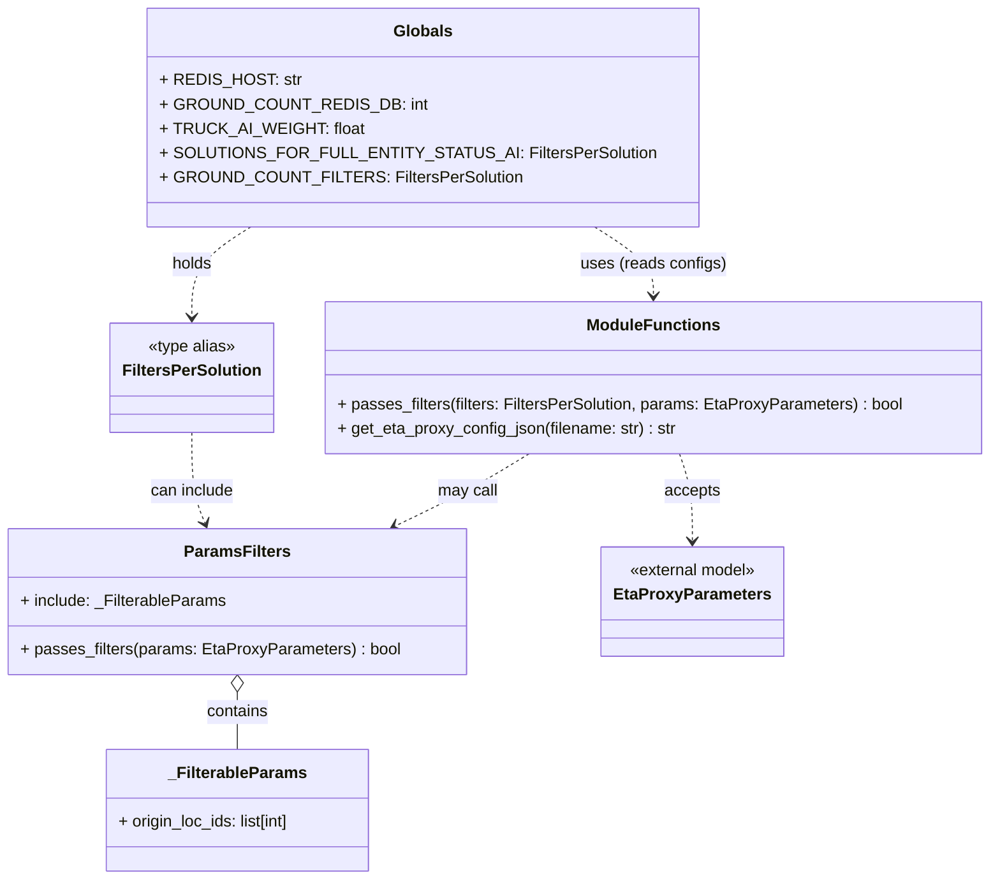

# Diagram: shipment_core/shipment_service/shipment_service/eta/eta_proxy/config.py

> Auto-generated by Obscura crawlers

## Mermaid

### SVG

<svg id="container" width="964.2578125" xmlns="http://www.w3.org/2000/svg" class="classDiagram" height="868" viewBox="0 0 964.2578125 868" role="graphics-document document" aria-roledescription="class"><g><defs><marker id="container_class-aggregationStart" class="marker aggregation class" refX="18" refY="7" markerWidth="190" markerHeight="240" orient="auto"><path d="M 18,7 L9,13 L1,7 L9,1 Z"></path></marker></defs><defs><marker id="container_class-aggregationEnd" class="marker aggregation class" refX="1" refY="7" markerWidth="20" markerHeight="28" orient="auto"><path d="M 18,7 L9,13 L1,7 L9,1 Z"></path></marker></defs><defs><marker id="container_class-extensionStart" class="marker extension class" refX="18" refY="7" markerWidth="190" markerHeight="240" orient="auto"><path d="M 1,7 L18,13 V 1 Z"></path></marker></defs><defs><marker id="container_class-extensionEnd" class="marker extension class" refX="1" refY="7" markerWidth="20" markerHeight="28" orient="auto"><path d="M 1,1 V 13 L18,7 Z"></path></marker></defs><defs><marker id="container_class-compositionStart" class="marker composition class" refX="18" refY="7" markerWidth="190" markerHeight="240" orient="auto"><path d="M 18,7 L9,13 L1,7 L9,1 Z"></path></marker></defs><defs><marker id="container_class-compositionEnd" class="marker composition class" refX="1" refY="7" markerWidth="20" markerHeight="28" orient="auto"><path d="M 18,7 L9,13 L1,7 L9,1 Z"></path></marker></defs><defs><marker id="container_class-dependencyStart" class="marker dependency class" refX="6" refY="7" markerWidth="190" markerHeight="240" orient="auto"><path d="M 5,7 L9,13 L1,7 L9,1 Z"></path></marker></defs><defs><marker id="container_class-dependencyEnd" class="marker dependency class" refX="13" refY="7" markerWidth="20" markerHeight="28" orient="auto"><path d="M 18,7 L9,13 L14,7 L9,1 Z"></path></marker></defs><defs><marker id="container_class-lollipopStart" class="marker lollipop class" refX="13" refY="7" markerWidth="190" markerHeight="240" orient="auto"><circle stroke="black" fill="transparent" cx="7" cy="7" r="6"></circle></marker></defs><defs><marker id="container_class-lollipopEnd" class="marker lollipop class" refX="1" refY="7" markerWidth="190" markerHeight="240" orient="auto"><circle stroke="black" fill="transparent" cx="7" cy="7" r="6"></circle></marker></defs><g class="root"><g class="clusters"></g><g class="edgePaths"><path d="M230.305,683.25L230.305,686.542C230.305,689.833,230.305,696.417,230.305,705.875C230.305,715.333,230.305,727.667,230.305,733.833L230.305,740" id="id_ParamsFilters__FilterableParams_1" class="edge-thickness-normal edge-pattern-solid relation" style=";;;" data-edge="true" data-et="edge" data-id="id_ParamsFilters__FilterableParams_1" data-points="W3sieCI6MjMwLjMwNDY4NzUsInkiOjY2Nn0seyJ4IjoyMzAuMzA0Njg3NSwieSI6NzAzfSx7IngiOjIzMC4zMDQ2ODc1LCJ5Ijo3NDB9XQ==" marker-start="url(#container_class-aggregationStart)"></path><path d="M514.306,448L504.449,454.167C494.592,460.333,474.878,472.667,453.199,484.564C431.521,496.461,407.878,507.922,396.056,513.652L384.235,519.383" id="id_ModuleFunctions_ParamsFilters_2" class="edge-thickness-normal edge-pattern-dashed relation" style=";;;" data-edge="true" data-et="edge" data-id="id_ModuleFunctions_ParamsFilters_2" data-points="W3sieCI6NTE0LjMwNTczMzgxNjk2NDMsInkiOjQ0OH0seyJ4Ijo0NTUuMTY0MDYyNSwieSI6NDg1fSx7IngiOjM3OC44MzU2NTA4MDI3NTIzLCJ5Ijo1MjJ9XQ==" marker-end="url(#container_class-dependencyEnd)"></path><path d="M660.06,448L662.188,454.167C664.315,460.333,668.57,472.667,670.697,487C672.824,501.333,672.824,517.667,672.824,525.833L672.824,534" id="id_ModuleFunctions_EtaProxyParameters_3" class="edge-thickness-normal edge-pattern-dashed relation" style=";;;" data-edge="true" data-et="edge" data-id="id_ModuleFunctions_EtaProxyParameters_3" data-points="W3sieCI6NjYwLjA2MDMwMjczNDM3NSwieSI6NDQ4fSx7IngiOjY3Mi44MjQyMTg3NSwieSI6NDg1fSx7IngiOjY3Mi44MjQyMTg3NSwieSI6NTQwfV0=" marker-end="url(#container_class-dependencyEnd)"></path><path d="M241.847,224L232.284,230.167C222.721,236.333,203.595,248.667,194.032,263.5C184.469,278.333,184.469,295.667,184.469,304.333L184.469,313" id="id_Globals_FiltersPerSolution_4" class="edge-thickness-normal edge-pattern-dashed relation" style=";;;" data-edge="true" data-et="edge" data-id="id_Globals_FiltersPerSolution_4" data-points="W3sieCI6MjQxLjg0NjY1OTQ4Mjc1ODYsInkiOjIyNH0seyJ4IjoxODQuNDY4NzUsInkiOjI2MX0seyJ4IjoxODQuNDY4NzUsInkiOjMxOX1d" marker-end="url(#container_class-dependencyEnd)"></path><path d="M184.469,427L184.469,436.667C184.469,446.333,184.469,465.667,186.674,480.578C188.88,495.49,193.291,505.979,195.496,511.224L197.702,516.469" id="id_FiltersPerSolution_ParamsFilters_5" class="edge-thickness-normal edge-pattern-dashed relation" style=";;;" data-edge="true" data-et="edge" data-id="id_FiltersPerSolution_ParamsFilters_5" data-points="W3sieCI6MTg0LjQ2ODc1LCJ5Ijo0Mjd9LHsieCI6MTg0LjQ2ODc1LCJ5Ijo0ODV9LHsieCI6MjAwLjAyNzczNzk1ODcxNTYsInkiOjUyMn1d" marker-end="url(#container_class-dependencyEnd)"></path><path d="M576.81,224L586.373,230.167C595.936,236.333,615.062,248.667,624.625,260C634.188,271.333,634.188,281.667,634.188,286.833L634.188,292" id="id_Globals_ModuleFunctions_6" class="edge-thickness-normal edge-pattern-dashed relation" style=";;;" data-edge="true" data-et="edge" data-id="id_Globals_ModuleFunctions_6" data-points="W3sieCI6NTc2LjgwOTU5MDUxNzI0MTQsInkiOjIyNH0seyJ4Ijo2MzQuMTg3NSwieSI6MjYxfSx7IngiOjYzNC4xODc1LCJ5IjoyOTh9XQ==" marker-end="url(#container_class-dependencyEnd)"></path></g><g class="edgeLabels"><g class="edgeLabel" transform="translate(230.3046875, 703)"><g class="label" data-id="id_ParamsFilters__FilterableParams_1" transform="translate(-30.890625, -12)"><foreignObject width="61.78125" height="24">

contains

</foreignObject></g></g><g class="edgeLabel" transform="translate(455.1640625, 485)"><g class="label" data-id="id_ModuleFunctions_ParamsFilters_2" transform="translate(-29.8515625, -12)"><foreignObject width="59.703125" height="24">

may call

</foreignObject></g></g><g class="edgeLabel" transform="translate(672.82421875, 485)"><g class="label" data-id="id_ModuleFunctions_EtaProxyParameters_3" transform="translate(-27.421875, -12)"><foreignObject width="54.84375" height="24">

accepts

</foreignObject></g></g><g class="edgeLabel" transform="translate(184.46875, 261)"><g class="label" data-id="id_Globals_FiltersPerSolution_4" transform="translate(-20.1875, -12)"><foreignObject width="40.375" height="24">

holds

</foreignObject></g></g><g class="edgeLabel" transform="translate(184.46875, 485)"><g class="label" data-id="id_FiltersPerSolution_ParamsFilters_5" transform="translate(-41.8203125, -12)"><foreignObject width="83.640625" height="24">

can include

</foreignObject></g></g><g class="edgeLabel" transform="translate(634.1875, 261)"><g class="label" data-id="id_Globals_ModuleFunctions_6" transform="translate(-71.3828125, -12)"><foreignObject width="142.765625" height="24">

uses (reads configs)

</foreignObject></g></g></g><g class="nodes"><g class="node default" id="classId-ParamsFilters-0" transform="translate(230.3046875, 594)"><g class="basic label-container"><path d="M-222.3046875 -72 L222.3046875 -72 L222.3046875 72 L-222.3046875 72" stroke="none" stroke-width="0" fill="#ECECFF" style=""></path><path d="M-222.3046875 -72 C-91.93396580458491 -72, 38.43675589083017 -72, 222.3046875 -72 M-222.3046875 -72 C-85.78940376604498 -72, 50.72587996791003 -72, 222.3046875 -72 M222.3046875 -72 C222.3046875 -18.208716967254183, 222.3046875 35.58256606549163, 222.3046875 72 M222.3046875 -72 C222.3046875 -15.790356559239534, 222.3046875 40.41928688152093, 222.3046875 72 M222.3046875 72 C99.45074783381253 72, -23.403191832374944 72, -222.3046875 72 M222.3046875 72 C130.71513279937736 72, 39.125578098754715 72, -222.3046875 72 M-222.3046875 72 C-222.3046875 20.44391537054348, -222.3046875 -31.112169258913042, -222.3046875 -72 M-222.3046875 72 C-222.3046875 20.02819750569782, -222.3046875 -31.943604988604363, -222.3046875 -72" stroke="#9370DB" stroke-width="1.3" fill="none" stroke-dasharray="0 0" style=""></path></g><g class="annotation-group text" transform="translate(0, -48)"></g><g class="label-group text" transform="translate(-49.34375, -48)"><g class="label" style="font-weight: bolder" transform="translate(0,-12)"><foreignObject width="98.6875" height="24">

ParamsFilters

</foreignObject></g></g><g class="members-group text" transform="translate(-210.3046875, 0)"><g class="label" style="" transform="translate(0,-12)"><foreignObject width="202.984375" height="24">

+ include: _FilterableParams

</foreignObject></g></g><g class="methods-group text" transform="translate(-210.3046875, 48)"><g class="label" style="" transform="translate(0,-12)"><foreignObject width="371.265625" height="24">

+ passes_filters(params: EtaProxyParameters) : bool

</foreignObject></g></g><g class="divider" style=""><path d="M-222.3046875 -24 C-74.753287713187 -24, 72.79811207362599 -24, 222.3046875 -24 M-222.3046875 -24 C-66.79905150252091 -24, 88.70658449495818 -24, 222.3046875 -24" stroke="#9370DB" stroke-width="1.3" fill="none" stroke-dasharray="0 0" style=""></path></g><g class="divider" style=""><path d="M-222.3046875 24 C-102.16098343699372 24, 17.982720626012565 24, 222.3046875 24 M-222.3046875 24 C-115.33492946141811 24, -8.365171422836227 24, 222.3046875 24" stroke="#9370DB" stroke-width="1.3" fill="none" stroke-dasharray="0 0" style=""></path></g></g><g class="node default" id="classId-_FilterableParams-1" transform="translate(230.3046875, 800)"><g class="basic label-container"><path d="M-132.06640625 -60 L132.06640625 -60 L132.06640625 60 L-132.06640625 60" stroke="none" stroke-width="0" fill="#ECECFF" style=""></path><path d="M-132.06640625 -60 C-30.810105896956046 -60, 70.44619445608791 -60, 132.06640625 -60 M-132.06640625 -60 C-70.36479765082814 -60, -8.66318905165626 -60, 132.06640625 -60 M132.06640625 -60 C132.06640625 -18.089840880978954, 132.06640625 23.82031823804209, 132.06640625 60 M132.06640625 -60 C132.06640625 -15.04891845415058, 132.06640625 29.90216309169884, 132.06640625 60 M132.06640625 60 C35.88025562367956 60, -60.30589500264088 60, -132.06640625 60 M132.06640625 60 C39.51778443896755 60, -53.030837372064894 60, -132.06640625 60 M-132.06640625 60 C-132.06640625 19.758148874927222, -132.06640625 -20.483702250145555, -132.06640625 -60 M-132.06640625 60 C-132.06640625 20.532450933433182, -132.06640625 -18.935098133133636, -132.06640625 -60" stroke="#9370DB" stroke-width="1.3" fill="none" stroke-dasharray="0 0" style=""></path></g><g class="annotation-group text" transform="translate(0, -36)"></g><g class="label-group text" transform="translate(-65.3671875, -36)"><g class="label" style="font-weight: bolder" transform="translate(0,-12)"><foreignObject width="130.734375" height="24">

_FilterableParams

</foreignObject></g></g><g class="members-group text" transform="translate(-120.06640625, 12)"><g class="label" style="" transform="translate(0,-12)"><foreignObject width="174.765625" height="24">

+ origin_loc_ids: list[int]

</foreignObject></g></g><g class="methods-group text" transform="translate(-120.06640625, 60)"></g><g class="divider" style=""><path d="M-132.06640625 -12 C-37.99712068761362 -12, 56.07216487477277 -12, 132.06640625 -12 M-132.06640625 -12 C-69.44157327626833 -12, -6.816740302536658 -12, 132.06640625 -12" stroke="#9370DB" stroke-width="1.3" fill="none" stroke-dasharray="0 0" style=""></path></g><g class="divider" style=""><path d="M-132.06640625 36 C-69.68001777662919 36, -7.2936293032583706 36, 132.06640625 36 M-132.06640625 36 C-39.22663264930736 36, 53.613140951385276 36, 132.06640625 36" stroke="#9370DB" stroke-width="1.3" fill="none" stroke-dasharray="0 0" style=""></path></g></g><g class="node default" id="classId-ModuleFunctions-2" transform="translate(634.1875, 373)"><g class="basic label-container"><path d="M-322.0703125 -75 L322.0703125 -75 L322.0703125 75 L-322.0703125 75" stroke="none" stroke-width="0" fill="#ECECFF" style=""></path><path d="M-322.0703125 -75 C-179.90058695346275 -75, -37.7308614069255 -75, 322.0703125 -75 M-322.0703125 -75 C-185.73865953452346 -75, -49.40700656904693 -75, 322.0703125 -75 M322.0703125 -75 C322.0703125 -25.95374949675334, 322.0703125 23.092501006493322, 322.0703125 75 M322.0703125 -75 C322.0703125 -43.47390765740303, 322.0703125 -11.947815314806064, 322.0703125 75 M322.0703125 75 C119.62496761569798 75, -82.82037726860403 75, -322.0703125 75 M322.0703125 75 C179.38895950645784 75, 36.707606512915675 75, -322.0703125 75 M-322.0703125 75 C-322.0703125 41.598227035771956, -322.0703125 8.196454071543911, -322.0703125 -75 M-322.0703125 75 C-322.0703125 20.25529091861148, -322.0703125 -34.48941816277704, -322.0703125 -75" stroke="#9370DB" stroke-width="1.3" fill="none" stroke-dasharray="0 0" style=""></path></g><g class="annotation-group text" transform="translate(0, -51)"></g><g class="label-group text" transform="translate(-62.21875, -51)"><g class="label" style="font-weight: bolder" transform="translate(0,-12)"><foreignObject width="124.4375" height="24">

ModuleFunctions

</foreignObject></g></g><g class="members-group text" transform="translate(-310.0703125, -3)"></g><g class="methods-group text" transform="translate(-310.0703125, 27)"><g class="label" style="" transform="translate(0,-12)"><foreignObject width="557.921875" height="24">

+ passes_filters(filters: FiltersPerSolution, params: EtaProxyParameters) : bool

</foreignObject></g><g class="label" style="" transform="translate(0,12)"><foreignObject width="337.609375" height="24">

+ get_eta_proxy_config_json(filename: str) : str

</foreignObject></g></g><g class="divider" style=""><path d="M-322.0703125 -27 C-186.22091482935957 -27, -50.37151715871914 -27, 322.0703125 -27 M-322.0703125 -27 C-118.5680876304663 -27, 84.93413723906741 -27, 322.0703125 -27" stroke="#9370DB" stroke-width="1.3" fill="none" stroke-dasharray="0 0" style=""></path></g><g class="divider" style=""><path d="M-322.0703125 -3 C-178.77213447002165 -3, -35.47395644004331 -3, 322.0703125 -3 M-322.0703125 -3 C-79.55496381949035 -3, 162.9603848610193 -3, 322.0703125 -3" stroke="#9370DB" stroke-width="1.3" fill="none" stroke-dasharray="0 0" style=""></path></g></g><g class="node default" id="classId-Globals-3" transform="translate(409.328125, 116)"><g class="basic label-container"><path d="M-249.60546875 -108 L249.60546875 -108 L249.60546875 108 L-249.60546875 108" stroke="none" stroke-width="0" fill="#ECECFF" style=""></path><path d="M-249.60546875 -108 C-134.08509055605055 -108, -18.564712362101062 -108, 249.60546875 -108 M-249.60546875 -108 C-64.92335512730781 -108, 119.75875849538437 -108, 249.60546875 -108 M249.60546875 -108 C249.60546875 -29.57385580546658, 249.60546875 48.85228838906684, 249.60546875 108 M249.60546875 -108 C249.60546875 -55.06884113959393, 249.60546875 -2.1376822791878567, 249.60546875 108 M249.60546875 108 C147.96747598440302 108, 46.32948321880605 108, -249.60546875 108 M249.60546875 108 C143.81042948856043 108, 38.01539022712089 108, -249.60546875 108 M-249.60546875 108 C-249.60546875 37.14913304308476, -249.60546875 -33.70173391383048, -249.60546875 -108 M-249.60546875 108 C-249.60546875 47.40688778424796, -249.60546875 -13.186224431504087, -249.60546875 -108" stroke="#9370DB" stroke-width="1.3" fill="none" stroke-dasharray="0 0" style=""></path></g><g class="annotation-group text" transform="translate(0, -84)"></g><g class="label-group text" transform="translate(-27.4140625, -84)"><g class="label" style="font-weight: bolder" transform="translate(0,-12)"><foreignObject width="54.828125" height="24">

Globals

</foreignObject></g></g><g class="members-group text" transform="translate(-237.60546875, -36)"><g class="label" style="" transform="translate(0,-12)"><foreignObject width="127.515625" height="24">

+ REDIS_HOST: str

</foreignObject></g><g class="label" style="" transform="translate(0,12)"><foreignObject width="236.421875" height="24">

+ GROUND_COUNT_REDIS_DB: int

</foreignObject></g><g class="label" style="" transform="translate(0,36)"><foreignObject width="184.859375" height="24">

+ TRUCK_AI_WEIGHT: float

</foreignObject></g><g class="label" style="" transform="translate(0,60)"><foreignObject width="447.796875" height="24">

+ SOLUTIONS_FOR_FULL_ENTITY_STATUS_AI: FiltersPerSolution

</foreignObject></g><g class="label" style="" transform="translate(0,84)"><foreignObject width="330.1875" height="24">

+ GROUND_COUNT_FILTERS: FiltersPerSolution

</foreignObject></g></g><g class="methods-group text" transform="translate(-237.60546875, 108)"></g><g class="divider" style=""><path d="M-249.60546875 -60 C-126.10818251262846 -60, -2.61089627525692 -60, 249.60546875 -60 M-249.60546875 -60 C-65.15977512209093 -60, 119.28591850581813 -60, 249.60546875 -60" stroke="#9370DB" stroke-width="1.3" fill="none" stroke-dasharray="0 0" style=""></path></g><g class="divider" style=""><path d="M-249.60546875 84 C-69.91075632436943 84, 109.78395610126114 84, 249.60546875 84 M-249.60546875 84 C-91.03264720661105 84, 67.54017433677791 84, 249.60546875 84" stroke="#9370DB" stroke-width="1.3" fill="none" stroke-dasharray="0 0" style=""></path></g></g><g class="node default" id="classId-FiltersPerSolution-4" transform="translate(184.46875, 373)"><g class="basic label-container"><path d="M-77.6484375 -54 L77.6484375 -54 L77.6484375 54 L-77.6484375 54" stroke="none" stroke-width="0" fill="#ECECFF" style=""></path><path d="M-77.6484375 -54 C-27.66224044506987 -54, 22.32395660986026 -54, 77.6484375 -54 M-77.6484375 -54 C-35.40442896843684 -54, 6.839579563126321 -54, 77.6484375 -54 M77.6484375 -54 C77.6484375 -16.036073553330574, 77.6484375 21.92785289333885, 77.6484375 54 M77.6484375 -54 C77.6484375 -26.942545413942657, 77.6484375 0.11490917211468599, 77.6484375 54 M77.6484375 54 C36.522547080727115 54, -4.60334333854577 54, -77.6484375 54 M77.6484375 54 C34.88776280189493 54, -7.872911896210141 54, -77.6484375 54 M-77.6484375 54 C-77.6484375 20.123894357753407, -77.6484375 -13.752211284493185, -77.6484375 -54 M-77.6484375 54 C-77.6484375 21.536657251561913, -77.6484375 -10.926685496876175, -77.6484375 -54" stroke="#9370DB" stroke-width="1.3" fill="none" stroke-dasharray="0 0" style=""></path></g><g class="annotation-group text" transform="translate(-44.03125, -30)"><g class="label" style="" transform="translate(0,-12)"><foreignObject width="88.0625" height="24">

«type alias»

</foreignObject></g></g><g class="label-group text" transform="translate(-65.6484375, -6)"><g class="label" style="font-weight: bolder" transform="translate(0,-12)"><foreignObject width="131.296875" height="24">

FiltersPerSolution

</foreignObject></g></g><g class="members-group text" transform="translate(-65.6484375, 42)"></g><g class="methods-group text" transform="translate(-65.6484375, 72)"></g><g class="divider" style=""><path d="M-77.6484375 18 C-25.00848083354734 18, 27.631475832905323 18, 77.6484375 18 M-77.6484375 18 C-24.43133959163312 18, 28.785758316733762 18, 77.6484375 18" stroke="#9370DB" stroke-width="1.3" fill="none" stroke-dasharray="0 0" style=""></path></g><g class="divider" style=""><path d="M-77.6484375 36 C-19.00442381022382 36, 39.63958987955236 36, 77.6484375 36 M-77.6484375 36 C-46.11302666732571 36, -14.577615834651418 36, 77.6484375 36" stroke="#9370DB" stroke-width="1.3" fill="none" stroke-dasharray="0 0" style=""></path></g></g><g class="node default" id="classId-EtaProxyParameters-5" transform="translate(672.82421875, 594)"><g class="basic label-container"><path d="M-85.453125 -54 L85.453125 -54 L85.453125 54 L-85.453125 54" stroke="none" stroke-width="0" fill="#ECECFF" style=""></path><path d="M-85.453125 -54 C-40.47371185277171 -54, 4.5057012944565855 -54, 85.453125 -54 M-85.453125 -54 C-26.860741624422303 -54, 31.731641751155394 -54, 85.453125 -54 M85.453125 -54 C85.453125 -31.113799816863636, 85.453125 -8.227599633727273, 85.453125 54 M85.453125 -54 C85.453125 -26.75661997736369, 85.453125 0.48676004527261796, 85.453125 54 M85.453125 54 C26.058160453079473 54, -33.33680409384105 54, -85.453125 54 M85.453125 54 C34.02879548975471 54, -17.395534020490587 54, -85.453125 54 M-85.453125 54 C-85.453125 16.570514751427908, -85.453125 -20.858970497144185, -85.453125 -54 M-85.453125 54 C-85.453125 31.163332462769723, -85.453125 8.326664925539447, -85.453125 -54" stroke="#9370DB" stroke-width="1.3" fill="none" stroke-dasharray="0 0" style=""></path></g><g class="annotation-group text" transform="translate(-63.796875, -30)"><g class="label" style="" transform="translate(0,-12)"><foreignObject width="127.59375" height="24">

«external model»

</foreignObject></g></g><g class="label-group text" transform="translate(-73.453125, -6)"><g class="label" style="font-weight: bolder" transform="translate(0,-12)"><foreignObject width="146.90625" height="24">

EtaProxyParameters

</foreignObject></g></g><g class="members-group text" transform="translate(-73.453125, 42)"></g><g class="methods-group text" transform="translate(-73.453125, 72)"></g><g class="divider" style=""><path d="M-85.453125 18 C-40.161105341711625 18, 5.1309143165767495 18, 85.453125 18 M-85.453125 18 C-34.841802003811345 18, 15.76952099237731 18, 85.453125 18" stroke="#9370DB" stroke-width="1.3" fill="none" stroke-dasharray="0 0" style=""></path></g><g class="divider" style=""><path d="M-85.453125 36 C-20.695143136637114 36, 44.06283872672577 36, 85.453125 36 M-85.453125 36 C-50.31790563245013 36, -15.182686264900255 36, 85.453125 36" stroke="#9370DB" stroke-width="1.3" fill="none" stroke-dasharray="0 0" style=""></path></g></g></g></g></g></svg>
