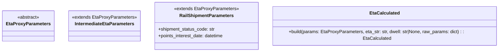

# Diagram: shipment_core/shipment_service/shipment_service/eta/eta_proxy/dwell.py


> Auto-generated by Obscura crawlers

## Diagram 1



### SVG

<svg id="container" width="1740.765625" xmlns="http://www.w3.org/2000/svg" class="classDiagram" height="184" viewBox="0 0 1740.765625 184" role="graphics-document document" aria-roledescription="class"><style>#container{font-family:"trebuchet ms",verdana,arial,sans-serif;font-size:16px;fill:#333;}@keyframes edge-animation-frame{from{stroke-dashoffset:0;}}@keyframes dash{to{stroke-dashoffset:0;}}#container .edge-animation-slow{stroke-dasharray:9,5!important;stroke-dashoffset:900;animation:dash 50s linear infinite;stroke-linecap:round;}#container .edge-animation-fast{stroke-dasharray:9,5!important;stroke-dashoffset:900;animation:dash 20s linear infinite;stroke-linecap:round;}#container .error-icon{fill:#552222;}#container .error-text{fill:#552222;stroke:#552222;}#container .edge-thickness-normal{stroke-width:1px;}#container .edge-thickness-thick{stroke-width:3.5px;}#container .edge-pattern-solid{stroke-dasharray:0;}#container .edge-thickness-invisible{stroke-width:0;fill:none;}#container .edge-pattern-dashed{stroke-dasharray:3;}#container .edge-pattern-dotted{stroke-dasharray:2;}#container .marker{fill:#333333;stroke:#333333;}#container .marker.cross{stroke:#333333;}#container svg{font-family:"trebuchet ms",verdana,arial,sans-serif;font-size:16px;}#container p{margin:0;}#container g.classGroup text{fill:#9370DB;stroke:none;font-family:"trebuchet ms",verdana,arial,sans-serif;font-size:10px;}#container g.classGroup text .title{font-weight:bolder;}#container .nodeLabel,#container .edgeLabel{color:#131300;}#container .edgeLabel .label rect{fill:#ECECFF;}#container .label text{fill:#131300;}#container .labelBkg{background:#ECECFF;}#container .edgeLabel .label span{background:#ECECFF;}#container .classTitle{font-weight:bolder;}#container .node rect,#container .node circle,#container .node ellipse,#container .node polygon,#container .node path{fill:#ECECFF;stroke:#9370DB;stroke-width:1px;}#container .divider{stroke:#9370DB;stroke-width:1;}#container g.clickable{cursor:pointer;}#container g.classGroup rect{fill:#ECECFF;stroke:#9370DB;}#container g.classGroup line{stroke:#9370DB;stroke-width:1;}#container .classLabel .box{stroke:none;stroke-width:0;fill:#ECECFF;opacity:0.5;}#container .classLabel .label{fill:#9370DB;font-size:10px;}#container .relation{stroke:#333333;stroke-width:1;fill:none;}#container .dashed-line{stroke-dasharray:3;}#container .dotted-line{stroke-dasharray:1 2;}#container #compositionStart,#container .composition{fill:#333333!important;stroke:#333333!important;stroke-width:1;}#container #compositionEnd,#container .composition{fill:#333333!important;stroke:#333333!important;stroke-width:1;}#container #dependencyStart,#container .dependency{fill:#333333!important;stroke:#333333!important;stroke-width:1;}#container #dependencyStart,#container .dependency{fill:#333333!important;stroke:#333333!important;stroke-width:1;}#container #extensionStart,#container .extension{fill:transparent!important;stroke:#333333!important;stroke-width:1;}#container #extensionEnd,#container .extension{fill:transparent!important;stroke:#333333!important;stroke-width:1;}#container #aggregationStart,#container .aggregation{fill:transparent!important;stroke:#333333!important;stroke-width:1;}#container #aggregationEnd,#container .aggregation{fill:transparent!important;stroke:#333333!important;stroke-width:1;}#container #lollipopStart,#container .lollipop{fill:#ECECFF!important;stroke:#333333!important;stroke-width:1;}#container #lollipopEnd,#container .lollipop{fill:#ECECFF!important;stroke:#333333!important;stroke-width:1;}#container .edgeTerminals{font-size:11px;line-height:initial;}#container .classTitleText{text-anchor:middle;font-size:18px;fill:#333;}#container .label-icon{display:inline-block;height:1em;overflow:visible;vertical-align:-0.125em;}#container .node .label-icon path{fill:currentColor;stroke:revert;stroke-width:revert;}#container :root{--mermaid-font-family:"trebuchet ms",verdana,arial,sans-serif;}</style><g><defs><marker id="container_class-aggregationStart" class="marker aggregation class" refX="18" refY="7" markerWidth="190" markerHeight="240" orient="auto"><path d="M 18,7 L9,13 L1,7 L9,1 Z"></path></marker></defs><defs><marker id="container_class-aggregationEnd" class="marker aggregation class" refX="1" refY="7" markerWidth="20" markerHeight="28" orient="auto"><path d="M 18,7 L9,13 L1,7 L9,1 Z"></path></marker></defs><defs><marker id="container_class-extensionStart" class="marker extension class" refX="18" refY="7" markerWidth="190" markerHeight="240" orient="auto"><path d="M 1,7 L18,13 V 1 Z"></path></marker></defs><defs><marker id="container_class-extensionEnd" class="marker extension class" refX="1" refY="7" markerWidth="20" markerHeight="28" orient="auto"><path d="M 1,1 V 13 L18,7 Z"></path></marker></defs><defs><marker id="container_class-compositionStart" class="marker composition class" refX="18" refY="7" markerWidth="190" markerHeight="240" orient="auto"><path d="M 18,7 L9,13 L1,7 L9,1 Z"></path></marker></defs><defs><marker id="container_class-compositionEnd" class="marker composition class" refX="1" refY="7" markerWidth="20" markerHeight="28" orient="auto"><path d="M 18,7 L9,13 L1,7 L9,1 Z"></path></marker></defs><defs><marker id="container_class-dependencyStart" class="marker dependency class" refX="6" refY="7" markerWidth="190" markerHeight="240" orient="auto"><path d="M 5,7 L9,13 L1,7 L9,1 Z"></path></marker></defs><defs><marker id="container_class-dependencyEnd" class="marker dependency class" refX="13" refY="7" markerWidth="20" markerHeight="28" orient="auto"><path d="M 18,7 L9,13 L14,7 L9,1 Z"></path></marker></defs><defs><marker id="container_class-lollipopStart" class="marker lollipop class" refX="13" refY="7" markerWidth="190" markerHeight="240" orient="auto"><circle stroke="black" fill="transparent" cx="7" cy="7" r="6"></circle></marker></defs><defs><marker id="container_class-lollipopEnd" class="marker lollipop class" refX="1" refY="7" markerWidth="190" markerHeight="240" orient="auto"><circle stroke="black" fill="transparent" cx="7" cy="7" r="6"></circle></marker></defs><g class="root"><g class="clusters"></g><g class="edgePaths"></g><g class="edgeLabels"></g><g class="nodes"><g class="node default" id="classId-EtaProxyParameters-0" transform="translate(93.453125, 92)"><g class="basic label-container"><path d="M-85.453125 -54 L85.453125 -54 L85.453125 54 L-85.453125 54" stroke="none" stroke-width="0" fill="#ECECFF" style=""></path><path d="M-85.453125 -54 C-42.428461052104964 -54, 0.5962028957900714 -54, 85.453125 -54 M-85.453125 -54 C-32.66312176333004 -54, 20.12688147333992 -54, 85.453125 -54 M85.453125 -54 C85.453125 -17.027117684636785, 85.453125 19.94576463072643, 85.453125 54 M85.453125 -54 C85.453125 -11.637629268827439, 85.453125 30.724741462345122, 85.453125 54 M85.453125 54 C38.32397616152455 54, -8.805172676950903 54, -85.453125 54 M85.453125 54 C33.42024624931281 54, -18.612632501374378 54, -85.453125 54 M-85.453125 54 C-85.453125 15.622514446252325, -85.453125 -22.75497110749535, -85.453125 -54 M-85.453125 54 C-85.453125 28.42425770953067, -85.453125 2.848515419061343, -85.453125 -54" stroke="#9370DB" stroke-width="1.3" fill="none" stroke-dasharray="0 0" style=""></path></g><g class="annotation-group text" transform="translate(-38.609375, -30)"><g class="label" style="" transform="translate(0,-12)"><foreignObject width="77.21875" height="24"><div xmlns="http://www.w3.org/1999/xhtml" style="display: table-cell; white-space: nowrap; line-height: 1.5; max-width: 127px; text-align: center;"><span class="nodeLabel markdown-node-label" style=""><p>«abstract»</p></span></div></foreignObject></g></g><g class="label-group text" transform="translate(-73.453125, -6)"><g class="label" style="font-weight: bolder" transform="translate(0,-12)"><foreignObject width="146.90625" height="24"><div xmlns="http://www.w3.org/1999/xhtml" style="display: table-cell; white-space: nowrap; line-height: 1.5; max-width: 194px; text-align: center;"><span class="nodeLabel markdown-node-label" style=""><p>EtaProxyParameters</p></span></div></foreignObject></g></g><g class="members-group text" transform="translate(-73.453125, 42)"></g><g class="methods-group text" transform="translate(-73.453125, 72)"></g><g class="divider" style=""><path d="M-85.453125 18 C-20.26197795434753 18, 44.92916909130494 18, 85.453125 18 M-85.453125 18 C-31.086932871454422 18, 23.279259257091155 18, 85.453125 18" stroke="#9370DB" stroke-width="1.3" fill="none" stroke-dasharray="0 0" style=""></path></g><g class="divider" style=""><path d="M-85.453125 36 C-39.75766238442271 36, 5.937800231154583 36, 85.453125 36 M-85.453125 36 C-37.6974479838059 36, 10.058229032388198 36, 85.453125 36" stroke="#9370DB" stroke-width="1.3" fill="none" stroke-dasharray="0 0" style=""></path></g></g><g class="node default" id="classId-IntermediateEtaParameters-1" transform="translate(352.375, 92)"><g class="basic label-container"><path d="M-123.46875 -54 L123.46875 -54 L123.46875 54 L-123.46875 54" stroke="none" stroke-width="0" fill="#ECECFF" style=""></path><path d="M-123.46875 -54 C-73.20596323143405 -54, -22.943176462868124 -54, 123.46875 -54 M-123.46875 -54 C-59.67893415075999 -54, 4.110881698480014 -54, 123.46875 -54 M123.46875 -54 C123.46875 -14.86588842903523, 123.46875 24.26822314192954, 123.46875 54 M123.46875 -54 C123.46875 -20.615944094526824, 123.46875 12.768111810946351, 123.46875 54 M123.46875 54 C70.86786150242318 54, 18.26697300484635 54, -123.46875 54 M123.46875 54 C36.09563275088463 54, -51.277484498230734 54, -123.46875 54 M-123.46875 54 C-123.46875 16.77510570380238, -123.46875 -20.449788592395237, -123.46875 -54 M-123.46875 54 C-123.46875 11.54631357819742, -123.46875 -30.90737284360516, -123.46875 -54" stroke="#9370DB" stroke-width="1.3" fill="none" stroke-dasharray="0 0" style=""></path></g><g class="annotation-group text" transform="translate(-111.46875, -30)"><g class="label" style="" transform="translate(0,-12)"><foreignObject width="222.9375" height="24"><div xmlns="http://www.w3.org/1999/xhtml" style="display: table-cell; white-space: nowrap; line-height: 1.5; max-width: 273px; text-align: center;"><span class="nodeLabel markdown-node-label" style=""><p>«extends EtaProxyParameters»</p></span></div></foreignObject></g></g><g class="label-group text" transform="translate(-100.5390625, -6)"><g class="label" style="font-weight: bolder" transform="translate(0,-12)"><foreignObject width="201.078125" height="24"><div xmlns="http://www.w3.org/1999/xhtml" style="display: table-cell; white-space: nowrap; line-height: 1.5; max-width: 248px; text-align: center;"><span class="nodeLabel markdown-node-label" style=""><p>IntermediateEtaParameters</p></span></div></foreignObject></g></g><g class="members-group text" transform="translate(-111.46875, 42)"></g><g class="methods-group text" transform="translate(-111.46875, 72)"></g><g class="divider" style=""><path d="M-123.46875 18 C-44.122993266612525 18, 35.22276346677495 18, 123.46875 18 M-123.46875 18 C-32.61156916504835 18, 58.2456116699033 18, 123.46875 18" stroke="#9370DB" stroke-width="1.3" fill="none" stroke-dasharray="0 0" style=""></path></g><g class="divider" style=""><path d="M-123.46875 36 C-57.23169740184082 36, 9.005355196318362 36, 123.46875 36 M-123.46875 36 C-54.07101506296121 36, 15.326719874077583 36, 123.46875 36" stroke="#9370DB" stroke-width="1.3" fill="none" stroke-dasharray="0 0" style=""></path></g></g><g class="node default" id="classId-RailShipmentParameters-2" transform="translate(709.3984375, 92)"><g class="basic label-container"><path d="M-183.5546875 -84 L183.5546875 -84 L183.5546875 84 L-183.5546875 84" stroke="none" stroke-width="0" fill="#ECECFF" style=""></path><path d="M-183.5546875 -84 C-86.26204962738571 -84, 11.030588245228586 -84, 183.5546875 -84 M-183.5546875 -84 C-99.51113109058088 -84, -15.46757468116175 -84, 183.5546875 -84 M183.5546875 -84 C183.5546875 -29.0864320167719, 183.5546875 25.827135966456197, 183.5546875 84 M183.5546875 -84 C183.5546875 -49.456669705613756, 183.5546875 -14.913339411227511, 183.5546875 84 M183.5546875 84 C51.88029410960925 84, -79.7940992807815 84, -183.5546875 84 M183.5546875 84 C86.07960724923562 84, -11.395473001528757 84, -183.5546875 84 M-183.5546875 84 C-183.5546875 36.28533685578536, -183.5546875 -11.42932628842928, -183.5546875 -84 M-183.5546875 84 C-183.5546875 32.92667692595912, -183.5546875 -18.146646148081757, -183.5546875 -84" stroke="#9370DB" stroke-width="1.3" fill="none" stroke-dasharray="0 0" style=""></path></g><g class="annotation-group text" transform="translate(-111.46875, -60)"><g class="label" style="" transform="translate(0,-12)"><foreignObject width="222.9375" height="24"><div xmlns="http://www.w3.org/1999/xhtml" style="display: table-cell; white-space: nowrap; line-height: 1.5; max-width: 273px; text-align: center;"><span class="nodeLabel markdown-node-label" style=""><p>«extends EtaProxyParameters»</p></span></div></foreignObject></g></g><g class="label-group text" transform="translate(-90.5703125, -36)"><g class="label" style="font-weight: bolder" transform="translate(0,-12)"><foreignObject width="181.140625" height="24"><div xmlns="http://www.w3.org/1999/xhtml" style="display: table-cell; white-space: nowrap; line-height: 1.5; max-width: 229px; text-align: center;"><span class="nodeLabel markdown-node-label" style=""><p>RailShipmentParameters</p></span></div></foreignObject></g></g><g class="members-group text" transform="translate(-171.5546875, 12)"><g class="label" style="" transform="translate(0,-12)"><foreignObject width="199.296875" height="24"><div xmlns="http://www.w3.org/1999/xhtml" style="display: table-cell; white-space: nowrap; line-height: 1.5; max-width: 257px; text-align: center;"><span class="nodeLabel markdown-node-label" style=""><p>+shipment_status_code: str</p></span></div></foreignObject></g><g class="label" style="" transform="translate(0,12)"><foreignObject width="231.640625" height="24"><div xmlns="http://www.w3.org/1999/xhtml" style="display: table-cell; white-space: nowrap; line-height: 1.5; max-width: 289px; text-align: center;"><span class="nodeLabel markdown-node-label" style=""><p>+points_interest_date: datetime</p></span></div></foreignObject></g></g><g class="methods-group text" transform="translate(-171.5546875, 84)"></g><g class="divider" style=""><path d="M-183.5546875 -12 C-56.68083312607786 -12, 70.19302124784429 -12, 183.5546875 -12 M-183.5546875 -12 C-109.74017540179842 -12, -35.92566330359685 -12, 183.5546875 -12" stroke="#9370DB" stroke-width="1.3" fill="none" stroke-dasharray="0 0" style=""></path></g><g class="divider" style=""><path d="M-183.5546875 60 C-73.20167488352911 60, 37.15133773294178 60, 183.5546875 60 M-183.5546875 60 C-83.03796505839823 60, 17.478757383203543 60, 183.5546875 60" stroke="#9370DB" stroke-width="1.3" fill="none" stroke-dasharray="0 0" style=""></path></g></g><g class="node default" id="classId-EtaCalculated-3" transform="translate(1337.859375, 92)"><g class="basic label-container"><path d="M-394.90625 -63 L394.90625 -63 L394.90625 63 L-394.90625 63" stroke="none" stroke-width="0" fill="#ECECFF" style=""></path><path d="M-394.90625 -63 C-124.3517225139899 -63, 146.2028049720202 -63, 394.90625 -63 M-394.90625 -63 C-187.4844720054319 -63, 19.937305989136178 -63, 394.90625 -63 M394.90625 -63 C394.90625 -18.22925514890919, 394.90625 26.54148970218162, 394.90625 63 M394.90625 -63 C394.90625 -13.694790556364936, 394.90625 35.61041888727013, 394.90625 63 M394.90625 63 C204.40777704824734 63, 13.90930409649468 63, -394.90625 63 M394.90625 63 C150.0330915043459 63, -94.84006699130822 63, -394.90625 63 M-394.90625 63 C-394.90625 33.328763771272605, -394.90625 3.6575275425452176, -394.90625 -63 M-394.90625 63 C-394.90625 23.70057143330535, -394.90625 -15.598857133389302, -394.90625 -63" stroke="#9370DB" stroke-width="1.3" fill="none" stroke-dasharray="0 0" style=""></path></g><g class="annotation-group text" transform="translate(0, -39)"></g><g class="label-group text" transform="translate(-49.8125, -39)"><g class="label" style="font-weight: bolder" transform="translate(0,-12)"><foreignObject width="99.625" height="24"><div xmlns="http://www.w3.org/1999/xhtml" style="display: table-cell; white-space: nowrap; line-height: 1.5; max-width: 149px; text-align: center;"><span class="nodeLabel markdown-node-label" style=""><p>EtaCalculated</p></span></div></foreignObject></g></g><g class="members-group text" transform="translate(-382.90625, 9)"></g><g class="methods-group text" transform="translate(-382.90625, 39)"><g class="label" style="" transform="translate(0,-12)"><foreignObject width="716" height="24"><div xmlns="http://www.w3.org/1999/xhtml" style="display: table-cell; white-space: nowrap; line-height: 1.5; max-width: 773px; text-align: center;"><span class="nodeLabel markdown-node-label" style=""><p>+build(params: EtaProxyParameters, eta_str: str, dwell: str|None, raw_params: dict) : : EtaCalculated</p></span></div></foreignObject></g></g><g class="divider" style=""><path d="M-394.90625 -15 C-103.2788432451764 -15, 188.3485635096472 -15, 394.90625 -15 M-394.90625 -15 C-228.18671591194496 -15, -61.467181823889916 -15, 394.90625 -15" stroke="#9370DB" stroke-width="1.3" fill="none" stroke-dasharray="0 0" style=""></path></g><g class="divider" style=""><path d="M-394.90625 9 C-187.38753696309084 9, 20.131176073818324 9, 394.90625 9 M-394.90625 9 C-179.46065909478727 9, 35.98493181042545 9, 394.90625 9" stroke="#9370DB" stroke-width="1.3" fill="none" stroke-dasharray="0 0" style=""></path></g></g></g></g></g></svg>

## Diagram 2

```mermaid
flowchart TD
    Start([dwell_payload_for(params, raw_params, eta_str, expected_dwell_str)]) --> CheckType{isinstance(params, IntermediateEtaParameters)?}
    CheckType -- yes --> EnsureExpectedDwell[assert expected_dwell_str present]
    EnsureExpectedDwell --> BuildIntermediate[EtaCalculated.build(params, eta_str, expected_dwell_str, raw_params)]
    CheckType -- no --> CheckRail{isinstance(params, RailShipmentParameters)?}
    CheckRail -- no --> ReturnNone([return None])
    CheckRail -- yes --> CheckTrigger{params.shipment_status_code in RAIL_DWELL_TRIGGERING_MILESTONES?}
    CheckTrigger -- yes --> Compute24[compute dwell_24_hr = params.points_interest_date + 1 day]
    Compute24 --> BuildRailTrigger[EtaCalculated.build(params, eta_str, dwell_24_hr.isoformat(), raw_params)]
    CheckTrigger -- no --> CheckClear{params.shipment_status_code in RAIL_DWELL_CLEARING_MILESTONES?}
    CheckClear -- yes --> BuildRailClear[EtaCalculated.build(params, eta_str, None, raw_params)]
    CheckClear -- no --> ReturnNone2([return None])
    BuildIntermediate --> End([result])
    BuildRailTrigger --> End
    BuildRailClear --> End
```

> SVG rendering failed for this diagram.
