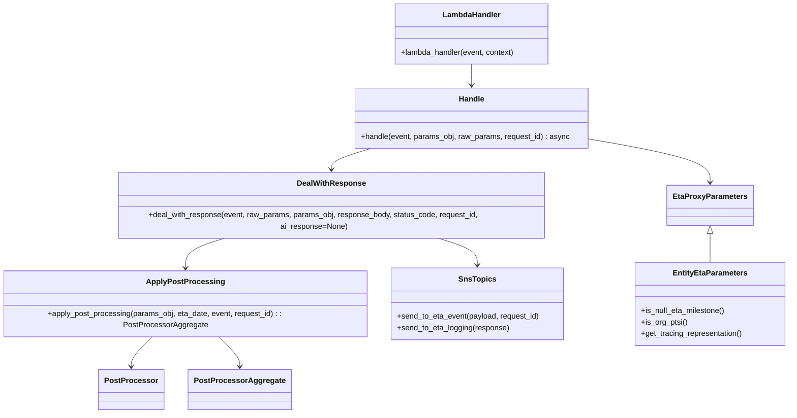

# Diagram: shipment_core/shipment_service/shipment_service/eta/eta_proxy/eta_proxy.py


> Auto-generated by Obscura crawlers

## Diagram 1

```mermaid
graph TD
  A[lambda_handler] --> B[classify_params]
  B --> C[handle(event, params_obj, raw_params, request_id)]
  C --> D{eta_calculation_mode}
  D -->|AI| E[get_ai_eta(timeout=10)]
  E --> F[deal_with_response(ai_response, status=...)]
  F --> G{status_code}
  D -->|ML_AND_AI| H[get_ai_eta(timeout=5) (optional)]
  H --> I[invoke_lambda: get_ml_eta]
  D -->|ML| I
  I --> J[parse response body]
  J --> F
  F -->|200| K[adapt_dt_with_tz]
  K --> L[apply_post_processing]
  L --> M[reduce apply_post_processor -> (eta_date, postProcessors)]
  M --> N{postProcessors applied?}
  N -->|yes| O[response_body.postProcessors set]
  K --> P[response_body.etaDate isoformat]
  P --> Q{ENABLE_DWELL}
  Q -->|true| R[dwell_payload_for -> sns_topics.send_to_eta_event]
  F -->|404| S[return 204 with message "No historical data"]
  F -->|other| T[raise UnhandledException]
  E --> U[if K8S_CLUSTER_EXISTS -> sns_topics.send_to_eta_logging]
  C --> V[cleanup feature_dicts]
  A --> W[fv.aws.lambdas.make_response(response_body, status_code)]
```

> SVG rendering failed for this diagram.

## Diagram 2



### SVG

<svg id="container" width="1662.15234375" xmlns="http://www.w3.org/2000/svg" class="classDiagram" height="852" viewBox="0 0 1662.15234375 852" role="graphics-document document" aria-roledescription="class"><style>#container{font-family:"trebuchet ms",verdana,arial,sans-serif;font-size:16px;fill:#333;}@keyframes edge-animation-frame{from{stroke-dashoffset:0;}}@keyframes dash{to{stroke-dashoffset:0;}}#container .edge-animation-slow{stroke-dasharray:9,5!important;stroke-dashoffset:900;animation:dash 50s linear infinite;stroke-linecap:round;}#container .edge-animation-fast{stroke-dasharray:9,5!important;stroke-dashoffset:900;animation:dash 20s linear infinite;stroke-linecap:round;}#container .error-icon{fill:#552222;}#container .error-text{fill:#552222;stroke:#552222;}#container .edge-thickness-normal{stroke-width:1px;}#container .edge-thickness-thick{stroke-width:3.5px;}#container .edge-pattern-solid{stroke-dasharray:0;}#container .edge-thickness-invisible{stroke-width:0;fill:none;}#container .edge-pattern-dashed{stroke-dasharray:3;}#container .edge-pattern-dotted{stroke-dasharray:2;}#container .marker{fill:#333333;stroke:#333333;}#container .marker.cross{stroke:#333333;}#container svg{font-family:"trebuchet ms",verdana,arial,sans-serif;font-size:16px;}#container p{margin:0;}#container g.classGroup text{fill:#9370DB;stroke:none;font-family:"trebuchet ms",verdana,arial,sans-serif;font-size:10px;}#container g.classGroup text .title{font-weight:bolder;}#container .nodeLabel,#container .edgeLabel{color:#131300;}#container .edgeLabel .label rect{fill:#ECECFF;}#container .label text{fill:#131300;}#container .labelBkg{background:#ECECFF;}#container .edgeLabel .label span{background:#ECECFF;}#container .classTitle{font-weight:bolder;}#container .node rect,#container .node circle,#container .node ellipse,#container .node polygon,#container .node path{fill:#ECECFF;stroke:#9370DB;stroke-width:1px;}#container .divider{stroke:#9370DB;stroke-width:1;}#container g.clickable{cursor:pointer;}#container g.classGroup rect{fill:#ECECFF;stroke:#9370DB;}#container g.classGroup line{stroke:#9370DB;stroke-width:1;}#container .classLabel .box{stroke:none;stroke-width:0;fill:#ECECFF;opacity:0.5;}#container .classLabel .label{fill:#9370DB;font-size:10px;}#container .relation{stroke:#333333;stroke-width:1;fill:none;}#container .dashed-line{stroke-dasharray:3;}#container .dotted-line{stroke-dasharray:1 2;}#container #compositionStart,#container .composition{fill:#333333!important;stroke:#333333!important;stroke-width:1;}#container #compositionEnd,#container .composition{fill:#333333!important;stroke:#333333!important;stroke-width:1;}#container #dependencyStart,#container .dependency{fill:#333333!important;stroke:#333333!important;stroke-width:1;}#container #dependencyStart,#container .dependency{fill:#333333!important;stroke:#333333!important;stroke-width:1;}#container #extensionStart,#container .extension{fill:transparent!important;stroke:#333333!important;stroke-width:1;}#container #extensionEnd,#container .extension{fill:transparent!important;stroke:#333333!important;stroke-width:1;}#container #aggregationStart,#container .aggregation{fill:transparent!important;stroke:#333333!important;stroke-width:1;}#container #aggregationEnd,#container .aggregation{fill:transparent!important;stroke:#333333!important;stroke-width:1;}#container #lollipopStart,#container .lollipop{fill:#ECECFF!important;stroke:#333333!important;stroke-width:1;}#container #lollipopEnd,#container .lollipop{fill:#ECECFF!important;stroke:#333333!important;stroke-width:1;}#container .edgeTerminals{font-size:11px;line-height:initial;}#container .classTitleText{text-anchor:middle;font-size:18px;fill:#333;}#container .label-icon{display:inline-block;height:1em;overflow:visible;vertical-align:-0.125em;}#container .node .label-icon path{fill:currentColor;stroke:revert;stroke-width:revert;}#container :root{--mermaid-font-family:"trebuchet ms",verdana,arial,sans-serif;}</style><g><defs><marker id="container_class-aggregationStart" class="marker aggregation class" refX="18" refY="7" markerWidth="190" markerHeight="240" orient="auto"><path d="M 18,7 L9,13 L1,7 L9,1 Z"></path></marker></defs><defs><marker id="container_class-aggregationEnd" class="marker aggregation class" refX="1" refY="7" markerWidth="20" markerHeight="28" orient="auto"><path d="M 18,7 L9,13 L1,7 L9,1 Z"></path></marker></defs><defs><marker id="container_class-extensionStart" class="marker extension class" refX="18" refY="7" markerWidth="190" markerHeight="240" orient="auto"><path d="M 1,7 L18,13 V 1 Z"></path></marker></defs><defs><marker id="container_class-extensionEnd" class="marker extension class" refX="1" refY="7" markerWidth="20" markerHeight="28" orient="auto"><path d="M 1,1 V 13 L18,7 Z"></path></marker></defs><defs><marker id="container_class-compositionStart" class="marker composition class" refX="18" refY="7" markerWidth="190" markerHeight="240" orient="auto"><path d="M 18,7 L9,13 L1,7 L9,1 Z"></path></marker></defs><defs><marker id="container_class-compositionEnd" class="marker composition class" refX="1" refY="7" markerWidth="20" markerHeight="28" orient="auto"><path d="M 18,7 L9,13 L1,7 L9,1 Z"></path></marker></defs><defs><marker id="container_class-dependencyStart" class="marker dependency class" refX="6" refY="7" markerWidth="190" markerHeight="240" orient="auto"><path d="M 5,7 L9,13 L1,7 L9,1 Z"></path></marker></defs><defs><marker id="container_class-dependencyEnd" class="marker dependency class" refX="13" refY="7" markerWidth="20" markerHeight="28" orient="auto"><path d="M 18,7 L9,13 L14,7 L9,1 Z"></path></marker></defs><defs><marker id="container_class-lollipopStart" class="marker lollipop class" refX="13" refY="7" markerWidth="190" markerHeight="240" orient="auto"><circle stroke="black" fill="transparent" cx="7" cy="7" r="6"></circle></marker></defs><defs><marker id="container_class-lollipopEnd" class="marker lollipop class" refX="1" refY="7" markerWidth="190" markerHeight="240" orient="auto"><circle stroke="black" fill="transparent" cx="7" cy="7" r="6"></circle></marker></defs><g class="root"><g class="clusters"></g><g class="edgePaths"><path d="M997.867,134L997.867,138.167C997.867,142.333,997.867,150.667,997.867,158C997.867,165.333,997.867,171.667,997.867,174.833L997.867,178" id="id_LambdaHandler_Handle_1" class="edge-thickness-normal edge-pattern-solid relation" style=";;;" data-edge="true" data-et="edge" data-id="id_LambdaHandler_Handle_1" data-points="W3sieCI6OTk3Ljg2NzE4NzUsInkiOjEzNH0seyJ4Ijo5OTcuODY3MTg3NSwieSI6MTU5fSx7IngiOjk5Ny44NjcxODc1LCJ5IjoxODR9XQ==" marker-end="url(#container_class-dependencyEnd)"></path><path d="M783.774,310L769.614,314.167C755.455,318.333,727.136,326.667,712.976,334C698.816,341.333,698.816,347.667,698.816,350.833L698.816,354" id="id_Handle_DealWithResponse_2" class="edge-thickness-normal edge-pattern-solid relation" style=";;;" data-edge="true" data-et="edge" data-id="id_Handle_DealWithResponse_2" data-points="W3sieCI6NzgzLjc3NDAxNDU1OTY1OTEsInkiOjMxMH0seyJ4Ijo2OTguODE2NDA2MjUsInkiOjMzNX0seyJ4Ijo2OTguODE2NDA2MjUsInkiOjM2MH1d" marker-end="url(#container_class-dependencyEnd)"></path><path d="M479.158,486L464.63,490.167C450.103,494.333,421.048,502.667,406.52,514C391.992,525.333,391.992,539.667,391.992,546.833L391.992,554" id="id_DealWithResponse_ApplyPostProcessing_3" class="edge-thickness-normal edge-pattern-solid relation" style=";;;" data-edge="true" data-et="edge" data-id="id_DealWithResponse_ApplyPostProcessing_3" data-points="W3sieCI6NDc5LjE1ODE1ODczNTc5NTUsInkiOjQ4Nn0seyJ4IjozOTEuOTkyMTg3NSwieSI6NTExfSx7IngiOjM5MS45OTIxODc1LCJ5Ijo1NjB9XQ==" marker-end="url(#container_class-dependencyEnd)"></path><path d="M331.493,686L323.65,694.167C315.808,702.333,300.123,718.667,292.28,730C284.438,741.333,284.438,747.667,284.438,750.833L284.438,754" id="id_ApplyPostProcessing_PostProcessor_4" class="edge-thickness-normal edge-pattern-solid relation" style=";;;" data-edge="true" data-et="edge" data-id="id_ApplyPostProcessing_PostProcessor_4" data-points="W3sieCI6MzMxLjQ5MjY3NTc4MTI1LCJ5Ijo2ODZ9LHsieCI6Mjg0LjQzNzUsInkiOjczNX0seyJ4IjoyODQuNDM3NSwieSI6NzYwfV0=" marker-end="url(#container_class-dependencyEnd)"></path><path d="M1240.707,289.752L1283.544,297.293C1326.382,304.834,1412.056,319.917,1454.893,334.125C1497.73,348.333,1497.73,361.667,1497.73,368.333L1497.73,375" id="id_Handle_EtaProxyParameters_5" class="edge-thickness-normal edge-pattern-solid relation" style=";;;" data-edge="true" data-et="edge" data-id="id_Handle_EtaProxyParameters_5" data-points="W3sieCI6MTI0MC43MDcwMzEyNSwieSI6Mjg5Ljc1MTUwMjM2MzkyNzZ9LHsieCI6MTQ5Ny43MzA0Njg3NSwieSI6MzM1fSx7IngiOjE0OTcuNzMwNDY4NzUsInkiOjM4MX1d" marker-end="url(#container_class-dependencyEnd)"></path><path d="M1497.73,482.25L1497.73,487.042C1497.73,491.833,1497.73,501.417,1497.73,510.375C1497.73,519.333,1497.73,527.667,1497.73,531.833L1497.73,536" id="id_EtaProxyParameters_EntityEtaParameters_6" class="edge-thickness-normal edge-pattern-solid relation" style=";;;" data-edge="true" data-et="edge" data-id="id_EtaProxyParameters_EntityEtaParameters_6" data-points="W3sieCI6MTQ5Ny43MzA0Njg3NSwieSI6NDY1fSx7IngiOjE0OTcuNzMwNDY4NzUsInkiOjUxMX0seyJ4IjoxNDk3LjczMDQ2ODc1LCJ5Ijo1MzZ9XQ==" marker-start="url(#container_class-extensionStart)"></path><path d="M918.475,486L933.002,490.167C947.53,494.333,976.585,502.667,991.113,512C1005.641,521.333,1005.641,531.667,1005.641,536.833L1005.641,542" id="id_DealWithResponse_SnsTopics_7" class="edge-thickness-normal edge-pattern-solid relation" style=";;;" data-edge="true" data-et="edge" data-id="id_DealWithResponse_SnsTopics_7" data-points="W3sieCI6OTE4LjQ3NDY1Mzc2NDIwNDUsInkiOjQ4Nn0seyJ4IjoxMDA1LjY0MDYyNSwieSI6NTExfSx7IngiOjEwMDUuNjQwNjI1LCJ5Ijo1NDh9XQ==" marker-end="url(#container_class-dependencyEnd)"></path><path d="M452.492,686L460.334,694.167C468.177,702.333,483.862,718.667,491.704,730C499.547,741.333,499.547,747.667,499.547,750.833L499.547,754" id="id_ApplyPostProcessing_PostProcessorAggregate_8" class="edge-thickness-normal edge-pattern-solid relation" style=";;;" data-edge="true" data-et="edge" data-id="id_ApplyPostProcessing_PostProcessorAggregate_8" data-points="W3sieCI6NDUyLjQ5MTY5OTIxODc1LCJ5Ijo2ODZ9LHsieCI6NDk5LjU0Njg3NSwieSI6NzM1fSx7IngiOjQ5OS41NDY4NzUsInkiOjc2MH1d" marker-end="url(#container_class-dependencyEnd)"></path></g><g class="edgeLabels"><g class="edgeLabel"><g class="label" data-id="id_LambdaHandler_Handle_1" transform="translate(0, 0)"><foreignObject width="0" height="0"><div xmlns="http://www.w3.org/1999/xhtml" class="labelBkg" style="display: table-cell; white-space: nowrap; line-height: 1.5; max-width: 200px; text-align: center;"><span class="edgeLabel"></span></div></foreignObject></g></g><g class="edgeLabel"><g class="label" data-id="id_Handle_DealWithResponse_2" transform="translate(0, 0)"><foreignObject width="0" height="0"><div xmlns="http://www.w3.org/1999/xhtml" class="labelBkg" style="display: table-cell; white-space: nowrap; line-height: 1.5; max-width: 200px; text-align: center;"><span class="edgeLabel"></span></div></foreignObject></g></g><g class="edgeLabel"><g class="label" data-id="id_DealWithResponse_ApplyPostProcessing_3" transform="translate(0, 0)"><foreignObject width="0" height="0"><div xmlns="http://www.w3.org/1999/xhtml" class="labelBkg" style="display: table-cell; white-space: nowrap; line-height: 1.5; max-width: 200px; text-align: center;"><span class="edgeLabel"></span></div></foreignObject></g></g><g class="edgeLabel"><g class="label" data-id="id_ApplyPostProcessing_PostProcessor_4" transform="translate(0, 0)"><foreignObject width="0" height="0"><div xmlns="http://www.w3.org/1999/xhtml" class="labelBkg" style="display: table-cell; white-space: nowrap; line-height: 1.5; max-width: 200px; text-align: center;"><span class="edgeLabel"></span></div></foreignObject></g></g><g class="edgeLabel"><g class="label" data-id="id_Handle_EtaProxyParameters_5" transform="translate(0, 0)"><foreignObject width="0" height="0"><div xmlns="http://www.w3.org/1999/xhtml" class="labelBkg" style="display: table-cell; white-space: nowrap; line-height: 1.5; max-width: 200px; text-align: center;"><span class="edgeLabel"></span></div></foreignObject></g></g><g class="edgeLabel"><g class="label" data-id="id_EtaProxyParameters_EntityEtaParameters_6" transform="translate(0, 0)"><foreignObject width="0" height="0"><div xmlns="http://www.w3.org/1999/xhtml" class="labelBkg" style="display: table-cell; white-space: nowrap; line-height: 1.5; max-width: 200px; text-align: center;"><span class="edgeLabel"></span></div></foreignObject></g></g><g class="edgeLabel"><g class="label" data-id="id_DealWithResponse_SnsTopics_7" transform="translate(0, 0)"><foreignObject width="0" height="0"><div xmlns="http://www.w3.org/1999/xhtml" class="labelBkg" style="display: table-cell; white-space: nowrap; line-height: 1.5; max-width: 200px; text-align: center;"><span class="edgeLabel"></span></div></foreignObject></g></g><g class="edgeLabel"><g class="label" data-id="id_ApplyPostProcessing_PostProcessorAggregate_8" transform="translate(0, 0)"><foreignObject width="0" height="0"><div xmlns="http://www.w3.org/1999/xhtml" class="labelBkg" style="display: table-cell; white-space: nowrap; line-height: 1.5; max-width: 200px; text-align: center;"><span class="edgeLabel"></span></div></foreignObject></g></g></g><g class="nodes"><g class="node default" id="classId-LambdaHandler-0" transform="translate(997.8671875, 71)"><g class="basic label-container"><path d="M-161.203125 -63 L161.203125 -63 L161.203125 63 L-161.203125 63" stroke="none" stroke-width="0" fill="#ECECFF" style=""></path><path d="M-161.203125 -63 C-88.81420428703814 -63, -16.425283574076275 -63, 161.203125 -63 M-161.203125 -63 C-35.62175923739373 -63, 89.95960652521254 -63, 161.203125 -63 M161.203125 -63 C161.203125 -36.19592178764991, 161.203125 -9.391843575299816, 161.203125 63 M161.203125 -63 C161.203125 -30.082231265871542, 161.203125 2.8355374682569163, 161.203125 63 M161.203125 63 C78.19698595466402 63, -4.80915309067197 63, -161.203125 63 M161.203125 63 C37.60358796596729 63, -85.99594906806541 63, -161.203125 63 M-161.203125 63 C-161.203125 15.703499266908189, -161.203125 -31.593001466183622, -161.203125 -63 M-161.203125 63 C-161.203125 30.001611519307417, -161.203125 -2.996776961385166, -161.203125 -63" stroke="#9370DB" stroke-width="1.3" fill="none" stroke-dasharray="0 0" style=""></path></g><g class="annotation-group text" transform="translate(0, -39)"></g><g class="label-group text" transform="translate(-58.21875, -39)"><g class="label" style="font-weight: bolder" transform="translate(0,-12)"><foreignObject width="116.4375" height="24"><div xmlns="http://www.w3.org/1999/xhtml" style="display: table-cell; white-space: nowrap; line-height: 1.5; max-width: 167px; text-align: center;"><span class="nodeLabel markdown-node-label" style=""><p>LambdaHandler</p></span></div></foreignObject></g></g><g class="members-group text" transform="translate(-149.203125, 9)"></g><g class="methods-group text" transform="translate(-149.203125, 39)"><g class="label" style="" transform="translate(0,-12)"><foreignObject width="240.1875" height="24"><div xmlns="http://www.w3.org/1999/xhtml" style="display: table-cell; white-space: nowrap; line-height: 1.5; max-width: 298px; text-align: center;"><span class="nodeLabel markdown-node-label" style=""><p>+lambda_handler(event, context)</p></span></div></foreignObject></g></g><g class="divider" style=""><path d="M-161.203125 -15 C-90.30863682381126 -15, -19.41414864762251 -15, 161.203125 -15 M-161.203125 -15 C-33.902825971675256 -15, 93.39747305664949 -15, 161.203125 -15" stroke="#9370DB" stroke-width="1.3" fill="none" stroke-dasharray="0 0" style=""></path></g><g class="divider" style=""><path d="M-161.203125 9 C-61.05437067165579 9, 39.09438365668842 9, 161.203125 9 M-161.203125 9 C-51.5513626438772 9, 58.100399712245604 9, 161.203125 9" stroke="#9370DB" stroke-width="1.3" fill="none" stroke-dasharray="0 0" style=""></path></g></g><g class="node default" id="classId-Handle-1" transform="translate(997.8671875, 247)"><g class="basic label-container"><path d="M-242.83984375 -63 L242.83984375 -63 L242.83984375 63 L-242.83984375 63" stroke="none" stroke-width="0" fill="#ECECFF" style=""></path><path d="M-242.83984375 -63 C-79.00953983625197 -63, 84.82076407749605 -63, 242.83984375 -63 M-242.83984375 -63 C-143.4379898584172 -63, -44.03613596683445 -63, 242.83984375 -63 M242.83984375 -63 C242.83984375 -29.43041278469348, 242.83984375 4.139174430613039, 242.83984375 63 M242.83984375 -63 C242.83984375 -14.2522868203354, 242.83984375 34.4954263593292, 242.83984375 63 M242.83984375 63 C82.48931836917282 63, -77.86120701165436 63, -242.83984375 63 M242.83984375 63 C73.78566237343759 63, -95.26851900312482 63, -242.83984375 63 M-242.83984375 63 C-242.83984375 31.552498404102217, -242.83984375 0.10499680820443302, -242.83984375 -63 M-242.83984375 63 C-242.83984375 27.853410132272266, -242.83984375 -7.2931797354554675, -242.83984375 -63" stroke="#9370DB" stroke-width="1.3" fill="none" stroke-dasharray="0 0" style=""></path></g><g class="annotation-group text" transform="translate(0, -39)"></g><g class="label-group text" transform="translate(-25.8828125, -39)"><g class="label" style="font-weight: bolder" transform="translate(0,-12)"><foreignObject width="51.765625" height="24"><div xmlns="http://www.w3.org/1999/xhtml" style="display: table-cell; white-space: nowrap; line-height: 1.5; max-width: 102px; text-align: center;"><span class="nodeLabel markdown-node-label" style=""><p>Handle</p></span></div></foreignObject></g></g><g class="members-group text" transform="translate(-230.83984375, 9)"></g><g class="methods-group text" transform="translate(-230.83984375, 39)"><g class="label" style="" transform="translate(0,-12)"><foreignObject width="435.796875" height="24"><div xmlns="http://www.w3.org/1999/xhtml" style="display: table-cell; white-space: nowrap; line-height: 1.5; max-width: 494px; text-align: center;"><span class="nodeLabel markdown-node-label" style=""><p>+handle(event, params_obj, raw_params, request_id) : async</p></span></div></foreignObject></g></g><g class="divider" style=""><path d="M-242.83984375 -15 C-119.691036782678 -15, 3.457770184644005 -15, 242.83984375 -15 M-242.83984375 -15 C-110.53011446488526 -15, 21.779614820229483 -15, 242.83984375 -15" stroke="#9370DB" stroke-width="1.3" fill="none" stroke-dasharray="0 0" style=""></path></g><g class="divider" style=""><path d="M-242.83984375 9 C-97.45311369078453 9, 47.93361636843093 9, 242.83984375 9 M-242.83984375 9 C-119.77087225811292 9, 3.298099233774167 9, 242.83984375 9" stroke="#9370DB" stroke-width="1.3" fill="none" stroke-dasharray="0 0" style=""></path></g></g><g class="node default" id="classId-DealWithResponse-2" transform="translate(698.81640625, 423)"><g class="basic label-container"><path d="M-462.6484375 -63 L462.6484375 -63 L462.6484375 63 L-462.6484375 63" stroke="none" stroke-width="0" fill="#ECECFF" style=""></path><path d="M-462.6484375 -63 C-249.54435403466476 -63, -36.44027056932953 -63, 462.6484375 -63 M-462.6484375 -63 C-140.2039178200725 -63, 182.24060185985502 -63, 462.6484375 -63 M462.6484375 -63 C462.6484375 -35.42430165943753, 462.6484375 -7.848603318875064, 462.6484375 63 M462.6484375 -63 C462.6484375 -13.580130079875197, 462.6484375 35.83973984024961, 462.6484375 63 M462.6484375 63 C202.75457650623832 63, -57.139284487523355 63, -462.6484375 63 M462.6484375 63 C275.908891293833 63, 89.16934508766604 63, -462.6484375 63 M-462.6484375 63 C-462.6484375 26.959924947453025, -462.6484375 -9.08015010509395, -462.6484375 -63 M-462.6484375 63 C-462.6484375 28.74105406134072, -462.6484375 -5.5178918773185615, -462.6484375 -63" stroke="#9370DB" stroke-width="1.3" fill="none" stroke-dasharray="0 0" style=""></path></g><g class="annotation-group text" transform="translate(0, -39)"></g><g class="label-group text" transform="translate(-68.40625, -39)"><g class="label" style="font-weight: bolder" transform="translate(0,-12)"><foreignObject width="136.8125" height="24"><div xmlns="http://www.w3.org/1999/xhtml" style="display: table-cell; white-space: nowrap; line-height: 1.5; max-width: 185px; text-align: center;"><span class="nodeLabel markdown-node-label" style=""><p>DealWithResponse</p></span></div></foreignObject></g></g><g class="members-group text" transform="translate(-450.6484375, 9)"></g><g class="methods-group text" transform="translate(-450.6484375, 39)"><g class="label" style="" transform="translate(0,-12)"><foreignObject width="832.890625" height="24"><div xmlns="http://www.w3.org/1999/xhtml" style="display: table-cell; white-space: nowrap; line-height: 1.5; max-width: 890px; text-align: center;"><span class="nodeLabel markdown-node-label" style=""><p>+deal_with_response(event, raw_params, params_obj, response_body, status_code, request_id, ai_response=None)</p></span></div></foreignObject></g></g><g class="divider" style=""><path d="M-462.6484375 -15 C-214.58226558673954 -15, 33.48390632652092 -15, 462.6484375 -15 M-462.6484375 -15 C-171.39068117215385 -15, 119.8670751556923 -15, 462.6484375 -15" stroke="#9370DB" stroke-width="1.3" fill="none" stroke-dasharray="0 0" style=""></path></g><g class="divider" style=""><path d="M-462.6484375 9 C-254.52668088213989 9, -46.40492426427977 9, 462.6484375 9 M-462.6484375 9 C-150.3088778062433 9, 162.03068188751342 9, 462.6484375 9" stroke="#9370DB" stroke-width="1.3" fill="none" stroke-dasharray="0 0" style=""></path></g></g><g class="node default" id="classId-ApplyPostProcessing-3" transform="translate(391.9921875, 623)"><g class="basic label-container"><path d="M-383.9921875 -63 L383.9921875 -63 L383.9921875 63 L-383.9921875 63" stroke="none" stroke-width="0" fill="#ECECFF" style=""></path><path d="M-383.9921875 -63 C-221.31598651581774 -63, -58.63978553163548 -63, 383.9921875 -63 M-383.9921875 -63 C-109.10008286294641 -63, 165.79202177410718 -63, 383.9921875 -63 M383.9921875 -63 C383.9921875 -22.667467698446075, 383.9921875 17.66506460310785, 383.9921875 63 M383.9921875 -63 C383.9921875 -14.279324761136344, 383.9921875 34.44135047772731, 383.9921875 63 M383.9921875 63 C204.22268588969487 63, 24.453184279389745 63, -383.9921875 63 M383.9921875 63 C108.52928000681067 63, -166.93362748637867 63, -383.9921875 63 M-383.9921875 63 C-383.9921875 26.73042307112018, -383.9921875 -9.539153857759644, -383.9921875 -63 M-383.9921875 63 C-383.9921875 32.99057904429626, -383.9921875 2.9811580885925224, -383.9921875 -63" stroke="#9370DB" stroke-width="1.3" fill="none" stroke-dasharray="0 0" style=""></path></g><g class="annotation-group text" transform="translate(0, -39)"></g><g class="label-group text" transform="translate(-76.21875, -39)"><g class="label" style="font-weight: bolder" transform="translate(0,-12)"><foreignObject width="152.4375" height="24"><div xmlns="http://www.w3.org/1999/xhtml" style="display: table-cell; white-space: nowrap; line-height: 1.5; max-width: 200px; text-align: center;"><span class="nodeLabel markdown-node-label" style=""><p>ApplyPostProcessing</p></span></div></foreignObject></g></g><g class="members-group text" transform="translate(-371.9921875, 9)"></g><g class="methods-group text" transform="translate(-371.9921875, 39)"><g class="label" style="" transform="translate(0,-12)"><foreignObject width="667.765625" height="24"><div xmlns="http://www.w3.org/1999/xhtml" style="display: table-cell; white-space: nowrap; line-height: 1.5; max-width: 725px; text-align: center;"><span class="nodeLabel markdown-node-label" style=""><p>+apply_post_processing(params_obj, eta_date, event, request_id) : : PostProcessorAggregate</p></span></div></foreignObject></g></g><g class="divider" style=""><path d="M-383.9921875 -15 C-127.24040640728776 -15, 129.51137468542447 -15, 383.9921875 -15 M-383.9921875 -15 C-204.90990161436636 -15, -25.827615728732724 -15, 383.9921875 -15" stroke="#9370DB" stroke-width="1.3" fill="none" stroke-dasharray="0 0" style=""></path></g><g class="divider" style=""><path d="M-383.9921875 9 C-215.06682145944788 9, -46.14145541889576 9, 383.9921875 9 M-383.9921875 9 C-213.79120757830043 9, -43.59022765660086 9, 383.9921875 9" stroke="#9370DB" stroke-width="1.3" fill="none" stroke-dasharray="0 0" style=""></path></g></g><g class="node default" id="classId-SnsTopics-4" transform="translate(1005.640625, 623)"><g class="basic label-container"><path d="M-179.65625 -75 L179.65625 -75 L179.65625 75 L-179.65625 75" stroke="none" stroke-width="0" fill="#ECECFF" style=""></path><path d="M-179.65625 -75 C-94.25048842197295 -75, -8.844726843945892 -75, 179.65625 -75 M-179.65625 -75 C-78.16196814589874 -75, 23.33231370820252 -75, 179.65625 -75 M179.65625 -75 C179.65625 -30.01121068064942, 179.65625 14.97757863870116, 179.65625 75 M179.65625 -75 C179.65625 -28.540074387671787, 179.65625 17.919851224656426, 179.65625 75 M179.65625 75 C98.03300432537658 75, 16.40975865075316 75, -179.65625 75 M179.65625 75 C77.43777864884608 75, -24.780692702307846 75, -179.65625 75 M-179.65625 75 C-179.65625 27.975355460622808, -179.65625 -19.049289078754384, -179.65625 -75 M-179.65625 75 C-179.65625 22.300434612829065, -179.65625 -30.39913077434187, -179.65625 -75" stroke="#9370DB" stroke-width="1.3" fill="none" stroke-dasharray="0 0" style=""></path></g><g class="annotation-group text" transform="translate(0, -51)"></g><g class="label-group text" transform="translate(-36.34375, -51)"><g class="label" style="font-weight: bolder" transform="translate(0,-12)"><foreignObject width="72.6875" height="24"><div xmlns="http://www.w3.org/1999/xhtml" style="display: table-cell; white-space: nowrap; line-height: 1.5; max-width: 121px; text-align: center;"><span class="nodeLabel markdown-node-label" style=""><p>SnsTopics</p></span></div></foreignObject></g></g><g class="members-group text" transform="translate(-167.65625, -3)"></g><g class="methods-group text" transform="translate(-167.65625, 27)"><g class="label" style="" transform="translate(0,-12)"><foreignObject width="298.96875" height="24"><div xmlns="http://www.w3.org/1999/xhtml" style="display: table-cell; white-space: nowrap; line-height: 1.5; max-width: 356px; text-align: center;"><span class="nodeLabel markdown-node-label" style=""><p>+send_to_eta_event(payload, request_id)</p></span></div></foreignObject></g><g class="label" style="" transform="translate(0,12)"><foreignObject width="234.40625" height="24"><div xmlns="http://www.w3.org/1999/xhtml" style="display: table-cell; white-space: nowrap; line-height: 1.5; max-width: 292px; text-align: center;"><span class="nodeLabel markdown-node-label" style=""><p>+send_to_eta_logging(response)</p></span></div></foreignObject></g></g><g class="divider" style=""><path d="M-179.65625 -27 C-53.5679307642082 -27, 72.5203884715836 -27, 179.65625 -27 M-179.65625 -27 C-82.05906642707654 -27, 15.538117145846911 -27, 179.65625 -27" stroke="#9370DB" stroke-width="1.3" fill="none" stroke-dasharray="0 0" style=""></path></g><g class="divider" style=""><path d="M-179.65625 -3 C-59.852712612885114 -3, 59.95082477422977 -3, 179.65625 -3 M-179.65625 -3 C-68.10701652636429 -3, 43.44221694727142 -3, 179.65625 -3" stroke="#9370DB" stroke-width="1.3" fill="none" stroke-dasharray="0 0" style=""></path></g></g><g class="node default" id="classId-EtaProxyParameters-5" transform="translate(1497.73046875, 423)"><g class="basic label-container"><path d="M-85.453125 -42 L85.453125 -42 L85.453125 42 L-85.453125 42" stroke="none" stroke-width="0" fill="#ECECFF" style=""></path><path d="M-85.453125 -42 C-17.989551967599965 -42, 49.47402106480007 -42, 85.453125 -42 M-85.453125 -42 C-44.20029309384736 -42, -2.9474611876947137 -42, 85.453125 -42 M85.453125 -42 C85.453125 -22.574014318803897, 85.453125 -3.148028637607794, 85.453125 42 M85.453125 -42 C85.453125 -15.694453196302675, 85.453125 10.61109360739465, 85.453125 42 M85.453125 42 C37.002157040807795 42, -11.44881091838441 42, -85.453125 42 M85.453125 42 C36.74538481400176 42, -11.96235537199648 42, -85.453125 42 M-85.453125 42 C-85.453125 22.34450828468355, -85.453125 2.689016569367098, -85.453125 -42 M-85.453125 42 C-85.453125 16.06520288035533, -85.453125 -9.869594239289341, -85.453125 -42" stroke="#9370DB" stroke-width="1.3" fill="none" stroke-dasharray="0 0" style=""></path></g><g class="annotation-group text" transform="translate(0, -18)"></g><g class="label-group text" transform="translate(-73.453125, -18)"><g class="label" style="font-weight: bolder" transform="translate(0,-12)"><foreignObject width="146.90625" height="24"><div xmlns="http://www.w3.org/1999/xhtml" style="display: table-cell; white-space: nowrap; line-height: 1.5; max-width: 194px; text-align: center;"><span class="nodeLabel markdown-node-label" style=""><p>EtaProxyParameters</p></span></div></foreignObject></g></g><g class="members-group text" transform="translate(-73.453125, 30)"></g><g class="methods-group text" transform="translate(-73.453125, 60)"></g><g class="divider" style=""><path d="M-85.453125 6 C-24.450306133546604 6, 36.55251273290679 6, 85.453125 6 M-85.453125 6 C-50.45037529413862 6, -15.447625588277234 6, 85.453125 6" stroke="#9370DB" stroke-width="1.3" fill="none" stroke-dasharray="0 0" style=""></path></g><g class="divider" style=""><path d="M-85.453125 24 C-46.649771705749515 24, -7.84641841149903 24, 85.453125 24 M-85.453125 24 C-19.088753944995673 24, 47.27561711000865 24, 85.453125 24" stroke="#9370DB" stroke-width="1.3" fill="none" stroke-dasharray="0 0" style=""></path></g></g><g class="node default" id="classId-EntityEtaParameters-6" transform="translate(1497.73046875, 623)"><g class="basic label-container"><path d="M-156.421875 -87 L156.421875 -87 L156.421875 87 L-156.421875 87" stroke="none" stroke-width="0" fill="#ECECFF" style=""></path><path d="M-156.421875 -87 C-93.361023278667 -87, -30.30017155733401 -87, 156.421875 -87 M-156.421875 -87 C-59.46798140651762 -87, 37.485912186964754 -87, 156.421875 -87 M156.421875 -87 C156.421875 -35.619891536993215, 156.421875 15.76021692601357, 156.421875 87 M156.421875 -87 C156.421875 -48.213623037188164, 156.421875 -9.427246074376328, 156.421875 87 M156.421875 87 C82.92773946340918 87, 9.433603926818364 87, -156.421875 87 M156.421875 87 C81.6426634948429 87, 6.863451989685814 87, -156.421875 87 M-156.421875 87 C-156.421875 43.129556730085454, -156.421875 -0.7408865398290914, -156.421875 -87 M-156.421875 87 C-156.421875 20.266342202590565, -156.421875 -46.46731559481887, -156.421875 -87" stroke="#9370DB" stroke-width="1.3" fill="none" stroke-dasharray="0 0" style=""></path></g><g class="annotation-group text" transform="translate(0, -63)"></g><g class="label-group text" transform="translate(-74.3125, -63)"><g class="label" style="font-weight: bolder" transform="translate(0,-12)"><foreignObject width="148.625" height="24"><div xmlns="http://www.w3.org/1999/xhtml" style="display: table-cell; white-space: nowrap; line-height: 1.5; max-width: 196px; text-align: center;"><span class="nodeLabel markdown-node-label" style=""><p>EntityEtaParameters</p></span></div></foreignObject></g></g><g class="members-group text" transform="translate(-144.421875, -15)"></g><g class="methods-group text" transform="translate(-144.421875, 15)"><g class="label" style="" transform="translate(0,-12)"><foreignObject width="177.8125" height="24"><div xmlns="http://www.w3.org/1999/xhtml" style="display: table-cell; white-space: nowrap; line-height: 1.5; max-width: 235px; text-align: center;"><span class="nodeLabel markdown-node-label" style=""><p>+is_null_eta_milestone()</p></span></div></foreignObject></g><g class="label" style="" transform="translate(0,12)"><foreignObject width="97.265625" height="24"><div xmlns="http://www.w3.org/1999/xhtml" style="display: table-cell; white-space: nowrap; line-height: 1.5; max-width: 155px; text-align: center;"><span class="nodeLabel markdown-node-label" style=""><p>+is_org_ptsi()</p></span></div></foreignObject></g><g class="label" style="" transform="translate(0,36)"><foreignObject width="214.53125" height="24"><div xmlns="http://www.w3.org/1999/xhtml" style="display: table-cell; white-space: nowrap; line-height: 1.5; max-width: 272px; text-align: center;"><span class="nodeLabel markdown-node-label" style=""><p>+get_tracing_representation()</p></span></div></foreignObject></g></g><g class="divider" style=""><path d="M-156.421875 -39 C-38.179247988190255 -39, 80.06337902361949 -39, 156.421875 -39 M-156.421875 -39 C-85.04440745928213 -39, -13.666939918564253 -39, 156.421875 -39" stroke="#9370DB" stroke-width="1.3" fill="none" stroke-dasharray="0 0" style=""></path></g><g class="divider" style=""><path d="M-156.421875 -15 C-62.78671336424195 -15, 30.848448271516105 -15, 156.421875 -15 M-156.421875 -15 C-84.49476305606258 -15, -12.567651112125162 -15, 156.421875 -15" stroke="#9370DB" stroke-width="1.3" fill="none" stroke-dasharray="0 0" style=""></path></g></g><g class="node default" id="classId-PostProcessorAggregate-7" transform="translate(499.546875, 802)"><g class="basic label-container"><path d="M-101 -42 L101 -42 L101 42 L-101 42" stroke="none" stroke-width="0" fill="#ECECFF" style=""></path><path d="M-101 -42 C-47.25957424765123 -42, 6.48085150469754 -42, 101 -42 M-101 -42 C-46.27936231357707 -42, 8.441275372845865 -42, 101 -42 M101 -42 C101 -17.16257073456914, 101 7.674858530861719, 101 42 M101 -42 C101 -14.203061851071443, 101 13.593876297857115, 101 42 M101 42 C26.577498871742364 42, -47.84500225651527 42, -101 42 M101 42 C51.87844117896367 42, 2.7568823579273385 42, -101 42 M-101 42 C-101 19.723999266761876, -101 -2.5520014664762485, -101 -42 M-101 42 C-101 24.291228476433652, -101 6.582456952867304, -101 -42" stroke="#9370DB" stroke-width="1.3" fill="none" stroke-dasharray="0 0" style=""></path></g><g class="annotation-group text" transform="translate(0, -18)"></g><g class="label-group text" transform="translate(-89, -18)"><g class="label" style="font-weight: bolder" transform="translate(0,-12)"><foreignObject width="178" height="24"><div xmlns="http://www.w3.org/1999/xhtml" style="display: table-cell; white-space: nowrap; line-height: 1.5; max-width: 223px; text-align: center;"><span class="nodeLabel markdown-node-label" style=""><p>PostProcessorAggregate</p></span></div></foreignObject></g></g><g class="members-group text" transform="translate(-89, 30)"></g><g class="methods-group text" transform="translate(-89, 60)"></g><g class="divider" style=""><path d="M-101 6 C-47.773996120186574 6, 5.452007759626852 6, 101 6 M-101 6 C-35.86399880711984 6, 29.272002385760317 6, 101 6" stroke="#9370DB" stroke-width="1.3" fill="none" stroke-dasharray="0 0" style=""></path></g><g class="divider" style=""><path d="M-101 24 C-60.29291681077575 24, -19.5858336215515 24, 101 24 M-101 24 C-24.978440557237576 24, 51.04311888552485 24, 101 24" stroke="#9370DB" stroke-width="1.3" fill="none" stroke-dasharray="0 0" style=""></path></g></g><g class="node default" id="classId-PostProcessor-8" transform="translate(284.4375, 802)"><g class="basic label-container"><path d="M-64.109375 -42 L64.109375 -42 L64.109375 42 L-64.109375 42" stroke="none" stroke-width="0" fill="#ECECFF" style=""></path><path d="M-64.109375 -42 C-20.586408620450193 -42, 22.936557759099614 -42, 64.109375 -42 M-64.109375 -42 C-37.007750550946795 -42, -9.906126101893584 -42, 64.109375 -42 M64.109375 -42 C64.109375 -10.759190870530226, 64.109375 20.481618258939548, 64.109375 42 M64.109375 -42 C64.109375 -23.271157200045593, 64.109375 -4.542314400091186, 64.109375 42 M64.109375 42 C25.772440320883298 42, -12.564494358233404 42, -64.109375 42 M64.109375 42 C25.557727489857903 42, -12.993920020284193 42, -64.109375 42 M-64.109375 42 C-64.109375 14.093075730520805, -64.109375 -13.81384853895839, -64.109375 -42 M-64.109375 42 C-64.109375 22.085899273348993, -64.109375 2.1717985466979854, -64.109375 -42" stroke="#9370DB" stroke-width="1.3" fill="none" stroke-dasharray="0 0" style=""></path></g><g class="annotation-group text" transform="translate(0, -18)"></g><g class="label-group text" transform="translate(-52.109375, -18)"><g class="label" style="font-weight: bolder" transform="translate(0,-12)"><foreignObject width="104.21875" height="24"><div xmlns="http://www.w3.org/1999/xhtml" style="display: table-cell; white-space: nowrap; line-height: 1.5; max-width: 153px; text-align: center;"><span class="nodeLabel markdown-node-label" style=""><p>PostProcessor</p></span></div></foreignObject></g></g><g class="members-group text" transform="translate(-52.109375, 30)"></g><g class="methods-group text" transform="translate(-52.109375, 60)"></g><g class="divider" style=""><path d="M-64.109375 6 C-25.765492891718473 6, 12.578389216563053 6, 64.109375 6 M-64.109375 6 C-35.11220719939996 6, -6.115039398799922 6, 64.109375 6" stroke="#9370DB" stroke-width="1.3" fill="none" stroke-dasharray="0 0" style=""></path></g><g class="divider" style=""><path d="M-64.109375 24 C-36.7747170817322 24, -9.440059163464397 24, 64.109375 24 M-64.109375 24 C-13.466308602476076 24, 37.17675779504785 24, 64.109375 24" stroke="#9370DB" stroke-width="1.3" fill="none" stroke-dasharray="0 0" style=""></path></g></g></g></g></g></svg>
