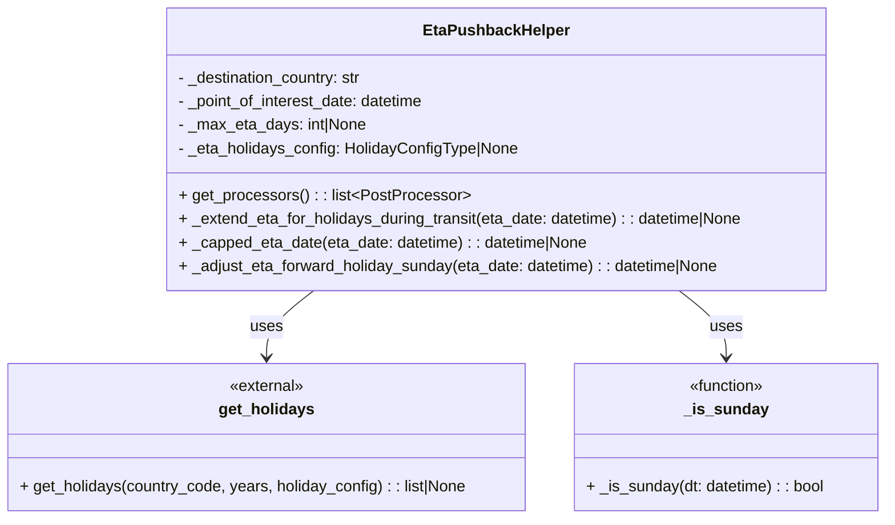
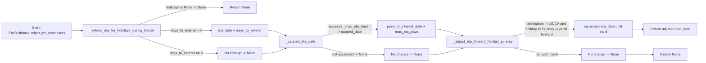

# Diagram: shipment_core/shipment_service/shipment_service/eta/eta_proxy/post_processing/eta_holidays_pushback.py

> Auto-generated by Obscura crawlers

## Diagram 1

### SVG

<svg id="container" width="905.7421875" xmlns="http://www.w3.org/2000/svg" class="classDiagram" height="528" viewBox="0 0 905.7421875 528" role="graphics-document document" aria-roledescription="class"><g><defs><marker id="container_class-aggregationStart" class="marker aggregation class" refX="18" refY="7" markerWidth="190" markerHeight="240" orient="auto"><path d="M 18,7 L9,13 L1,7 L9,1 Z"></path></marker></defs><defs><marker id="container_class-aggregationEnd" class="marker aggregation class" refX="1" refY="7" markerWidth="20" markerHeight="28" orient="auto"><path d="M 18,7 L9,13 L1,7 L9,1 Z"></path></marker></defs><defs><marker id="container_class-extensionStart" class="marker extension class" refX="18" refY="7" markerWidth="190" markerHeight="240" orient="auto"><path d="M 1,7 L18,13 V 1 Z"></path></marker></defs><defs><marker id="container_class-extensionEnd" class="marker extension class" refX="1" refY="7" markerWidth="20" markerHeight="28" orient="auto"><path d="M 1,1 V 13 L18,7 Z"></path></marker></defs><defs><marker id="container_class-compositionStart" class="marker composition class" refX="18" refY="7" markerWidth="190" markerHeight="240" orient="auto"><path d="M 18,7 L9,13 L1,7 L9,1 Z"></path></marker></defs><defs><marker id="container_class-compositionEnd" class="marker composition class" refX="1" refY="7" markerWidth="20" markerHeight="28" orient="auto"><path d="M 18,7 L9,13 L1,7 L9,1 Z"></path></marker></defs><defs><marker id="container_class-dependencyStart" class="marker dependency class" refX="6" refY="7" markerWidth="190" markerHeight="240" orient="auto"><path d="M 5,7 L9,13 L1,7 L9,1 Z"></path></marker></defs><defs><marker id="container_class-dependencyEnd" class="marker dependency class" refX="13" refY="7" markerWidth="20" markerHeight="28" orient="auto"><path d="M 18,7 L9,13 L14,7 L9,1 Z"></path></marker></defs><defs><marker id="container_class-lollipopStart" class="marker lollipop class" refX="13" refY="7" markerWidth="190" markerHeight="240" orient="auto"><circle stroke="black" fill="transparent" cx="7" cy="7" r="6"></circle></marker></defs><defs><marker id="container_class-lollipopEnd" class="marker lollipop class" refX="1" refY="7" markerWidth="190" markerHeight="240" orient="auto"><circle stroke="black" fill="transparent" cx="7" cy="7" r="6"></circle></marker></defs><g class="root"><g class="clusters"></g><g class="edgePaths"><path d="M321.131,296L313.127,302.167C305.122,308.333,289.114,320.667,281.11,332C273.105,343.333,273.105,353.667,273.105,358.833L273.105,364" id="id_EtaPushbackHelper_get_holidays_1" class="edge-thickness-normal edge-pattern-solid relation" style=";;;" data-edge="true" data-et="edge" data-id="id_EtaPushbackHelper_get_holidays_1" data-points="W3sieCI6MzIxLjEzMDk2NzI4MjQ1ODUsInkiOjI5Nn0seyJ4IjoyNzMuMTA1NDY4NzUsInkiOjMzM30seyJ4IjoyNzMuMTA1NDY4NzUsInkiOjM3MH1d" marker-end="url(#container_class-dependencyEnd)"></path><path d="M694.951,296L702.955,302.167C710.96,308.333,726.968,320.667,734.972,332C742.977,343.333,742.977,353.667,742.977,358.833L742.977,364" id="id_EtaPushbackHelper__is_sunday_2" class="edge-thickness-normal edge-pattern-solid relation" style=";;;" data-edge="true" data-et="edge" data-id="id_EtaPushbackHelper__is_sunday_2" data-points="W3sieCI6Njk0Ljk1MTA2Mzk2NzU0MTUsInkiOjI5Nn0seyJ4Ijo3NDIuOTc2NTYyNSwieSI6MzMzfSx7IngiOjc0Mi45NzY1NjI1LCJ5IjozNzB9XQ==" marker-end="url(#container_class-dependencyEnd)"></path></g><g class="edgeLabels"><g class="edgeLabel" transform="translate(273.10546875, 333)"><g class="label" data-id="id_EtaPushbackHelper_get_holidays_1" transform="translate(-16.4921875, -12)"><foreignObject width="32.984375" height="24">

uses

</foreignObject></g></g><g class="edgeLabel" transform="translate(742.9765625, 333)"><g class="label" data-id="id_EtaPushbackHelper__is_sunday_2" transform="translate(-16.4921875, -12)"><foreignObject width="32.984375" height="24">

uses

</foreignObject></g></g></g><g class="nodes"><g class="node default" id="classId-EtaPushbackHelper-0" transform="translate(508.041015625, 152)"><g class="basic label-container"><path d="M-340.375 -144 L340.375 -144 L340.375 144 L-340.375 144" stroke="none" stroke-width="0" fill="#ECECFF" style=""></path><path d="M-340.375 -144 C-130.53461668295088 -144, 79.30576663409823 -144, 340.375 -144 M-340.375 -144 C-137.8714658218257 -144, 64.63206835634861 -144, 340.375 -144 M340.375 -144 C340.375 -86.39841169784759, 340.375 -28.7968233956952, 340.375 144 M340.375 -144 C340.375 -76.86381180301177, 340.375 -9.727623606023542, 340.375 144 M340.375 144 C192.27621260556097 144, 44.17742521112194 144, -340.375 144 M340.375 144 C135.77709674183387 144, -68.82080651633225 144, -340.375 144 M-340.375 144 C-340.375 42.09022042373519, -340.375 -59.81955915252962, -340.375 -144 M-340.375 144 C-340.375 81.7789910538157, -340.375 19.557982107631418, -340.375 -144" stroke="#9370DB" stroke-width="1.3" fill="none" stroke-dasharray="0 0" style=""></path></g><g class="annotation-group text" transform="translate(0, -120)"></g><g class="label-group text" transform="translate(-70.9375, -120)"><g class="label" style="font-weight: bolder" transform="translate(0,-12)"><foreignObject width="141.875" height="24">

EtaPushbackHelper

</foreignObject></g></g><g class="members-group text" transform="translate(-328.375, -72)"><g class="label" style="" transform="translate(0,-12)"><foreignObject width="192.578125" height="24">

- _destination_country: str

</foreignObject></g><g class="label" style="" transform="translate(0,12)"><foreignObject width="257.734375" height="24">

- _point_of_interest_date: datetime

</foreignObject></g><g class="label" style="" transform="translate(0,36)"><foreignObject width="194.109375" height="24">

- _max_eta_days: int|None

</foreignObject></g><g class="label" style="" transform="translate(0,60)"><foreignObject width="349.375" height="24">

- _eta_holidays_config: HolidayConfigType|None

</foreignObject></g></g><g class="methods-group text" transform="translate(-328.375, 48)"><g class="label" style="" transform="translate(0,-12)"><foreignObject width="292.234375" height="24">

+ get_processors() : : list&lt;PostProcessor&gt;

</foreignObject></g><g class="label" style="" transform="translate(0,12)"><foreignObject width="585.8125" height="24">

+ _extend_eta_for_holidays_during_transit(eta_date: datetime) : : datetime|None

</foreignObject></g><g class="label" style="" transform="translate(0,36)"><foreignObject width="423.109375" height="24">

+ _capped_eta_date(eta_date: datetime) : : datetime|None

</foreignObject></g><g class="label" style="" transform="translate(0,60)"><foreignObject width="560.421875" height="24">

+ _adjust_eta_forward_holiday_sunday(eta_date: datetime) : : datetime|None

</foreignObject></g></g><g class="divider" style=""><path d="M-340.375 -96 C-142.18408095698152 -96, 56.006838086036964 -96, 340.375 -96 M-340.375 -96 C-139.51030692796184 -96, 61.35438614407633 -96, 340.375 -96" stroke="#9370DB" stroke-width="1.3" fill="none" stroke-dasharray="0 0" style=""></path></g><g class="divider" style=""><path d="M-340.375 24 C-94.64142394942087 24, 151.09215210115826 24, 340.375 24 M-340.375 24 C-77.61686007289143 24, 185.14127985421715 24, 340.375 24" stroke="#9370DB" stroke-width="1.3" fill="none" stroke-dasharray="0 0" style=""></path></g></g><g class="node default" id="classId-get_holidays-1" transform="translate(273.10546875, 445)"><g class="basic label-container"><path d="M-265.10546875 -75 L265.10546875 -75 L265.10546875 75 L-265.10546875 75" stroke="none" stroke-width="0" fill="#ECECFF" style=""></path><path d="M-265.10546875 -75 C-65.31096457211473 -75, 134.48353960577055 -75, 265.10546875 -75 M-265.10546875 -75 C-105.16824507773069 -75, 54.76897859453862 -75, 265.10546875 -75 M265.10546875 -75 C265.10546875 -38.56159290992893, 265.10546875 -2.1231858198578664, 265.10546875 75 M265.10546875 -75 C265.10546875 -22.345947630321355, 265.10546875 30.30810473935729, 265.10546875 75 M265.10546875 75 C110.31798998563534 75, -44.46948877872933 75, -265.10546875 75 M265.10546875 75 C149.05031322183652 75, 32.995157693673065 75, -265.10546875 75 M-265.10546875 75 C-265.10546875 38.61389338670575, -265.10546875 2.227786773411495, -265.10546875 -75 M-265.10546875 75 C-265.10546875 32.57512699434248, -265.10546875 -9.849746011315034, -265.10546875 -75" stroke="#9370DB" stroke-width="1.3" fill="none" stroke-dasharray="0 0" style=""></path></g><g class="annotation-group text" transform="translate(-38.65625, -51)"><g class="label" style="" transform="translate(0,-12)"><foreignObject width="77.3125" height="24">

«external»

</foreignObject></g></g><g class="label-group text" transform="translate(-46.8203125, -27)"><g class="label" style="font-weight: bolder" transform="translate(0,-12)"><foreignObject width="93.640625" height="24">

get_holidays

</foreignObject></g></g><g class="members-group text" transform="translate(-253.10546875, 21)"></g><g class="methods-group text" transform="translate(-253.10546875, 51)"><g class="label" style="" transform="translate(0,-12)"><foreignObject width="459.390625" height="24">

+ get_holidays(country_code, years, holiday_config) : : list|None

</foreignObject></g></g><g class="divider" style=""><path d="M-265.10546875 -3 C-77.11117466376942 -3, 110.88311942246116 -3, 265.10546875 -3 M-265.10546875 -3 C-109.27245121052226 -3, 46.560566328955474 -3, 265.10546875 -3" stroke="#9370DB" stroke-width="1.3" fill="none" stroke-dasharray="0 0" style=""></path></g><g class="divider" style=""><path d="M-265.10546875 21 C-127.84100288117651 21, 9.423462987646985 21, 265.10546875 21 M-265.10546875 21 C-140.8555722166216 21, -16.60567568324319 21, 265.10546875 21" stroke="#9370DB" stroke-width="1.3" fill="none" stroke-dasharray="0 0" style=""></path></g></g><g class="node default" id="classId-_is_sunday-2" transform="translate(742.9765625, 445)"><g class="basic label-container"><path d="M-154.765625 -75 L154.765625 -75 L154.765625 75 L-154.765625 75" stroke="none" stroke-width="0" fill="#ECECFF" style=""></path><path d="M-154.765625 -75 C-31.91723679423191 -75, 90.93115141153618 -75, 154.765625 -75 M-154.765625 -75 C-33.1411899383604 -75, 88.4832451232792 -75, 154.765625 -75 M154.765625 -75 C154.765625 -16.100776385464926, 154.765625 42.79844722907015, 154.765625 75 M154.765625 -75 C154.765625 -20.017574059542845, 154.765625 34.96485188091431, 154.765625 75 M154.765625 75 C75.17208438189819 75, -4.421456236203625 75, -154.765625 75 M154.765625 75 C45.108370497755544 75, -64.54888400448891 75, -154.765625 75 M-154.765625 75 C-154.765625 29.701264983216134, -154.765625 -15.597470033567731, -154.765625 -75 M-154.765625 75 C-154.765625 24.099469081979798, -154.765625 -26.801061836040404, -154.765625 -75" stroke="#9370DB" stroke-width="1.3" fill="none" stroke-dasharray="0 0" style=""></path></g><g class="annotation-group text" transform="translate(-39.484375, -51)"><g class="label" style="" transform="translate(0,-12)"><foreignObject width="78.96875" height="24">

«function»

</foreignObject></g></g><g class="label-group text" transform="translate(-40.546875, -27)"><g class="label" style="font-weight: bolder" transform="translate(0,-12)"><foreignObject width="81.09375" height="24">

_is_sunday

</foreignObject></g></g><g class="members-group text" transform="translate(-142.765625, 21)"></g><g class="methods-group text" transform="translate(-142.765625, 51)"><g class="label" style="" transform="translate(0,-12)"><foreignObject width="244.984375" height="24">

+ _is_sunday(dt: datetime) : : bool

</foreignObject></g></g><g class="divider" style=""><path d="M-154.765625 -3 C-60.377523458149625 -3, 34.01057808370075 -3, 154.765625 -3 M-154.765625 -3 C-84.32575431724732 -3, -13.885883634494633 -3, 154.765625 -3" stroke="#9370DB" stroke-width="1.3" fill="none" stroke-dasharray="0 0" style=""></path></g><g class="divider" style=""><path d="M-154.765625 21 C-89.95240015721139 21, -25.139175314422772 21, 154.765625 21 M-154.765625 21 C-61.96485248602761 21, 30.83592002794478 21, 154.765625 21" stroke="#9370DB" stroke-width="1.3" fill="none" stroke-dasharray="0 0" style=""></path></g></g></g></g></g></svg>

## Diagram 2

### SVG

<svg id="container" width="3155.765625" xmlns="http://www.w3.org/2000/svg" class="flowchart" height="284" viewBox="0 0 3155.765625 284" role="graphics-document document" aria-roledescription="flowchart-v2"><g><marker id="container_flowchart-v2-pointEnd" class="marker flowchart-v2" viewBox="0 0 10 10" refX="5" refY="5" markerUnits="userSpaceOnUse" markerWidth="8" markerHeight="8" orient="auto"><path d="M 0 0 L 10 5 L 0 10 z" class="arrowMarkerPath" style="stroke-width: 1; stroke-dasharray: 1, 0;"></path></marker><marker id="container_flowchart-v2-pointStart" class="marker flowchart-v2" viewBox="0 0 10 10" refX="4.5" refY="5" markerUnits="userSpaceOnUse" markerWidth="8" markerHeight="8" orient="auto"><path d="M 0 5 L 10 10 L 10 0 z" class="arrowMarkerPath" style="stroke-width: 1; stroke-dasharray: 1, 0;"></path></marker><marker id="container_flowchart-v2-circleEnd" class="marker flowchart-v2" viewBox="0 0 10 10" refX="11" refY="5" markerUnits="userSpaceOnUse" markerWidth="11" markerHeight="11" orient="auto"><circle cx="5" cy="5" r="5" class="arrowMarkerPath" style="stroke-width: 1; stroke-dasharray: 1, 0;"></circle></marker><marker id="container_flowchart-v2-circleStart" class="marker flowchart-v2" viewBox="0 0 10 10" refX="-1" refY="5" markerUnits="userSpaceOnUse" markerWidth="11" markerHeight="11" orient="auto"><circle cx="5" cy="5" r="5" class="arrowMarkerPath" style="stroke-width: 1; stroke-dasharray: 1, 0;"></circle></marker><marker id="container_flowchart-v2-crossEnd" class="marker cross flowchart-v2" viewBox="0 0 11 11" refX="12" refY="5.2" markerUnits="userSpaceOnUse" markerWidth="11" markerHeight="11" orient="auto"><path d="M 1,1 l 9,9 M 10,1 l -9,9" class="arrowMarkerPath" style="stroke-width: 2; stroke-dasharray: 1, 0;"></path></marker><marker id="container_flowchart-v2-crossStart" class="marker cross flowchart-v2" viewBox="0 0 11 11" refX="-1" refY="5.2" markerUnits="userSpaceOnUse" markerWidth="11" markerHeight="11" orient="auto"><path d="M 1,1 l 9,9 M 10,1 l -9,9" class="arrowMarkerPath" style="stroke-width: 2; stroke-dasharray: 1, 0;"></path></marker><g class="root"><g class="clusters"></g><g class="edgePaths"><path d="M319.719,139L323.885,139C328.052,139,336.385,139,344.052,139C351.719,139,358.719,139,362.219,139L365.719,139" id="L_A_B_0" class="edge-thickness-normal edge-pattern-solid edge-thickness-normal edge-pattern-solid flowchart-link" style=";" data-edge="true" data-et="edge" data-id="L_A_B_0" data-points="W3sieCI6MzE5LjcxODc1LCJ5IjoxMzl9LHsieCI6MzQ0LjcxODc1LCJ5IjoxMzl9LHsieCI6MzY5LjcxODc1LCJ5IjoxMzl9XQ==" marker-end="url(#container_flowchart-v2-pointEnd)"></path><path d="M623.838,112L660.063,99.167C696.288,86.333,768.738,60.667,832.047,47.833C895.357,35,949.526,35,976.611,35L1003.695,35" id="L_B_End1_0" class="edge-thickness-normal edge-pattern-solid edge-thickness-normal edge-pattern-solid flowchart-link" style=";" data-edge="true" data-et="edge" data-id="L_B_End1_0" data-points="W3sieCI6NjIzLjgzODM0MTM0NjE1MzgsInkiOjExMn0seyJ4Ijo4NDEuMTg3NSwieSI6MzV9LHsieCI6MTAwNy42OTUzMTI1LCJ5IjozNX1d" marker-end="url(#container_flowchart-v2-pointEnd)"></path><path d="M725.531,139L744.807,139C764.083,139,802.635,139,840.521,139C878.406,139,915.625,139,934.234,139L952.844,139" id="L_B_B1_0" class="edge-thickness-normal edge-pattern-solid edge-thickness-normal edge-pattern-solid flowchart-link" style=";" data-edge="true" data-et="edge" data-id="L_B_B1_0" data-points="W3sieCI6NzI1LjUzMTI1LCJ5IjoxMzl9LHsieCI6ODQxLjE4NzUsInkiOjEzOX0seyJ4Ijo5NTYuODQzNzUsInkiOjEzOX1d" marker-end="url(#container_flowchart-v2-pointEnd)"></path><path d="M623.838,166L660.063,178.833C696.288,191.667,768.738,217.333,828.191,230.167C887.643,243,934.099,243,957.327,243L980.555,243" id="L_B_B2_0" class="edge-thickness-normal edge-pattern-solid edge-thickness-normal edge-pattern-solid flowchart-link" style=";" data-edge="true" data-et="edge" data-id="L_B_B2_0" data-points="W3sieCI6NjIzLjgzODM0MTM0NjE1MzgsInkiOjE2Nn0seyJ4Ijo4NDEuMTg3NSwieSI6MjQzfSx7IngiOjk4NC41NTQ2ODc1LCJ5IjoyNDN9XQ==" marker-end="url(#container_flowchart-v2-pointEnd)"></path><path d="M1209.969,139L1214.135,139C1218.302,139,1226.635,139,1239.929,142.904C1253.223,146.809,1271.477,154.618,1280.604,158.522L1289.731,162.427" id="L_B1_C_0" class="edge-thickness-normal edge-pattern-solid edge-thickness-normal edge-pattern-solid flowchart-link" style=";" data-edge="true" data-et="edge" data-id="L_B1_C_0" data-points="W3sieCI6MTIwOS45Njg3NSwieSI6MTM5fSx7IngiOjEyMzQuOTY4NzUsInkiOjEzOX0seyJ4IjoxMjkzLjQwODUwMzYwNTc2OTMsInkiOjE2NH1d" marker-end="url(#container_flowchart-v2-pointEnd)"></path><path d="M1182.258,243L1191.043,243C1199.828,243,1217.398,243,1235.311,239.096C1253.223,235.191,1271.477,227.382,1280.604,223.478L1289.731,219.573" id="L_B2_C_0" class="edge-thickness-normal edge-pattern-solid edge-thickness-normal edge-pattern-solid flowchart-link" style=";" data-edge="true" data-et="edge" data-id="L_B2_C_0" data-points="W3sieCI6MTE4Mi4yNTc4MTI1LCJ5IjoyNDN9LHsieCI6MTIzNC45Njg3NSwieSI6MjQzfSx7IngiOjEyOTMuNDA4NTAzNjA1NzY5MywieSI6MjE4fV0=" marker-end="url(#container_flowchart-v2-pointEnd)"></path><path d="M1453.078,165.723L1473.911,160.269C1494.745,154.816,1536.411,143.908,1577.411,138.454C1618.411,133,1658.745,133,1678.911,133L1699.078,133" id="L_C_C1_0" class="edge-thickness-normal edge-pattern-solid edge-thickness-normal edge-pattern-solid flowchart-link" style=";" data-edge="true" data-et="edge" data-id="L_C_C1_0" data-points="W3sieCI6MTQ1My4wNzgxMjUsInkiOjE2NS43MjMyOTc3MTg1MzczfSx7IngiOjE1NzguMDc4MTI1LCJ5IjoxMzN9LHsieCI6MTcwMy4wNzgxMjUsInkiOjEzM31d" marker-end="url(#container_flowchart-v2-pointEnd)"></path><path d="M1453.078,216.277L1473.911,221.731C1494.745,227.184,1536.411,238.092,1582.603,243.546C1628.794,249,1679.51,249,1704.868,249L1730.227,249" id="L_C_C2_0" class="edge-thickness-normal edge-pattern-solid edge-thickness-normal edge-pattern-solid flowchart-link" style=";" data-edge="true" data-et="edge" data-id="L_C_C2_0" data-points="W3sieCI6MTQ1My4wNzgxMjUsInkiOjIxNi4yNzY3MDIyODE0NjI3fSx7IngiOjE1NzguMDc4MTI1LCJ5IjoyNDl9LHsieCI6MTczNC4yMjY1NjI1LCJ5IjoyNDl9XQ==" marker-end="url(#container_flowchart-v2-pointEnd)"></path><path d="M1963.078,133L1967.245,133C1971.411,133,1979.745,133,2000.218,137.972C2020.691,142.944,2053.304,152.889,2069.61,157.861L2085.917,162.833" id="L_C1_D_0" class="edge-thickness-normal edge-pattern-solid edge-thickness-normal edge-pattern-solid flowchart-link" style=";" data-edge="true" data-et="edge" data-id="L_C1_D_0" data-points="W3sieCI6MTk2My4wNzgxMjUsInkiOjEzM30seyJ4IjoxOTg4LjA3ODEyNSwieSI6MTMzfSx7IngiOjIwODkuNzQyNTkxNTk0ODI3NCwieSI6MTY0fV0=" marker-end="url(#container_flowchart-v2-pointEnd)"></path><path d="M1931.93,249L1941.288,249C1950.646,249,1969.362,249,1995.026,244.028C2020.691,239.056,2053.304,229.111,2069.61,224.139L2085.917,219.167" id="L_C2_D_0" class="edge-thickness-normal edge-pattern-solid edge-thickness-normal edge-pattern-solid flowchart-link" style=";" data-edge="true" data-et="edge" data-id="L_C2_D_0" data-points="W3sieCI6MTkzMS45Mjk2ODc1LCJ5IjoyNDl9LHsieCI6MTk4OC4wNzgxMjUsInkiOjI0OX0seyJ4IjoyMDg5Ljc0MjU5MTU5NDgyNzQsInkiOjIxOH1d" marker-end="url(#container_flowchart-v2-pointEnd)"></path><path d="M2313.387,164L2339.239,158.833C2365.092,153.667,2416.796,143.333,2462.815,138.167C2508.833,133,2549.167,133,2569.333,133L2589.5,133" id="L_D_D1_0" class="edge-thickness-normal edge-pattern-solid edge-thickness-normal edge-pattern-solid flowchart-link" style=";" data-edge="true" data-et="edge" data-id="L_D_D1_0" data-points="W3sieCI6MjMxMy4zODcyNTc1NDMxMDMzLCJ5IjoxNjR9LHsieCI6MjQ2OC41LCJ5IjoxMzN9LHsieCI6MjU5My41LCJ5IjoxMzN9XQ==" marker-end="url(#container_flowchart-v2-pointEnd)"></path><path d="M2313.387,218L2339.239,223.167C2365.092,228.333,2416.796,238.667,2468.006,243.833C2519.216,249,2569.932,249,2595.29,249L2620.648,249" id="L_D_D2_0" class="edge-thickness-normal edge-pattern-solid edge-thickness-normal edge-pattern-solid flowchart-link" style=";" data-edge="true" data-et="edge" data-id="L_D_D2_0" data-points="W3sieCI6MjMxMy4zODcyNTc1NDMxMDMzLCJ5IjoyMTh9LHsieCI6MjQ2OC41LCJ5IjoyNDl9LHsieCI6MjYyNC42NDg0Mzc1LCJ5IjoyNDl9XQ==" marker-end="url(#container_flowchart-v2-pointEnd)"></path><path d="M2853.5,133L2857.667,133C2861.833,133,2870.167,133,2877.833,133C2885.5,133,2892.5,133,2896,133L2899.5,133" id="L_D1_End2_0" class="edge-thickness-normal edge-pattern-solid edge-thickness-normal edge-pattern-solid flowchart-link" style=";" data-edge="true" data-et="edge" data-id="L_D1_End2_0" data-points="W3sieCI6Mjg1My41LCJ5IjoxMzN9LHsieCI6Mjg3OC41LCJ5IjoxMzN9LHsieCI6MjkwMy41LCJ5IjoxMzN9XQ==" marker-end="url(#container_flowchart-v2-pointEnd)"></path><path d="M2822.352,249L2831.71,249C2841.068,249,2859.784,249,2880.379,249C2900.974,249,2923.448,249,2934.685,249L2945.922,249" id="L_D2_End3_0" class="edge-thickness-normal edge-pattern-solid edge-thickness-normal edge-pattern-solid flowchart-link" style=";" data-edge="true" data-et="edge" data-id="L_D2_End3_0" data-points="W3sieCI6MjgyMi4zNTE1NjI1LCJ5IjoyNDl9LHsieCI6Mjg3OC41LCJ5IjoyNDl9LHsieCI6Mjk0OS45MjE4NzUsInkiOjI0OX1d" marker-end="url(#container_flowchart-v2-pointEnd)"></path></g><g class="edgeLabels"><g class="edgeLabel"><g class="label" data-id="L_A_B_0" transform="translate(0, 0)"><foreignObject width="0" height="0">

</foreignObject></g></g><g class="edgeLabel" transform="translate(841.1875, 35)"><g class="label" data-id="L_B_End1_0" transform="translate(-90.65625, -12)"><foreignObject width="181.3125" height="24">

holidays is None -&gt; None

</foreignObject></g></g><g class="edgeLabel" transform="translate(841.1875, 139)"><g class="label" data-id="L_B_B1_0" transform="translate(-69.2265625, -12)"><foreignObject width="138.453125" height="24">

days_to_extend &gt; 0

</foreignObject></g></g><g class="edgeLabel" transform="translate(841.1875, 243)"><g class="label" data-id="L_B_B2_0" transform="translate(-73.2265625, -12)"><foreignObject width="146.453125" height="24">

days_to_extend == 0

</foreignObject></g></g><g class="edgeLabel"><g class="label" data-id="L_B1_C_0" transform="translate(0, 0)"><foreignObject width="0" height="0">

</foreignObject></g></g><g class="edgeLabel"><g class="label" data-id="L_B2_C_0" transform="translate(0, 0)"><foreignObject width="0" height="0">

</foreignObject></g></g><g class="edgeLabel" transform="translate(1578.078125, 133)"><g class="label" data-id="L_C_C1_0" transform="translate(-100, -24)"><foreignObject width="200" height="48">

exceeds _max_eta_days -&gt; capped_date

</foreignObject></g></g><g class="edgeLabel" transform="translate(1578.078125, 249)"><g class="label" data-id="L_C_C2_0" transform="translate(-79.4296875, -12)"><foreignObject width="158.859375" height="24">

not exceeded -&gt; None

</foreignObject></g></g><g class="edgeLabel"><g class="label" data-id="L_C1_D_0" transform="translate(0, 0)"><foreignObject width="0" height="0">

</foreignObject></g></g><g class="edgeLabel"><g class="label" data-id="L_C2_D_0" transform="translate(0, 0)"><foreignObject width="0" height="0">

</foreignObject></g></g><g class="edgeLabel" transform="translate(2468.5, 133)"><g class="label" data-id="L_D_D1_0" transform="translate(-100, -36)"><foreignObject width="200" height="72">

destination in US/CA and holiday or Sunday -&gt; push forward

</foreignObject></g></g><g class="edgeLabel" transform="translate(2468.5, 249)"><g class="label" data-id="L_D_D2_0" transform="translate(-50.421875, -12)"><foreignObject width="100.84375" height="24">

no push_back

</foreignObject></g></g><g class="edgeLabel"><g class="label" data-id="L_D1_End2_0" transform="translate(0, 0)"><foreignObject width="0" height="0">

</foreignObject></g></g><g class="edgeLabel"><g class="label" data-id="L_D2_End3_0" transform="translate(0, 0)"><foreignObject width="0" height="0">

</foreignObject></g></g></g><g class="nodes"><g class="node default" id="flowchart-A-0" transform="translate(163.859375, 139)"><rect class="basic label-container" style="" x="-155.859375" y="-39" width="311.71875" height="78"></rect><g class="label" style="" transform="translate(-125.859375, -24)"><rect></rect><foreignObject width="251.71875" height="48">

Start: EtaPushbackHelper.get_processors

</foreignObject></g></g><g class="node default" id="flowchart-B-1" transform="translate(547.625, 139)"><rect class="basic label-container" style="" x="-177.90625" y="-27" width="355.8125" height="54"></rect><g class="label" style="" transform="translate(-147.90625, -12)"><rect></rect><foreignObject width="295.8125" height="24">

_extend_eta_for_holidays_during_transit

</foreignObject></g></g><g class="node default" id="flowchart-End1-3" transform="translate(1083.40625, 35)"><rect class="basic label-container" style="" x="-75.7109375" y="-27" width="151.421875" height="54"></rect><g class="label" style="" transform="translate(-45.7109375, -12)"><rect></rect><foreignObject width="91.421875" height="24">

Return None

</foreignObject></g></g><g class="node default" id="flowchart-B1-5" transform="translate(1083.40625, 139)"><rect class="basic label-container" style="" x="-126.5625" y="-27" width="253.125" height="54"></rect><g class="label" style="" transform="translate(-96.5625, -12)"><rect></rect><foreignObject width="193.125" height="24">

eta_date + days_to_extend

</foreignObject></g></g><g class="node default" id="flowchart-B2-7" transform="translate(1083.40625, 243)"><rect class="basic label-container" style="" x="-98.8515625" y="-27" width="197.703125" height="54"></rect><g class="label" style="" transform="translate(-68.8515625, -12)"><rect></rect><foreignObject width="137.703125" height="24">

No change -&gt; None

</foreignObject></g></g><g class="node default" id="flowchart-C-9" transform="translate(1356.5234375, 191)"><rect class="basic label-container" style="" x="-96.5546875" y="-27" width="193.109375" height="54"></rect><g class="label" style="" transform="translate(-66.5546875, -12)"><rect></rect><foreignObject width="133.109375" height="24">

_capped_eta_date

</foreignObject></g></g><g class="node default" id="flowchart-C1-13" transform="translate(1833.078125, 133)"><rect class="basic label-container" style="" x="-130" y="-39" width="260" height="78"></rect><g class="label" style="" transform="translate(-100, -24)"><rect></rect><foreignObject width="200" height="48">

point_of_interest_date + max_eta_days

</foreignObject></g></g><g class="node default" id="flowchart-C2-15" transform="translate(1833.078125, 249)"><rect class="basic label-container" style="" x="-98.8515625" y="-27" width="197.703125" height="54"></rect><g class="label" style="" transform="translate(-68.8515625, -12)"><rect></rect><foreignObject width="137.703125" height="24">

No change -&gt; None

</foreignObject></g></g><g class="node default" id="flowchart-D-17" transform="translate(2178.2890625, 191)"><rect class="basic label-container" style="" x="-165.2109375" y="-27" width="330.421875" height="54"></rect><g class="label" style="" transform="translate(-135.2109375, -12)"><rect></rect><foreignObject width="270.421875" height="24">

_adjust_eta_forward_holiday_sunday

</foreignObject></g></g><g class="node default" id="flowchart-D1-21" transform="translate(2723.5, 133)"><rect class="basic label-container" style="" x="-130" y="-39" width="260" height="78"></rect><g class="label" style="" transform="translate(-100, -24)"><rect></rect><foreignObject width="200" height="48">

increment eta_date until valid

</foreignObject></g></g><g class="node default" id="flowchart-D2-23" transform="translate(2723.5, 249)"><rect class="basic label-container" style="" x="-98.8515625" y="-27" width="197.703125" height="54"></rect><g class="label" style="" transform="translate(-68.8515625, -12)"><rect></rect><foreignObject width="137.703125" height="24">

No change -&gt; None

</foreignObject></g></g><g class="node default" id="flowchart-End2-25" transform="translate(3025.6328125, 133)"><rect class="basic label-container" style="" x="-122.1328125" y="-27" width="244.265625" height="54"></rect><g class="label" style="" transform="translate(-92.1328125, -12)"><rect></rect><foreignObject width="184.265625" height="24">

Return adjusted eta_date

</foreignObject></g></g><g class="node default" id="flowchart-End3-27" transform="translate(3025.6328125, 249)"><rect class="basic label-container" style="" x="-75.7109375" y="-27" width="151.421875" height="54"></rect><g class="label" style="" transform="translate(-45.7109375, -12)"><rect></rect><foreignObject width="91.421875" height="24">

Return None

</foreignObject></g></g></g></g></g></svg>
