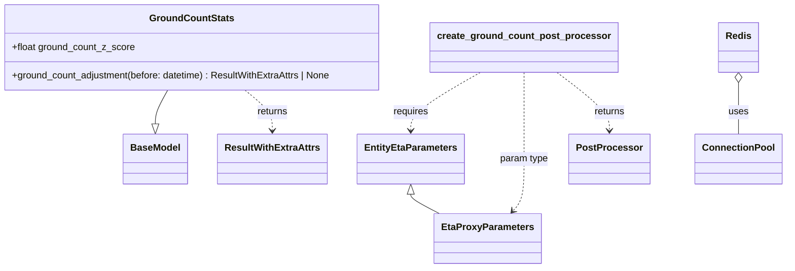

# Diagram: shipment_core/shipment_service/shipment_service/eta/eta_proxy/post_processing/ground_count.py


> Auto-generated by Obscura crawlers

## Diagram 1



### SVG

<svg id="container" width="1299.90234375" xmlns="http://www.w3.org/2000/svg" class="classDiagram" height="452" viewBox="0 0 1299.90234375 452" role="graphics-document document" aria-roledescription="class"><style>#container{font-family:"trebuchet ms",verdana,arial,sans-serif;font-size:16px;fill:#333;}@keyframes edge-animation-frame{from{stroke-dashoffset:0;}}@keyframes dash{to{stroke-dashoffset:0;}}#container .edge-animation-slow{stroke-dasharray:9,5!important;stroke-dashoffset:900;animation:dash 50s linear infinite;stroke-linecap:round;}#container .edge-animation-fast{stroke-dasharray:9,5!important;stroke-dashoffset:900;animation:dash 20s linear infinite;stroke-linecap:round;}#container .error-icon{fill:#552222;}#container .error-text{fill:#552222;stroke:#552222;}#container .edge-thickness-normal{stroke-width:1px;}#container .edge-thickness-thick{stroke-width:3.5px;}#container .edge-pattern-solid{stroke-dasharray:0;}#container .edge-thickness-invisible{stroke-width:0;fill:none;}#container .edge-pattern-dashed{stroke-dasharray:3;}#container .edge-pattern-dotted{stroke-dasharray:2;}#container .marker{fill:#333333;stroke:#333333;}#container .marker.cross{stroke:#333333;}#container svg{font-family:"trebuchet ms",verdana,arial,sans-serif;font-size:16px;}#container p{margin:0;}#container g.classGroup text{fill:#9370DB;stroke:none;font-family:"trebuchet ms",verdana,arial,sans-serif;font-size:10px;}#container g.classGroup text .title{font-weight:bolder;}#container .nodeLabel,#container .edgeLabel{color:#131300;}#container .edgeLabel .label rect{fill:#ECECFF;}#container .label text{fill:#131300;}#container .labelBkg{background:#ECECFF;}#container .edgeLabel .label span{background:#ECECFF;}#container .classTitle{font-weight:bolder;}#container .node rect,#container .node circle,#container .node ellipse,#container .node polygon,#container .node path{fill:#ECECFF;stroke:#9370DB;stroke-width:1px;}#container .divider{stroke:#9370DB;stroke-width:1;}#container g.clickable{cursor:pointer;}#container g.classGroup rect{fill:#ECECFF;stroke:#9370DB;}#container g.classGroup line{stroke:#9370DB;stroke-width:1;}#container .classLabel .box{stroke:none;stroke-width:0;fill:#ECECFF;opacity:0.5;}#container .classLabel .label{fill:#9370DB;font-size:10px;}#container .relation{stroke:#333333;stroke-width:1;fill:none;}#container .dashed-line{stroke-dasharray:3;}#container .dotted-line{stroke-dasharray:1 2;}#container #compositionStart,#container .composition{fill:#333333!important;stroke:#333333!important;stroke-width:1;}#container #compositionEnd,#container .composition{fill:#333333!important;stroke:#333333!important;stroke-width:1;}#container #dependencyStart,#container .dependency{fill:#333333!important;stroke:#333333!important;stroke-width:1;}#container #dependencyStart,#container .dependency{fill:#333333!important;stroke:#333333!important;stroke-width:1;}#container #extensionStart,#container .extension{fill:transparent!important;stroke:#333333!important;stroke-width:1;}#container #extensionEnd,#container .extension{fill:transparent!important;stroke:#333333!important;stroke-width:1;}#container #aggregationStart,#container .aggregation{fill:transparent!important;stroke:#333333!important;stroke-width:1;}#container #aggregationEnd,#container .aggregation{fill:transparent!important;stroke:#333333!important;stroke-width:1;}#container #lollipopStart,#container .lollipop{fill:#ECECFF!important;stroke:#333333!important;stroke-width:1;}#container #lollipopEnd,#container .lollipop{fill:#ECECFF!important;stroke:#333333!important;stroke-width:1;}#container .edgeTerminals{font-size:11px;line-height:initial;}#container .classTitleText{text-anchor:middle;font-size:18px;fill:#333;}#container .label-icon{display:inline-block;height:1em;overflow:visible;vertical-align:-0.125em;}#container .node .label-icon path{fill:currentColor;stroke:revert;stroke-width:revert;}#container :root{--mermaid-font-family:"trebuchet ms",verdana,arial,sans-serif;}</style><g><defs><marker id="container_class-aggregationStart" class="marker aggregation class" refX="18" refY="7" markerWidth="190" markerHeight="240" orient="auto"><path d="M 18,7 L9,13 L1,7 L9,1 Z"></path></marker></defs><defs><marker id="container_class-aggregationEnd" class="marker aggregation class" refX="1" refY="7" markerWidth="20" markerHeight="28" orient="auto"><path d="M 18,7 L9,13 L1,7 L9,1 Z"></path></marker></defs><defs><marker id="container_class-extensionStart" class="marker extension class" refX="18" refY="7" markerWidth="190" markerHeight="240" orient="auto"><path d="M 1,7 L18,13 V 1 Z"></path></marker></defs><defs><marker id="container_class-extensionEnd" class="marker extension class" refX="1" refY="7" markerWidth="20" markerHeight="28" orient="auto"><path d="M 1,1 V 13 L18,7 Z"></path></marker></defs><defs><marker id="container_class-compositionStart" class="marker composition class" refX="18" refY="7" markerWidth="190" markerHeight="240" orient="auto"><path d="M 18,7 L9,13 L1,7 L9,1 Z"></path></marker></defs><defs><marker id="container_class-compositionEnd" class="marker composition class" refX="1" refY="7" markerWidth="20" markerHeight="28" orient="auto"><path d="M 18,7 L9,13 L1,7 L9,1 Z"></path></marker></defs><defs><marker id="container_class-dependencyStart" class="marker dependency class" refX="6" refY="7" markerWidth="190" markerHeight="240" orient="auto"><path d="M 5,7 L9,13 L1,7 L9,1 Z"></path></marker></defs><defs><marker id="container_class-dependencyEnd" class="marker dependency class" refX="13" refY="7" markerWidth="20" markerHeight="28" orient="auto"><path d="M 18,7 L9,13 L14,7 L9,1 Z"></path></marker></defs><defs><marker id="container_class-lollipopStart" class="marker lollipop class" refX="13" refY="7" markerWidth="190" markerHeight="240" orient="auto"><circle stroke="black" fill="transparent" cx="7" cy="7" r="6"></circle></marker></defs><defs><marker id="container_class-lollipopEnd" class="marker lollipop class" refX="1" refY="7" markerWidth="190" markerHeight="240" orient="auto"><circle stroke="black" fill="transparent" cx="7" cy="7" r="6"></circle></marker></defs><g class="root"><g class="clusters"></g><g class="edgePaths"><path d="M290.302,152L287.242,158.167C284.182,164.333,278.062,176.667,275.002,186.125C271.941,195.583,271.941,202.167,271.941,205.458L271.941,208.75" id="id_GroundCountStats_BaseModel_1" class="edge-thickness-normal edge-pattern-solid relation" style=";;;" data-edge="true" data-et="edge" data-id="id_GroundCountStats_BaseModel_1" data-points="W3sieCI6MjkwLjMwMjE3ODg5OTA4MjU1LCJ5IjoxNTJ9LHsieCI6MjcxLjk0MTQwNjI1LCJ5IjoxODl9LHsieCI6MjcxLjk0MTQwNjI1LCJ5IjoyMjZ9XQ==" marker-end="url(#container_class-extensionEnd)"></path><path d="M416.158,152L423.877,158.167C431.596,164.333,447.034,176.667,454.753,188C462.473,199.333,462.473,209.667,462.473,214.833L462.473,220" id="id_GroundCountStats_ResultWithExtraAttrs_2" class="edge-thickness-normal edge-pattern-dashed relation" style=";;;" data-edge="true" data-et="edge" data-id="id_GroundCountStats_ResultWithExtraAttrs_2" data-points="W3sieCI6NDE2LjE1NzY4MzQ4NjIzODUsInkiOjE1Mn0seyJ4Ijo0NjIuNDcyNjU2MjUsInkiOjE4OX0seyJ4Ijo0NjIuNDcyNjU2MjUsInkiOjIyNn1d" marker-end="url(#container_class-dependencyEnd)"></path><path d="M1222.395,139.25L1222.395,147.542C1222.395,155.833,1222.395,172.417,1222.395,186.875C1222.395,201.333,1222.395,213.667,1222.395,219.833L1222.395,226" id="id_Redis_ConnectionPool_3" class="edge-thickness-normal edge-pattern-solid relation" style=";;;" data-edge="true" data-et="edge" data-id="id_Redis_ConnectionPool_3" data-points="W3sieCI6MTIyMi4zOTQ1MzEyNSwieSI6MTIyfSx7IngiOjEyMjIuMzk0NTMxMjUsInkiOjE4OX0seyJ4IjoxMjIyLjM5NDUzMTI1LCJ5IjoyMjZ9XQ==" marker-start="url(#container_class-aggregationStart)"></path><path d="M802.104,122L782.96,133.167C763.815,144.333,725.527,166.667,706.383,183C687.238,199.333,687.238,209.667,687.238,214.833L687.238,220" id="id_create_ground_count_post_processor_EntityEtaParameters_4" class="edge-thickness-normal edge-pattern-dashed relation" style=";;;" data-edge="true" data-et="edge" data-id="id_create_ground_count_post_processor_EntityEtaParameters_4" data-points="W3sieCI6ODAyLjEwMzk5OTQyNjYwNTUsInkiOjEyMn0seyJ4Ijo2ODcuMjM4MjgxMjUsInkiOjE4OX0seyJ4Ijo2ODcuMjM4MjgxMjUsInkiOjIyNn1d" marker-end="url(#container_class-dependencyEnd)"></path><path d="M874.109,122L874.109,133.167C874.109,144.333,874.109,166.667,874.109,191C874.109,215.333,874.109,241.667,874.109,266C874.109,290.333,874.109,312.667,871.374,327.222C868.638,341.777,863.167,348.554,860.431,351.943L857.696,355.331" id="id_create_ground_count_post_processor_EtaProxyParameters_5" class="edge-thickness-normal edge-pattern-dashed relation" style=";;;" data-edge="true" data-et="edge" data-id="id_create_ground_count_post_processor_EtaProxyParameters_5" data-points="W3sieCI6ODc0LjEwOTM3NSwieSI6MTIyfSx7IngiOjg3NC4xMDkzNzUsInkiOjE4OX0seyJ4Ijo4NzQuMTA5Mzc1LCJ5IjoyNjh9LHsieCI6ODc0LjEwOTM3NSwieSI6MzM1fSx7IngiOjg1My45MjY1OTc0ODEzNDMzLCJ5IjozNjB9XQ==" marker-end="url(#container_class-dependencyEnd)"></path><path d="M928.121,122L942.481,133.167C956.841,144.333,985.561,166.667,999.921,183C1014.281,199.333,1014.281,209.667,1014.281,214.833L1014.281,220" id="id_create_ground_count_post_processor_PostProcessor_6" class="edge-thickness-normal edge-pattern-dashed relation" style=";;;" data-edge="true" data-et="edge" data-id="id_create_ground_count_post_processor_PostProcessor_6" data-points="W3sieCI6OTI4LjEyMDU1NjE5MjY2MDUsInkiOjEyMn0seyJ4IjoxMDE0LjI4MTI1LCJ5IjoxODl9LHsieCI6MTAxNC4yODEyNSwieSI6MjI2fV0=" marker-end="url(#container_class-dependencyEnd)"></path><path d="M687.238,327.25L687.238,328.542C687.238,329.833,687.238,332.417,695.496,337.875C703.753,343.333,720.268,351.667,728.526,355.833L736.784,360" id="id_EntityEtaParameters_EtaProxyParameters_7" class="edge-thickness-normal edge-pattern-solid relation" style=";;;" data-edge="true" data-et="edge" data-id="id_EntityEtaParameters_EtaProxyParameters_7" data-points="W3sieCI6Njg3LjIzODI4MTI1LCJ5IjozMTB9LHsieCI6Njg3LjIzODI4MTI1LCJ5IjozMzV9LHsieCI6NzM2Ljc4MzUyMzc4NzMxMzUsInkiOjM2MH1d" marker-start="url(#container_class-extensionStart)"></path></g><g class="edgeLabels"><g class="edgeLabel"><g class="label" data-id="id_GroundCountStats_BaseModel_1" transform="translate(0, 0)"><foreignObject width="0" height="0"><div xmlns="http://www.w3.org/1999/xhtml" class="labelBkg" style="display: table-cell; white-space: nowrap; line-height: 1.5; max-width: 200px; text-align: center;"><span class="edgeLabel"></span></div></foreignObject></g></g><g class="edgeLabel" transform="translate(462.47265625, 189)"><g class="label" data-id="id_GroundCountStats_ResultWithExtraAttrs_2" transform="translate(-26.265625, -12)"><foreignObject width="52.53125" height="24"><div xmlns="http://www.w3.org/1999/xhtml" class="labelBkg" style="display: table-cell; white-space: nowrap; line-height: 1.5; max-width: 200px; text-align: center;"><span class="edgeLabel"><p>returns</p></span></div></foreignObject></g></g><g class="edgeLabel" transform="translate(1222.39453125, 189)"><g class="label" data-id="id_Redis_ConnectionPool_3" transform="translate(-16.4921875, -12)"><foreignObject width="32.984375" height="24"><div xmlns="http://www.w3.org/1999/xhtml" class="labelBkg" style="display: table-cell; white-space: nowrap; line-height: 1.5; max-width: 200px; text-align: center;"><span class="edgeLabel"><p>uses</p></span></div></foreignObject></g></g><g class="edgeLabel" transform="translate(687.23828125, 189)"><g class="label" data-id="id_create_ground_count_post_processor_EntityEtaParameters_4" transform="translate(-29.8515625, -12)"><foreignObject width="59.703125" height="24"><div xmlns="http://www.w3.org/1999/xhtml" class="labelBkg" style="display: table-cell; white-space: nowrap; line-height: 1.5; max-width: 200px; text-align: center;"><span class="edgeLabel"><p>requires</p></span></div></foreignObject></g></g><g class="edgeLabel" transform="translate(874.109375, 268)"><g class="label" data-id="id_create_ground_count_post_processor_EtaProxyParameters_5" transform="translate(-41.0625, -12)"><foreignObject width="82.125" height="24"><div xmlns="http://www.w3.org/1999/xhtml" class="labelBkg" style="display: table-cell; white-space: nowrap; line-height: 1.5; max-width: 200px; text-align: center;"><span class="edgeLabel"><p>param type</p></span></div></foreignObject></g></g><g class="edgeLabel" transform="translate(1014.28125, 189)"><g class="label" data-id="id_create_ground_count_post_processor_PostProcessor_6" transform="translate(-26.265625, -12)"><foreignObject width="52.53125" height="24"><div xmlns="http://www.w3.org/1999/xhtml" class="labelBkg" style="display: table-cell; white-space: nowrap; line-height: 1.5; max-width: 200px; text-align: center;"><span class="edgeLabel"><p>returns</p></span></div></foreignObject></g></g><g class="edgeLabel"><g class="label" data-id="id_EntityEtaParameters_EtaProxyParameters_7" transform="translate(0, 0)"><foreignObject width="0" height="0"><div xmlns="http://www.w3.org/1999/xhtml" class="labelBkg" style="display: table-cell; white-space: nowrap; line-height: 1.5; max-width: 200px; text-align: center;"><span class="edgeLabel"></span></div></foreignObject></g></g></g><g class="nodes"><g class="node default" id="classId-GroundCountStats-0" transform="translate(326.03125, 80)"><g class="basic label-container"><path d="M-318.03125 -72 L318.03125 -72 L318.03125 72 L-318.03125 72" stroke="none" stroke-width="0" fill="#ECECFF" style=""></path><path d="M-318.03125 -72 C-71.95895349512236 -72, 174.11334300975528 -72, 318.03125 -72 M-318.03125 -72 C-77.09341725871641 -72, 163.84441548256717 -72, 318.03125 -72 M318.03125 -72 C318.03125 -40.96745466017638, 318.03125 -9.934909320352759, 318.03125 72 M318.03125 -72 C318.03125 -32.97553603583711, 318.03125 6.0489279283257815, 318.03125 72 M318.03125 72 C152.6833892103738 72, -12.664471579252393 72, -318.03125 72 M318.03125 72 C162.83115972638507 72, 7.631069452770134 72, -318.03125 72 M-318.03125 72 C-318.03125 23.73950684182013, -318.03125 -24.52098631635974, -318.03125 -72 M-318.03125 72 C-318.03125 26.569426415994556, -318.03125 -18.861147168010888, -318.03125 -72" stroke="#9370DB" stroke-width="1.3" fill="none" stroke-dasharray="0 0" style=""></path></g><g class="annotation-group text" transform="translate(0, -48)"></g><g class="label-group text" transform="translate(-67.09375, -48)"><g class="label" style="font-weight: bolder" transform="translate(0,-12)"><foreignObject width="134.1875" height="24"><div xmlns="http://www.w3.org/1999/xhtml" style="display: table-cell; white-space: nowrap; line-height: 1.5; max-width: 182px; text-align: center;"><span class="nodeLabel markdown-node-label" style=""><p>GroundCountStats</p></span></div></foreignObject></g></g><g class="members-group text" transform="translate(-306.03125, 0)"><g class="label" style="" transform="translate(0,-12)"><foreignObject width="208" height="24"><div xmlns="http://www.w3.org/1999/xhtml" style="display: table-cell; white-space: nowrap; line-height: 1.5; max-width: 265px; text-align: center;"><span class="nodeLabel markdown-node-label" style=""><p>+float ground_count_z_score</p></span></div></foreignObject></g></g><g class="methods-group text" transform="translate(-306.03125, 48)"><g class="label" style="" transform="translate(0,-12)"><foreignObject width="544.96875" height="24"><div xmlns="http://www.w3.org/1999/xhtml" style="display: table-cell; white-space: nowrap; line-height: 1.5; max-width: 602px; text-align: center;"><span class="nodeLabel markdown-node-label" style=""><p>+ground_count_adjustment(before: datetime) : ResultWithExtraAttrs | None</p></span></div></foreignObject></g></g><g class="divider" style=""><path d="M-318.03125 -24 C-134.75185803081615 -24, 48.5275339383677 -24, 318.03125 -24 M-318.03125 -24 C-177.21572260424875 -24, -36.40019520849751 -24, 318.03125 -24" stroke="#9370DB" stroke-width="1.3" fill="none" stroke-dasharray="0 0" style=""></path></g><g class="divider" style=""><path d="M-318.03125 24 C-102.26441607795738 24, 113.50241784408524 24, 318.03125 24 M-318.03125 24 C-172.41858017630298 24, -26.805910352605963 24, 318.03125 24" stroke="#9370DB" stroke-width="1.3" fill="none" stroke-dasharray="0 0" style=""></path></g></g><g class="node default" id="classId-BaseModel-1" transform="translate(271.94140625, 268)"><g class="basic label-container"><path d="M-52.078125 -42 L52.078125 -42 L52.078125 42 L-52.078125 42" stroke="none" stroke-width="0" fill="#ECECFF" style=""></path><path d="M-52.078125 -42 C-30.884357663638703 -42, -9.690590327277405 -42, 52.078125 -42 M-52.078125 -42 C-26.53819609357894 -42, -0.9982671871578788 -42, 52.078125 -42 M52.078125 -42 C52.078125 -14.48618020961148, 52.078125 13.027639580777041, 52.078125 42 M52.078125 -42 C52.078125 -9.544708906082263, 52.078125 22.910582187835473, 52.078125 42 M52.078125 42 C13.076469681813826 42, -25.925185636372348 42, -52.078125 42 M52.078125 42 C24.535408282685484 42, -3.0073084346290315 42, -52.078125 42 M-52.078125 42 C-52.078125 17.917163882638633, -52.078125 -6.165672234722734, -52.078125 -42 M-52.078125 42 C-52.078125 25.13918636892573, -52.078125 8.278372737851463, -52.078125 -42" stroke="#9370DB" stroke-width="1.3" fill="none" stroke-dasharray="0 0" style=""></path></g><g class="annotation-group text" transform="translate(0, -18)"></g><g class="label-group text" transform="translate(-40.078125, -18)"><g class="label" style="font-weight: bolder" transform="translate(0,-12)"><foreignObject width="80.15625" height="24"><div xmlns="http://www.w3.org/1999/xhtml" style="display: table-cell; white-space: nowrap; line-height: 1.5; max-width: 130px; text-align: center;"><span class="nodeLabel markdown-node-label" style=""><p>BaseModel</p></span></div></foreignObject></g></g><g class="members-group text" transform="translate(-40.078125, 30)"></g><g class="methods-group text" transform="translate(-40.078125, 60)"></g><g class="divider" style=""><path d="M-52.078125 6 C-13.95924164436559 6, 24.15964171126882 6, 52.078125 6 M-52.078125 6 C-17.86873987000564 6, 16.34064525998872 6, 52.078125 6" stroke="#9370DB" stroke-width="1.3" fill="none" stroke-dasharray="0 0" style=""></path></g><g class="divider" style=""><path d="M-52.078125 24 C-29.803282018619832 24, -7.528439037239664 24, 52.078125 24 M-52.078125 24 C-17.12548085639233 24, 17.827163287215342 24, 52.078125 24" stroke="#9370DB" stroke-width="1.3" fill="none" stroke-dasharray="0 0" style=""></path></g></g><g class="node default" id="classId-EntityEtaParameters-2" transform="translate(687.23828125, 268)"><g class="basic label-container"><path d="M-86.3125 -42 L86.3125 -42 L86.3125 42 L-86.3125 42" stroke="none" stroke-width="0" fill="#ECECFF" style=""></path><path d="M-86.3125 -42 C-37.01080916611298 -42, 12.290881667774045 -42, 86.3125 -42 M-86.3125 -42 C-24.690300369463266 -42, 36.93189926107347 -42, 86.3125 -42 M86.3125 -42 C86.3125 -23.7753176139589, 86.3125 -5.550635227917802, 86.3125 42 M86.3125 -42 C86.3125 -19.264921067937543, 86.3125 3.4701578641249142, 86.3125 42 M86.3125 42 C40.978766170104684 42, -4.354967659790631 42, -86.3125 42 M86.3125 42 C42.14918449145657 42, -2.0141310170868536 42, -86.3125 42 M-86.3125 42 C-86.3125 14.405013958187375, -86.3125 -13.18997208362525, -86.3125 -42 M-86.3125 42 C-86.3125 23.540449491344468, -86.3125 5.080898982688936, -86.3125 -42" stroke="#9370DB" stroke-width="1.3" fill="none" stroke-dasharray="0 0" style=""></path></g><g class="annotation-group text" transform="translate(0, -18)"></g><g class="label-group text" transform="translate(-74.3125, -18)"><g class="label" style="font-weight: bolder" transform="translate(0,-12)"><foreignObject width="148.625" height="24"><div xmlns="http://www.w3.org/1999/xhtml" style="display: table-cell; white-space: nowrap; line-height: 1.5; max-width: 196px; text-align: center;"><span class="nodeLabel markdown-node-label" style=""><p>EntityEtaParameters</p></span></div></foreignObject></g></g><g class="members-group text" transform="translate(-74.3125, 30)"></g><g class="methods-group text" transform="translate(-74.3125, 60)"></g><g class="divider" style=""><path d="M-86.3125 6 C-49.91450209289744 6, -13.516504185794886 6, 86.3125 6 M-86.3125 6 C-31.9089791149693 6, 22.494541770061403 6, 86.3125 6" stroke="#9370DB" stroke-width="1.3" fill="none" stroke-dasharray="0 0" style=""></path></g><g class="divider" style=""><path d="M-86.3125 24 C-40.477969819543695 24, 5.35656036091261 24, 86.3125 24 M-86.3125 24 C-39.468450997099794 24, 7.375598005800413 24, 86.3125 24" stroke="#9370DB" stroke-width="1.3" fill="none" stroke-dasharray="0 0" style=""></path></g></g><g class="node default" id="classId-EtaProxyParameters-3" transform="translate(820.01953125, 402)"><g class="basic label-container"><path d="M-85.453125 -42 L85.453125 -42 L85.453125 42 L-85.453125 42" stroke="none" stroke-width="0" fill="#ECECFF" style=""></path><path d="M-85.453125 -42 C-50.22666530864297 -42, -15.000205617285943 -42, 85.453125 -42 M-85.453125 -42 C-19.830016387324505 -42, 45.79309222535099 -42, 85.453125 -42 M85.453125 -42 C85.453125 -10.914654090070485, 85.453125 20.17069181985903, 85.453125 42 M85.453125 -42 C85.453125 -22.95944023462402, 85.453125 -3.9188804692480375, 85.453125 42 M85.453125 42 C37.44494537247805 42, -10.563234255043895 42, -85.453125 42 M85.453125 42 C22.887633791812064 42, -39.67785741637587 42, -85.453125 42 M-85.453125 42 C-85.453125 9.649456324426858, -85.453125 -22.701087351146285, -85.453125 -42 M-85.453125 42 C-85.453125 20.613948742889264, -85.453125 -0.7721025142214728, -85.453125 -42" stroke="#9370DB" stroke-width="1.3" fill="none" stroke-dasharray="0 0" style=""></path></g><g class="annotation-group text" transform="translate(0, -18)"></g><g class="label-group text" transform="translate(-73.453125, -18)"><g class="label" style="font-weight: bolder" transform="translate(0,-12)"><foreignObject width="146.90625" height="24"><div xmlns="http://www.w3.org/1999/xhtml" style="display: table-cell; white-space: nowrap; line-height: 1.5; max-width: 194px; text-align: center;"><span class="nodeLabel markdown-node-label" style=""><p>EtaProxyParameters</p></span></div></foreignObject></g></g><g class="members-group text" transform="translate(-73.453125, 30)"></g><g class="methods-group text" transform="translate(-73.453125, 60)"></g><g class="divider" style=""><path d="M-85.453125 6 C-41.09564725531818 6, 3.2618304893636463 6, 85.453125 6 M-85.453125 6 C-31.594091504057843 6, 22.264941991884314 6, 85.453125 6" stroke="#9370DB" stroke-width="1.3" fill="none" stroke-dasharray="0 0" style=""></path></g><g class="divider" style=""><path d="M-85.453125 24 C-39.0823507326634 24, 7.2884235346732 24, 85.453125 24 M-85.453125 24 C-24.26224041652373 24, 36.92864416695254 24, 85.453125 24" stroke="#9370DB" stroke-width="1.3" fill="none" stroke-dasharray="0 0" style=""></path></g></g><g class="node default" id="classId-PostProcessor-4" transform="translate(1014.28125, 268)"><g class="basic label-container"><path d="M-64.109375 -42 L64.109375 -42 L64.109375 42 L-64.109375 42" stroke="none" stroke-width="0" fill="#ECECFF" style=""></path><path d="M-64.109375 -42 C-13.981510559624788 -42, 36.146353880750425 -42, 64.109375 -42 M-64.109375 -42 C-36.739202306204064 -42, -9.369029612408134 -42, 64.109375 -42 M64.109375 -42 C64.109375 -20.98677237390118, 64.109375 0.026455252197642665, 64.109375 42 M64.109375 -42 C64.109375 -19.63898259653792, 64.109375 2.7220348069241567, 64.109375 42 M64.109375 42 C15.595039253473864 42, -32.91929649305227 42, -64.109375 42 M64.109375 42 C26.894867107871782 42, -10.319640784256435 42, -64.109375 42 M-64.109375 42 C-64.109375 10.163864439213913, -64.109375 -21.672271121572173, -64.109375 -42 M-64.109375 42 C-64.109375 8.812323051522604, -64.109375 -24.375353896954792, -64.109375 -42" stroke="#9370DB" stroke-width="1.3" fill="none" stroke-dasharray="0 0" style=""></path></g><g class="annotation-group text" transform="translate(0, -18)"></g><g class="label-group text" transform="translate(-52.109375, -18)"><g class="label" style="font-weight: bolder" transform="translate(0,-12)"><foreignObject width="104.21875" height="24"><div xmlns="http://www.w3.org/1999/xhtml" style="display: table-cell; white-space: nowrap; line-height: 1.5; max-width: 153px; text-align: center;"><span class="nodeLabel markdown-node-label" style=""><p>PostProcessor</p></span></div></foreignObject></g></g><g class="members-group text" transform="translate(-52.109375, 30)"></g><g class="methods-group text" transform="translate(-52.109375, 60)"></g><g class="divider" style=""><path d="M-64.109375 6 C-26.380285086513986 6, 11.348804826972028 6, 64.109375 6 M-64.109375 6 C-32.81953948894515 6, -1.5297039778902999 6, 64.109375 6" stroke="#9370DB" stroke-width="1.3" fill="none" stroke-dasharray="0 0" style=""></path></g><g class="divider" style=""><path d="M-64.109375 24 C-29.29910173481283 24, 5.511171530374341 24, 64.109375 24 M-64.109375 24 C-26.493574938487065 24, 11.12222512302587 24, 64.109375 24" stroke="#9370DB" stroke-width="1.3" fill="none" stroke-dasharray="0 0" style=""></path></g></g><g class="node default" id="classId-ResultWithExtraAttrs-5" transform="translate(462.47265625, 268)"><g class="basic label-container"><path d="M-88.453125 -42 L88.453125 -42 L88.453125 42 L-88.453125 42" stroke="none" stroke-width="0" fill="#ECECFF" style=""></path><path d="M-88.453125 -42 C-32.11112871346001 -42, 24.230867573079976 -42, 88.453125 -42 M-88.453125 -42 C-32.59015519883231 -42, 23.272814602335373 -42, 88.453125 -42 M88.453125 -42 C88.453125 -13.18328587839591, 88.453125 15.63342824320818, 88.453125 42 M88.453125 -42 C88.453125 -16.050120497110637, 88.453125 9.899759005778726, 88.453125 42 M88.453125 42 C39.20615139643087 42, -10.040822207138262 42, -88.453125 42 M88.453125 42 C34.17467521017975 42, -20.1037745796405 42, -88.453125 42 M-88.453125 42 C-88.453125 15.494424303594485, -88.453125 -11.01115139281103, -88.453125 -42 M-88.453125 42 C-88.453125 18.738304420821272, -88.453125 -4.523391158357455, -88.453125 -42" stroke="#9370DB" stroke-width="1.3" fill="none" stroke-dasharray="0 0" style=""></path></g><g class="annotation-group text" transform="translate(0, -18)"></g><g class="label-group text" transform="translate(-76.453125, -18)"><g class="label" style="font-weight: bolder" transform="translate(0,-12)"><foreignObject width="152.90625" height="24"><div xmlns="http://www.w3.org/1999/xhtml" style="display: table-cell; white-space: nowrap; line-height: 1.5; max-width: 199px; text-align: center;"><span class="nodeLabel markdown-node-label" style=""><p>ResultWithExtraAttrs</p></span></div></foreignObject></g></g><g class="members-group text" transform="translate(-76.453125, 30)"></g><g class="methods-group text" transform="translate(-76.453125, 60)"></g><g class="divider" style=""><path d="M-88.453125 6 C-34.79327350111681 6, 18.866577997766385 6, 88.453125 6 M-88.453125 6 C-39.17830785657648 6, 10.096509286847038 6, 88.453125 6" stroke="#9370DB" stroke-width="1.3" fill="none" stroke-dasharray="0 0" style=""></path></g><g class="divider" style=""><path d="M-88.453125 24 C-47.77266759440115 24, -7.092210188802298 24, 88.453125 24 M-88.453125 24 C-25.41561003470847 24, 37.62190493058306 24, 88.453125 24" stroke="#9370DB" stroke-width="1.3" fill="none" stroke-dasharray="0 0" style=""></path></g></g><g class="node default" id="classId-ConnectionPool-6" transform="translate(1222.39453125, 268)"><g class="basic label-container"><path d="M-69.5078125 -42 L69.5078125 -42 L69.5078125 42 L-69.5078125 42" stroke="none" stroke-width="0" fill="#ECECFF" style=""></path><path d="M-69.5078125 -42 C-28.281908824042915 -42, 12.94399485191417 -42, 69.5078125 -42 M-69.5078125 -42 C-15.601215035267245 -42, 38.30538242946551 -42, 69.5078125 -42 M69.5078125 -42 C69.5078125 -21.88443963459151, 69.5078125 -1.7688792691830173, 69.5078125 42 M69.5078125 -42 C69.5078125 -11.297198489437235, 69.5078125 19.40560302112553, 69.5078125 42 M69.5078125 42 C32.73230307746201 42, -4.043206345075987 42, -69.5078125 42 M69.5078125 42 C19.523374163929184 42, -30.461064172141633 42, -69.5078125 42 M-69.5078125 42 C-69.5078125 16.50588837017, -69.5078125 -8.988223259660003, -69.5078125 -42 M-69.5078125 42 C-69.5078125 8.83128634498155, -69.5078125 -24.3374273100369, -69.5078125 -42" stroke="#9370DB" stroke-width="1.3" fill="none" stroke-dasharray="0 0" style=""></path></g><g class="annotation-group text" transform="translate(0, -18)"></g><g class="label-group text" transform="translate(-57.5078125, -18)"><g class="label" style="font-weight: bolder" transform="translate(0,-12)"><foreignObject width="115.015625" height="24"><div xmlns="http://www.w3.org/1999/xhtml" style="display: table-cell; white-space: nowrap; line-height: 1.5; max-width: 165px; text-align: center;"><span class="nodeLabel markdown-node-label" style=""><p>ConnectionPool</p></span></div></foreignObject></g></g><g class="members-group text" transform="translate(-57.5078125, 30)"></g><g class="methods-group text" transform="translate(-57.5078125, 60)"></g><g class="divider" style=""><path d="M-69.5078125 6 C-18.725131963765392 6, 32.057548572469216 6, 69.5078125 6 M-69.5078125 6 C-37.93027617041615 6, -6.352739840832307 6, 69.5078125 6" stroke="#9370DB" stroke-width="1.3" fill="none" stroke-dasharray="0 0" style=""></path></g><g class="divider" style=""><path d="M-69.5078125 24 C-17.414653328743853 24, 34.678505842512294 24, 69.5078125 24 M-69.5078125 24 C-40.65119048593199 24, -11.794568471863975 24, 69.5078125 24" stroke="#9370DB" stroke-width="1.3" fill="none" stroke-dasharray="0 0" style=""></path></g></g><g class="node default" id="classId-Redis-7" transform="translate(1222.39453125, 80)"><g class="basic label-container"><path d="M-32.15625 -42 L32.15625 -42 L32.15625 42 L-32.15625 42" stroke="none" stroke-width="0" fill="#ECECFF" style=""></path><path d="M-32.15625 -42 C-6.802902949756447 -42, 18.550444100487105 -42, 32.15625 -42 M-32.15625 -42 C-13.443102966956047 -42, 5.270044066087905 -42, 32.15625 -42 M32.15625 -42 C32.15625 -22.784118075351643, 32.15625 -3.568236150703285, 32.15625 42 M32.15625 -42 C32.15625 -16.545152434072282, 32.15625 8.909695131855436, 32.15625 42 M32.15625 42 C16.806526735701752 42, 1.4568034714035072 42, -32.15625 42 M32.15625 42 C12.42968332133378 42, -7.29688335733244 42, -32.15625 42 M-32.15625 42 C-32.15625 20.93249276552738, -32.15625 -0.1350144689452435, -32.15625 -42 M-32.15625 42 C-32.15625 15.728278002245535, -32.15625 -10.54344399550893, -32.15625 -42" stroke="#9370DB" stroke-width="1.3" fill="none" stroke-dasharray="0 0" style=""></path></g><g class="annotation-group text" transform="translate(0, -18)"></g><g class="label-group text" transform="translate(-20.15625, -18)"><g class="label" style="font-weight: bolder" transform="translate(0,-12)"><foreignObject width="40.3125" height="24"><div xmlns="http://www.w3.org/1999/xhtml" style="display: table-cell; white-space: nowrap; line-height: 1.5; max-width: 90px; text-align: center;"><span class="nodeLabel markdown-node-label" style=""><p>Redis</p></span></div></foreignObject></g></g><g class="members-group text" transform="translate(-20.15625, 30)"></g><g class="methods-group text" transform="translate(-20.15625, 60)"></g><g class="divider" style=""><path d="M-32.15625 6 C-8.774492153625339 6, 14.607265692749323 6, 32.15625 6 M-32.15625 6 C-13.160056841881712 6, 5.836136316236576 6, 32.15625 6" stroke="#9370DB" stroke-width="1.3" fill="none" stroke-dasharray="0 0" style=""></path></g><g class="divider" style=""><path d="M-32.15625 24 C-7.810679107792371 24, 16.534891784415258 24, 32.15625 24 M-32.15625 24 C-7.577336783994138 24, 17.001576432011724 24, 32.15625 24" stroke="#9370DB" stroke-width="1.3" fill="none" stroke-dasharray="0 0" style=""></path></g></g><g class="node default" id="classId-create_ground_count_post_processor-8" transform="translate(874.109375, 80)"><g class="basic label-container"><path d="M-150.453125 -42 L150.453125 -42 L150.453125 42 L-150.453125 42" stroke="none" stroke-width="0" fill="#ECECFF" style=""></path><path d="M-150.453125 -42 C-76.43548283760909 -42, -2.417840675218173 -42, 150.453125 -42 M-150.453125 -42 C-49.752477775336686 -42, 50.94816944932663 -42, 150.453125 -42 M150.453125 -42 C150.453125 -19.300920406026577, 150.453125 3.3981591879468453, 150.453125 42 M150.453125 -42 C150.453125 -8.559334593427522, 150.453125 24.881330813144956, 150.453125 42 M150.453125 42 C83.25044110086402 42, 16.047757201728047 42, -150.453125 42 M150.453125 42 C54.85910779111252 42, -40.73490941777496 42, -150.453125 42 M-150.453125 42 C-150.453125 25.042773581825266, -150.453125 8.085547163650531, -150.453125 -42 M-150.453125 42 C-150.453125 15.154009422065016, -150.453125 -11.691981155869968, -150.453125 -42" stroke="#9370DB" stroke-width="1.3" fill="none" stroke-dasharray="0 0" style=""></path></g><g class="annotation-group text" transform="translate(0, -18)"></g><g class="label-group text" transform="translate(-138.453125, -18)"><g class="label" style="font-weight: bolder" transform="translate(0,-12)"><foreignObject width="276.90625" height="24"><div xmlns="http://www.w3.org/1999/xhtml" style="display: table-cell; white-space: nowrap; line-height: 1.5; max-width: 324px; text-align: center;"><span class="nodeLabel markdown-node-label" style=""><p>create_ground_count_post_processor</p></span></div></foreignObject></g></g><g class="members-group text" transform="translate(-138.453125, 30)"></g><g class="methods-group text" transform="translate(-138.453125, 60)"></g><g class="divider" style=""><path d="M-150.453125 6 C-38.81097687972924 6, 72.83117124054152 6, 150.453125 6 M-150.453125 6 C-39.6564935780611 6, 71.1401378438778 6, 150.453125 6" stroke="#9370DB" stroke-width="1.3" fill="none" stroke-dasharray="0 0" style=""></path></g><g class="divider" style=""><path d="M-150.453125 24 C-49.81309039582705 24, 50.82694420834591 24, 150.453125 24 M-150.453125 24 C-47.337034594442144 24, 55.77905581111571 24, 150.453125 24" stroke="#9370DB" stroke-width="1.3" fill="none" stroke-dasharray="0 0" style=""></path></g></g></g></g></g></svg>

## Diagram 2

```mermaid
flowchart TD
    A[Start: create_ground_count_post_processor(params)] --> B{is instance of EntityEtaParameters?}
    B -- No --> End1[Return None]
    B -- Yes --> C{passes_filters(GROUND_COUNT_FILTERS, params)?}
    C -- No --> End2[Return None]
    C -- Yes --> D[Open Redis connection from redis_conn_pool]
    D --> E[Try hval = redis.hgetall(_ground_count_redis_key(params))]
    E --> F{hval empty?}
    F -- No --> G[Decode hval and validate GroundCountStats]
    F -- Yes --> H[hval = redis.hgetall(_ground_count_redis_key_no_date(params))]
    H --> I{hval empty?}
    I -- Yes --> End3[Return None]
    I -- No --> G
    G --> J{ValidationError?}
    J -- Yes --> End4[Return None]
    J -- No --> K[Return ground_count_stats.ground_count_adjustment]
    K --> End5[Return callable or None]
```

> SVG rendering failed for this diagram.
