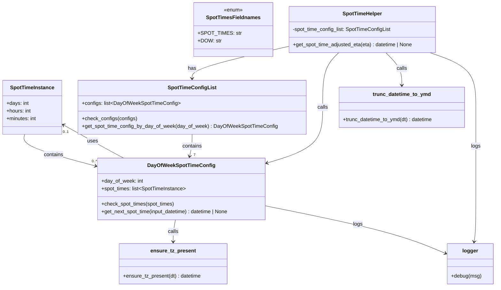

# Diagram: shipment_core/shipment_service/shipment_service/eta/eta_proxy/post_processing/spot_time.py


> Auto-generated by Obscura crawlers

## Diagram 1



### SVG

<svg id="container" width="1531.15625" xmlns="http://www.w3.org/2000/svg" class="classDiagram" height="892" viewBox="0 0 1531.15625 892" role="graphics-document document" aria-roledescription="class"><style>#container{font-family:"trebuchet ms",verdana,arial,sans-serif;font-size:16px;fill:#333;}@keyframes edge-animation-frame{from{stroke-dashoffset:0;}}@keyframes dash{to{stroke-dashoffset:0;}}#container .edge-animation-slow{stroke-dasharray:9,5!important;stroke-dashoffset:900;animation:dash 50s linear infinite;stroke-linecap:round;}#container .edge-animation-fast{stroke-dasharray:9,5!important;stroke-dashoffset:900;animation:dash 20s linear infinite;stroke-linecap:round;}#container .error-icon{fill:#552222;}#container .error-text{fill:#552222;stroke:#552222;}#container .edge-thickness-normal{stroke-width:1px;}#container .edge-thickness-thick{stroke-width:3.5px;}#container .edge-pattern-solid{stroke-dasharray:0;}#container .edge-thickness-invisible{stroke-width:0;fill:none;}#container .edge-pattern-dashed{stroke-dasharray:3;}#container .edge-pattern-dotted{stroke-dasharray:2;}#container .marker{fill:#333333;stroke:#333333;}#container .marker.cross{stroke:#333333;}#container svg{font-family:"trebuchet ms",verdana,arial,sans-serif;font-size:16px;}#container p{margin:0;}#container g.classGroup text{fill:#9370DB;stroke:none;font-family:"trebuchet ms",verdana,arial,sans-serif;font-size:10px;}#container g.classGroup text .title{font-weight:bolder;}#container .nodeLabel,#container .edgeLabel{color:#131300;}#container .edgeLabel .label rect{fill:#ECECFF;}#container .label text{fill:#131300;}#container .labelBkg{background:#ECECFF;}#container .edgeLabel .label span{background:#ECECFF;}#container .classTitle{font-weight:bolder;}#container .node rect,#container .node circle,#container .node ellipse,#container .node polygon,#container .node path{fill:#ECECFF;stroke:#9370DB;stroke-width:1px;}#container .divider{stroke:#9370DB;stroke-width:1;}#container g.clickable{cursor:pointer;}#container g.classGroup rect{fill:#ECECFF;stroke:#9370DB;}#container g.classGroup line{stroke:#9370DB;stroke-width:1;}#container .classLabel .box{stroke:none;stroke-width:0;fill:#ECECFF;opacity:0.5;}#container .classLabel .label{fill:#9370DB;font-size:10px;}#container .relation{stroke:#333333;stroke-width:1;fill:none;}#container .dashed-line{stroke-dasharray:3;}#container .dotted-line{stroke-dasharray:1 2;}#container #compositionStart,#container .composition{fill:#333333!important;stroke:#333333!important;stroke-width:1;}#container #compositionEnd,#container .composition{fill:#333333!important;stroke:#333333!important;stroke-width:1;}#container #dependencyStart,#container .dependency{fill:#333333!important;stroke:#333333!important;stroke-width:1;}#container #dependencyStart,#container .dependency{fill:#333333!important;stroke:#333333!important;stroke-width:1;}#container #extensionStart,#container .extension{fill:transparent!important;stroke:#333333!important;stroke-width:1;}#container #extensionEnd,#container .extension{fill:transparent!important;stroke:#333333!important;stroke-width:1;}#container #aggregationStart,#container .aggregation{fill:transparent!important;stroke:#333333!important;stroke-width:1;}#container #aggregationEnd,#container .aggregation{fill:transparent!important;stroke:#333333!important;stroke-width:1;}#container #lollipopStart,#container .lollipop{fill:#ECECFF!important;stroke:#333333!important;stroke-width:1;}#container #lollipopEnd,#container .lollipop{fill:#ECECFF!important;stroke:#333333!important;stroke-width:1;}#container .edgeTerminals{font-size:11px;line-height:initial;}#container .classTitleText{text-anchor:middle;font-size:18px;fill:#333;}#container .label-icon{display:inline-block;height:1em;overflow:visible;vertical-align:-0.125em;}#container .node .label-icon path{fill:currentColor;stroke:revert;stroke-width:revert;}#container :root{--mermaid-font-family:"trebuchet ms",verdana,arial,sans-serif;}</style><g><defs><marker id="container_class-aggregationStart" class="marker aggregation class" refX="18" refY="7" markerWidth="190" markerHeight="240" orient="auto"><path d="M 18,7 L9,13 L1,7 L9,1 Z"></path></marker></defs><defs><marker id="container_class-aggregationEnd" class="marker aggregation class" refX="1" refY="7" markerWidth="20" markerHeight="28" orient="auto"><path d="M 18,7 L9,13 L1,7 L9,1 Z"></path></marker></defs><defs><marker id="container_class-extensionStart" class="marker extension class" refX="18" refY="7" markerWidth="190" markerHeight="240" orient="auto"><path d="M 1,7 L18,13 V 1 Z"></path></marker></defs><defs><marker id="container_class-extensionEnd" class="marker extension class" refX="1" refY="7" markerWidth="20" markerHeight="28" orient="auto"><path d="M 1,1 V 13 L18,7 Z"></path></marker></defs><defs><marker id="container_class-compositionStart" class="marker composition class" refX="18" refY="7" markerWidth="190" markerHeight="240" orient="auto"><path d="M 18,7 L9,13 L1,7 L9,1 Z"></path></marker></defs><defs><marker id="container_class-compositionEnd" class="marker composition class" refX="1" refY="7" markerWidth="20" markerHeight="28" orient="auto"><path d="M 18,7 L9,13 L1,7 L9,1 Z"></path></marker></defs><defs><marker id="container_class-dependencyStart" class="marker dependency class" refX="6" refY="7" markerWidth="190" markerHeight="240" orient="auto"><path d="M 5,7 L9,13 L1,7 L9,1 Z"></path></marker></defs><defs><marker id="container_class-dependencyEnd" class="marker dependency class" refX="13" refY="7" markerWidth="20" markerHeight="28" orient="auto"><path d="M 18,7 L9,13 L14,7 L9,1 Z"></path></marker></defs><defs><marker id="container_class-lollipopStart" class="marker lollipop class" refX="13" refY="7" markerWidth="190" markerHeight="240" orient="auto"><circle stroke="black" fill="transparent" cx="7" cy="7" r="6"></circle></marker></defs><defs><marker id="container_class-lollipopEnd" class="marker lollipop class" refX="1" refY="7" markerWidth="190" markerHeight="240" orient="auto"><circle stroke="black" fill="transparent" cx="7" cy="7" r="6"></circle></marker></defs><g class="root"><g class="clusters"></g><g class="edgePaths"><path d="M76.685,418L74.968,424.167C73.251,430.333,69.817,442.667,104.68,458.776C139.544,474.885,212.705,494.771,249.286,504.714L285.866,514.656" id="id_SpotTimeInstance_DayOfWeekSpotTimeConfig_1" class="edge-thickness-normal edge-pattern-solid relation" style=";;;" data-edge="true" data-et="edge" data-id="id_SpotTimeInstance_DayOfWeekSpotTimeConfig_1" data-points="W3sieCI6NzYuNjg1MTQzMzM2Nzc2ODYsInkiOjQxOH0seyJ4Ijo2Ni4zODI4MTI1LCJ5Ijo0NTV9LHsieCI6MjkxLjY1NjI1LCJ5Ijo1MTYuMjMwMDkyNTIyMzcyMn1d" marker-end="url(#container_class-dependencyEnd)"></path><path d="M379.109,492L367.765,485.833C356.421,479.667,333.733,467.333,303.44,450.299C273.148,433.264,235.25,411.529,216.302,400.661L197.353,389.793" id="id_DayOfWeekSpotTimeConfig_SpotTimeInstance_2" class="edge-thickness-normal edge-pattern-solid relation" style=";;;" data-edge="true" data-et="edge" data-id="id_DayOfWeekSpotTimeConfig_SpotTimeInstance_2" data-points="W3sieCI6Mzc5LjEwODgxNjk2NDI4NTcsInkiOjQ5Mn0seyJ4IjozMTEuMDQ0OTIxODc1LCJ5Ijo0NTV9LHsieCI6MTkyLjE0ODQzNzUsInkiOjM4Ni44MDgxODc2MDAxfV0=" marker-end="url(#container_class-dependencyEnd)"></path><path d="M537.205,684L536.017,690.167C534.828,696.333,532.451,708.667,531.263,720C530.074,731.333,530.074,741.667,530.074,746.833L530.074,752" id="id_DayOfWeekSpotTimeConfig_ensure_tz_present_3" class="edge-thickness-normal edge-pattern-solid relation" style=";;;" data-edge="true" data-et="edge" data-id="id_DayOfWeekSpotTimeConfig_ensure_tz_present_3" data-points="W3sieCI6NTM3LjIwNTE1MTU1MDc1MTksInkiOjY4NH0seyJ4Ijo1MzAuMDc0MjE4NzUsInkiOjcyMX0seyJ4Ijo1MzAuMDc0MjE4NzUsInkiOjc1OH1d" marker-end="url(#container_class-dependencyEnd)"></path><path d="M589.398,418L589.398,424.167C589.398,430.333,589.398,442.667,588.082,454.031C586.765,465.395,584.132,475.789,582.816,480.986L581.499,486.184" id="id_SpotTimeConfigList_DayOfWeekSpotTimeConfig_4" class="edge-thickness-normal edge-pattern-solid relation" style=";;;" data-edge="true" data-et="edge" data-id="id_SpotTimeConfigList_DayOfWeekSpotTimeConfig_4" data-points="W3sieCI6NTg5LjM5ODQzNzUsInkiOjQxOH0seyJ4Ijo1ODkuMzk4NDM3NSwieSI6NDU1fSx7IngiOjU4MC4wMjU2NDAyNzI1NTY0LCJ5Ijo0OTJ9XQ==" marker-end="url(#container_class-dependencyEnd)"></path><path d="M881.988,145.353L833.223,156.628C784.458,167.902,686.928,190.451,638.163,206.892C589.398,223.333,589.398,233.667,589.398,238.833L589.398,244" id="id_SpotTimeHelper_SpotTimeConfigList_5" class="edge-thickness-normal edge-pattern-solid relation" style=";;;" data-edge="true" data-et="edge" data-id="id_SpotTimeHelper_SpotTimeConfigList_5" data-points="W3sieCI6ODgxLjk4ODI4MTI1LCJ5IjoxNDUuMzUzMTA3NTc2NTYwNX0seyJ4Ijo1ODkuMzk4NDM3NSwieSI6MjEzfSx7IngiOjU4OS4zOTg0Mzc1LCJ5IjoyNTB9XQ==" marker-end="url(#container_class-dependencyEnd)"></path><path d="M1038.576,164L1030.162,172.167C1021.749,180.333,1004.921,196.667,996.507,225C988.094,253.333,988.094,293.667,988.094,334C988.094,374.333,988.094,414.667,960.994,443.169C933.893,471.672,879.693,488.344,852.593,496.679L825.493,505.015" id="id_SpotTimeHelper_DayOfWeekSpotTimeConfig_6" class="edge-thickness-normal edge-pattern-solid relation" style=";;;" data-edge="true" data-et="edge" data-id="id_SpotTimeHelper_DayOfWeekSpotTimeConfig_6" data-points="W3sieCI6MTAzOC41NzU5NjIwMzUxMjQsInkiOjE2NH0seyJ4Ijo5ODguMDkzNzUsInkiOjIxM30seyJ4Ijo5ODguMDkzNzUsInkiOjMzNH0seyJ4Ijo5ODguMDkzNzUsInkiOjQ1NX0seyJ4Ijo4MTkuNzU3ODEyNSwieSI6NTA2Ljc3OTI5NTUxNjM0NzN9XQ==" marker-end="url(#container_class-dependencyEnd)"></path><path d="M1186.932,164L1195.346,172.167C1203.759,180.333,1220.587,196.667,1229,213.5C1237.414,230.333,1237.414,247.667,1237.414,256.333L1237.414,265" id="id_SpotTimeHelper_trunc_datetime_to_ymd_7" class="edge-thickness-normal edge-pattern-solid relation" style=";;;" data-edge="true" data-et="edge" data-id="id_SpotTimeHelper_trunc_datetime_to_ymd_7" data-points="W3sieCI6MTE4Ni45MzE4NTA0NjQ4NzYsInkiOjE2NH0seyJ4IjoxMjM3LjQxNDA2MjUsInkiOjIxM30seyJ4IjoxMjM3LjQxNDA2MjUsInkiOjI3MX1d" marker-end="url(#container_class-dependencyEnd)"></path><path d="M1325.502,164L1349.633,172.167C1373.764,180.333,1422.027,196.667,1446.158,225C1470.289,253.333,1470.289,293.667,1470.289,334C1470.289,374.333,1470.289,414.667,1470.289,457C1470.289,499.333,1470.289,543.667,1470.289,588C1470.289,632.333,1470.289,676.667,1469.387,704.015C1468.485,731.363,1466.681,741.726,1465.779,746.907L1464.876,752.089" id="id_SpotTimeHelper_logger_8" class="edge-thickness-normal edge-pattern-solid relation" style=";;;" data-edge="true" data-et="edge" data-id="id_SpotTimeHelper_logger_8" data-points="W3sieCI6MTMyNS41MDIwOTgzOTg3NjA0LCJ5IjoxNjR9LHsieCI6MTQ3MC4yODkwNjI1LCJ5IjoyMTN9LHsieCI6MTQ3MC4yODkwNjI1LCJ5IjozMzR9LHsieCI6MTQ3MC4yODkwNjI1LCJ5Ijo0NTV9LHsieCI6MTQ3MC4yODkwNjI1LCJ5Ijo1ODh9LHsieCI6MTQ3MC4yODkwNjI1LCJ5Ijo3MjF9LHsieCI6MTQ2My44NDczMDQ2ODc1LCJ5Ijo3NTh9XQ==" marker-end="url(#container_class-dependencyEnd)"></path><path d="M819.758,641.529L885.095,654.774C950.432,668.019,1081.107,694.51,1173.99,719.18C1266.874,743.851,1321.967,766.702,1349.513,778.127L1377.059,789.552" id="id_DayOfWeekSpotTimeConfig_logger_9" class="edge-thickness-normal edge-pattern-solid relation" style=";;;" data-edge="true" data-et="edge" data-id="id_DayOfWeekSpotTimeConfig_logger_9" data-points="W3sieCI6ODE5Ljc1NzgxMjUsInkiOjY0MS41Mjg2Mjk2OTI0NzcxfSx7IngiOjEyMTEuNzgxMjUsInkiOjcyMX0seyJ4IjoxMzgyLjYwMTU2MjUsInkiOjc5MS44NTEwODc5NjAzMzc2fV0=" marker-end="url(#container_class-dependencyEnd)"></path></g><g class="edgeLabels"><g class="edgeLabel" transform="translate(160.4881, 480.57814)"><g class="label" data-id="id_SpotTimeInstance_DayOfWeekSpotTimeConfig_1" transform="translate(-30.890625, -12)"><foreignObject width="61.78125" height="24"><div xmlns="http://www.w3.org/1999/xhtml" class="labelBkg" style="display: table-cell; white-space: nowrap; line-height: 1.5; max-width: 200px; text-align: center;"><span class="edgeLabel"><p>contains</p></span></div></foreignObject></g></g><g class="edgeLabel" transform="translate(285.19774, 440.17563)"><g class="label" data-id="id_DayOfWeekSpotTimeConfig_SpotTimeInstance_2" transform="translate(-16.4921875, -12)"><foreignObject width="32.984375" height="24"><div xmlns="http://www.w3.org/1999/xhtml" class="labelBkg" style="display: table-cell; white-space: nowrap; line-height: 1.5; max-width: 200px; text-align: center;"><span class="edgeLabel"><p>uses</p></span></div></foreignObject></g></g><g class="edgeLabel" transform="translate(530.07421875, 721)"><g class="label" data-id="id_DayOfWeekSpotTimeConfig_ensure_tz_present_3" transform="translate(-16.4453125, -12)"><foreignObject width="32.890625" height="24"><div xmlns="http://www.w3.org/1999/xhtml" class="labelBkg" style="display: table-cell; white-space: nowrap; line-height: 1.5; max-width: 200px; text-align: center;"><span class="edgeLabel"><p>calls</p></span></div></foreignObject></g></g><g class="edgeLabel" transform="translate(589.3984375, 455)"><g class="label" data-id="id_SpotTimeConfigList_DayOfWeekSpotTimeConfig_4" transform="translate(-30.890625, -12)"><foreignObject width="61.78125" height="24"><div xmlns="http://www.w3.org/1999/xhtml" class="labelBkg" style="display: table-cell; white-space: nowrap; line-height: 1.5; max-width: 200px; text-align: center;"><span class="edgeLabel"><p>contains</p></span></div></foreignObject></g></g><g class="edgeLabel" transform="translate(589.3984375, 213)"><g class="label" data-id="id_SpotTimeHelper_SpotTimeConfigList_5" transform="translate(-12.703125, -12)"><foreignObject width="25.40625" height="24"><div xmlns="http://www.w3.org/1999/xhtml" class="labelBkg" style="display: table-cell; white-space: nowrap; line-height: 1.5; max-width: 200px; text-align: center;"><span class="edgeLabel"><p>has</p></span></div></foreignObject></g></g><g class="edgeLabel" transform="translate(988.09375, 334)"><g class="label" data-id="id_SpotTimeHelper_DayOfWeekSpotTimeConfig_6" transform="translate(-16.4453125, -12)"><foreignObject width="32.890625" height="24"><div xmlns="http://www.w3.org/1999/xhtml" class="labelBkg" style="display: table-cell; white-space: nowrap; line-height: 1.5; max-width: 200px; text-align: center;"><span class="edgeLabel"><p>calls</p></span></div></foreignObject></g></g><g class="edgeLabel" transform="translate(1237.4140625, 213)"><g class="label" data-id="id_SpotTimeHelper_trunc_datetime_to_ymd_7" transform="translate(-16.4453125, -12)"><foreignObject width="32.890625" height="24"><div xmlns="http://www.w3.org/1999/xhtml" class="labelBkg" style="display: table-cell; white-space: nowrap; line-height: 1.5; max-width: 200px; text-align: center;"><span class="edgeLabel"><p>calls</p></span></div></foreignObject></g></g><g class="edgeLabel" transform="translate(1470.2890625, 455)"><g class="label" data-id="id_SpotTimeHelper_logger_8" transform="translate(-14.8203125, -12)"><foreignObject width="29.640625" height="24"><div xmlns="http://www.w3.org/1999/xhtml" class="labelBkg" style="display: table-cell; white-space: nowrap; line-height: 1.5; max-width: 200px; text-align: center;"><span class="edgeLabel"><p>logs</p></span></div></foreignObject></g></g><g class="edgeLabel" transform="translate(1106.39166, 699.63532)"><g class="label" data-id="id_DayOfWeekSpotTimeConfig_logger_9" transform="translate(-14.8203125, -12)"><foreignObject width="29.640625" height="24"><div xmlns="http://www.w3.org/1999/xhtml" class="labelBkg" style="display: table-cell; white-space: nowrap; line-height: 1.5; max-width: 200px; text-align: center;"><span class="edgeLabel"><p>logs</p></span></div></foreignObject></g></g><g class="edgeTerminals" transform="translate(273.70324274236407, 492.16521469048723)"><g class="inner" transform="translate(0, 0)"></g><foreignObject style="width: 36px; height: 12px;"><div xmlns="http://www.w3.org/1999/xhtml" style="display: inline-block; padding-right: 1px; white-space: nowrap;"><span class="edgeLabel">0..*</span></div></foreignObject></g><g class="edgeTerminals" transform="translate(194.86608868779535, 403.5265628202916)"><g class="inner" transform="translate(0, 0)"></g><foreignObject style="width: 36px; height: 12px;"><div xmlns="http://www.w3.org/1999/xhtml" style="display: inline-block; padding-right: 1px; white-space: nowrap;"><span class="edgeLabel">0..1</span></div></foreignObject></g><g class="edgeTerminals" transform="translate(593.8636924224385, 473.7192690242639)"><g class="inner" transform="translate(0, 0)"></g><foreignObject style="width: 9px; height: 12px;"><div xmlns="http://www.w3.org/1999/xhtml" style="display: inline-block; padding-right: 1px; white-space: nowrap;"><span class="edgeLabel">7</span></div></foreignObject></g></g><g class="nodes"><g class="node default" id="classId-SpotTimesFieldnames-0" transform="translate(719.3984375, 92)"><g class="basic label-container"><path d="M-112.58984375 -84 L112.58984375 -84 L112.58984375 84 L-112.58984375 84" stroke="none" stroke-width="0" fill="#ECECFF" style=""></path><path d="M-112.58984375 -84 C-50.56934528874194 -84, 11.451153172516115 -84, 112.58984375 -84 M-112.58984375 -84 C-25.61484839139885 -84, 61.3601469672023 -84, 112.58984375 -84 M112.58984375 -84 C112.58984375 -24.448927246727862, 112.58984375 35.102145506544275, 112.58984375 84 M112.58984375 -84 C112.58984375 -50.213354037399625, 112.58984375 -16.42670807479925, 112.58984375 84 M112.58984375 84 C44.33514876220066 84, -23.91954622559868 84, -112.58984375 84 M112.58984375 84 C65.5609685898535 84, 18.532093429707004 84, -112.58984375 84 M-112.58984375 84 C-112.58984375 23.98083311735006, -112.58984375 -36.03833376529988, -112.58984375 -84 M-112.58984375 84 C-112.58984375 28.23100679031286, -112.58984375 -27.537986419374278, -112.58984375 -84" stroke="#9370DB" stroke-width="1.3" fill="none" stroke-dasharray="0 0" style=""></path></g><g class="annotation-group text" transform="translate(-29.53125, -60)"><g class="label" style="" transform="translate(0,-12)"><foreignObject width="59.0625" height="24"><div xmlns="http://www.w3.org/1999/xhtml" style="display: table-cell; white-space: nowrap; line-height: 1.5; max-width: 109px; text-align: center;"><span class="nodeLabel markdown-node-label" style=""><p>«enum»</p></span></div></foreignObject></g></g><g class="label-group text" transform="translate(-80.2421875, -36)"><g class="label" style="font-weight: bolder" transform="translate(0,-12)"><foreignObject width="160.484375" height="24"><div xmlns="http://www.w3.org/1999/xhtml" style="display: table-cell; white-space: nowrap; line-height: 1.5; max-width: 209px; text-align: center;"><span class="nodeLabel markdown-node-label" style=""><p>SpotTimesFieldnames</p></span></div></foreignObject></g></g><g class="members-group text" transform="translate(-100.58984375, 12)"><g class="label" style="" transform="translate(0,-12)"><foreignObject width="120.9375" height="24"><div xmlns="http://www.w3.org/1999/xhtml" style="display: table-cell; white-space: nowrap; line-height: 1.5; max-width: 179px; text-align: center;"><span class="nodeLabel markdown-node-label" style=""><p>+SPOT_TIMES: str</p></span></div></foreignObject></g><g class="label" style="" transform="translate(0,12)"><foreignObject width="70.09375" height="24"><div xmlns="http://www.w3.org/1999/xhtml" style="display: table-cell; white-space: nowrap; line-height: 1.5; max-width: 128px; text-align: center;"><span class="nodeLabel markdown-node-label" style=""><p>+DOW: str</p></span></div></foreignObject></g></g><g class="methods-group text" transform="translate(-100.58984375, 84)"></g><g class="divider" style=""><path d="M-112.58984375 -12 C-27.797366406700263 -12, 56.995110936599474 -12, 112.58984375 -12 M-112.58984375 -12 C-65.69886191724058 -12, -18.807880084481155 -12, 112.58984375 -12" stroke="#9370DB" stroke-width="1.3" fill="none" stroke-dasharray="0 0" style=""></path></g><g class="divider" style=""><path d="M-112.58984375 60 C-27.407651275149078 60, 57.774541199701844 60, 112.58984375 60 M-112.58984375 60 C-30.971615820316543 60, 50.64661210936691 60, 112.58984375 60" stroke="#9370DB" stroke-width="1.3" fill="none" stroke-dasharray="0 0" style=""></path></g></g><g class="node default" id="classId-SpotTimeInstance-1" transform="translate(100.07421875, 334)"><g class="basic label-container"><path d="M-92.07421875 -84 L92.07421875 -84 L92.07421875 84 L-92.07421875 84" stroke="none" stroke-width="0" fill="#ECECFF" style=""></path><path d="M-92.07421875 -84 C-37.1598679749965 -84, 17.754482800006997 -84, 92.07421875 -84 M-92.07421875 -84 C-50.94861810595473 -84, -9.823017461909458 -84, 92.07421875 -84 M92.07421875 -84 C92.07421875 -26.6606970317876, 92.07421875 30.678605936424802, 92.07421875 84 M92.07421875 -84 C92.07421875 -24.33315561535303, 92.07421875 35.33368876929394, 92.07421875 84 M92.07421875 84 C43.37032837456717 84, -5.333562000865655 84, -92.07421875 84 M92.07421875 84 C46.78102902306063 84, 1.4878392961212654 84, -92.07421875 84 M-92.07421875 84 C-92.07421875 44.96142202181036, -92.07421875 5.922844043620714, -92.07421875 -84 M-92.07421875 84 C-92.07421875 34.063812513443274, -92.07421875 -15.872374973113452, -92.07421875 -84" stroke="#9370DB" stroke-width="1.3" fill="none" stroke-dasharray="0 0" style=""></path></g><g class="annotation-group text" transform="translate(0, -60)"></g><g class="label-group text" transform="translate(-65.7734375, -60)"><g class="label" style="font-weight: bolder" transform="translate(0,-12)"><foreignObject width="131.546875" height="24"><div xmlns="http://www.w3.org/1999/xhtml" style="display: table-cell; white-space: nowrap; line-height: 1.5; max-width: 180px; text-align: center;"><span class="nodeLabel markdown-node-label" style=""><p>SpotTimeInstance</p></span></div></foreignObject></g></g><g class="members-group text" transform="translate(-80.07421875, -12)"><g class="label" style="" transform="translate(0,-12)"><foreignObject width="69" height="24"><div xmlns="http://www.w3.org/1999/xhtml" style="display: table-cell; white-space: nowrap; line-height: 1.5; max-width: 127px; text-align: center;"><span class="nodeLabel markdown-node-label" style=""><p>+days: int</p></span></div></foreignObject></g><g class="label" style="" transform="translate(0,12)"><foreignObject width="77.171875" height="24"><div xmlns="http://www.w3.org/1999/xhtml" style="display: table-cell; white-space: nowrap; line-height: 1.5; max-width: 135px; text-align: center;"><span class="nodeLabel markdown-node-label" style=""><p>+hours: int</p></span></div></foreignObject></g><g class="label" style="" transform="translate(0,36)"><foreignObject width="94.375" height="24"><div xmlns="http://www.w3.org/1999/xhtml" style="display: table-cell; white-space: nowrap; line-height: 1.5; max-width: 152px; text-align: center;"><span class="nodeLabel markdown-node-label" style=""><p>+minutes: int</p></span></div></foreignObject></g></g><g class="methods-group text" transform="translate(-80.07421875, 84)"></g><g class="divider" style=""><path d="M-92.07421875 -36 C-49.448183078173415 -36, -6.822147406346829 -36, 92.07421875 -36 M-92.07421875 -36 C-48.01105790131436 -36, -3.9478970526287185 -36, 92.07421875 -36" stroke="#9370DB" stroke-width="1.3" fill="none" stroke-dasharray="0 0" style=""></path></g><g class="divider" style=""><path d="M-92.07421875 60 C-36.814720160714884 60, 18.44477842857023 60, 92.07421875 60 M-92.07421875 60 C-54.31019241070414 60, -16.54616607140828 60, 92.07421875 60" stroke="#9370DB" stroke-width="1.3" fill="none" stroke-dasharray="0 0" style=""></path></g></g><g class="node default" id="classId-DayOfWeekSpotTimeConfig-2" transform="translate(555.70703125, 588)"><g class="basic label-container"><path d="M-264.05078125 -96 L264.05078125 -96 L264.05078125 96 L-264.05078125 96" stroke="none" stroke-width="0" fill="#ECECFF" style=""></path><path d="M-264.05078125 -96 C-54.072308935293506 -96, 155.906163379413 -96, 264.05078125 -96 M-264.05078125 -96 C-113.56150833222318 -96, 36.92776458555363 -96, 264.05078125 -96 M264.05078125 -96 C264.05078125 -55.02064781699206, 264.05078125 -14.04129563398412, 264.05078125 96 M264.05078125 -96 C264.05078125 -41.551849562853896, 264.05078125 12.896300874292209, 264.05078125 96 M264.05078125 96 C65.31585855055238 96, -133.41906414889525 96, -264.05078125 96 M264.05078125 96 C69.86093922347868 96, -124.32890280304264 96, -264.05078125 96 M-264.05078125 96 C-264.05078125 21.060588062051792, -264.05078125 -53.878823875896416, -264.05078125 -96 M-264.05078125 96 C-264.05078125 55.18978310556743, -264.05078125 14.379566211134858, -264.05078125 -96" stroke="#9370DB" stroke-width="1.3" fill="none" stroke-dasharray="0 0" style=""></path></g><g class="annotation-group text" transform="translate(0, -72)"></g><g class="label-group text" transform="translate(-99.6484375, -72)"><g class="label" style="font-weight: bolder" transform="translate(0,-12)"><foreignObject width="199.296875" height="24"><div xmlns="http://www.w3.org/1999/xhtml" style="display: table-cell; white-space: nowrap; line-height: 1.5; max-width: 246px; text-align: center;"><span class="nodeLabel markdown-node-label" style=""><p>DayOfWeekSpotTimeConfig</p></span></div></foreignObject></g></g><g class="members-group text" transform="translate(-252.05078125, -24)"><g class="label" style="" transform="translate(0,-12)"><foreignObject width="128.546875" height="24"><div xmlns="http://www.w3.org/1999/xhtml" style="display: table-cell; white-space: nowrap; line-height: 1.5; max-width: 186px; text-align: center;"><span class="nodeLabel markdown-node-label" style=""><p>+day_of_week: int</p></span></div></foreignObject></g><g class="label" style="" transform="translate(0,12)"><foreignObject width="264.734375" height="24"><div xmlns="http://www.w3.org/1999/xhtml" style="display: table-cell; white-space: nowrap; line-height: 1.5; max-width: 362px; text-align: center;"><span class="nodeLabel markdown-node-label" style=""><p>+spot_times: list&lt;SpotTimeInstance&gt;</p></span></div></foreignObject></g></g><g class="methods-group text" transform="translate(-252.05078125, 48)"><g class="label" style="" transform="translate(0,-12)"><foreignObject width="228.84375" height="24"><div xmlns="http://www.w3.org/1999/xhtml" style="display: table-cell; white-space: nowrap; line-height: 1.5; max-width: 286px; text-align: center;"><span class="nodeLabel markdown-node-label" style=""><p>+check_spot_times(spot_times)</p></span></div></foreignObject></g><g class="label" style="" transform="translate(0,12)"><foreignObject width="404.453125" height="24"><div xmlns="http://www.w3.org/1999/xhtml" style="display: table-cell; white-space: nowrap; line-height: 1.5; max-width: 462px; text-align: center;"><span class="nodeLabel markdown-node-label" style=""><p>+get_next_spot_time(input_datetime) : datetime | None</p></span></div></foreignObject></g></g><g class="divider" style=""><path d="M-264.05078125 -48 C-87.98002359333645 -48, 88.09073406332709 -48, 264.05078125 -48 M-264.05078125 -48 C-120.07477835648939 -48, 23.90122453702122 -48, 264.05078125 -48" stroke="#9370DB" stroke-width="1.3" fill="none" stroke-dasharray="0 0" style=""></path></g><g class="divider" style=""><path d="M-264.05078125 24 C-80.52597675086758 24, 102.99882774826483 24, 264.05078125 24 M-264.05078125 24 C-155.20326163210171 24, -46.35574201420346 24, 264.05078125 24" stroke="#9370DB" stroke-width="1.3" fill="none" stroke-dasharray="0 0" style=""></path></g></g><g class="node default" id="classId-SpotTimeConfigList-3" transform="translate(589.3984375, 334)"><g class="basic label-container"><path d="M-347.25 -84 L347.25 -84 L347.25 84 L-347.25 84" stroke="none" stroke-width="0" fill="#ECECFF" style=""></path><path d="M-347.25 -84 C-109.92782031429385 -84, 127.39435937141229 -84, 347.25 -84 M-347.25 -84 C-180.81740046389734 -84, -14.384800927794686 -84, 347.25 -84 M347.25 -84 C347.25 -17.366828108660172, 347.25 49.266343782679655, 347.25 84 M347.25 -84 C347.25 -34.83445097911418, 347.25 14.33109804177164, 347.25 84 M347.25 84 C206.15661097154683 84, 65.06322194309365 84, -347.25 84 M347.25 84 C122.14732812376326 84, -102.95534375247348 84, -347.25 84 M-347.25 84 C-347.25 36.00823348693976, -347.25 -11.983533026120483, -347.25 -84 M-347.25 84 C-347.25 49.66238042221902, -347.25 15.324760844438046, -347.25 -84" stroke="#9370DB" stroke-width="1.3" fill="none" stroke-dasharray="0 0" style=""></path></g><g class="annotation-group text" transform="translate(0, -60)"></g><g class="label-group text" transform="translate(-71.109375, -60)"><g class="label" style="font-weight: bolder" transform="translate(0,-12)"><foreignObject width="142.21875" height="24"><div xmlns="http://www.w3.org/1999/xhtml" style="display: table-cell; white-space: nowrap; line-height: 1.5; max-width: 189px; text-align: center;"><span class="nodeLabel markdown-node-label" style=""><p>SpotTimeConfigList</p></span></div></foreignObject></g></g><g class="members-group text" transform="translate(-335.25, -12)"><g class="label" style="" transform="translate(0,-12)"><foreignObject width="300.484375" height="24"><div xmlns="http://www.w3.org/1999/xhtml" style="display: table-cell; white-space: nowrap; line-height: 1.5; max-width: 398px; text-align: center;"><span class="nodeLabel markdown-node-label" style=""><p>+configs: list&lt;DayOfWeekSpotTimeConfig&gt;</p></span></div></foreignObject></g></g><g class="methods-group text" transform="translate(-335.25, 36)"><g class="label" style="" transform="translate(0,-12)"><foreignObject width="169.796875" height="24"><div xmlns="http://www.w3.org/1999/xhtml" style="display: table-cell; white-space: nowrap; line-height: 1.5; max-width: 227px; text-align: center;"><span class="nodeLabel markdown-node-label" style=""><p>+check_configs(configs)</p></span></div></foreignObject></g><g class="label" style="" transform="translate(0,12)"><foreignObject width="599.390625" height="24"><div xmlns="http://www.w3.org/1999/xhtml" style="display: table-cell; white-space: nowrap; line-height: 1.5; max-width: 657px; text-align: center;"><span class="nodeLabel markdown-node-label" style=""><p>+get_spot_time_config_by_day_of_week(day_of_week) : DayOfWeekSpotTimeConfig</p></span></div></foreignObject></g></g><g class="divider" style=""><path d="M-347.25 -36 C-161.12629358946813 -36, 24.997412821063733 -36, 347.25 -36 M-347.25 -36 C-194.77687513667462 -36, -42.30375027334924 -36, 347.25 -36" stroke="#9370DB" stroke-width="1.3" fill="none" stroke-dasharray="0 0" style=""></path></g><g class="divider" style=""><path d="M-347.25 12 C-143.26268284755037 12, 60.72463430489927 12, 347.25 12 M-347.25 12 C-100.36265334988062 12, 146.52469330023877 12, 347.25 12" stroke="#9370DB" stroke-width="1.3" fill="none" stroke-dasharray="0 0" style=""></path></g></g><g class="node default" id="classId-SpotTimeHelper-4" transform="translate(1112.75390625, 92)"><g class="basic label-container"><path d="M-230.765625 -72 L230.765625 -72 L230.765625 72 L-230.765625 72" stroke="none" stroke-width="0" fill="#ECECFF" style=""></path><path d="M-230.765625 -72 C-87.6437522658886 -72, 55.47812046822281 -72, 230.765625 -72 M-230.765625 -72 C-52.82641576392305 -72, 125.1127934721539 -72, 230.765625 -72 M230.765625 -72 C230.765625 -22.615958884068917, 230.765625 26.768082231862167, 230.765625 72 M230.765625 -72 C230.765625 -20.05004990918679, 230.765625 31.89990018162642, 230.765625 72 M230.765625 72 C55.08913059164141 72, -120.58736381671719 72, -230.765625 72 M230.765625 72 C65.73599523236038 72, -99.29363453527924 72, -230.765625 72 M-230.765625 72 C-230.765625 42.52799530630158, -230.765625 13.055990612603146, -230.765625 -72 M-230.765625 72 C-230.765625 40.557433549269994, -230.765625 9.114867098539989, -230.765625 -72" stroke="#9370DB" stroke-width="1.3" fill="none" stroke-dasharray="0 0" style=""></path></g><g class="annotation-group text" transform="translate(0, -48)"></g><g class="label-group text" transform="translate(-59.390625, -48)"><g class="label" style="font-weight: bolder" transform="translate(0,-12)"><foreignObject width="118.78125" height="24"><div xmlns="http://www.w3.org/1999/xhtml" style="display: table-cell; white-space: nowrap; line-height: 1.5; max-width: 168px; text-align: center;"><span class="nodeLabel markdown-node-label" style=""><p>SpotTimeHelper</p></span></div></foreignObject></g></g><g class="members-group text" transform="translate(-218.765625, 0)"><g class="label" style="" transform="translate(0,-12)"><foreignObject width="308.5" height="24"><div xmlns="http://www.w3.org/1999/xhtml" style="display: table-cell; white-space: nowrap; line-height: 1.5; max-width: 366px; text-align: center;"><span class="nodeLabel markdown-node-label" style=""><p>-spot_time_config_list: SpotTimeConfigList</p></span></div></foreignObject></g></g><g class="methods-group text" transform="translate(-218.765625, 48)"><g class="label" style="" transform="translate(0,-12)"><foreignObject width="378.140625" height="24"><div xmlns="http://www.w3.org/1999/xhtml" style="display: table-cell; white-space: nowrap; line-height: 1.5; max-width: 436px; text-align: center;"><span class="nodeLabel markdown-node-label" style=""><p>+get_spot_time_adjusted_eta(eta) : datetime | None</p></span></div></foreignObject></g></g><g class="divider" style=""><path d="M-230.765625 -24 C-124.08093720647481 -24, -17.39624941294963 -24, 230.765625 -24 M-230.765625 -24 C-120.37310821580999 -24, -9.980591431619985 -24, 230.765625 -24" stroke="#9370DB" stroke-width="1.3" fill="none" stroke-dasharray="0 0" style=""></path></g><g class="divider" style=""><path d="M-230.765625 24 C-68.1108262844794 24, 94.5439724310412 24, 230.765625 24 M-230.765625 24 C-81.04543668125777 24, 68.67475163748446 24, 230.765625 24" stroke="#9370DB" stroke-width="1.3" fill="none" stroke-dasharray="0 0" style=""></path></g></g><g class="node default" id="classId-trunc_datetime_to_ymd-5" transform="translate(1237.4140625, 334)"><g class="basic label-container"><path d="M-197.875 -63 L197.875 -63 L197.875 63 L-197.875 63" stroke="none" stroke-width="0" fill="#ECECFF" style=""></path><path d="M-197.875 -63 C-70.7360763289874 -63, 56.40284734202521 -63, 197.875 -63 M-197.875 -63 C-96.53692310742257 -63, 4.801153785154867 -63, 197.875 -63 M197.875 -63 C197.875 -21.176372553983434, 197.875 20.647254892033132, 197.875 63 M197.875 -63 C197.875 -16.220256888048937, 197.875 30.559486223902127, 197.875 63 M197.875 63 C45.30049955267859 63, -107.27400089464282 63, -197.875 63 M197.875 63 C53.56763220755687 63, -90.73973558488626 63, -197.875 63 M-197.875 63 C-197.875 33.31636615503278, -197.875 3.6327323100655704, -197.875 -63 M-197.875 63 C-197.875 27.94419026752714, -197.875 -7.1116194649457185, -197.875 -63" stroke="#9370DB" stroke-width="1.3" fill="none" stroke-dasharray="0 0" style=""></path></g><g class="annotation-group text" transform="translate(0, -39)"></g><g class="label-group text" transform="translate(-87.46875, -39)"><g class="label" style="font-weight: bolder" transform="translate(0,-12)"><foreignObject width="174.9375" height="24"><div xmlns="http://www.w3.org/1999/xhtml" style="display: table-cell; white-space: nowrap; line-height: 1.5; max-width: 223px; text-align: center;"><span class="nodeLabel markdown-node-label" style=""><p>trunc_datetime_to_ymd</p></span></div></foreignObject></g></g><g class="members-group text" transform="translate(-185.875, 9)"></g><g class="methods-group text" transform="translate(-185.875, 39)"><g class="label" style="" transform="translate(0,-12)"><foreignObject width="284.28125" height="24"><div xmlns="http://www.w3.org/1999/xhtml" style="display: table-cell; white-space: nowrap; line-height: 1.5; max-width: 342px; text-align: center;"><span class="nodeLabel markdown-node-label" style=""><p>+trunc_datetime_to_ymd(dt) : datetime</p></span></div></foreignObject></g></g><g class="divider" style=""><path d="M-197.875 -15 C-94.14205908898445 -15, 9.590881822031093 -15, 197.875 -15 M-197.875 -15 C-87.91069743706275 -15, 22.053605125874498 -15, 197.875 -15" stroke="#9370DB" stroke-width="1.3" fill="none" stroke-dasharray="0 0" style=""></path></g><g class="divider" style=""><path d="M-197.875 9 C-63.586512174294654 9, 70.70197565141069 9, 197.875 9 M-197.875 9 C-85.39735371615058 9, 27.080292567698848 9, 197.875 9" stroke="#9370DB" stroke-width="1.3" fill="none" stroke-dasharray="0 0" style=""></path></g></g><g class="node default" id="classId-ensure_tz_present-6" transform="translate(530.07421875, 821)"><g class="basic label-container"><path d="M-168.1796875 -63 L168.1796875 -63 L168.1796875 63 L-168.1796875 63" stroke="none" stroke-width="0" fill="#ECECFF" style=""></path><path d="M-168.1796875 -63 C-92.47532086138808 -63, -16.77095422277617 -63, 168.1796875 -63 M-168.1796875 -63 C-64.91585234943638 -63, 38.347982801127245 -63, 168.1796875 -63 M168.1796875 -63 C168.1796875 -19.87159011005493, 168.1796875 23.256819779890137, 168.1796875 63 M168.1796875 -63 C168.1796875 -15.584173846388623, 168.1796875 31.831652307222754, 168.1796875 63 M168.1796875 63 C35.1833025685867 63, -97.8130823628266 63, -168.1796875 63 M168.1796875 63 C93.73814734275331 63, 19.296607185506616 63, -168.1796875 63 M-168.1796875 63 C-168.1796875 23.18360165024564, -168.1796875 -16.632796699508717, -168.1796875 -63 M-168.1796875 63 C-168.1796875 25.41780676511702, -168.1796875 -12.164386469765958, -168.1796875 -63" stroke="#9370DB" stroke-width="1.3" fill="none" stroke-dasharray="0 0" style=""></path></g><g class="annotation-group text" transform="translate(0, -39)"></g><g class="label-group text" transform="translate(-67.765625, -39)"><g class="label" style="font-weight: bolder" transform="translate(0,-12)"><foreignObject width="135.53125" height="24"><div xmlns="http://www.w3.org/1999/xhtml" style="display: table-cell; white-space: nowrap; line-height: 1.5; max-width: 184px; text-align: center;"><span class="nodeLabel markdown-node-label" style=""><p>ensure_tz_present</p></span></div></foreignObject></g></g><g class="members-group text" transform="translate(-156.1796875, 9)"></g><g class="methods-group text" transform="translate(-156.1796875, 39)"><g class="label" style="" transform="translate(0,-12)"><foreignObject width="244.59375" height="24"><div xmlns="http://www.w3.org/1999/xhtml" style="display: table-cell; white-space: nowrap; line-height: 1.5; max-width: 302px; text-align: center;"><span class="nodeLabel markdown-node-label" style=""><p>+ensure_tz_present(dt) : datetime</p></span></div></foreignObject></g></g><g class="divider" style=""><path d="M-168.1796875 -15 C-39.009245259549175 -15, 90.16119698090165 -15, 168.1796875 -15 M-168.1796875 -15 C-83.29691467831921 -15, 1.5858581433615768 -15, 168.1796875 -15" stroke="#9370DB" stroke-width="1.3" fill="none" stroke-dasharray="0 0" style=""></path></g><g class="divider" style=""><path d="M-168.1796875 9 C-40.67267543150096 9, 86.83433663699807 9, 168.1796875 9 M-168.1796875 9 C-54.146637335362385 9, 59.88641282927523 9, 168.1796875 9" stroke="#9370DB" stroke-width="1.3" fill="none" stroke-dasharray="0 0" style=""></path></g></g><g class="node default" id="classId-logger-7" transform="translate(1452.87890625, 821)"><g class="basic label-container"><path d="M-70.27734375 -63 L70.27734375 -63 L70.27734375 63 L-70.27734375 63" stroke="none" stroke-width="0" fill="#ECECFF" style=""></path><path d="M-70.27734375 -63 C-27.973472778675166 -63, 14.330398192649668 -63, 70.27734375 -63 M-70.27734375 -63 C-31.320944352355276 -63, 7.635455045289447 -63, 70.27734375 -63 M70.27734375 -63 C70.27734375 -21.93880991205406, 70.27734375 19.122380175891877, 70.27734375 63 M70.27734375 -63 C70.27734375 -20.588092695793186, 70.27734375 21.823814608413628, 70.27734375 63 M70.27734375 63 C24.078241402852363 63, -22.120860944295273 63, -70.27734375 63 M70.27734375 63 C16.53516230723362 63, -37.20701913553276 63, -70.27734375 63 M-70.27734375 63 C-70.27734375 31.388711835280333, -70.27734375 -0.22257632943933459, -70.27734375 -63 M-70.27734375 63 C-70.27734375 26.955223571548018, -70.27734375 -9.089552856903964, -70.27734375 -63" stroke="#9370DB" stroke-width="1.3" fill="none" stroke-dasharray="0 0" style=""></path></g><g class="annotation-group text" transform="translate(0, -39)"></g><g class="label-group text" transform="translate(-23.2734375, -39)"><g class="label" style="font-weight: bolder" transform="translate(0,-12)"><foreignObject width="46.546875" height="24"><div xmlns="http://www.w3.org/1999/xhtml" style="display: table-cell; white-space: nowrap; line-height: 1.5; max-width: 96px; text-align: center;"><span class="nodeLabel markdown-node-label" style=""><p>logger</p></span></div></foreignObject></g></g><g class="members-group text" transform="translate(-58.27734375, 9)"></g><g class="methods-group text" transform="translate(-58.27734375, 39)"><g class="label" style="" transform="translate(0,-12)"><foreignObject width="93.28125" height="24"><div xmlns="http://www.w3.org/1999/xhtml" style="display: table-cell; white-space: nowrap; line-height: 1.5; max-width: 151px; text-align: center;"><span class="nodeLabel markdown-node-label" style=""><p>+debug(msg)</p></span></div></foreignObject></g></g><g class="divider" style=""><path d="M-70.27734375 -15 C-37.45824740354519 -15, -4.639151057090373 -15, 70.27734375 -15 M-70.27734375 -15 C-37.49073083609196 -15, -4.704117922183926 -15, 70.27734375 -15" stroke="#9370DB" stroke-width="1.3" fill="none" stroke-dasharray="0 0" style=""></path></g><g class="divider" style=""><path d="M-70.27734375 9 C-29.205213804110308 9, 11.866916141779384 9, 70.27734375 9 M-70.27734375 9 C-40.86692955333602 9, -11.456515356672043 9, 70.27734375 9" stroke="#9370DB" stroke-width="1.3" fill="none" stroke-dasharray="0 0" style=""></path></g></g></g></g></g></svg>

## Diagram 2

```mermaid
flowchart TD
    Start([start: get_spot_time_adjusted_eta(eta)])
    A[eta + pre_extension_delta (4h30m) => pre_extended_eta]
    B[get weekday => day_of_week]
    C[configs.get_spot_time_config_by_day_of_week(day_of_week) => spot_times]
    D[spot_times.get_next_spot_time(pre_extended_eta) => spot_time_eta]
    E{spot_time_eta == None?}
    F[truncate pre_extended_eta to YMD => pre_extended_eta_trunked_to_ymd]
    G[get next day config => spot_times_next_day]
    H[spot_times_next_day.get_next_spot_time(pre_extended_eta_trunked_to_ymd + 1 day) => spot_time_eta]
    End([return spot_time_eta])

    Start --> A --> B --> C --> D --> E
    E -- No --> End
    E -- Yes --> F --> G --> H --> End
```

> SVG rendering failed for this diagram.
