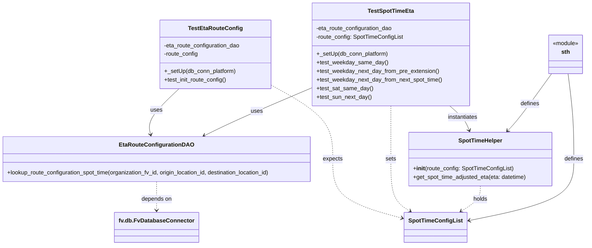

# Diagram: shipment_core/shipment_service/shipment_service/eta/eta_proxy/post_processing/tests/test_route_configuration.py

> Auto-generated by Obscura crawlers

## Mermaid

### SVG

<svg id="container" width="1658.833984375" xmlns="http://www.w3.org/2000/svg" class="classDiagram" height="686" viewBox="0 0 1658.833984375 686" role="graphics-document document" aria-roledescription="class"><g><defs><marker id="container_class-aggregationStart" class="marker aggregation class" refX="18" refY="7" markerWidth="190" markerHeight="240" orient="auto"><path d="M 18,7 L9,13 L1,7 L9,1 Z"></path></marker></defs><defs><marker id="container_class-aggregationEnd" class="marker aggregation class" refX="1" refY="7" markerWidth="20" markerHeight="28" orient="auto"><path d="M 18,7 L9,13 L1,7 L9,1 Z"></path></marker></defs><defs><marker id="container_class-extensionStart" class="marker extension class" refX="18" refY="7" markerWidth="190" markerHeight="240" orient="auto"><path d="M 1,7 L18,13 V 1 Z"></path></marker></defs><defs><marker id="container_class-extensionEnd" class="marker extension class" refX="1" refY="7" markerWidth="20" markerHeight="28" orient="auto"><path d="M 1,1 V 13 L18,7 Z"></path></marker></defs><defs><marker id="container_class-compositionStart" class="marker composition class" refX="18" refY="7" markerWidth="190" markerHeight="240" orient="auto"><path d="M 18,7 L9,13 L1,7 L9,1 Z"></path></marker></defs><defs><marker id="container_class-compositionEnd" class="marker composition class" refX="1" refY="7" markerWidth="20" markerHeight="28" orient="auto"><path d="M 18,7 L9,13 L1,7 L9,1 Z"></path></marker></defs><defs><marker id="container_class-dependencyStart" class="marker dependency class" refX="6" refY="7" markerWidth="190" markerHeight="240" orient="auto"><path d="M 5,7 L9,13 L1,7 L9,1 Z"></path></marker></defs><defs><marker id="container_class-dependencyEnd" class="marker dependency class" refX="13" refY="7" markerWidth="20" markerHeight="28" orient="auto"><path d="M 18,7 L9,13 L14,7 L9,1 Z"></path></marker></defs><defs><marker id="container_class-lollipopStart" class="marker lollipop class" refX="13" refY="7" markerWidth="190" markerHeight="240" orient="auto"><circle stroke="black" fill="transparent" cx="7" cy="7" r="6"></circle></marker></defs><defs><marker id="container_class-lollipopEnd" class="marker lollipop class" refX="1" refY="7" markerWidth="190" markerHeight="240" orient="auto"><circle stroke="black" fill="transparent" cx="7" cy="7" r="6"></circle></marker></defs><g class="root"><g class="clusters"></g><g class="edgePaths"><path d="M511.431,248L496.112,262.167C480.793,276.333,450.154,304.667,436.536,326.027C422.919,347.387,426.322,361.774,428.023,368.968L429.725,376.161" id="id_TestEtaRouteConfig_EtaRouteConfigurationDAO_1" class="edge-thickness-normal edge-pattern-solid relation" style=";;;" data-edge="true" data-et="edge" data-id="id_TestEtaRouteConfig_EtaRouteConfigurationDAO_1" data-points="W3sieCI6NTExLjQzMTQxNDAxOTMzNywieSI6MjQ4fSx7IngiOjQxOS41MTU2MjUsInkiOjMzM30seyJ4Ijo0MzEuMTA1OTU3MDMxMjUsInkiOjM4Mn1d" marker-end="url(#container_class-dependencyEnd)"></path><path d="M770.672,236.863L800.018,252.886C829.365,268.909,888.057,300.954,917.404,335.644C946.75,370.333,946.75,407.667,946.75,445C946.75,482.333,946.75,519.667,979.962,547.438C1013.175,575.21,1079.599,593.42,1112.812,602.525L1146.024,611.63" id="id_TestEtaRouteConfig_SpotTimeConfigList_2" class="edge-thickness-normal edge-pattern-dashed relation" style=";;;" data-edge="true" data-et="edge" data-id="id_TestEtaRouteConfig_SpotTimeConfigList_2" data-points="W3sieCI6NzcwLjY3MTg3NSwieSI6MjM2Ljg2MzA3ODI2NDU1ODIzfSx7IngiOjk0Ni43NSwieSI6MzMzfSx7IngiOjk0Ni43NSwieSI6NDQ1fSx7IngiOjk0Ni43NSwieSI6NTU3fSx7IngiOjExNTEuODEwNTQ2ODc1LCJ5Ijo2MTMuMjE2MDc5MzgwMjQ4NX1d" marker-end="url(#container_class-dependencyEnd)"></path><path d="M890.057,243.987L854.736,258.822C819.415,273.658,748.774,303.329,697.428,325.897C646.083,348.464,614.032,363.928,598.007,371.661L581.982,379.393" id="id_TestSpotTimeEta_EtaRouteConfigurationDAO_3" class="edge-thickness-normal edge-pattern-solid relation" style=";;;" data-edge="true" data-et="edge" data-id="id_TestSpotTimeEta_EtaRouteConfigurationDAO_3" data-points="W3sieCI6ODkwLjA1NjY0MDYyNSwieSI6MjQzLjk4NjkwMTQ0MzU2MDZ9LHsieCI6Njc4LjEzMjgxMjUsInkiOjMzM30seyJ4Ijo1NzYuNTc4MTI1LCJ5IjozODJ9XQ==" marker-end="url(#container_class-dependencyEnd)"></path><path d="M1109.061,296L1109.061,302.167C1109.061,308.333,1109.061,320.667,1109.061,345.5C1109.061,370.333,1109.061,407.667,1109.061,445C1109.061,482.333,1109.061,519.667,1118.038,543.968C1127.016,568.27,1144.971,579.54,1153.948,585.175L1162.925,590.81" id="id_TestSpotTimeEta_SpotTimeConfigList_4" class="edge-thickness-normal edge-pattern-dashed relation" style=";;;" data-edge="true" data-et="edge" data-id="id_TestSpotTimeEta_SpotTimeConfigList_4" data-points="W3sieCI6MTEwOS4wNjA1NDY4NzUsInkiOjI5Nn0seyJ4IjoxMTA5LjA2MDU0Njg3NSwieSI6MzMzfSx7IngiOjExMDkuMDYwNTQ2ODc1LCJ5Ijo0NDV9LHsieCI6MTEwOS4wNjA1NDY4NzUsInkiOjU1N30seyJ4IjoxMTY4LjAwNzM0Mjc2MTA3NiwieSI6NTk0fV0=" marker-end="url(#container_class-dependencyEnd)"></path><path d="M446.008,508L446.008,516.167C446.008,524.333,446.008,540.667,446.008,554C446.008,567.333,446.008,577.667,446.008,582.833L446.008,588" id="id_EtaRouteConfigurationDAO_fv.db.FvDatabaseConnector_5" class="edge-thickness-normal edge-pattern-dashed relation" style=";;;" data-edge="true" data-et="edge" data-id="id_EtaRouteConfigurationDAO_fv.db.FvDatabaseConnector_5" data-points="W3sieCI6NDQ2LjAwNzgxMjUsInkiOjUwOH0seyJ4Ijo0NDYuMDA3ODEyNSwieSI6NTU3fSx7IngiOjQ0Ni4wMDc4MTI1LCJ5Ijo1OTR9XQ==" marker-end="url(#container_class-dependencyEnd)"></path><path d="M1273.743,296L1280.795,302.167C1287.847,308.333,1301.952,320.667,1311.096,332.071C1320.24,343.476,1324.423,353.952,1326.514,359.19L1328.606,364.428" id="id_TestSpotTimeEta_SpotTimeHelper_6" class="edge-thickness-normal edge-pattern-solid relation" style=";;;" data-edge="true" data-et="edge" data-id="id_TestSpotTimeEta_SpotTimeHelper_6" data-points="W3sieCI6MTI3My43NDI1MjIwMTMxMjE1LCJ5IjoyOTZ9LHsieCI6MTMxNi4wNTY2NDA2MjUsInkiOjMzM30seyJ4IjoxMzMwLjgzMTA4OTU2NDczMiwieSI6MzcwfV0=" marker-end="url(#container_class-dependencyEnd)"></path><path d="M1360.779,520L1360.779,526.167C1360.779,532.333,1360.779,544.667,1351.802,556.468C1342.824,568.27,1324.869,579.54,1315.892,585.175L1306.914,590.81" id="id_SpotTimeHelper_SpotTimeConfigList_7" class="edge-thickness-normal edge-pattern-dashed relation" style=";;;" data-edge="true" data-et="edge" data-id="id_SpotTimeHelper_SpotTimeConfigList_7" data-points="W3sieCI6MTM2MC43NzkyOTY4NzUsInkiOjUyMH0seyJ4IjoxMzYwLjc3OTI5Njg3NSwieSI6NTU3fSx7IngiOjEzMDEuODMyNTAwOTg4OTI0LCJ5Ijo1OTR9XQ==" marker-end="url(#container_class-dependencyEnd)"></path><path d="M1561.727,206L1546.318,227.167C1530.91,248.333,1500.093,290.667,1479.406,317.282C1458.719,343.897,1448.164,354.794,1442.886,360.242L1437.608,365.69" id="id_sth_SpotTimeHelper_8" class="edge-thickness-normal edge-pattern-solid relation" style=";;;" data-edge="true" data-et="edge" data-id="id_sth_SpotTimeHelper_8" data-points="W3sieCI6MTU2MS43MjY5ODMzMzkwODgzLCJ5IjoyMDZ9LHsieCI6MTQ2OS4yNzUzOTA2MjUsInkiOjMzM30seyJ4IjoxNDMzLjQzMjkzMTA4MjU4OTIsInkiOjM3MH1d" marker-end="url(#container_class-dependencyEnd)"></path><path d="M1607.978,206L1610.699,227.167C1613.42,248.333,1618.861,290.667,1621.582,330.5C1624.303,370.333,1624.303,407.667,1624.303,445C1624.303,482.333,1624.303,519.667,1574.237,548.491C1524.172,577.315,1424.041,597.63,1373.975,607.788L1323.909,617.945" id="id_sth_SpotTimeConfigList_9" class="edge-thickness-normal edge-pattern-solid relation" style=";;;" data-edge="true" data-et="edge" data-id="id_sth_SpotTimeConfigList_9" data-points="W3sieCI6MTYwNy45NzgyMzUwNjU2MDc4LCJ5IjoyMDZ9LHsieCI6MTYyNC4zMDI3MzQzNzUsInkiOjMzM30seyJ4IjoxNjI0LjMwMjczNDM3NSwieSI6NDQ1fSx7IngiOjE2MjQuMzAyNzM0Mzc1LCJ5Ijo1NTd9LHsieCI6MTMxOC4wMjkyOTY4NzUsInkiOjYxOS4xMzgzMzk5MjA5NDg2fV0=" marker-end="url(#container_class-dependencyEnd)"></path></g><g class="edgeLabels"><g class="edgeLabel" transform="translate(446.98957, 307.59321)"><g class="label" data-id="id_TestEtaRouteConfig_EtaRouteConfigurationDAO_1" transform="translate(-16.4921875, -12)"><foreignObject width="32.984375" height="24">

uses

</foreignObject></g></g><g class="edgeLabel" transform="translate(946.75, 445)"><g class="label" data-id="id_TestEtaRouteConfig_SpotTimeConfigList_2" transform="translate(-27.734375, -12)"><foreignObject width="55.46875" height="24">

expects

</foreignObject></g></g><g class="edgeLabel" transform="translate(732.11477, 310.32628)"><g class="label" data-id="id_TestSpotTimeEta_EtaRouteConfigurationDAO_3" transform="translate(-16.4921875, -12)"><foreignObject width="32.984375" height="24">

uses

</foreignObject></g></g><g class="edgeLabel" transform="translate(1109.060546875, 445)"><g class="label" data-id="id_TestSpotTimeEta_SpotTimeConfigList_4" transform="translate(-14.7265625, -12)"><foreignObject width="29.453125" height="24">

sets

</foreignObject></g></g><g class="edgeLabel" transform="translate(446.0078125, 557)"><g class="label" data-id="id_EtaRouteConfigurationDAO_fv.db.FvDatabaseConnector_5" transform="translate(-42.9453125, -12)"><foreignObject width="85.890625" height="24">

depends on

</foreignObject></g></g><g class="edgeLabel" transform="translate(1309.89555, 327.61267)"><g class="label" data-id="id_TestSpotTimeEta_SpotTimeHelper_6" transform="translate(-42.9140625, -12)"><foreignObject width="85.828125" height="24">

instantiates

</foreignObject></g></g><g class="edgeLabel" transform="translate(1360.779296875, 557)"><g class="label" data-id="id_SpotTimeHelper_SpotTimeConfigList_7" transform="translate(-20.1875, -12)"><foreignObject width="40.375" height="24">

holds

</foreignObject></g></g><g class="edgeLabel" transform="translate(1500.34225, 290.32371)"><g class="label" data-id="id_sth_SpotTimeHelper_8" transform="translate(-26.53125, -12)"><foreignObject width="53.0625" height="24">

defines

</foreignObject></g></g><g class="edgeLabel" transform="translate(1624.302734375, 445)"><g class="label" data-id="id_sth_SpotTimeConfigList_9" transform="translate(-26.53125, -12)"><foreignObject width="53.0625" height="24">

defines

</foreignObject></g></g></g><g class="nodes"><g class="node default" id="classId-TestEtaRouteConfig-0" transform="translate(615.2421875, 152)"><g class="basic label-container"><path d="M-155.4296875 -96 L155.4296875 -96 L155.4296875 96 L-155.4296875 96" stroke="none" stroke-width="0" fill="#ECECFF" style=""></path><path d="M-155.4296875 -96 C-54.22454248948739 -96, 46.98060252102522 -96, 155.4296875 -96 M-155.4296875 -96 C-70.22193692623975 -96, 14.985813647520501 -96, 155.4296875 -96 M155.4296875 -96 C155.4296875 -28.67895402145183, 155.4296875 38.64209195709634, 155.4296875 96 M155.4296875 -96 C155.4296875 -25.761574554682397, 155.4296875 44.476850890635205, 155.4296875 96 M155.4296875 96 C69.84673824531092 96, -15.736211009378167 96, -155.4296875 96 M155.4296875 96 C32.37105352490937 96, -90.68758045018126 96, -155.4296875 96 M-155.4296875 96 C-155.4296875 43.84560860601562, -155.4296875 -8.308782787968767, -155.4296875 -96 M-155.4296875 96 C-155.4296875 40.51837517756328, -155.4296875 -14.963249644873443, -155.4296875 -96" stroke="#9370DB" stroke-width="1.3" fill="none" stroke-dasharray="0 0" style=""></path></g><g class="annotation-group text" transform="translate(0, -72)"></g><g class="label-group text" transform="translate(-71.046875, -72)"><g class="label" style="font-weight: bolder" transform="translate(0,-12)"><foreignObject width="142.09375" height="24">

TestEtaRouteConfig

</foreignObject></g></g><g class="members-group text" transform="translate(-143.4296875, -24)"><g class="label" style="" transform="translate(0,-12)"><foreignObject width="215.8125" height="24">

-eta_route_configuration_dao

</foreignObject></g><g class="label" style="" transform="translate(0,12)"><foreignObject width="96.3125" height="24">

-route_config

</foreignObject></g></g><g class="methods-group text" transform="translate(-143.4296875, 48)"><g class="label" style="" transform="translate(0,-12)"><foreignObject width="200.984375" height="24">

+_setUp(db_conn_platform)

</foreignObject></g><g class="label" style="" transform="translate(0,12)"><foreignObject width="176.453125" height="24">

+test_init_route_config()

</foreignObject></g></g><g class="divider" style=""><path d="M-155.4296875 -48 C-89.37976011764765 -48, -23.329832735295298 -48, 155.4296875 -48 M-155.4296875 -48 C-48.819949835195956 -48, 57.78978782960809 -48, 155.4296875 -48" stroke="#9370DB" stroke-width="1.3" fill="none" stroke-dasharray="0 0" style=""></path></g><g class="divider" style=""><path d="M-155.4296875 24 C-87.42307640754721 24, -19.416465315094428 24, 155.4296875 24 M-155.4296875 24 C-50.879067479877534 24, 53.67155254024493 24, 155.4296875 24" stroke="#9370DB" stroke-width="1.3" fill="none" stroke-dasharray="0 0" style=""></path></g></g><g class="node default" id="classId-TestSpotTimeEta-1" transform="translate(1109.060546875, 152)"><g class="basic label-container"><path d="M-219.00390625 -144 L219.00390625 -144 L219.00390625 144 L-219.00390625 144" stroke="none" stroke-width="0" fill="#ECECFF" style=""></path><path d="M-219.00390625 -144 C-107.46108617951793 -144, 4.081733890964131 -144, 219.00390625 -144 M-219.00390625 -144 C-125.62285974421819 -144, -32.24181323843638 -144, 219.00390625 -144 M219.00390625 -144 C219.00390625 -30.934193453739354, 219.00390625 82.13161309252129, 219.00390625 144 M219.00390625 -144 C219.00390625 -68.09464327288984, 219.00390625 7.81071345422032, 219.00390625 144 M219.00390625 144 C44.458161705055346 144, -130.0875828398893 144, -219.00390625 144 M219.00390625 144 C99.7741657958768 144, -19.455574658246405 144, -219.00390625 144 M-219.00390625 144 C-219.00390625 73.4027186411111, -219.00390625 2.8054372822221865, -219.00390625 -144 M-219.00390625 144 C-219.00390625 34.56129737145707, -219.00390625 -74.87740525708585, -219.00390625 -144" stroke="#9370DB" stroke-width="1.3" fill="none" stroke-dasharray="0 0" style=""></path></g><g class="annotation-group text" transform="translate(0, -120)"></g><g class="label-group text" transform="translate(-61.5546875, -120)"><g class="label" style="font-weight: bolder" transform="translate(0,-12)"><foreignObject width="123.109375" height="24">

TestSpotTimeEta

</foreignObject></g></g><g class="members-group text" transform="translate(-207.00390625, -72)"><g class="label" style="" transform="translate(0,-12)"><foreignObject width="215.8125" height="24">

-eta_route_configuration_dao

</foreignObject></g><g class="label" style="" transform="translate(0,12)"><foreignObject width="243.5625" height="24">

-route_config: SpotTimeConfigList

</foreignObject></g></g><g class="methods-group text" transform="translate(-207.00390625, 0)"><g class="label" style="" transform="translate(0,-12)"><foreignObject width="200.984375" height="24">

+_setUp(db_conn_platform)

</foreignObject></g><g class="label" style="" transform="translate(0,12)"><foreignObject width="196.515625" height="24">

+test_weekday_same_day()

</foreignObject></g><g class="label" style="" transform="translate(0,36)"><foreignObject width="342.109375" height="24">

+test_weekday_next_day_from_pre_extension()

</foreignObject></g><g class="label" style="" transform="translate(0,60)"><foreignObject width="352.453125" height="24">

+test_weekday_next_day_from_next_spot_time()

</foreignObject></g><g class="label" style="" transform="translate(0,84)"><foreignObject width="156.25" height="24">

+test_sat_same_day()

</foreignObject></g><g class="label" style="" transform="translate(0,108)"><foreignObject width="153.96875" height="24">

+test_sun_next_day()

</foreignObject></g></g><g class="divider" style=""><path d="M-219.00390625 -96 C-77.82268298833003 -96, 63.35854027333994 -96, 219.00390625 -96 M-219.00390625 -96 C-73.3988907255995 -96, 72.206124798801 -96, 219.00390625 -96" stroke="#9370DB" stroke-width="1.3" fill="none" stroke-dasharray="0 0" style=""></path></g><g class="divider" style=""><path d="M-219.00390625 -24 C-96.57012800883905 -24, 25.863650232321902 -24, 219.00390625 -24 M-219.00390625 -24 C-61.13147633232964 -24, 96.74095358534072 -24, 219.00390625 -24" stroke="#9370DB" stroke-width="1.3" fill="none" stroke-dasharray="0 0" style=""></path></g></g><g class="node default" id="classId-EtaRouteConfigurationDAO-2" transform="translate(446.0078125, 445)"><g class="basic label-container"><path d="M-438.0078125 -63 L438.0078125 -63 L438.0078125 63 L-438.0078125 63" stroke="none" stroke-width="0" fill="#ECECFF" style=""></path><path d="M-438.0078125 -63 C-256.7902855365228 -63, -75.57275857304563 -63, 438.0078125 -63 M-438.0078125 -63 C-182.54338298568345 -63, 72.9210465286331 -63, 438.0078125 -63 M438.0078125 -63 C438.0078125 -27.172692649851207, 438.0078125 8.654614700297586, 438.0078125 63 M438.0078125 -63 C438.0078125 -33.41610270470707, 438.0078125 -3.8322054094141436, 438.0078125 63 M438.0078125 63 C190.5998935553177 63, -56.808025389364616 63, -438.0078125 63 M438.0078125 63 C245.46478674300218 63, 52.92176098600436 63, -438.0078125 63 M-438.0078125 63 C-438.0078125 21.62512217462018, -438.0078125 -19.74975565075964, -438.0078125 -63 M-438.0078125 63 C-438.0078125 27.912220716411575, -438.0078125 -7.17555856717685, -438.0078125 -63" stroke="#9370DB" stroke-width="1.3" fill="none" stroke-dasharray="0 0" style=""></path></g><g class="annotation-group text" transform="translate(0, -39)"></g><g class="label-group text" transform="translate(-97.53125, -39)"><g class="label" style="font-weight: bolder" transform="translate(0,-12)"><foreignObject width="195.0625" height="24">

EtaRouteConfigurationDAO

</foreignObject></g></g><g class="members-group text" transform="translate(-426.0078125, 9)"></g><g class="methods-group text" transform="translate(-426.0078125, 39)"><g class="label" style="" transform="translate(0,-12)"><foreignObject width="754.484375" height="24">

+lookup_route_configuration_spot_time(organization_fv_id, origin_location_id, destination_location_id)

</foreignObject></g></g><g class="divider" style=""><path d="M-438.0078125 -15 C-236.60577399258446 -15, -35.20373548516892 -15, 438.0078125 -15 M-438.0078125 -15 C-203.8590822230664 -15, 30.28964805386721 -15, 438.0078125 -15" stroke="#9370DB" stroke-width="1.3" fill="none" stroke-dasharray="0 0" style=""></path></g><g class="divider" style=""><path d="M-438.0078125 9 C-209.25414817192885 9, 19.499516156142306 9, 438.0078125 9 M-438.0078125 9 C-179.8719438309701 9, 78.26392483805978 9, 438.0078125 9" stroke="#9370DB" stroke-width="1.3" fill="none" stroke-dasharray="0 0" style=""></path></g></g><g class="node default" id="classId-SpotTimeHelper-3" transform="translate(1360.779296875, 445)"><g class="basic label-container"><path d="M-201.9921875 -75 L201.9921875 -75 L201.9921875 75 L-201.9921875 75" stroke="none" stroke-width="0" fill="#ECECFF" style=""></path><path d="M-201.9921875 -75 C-101.28310091238822 -75, -0.5740143247764422 -75, 201.9921875 -75 M-201.9921875 -75 C-114.88591539956737 -75, -27.779643299134733 -75, 201.9921875 -75 M201.9921875 -75 C201.9921875 -18.893344732077736, 201.9921875 37.21331053584453, 201.9921875 75 M201.9921875 -75 C201.9921875 -34.440522862038506, 201.9921875 6.118954275922988, 201.9921875 75 M201.9921875 75 C107.17638077763996 75, 12.360574055279926 75, -201.9921875 75 M201.9921875 75 C114.8522204252163 75, 27.712253350432604 75, -201.9921875 75 M-201.9921875 75 C-201.9921875 30.34097370755824, -201.9921875 -14.318052584883517, -201.9921875 -75 M-201.9921875 75 C-201.9921875 41.874497348923356, -201.9921875 8.748994697846712, -201.9921875 -75" stroke="#9370DB" stroke-width="1.3" fill="none" stroke-dasharray="0 0" style=""></path></g><g class="annotation-group text" transform="translate(0, -51)"></g><g class="label-group text" transform="translate(-59.390625, -51)"><g class="label" style="font-weight: bolder" transform="translate(0,-12)"><foreignObject width="118.78125" height="24">

SpotTimeHelper

</foreignObject></g></g><g class="members-group text" transform="translate(-189.9921875, -3)"></g><g class="methods-group text" transform="translate(-189.9921875, 27)"><g class="label" style="" transform="translate(0,-12)"><foreignObject width="279.90625" height="24">

+<strong>init</strong>(route_config: SpotTimeConfigList)

</foreignObject></g><g class="label" style="" transform="translate(0,12)"><foreignObject width="320.59375" height="24">

+get_spot_time_adjusted_eta(eta: datetime)

</foreignObject></g></g><g class="divider" style=""><path d="M-201.9921875 -27 C-52.08997340805104 -27, 97.81224068389793 -27, 201.9921875 -27 M-201.9921875 -27 C-54.543441552942596 -27, 92.90530439411481 -27, 201.9921875 -27" stroke="#9370DB" stroke-width="1.3" fill="none" stroke-dasharray="0 0" style=""></path></g><g class="divider" style=""><path d="M-201.9921875 -3 C-118.54700337193395 -3, -35.10181924386791 -3, 201.9921875 -3 M-201.9921875 -3 C-108.7320620501196 -3, -15.47193660023919 -3, 201.9921875 -3" stroke="#9370DB" stroke-width="1.3" fill="none" stroke-dasharray="0 0" style=""></path></g></g><g class="node default" id="classId-SpotTimeConfigList-4" transform="translate(1234.919921875, 636)"><g class="basic label-container"><path d="M-83.109375 -42 L83.109375 -42 L83.109375 42 L-83.109375 42" stroke="none" stroke-width="0" fill="#ECECFF" style=""></path><path d="M-83.109375 -42 C-39.10142353592786 -42, 4.9065279281442855 -42, 83.109375 -42 M-83.109375 -42 C-38.38127486827143 -42, 6.346825263457134 -42, 83.109375 -42 M83.109375 -42 C83.109375 -18.18325010500889, 83.109375 5.633499789982217, 83.109375 42 M83.109375 -42 C83.109375 -15.812125555047785, 83.109375 10.375748889904429, 83.109375 42 M83.109375 42 C40.09759625456874 42, -2.9141824908625154 42, -83.109375 42 M83.109375 42 C30.997802288560983 42, -21.113770422878034 42, -83.109375 42 M-83.109375 42 C-83.109375 12.13452582906028, -83.109375 -17.73094834187944, -83.109375 -42 M-83.109375 42 C-83.109375 10.966415438681256, -83.109375 -20.067169122637488, -83.109375 -42" stroke="#9370DB" stroke-width="1.3" fill="none" stroke-dasharray="0 0" style=""></path></g><g class="annotation-group text" transform="translate(0, -18)"></g><g class="label-group text" transform="translate(-71.109375, -18)"><g class="label" style="font-weight: bolder" transform="translate(0,-12)"><foreignObject width="142.21875" height="24">

SpotTimeConfigList

</foreignObject></g></g><g class="members-group text" transform="translate(-71.109375, 30)"></g><g class="methods-group text" transform="translate(-71.109375, 60)"></g><g class="divider" style=""><path d="M-83.109375 6 C-32.93978432155232 6, 17.229806356895367 6, 83.109375 6 M-83.109375 6 C-17.583256192298023 6, 47.94286261540395 6, 83.109375 6" stroke="#9370DB" stroke-width="1.3" fill="none" stroke-dasharray="0 0" style=""></path></g><g class="divider" style=""><path d="M-83.109375 24 C-30.96681891811388 24, 21.17573716377224 24, 83.109375 24 M-83.109375 24 C-25.38903157987677 24, 32.33131184024646 24, 83.109375 24" stroke="#9370DB" stroke-width="1.3" fill="none" stroke-dasharray="0 0" style=""></path></g></g><g class="node default" id="classId-fv.db.FvDatabaseConnector-5" transform="translate(446.0078125, 636)"><g class="basic label-container"><path d="M-111.1953125 -42 L111.1953125 -42 L111.1953125 42 L-111.1953125 42" stroke="none" stroke-width="0" fill="#ECECFF" style=""></path><path d="M-111.1953125 -42 C-55.903242288011924 -42, -0.6111720760238484 -42, 111.1953125 -42 M-111.1953125 -42 C-59.18049004309413 -42, -7.165667586188263 -42, 111.1953125 -42 M111.1953125 -42 C111.1953125 -24.582164512841583, 111.1953125 -7.164329025683166, 111.1953125 42 M111.1953125 -42 C111.1953125 -14.46814764472056, 111.1953125 13.06370471055888, 111.1953125 42 M111.1953125 42 C34.166332445786125 42, -42.86264760842775 42, -111.1953125 42 M111.1953125 42 C50.04401486663167 42, -11.10728276673666 42, -111.1953125 42 M-111.1953125 42 C-111.1953125 17.68384122961261, -111.1953125 -6.632317540774778, -111.1953125 -42 M-111.1953125 42 C-111.1953125 12.92013167336452, -111.1953125 -16.15973665327096, -111.1953125 -42" stroke="#9370DB" stroke-width="1.3" fill="none" stroke-dasharray="0 0" style=""></path></g><g class="annotation-group text" transform="translate(0, -18)"></g><g class="label-group text" transform="translate(-99.1953125, -18)"><g class="label" style="font-weight: bolder" transform="translate(0,-12)"><foreignObject width="198.390625" height="24">

fv.db.FvDatabaseConnector

</foreignObject></g></g><g class="members-group text" transform="translate(-99.1953125, 30)"></g><g class="methods-group text" transform="translate(-99.1953125, 60)"></g><g class="divider" style=""><path d="M-111.1953125 6 C-55.41991840257377 6, 0.35547569485245845 6, 111.1953125 6 M-111.1953125 6 C-40.44318288098712 6, 30.308946738025753 6, 111.1953125 6" stroke="#9370DB" stroke-width="1.3" fill="none" stroke-dasharray="0 0" style=""></path></g><g class="divider" style=""><path d="M-111.1953125 24 C-57.74239385008491 24, -4.289475200169818 24, 111.1953125 24 M-111.1953125 24 C-50.22965032982766 24, 10.736011840344673 24, 111.1953125 24" stroke="#9370DB" stroke-width="1.3" fill="none" stroke-dasharray="0 0" style=""></path></g></g><g class="node default" id="classId-sth-6" transform="translate(1601.037109375, 152)"><g class="basic label-container"><path d="M-48.6015625 -54 L48.6015625 -54 L48.6015625 54 L-48.6015625 54" stroke="none" stroke-width="0" fill="#ECECFF" style=""></path><path d="M-48.6015625 -54 C-28.26448279052303 -54, -7.927403081046059 -54, 48.6015625 -54 M-48.6015625 -54 C-19.966487023597157 -54, 8.668588452805686 -54, 48.6015625 -54 M48.6015625 -54 C48.6015625 -14.498628179019008, 48.6015625 25.002743641961985, 48.6015625 54 M48.6015625 -54 C48.6015625 -25.24026383461336, 48.6015625 3.519472330773283, 48.6015625 54 M48.6015625 54 C26.00267548759634 54, 3.403788475192677 54, -48.6015625 54 M48.6015625 54 C14.791696980396296 54, -19.01816853920741 54, -48.6015625 54 M-48.6015625 54 C-48.6015625 13.8286527032487, -48.6015625 -26.3426945935026, -48.6015625 -54 M-48.6015625 54 C-48.6015625 16.733602292660713, -48.6015625 -20.532795414678574, -48.6015625 -54" stroke="#9370DB" stroke-width="1.3" fill="none" stroke-dasharray="0 0" style=""></path></g><g class="annotation-group text" transform="translate(-36.6015625, -30)"><g class="label" style="" transform="translate(0,-12)"><foreignObject width="73.203125" height="24">

«module»

</foreignObject></g></g><g class="label-group text" transform="translate(-11.5703125, -6)"><g class="label" style="font-weight: bolder" transform="translate(0,-12)"><foreignObject width="23.140625" height="24">

sth

</foreignObject></g></g><g class="members-group text" transform="translate(-36.6015625, 42)"></g><g class="methods-group text" transform="translate(-36.6015625, 72)"></g><g class="divider" style=""><path d="M-48.6015625 18 C-23.000040182893734 18, 2.6014821342125316 18, 48.6015625 18 M-48.6015625 18 C-24.026331578271208 18, 0.5488993434575846 18, 48.6015625 18" stroke="#9370DB" stroke-width="1.3" fill="none" stroke-dasharray="0 0" style=""></path></g><g class="divider" style=""><path d="M-48.6015625 36 C-22.367068930857787 36, 3.867424638284426 36, 48.6015625 36 M-48.6015625 36 C-10.10784288218482 36, 28.38587673563036 36, 48.6015625 36" stroke="#9370DB" stroke-width="1.3" fill="none" stroke-dasharray="0 0" style=""></path></g></g></g></g></g></svg>
