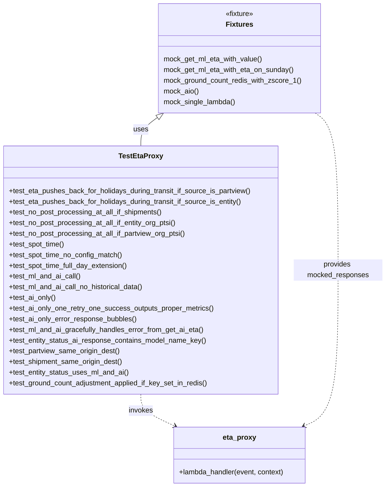

# Diagram: shipment_core/shipment_service/shipment_service/eta/eta_proxy/tests/test_eta_proxy.py


> Auto-generated by Obscura crawlers

## Diagram 1



### SVG

<svg id="container" width="872.609375" xmlns="http://www.w3.org/2000/svg" class="classDiagram" height="1094" viewBox="0 0 872.609375 1094" role="graphics-document document" aria-roledescription="class"><style>#container{font-family:"trebuchet ms",verdana,arial,sans-serif;font-size:16px;fill:#333;}@keyframes edge-animation-frame{from{stroke-dashoffset:0;}}@keyframes dash{to{stroke-dashoffset:0;}}#container .edge-animation-slow{stroke-dasharray:9,5!important;stroke-dashoffset:900;animation:dash 50s linear infinite;stroke-linecap:round;}#container .edge-animation-fast{stroke-dasharray:9,5!important;stroke-dashoffset:900;animation:dash 20s linear infinite;stroke-linecap:round;}#container .error-icon{fill:#552222;}#container .error-text{fill:#552222;stroke:#552222;}#container .edge-thickness-normal{stroke-width:1px;}#container .edge-thickness-thick{stroke-width:3.5px;}#container .edge-pattern-solid{stroke-dasharray:0;}#container .edge-thickness-invisible{stroke-width:0;fill:none;}#container .edge-pattern-dashed{stroke-dasharray:3;}#container .edge-pattern-dotted{stroke-dasharray:2;}#container .marker{fill:#333333;stroke:#333333;}#container .marker.cross{stroke:#333333;}#container svg{font-family:"trebuchet ms",verdana,arial,sans-serif;font-size:16px;}#container p{margin:0;}#container g.classGroup text{fill:#9370DB;stroke:none;font-family:"trebuchet ms",verdana,arial,sans-serif;font-size:10px;}#container g.classGroup text .title{font-weight:bolder;}#container .nodeLabel,#container .edgeLabel{color:#131300;}#container .edgeLabel .label rect{fill:#ECECFF;}#container .label text{fill:#131300;}#container .labelBkg{background:#ECECFF;}#container .edgeLabel .label span{background:#ECECFF;}#container .classTitle{font-weight:bolder;}#container .node rect,#container .node circle,#container .node ellipse,#container .node polygon,#container .node path{fill:#ECECFF;stroke:#9370DB;stroke-width:1px;}#container .divider{stroke:#9370DB;stroke-width:1;}#container g.clickable{cursor:pointer;}#container g.classGroup rect{fill:#ECECFF;stroke:#9370DB;}#container g.classGroup line{stroke:#9370DB;stroke-width:1;}#container .classLabel .box{stroke:none;stroke-width:0;fill:#ECECFF;opacity:0.5;}#container .classLabel .label{fill:#9370DB;font-size:10px;}#container .relation{stroke:#333333;stroke-width:1;fill:none;}#container .dashed-line{stroke-dasharray:3;}#container .dotted-line{stroke-dasharray:1 2;}#container #compositionStart,#container .composition{fill:#333333!important;stroke:#333333!important;stroke-width:1;}#container #compositionEnd,#container .composition{fill:#333333!important;stroke:#333333!important;stroke-width:1;}#container #dependencyStart,#container .dependency{fill:#333333!important;stroke:#333333!important;stroke-width:1;}#container #dependencyStart,#container .dependency{fill:#333333!important;stroke:#333333!important;stroke-width:1;}#container #extensionStart,#container .extension{fill:transparent!important;stroke:#333333!important;stroke-width:1;}#container #extensionEnd,#container .extension{fill:transparent!important;stroke:#333333!important;stroke-width:1;}#container #aggregationStart,#container .aggregation{fill:transparent!important;stroke:#333333!important;stroke-width:1;}#container #aggregationEnd,#container .aggregation{fill:transparent!important;stroke:#333333!important;stroke-width:1;}#container #lollipopStart,#container .lollipop{fill:#ECECFF!important;stroke:#333333!important;stroke-width:1;}#container #lollipopEnd,#container .lollipop{fill:#ECECFF!important;stroke:#333333!important;stroke-width:1;}#container .edgeTerminals{font-size:11px;line-height:initial;}#container .classTitleText{text-anchor:middle;font-size:18px;fill:#333;}#container .label-icon{display:inline-block;height:1em;overflow:visible;vertical-align:-0.125em;}#container .node .label-icon path{fill:currentColor;stroke:revert;stroke-width:revert;}#container :root{--mermaid-font-family:"trebuchet ms",verdana,arial,sans-serif;}</style><g><defs><marker id="container_class-aggregationStart" class="marker aggregation class" refX="18" refY="7" markerWidth="190" markerHeight="240" orient="auto"><path d="M 18,7 L9,13 L1,7 L9,1 Z"></path></marker></defs><defs><marker id="container_class-aggregationEnd" class="marker aggregation class" refX="1" refY="7" markerWidth="20" markerHeight="28" orient="auto"><path d="M 18,7 L9,13 L1,7 L9,1 Z"></path></marker></defs><defs><marker id="container_class-extensionStart" class="marker extension class" refX="18" refY="7" markerWidth="190" markerHeight="240" orient="auto"><path d="M 1,7 L18,13 V 1 Z"></path></marker></defs><defs><marker id="container_class-extensionEnd" class="marker extension class" refX="1" refY="7" markerWidth="20" markerHeight="28" orient="auto"><path d="M 1,1 V 13 L18,7 Z"></path></marker></defs><defs><marker id="container_class-compositionStart" class="marker composition class" refX="18" refY="7" markerWidth="190" markerHeight="240" orient="auto"><path d="M 18,7 L9,13 L1,7 L9,1 Z"></path></marker></defs><defs><marker id="container_class-compositionEnd" class="marker composition class" refX="1" refY="7" markerWidth="20" markerHeight="28" orient="auto"><path d="M 18,7 L9,13 L1,7 L9,1 Z"></path></marker></defs><defs><marker id="container_class-dependencyStart" class="marker dependency class" refX="6" refY="7" markerWidth="190" markerHeight="240" orient="auto"><path d="M 5,7 L9,13 L1,7 L9,1 Z"></path></marker></defs><defs><marker id="container_class-dependencyEnd" class="marker dependency class" refX="13" refY="7" markerWidth="20" markerHeight="28" orient="auto"><path d="M 18,7 L9,13 L14,7 L9,1 Z"></path></marker></defs><defs><marker id="container_class-lollipopStart" class="marker lollipop class" refX="13" refY="7" markerWidth="190" markerHeight="240" orient="auto"><circle stroke="black" fill="transparent" cx="7" cy="7" r="6"></circle></marker></defs><defs><marker id="container_class-lollipopEnd" class="marker lollipop class" refX="1" refY="7" markerWidth="190" markerHeight="240" orient="auto"><circle stroke="black" fill="transparent" cx="7" cy="7" r="6"></circle></marker></defs><g class="root"><g class="clusters"></g><g class="edgePaths"><path d="M356.337,264.059L350.082,268.549C343.826,273.039,331.316,282.02,325.06,292.676C318.805,303.333,318.805,315.667,318.805,321.833L318.805,328" id="id_Fixtures_TestEtaProxy_1" class="edge-thickness-normal edge-pattern-solid relation" style=";;;" data-edge="true" data-et="edge" data-id="id_Fixtures_TestEtaProxy_1" data-points="W3sieCI6MzcwLjM1MDg1NDQ5MjE4NzUsInkiOjI1NH0seyJ4IjozMTguODA0Njg3NSwieSI6MjkxfSx7IngiOjMxOC44MDQ2ODc1LCJ5IjozMjh9XQ==" marker-start="url(#container_class-extensionStart)"></path><path d="M318.805,886L318.805,892.167C318.805,898.333,318.805,910.667,331.638,922.591C344.471,934.515,370.138,946.029,382.971,951.787L395.804,957.544" id="id_TestEtaProxy_eta_proxy_2" class="edge-thickness-normal edge-pattern-dashed relation" style=";;;" data-edge="true" data-et="edge" data-id="id_TestEtaProxy_eta_proxy_2" data-points="W3sieCI6MzE4LjgwNDY4NzUsInkiOjg4Nn0seyJ4IjozMTguODA0Njg3NSwieSI6OTIzfSx7IngiOjQwMS4yNzg1NTQ2ODc1LCJ5Ijo5NjB9XQ==" marker-end="url(#container_class-dependencyEnd)"></path><path d="M713.063,254L721.654,260.167C730.245,266.333,747.427,278.667,756.018,337.5C764.609,396.333,764.609,501.667,764.609,607C764.609,712.333,764.609,817.667,751.776,876.091C738.943,934.515,713.276,946.029,700.443,951.787L687.61,957.544" id="id_Fixtures_eta_proxy_3" class="edge-thickness-normal edge-pattern-dashed relation" style=";;;" data-edge="true" data-et="edge" data-id="id_Fixtures_eta_proxy_3" data-points="W3sieCI6NzEzLjA2MzIwODAwNzgxMjUsInkiOjI1NH0seyJ4Ijo3NjQuNjA5Mzc1LCJ5IjoyOTF9LHsieCI6NzY0LjYwOTM3NSwieSI6NjA3fSx7IngiOjc2NC42MDkzNzUsInkiOjkyM30seyJ4Ijo2ODIuMTM1NTA3ODEyNSwieSI6OTYwfV0=" marker-end="url(#container_class-dependencyEnd)"></path></g><g class="edgeLabels"><g class="edgeLabel" transform="translate(318.8046875, 291)"><g class="label" data-id="id_Fixtures_TestEtaProxy_1" transform="translate(-16.4921875, -12)"><foreignObject width="32.984375" height="24"><div xmlns="http://www.w3.org/1999/xhtml" class="labelBkg" style="display: table-cell; white-space: nowrap; line-height: 1.5; max-width: 200px; text-align: center;"><span class="edgeLabel"><p>uses</p></span></div></foreignObject></g></g><g class="edgeLabel" transform="translate(318.8046875, 923)"><g class="label" data-id="id_TestEtaProxy_eta_proxy_2" transform="translate(-27.5859375, -12)"><foreignObject width="55.171875" height="24"><div xmlns="http://www.w3.org/1999/xhtml" class="labelBkg" style="display: table-cell; white-space: nowrap; line-height: 1.5; max-width: 200px; text-align: center;"><span class="edgeLabel"><p>invokes</p></span></div></foreignObject></g></g><g class="edgeLabel" transform="translate(764.609375, 607)"><g class="label" data-id="id_Fixtures_eta_proxy_3" transform="translate(-100, -24)"><foreignObject width="200" height="48"><div xmlns="http://www.w3.org/1999/xhtml" class="labelBkg" style="display: table; white-space: break-spaces; line-height: 1.5; max-width: 200px; text-align: center; width: 200px;"><span class="edgeLabel"><p>provides mocked_responses</p></span></div></foreignObject></g></g></g><g class="nodes"><g class="node default" id="classId-Fixtures-0" transform="translate(541.70703125, 131)"><g class="basic label-container"><path d="M-182.4453125 -123 L182.4453125 -123 L182.4453125 123 L-182.4453125 123" stroke="none" stroke-width="0" fill="#ECECFF" style=""></path><path d="M-182.4453125 -123 C-108.07580306569812 -123, -33.70629363139625 -123, 182.4453125 -123 M-182.4453125 -123 C-100.10424879878447 -123, -17.763185097568936 -123, 182.4453125 -123 M182.4453125 -123 C182.4453125 -43.71666648825408, 182.4453125 35.566667023491846, 182.4453125 123 M182.4453125 -123 C182.4453125 -29.368062614831146, 182.4453125 64.26387477033771, 182.4453125 123 M182.4453125 123 C45.29687467643751 123, -91.85156314712498 123, -182.4453125 123 M182.4453125 123 C49.047271783070556 123, -84.35076893385889 123, -182.4453125 123 M-182.4453125 123 C-182.4453125 55.051613246712876, -182.4453125 -12.896773506574249, -182.4453125 -123 M-182.4453125 123 C-182.4453125 53.65379527565082, -182.4453125 -15.692409448698356, -182.4453125 -123" stroke="#9370DB" stroke-width="1.3" fill="none" stroke-dasharray="0 0" style=""></path></g><g class="annotation-group text" transform="translate(-32.203125, -99)"><g class="label" style="" transform="translate(0,-12)"><foreignObject width="64.40625" height="24"><div xmlns="http://www.w3.org/1999/xhtml" style="display: table-cell; white-space: nowrap; line-height: 1.5; max-width: 114px; text-align: center;"><span class="nodeLabel markdown-node-label" style=""><p>«fixture»</p></span></div></foreignObject></g></g><g class="label-group text" transform="translate(-28.9296875, -75)"><g class="label" style="font-weight: bolder" transform="translate(0,-12)"><foreignObject width="57.859375" height="24"><div xmlns="http://www.w3.org/1999/xhtml" style="display: table-cell; white-space: nowrap; line-height: 1.5; max-width: 107px; text-align: center;"><span class="nodeLabel markdown-node-label" style=""><p>Fixtures</p></span></div></foreignObject></g></g><g class="members-group text" transform="translate(-170.4453125, -27)"></g><g class="methods-group text" transform="translate(-170.4453125, 3)"><g class="label" style="" transform="translate(0,-12)"><foreignObject width="223.953125" height="24"><div xmlns="http://www.w3.org/1999/xhtml" style="display: table-cell; white-space: nowrap; line-height: 1.5; max-width: 274px; text-align: center;"><span class="nodeLabel markdown-node-label" style=""><p>mock_get_ml_eta_with_value()</p></span></div></foreignObject></g><g class="label" style="" transform="translate(0,12)"><foreignObject width="295.4375" height="24"><div xmlns="http://www.w3.org/1999/xhtml" style="display: table-cell; white-space: nowrap; line-height: 1.5; max-width: 345px; text-align: center;"><span class="nodeLabel markdown-node-label" style=""><p>mock_get_ml_eta_with_eta_on_sunday()</p></span></div></foreignObject></g><g class="label" style="" transform="translate(0,36)"><foreignObject width="308.6875" height="24"><div xmlns="http://www.w3.org/1999/xhtml" style="display: table-cell; white-space: nowrap; line-height: 1.5; max-width: 359px; text-align: center;"><span class="nodeLabel markdown-node-label" style=""><p>mock_ground_count_redis_with_zscore_1()</p></span></div></foreignObject></g><g class="label" style="" transform="translate(0,60)"><foreignObject width="79.828125" height="24"><div xmlns="http://www.w3.org/1999/xhtml" style="display: table-cell; white-space: nowrap; line-height: 1.5; max-width: 130px; text-align: center;"><span class="nodeLabel markdown-node-label" style=""><p>mock_aio()</p></span></div></foreignObject></g><g class="label" style="" transform="translate(0,84)"><foreignObject width="163.234375" height="24"><div xmlns="http://www.w3.org/1999/xhtml" style="display: table-cell; white-space: nowrap; line-height: 1.5; max-width: 213px; text-align: center;"><span class="nodeLabel markdown-node-label" style=""><p>mock_single_lambda()</p></span></div></foreignObject></g></g><g class="divider" style=""><path d="M-182.4453125 -51 C-65.58286279984058 -51, 51.27958690031883 -51, 182.4453125 -51 M-182.4453125 -51 C-101.64425900982735 -51, -20.843205519654703 -51, 182.4453125 -51" stroke="#9370DB" stroke-width="1.3" fill="none" stroke-dasharray="0 0" style=""></path></g><g class="divider" style=""><path d="M-182.4453125 -27 C-51.62177843553965 -27, 79.2017556289207 -27, 182.4453125 -27 M-182.4453125 -27 C-73.86537518237671 -27, 34.71456213524658 -27, 182.4453125 -27" stroke="#9370DB" stroke-width="1.3" fill="none" stroke-dasharray="0 0" style=""></path></g></g><g class="node default" id="classId-TestEtaProxy-1" transform="translate(318.8046875, 607)"><g class="basic label-container"><path d="M-310.8046875 -279 L310.8046875 -279 L310.8046875 279 L-310.8046875 279" stroke="none" stroke-width="0" fill="#ECECFF" style=""></path><path d="M-310.8046875 -279 C-77.95077279025742 -279, 154.90314191948517 -279, 310.8046875 -279 M-310.8046875 -279 C-138.19208370027724 -279, 34.420520099445525 -279, 310.8046875 -279 M310.8046875 -279 C310.8046875 -84.97609028521637, 310.8046875 109.04781942956726, 310.8046875 279 M310.8046875 -279 C310.8046875 -111.17228321366696, 310.8046875 56.655433572666084, 310.8046875 279 M310.8046875 279 C64.0224585027193 279, -182.7597704945614 279, -310.8046875 279 M310.8046875 279 C182.6486486658094 279, 54.49260983161878 279, -310.8046875 279 M-310.8046875 279 C-310.8046875 156.19886912251553, -310.8046875 33.39773824503109, -310.8046875 -279 M-310.8046875 279 C-310.8046875 127.10968466301262, -310.8046875 -24.78063067397477, -310.8046875 -279" stroke="#9370DB" stroke-width="1.3" fill="none" stroke-dasharray="0 0" style=""></path></g><g class="annotation-group text" transform="translate(0, -255)"></g><g class="label-group text" transform="translate(-47.109375, -255)"><g class="label" style="font-weight: bolder" transform="translate(0,-12)"><foreignObject width="94.21875" height="24"><div xmlns="http://www.w3.org/1999/xhtml" style="display: table-cell; white-space: nowrap; line-height: 1.5; max-width: 142px; text-align: center;"><span class="nodeLabel markdown-node-label" style=""><p>TestEtaProxy</p></span></div></foreignObject></g></g><g class="members-group text" transform="translate(-298.8046875, -207)"></g><g class="methods-group text" transform="translate(-298.8046875, -177)"><g class="label" style="" transform="translate(0,-12)"><foreignObject width="550.5" height="24"><div xmlns="http://www.w3.org/1999/xhtml" style="display: table-cell; white-space: nowrap; line-height: 1.5; max-width: 608px; text-align: center;"><span class="nodeLabel markdown-node-label" style=""><p>+test_eta_pushes_back_for_holidays_during_transit_if_source_is_partview()</p></span></div></foreignObject></g><g class="label" style="" transform="translate(0,12)"><foreignObject width="529.640625" height="24"><div xmlns="http://www.w3.org/1999/xhtml" style="display: table-cell; white-space: nowrap; line-height: 1.5; max-width: 587px; text-align: center;"><span class="nodeLabel markdown-node-label" style=""><p>+test_eta_pushes_back_for_holidays_during_transit_if_source_is_entity()</p></span></div></foreignObject></g><g class="label" style="" transform="translate(0,36)"><foreignObject width="349.234375" height="24"><div xmlns="http://www.w3.org/1999/xhtml" style="display: table-cell; white-space: nowrap; line-height: 1.5; max-width: 407px; text-align: center;"><span class="nodeLabel markdown-node-label" style=""><p>+test_no_post_processing_at_all_if_shipments()</p></span></div></foreignObject></g><g class="label" style="" transform="translate(0,60)"><foreignObject width="381.71875" height="24"><div xmlns="http://www.w3.org/1999/xhtml" style="display: table-cell; white-space: nowrap; line-height: 1.5; max-width: 439px; text-align: center;"><span class="nodeLabel markdown-node-label" style=""><p>+test_no_post_processing_at_all_if_entity_org_ptsi()</p></span></div></foreignObject></g><g class="label" style="" transform="translate(0,84)"><foreignObject width="402.75" height="24"><div xmlns="http://www.w3.org/1999/xhtml" style="display: table-cell; white-space: nowrap; line-height: 1.5; max-width: 460px; text-align: center;"><span class="nodeLabel markdown-node-label" style=""><p>+test_no_post_processing_at_all_if_partview_org_ptsi()</p></span></div></foreignObject></g><g class="label" style="" transform="translate(0,108)"><foreignObject width="126.921875" height="24"><div xmlns="http://www.w3.org/1999/xhtml" style="display: table-cell; white-space: nowrap; line-height: 1.5; max-width: 184px; text-align: center;"><span class="nodeLabel markdown-node-label" style=""><p>+test_spot_time()</p></span></div></foreignObject></g><g class="label" style="" transform="translate(0,132)"><foreignObject width="258.25" height="24"><div xmlns="http://www.w3.org/1999/xhtml" style="display: table-cell; white-space: nowrap; line-height: 1.5; max-width: 316px; text-align: center;"><span class="nodeLabel markdown-node-label" style=""><p>+test_spot_time_no_config_match()</p></span></div></foreignObject></g><g class="label" style="" transform="translate(0,156)"><foreignObject width="270.75" height="24"><div xmlns="http://www.w3.org/1999/xhtml" style="display: table-cell; white-space: nowrap; line-height: 1.5; max-width: 328px; text-align: center;"><span class="nodeLabel markdown-node-label" style=""><p>+test_spot_time_full_day_extension()</p></span></div></foreignObject></g><g class="label" style="" transform="translate(0,180)"><foreignObject width="162.78125" height="24"><div xmlns="http://www.w3.org/1999/xhtml" style="display: table-cell; white-space: nowrap; line-height: 1.5; max-width: 220px; text-align: center;"><span class="nodeLabel markdown-node-label" style=""><p>+test_ml_and_ai_call()</p></span></div></foreignObject></g><g class="label" style="" transform="translate(0,204)"><foreignObject width="306.109375" height="24"><div xmlns="http://www.w3.org/1999/xhtml" style="display: table-cell; white-space: nowrap; line-height: 1.5; max-width: 363px; text-align: center;"><span class="nodeLabel markdown-node-label" style=""><p>+test_ml_and_ai_call_no_historical_data()</p></span></div></foreignObject></g><g class="label" style="" transform="translate(0,228)"><foreignObject width="106.125" height="24"><div xmlns="http://www.w3.org/1999/xhtml" style="display: table-cell; white-space: nowrap; line-height: 1.5; max-width: 163px; text-align: center;"><span class="nodeLabel markdown-node-label" style=""><p>+test_ai_only()</p></span></div></foreignObject></g><g class="label" style="" transform="translate(0,252)"><foreignObject width="463.40625" height="24"><div xmlns="http://www.w3.org/1999/xhtml" style="display: table-cell; white-space: nowrap; line-height: 1.5; max-width: 521px; text-align: center;"><span class="nodeLabel markdown-node-label" style=""><p>+test_ai_only_one_retry_one_success_outputs_proper_metrics()</p></span></div></foreignObject></g><g class="label" style="" transform="translate(0,276)"><foreignObject width="289.71875" height="24"><div xmlns="http://www.w3.org/1999/xhtml" style="display: table-cell; white-space: nowrap; line-height: 1.5; max-width: 347px; text-align: center;"><span class="nodeLabel markdown-node-label" style=""><p>+test_ai_only_error_response_bubbles()</p></span></div></foreignObject></g><g class="label" style="" transform="translate(0,300)"><foreignObject width="441.890625" height="24"><div xmlns="http://www.w3.org/1999/xhtml" style="display: table-cell; white-space: nowrap; line-height: 1.5; max-width: 499px; text-align: center;"><span class="nodeLabel markdown-node-label" style=""><p>+test_ml_and_ai_gracefully_handles_error_from_get_ai_eta()</p></span></div></foreignObject></g><g class="label" style="" transform="translate(0,324)"><foreignObject width="448.390625" height="24"><div xmlns="http://www.w3.org/1999/xhtml" style="display: table-cell; white-space: nowrap; line-height: 1.5; max-width: 506px; text-align: center;"><span class="nodeLabel markdown-node-label" style=""><p>+test_entity_status_ai_response_contains_model_name_key()</p></span></div></foreignObject></g><g class="label" style="" transform="translate(0,348)"><foreignObject width="252.5" height="24"><div xmlns="http://www.w3.org/1999/xhtml" style="display: table-cell; white-space: nowrap; line-height: 1.5; max-width: 310px; text-align: center;"><span class="nodeLabel markdown-node-label" style=""><p>+test_partview_same_origin_dest()</p></span></div></foreignObject></g><g class="label" style="" transform="translate(0,372)"><foreignObject width="258.78125" height="24"><div xmlns="http://www.w3.org/1999/xhtml" style="display: table-cell; white-space: nowrap; line-height: 1.5; max-width: 316px; text-align: center;"><span class="nodeLabel markdown-node-label" style=""><p>+test_shipment_same_origin_dest()</p></span></div></foreignObject></g><g class="label" style="" transform="translate(0,396)"><foreignObject width="271.890625" height="24"><div xmlns="http://www.w3.org/1999/xhtml" style="display: table-cell; white-space: nowrap; line-height: 1.5; max-width: 329px; text-align: center;"><span class="nodeLabel markdown-node-label" style=""><p>+test_entity_status_uses_ml_and_ai()</p></span></div></foreignObject></g><g class="label" style="" transform="translate(0,420)"><foreignObject width="456.015625" height="24"><div xmlns="http://www.w3.org/1999/xhtml" style="display: table-cell; white-space: nowrap; line-height: 1.5; max-width: 513px; text-align: center;"><span class="nodeLabel markdown-node-label" style=""><p>+test_ground_count_adjustment_applied_if_key_set_in_redis()</p></span></div></foreignObject></g></g><g class="divider" style=""><path d="M-310.8046875 -231 C-149.87386964558436 -231, 11.056948208831272 -231, 310.8046875 -231 M-310.8046875 -231 C-172.5222312576136 -231, -34.239775015227224 -231, 310.8046875 -231" stroke="#9370DB" stroke-width="1.3" fill="none" stroke-dasharray="0 0" style=""></path></g><g class="divider" style=""><path d="M-310.8046875 -207 C-112.47760932977016 -207, 85.84946884045968 -207, 310.8046875 -207 M-310.8046875 -207 C-170.43762128422378 -207, -30.07055506844756 -207, 310.8046875 -207" stroke="#9370DB" stroke-width="1.3" fill="none" stroke-dasharray="0 0" style=""></path></g></g><g class="node default" id="classId-eta_proxy-2" transform="translate(541.70703125, 1023)"><g class="basic label-container"><path d="M-150.34765625 -63 L150.34765625 -63 L150.34765625 63 L-150.34765625 63" stroke="none" stroke-width="0" fill="#ECECFF" style=""></path><path d="M-150.34765625 -63 C-61.292333527826855 -63, 27.76298919434629 -63, 150.34765625 -63 M-150.34765625 -63 C-83.48209945455604 -63, -16.61654265911207 -63, 150.34765625 -63 M150.34765625 -63 C150.34765625 -26.835260680773487, 150.34765625 9.329478638453025, 150.34765625 63 M150.34765625 -63 C150.34765625 -17.72524700140913, 150.34765625 27.54950599718174, 150.34765625 63 M150.34765625 63 C48.85936673467137 63, -52.62892278065726 63, -150.34765625 63 M150.34765625 63 C43.648767602815155 63, -63.05012104436969 63, -150.34765625 63 M-150.34765625 63 C-150.34765625 19.900954839095675, -150.34765625 -23.19809032180865, -150.34765625 -63 M-150.34765625 63 C-150.34765625 27.161606515253304, -150.34765625 -8.676786969493392, -150.34765625 -63" stroke="#9370DB" stroke-width="1.3" fill="none" stroke-dasharray="0 0" style=""></path></g><g class="annotation-group text" transform="translate(0, -39)"></g><g class="label-group text" transform="translate(-36.5078125, -39)"><g class="label" style="font-weight: bolder" transform="translate(0,-12)"><foreignObject width="73.015625" height="24"><div xmlns="http://www.w3.org/1999/xhtml" style="display: table-cell; white-space: nowrap; line-height: 1.5; max-width: 122px; text-align: center;"><span class="nodeLabel markdown-node-label" style=""><p>eta_proxy</p></span></div></foreignObject></g></g><g class="members-group text" transform="translate(-138.34765625, 9)"></g><g class="methods-group text" transform="translate(-138.34765625, 39)"><g class="label" style="" transform="translate(0,-12)"><foreignObject width="240.1875" height="24"><div xmlns="http://www.w3.org/1999/xhtml" style="display: table-cell; white-space: nowrap; line-height: 1.5; max-width: 298px; text-align: center;"><span class="nodeLabel markdown-node-label" style=""><p>+lambda_handler(event, context)</p></span></div></foreignObject></g></g><g class="divider" style=""><path d="M-150.34765625 -15 C-67.28769045441912 -15, 15.772275341161759 -15, 150.34765625 -15 M-150.34765625 -15 C-47.925024019070264 -15, 54.49760821185947 -15, 150.34765625 -15" stroke="#9370DB" stroke-width="1.3" fill="none" stroke-dasharray="0 0" style=""></path></g><g class="divider" style=""><path d="M-150.34765625 9 C-30.625077944311812 9, 89.09750036137638 9, 150.34765625 9 M-150.34765625 9 C-47.2990334091982 9, 55.749589431603596 9, 150.34765625 9" stroke="#9370DB" stroke-width="1.3" fill="none" stroke-dasharray="0 0" style=""></path></g></g></g></g></g></svg>

## Diagram 2

```mermaid
flowchart LR
    Event[HTTP Event (query params, headers)] --> Validate[Validate request]
    Validate -->|invalid origin==dest| BadReq[400: validation error]
    Validate -->|valid| Handler[Invoke eta_proxy.lambda_handler]
    Handler --> CheckML{ML ETA available?}
    CheckML -->|yes| ML[Call get_ml_eta lambda]
    CheckML -->|no| AIOnly[Call get_ai_eta]
    ML --> MLResp[ML response (etaDate)]
    AIOnly --> AIEta[AI response (etaDate, modelType)]
    MLResp --> MaybeAI{Also call AI? configured as ml_and_ai?}
    MaybeAI -->|yes| AICall[Call get_ai_eta concurrently]
    MaybeAI -->|no| Combine[Use ML result only]
    AICall --> AIResp[AI response included in body]
    Combine --> PostProc{Apply postProcessors?}
    AIResp --> PostProc
    PostProc -->|spot_time| AdjustSpot[adjust days by 0.25+]
    PostProc -->|holiday_extension| ExtendHoliday[extend eta by days_adjustment]
    PostProc -->|ground_count_adjustment| GroundAdj[adjust by zscore-based days]
    AdjustSpot --> Final[Build 200 response with etaDate and postProcessors]
    ExtendHoliday --> Final
    GroundAdj --> Final
    AIEta -->|no ML historical data| Final204[204 with AI eta only]
    BadReq --> End400[Return 400]
    Final204 --> End204[Return 204]
    Final --> End200[Return 200]
    End200 --> OUT[Client receives ETA payload]
    End204 --> OUT
    End400 --> OUT
```

> SVG rendering failed for this diagram.
