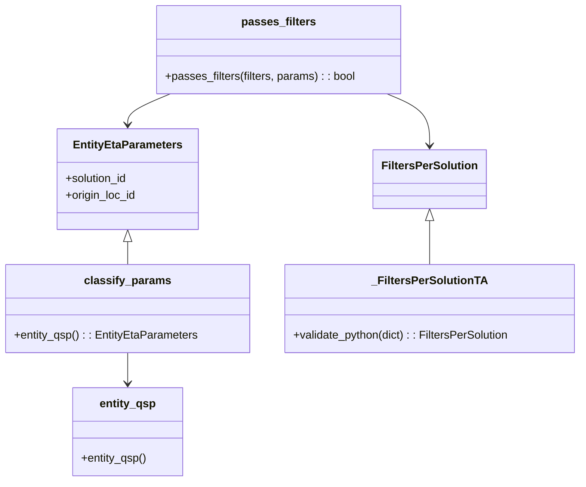

# Diagram: shipment_core/shipment_service/shipment_service/eta/eta_proxy/tests/test_eta_proxy_config.py


> Auto-generated by Obscura crawlers

## Diagram 1

```mermaid
flowchart TD
    A[Test: test_include_loc_id_filter] --> B[classify_params(entity_qsp())]
    B --> C{is EntityEtaParameters?}
    C -- yes --> D[set params.solution_id = "FOO_FV"]
    D --> E[_FiltersPerSolutionTA.validate_python({...})]
    E --> F[filters for FOO_FV include origin_loc_ids [1234,4321]]
    F --> G[set params.origin_loc_id = "1234"]
    G --> H{passes_filters(filters, params)}
    H -- true --> I[set params.origin_loc_id = "4321"]
    I --> J{passes_filters(filters, params)}
    J -- true --> K[set params.origin_loc_id = "9999"]
    K --> L{passes_filters(filters, params)}
    L -- false --> M[Test: pass conditions satisfied]
    A2[Test: test_True_filter] --> B2[classify_params(entity_qsp())]
    B2 --> C2{is EntityEtaParameters?}
    C2 -- yes --> D2[set params.solution_id = "FOO_FV"]
    D2 --> E2[_FiltersPerSolutionTA.validate_python({"FOO_FV": True})]
    E2 --> F2{passes_filters(filters, params)}
    F2 -- true --> G2[set params.solution_id = "OTHER_FV"]
    G2 --> H2{passes_filters(filters, params)}
    H2 -- false --> I2[Test: pass conditions satisfied]
```

> SVG rendering failed for this diagram.

## Diagram 2



### SVG

<svg id="container" width="823.546875" xmlns="http://www.w3.org/2000/svg" class="classDiagram" height="688" viewBox="0 0 823.546875 688" role="graphics-document document" aria-roledescription="class"><style>#container{font-family:"trebuchet ms",verdana,arial,sans-serif;font-size:16px;fill:#333;}@keyframes edge-animation-frame{from{stroke-dashoffset:0;}}@keyframes dash{to{stroke-dashoffset:0;}}#container .edge-animation-slow{stroke-dasharray:9,5!important;stroke-dashoffset:900;animation:dash 50s linear infinite;stroke-linecap:round;}#container .edge-animation-fast{stroke-dasharray:9,5!important;stroke-dashoffset:900;animation:dash 20s linear infinite;stroke-linecap:round;}#container .error-icon{fill:#552222;}#container .error-text{fill:#552222;stroke:#552222;}#container .edge-thickness-normal{stroke-width:1px;}#container .edge-thickness-thick{stroke-width:3.5px;}#container .edge-pattern-solid{stroke-dasharray:0;}#container .edge-thickness-invisible{stroke-width:0;fill:none;}#container .edge-pattern-dashed{stroke-dasharray:3;}#container .edge-pattern-dotted{stroke-dasharray:2;}#container .marker{fill:#333333;stroke:#333333;}#container .marker.cross{stroke:#333333;}#container svg{font-family:"trebuchet ms",verdana,arial,sans-serif;font-size:16px;}#container p{margin:0;}#container g.classGroup text{fill:#9370DB;stroke:none;font-family:"trebuchet ms",verdana,arial,sans-serif;font-size:10px;}#container g.classGroup text .title{font-weight:bolder;}#container .nodeLabel,#container .edgeLabel{color:#131300;}#container .edgeLabel .label rect{fill:#ECECFF;}#container .label text{fill:#131300;}#container .labelBkg{background:#ECECFF;}#container .edgeLabel .label span{background:#ECECFF;}#container .classTitle{font-weight:bolder;}#container .node rect,#container .node circle,#container .node ellipse,#container .node polygon,#container .node path{fill:#ECECFF;stroke:#9370DB;stroke-width:1px;}#container .divider{stroke:#9370DB;stroke-width:1;}#container g.clickable{cursor:pointer;}#container g.classGroup rect{fill:#ECECFF;stroke:#9370DB;}#container g.classGroup line{stroke:#9370DB;stroke-width:1;}#container .classLabel .box{stroke:none;stroke-width:0;fill:#ECECFF;opacity:0.5;}#container .classLabel .label{fill:#9370DB;font-size:10px;}#container .relation{stroke:#333333;stroke-width:1;fill:none;}#container .dashed-line{stroke-dasharray:3;}#container .dotted-line{stroke-dasharray:1 2;}#container #compositionStart,#container .composition{fill:#333333!important;stroke:#333333!important;stroke-width:1;}#container #compositionEnd,#container .composition{fill:#333333!important;stroke:#333333!important;stroke-width:1;}#container #dependencyStart,#container .dependency{fill:#333333!important;stroke:#333333!important;stroke-width:1;}#container #dependencyStart,#container .dependency{fill:#333333!important;stroke:#333333!important;stroke-width:1;}#container #extensionStart,#container .extension{fill:transparent!important;stroke:#333333!important;stroke-width:1;}#container #extensionEnd,#container .extension{fill:transparent!important;stroke:#333333!important;stroke-width:1;}#container #aggregationStart,#container .aggregation{fill:transparent!important;stroke:#333333!important;stroke-width:1;}#container #aggregationEnd,#container .aggregation{fill:transparent!important;stroke:#333333!important;stroke-width:1;}#container #lollipopStart,#container .lollipop{fill:#ECECFF!important;stroke:#333333!important;stroke-width:1;}#container #lollipopEnd,#container .lollipop{fill:#ECECFF!important;stroke:#333333!important;stroke-width:1;}#container .edgeTerminals{font-size:11px;line-height:initial;}#container .classTitleText{text-anchor:middle;font-size:18px;fill:#333;}#container .label-icon{display:inline-block;height:1em;overflow:visible;vertical-align:-0.125em;}#container .node .label-icon path{fill:currentColor;stroke:revert;stroke-width:revert;}#container :root{--mermaid-font-family:"trebuchet ms",verdana,arial,sans-serif;}</style><g><defs><marker id="container_class-aggregationStart" class="marker aggregation class" refX="18" refY="7" markerWidth="190" markerHeight="240" orient="auto"><path d="M 18,7 L9,13 L1,7 L9,1 Z"></path></marker></defs><defs><marker id="container_class-aggregationEnd" class="marker aggregation class" refX="1" refY="7" markerWidth="20" markerHeight="28" orient="auto"><path d="M 18,7 L9,13 L1,7 L9,1 Z"></path></marker></defs><defs><marker id="container_class-extensionStart" class="marker extension class" refX="18" refY="7" markerWidth="190" markerHeight="240" orient="auto"><path d="M 1,7 L18,13 V 1 Z"></path></marker></defs><defs><marker id="container_class-extensionEnd" class="marker extension class" refX="1" refY="7" markerWidth="20" markerHeight="28" orient="auto"><path d="M 1,1 V 13 L18,7 Z"></path></marker></defs><defs><marker id="container_class-compositionStart" class="marker composition class" refX="18" refY="7" markerWidth="190" markerHeight="240" orient="auto"><path d="M 18,7 L9,13 L1,7 L9,1 Z"></path></marker></defs><defs><marker id="container_class-compositionEnd" class="marker composition class" refX="1" refY="7" markerWidth="20" markerHeight="28" orient="auto"><path d="M 18,7 L9,13 L1,7 L9,1 Z"></path></marker></defs><defs><marker id="container_class-dependencyStart" class="marker dependency class" refX="6" refY="7" markerWidth="190" markerHeight="240" orient="auto"><path d="M 5,7 L9,13 L1,7 L9,1 Z"></path></marker></defs><defs><marker id="container_class-dependencyEnd" class="marker dependency class" refX="13" refY="7" markerWidth="20" markerHeight="28" orient="auto"><path d="M 18,7 L9,13 L14,7 L9,1 Z"></path></marker></defs><defs><marker id="container_class-lollipopStart" class="marker lollipop class" refX="13" refY="7" markerWidth="190" markerHeight="240" orient="auto"><circle stroke="black" fill="transparent" cx="7" cy="7" r="6"></circle></marker></defs><defs><marker id="container_class-lollipopEnd" class="marker lollipop class" refX="1" refY="7" markerWidth="190" markerHeight="240" orient="auto"><circle stroke="black" fill="transparent" cx="7" cy="7" r="6"></circle></marker></defs><g class="root"><g class="clusters"></g><g class="edgePaths"><path d="M179.484,345.25L179.484,346.542C179.484,347.833,179.484,350.417,179.484,355.875C179.484,361.333,179.484,369.667,179.484,373.833L179.484,378" id="id_EntityEtaParameters_classify_params_1" class="edge-thickness-normal edge-pattern-solid relation" style=";;;" data-edge="true" data-et="edge" data-id="id_EntityEtaParameters_classify_params_1" data-points="W3sieCI6MTc5LjQ4NDM3NSwieSI6MzI4fSx7IngiOjE3OS40ODQzNzUsInkiOjM1M30seyJ4IjoxNzkuNDg0Mzc1LCJ5IjozNzh9XQ==" marker-start="url(#container_class-extensionStart)"></path><path d="M608.258,315.25L608.258,321.542C608.258,327.833,608.258,340.417,608.258,350.875C608.258,361.333,608.258,369.667,608.258,373.833L608.258,378" id="id_FiltersPerSolution__FiltersPerSolutionTA_2" class="edge-thickness-normal edge-pattern-solid relation" style=";;;" data-edge="true" data-et="edge" data-id="id_FiltersPerSolution__FiltersPerSolutionTA_2" data-points="W3sieCI6NjA4LjI1NzgxMjUsInkiOjI5OH0seyJ4Ijo2MDguMjU3ODEyNSwieSI6MzUzfSx7IngiOjYwOC4yNTc4MTI1LCJ5IjozNzh9XQ==" marker-start="url(#container_class-extensionStart)"></path><path d="M179.484,504L179.484,508.167C179.484,512.333,179.484,520.667,179.484,528C179.484,535.333,179.484,541.667,179.484,544.833L179.484,548" id="id_classify_params_entity_qsp_3" class="edge-thickness-normal edge-pattern-solid relation" style=";;;" data-edge="true" data-et="edge" data-id="id_classify_params_entity_qsp_3" data-points="W3sieCI6MTc5LjQ4NDM3NSwieSI6NTA0fSx7IngiOjE3OS40ODQzNzUsInkiOjUyOX0seyJ4IjoxNzkuNDg0Mzc1LCJ5Ijo1NTR9XQ==" marker-end="url(#container_class-dependencyEnd)"></path><path d="M547.352,134L557.503,138.167C567.654,142.333,587.956,150.667,598.107,163C608.258,175.333,608.258,191.667,608.258,199.833L608.258,208" id="id_passes_filters_FiltersPerSolution_4" class="edge-thickness-normal edge-pattern-solid relation" style=";;;" data-edge="true" data-et="edge" data-id="id_passes_filters_FiltersPerSolution_4" data-points="W3sieCI6NTQ3LjM1MjQ5NDY3MzI5NTUsInkiOjEzNH0seyJ4Ijo2MDguMjU3ODEyNSwieSI6MTU5fSx7IngiOjYwOC4yNTc4MTI1LCJ5IjoyMTR9XQ==" marker-end="url(#container_class-dependencyEnd)"></path><path d="M240.39,134L230.239,138.167C220.088,142.333,199.786,150.667,189.635,158C179.484,165.333,179.484,171.667,179.484,174.833L179.484,178" id="id_passes_filters_EntityEtaParameters_5" class="edge-thickness-normal edge-pattern-solid relation" style=";;;" data-edge="true" data-et="edge" data-id="id_passes_filters_EntityEtaParameters_5" data-points="W3sieCI6MjQwLjM4OTY5MjgyNjcwNDUzLCJ5IjoxMzR9LHsieCI6MTc5LjQ4NDM3NSwieSI6MTU5fSx7IngiOjE3OS40ODQzNzUsInkiOjE4NH1d" marker-end="url(#container_class-dependencyEnd)"></path></g><g class="edgeLabels"><g class="edgeLabel"><g class="label" data-id="id_EntityEtaParameters_classify_params_1" transform="translate(0, 0)"><foreignObject width="0" height="0"><div xmlns="http://www.w3.org/1999/xhtml" class="labelBkg" style="display: table-cell; white-space: nowrap; line-height: 1.5; max-width: 200px; text-align: center;"><span class="edgeLabel"></span></div></foreignObject></g></g><g class="edgeLabel"><g class="label" data-id="id_FiltersPerSolution__FiltersPerSolutionTA_2" transform="translate(0, 0)"><foreignObject width="0" height="0"><div xmlns="http://www.w3.org/1999/xhtml" class="labelBkg" style="display: table-cell; white-space: nowrap; line-height: 1.5; max-width: 200px; text-align: center;"><span class="edgeLabel"></span></div></foreignObject></g></g><g class="edgeLabel"><g class="label" data-id="id_classify_params_entity_qsp_3" transform="translate(0, 0)"><foreignObject width="0" height="0"><div xmlns="http://www.w3.org/1999/xhtml" class="labelBkg" style="display: table-cell; white-space: nowrap; line-height: 1.5; max-width: 200px; text-align: center;"><span class="edgeLabel"></span></div></foreignObject></g></g><g class="edgeLabel"><g class="label" data-id="id_passes_filters_FiltersPerSolution_4" transform="translate(0, 0)"><foreignObject width="0" height="0"><div xmlns="http://www.w3.org/1999/xhtml" class="labelBkg" style="display: table-cell; white-space: nowrap; line-height: 1.5; max-width: 200px; text-align: center;"><span class="edgeLabel"></span></div></foreignObject></g></g><g class="edgeLabel"><g class="label" data-id="id_passes_filters_EntityEtaParameters_5" transform="translate(0, 0)"><foreignObject width="0" height="0"><div xmlns="http://www.w3.org/1999/xhtml" class="labelBkg" style="display: table-cell; white-space: nowrap; line-height: 1.5; max-width: 200px; text-align: center;"><span class="edgeLabel"></span></div></foreignObject></g></g></g><g class="nodes"><g class="node default" id="classId-EntityEtaParameters-0" transform="translate(179.484375, 256)"><g class="basic label-container"><path d="M-100.3515625 -72 L100.3515625 -72 L100.3515625 72 L-100.3515625 72" stroke="none" stroke-width="0" fill="#ECECFF" style=""></path><path d="M-100.3515625 -72 C-22.725662767711043 -72, 54.900236964577914 -72, 100.3515625 -72 M-100.3515625 -72 C-56.78543598484375 -72, -13.219309469687502 -72, 100.3515625 -72 M100.3515625 -72 C100.3515625 -22.11650771868925, 100.3515625 27.766984562621502, 100.3515625 72 M100.3515625 -72 C100.3515625 -42.76983351824475, 100.3515625 -13.539667036489504, 100.3515625 72 M100.3515625 72 C26.966814619358004 72, -46.41793326128399 72, -100.3515625 72 M100.3515625 72 C43.89008932243479 72, -12.57138385513042 72, -100.3515625 72 M-100.3515625 72 C-100.3515625 16.816384434013052, -100.3515625 -38.367231131973895, -100.3515625 -72 M-100.3515625 72 C-100.3515625 20.764627295284406, -100.3515625 -30.47074540943119, -100.3515625 -72" stroke="#9370DB" stroke-width="1.3" fill="none" stroke-dasharray="0 0" style=""></path></g><g class="annotation-group text" transform="translate(0, -48)"></g><g class="label-group text" transform="translate(-74.3125, -48)"><g class="label" style="font-weight: bolder" transform="translate(0,-12)"><foreignObject width="148.625" height="24"><div xmlns="http://www.w3.org/1999/xhtml" style="display: table-cell; white-space: nowrap; line-height: 1.5; max-width: 196px; text-align: center;"><span class="nodeLabel markdown-node-label" style=""><p>EntityEtaParameters</p></span></div></foreignObject></g></g><g class="members-group text" transform="translate(-88.3515625, 0)"><g class="label" style="" transform="translate(0,-12)"><foreignObject width="90.21875" height="24"><div xmlns="http://www.w3.org/1999/xhtml" style="display: table-cell; white-space: nowrap; line-height: 1.5; max-width: 148px; text-align: center;"><span class="nodeLabel markdown-node-label" style=""><p>+solution_id</p></span></div></foreignObject></g><g class="label" style="" transform="translate(0,12)"><foreignObject width="102.390625" height="24"><div xmlns="http://www.w3.org/1999/xhtml" style="display: table-cell; white-space: nowrap; line-height: 1.5; max-width: 160px; text-align: center;"><span class="nodeLabel markdown-node-label" style=""><p>+origin_loc_id</p></span></div></foreignObject></g></g><g class="methods-group text" transform="translate(-88.3515625, 72)"></g><g class="divider" style=""><path d="M-100.3515625 -24 C-42.78495565653637 -24, 14.781651186927263 -24, 100.3515625 -24 M-100.3515625 -24 C-40.683702982033154 -24, 18.984156535933693 -24, 100.3515625 -24" stroke="#9370DB" stroke-width="1.3" fill="none" stroke-dasharray="0 0" style=""></path></g><g class="divider" style=""><path d="M-100.3515625 48 C-21.381198927763393 48, 57.589164644473215 48, 100.3515625 48 M-100.3515625 48 C-26.501931109764527 48, 47.347700280470946 48, 100.3515625 48" stroke="#9370DB" stroke-width="1.3" fill="none" stroke-dasharray="0 0" style=""></path></g></g><g class="node default" id="classId-classify_params-1" transform="translate(179.484375, 441)"><g class="basic label-container"><path d="M-171.484375 -63 L171.484375 -63 L171.484375 63 L-171.484375 63" stroke="none" stroke-width="0" fill="#ECECFF" style=""></path><path d="M-171.484375 -63 C-52.03999372425375 -63, 67.4043875514925 -63, 171.484375 -63 M-171.484375 -63 C-102.30739902017271 -63, -33.13042304034542 -63, 171.484375 -63 M171.484375 -63 C171.484375 -28.976063578077017, 171.484375 5.0478728438459655, 171.484375 63 M171.484375 -63 C171.484375 -34.145938178922805, 171.484375 -5.2918763578456165, 171.484375 63 M171.484375 63 C54.87718696577653 63, -61.73000106844694 63, -171.484375 63 M171.484375 63 C63.048413697622934 63, -45.38754760475413 63, -171.484375 63 M-171.484375 63 C-171.484375 28.75025865734989, -171.484375 -5.499482685300222, -171.484375 -63 M-171.484375 63 C-171.484375 17.908686597824328, -171.484375 -27.182626804351344, -171.484375 -63" stroke="#9370DB" stroke-width="1.3" fill="none" stroke-dasharray="0 0" style=""></path></g><g class="annotation-group text" transform="translate(0, -39)"></g><g class="label-group text" transform="translate(-58.328125, -39)"><g class="label" style="font-weight: bolder" transform="translate(0,-12)"><foreignObject width="116.65625" height="24"><div xmlns="http://www.w3.org/1999/xhtml" style="display: table-cell; white-space: nowrap; line-height: 1.5; max-width: 165px; text-align: center;"><span class="nodeLabel markdown-node-label" style=""><p>classify_params</p></span></div></foreignObject></g></g><g class="members-group text" transform="translate(-159.484375, 9)"></g><g class="methods-group text" transform="translate(-159.484375, 39)"><g class="label" style="" transform="translate(0,-12)"><foreignObject width="260.640625" height="24"><div xmlns="http://www.w3.org/1999/xhtml" style="display: table-cell; white-space: nowrap; line-height: 1.5; max-width: 318px; text-align: center;"><span class="nodeLabel markdown-node-label" style=""><p>+entity_qsp() : : EntityEtaParameters</p></span></div></foreignObject></g></g><g class="divider" style=""><path d="M-171.484375 -15 C-50.98265870159426 -15, 69.51905759681148 -15, 171.484375 -15 M-171.484375 -15 C-54.69183037163464 -15, 62.100714256730726 -15, 171.484375 -15" stroke="#9370DB" stroke-width="1.3" fill="none" stroke-dasharray="0 0" style=""></path></g><g class="divider" style=""><path d="M-171.484375 9 C-88.05947472095525 9, -4.634574441910502 9, 171.484375 9 M-171.484375 9 C-53.01939689868709 9, 65.44558120262582 9, 171.484375 9" stroke="#9370DB" stroke-width="1.3" fill="none" stroke-dasharray="0 0" style=""></path></g></g><g class="node default" id="classId-_FiltersPerSolutionTA-2" transform="translate(608.2578125, 441)"><g class="basic label-container"><path d="M-207.2890625 -63 L207.2890625 -63 L207.2890625 63 L-207.2890625 63" stroke="none" stroke-width="0" fill="#ECECFF" style=""></path><path d="M-207.2890625 -63 C-111.78679022268645 -63, -16.284517945372897 -63, 207.2890625 -63 M-207.2890625 -63 C-124.28253837823479 -63, -41.27601425646958 -63, 207.2890625 -63 M207.2890625 -63 C207.2890625 -36.01889548284561, 207.2890625 -9.037790965691222, 207.2890625 63 M207.2890625 -63 C207.2890625 -15.242920185811457, 207.2890625 32.51415962837709, 207.2890625 63 M207.2890625 63 C47.19273834306074 63, -112.90358581387852 63, -207.2890625 63 M207.2890625 63 C88.44306377469486 63, -30.402934950610273 63, -207.2890625 63 M-207.2890625 63 C-207.2890625 21.558619248740754, -207.2890625 -19.88276150251849, -207.2890625 -63 M-207.2890625 63 C-207.2890625 15.294495909717938, -207.2890625 -32.411008180564124, -207.2890625 -63" stroke="#9370DB" stroke-width="1.3" fill="none" stroke-dasharray="0 0" style=""></path></g><g class="annotation-group text" transform="translate(0, -39)"></g><g class="label-group text" transform="translate(-78.453125, -39)"><g class="label" style="font-weight: bolder" transform="translate(0,-12)"><foreignObject width="156.90625" height="24"><div xmlns="http://www.w3.org/1999/xhtml" style="display: table-cell; white-space: nowrap; line-height: 1.5; max-width: 205px; text-align: center;"><span class="nodeLabel markdown-node-label" style=""><p>_FiltersPerSolutionTA</p></span></div></foreignObject></g></g><g class="members-group text" transform="translate(-195.2890625, 9)"></g><g class="methods-group text" transform="translate(-195.2890625, 39)"><g class="label" style="" transform="translate(0,-12)"><foreignObject width="312.125" height="24"><div xmlns="http://www.w3.org/1999/xhtml" style="display: table-cell; white-space: nowrap; line-height: 1.5; max-width: 369px; text-align: center;"><span class="nodeLabel markdown-node-label" style=""><p>+validate_python(dict) : : FiltersPerSolution</p></span></div></foreignObject></g></g><g class="divider" style=""><path d="M-207.2890625 -15 C-90.55230081137844 -15, 26.18446087724311 -15, 207.2890625 -15 M-207.2890625 -15 C-59.18365959170109 -15, 88.92174331659783 -15, 207.2890625 -15" stroke="#9370DB" stroke-width="1.3" fill="none" stroke-dasharray="0 0" style=""></path></g><g class="divider" style=""><path d="M-207.2890625 9 C-70.30339464651428 9, 66.68227320697144 9, 207.2890625 9 M-207.2890625 9 C-84.71190249248404 9, 37.865257515031914 9, 207.2890625 9" stroke="#9370DB" stroke-width="1.3" fill="none" stroke-dasharray="0 0" style=""></path></g></g><g class="node default" id="classId-FiltersPerSolution-3" transform="translate(608.2578125, 256)"><g class="basic label-container"><path d="M-77.6484375 -42 L77.6484375 -42 L77.6484375 42 L-77.6484375 42" stroke="none" stroke-width="0" fill="#ECECFF" style=""></path><path d="M-77.6484375 -42 C-26.09669262033531 -42, 25.455052259329378 -42, 77.6484375 -42 M-77.6484375 -42 C-26.56786581243712 -42, 24.51270587512576 -42, 77.6484375 -42 M77.6484375 -42 C77.6484375 -8.416493065439859, 77.6484375 25.167013869120282, 77.6484375 42 M77.6484375 -42 C77.6484375 -21.787611511134994, 77.6484375 -1.575223022269988, 77.6484375 42 M77.6484375 42 C23.556286845317793 42, -30.535863809364415 42, -77.6484375 42 M77.6484375 42 C20.604240345829766 42, -36.43995680834047 42, -77.6484375 42 M-77.6484375 42 C-77.6484375 24.283859790980017, -77.6484375 6.567719581960034, -77.6484375 -42 M-77.6484375 42 C-77.6484375 20.134503974593773, -77.6484375 -1.7309920508124534, -77.6484375 -42" stroke="#9370DB" stroke-width="1.3" fill="none" stroke-dasharray="0 0" style=""></path></g><g class="annotation-group text" transform="translate(0, -18)"></g><g class="label-group text" transform="translate(-65.6484375, -18)"><g class="label" style="font-weight: bolder" transform="translate(0,-12)"><foreignObject width="131.296875" height="24"><div xmlns="http://www.w3.org/1999/xhtml" style="display: table-cell; white-space: nowrap; line-height: 1.5; max-width: 179px; text-align: center;"><span class="nodeLabel markdown-node-label" style=""><p>FiltersPerSolution</p></span></div></foreignObject></g></g><g class="members-group text" transform="translate(-65.6484375, 30)"></g><g class="methods-group text" transform="translate(-65.6484375, 60)"></g><g class="divider" style=""><path d="M-77.6484375 6 C-32.19597938697924 6, 13.256478726041522 6, 77.6484375 6 M-77.6484375 6 C-37.16317696598423 6, 3.3220835680315446 6, 77.6484375 6" stroke="#9370DB" stroke-width="1.3" fill="none" stroke-dasharray="0 0" style=""></path></g><g class="divider" style=""><path d="M-77.6484375 24 C-19.31632608534155 24, 39.0157853293169 24, 77.6484375 24 M-77.6484375 24 C-19.0426719533246 24, 39.5630935933508 24, 77.6484375 24" stroke="#9370DB" stroke-width="1.3" fill="none" stroke-dasharray="0 0" style=""></path></g></g><g class="node default" id="classId-passes_filters-4" transform="translate(393.87109375, 71)"><g class="basic label-container"><path d="M-173.609375 -63 L173.609375 -63 L173.609375 63 L-173.609375 63" stroke="none" stroke-width="0" fill="#ECECFF" style=""></path><path d="M-173.609375 -63 C-60.15015444978759 -63, 53.309066100424815 -63, 173.609375 -63 M-173.609375 -63 C-103.6640568601513 -63, -33.71873872030261 -63, 173.609375 -63 M173.609375 -63 C173.609375 -26.01764843566758, 173.609375 10.964703128664837, 173.609375 63 M173.609375 -63 C173.609375 -35.43229351985555, 173.609375 -7.864587039711097, 173.609375 63 M173.609375 63 C72.68639403104534 63, -28.236586937909323 63, -173.609375 63 M173.609375 63 C64.71655557407287 63, -44.17626385185426 63, -173.609375 63 M-173.609375 63 C-173.609375 13.608530751172424, -173.609375 -35.78293849765515, -173.609375 -63 M-173.609375 63 C-173.609375 19.80472690059696, -173.609375 -23.390546198806078, -173.609375 -63" stroke="#9370DB" stroke-width="1.3" fill="none" stroke-dasharray="0 0" style=""></path></g><g class="annotation-group text" transform="translate(0, -39)"></g><g class="label-group text" transform="translate(-50.296875, -39)"><g class="label" style="font-weight: bolder" transform="translate(0,-12)"><foreignObject width="100.59375" height="24"><div xmlns="http://www.w3.org/1999/xhtml" style="display: table-cell; white-space: nowrap; line-height: 1.5; max-width: 148px; text-align: center;"><span class="nodeLabel markdown-node-label" style=""><p>passes_filters</p></span></div></foreignObject></g></g><g class="members-group text" transform="translate(-161.609375, 9)"></g><g class="methods-group text" transform="translate(-161.609375, 39)"><g class="label" style="" transform="translate(0,-12)"><foreignObject width="272.921875" height="24"><div xmlns="http://www.w3.org/1999/xhtml" style="display: table-cell; white-space: nowrap; line-height: 1.5; max-width: 331px; text-align: center;"><span class="nodeLabel markdown-node-label" style=""><p>+passes_filters(filters, params) : : bool</p></span></div></foreignObject></g></g><g class="divider" style=""><path d="M-173.609375 -15 C-94.4370499289178 -15, -15.264724857835603 -15, 173.609375 -15 M-173.609375 -15 C-42.21550208185229 -15, 89.17837083629541 -15, 173.609375 -15" stroke="#9370DB" stroke-width="1.3" fill="none" stroke-dasharray="0 0" style=""></path></g><g class="divider" style=""><path d="M-173.609375 9 C-65.93707480623793 9, 41.73522538752414 9, 173.609375 9 M-173.609375 9 C-67.67823998813675 9, 38.252895023726495 9, 173.609375 9" stroke="#9370DB" stroke-width="1.3" fill="none" stroke-dasharray="0 0" style=""></path></g></g><g class="node default" id="classId-entity_qsp-5" transform="translate(179.484375, 617)"><g class="basic label-container"><path d="M-78.57421875 -63 L78.57421875 -63 L78.57421875 63 L-78.57421875 63" stroke="none" stroke-width="0" fill="#ECECFF" style=""></path><path d="M-78.57421875 -63 C-30.076928838047465 -63, 18.42036107390507 -63, 78.57421875 -63 M-78.57421875 -63 C-22.14171837596721 -63, 34.29078199806558 -63, 78.57421875 -63 M78.57421875 -63 C78.57421875 -14.369030957502808, 78.57421875 34.261938084994384, 78.57421875 63 M78.57421875 -63 C78.57421875 -32.666403282833045, 78.57421875 -2.332806565666097, 78.57421875 63 M78.57421875 63 C43.93705060177708 63, 9.299882453554162 63, -78.57421875 63 M78.57421875 63 C34.213633385269844 63, -10.146951979460312 63, -78.57421875 63 M-78.57421875 63 C-78.57421875 31.16155829949448, -78.57421875 -0.6768834010110396, -78.57421875 -63 M-78.57421875 63 C-78.57421875 36.22816610198112, -78.57421875 9.456332203962226, -78.57421875 -63" stroke="#9370DB" stroke-width="1.3" fill="none" stroke-dasharray="0 0" style=""></path></g><g class="annotation-group text" transform="translate(0, -39)"></g><g class="label-group text" transform="translate(-38.7734375, -39)"><g class="label" style="font-weight: bolder" transform="translate(0,-12)"><foreignObject width="77.546875" height="24"><div xmlns="http://www.w3.org/1999/xhtml" style="display: table-cell; white-space: nowrap; line-height: 1.5; max-width: 126px; text-align: center;"><span class="nodeLabel markdown-node-label" style=""><p>entity_qsp</p></span></div></foreignObject></g></g><g class="members-group text" transform="translate(-66.57421875, 9)"></g><g class="methods-group text" transform="translate(-66.57421875, 39)"><g class="label" style="" transform="translate(0,-12)"><foreignObject width="94.375" height="24"><div xmlns="http://www.w3.org/1999/xhtml" style="display: table-cell; white-space: nowrap; line-height: 1.5; max-width: 152px; text-align: center;"><span class="nodeLabel markdown-node-label" style=""><p>+entity_qsp()</p></span></div></foreignObject></g></g><g class="divider" style=""><path d="M-78.57421875 -15 C-32.337252014629144 -15, 13.899714720741713 -15, 78.57421875 -15 M-78.57421875 -15 C-28.75395500874923 -15, 21.06630873250154 -15, 78.57421875 -15" stroke="#9370DB" stroke-width="1.3" fill="none" stroke-dasharray="0 0" style=""></path></g><g class="divider" style=""><path d="M-78.57421875 9 C-38.550570750762745 9, 1.4730772484745103 9, 78.57421875 9 M-78.57421875 9 C-25.378235539012238 9, 27.817747671975525 9, 78.57421875 9" stroke="#9370DB" stroke-width="1.3" fill="none" stroke-dasharray="0 0" style=""></path></g></g></g></g></g></svg>
