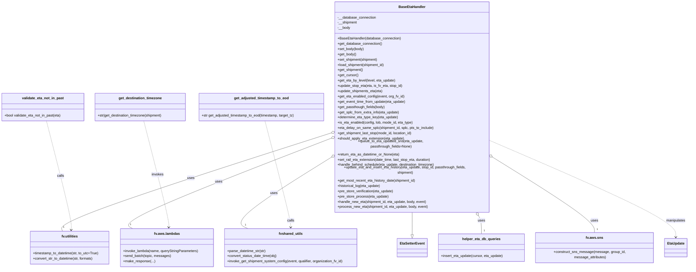

# Diagram: shipment_core/shipment_service/shipment_service/eta/eta_setter/BaseEtaHandler.py

> Auto-generated by Obscura crawlers

## Mermaid

### SVG

<svg id="container" width="3158.40234375" xmlns="http://www.w3.org/2000/svg" class="classDiagram" height="1176" viewBox="0 0 3158.40234375 1176" role="graphics-document document" aria-roledescription="class"><g><defs><marker id="container_class-aggregationStart" class="marker aggregation class" refX="18" refY="7" markerWidth="190" markerHeight="240" orient="auto"><path d="M 18,7 L9,13 L1,7 L9,1 Z"></path></marker></defs><defs><marker id="container_class-aggregationEnd" class="marker aggregation class" refX="1" refY="7" markerWidth="20" markerHeight="28" orient="auto"><path d="M 18,7 L9,13 L1,7 L9,1 Z"></path></marker></defs><defs><marker id="container_class-extensionStart" class="marker extension class" refX="18" refY="7" markerWidth="190" markerHeight="240" orient="auto"><path d="M 1,7 L18,13 V 1 Z"></path></marker></defs><defs><marker id="container_class-extensionEnd" class="marker extension class" refX="1" refY="7" markerWidth="20" markerHeight="28" orient="auto"><path d="M 1,1 V 13 L18,7 Z"></path></marker></defs><defs><marker id="container_class-compositionStart" class="marker composition class" refX="18" refY="7" markerWidth="190" markerHeight="240" orient="auto"><path d="M 18,7 L9,13 L1,7 L9,1 Z"></path></marker></defs><defs><marker id="container_class-compositionEnd" class="marker composition class" refX="1" refY="7" markerWidth="20" markerHeight="28" orient="auto"><path d="M 18,7 L9,13 L1,7 L9,1 Z"></path></marker></defs><defs><marker id="container_class-dependencyStart" class="marker dependency class" refX="6" refY="7" markerWidth="190" markerHeight="240" orient="auto"><path d="M 5,7 L9,13 L1,7 L9,1 Z"></path></marker></defs><defs><marker id="container_class-dependencyEnd" class="marker dependency class" refX="13" refY="7" markerWidth="20" markerHeight="28" orient="auto"><path d="M 18,7 L9,13 L14,7 L9,1 Z"></path></marker></defs><defs><marker id="container_class-lollipopStart" class="marker lollipop class" refX="13" refY="7" markerWidth="190" markerHeight="240" orient="auto"><circle stroke="black" fill="transparent" cx="7" cy="7" r="6"></circle></marker></defs><defs><marker id="container_class-lollipopEnd" class="marker lollipop class" refX="1" refY="7" markerWidth="190" markerHeight="240" orient="auto"><circle stroke="black" fill="transparent" cx="7" cy="7" r="6"></circle></marker></defs><g class="root"><g class="clusters"></g><g class="edgePaths"><path d="M1905.361,920L1905.402,926.167C1905.442,932.333,1905.524,944.667,1905.565,961.625C1905.605,978.583,1905.605,1000.167,1905.605,1010.958L1905.605,1021.75" id="id_BaseEtaHandler_EtaSetterEvent_1" class="edge-thickness-normal edge-pattern-solid relation" style=";;;" data-edge="true" data-et="edge" data-id="id_BaseEtaHandler_EtaSetterEvent_1" data-points="W3sieCI6MTkwNS4zNjA4MjEwMjU2MDg2LCJ5Ijo5MjB9LHsieCI6MTkwNS42MDU0Njg3NSwieSI6OTU3fSx7IngiOjE5MDUuNjA1NDY4NzUsInkiOjEwMzl9XQ==" marker-end="url(#container_class-extensionEnd)"></path><path d="M2204.321,934.517L2206.726,938.264C2209.131,942.012,2213.94,949.506,2216.345,963.42C2218.75,977.333,2218.75,997.667,2218.75,1007.833L2218.75,1018" id="id_BaseEtaHandler_helper_eta_db_queries_2" class="edge-thickness-normal edge-pattern-solid relation" style=";;;" data-edge="true" data-et="edge" data-id="id_BaseEtaHandler_helper_eta_db_queries_2" data-points="W3sieCI6MjE5NS4wMDM2MzI4OTE3MzQ1LCJ5Ijo5MjB9LHsieCI6MjIxOC43NSwieSI6OTU3fSx7IngiOjIyMTguNzUsInkiOjEwMTh9XQ==" marker-start="url(#container_class-aggregationStart)"></path><path d="M1525.203,686.01L1448.478,731.175C1371.753,776.34,1218.303,866.67,1155.544,918.002C1092.784,969.333,1120.715,981.667,1134.68,987.833L1148.646,994" id="id_BaseEtaHandler_fvshared_utils_3" class="edge-thickness-normal edge-pattern-solid relation" style=";;;" data-edge="true" data-et="edge" data-id="id_BaseEtaHandler_fvshared_utils_3" data-points="W3sieCI6MTU0MC4wNjgzNTkzNzUsInkiOjY3Ny4yNTg5ODA5NjA2NDMzfSx7IngiOjEwNjQuODUzNTE1NjI1LCJ5Ijo5NTd9LHsieCI6MTE0OC42NDU1MDc4MTI1LCJ5Ijo5OTR9XQ==" marker-start="url(#container_class-aggregationStart)"></path><path d="M1523.561,578.882L1315.774,641.902C1107.988,704.921,692.415,830.961,488.115,902.147C283.815,973.333,290.788,989.667,294.274,997.833L297.761,1006" id="id_BaseEtaHandler_fv.utilities_4" class="edge-thickness-normal edge-pattern-solid relation" style=";;;" data-edge="true" data-et="edge" data-id="id_BaseEtaHandler_fv.utilities_4" data-points="W3sieCI6MTU0MC4wNjgzNTkzNzUsInkiOjU3My44NzUzMDA2ODgwMDc4fSx7IngiOjI3Ni44NDE3OTY4NzUsInkiOjk1N30seyJ4IjoyOTcuNzYwNjQ3NjgxNDUxNiwieSI6MTAwNn1d" marker-start="url(#container_class-aggregationStart)"></path><path d="M1523.864,602.113L1361.776,661.261C1199.688,720.409,875.513,838.704,724.768,904.019C574.023,969.333,596.708,981.667,608.051,987.833L619.393,994" id="id_BaseEtaHandler_fv.aws.lambdas_5" class="edge-thickness-normal edge-pattern-solid relation" style=";;;" data-edge="true" data-et="edge" data-id="id_BaseEtaHandler_fv.aws.lambdas_5" data-points="W3sieCI6MTU0MC4wNjgzNTkzNzUsInkiOjU5Ni4xOTk2MjgxNzEwOTkxfSx7IngiOjU1MS4zMzc4OTA2MjUsInkiOjk1N30seyJ4Ijo2MTkuMzkzNDYwMTgxNDUxNiwieSI6OTk0fV0=" marker-start="url(#container_class-aggregationStart)"></path><path d="M2279.457,687.81L2355.053,732.675C2430.649,777.54,2581.84,867.27,2657.436,922.302C2733.031,977.333,2733.031,997.667,2733.031,1007.833L2733.031,1018" id="id_BaseEtaHandler_fv.aws.sns_6" class="edge-thickness-normal edge-pattern-solid relation" style=";;;" data-edge="true" data-et="edge" data-id="id_BaseEtaHandler_fv.aws.sns_6" data-points="W3sieCI6MjI2NC42MjMwNDY4NzUsInkiOjY3OS4wMDY0MjU4ODU5OTg3fSx7IngiOjI3MzMuMDMxMjUsInkiOjk1N30seyJ4IjoyNzMzLjAzMTI1LCJ5IjoxMDE4fV0=" marker-start="url(#container_class-aggregationStart)"></path><path d="M2264.623,613.073L2403.925,670.394C2543.227,727.715,2821.83,842.358,2961.132,912.346C3100.434,982.333,3100.434,1007.667,3100.434,1020.333L3100.434,1033" id="id_BaseEtaHandler_EtaUpdate_7" class="edge-thickness-normal edge-pattern-dashed relation" style=";;;" data-edge="true" data-et="edge" data-id="id_BaseEtaHandler_EtaUpdate_7" data-points="W3sieCI6MjI2NC42MjMwNDY4NzUsInkiOjYxMy4wNzMxNDU1MjMyMjE1fSx7IngiOjMxMDAuNDMzNTkzNzUsInkiOjk1N30seyJ4IjozMTAwLjQzMzU5Mzc1LCJ5IjoxMDM5fV0=" marker-end="url(#container_class-dependencyEnd)"></path><path d="M664.605,527L684.801,598.667C704.996,670.333,745.388,813.667,765.318,890.501C785.249,967.336,784.718,977.672,784.453,982.84L784.188,988.008" id="id_get_destination_timezone_fv.aws.lambdas_8" class="edge-thickness-normal edge-pattern-dashed relation" style=";;;" data-edge="true" data-et="edge" data-id="id_get_destination_timezone_fv.aws.lambdas_8" data-points="W3sieCI6NjY0LjYwNTAwNTIyOTQ2MjQsInkiOjUyN30seyJ4Ijo3ODUuNzc5Mjk2ODc1LCJ5Ijo5NTd9LHsieCI6NzgzLjg4MDU3NTg1Njg1NDksInkiOjk5NH1d" marker-end="url(#container_class-dependencyEnd)"></path><path d="M1221.652,527L1242.322,598.667C1262.992,670.333,1304.331,813.667,1325,890.5C1345.67,967.333,1345.67,977.667,1345.67,982.833L1345.67,988" id="id_get_adjusted_timestamp_to_eod_fvshared_utils_9" class="edge-thickness-normal edge-pattern-dashed relation" style=";;;" data-edge="true" data-et="edge" data-id="id_get_adjusted_timestamp_to_eod_fvshared_utils_9" data-points="W3sieCI6MTIyMS42NTI0MjY5NDU5OTQsInkiOjUyN30seyJ4IjoxMzQ1LjY2OTkyMTg3NSwieSI6OTU3fSx7IngiOjEzNDUuNjY5OTIxODc1LCJ5Ijo5OTR9XQ==" marker-end="url(#container_class-dependencyEnd)"></path><path d="M214.968,527L235.164,598.667C255.36,670.333,295.751,813.667,315.579,892.501C335.407,971.336,334.671,985.672,334.303,992.84L333.936,1000.008" id="id_validate_eta_not_in_past_fv.utilities_10" class="edge-thickness-normal edge-pattern-dashed relation" style=";;;" data-edge="true" data-et="edge" data-id="id_validate_eta_not_in_past_fv.utilities_10" data-points="W3sieCI6MjE0Ljk2ODI4NjQ3OTQ2MjQ4LCJ5Ijo1Mjd9LHsieCI6MzM2LjE0MjU3ODEyNSwieSI6OTU3fSx7IngiOjMzMy42MjgwNTU2OTU1NjQ1LCJ5IjoxMDA2fV0=" marker-end="url(#container_class-dependencyEnd)"></path></g><g class="edgeLabels"><g class="edgeLabel"><g class="label" data-id="id_BaseEtaHandler_EtaSetterEvent_1" transform="translate(0, 0)"><foreignObject width="0" height="0">

</foreignObject></g></g><g class="edgeLabel" transform="translate(2218.75, 957)"><g class="label" data-id="id_BaseEtaHandler_helper_eta_db_queries_2" transform="translate(-16.4921875, -12)"><foreignObject width="32.984375" height="24">

uses

</foreignObject></g></g><g class="edgeLabel" transform="translate(1262.9928, 840.36289)"><g class="label" data-id="id_BaseEtaHandler_fvshared_utils_3" transform="translate(-16.4921875, -12)"><foreignObject width="32.984375" height="24">

uses

</foreignObject></g></g><g class="edgeLabel" transform="translate(882.96251, 773.16931)"><g class="label" data-id="id_BaseEtaHandler_fv.utilities_4" transform="translate(-16.4921875, -12)"><foreignObject width="32.984375" height="24">

uses

</foreignObject></g></g><g class="edgeLabel" transform="translate(1009.31832, 789.87709)"><g class="label" data-id="id_BaseEtaHandler_fv.aws.lambdas_5" transform="translate(-16.4921875, -12)"><foreignObject width="32.984375" height="24">

uses

</foreignObject></g></g><g class="edgeLabel" transform="translate(2733.03125, 957)"><g class="label" data-id="id_BaseEtaHandler_fv.aws.sns_6" transform="translate(-16.4921875, -12)"><foreignObject width="32.984375" height="24">

uses

</foreignObject></g></g><g class="edgeLabel" transform="translate(3100.43359375, 957)"><g class="label" data-id="id_BaseEtaHandler_EtaUpdate_7" transform="translate(-45.0859375, -12)"><foreignObject width="90.171875" height="24">

manipulates

</foreignObject></g></g><g class="edgeLabel" transform="translate(730.21663, 759.82991)"><g class="label" data-id="id_get_destination_timezone_fv.aws.lambdas_8" transform="translate(-27.5859375, -12)"><foreignObject width="55.171875" height="24">

invokes

</foreignObject></g></g><g class="edgeLabel" transform="translate(1345.669921875, 957)"><g class="label" data-id="id_get_adjusted_timestamp_to_eod_fvshared_utils_9" transform="translate(-16.4453125, -12)"><foreignObject width="32.890625" height="24">

calls

</foreignObject></g></g><g class="edgeLabel" transform="translate(282.20948, 765.61259)"><g class="label" data-id="id_validate_eta_not_in_past_fv.utilities_10" transform="translate(-16.4453125, -12)"><foreignObject width="32.890625" height="24">

calls

</foreignObject></g></g><g class="edgeTerminals" transform="translate(2228.75, 995.5)"><g class="inner" transform="translate(0, 0)"></g><foreignObject style="width: 9px; height: 12px;">
1
</foreignObject></g><g class="edgeTerminals" transform="translate(1133.695892056731, 968.2092557984431)"><g class="inner" transform="translate(0, 0)"></g><foreignObject style="width: 9px; height: 12px;">
1
</foreignObject></g><g class="edgeTerminals" transform="translate(299.6850177157941, 979.0158424931394)"><g class="inner" transform="translate(0, 0)"></g><foreignObject style="width: 9px; height: 12px;">
1
</foreignObject></g><g class="edgeTerminals" transform="translate(606.1834755963448, 967.4629117346154)"><g class="inner" transform="translate(0, 0)"></g><foreignObject style="width: 9px; height: 12px;">
1
</foreignObject></g><g class="edgeTerminals" transform="translate(2743.03125, 995.5)"><g class="inner" transform="translate(0, 0)"></g><foreignObject style="width: 9px; height: 12px;">
1
</foreignObject></g></g><g class="nodes"><g class="node default" id="classId-validate_eta_not_in_past-0" transform="translate(197.21484375, 464)"><g class="basic label-container"><path d="M-189.21484375 -63 L189.21484375 -63 L189.21484375 63 L-189.21484375 63" stroke="none" stroke-width="0" fill="#ECECFF" style=""></path><path d="M-189.21484375 -63 C-57.44127017080851 -63, 74.33230340838298 -63, 189.21484375 -63 M-189.21484375 -63 C-112.55640149630806 -63, -35.89795924261611 -63, 189.21484375 -63 M189.21484375 -63 C189.21484375 -13.644772222197794, 189.21484375 35.71045555560441, 189.21484375 63 M189.21484375 -63 C189.21484375 -18.103543347937574, 189.21484375 26.792913304124852, 189.21484375 63 M189.21484375 63 C99.26935288736824 63, 9.323862024736485 63, -189.21484375 63 M189.21484375 63 C77.24378635270946 63, -34.72727104458107 63, -189.21484375 63 M-189.21484375 63 C-189.21484375 28.207238300623118, -189.21484375 -6.5855233987537645, -189.21484375 -63 M-189.21484375 63 C-189.21484375 25.836549043714477, -189.21484375 -11.326901912571046, -189.21484375 -63" stroke="#9370DB" stroke-width="1.3" fill="none" stroke-dasharray="0 0" style=""></path></g><g class="annotation-group text" transform="translate(0, -39)"></g><g class="label-group text" transform="translate(-92.7265625, -39)"><g class="label" style="font-weight: bolder" transform="translate(0,-12)"><foreignObject width="185.453125" height="24">

validate_eta_not_in_past

</foreignObject></g></g><g class="members-group text" transform="translate(-177.21484375, 9)"></g><g class="methods-group text" transform="translate(-177.21484375, 39)"><g class="label" style="" transform="translate(0,-12)"><foreignObject width="261.703125" height="24">

+bool validate_eta_not_in_past(eta)

</foreignObject></g></g><g class="divider" style=""><path d="M-189.21484375 -15 C-84.83999604917938 -15, 19.534851651641247 -15, 189.21484375 -15 M-189.21484375 -15 C-52.99730673915357 -15, 83.22023027169286 -15, 189.21484375 -15" stroke="#9370DB" stroke-width="1.3" fill="none" stroke-dasharray="0 0" style=""></path></g><g class="divider" style=""><path d="M-189.21484375 9 C-87.78685204759297 9, 13.641139654814054 9, 189.21484375 9 M-189.21484375 9 C-107.02790263764581 9, -24.84096152529162 9, 189.21484375 9" stroke="#9370DB" stroke-width="1.3" fill="none" stroke-dasharray="0 0" style=""></path></g></g><g class="node default" id="classId-get_destination_timezone-1" transform="translate(646.8515625, 464)"><g class="basic label-container"><path d="M-210.421875 -63 L210.421875 -63 L210.421875 63 L-210.421875 63" stroke="none" stroke-width="0" fill="#ECECFF" style=""></path><path d="M-210.421875 -63 C-113.25039472319389 -63, -16.078914446387785 -63, 210.421875 -63 M-210.421875 -63 C-105.4251236939761 -63, -0.42837238795220856 -63, 210.421875 -63 M210.421875 -63 C210.421875 -24.796466922201347, 210.421875 13.407066155597306, 210.421875 63 M210.421875 -63 C210.421875 -13.561744222083156, 210.421875 35.87651155583369, 210.421875 63 M210.421875 63 C110.030985893115 63, 9.640096786230004 63, -210.421875 63 M210.421875 63 C112.7345261098437 63, 15.047177219687399 63, -210.421875 63 M-210.421875 63 C-210.421875 19.2396979908957, -210.421875 -24.5206040182086, -210.421875 -63 M-210.421875 63 C-210.421875 31.270002179561683, -210.421875 -0.4599956408766346, -210.421875 -63" stroke="#9370DB" stroke-width="1.3" fill="none" stroke-dasharray="0 0" style=""></path></g><g class="annotation-group text" transform="translate(0, -39)"></g><g class="label-group text" transform="translate(-95.546875, -39)"><g class="label" style="font-weight: bolder" transform="translate(0,-12)"><foreignObject width="191.09375" height="24">

get_destination_timezone

</foreignObject></g></g><g class="members-group text" transform="translate(-198.421875, 9)"></g><g class="methods-group text" transform="translate(-198.421875, 39)"><g class="label" style="" transform="translate(0,-12)"><foreignObject width="301.296875" height="24">

+str|get_destination_timezone(shipment)

</foreignObject></g></g><g class="divider" style=""><path d="M-210.421875 -15 C-87.08295924214951 -15, 36.25595651570097 -15, 210.421875 -15 M-210.421875 -15 C-65.54965781429993 -15, 79.32255937140013 -15, 210.421875 -15" stroke="#9370DB" stroke-width="1.3" fill="none" stroke-dasharray="0 0" style=""></path></g><g class="divider" style=""><path d="M-210.421875 9 C-43.63608668232865 9, 123.1497016353427 9, 210.421875 9 M-210.421875 9 C-95.88330058038974 9, 18.655273839220513 9, 210.421875 9" stroke="#9370DB" stroke-width="1.3" fill="none" stroke-dasharray="0 0" style=""></path></g></g><g class="node default" id="classId-get_adjusted_timestamp_to_eod-2" transform="translate(1203.482421875, 464)"><g class="basic label-container"><path d="M-286.5859375 -63 L286.5859375 -63 L286.5859375 63 L-286.5859375 63" stroke="none" stroke-width="0" fill="#ECECFF" style=""></path><path d="M-286.5859375 -63 C-59.78345700362482 -63, 167.01902349275036 -63, 286.5859375 -63 M-286.5859375 -63 C-86.75342743020286 -63, 113.07908263959428 -63, 286.5859375 -63 M286.5859375 -63 C286.5859375 -12.63899233549234, 286.5859375 37.72201532901532, 286.5859375 63 M286.5859375 -63 C286.5859375 -18.85019578971677, 286.5859375 25.299608420566457, 286.5859375 63 M286.5859375 63 C140.53859207719924 63, -5.508753345601519 63, -286.5859375 63 M286.5859375 63 C165.48607180415297 63, 44.38620610830591 63, -286.5859375 63 M-286.5859375 63 C-286.5859375 18.385401354014398, -286.5859375 -26.229197291971204, -286.5859375 -63 M-286.5859375 63 C-286.5859375 16.080267955900773, -286.5859375 -30.839464088198454, -286.5859375 -63" stroke="#9370DB" stroke-width="1.3" fill="none" stroke-dasharray="0 0" style=""></path></g><g class="annotation-group text" transform="translate(0, -39)"></g><g class="label-group text" transform="translate(-120.25, -39)"><g class="label" style="font-weight: bolder" transform="translate(0,-12)"><foreignObject width="240.5" height="24">

get_adjusted_timestamp_to_eod

</foreignObject></g></g><g class="members-group text" transform="translate(-274.5859375, 9)"></g><g class="methods-group text" transform="translate(-274.5859375, 39)"><g class="label" style="" transform="translate(0,-12)"><foreignObject width="428.921875" height="24">

+str get_adjusted_timestamp_to_eod(timestamp, target_tz)

</foreignObject></g></g><g class="divider" style=""><path d="M-286.5859375 -15 C-65.79549091602397 -15, 154.99495566795207 -15, 286.5859375 -15 M-286.5859375 -15 C-59.9524590319736 -15, 166.6810194360528 -15, 286.5859375 -15" stroke="#9370DB" stroke-width="1.3" fill="none" stroke-dasharray="0 0" style=""></path></g><g class="divider" style=""><path d="M-286.5859375 9 C-118.828982667991 9, 48.927972164018 9, 286.5859375 9 M-286.5859375 9 C-147.37194969850364 9, -8.157961897007283 9, 286.5859375 9" stroke="#9370DB" stroke-width="1.3" fill="none" stroke-dasharray="0 0" style=""></path></g></g><g class="node default" id="classId-BaseEtaHandler-3" transform="translate(1902.345703125, 464)"><g class="basic label-container"><path d="M-362.27734375 -456 L362.27734375 -456 L362.27734375 456 L-362.27734375 456" stroke="none" stroke-width="0" fill="#ECECFF" style=""></path><path d="M-362.27734375 -456 C-118.75616747663258 -456, 124.76500879673483 -456, 362.27734375 -456 M-362.27734375 -456 C-201.08668589495818 -456, -39.89602803991636 -456, 362.27734375 -456 M362.27734375 -456 C362.27734375 -184.4456613106899, 362.27734375 87.1086773786202, 362.27734375 456 M362.27734375 -456 C362.27734375 -164.46097729640388, 362.27734375 127.07804540719223, 362.27734375 456 M362.27734375 456 C132.1862252973526 456, -97.90489315529481 456, -362.27734375 456 M362.27734375 456 C160.65878101969713 456, -40.95978171060574 456, -362.27734375 456 M-362.27734375 456 C-362.27734375 187.2626176034463, -362.27734375 -81.4747647931074, -362.27734375 -456 M-362.27734375 456 C-362.27734375 208.69279422667995, -362.27734375 -38.6144115466401, -362.27734375 -456" stroke="#9370DB" stroke-width="1.3" fill="none" stroke-dasharray="0 0" style=""></path></g><g class="annotation-group text" transform="translate(0, -432)"></g><g class="label-group text" transform="translate(-58.0546875, -432)"><g class="label" style="font-weight: bolder" transform="translate(0,-12)"><foreignObject width="116.109375" height="24">

BaseEtaHandler

</foreignObject></g></g><g class="members-group text" transform="translate(-350.27734375, -384)"><g class="label" style="" transform="translate(0,-12)"><foreignObject width="176.53125" height="24">

-__database_connection

</foreignObject></g><g class="label" style="" transform="translate(0,12)"><foreignObject width="90.109375" height="24">

-__shipment

</foreignObject></g><g class="label" style="" transform="translate(0,36)"><foreignObject width="57.9375" height="24">

-__body

</foreignObject></g></g><g class="methods-group text" transform="translate(-350.27734375, -288)"><g class="label" style="" transform="translate(0,-12)"><foreignObject width="288.765625" height="24">

+BaseEtaHandler(database_connection)

</foreignObject></g><g class="label" style="" transform="translate(0,12)"><foreignObject width="204.125" height="24">

+get_database_connection()

</foreignObject></g><g class="label" style="" transform="translate(0,36)"><foreignObject width="121.21875" height="24">

+set_body(body)

</foreignObject></g><g class="label" style="" transform="translate(0,60)"><foreignObject width="85.53125" height="24">

+get_body()

</foreignObject></g><g class="label" style="" transform="translate(0,84)"><foreignObject width="185.546875" height="24">

+set_shipment(shipment)

</foreignObject></g><g class="label" style="" transform="translate(0,108)"><foreignObject width="218.046875" height="24">

+load_shipment(shipment_id)

</foreignObject></g><g class="label" style="" transform="translate(0,132)"><foreignObject width="117.6875" height="24">

+get_shipment()

</foreignObject></g><g class="label" style="" transform="translate(0,156)"><foreignObject width="94.640625" height="24">

+get_cursor()

</foreignObject></g><g class="label" style="" transform="translate(0,180)"><foreignObject width="264.859375" height="24">

+get_eta_by_level(level, eta_update)

</foreignObject></g><g class="label" style="" transform="translate(0,204)"><foreignObject width="297.015625" height="24">

+update_stop_eta(eta, is_fv_eta, stop_id)

</foreignObject></g><g class="label" style="" transform="translate(0,228)"><foreignObject width="207.484375" height="24">

+update_shipments_eta(eta)

</foreignObject></g><g class="label" style="" transform="translate(0,252)"><foreignObject width="306.078125" height="24">

+get_eta_enabled_config(event, org_fv_id)

</foreignObject></g><g class="label" style="" transform="translate(0,276)"><foreignObject width="313.546875" height="24">

+get_event_time_from_update(eta_update)

</foreignObject></g><g class="label" style="" transform="translate(0,300)"><foreignObject width="217.265625" height="24">

+get_passthough_fields(body)

</foreignObject></g><g class="label" style="" transform="translate(0,324)"><foreignObject width="284.203125" height="24">

+get_splc_from_extra_info(eta_update)

</foreignObject></g><g class="label" style="" transform="translate(0,348)"><foreignObject width="278.96875" height="24">

+determine_eta_type_key(eta_update)

</foreignObject></g><g class="label" style="" transform="translate(0,372)"><foreignObject width="345.71875" height="24">

+is_eta_enabled(config, lob, mode_id, eta_type)

</foreignObject></g><g class="label" style="" transform="translate(0,396)"><foreignObject width="442.453125" height="24">

+eta_delay_on_same_splc(shipment_id, splc, pts_to_include)

</foreignObject></g><g class="label" style="" transform="translate(0,420)"><foreignObject width="345.484375" height="24">

+get_shipment_last_stop(mode_id, location_id)

</foreignObject></g><g class="label" style="" transform="translate(0,444)"><foreignObject width="307.859375" height="24">

+should_apply_eta_extension(eta_update)

</foreignObject></g><g class="label" style="" transform="translate(0,468)"><foreignObject width="493.03125" height="24">

+queue_to_eta_updated_sns(eta_update, passthrough_fields=None)

</foreignObject></g><g class="label" style="" transform="translate(0,492)"><foreignObject width="283.140625" height="24">

+return_eta_as_datetime_or_None(eta)

</foreignObject></g><g class="label" style="" transform="translate(0,516)"><foreignObject width="430.40625" height="24">

+set_rail_eta_extension(date_time, last_stop_eta, duration)

</foreignObject></g><g class="label" style="" transform="translate(0,540)"><foreignObject width="449.921875" height="24">

+handle_behind_schedule(eta_update, destination_timezone)

</foreignObject></g><g class="label" style="" transform="translate(0,564)"><foreignObject width="642.5" height="24">

+update_eta_and_insert_eta_history(eta_update, stop_id, passthrough_fields, shipment)

</foreignObject></g><g class="label" style="" transform="translate(0,588)"><foreignObject width="360.078125" height="24">

+get_most_recent_eta_history_date(shipment_id)

</foreignObject></g><g class="label" style="" transform="translate(0,612)"><foreignObject width="198.875" height="24">

+historical_log(eta_update)

</foreignObject></g><g class="label" style="" transform="translate(0,636)"><foreignObject width="258.609375" height="24">

+pre_store_verification(eta_update)

</foreignObject></g><g class="label" style="" transform="translate(0,660)"><foreignObject width="232.859375" height="24">

+pre_store_process(eta_update)

</foreignObject></g><g class="label" style="" transform="translate(0,684)"><foreignObject width="410.390625" height="24">

+handle_new_eta(shipment_id, eta_update, body, event)

</foreignObject></g><g class="label" style="" transform="translate(0,708)"><foreignObject width="415.421875" height="24">

+process_new_eta(shipment_id, eta_update, body, event)

</foreignObject></g></g><g class="divider" style=""><path d="M-362.27734375 -408 C-180.30550039795008 -408, 1.6663429540998322 -408, 362.27734375 -408 M-362.27734375 -408 C-206.26160433872016 -408, -50.24586492744032 -408, 362.27734375 -408" stroke="#9370DB" stroke-width="1.3" fill="none" stroke-dasharray="0 0" style=""></path></g><g class="divider" style=""><path d="M-362.27734375 -312 C-122.73615074236787 -312, 116.80504226526426 -312, 362.27734375 -312 M-362.27734375 -312 C-209.46849708284986 -312, -56.65965041569973 -312, 362.27734375 -312" stroke="#9370DB" stroke-width="1.3" fill="none" stroke-dasharray="0 0" style=""></path></g></g><g class="node default" id="classId-EtaSetterEvent-4" transform="translate(1905.60546875, 1081)"><g class="basic label-container"><path d="M-66.296875 -42 L66.296875 -42 L66.296875 42 L-66.296875 42" stroke="none" stroke-width="0" fill="#ECECFF" style=""></path><path d="M-66.296875 -42 C-37.139844438953865 -42, -7.982813877907731 -42, 66.296875 -42 M-66.296875 -42 C-18.92857102995771 -42, 28.439732940084582 -42, 66.296875 -42 M66.296875 -42 C66.296875 -25.087002066346756, 66.296875 -8.174004132693511, 66.296875 42 M66.296875 -42 C66.296875 -22.06829010380298, 66.296875 -2.1365802076059595, 66.296875 42 M66.296875 42 C31.636329389830173 42, -3.024216220339653 42, -66.296875 42 M66.296875 42 C37.32911774162366 42, 8.361360483247324 42, -66.296875 42 M-66.296875 42 C-66.296875 21.477391612003707, -66.296875 0.9547832240074143, -66.296875 -42 M-66.296875 42 C-66.296875 16.891928435257814, -66.296875 -8.216143129484372, -66.296875 -42" stroke="#9370DB" stroke-width="1.3" fill="none" stroke-dasharray="0 0" style=""></path></g><g class="annotation-group text" transform="translate(0, -18)"></g><g class="label-group text" transform="translate(-54.296875, -18)"><g class="label" style="font-weight: bolder" transform="translate(0,-12)"><foreignObject width="108.59375" height="24">

EtaSetterEvent

</foreignObject></g></g><g class="members-group text" transform="translate(-54.296875, 30)"></g><g class="methods-group text" transform="translate(-54.296875, 60)"></g><g class="divider" style=""><path d="M-66.296875 6 C-27.041417749302063 6, 12.214039501395874 6, 66.296875 6 M-66.296875 6 C-19.270302852552568 6, 27.756269294894864 6, 66.296875 6" stroke="#9370DB" stroke-width="1.3" fill="none" stroke-dasharray="0 0" style=""></path></g><g class="divider" style=""><path d="M-66.296875 24 C-35.2529573039874 24, -4.209039607974802 24, 66.296875 24 M-66.296875 24 C-30.556144853237605 24, 5.1845852935247905 24, 66.296875 24" stroke="#9370DB" stroke-width="1.3" fill="none" stroke-dasharray="0 0" style=""></path></g></g><g class="node default" id="classId-EtaUpdate-5" transform="translate(3100.43359375, 1081)"><g class="basic label-container"><path d="M-49.96875 -42 L49.96875 -42 L49.96875 42 L-49.96875 42" stroke="none" stroke-width="0" fill="#ECECFF" style=""></path><path d="M-49.96875 -42 C-19.52335847855527 -42, 10.92203304288946 -42, 49.96875 -42 M-49.96875 -42 C-25.100908306451917 -42, -0.23306661290383346 -42, 49.96875 -42 M49.96875 -42 C49.96875 -10.009950499427134, 49.96875 21.98009900114573, 49.96875 42 M49.96875 -42 C49.96875 -11.988677481480874, 49.96875 18.022645037038252, 49.96875 42 M49.96875 42 C19.65285933032366 42, -10.663031339352678 42, -49.96875 42 M49.96875 42 C29.644039330308082 42, 9.319328660616165 42, -49.96875 42 M-49.96875 42 C-49.96875 8.578090820186816, -49.96875 -24.84381835962637, -49.96875 -42 M-49.96875 42 C-49.96875 21.58516716243375, -49.96875 1.170334324867497, -49.96875 -42" stroke="#9370DB" stroke-width="1.3" fill="none" stroke-dasharray="0 0" style=""></path></g><g class="annotation-group text" transform="translate(0, -18)"></g><g class="label-group text" transform="translate(-37.96875, -18)"><g class="label" style="font-weight: bolder" transform="translate(0,-12)"><foreignObject width="75.9375" height="24">

EtaUpdate

</foreignObject></g></g><g class="members-group text" transform="translate(-37.96875, 30)"></g><g class="methods-group text" transform="translate(-37.96875, 60)"></g><g class="divider" style=""><path d="M-49.96875 6 C-20.756239381968193 6, 8.456271236063614 6, 49.96875 6 M-49.96875 6 C-29.91679905687887 6, -9.864848113757738 6, 49.96875 6" stroke="#9370DB" stroke-width="1.3" fill="none" stroke-dasharray="0 0" style=""></path></g><g class="divider" style=""><path d="M-49.96875 24 C-11.72571285266006 24, 26.51732429467988 24, 49.96875 24 M-49.96875 24 C-12.294865066981373 24, 25.379019866037254 24, 49.96875 24" stroke="#9370DB" stroke-width="1.3" fill="none" stroke-dasharray="0 0" style=""></path></g></g><g class="node default" id="classId-helper_eta_db_queries-6" transform="translate(2218.75, 1081)"><g class="basic label-container"><path d="M-196.84765625 -63 L196.84765625 -63 L196.84765625 63 L-196.84765625 63" stroke="none" stroke-width="0" fill="#ECECFF" style=""></path><path d="M-196.84765625 -63 C-103.2028275507375 -63, -9.557998851474991 -63, 196.84765625 -63 M-196.84765625 -63 C-101.87464347981658 -63, -6.901630709633167 -63, 196.84765625 -63 M196.84765625 -63 C196.84765625 -23.08161860037753, 196.84765625 16.836762799244937, 196.84765625 63 M196.84765625 -63 C196.84765625 -32.09934937944993, 196.84765625 -1.1986987588998588, 196.84765625 63 M196.84765625 63 C45.47864436708801 63, -105.89036751582398 63, -196.84765625 63 M196.84765625 63 C74.45749493033719 63, -47.93266638932562 63, -196.84765625 63 M-196.84765625 63 C-196.84765625 30.696839020749273, -196.84765625 -1.6063219585014537, -196.84765625 -63 M-196.84765625 63 C-196.84765625 26.42728906529924, -196.84765625 -10.145421869401517, -196.84765625 -63" stroke="#9370DB" stroke-width="1.3" fill="none" stroke-dasharray="0 0" style=""></path></g><g class="annotation-group text" transform="translate(0, -39)"></g><g class="label-group text" transform="translate(-83.9140625, -39)"><g class="label" style="font-weight: bolder" transform="translate(0,-12)"><foreignObject width="167.828125" height="24">

helper_eta_db_queries

</foreignObject></g></g><g class="members-group text" transform="translate(-184.84765625, 9)"></g><g class="methods-group text" transform="translate(-184.84765625, 39)"><g class="label" style="" transform="translate(0,-12)"><foreignObject width="285.78125" height="24">

+insert_eta_update(cursor, eta_update)

</foreignObject></g></g><g class="divider" style=""><path d="M-196.84765625 -15 C-55.51948434367017 -15, 85.80868756265966 -15, 196.84765625 -15 M-196.84765625 -15 C-43.49726673751243 -15, 109.85312277497513 -15, 196.84765625 -15" stroke="#9370DB" stroke-width="1.3" fill="none" stroke-dasharray="0 0" style=""></path></g><g class="divider" style=""><path d="M-196.84765625 9 C-86.30099511103711 9, 24.24566602792578 9, 196.84765625 9 M-196.84765625 9 C-79.11655000803367 9, 38.61455623393266 9, 196.84765625 9" stroke="#9370DB" stroke-width="1.3" fill="none" stroke-dasharray="0 0" style=""></path></g></g><g class="node default" id="classId-fvshared_utils-7" transform="translate(1345.669921875, 1081)"><g class="basic label-container"><path d="M-304.7109375 -87 L304.7109375 -87 L304.7109375 87 L-304.7109375 87" stroke="none" stroke-width="0" fill="#ECECFF" style=""></path><path d="M-304.7109375 -87 C-164.19762193685935 -87, -23.684306373718698 -87, 304.7109375 -87 M-304.7109375 -87 C-113.04430882054135 -87, 78.62231985891731 -87, 304.7109375 -87 M304.7109375 -87 C304.7109375 -37.74390838553966, 304.7109375 11.512183228920676, 304.7109375 87 M304.7109375 -87 C304.7109375 -33.128781419977656, 304.7109375 20.742437160044688, 304.7109375 87 M304.7109375 87 C66.55862932327634 87, -171.59367885344733 87, -304.7109375 87 M304.7109375 87 C162.93328084446927 87, 21.155624188938532 87, -304.7109375 87 M-304.7109375 87 C-304.7109375 49.744674307978954, -304.7109375 12.489348615957908, -304.7109375 -87 M-304.7109375 87 C-304.7109375 27.037836494857814, -304.7109375 -32.92432701028437, -304.7109375 -87" stroke="#9370DB" stroke-width="1.3" fill="none" stroke-dasharray="0 0" style=""></path></g><g class="annotation-group text" transform="translate(0, -63)"></g><g class="label-group text" transform="translate(-52.09375, -63)"><g class="label" style="font-weight: bolder" transform="translate(0,-12)"><foreignObject width="104.1875" height="24">

fvshared_utils

</foreignObject></g></g><g class="members-group text" transform="translate(-292.7109375, -15)"></g><g class="methods-group text" transform="translate(-292.7109375, 15)"><g class="label" style="" transform="translate(0,-12)"><foreignObject width="178.3125" height="24">

+parse_datetime_str(str)

</foreignObject></g><g class="label" style="" transform="translate(0,12)"><foreignObject width="229.4375" height="24">

+convert_status_date_time(obj)

</foreignObject></g><g class="label" style="" transform="translate(0,36)"><foreignObject width="533.328125" height="24">

+invoke_get_shipment_system_config(event, qualifier, organization_fv_id)

</foreignObject></g></g><g class="divider" style=""><path d="M-304.7109375 -39 C-147.69209968650634 -39, 9.326738126987323 -39, 304.7109375 -39 M-304.7109375 -39 C-110.29821511578078 -39, 84.11450726843844 -39, 304.7109375 -39" stroke="#9370DB" stroke-width="1.3" fill="none" stroke-dasharray="0 0" style=""></path></g><g class="divider" style=""><path d="M-304.7109375 -15 C-167.26734386116578 -15, -29.82375022233157 -15, 304.7109375 -15 M-304.7109375 -15 C-181.60641658247673 -15, -58.50189566495345 -15, 304.7109375 -15" stroke="#9370DB" stroke-width="1.3" fill="none" stroke-dasharray="0 0" style=""></path></g></g><g class="node default" id="classId-fv.utilities-8" transform="translate(329.779296875, 1081)"><g class="basic label-container"><path d="M-181.57421875 -75 L181.57421875 -75 L181.57421875 75 L-181.57421875 75" stroke="none" stroke-width="0" fill="#ECECFF" style=""></path><path d="M-181.57421875 -75 C-81.41050954315125 -75, 18.7531996636975 -75, 181.57421875 -75 M-181.57421875 -75 C-69.73081900100716 -75, 42.112580747985675 -75, 181.57421875 -75 M181.57421875 -75 C181.57421875 -36.22625884128622, 181.57421875 2.5474823174275656, 181.57421875 75 M181.57421875 -75 C181.57421875 -36.223116745629426, 181.57421875 2.5537665087411483, 181.57421875 75 M181.57421875 75 C65.67186571872215 75, -50.23048731255571 75, -181.57421875 75 M181.57421875 75 C77.82724864023307 75, -25.91972146953387 75, -181.57421875 75 M-181.57421875 75 C-181.57421875 28.996907516615984, -181.57421875 -17.006184966768032, -181.57421875 -75 M-181.57421875 75 C-181.57421875 26.47946082142193, -181.57421875 -22.041078357156138, -181.57421875 -75" stroke="#9370DB" stroke-width="1.3" fill="none" stroke-dasharray="0 0" style=""></path></g><g class="annotation-group text" transform="translate(0, -51)"></g><g class="label-group text" transform="translate(-36.6484375, -51)"><g class="label" style="font-weight: bolder" transform="translate(0,-12)"><foreignObject width="73.296875" height="24">

fv.utilities

</foreignObject></g></g><g class="members-group text" transform="translate(-169.57421875, -3)"></g><g class="methods-group text" transform="translate(-169.57421875, 27)"><g class="label" style="" transform="translate(0,-12)"><foreignObject width="302.5" height="24">

+timestamp_to_datetime(str, to_utc=True)

</foreignObject></g><g class="label" style="" transform="translate(0,12)"><foreignObject width="277.65625" height="24">

+convert_str_to_datetime(str, formats)

</foreignObject></g></g><g class="divider" style=""><path d="M-181.57421875 -27 C-67.30084018882931 -27, 46.972538372341376 -27, 181.57421875 -27 M-181.57421875 -27 C-51.816133321336565 -27, 77.94195210732687 -27, 181.57421875 -27" stroke="#9370DB" stroke-width="1.3" fill="none" stroke-dasharray="0 0" style=""></path></g><g class="divider" style=""><path d="M-181.57421875 -3 C-60.906569235045126 -3, 59.76108027990975 -3, 181.57421875 -3 M-181.57421875 -3 C-48.451662185864194 -3, 84.67089437827161 -3, 181.57421875 -3" stroke="#9370DB" stroke-width="1.3" fill="none" stroke-dasharray="0 0" style=""></path></g></g><g class="node default" id="classId-fv.aws.lambdas-9" transform="translate(779.416015625, 1081)"><g class="basic label-container"><path d="M-211.54296875 -87 L211.54296875 -87 L211.54296875 87 L-211.54296875 87" stroke="none" stroke-width="0" fill="#ECECFF" style=""></path><path d="M-211.54296875 -87 C-50.40852945367837 -87, 110.72590984264326 -87, 211.54296875 -87 M-211.54296875 -87 C-110.10535814696688 -87, -8.667747543933757 -87, 211.54296875 -87 M211.54296875 -87 C211.54296875 -41.995103746610276, 211.54296875 3.0097925067794478, 211.54296875 87 M211.54296875 -87 C211.54296875 -41.34009065039528, 211.54296875 4.319818699209435, 211.54296875 87 M211.54296875 87 C73.35902517772016 87, -64.82491839455969 87, -211.54296875 87 M211.54296875 87 C56.31748663061242 87, -98.90799548877516 87, -211.54296875 87 M-211.54296875 87 C-211.54296875 41.26872402715001, -211.54296875 -4.462551945699985, -211.54296875 -87 M-211.54296875 87 C-211.54296875 40.15357983721092, -211.54296875 -6.69284032557816, -211.54296875 -87" stroke="#9370DB" stroke-width="1.3" fill="none" stroke-dasharray="0 0" style=""></path></g><g class="annotation-group text" transform="translate(0, -63)"></g><g class="label-group text" transform="translate(-55.8984375, -63)"><g class="label" style="font-weight: bolder" transform="translate(0,-12)"><foreignObject width="111.796875" height="24">

fv.aws.lambdas

</foreignObject></g></g><g class="members-group text" transform="translate(-199.54296875, -15)"></g><g class="methods-group text" transform="translate(-199.54296875, 15)"><g class="label" style="" transform="translate(0,-12)"><foreignObject width="343.1875" height="24">

+invoke_lambda(name, queryStringParameters)

</foreignObject></g><g class="label" style="" transform="translate(0,12)"><foreignObject width="217.0625" height="24">

+send_batch(topic, messages)

</foreignObject></g><g class="label" style="" transform="translate(0,36)"><foreignObject width="143.375" height="24">

+make_response(...)

</foreignObject></g></g><g class="divider" style=""><path d="M-211.54296875 -39 C-96.64777480078897 -39, 18.24741914842207 -39, 211.54296875 -39 M-211.54296875 -39 C-120.85217736684159 -39, -30.161385983683175 -39, 211.54296875 -39" stroke="#9370DB" stroke-width="1.3" fill="none" stroke-dasharray="0 0" style=""></path></g><g class="divider" style=""><path d="M-211.54296875 -15 C-83.54776245767565 -15, 44.44744383464871 -15, 211.54296875 -15 M-211.54296875 -15 C-115.7372668397332 -15, -19.93156492946639 -15, 211.54296875 -15" stroke="#9370DB" stroke-width="1.3" fill="none" stroke-dasharray="0 0" style=""></path></g></g><g class="node default" id="classId-fv.aws.sns-10" transform="translate(2733.03125, 1081)"><g class="basic label-container"><path d="M-267.43359375 -63 L267.43359375 -63 L267.43359375 63 L-267.43359375 63" stroke="none" stroke-width="0" fill="#ECECFF" style=""></path><path d="M-267.43359375 -63 C-60.35082153646337 -63, 146.73195067707326 -63, 267.43359375 -63 M-267.43359375 -63 C-134.55042432792874 -63, -1.667254905857476 -63, 267.43359375 -63 M267.43359375 -63 C267.43359375 -27.30110653279217, 267.43359375 8.397786934415663, 267.43359375 63 M267.43359375 -63 C267.43359375 -16.892690398941397, 267.43359375 29.214619202117206, 267.43359375 63 M267.43359375 63 C154.11531701608612 63, 40.79704028217222 63, -267.43359375 63 M267.43359375 63 C108.99576703887439 63, -49.44205967225122 63, -267.43359375 63 M-267.43359375 63 C-267.43359375 19.019963998148988, -267.43359375 -24.960072003702024, -267.43359375 -63 M-267.43359375 63 C-267.43359375 22.813179535043453, -267.43359375 -17.373640929913094, -267.43359375 -63" stroke="#9370DB" stroke-width="1.3" fill="none" stroke-dasharray="0 0" style=""></path></g><g class="annotation-group text" transform="translate(0, -39)"></g><g class="label-group text" transform="translate(-37.0859375, -39)"><g class="label" style="font-weight: bolder" transform="translate(0,-12)"><foreignObject width="74.171875" height="24">

fv.aws.sns

</foreignObject></g></g><g class="members-group text" transform="translate(-255.43359375, 9)"></g><g class="methods-group text" transform="translate(-255.43359375, 39)"><g class="label" style="" transform="translate(0,-12)"><foreignObject width="473.78125" height="24">

+construct_sns_message(message, group_id, message_attributes)

</foreignObject></g></g><g class="divider" style=""><path d="M-267.43359375 -15 C-137.8940033645058 -15, -8.354412979011613 -15, 267.43359375 -15 M-267.43359375 -15 C-91.79824931685499 -15, 83.83709511629002 -15, 267.43359375 -15" stroke="#9370DB" stroke-width="1.3" fill="none" stroke-dasharray="0 0" style=""></path></g><g class="divider" style=""><path d="M-267.43359375 9 C-144.51074586940297 9, -21.587897988805906 9, 267.43359375 9 M-267.43359375 9 C-85.23511145124326 9, 96.96337084751349 9, 267.43359375 9" stroke="#9370DB" stroke-width="1.3" fill="none" stroke-dasharray="0 0" style=""></path></g></g></g></g></g></svg>
