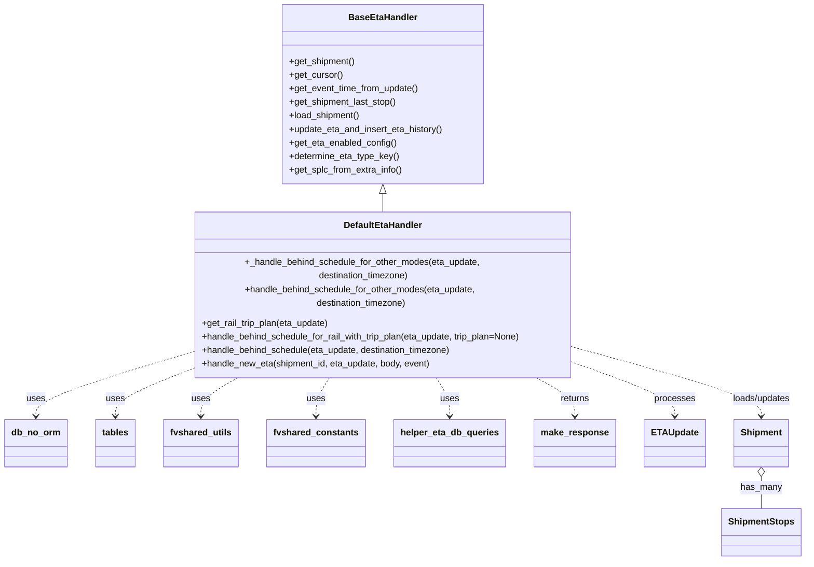

# Diagram: shipment_core/shipment_service/shipment_service/eta/eta_setter/DefaultEtaHandler.py


> Auto-generated by Obscura crawlers

## Diagram 1



### SVG

<svg id="container" width="1386.25" xmlns="http://www.w3.org/2000/svg" class="classDiagram" height="946" viewBox="0 0 1386.25 946" role="graphics-document document" aria-roledescription="class"><style>#container{font-family:"trebuchet ms",verdana,arial,sans-serif;font-size:16px;fill:#333;}@keyframes edge-animation-frame{from{stroke-dashoffset:0;}}@keyframes dash{to{stroke-dashoffset:0;}}#container .edge-animation-slow{stroke-dasharray:9,5!important;stroke-dashoffset:900;animation:dash 50s linear infinite;stroke-linecap:round;}#container .edge-animation-fast{stroke-dasharray:9,5!important;stroke-dashoffset:900;animation:dash 20s linear infinite;stroke-linecap:round;}#container .error-icon{fill:#552222;}#container .error-text{fill:#552222;stroke:#552222;}#container .edge-thickness-normal{stroke-width:1px;}#container .edge-thickness-thick{stroke-width:3.5px;}#container .edge-pattern-solid{stroke-dasharray:0;}#container .edge-thickness-invisible{stroke-width:0;fill:none;}#container .edge-pattern-dashed{stroke-dasharray:3;}#container .edge-pattern-dotted{stroke-dasharray:2;}#container .marker{fill:#333333;stroke:#333333;}#container .marker.cross{stroke:#333333;}#container svg{font-family:"trebuchet ms",verdana,arial,sans-serif;font-size:16px;}#container p{margin:0;}#container g.classGroup text{fill:#9370DB;stroke:none;font-family:"trebuchet ms",verdana,arial,sans-serif;font-size:10px;}#container g.classGroup text .title{font-weight:bolder;}#container .nodeLabel,#container .edgeLabel{color:#131300;}#container .edgeLabel .label rect{fill:#ECECFF;}#container .label text{fill:#131300;}#container .labelBkg{background:#ECECFF;}#container .edgeLabel .label span{background:#ECECFF;}#container .classTitle{font-weight:bolder;}#container .node rect,#container .node circle,#container .node ellipse,#container .node polygon,#container .node path{fill:#ECECFF;stroke:#9370DB;stroke-width:1px;}#container .divider{stroke:#9370DB;stroke-width:1;}#container g.clickable{cursor:pointer;}#container g.classGroup rect{fill:#ECECFF;stroke:#9370DB;}#container g.classGroup line{stroke:#9370DB;stroke-width:1;}#container .classLabel .box{stroke:none;stroke-width:0;fill:#ECECFF;opacity:0.5;}#container .classLabel .label{fill:#9370DB;font-size:10px;}#container .relation{stroke:#333333;stroke-width:1;fill:none;}#container .dashed-line{stroke-dasharray:3;}#container .dotted-line{stroke-dasharray:1 2;}#container #compositionStart,#container .composition{fill:#333333!important;stroke:#333333!important;stroke-width:1;}#container #compositionEnd,#container .composition{fill:#333333!important;stroke:#333333!important;stroke-width:1;}#container #dependencyStart,#container .dependency{fill:#333333!important;stroke:#333333!important;stroke-width:1;}#container #dependencyStart,#container .dependency{fill:#333333!important;stroke:#333333!important;stroke-width:1;}#container #extensionStart,#container .extension{fill:transparent!important;stroke:#333333!important;stroke-width:1;}#container #extensionEnd,#container .extension{fill:transparent!important;stroke:#333333!important;stroke-width:1;}#container #aggregationStart,#container .aggregation{fill:transparent!important;stroke:#333333!important;stroke-width:1;}#container #aggregationEnd,#container .aggregation{fill:transparent!important;stroke:#333333!important;stroke-width:1;}#container #lollipopStart,#container .lollipop{fill:#ECECFF!important;stroke:#333333!important;stroke-width:1;}#container #lollipopEnd,#container .lollipop{fill:#ECECFF!important;stroke:#333333!important;stroke-width:1;}#container .edgeTerminals{font-size:11px;line-height:initial;}#container .classTitleText{text-anchor:middle;font-size:18px;fill:#333;}#container .label-icon{display:inline-block;height:1em;overflow:visible;vertical-align:-0.125em;}#container .node .label-icon path{fill:currentColor;stroke:revert;stroke-width:revert;}#container :root{--mermaid-font-family:"trebuchet ms",verdana,arial,sans-serif;}</style><g><defs><marker id="container_class-aggregationStart" class="marker aggregation class" refX="18" refY="7" markerWidth="190" markerHeight="240" orient="auto"><path d="M 18,7 L9,13 L1,7 L9,1 Z"></path></marker></defs><defs><marker id="container_class-aggregationEnd" class="marker aggregation class" refX="1" refY="7" markerWidth="20" markerHeight="28" orient="auto"><path d="M 18,7 L9,13 L1,7 L9,1 Z"></path></marker></defs><defs><marker id="container_class-extensionStart" class="marker extension class" refX="18" refY="7" markerWidth="190" markerHeight="240" orient="auto"><path d="M 1,7 L18,13 V 1 Z"></path></marker></defs><defs><marker id="container_class-extensionEnd" class="marker extension class" refX="1" refY="7" markerWidth="20" markerHeight="28" orient="auto"><path d="M 1,1 V 13 L18,7 Z"></path></marker></defs><defs><marker id="container_class-compositionStart" class="marker composition class" refX="18" refY="7" markerWidth="190" markerHeight="240" orient="auto"><path d="M 18,7 L9,13 L1,7 L9,1 Z"></path></marker></defs><defs><marker id="container_class-compositionEnd" class="marker composition class" refX="1" refY="7" markerWidth="20" markerHeight="28" orient="auto"><path d="M 18,7 L9,13 L1,7 L9,1 Z"></path></marker></defs><defs><marker id="container_class-dependencyStart" class="marker dependency class" refX="6" refY="7" markerWidth="190" markerHeight="240" orient="auto"><path d="M 5,7 L9,13 L1,7 L9,1 Z"></path></marker></defs><defs><marker id="container_class-dependencyEnd" class="marker dependency class" refX="13" refY="7" markerWidth="20" markerHeight="28" orient="auto"><path d="M 18,7 L9,13 L14,7 L9,1 Z"></path></marker></defs><defs><marker id="container_class-lollipopStart" class="marker lollipop class" refX="13" refY="7" markerWidth="190" markerHeight="240" orient="auto"><circle stroke="black" fill="transparent" cx="7" cy="7" r="6"></circle></marker></defs><defs><marker id="container_class-lollipopEnd" class="marker lollipop class" refX="1" refY="7" markerWidth="190" markerHeight="240" orient="auto"><circle stroke="black" fill="transparent" cx="7" cy="7" r="6"></circle></marker></defs><g class="root"><g class="clusters"></g><g class="edgePaths"><path d="M660.949,343.25L660.949,344.542C660.949,345.833,660.949,348.417,660.949,353.875C660.949,359.333,660.949,367.667,660.949,371.833L660.949,376" id="id_BaseEtaHandler_DefaultEtaHandler_1" class="edge-thickness-normal edge-pattern-solid relation" style=";;;" data-edge="true" data-et="edge" data-id="id_BaseEtaHandler_DefaultEtaHandler_1" data-points="W3sieCI6NjYwLjk0OTIxODc1LCJ5IjozMjZ9LHsieCI6NjYwLjk0OTIxODc1LCJ5IjozNTF9LHsieCI6NjYwLjk0OTIxODc1LCJ5IjozNzZ9XQ==" marker-start="url(#container_class-extensionStart)"></path><path d="M321.66,589.538L278.275,601.115C234.891,612.692,148.121,635.846,104.736,652.59C61.352,669.333,61.352,679.667,61.352,684.833L61.352,690" id="id_DefaultEtaHandler_db_no_orm_2" class="edge-thickness-normal edge-pattern-dashed relation" style=";;;" data-edge="true" data-et="edge" data-id="id_DefaultEtaHandler_db_no_orm_2" data-points="W3sieCI6MzIxLjY2MDE1NjI1LCJ5Ijo1ODkuNTM3Nzk1NTI2OTQ4NX0seyJ4Ijo2MS4zNTE1NjI1LCJ5Ijo2NTl9LHsieCI6NjEuMzUxNTYyNSwieSI6Njk2fV0=" marker-end="url(#container_class-dependencyEnd)"></path><path d="M321.66,616.637L301.296,623.697C280.932,630.758,240.204,644.879,219.84,657.106C199.477,669.333,199.477,679.667,199.477,684.833L199.477,690" id="id_DefaultEtaHandler_tables_3" class="edge-thickness-normal edge-pattern-dashed relation" style=";;;" data-edge="true" data-et="edge" data-id="id_DefaultEtaHandler_tables_3" data-points="W3sieCI6MzIxLjY2MDE1NjI1LCJ5Ijo2MTYuNjM2OTgwNzkzNDg1Nn0seyJ4IjoxOTkuNDc2NTYyNSwieSI6NjU5fSx7IngiOjE5OS40NzY1NjI1LCJ5Ijo2OTZ9XQ==" marker-end="url(#container_class-dependencyEnd)"></path><path d="M420.634,622L408.585,628.167C396.537,634.333,372.44,646.667,360.392,658C348.344,669.333,348.344,679.667,348.344,684.833L348.344,690" id="id_DefaultEtaHandler_fvshared_utils_4" class="edge-thickness-normal edge-pattern-dashed relation" style=";;;" data-edge="true" data-et="edge" data-id="id_DefaultEtaHandler_fvshared_utils_4" data-points="W3sieCI6NDIwLjYzMzc2NDY0ODQzNzUsInkiOjYyMn0seyJ4IjozNDguMzQzNzUsInkiOjY1OX0seyJ4IjozNDguMzQzNzUsInkiOjY5Nn1d" marker-end="url(#container_class-dependencyEnd)"></path><path d="M572.69,622L568.265,628.167C563.84,634.333,554.99,646.667,550.566,658C546.141,669.333,546.141,679.667,546.141,684.833L546.141,690" id="id_DefaultEtaHandler_fvshared_constants_5" class="edge-thickness-normal edge-pattern-dashed relation" style=";;;" data-edge="true" data-et="edge" data-id="id_DefaultEtaHandler_fvshared_constants_5" data-points="W3sieCI6NTcyLjY5MDExMjMwNDY4NzUsInkiOjYyMn0seyJ4Ijo1NDYuMTQwNjI1LCJ5Ijo2NTl9LHsieCI6NTQ2LjE0MDYyNSwieSI6Njk2fV0=" marker-end="url(#container_class-dependencyEnd)"></path><path d="M749.208,622L753.633,628.167C758.058,634.333,766.908,646.667,771.333,658C775.758,669.333,775.758,679.667,775.758,684.833L775.758,690" id="id_DefaultEtaHandler_helper_eta_db_queries_6" class="edge-thickness-normal edge-pattern-dashed relation" style=";;;" data-edge="true" data-et="edge" data-id="id_DefaultEtaHandler_helper_eta_db_queries_6" data-points="W3sieCI6NzQ5LjIwODMyNTE5NTMxMjUsInkiOjYyMn0seyJ4Ijo3NzUuNzU3ODEyNSwieSI6NjU5fSx7IngiOjc3NS43NTc4MTI1LCJ5Ijo2OTZ9XQ==" marker-end="url(#container_class-dependencyEnd)"></path><path d="M914.784,622L927.51,628.167C940.236,634.333,965.688,646.667,978.414,658C991.141,669.333,991.141,679.667,991.141,684.833L991.141,690" id="id_DefaultEtaHandler_make_response_7" class="edge-thickness-normal edge-pattern-dashed relation" style=";;;" data-edge="true" data-et="edge" data-id="id_DefaultEtaHandler_make_response_7" data-points="W3sieCI6OTE0Ljc4Mzg2MjMwNDY4NzUsInkiOjYyMn0seyJ4Ijo5OTEuMTQwNjI1LCJ5Ijo2NTl9LHsieCI6OTkxLjE0MDYyNSwieSI6Njk2fV0=" marker-end="url(#container_class-dependencyEnd)"></path><path d="M1000.238,607.365L1027.183,615.971C1054.128,624.577,1108.017,641.788,1134.962,655.561C1161.906,669.333,1161.906,679.667,1161.906,684.833L1161.906,690" id="id_DefaultEtaHandler_ETAUpdate_8" class="edge-thickness-normal edge-pattern-dashed relation" style=";;;" data-edge="true" data-et="edge" data-id="id_DefaultEtaHandler_ETAUpdate_8" data-points="W3sieCI6MTAwMC4yMzgyODEyNSwieSI6NjA3LjM2NTA4MjQ1OTM1NTF9LHsieCI6MTE2MS45MDYyNSwieSI6NjU5fSx7IngiOjExNjEuOTA2MjUsInkiOjY5Nn1d" marker-end="url(#container_class-dependencyEnd)"></path><path d="M1000.238,582.599L1051.917,595.333C1103.596,608.066,1206.954,633.533,1258.633,651.433C1310.313,669.333,1310.313,679.667,1310.313,684.833L1310.313,690" id="id_DefaultEtaHandler_Shipment_9" class="edge-thickness-normal edge-pattern-dashed relation" style=";;;" data-edge="true" data-et="edge" data-id="id_DefaultEtaHandler_Shipment_9" data-points="W3sieCI6MTAwMC4yMzgyODEyNSwieSI6NTgyLjU5OTE5ODczNDMzNzJ9LHsieCI6MTMxMC4zMTI1LCJ5Ijo2NTl9LHsieCI6MTMxMC4zMTI1LCJ5Ijo2OTZ9XQ==" marker-end="url(#container_class-dependencyEnd)"></path><path d="M1310.313,797.25L1310.313,800.542C1310.313,803.833,1310.313,810.417,1310.313,819.875C1310.313,829.333,1310.313,841.667,1310.313,847.833L1310.313,854" id="id_Shipment_ShipmentStops_10" class="edge-thickness-normal edge-pattern-solid relation" style=";;;" data-edge="true" data-et="edge" data-id="id_Shipment_ShipmentStops_10" data-points="W3sieCI6MTMxMC4zMTI1LCJ5Ijo3ODB9LHsieCI6MTMxMC4zMTI1LCJ5Ijo4MTd9LHsieCI6MTMxMC4zMTI1LCJ5Ijo4NTR9XQ==" marker-start="url(#container_class-aggregationStart)"></path></g><g class="edgeLabels"><g class="edgeLabel"><g class="label" data-id="id_BaseEtaHandler_DefaultEtaHandler_1" transform="translate(0, 0)"><foreignObject width="0" height="0"><div xmlns="http://www.w3.org/1999/xhtml" class="labelBkg" style="display: table-cell; white-space: nowrap; line-height: 1.5; max-width: 200px; text-align: center;"><span class="edgeLabel"></span></div></foreignObject></g></g><g class="edgeLabel" transform="translate(61.3515625, 659)"><g class="label" data-id="id_DefaultEtaHandler_db_no_orm_2" transform="translate(-16.4921875, -12)"><foreignObject width="32.984375" height="24"><div xmlns="http://www.w3.org/1999/xhtml" class="labelBkg" style="display: table-cell; white-space: nowrap; line-height: 1.5; max-width: 200px; text-align: center;"><span class="edgeLabel"><p>uses</p></span></div></foreignObject></g></g><g class="edgeLabel" transform="translate(199.4765625, 659)"><g class="label" data-id="id_DefaultEtaHandler_tables_3" transform="translate(-16.4921875, -12)"><foreignObject width="32.984375" height="24"><div xmlns="http://www.w3.org/1999/xhtml" class="labelBkg" style="display: table-cell; white-space: nowrap; line-height: 1.5; max-width: 200px; text-align: center;"><span class="edgeLabel"><p>uses</p></span></div></foreignObject></g></g><g class="edgeLabel" transform="translate(348.34375, 659)"><g class="label" data-id="id_DefaultEtaHandler_fvshared_utils_4" transform="translate(-16.4921875, -12)"><foreignObject width="32.984375" height="24"><div xmlns="http://www.w3.org/1999/xhtml" class="labelBkg" style="display: table-cell; white-space: nowrap; line-height: 1.5; max-width: 200px; text-align: center;"><span class="edgeLabel"><p>uses</p></span></div></foreignObject></g></g><g class="edgeLabel" transform="translate(546.140625, 659)"><g class="label" data-id="id_DefaultEtaHandler_fvshared_constants_5" transform="translate(-16.4921875, -12)"><foreignObject width="32.984375" height="24"><div xmlns="http://www.w3.org/1999/xhtml" class="labelBkg" style="display: table-cell; white-space: nowrap; line-height: 1.5; max-width: 200px; text-align: center;"><span class="edgeLabel"><p>uses</p></span></div></foreignObject></g></g><g class="edgeLabel" transform="translate(775.7578125, 659)"><g class="label" data-id="id_DefaultEtaHandler_helper_eta_db_queries_6" transform="translate(-16.4921875, -12)"><foreignObject width="32.984375" height="24"><div xmlns="http://www.w3.org/1999/xhtml" class="labelBkg" style="display: table-cell; white-space: nowrap; line-height: 1.5; max-width: 200px; text-align: center;"><span class="edgeLabel"><p>uses</p></span></div></foreignObject></g></g><g class="edgeLabel" transform="translate(991.140625, 659)"><g class="label" data-id="id_DefaultEtaHandler_make_response_7" transform="translate(-26.265625, -12)"><foreignObject width="52.53125" height="24"><div xmlns="http://www.w3.org/1999/xhtml" class="labelBkg" style="display: table-cell; white-space: nowrap; line-height: 1.5; max-width: 200px; text-align: center;"><span class="edgeLabel"><p>returns</p></span></div></foreignObject></g></g><g class="edgeLabel" transform="translate(1161.90625, 659)"><g class="label" data-id="id_DefaultEtaHandler_ETAUpdate_8" transform="translate(-35.7890625, -12)"><foreignObject width="71.578125" height="24"><div xmlns="http://www.w3.org/1999/xhtml" class="labelBkg" style="display: table-cell; white-space: nowrap; line-height: 1.5; max-width: 200px; text-align: center;"><span class="edgeLabel"><p>processes</p></span></div></foreignObject></g></g><g class="edgeLabel" transform="translate(1310.3125, 659)"><g class="label" data-id="id_DefaultEtaHandler_Shipment_9" transform="translate(-53.1015625, -12)"><foreignObject width="106.203125" height="24"><div xmlns="http://www.w3.org/1999/xhtml" class="labelBkg" style="display: table-cell; white-space: nowrap; line-height: 1.5; max-width: 200px; text-align: center;"><span class="edgeLabel"><p>loads/updates</p></span></div></foreignObject></g></g><g class="edgeLabel" transform="translate(1310.3125, 817)"><g class="label" data-id="id_Shipment_ShipmentStops_10" transform="translate(-36.4765625, -12)"><foreignObject width="72.953125" height="24"><div xmlns="http://www.w3.org/1999/xhtml" class="labelBkg" style="display: table-cell; white-space: nowrap; line-height: 1.5; max-width: 200px; text-align: center;"><span class="edgeLabel"><p>has_many</p></span></div></foreignObject></g></g></g><g class="nodes"><g class="node default" id="classId-BaseEtaHandler-0" transform="translate(660.94921875, 167)"><g class="basic label-container"><path d="M-179.11328125 -159 L179.11328125 -159 L179.11328125 159 L-179.11328125 159" stroke="none" stroke-width="0" fill="#ECECFF" style=""></path><path d="M-179.11328125 -159 C-37.1491377879461 -159, 104.8150056741078 -159, 179.11328125 -159 M-179.11328125 -159 C-76.52868172772061 -159, 26.05591779455878 -159, 179.11328125 -159 M179.11328125 -159 C179.11328125 -33.052647495508424, 179.11328125 92.89470500898315, 179.11328125 159 M179.11328125 -159 C179.11328125 -40.482193605752656, 179.11328125 78.03561278849469, 179.11328125 159 M179.11328125 159 C36.13168231005642 159, -106.84991662988716 159, -179.11328125 159 M179.11328125 159 C48.7498001286051 159, -81.6136809927898 159, -179.11328125 159 M-179.11328125 159 C-179.11328125 49.518053834821245, -179.11328125 -59.96389233035751, -179.11328125 -159 M-179.11328125 159 C-179.11328125 80.95249480873169, -179.11328125 2.9049896174633716, -179.11328125 -159" stroke="#9370DB" stroke-width="1.3" fill="none" stroke-dasharray="0 0" style=""></path></g><g class="annotation-group text" transform="translate(0, -135)"></g><g class="label-group text" transform="translate(-58.0546875, -135)"><g class="label" style="font-weight: bolder" transform="translate(0,-12)"><foreignObject width="116.109375" height="24"><div xmlns="http://www.w3.org/1999/xhtml" style="display: table-cell; white-space: nowrap; line-height: 1.5; max-width: 166px; text-align: center;"><span class="nodeLabel markdown-node-label" style=""><p>BaseEtaHandler</p></span></div></foreignObject></g></g><g class="members-group text" transform="translate(-167.11328125, -87)"></g><g class="methods-group text" transform="translate(-167.11328125, -57)"><g class="label" style="" transform="translate(0,-12)"><foreignObject width="117.6875" height="24"><div xmlns="http://www.w3.org/1999/xhtml" style="display: table-cell; white-space: nowrap; line-height: 1.5; max-width: 175px; text-align: center;"><span class="nodeLabel markdown-node-label" style=""><p>+get_shipment()</p></span></div></foreignObject></g><g class="label" style="" transform="translate(0,12)"><foreignObject width="94.640625" height="24"><div xmlns="http://www.w3.org/1999/xhtml" style="display: table-cell; white-space: nowrap; line-height: 1.5; max-width: 152px; text-align: center;"><span class="nodeLabel markdown-node-label" style=""><p>+get_cursor()</p></span></div></foreignObject></g><g class="label" style="" transform="translate(0,36)"><foreignObject width="231.109375" height="24"><div xmlns="http://www.w3.org/1999/xhtml" style="display: table-cell; white-space: nowrap; line-height: 1.5; max-width: 288px; text-align: center;"><span class="nodeLabel markdown-node-label" style=""><p>+get_event_time_from_update()</p></span></div></foreignObject></g><g class="label" style="" transform="translate(0,60)"><foreignObject width="192.421875" height="24"><div xmlns="http://www.w3.org/1999/xhtml" style="display: table-cell; white-space: nowrap; line-height: 1.5; max-width: 250px; text-align: center;"><span class="nodeLabel markdown-node-label" style=""><p>+get_shipment_last_stop()</p></span></div></foreignObject></g><g class="label" style="" transform="translate(0,84)"><foreignObject width="127.1875" height="24"><div xmlns="http://www.w3.org/1999/xhtml" style="display: table-cell; white-space: nowrap; line-height: 1.5; max-width: 185px; text-align: center;"><span class="nodeLabel markdown-node-label" style=""><p>+load_shipment()</p></span></div></foreignObject></g><g class="label" style="" transform="translate(0,108)"><foreignObject width="276.171875" height="24"><div xmlns="http://www.w3.org/1999/xhtml" style="display: table-cell; white-space: nowrap; line-height: 1.5; max-width: 334px; text-align: center;"><span class="nodeLabel markdown-node-label" style=""><p>+update_eta_and_insert_eta_history()</p></span></div></foreignObject></g><g class="label" style="" transform="translate(0,132)"><foreignObject width="190.78125" height="24"><div xmlns="http://www.w3.org/1999/xhtml" style="display: table-cell; white-space: nowrap; line-height: 1.5; max-width: 248px; text-align: center;"><span class="nodeLabel markdown-node-label" style=""><p>+get_eta_enabled_config()</p></span></div></foreignObject></g><g class="label" style="" transform="translate(0,156)"><foreignObject width="196.53125" height="24"><div xmlns="http://www.w3.org/1999/xhtml" style="display: table-cell; white-space: nowrap; line-height: 1.5; max-width: 254px; text-align: center;"><span class="nodeLabel markdown-node-label" style=""><p>+determine_eta_type_key()</p></span></div></foreignObject></g><g class="label" style="" transform="translate(0,180)"><foreignObject width="201.765625" height="24"><div xmlns="http://www.w3.org/1999/xhtml" style="display: table-cell; white-space: nowrap; line-height: 1.5; max-width: 259px; text-align: center;"><span class="nodeLabel markdown-node-label" style=""><p>+get_splc_from_extra_info()</p></span></div></foreignObject></g></g><g class="divider" style=""><path d="M-179.11328125 -111 C-66.13279430844288 -111, 46.847692633114235 -111, 179.11328125 -111 M-179.11328125 -111 C-48.28424128903376 -111, 82.54479867193248 -111, 179.11328125 -111" stroke="#9370DB" stroke-width="1.3" fill="none" stroke-dasharray="0 0" style=""></path></g><g class="divider" style=""><path d="M-179.11328125 -87 C-74.34713396634393 -87, 30.419013317312135 -87, 179.11328125 -87 M-179.11328125 -87 C-66.42826485234878 -87, 46.25675154530245 -87, 179.11328125 -87" stroke="#9370DB" stroke-width="1.3" fill="none" stroke-dasharray="0 0" style=""></path></g></g><g class="node default" id="classId-DefaultEtaHandler-1" transform="translate(660.94921875, 499)"><g class="basic label-container"><path d="M-339.2890625 -123 L339.2890625 -123 L339.2890625 123 L-339.2890625 123" stroke="none" stroke-width="0" fill="#ECECFF" style=""></path><path d="M-339.2890625 -123 C-157.07464444656927 -123, 25.139773606861468 -123, 339.2890625 -123 M-339.2890625 -123 C-174.74181114053528 -123, -10.194559781070552 -123, 339.2890625 -123 M339.2890625 -123 C339.2890625 -50.82690161554045, 339.2890625 21.3461967689191, 339.2890625 123 M339.2890625 -123 C339.2890625 -34.92129692488089, 339.2890625 53.15740615023822, 339.2890625 123 M339.2890625 123 C119.609241686459 123, -100.070579127082 123, -339.2890625 123 M339.2890625 123 C120.55095862097457 123, -98.18714525805086 123, -339.2890625 123 M-339.2890625 123 C-339.2890625 48.04481661054501, -339.2890625 -26.910366778909975, -339.2890625 -123 M-339.2890625 123 C-339.2890625 55.55105160581597, -339.2890625 -11.897896788368058, -339.2890625 -123" stroke="#9370DB" stroke-width="1.3" fill="none" stroke-dasharray="0 0" style=""></path></g><g class="annotation-group text" transform="translate(0, -99)"></g><g class="label-group text" transform="translate(-67.234375, -99)"><g class="label" style="font-weight: bolder" transform="translate(0,-12)"><foreignObject width="134.46875" height="24"><div xmlns="http://www.w3.org/1999/xhtml" style="display: table-cell; white-space: nowrap; line-height: 1.5; max-width: 184px; text-align: center;"><span class="nodeLabel markdown-node-label" style=""><p>DefaultEtaHandler</p></span></div></foreignObject></g></g><g class="members-group text" transform="translate(-327.2890625, -51)"></g><g class="methods-group text" transform="translate(-327.2890625, -21)"><g class="label" style="" transform="translate(0,-12)"><foreignObject width="587.34375" height="24"><div xmlns="http://www.w3.org/1999/xhtml" style="display: table-cell; white-space: nowrap; line-height: 1.5; max-width: 645px; text-align: center;"><span class="nodeLabel markdown-node-label" style=""><p>+_handle_behind_schedule_for_other_modes(eta_update, destination_timezone)</p></span></div></foreignObject></g><g class="label" style="" transform="translate(0,12)"><foreignObject width="580.296875" height="24"><div xmlns="http://www.w3.org/1999/xhtml" style="display: table-cell; white-space: nowrap; line-height: 1.5; max-width: 638px; text-align: center;"><span class="nodeLabel markdown-node-label" style=""><p>+handle_behind_schedule_for_other_modes(eta_update, destination_timezone)</p></span></div></foreignObject></g><g class="label" style="" transform="translate(0,36)"><foreignObject width="229.359375" height="24"><div xmlns="http://www.w3.org/1999/xhtml" style="display: table-cell; white-space: nowrap; line-height: 1.5; max-width: 287px; text-align: center;"><span class="nodeLabel markdown-node-label" style=""><p>+get_rail_trip_plan(eta_update)</p></span></div></foreignObject></g><g class="label" style="" transform="translate(0,60)"><foreignObject width="576.65625" height="24"><div xmlns="http://www.w3.org/1999/xhtml" style="display: table-cell; white-space: nowrap; line-height: 1.5; max-width: 634px; text-align: center;"><span class="nodeLabel markdown-node-label" style=""><p>+handle_behind_schedule_for_rail_with_trip_plan(eta_update, trip_plan=None)</p></span></div></foreignObject></g><g class="label" style="" transform="translate(0,84)"><foreignObject width="449.921875" height="24"><div xmlns="http://www.w3.org/1999/xhtml" style="display: table-cell; white-space: nowrap; line-height: 1.5; max-width: 507px; text-align: center;"><span class="nodeLabel markdown-node-label" style=""><p>+handle_behind_schedule(eta_update, destination_timezone)</p></span></div></foreignObject></g><g class="label" style="" transform="translate(0,108)"><foreignObject width="410.390625" height="24"><div xmlns="http://www.w3.org/1999/xhtml" style="display: table-cell; white-space: nowrap; line-height: 1.5; max-width: 468px; text-align: center;"><span class="nodeLabel markdown-node-label" style=""><p>+handle_new_eta(shipment_id, eta_update, body, event)</p></span></div></foreignObject></g></g><g class="divider" style=""><path d="M-339.2890625 -75 C-102.55774299549208 -75, 134.17357650901585 -75, 339.2890625 -75 M-339.2890625 -75 C-76.30678066044197 -75, 186.67550117911605 -75, 339.2890625 -75" stroke="#9370DB" stroke-width="1.3" fill="none" stroke-dasharray="0 0" style=""></path></g><g class="divider" style=""><path d="M-339.2890625 -51 C-161.19312071509296 -51, 16.90282106981408 -51, 339.2890625 -51 M-339.2890625 -51 C-124.66685311536264 -51, 89.95535626927472 -51, 339.2890625 -51" stroke="#9370DB" stroke-width="1.3" fill="none" stroke-dasharray="0 0" style=""></path></g></g><g class="node default" id="classId-db_no_orm-2" transform="translate(61.3515625, 738)"><g class="basic label-container"><path d="M-53.3515625 -42 L53.3515625 -42 L53.3515625 42 L-53.3515625 42" stroke="none" stroke-width="0" fill="#ECECFF" style=""></path><path d="M-53.3515625 -42 C-18.105698316905297 -42, 17.140165866189406 -42, 53.3515625 -42 M-53.3515625 -42 C-26.157177941361986 -42, 1.037206617276027 -42, 53.3515625 -42 M53.3515625 -42 C53.3515625 -12.368612152893498, 53.3515625 17.262775694213005, 53.3515625 42 M53.3515625 -42 C53.3515625 -23.02995511697357, 53.3515625 -4.059910233947143, 53.3515625 42 M53.3515625 42 C25.783256437393486 42, -1.785049625213027 42, -53.3515625 42 M53.3515625 42 C23.637508158696374 42, -6.076546182607252 42, -53.3515625 42 M-53.3515625 42 C-53.3515625 18.918751417802863, -53.3515625 -4.162497164394274, -53.3515625 -42 M-53.3515625 42 C-53.3515625 14.669009325014962, -53.3515625 -12.661981349970077, -53.3515625 -42" stroke="#9370DB" stroke-width="1.3" fill="none" stroke-dasharray="0 0" style=""></path></g><g class="annotation-group text" transform="translate(0, -18)"></g><g class="label-group text" transform="translate(-41.3515625, -18)"><g class="label" style="font-weight: bolder" transform="translate(0,-12)"><foreignObject width="82.703125" height="24"><div xmlns="http://www.w3.org/1999/xhtml" style="display: table-cell; white-space: nowrap; line-height: 1.5; max-width: 133px; text-align: center;"><span class="nodeLabel markdown-node-label" style=""><p>db_no_orm</p></span></div></foreignObject></g></g><g class="members-group text" transform="translate(-41.3515625, 30)"></g><g class="methods-group text" transform="translate(-41.3515625, 60)"></g><g class="divider" style=""><path d="M-53.3515625 6 C-29.549197431082586 6, -5.746832362165172 6, 53.3515625 6 M-53.3515625 6 C-28.0722783571687 6, -2.792994214337398 6, 53.3515625 6" stroke="#9370DB" stroke-width="1.3" fill="none" stroke-dasharray="0 0" style=""></path></g><g class="divider" style=""><path d="M-53.3515625 24 C-10.959517590656915 24, 31.43252731868617 24, 53.3515625 24 M-53.3515625 24 C-12.429827092753627 24, 28.491908314492747 24, 53.3515625 24" stroke="#9370DB" stroke-width="1.3" fill="none" stroke-dasharray="0 0" style=""></path></g></g><g class="node default" id="classId-tables-3" transform="translate(199.4765625, 738)"><g class="basic label-container"><path d="M-34.7734375 -42 L34.7734375 -42 L34.7734375 42 L-34.7734375 42" stroke="none" stroke-width="0" fill="#ECECFF" style=""></path><path d="M-34.7734375 -42 C-13.538001196512283 -42, 7.697435106975433 -42, 34.7734375 -42 M-34.7734375 -42 C-14.261124434075544 -42, 6.251188631848912 -42, 34.7734375 -42 M34.7734375 -42 C34.7734375 -14.920192814567589, 34.7734375 12.159614370864823, 34.7734375 42 M34.7734375 -42 C34.7734375 -23.39852106365857, 34.7734375 -4.797042127317141, 34.7734375 42 M34.7734375 42 C13.000074481006003 42, -8.773288537987995 42, -34.7734375 42 M34.7734375 42 C8.303274300780927 42, -18.166888898438145 42, -34.7734375 42 M-34.7734375 42 C-34.7734375 24.03485107905322, -34.7734375 6.069702158106438, -34.7734375 -42 M-34.7734375 42 C-34.7734375 21.773199998724188, -34.7734375 1.5463999974483755, -34.7734375 -42" stroke="#9370DB" stroke-width="1.3" fill="none" stroke-dasharray="0 0" style=""></path></g><g class="annotation-group text" transform="translate(0, -18)"></g><g class="label-group text" transform="translate(-22.7734375, -18)"><g class="label" style="font-weight: bolder" transform="translate(0,-12)"><foreignObject width="45.546875" height="24"><div xmlns="http://www.w3.org/1999/xhtml" style="display: table-cell; white-space: nowrap; line-height: 1.5; max-width: 95px; text-align: center;"><span class="nodeLabel markdown-node-label" style=""><p>tables</p></span></div></foreignObject></g></g><g class="members-group text" transform="translate(-22.7734375, 30)"></g><g class="methods-group text" transform="translate(-22.7734375, 60)"></g><g class="divider" style=""><path d="M-34.7734375 6 C-19.803957809105707 6, -4.834478118211415 6, 34.7734375 6 M-34.7734375 6 C-17.37470088097777 6, 0.024035738044460686 6, 34.7734375 6" stroke="#9370DB" stroke-width="1.3" fill="none" stroke-dasharray="0 0" style=""></path></g><g class="divider" style=""><path d="M-34.7734375 24 C-13.400278105986878 24, 7.972881288026244 24, 34.7734375 24 M-34.7734375 24 C-8.400022740372183 24, 17.973392019255634 24, 34.7734375 24" stroke="#9370DB" stroke-width="1.3" fill="none" stroke-dasharray="0 0" style=""></path></g></g><g class="node default" id="classId-fvshared_utils-4" transform="translate(348.34375, 738)"><g class="basic label-container"><path d="M-64.09375 -42 L64.09375 -42 L64.09375 42 L-64.09375 42" stroke="none" stroke-width="0" fill="#ECECFF" style=""></path><path d="M-64.09375 -42 C-27.801701531219585 -42, 8.49034693756083 -42, 64.09375 -42 M-64.09375 -42 C-25.476215773792674 -42, 13.141318452414652 -42, 64.09375 -42 M64.09375 -42 C64.09375 -10.031990960648894, 64.09375 21.93601807870221, 64.09375 42 M64.09375 -42 C64.09375 -18.36520312103065, 64.09375 5.269593757938701, 64.09375 42 M64.09375 42 C31.513764090611787 42, -1.0662218187764267 42, -64.09375 42 M64.09375 42 C20.142757978863827 42, -23.808234042272346 42, -64.09375 42 M-64.09375 42 C-64.09375 11.692490064785392, -64.09375 -18.615019870429215, -64.09375 -42 M-64.09375 42 C-64.09375 19.665333604945694, -64.09375 -2.669332790108612, -64.09375 -42" stroke="#9370DB" stroke-width="1.3" fill="none" stroke-dasharray="0 0" style=""></path></g><g class="annotation-group text" transform="translate(0, -18)"></g><g class="label-group text" transform="translate(-52.09375, -18)"><g class="label" style="font-weight: bolder" transform="translate(0,-12)"><foreignObject width="104.1875" height="24"><div xmlns="http://www.w3.org/1999/xhtml" style="display: table-cell; white-space: nowrap; line-height: 1.5; max-width: 152px; text-align: center;"><span class="nodeLabel markdown-node-label" style=""><p>fvshared_utils</p></span></div></foreignObject></g></g><g class="members-group text" transform="translate(-52.09375, 30)"></g><g class="methods-group text" transform="translate(-52.09375, 60)"></g><g class="divider" style=""><path d="M-64.09375 6 C-23.281209415563247 6, 17.531331168873507 6, 64.09375 6 M-64.09375 6 C-14.884951731347165 6, 34.32384653730567 6, 64.09375 6" stroke="#9370DB" stroke-width="1.3" fill="none" stroke-dasharray="0 0" style=""></path></g><g class="divider" style=""><path d="M-64.09375 24 C-37.705187120596676 24, -11.31662424119336 24, 64.09375 24 M-64.09375 24 C-37.36397482793322 24, -10.63419965586644 24, 64.09375 24" stroke="#9370DB" stroke-width="1.3" fill="none" stroke-dasharray="0 0" style=""></path></g></g><g class="node default" id="classId-fvshared_constants-5" transform="translate(546.140625, 738)"><g class="basic label-container"><path d="M-83.703125 -42 L83.703125 -42 L83.703125 42 L-83.703125 42" stroke="none" stroke-width="0" fill="#ECECFF" style=""></path><path d="M-83.703125 -42 C-43.74725904654637 -42, -3.7913930930927364 -42, 83.703125 -42 M-83.703125 -42 C-47.093960687518425 -42, -10.48479637503685 -42, 83.703125 -42 M83.703125 -42 C83.703125 -15.372262940595139, 83.703125 11.255474118809722, 83.703125 42 M83.703125 -42 C83.703125 -9.795040795016554, 83.703125 22.40991840996689, 83.703125 42 M83.703125 42 C33.604561971522806 42, -16.49400105695439 42, -83.703125 42 M83.703125 42 C47.77080487715517 42, 11.838484754310343 42, -83.703125 42 M-83.703125 42 C-83.703125 18.8593937192919, -83.703125 -4.281212561416197, -83.703125 -42 M-83.703125 42 C-83.703125 9.074888323876117, -83.703125 -23.850223352247767, -83.703125 -42" stroke="#9370DB" stroke-width="1.3" fill="none" stroke-dasharray="0 0" style=""></path></g><g class="annotation-group text" transform="translate(0, -18)"></g><g class="label-group text" transform="translate(-71.703125, -18)"><g class="label" style="font-weight: bolder" transform="translate(0,-12)"><foreignObject width="143.40625" height="24"><div xmlns="http://www.w3.org/1999/xhtml" style="display: table-cell; white-space: nowrap; line-height: 1.5; max-width: 191px; text-align: center;"><span class="nodeLabel markdown-node-label" style=""><p>fvshared_constants</p></span></div></foreignObject></g></g><g class="members-group text" transform="translate(-71.703125, 30)"></g><g class="methods-group text" transform="translate(-71.703125, 60)"></g><g class="divider" style=""><path d="M-83.703125 6 C-30.74013685350868 6, 22.22285129298264 6, 83.703125 6 M-83.703125 6 C-45.346704075792346 6, -6.990283151584691 6, 83.703125 6" stroke="#9370DB" stroke-width="1.3" fill="none" stroke-dasharray="0 0" style=""></path></g><g class="divider" style=""><path d="M-83.703125 24 C-19.946325303194477 24, 43.810474393611045 24, 83.703125 24 M-83.703125 24 C-33.316036030850995 24, 17.07105293829801 24, 83.703125 24" stroke="#9370DB" stroke-width="1.3" fill="none" stroke-dasharray="0 0" style=""></path></g></g><g class="node default" id="classId-helper_eta_db_queries-6" transform="translate(775.7578125, 738)"><g class="basic label-container"><path d="M-95.9140625 -42 L95.9140625 -42 L95.9140625 42 L-95.9140625 42" stroke="none" stroke-width="0" fill="#ECECFF" style=""></path><path d="M-95.9140625 -42 C-23.122744290236554 -42, 49.66857391952689 -42, 95.9140625 -42 M-95.9140625 -42 C-41.65432563997303 -42, 12.605411220053938 -42, 95.9140625 -42 M95.9140625 -42 C95.9140625 -16.64119285476623, 95.9140625 8.717614290467537, 95.9140625 42 M95.9140625 -42 C95.9140625 -21.93178151286175, 95.9140625 -1.8635630257235007, 95.9140625 42 M95.9140625 42 C45.7491482413534 42, -4.415766017293194 42, -95.9140625 42 M95.9140625 42 C42.76957215276572 42, -10.374918194468563 42, -95.9140625 42 M-95.9140625 42 C-95.9140625 22.17619852979632, -95.9140625 2.35239705959264, -95.9140625 -42 M-95.9140625 42 C-95.9140625 23.614695115622347, -95.9140625 5.229390231244693, -95.9140625 -42" stroke="#9370DB" stroke-width="1.3" fill="none" stroke-dasharray="0 0" style=""></path></g><g class="annotation-group text" transform="translate(0, -18)"></g><g class="label-group text" transform="translate(-83.9140625, -18)"><g class="label" style="font-weight: bolder" transform="translate(0,-12)"><foreignObject width="167.828125" height="24"><div xmlns="http://www.w3.org/1999/xhtml" style="display: table-cell; white-space: nowrap; line-height: 1.5; max-width: 216px; text-align: center;"><span class="nodeLabel markdown-node-label" style=""><p>helper_eta_db_queries</p></span></div></foreignObject></g></g><g class="members-group text" transform="translate(-83.9140625, 30)"></g><g class="methods-group text" transform="translate(-83.9140625, 60)"></g><g class="divider" style=""><path d="M-95.9140625 6 C-56.795639545802764 6, -17.67721659160553 6, 95.9140625 6 M-95.9140625 6 C-34.37977443455044 6, 27.154513630899118 6, 95.9140625 6" stroke="#9370DB" stroke-width="1.3" fill="none" stroke-dasharray="0 0" style=""></path></g><g class="divider" style=""><path d="M-95.9140625 24 C-42.547991593525786 24, 10.818079312948427 24, 95.9140625 24 M-95.9140625 24 C-33.38914825748875 24, 29.135765985022502 24, 95.9140625 24" stroke="#9370DB" stroke-width="1.3" fill="none" stroke-dasharray="0 0" style=""></path></g></g><g class="node default" id="classId-make_response-7" transform="translate(991.140625, 738)"><g class="basic label-container"><path d="M-69.46875 -42 L69.46875 -42 L69.46875 42 L-69.46875 42" stroke="none" stroke-width="0" fill="#ECECFF" style=""></path><path d="M-69.46875 -42 C-17.26910060176855 -42, 34.9305487964629 -42, 69.46875 -42 M-69.46875 -42 C-38.75081318045782 -42, -8.032876360915637 -42, 69.46875 -42 M69.46875 -42 C69.46875 -16.135202589392296, 69.46875 9.729594821215407, 69.46875 42 M69.46875 -42 C69.46875 -10.749010267804124, 69.46875 20.501979464391752, 69.46875 42 M69.46875 42 C23.860821159100396 42, -21.747107681799207 42, -69.46875 42 M69.46875 42 C19.71530295273204 42, -30.038144094535923 42, -69.46875 42 M-69.46875 42 C-69.46875 12.369413902808532, -69.46875 -17.261172194382937, -69.46875 -42 M-69.46875 42 C-69.46875 11.021295525017472, -69.46875 -19.957408949965057, -69.46875 -42" stroke="#9370DB" stroke-width="1.3" fill="none" stroke-dasharray="0 0" style=""></path></g><g class="annotation-group text" transform="translate(0, -18)"></g><g class="label-group text" transform="translate(-57.46875, -18)"><g class="label" style="font-weight: bolder" transform="translate(0,-12)"><foreignObject width="114.9375" height="24"><div xmlns="http://www.w3.org/1999/xhtml" style="display: table-cell; white-space: nowrap; line-height: 1.5; max-width: 164px; text-align: center;"><span class="nodeLabel markdown-node-label" style=""><p>make_response</p></span></div></foreignObject></g></g><g class="members-group text" transform="translate(-57.46875, 30)"></g><g class="methods-group text" transform="translate(-57.46875, 60)"></g><g class="divider" style=""><path d="M-69.46875 6 C-17.649238452324937 6, 34.170273095350126 6, 69.46875 6 M-69.46875 6 C-30.23969544163935 6, 8.989359116721303 6, 69.46875 6" stroke="#9370DB" stroke-width="1.3" fill="none" stroke-dasharray="0 0" style=""></path></g><g class="divider" style=""><path d="M-69.46875 24 C-28.95252070101919 24, 11.563708597961622 24, 69.46875 24 M-69.46875 24 C-17.806900062113115 24, 33.85494987577377 24, 69.46875 24" stroke="#9370DB" stroke-width="1.3" fill="none" stroke-dasharray="0 0" style=""></path></g></g><g class="node default" id="classId-ETAUpdate-8" transform="translate(1161.90625, 738)"><g class="basic label-container"><path d="M-51.296875 -42 L51.296875 -42 L51.296875 42 L-51.296875 42" stroke="none" stroke-width="0" fill="#ECECFF" style=""></path><path d="M-51.296875 -42 C-11.729365366278394 -42, 27.838144267443212 -42, 51.296875 -42 M-51.296875 -42 C-17.014640814236508 -42, 17.267593371526985 -42, 51.296875 -42 M51.296875 -42 C51.296875 -18.914153017848108, 51.296875 4.171693964303785, 51.296875 42 M51.296875 -42 C51.296875 -24.404856345756038, 51.296875 -6.809712691512075, 51.296875 42 M51.296875 42 C26.492497296452864 42, 1.6881195929057284 42, -51.296875 42 M51.296875 42 C17.36674218362551 42, -16.563390632748977 42, -51.296875 42 M-51.296875 42 C-51.296875 11.469738435226958, -51.296875 -19.060523129546084, -51.296875 -42 M-51.296875 42 C-51.296875 17.07594420714359, -51.296875 -7.848111585712822, -51.296875 -42" stroke="#9370DB" stroke-width="1.3" fill="none" stroke-dasharray="0 0" style=""></path></g><g class="annotation-group text" transform="translate(0, -18)"></g><g class="label-group text" transform="translate(-39.296875, -18)"><g class="label" style="font-weight: bolder" transform="translate(0,-12)"><foreignObject width="78.59375" height="24"><div xmlns="http://www.w3.org/1999/xhtml" style="display: table-cell; white-space: nowrap; line-height: 1.5; max-width: 128px; text-align: center;"><span class="nodeLabel markdown-node-label" style=""><p>ETAUpdate</p></span></div></foreignObject></g></g><g class="members-group text" transform="translate(-39.296875, 30)"></g><g class="methods-group text" transform="translate(-39.296875, 60)"></g><g class="divider" style=""><path d="M-51.296875 6 C-14.87921949668646 6, 21.53843600662708 6, 51.296875 6 M-51.296875 6 C-10.688233542687648 6, 29.920407914624704 6, 51.296875 6" stroke="#9370DB" stroke-width="1.3" fill="none" stroke-dasharray="0 0" style=""></path></g><g class="divider" style=""><path d="M-51.296875 24 C-10.405217547069633 24, 30.486439905860735 24, 51.296875 24 M-51.296875 24 C-24.489066451748194 24, 2.3187420965036125 24, 51.296875 24" stroke="#9370DB" stroke-width="1.3" fill="none" stroke-dasharray="0 0" style=""></path></g></g><g class="node default" id="classId-Shipment-9" transform="translate(1310.3125, 738)"><g class="basic label-container"><path d="M-47.109375 -42 L47.109375 -42 L47.109375 42 L-47.109375 42" stroke="none" stroke-width="0" fill="#ECECFF" style=""></path><path d="M-47.109375 -42 C-23.7621937616158 -42, -0.41501252323160287 -42, 47.109375 -42 M-47.109375 -42 C-26.039579371001917 -42, -4.969783742003834 -42, 47.109375 -42 M47.109375 -42 C47.109375 -13.947558672847354, 47.109375 14.104882654305293, 47.109375 42 M47.109375 -42 C47.109375 -14.718035135819765, 47.109375 12.56392972836047, 47.109375 42 M47.109375 42 C12.141191557234059 42, -22.826991885531882 42, -47.109375 42 M47.109375 42 C12.663346038330133 42, -21.782682923339735 42, -47.109375 42 M-47.109375 42 C-47.109375 20.008257689122573, -47.109375 -1.9834846217548545, -47.109375 -42 M-47.109375 42 C-47.109375 8.670212539759966, -47.109375 -24.65957492048007, -47.109375 -42" stroke="#9370DB" stroke-width="1.3" fill="none" stroke-dasharray="0 0" style=""></path></g><g class="annotation-group text" transform="translate(0, -18)"></g><g class="label-group text" transform="translate(-35.109375, -18)"><g class="label" style="font-weight: bolder" transform="translate(0,-12)"><foreignObject width="70.21875" height="24"><div xmlns="http://www.w3.org/1999/xhtml" style="display: table-cell; white-space: nowrap; line-height: 1.5; max-width: 120px; text-align: center;"><span class="nodeLabel markdown-node-label" style=""><p>Shipment</p></span></div></foreignObject></g></g><g class="members-group text" transform="translate(-35.109375, 30)"></g><g class="methods-group text" transform="translate(-35.109375, 60)"></g><g class="divider" style=""><path d="M-47.109375 6 C-15.58674582917918 6, 15.935883341641642 6, 47.109375 6 M-47.109375 6 C-20.55860394062294 6, 5.992167118754118 6, 47.109375 6" stroke="#9370DB" stroke-width="1.3" fill="none" stroke-dasharray="0 0" style=""></path></g><g class="divider" style=""><path d="M-47.109375 24 C-27.06087245762791 24, -7.012369915255817 24, 47.109375 24 M-47.109375 24 C-10.516722589646058 24, 26.075929820707884 24, 47.109375 24" stroke="#9370DB" stroke-width="1.3" fill="none" stroke-dasharray="0 0" style=""></path></g></g><g class="node default" id="classId-ShipmentStops-10" transform="translate(1310.3125, 896)"><g class="basic label-container"><path d="M-67.9375 -42 L67.9375 -42 L67.9375 42 L-67.9375 42" stroke="none" stroke-width="0" fill="#ECECFF" style=""></path><path d="M-67.9375 -42 C-19.08564211416585 -42, 29.7662157716683 -42, 67.9375 -42 M-67.9375 -42 C-22.015965628072777 -42, 23.905568743854445 -42, 67.9375 -42 M67.9375 -42 C67.9375 -22.999714481811086, 67.9375 -3.9994289636221723, 67.9375 42 M67.9375 -42 C67.9375 -18.67666024081749, 67.9375 4.646679518365019, 67.9375 42 M67.9375 42 C25.476388379684373 42, -16.984723240631254 42, -67.9375 42 M67.9375 42 C16.916043717025175 42, -34.10541256594965 42, -67.9375 42 M-67.9375 42 C-67.9375 14.694664880974969, -67.9375 -12.610670238050062, -67.9375 -42 M-67.9375 42 C-67.9375 11.406812207439714, -67.9375 -19.186375585120572, -67.9375 -42" stroke="#9370DB" stroke-width="1.3" fill="none" stroke-dasharray="0 0" style=""></path></g><g class="annotation-group text" transform="translate(0, -18)"></g><g class="label-group text" transform="translate(-55.9375, -18)"><g class="label" style="font-weight: bolder" transform="translate(0,-12)"><foreignObject width="111.875" height="24"><div xmlns="http://www.w3.org/1999/xhtml" style="display: table-cell; white-space: nowrap; line-height: 1.5; max-width: 160px; text-align: center;"><span class="nodeLabel markdown-node-label" style=""><p>ShipmentStops</p></span></div></foreignObject></g></g><g class="members-group text" transform="translate(-55.9375, 30)"></g><g class="methods-group text" transform="translate(-55.9375, 60)"></g><g class="divider" style=""><path d="M-67.9375 6 C-23.50259259278169 6, 20.932314814436623 6, 67.9375 6 M-67.9375 6 C-19.09859510230612 6, 29.74030979538776 6, 67.9375 6" stroke="#9370DB" stroke-width="1.3" fill="none" stroke-dasharray="0 0" style=""></path></g><g class="divider" style=""><path d="M-67.9375 24 C-29.486075511749704 24, 8.965348976500593 24, 67.9375 24 M-67.9375 24 C-18.372557576314755 24, 31.19238484737049 24, 67.9375 24" stroke="#9370DB" stroke-width="1.3" fill="none" stroke-dasharray="0 0" style=""></path></g></g></g></g></g></svg>

## Diagram 2

```mermaid
flowchart TD
    Start([start handle_new_eta]) --> CheckHistorical{"body.historical_only\npresent?"}
    CheckHistorical -- Yes --> HistoricalLog[historical_log(eta_update)\nreturn]
    CheckHistorical -- No --> LoadShipment[load_shipment(shipment_id)\nget_shipment()]
    LoadShipment --> GetOrgFvId[get_fv_id_from_org_id(event, shipment.created_by_org_id)]
    GetOrgFvId --> GetEtaConfig[get_eta_enabled_config(event, org_fv_id)]
    GetEtaConfig --> IsEtaEnabled{"is_eta_enabled\n(lob, mode_id, eta_type)?"}
    IsEtaEnabled -- False --> PersistEta[helper_eta_db_queries.insert_eta_update(cursor, eta_update)]
    PersistEta --> MakeResponseDisabled[make_response({historical_only: True, updated: False, reason}, 200)\nreturn]
    IsEtaEnabled -- True --> GetLastStop[get_shipment_last_stop(mode_id=body.mode_id, location_id=body.location_id)]
    GetLastStop --> LastStopCheck{"last_stop is None?"}
    LastStopCheck -- Yes --> BadRequest[make_response(error, 400)\nreturn]
    LastStopCheck -- No --> SetStatusException[eta_update.status_exception = Shipment_hold_exception(body.status_exception)]
    SetStatusException --> UpdateHistory[update_eta_and_insert_eta_history(eta_update, last_stop.id, eta_update.passthrough_fields, shipment)]
    UpdateHistory --> BuildResponse[response = {eta, is_fv_eta, updated, reason}]
    BuildResponse --> MakeResponseOK[make_response(response, 200)\nreturn]
    MakeResponseOK --> End([end])
```

> SVG rendering failed for this diagram.
