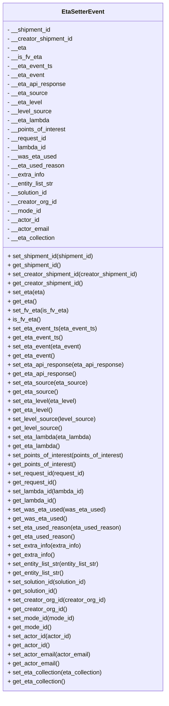

# Diagram: shipment_core/shipment_service/shipment_service/eta/eta_setter/EtaSetterEvent.py

> Auto-generated by Obscura crawlers

## Mermaid

### SVG

<svg id="container" width="445.96875" xmlns="http://www.w3.org/2000/svg" class="classDiagram" height="1840" viewBox="0 0 445.96875 1840" role="graphics-document document" aria-roledescription="class"><g><defs><marker id="container_class-aggregationStart" class="marker aggregation class" refX="18" refY="7" markerWidth="190" markerHeight="240" orient="auto"><path d="M 18,7 L9,13 L1,7 L9,1 Z"></path></marker></defs><defs><marker id="container_class-aggregationEnd" class="marker aggregation class" refX="1" refY="7" markerWidth="20" markerHeight="28" orient="auto"><path d="M 18,7 L9,13 L1,7 L9,1 Z"></path></marker></defs><defs><marker id="container_class-extensionStart" class="marker extension class" refX="18" refY="7" markerWidth="190" markerHeight="240" orient="auto"><path d="M 1,7 L18,13 V 1 Z"></path></marker></defs><defs><marker id="container_class-extensionEnd" class="marker extension class" refX="1" refY="7" markerWidth="20" markerHeight="28" orient="auto"><path d="M 1,1 V 13 L18,7 Z"></path></marker></defs><defs><marker id="container_class-compositionStart" class="marker composition class" refX="18" refY="7" markerWidth="190" markerHeight="240" orient="auto"><path d="M 18,7 L9,13 L1,7 L9,1 Z"></path></marker></defs><defs><marker id="container_class-compositionEnd" class="marker composition class" refX="1" refY="7" markerWidth="20" markerHeight="28" orient="auto"><path d="M 18,7 L9,13 L1,7 L9,1 Z"></path></marker></defs><defs><marker id="container_class-dependencyStart" class="marker dependency class" refX="6" refY="7" markerWidth="190" markerHeight="240" orient="auto"><path d="M 5,7 L9,13 L1,7 L9,1 Z"></path></marker></defs><defs><marker id="container_class-dependencyEnd" class="marker dependency class" refX="13" refY="7" markerWidth="20" markerHeight="28" orient="auto"><path d="M 18,7 L9,13 L14,7 L9,1 Z"></path></marker></defs><defs><marker id="container_class-lollipopStart" class="marker lollipop class" refX="13" refY="7" markerWidth="190" markerHeight="240" orient="auto"><circle stroke="black" fill="transparent" cx="7" cy="7" r="6"></circle></marker></defs><defs><marker id="container_class-lollipopEnd" class="marker lollipop class" refX="1" refY="7" markerWidth="190" markerHeight="240" orient="auto"><circle stroke="black" fill="transparent" cx="7" cy="7" r="6"></circle></marker></defs><g class="root"><g class="clusters"></g><g class="edgePaths"></g><g class="edgeLabels"></g><g class="nodes"><g class="node default" id="classId-EtaSetterEvent-0" transform="translate(222.984375, 920)"><g class="basic label-container"><path d="M-214.984375 -912 L214.984375 -912 L214.984375 912 L-214.984375 912" stroke="none" stroke-width="0" fill="#ECECFF" style=""></path><path d="M-214.984375 -912 C-68.64455992223168 -912, 77.69525515553664 -912, 214.984375 -912 M-214.984375 -912 C-78.40962392193663 -912, 58.165127156126744 -912, 214.984375 -912 M214.984375 -912 C214.984375 -278.9542663786551, 214.984375 354.09146724268976, 214.984375 912 M214.984375 -912 C214.984375 -212.0733949928367, 214.984375 487.8532100143266, 214.984375 912 M214.984375 912 C70.7887135693498 912, -73.40694786130041 912, -214.984375 912 M214.984375 912 C58.88179590010907 912, -97.22078319978186 912, -214.984375 912 M-214.984375 912 C-214.984375 388.3563618252724, -214.984375 -135.28727634945517, -214.984375 -912 M-214.984375 912 C-214.984375 253.8671957119567, -214.984375 -404.2656085760866, -214.984375 -912" stroke="#9370DB" stroke-width="1.3" fill="none" stroke-dasharray="0 0" style=""></path></g><g class="annotation-group text" transform="translate(0, -888)"></g><g class="label-group text" transform="translate(-54.296875, -888)"><g class="label" style="font-weight: bolder" transform="translate(0,-12)"><foreignObject width="108.59375" height="24">

EtaSetterEvent

</foreignObject></g></g><g class="members-group text" transform="translate(-202.984375, -840)"><g class="label" style="" transform="translate(0,-12)"><foreignObject width="118.03125" height="24">

- __shipment_id

</foreignObject></g><g class="label" style="" transform="translate(0,12)"><foreignObject width="176.40625" height="24">

- __creator_shipment_id

</foreignObject></g><g class="label" style="" transform="translate(0,36)"><foreignObject width="49.9375" height="24">

- __eta

</foreignObject></g><g class="label" style="" transform="translate(0,60)"><foreignObject width="90.6875" height="24">

- __is_fv_eta

</foreignObject></g><g class="label" style="" transform="translate(0,84)"><foreignObject width="119.53125" height="24">

- __eta_event_ts

</foreignObject></g><g class="label" style="" transform="translate(0,108)"><foreignObject width="98.28125" height="24">

- __eta_event

</foreignObject></g><g class="label" style="" transform="translate(0,132)"><foreignObject width="155.28125" height="24">

- __eta_api_response

</foreignObject></g><g class="label" style="" transform="translate(0,156)"><foreignObject width="106.140625" height="24">

- __eta_source

</foreignObject></g><g class="label" style="" transform="translate(0,180)"><foreignObject width="92.578125" height="24">

- __eta_level

</foreignObject></g><g class="label" style="" transform="translate(0,204)"><foreignObject width="117.6875" height="24">

- __level_source

</foreignObject></g><g class="label" style="" transform="translate(0,228)"><foreignObject width="112.90625" height="24">

- __eta_lambda

</foreignObject></g><g class="label" style="" transform="translate(0,252)"><foreignObject width="159.1875" height="24">

- __points_of_interest

</foreignObject></g><g class="label" style="" transform="translate(0,276)"><foreignObject width="104.84375" height="24">

- __request_id

</foreignObject></g><g class="label" style="" transform="translate(0,300)"><foreignObject width="104.21875" height="24">

- __lambda_id

</foreignObject></g><g class="label" style="" transform="translate(0,324)"><foreignObject width="127.984375" height="24">

- __was_eta_used

</foreignObject></g><g class="label" style="" transform="translate(0,348)"><foreignObject width="150.328125" height="24">

- __eta_used_reason

</foreignObject></g><g class="label" style="" transform="translate(0,372)"><foreignObject width="100.046875" height="24">

- __extra_info

</foreignObject></g><g class="label" style="" transform="translate(0,396)"><foreignObject width="126.6875" height="24">

- __entity_list_str

</foreignObject></g><g class="label" style="" transform="translate(0,420)"><foreignObject width="109.40625" height="24">

- __solution_id

</foreignObject></g><g class="label" style="" transform="translate(0,444)"><foreignObject width="131.296875" height="24">

- __creator_org_id

</foreignObject></g><g class="label" style="" transform="translate(0,468)"><foreignObject width="90.59375" height="24">

- __mode_id

</foreignObject></g><g class="label" style="" transform="translate(0,492)"><foreignObject width="85.390625" height="24">

- __actor_id

</foreignObject></g><g class="label" style="" transform="translate(0,516)"><foreignObject width="111.3125" height="24">

- __actor_email

</foreignObject></g><g class="label" style="" transform="translate(0,540)"><foreignObject width="129.28125" height="24">

- __eta_collection

</foreignObject></g></g><g class="methods-group text" transform="translate(-202.984375, -240)"><g class="label" style="" transform="translate(0,-12)"><foreignObject width="234.578125" height="24">

+ set_shipment_id(shipment_id)

</foreignObject></g><g class="label" style="" transform="translate(0,12)"><foreignObject width="144.328125" height="24">

+ get_shipment_id()

</foreignObject></g><g class="label" style="" transform="translate(0,36)"><foreignObject width="351.671875" height="24">

+ set_creator_shipment_id(creator_shipment_id)

</foreignObject></g><g class="label" style="" transform="translate(0,60)"><foreignObject width="202.71875" height="24">

+ get_creator_shipment_id()

</foreignObject></g><g class="label" style="" transform="translate(0,84)"><foreignObject width="98.75" height="24">

+ set_eta(eta)

</foreignObject></g><g class="label" style="" transform="translate(0,108)"><foreignObject width="76.25" height="24">

+ get_eta()

</foreignObject></g><g class="label" style="" transform="translate(0,132)"><foreignObject width="159.90625" height="24">

+ set_fv_eta(is_fv_eta)

</foreignObject></g><g class="label" style="" transform="translate(0,156)"><foreignObject width="86.109375" height="24">

+ is_fv_eta()

</foreignObject></g><g class="label" style="" transform="translate(0,180)"><foreignObject width="237.90625" height="24">

+ set_eta_event_ts(eta_event_ts)

</foreignObject></g><g class="label" style="" transform="translate(0,204)"><foreignObject width="145.828125" height="24">

+ get_eta_event_ts()

</foreignObject></g><g class="label" style="" transform="translate(0,228)"><foreignObject width="195.421875" height="24">

+ set_eta_event(eta_event)

</foreignObject></g><g class="label" style="" transform="translate(0,252)"><foreignObject width="124.578125" height="24">

+ get_eta_event()

</foreignObject></g><g class="label" style="" transform="translate(0,276)"><foreignObject width="309.4375" height="24">

+ set_eta_api_response(eta_api_response)

</foreignObject></g><g class="label" style="" transform="translate(0,300)"><foreignObject width="181.59375" height="24">

+ get_eta_api_response()

</foreignObject></g><g class="label" style="" transform="translate(0,324)"><foreignObject width="211.125" height="24">

+ set_eta_source(eta_source)

</foreignObject></g><g class="label" style="" transform="translate(0,348)"><foreignObject width="132.4375" height="24">

+ get_eta_source()

</foreignObject></g><g class="label" style="" transform="translate(0,372)"><foreignObject width="184.03125" height="24">

+ set_eta_level(eta_level)

</foreignObject></g><g class="label" style="" transform="translate(0,396)"><foreignObject width="118.890625" height="24">

+ get_eta_level()

</foreignObject></g><g class="label" style="" transform="translate(0,420)"><foreignObject width="234.078125" height="24">

+ set_level_source(level_source)

</foreignObject></g><g class="label" style="" transform="translate(0,444)"><foreignObject width="143.984375" height="24">

+ get_level_source()

</foreignObject></g><g class="label" style="" transform="translate(0,468)"><foreignObject width="224.671875" height="24">

+ set_eta_lambda(eta_lambda)

</foreignObject></g><g class="label" style="" transform="translate(0,492)"><foreignObject width="139.203125" height="24">

+ get_eta_lambda()

</foreignObject></g><g class="label" style="" transform="translate(0,516)"><foreignObject width="316.921875" height="24">

+ set_points_of_interest(points_of_interest)

</foreignObject></g><g class="label" style="" transform="translate(0,540)"><foreignObject width="185.5" height="24">

+ get_points_of_interest()

</foreignObject></g><g class="label" style="" transform="translate(0,564)"><foreignObject width="208.21875" height="24">

+ set_request_id(request_id)

</foreignObject></g><g class="label" style="" transform="translate(0,588)"><foreignObject width="131.140625" height="24">

+ get_request_id()

</foreignObject></g><g class="label" style="" transform="translate(0,612)"><foreignObject width="207.125" height="24">

+ set_lambda_id(lambda_id)

</foreignObject></g><g class="label" style="" transform="translate(0,636)"><foreignObject width="130.515625" height="24">

+ get_lambda_id()

</foreignObject></g><g class="label" style="" transform="translate(0,660)"><foreignObject width="254.84375" height="24">

+ set_was_eta_used(was_eta_used)

</foreignObject></g><g class="label" style="" transform="translate(0,684)"><foreignObject width="154.296875" height="24">

+ get_was_eta_used()

</foreignObject></g><g class="label" style="" transform="translate(0,708)"><foreignObject width="299.515625" height="24">

+ set_eta_used_reason(eta_used_reason)

</foreignObject></g><g class="label" style="" transform="translate(0,732)"><foreignObject width="176.625" height="24">

+ get_eta_used_reason()

</foreignObject></g><g class="label" style="" transform="translate(0,756)"><foreignObject width="198.9375" height="24">

+ set_extra_info(extra_info)

</foreignObject></g><g class="label" style="" transform="translate(0,780)"><foreignObject width="126.34375" height="24">

+ get_extra_info()

</foreignObject></g><g class="label" style="" transform="translate(0,804)"><foreignObject width="252.21875" height="24">

+ set_entity_list_str(entity_list_str)

</foreignObject></g><g class="label" style="" transform="translate(0,828)"><foreignObject width="152.984375" height="24">

+ get_entity_list_str()

</foreignObject></g><g class="label" style="" transform="translate(0,852)"><foreignObject width="217.34375" height="24">

+ set_solution_id(solution_id)

</foreignObject></g><g class="label" style="" transform="translate(0,876)"><foreignObject width="135.703125" height="24">

+ get_solution_id()

</foreignObject></g><g class="label" style="" transform="translate(0,900)"><foreignObject width="261.46875" height="24">

+ set_creator_org_id(creator_org_id)

</foreignObject></g><g class="label" style="" transform="translate(0,924)"><foreignObject width="157.609375" height="24">

+ get_creator_org_id()

</foreignObject></g><g class="label" style="" transform="translate(0,948)"><foreignObject width="179.734375" height="24">

+ set_mode_id(mode_id)

</foreignObject></g><g class="label" style="" transform="translate(0,972)"><foreignObject width="116.90625" height="24">

+ get_mode_id()

</foreignObject></g><g class="label" style="" transform="translate(0,996)"><foreignObject width="169.625" height="24">

+ set_actor_id(actor_id)

</foreignObject></g><g class="label" style="" transform="translate(0,1020)"><foreignObject width="111.6875" height="24">

+ get_actor_id()

</foreignObject></g><g class="label" style="" transform="translate(0,1044)"><foreignObject width="221.5" height="24">

+ set_actor_email(actor_email)

</foreignObject></g><g class="label" style="" transform="translate(0,1068)"><foreignObject width="137.625" height="24">

+ get_actor_email()

</foreignObject></g><g class="label" style="" transform="translate(0,1092)"><foreignObject width="257.4375" height="24">

+ set_eta_collection(eta_collection)

</foreignObject></g><g class="label" style="" transform="translate(0,1116)"><foreignObject width="155.59375" height="24">

+ get_eta_collection()

</foreignObject></g></g><g class="divider" style=""><path d="M-214.984375 -864 C-88.88231847534888 -864, 37.21973804930224 -864, 214.984375 -864 M-214.984375 -864 C-60.46537973363945 -864, 94.0536155327211 -864, 214.984375 -864" stroke="#9370DB" stroke-width="1.3" fill="none" stroke-dasharray="0 0" style=""></path></g><g class="divider" style=""><path d="M-214.984375 -264 C-46.63349308622608 -264, 121.71738882754784 -264, 214.984375 -264 M-214.984375 -264 C-116.45121940056328 -264, -17.91806380112655 -264, 214.984375 -264" stroke="#9370DB" stroke-width="1.3" fill="none" stroke-dasharray="0 0" style=""></path></g></g></g></g></g></svg>
