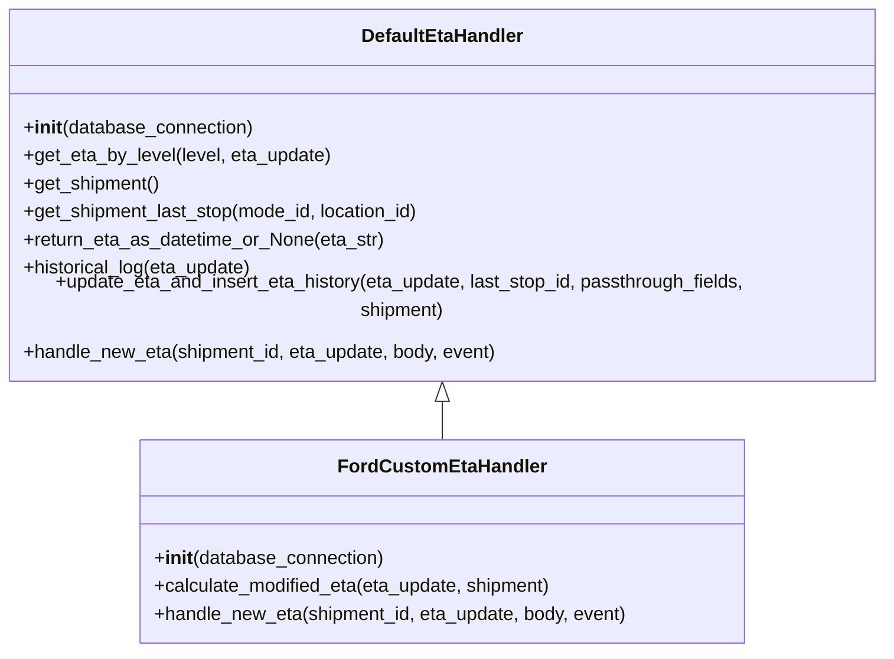
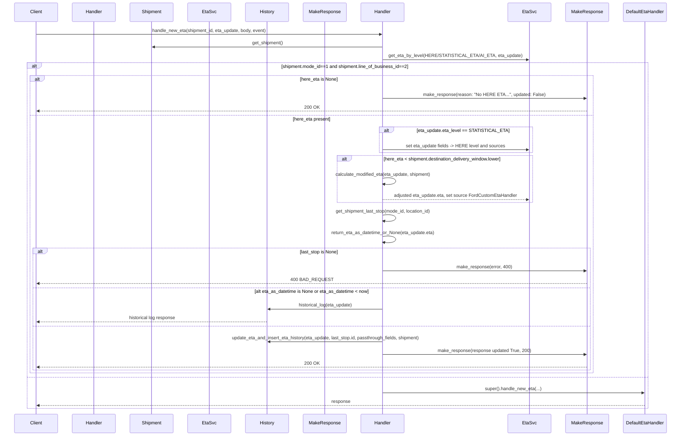

# Diagram: shipment_core/shipment_service/shipment_service/eta/eta_setter/FordCustomEtaHandler.py

> Auto-generated by Obscura crawlers

## Diagram 1

### SVG

<svg id="container" width="784.453125" xmlns="http://www.w3.org/2000/svg" class="classDiagram" height="534" viewBox="0 0 784.453125 534" role="graphics-document document" aria-roledescription="class"><g><defs><marker id="container_class-aggregationStart" class="marker aggregation class" refX="18" refY="7" markerWidth="190" markerHeight="240" orient="auto"><path d="M 18,7 L9,13 L1,7 L9,1 Z"></path></marker></defs><defs><marker id="container_class-aggregationEnd" class="marker aggregation class" refX="1" refY="7" markerWidth="20" markerHeight="28" orient="auto"><path d="M 18,7 L9,13 L1,7 L9,1 Z"></path></marker></defs><defs><marker id="container_class-extensionStart" class="marker extension class" refX="18" refY="7" markerWidth="190" markerHeight="240" orient="auto"><path d="M 1,7 L18,13 V 1 Z"></path></marker></defs><defs><marker id="container_class-extensionEnd" class="marker extension class" refX="1" refY="7" markerWidth="20" markerHeight="28" orient="auto"><path d="M 1,1 V 13 L18,7 Z"></path></marker></defs><defs><marker id="container_class-compositionStart" class="marker composition class" refX="18" refY="7" markerWidth="190" markerHeight="240" orient="auto"><path d="M 18,7 L9,13 L1,7 L9,1 Z"></path></marker></defs><defs><marker id="container_class-compositionEnd" class="marker composition class" refX="1" refY="7" markerWidth="20" markerHeight="28" orient="auto"><path d="M 18,7 L9,13 L1,7 L9,1 Z"></path></marker></defs><defs><marker id="container_class-dependencyStart" class="marker dependency class" refX="6" refY="7" markerWidth="190" markerHeight="240" orient="auto"><path d="M 5,7 L9,13 L1,7 L9,1 Z"></path></marker></defs><defs><marker id="container_class-dependencyEnd" class="marker dependency class" refX="13" refY="7" markerWidth="20" markerHeight="28" orient="auto"><path d="M 18,7 L9,13 L14,7 L9,1 Z"></path></marker></defs><defs><marker id="container_class-lollipopStart" class="marker lollipop class" refX="13" refY="7" markerWidth="190" markerHeight="240" orient="auto"><circle stroke="black" fill="transparent" cx="7" cy="7" r="6"></circle></marker></defs><defs><marker id="container_class-lollipopEnd" class="marker lollipop class" refX="1" refY="7" markerWidth="190" markerHeight="240" orient="auto"><circle stroke="black" fill="transparent" cx="7" cy="7" r="6"></circle></marker></defs><g class="root"><g class="clusters"></g><g class="edgePaths"><path d="M392.227,319.25L392.227,320.542C392.227,321.833,392.227,324.417,392.227,329.875C392.227,335.333,392.227,343.667,392.227,347.833L392.227,352" id="id_DefaultEtaHandler_FordCustomEtaHandler_1" class="edge-thickness-normal edge-pattern-solid relation" style=";;;" data-edge="true" data-et="edge" data-id="id_DefaultEtaHandler_FordCustomEtaHandler_1" data-points="W3sieCI6MzkyLjIyNjU2MjUsInkiOjMwMn0seyJ4IjozOTIuMjI2NTYyNSwieSI6MzI3fSx7IngiOjM5Mi4yMjY1NjI1LCJ5IjozNTJ9XQ==" marker-start="url(#container_class-extensionStart)"></path></g><g class="edgeLabels"><g class="edgeLabel"><g class="label" data-id="id_DefaultEtaHandler_FordCustomEtaHandler_1" transform="translate(0, 0)"><foreignObject width="0" height="0">

</foreignObject></g></g></g><g class="nodes"><g class="node default" id="classId-DefaultEtaHandler-0" transform="translate(392.2265625, 155)"><g class="basic label-container"><path d="M-384.2265625 -147 L384.2265625 -147 L384.2265625 147 L-384.2265625 147" stroke="none" stroke-width="0" fill="#ECECFF" style=""></path><path d="M-384.2265625 -147 C-122.37775527100143 -147, 139.47105195799713 -147, 384.2265625 -147 M-384.2265625 -147 C-162.48252373152926 -147, 59.26151503694149 -147, 384.2265625 -147 M384.2265625 -147 C384.2265625 -53.80876533132981, 384.2265625 39.38246933734038, 384.2265625 147 M384.2265625 -147 C384.2265625 -77.15368778728627, 384.2265625 -7.307375574572546, 384.2265625 147 M384.2265625 147 C224.16007159781927 147, 64.09358069563854 147, -384.2265625 147 M384.2265625 147 C195.96607582336682 147, 7.705589146733644 147, -384.2265625 147 M-384.2265625 147 C-384.2265625 78.10078727530708, -384.2265625 9.201574550614168, -384.2265625 -147 M-384.2265625 147 C-384.2265625 35.13885097487052, -384.2265625 -76.72229805025896, -384.2265625 -147" stroke="#9370DB" stroke-width="1.3" fill="none" stroke-dasharray="0 0" style=""></path></g><g class="annotation-group text" transform="translate(0, -123)"></g><g class="label-group text" transform="translate(-67.234375, -123)"><g class="label" style="font-weight: bolder" transform="translate(0,-12)"><foreignObject width="134.46875" height="24">

DefaultEtaHandler

</foreignObject></g></g><g class="members-group text" transform="translate(-372.2265625, -75)"></g><g class="methods-group text" transform="translate(-372.2265625, -45)"><g class="label" style="" transform="translate(0,-12)"><foreignObject width="198" height="24">

+<strong>init</strong>(database_connection)

</foreignObject></g><g class="label" style="" transform="translate(0,12)"><foreignObject width="264.859375" height="24">

+get_eta_by_level(level, eta_update)

</foreignObject></g><g class="label" style="" transform="translate(0,36)"><foreignObject width="117.6875" height="24">

+get_shipment()

</foreignObject></g><g class="label" style="" transform="translate(0,60)"><foreignObject width="345.484375" height="24">

+get_shipment_last_stop(mode_id, location_id)

</foreignObject></g><g class="label" style="" transform="translate(0,84)"><foreignObject width="310.890625" height="24">

+return_eta_as_datetime_or_None(eta_str)

</foreignObject></g><g class="label" style="" transform="translate(0,108)"><foreignObject width="198.875" height="24">

+historical_log(eta_update)

</foreignObject></g><g class="label" style="" transform="translate(0,132)"><foreignObject width="677.21875" height="24">

+update_eta_and_insert_eta_history(eta_update, last_stop_id, passthrough_fields, shipment)

</foreignObject></g><g class="label" style="" transform="translate(0,156)"><foreignObject width="410.390625" height="24">

+handle_new_eta(shipment_id, eta_update, body, event)

</foreignObject></g></g><g class="divider" style=""><path d="M-384.2265625 -99 C-165.3585244662408 -99, 53.50951356751841 -99, 384.2265625 -99 M-384.2265625 -99 C-115.12741817451126 -99, 153.97172615097747 -99, 384.2265625 -99" stroke="#9370DB" stroke-width="1.3" fill="none" stroke-dasharray="0 0" style=""></path></g><g class="divider" style=""><path d="M-384.2265625 -75 C-187.02232488764153 -75, 10.181912724716938 -75, 384.2265625 -75 M-384.2265625 -75 C-162.27430320766211 -75, 59.67795608467577 -75, 384.2265625 -75" stroke="#9370DB" stroke-width="1.3" fill="none" stroke-dasharray="0 0" style=""></path></g></g><g class="node default" id="classId-FordCustomEtaHandler-1" transform="translate(392.2265625, 439)"><g class="basic label-container"><path d="M-259.1328125 -87 L259.1328125 -87 L259.1328125 87 L-259.1328125 87" stroke="none" stroke-width="0" fill="#ECECFF" style=""></path><path d="M-259.1328125 -87 C-118.68132187950064 -87, 21.770168740998713 -87, 259.1328125 -87 M-259.1328125 -87 C-129.7037757919568 -87, -0.27473908391357327 -87, 259.1328125 -87 M259.1328125 -87 C259.1328125 -48.37941164238624, 259.1328125 -9.758823284772475, 259.1328125 87 M259.1328125 -87 C259.1328125 -19.855905064851882, 259.1328125 47.288189870296236, 259.1328125 87 M259.1328125 87 C70.01829072635547 87, -119.09623104728905 87, -259.1328125 87 M259.1328125 87 C149.21487086420726 87, 39.29692922841451 87, -259.1328125 87 M-259.1328125 87 C-259.1328125 36.425562748852705, -259.1328125 -14.14887450229459, -259.1328125 -87 M-259.1328125 87 C-259.1328125 31.87114308597831, -259.1328125 -23.25771382804338, -259.1328125 -87" stroke="#9370DB" stroke-width="1.3" fill="none" stroke-dasharray="0 0" style=""></path></g><g class="annotation-group text" transform="translate(0, -63)"></g><g class="label-group text" transform="translate(-83.875, -63)"><g class="label" style="font-weight: bolder" transform="translate(0,-12)"><foreignObject width="167.75" height="24">

FordCustomEtaHandler

</foreignObject></g></g><g class="members-group text" transform="translate(-247.1328125, -15)"></g><g class="methods-group text" transform="translate(-247.1328125, 15)"><g class="label" style="" transform="translate(0,-12)"><foreignObject width="198" height="24">

+<strong>init</strong>(database_connection)

</foreignObject></g><g class="label" style="" transform="translate(0,12)"><foreignObject width="345.875" height="24">

+calculate_modified_eta(eta_update, shipment)

</foreignObject></g><g class="label" style="" transform="translate(0,36)"><foreignObject width="410.390625" height="24">

+handle_new_eta(shipment_id, eta_update, body, event)

</foreignObject></g></g><g class="divider" style=""><path d="M-259.1328125 -39 C-68.28819030789882 -39, 122.55643188420237 -39, 259.1328125 -39 M-259.1328125 -39 C-154.2696043507517 -39, -49.40639620150341 -39, 259.1328125 -39" stroke="#9370DB" stroke-width="1.3" fill="none" stroke-dasharray="0 0" style=""></path></g><g class="divider" style=""><path d="M-259.1328125 -15 C-96.30971011932346 -15, 66.51339226135309 -15, 259.1328125 -15 M-259.1328125 -15 C-127.65934857199082 -15, 3.8141153560183625 -15, 259.1328125 -15" stroke="#9370DB" stroke-width="1.3" fill="none" stroke-dasharray="0 0" style=""></path></g></g></g></g></g></svg>

## Diagram 2

### SVG

<svg id="container" width="2366" xmlns="http://www.w3.org/2000/svg" height="1588" viewBox="-50 -10 2366 1588" role="graphics-document document" aria-roledescription="sequence"><g><rect x="2112" y="1502" fill="#eaeaea" stroke="#666" width="154" height="65" name="DefaultEtaHandler" rx="3" ry="3" class="actor actor-bottom"></rect><text x="2189" y="1534.5" dominant-baseline="central" alignment-baseline="central" class="actor actor-box" style="text-anchor: middle; font-size: 16px; font-weight: 400;"><tspan x="2189" dy="0">DefaultEtaHandler</tspan></text></g><g><rect x="1912" y="1502" fill="#eaeaea" stroke="#666" width="150" height="65" name="MakeResponse" rx="3" ry="3" class="actor actor-bottom"></rect><text x="1987" y="1534.5" dominant-baseline="central" alignment-baseline="central" class="actor actor-box" style="text-anchor: middle; font-size: 16px; font-weight: 400;"><tspan x="1987" dy="0">MakeResponse</tspan></text></g><g><rect x="1712" y="1502" fill="#eaeaea" stroke="#666" width="150" height="65" name="EtaSvc" rx="3" ry="3" class="actor actor-bottom"></rect><text x="1787" y="1534.5" dominant-baseline="central" alignment-baseline="central" class="actor actor-box" style="text-anchor: middle; font-size: 16px; font-weight: 400;"><tspan x="1787" dy="0">EtaSvc</tspan></text></g><g><rect x="1200" y="1502" fill="#eaeaea" stroke="#666" width="150" height="65" name="Handler" rx="3" ry="3" class="actor actor-bottom"></rect><text x="1275" y="1534.5" dominant-baseline="central" alignment-baseline="central" class="actor actor-box" style="text-anchor: middle; font-size: 16px; font-weight: 400;"><tspan x="1275" dy="0">Handler</tspan></text></g><g><rect x="1000" y="1502" fill="#eaeaea" stroke="#666" width="150" height="65" name="ResponseBuilder" rx="3" ry="3" class="actor actor-bottom"></rect><text x="1075" y="1534.5" dominant-baseline="central" alignment-baseline="central" class="actor actor-box" style="text-anchor: middle; font-size: 16px; font-weight: 400;"><tspan x="1075" dy="0">MakeResponse</tspan></text></g><g><rect x="800" y="1502" fill="#eaeaea" stroke="#666" width="150" height="65" name="History" rx="3" ry="3" class="actor actor-bottom"></rect><text x="875" y="1534.5" dominant-baseline="central" alignment-baseline="central" class="actor actor-box" style="text-anchor: middle; font-size: 16px; font-weight: 400;"><tspan x="875" dy="0">History</tspan></text></g><g><rect x="600" y="1502" fill="#eaeaea" stroke="#666" width="150" height="65" name="EtaLevelProvider" rx="3" ry="3" class="actor actor-bottom"></rect><text x="675" y="1534.5" dominant-baseline="central" alignment-baseline="central" class="actor actor-box" style="text-anchor: middle; font-size: 16px; font-weight: 400;"><tspan x="675" dy="0">EtaSvc</tspan></text></g><g><rect x="400" y="1502" fill="#eaeaea" stroke="#666" width="150" height="65" name="Shipment" rx="3" ry="3" class="actor actor-bottom"></rect><text x="475" y="1534.5" dominant-baseline="central" alignment-baseline="central" class="actor actor-box" style="text-anchor: middle; font-size: 16px; font-weight: 400;"><tspan x="475" dy="0">Shipment</tspan></text></g><g><rect x="200" y="1502" fill="#eaeaea" stroke="#666" width="150" height="65" name="FordCustomEtaHandler" rx="3" ry="3" class="actor actor-bottom"></rect><text x="275" y="1534.5" dominant-baseline="central" alignment-baseline="central" class="actor actor-box" style="text-anchor: middle; font-size: 16px; font-weight: 400;"><tspan x="275" dy="0">Handler</tspan></text></g><g><rect x="0" y="1502" fill="#eaeaea" stroke="#666" width="150" height="65" name="Client" rx="3" ry="3" class="actor actor-bottom"></rect><text x="75" y="1534.5" dominant-baseline="central" alignment-baseline="central" class="actor actor-box" style="text-anchor: middle; font-size: 16px; font-weight: 400;"><tspan x="75" dy="0">Client</tspan></text></g><g><line id="actor9" x1="2189" y1="65" x2="2189" y2="1502" class="actor-line 200" stroke-width="0.5px" stroke="#999" name="DefaultEtaHandler"></line><g id="root-9"><rect x="2112" y="0" fill="#eaeaea" stroke="#666" width="154" height="65" name="DefaultEtaHandler" rx="3" ry="3" class="actor actor-top"></rect><text x="2189" y="32.5" dominant-baseline="central" alignment-baseline="central" class="actor actor-box" style="text-anchor: middle; font-size: 16px; font-weight: 400;"><tspan x="2189" dy="0">DefaultEtaHandler</tspan></text></g></g><g><line id="actor8" x1="1987" y1="65" x2="1987" y2="1502" class="actor-line 200" stroke-width="0.5px" stroke="#999" name="MakeResponse"></line><g id="root-8"><rect x="1912" y="0" fill="#eaeaea" stroke="#666" width="150" height="65" name="MakeResponse" rx="3" ry="3" class="actor actor-top"></rect><text x="1987" y="32.5" dominant-baseline="central" alignment-baseline="central" class="actor actor-box" style="text-anchor: middle; font-size: 16px; font-weight: 400;"><tspan x="1987" dy="0">MakeResponse</tspan></text></g></g><g><line id="actor7" x1="1787" y1="65" x2="1787" y2="1502" class="actor-line 200" stroke-width="0.5px" stroke="#999" name="EtaSvc"></line><g id="root-7"><rect x="1712" y="0" fill="#eaeaea" stroke="#666" width="150" height="65" name="EtaSvc" rx="3" ry="3" class="actor actor-top"></rect><text x="1787" y="32.5" dominant-baseline="central" alignment-baseline="central" class="actor actor-box" style="text-anchor: middle; font-size: 16px; font-weight: 400;"><tspan x="1787" dy="0">EtaSvc</tspan></text></g></g><g><line id="actor6" x1="1275" y1="65" x2="1275" y2="1502" class="actor-line 200" stroke-width="0.5px" stroke="#999" name="Handler"></line><g id="root-6"><rect x="1200" y="0" fill="#eaeaea" stroke="#666" width="150" height="65" name="Handler" rx="3" ry="3" class="actor actor-top"></rect><text x="1275" y="32.5" dominant-baseline="central" alignment-baseline="central" class="actor actor-box" style="text-anchor: middle; font-size: 16px; font-weight: 400;"><tspan x="1275" dy="0">Handler</tspan></text></g></g><g><line id="actor5" x1="1075" y1="65" x2="1075" y2="1502" class="actor-line 200" stroke-width="0.5px" stroke="#999" name="ResponseBuilder"></line><g id="root-5"><rect x="1000" y="0" fill="#eaeaea" stroke="#666" width="150" height="65" name="ResponseBuilder" rx="3" ry="3" class="actor actor-top"></rect><text x="1075" y="32.5" dominant-baseline="central" alignment-baseline="central" class="actor actor-box" style="text-anchor: middle; font-size: 16px; font-weight: 400;"><tspan x="1075" dy="0">MakeResponse</tspan></text></g></g><g><line id="actor4" x1="875" y1="65" x2="875" y2="1502" class="actor-line 200" stroke-width="0.5px" stroke="#999" name="History"></line><g id="root-4"><rect x="800" y="0" fill="#eaeaea" stroke="#666" width="150" height="65" name="History" rx="3" ry="3" class="actor actor-top"></rect><text x="875" y="32.5" dominant-baseline="central" alignment-baseline="central" class="actor actor-box" style="text-anchor: middle; font-size: 16px; font-weight: 400;"><tspan x="875" dy="0">History</tspan></text></g></g><g><line id="actor3" x1="675" y1="65" x2="675" y2="1502" class="actor-line 200" stroke-width="0.5px" stroke="#999" name="EtaLevelProvider"></line><g id="root-3"><rect x="600" y="0" fill="#eaeaea" stroke="#666" width="150" height="65" name="EtaLevelProvider" rx="3" ry="3" class="actor actor-top"></rect><text x="675" y="32.5" dominant-baseline="central" alignment-baseline="central" class="actor actor-box" style="text-anchor: middle; font-size: 16px; font-weight: 400;"><tspan x="675" dy="0">EtaSvc</tspan></text></g></g><g><line id="actor2" x1="475" y1="65" x2="475" y2="1502" class="actor-line 200" stroke-width="0.5px" stroke="#999" name="Shipment"></line><g id="root-2"><rect x="400" y="0" fill="#eaeaea" stroke="#666" width="150" height="65" name="Shipment" rx="3" ry="3" class="actor actor-top"></rect><text x="475" y="32.5" dominant-baseline="central" alignment-baseline="central" class="actor actor-box" style="text-anchor: middle; font-size: 16px; font-weight: 400;"><tspan x="475" dy="0">Shipment</tspan></text></g></g><g><line id="actor1" x1="275" y1="65" x2="275" y2="1502" class="actor-line 200" stroke-width="0.5px" stroke="#999" name="FordCustomEtaHandler"></line><g id="root-1"><rect x="200" y="0" fill="#eaeaea" stroke="#666" width="150" height="65" name="FordCustomEtaHandler" rx="3" ry="3" class="actor actor-top"></rect><text x="275" y="32.5" dominant-baseline="central" alignment-baseline="central" class="actor actor-box" style="text-anchor: middle; font-size: 16px; font-weight: 400;"><tspan x="275" dy="0">Handler</tspan></text></g></g><g><line id="actor0" x1="75" y1="65" x2="75" y2="1502" class="actor-line 200" stroke-width="0.5px" stroke="#999" name="Client"></line><g id="root-0"><rect x="0" y="0" fill="#eaeaea" stroke="#666" width="150" height="65" name="Client" rx="3" ry="3" class="actor actor-top"></rect><text x="75" y="32.5" dominant-baseline="central" alignment-baseline="central" class="actor actor-box" style="text-anchor: middle; font-size: 16px; font-weight: 400;"><tspan x="75" dy="0">Client</tspan></text></g></g><g></g><defs><symbol id="computer" width="24" height="24"><path transform="scale(.5)" d="M2 2v13h20v-13h-20zm18 11h-16v-9h16v9zm-10.228 6l.466-1h3.524l.467 1h-4.457zm14.228 3h-24l2-6h2.104l-1.33 4h18.45l-1.297-4h2.073l2 6zm-5-10h-14v-7h14v7z"></path></symbol></defs><defs><symbol id="database" fill-rule="evenodd" clip-rule="evenodd"><path transform="scale(.5)" d="M12.258.001l.256.004.255.005.253.008.251.01.249.012.247.015.246.016.242.019.241.02.239.023.236.024.233.027.231.028.229.031.225.032.223.034.22.036.217.038.214.04.211.041.208.043.205.045.201.046.198.048.194.05.191.051.187.053.183.054.18.056.175.057.172.059.168.06.163.061.16.063.155.064.15.066.074.033.073.033.071.034.07.034.069.035.068.035.067.035.066.035.064.036.064.036.062.036.06.036.06.037.058.037.058.037.055.038.055.038.053.038.052.038.051.039.05.039.048.039.047.039.045.04.044.04.043.04.041.04.04.041.039.041.037.041.036.041.034.041.033.042.032.042.03.042.029.042.027.042.026.043.024.043.023.043.021.043.02.043.018.044.017.043.015.044.013.044.012.044.011.045.009.044.007.045.006.045.004.045.002.045.001.045v17l-.001.045-.002.045-.004.045-.006.045-.007.045-.009.044-.011.045-.012.044-.013.044-.015.044-.017.043-.018.044-.02.043-.021.043-.023.043-.024.043-.026.043-.027.042-.029.042-.03.042-.032.042-.033.042-.034.041-.036.041-.037.041-.039.041-.04.041-.041.04-.043.04-.044.04-.045.04-.047.039-.048.039-.05.039-.051.039-.052.038-.053.038-.055.038-.055.038-.058.037-.058.037-.06.037-.06.036-.062.036-.064.036-.064.036-.066.035-.067.035-.068.035-.069.035-.07.034-.071.034-.073.033-.074.033-.15.066-.155.064-.16.063-.163.061-.168.06-.172.059-.175.057-.18.056-.183.054-.187.053-.191.051-.194.05-.198.048-.201.046-.205.045-.208.043-.211.041-.214.04-.217.038-.22.036-.223.034-.225.032-.229.031-.231.028-.233.027-.236.024-.239.023-.241.02-.242.019-.246.016-.247.015-.249.012-.251.01-.253.008-.255.005-.256.004-.258.001-.258-.001-.256-.004-.255-.005-.253-.008-.251-.01-.249-.012-.247-.015-.245-.016-.243-.019-.241-.02-.238-.023-.236-.024-.234-.027-.231-.028-.228-.031-.226-.032-.223-.034-.22-.036-.217-.038-.214-.04-.211-.041-.208-.043-.204-.045-.201-.046-.198-.048-.195-.05-.19-.051-.187-.053-.184-.054-.179-.056-.176-.057-.172-.059-.167-.06-.164-.061-.159-.063-.155-.064-.151-.066-.074-.033-.072-.033-.072-.034-.07-.034-.069-.035-.068-.035-.067-.035-.066-.035-.064-.036-.063-.036-.062-.036-.061-.036-.06-.037-.058-.037-.057-.037-.056-.038-.055-.038-.053-.038-.052-.038-.051-.039-.049-.039-.049-.039-.046-.039-.046-.04-.044-.04-.043-.04-.041-.04-.04-.041-.039-.041-.037-.041-.036-.041-.034-.041-.033-.042-.032-.042-.03-.042-.029-.042-.027-.042-.026-.043-.024-.043-.023-.043-.021-.043-.02-.043-.018-.044-.017-.043-.015-.044-.013-.044-.012-.044-.011-.045-.009-.044-.007-.045-.006-.045-.004-.045-.002-.045-.001-.045v-17l.001-.045.002-.045.004-.045.006-.045.007-.045.009-.044.011-.045.012-.044.013-.044.015-.044.017-.043.018-.044.02-.043.021-.043.023-.043.024-.043.026-.043.027-.042.029-.042.03-.042.032-.042.033-.042.034-.041.036-.041.037-.041.039-.041.04-.041.041-.04.043-.04.044-.04.046-.04.046-.039.049-.039.049-.039.051-.039.052-.038.053-.038.055-.038.056-.038.057-.037.058-.037.06-.037.061-.036.062-.036.063-.036.064-.036.066-.035.067-.035.068-.035.069-.035.07-.034.072-.034.072-.033.074-.033.151-.066.155-.064.159-.063.164-.061.167-.06.172-.059.176-.057.179-.056.184-.054.187-.053.19-.051.195-.05.198-.048.201-.046.204-.045.208-.043.211-.041.214-.04.217-.038.22-.036.223-.034.226-.032.228-.031.231-.028.234-.027.236-.024.238-.023.241-.02.243-.019.245-.016.247-.015.249-.012.251-.01.253-.008.255-.005.256-.004.258-.001.258.001zm-9.258 20.499v.01l.001.021.003.021.004.022.005.021.006.022.007.022.009.023.01.022.011.023.012.023.013.023.015.023.016.024.017.023.018.024.019.024.021.024.022.025.023.024.024.025.052.049.056.05.061.051.066.051.07.051.075.051.079.052.084.052.088.052.092.052.097.052.102.051.105.052.11.052.114.051.119.051.123.051.127.05.131.05.135.05.139.048.144.049.147.047.152.047.155.047.16.045.163.045.167.043.171.043.176.041.178.041.183.039.187.039.19.037.194.035.197.035.202.033.204.031.209.03.212.029.216.027.219.025.222.024.226.021.23.02.233.018.236.016.24.015.243.012.246.01.249.008.253.005.256.004.259.001.26-.001.257-.004.254-.005.25-.008.247-.011.244-.012.241-.014.237-.016.233-.018.231-.021.226-.021.224-.024.22-.026.216-.027.212-.028.21-.031.205-.031.202-.034.198-.034.194-.036.191-.037.187-.039.183-.04.179-.04.175-.042.172-.043.168-.044.163-.045.16-.046.155-.046.152-.047.148-.048.143-.049.139-.049.136-.05.131-.05.126-.05.123-.051.118-.052.114-.051.11-.052.106-.052.101-.052.096-.052.092-.052.088-.053.083-.051.079-.052.074-.052.07-.051.065-.051.06-.051.056-.05.051-.05.023-.024.023-.025.021-.024.02-.024.019-.024.018-.024.017-.024.015-.023.014-.024.013-.023.012-.023.01-.023.01-.022.008-.022.006-.022.006-.022.004-.022.004-.021.001-.021.001-.021v-4.127l-.077.055-.08.053-.083.054-.085.053-.087.052-.09.052-.093.051-.095.05-.097.05-.1.049-.102.049-.105.048-.106.047-.109.047-.111.046-.114.045-.115.045-.118.044-.12.043-.122.042-.124.042-.126.041-.128.04-.13.04-.132.038-.134.038-.135.037-.138.037-.139.035-.142.035-.143.034-.144.033-.147.032-.148.031-.15.03-.151.03-.153.029-.154.027-.156.027-.158.026-.159.025-.161.024-.162.023-.163.022-.165.021-.166.02-.167.019-.169.018-.169.017-.171.016-.173.015-.173.014-.175.013-.175.012-.177.011-.178.01-.179.008-.179.008-.181.006-.182.005-.182.004-.184.003-.184.002h-.37l-.184-.002-.184-.003-.182-.004-.182-.005-.181-.006-.179-.008-.179-.008-.178-.01-.176-.011-.176-.012-.175-.013-.173-.014-.172-.015-.171-.016-.17-.017-.169-.018-.167-.019-.166-.02-.165-.021-.163-.022-.162-.023-.161-.024-.159-.025-.157-.026-.156-.027-.155-.027-.153-.029-.151-.03-.15-.03-.148-.031-.146-.032-.145-.033-.143-.034-.141-.035-.14-.035-.137-.037-.136-.037-.134-.038-.132-.038-.13-.04-.128-.04-.126-.041-.124-.042-.122-.042-.12-.044-.117-.043-.116-.045-.113-.045-.112-.046-.109-.047-.106-.047-.105-.048-.102-.049-.1-.049-.097-.05-.095-.05-.093-.052-.09-.051-.087-.052-.085-.053-.083-.054-.08-.054-.077-.054v4.127zm0-5.654v.011l.001.021.003.021.004.021.005.022.006.022.007.022.009.022.01.022.011.023.012.023.013.023.015.024.016.023.017.024.018.024.019.024.021.024.022.024.023.025.024.024.052.05.056.05.061.05.066.051.07.051.075.052.079.051.084.052.088.052.092.052.097.052.102.052.105.052.11.051.114.051.119.052.123.05.127.051.131.05.135.049.139.049.144.048.147.048.152.047.155.046.16.045.163.045.167.044.171.042.176.042.178.04.183.04.187.038.19.037.194.036.197.034.202.033.204.032.209.03.212.028.216.027.219.025.222.024.226.022.23.02.233.018.236.016.24.014.243.012.246.01.249.008.253.006.256.003.259.001.26-.001.257-.003.254-.006.25-.008.247-.01.244-.012.241-.015.237-.016.233-.018.231-.02.226-.022.224-.024.22-.025.216-.027.212-.029.21-.03.205-.032.202-.033.198-.035.194-.036.191-.037.187-.039.183-.039.179-.041.175-.042.172-.043.168-.044.163-.045.16-.045.155-.047.152-.047.148-.048.143-.048.139-.05.136-.049.131-.05.126-.051.123-.051.118-.051.114-.052.11-.052.106-.052.101-.052.096-.052.092-.052.088-.052.083-.052.079-.052.074-.051.07-.052.065-.051.06-.05.056-.051.051-.049.023-.025.023-.024.021-.025.02-.024.019-.024.018-.024.017-.024.015-.023.014-.023.013-.024.012-.022.01-.023.01-.023.008-.022.006-.022.006-.022.004-.021.004-.022.001-.021.001-.021v-4.139l-.077.054-.08.054-.083.054-.085.052-.087.053-.09.051-.093.051-.095.051-.097.05-.1.049-.102.049-.105.048-.106.047-.109.047-.111.046-.114.045-.115.044-.118.044-.12.044-.122.042-.124.042-.126.041-.128.04-.13.039-.132.039-.134.038-.135.037-.138.036-.139.036-.142.035-.143.033-.144.033-.147.033-.148.031-.15.03-.151.03-.153.028-.154.028-.156.027-.158.026-.159.025-.161.024-.162.023-.163.022-.165.021-.166.02-.167.019-.169.018-.169.017-.171.016-.173.015-.173.014-.175.013-.175.012-.177.011-.178.009-.179.009-.179.007-.181.007-.182.005-.182.004-.184.003-.184.002h-.37l-.184-.002-.184-.003-.182-.004-.182-.005-.181-.007-.179-.007-.179-.009-.178-.009-.176-.011-.176-.012-.175-.013-.173-.014-.172-.015-.171-.016-.17-.017-.169-.018-.167-.019-.166-.02-.165-.021-.163-.022-.162-.023-.161-.024-.159-.025-.157-.026-.156-.027-.155-.028-.153-.028-.151-.03-.15-.03-.148-.031-.146-.033-.145-.033-.143-.033-.141-.035-.14-.036-.137-.036-.136-.037-.134-.038-.132-.039-.13-.039-.128-.04-.126-.041-.124-.042-.122-.043-.12-.043-.117-.044-.116-.044-.113-.046-.112-.046-.109-.046-.106-.047-.105-.048-.102-.049-.1-.049-.097-.05-.095-.051-.093-.051-.09-.051-.087-.053-.085-.052-.083-.054-.08-.054-.077-.054v4.139zm0-5.666v.011l.001.02.003.022.004.021.005.022.006.021.007.022.009.023.01.022.011.023.012.023.013.023.015.023.016.024.017.024.018.023.019.024.021.025.022.024.023.024.024.025.052.05.056.05.061.05.066.051.07.051.075.052.079.051.084.052.088.052.092.052.097.052.102.052.105.051.11.052.114.051.119.051.123.051.127.05.131.05.135.05.139.049.144.048.147.048.152.047.155.046.16.045.163.045.167.043.171.043.176.042.178.04.183.04.187.038.19.037.194.036.197.034.202.033.204.032.209.03.212.028.216.027.219.025.222.024.226.021.23.02.233.018.236.017.24.014.243.012.246.01.249.008.253.006.256.003.259.001.26-.001.257-.003.254-.006.25-.008.247-.01.244-.013.241-.014.237-.016.233-.018.231-.02.226-.022.224-.024.22-.025.216-.027.212-.029.21-.03.205-.032.202-.033.198-.035.194-.036.191-.037.187-.039.183-.039.179-.041.175-.042.172-.043.168-.044.163-.045.16-.045.155-.047.152-.047.148-.048.143-.049.139-.049.136-.049.131-.051.126-.05.123-.051.118-.052.114-.051.11-.052.106-.052.101-.052.096-.052.092-.052.088-.052.083-.052.079-.052.074-.052.07-.051.065-.051.06-.051.056-.05.051-.049.023-.025.023-.025.021-.024.02-.024.019-.024.018-.024.017-.024.015-.023.014-.024.013-.023.012-.023.01-.022.01-.023.008-.022.006-.022.006-.022.004-.022.004-.021.001-.021.001-.021v-4.153l-.077.054-.08.054-.083.053-.085.053-.087.053-.09.051-.093.051-.095.051-.097.05-.1.049-.102.048-.105.048-.106.048-.109.046-.111.046-.114.046-.115.044-.118.044-.12.043-.122.043-.124.042-.126.041-.128.04-.13.039-.132.039-.134.038-.135.037-.138.036-.139.036-.142.034-.143.034-.144.033-.147.032-.148.032-.15.03-.151.03-.153.028-.154.028-.156.027-.158.026-.159.024-.161.024-.162.023-.163.023-.165.021-.166.02-.167.019-.169.018-.169.017-.171.016-.173.015-.173.014-.175.013-.175.012-.177.01-.178.01-.179.009-.179.007-.181.006-.182.006-.182.004-.184.003-.184.001-.185.001-.185-.001-.184-.001-.184-.003-.182-.004-.182-.006-.181-.006-.179-.007-.179-.009-.178-.01-.176-.01-.176-.012-.175-.013-.173-.014-.172-.015-.171-.016-.17-.017-.169-.018-.167-.019-.166-.02-.165-.021-.163-.023-.162-.023-.161-.024-.159-.024-.157-.026-.156-.027-.155-.028-.153-.028-.151-.03-.15-.03-.148-.032-.146-.032-.145-.033-.143-.034-.141-.034-.14-.036-.137-.036-.136-.037-.134-.038-.132-.039-.13-.039-.128-.041-.126-.041-.124-.041-.122-.043-.12-.043-.117-.044-.116-.044-.113-.046-.112-.046-.109-.046-.106-.048-.105-.048-.102-.048-.1-.05-.097-.049-.095-.051-.093-.051-.09-.052-.087-.052-.085-.053-.083-.053-.08-.054-.077-.054v4.153zm8.74-8.179l-.257.004-.254.005-.25.008-.247.011-.244.012-.241.014-.237.016-.233.018-.231.021-.226.022-.224.023-.22.026-.216.027-.212.028-.21.031-.205.032-.202.033-.198.034-.194.036-.191.038-.187.038-.183.04-.179.041-.175.042-.172.043-.168.043-.163.045-.16.046-.155.046-.152.048-.148.048-.143.048-.139.049-.136.05-.131.05-.126.051-.123.051-.118.051-.114.052-.11.052-.106.052-.101.052-.096.052-.092.052-.088.052-.083.052-.079.052-.074.051-.07.052-.065.051-.06.05-.056.05-.051.05-.023.025-.023.024-.021.024-.02.025-.019.024-.018.024-.017.023-.015.024-.014.023-.013.023-.012.023-.01.023-.01.022-.008.022-.006.023-.006.021-.004.022-.004.021-.001.021-.001.021.001.021.001.021.004.021.004.022.006.021.006.023.008.022.01.022.01.023.012.023.013.023.014.023.015.024.017.023.018.024.019.024.02.025.021.024.023.024.023.025.051.05.056.05.06.05.065.051.07.052.074.051.079.052.083.052.088.052.092.052.096.052.101.052.106.052.11.052.114.052.118.051.123.051.126.051.131.05.136.05.139.049.143.048.148.048.152.048.155.046.16.046.163.045.168.043.172.043.175.042.179.041.183.04.187.038.191.038.194.036.198.034.202.033.205.032.21.031.212.028.216.027.22.026.224.023.226.022.231.021.233.018.237.016.241.014.244.012.247.011.25.008.254.005.257.004.26.001.26-.001.257-.004.254-.005.25-.008.247-.011.244-.012.241-.014.237-.016.233-.018.231-.021.226-.022.224-.023.22-.026.216-.027.212-.028.21-.031.205-.032.202-.033.198-.034.194-.036.191-.038.187-.038.183-.04.179-.041.175-.042.172-.043.168-.043.163-.045.16-.046.155-.046.152-.048.148-.048.143-.048.139-.049.136-.05.131-.05.126-.051.123-.051.118-.051.114-.052.11-.052.106-.052.101-.052.096-.052.092-.052.088-.052.083-.052.079-.052.074-.051.07-.052.065-.051.06-.05.056-.05.051-.05.023-.025.023-.024.021-.024.02-.025.019-.024.018-.024.017-.023.015-.024.014-.023.013-.023.012-.023.01-.023.01-.022.008-.022.006-.023.006-.021.004-.022.004-.021.001-.021.001-.021-.001-.021-.001-.021-.004-.021-.004-.022-.006-.021-.006-.023-.008-.022-.01-.022-.01-.023-.012-.023-.013-.023-.014-.023-.015-.024-.017-.023-.018-.024-.019-.024-.02-.025-.021-.024-.023-.024-.023-.025-.051-.05-.056-.05-.06-.05-.065-.051-.07-.052-.074-.051-.079-.052-.083-.052-.088-.052-.092-.052-.096-.052-.101-.052-.106-.052-.11-.052-.114-.052-.118-.051-.123-.051-.126-.051-.131-.05-.136-.05-.139-.049-.143-.048-.148-.048-.152-.048-.155-.046-.16-.046-.163-.045-.168-.043-.172-.043-.175-.042-.179-.041-.183-.04-.187-.038-.191-.038-.194-.036-.198-.034-.202-.033-.205-.032-.21-.031-.212-.028-.216-.027-.22-.026-.224-.023-.226-.022-.231-.021-.233-.018-.237-.016-.241-.014-.244-.012-.247-.011-.25-.008-.254-.005-.257-.004-.26-.001-.26.001z"></path></symbol></defs><defs><symbol id="clock" width="24" height="24"><path transform="scale(.5)" d="M12 2c5.514 0 10 4.486 10 10s-4.486 10-10 10-10-4.486-10-10 4.486-10 10-10zm0-2c-6.627 0-12 5.373-12 12s5.373 12 12 12 12-5.373 12-12-5.373-12-12-12zm5.848 12.459c.202.038.202.333.001.372-1.907.361-6.045 1.111-6.547 1.111-.719 0-1.301-.582-1.301-1.301 0-.512.77-5.447 1.125-7.445.034-.192.312-.181.343.014l.985 6.238 5.394 1.011z"></path></symbol></defs><defs><marker id="arrowhead" refX="7.9" refY="5" markerUnits="userSpaceOnUse" markerWidth="12" markerHeight="12" orient="auto-start-reverse"><path d="M -1 0 L 10 5 L 0 10 z"></path></marker></defs><defs><marker id="crosshead" markerWidth="15" markerHeight="8" orient="auto" refX="4" refY="4.5"><path fill="none" stroke="#000000" stroke-width="1pt" d="M 1,2 L 6,7 M 6,2 L 1,7" style="stroke-dasharray: 0, 0;"></path></marker></defs><defs><marker id="filled-head" refX="15.5" refY="7" markerWidth="20" markerHeight="28" orient="auto"><path d="M 18,7 L9,13 L14,7 L9,1 Z"></path></marker></defs><defs><marker id="sequencenumber" refX="15" refY="15" markerWidth="60" markerHeight="40" orient="auto"><circle cx="15" cy="15" r="6"></circle></marker></defs><g><line x1="1264" y1="450" x2="1798" y2="450" class="loopLine"></line><line x1="1798" y1="450" x2="1798" y2="543" class="loopLine"></line><line x1="1264" y1="543" x2="1798" y2="543" class="loopLine"></line><line x1="1264" y1="450" x2="1264" y2="543" class="loopLine"></line><polygon points="1264,450 1314,450 1314,463 1305.6,470 1264,470" class="labelBox"></polygon><text x="1289" y="463" text-anchor="middle" dominant-baseline="middle" alignment-baseline="middle" class="labelText" style="font-size: 16px; font-weight: 400;">alt</text><text x="1556" y="468" text-anchor="middle" class="loopText" style="font-size: 16px; font-weight: 400;"><tspan x="1556">[eta_update.eta_level == STATISTICAL_ETA]</tspan></text></g><g><line x1="1097" y1="553" x2="1798" y2="553" class="loopLine"></line><line x1="1798" y1="553" x2="1798" y2="724" class="loopLine"></line><line x1="1097" y1="724" x2="1798" y2="724" class="loopLine"></line><line x1="1097" y1="553" x2="1097" y2="724" class="loopLine"></line><polygon points="1097,553 1147,553 1147,566 1138.6,573 1097,573" class="labelBox"></polygon><text x="1122" y="566" text-anchor="middle" dominant-baseline="middle" alignment-baseline="middle" class="labelText" style="font-size: 16px; font-weight: 400;">alt</text><text x="1472.5" y="571" text-anchor="middle" class="loopText" style="font-size: 16px; font-weight: 400;"><tspan x="1472.5">[here_eta &lt; shipment.destination_delivery_window.lower]</tspan></text></g><g><line x1="64" y1="890" x2="1998" y2="890" class="loopLine"></line><line x1="1998" y1="890" x2="1998" y2="1341" class="loopLine"></line><line x1="64" y1="1341" x2="1998" y2="1341" class="loopLine"></line><line x1="64" y1="890" x2="64" y2="1341" class="loopLine"></line><line x1="64" y1="1036" x2="1998" y2="1036" class="loopLine" style="stroke-dasharray: 3, 3;"></line><line x1="64" y1="1177" x2="1998" y2="1177" class="loopLine" style="stroke-dasharray: 3, 3;"></line><polygon points="64,890 114,890 114,903 105.6,910 64,910" class="labelBox"></polygon><text x="89" y="903" text-anchor="middle" dominant-baseline="middle" alignment-baseline="middle" class="labelText" style="font-size: 16px; font-weight: 400;">alt</text><text x="1056" y="908" text-anchor="middle" class="loopText" style="font-size: 16px; font-weight: 400;"><tspan x="1056">[last_stop is None]</tspan></text><text x="1031" y="1054" text-anchor="middle" class="loopText" style="font-size: 16px; font-weight: 400;">[alt eta_as_datetime is None or eta_as_datetime &lt; now]</text></g><g><line x1="54" y1="264" x2="2008" y2="264" class="loopLine"></line><line x1="2008" y1="264" x2="2008" y2="1351" class="loopLine"></line><line x1="54" y1="1351" x2="2008" y2="1351" class="loopLine"></line><line x1="54" y1="264" x2="54" y2="1351" class="loopLine"></line><line x1="54" y1="410" x2="2008" y2="410" class="loopLine" style="stroke-dasharray: 3, 3;"></line><polygon points="54,264 104,264 104,277 95.6,284 54,284" class="labelBox"></polygon><text x="79" y="277" text-anchor="middle" dominant-baseline="middle" alignment-baseline="middle" class="labelText" style="font-size: 16px; font-weight: 400;">alt</text><text x="1056" y="282" text-anchor="middle" class="loopText" style="font-size: 16px; font-weight: 400;"><tspan x="1056">[here_eta is None]</tspan></text><text x="1031" y="428" text-anchor="middle" class="loopText" style="font-size: 16px; font-weight: 400;">[here_eta present]</text></g><g><line x1="44" y1="219" x2="2200" y2="219" class="loopLine"></line><line x1="2200" y1="219" x2="2200" y2="1482" class="loopLine"></line><line x1="44" y1="1482" x2="2200" y2="1482" class="loopLine"></line><line x1="44" y1="219" x2="44" y2="1482" class="loopLine"></line><line x1="44" y1="1366" x2="2200" y2="1366" class="loopLine" style="stroke-dasharray: 3, 3;"></line><polygon points="44,219 94,219 94,232 85.6,239 44,239" class="labelBox"></polygon><text x="69" y="232" text-anchor="middle" dominant-baseline="middle" alignment-baseline="middle" class="labelText" style="font-size: 16px; font-weight: 400;">alt</text><text x="1147" y="237" text-anchor="middle" class="loopText" style="font-size: 16px; font-weight: 400;"><tspan x="1147">[shipment.mode_id==1 and shipment.line_of_business_id==2]</tspan></text></g><text x="674" y="80" text-anchor="middle" dominant-baseline="middle" alignment-baseline="middle" class="messageText" dy="1em" style="font-size: 16px; font-weight: 400;">handle_new_eta(shipment_id, eta_update, body, event)</text><line x1="76" y1="113" x2="1271" y2="113" class="messageLine0" stroke-width="2" stroke="none" marker-end="url(#arrowhead)" style="fill: none;"></line><text x="877" y="128" text-anchor="middle" dominant-baseline="middle" alignment-baseline="middle" class="messageText" dy="1em" style="font-size: 16px; font-weight: 400;">get_shipment()</text><line x1="1274" y1="161" x2="479" y2="161" class="messageLine0" stroke-width="2" stroke="none" marker-end="url(#arrowhead)" style="fill: none;"></line><text x="1530" y="176" text-anchor="middle" dominant-baseline="middle" alignment-baseline="middle" class="messageText" dy="1em" style="font-size: 16px; font-weight: 400;">get_eta_by_level(HERE/STATISTICAL_ETA/AI_ETA, eta_update)</text><line x1="1276" y1="209" x2="1783" y2="209" class="messageLine0" stroke-width="2" stroke="none" marker-end="url(#arrowhead)" style="fill: none;"></line><text x="1630" y="314" text-anchor="middle" dominant-baseline="middle" alignment-baseline="middle" class="messageText" dy="1em" style="font-size: 16px; font-weight: 400;">make_response(reason: "No HERE ETA...", updated: False)</text><line x1="1276" y1="347" x2="1983" y2="347" class="messageLine0" stroke-width="2" stroke="none" marker-end="url(#arrowhead)" style="fill: none;"></line><text x="1033" y="362" text-anchor="middle" dominant-baseline="middle" alignment-baseline="middle" class="messageText" dy="1em" style="font-size: 16px; font-weight: 400;">200 OK</text><line x1="1986" y1="395" x2="79" y2="395" class="messageLine1" stroke-width="2" stroke="none" marker-end="url(#arrowhead)" style="stroke-dasharray: 3, 3; fill: none;"></line><text x="1530" y="500" text-anchor="middle" dominant-baseline="middle" alignment-baseline="middle" class="messageText" dy="1em" style="font-size: 16px; font-weight: 400;">set eta_update fields -&gt; HERE level and sources</text><line x1="1276" y1="533" x2="1783" y2="533" class="messageLine0" stroke-width="2" stroke="none" marker-end="url(#arrowhead)" style="fill: none;"></line><text x="1276" y="603" text-anchor="middle" dominant-baseline="middle" alignment-baseline="middle" class="messageText" dy="1em" style="font-size: 16px; font-weight: 400;">calculate_modified_eta(eta_update, shipment)</text><path d="M 1276,636 C 1336,626 1336,666 1276,656" class="messageLine0" stroke-width="2" stroke="none" marker-end="url(#arrowhead)" style="fill: none;"></path><text x="1530" y="681" text-anchor="middle" dominant-baseline="middle" alignment-baseline="middle" class="messageText" dy="1em" style="font-size: 16px; font-weight: 400;">adjusted eta_update.eta, set source FordCustomEtaHandler</text><line x1="1276" y1="714" x2="1783" y2="714" class="messageLine1" stroke-width="2" stroke="none" marker-end="url(#arrowhead)" style="stroke-dasharray: 3, 3; fill: none;"></line><text x="1276" y="739" text-anchor="middle" dominant-baseline="middle" alignment-baseline="middle" class="messageText" dy="1em" style="font-size: 16px; font-weight: 400;">get_shipment_last_stop(mode_id, location_id)</text><path d="M 1276,772 C 1336,762 1336,802 1276,792" class="messageLine0" stroke-width="2" stroke="none" marker-end="url(#arrowhead)" style="fill: none;"></path><text x="1276" y="817" text-anchor="middle" dominant-baseline="middle" alignment-baseline="middle" class="messageText" dy="1em" style="font-size: 16px; font-weight: 400;">return_eta_as_datetime_or_None(eta_update.eta)</text><path d="M 1276,850 C 1336,840 1336,880 1276,870" class="messageLine0" stroke-width="2" stroke="none" marker-end="url(#arrowhead)" style="fill: none;"></path><text x="1630" y="940" text-anchor="middle" dominant-baseline="middle" alignment-baseline="middle" class="messageText" dy="1em" style="font-size: 16px; font-weight: 400;">make_response(error, 400)</text><line x1="1276" y1="973" x2="1983" y2="973" class="messageLine0" stroke-width="2" stroke="none" marker-end="url(#arrowhead)" style="fill: none;"></line><text x="1033" y="988" text-anchor="middle" dominant-baseline="middle" alignment-baseline="middle" class="messageText" dy="1em" style="font-size: 16px; font-weight: 400;">400 BAD_REQUEST</text><line x1="1986" y1="1021" x2="79" y2="1021" class="messageLine1" stroke-width="2" stroke="none" marker-end="url(#arrowhead)" style="stroke-dasharray: 3, 3; fill: none;"></line><text x="1077" y="1081" text-anchor="middle" dominant-baseline="middle" alignment-baseline="middle" class="messageText" dy="1em" style="font-size: 16px; font-weight: 400;">historical_log(eta_update)</text><line x1="1274" y1="1114" x2="879" y2="1114" class="messageLine0" stroke-width="2" stroke="none" marker-end="url(#arrowhead)" style="fill: none;"></line><text x="477" y="1129" text-anchor="middle" dominant-baseline="middle" alignment-baseline="middle" class="messageText" dy="1em" style="font-size: 16px; font-weight: 400;">historical log response</text><line x1="874" y1="1162" x2="79" y2="1162" class="messageLine1" stroke-width="2" stroke="none" marker-end="url(#arrowhead)" style="stroke-dasharray: 3, 3; fill: none;"></line><text x="1077" y="1202" text-anchor="middle" dominant-baseline="middle" alignment-baseline="middle" class="messageText" dy="1em" style="font-size: 16px; font-weight: 400;">update_eta_and_insert_eta_history(eta_update, last_stop.id, passthrough_fields, shipment)</text><line x1="1274" y1="1235" x2="879" y2="1235" class="messageLine0" stroke-width="2" stroke="none" marker-end="url(#arrowhead)" style="fill: none;"></line><text x="1630" y="1250" text-anchor="middle" dominant-baseline="middle" alignment-baseline="middle" class="messageText" dy="1em" style="font-size: 16px; font-weight: 400;">make_response(response updated True, 200)</text><line x1="1276" y1="1283" x2="1983" y2="1283" class="messageLine0" stroke-width="2" stroke="none" marker-end="url(#arrowhead)" style="fill: none;"></line><text x="1033" y="1298" text-anchor="middle" dominant-baseline="middle" alignment-baseline="middle" class="messageText" dy="1em" style="font-size: 16px; font-weight: 400;">200 OK</text><line x1="1986" y1="1331" x2="79" y2="1331" class="messageLine1" stroke-width="2" stroke="none" marker-end="url(#arrowhead)" style="stroke-dasharray: 3, 3; fill: none;"></line><text x="1731" y="1391" text-anchor="middle" dominant-baseline="middle" alignment-baseline="middle" class="messageText" dy="1em" style="font-size: 16px; font-weight: 400;">super().handle_new_eta(...)</text><line x1="1276" y1="1424" x2="2185" y2="1424" class="messageLine0" stroke-width="2" stroke="none" marker-end="url(#arrowhead)" style="fill: none;"></line><text x="1134" y="1439" text-anchor="middle" dominant-baseline="middle" alignment-baseline="middle" class="messageText" dy="1em" style="font-size: 16px; font-weight: 400;">response</text><line x1="2188" y1="1472" x2="79" y2="1472" class="messageLine1" stroke-width="2" stroke="none" marker-end="url(#arrowhead)" style="stroke-dasharray: 3, 3; fill: none;"></line></svg>
