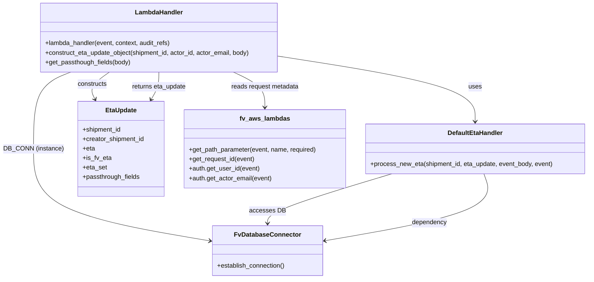

# Diagram: shipment_core/shipment_service/shipment_service/eta/eta_setter_shipment.py


> Auto-generated by Obscura crawlers

## Diagram 1



### SVG

<svg id="container" width="1479.328125" xmlns="http://www.w3.org/2000/svg" class="classDiagram" height="704" viewBox="0 0 1479.328125 704" role="graphics-document document" aria-roledescription="class"><style>#container{font-family:"trebuchet ms",verdana,arial,sans-serif;font-size:16px;fill:#333;}@keyframes edge-animation-frame{from{stroke-dashoffset:0;}}@keyframes dash{to{stroke-dashoffset:0;}}#container .edge-animation-slow{stroke-dasharray:9,5!important;stroke-dashoffset:900;animation:dash 50s linear infinite;stroke-linecap:round;}#container .edge-animation-fast{stroke-dasharray:9,5!important;stroke-dashoffset:900;animation:dash 20s linear infinite;stroke-linecap:round;}#container .error-icon{fill:#552222;}#container .error-text{fill:#552222;stroke:#552222;}#container .edge-thickness-normal{stroke-width:1px;}#container .edge-thickness-thick{stroke-width:3.5px;}#container .edge-pattern-solid{stroke-dasharray:0;}#container .edge-thickness-invisible{stroke-width:0;fill:none;}#container .edge-pattern-dashed{stroke-dasharray:3;}#container .edge-pattern-dotted{stroke-dasharray:2;}#container .marker{fill:#333333;stroke:#333333;}#container .marker.cross{stroke:#333333;}#container svg{font-family:"trebuchet ms",verdana,arial,sans-serif;font-size:16px;}#container p{margin:0;}#container g.classGroup text{fill:#9370DB;stroke:none;font-family:"trebuchet ms",verdana,arial,sans-serif;font-size:10px;}#container g.classGroup text .title{font-weight:bolder;}#container .nodeLabel,#container .edgeLabel{color:#131300;}#container .edgeLabel .label rect{fill:#ECECFF;}#container .label text{fill:#131300;}#container .labelBkg{background:#ECECFF;}#container .edgeLabel .label span{background:#ECECFF;}#container .classTitle{font-weight:bolder;}#container .node rect,#container .node circle,#container .node ellipse,#container .node polygon,#container .node path{fill:#ECECFF;stroke:#9370DB;stroke-width:1px;}#container .divider{stroke:#9370DB;stroke-width:1;}#container g.clickable{cursor:pointer;}#container g.classGroup rect{fill:#ECECFF;stroke:#9370DB;}#container g.classGroup line{stroke:#9370DB;stroke-width:1;}#container .classLabel .box{stroke:none;stroke-width:0;fill:#ECECFF;opacity:0.5;}#container .classLabel .label{fill:#9370DB;font-size:10px;}#container .relation{stroke:#333333;stroke-width:1;fill:none;}#container .dashed-line{stroke-dasharray:3;}#container .dotted-line{stroke-dasharray:1 2;}#container #compositionStart,#container .composition{fill:#333333!important;stroke:#333333!important;stroke-width:1;}#container #compositionEnd,#container .composition{fill:#333333!important;stroke:#333333!important;stroke-width:1;}#container #dependencyStart,#container .dependency{fill:#333333!important;stroke:#333333!important;stroke-width:1;}#container #dependencyStart,#container .dependency{fill:#333333!important;stroke:#333333!important;stroke-width:1;}#container #extensionStart,#container .extension{fill:transparent!important;stroke:#333333!important;stroke-width:1;}#container #extensionEnd,#container .extension{fill:transparent!important;stroke:#333333!important;stroke-width:1;}#container #aggregationStart,#container .aggregation{fill:transparent!important;stroke:#333333!important;stroke-width:1;}#container #aggregationEnd,#container .aggregation{fill:transparent!important;stroke:#333333!important;stroke-width:1;}#container #lollipopStart,#container .lollipop{fill:#ECECFF!important;stroke:#333333!important;stroke-width:1;}#container #lollipopEnd,#container .lollipop{fill:#ECECFF!important;stroke:#333333!important;stroke-width:1;}#container .edgeTerminals{font-size:11px;line-height:initial;}#container .classTitleText{text-anchor:middle;font-size:18px;fill:#333;}#container .label-icon{display:inline-block;height:1em;overflow:visible;vertical-align:-0.125em;}#container .node .label-icon path{fill:currentColor;stroke:revert;stroke-width:revert;}#container :root{--mermaid-font-family:"trebuchet ms",verdana,arial,sans-serif;}</style><g><defs><marker id="container_class-aggregationStart" class="marker aggregation class" refX="18" refY="7" markerWidth="190" markerHeight="240" orient="auto"><path d="M 18,7 L9,13 L1,7 L9,1 Z"></path></marker></defs><defs><marker id="container_class-aggregationEnd" class="marker aggregation class" refX="1" refY="7" markerWidth="20" markerHeight="28" orient="auto"><path d="M 18,7 L9,13 L1,7 L9,1 Z"></path></marker></defs><defs><marker id="container_class-extensionStart" class="marker extension class" refX="18" refY="7" markerWidth="190" markerHeight="240" orient="auto"><path d="M 1,7 L18,13 V 1 Z"></path></marker></defs><defs><marker id="container_class-extensionEnd" class="marker extension class" refX="1" refY="7" markerWidth="20" markerHeight="28" orient="auto"><path d="M 1,1 V 13 L18,7 Z"></path></marker></defs><defs><marker id="container_class-compositionStart" class="marker composition class" refX="18" refY="7" markerWidth="190" markerHeight="240" orient="auto"><path d="M 18,7 L9,13 L1,7 L9,1 Z"></path></marker></defs><defs><marker id="container_class-compositionEnd" class="marker composition class" refX="1" refY="7" markerWidth="20" markerHeight="28" orient="auto"><path d="M 18,7 L9,13 L1,7 L9,1 Z"></path></marker></defs><defs><marker id="container_class-dependencyStart" class="marker dependency class" refX="6" refY="7" markerWidth="190" markerHeight="240" orient="auto"><path d="M 5,7 L9,13 L1,7 L9,1 Z"></path></marker></defs><defs><marker id="container_class-dependencyEnd" class="marker dependency class" refX="13" refY="7" markerWidth="20" markerHeight="28" orient="auto"><path d="M 18,7 L9,13 L14,7 L9,1 Z"></path></marker></defs><defs><marker id="container_class-lollipopStart" class="marker lollipop class" refX="13" refY="7" markerWidth="190" markerHeight="240" orient="auto"><circle stroke="black" fill="transparent" cx="7" cy="7" r="6"></circle></marker></defs><defs><marker id="container_class-lollipopEnd" class="marker lollipop class" refX="1" refY="7" markerWidth="190" markerHeight="240" orient="auto"><circle stroke="black" fill="transparent" cx="7" cy="7" r="6"></circle></marker></defs><g class="root"><g class="clusters"></g><g class="edgePaths"><path d="M694.863,141.897L777.998,154.748C861.133,167.598,1027.402,193.299,1110.537,220.816C1193.672,248.333,1193.672,277.667,1193.672,292.333L1193.672,307" id="id_LambdaHandler_DefaultEtaHandler_1" class="edge-thickness-normal edge-pattern-solid relation" style=";;;" data-edge="true" data-et="edge" data-id="id_LambdaHandler_DefaultEtaHandler_1" data-points="W3sieCI6Njk0Ljg2MzI4MTI1LCJ5IjoxNDEuODk3Mzc3ODM5NDU2NTd9LHsieCI6MTE5My42NzE4NzUsInkiOjIxOX0seyJ4IjoxMTkzLjY3MTg3NSwieSI6MzEzfV0=" marker-end="url(#container_class-dependencyEnd)"></path><path d="M269.656,182L261.022,188.167C252.388,194.333,235.12,206.667,229.161,218.108C223.203,229.55,228.555,240.099,231.23,245.374L233.906,250.649" id="id_LambdaHandler_EtaUpdate_2" class="edge-thickness-normal edge-pattern-solid relation" style=";;;" data-edge="true" data-et="edge" data-id="id_LambdaHandler_EtaUpdate_2" data-points="W3sieCI6MjY5LjY1NTUyNTQ1MzYyOSwieSI6MTgyfSx7IngiOjIxNy44NTE1NjI1LCJ5IjoyMTl9LHsieCI6MjM2LjYyMDM3MjIxMzM3NTgsInkiOjI1Nn1d" marker-end="url(#container_class-dependencyEnd)"></path><path d="M173.195,182L157.723,188.167C142.252,194.333,111.31,206.667,95.838,239C80.367,271.333,80.367,323.667,80.367,376C80.367,428.333,80.367,480.667,154.415,519.416C228.463,558.165,376.559,583.331,450.607,595.914L524.655,608.496" id="id_LambdaHandler_FvDatabaseConnector_3" class="edge-thickness-normal edge-pattern-solid relation" style=";;;" data-edge="true" data-et="edge" data-id="id_LambdaHandler_FvDatabaseConnector_3" data-points="W3sieCI6MTczLjE5NDcxMzk2MTY5MzU0LCJ5IjoxODJ9LHsieCI6ODAuMzY3MTg3NSwieSI6MjE5fSx7IngiOjgwLjM2NzE4NzUsInkiOjM3Nn0seyJ4Ijo4MC4zNjcxODc1LCJ5Ijo1MzN9LHsieCI6NTMwLjU3MDMxMjUsInkiOjYwOS41MDE2Mjk1NzI1OTR9XQ==" marker-end="url(#container_class-dependencyEnd)"></path><path d="M581.018,182L594.454,188.167C607.89,194.333,634.761,206.667,648.197,221.5C661.633,236.333,661.633,253.667,661.633,262.333L661.633,271" id="id_LambdaHandler_fv_aws_lambdas_4" class="edge-thickness-normal edge-pattern-solid relation" style=";;;" data-edge="true" data-et="edge" data-id="id_LambdaHandler_fv_aws_lambdas_4" data-points="W3sieCI6NTgxLjAxODE3NjY2MzMwNjUsInkiOjE4Mn0seyJ4Ijo2NjEuNjMyODEyNSwieSI6MjE5fSx7IngiOjY2MS42MzI4MTI1LCJ5IjoyNzd9XQ==" marker-end="url(#container_class-dependencyEnd)"></path><path d="M983.077,439L930.707,454.667C878.336,470.333,773.596,501.667,721.226,522.5C668.855,543.333,668.855,553.667,668.855,558.833L668.855,564" id="id_DefaultEtaHandler_FvDatabaseConnector_5" class="edge-thickness-normal edge-pattern-solid relation" style=";;;" data-edge="true" data-et="edge" data-id="id_DefaultEtaHandler_FvDatabaseConnector_5" data-points="W3sieCI6OTgzLjA3Njc1NjU2ODQ3MTMsInkiOjQzOX0seyJ4Ijo2NjguODU1NDY4NzUsInkiOjUzM30seyJ4Ijo2NjguODU1NDY4NzUsInkiOjU3MH1d" marker-end="url(#container_class-dependencyEnd)"></path><path d="M372.4,250.852L375.577,245.543C378.755,240.235,385.11,229.617,388.287,218.142C391.465,206.667,391.465,194.333,391.465,188.167L391.465,182" id="id_EtaUpdate_LambdaHandler_6" class="edge-thickness-normal edge-pattern-solid relation" style=";;;" data-edge="true" data-et="edge" data-id="id_EtaUpdate_LambdaHandler_6" data-points="W3sieCI6MzY5LjMxODQyMTU3NjQzMzE0LCJ5IjoyNTZ9LHsieCI6MzkxLjQ2NDg0Mzc1LCJ5IjoyMTl9LHsieCI6MzkxLjQ2NDg0Mzc1LCJ5IjoxODJ9XQ==" marker-start="url(#container_class-dependencyStart)"></path><path d="M813.053,608.092L885.507,595.577C957.961,583.061,1102.869,558.031,1169.924,529.849C1236.979,501.667,1226.181,470.333,1220.782,454.667L1215.383,439" id="id_FvDatabaseConnector_DefaultEtaHandler_7" class="edge-thickness-normal edge-pattern-solid relation" style=";;;" data-edge="true" data-et="edge" data-id="id_FvDatabaseConnector_DefaultEtaHandler_7" data-points="W3sieCI6ODA3LjE0MDYyNSwieSI6NjA5LjExMzMzMDI3NDQ4NjV9LHsieCI6MTI0Ny43NzczNDM3NSwieSI6NTMzfSx7IngiOjEyMTUuMzgyOTg2NjY0MDEyOCwieSI6NDM5fV0=" marker-start="url(#container_class-dependencyStart)"></path></g><g class="edgeLabels"><g class="edgeLabel" transform="translate(1193.671875, 219)"><g class="label" data-id="id_LambdaHandler_DefaultEtaHandler_1" transform="translate(-16.4921875, -12)"><foreignObject width="32.984375" height="24"><div xmlns="http://www.w3.org/1999/xhtml" class="labelBkg" style="display: table-cell; white-space: nowrap; line-height: 1.5; max-width: 200px; text-align: center;"><span class="edgeLabel"><p>uses</p></span></div></foreignObject></g></g><g class="edgeLabel" transform="translate(217.8515625, 219)"><g class="label" data-id="id_LambdaHandler_EtaUpdate_2" transform="translate(-37.84375, -12)"><foreignObject width="75.6875" height="24"><div xmlns="http://www.w3.org/1999/xhtml" class="labelBkg" style="display: table-cell; white-space: nowrap; line-height: 1.5; max-width: 200px; text-align: center;"><span class="edgeLabel"><p>constructs</p></span></div></foreignObject></g></g><g class="edgeLabel" transform="translate(80.3671875, 376)"><g class="label" data-id="id_LambdaHandler_FvDatabaseConnector_3" transform="translate(-72.3671875, -12)"><foreignObject width="144.734375" height="24"><div xmlns="http://www.w3.org/1999/xhtml" class="labelBkg" style="display: table-cell; white-space: nowrap; line-height: 1.5; max-width: 200px; text-align: center;"><span class="edgeLabel"><p>DB_CONN (instance)</p></span></div></foreignObject></g></g><g class="edgeLabel" transform="translate(661.6328125, 219)"><g class="label" data-id="id_LambdaHandler_fv_aws_lambdas_4" transform="translate(-86.59375, -12)"><foreignObject width="173.1875" height="24"><div xmlns="http://www.w3.org/1999/xhtml" class="labelBkg" style="display: table-cell; white-space: nowrap; line-height: 1.5; max-width: 200px; text-align: center;"><span class="edgeLabel"><p>reads request metadata</p></span></div></foreignObject></g></g><g class="edgeLabel" transform="translate(668.85546875, 533)"><g class="label" data-id="id_DefaultEtaHandler_FvDatabaseConnector_5" transform="translate(-43.671875, -12)"><foreignObject width="87.34375" height="24"><div xmlns="http://www.w3.org/1999/xhtml" class="labelBkg" style="display: table-cell; white-space: nowrap; line-height: 1.5; max-width: 200px; text-align: center;"><span class="edgeLabel"><p>accesses DB</p></span></div></foreignObject></g></g><g class="edgeLabel" transform="translate(391.46484375, 219)"><g class="label" data-id="id_EtaUpdate_LambdaHandler_6" transform="translate(-69.6015625, -12)"><foreignObject width="139.203125" height="24"><div xmlns="http://www.w3.org/1999/xhtml" class="labelBkg" style="display: table-cell; white-space: nowrap; line-height: 1.5; max-width: 200px; text-align: center;"><span class="edgeLabel"><p>returns eta_update</p></span></div></foreignObject></g></g><g class="edgeLabel" transform="translate(1076.44619, 562.59487)"><g class="label" data-id="id_FvDatabaseConnector_DefaultEtaHandler_7" transform="translate(-44.5390625, -12)"><foreignObject width="89.078125" height="24"><div xmlns="http://www.w3.org/1999/xhtml" class="labelBkg" style="display: table-cell; white-space: nowrap; line-height: 1.5; max-width: 200px; text-align: center;"><span class="edgeLabel"><p>dependency</p></span></div></foreignObject></g></g></g><g class="nodes"><g class="node default" id="classId-LambdaHandler-0" transform="translate(391.46484375, 95)"><g class="basic label-container"><path d="M-303.3984375 -87 L303.3984375 -87 L303.3984375 87 L-303.3984375 87" stroke="none" stroke-width="0" fill="#ECECFF" style=""></path><path d="M-303.3984375 -87 C-161.82234070557215 -87, -20.24624391114429 -87, 303.3984375 -87 M-303.3984375 -87 C-113.85199693861213 -87, 75.69444362277574 -87, 303.3984375 -87 M303.3984375 -87 C303.3984375 -32.260657662499575, 303.3984375 22.47868467500085, 303.3984375 87 M303.3984375 -87 C303.3984375 -24.48461718368044, 303.3984375 38.03076563263912, 303.3984375 87 M303.3984375 87 C69.59903655742704 87, -164.20036438514592 87, -303.3984375 87 M303.3984375 87 C181.79797079962367 87, 60.19750409924734 87, -303.3984375 87 M-303.3984375 87 C-303.3984375 29.769166140149196, -303.3984375 -27.46166771970161, -303.3984375 -87 M-303.3984375 87 C-303.3984375 23.04081118729121, -303.3984375 -40.91837762541758, -303.3984375 -87" stroke="#9370DB" stroke-width="1.3" fill="none" stroke-dasharray="0 0" style=""></path></g><g class="annotation-group text" transform="translate(0, -63)"></g><g class="label-group text" transform="translate(-58.21875, -63)"><g class="label" style="font-weight: bolder" transform="translate(0,-12)"><foreignObject width="116.4375" height="24"><div xmlns="http://www.w3.org/1999/xhtml" style="display: table-cell; white-space: nowrap; line-height: 1.5; max-width: 167px; text-align: center;"><span class="nodeLabel markdown-node-label" style=""><p>LambdaHandler</p></span></div></foreignObject></g></g><g class="members-group text" transform="translate(-291.3984375, -15)"></g><g class="methods-group text" transform="translate(-291.3984375, 15)"><g class="label" style="" transform="translate(0,-12)"><foreignObject width="321.6875" height="24"><div xmlns="http://www.w3.org/1999/xhtml" style="display: table-cell; white-space: nowrap; line-height: 1.5; max-width: 379px; text-align: center;"><span class="nodeLabel markdown-node-label" style=""><p>+lambda_handler(event, context, audit_refs)</p></span></div></foreignObject></g><g class="label" style="" transform="translate(0,12)"><foreignObject width="524.578125" height="24"><div xmlns="http://www.w3.org/1999/xhtml" style="display: table-cell; white-space: nowrap; line-height: 1.5; max-width: 582px; text-align: center;"><span class="nodeLabel markdown-node-label" style=""><p>+construct_eta_update_object(shipment_id, actor_id, actor_email, body)</p></span></div></foreignObject></g><g class="label" style="" transform="translate(0,36)"><foreignObject width="217.265625" height="24"><div xmlns="http://www.w3.org/1999/xhtml" style="display: table-cell; white-space: nowrap; line-height: 1.5; max-width: 275px; text-align: center;"><span class="nodeLabel markdown-node-label" style=""><p>+get_passthough_fields(body)</p></span></div></foreignObject></g></g><g class="divider" style=""><path d="M-303.3984375 -39 C-86.16402524331536 -39, 131.07038701336927 -39, 303.3984375 -39 M-303.3984375 -39 C-78.31666130355981 -39, 146.76511489288038 -39, 303.3984375 -39" stroke="#9370DB" stroke-width="1.3" fill="none" stroke-dasharray="0 0" style=""></path></g><g class="divider" style=""><path d="M-303.3984375 -15 C-149.39286103788314 -15, 4.612715424233727 -15, 303.3984375 -15 M-303.3984375 -15 C-105.55110254340144 -15, 92.29623241319712 -15, 303.3984375 -15" stroke="#9370DB" stroke-width="1.3" fill="none" stroke-dasharray="0 0" style=""></path></g></g><g class="node default" id="classId-DefaultEtaHandler-1" transform="translate(1193.671875, 376)"><g class="basic label-container"><path d="M-277.65625 -63 L277.65625 -63 L277.65625 63 L-277.65625 63" stroke="none" stroke-width="0" fill="#ECECFF" style=""></path><path d="M-277.65625 -63 C-56.11446054566761 -63, 165.42732890866478 -63, 277.65625 -63 M-277.65625 -63 C-115.67894487203978 -63, 46.29836025592044 -63, 277.65625 -63 M277.65625 -63 C277.65625 -26.371169096538722, 277.65625 10.257661806922556, 277.65625 63 M277.65625 -63 C277.65625 -28.045745171432486, 277.65625 6.908509657135028, 277.65625 63 M277.65625 63 C123.64176582004276 63, -30.372718359914472 63, -277.65625 63 M277.65625 63 C137.32981715197994 63, -2.9966156960401236 63, -277.65625 63 M-277.65625 63 C-277.65625 36.14353689276726, -277.65625 9.287073785534524, -277.65625 -63 M-277.65625 63 C-277.65625 33.69504825615431, -277.65625 4.390096512308624, -277.65625 -63" stroke="#9370DB" stroke-width="1.3" fill="none" stroke-dasharray="0 0" style=""></path></g><g class="annotation-group text" transform="translate(0, -39)"></g><g class="label-group text" transform="translate(-67.234375, -39)"><g class="label" style="font-weight: bolder" transform="translate(0,-12)"><foreignObject width="134.46875" height="24"><div xmlns="http://www.w3.org/1999/xhtml" style="display: table-cell; white-space: nowrap; line-height: 1.5; max-width: 184px; text-align: center;"><span class="nodeLabel markdown-node-label" style=""><p>DefaultEtaHandler</p></span></div></foreignObject></g></g><g class="members-group text" transform="translate(-265.65625, 9)"></g><g class="methods-group text" transform="translate(-265.65625, 39)"><g class="label" style="" transform="translate(0,-12)"><foreignObject width="464.078125" height="24"><div xmlns="http://www.w3.org/1999/xhtml" style="display: table-cell; white-space: nowrap; line-height: 1.5; max-width: 521px; text-align: center;"><span class="nodeLabel markdown-node-label" style=""><p>+process_new_eta(shipment_id, eta_update, event_body, event)</p></span></div></foreignObject></g></g><g class="divider" style=""><path d="M-277.65625 -15 C-135.49050851412616 -15, 6.6752329717476755 -15, 277.65625 -15 M-277.65625 -15 C-130.218024740376 -15, 17.22020051924801 -15, 277.65625 -15" stroke="#9370DB" stroke-width="1.3" fill="none" stroke-dasharray="0 0" style=""></path></g><g class="divider" style=""><path d="M-277.65625 9 C-71.1333972494466 9, 135.3894555011068 9, 277.65625 9 M-277.65625 9 C-147.72167918053586 9, -17.787108361071716 9, 277.65625 9" stroke="#9370DB" stroke-width="1.3" fill="none" stroke-dasharray="0 0" style=""></path></g></g><g class="node default" id="classId-EtaUpdate-2" transform="translate(297.4921875, 376)"><g class="basic label-container"><path d="M-109.7578125 -120 L109.7578125 -120 L109.7578125 120 L-109.7578125 120" stroke="none" stroke-width="0" fill="#ECECFF" style=""></path><path d="M-109.7578125 -120 C-62.17782518844072 -120, -14.597837876881442 -120, 109.7578125 -120 M-109.7578125 -120 C-40.150455892727294 -120, 29.456900714545412 -120, 109.7578125 -120 M109.7578125 -120 C109.7578125 -41.295566789335055, 109.7578125 37.40886642132989, 109.7578125 120 M109.7578125 -120 C109.7578125 -42.943207165601464, 109.7578125 34.11358566879707, 109.7578125 120 M109.7578125 120 C40.02419720056791 120, -29.709418098864177 120, -109.7578125 120 M109.7578125 120 C38.62007318118715 120, -32.517666137625696 120, -109.7578125 120 M-109.7578125 120 C-109.7578125 42.07409460657912, -109.7578125 -35.85181078684175, -109.7578125 -120 M-109.7578125 120 C-109.7578125 54.62625515484223, -109.7578125 -10.747489690315547, -109.7578125 -120" stroke="#9370DB" stroke-width="1.3" fill="none" stroke-dasharray="0 0" style=""></path></g><g class="annotation-group text" transform="translate(0, -96)"></g><g class="label-group text" transform="translate(-37.96875, -96)"><g class="label" style="font-weight: bolder" transform="translate(0,-12)"><foreignObject width="75.9375" height="24"><div xmlns="http://www.w3.org/1999/xhtml" style="display: table-cell; white-space: nowrap; line-height: 1.5; max-width: 125px; text-align: center;"><span class="nodeLabel markdown-node-label" style=""><p>EtaUpdate</p></span></div></foreignObject></g></g><g class="members-group text" transform="translate(-97.7578125, -48)"><g class="label" style="" transform="translate(0,-12)"><foreignObject width="98.84375" height="24"><div xmlns="http://www.w3.org/1999/xhtml" style="display: table-cell; white-space: nowrap; line-height: 1.5; max-width: 156px; text-align: center;"><span class="nodeLabel markdown-node-label" style=""><p>+shipment_id</p></span></div></foreignObject></g><g class="label" style="" transform="translate(0,12)"><foreignObject width="157.546875" height="24"><div xmlns="http://www.w3.org/1999/xhtml" style="display: table-cell; white-space: nowrap; line-height: 1.5; max-width: 215px; text-align: center;"><span class="nodeLabel markdown-node-label" style=""><p>+creator_shipment_id</p></span></div></foreignObject></g><g class="label" style="" transform="translate(0,36)"><foreignObject width="31.078125" height="24"><div xmlns="http://www.w3.org/1999/xhtml" style="display: table-cell; white-space: nowrap; line-height: 1.5; max-width: 88px; text-align: center;"><span class="nodeLabel markdown-node-label" style=""><p>+eta</p></span></div></foreignObject></g><g class="label" style="" transform="translate(0,60)"><foreignObject width="71.5" height="24"><div xmlns="http://www.w3.org/1999/xhtml" style="display: table-cell; white-space: nowrap; line-height: 1.5; max-width: 129px; text-align: center;"><span class="nodeLabel markdown-node-label" style=""><p>+is_fv_eta</p></span></div></foreignObject></g><g class="label" style="" transform="translate(0,84)"><foreignObject width="61.375" height="24"><div xmlns="http://www.w3.org/1999/xhtml" style="display: table-cell; white-space: nowrap; line-height: 1.5; max-width: 119px; text-align: center;"><span class="nodeLabel markdown-node-label" style=""><p>+eta_set</p></span></div></foreignObject></g><g class="label" style="" transform="translate(0,108)"><foreignObject width="145.4375" height="24"><div xmlns="http://www.w3.org/1999/xhtml" style="display: table-cell; white-space: nowrap; line-height: 1.5; max-width: 203px; text-align: center;"><span class="nodeLabel markdown-node-label" style=""><p>+passthrough_fields</p></span></div></foreignObject></g></g><g class="methods-group text" transform="translate(-97.7578125, 120)"></g><g class="divider" style=""><path d="M-109.7578125 -72 C-34.23674899606938 -72, 41.28431450786124 -72, 109.7578125 -72 M-109.7578125 -72 C-60.38623026757432 -72, -11.014648035148639 -72, 109.7578125 -72" stroke="#9370DB" stroke-width="1.3" fill="none" stroke-dasharray="0 0" style=""></path></g><g class="divider" style=""><path d="M-109.7578125 96 C-32.46872658712827 96, 44.82035932574345 96, 109.7578125 96 M-109.7578125 96 C-45.55272299392337 96, 18.652366512153264 96, 109.7578125 96" stroke="#9370DB" stroke-width="1.3" fill="none" stroke-dasharray="0 0" style=""></path></g></g><g class="node default" id="classId-FvDatabaseConnector-3" transform="translate(668.85546875, 633)"><g class="basic label-container"><path d="M-138.28515625 -63 L138.28515625 -63 L138.28515625 63 L-138.28515625 63" stroke="none" stroke-width="0" fill="#ECECFF" style=""></path><path d="M-138.28515625 -63 C-78.24051408430597 -63, -18.195871918611942 -63, 138.28515625 -63 M-138.28515625 -63 C-63.44294200609052 -63, 11.399272237818963 -63, 138.28515625 -63 M138.28515625 -63 C138.28515625 -14.753875868108082, 138.28515625 33.492248263783836, 138.28515625 63 M138.28515625 -63 C138.28515625 -31.525069103631278, 138.28515625 -0.05013820726255602, 138.28515625 63 M138.28515625 63 C81.56967387328473 63, 24.854191496569456 63, -138.28515625 63 M138.28515625 63 C42.77315885975128 63, -52.738838530497446 63, -138.28515625 63 M-138.28515625 63 C-138.28515625 13.746739596038658, -138.28515625 -35.50652080792268, -138.28515625 -63 M-138.28515625 63 C-138.28515625 26.00260367039862, -138.28515625 -10.994792659202759, -138.28515625 -63" stroke="#9370DB" stroke-width="1.3" fill="none" stroke-dasharray="0 0" style=""></path></g><g class="annotation-group text" transform="translate(0, -39)"></g><g class="label-group text" transform="translate(-79.3046875, -39)"><g class="label" style="font-weight: bolder" transform="translate(0,-12)"><foreignObject width="158.609375" height="24"><div xmlns="http://www.w3.org/1999/xhtml" style="display: table-cell; white-space: nowrap; line-height: 1.5; max-width: 207px; text-align: center;"><span class="nodeLabel markdown-node-label" style=""><p>FvDatabaseConnector</p></span></div></foreignObject></g></g><g class="members-group text" transform="translate(-126.28515625, 9)"></g><g class="methods-group text" transform="translate(-126.28515625, 39)"><g class="label" style="" transform="translate(0,-12)"><foreignObject width="173.265625" height="24"><div xmlns="http://www.w3.org/1999/xhtml" style="display: table-cell; white-space: nowrap; line-height: 1.5; max-width: 231px; text-align: center;"><span class="nodeLabel markdown-node-label" style=""><p>+establish_connection()</p></span></div></foreignObject></g></g><g class="divider" style=""><path d="M-138.28515625 -15 C-77.80264184634902 -15, -17.320127442698038 -15, 138.28515625 -15 M-138.28515625 -15 C-34.15467390569481 -15, 69.97580843861039 -15, 138.28515625 -15" stroke="#9370DB" stroke-width="1.3" fill="none" stroke-dasharray="0 0" style=""></path></g><g class="divider" style=""><path d="M-138.28515625 9 C-60.61688903274472 9, 17.051378184510554 9, 138.28515625 9 M-138.28515625 9 C-43.67874953878142 9, 50.927657172437165 9, 138.28515625 9" stroke="#9370DB" stroke-width="1.3" fill="none" stroke-dasharray="0 0" style=""></path></g></g><g class="node default" id="classId-fv_aws_lambdas-4" transform="translate(661.6328125, 376)"><g class="basic label-container"><path d="M-204.3828125 -99 L204.3828125 -99 L204.3828125 99 L-204.3828125 99" stroke="none" stroke-width="0" fill="#ECECFF" style=""></path><path d="M-204.3828125 -99 C-68.10955505556058 -99, 68.16370238887885 -99, 204.3828125 -99 M-204.3828125 -99 C-95.61626782346838 -99, 13.150276853063247 -99, 204.3828125 -99 M204.3828125 -99 C204.3828125 -48.65933900144455, 204.3828125 1.6813219971108992, 204.3828125 99 M204.3828125 -99 C204.3828125 -44.641342704241005, 204.3828125 9.71731459151799, 204.3828125 99 M204.3828125 99 C87.05721741018148 99, -30.26837767963704 99, -204.3828125 99 M204.3828125 99 C84.83089730576958 99, -34.721017888460835 99, -204.3828125 99 M-204.3828125 99 C-204.3828125 45.66883630043898, -204.3828125 -7.662327399122034, -204.3828125 -99 M-204.3828125 99 C-204.3828125 51.96920331205058, -204.3828125 4.938406624101162, -204.3828125 -99" stroke="#9370DB" stroke-width="1.3" fill="none" stroke-dasharray="0 0" style=""></path></g><g class="annotation-group text" transform="translate(0, -75)"></g><g class="label-group text" transform="translate(-60.0625, -75)"><g class="label" style="font-weight: bolder" transform="translate(0,-12)"><foreignObject width="120.125" height="24"><div xmlns="http://www.w3.org/1999/xhtml" style="display: table-cell; white-space: nowrap; line-height: 1.5; max-width: 168px; text-align: center;"><span class="nodeLabel markdown-node-label" style=""><p>fv_aws_lambdas</p></span></div></foreignObject></g></g><g class="members-group text" transform="translate(-192.3828125, -27)"></g><g class="methods-group text" transform="translate(-192.3828125, 3)"><g class="label" style="" transform="translate(0,-12)"><foreignObject width="324.703125" height="24"><div xmlns="http://www.w3.org/1999/xhtml" style="display: table-cell; white-space: nowrap; line-height: 1.5; max-width: 382px; text-align: center;"><span class="nodeLabel markdown-node-label" style=""><p>+get_path_parameter(event, name, required)</p></span></div></foreignObject></g><g class="label" style="" transform="translate(0,12)"><foreignObject width="167.234375" height="24"><div xmlns="http://www.w3.org/1999/xhtml" style="display: table-cell; white-space: nowrap; line-height: 1.5; max-width: 225px; text-align: center;"><span class="nodeLabel markdown-node-label" style=""><p>+get_request_id(event)</p></span></div></foreignObject></g><g class="label" style="" transform="translate(0,36)"><foreignObject width="178.671875" height="24"><div xmlns="http://www.w3.org/1999/xhtml" style="display: table-cell; white-space: nowrap; line-height: 1.5; max-width: 236px; text-align: center;"><span class="nodeLabel markdown-node-label" style=""><p>+auth.get_user_id(event)</p></span></div></foreignObject></g><g class="label" style="" transform="translate(0,60)"><foreignObject width="210.328125" height="24"><div xmlns="http://www.w3.org/1999/xhtml" style="display: table-cell; white-space: nowrap; line-height: 1.5; max-width: 268px; text-align: center;"><span class="nodeLabel markdown-node-label" style=""><p>+auth.get_actor_email(event)</p></span></div></foreignObject></g></g><g class="divider" style=""><path d="M-204.3828125 -51 C-116.0679709217822 -51, -27.75312934356441 -51, 204.3828125 -51 M-204.3828125 -51 C-83.21597630429387 -51, 37.95085989141225 -51, 204.3828125 -51" stroke="#9370DB" stroke-width="1.3" fill="none" stroke-dasharray="0 0" style=""></path></g><g class="divider" style=""><path d="M-204.3828125 -27 C-80.45525586641908 -27, 43.47230076716184 -27, 204.3828125 -27 M-204.3828125 -27 C-46.77920170132657 -27, 110.82440909734686 -27, 204.3828125 -27" stroke="#9370DB" stroke-width="1.3" fill="none" stroke-dasharray="0 0" style=""></path></g></g></g></g></g></svg>

## Diagram 2

```mermaid
flowchart TD
    A[API Gateway / Lambda entry] --> B[get_path_parameter(shipment_id)]
    A --> C[get_event_body(event)]
    B --> D[establish DB connection (DB_CONN.establish_connection())]
    C --> E[construct_eta_update_object(...)]
    E --> F[create EtaUpdate entity]
    F --> G[set span attributes (trace)]
    D --> H[DefaultEtaHandler(DB_CONN)]
    H --> I[process_new_eta(shipment_id, eta_update, event_body, event)]
    I --> J[Return result to caller]
    G --> H
    E --> H
```

> SVG rendering failed for this diagram.
