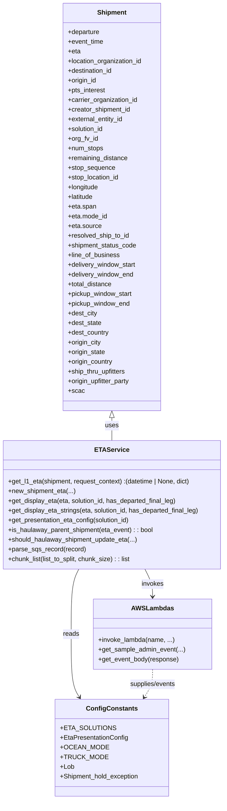

# Diagram: shipment_core/shipment_service/shipment_service/eta/eta_utils.py


> Auto-generated by Obscura crawlers

## Diagram 1



### SVG

<svg id="container" width="558.84375" xmlns="http://www.w3.org/2000/svg" class="classDiagram" height="1978" viewBox="0 0 558.84375 1978" role="graphics-document document" aria-roledescription="class"><style>#container{font-family:"trebuchet ms",verdana,arial,sans-serif;font-size:16px;fill:#333;}@keyframes edge-animation-frame{from{stroke-dashoffset:0;}}@keyframes dash{to{stroke-dashoffset:0;}}#container .edge-animation-slow{stroke-dasharray:9,5!important;stroke-dashoffset:900;animation:dash 50s linear infinite;stroke-linecap:round;}#container .edge-animation-fast{stroke-dasharray:9,5!important;stroke-dashoffset:900;animation:dash 20s linear infinite;stroke-linecap:round;}#container .error-icon{fill:#552222;}#container .error-text{fill:#552222;stroke:#552222;}#container .edge-thickness-normal{stroke-width:1px;}#container .edge-thickness-thick{stroke-width:3.5px;}#container .edge-pattern-solid{stroke-dasharray:0;}#container .edge-thickness-invisible{stroke-width:0;fill:none;}#container .edge-pattern-dashed{stroke-dasharray:3;}#container .edge-pattern-dotted{stroke-dasharray:2;}#container .marker{fill:#333333;stroke:#333333;}#container .marker.cross{stroke:#333333;}#container svg{font-family:"trebuchet ms",verdana,arial,sans-serif;font-size:16px;}#container p{margin:0;}#container g.classGroup text{fill:#9370DB;stroke:none;font-family:"trebuchet ms",verdana,arial,sans-serif;font-size:10px;}#container g.classGroup text .title{font-weight:bolder;}#container .nodeLabel,#container .edgeLabel{color:#131300;}#container .edgeLabel .label rect{fill:#ECECFF;}#container .label text{fill:#131300;}#container .labelBkg{background:#ECECFF;}#container .edgeLabel .label span{background:#ECECFF;}#container .classTitle{font-weight:bolder;}#container .node rect,#container .node circle,#container .node ellipse,#container .node polygon,#container .node path{fill:#ECECFF;stroke:#9370DB;stroke-width:1px;}#container .divider{stroke:#9370DB;stroke-width:1;}#container g.clickable{cursor:pointer;}#container g.classGroup rect{fill:#ECECFF;stroke:#9370DB;}#container g.classGroup line{stroke:#9370DB;stroke-width:1;}#container .classLabel .box{stroke:none;stroke-width:0;fill:#ECECFF;opacity:0.5;}#container .classLabel .label{fill:#9370DB;font-size:10px;}#container .relation{stroke:#333333;stroke-width:1;fill:none;}#container .dashed-line{stroke-dasharray:3;}#container .dotted-line{stroke-dasharray:1 2;}#container #compositionStart,#container .composition{fill:#333333!important;stroke:#333333!important;stroke-width:1;}#container #compositionEnd,#container .composition{fill:#333333!important;stroke:#333333!important;stroke-width:1;}#container #dependencyStart,#container .dependency{fill:#333333!important;stroke:#333333!important;stroke-width:1;}#container #dependencyStart,#container .dependency{fill:#333333!important;stroke:#333333!important;stroke-width:1;}#container #extensionStart,#container .extension{fill:transparent!important;stroke:#333333!important;stroke-width:1;}#container #extensionEnd,#container .extension{fill:transparent!important;stroke:#333333!important;stroke-width:1;}#container #aggregationStart,#container .aggregation{fill:transparent!important;stroke:#333333!important;stroke-width:1;}#container #aggregationEnd,#container .aggregation{fill:transparent!important;stroke:#333333!important;stroke-width:1;}#container #lollipopStart,#container .lollipop{fill:#ECECFF!important;stroke:#333333!important;stroke-width:1;}#container #lollipopEnd,#container .lollipop{fill:#ECECFF!important;stroke:#333333!important;stroke-width:1;}#container .edgeTerminals{font-size:11px;line-height:initial;}#container .classTitleText{text-anchor:middle;font-size:18px;fill:#333;}#container .label-icon{display:inline-block;height:1em;overflow:visible;vertical-align:-0.125em;}#container .node .label-icon path{fill:currentColor;stroke:revert;stroke-width:revert;}#container :root{--mermaid-font-family:"trebuchet ms",verdana,arial,sans-serif;}</style><g><defs><marker id="container_class-aggregationStart" class="marker aggregation class" refX="18" refY="7" markerWidth="190" markerHeight="240" orient="auto"><path d="M 18,7 L9,13 L1,7 L9,1 Z"></path></marker></defs><defs><marker id="container_class-aggregationEnd" class="marker aggregation class" refX="1" refY="7" markerWidth="20" markerHeight="28" orient="auto"><path d="M 18,7 L9,13 L1,7 L9,1 Z"></path></marker></defs><defs><marker id="container_class-extensionStart" class="marker extension class" refX="18" refY="7" markerWidth="190" markerHeight="240" orient="auto"><path d="M 1,7 L18,13 V 1 Z"></path></marker></defs><defs><marker id="container_class-extensionEnd" class="marker extension class" refX="1" refY="7" markerWidth="20" markerHeight="28" orient="auto"><path d="M 1,1 V 13 L18,7 Z"></path></marker></defs><defs><marker id="container_class-compositionStart" class="marker composition class" refX="18" refY="7" markerWidth="190" markerHeight="240" orient="auto"><path d="M 18,7 L9,13 L1,7 L9,1 Z"></path></marker></defs><defs><marker id="container_class-compositionEnd" class="marker composition class" refX="1" refY="7" markerWidth="20" markerHeight="28" orient="auto"><path d="M 18,7 L9,13 L1,7 L9,1 Z"></path></marker></defs><defs><marker id="container_class-dependencyStart" class="marker dependency class" refX="6" refY="7" markerWidth="190" markerHeight="240" orient="auto"><path d="M 5,7 L9,13 L1,7 L9,1 Z"></path></marker></defs><defs><marker id="container_class-dependencyEnd" class="marker dependency class" refX="13" refY="7" markerWidth="20" markerHeight="28" orient="auto"><path d="M 18,7 L9,13 L14,7 L9,1 Z"></path></marker></defs><defs><marker id="container_class-lollipopStart" class="marker lollipop class" refX="13" refY="7" markerWidth="190" markerHeight="240" orient="auto"><circle stroke="black" fill="transparent" cx="7" cy="7" r="6"></circle></marker></defs><defs><marker id="container_class-lollipopEnd" class="marker lollipop class" refX="1" refY="7" markerWidth="190" markerHeight="240" orient="auto"><circle stroke="black" fill="transparent" cx="7" cy="7" r="6"></circle></marker></defs><g class="root"><g class="clusters"></g><g class="edgePaths"><path d="M279.422,1033.25L279.422,1036.542C279.422,1039.833,279.422,1046.417,279.422,1055.875C279.422,1065.333,279.422,1077.667,279.422,1083.833L279.422,1090" id="id_Shipment_ETAService_1" class="edge-thickness-normal edge-pattern-solid relation" style=";;;" data-edge="true" data-et="edge" data-id="id_Shipment_ETAService_1" data-points="W3sieCI6Mjc5LjQyMTg3NSwieSI6MTAxNn0seyJ4IjoyNzkuNDIxODc1LCJ5IjoxMDUzfSx7IngiOjI3OS40MjE4NzUsInkiOjEwOTB9XQ==" marker-start="url(#container_class-extensionStart)"></path><path d="M360.164,1408L363.296,1414.167C366.427,1420.333,372.69,1432.667,375.822,1444C378.953,1455.333,378.953,1465.667,378.953,1470.833L378.953,1476" id="id_ETAService_AWSLambdas_2" class="edge-thickness-normal edge-pattern-solid relation" style=";;;" data-edge="true" data-et="edge" data-id="id_ETAService_AWSLambdas_2" data-points="W3sieCI6MzYwLjE2NDA2MjUsInkiOjE0MDh9LHsieCI6Mzc4Ljk1MzEyNSwieSI6MTQ0NX0seyJ4IjozNzguOTUzMTI1LCJ5IjoxNDgyfV0=" marker-end="url(#container_class-dependencyEnd)"></path><path d="M198.68,1408L195.548,1414.167C192.417,1420.333,186.154,1432.667,183.022,1459.5C179.891,1486.333,179.891,1527.667,179.891,1569C179.891,1610.333,179.891,1651.667,183.265,1677.655C186.639,1703.644,193.387,1714.288,196.76,1719.61L200.134,1724.933" id="id_ETAService_ConfigConstants_3" class="edge-thickness-normal edge-pattern-solid relation" style=";;;" data-edge="true" data-et="edge" data-id="id_ETAService_ConfigConstants_3" data-points="W3sieCI6MTk4LjY3OTY4NzUsInkiOjE0MDh9LHsieCI6MTc5Ljg5MDYyNSwieSI6MTQ0NX0seyJ4IjoxNzkuODkwNjI1LCJ5IjoxNTY5fSx7IngiOjE3OS44OTA2MjUsInkiOjE2OTN9LHsieCI6MjAzLjM0NzAzNDIzNTY2ODgsInkiOjE3MzB9XQ==" marker-end="url(#container_class-dependencyEnd)"></path><path d="M378.953,1656L378.953,1662.167C378.953,1668.333,378.953,1680.667,375.579,1692.155C372.205,1703.644,365.457,1714.288,362.083,1719.61L358.709,1724.933" id="id_AWSLambdas_ConfigConstants_4" class="edge-thickness-normal edge-pattern-dashed relation" style=";;;" data-edge="true" data-et="edge" data-id="id_AWSLambdas_ConfigConstants_4" data-points="W3sieCI6Mzc4Ljk1MzEyNSwieSI6MTY1Nn0seyJ4IjozNzguOTUzMTI1LCJ5IjoxNjkzfSx7IngiOjM1NS40OTY3MTU3NjQzMzEyLCJ5IjoxNzMwfV0=" marker-end="url(#container_class-dependencyEnd)"></path></g><g class="edgeLabels"><g class="edgeLabel" transform="translate(279.421875, 1053)"><g class="label" data-id="id_Shipment_ETAService_1" transform="translate(-16.4921875, -12)"><foreignObject width="32.984375" height="24"><div xmlns="http://www.w3.org/1999/xhtml" class="labelBkg" style="display: table-cell; white-space: nowrap; line-height: 1.5; max-width: 200px; text-align: center;"><span class="edgeLabel"><p>uses</p></span></div></foreignObject></g></g><g class="edgeLabel" transform="translate(378.953125, 1445)"><g class="label" data-id="id_ETAService_AWSLambdas_2" transform="translate(-27.5859375, -12)"><foreignObject width="55.171875" height="24"><div xmlns="http://www.w3.org/1999/xhtml" class="labelBkg" style="display: table-cell; white-space: nowrap; line-height: 1.5; max-width: 200px; text-align: center;"><span class="edgeLabel"><p>invokes</p></span></div></foreignObject></g></g><g class="edgeLabel" transform="translate(179.890625, 1569)"><g class="label" data-id="id_ETAService_ConfigConstants_3" transform="translate(-20.0078125, -12)"><foreignObject width="40.015625" height="24"><div xmlns="http://www.w3.org/1999/xhtml" class="labelBkg" style="display: table-cell; white-space: nowrap; line-height: 1.5; max-width: 200px; text-align: center;"><span class="edgeLabel"><p>reads</p></span></div></foreignObject></g></g><g class="edgeLabel" transform="translate(378.953125, 1693)"><g class="label" data-id="id_AWSLambdas_ConfigConstants_4" transform="translate(-58.2578125, -12)"><foreignObject width="116.515625" height="24"><div xmlns="http://www.w3.org/1999/xhtml" class="labelBkg" style="display: table-cell; white-space: nowrap; line-height: 1.5; max-width: 200px; text-align: center;"><span class="edgeLabel"><p>supplies/events</p></span></div></foreignObject></g></g></g><g class="nodes"><g class="node default" id="classId-Shipment-0" transform="translate(279.421875, 512)"><g class="basic label-container"><path d="M-123.5 -504 L123.5 -504 L123.5 504 L-123.5 504" stroke="none" stroke-width="0" fill="#ECECFF" style=""></path><path d="M-123.5 -504 C-35.93892904363554 -504, 51.62214191272892 -504, 123.5 -504 M-123.5 -504 C-34.04174640419802 -504, 55.416507191603955 -504, 123.5 -504 M123.5 -504 C123.5 -187.54373084511127, 123.5 128.91253830977746, 123.5 504 M123.5 -504 C123.5 -212.49384693906495, 123.5 79.0123061218701, 123.5 504 M123.5 504 C24.71246800636048 504, -74.07506398727904 504, -123.5 504 M123.5 504 C62.05862379688292 504, 0.617247593765839 504, -123.5 504 M-123.5 504 C-123.5 160.10102174372707, -123.5 -183.79795651254585, -123.5 -504 M-123.5 504 C-123.5 205.08501696594607, -123.5 -93.82996606810786, -123.5 -504" stroke="#9370DB" stroke-width="1.3" fill="none" stroke-dasharray="0 0" style=""></path></g><g class="annotation-group text" transform="translate(0, -480)"></g><g class="label-group text" transform="translate(-35.109375, -480)"><g class="label" style="font-weight: bolder" transform="translate(0,-12)"><foreignObject width="70.21875" height="24"><div xmlns="http://www.w3.org/1999/xhtml" style="display: table-cell; white-space: nowrap; line-height: 1.5; max-width: 120px; text-align: center;"><span class="nodeLabel markdown-node-label" style=""><p>Shipment</p></span></div></foreignObject></g></g><g class="members-group text" transform="translate(-111.5, -432)"><g class="label" style="" transform="translate(0,-12)"><foreignObject width="80.015625" height="24"><div xmlns="http://www.w3.org/1999/xhtml" style="display: table-cell; white-space: nowrap; line-height: 1.5; max-width: 137px; text-align: center;"><span class="nodeLabel markdown-node-label" style=""><p>+departure</p></span></div></foreignObject></g><g class="label" style="" transform="translate(0,12)"><foreignObject width="89.046875" height="24"><div xmlns="http://www.w3.org/1999/xhtml" style="display: table-cell; white-space: nowrap; line-height: 1.5; max-width: 146px; text-align: center;"><span class="nodeLabel markdown-node-label" style=""><p>+event_time</p></span></div></foreignObject></g><g class="label" style="" transform="translate(0,36)"><foreignObject width="31.078125" height="24"><div xmlns="http://www.w3.org/1999/xhtml" style="display: table-cell; white-space: nowrap; line-height: 1.5; max-width: 88px; text-align: center;"><span class="nodeLabel markdown-node-label" style=""><p>+eta</p></span></div></foreignObject></g><g class="label" style="" transform="translate(0,60)"><foreignObject width="187.890625" height="24"><div xmlns="http://www.w3.org/1999/xhtml" style="display: table-cell; white-space: nowrap; line-height: 1.5; max-width: 245px; text-align: center;"><span class="nodeLabel markdown-node-label" style=""><p>+location_organization_id</p></span></div></foreignObject></g><g class="label" style="" transform="translate(0,84)"><foreignObject width="113.53125" height="24"><div xmlns="http://www.w3.org/1999/xhtml" style="display: table-cell; white-space: nowrap; line-height: 1.5; max-width: 171px; text-align: center;"><span class="nodeLabel markdown-node-label" style=""><p>+destination_id</p></span></div></foreignObject></g><g class="label" style="" transform="translate(0,108)"><foreignObject width="72.625" height="24"><div xmlns="http://www.w3.org/1999/xhtml" style="display: table-cell; white-space: nowrap; line-height: 1.5; max-width: 130px; text-align: center;"><span class="nodeLabel markdown-node-label" style=""><p>+origin_id</p></span></div></foreignObject></g><g class="label" style="" transform="translate(0,132)"><foreignObject width="94.546875" height="24"><div xmlns="http://www.w3.org/1999/xhtml" style="display: table-cell; white-space: nowrap; line-height: 1.5; max-width: 152px; text-align: center;"><span class="nodeLabel markdown-node-label" style=""><p>+pts_interest</p></span></div></foreignObject></g><g class="label" style="" transform="translate(0,156)"><foreignObject width="175.421875" height="24"><div xmlns="http://www.w3.org/1999/xhtml" style="display: table-cell; white-space: nowrap; line-height: 1.5; max-width: 233px; text-align: center;"><span class="nodeLabel markdown-node-label" style=""><p>+carrier_organization_id</p></span></div></foreignObject></g><g class="label" style="" transform="translate(0,180)"><foreignObject width="157.546875" height="24"><div xmlns="http://www.w3.org/1999/xhtml" style="display: table-cell; white-space: nowrap; line-height: 1.5; max-width: 215px; text-align: center;"><span class="nodeLabel markdown-node-label" style=""><p>+creator_shipment_id</p></span></div></foreignObject></g><g class="label" style="" transform="translate(0,204)"><foreignObject width="139.234375" height="24"><div xmlns="http://www.w3.org/1999/xhtml" style="display: table-cell; white-space: nowrap; line-height: 1.5; max-width: 197px; text-align: center;"><span class="nodeLabel markdown-node-label" style=""><p>+external_entity_id</p></span></div></foreignObject></g><g class="label" style="" transform="translate(0,228)"><foreignObject width="90.21875" height="24"><div xmlns="http://www.w3.org/1999/xhtml" style="display: table-cell; white-space: nowrap; line-height: 1.5; max-width: 148px; text-align: center;"><span class="nodeLabel markdown-node-label" style=""><p>+solution_id</p></span></div></foreignObject></g><g class="label" style="" transform="translate(0,252)"><foreignObject width="74.8125" height="24"><div xmlns="http://www.w3.org/1999/xhtml" style="display: table-cell; white-space: nowrap; line-height: 1.5; max-width: 132px; text-align: center;"><span class="nodeLabel markdown-node-label" style=""><p>+org_fv_id</p></span></div></foreignObject></g><g class="label" style="" transform="translate(0,276)"><foreignObject width="88.046875" height="24"><div xmlns="http://www.w3.org/1999/xhtml" style="display: table-cell; white-space: nowrap; line-height: 1.5; max-width: 145px; text-align: center;"><span class="nodeLabel markdown-node-label" style=""><p>+num_stops</p></span></div></foreignObject></g><g class="label" style="" transform="translate(0,300)"><foreignObject width="150.328125" height="24"><div xmlns="http://www.w3.org/1999/xhtml" style="display: table-cell; white-space: nowrap; line-height: 1.5; max-width: 208px; text-align: center;"><span class="nodeLabel markdown-node-label" style=""><p>+remaining_distance</p></span></div></foreignObject></g><g class="label" style="" transform="translate(0,324)"><foreignObject width="117.0625" height="24"><div xmlns="http://www.w3.org/1999/xhtml" style="display: table-cell; white-space: nowrap; line-height: 1.5; max-width: 174px; text-align: center;"><span class="nodeLabel markdown-node-label" style=""><p>+stop_sequence</p></span></div></foreignObject></g><g class="label" style="" transform="translate(0,348)"><foreignObject width="129.234375" height="24"><div xmlns="http://www.w3.org/1999/xhtml" style="display: table-cell; white-space: nowrap; line-height: 1.5; max-width: 187px; text-align: center;"><span class="nodeLabel markdown-node-label" style=""><p>+stop_location_id</p></span></div></foreignObject></g><g class="label" style="" transform="translate(0,372)"><foreignObject width="77.53125" height="24"><div xmlns="http://www.w3.org/1999/xhtml" style="display: table-cell; white-space: nowrap; line-height: 1.5; max-width: 135px; text-align: center;"><span class="nodeLabel markdown-node-label" style=""><p>+longitude</p></span></div></foreignObject></g><g class="label" style="" transform="translate(0,396)"><foreignObject width="64.96875" height="24"><div xmlns="http://www.w3.org/1999/xhtml" style="display: table-cell; white-space: nowrap; line-height: 1.5; max-width: 122px; text-align: center;"><span class="nodeLabel markdown-node-label" style=""><p>+latitude</p></span></div></foreignObject></g><g class="label" style="" transform="translate(0,420)"><foreignObject width="69.875" height="24"><div xmlns="http://www.w3.org/1999/xhtml" style="display: table-cell; white-space: nowrap; line-height: 1.5; max-width: 127px; text-align: center;"><span class="nodeLabel markdown-node-label" style=""><p>+eta.span</p></span></div></foreignObject></g><g class="label" style="" transform="translate(0,444)"><foreignObject width="98.34375" height="24"><div xmlns="http://www.w3.org/1999/xhtml" style="display: table-cell; white-space: nowrap; line-height: 1.5; max-width: 156px; text-align: center;"><span class="nodeLabel markdown-node-label" style=""><p>+eta.mode_id</p></span></div></foreignObject></g><g class="label" style="" transform="translate(0,468)"><foreignObject width="82.859375" height="24"><div xmlns="http://www.w3.org/1999/xhtml" style="display: table-cell; white-space: nowrap; line-height: 1.5; max-width: 140px; text-align: center;"><span class="nodeLabel markdown-node-label" style=""><p>+eta.source</p></span></div></foreignObject></g><g class="label" style="" transform="translate(0,492)"><foreignObject width="153.671875" height="24"><div xmlns="http://www.w3.org/1999/xhtml" style="display: table-cell; white-space: nowrap; line-height: 1.5; max-width: 211px; text-align: center;"><span class="nodeLabel markdown-node-label" style=""><p>+resolved_ship_to_id</p></span></div></foreignObject></g><g class="label" style="" transform="translate(0,516)"><foreignObject width="171.796875" height="24"><div xmlns="http://www.w3.org/1999/xhtml" style="display: table-cell; white-space: nowrap; line-height: 1.5; max-width: 229px; text-align: center;"><span class="nodeLabel markdown-node-label" style=""><p>+shipment_status_code</p></span></div></foreignObject></g><g class="label" style="" transform="translate(0,540)"><foreignObject width="129.1875" height="24"><div xmlns="http://www.w3.org/1999/xhtml" style="display: table-cell; white-space: nowrap; line-height: 1.5; max-width: 187px; text-align: center;"><span class="nodeLabel markdown-node-label" style=""><p>+line_of_business</p></span></div></foreignObject></g><g class="label" style="" transform="translate(0,564)"><foreignObject width="171.109375" height="24"><div xmlns="http://www.w3.org/1999/xhtml" style="display: table-cell; white-space: nowrap; line-height: 1.5; max-width: 229px; text-align: center;"><span class="nodeLabel markdown-node-label" style=""><p>+delivery_window_start</p></span></div></foreignObject></g><g class="label" style="" transform="translate(0,588)"><foreignObject width="164.671875" height="24"><div xmlns="http://www.w3.org/1999/xhtml" style="display: table-cell; white-space: nowrap; line-height: 1.5; max-width: 222px; text-align: center;"><span class="nodeLabel markdown-node-label" style=""><p>+delivery_window_end</p></span></div></foreignObject></g><g class="label" style="" transform="translate(0,612)"><foreignObject width="111.03125" height="24"><div xmlns="http://www.w3.org/1999/xhtml" style="display: table-cell; white-space: nowrap; line-height: 1.5; max-width: 168px; text-align: center;"><span class="nodeLabel markdown-node-label" style=""><p>+total_distance</p></span></div></foreignObject></g><g class="label" style="" transform="translate(0,636)"><foreignObject width="161.765625" height="24"><div xmlns="http://www.w3.org/1999/xhtml" style="display: table-cell; white-space: nowrap; line-height: 1.5; max-width: 219px; text-align: center;"><span class="nodeLabel markdown-node-label" style=""><p>+pickup_window_start</p></span></div></foreignObject></g><g class="label" style="" transform="translate(0,660)"><foreignObject width="155.3125" height="24"><div xmlns="http://www.w3.org/1999/xhtml" style="display: table-cell; white-space: nowrap; line-height: 1.5; max-width: 213px; text-align: center;"><span class="nodeLabel markdown-node-label" style=""><p>+pickup_window_end</p></span></div></foreignObject></g><g class="label" style="" transform="translate(0,684)"><foreignObject width="73.25" height="24"><div xmlns="http://www.w3.org/1999/xhtml" style="display: table-cell; white-space: nowrap; line-height: 1.5; max-width: 131px; text-align: center;"><span class="nodeLabel markdown-node-label" style=""><p>+dest_city</p></span></div></foreignObject></g><g class="label" style="" transform="translate(0,708)"><foreignObject width="83.9375" height="24"><div xmlns="http://www.w3.org/1999/xhtml" style="display: table-cell; white-space: nowrap; line-height: 1.5; max-width: 141px; text-align: center;"><span class="nodeLabel markdown-node-label" style=""><p>+dest_state</p></span></div></foreignObject></g><g class="label" style="" transform="translate(0,732)"><foreignObject width="102.71875" height="24"><div xmlns="http://www.w3.org/1999/xhtml" style="display: table-cell; white-space: nowrap; line-height: 1.5; max-width: 160px; text-align: center;"><span class="nodeLabel markdown-node-label" style=""><p>+dest_country</p></span></div></foreignObject></g><g class="label" style="" transform="translate(0,756)"><foreignObject width="83.953125" height="24"><div xmlns="http://www.w3.org/1999/xhtml" style="display: table-cell; white-space: nowrap; line-height: 1.5; max-width: 141px; text-align: center;"><span class="nodeLabel markdown-node-label" style=""><p>+origin_city</p></span></div></foreignObject></g><g class="label" style="" transform="translate(0,780)"><foreignObject width="94.640625" height="24"><div xmlns="http://www.w3.org/1999/xhtml" style="display: table-cell; white-space: nowrap; line-height: 1.5; max-width: 152px; text-align: center;"><span class="nodeLabel markdown-node-label" style=""><p>+origin_state</p></span></div></foreignObject></g><g class="label" style="" transform="translate(0,804)"><foreignObject width="113.421875" height="24"><div xmlns="http://www.w3.org/1999/xhtml" style="display: table-cell; white-space: nowrap; line-height: 1.5; max-width: 171px; text-align: center;"><span class="nodeLabel markdown-node-label" style=""><p>+origin_country</p></span></div></foreignObject></g><g class="label" style="" transform="translate(0,828)"><foreignObject width="146.625" height="24"><div xmlns="http://www.w3.org/1999/xhtml" style="display: table-cell; white-space: nowrap; line-height: 1.5; max-width: 204px; text-align: center;"><span class="nodeLabel markdown-node-label" style=""><p>+ship_thru_upfitters</p></span></div></foreignObject></g><g class="label" style="" transform="translate(0,852)"><foreignObject width="157.28125" height="24"><div xmlns="http://www.w3.org/1999/xhtml" style="display: table-cell; white-space: nowrap; line-height: 1.5; max-width: 215px; text-align: center;"><span class="nodeLabel markdown-node-label" style=""><p>+origin_upfitter_party</p></span></div></foreignObject></g><g class="label" style="" transform="translate(0,876)"><foreignObject width="39.296875" height="24"><div xmlns="http://www.w3.org/1999/xhtml" style="display: table-cell; white-space: nowrap; line-height: 1.5; max-width: 97px; text-align: center;"><span class="nodeLabel markdown-node-label" style=""><p>+scac</p></span></div></foreignObject></g></g><g class="methods-group text" transform="translate(-111.5, 504)"></g><g class="divider" style=""><path d="M-123.5 -456 C-74.0558186907904 -456, -24.611637381580806 -456, 123.5 -456 M-123.5 -456 C-57.30198934218558 -456, 8.896021315628843 -456, 123.5 -456" stroke="#9370DB" stroke-width="1.3" fill="none" stroke-dasharray="0 0" style=""></path></g><g class="divider" style=""><path d="M-123.5 480 C-44.935751851701525 480, 33.62849629659695 480, 123.5 480 M-123.5 480 C-69.27431859361087 480, -15.048637187221757 480, 123.5 480" stroke="#9370DB" stroke-width="1.3" fill="none" stroke-dasharray="0 0" style=""></path></g></g><g class="node default" id="classId-ETAService-1" transform="translate(279.421875, 1249)"><g class="basic label-container"><path d="M-271.421875 -159 L271.421875 -159 L271.421875 159 L-271.421875 159" stroke="none" stroke-width="0" fill="#ECECFF" style=""></path><path d="M-271.421875 -159 C-81.68314727319043 -159, 108.05558045361914 -159, 271.421875 -159 M-271.421875 -159 C-65.34025290490771 -159, 140.74136919018457 -159, 271.421875 -159 M271.421875 -159 C271.421875 -86.49734684590778, 271.421875 -13.99469369181557, 271.421875 159 M271.421875 -159 C271.421875 -33.61180542770482, 271.421875 91.77638914459035, 271.421875 159 M271.421875 159 C120.20410988822834 159, -31.01365522354331 159, -271.421875 159 M271.421875 159 C85.64202113811015 159, -100.1378327237797 159, -271.421875 159 M-271.421875 159 C-271.421875 80.1532142540226, -271.421875 1.306428508045201, -271.421875 -159 M-271.421875 159 C-271.421875 58.8637018038315, -271.421875 -41.27259639233699, -271.421875 -159" stroke="#9370DB" stroke-width="1.3" fill="none" stroke-dasharray="0 0" style=""></path></g><g class="annotation-group text" transform="translate(0, -135)"></g><g class="label-group text" transform="translate(-39.5, -135)"><g class="label" style="font-weight: bolder" transform="translate(0,-12)"><foreignObject width="79" height="24"><div xmlns="http://www.w3.org/1999/xhtml" style="display: table-cell; white-space: nowrap; line-height: 1.5; max-width: 127px; text-align: center;"><span class="nodeLabel markdown-node-label" style=""><p>ETAService</p></span></div></foreignObject></g></g><g class="members-group text" transform="translate(-259.421875, -87)"></g><g class="methods-group text" transform="translate(-259.421875, -57)"><g class="label" style="" transform="translate(0,-12)"><foreignObject width="457.375" height="24"><div xmlns="http://www.w3.org/1999/xhtml" style="display: table-cell; white-space: nowrap; line-height: 1.5; max-width: 515px; text-align: center;"><span class="nodeLabel markdown-node-label" style=""><p>+get_l1_eta(shipment, request_context) :(datetime | None, dict)</p></span></div></foreignObject></g><g class="label" style="" transform="translate(0,12)"><foreignObject width="166.984375" height="24"><div xmlns="http://www.w3.org/1999/xhtml" style="display: table-cell; white-space: nowrap; line-height: 1.5; max-width: 224px; text-align: center;"><span class="nodeLabel markdown-node-label" style=""><p>+new_shipment_eta(...)</p></span></div></foreignObject></g><g class="label" style="" transform="translate(0,36)"><foreignObject width="422.03125" height="24"><div xmlns="http://www.w3.org/1999/xhtml" style="display: table-cell; white-space: nowrap; line-height: 1.5; max-width: 479px; text-align: center;"><span class="nodeLabel markdown-node-label" style=""><p>+get_display_eta(eta, solution_id, has_departed_final_leg)</p></span></div></foreignObject></g><g class="label" style="" transform="translate(0,60)"><foreignObject width="479.34375" height="24"><div xmlns="http://www.w3.org/1999/xhtml" style="display: table-cell; white-space: nowrap; line-height: 1.5; max-width: 537px; text-align: center;"><span class="nodeLabel markdown-node-label" style=""><p>+get_display_eta_strings(eta, solution_id, has_departed_final_leg)</p></span></div></foreignObject></g><g class="label" style="" transform="translate(0,84)"><foreignObject width="306.984375" height="24"><div xmlns="http://www.w3.org/1999/xhtml" style="display: table-cell; white-space: nowrap; line-height: 1.5; max-width: 364px; text-align: center;"><span class="nodeLabel markdown-node-label" style=""><p>+get_presentation_eta_config(solution_id)</p></span></div></foreignObject></g><g class="label" style="" transform="translate(0,108)"><foreignObject width="363.515625" height="24"><div xmlns="http://www.w3.org/1999/xhtml" style="display: table-cell; white-space: nowrap; line-height: 1.5; max-width: 421px; text-align: center;"><span class="nodeLabel markdown-node-label" style=""><p>+is_haulaway_parent_shipment(eta_event) : : bool</p></span></div></foreignObject></g><g class="label" style="" transform="translate(0,132)"><foreignObject width="322.515625" height="24"><div xmlns="http://www.w3.org/1999/xhtml" style="display: table-cell; white-space: nowrap; line-height: 1.5; max-width: 380px; text-align: center;"><span class="nodeLabel markdown-node-label" style=""><p>+should_haulaway_shipment_update_eta(...)</p></span></div></foreignObject></g><g class="label" style="" transform="translate(0,156)"><foreignObject width="191.75" height="24"><div xmlns="http://www.w3.org/1999/xhtml" style="display: table-cell; white-space: nowrap; line-height: 1.5; max-width: 249px; text-align: center;"><span class="nodeLabel markdown-node-label" style=""><p>+parse_sqs_record(record)</p></span></div></foreignObject></g><g class="label" style="" transform="translate(0,180)"><foreignObject width="308.953125" height="24"><div xmlns="http://www.w3.org/1999/xhtml" style="display: table-cell; white-space: nowrap; line-height: 1.5; max-width: 367px; text-align: center;"><span class="nodeLabel markdown-node-label" style=""><p>+chunk_list(list_to_split, chunk_size) : : list</p></span></div></foreignObject></g></g><g class="divider" style=""><path d="M-271.421875 -111 C-63.16626330464322 -111, 145.08934839071355 -111, 271.421875 -111 M-271.421875 -111 C-101.13650315556183 -111, 69.14886868887635 -111, 271.421875 -111" stroke="#9370DB" stroke-width="1.3" fill="none" stroke-dasharray="0 0" style=""></path></g><g class="divider" style=""><path d="M-271.421875 -87 C-152.55420396841058 -87, -33.68653293682115 -87, 271.421875 -87 M-271.421875 -87 C-152.91127768724294 -87, -34.40068037448586 -87, 271.421875 -87" stroke="#9370DB" stroke-width="1.3" fill="none" stroke-dasharray="0 0" style=""></path></g></g><g class="node default" id="classId-AWSLambdas-2" transform="translate(378.953125, 1569)"><g class="basic label-container"><path d="M-144.0546875 -87 L144.0546875 -87 L144.0546875 87 L-144.0546875 87" stroke="none" stroke-width="0" fill="#ECECFF" style=""></path><path d="M-144.0546875 -87 C-38.650397537760895 -87, 66.75389242447821 -87, 144.0546875 -87 M-144.0546875 -87 C-68.54522951192183 -87, 6.964228476156336 -87, 144.0546875 -87 M144.0546875 -87 C144.0546875 -44.550422222665496, 144.0546875 -2.100844445330992, 144.0546875 87 M144.0546875 -87 C144.0546875 -48.33683522312445, 144.0546875 -9.673670446248906, 144.0546875 87 M144.0546875 87 C51.658124408021436 87, -40.73843868395713 87, -144.0546875 87 M144.0546875 87 C63.353726552593415 87, -17.34723439481317 87, -144.0546875 87 M-144.0546875 87 C-144.0546875 30.32441960419944, -144.0546875 -26.351160791601117, -144.0546875 -87 M-144.0546875 87 C-144.0546875 47.70982746764932, -144.0546875 8.419654935298638, -144.0546875 -87" stroke="#9370DB" stroke-width="1.3" fill="none" stroke-dasharray="0 0" style=""></path></g><g class="annotation-group text" transform="translate(0, -63)"></g><g class="label-group text" transform="translate(-48.90625, -63)"><g class="label" style="font-weight: bolder" transform="translate(0,-12)"><foreignObject width="97.8125" height="24"><div xmlns="http://www.w3.org/1999/xhtml" style="display: table-cell; white-space: nowrap; line-height: 1.5; max-width: 146px; text-align: center;"><span class="nodeLabel markdown-node-label" style=""><p>AWSLambdas</p></span></div></foreignObject></g></g><g class="members-group text" transform="translate(-132.0546875, -15)"></g><g class="methods-group text" transform="translate(-132.0546875, 15)"><g class="label" style="" transform="translate(0,-12)"><foreignObject width="188.640625" height="24"><div xmlns="http://www.w3.org/1999/xhtml" style="display: table-cell; white-space: nowrap; line-height: 1.5; max-width: 246px; text-align: center;"><span class="nodeLabel markdown-node-label" style=""><p>+invoke_lambda(name, ...)</p></span></div></foreignObject></g><g class="label" style="" transform="translate(0,12)"><foreignObject width="215.203125" height="24"><div xmlns="http://www.w3.org/1999/xhtml" style="display: table-cell; white-space: nowrap; line-height: 1.5; max-width: 273px; text-align: center;"><span class="nodeLabel markdown-node-label" style=""><p>+get_sample_admin_event(...)</p></span></div></foreignObject></g><g class="label" style="" transform="translate(0,36)"><foreignObject width="200.171875" height="24"><div xmlns="http://www.w3.org/1999/xhtml" style="display: table-cell; white-space: nowrap; line-height: 1.5; max-width: 258px; text-align: center;"><span class="nodeLabel markdown-node-label" style=""><p>+get_event_body(response)</p></span></div></foreignObject></g></g><g class="divider" style=""><path d="M-144.0546875 -39 C-45.78704176063232 -39, 52.48060397873536 -39, 144.0546875 -39 M-144.0546875 -39 C-80.50967068852736 -39, -16.964653877054715 -39, 144.0546875 -39" stroke="#9370DB" stroke-width="1.3" fill="none" stroke-dasharray="0 0" style=""></path></g><g class="divider" style=""><path d="M-144.0546875 -15 C-76.48467976752323 -15, -8.914672035046465 -15, 144.0546875 -15 M-144.0546875 -15 C-37.98889843543755 -15, 68.0768906291249 -15, 144.0546875 -15" stroke="#9370DB" stroke-width="1.3" fill="none" stroke-dasharray="0 0" style=""></path></g></g><g class="node default" id="classId-ConfigConstants-3" transform="translate(279.421875, 1850)"><g class="basic label-container"><path d="M-140.2421875 -120 L140.2421875 -120 L140.2421875 120 L-140.2421875 120" stroke="none" stroke-width="0" fill="#ECECFF" style=""></path><path d="M-140.2421875 -120 C-44.33235757586945 -120, 51.5774723482611 -120, 140.2421875 -120 M-140.2421875 -120 C-52.39853981767405 -120, 35.4451078646519 -120, 140.2421875 -120 M140.2421875 -120 C140.2421875 -37.196828879621805, 140.2421875 45.60634224075639, 140.2421875 120 M140.2421875 -120 C140.2421875 -58.47310391711986, 140.2421875 3.053792165760285, 140.2421875 120 M140.2421875 120 C39.63969350829035 120, -60.9628004834193 120, -140.2421875 120 M140.2421875 120 C40.553632715463905 120, -59.13492206907219 120, -140.2421875 120 M-140.2421875 120 C-140.2421875 55.307060728018996, -140.2421875 -9.385878543962008, -140.2421875 -120 M-140.2421875 120 C-140.2421875 56.69865755486538, -140.2421875 -6.602684890269245, -140.2421875 -120" stroke="#9370DB" stroke-width="1.3" fill="none" stroke-dasharray="0 0" style=""></path></g><g class="annotation-group text" transform="translate(0, -96)"></g><g class="label-group text" transform="translate(-59.46875, -96)"><g class="label" style="font-weight: bolder" transform="translate(0,-12)"><foreignObject width="118.9375" height="24"><div xmlns="http://www.w3.org/1999/xhtml" style="display: table-cell; white-space: nowrap; line-height: 1.5; max-width: 167px; text-align: center;"><span class="nodeLabel markdown-node-label" style=""><p>ConfigConstants</p></span></div></foreignObject></g></g><g class="members-group text" transform="translate(-128.2421875, -48)"><g class="label" style="" transform="translate(0,-12)"><foreignObject width="122.859375" height="24"><div xmlns="http://www.w3.org/1999/xhtml" style="display: table-cell; white-space: nowrap; line-height: 1.5; max-width: 180px; text-align: center;"><span class="nodeLabel markdown-node-label" style=""><p>+ETA_SOLUTIONS</p></span></div></foreignObject></g><g class="label" style="" transform="translate(0,12)"><foreignObject width="167.90625" height="24"><div xmlns="http://www.w3.org/1999/xhtml" style="display: table-cell; white-space: nowrap; line-height: 1.5; max-width: 226px; text-align: center;"><span class="nodeLabel markdown-node-label" style=""><p>+EtaPresentationConfig</p></span></div></foreignObject></g><g class="label" style="" transform="translate(0,36)"><foreignObject width="107.21875" height="24"><div xmlns="http://www.w3.org/1999/xhtml" style="display: table-cell; white-space: nowrap; line-height: 1.5; max-width: 165px; text-align: center;"><span class="nodeLabel markdown-node-label" style=""><p>+OCEAN_MODE</p></span></div></foreignObject></g><g class="label" style="" transform="translate(0,60)"><foreignObject width="104.546875" height="24"><div xmlns="http://www.w3.org/1999/xhtml" style="display: table-cell; white-space: nowrap; line-height: 1.5; max-width: 162px; text-align: center;"><span class="nodeLabel markdown-node-label" style=""><p>+TRUCK_MODE</p></span></div></foreignObject></g><g class="label" style="" transform="translate(0,84)"><foreignObject width="34.40625" height="24"><div xmlns="http://www.w3.org/1999/xhtml" style="display: table-cell; white-space: nowrap; line-height: 1.5; max-width: 92px; text-align: center;"><span class="nodeLabel markdown-node-label" style=""><p>+Lob</p></span></div></foreignObject></g><g class="label" style="" transform="translate(0,108)"><foreignObject width="197.015625" height="24"><div xmlns="http://www.w3.org/1999/xhtml" style="display: table-cell; white-space: nowrap; line-height: 1.5; max-width: 254px; text-align: center;"><span class="nodeLabel markdown-node-label" style=""><p>+Shipment_hold_exception</p></span></div></foreignObject></g></g><g class="methods-group text" transform="translate(-128.2421875, 120)"></g><g class="divider" style=""><path d="M-140.2421875 -72 C-72.98044572652287 -72, -5.718703953045747 -72, 140.2421875 -72 M-140.2421875 -72 C-64.48209698266376 -72, 11.277993534672476 -72, 140.2421875 -72" stroke="#9370DB" stroke-width="1.3" fill="none" stroke-dasharray="0 0" style=""></path></g><g class="divider" style=""><path d="M-140.2421875 96 C-57.106689770784584 96, 26.028807958430832 96, 140.2421875 96 M-140.2421875 96 C-41.486503190793485 96, 57.26918111841303 96, 140.2421875 96" stroke="#9370DB" stroke-width="1.3" fill="none" stroke-dasharray="0 0" style=""></path></g></g></g></g></g></svg>

## Diagram 2

```mermaid
flowchart TD
    A[Start: call get_l1_eta] --> B{shipment.departure?}
    B -- No --> C[set shipment.departure = shipment.event_time]
    B -- Yes --> C
    C --> D[get_elevated_request_context(request_context, location_organization_id)]
    D --> E[build qsp_dict with shipment fields]
    E --> F[add optional params if present]
    F --> G[full_ship_payload = {requestContext, queryStringParameters}]
    G --> H[invoke_lambda("eta_proxy", full_payload)]
    H --> I{response statusCode in 200/201/409?}
    I -- True --> J[eta_date = parse response.body.etaDate]
    I -- False --> K[log warning; check aiResponse.etaDate fallback]
    K --> L{eta_source == ENTITY and ai eta present?}
    L -- True --> M[eta_date = fromisoformat(ai eta)]
    L -- False --> N[eta_date = None]
    J --> O[return (eta_date, response_body)]
    M --> O
    N --> O
    O --> P[End]
```

> SVG rendering failed for this diagram.
