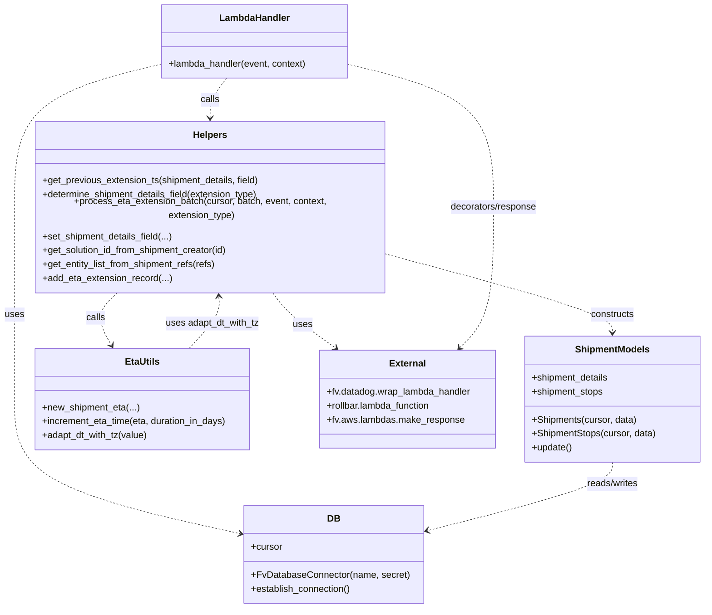

# Diagram: shipment_core/shipment_service/shipment_service/eta/extend_rail_eta.py


> Auto-generated by Obscura crawlers

## Diagram 1

```mermaid
flowchart TB
    Start([Start]) --> ParseEvent{Parse event body}
    ParseEvent --> GetExtensionType[Get extension_type and shipment_ids]
    GetExtensionType --> ValidType?{extension_type in DAILY/EXCEPTION/FAST_TRACK}
    ValidType? -->|No| RaiseBadRequest[BadRequestError: Missing valid processing type]
    ValidType? -->|Yes| ConnectDB[Establish DB connection]
    ConnectDB --> ProcessBatch[process_eta_extension_batch(cursor, batch, event, context, extension_type)]
    ProcessBatch --> ForEachShipment{For each shipment_id in batch}
    ForEachShipment --> RetrieveShipment[db_no_orm.get_existing_shipments_by_db_id]
    RetrieveShipment --> OnRetrieveError[Log warning and continue]
    RetrieveShipment --> BuildShipmentObjs[Create Shipments and ShipmentStops objects]
    BuildShipmentObjs --> HasStops?{shipment_stops present?}
    HasStops? -->|No| LogNoStops[Log warning and continue]
    HasStops? -->|Yes| SortStops[Sort stops by stop_sequence]
    SortStops --> GetLastExtensionTs[get_previous_extension_ts(shipment_details, field)]
    GetLastExtensionTs --> ComputeDelta[Compute last_extension_delta = now - last_extension_ts]
    ComputeDelta --> CheckExceptions{If non-exception extension and current_exception in bad_order/in_hold}
    CheckExceptions -->|True| LogSkip[Log warning and continue]
    CheckExceptions -->|False| CheckDelta{last_extension_delta >= 1 day?}
    CheckDelta -->|No| LogNotUpdated[Log info: already updated today or no match]
    CheckDelta -->|Yes| IncrementETA[increment_eta_time(eta, 1)]
    IncrementETA -->|None| LogNullETA[Log warning: null ETA found]
    IncrementETA -->|OK| CallNewETA[eta_utils.new_shipment_eta(...)]
    CallNewETA --> SetDetails[set_shipment_details_field(...)]
    SetDetails --> AddRecord[add_eta_extension_record(...)]
    AddRecord --> LogSuccess[Log info: ETA updated]
    LogSuccess --> ContinueLoop([continue loop])
    LogNotUpdated --> ContinueLoop
    LogSkip --> ContinueLoop
    LogNoStops --> ContinueLoop
    OnRetrieveError --> ContinueLoop
    RaiseBadRequest --> End([End])
    ContinueLoop --> ForEachShipment
    ForEachShipment --> End
```

> SVG rendering failed for this diagram.

## Diagram 2



### SVG

<svg id="container" width="1214.998046875" xmlns="http://www.w3.org/2000/svg" class="classDiagram" height="1018" viewBox="0 0 1214.998046875 1018" role="graphics-document document" aria-roledescription="class"><style>#container{font-family:"trebuchet ms",verdana,arial,sans-serif;font-size:16px;fill:#333;}@keyframes edge-animation-frame{from{stroke-dashoffset:0;}}@keyframes dash{to{stroke-dashoffset:0;}}#container .edge-animation-slow{stroke-dasharray:9,5!important;stroke-dashoffset:900;animation:dash 50s linear infinite;stroke-linecap:round;}#container .edge-animation-fast{stroke-dasharray:9,5!important;stroke-dashoffset:900;animation:dash 20s linear infinite;stroke-linecap:round;}#container .error-icon{fill:#552222;}#container .error-text{fill:#552222;stroke:#552222;}#container .edge-thickness-normal{stroke-width:1px;}#container .edge-thickness-thick{stroke-width:3.5px;}#container .edge-pattern-solid{stroke-dasharray:0;}#container .edge-thickness-invisible{stroke-width:0;fill:none;}#container .edge-pattern-dashed{stroke-dasharray:3;}#container .edge-pattern-dotted{stroke-dasharray:2;}#container .marker{fill:#333333;stroke:#333333;}#container .marker.cross{stroke:#333333;}#container svg{font-family:"trebuchet ms",verdana,arial,sans-serif;font-size:16px;}#container p{margin:0;}#container g.classGroup text{fill:#9370DB;stroke:none;font-family:"trebuchet ms",verdana,arial,sans-serif;font-size:10px;}#container g.classGroup text .title{font-weight:bolder;}#container .nodeLabel,#container .edgeLabel{color:#131300;}#container .edgeLabel .label rect{fill:#ECECFF;}#container .label text{fill:#131300;}#container .labelBkg{background:#ECECFF;}#container .edgeLabel .label span{background:#ECECFF;}#container .classTitle{font-weight:bolder;}#container .node rect,#container .node circle,#container .node ellipse,#container .node polygon,#container .node path{fill:#ECECFF;stroke:#9370DB;stroke-width:1px;}#container .divider{stroke:#9370DB;stroke-width:1;}#container g.clickable{cursor:pointer;}#container g.classGroup rect{fill:#ECECFF;stroke:#9370DB;}#container g.classGroup line{stroke:#9370DB;stroke-width:1;}#container .classLabel .box{stroke:none;stroke-width:0;fill:#ECECFF;opacity:0.5;}#container .classLabel .label{fill:#9370DB;font-size:10px;}#container .relation{stroke:#333333;stroke-width:1;fill:none;}#container .dashed-line{stroke-dasharray:3;}#container .dotted-line{stroke-dasharray:1 2;}#container #compositionStart,#container .composition{fill:#333333!important;stroke:#333333!important;stroke-width:1;}#container #compositionEnd,#container .composition{fill:#333333!important;stroke:#333333!important;stroke-width:1;}#container #dependencyStart,#container .dependency{fill:#333333!important;stroke:#333333!important;stroke-width:1;}#container #dependencyStart,#container .dependency{fill:#333333!important;stroke:#333333!important;stroke-width:1;}#container #extensionStart,#container .extension{fill:transparent!important;stroke:#333333!important;stroke-width:1;}#container #extensionEnd,#container .extension{fill:transparent!important;stroke:#333333!important;stroke-width:1;}#container #aggregationStart,#container .aggregation{fill:transparent!important;stroke:#333333!important;stroke-width:1;}#container #aggregationEnd,#container .aggregation{fill:transparent!important;stroke:#333333!important;stroke-width:1;}#container #lollipopStart,#container .lollipop{fill:#ECECFF!important;stroke:#333333!important;stroke-width:1;}#container #lollipopEnd,#container .lollipop{fill:#ECECFF!important;stroke:#333333!important;stroke-width:1;}#container .edgeTerminals{font-size:11px;line-height:initial;}#container .classTitleText{text-anchor:middle;font-size:18px;fill:#333;}#container .label-icon{display:inline-block;height:1em;overflow:visible;vertical-align:-0.125em;}#container .node .label-icon path{fill:currentColor;stroke:revert;stroke-width:revert;}#container :root{--mermaid-font-family:"trebuchet ms",verdana,arial,sans-serif;}</style><g><defs><marker id="container_class-aggregationStart" class="marker aggregation class" refX="18" refY="7" markerWidth="190" markerHeight="240" orient="auto"><path d="M 18,7 L9,13 L1,7 L9,1 Z"></path></marker></defs><defs><marker id="container_class-aggregationEnd" class="marker aggregation class" refX="1" refY="7" markerWidth="20" markerHeight="28" orient="auto"><path d="M 18,7 L9,13 L1,7 L9,1 Z"></path></marker></defs><defs><marker id="container_class-extensionStart" class="marker extension class" refX="18" refY="7" markerWidth="190" markerHeight="240" orient="auto"><path d="M 1,7 L18,13 V 1 Z"></path></marker></defs><defs><marker id="container_class-extensionEnd" class="marker extension class" refX="1" refY="7" markerWidth="20" markerHeight="28" orient="auto"><path d="M 1,1 V 13 L18,7 Z"></path></marker></defs><defs><marker id="container_class-compositionStart" class="marker composition class" refX="18" refY="7" markerWidth="190" markerHeight="240" orient="auto"><path d="M 18,7 L9,13 L1,7 L9,1 Z"></path></marker></defs><defs><marker id="container_class-compositionEnd" class="marker composition class" refX="1" refY="7" markerWidth="20" markerHeight="28" orient="auto"><path d="M 18,7 L9,13 L1,7 L9,1 Z"></path></marker></defs><defs><marker id="container_class-dependencyStart" class="marker dependency class" refX="6" refY="7" markerWidth="190" markerHeight="240" orient="auto"><path d="M 5,7 L9,13 L1,7 L9,1 Z"></path></marker></defs><defs><marker id="container_class-dependencyEnd" class="marker dependency class" refX="13" refY="7" markerWidth="20" markerHeight="28" orient="auto"><path d="M 18,7 L9,13 L14,7 L9,1 Z"></path></marker></defs><defs><marker id="container_class-lollipopStart" class="marker lollipop class" refX="13" refY="7" markerWidth="190" markerHeight="240" orient="auto"><circle stroke="black" fill="transparent" cx="7" cy="7" r="6"></circle></marker></defs><defs><marker id="container_class-lollipopEnd" class="marker lollipop class" refX="1" refY="7" markerWidth="190" markerHeight="240" orient="auto"><circle stroke="black" fill="transparent" cx="7" cy="7" r="6"></circle></marker></defs><g class="root"><g class="clusters"></g><g class="edgePaths"><path d="M277.711,109.898L235.508,120.082C193.305,130.266,108.898,150.633,66.695,189.483C24.492,228.333,24.492,285.667,24.492,343C24.492,400.333,24.492,457.667,24.492,510.5C24.492,563.333,24.492,611.667,24.492,660C24.492,708.333,24.492,756.667,90.452,795.281C156.411,833.895,288.33,862.79,354.289,877.238L420.248,891.685" id="id_LambdaHandler_DB_1" class="edge-thickness-normal edge-pattern-dashed relation" style=";;;" data-edge="true" data-et="edge" data-id="id_LambdaHandler_DB_1" data-points="W3sieCI6Mjc3LjcxMDkzNzUsInkiOjEwOS44OTgzMTQ2NzAyODYxN30seyJ4IjoyNC40OTIxODc1LCJ5IjoxNzF9LHsieCI6MjQuNDkyMTg3NSwieSI6MzQzfSx7IngiOjI0LjQ5MjE4NzUsInkiOjUxNX0seyJ4IjoyNC40OTIxODc1LCJ5Ijo2NjB9LHsieCI6MjQuNDkyMTg3NSwieSI6ODA1fSx7IngiOjQyNi4xMDkzNzUsInkiOjg5Mi45NjkwNDIzNDkzMzA3fV0=" marker-end="url(#container_class-dependencyEnd)"></path><path d="M391.225,134L386.557,140.167C381.889,146.333,372.553,158.667,367.885,170C363.217,181.333,363.217,191.667,363.217,196.833L363.217,202" id="id_LambdaHandler_Helpers_2" class="edge-thickness-normal edge-pattern-dashed relation" style=";;;" data-edge="true" data-et="edge" data-id="id_LambdaHandler_Helpers_2" data-points="W3sieCI6MzkxLjIyNDc4NTE1NjI1LCJ5IjoxMzR9LHsieCI6MzYzLjIxNjc5Njg3NSwieSI6MTcxfSx7IngiOjM2My4yMTY3OTY4NzUsInkiOjIwOH1d" marker-end="url(#container_class-dependencyEnd)"></path><path d="M666.416,418.097L731.623,434.247C796.83,450.398,927.244,482.699,992.451,504.016C1057.658,525.333,1057.658,535.667,1057.658,540.833L1057.658,546" id="id_Helpers_ShipmentModels_3" class="edge-thickness-normal edge-pattern-dashed relation" style=";;;" data-edge="true" data-et="edge" data-id="id_Helpers_ShipmentModels_3" data-points="W3sieCI6NjY2LjQxNjAxNTYyNSwieSI6NDE4LjA5NjcxMTA0ODExMDh9LHsieCI6MTA1Ny42NTgyMDMxMjUsInkiOjUxNX0seyJ4IjoxMDU3LjY1ODIwMzEyNSwieSI6NTUyfV0=" marker-end="url(#container_class-dependencyEnd)"></path><path d="M205.015,478L197.789,484.167C190.562,490.333,176.109,502.667,173.996,517.635C171.882,532.604,182.108,550.208,187.22,559.01L192.333,567.812" id="id_Helpers_EtaUtils_4" class="edge-thickness-normal edge-pattern-dashed relation" style=";;;" data-edge="true" data-et="edge" data-id="id_Helpers_EtaUtils_4" data-points="W3sieCI6MjA1LjAxNTIwNDg1MTAxNzQ0LCJ5Ijo0Nzh9LHsieCI6MTYxLjY1NjI1LCJ5Ijo1MTV9LHsieCI6MTk1LjM0Njg3NSwieSI6NTczfV0=" marker-end="url(#container_class-dependencyEnd)"></path><path d="M469.871,478L474.742,484.167C479.614,490.333,489.358,502.667,507.926,518.426C526.495,534.186,553.889,553.372,567.585,562.965L581.282,572.558" id="id_Helpers_External_5" class="edge-thickness-normal edge-pattern-dashed relation" style=";;;" data-edge="true" data-et="edge" data-id="id_Helpers_External_5" data-points="W3sieCI6NDY5Ljg3MDUzNzMzNjQ4MjYsInkiOjQ3OH0seyJ4Ijo0OTkuMTAxNTYyNSwieSI6NTE1fSx7IngiOjU4Ni4xOTY2NDYwMTI5MzExLCJ5Ijo1NzZ9XQ==" marker-end="url(#container_class-dependencyEnd)"></path><path d="M1057.658,768L1057.658,774.167C1057.658,780.333,1057.658,792.667,1003.637,812.43C949.615,832.193,841.572,859.387,787.551,872.984L733.529,886.58" id="id_ShipmentModels_DB_6" class="edge-thickness-normal edge-pattern-dashed relation" style=";;;" data-edge="true" data-et="edge" data-id="id_ShipmentModels_DB_6" data-points="W3sieCI6MTA1Ny42NTgyMDMxMjUsInkiOjc2OH0seyJ4IjoxMDU3LjY1ODIwMzEyNSwieSI6ODA1fSx7IngiOjcyNy43MTA5Mzc1LCJ5Ijo4ODguMDQ0Nzg2OTczNDI2fV0=" marker-end="url(#container_class-dependencyEnd)"></path><path d="M326.344,573L335.284,563.333C344.224,553.667,362.104,534.333,370.54,519.495C378.976,504.657,377.968,494.314,377.464,489.143L376.96,483.972" id="id_EtaUtils_Helpers_7" class="edge-thickness-normal edge-pattern-dashed relation" style=";;;" data-edge="true" data-et="edge" data-id="id_EtaUtils_Helpers_7" data-points="W3sieCI6MzI2LjM0Mzc1LCJ5Ijo1NzN9LHsieCI6Mzc5Ljk4NDM3NSwieSI6NTE1fSx7IngiOjM3Ni4zNzczOTU5ODQ3MzgzNywieSI6NDc4fV0=" marker-end="url(#container_class-dependencyEnd)"></path><path d="M795.467,571.784L805.051,562.32C814.636,552.856,833.804,533.928,843.388,495.797C852.973,457.667,852.973,400.333,852.973,343C852.973,285.667,852.973,228.333,810.83,189.489C768.688,150.644,684.402,130.288,642.26,120.11L600.117,109.932" id="id_External_LambdaHandler_8" class="edge-thickness-normal edge-pattern-dashed relation" style=";;;" data-edge="true" data-et="edge" data-id="id_External_LambdaHandler_8" data-points="W3sieCI6NzkxLjE5NzgzMTM1Nzc1ODYsInkiOjU3Nn0seyJ4Ijo4NTIuOTcyNjU2MjUsInkiOjUxNX0seyJ4Ijo4NTIuOTcyNjU2MjUsInkiOjM0M30seyJ4Ijo4NTIuOTcyNjU2MjUsInkiOjE3MX0seyJ4Ijo2MDAuMTE3MTg3NSwieSI6MTA5LjkzMjQ0Mjc1ODg5Mzk2fV0=" marker-start="url(#container_class-dependencyStart)"></path></g><g class="edgeLabels"><g class="edgeLabel" transform="translate(24.4921875, 515)"><g class="label" data-id="id_LambdaHandler_DB_1" transform="translate(-16.4921875, -12)"><foreignObject width="32.984375" height="24"><div xmlns="http://www.w3.org/1999/xhtml" class="labelBkg" style="display: table-cell; white-space: nowrap; line-height: 1.5; max-width: 200px; text-align: center;"><span class="edgeLabel"><p>uses</p></span></div></foreignObject></g></g><g class="edgeLabel" transform="translate(363.216796875, 171)"><g class="label" data-id="id_LambdaHandler_Helpers_2" transform="translate(-16.4453125, -12)"><foreignObject width="32.890625" height="24"><div xmlns="http://www.w3.org/1999/xhtml" class="labelBkg" style="display: table-cell; white-space: nowrap; line-height: 1.5; max-width: 200px; text-align: center;"><span class="edgeLabel"><p>calls</p></span></div></foreignObject></g></g><g class="edgeLabel" transform="translate(1057.658203125, 515)"><g class="label" data-id="id_Helpers_ShipmentModels_3" transform="translate(-37.84375, -12)"><foreignObject width="75.6875" height="24"><div xmlns="http://www.w3.org/1999/xhtml" class="labelBkg" style="display: table-cell; white-space: nowrap; line-height: 1.5; max-width: 200px; text-align: center;"><span class="edgeLabel"><p>constructs</p></span></div></foreignObject></g></g><g class="edgeLabel" transform="translate(164.18651, 519.35596)"><g class="label" data-id="id_Helpers_EtaUtils_4" transform="translate(-16.4453125, -12)"><foreignObject width="32.890625" height="24"><div xmlns="http://www.w3.org/1999/xhtml" class="labelBkg" style="display: table-cell; white-space: nowrap; line-height: 1.5; max-width: 200px; text-align: center;"><span class="edgeLabel"><p>calls</p></span></div></foreignObject></g></g><g class="edgeLabel" transform="translate(523.33776, 531.97464)"><g class="label" data-id="id_Helpers_External_5" transform="translate(-16.4921875, -12)"><foreignObject width="32.984375" height="24"><div xmlns="http://www.w3.org/1999/xhtml" class="labelBkg" style="display: table-cell; white-space: nowrap; line-height: 1.5; max-width: 200px; text-align: center;"><span class="edgeLabel"><p>uses</p></span></div></foreignObject></g></g><g class="edgeLabel" transform="translate(1057.658203125, 805)"><g class="label" data-id="id_ShipmentModels_DB_6" transform="translate(-45.9453125, -12)"><foreignObject width="91.890625" height="24"><div xmlns="http://www.w3.org/1999/xhtml" class="labelBkg" style="display: table-cell; white-space: nowrap; line-height: 1.5; max-width: 200px; text-align: center;"><span class="edgeLabel"><p>reads/writes</p></span></div></foreignObject></g></g><g class="edgeLabel" transform="translate(365.7847, 530.35368)"><g class="label" data-id="id_EtaUtils_Helpers_7" transform="translate(-81.3671875, -12)"><foreignObject width="162.734375" height="24"><div xmlns="http://www.w3.org/1999/xhtml" class="labelBkg" style="display: table-cell; white-space: nowrap; line-height: 1.5; max-width: 200px; text-align: center;"><span class="edgeLabel"><p>uses adapt_dt_with_tz</p></span></div></foreignObject></g></g><g class="edgeLabel" transform="translate(852.97265625, 343)"><g class="label" data-id="id_External_LambdaHandler_8" transform="translate(-75.859375, -12)"><foreignObject width="151.71875" height="24"><div xmlns="http://www.w3.org/1999/xhtml" class="labelBkg" style="display: table-cell; white-space: nowrap; line-height: 1.5; max-width: 200px; text-align: center;"><span class="edgeLabel"><p>decorators/response</p></span></div></foreignObject></g></g></g><g class="nodes"><g class="node default" id="classId-LambdaHandler-0" transform="translate(438.9140625, 71)"><g class="basic label-container"><path d="M-161.203125 -63 L161.203125 -63 L161.203125 63 L-161.203125 63" stroke="none" stroke-width="0" fill="#ECECFF" style=""></path><path d="M-161.203125 -63 C-52.2012192158557 -63, 56.8006865682886 -63, 161.203125 -63 M-161.203125 -63 C-60.259384990438676 -63, 40.68435501912265 -63, 161.203125 -63 M161.203125 -63 C161.203125 -13.671414001105887, 161.203125 35.657171997788225, 161.203125 63 M161.203125 -63 C161.203125 -30.485084715842724, 161.203125 2.0298305683145514, 161.203125 63 M161.203125 63 C42.71445821785976 63, -75.77420856428049 63, -161.203125 63 M161.203125 63 C71.57827539598908 63, -18.046574208021838 63, -161.203125 63 M-161.203125 63 C-161.203125 17.512419523114104, -161.203125 -27.97516095377179, -161.203125 -63 M-161.203125 63 C-161.203125 14.652161804708513, -161.203125 -33.695676390582975, -161.203125 -63" stroke="#9370DB" stroke-width="1.3" fill="none" stroke-dasharray="0 0" style=""></path></g><g class="annotation-group text" transform="translate(0, -39)"></g><g class="label-group text" transform="translate(-58.21875, -39)"><g class="label" style="font-weight: bolder" transform="translate(0,-12)"><foreignObject width="116.4375" height="24"><div xmlns="http://www.w3.org/1999/xhtml" style="display: table-cell; white-space: nowrap; line-height: 1.5; max-width: 167px; text-align: center;"><span class="nodeLabel markdown-node-label" style=""><p>LambdaHandler</p></span></div></foreignObject></g></g><g class="members-group text" transform="translate(-149.203125, 9)"></g><g class="methods-group text" transform="translate(-149.203125, 39)"><g class="label" style="" transform="translate(0,-12)"><foreignObject width="240.1875" height="24"><div xmlns="http://www.w3.org/1999/xhtml" style="display: table-cell; white-space: nowrap; line-height: 1.5; max-width: 298px; text-align: center;"><span class="nodeLabel markdown-node-label" style=""><p>+lambda_handler(event, context)</p></span></div></foreignObject></g></g><g class="divider" style=""><path d="M-161.203125 -15 C-80.32462765491314 -15, 0.5538696901737126 -15, 161.203125 -15 M-161.203125 -15 C-55.07379401576988 -15, 51.055536968460245 -15, 161.203125 -15" stroke="#9370DB" stroke-width="1.3" fill="none" stroke-dasharray="0 0" style=""></path></g><g class="divider" style=""><path d="M-161.203125 9 C-40.064455546677564 9, 81.07421390664487 9, 161.203125 9 M-161.203125 9 C-92.27983091746619 9, -23.35653683493237 9, 161.203125 9" stroke="#9370DB" stroke-width="1.3" fill="none" stroke-dasharray="0 0" style=""></path></g></g><g class="node default" id="classId-DB-1" transform="translate(576.91015625, 926)"><g class="basic label-container"><path d="M-150.80078125 -84 L150.80078125 -84 L150.80078125 84 L-150.80078125 84" stroke="none" stroke-width="0" fill="#ECECFF" style=""></path><path d="M-150.80078125 -84 C-34.03044325663312 -84, 82.73989473673376 -84, 150.80078125 -84 M-150.80078125 -84 C-41.261653459688546 -84, 68.27747433062291 -84, 150.80078125 -84 M150.80078125 -84 C150.80078125 -46.73707261663645, 150.80078125 -9.474145233272907, 150.80078125 84 M150.80078125 -84 C150.80078125 -41.60869502143435, 150.80078125 0.7826099571312994, 150.80078125 84 M150.80078125 84 C49.80662980904614 84, -51.187521631907714 84, -150.80078125 84 M150.80078125 84 C85.16766565518643 84, 19.53455006037285 84, -150.80078125 84 M-150.80078125 84 C-150.80078125 35.427927238861685, -150.80078125 -13.14414552227663, -150.80078125 -84 M-150.80078125 84 C-150.80078125 42.9430830521504, -150.80078125 1.8861661043007985, -150.80078125 -84" stroke="#9370DB" stroke-width="1.3" fill="none" stroke-dasharray="0 0" style=""></path></g><g class="annotation-group text" transform="translate(0, -60)"></g><g class="label-group text" transform="translate(-10.1484375, -60)"><g class="label" style="font-weight: bolder" transform="translate(0,-12)"><foreignObject width="20.296875" height="24"><div xmlns="http://www.w3.org/1999/xhtml" style="display: table-cell; white-space: nowrap; line-height: 1.5; max-width: 70px; text-align: center;"><span class="nodeLabel markdown-node-label" style=""><p>DB</p></span></div></foreignObject></g></g><g class="members-group text" transform="translate(-138.80078125, -12)"><g class="label" style="" transform="translate(0,-12)"><foreignObject width="53.71875" height="24"><div xmlns="http://www.w3.org/1999/xhtml" style="display: table-cell; white-space: nowrap; line-height: 1.5; max-width: 112px; text-align: center;"><span class="nodeLabel markdown-node-label" style=""><p>+cursor</p></span></div></foreignObject></g></g><g class="methods-group text" transform="translate(-138.80078125, 36)"><g class="label" style="" transform="translate(0,-12)"><foreignObject width="267.453125" height="24"><div xmlns="http://www.w3.org/1999/xhtml" style="display: table-cell; white-space: nowrap; line-height: 1.5; max-width: 325px; text-align: center;"><span class="nodeLabel markdown-node-label" style=""><p>+FvDatabaseConnector(name, secret)</p></span></div></foreignObject></g><g class="label" style="" transform="translate(0,12)"><foreignObject width="173.265625" height="24"><div xmlns="http://www.w3.org/1999/xhtml" style="display: table-cell; white-space: nowrap; line-height: 1.5; max-width: 231px; text-align: center;"><span class="nodeLabel markdown-node-label" style=""><p>+establish_connection()</p></span></div></foreignObject></g></g><g class="divider" style=""><path d="M-150.80078125 -36 C-40.02397647070936 -36, 70.75282830858129 -36, 150.80078125 -36 M-150.80078125 -36 C-53.39912211565897 -36, 44.00253701868206 -36, 150.80078125 -36" stroke="#9370DB" stroke-width="1.3" fill="none" stroke-dasharray="0 0" style=""></path></g><g class="divider" style=""><path d="M-150.80078125 12 C-33.31595359287519 12, 84.16887406424962 12, 150.80078125 12 M-150.80078125 12 C-63.30936942613717 12, 24.182042397725667 12, 150.80078125 12" stroke="#9370DB" stroke-width="1.3" fill="none" stroke-dasharray="0 0" style=""></path></g></g><g class="node default" id="classId-ShipmentModels-2" transform="translate(1057.658203125, 660)"><g class="basic label-container"><path d="M-149.33984375 -108 L149.33984375 -108 L149.33984375 108 L-149.33984375 108" stroke="none" stroke-width="0" fill="#ECECFF" style=""></path><path d="M-149.33984375 -108 C-37.561019169543755 -108, 74.21780541091249 -108, 149.33984375 -108 M-149.33984375 -108 C-60.32890260241477 -108, 28.682038545170457 -108, 149.33984375 -108 M149.33984375 -108 C149.33984375 -26.808158771446642, 149.33984375 54.383682457106715, 149.33984375 108 M149.33984375 -108 C149.33984375 -54.06851340569088, 149.33984375 -0.13702681138175876, 149.33984375 108 M149.33984375 108 C80.91662207436488 108, 12.493400398729761 108, -149.33984375 108 M149.33984375 108 C53.03315762274302 108, -43.27352850451396 108, -149.33984375 108 M-149.33984375 108 C-149.33984375 34.52409011968513, -149.33984375 -38.951819760629746, -149.33984375 -108 M-149.33984375 108 C-149.33984375 46.15910167578214, -149.33984375 -15.681796648435721, -149.33984375 -108" stroke="#9370DB" stroke-width="1.3" fill="none" stroke-dasharray="0 0" style=""></path></g><g class="annotation-group text" transform="translate(0, -84)"></g><g class="label-group text" transform="translate(-61.5234375, -84)"><g class="label" style="font-weight: bolder" transform="translate(0,-12)"><foreignObject width="123.046875" height="24"><div xmlns="http://www.w3.org/1999/xhtml" style="display: table-cell; white-space: nowrap; line-height: 1.5; max-width: 172px; text-align: center;"><span class="nodeLabel markdown-node-label" style=""><p>ShipmentModels</p></span></div></foreignObject></g></g><g class="members-group text" transform="translate(-137.33984375, -36)"><g class="label" style="" transform="translate(0,-12)"><foreignObject width="133.765625" height="24"><div xmlns="http://www.w3.org/1999/xhtml" style="display: table-cell; white-space: nowrap; line-height: 1.5; max-width: 191px; text-align: center;"><span class="nodeLabel markdown-node-label" style=""><p>+shipment_details</p></span></div></foreignObject></g><g class="label" style="" transform="translate(0,12)"><foreignObject width="124.09375" height="24"><div xmlns="http://www.w3.org/1999/xhtml" style="display: table-cell; white-space: nowrap; line-height: 1.5; max-width: 181px; text-align: center;"><span class="nodeLabel markdown-node-label" style=""><p>+shipment_stops</p></span></div></foreignObject></g></g><g class="methods-group text" transform="translate(-137.33984375, 36)"><g class="label" style="" transform="translate(0,-12)"><foreignObject width="180.0625" height="24"><div xmlns="http://www.w3.org/1999/xhtml" style="display: table-cell; white-space: nowrap; line-height: 1.5; max-width: 237px; text-align: center;"><span class="nodeLabel markdown-node-label" style=""><p>+Shipments(cursor, data)</p></span></div></foreignObject></g><g class="label" style="" transform="translate(0,12)"><foreignObject width="213.15625" height="24"><div xmlns="http://www.w3.org/1999/xhtml" style="display: table-cell; white-space: nowrap; line-height: 1.5; max-width: 271px; text-align: center;"><span class="nodeLabel markdown-node-label" style=""><p>+ShipmentStops(cursor, data)</p></span></div></foreignObject></g><g class="label" style="" transform="translate(0,36)"><foreignObject width="69.703125" height="24"><div xmlns="http://www.w3.org/1999/xhtml" style="display: table-cell; white-space: nowrap; line-height: 1.5; max-width: 127px; text-align: center;"><span class="nodeLabel markdown-node-label" style=""><p>+update()</p></span></div></foreignObject></g></g><g class="divider" style=""><path d="M-149.33984375 -60 C-78.72632092001123 -60, -8.112798090022466 -60, 149.33984375 -60 M-149.33984375 -60 C-35.73097967735711 -60, 77.87788439528578 -60, 149.33984375 -60" stroke="#9370DB" stroke-width="1.3" fill="none" stroke-dasharray="0 0" style=""></path></g><g class="divider" style=""><path d="M-149.33984375 12 C-31.581828430264622 12, 86.17618688947076 12, 149.33984375 12 M-149.33984375 12 C-32.41274961363693 12, 84.51434452272613 12, 149.33984375 12" stroke="#9370DB" stroke-width="1.3" fill="none" stroke-dasharray="0 0" style=""></path></g></g><g class="node default" id="classId-EtaUtils-3" transform="translate(245.8828125, 660)"><g class="basic label-container"><path d="M-186.390625 -87 L186.390625 -87 L186.390625 87 L-186.390625 87" stroke="none" stroke-width="0" fill="#ECECFF" style=""></path><path d="M-186.390625 -87 C-109.47788671888904 -87, -32.56514843777808 -87, 186.390625 -87 M-186.390625 -87 C-107.84270269116776 -87, -29.294780382335517 -87, 186.390625 -87 M186.390625 -87 C186.390625 -44.01205174107612, 186.390625 -1.024103482152242, 186.390625 87 M186.390625 -87 C186.390625 -34.846138689820265, 186.390625 17.30772262035947, 186.390625 87 M186.390625 87 C54.57181477502269 87, -77.24699544995462 87, -186.390625 87 M186.390625 87 C103.74711633750944 87, 21.10360767501888 87, -186.390625 87 M-186.390625 87 C-186.390625 33.57699849530355, -186.390625 -19.846003009392902, -186.390625 -87 M-186.390625 87 C-186.390625 24.18812204751149, -186.390625 -38.62375590497702, -186.390625 -87" stroke="#9370DB" stroke-width="1.3" fill="none" stroke-dasharray="0 0" style=""></path></g><g class="annotation-group text" transform="translate(0, -63)"></g><g class="label-group text" transform="translate(-28.234375, -63)"><g class="label" style="font-weight: bolder" transform="translate(0,-12)"><foreignObject width="56.46875" height="24"><div xmlns="http://www.w3.org/1999/xhtml" style="display: table-cell; white-space: nowrap; line-height: 1.5; max-width: 106px; text-align: center;"><span class="nodeLabel markdown-node-label" style=""><p>EtaUtils</p></span></div></foreignObject></g></g><g class="members-group text" transform="translate(-174.390625, -15)"></g><g class="methods-group text" transform="translate(-174.390625, 15)"><g class="label" style="" transform="translate(0,-12)"><foreignObject width="166.984375" height="24"><div xmlns="http://www.w3.org/1999/xhtml" style="display: table-cell; white-space: nowrap; line-height: 1.5; max-width: 224px; text-align: center;"><span class="nodeLabel markdown-node-label" style=""><p>+new_shipment_eta(...)</p></span></div></foreignObject></g><g class="label" style="" transform="translate(0,12)"><foreignObject width="320.546875" height="24"><div xmlns="http://www.w3.org/1999/xhtml" style="display: table-cell; white-space: nowrap; line-height: 1.5; max-width: 378px; text-align: center;"><span class="nodeLabel markdown-node-label" style=""><p>+increment_eta_time(eta, duration_in_days)</p></span></div></foreignObject></g><g class="label" style="" transform="translate(0,36)"><foreignObject width="182.5" height="24"><div xmlns="http://www.w3.org/1999/xhtml" style="display: table-cell; white-space: nowrap; line-height: 1.5; max-width: 240px; text-align: center;"><span class="nodeLabel markdown-node-label" style=""><p>+adapt_dt_with_tz(value)</p></span></div></foreignObject></g></g><g class="divider" style=""><path d="M-186.390625 -39 C-77.9495284014868 -39, 30.491568197026396 -39, 186.390625 -39 M-186.390625 -39 C-57.207583895250536 -39, 71.97545720949893 -39, 186.390625 -39" stroke="#9370DB" stroke-width="1.3" fill="none" stroke-dasharray="0 0" style=""></path></g><g class="divider" style=""><path d="M-186.390625 -15 C-86.16743835909128 -15, 14.055748281817444 -15, 186.390625 -15 M-186.390625 -15 C-57.319316996290354 -15, 71.75199100741929 -15, 186.390625 -15" stroke="#9370DB" stroke-width="1.3" fill="none" stroke-dasharray="0 0" style=""></path></g></g><g class="node default" id="classId-Helpers-4" transform="translate(363.216796875, 343)"><g class="basic label-container"><path d="M-303.19921875 -135 L303.19921875 -135 L303.19921875 135 L-303.19921875 135" stroke="none" stroke-width="0" fill="#ECECFF" style=""></path><path d="M-303.19921875 -135 C-103.22957139632021 -135, 96.74007595735958 -135, 303.19921875 -135 M-303.19921875 -135 C-68.47851313598576 -135, 166.24219247802847 -135, 303.19921875 -135 M303.19921875 -135 C303.19921875 -72.16331774119669, 303.19921875 -9.3266354823934, 303.19921875 135 M303.19921875 -135 C303.19921875 -57.329970296956006, 303.19921875 20.34005940608799, 303.19921875 135 M303.19921875 135 C100.27651223747827 135, -102.64619427504346 135, -303.19921875 135 M303.19921875 135 C124.76685792605215 135, -53.66550289789569 135, -303.19921875 135 M-303.19921875 135 C-303.19921875 66.13104330875441, -303.19921875 -2.737913382491172, -303.19921875 -135 M-303.19921875 135 C-303.19921875 74.75622289321413, -303.19921875 14.512445786428245, -303.19921875 -135" stroke="#9370DB" stroke-width="1.3" fill="none" stroke-dasharray="0 0" style=""></path></g><g class="annotation-group text" transform="translate(0, -111)"></g><g class="label-group text" transform="translate(-28.2890625, -111)"><g class="label" style="font-weight: bolder" transform="translate(0,-12)"><foreignObject width="56.578125" height="24"><div xmlns="http://www.w3.org/1999/xhtml" style="display: table-cell; white-space: nowrap; line-height: 1.5; max-width: 106px; text-align: center;"><span class="nodeLabel markdown-node-label" style=""><p>Helpers</p></span></div></foreignObject></g></g><g class="members-group text" transform="translate(-291.19921875, -63)"></g><g class="methods-group text" transform="translate(-291.19921875, -33)"><g class="label" style="" transform="translate(0,-12)"><foreignObject width="377.15625" height="24"><div xmlns="http://www.w3.org/1999/xhtml" style="display: table-cell; white-space: nowrap; line-height: 1.5; max-width: 435px; text-align: center;"><span class="nodeLabel markdown-node-label" style=""><p>+get_previous_extension_ts(shipment_details, field)</p></span></div></foreignObject></g><g class="label" style="" transform="translate(0,12)"><foreignObject width="377.421875" height="24"><div xmlns="http://www.w3.org/1999/xhtml" style="display: table-cell; white-space: nowrap; line-height: 1.5; max-width: 435px; text-align: center;"><span class="nodeLabel markdown-node-label" style=""><p>+determine_shipment_details_field(extension_type)</p></span></div></foreignObject></g><g class="label" style="" transform="translate(0,36)"><foreignObject width="554.109375" height="24"><div xmlns="http://www.w3.org/1999/xhtml" style="display: table-cell; white-space: nowrap; line-height: 1.5; max-width: 611px; text-align: center;"><span class="nodeLabel markdown-node-label" style=""><p>+process_eta_extension_batch(cursor, batch, event, context, extension_type)</p></span></div></foreignObject></g><g class="label" style="" transform="translate(0,60)"><foreignObject width="225.71875" height="24"><div xmlns="http://www.w3.org/1999/xhtml" style="display: table-cell; white-space: nowrap; line-height: 1.5; max-width: 283px; text-align: center;"><span class="nodeLabel markdown-node-label" style=""><p>+set_shipment_details_field(...)</p></span></div></foreignObject></g><g class="label" style="" transform="translate(0,84)"><foreignObject width="324.09375" height="24"><div xmlns="http://www.w3.org/1999/xhtml" style="display: table-cell; white-space: nowrap; line-height: 1.5; max-width: 381px; text-align: center;"><span class="nodeLabel markdown-node-label" style=""><p>+get_solution_id_from_shipment_creator(id)</p></span></div></foreignObject></g><g class="label" style="" transform="translate(0,108)"><foreignObject width="302.53125" height="24"><div xmlns="http://www.w3.org/1999/xhtml" style="display: table-cell; white-space: nowrap; line-height: 1.5; max-width: 360px; text-align: center;"><span class="nodeLabel markdown-node-label" style=""><p>+get_entity_list_from_shipment_refs(refs)</p></span></div></foreignObject></g><g class="label" style="" transform="translate(0,132)"><foreignObject width="221.90625" height="24"><div xmlns="http://www.w3.org/1999/xhtml" style="display: table-cell; white-space: nowrap; line-height: 1.5; max-width: 279px; text-align: center;"><span class="nodeLabel markdown-node-label" style=""><p>+add_eta_extension_record(...)</p></span></div></foreignObject></g></g><g class="divider" style=""><path d="M-303.19921875 -87 C-90.06565244686419 -87, 123.06791385627162 -87, 303.19921875 -87 M-303.19921875 -87 C-126.70286187508611 -87, 49.79349499982777 -87, 303.19921875 -87" stroke="#9370DB" stroke-width="1.3" fill="none" stroke-dasharray="0 0" style=""></path></g><g class="divider" style=""><path d="M-303.19921875 -63 C-146.65250502962263 -63, 9.894208690754738 -63, 303.19921875 -63 M-303.19921875 -63 C-115.26770160761384 -63, 72.66381553477231 -63, 303.19921875 -63" stroke="#9370DB" stroke-width="1.3" fill="none" stroke-dasharray="0 0" style=""></path></g></g><g class="node default" id="classId-External-5" transform="translate(706.130859375, 660)"><g class="basic label-container"><path d="M-152.1875 -84 L152.1875 -84 L152.1875 84 L-152.1875 84" stroke="none" stroke-width="0" fill="#ECECFF" style=""></path><path d="M-152.1875 -84 C-50.51552915278185 -84, 51.156441694436296 -84, 152.1875 -84 M-152.1875 -84 C-63.487455439306004 -84, 25.212589121387992 -84, 152.1875 -84 M152.1875 -84 C152.1875 -25.986536426464824, 152.1875 32.02692714707035, 152.1875 84 M152.1875 -84 C152.1875 -25.300733425213615, 152.1875 33.39853314957277, 152.1875 84 M152.1875 84 C61.65878933864943 84, -28.869921322701146 84, -152.1875 84 M152.1875 84 C77.78230079594177 84, 3.3771015918835303 84, -152.1875 84 M-152.1875 84 C-152.1875 30.065842846635576, -152.1875 -23.86831430672885, -152.1875 -84 M-152.1875 84 C-152.1875 50.37721013503348, -152.1875 16.75442027006696, -152.1875 -84" stroke="#9370DB" stroke-width="1.3" fill="none" stroke-dasharray="0 0" style=""></path></g><g class="annotation-group text" transform="translate(0, -60)"></g><g class="label-group text" transform="translate(-30.171875, -60)"><g class="label" style="font-weight: bolder" transform="translate(0,-12)"><foreignObject width="60.34375" height="24"><div xmlns="http://www.w3.org/1999/xhtml" style="display: table-cell; white-space: nowrap; line-height: 1.5; max-width: 110px; text-align: center;"><span class="nodeLabel markdown-node-label" style=""><p>External</p></span></div></foreignObject></g></g><g class="members-group text" transform="translate(-140.1875, -12)"><g class="label" style="" transform="translate(0,-12)"><foreignObject width="250.203125" height="24"><div xmlns="http://www.w3.org/1999/xhtml" style="display: table-cell; white-space: nowrap; line-height: 1.5; max-width: 308px; text-align: center;"><span class="nodeLabel markdown-node-label" style=""><p>+fv.datadog.wrap_lambda_handler</p></span></div></foreignObject></g><g class="label" style="" transform="translate(0,12)"><foreignObject width="182.703125" height="24"><div xmlns="http://www.w3.org/1999/xhtml" style="display: table-cell; white-space: nowrap; line-height: 1.5; max-width: 240px; text-align: center;"><span class="nodeLabel markdown-node-label" style=""><p>+rollbar.lambda_function</p></span></div></foreignObject></g><g class="label" style="" transform="translate(0,36)"><foreignObject width="235.03125" height="24"><div xmlns="http://www.w3.org/1999/xhtml" style="display: table-cell; white-space: nowrap; line-height: 1.5; max-width: 292px; text-align: center;"><span class="nodeLabel markdown-node-label" style=""><p>+fv.aws.lambdas.make_response</p></span></div></foreignObject></g></g><g class="methods-group text" transform="translate(-140.1875, 84)"></g><g class="divider" style=""><path d="M-152.1875 -36 C-55.7204567382032 -36, 40.746586523593606 -36, 152.1875 -36 M-152.1875 -36 C-69.59767028402716 -36, 12.99215943194568 -36, 152.1875 -36" stroke="#9370DB" stroke-width="1.3" fill="none" stroke-dasharray="0 0" style=""></path></g><g class="divider" style=""><path d="M-152.1875 60 C-30.7945221563851 60, 90.5984556872298 60, 152.1875 60 M-152.1875 60 C-75.40733249781869 60, 1.3728350043626278 60, 152.1875 60" stroke="#9370DB" stroke-width="1.3" fill="none" stroke-dasharray="0 0" style=""></path></g></g></g></g></g></svg>
