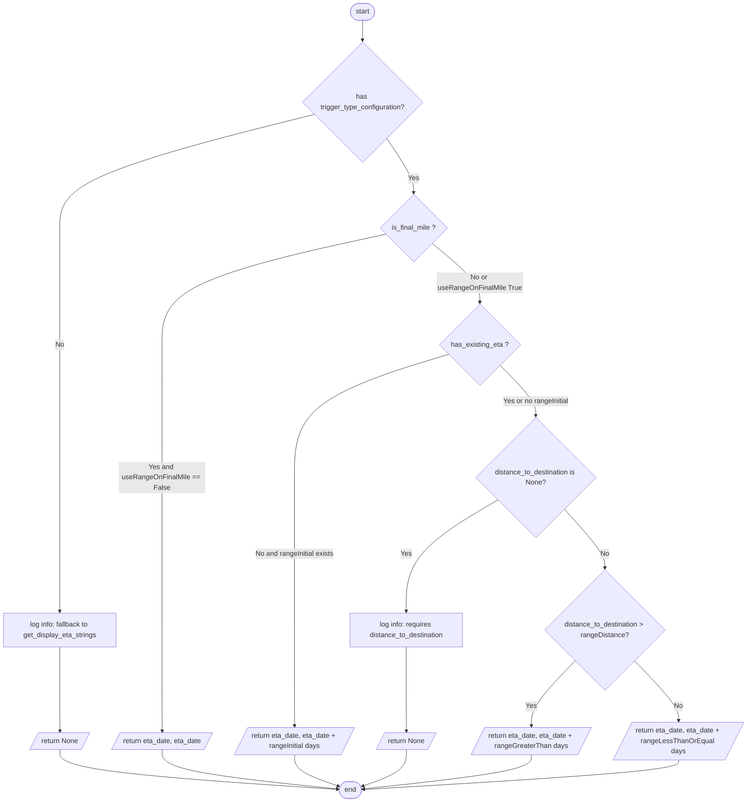

# Diagram: shipment_core/shipment_service/shipment_service/eta/get_eta_range.py


> Auto-generated by Obscura crawlers

## Diagram 1

```mermaid
classDiagram
    class TriggerTypeConfiguration {
        +int? rangeInitial
        +int rangeDistance
        +int rangeGreaterThan
        +int rangeLessThanOrEqual
        +bool? useRangeOnFinalMile
    }
    class EtaDateRangeTriggerConfig {
        +dict trigger_type_configurations
        +_get_trigger_type_for_country(trigger_type, destination_country)
        +get_eta_range(eta_date, trigger_type, destination_country, is_final_mile, has_existing_eta, distance_to_destination)
    }
    class _get_eta_range_trigger_config <<function>> {
        +solution_id -> EtaDateRangeTriggerConfig|None (cached)
    }
    class get_display_eta_strings_based_on_config <<function>> {
        +params(...)
        +-> tuple[str,str]
    }
    class fv_aws_lambdas <<module>>
    class eta_utils <<module>>
    class TTLCache <<class>>
    class cached <<decorator>>
    class BaseModel <<external>>
    class logger <<instance>>

    EtaDateRangeTriggerConfig "1" o-- "many" TriggerTypeConfiguration : contains
    _get_eta_range_trigger_config ..> EtaDateRangeTriggerConfig : returns
    _get_eta_range_trigger_config ..> fv_aws_lambdas : invokes
    get_display_eta_strings_based_on_config ..> _get_eta_range_trigger_config : calls
    get_display_eta_strings_based_on_config ..> eta_utils : calls get_display_eta_strings
    _get_eta_range_trigger_config ..> json : parses
    _get_eta_range_trigger_config ..|> cached : decorated_by
    TriggerTypeConfiguration ..|> BaseModel
    EtaDateRangeTriggerConfig ..|> BaseModel
    *-- logger : logs
```

> SVG rendering failed for this diagram.

## Diagram 2



### SVG

<svg id="container" width="1734.54296875" xmlns="http://www.w3.org/2000/svg" class="flowchart" height="1852.0625" viewBox="0 0 1734.54296875 1852.0625" role="graphics-document document" aria-roledescription="flowchart-v2"><style>#container{font-family:"trebuchet ms",verdana,arial,sans-serif;font-size:16px;fill:#333;}@keyframes edge-animation-frame{from{stroke-dashoffset:0;}}@keyframes dash{to{stroke-dashoffset:0;}}#container .edge-animation-slow{stroke-dasharray:9,5!important;stroke-dashoffset:900;animation:dash 50s linear infinite;stroke-linecap:round;}#container .edge-animation-fast{stroke-dasharray:9,5!important;stroke-dashoffset:900;animation:dash 20s linear infinite;stroke-linecap:round;}#container .error-icon{fill:#552222;}#container .error-text{fill:#552222;stroke:#552222;}#container .edge-thickness-normal{stroke-width:1px;}#container .edge-thickness-thick{stroke-width:3.5px;}#container .edge-pattern-solid{stroke-dasharray:0;}#container .edge-thickness-invisible{stroke-width:0;fill:none;}#container .edge-pattern-dashed{stroke-dasharray:3;}#container .edge-pattern-dotted{stroke-dasharray:2;}#container .marker{fill:#333333;stroke:#333333;}#container .marker.cross{stroke:#333333;}#container svg{font-family:"trebuchet ms",verdana,arial,sans-serif;font-size:16px;}#container p{margin:0;}#container .label{font-family:"trebuchet ms",verdana,arial,sans-serif;color:#333;}#container .cluster-label text{fill:#333;}#container .cluster-label span{color:#333;}#container .cluster-label span p{background-color:transparent;}#container .label text,#container span{fill:#333;color:#333;}#container .node rect,#container .node circle,#container .node ellipse,#container .node polygon,#container .node path{fill:#ECECFF;stroke:#9370DB;stroke-width:1px;}#container .rough-node .label text,#container .node .label text,#container .image-shape .label,#container .icon-shape .label{text-anchor:middle;}#container .node .katex path{fill:#000;stroke:#000;stroke-width:1px;}#container .rough-node .label,#container .node .label,#container .image-shape .label,#container .icon-shape .label{text-align:center;}#container .node.clickable{cursor:pointer;}#container .root .anchor path{fill:#333333!important;stroke-width:0;stroke:#333333;}#container .arrowheadPath{fill:#333333;}#container .edgePath .path{stroke:#333333;stroke-width:2.0px;}#container .flowchart-link{stroke:#333333;fill:none;}#container .edgeLabel{background-color:rgba(232,232,232, 0.8);text-align:center;}#container .edgeLabel p{background-color:rgba(232,232,232, 0.8);}#container .edgeLabel rect{opacity:0.5;background-color:rgba(232,232,232, 0.8);fill:rgba(232,232,232, 0.8);}#container .labelBkg{background-color:rgba(232, 232, 232, 0.5);}#container .cluster rect{fill:#ffffde;stroke:#aaaa33;stroke-width:1px;}#container .cluster text{fill:#333;}#container .cluster span{color:#333;}#container div.mermaidTooltip{position:absolute;text-align:center;max-width:200px;padding:2px;font-family:"trebuchet ms",verdana,arial,sans-serif;font-size:12px;background:hsl(80, 100%, 96.2745098039%);border:1px solid #aaaa33;border-radius:2px;pointer-events:none;z-index:100;}#container .flowchartTitleText{text-anchor:middle;font-size:18px;fill:#333;}#container rect.text{fill:none;stroke-width:0;}#container .icon-shape,#container .image-shape{background-color:rgba(232,232,232, 0.8);text-align:center;}#container .icon-shape p,#container .image-shape p{background-color:rgba(232,232,232, 0.8);padding:2px;}#container .icon-shape rect,#container .image-shape rect{opacity:0.5;background-color:rgba(232,232,232, 0.8);fill:rgba(232,232,232, 0.8);}#container .label-icon{display:inline-block;height:1em;overflow:visible;vertical-align:-0.125em;}#container .node .label-icon path{fill:currentColor;stroke:revert;stroke-width:revert;}#container :root{--mermaid-font-family:"trebuchet ms",verdana,arial,sans-serif;}</style><g><marker id="container_flowchart-v2-pointEnd" class="marker flowchart-v2" viewBox="0 0 10 10" refX="5" refY="5" markerUnits="userSpaceOnUse" markerWidth="8" markerHeight="8" orient="auto"><path d="M 0 0 L 10 5 L 0 10 z" class="arrowMarkerPath" style="stroke-width: 1; stroke-dasharray: 1, 0;"></path></marker><marker id="container_flowchart-v2-pointStart" class="marker flowchart-v2" viewBox="0 0 10 10" refX="4.5" refY="5" markerUnits="userSpaceOnUse" markerWidth="8" markerHeight="8" orient="auto"><path d="M 0 5 L 10 10 L 10 0 z" class="arrowMarkerPath" style="stroke-width: 1; stroke-dasharray: 1, 0;"></path></marker><marker id="container_flowchart-v2-circleEnd" class="marker flowchart-v2" viewBox="0 0 10 10" refX="11" refY="5" markerUnits="userSpaceOnUse" markerWidth="11" markerHeight="11" orient="auto"><circle cx="5" cy="5" r="5" class="arrowMarkerPath" style="stroke-width: 1; stroke-dasharray: 1, 0;"></circle></marker><marker id="container_flowchart-v2-circleStart" class="marker flowchart-v2" viewBox="0 0 10 10" refX="-1" refY="5" markerUnits="userSpaceOnUse" markerWidth="11" markerHeight="11" orient="auto"><circle cx="5" cy="5" r="5" class="arrowMarkerPath" style="stroke-width: 1; stroke-dasharray: 1, 0;"></circle></marker><marker id="container_flowchart-v2-crossEnd" class="marker cross flowchart-v2" viewBox="0 0 11 11" refX="12" refY="5.2" markerUnits="userSpaceOnUse" markerWidth="11" markerHeight="11" orient="auto"><path d="M 1,1 l 9,9 M 10,1 l -9,9" class="arrowMarkerPath" style="stroke-width: 2; stroke-dasharray: 1, 0;"></path></marker><marker id="container_flowchart-v2-crossStart" class="marker cross flowchart-v2" viewBox="0 0 11 11" refX="-1" refY="5.2" markerUnits="userSpaceOnUse" markerWidth="11" markerHeight="11" orient="auto"><path d="M 1,1 l 9,9 M 10,1 l -9,9" class="arrowMarkerPath" style="stroke-width: 2; stroke-dasharray: 1, 0;"></path></marker><g class="root"><g class="clusters"></g><g class="edgePaths"><path d="M842.48,47.5L842.397,51.583C842.314,55.667,842.147,63.833,842.064,71.417C841.98,79,841.98,86,841.98,89.5L841.98,93" id="L_Start_CheckConfig_0" class="edge-thickness-normal edge-pattern-solid edge-thickness-normal edge-pattern-solid flowchart-link" style=";" data-edge="true" data-et="edge" data-id="L_Start_CheckConfig_0" data-points="W3sieCI6ODQyLjQ4MDQ2ODc1LCJ5Ijo0Ny41fSx7IngiOjg0MS45ODA0Njg3NSwieSI6NzJ9LHsieCI6ODQxLjk4MDQ2ODc1LCJ5Ijo5N31d" marker-end="url(#container_flowchart-v2-pointEnd)"></path><path d="M730.781,263.801L631.984,288.501C533.187,313.2,335.594,362.6,236.797,406.545C138,450.49,138,488.979,138,529.469C138,569.958,138,612.448,138,657.37C138,702.292,138,749.646,138,795C138,840.354,138,883.708,138,934.719C138,985.729,138,1044.396,138,1103.063C138,1161.729,138,1220.396,138,1271.896C138,1323.396,138,1367.729,138,1389.896L138,1412.063" id="L_CheckConfig_LogNotFound_0" class="edge-thickness-normal edge-pattern-solid edge-thickness-normal edge-pattern-solid flowchart-link" style=";" data-edge="true" data-et="edge" data-id="L_CheckConfig_LogNotFound_0" data-points="W3sieCI6NzMwLjc4MTA4NTc3MzYzNzgsInkiOjI2My44MDA2MTcwMjM2Mzc3Nn0seyJ4IjoxMzgsInkiOjQxMn0seyJ4IjoxMzgsInkiOjUyNy40Njg3NX0seyJ4IjoxMzgsInkiOjY1NC45Mzc1fSx7IngiOjEzOCwieSI6Nzk3fSx7IngiOjEzOCwieSI6OTI3LjA2MjV9LHsieCI6MTM4LCJ5IjoxMTAzLjA2MjV9LHsieCI6MTM4LCJ5IjoxMjc5LjA2MjV9LHsieCI6MTM4LCJ5IjoxNDE2LjA2MjV9XQ==" marker-end="url(#container_flowchart-v2-pointEnd)"></path><path d="M138,1494.063L138,1516.896C138,1539.729,138,1585.396,138.078,1617.813C138.156,1650.229,138.312,1669.396,138.39,1678.979L138.467,1688.563" id="L_LogNotFound_ReturnNone1_0" class="edge-thickness-normal edge-pattern-solid edge-thickness-normal edge-pattern-solid flowchart-link" style=";" data-edge="true" data-et="edge" data-id="L_LogNotFound_ReturnNone1_0" data-points="W3sieCI6MTM4LCJ5IjoxNDk0LjA2MjV9LHsieCI6MTM4LCJ5IjoxNjMxLjA2MjV9LHsieCI6MTM4LjUsInkiOjE2OTIuNTYyNX1d" marker-end="url(#container_flowchart-v2-pointEnd)"></path><path d="M898.341,318.64L908.952,334.2C919.564,349.76,940.788,380.88,951.4,401.94C962.012,423,962.012,434,962.012,439.5L962.012,445" id="L_CheckConfig_IsFinalMile_0" class="edge-thickness-normal edge-pattern-solid edge-thickness-normal edge-pattern-solid flowchart-link" style=";" data-edge="true" data-et="edge" data-id="L_CheckConfig_IsFinalMile_0" data-points="W3sieCI6ODk4LjM0MDU0NDc1NTQ4OTMsInkiOjMxOC42Mzk5MjM5OTQ1MTA3fSx7IngiOjk2Mi4wMTE3MTg3NSwieSI6NDEyfSx7IngiOjk2Mi4wMTE3MTg3NSwieSI6NDQ5fV0=" marker-end="url(#container_flowchart-v2-pointEnd)"></path><path d="M897.603,541.528L811.013,560.43C724.423,579.331,551.243,617.134,464.653,659.713C378.063,702.292,378.063,749.646,378.063,795C378.063,840.354,378.063,883.708,378.063,934.719C378.063,985.729,378.063,1044.396,378.063,1103.063C378.063,1161.729,378.063,1220.396,378.063,1279.063C378.063,1337.729,378.063,1396.396,378.063,1455.063C378.063,1513.729,378.063,1572.396,378.14,1611.313C378.218,1650.229,378.374,1669.396,378.452,1678.979L378.53,1688.563" id="L_IsFinalMile_ReturnExact1_0" class="edge-thickness-normal edge-pattern-solid edge-thickness-normal edge-pattern-solid flowchart-link" style=";" data-edge="true" data-et="edge" data-id="L_IsFinalMile_ReturnExact1_0" data-points="W3sieCI6ODk3LjYwMjY1NTA2MDg5OTgsInkiOjU0MS41Mjg0MzYzMTA4OTk4fSx7IngiOjM3OC4wNjI1LCJ5Ijo2NTQuOTM3NX0seyJ4IjozNzguMDYyNSwieSI6Nzk3fSx7IngiOjM3OC4wNjI1LCJ5Ijo5MjcuMDYyNX0seyJ4IjozNzguMDYyNSwieSI6MTEwMy4wNjI1fSx7IngiOjM3OC4wNjI1LCJ5IjoxMjc5LjA2MjV9LHsieCI6Mzc4LjA2MjUsInkiOjE0NTUuMDYyNX0seyJ4IjozNzguMDYyNSwieSI6MTYzMS4wNjI1fSx7IngiOjM3OC41NjI1LCJ5IjoxNjkyLjU2MjV9XQ==" marker-end="url(#container_flowchart-v2-pointEnd)"></path><path d="M1004.959,562.991L1023.486,578.315C1042.014,593.64,1079.07,624.289,1097.597,647.113C1116.125,669.938,1116.125,684.938,1116.125,692.438L1116.125,699.938" id="L_IsFinalMile_HasExistingETA_0" class="edge-thickness-normal edge-pattern-solid edge-thickness-normal edge-pattern-solid flowchart-link" style=";" data-edge="true" data-et="edge" data-id="L_IsFinalMile_HasExistingETA_0" data-points="W3sieCI6MTAwNC45NTg2MjMwMTIzMjkyLCJ5Ijo1NjIuOTkwNTk1NzM3NjcwOH0seyJ4IjoxMTE2LjEyNSwieSI6NjU0LjkzNzV9LHsieCI6MTExNi4xMjUsInkiOjcwMy45Mzc1fV0=" marker-end="url(#container_flowchart-v2-pointEnd)"></path><path d="M1044.681,818.618L984.949,836.692C925.217,854.766,805.753,890.914,746.021,938.322C686.289,985.729,686.289,1044.396,686.289,1103.063C686.289,1161.729,686.289,1220.396,686.289,1279.063C686.289,1337.729,686.289,1396.396,686.289,1455.063C686.289,1513.729,686.289,1572.396,686.366,1609.313C686.442,1646.229,686.595,1661.396,686.672,1668.979L686.749,1676.563" id="L_HasExistingETA_ReturnInitialRange_0" class="edge-thickness-normal edge-pattern-solid edge-thickness-normal edge-pattern-solid flowchart-link" style=";" data-edge="true" data-et="edge" data-id="L_HasExistingETA_ReturnInitialRange_0" data-points="W3sieCI6MTA0NC42ODA2MDE3NzYyNzA4LCJ5Ijo4MTguNjE4MTAxNzc2MjcwOH0seyJ4Ijo2ODYuMjg5MDYyNSwieSI6OTI3LjA2MjV9LHsieCI6Njg2LjI4OTA2MjUsInkiOjExMDMuMDYyNX0seyJ4Ijo2ODYuMjg5MDYyNSwieSI6MTI3OS4wNjI1fSx7IngiOjY4Ni4yODkwNjI1LCJ5IjoxNDU1LjA2MjV9LHsieCI6Njg2LjI4OTA2MjUsInkiOjE2MzEuMDYyNX0seyJ4Ijo2ODYuNzg5MDYyNSwieSI6MTY4MC41NjI1fV0=" marker-end="url(#container_flowchart-v2-pointEnd)"></path><path d="M1162.63,843.557L1176.532,857.475C1190.435,871.392,1218.239,899.227,1232.141,918.645C1246.043,938.063,1246.043,949.063,1246.043,954.563L1246.043,960.063" id="L_HasExistingETA_DistKnown_0" class="edge-thickness-normal edge-pattern-solid edge-thickness-normal edge-pattern-solid flowchart-link" style=";" data-edge="true" data-et="edge" data-id="L_HasExistingETA_DistKnown_0" data-points="W3sieCI6MTE2Mi42MzAzODE4MjcwNjAzLCJ5Ijo4NDMuNTU3MTE4MTcyOTM5N30seyJ4IjoxMjQ2LjA0Mjk2ODc1LCJ5Ijo5MjcuMDYyNX0seyJ4IjoxMjQ2LjA0Mjk2ODc1LCJ5Ijo5NjQuMDYyNX1d" marker-end="url(#container_flowchart-v2-pointEnd)"></path><path d="M1158.447,1154.466L1123.06,1175.232C1087.673,1195.998,1016.899,1237.53,981.512,1280.463C946.125,1323.396,946.125,1367.729,946.125,1389.896L946.125,1412.063" id="L_DistKnown_LogDistanceMissing_0" class="edge-thickness-normal edge-pattern-solid edge-thickness-normal edge-pattern-solid flowchart-link" style=";" data-edge="true" data-et="edge" data-id="L_DistKnown_LogDistanceMissing_0" data-points="W3sieCI6MTE1OC40NDY3ODUzODcyNTUyLCJ5IjoxMTU0LjQ2NjMxNjYzNzI1NTJ9LHsieCI6OTQ2LjEyNSwieSI6MTI3OS4wNjI1fSx7IngiOjk0Ni4xMjUsInkiOjE0MTYuMDYyNX1d" marker-end="url(#container_flowchart-v2-pointEnd)"></path><path d="M946.125,1494.063L946.125,1516.896C946.125,1539.729,946.125,1585.396,946.203,1617.813C946.281,1650.229,946.437,1669.396,946.515,1678.979L946.592,1688.563" id="L_LogDistanceMissing_ReturnNone2_0" class="edge-thickness-normal edge-pattern-solid edge-thickness-normal edge-pattern-solid flowchart-link" style=";" data-edge="true" data-et="edge" data-id="L_LogDistanceMissing_ReturnNone2_0" data-points="W3sieCI6OTQ2LjEyNSwieSI6MTQ5NC4wNjI1fSx7IngiOjk0Ni4xMjUsInkiOjE2MzEuMDYyNX0seyJ4Ijo5NDYuNjI1LCJ5IjoxNjkyLjU2MjV9XQ==" marker-end="url(#container_flowchart-v2-pointEnd)"></path><path d="M1312.125,1175.981L1327.695,1193.161C1343.264,1210.341,1374.404,1244.702,1389.973,1267.382C1405.543,1290.063,1405.543,1301.063,1405.543,1306.563L1405.543,1312.063" id="L_DistKnown_CompareDistance_0" class="edge-thickness-normal edge-pattern-solid edge-thickness-normal edge-pattern-solid flowchart-link" style=";" data-edge="true" data-et="edge" data-id="L_DistKnown_CompareDistance_0" data-points="W3sieCI6MTMxMi4xMjQ5MzU5NjMxMTQ3LCJ5IjoxMTc1Ljk4MDUzMjc4Njg4NTN9LHsieCI6MTQwNS41NDI5Njg3NSwieSI6MTI3OS4wNjI1fSx7IngiOjE0MDUuNTQyOTY4NzUsInkiOjEzMTYuMDYyNX1d" marker-end="url(#container_flowchart-v2-pointEnd)"></path><path d="M1337.248,1525.768L1320.297,1543.317C1303.346,1560.866,1269.445,1595.964,1252.57,1621.097C1235.696,1646.229,1235.849,1661.396,1235.926,1668.979L1236.003,1676.563" id="L_CompareDistance_ReturnGreater_0" class="edge-thickness-normal edge-pattern-solid edge-thickness-normal edge-pattern-solid flowchart-link" style=";" data-edge="true" data-et="edge" data-id="L_CompareDistance_ReturnGreater_0" data-points="W3sieCI6MTMzNy4yNDgxNzEwNjIxMzg3LCJ5IjoxNTI1Ljc2NzcwMjMxMjEzODd9LHsieCI6MTIzNS41NDI5Njg3NSwieSI6MTYzMS4wNjI1fSx7IngiOjEyMzYuMDQyOTY4NzUsInkiOjE2ODAuNTYyNX1d" marker-end="url(#container_flowchart-v2-pointEnd)"></path><path d="M1473.838,1525.768L1490.789,1543.317C1507.74,1560.866,1541.641,1595.964,1558.667,1619.097C1575.692,1642.229,1575.841,1653.396,1575.915,1658.979L1575.99,1664.563" id="L_CompareDistance_ReturnLessEqual_0" class="edge-thickness-normal edge-pattern-solid edge-thickness-normal edge-pattern-solid flowchart-link" style=";" data-edge="true" data-et="edge" data-id="L_CompareDistance_ReturnLessEqual_0" data-points="W3sieCI6MTQ3My44Mzc3NjY0Mzc4NjEzLCJ5IjoxNTI1Ljc2NzcwMjMxMjEzODd9LHsieCI6MTU3NS41NDI5Njg3NSwieSI6MTYzMS4wNjI1fSx7IngiOjE1NzYuMDQyOTY4NzUsInkiOjE2NjguNTYyNX1d" marker-end="url(#container_flowchart-v2-pointEnd)"></path><path d="M378.563,1731.563L378.479,1739.646C378.396,1747.729,378.229,1763.896,446.253,1778.971C514.277,1794.045,650.492,1808.028,718.599,1815.02L786.706,1822.011" id="L_ReturnExact1_End_0" class="edge-thickness-normal edge-pattern-solid edge-thickness-normal edge-pattern-solid flowchart-link" style=";" data-edge="true" data-et="edge" data-id="L_ReturnExact1_End_0" data-points="W3sieCI6Mzc4LjU2MjUsInkiOjE3MzEuNTYyNX0seyJ4IjozNzguMDYyNSwieSI6MTc4MC4wNjI1fSx7IngiOjc5MC42ODU1MzU2MjI3NDc2LCJ5IjoxODIyLjQxOTYzNTY2NDU1MX1d" marker-end="url(#container_flowchart-v2-pointEnd)"></path><path d="M686.789,1743.563L686.706,1749.646C686.622,1755.729,686.456,1767.896,703.424,1779.872C720.392,1791.849,754.494,1803.636,771.545,1809.529L788.597,1815.422" id="L_ReturnInitialRange_End_0" class="edge-thickness-normal edge-pattern-solid edge-thickness-normal edge-pattern-solid flowchart-link" style=";" data-edge="true" data-et="edge" data-id="L_ReturnInitialRange_End_0" data-points="W3sieCI6Njg2Ljc4OTA2MjUsInkiOjE3NDMuNTYyNX0seyJ4Ijo2ODYuMjg5MDYyNSwieSI6MTc4MC4wNjI1fSx7IngiOjc5Mi4zNzcwODk5NjgwMjA5LCJ5IjoxODE2LjcyODkxNTM3Mzc1NDN9XQ==" marker-end="url(#container_flowchart-v2-pointEnd)"></path><path d="M138.5,1731.563L138.417,1739.646C138.333,1747.729,138.167,1763.896,246.181,1779.149C354.195,1794.403,570.39,1808.743,678.487,1815.913L786.585,1823.083" id="L_ReturnNone1_End_0" class="edge-thickness-normal edge-pattern-solid edge-thickness-normal edge-pattern-solid flowchart-link" style=";" data-edge="true" data-et="edge" data-id="L_ReturnNone1_End_0" data-points="W3sieCI6MTM4LjUsInkiOjE3MzEuNTYyNX0seyJ4IjoxMzgsInkiOjE3ODAuMDYyNX0seyJ4Ijo3OTAuNTc2MDY0ODgzNzkxMSwieSI6MTgyMy4zNDc5MzgwMDA5MTF9XQ==" marker-end="url(#container_flowchart-v2-pointEnd)"></path><path d="M946.625,1731.563L946.542,1739.646C946.458,1747.729,946.292,1763.896,929.323,1777.871C912.355,1791.845,878.584,1803.628,861.699,1809.52L844.814,1815.411" id="L_ReturnNone2_End_0" class="edge-thickness-normal edge-pattern-solid edge-thickness-normal edge-pattern-solid flowchart-link" style=";" data-edge="true" data-et="edge" data-id="L_ReturnNone2_End_0" data-points="W3sieCI6OTQ2LjYyNSwieSI6MTczMS41NjI1fSx7IngiOjk0Ni4xMjUsInkiOjE3ODAuMDYyNX0seyJ4Ijo4NDEuMDM2OTczNDIxNzI1OSwieSI6MTgxNi43Mjg5MTUwNjg5OTQ5fV0=" marker-end="url(#container_flowchart-v2-pointEnd)"></path><path d="M1236.043,1743.563L1235.96,1749.646C1235.876,1755.729,1235.71,1767.896,1170.818,1780.948C1105.925,1794,976.308,1807.938,911.499,1814.906L846.691,1821.875" id="L_ReturnGreater_End_0" class="edge-thickness-normal edge-pattern-solid edge-thickness-normal edge-pattern-solid flowchart-link" style=";" data-edge="true" data-et="edge" data-id="L_ReturnGreater_End_0" data-points="W3sieCI6MTIzNi4wNDI5Njg3NSwieSI6MTc0My41NjI1fSx7IngiOjEyMzUuNTQyOTY4NzUsInkiOjE3ODAuMDYyNX0seyJ4Ijo4NDIuNzEzNDUwMDE3NzA1NCwieSI6MTgyMi4zMDI2OTQ0Nzk3MjMyfV0=" marker-end="url(#container_flowchart-v2-pointEnd)"></path><path d="M1576.043,1755.563L1575.96,1759.646C1575.876,1763.729,1575.71,1771.896,1454.176,1783.184C1332.643,1794.473,1089.743,1808.883,968.293,1816.088L846.843,1823.294" id="L_ReturnLessEqual_End_0" class="edge-thickness-normal edge-pattern-solid edge-thickness-normal edge-pattern-solid flowchart-link" style=";" data-edge="true" data-et="edge" data-id="L_ReturnLessEqual_End_0" data-points="W3sieCI6MTU3Ni4wNDI5Njg3NSwieSI6MTc1NS41NjI1fSx7IngiOjE1NzUuNTQyOTY4NzUsInkiOjE3ODAuMDYyNX0seyJ4Ijo4NDIuODQ5NzE1NTY1NTUsInkiOjE4MjMuNTMwNDM4MzcyNzQxNH1d" marker-end="url(#container_flowchart-v2-pointEnd)"></path></g><g class="edgeLabels"><g class="edgeLabel"><g class="label" data-id="L_Start_CheckConfig_0" transform="translate(0, 0)"><foreignObject width="0" height="0"><div xmlns="http://www.w3.org/1999/xhtml" class="labelBkg" style="display: table-cell; white-space: nowrap; line-height: 1.5; max-width: 200px; text-align: center;"><span class="edgeLabel"></span></div></foreignObject></g></g><g class="edgeLabel" transform="translate(138, 797)"><g class="label" data-id="L_CheckConfig_LogNotFound_0" transform="translate(-10.140625, -12)"><foreignObject width="20.28125" height="24"><div xmlns="http://www.w3.org/1999/xhtml" class="labelBkg" style="display: table-cell; white-space: nowrap; line-height: 1.5; max-width: 200px; text-align: center;"><span class="edgeLabel"><p>No</p></span></div></foreignObject></g></g><g class="edgeLabel"><g class="label" data-id="L_LogNotFound_ReturnNone1_0" transform="translate(0, 0)"><foreignObject width="0" height="0"><div xmlns="http://www.w3.org/1999/xhtml" class="labelBkg" style="display: table-cell; white-space: nowrap; line-height: 1.5; max-width: 200px; text-align: center;"><span class="edgeLabel"></span></div></foreignObject></g></g><g class="edgeLabel" transform="translate(962.01171875, 412)"><g class="label" data-id="L_CheckConfig_IsFinalMile_0" transform="translate(-12.03125, -12)"><foreignObject width="24.0625" height="24"><div xmlns="http://www.w3.org/1999/xhtml" class="labelBkg" style="display: table-cell; white-space: nowrap; line-height: 1.5; max-width: 200px; text-align: center;"><span class="edgeLabel"><p>Yes</p></span></div></foreignObject></g></g><g class="edgeLabel" transform="translate(378.0625, 1103.0625)"><g class="label" data-id="L_IsFinalMile_ReturnExact1_0" transform="translate(-100, -36)"><foreignObject width="200" height="72"><div xmlns="http://www.w3.org/1999/xhtml" class="labelBkg" style="display: table; white-space: break-spaces; line-height: 1.5; max-width: 200px; text-align: center; width: 200px;"><span class="edgeLabel"><p>Yes and useRangeOnFinalMile == False</p></span></div></foreignObject></g></g><g class="edgeLabel" transform="translate(1116.125, 654.9375)"><g class="label" data-id="L_IsFinalMile_HasExistingETA_0" transform="translate(-100, -24)"><foreignObject width="200" height="48"><div xmlns="http://www.w3.org/1999/xhtml" class="labelBkg" style="display: table; white-space: break-spaces; line-height: 1.5; max-width: 200px; text-align: center; width: 200px;"><span class="edgeLabel"><p>No or useRangeOnFinalMile True</p></span></div></foreignObject></g></g><g class="edgeLabel" transform="translate(686.2890625, 1279.0625)"><g class="label" data-id="L_HasExistingETA_ReturnInitialRange_0" transform="translate(-92.4140625, -12)"><foreignObject width="184.828125" height="24"><div xmlns="http://www.w3.org/1999/xhtml" class="labelBkg" style="display: table-cell; white-space: nowrap; line-height: 1.5; max-width: 200px; text-align: center;"><span class="edgeLabel"><p>No and rangeInitial exists</p></span></div></foreignObject></g></g><g class="edgeLabel" transform="translate(1246.04296875, 927.0625)"><g class="label" data-id="L_HasExistingETA_DistKnown_0" transform="translate(-76.8125, -12)"><foreignObject width="153.625" height="24"><div xmlns="http://www.w3.org/1999/xhtml" class="labelBkg" style="display: table-cell; white-space: nowrap; line-height: 1.5; max-width: 200px; text-align: center;"><span class="edgeLabel"><p>Yes or no rangeInitial</p></span></div></foreignObject></g></g><g class="edgeLabel" transform="translate(946.125, 1279.0625)"><g class="label" data-id="L_DistKnown_LogDistanceMissing_0" transform="translate(-12.03125, -12)"><foreignObject width="24.0625" height="24"><div xmlns="http://www.w3.org/1999/xhtml" class="labelBkg" style="display: table-cell; white-space: nowrap; line-height: 1.5; max-width: 200px; text-align: center;"><span class="edgeLabel"><p>Yes</p></span></div></foreignObject></g></g><g class="edgeLabel"><g class="label" data-id="L_LogDistanceMissing_ReturnNone2_0" transform="translate(0, 0)"><foreignObject width="0" height="0"><div xmlns="http://www.w3.org/1999/xhtml" class="labelBkg" style="display: table-cell; white-space: nowrap; line-height: 1.5; max-width: 200px; text-align: center;"><span class="edgeLabel"></span></div></foreignObject></g></g><g class="edgeLabel" transform="translate(1405.54296875, 1279.0625)"><g class="label" data-id="L_DistKnown_CompareDistance_0" transform="translate(-10.140625, -12)"><foreignObject width="20.28125" height="24"><div xmlns="http://www.w3.org/1999/xhtml" class="labelBkg" style="display: table-cell; white-space: nowrap; line-height: 1.5; max-width: 200px; text-align: center;"><span class="edgeLabel"><p>No</p></span></div></foreignObject></g></g><g class="edgeLabel" transform="translate(1235.54296875, 1631.0625)"><g class="label" data-id="L_CompareDistance_ReturnGreater_0" transform="translate(-12.03125, -12)"><foreignObject width="24.0625" height="24"><div xmlns="http://www.w3.org/1999/xhtml" class="labelBkg" style="display: table-cell; white-space: nowrap; line-height: 1.5; max-width: 200px; text-align: center;"><span class="edgeLabel"><p>Yes</p></span></div></foreignObject></g></g><g class="edgeLabel" transform="translate(1575.54296875, 1631.0625)"><g class="label" data-id="L_CompareDistance_ReturnLessEqual_0" transform="translate(-10.140625, -12)"><foreignObject width="20.28125" height="24"><div xmlns="http://www.w3.org/1999/xhtml" class="labelBkg" style="display: table-cell; white-space: nowrap; line-height: 1.5; max-width: 200px; text-align: center;"><span class="edgeLabel"><p>No</p></span></div></foreignObject></g></g><g class="edgeLabel"><g class="label" data-id="L_ReturnExact1_End_0" transform="translate(0, 0)"><foreignObject width="0" height="0"><div xmlns="http://www.w3.org/1999/xhtml" class="labelBkg" style="display: table-cell; white-space: nowrap; line-height: 1.5; max-width: 200px; text-align: center;"><span class="edgeLabel"></span></div></foreignObject></g></g><g class="edgeLabel"><g class="label" data-id="L_ReturnInitialRange_End_0" transform="translate(0, 0)"><foreignObject width="0" height="0"><div xmlns="http://www.w3.org/1999/xhtml" class="labelBkg" style="display: table-cell; white-space: nowrap; line-height: 1.5; max-width: 200px; text-align: center;"><span class="edgeLabel"></span></div></foreignObject></g></g><g class="edgeLabel"><g class="label" data-id="L_ReturnNone1_End_0" transform="translate(0, 0)"><foreignObject width="0" height="0"><div xmlns="http://www.w3.org/1999/xhtml" class="labelBkg" style="display: table-cell; white-space: nowrap; line-height: 1.5; max-width: 200px; text-align: center;"><span class="edgeLabel"></span></div></foreignObject></g></g><g class="edgeLabel"><g class="label" data-id="L_ReturnNone2_End_0" transform="translate(0, 0)"><foreignObject width="0" height="0"><div xmlns="http://www.w3.org/1999/xhtml" class="labelBkg" style="display: table-cell; white-space: nowrap; line-height: 1.5; max-width: 200px; text-align: center;"><span class="edgeLabel"></span></div></foreignObject></g></g><g class="edgeLabel"><g class="label" data-id="L_ReturnGreater_End_0" transform="translate(0, 0)"><foreignObject width="0" height="0"><div xmlns="http://www.w3.org/1999/xhtml" class="labelBkg" style="display: table-cell; white-space: nowrap; line-height: 1.5; max-width: 200px; text-align: center;"><span class="edgeLabel"></span></div></foreignObject></g></g><g class="edgeLabel"><g class="label" data-id="L_ReturnLessEqual_End_0" transform="translate(0, 0)"><foreignObject width="0" height="0"><div xmlns="http://www.w3.org/1999/xhtml" class="labelBkg" style="display: table-cell; white-space: nowrap; line-height: 1.5; max-width: 200px; text-align: center;"><span class="edgeLabel"></span></div></foreignObject></g></g></g><g class="nodes"><g class="node default" id="flowchart-Start-0" transform="translate(841.98046875, 27.5)"><g class="basic label-container outer-path"><path d="M-9.7734375 -19.5 C-2.181319994154074 -19.5, 5.410797511691852 -19.5, 9.7734375 -19.5 C9.7734375 -19.5, 9.7734375 -19.5, 9.773437499999998 -19.5 C10.115073666540312 -19.48904439309351, 10.456709833080623 -19.47808878618702, 11.0228067896239 -19.45993515863156 C11.503443305324922 -19.413568732011864, 11.984079821025942 -19.367202305392166, 12.267042152847864 -19.3399052695533 C12.63225055734339 -19.28086120694794, 12.997458961838914 -19.22181714434258, 13.501030759676757 -19.140403561325776 C13.93827414435928 -19.040605612051728, 14.375517529041801 -18.94080766277768, 14.71970188623539 -18.862249829261074 C15.159019360221896 -18.731862709006357, 15.598336834208402 -18.601475588751644, 15.918047751460602 -18.50658706670804 C16.31844074936415 -18.359238742287236, 16.7188337472677 -18.211890417866428, 17.091144095147794 -18.074876768247425 C17.407465470395753 -17.934850678765358, 17.723786845643712 -17.794824589283294, 18.23417041279238 -17.568892924097174 C18.550608421906105 -17.403807417430762, 18.86704643101983 -17.23872191076435, 19.342429764076783 -16.990714730406097 C19.63504183252537 -16.813331574933176, 19.92765390097396 -16.635948419460256, 20.411368073605697 -16.342718045390892 C20.780815731020805 -16.08500735270944, 21.150263388435913 -15.827296660027985, 21.436592844578712 -15.627565626425154 C21.63824680207923 -15.466751961555667, 21.83990075957975 -15.305938296686179, 22.41389120850187 -14.848196188198123 C22.653263625454493 -14.63080449256884, 22.89263604240712 -14.413412796939557, 23.339247236767985 -14.007812326905688 C23.560619227746688 -13.779227571241709, 23.78199121872539 -13.550642815577728, 24.208858442968648 -13.10986736009568 C24.489375156773697 -12.780356466207076, 24.76989187057875 -12.450845572318471, 25.019151408126582 -12.158051136245305 C25.180227544863858 -11.942223787355294, 25.34130368160113 -11.726396438465283, 25.766796464640635 -11.156274872382312 C26.032742956604164 -10.74770964409397, 26.29868944856769 -10.33914441580563, 26.448721378604247 -10.108655082055241 C26.67401478392129 -9.708623827483741, 26.899308189238333 -9.30859257291224, 27.0621239742735 -9.019496659696287 C27.186381971549697 -8.761472269657038, 27.310639968825896 -8.503447879617786, 27.60448364880834 -7.893275190886684 C27.756126806547908 -7.518713659448947, 27.90776996428748 -7.144152128011211, 28.073571729970325 -6.734618561215508 C28.164624203331922 -6.460383018691887, 28.25567667669352 -6.186147476168266, 28.46746063421488 -5.548287939305138 C28.566039070255066 -5.1723656385194685, 28.664617506295254 -4.796443337733798, 28.78453178754556 -4.339158212148133 C28.86664467532814 -3.917525887949568, 28.948757563110718 -3.495893563751003, 29.023482276581777 -3.1121979531509023 C29.07956849326848 -2.6772043320050445, 29.135654709955183 -2.2422107108591867, 29.183330202509367 -1.872449005199798 C29.205743914288433 -1.523337352218327, 29.2281576260675 -1.1742256992368558, 29.263418715913414 -0.6250057626472757 C29.263418715913414 -0.27481693170825355, 29.263418715913414 0.07537189923076859, 29.263418715913414 0.625005762647271 C29.244169768423298 0.9248236572765787, 29.224920820933182 1.2246415519058862, 29.183330202509367 1.8724490051997846 C29.132649320202155 2.2655199203023115, 29.081968437894947 2.658590835404838, 29.023482276581777 3.1121979531508885 C28.96293232331263 3.4231091659508137, 28.90238237004348 3.7340203787507384, 28.78453178754556 4.339158212148129 C28.66938426112525 4.778265635642414, 28.554236734704936 5.217373059136699, 28.467460634214884 5.548287939305125 C28.311133996654483 6.019118864369827, 28.154807359094086 6.489949789434528, 28.07357172997033 6.734618561215495 C27.88835201582556 7.192114836132637, 27.70313230168079 7.64961111104978, 27.604483648808344 7.893275190886679 C27.38900046444515 8.34073063381839, 27.17351728008196 8.788186076750103, 27.062123974273504 9.019496659696284 C26.91184422542156 9.28633357125761, 26.761564476569614 9.553170482818935, 26.44872137860425 10.108655082055236 C26.18999719224841 10.506124909469564, 25.93127300589257 10.90359473688389, 25.76679646464064 11.156274872382301 C25.472835812574363 11.550155365784788, 25.178875160508085 11.944035859187274, 25.019151408126582 12.158051136245302 C24.84453374962532 12.363166973947129, 24.66991609112406 12.568282811648956, 24.20885844296866 13.10986736009567 C24.003671295703185 13.321739935825358, 23.798484148437712 13.533612511555047, 23.33924723676799 14.007812326905684 C23.02162352580369 14.296269777340585, 22.703999814839392 14.584727227775488, 22.413891208501887 14.848196188198111 C22.04249991639099 15.144370860519203, 21.67110862428009 15.440545532840297, 21.436592844578715 15.627565626425152 C21.222415993133975 15.776966126426537, 21.008239141689234 15.92636662642792, 20.411368073605708 16.34271804539089 C20.137141616009313 16.508955735519365, 19.862915158412918 16.67519342564784, 19.342429764076787 16.990714730406093 C19.094828986735045 17.11988789734941, 18.847228209393307 17.249061064292732, 18.234170412792388 17.56889292409717 C17.944498063936464 17.69712228011076, 17.654825715080538 17.825351636124356, 17.091144095147804 18.07487676824742 C16.811677758548786 18.177722963474356, 16.532211421949768 18.28056915870129, 15.918047751460616 18.506587066708033 C15.646487913039115 18.587184601304855, 15.374928074617612 18.66778213590168, 14.719701886235413 18.86224982926107 C14.434758615447127 18.92728627138988, 14.14981534465884 18.992322713518693, 13.501030759676766 19.140403561325773 C13.179213406774842 19.19243249521211, 12.85739605387292 19.244461429098447, 12.267042152847878 19.3399052695533 C11.986379193245732 19.366980487719523, 11.705716233643587 19.394055705885748, 11.0228067896239 19.45993515863156 C10.740946021216676 19.468973884865676, 10.459085252809452 19.478012611099793, 9.773437500000004 19.5 C9.773437500000004 19.5, 9.773437500000002 19.5, 9.7734375 19.5 C3.624652973157402 19.5, -2.524131553685196 19.5, -9.773437499999996 19.5 C-10.162102371582774 19.48753627405862, -10.550767243165552 19.47507254811724, -11.022806789623893 19.45993515863156 C-11.48426575395647 19.415418767327996, -11.945724718289046 19.370902376024436, -12.267042152847871 19.3399052695533 C-12.71413082126515 19.267623440868, -13.161219489682427 19.1953416121827, -13.501030759676759 19.140403561325773 C-13.89358734455199 19.050805082499117, -14.286143929427224 18.961206603672466, -14.719701886235388 18.862249829261074 C-15.0583299472788 18.761746798238356, -15.39695800832221 18.661243767215637, -15.918047751460593 18.506587066708043 C-16.208430506562724 18.399723528561697, -16.498813261664854 18.29285999041535, -17.091144095147797 18.074876768247425 C-17.374382156601825 17.949495680400297, -17.65762021805585 17.824114592553173, -18.23417041279238 17.568892924097174 C-18.52623395955568 17.41652355882639, -18.818297506318977 17.26415419355561, -19.34242976407678 16.990714730406097 C-19.670301062121037 16.79195722274605, -19.9981723601653 16.593199715086, -20.411368073605686 16.3427180453909 C-20.662515010422755 16.16752881424298, -20.913661947239824 15.992339583095067, -21.436592844578712 15.627565626425156 C-21.68572869986025 15.428886411621672, -21.934864555141786 15.23020719681819, -22.41389120850187 14.848196188198125 C-22.622041523160206 14.659159579780955, -22.830191837818543 14.470122971363786, -23.339247236767974 14.007812326905697 C-23.604698078903112 13.733712538481715, -23.870148921038254 13.459612750057735, -24.208858442968655 13.109867360095677 C-24.532485189126533 12.729716969175106, -24.85611193528441 12.349566578254537, -25.01915140812658 12.158051136245307 C-25.31071376589498 11.76738413871287, -25.602276123663383 11.376717141180436, -25.766796464640635 11.156274872382316 C-25.927035026721263 10.910105410947772, -26.087273588801892 10.663935949513226, -26.448721378604244 10.108655082055249 C-26.625058830229882 9.795550080590699, -26.801396281855524 9.48244507912615, -27.0621239742735 9.019496659696289 C-27.216263102267387 8.699423462367982, -27.370402230261274 8.379350265039673, -27.60448364880834 7.893275190886686 C-27.744543470634262 7.547324723104217, -27.884603292460188 7.201374255321748, -28.073571729970325 6.73461856121551 C-28.20066730378833 6.351826942805373, -28.327762877606332 5.969035324395238, -28.46746063421488 5.5482879393051325 C-28.581710081129767 5.112605282195149, -28.695959528044657 4.676922625085167, -28.784531787545557 4.339158212148136 C-28.843522137272743 4.036255233913876, -28.902512486999928 3.733352255679617, -29.023482276581777 3.112197953150904 C-29.070816119539938 2.745086014291935, -29.118149962498098 2.3779740754329657, -29.183330202509364 1.872449005199809 C-29.20372709532492 1.5547509355219948, -29.224123988140473 1.2370528658441806, -29.263418715913414 0.6250057626472781 C-29.263418715913414 0.3391959702738249, -29.263418715913414 0.0533861779003717, -29.263418715913414 -0.6250057626472687 C-29.244800926693717 -0.9149928577530297, -29.22618313747402 -1.2049799528587908, -29.183330202509367 -1.8724490051997822 C-29.119740589820843 -2.365637484022641, -29.05615097713232 -2.8588259628455, -29.023482276581777 -3.112197953150895 C-28.93893977965729 -3.5463058067950897, -28.8543972827328 -3.980413660439284, -28.78453178754556 -4.339158212148126 C-28.715094352930073 -4.603953244711509, -28.645656918314586 -4.868748277274892, -28.467460634214884 -5.548287939305123 C-28.330531415428986 -5.960696929580001, -28.193602196643088 -6.373105919854879, -28.073571729970332 -6.734618561215485 C-27.969609242368094 -6.991407915570978, -27.865646754765855 -7.24819726992647, -27.604483648808344 -7.893275190886676 C-27.413197772005635 -8.290484406929602, -27.221911895202926 -8.687693622972528, -27.062123974273504 -9.019496659696282 C-26.888120851235918 -9.328456824376344, -26.714117728198328 -9.637416989056407, -26.448721378604247 -10.108655082055243 C-26.184633924391818 -10.514364329136368, -25.920546470179385 -10.920073576217494, -25.76679646464064 -11.156274872382308 C-25.60806684551304 -11.368958101447507, -25.449337226385442 -11.581641330512708, -25.019151408126586 -12.158051136245302 C-24.784772551981604 -12.43336587720792, -24.55039369583662 -12.70868061817054, -24.208858442968662 -13.10986736009567 C-23.940076623597815 -13.387406655993837, -23.671294804226967 -13.664945951892005, -23.339247236767996 -14.007812326905677 C-22.97026451039499 -14.342912676249682, -22.60128178402199 -14.678013025593685, -22.413891208501887 -14.848196188198107 C-22.171085986700316 -15.04182689126655, -21.928280764898748 -15.235457594334992, -21.43659284457872 -15.627565626425149 C-21.143255406320858 -15.832185124980793, -20.849917968062996 -16.036804623536437, -20.41136807360571 -16.342718045390885 C-20.195927592721972 -16.473319330971407, -19.98048711183823 -16.603920616551925, -19.34242976407679 -16.99071473040609 C-19.005078313065837 -17.166710766314587, -18.667726862054884 -17.342706802223084, -18.234170412792388 -17.56889292409717 C-17.97122096948206 -17.685292842532554, -17.708271526171732 -17.801692760967942, -17.091144095147804 -18.07487676824742 C-16.799665628340456 -18.182143538429937, -16.508187161533108 -18.28941030861245, -15.918047751460618 -18.506587066708033 C-15.458712896686903 -18.64291524050702, -14.999378041913188 -18.779243414306002, -14.719701886235413 -18.862249829261067 C-14.449166847831323 -18.92399768637069, -14.178631809427234 -18.985745543480313, -13.501030759676768 -19.140403561325773 C-13.136835199713627 -19.199283875081864, -12.772639639750487 -19.258164188837956, -12.26704215284788 -19.3399052695533 C-11.975177381062425 -19.3680611130687, -11.68331260927697 -19.396216956584098, -11.022806789623903 -19.45993515863156 C-10.717514965131764 -19.469725273228534, -10.412223140639624 -19.479515387825508, -9.773437500000005 -19.5 C-9.773437500000004 -19.5, -9.773437500000002 -19.5, -9.7734375 -19.5" stroke="none" stroke-width="0" fill="#ECECFF" style=""></path><path d="M-9.7734375 -19.5 C-2.3699904200664017 -19.5, 5.033456659867197 -19.5, 9.7734375 -19.5 M-9.7734375 -19.5 C-5.851875070877373 -19.5, -1.9303126417547452 -19.5, 9.7734375 -19.5 M9.7734375 -19.5 C9.7734375 -19.5, 9.773437499999998 -19.5, 9.773437499999998 -19.5 M9.7734375 -19.5 C9.7734375 -19.5, 9.773437499999998 -19.5, 9.773437499999998 -19.5 M9.773437499999998 -19.5 C10.211839777724336 -19.48594129225165, 10.650242055448675 -19.471882584503295, 11.0228067896239 -19.45993515863156 M9.773437499999998 -19.5 C10.19771584880091 -19.486394219161664, 10.62199419760182 -19.472788438323324, 11.0228067896239 -19.45993515863156 M11.0228067896239 -19.45993515863156 C11.358130687658916 -19.42758686547411, 11.693454585693933 -19.395238572316664, 12.267042152847864 -19.3399052695533 M11.0228067896239 -19.45993515863156 C11.327858066741133 -19.430507228805897, 11.632909343858367 -19.401079298980232, 12.267042152847864 -19.3399052695533 M12.267042152847864 -19.3399052695533 C12.749385784688748 -19.261923691787995, 13.231729416529634 -19.183942114022695, 13.501030759676757 -19.140403561325776 M12.267042152847864 -19.3399052695533 C12.726108864035817 -19.265686923803948, 13.185175575223768 -19.191468578054597, 13.501030759676757 -19.140403561325776 M13.501030759676757 -19.140403561325776 C13.785482077211608 -19.075479404316766, 14.069933394746457 -19.010555247307757, 14.71970188623539 -18.862249829261074 M13.501030759676757 -19.140403561325776 C13.979920312825024 -19.03110014586607, 14.458809865973292 -18.92179673040636, 14.71970188623539 -18.862249829261074 M14.71970188623539 -18.862249829261074 C15.092020241898435 -18.751747695639214, 15.464338597561479 -18.64124556201735, 15.918047751460602 -18.50658706670804 M14.71970188623539 -18.862249829261074 C15.10481205579877 -18.747951152419194, 15.48992222536215 -18.633652475577314, 15.918047751460602 -18.50658706670804 M15.918047751460602 -18.50658706670804 C16.214129774801943 -18.397626145166207, 16.510211798143285 -18.28866522362437, 17.091144095147794 -18.074876768247425 M15.918047751460602 -18.50658706670804 C16.33156462734743 -18.354409033873587, 16.74508150323426 -18.202231001039138, 17.091144095147794 -18.074876768247425 M17.091144095147794 -18.074876768247425 C17.48077653600455 -17.902398044715838, 17.870408976861313 -17.72991932118425, 18.23417041279238 -17.568892924097174 M17.091144095147794 -18.074876768247425 C17.505182805897537 -17.89159411302049, 17.91922151664728 -17.70831145779355, 18.23417041279238 -17.568892924097174 M18.23417041279238 -17.568892924097174 C18.561330804428188 -17.398213557337005, 18.888491196064 -17.227534190576836, 19.342429764076783 -16.990714730406097 M18.23417041279238 -17.568892924097174 C18.471285163307982 -17.44519031063243, 18.708399913823584 -17.321487697167687, 19.342429764076783 -16.990714730406097 M19.342429764076783 -16.990714730406097 C19.55765223673217 -16.86024560269476, 19.772874709387562 -16.729776474983424, 20.411368073605697 -16.342718045390892 M19.342429764076783 -16.990714730406097 C19.652770000986663 -16.80258465502966, 19.963110237896544 -16.614454579653223, 20.411368073605697 -16.342718045390892 M20.411368073605697 -16.342718045390892 C20.64955318044279 -16.176570425728432, 20.88773828727988 -16.010422806065968, 21.436592844578712 -15.627565626425154 M20.411368073605697 -16.342718045390892 C20.693684278607417 -16.145786482053236, 20.976000483609138 -15.948854918715577, 21.436592844578712 -15.627565626425154 M21.436592844578712 -15.627565626425154 C21.78909422270251 -15.346455157827052, 22.141595600826307 -15.065344689228947, 22.41389120850187 -14.848196188198123 M21.436592844578712 -15.627565626425154 C21.69063812085324 -15.42497127902494, 21.94468339712777 -15.222376931624725, 22.41389120850187 -14.848196188198123 M22.41389120850187 -14.848196188198123 C22.634242717496193 -14.648078777910923, 22.854594226490516 -14.447961367623723, 23.339247236767985 -14.007812326905688 M22.41389120850187 -14.848196188198123 C22.634238552751412 -14.64808256022194, 22.854585897000955 -14.447968932245756, 23.339247236767985 -14.007812326905688 M23.339247236767985 -14.007812326905688 C23.592992091540996 -13.74579993151254, 23.846736946314007 -13.48378753611939, 24.208858442968648 -13.10986736009568 M23.339247236767985 -14.007812326905688 C23.515825051987285 -13.825481235383517, 23.692402867206585 -13.643150143861348, 24.208858442968648 -13.10986736009568 M24.208858442968648 -13.10986736009568 C24.373857724566918 -12.91604981520526, 24.538857006165184 -12.722232270314842, 25.019151408126582 -12.158051136245305 M24.208858442968648 -13.10986736009568 C24.52340750625736 -12.740380132008022, 24.837956569546073 -12.370892903920366, 25.019151408126582 -12.158051136245305 M25.019151408126582 -12.158051136245305 C25.303718289640067 -11.776757439593458, 25.58828517115355 -11.395463742941613, 25.766796464640635 -11.156274872382312 M25.019151408126582 -12.158051136245305 C25.251779843366545 -11.846350225910182, 25.48440827860651 -11.534649315575061, 25.766796464640635 -11.156274872382312 M25.766796464640635 -11.156274872382312 C25.958937509895115 -10.861094629776506, 26.151078555149596 -10.5659143871707, 26.448721378604247 -10.108655082055241 M25.766796464640635 -11.156274872382312 C26.01820443796918 -10.770044712856183, 26.269612411297732 -10.383814553330053, 26.448721378604247 -10.108655082055241 M26.448721378604247 -10.108655082055241 C26.64856338645971 -9.753815360910238, 26.84840539431517 -9.398975639765233, 27.0621239742735 -9.019496659696287 M26.448721378604247 -10.108655082055241 C26.688373561782427 -9.68312836340737, 26.928025744960603 -9.2576016447595, 27.0621239742735 -9.019496659696287 M27.0621239742735 -9.019496659696287 C27.211174536743247 -8.709989977556718, 27.360225099212993 -8.400483295417148, 27.60448364880834 -7.893275190886684 M27.0621239742735 -9.019496659696287 C27.22607936071404 -8.679039791669222, 27.39003474715458 -8.338582923642155, 27.60448364880834 -7.893275190886684 M27.60448364880834 -7.893275190886684 C27.735291089217483 -7.570178284086285, 27.86609852962663 -7.247081377285885, 28.073571729970325 -6.734618561215508 M27.60448364880834 -7.893275190886684 C27.72238531376944 -7.602055798959145, 27.840286978730543 -7.310836407031605, 28.073571729970325 -6.734618561215508 M28.073571729970325 -6.734618561215508 C28.18905926293333 -6.386788512370487, 28.304546795896336 -6.038958463525465, 28.46746063421488 -5.548287939305138 M28.073571729970325 -6.734618561215508 C28.171273320254095 -6.440356937915216, 28.268974910537864 -6.146095314614925, 28.46746063421488 -5.548287939305138 M28.46746063421488 -5.548287939305138 C28.569858772984706 -5.157799456541728, 28.672256911754527 -4.767310973778318, 28.78453178754556 -4.339158212148133 M28.46746063421488 -5.548287939305138 C28.546020253552275 -5.248706062817264, 28.624579872889665 -4.949124186329389, 28.78453178754556 -4.339158212148133 M28.78453178754556 -4.339158212148133 C28.84437009497762 -4.031901150315263, 28.90420840240968 -3.7246440884823935, 29.023482276581777 -3.1121979531509023 M28.78453178754556 -4.339158212148133 C28.859670695729946 -3.9533357992351785, 28.93480960391433 -3.567513386322224, 29.023482276581777 -3.1121979531509023 M29.023482276581777 -3.1121979531509023 C29.060503065400514 -2.8250720256544106, 29.09752385421925 -2.537946098157919, 29.183330202509367 -1.872449005199798 M29.023482276581777 -3.1121979531509023 C29.077121803463985 -2.6961803749751487, 29.130761330346196 -2.280162796799395, 29.183330202509367 -1.872449005199798 M29.183330202509367 -1.872449005199798 C29.214687697895936 -1.3840307032392465, 29.24604519328251 -0.8956124012786952, 29.263418715913414 -0.6250057626472757 M29.183330202509367 -1.872449005199798 C29.202287681442705 -1.577170968611481, 29.221245160376043 -1.281892932023164, 29.263418715913414 -0.6250057626472757 M29.263418715913414 -0.6250057626472757 C29.263418715913414 -0.3599430561726503, 29.263418715913414 -0.09488034969802495, 29.263418715913414 0.625005762647271 M29.263418715913414 -0.6250057626472757 C29.263418715913414 -0.17708874536959524, 29.263418715913414 0.2708282719080852, 29.263418715913414 0.625005762647271 M29.263418715913414 0.625005762647271 C29.245697114495414 0.9010340093518291, 29.227975513077414 1.177062256056387, 29.183330202509367 1.8724490051997846 M29.263418715913414 0.625005762647271 C29.23672729577592 1.0407461762153023, 29.210035875638425 1.4564865897833332, 29.183330202509367 1.8724490051997846 M29.183330202509367 1.8724490051997846 C29.143106785753524 2.184413882546042, 29.102883368997684 2.4963787598922997, 29.023482276581777 3.1121979531508885 M29.183330202509367 1.8724490051997846 C29.138509185216492 2.2200719644123565, 29.093688167923617 2.5676949236249285, 29.023482276581777 3.1121979531508885 M29.023482276581777 3.1121979531508885 C28.93098055779723 3.5871747288643525, 28.838478839012684 4.062151504577817, 28.78453178754556 4.339158212148129 M29.023482276581777 3.1121979531508885 C28.95721038966986 3.452490085875323, 28.890938502757944 3.792782218599757, 28.78453178754556 4.339158212148129 M28.78453178754556 4.339158212148129 C28.67557451510225 4.754659514355054, 28.566617242658943 5.17016081656198, 28.467460634214884 5.548287939305125 M28.78453178754556 4.339158212148129 C28.660027722012625 4.813946174428554, 28.53552365647969 5.288734136708979, 28.467460634214884 5.548287939305125 M28.467460634214884 5.548287939305125 C28.316933899466704 6.00165048118844, 28.166407164718525 6.455013023071755, 28.07357172997033 6.734618561215495 M28.467460634214884 5.548287939305125 C28.330286183384892 5.961435529424397, 28.1931117325549 6.374583119543669, 28.07357172997033 6.734618561215495 M28.07357172997033 6.734618561215495 C27.900733344392492 7.161532715195609, 27.72789495881466 7.588446869175724, 27.604483648808344 7.893275190886679 M28.07357172997033 6.734618561215495 C27.902760114585416 7.156526553634158, 27.7319484992005 7.57843454605282, 27.604483648808344 7.893275190886679 M27.604483648808344 7.893275190886679 C27.479994842813113 8.151778860169516, 27.355506036817886 8.410282529452354, 27.062123974273504 9.019496659696284 M27.604483648808344 7.893275190886679 C27.406939832953693 8.30347915126941, 27.20939601709904 8.713683111652141, 27.062123974273504 9.019496659696284 M27.062123974273504 9.019496659696284 C26.860391687884217 9.377692761789552, 26.65865940149493 9.73588886388282, 26.44872137860425 10.108655082055236 M27.062123974273504 9.019496659696284 C26.83520274567781 9.422418279334009, 26.60828151708212 9.825339898971734, 26.44872137860425 10.108655082055236 M26.44872137860425 10.108655082055236 C26.18221111885489 10.518086409055462, 25.915700859105534 10.927517736055687, 25.76679646464064 11.156274872382301 M26.44872137860425 10.108655082055236 C26.24170728696314 10.426684317883069, 26.03469319532203 10.7447135537109, 25.76679646464064 11.156274872382301 M25.76679646464064 11.156274872382301 C25.6152300633336 11.359360042150525, 25.463663662026555 11.562445211918748, 25.019151408126582 12.158051136245302 M25.76679646464064 11.156274872382301 C25.581366934000325 11.404733550462565, 25.39593740336001 11.653192228542828, 25.019151408126582 12.158051136245302 M25.019151408126582 12.158051136245302 C24.711437716885765 12.519509147381818, 24.403724025644948 12.880967158518335, 24.20885844296866 13.10986736009567 M25.019151408126582 12.158051136245302 C24.742449283259216 12.483081196911446, 24.46574715839185 12.808111257577592, 24.20885844296866 13.10986736009567 M24.20885844296866 13.10986736009567 C24.032002215504207 13.292485935119029, 23.855145988039755 13.475104510142387, 23.33924723676799 14.007812326905684 M24.20885844296866 13.10986736009567 C23.865660228686277 13.464247693439642, 23.5224620144039 13.818628026783616, 23.33924723676799 14.007812326905684 M23.33924723676799 14.007812326905684 C22.991370038230922 14.323745194290758, 22.643492839693852 14.639678061675832, 22.413891208501887 14.848196188198111 M23.33924723676799 14.007812326905684 C23.00954880670822 14.30723571774353, 22.679850376648453 14.606659108581379, 22.413891208501887 14.848196188198111 M22.413891208501887 14.848196188198111 C22.025501362248804 15.157926755097074, 21.63711151599572 15.467657321996038, 21.436592844578715 15.627565626425152 M22.413891208501887 14.848196188198111 C22.06891277521115 15.123307308485817, 21.723934341920415 15.398418428773525, 21.436592844578715 15.627565626425152 M21.436592844578715 15.627565626425152 C21.02962643569584 15.911447775969949, 20.622660026812962 16.195329925514745, 20.411368073605708 16.34271804539089 M21.436592844578715 15.627565626425152 C21.150861713462735 15.826879294390348, 20.865130582346758 16.026192962355545, 20.411368073605708 16.34271804539089 M20.411368073605708 16.34271804539089 C20.095084929654806 16.53445074593999, 19.778801785703905 16.72618344648909, 19.342429764076787 16.990714730406093 M20.411368073605708 16.34271804539089 C20.113668079407322 16.523185531353306, 19.815968085208937 16.703653017315723, 19.342429764076787 16.990714730406093 M19.342429764076787 16.990714730406093 C19.06899226855393 17.133366896675295, 18.79555477303107 17.276019062944492, 18.234170412792388 17.56889292409717 M19.342429764076787 16.990714730406093 C18.957053089541628 17.191765494665546, 18.57167641500647 17.392816258925, 18.234170412792388 17.56889292409717 M18.234170412792388 17.56889292409717 C17.820098348289726 17.75219034404112, 17.406026283787064 17.935487763985073, 17.091144095147804 18.07487676824742 M18.234170412792388 17.56889292409717 C17.956590112979864 17.69176948869714, 17.679009813167337 17.81464605329711, 17.091144095147804 18.07487676824742 M17.091144095147804 18.07487676824742 C16.754577910135062 18.198736235515817, 16.41801172512232 18.322595702784216, 15.918047751460616 18.506587066708033 M17.091144095147804 18.07487676824742 C16.628305821712562 18.24520553130169, 16.165467548277324 18.415534294355954, 15.918047751460616 18.506587066708033 M15.918047751460616 18.506587066708033 C15.443115814168575 18.6475443727277, 14.968183876876534 18.78850167874737, 14.719701886235413 18.86224982926107 M15.918047751460616 18.506587066708033 C15.56158135878787 18.61238442092303, 15.205114966115126 18.71818177513802, 14.719701886235413 18.86224982926107 M14.719701886235413 18.86224982926107 C14.358128473920075 18.944776601135025, 13.996555061604738 19.02730337300898, 13.501030759676766 19.140403561325773 M14.719701886235413 18.86224982926107 C14.381679743850171 18.939401177459878, 14.043657601464929 19.01655252565869, 13.501030759676766 19.140403561325773 M13.501030759676766 19.140403561325773 C13.171937041400886 19.193608881536715, 12.842843323125004 19.246814201747657, 12.267042152847878 19.3399052695533 M13.501030759676766 19.140403561325773 C13.041547271306888 19.214689288377745, 12.58206378293701 19.288975015429717, 12.267042152847878 19.3399052695533 M12.267042152847878 19.3399052695533 C11.822467506939697 19.382792850964822, 11.377892861031514 19.425680432376346, 11.0228067896239 19.45993515863156 M12.267042152847878 19.3399052695533 C11.793258105549231 19.385610646787516, 11.319474058250586 19.431316024021733, 11.0228067896239 19.45993515863156 M11.0228067896239 19.45993515863156 C10.6517484134261 19.471834278534907, 10.2806900372283 19.483733398438257, 9.773437500000004 19.5 M11.0228067896239 19.45993515863156 C10.76191419318324 19.46830147640278, 10.501021596742579 19.476667794174, 9.773437500000004 19.5 M9.773437500000004 19.5 C9.773437500000002 19.5, 9.773437500000002 19.5, 9.7734375 19.5 M9.773437500000004 19.5 C9.773437500000002 19.5, 9.773437500000002 19.5, 9.7734375 19.5 M9.7734375 19.5 C4.129229280801357 19.5, -1.5149789383972863 19.5, -9.773437499999996 19.5 M9.7734375 19.5 C5.696159851197372 19.5, 1.6188822023947438 19.5, -9.773437499999996 19.5 M-9.773437499999996 19.5 C-10.148015656671273 19.487988007587703, -10.522593813342551 19.47597601517541, -11.022806789623893 19.45993515863156 M-9.773437499999996 19.5 C-10.051909974668348 19.491069929751177, -10.330382449336701 19.482139859502354, -11.022806789623893 19.45993515863156 M-11.022806789623893 19.45993515863156 C-11.45991524359556 19.41776783177674, -11.897023697567228 19.375600504921923, -12.267042152847871 19.3399052695533 M-11.022806789623893 19.45993515863156 C-11.272686675506238 19.43582954656502, -11.522566561388583 19.411723934498482, -12.267042152847871 19.3399052695533 M-12.267042152847871 19.3399052695533 C-12.601458189184916 19.28583947823342, -12.93587422552196 19.23177368691354, -13.501030759676759 19.140403561325773 M-12.267042152847871 19.3399052695533 C-12.611946813967792 19.284143758719026, -12.956851475087715 19.22838224788475, -13.501030759676759 19.140403561325773 M-13.501030759676759 19.140403561325773 C-13.77668261548613 19.07748782403375, -14.052334471295502 19.014572086741726, -14.719701886235388 18.862249829261074 M-13.501030759676759 19.140403561325773 C-13.773403419363273 19.078236279150037, -14.045776079049785 19.0160689969743, -14.719701886235388 18.862249829261074 M-14.719701886235388 18.862249829261074 C-15.080961899336032 18.75502975366531, -15.442221912436676 18.647809678069542, -15.918047751460593 18.506587066708043 M-14.719701886235388 18.862249829261074 C-15.170156705381357 18.72855720342415, -15.620611524527328 18.59486457758722, -15.918047751460593 18.506587066708043 M-15.918047751460593 18.506587066708043 C-16.33108501816389 18.354585534486592, -16.74412228486719 18.202584002265137, -17.091144095147797 18.074876768247425 M-15.918047751460593 18.506587066708043 C-16.20156992916625 18.40224828446208, -16.48509210687191 18.29790950221612, -17.091144095147797 18.074876768247425 M-17.091144095147797 18.074876768247425 C-17.54572169299807 17.873648750244442, -18.000299290848346 17.672420732241456, -18.23417041279238 17.568892924097174 M-17.091144095147797 18.074876768247425 C-17.51060702528033 17.889192972003478, -17.930069955412865 17.703509175759528, -18.23417041279238 17.568892924097174 M-18.23417041279238 17.568892924097174 C-18.529535846915348 17.414800966305812, -18.824901281038315 17.26070900851445, -19.34242976407678 16.990714730406097 M-18.23417041279238 17.568892924097174 C-18.66567338863985 17.343778097988398, -19.097176364487318 17.11866327187962, -19.34242976407678 16.990714730406097 M-19.34242976407678 16.990714730406097 C-19.746242710348948 16.745920949307628, -20.15005565662112 16.50112716820916, -20.411368073605686 16.3427180453909 M-19.34242976407678 16.990714730406097 C-19.763855559883527 16.735243936415173, -20.185281355690275 16.479773142424254, -20.411368073605686 16.3427180453909 M-20.411368073605686 16.3427180453909 C-20.75423522026562 16.10354876636049, -21.097102366925554 15.864379487330082, -21.436592844578712 15.627565626425156 M-20.411368073605686 16.3427180453909 C-20.654796767972126 16.17291272605921, -20.89822546233857 16.00310740672752, -21.436592844578712 15.627565626425156 M-21.436592844578712 15.627565626425156 C-21.71627239927571 15.40452862413982, -21.995951953972707 15.181491621854484, -22.41389120850187 14.848196188198125 M-21.436592844578712 15.627565626425156 C-21.691914525128738 15.423953380581775, -21.947236205678763 15.220341134738394, -22.41389120850187 14.848196188198125 M-22.41389120850187 14.848196188198125 C-22.74780651910328 14.544943138024905, -23.081721829704687 14.241690087851685, -23.339247236767974 14.007812326905697 M-22.41389120850187 14.848196188198125 C-22.61325053192921 14.667143325420064, -22.812609855356552 14.486090462642, -23.339247236767974 14.007812326905697 M-23.339247236767974 14.007812326905697 C-23.66047589229956 13.67611736670624, -23.981704547831143 13.344422406506784, -24.208858442968655 13.109867360095677 M-23.339247236767974 14.007812326905697 C-23.545951208904462 13.79437350496305, -23.75265518104095 13.580934683020402, -24.208858442968655 13.109867360095677 M-24.208858442968655 13.109867360095677 C-24.430968018185673 12.848964814652907, -24.65307759340269 12.58806226921014, -25.01915140812658 12.158051136245307 M-24.208858442968655 13.109867360095677 C-24.45116017404907 12.825245959409546, -24.69346190512948 12.540624558723415, -25.01915140812658 12.158051136245307 M-25.01915140812658 12.158051136245307 C-25.16978997596416 11.956209178798796, -25.320428543801743 11.754367221352286, -25.766796464640635 11.156274872382316 M-25.01915140812658 12.158051136245307 C-25.258723321343727 11.837046597984617, -25.49829523456087 11.516042059723928, -25.766796464640635 11.156274872382316 M-25.766796464640635 11.156274872382316 C-25.958827651406985 10.861263401915414, -26.15085883817333 10.566251931448512, -26.448721378604244 10.108655082055249 M-25.766796464640635 11.156274872382316 C-25.92873250543701 10.907497627803524, -26.09066854623339 10.658720383224733, -26.448721378604244 10.108655082055249 M-26.448721378604244 10.108655082055249 C-26.686999322941478 9.685568463626245, -26.925277267278716 9.262481845197241, -27.0621239742735 9.019496659696289 M-26.448721378604244 10.108655082055249 C-26.690623890821474 9.679132676328015, -26.932526403038707 9.249610270600783, -27.0621239742735 9.019496659696289 M-27.0621239742735 9.019496659696289 C-27.179123999680005 8.776543603540173, -27.296124025086513 8.533590547384057, -27.60448364880834 7.893275190886686 M-27.0621239742735 9.019496659696289 C-27.231211113816133 8.6683835965508, -27.400298253358766 8.317270533405312, -27.60448364880834 7.893275190886686 M-27.60448364880834 7.893275190886686 C-27.738057188558656 7.563345965234699, -27.871630728308972 7.233416739582713, -28.073571729970325 6.73461856121551 M-27.60448364880834 7.893275190886686 C-27.751890775688413 7.52917673756999, -27.899297902568485 7.165078284253292, -28.073571729970325 6.73461856121551 M-28.073571729970325 6.73461856121551 C-28.208165233640614 6.329244372723184, -28.3427587373109 5.923870184230857, -28.46746063421488 5.5482879393051325 M-28.073571729970325 6.73461856121551 C-28.172796981343257 6.435767913477089, -28.272022232716186 6.136917265738667, -28.46746063421488 5.5482879393051325 M-28.46746063421488 5.5482879393051325 C-28.588137165056402 5.088096025667108, -28.70881369589792 4.627904112029083, -28.784531787545557 4.339158212148136 M-28.46746063421488 5.5482879393051325 C-28.587487543988914 5.090573312344986, -28.707514453762947 4.63285868538484, -28.784531787545557 4.339158212148136 M-28.784531787545557 4.339158212148136 C-28.875170967541013 3.8737451794689544, -28.96581014753647 3.408332146789773, -29.023482276581777 3.112197953150904 M-28.784531787545557 4.339158212148136 C-28.84764344375547 4.015093196163509, -28.91075509996538 3.6910281801788813, -29.023482276581777 3.112197953150904 M-29.023482276581777 3.112197953150904 C-29.078646696887734 2.684353602704831, -29.133811117193687 2.256509252258758, -29.183330202509364 1.872449005199809 M-29.023482276581777 3.112197953150904 C-29.076679211546534 2.6996130304872565, -29.129876146511286 2.2870281078236085, -29.183330202509364 1.872449005199809 M-29.183330202509364 1.872449005199809 C-29.214520908408915 1.386628584129661, -29.245711614308465 0.900808163059513, -29.263418715913414 0.6250057626472781 M-29.183330202509364 1.872449005199809 C-29.21342234249643 1.403739634963058, -29.243514482483494 0.9350302647263069, -29.263418715913414 0.6250057626472781 M-29.263418715913414 0.6250057626472781 C-29.263418715913414 0.322839006599804, -29.263418715913414 0.020672250552329907, -29.263418715913414 -0.6250057626472687 M-29.263418715913414 0.6250057626472781 C-29.263418715913414 0.2787653066302774, -29.263418715913414 -0.06747514938672339, -29.263418715913414 -0.6250057626472687 M-29.263418715913414 -0.6250057626472687 C-29.231737267009883 -1.1184699021250548, -29.20005581810635 -1.611934041602841, -29.183330202509367 -1.8724490051997822 M-29.263418715913414 -0.6250057626472687 C-29.237336140606605 -1.0312629265267006, -29.211253565299792 -1.4375200904061327, -29.183330202509367 -1.8724490051997822 M-29.183330202509367 -1.8724490051997822 C-29.13746840446733 -2.22814405437743, -29.091606606425298 -2.583839103555078, -29.023482276581777 -3.112197953150895 M-29.183330202509367 -1.8724490051997822 C-29.12650379962286 -2.313183364345023, -29.069677396736356 -2.7539177234902645, -29.023482276581777 -3.112197953150895 M-29.023482276581777 -3.112197953150895 C-28.969792169044975 -3.3878853079441336, -28.91610206150817 -3.6635726627373724, -28.78453178754556 -4.339158212148126 M-29.023482276581777 -3.112197953150895 C-28.947023696977894 -3.5047965998903186, -28.87056511737401 -3.8973952466297423, -28.78453178754556 -4.339158212148126 M-28.78453178754556 -4.339158212148126 C-28.66249285552204 -4.8045455519615246, -28.54045392349852 -5.269932891774923, -28.467460634214884 -5.548287939305123 M-28.78453178754556 -4.339158212148126 C-28.7137607574203 -4.609038822374223, -28.642989727295042 -4.87891943260032, -28.467460634214884 -5.548287939305123 M-28.467460634214884 -5.548287939305123 C-28.35626576889046 -5.883189157166446, -28.245070903566038 -6.218090375027769, -28.073571729970332 -6.734618561215485 M-28.467460634214884 -5.548287939305123 C-28.35046753859543 -5.900652502992529, -28.233474442975982 -6.253017066679936, -28.073571729970332 -6.734618561215485 M-28.073571729970332 -6.734618561215485 C-27.92832071660023 -7.093391372476938, -27.78306970323013 -7.4521641837383905, -27.604483648808344 -7.893275190886676 M-28.073571729970332 -6.734618561215485 C-27.954286728888395 -7.029254820106474, -27.83500172780646 -7.3238910789974625, -27.604483648808344 -7.893275190886676 M-27.604483648808344 -7.893275190886676 C-27.47508718509513 -8.161969716427963, -27.345690721381914 -8.43066424196925, -27.062123974273504 -9.019496659696282 M-27.604483648808344 -7.893275190886676 C-27.44104202140469 -8.232665227280965, -27.27760039400104 -8.572055263675253, -27.062123974273504 -9.019496659696282 M-27.062123974273504 -9.019496659696282 C-26.91910003141142 -9.273450152992583, -26.776076088549335 -9.527403646288883, -26.448721378604247 -10.108655082055243 M-27.062123974273504 -9.019496659696282 C-26.93397789713579 -9.247032995851695, -26.805831819998073 -9.47456933200711, -26.448721378604247 -10.108655082055243 M-26.448721378604247 -10.108655082055243 C-26.275120349541215 -10.375352881099555, -26.101519320478182 -10.64205068014387, -25.76679646464064 -11.156274872382308 M-26.448721378604247 -10.108655082055243 C-26.26081972771996 -10.39732247647165, -26.07291807683567 -10.68598987088806, -25.76679646464064 -11.156274872382308 M-25.76679646464064 -11.156274872382308 C-25.48317383936198 -11.536303351703003, -25.199551214083318 -11.916331831023697, -25.019151408126586 -12.158051136245302 M-25.76679646464064 -11.156274872382308 C-25.525818005897605 -11.47916405350876, -25.28483954715457 -11.80205323463521, -25.019151408126586 -12.158051136245302 M-25.019151408126586 -12.158051136245302 C-24.705735991308536 -12.526206718682209, -24.39232057449049 -12.894362301119115, -24.208858442968662 -13.10986736009567 M-25.019151408126586 -12.158051136245302 C-24.779160632958305 -12.439957956619926, -24.53916985779002 -12.72186477699455, -24.208858442968662 -13.10986736009567 M-24.208858442968662 -13.10986736009567 C-23.99688252734935 -13.328749896518943, -23.78490661173004 -13.547632432942214, -23.339247236767996 -14.007812326905677 M-24.208858442968662 -13.10986736009567 C-23.986178775962234 -13.339802398620472, -23.763499108955806 -13.569737437145275, -23.339247236767996 -14.007812326905677 M-23.339247236767996 -14.007812326905677 C-23.12516485044779 -14.202236285852141, -22.911082464127585 -14.396660244798603, -22.413891208501887 -14.848196188198107 M-23.339247236767996 -14.007812326905677 C-23.065937844864496 -14.256024685262192, -22.792628452961 -14.504237043618705, -22.413891208501887 -14.848196188198107 M-22.413891208501887 -14.848196188198107 C-22.187735492373644 -15.028549353554025, -21.9615797762454 -15.208902518909943, -21.43659284457872 -15.627565626425149 M-22.413891208501887 -14.848196188198107 C-22.098898619834664 -15.0993943953554, -21.78390603116744 -15.350592602512695, -21.43659284457872 -15.627565626425149 M-21.43659284457872 -15.627565626425149 C-21.152334121365964 -15.825852206376567, -20.86807539815321 -16.024138786327985, -20.41136807360571 -16.342718045390885 M-21.43659284457872 -15.627565626425149 C-21.19786030313425 -15.794095112771656, -20.959127761689782 -15.960624599118162, -20.41136807360571 -16.342718045390885 M-20.41136807360571 -16.342718045390885 C-20.011552619684906 -16.585088523134083, -19.611737165764104 -16.82745900087728, -19.34242976407679 -16.99071473040609 M-20.41136807360571 -16.342718045390885 C-19.990894072432486 -16.5976118558816, -19.570420071259264 -16.852505666372313, -19.34242976407679 -16.99071473040609 M-19.34242976407679 -16.99071473040609 C-19.09574998842411 -17.119407411358157, -18.849070212771426 -17.248100092310224, -18.234170412792388 -17.56889292409717 M-19.34242976407679 -16.99071473040609 C-18.981531356401604 -17.178995198523772, -18.620632948726417 -17.367275666641454, -18.234170412792388 -17.56889292409717 M-18.234170412792388 -17.56889292409717 C-17.839201721892387 -17.74373384722867, -17.44423303099239 -17.918574770360163, -17.091144095147804 -18.07487676824742 M-18.234170412792388 -17.56889292409717 C-17.837289587474736 -17.74458029241391, -17.44040876215708 -17.920267660730648, -17.091144095147804 -18.07487676824742 M-17.091144095147804 -18.07487676824742 C-16.849054292111653 -18.163968053618333, -16.6069644890755 -18.253059338989242, -15.918047751460618 -18.506587066708033 M-17.091144095147804 -18.07487676824742 C-16.713903257192214 -18.213704883791156, -16.336662419236625 -18.352532999334894, -15.918047751460618 -18.506587066708033 M-15.918047751460618 -18.506587066708033 C-15.509730438341686 -18.627773501940418, -15.101413125222754 -18.748959937172806, -14.719701886235413 -18.862249829261067 M-15.918047751460618 -18.506587066708033 C-15.65886635335003 -18.583510745196335, -15.399684955239442 -18.660434423684638, -14.719701886235413 -18.862249829261067 M-14.719701886235413 -18.862249829261067 C-14.314176261204626 -18.95480840687233, -13.908650636173839 -19.047366984483595, -13.501030759676768 -19.140403561325773 M-14.719701886235413 -18.862249829261067 C-14.435609172651017 -18.927092137258494, -14.151516459066622 -18.991934445255925, -13.501030759676768 -19.140403561325773 M-13.501030759676768 -19.140403561325773 C-13.138057990652447 -19.19908618372576, -12.775085221628126 -19.25776880612575, -12.26704215284788 -19.3399052695533 M-13.501030759676768 -19.140403561325773 C-13.082400855427707 -19.208084397721368, -12.663770951178646 -19.27576523411696, -12.26704215284788 -19.3399052695533 M-12.26704215284788 -19.3399052695533 C-11.990078771030976 -19.366623593899973, -11.713115389214074 -19.39334191824665, -11.022806789623903 -19.45993515863156 M-12.26704215284788 -19.3399052695533 C-11.951889051419117 -19.370307710221073, -11.636735949990353 -19.400710150888848, -11.022806789623903 -19.45993515863156 M-11.022806789623903 -19.45993515863156 C-10.753400969174116 -19.468574478926765, -10.483995148724329 -19.47721379922197, -9.773437500000005 -19.5 M-11.022806789623903 -19.45993515863156 C-10.614290336876666 -19.473035486142127, -10.20577388412943 -19.48613581365269, -9.773437500000005 -19.5 M-9.773437500000005 -19.5 C-9.773437500000004 -19.5, -9.773437500000002 -19.5, -9.7734375 -19.5 M-9.773437500000005 -19.5 C-9.773437500000004 -19.5, -9.773437500000004 -19.5, -9.7734375 -19.5" stroke="#9370DB" stroke-width="1.3" fill="none" stroke-dasharray="0 0" style=""></path></g><g class="label" style="" transform="translate(-16.8984375, -12)"><rect></rect><foreignObject width="33.796875" height="24"><div xmlns="http://www.w3.org/1999/xhtml" style="display: table-cell; white-space: nowrap; line-height: 1.5; max-width: 200px; text-align: center;"><span class="nodeLabel"><p>start</p></span></div></foreignObject></g></g><g class="node default" id="flowchart-CheckConfig-1" transform="translate(841.98046875, 236)"><polygon points="139,0 278,-139 139,-278 0,-139" class="label-container" transform="translate(-138.5, 139)"></polygon><g class="label" style="" transform="translate(-100, -24)"><rect></rect><foreignObject width="200" height="48"><div xmlns="http://www.w3.org/1999/xhtml" style="display: table; white-space: break-spaces; line-height: 1.5; max-width: 200px; text-align: center; width: 200px;"><span class="nodeLabel"><p>has trigger_type_configuration?</p></span></div></foreignObject></g></g><g class="node default" id="flowchart-LogNotFound-3" transform="translate(138, 1455.0625)"><rect class="basic label-container" style="" x="-130" y="-39" width="260" height="78"></rect><g class="label" style="" transform="translate(-100, -24)"><rect></rect><foreignObject width="200" height="48"><div xmlns="http://www.w3.org/1999/xhtml" style="display: table; white-space: break-spaces; line-height: 1.5; max-width: 200px; text-align: center; width: 200px;"><span class="nodeLabel"><p>log info: fallback to get_display_eta_strings</p></span></div></foreignObject></g></g><g class="node default" id="flowchart-ReturnNone1-4" transform="translate(138, 1711.5625)"><polygon points="-19.5,0 102.671875,0 122.171875,-39 0,-39" class="label-container" transform="translate(-51.3359375,19.5)"></polygon><g class="label" style="" transform="translate(-43.8359375, -12)"><rect></rect><foreignObject width="87.671875" height="24"><div xmlns="http://www.w3.org/1999/xhtml" style="display: table-cell; white-space: nowrap; line-height: 1.5; max-width: 200px; text-align: center;"><span class="nodeLabel"><p>return None</p></span></div></foreignObject></g></g><g class="node default" id="flowchart-IsFinalMile-6" transform="translate(962.01171875, 527.46875)"><polygon points="78.46875,0 156.9375,-78.46875 78.46875,-156.9375 0,-78.46875" class="label-container" transform="translate(-77.96875, 78.46875)"></polygon><g class="label" style="" transform="translate(-51.46875, -12)"><rect></rect><foreignObject width="102.9375" height="24"><div xmlns="http://www.w3.org/1999/xhtml" style="display: table-cell; white-space: nowrap; line-height: 1.5; max-width: 200px; text-align: center;"><span class="nodeLabel"><p>is_final_mile ?</p></span></div></foreignObject></g></g><g class="node default" id="flowchart-ReturnExact1-8" transform="translate(378.0625, 1711.5625)"><polygon points="-19.5,0 199.453125,0 218.953125,-39 0,-39" class="label-container" transform="translate(-99.7265625,19.5)"></polygon><g class="label" style="" transform="translate(-92.2265625, -12)"><rect></rect><foreignObject width="184.453125" height="24"><div xmlns="http://www.w3.org/1999/xhtml" style="display: table-cell; white-space: nowrap; line-height: 1.5; max-width: 200px; text-align: center;"><span class="nodeLabel"><p>return eta_date, eta_date</p></span></div></foreignObject></g></g><g class="node default" id="flowchart-HasExistingETA-10" transform="translate(1116.125, 797)"><polygon points="93.0625,0 186.125,-93.0625 93.0625,-186.125 0,-93.0625" class="label-container" transform="translate(-92.5625, 93.0625)"></polygon><g class="label" style="" transform="translate(-66.0625, -12)"><rect></rect><foreignObject width="132.125" height="24"><div xmlns="http://www.w3.org/1999/xhtml" style="display: table-cell; white-space: nowrap; line-height: 1.5; max-width: 200px; text-align: center;"><span class="nodeLabel"><p>has_existing_eta ?</p></span></div></foreignObject></g></g><g class="node default" id="flowchart-ReturnInitialRange-12" transform="translate(686.2890625, 1711.5625)"><polygon points="-31.5,0 215,0 246.5,-63 0,-63" class="label-container" transform="translate(-107.5,31.5)"></polygon><g class="label" style="" transform="translate(-100, -24)"><rect></rect><foreignObject width="200" height="48"><div xmlns="http://www.w3.org/1999/xhtml" style="display: table; white-space: break-spaces; line-height: 1.5; max-width: 200px; text-align: center; width: 200px;"><span class="nodeLabel"><p>return eta_date, eta_date + rangeInitial days</p></span></div></foreignObject></g></g><g class="node default" id="flowchart-DistKnown-14" transform="translate(1246.04296875, 1103.0625)"><polygon points="139,0 278,-139 139,-278 0,-139" class="label-container" transform="translate(-138.5, 139)"></polygon><g class="label" style="" transform="translate(-100, -24)"><rect></rect><foreignObject width="200" height="48"><div xmlns="http://www.w3.org/1999/xhtml" style="display: table; white-space: break-spaces; line-height: 1.5; max-width: 200px; text-align: center; width: 200px;"><span class="nodeLabel"><p>distance_to_destination is None?</p></span></div></foreignObject></g></g><g class="node default" id="flowchart-LogDistanceMissing-16" transform="translate(946.125, 1455.0625)"><rect class="basic label-container" style="" x="-130" y="-39" width="260" height="78"></rect><g class="label" style="" transform="translate(-100, -24)"><rect></rect><foreignObject width="200" height="48"><div xmlns="http://www.w3.org/1999/xhtml" style="display: table; white-space: break-spaces; line-height: 1.5; max-width: 200px; text-align: center; width: 200px;"><span class="nodeLabel"><p>log info: requires distance_to_destination</p></span></div></foreignObject></g></g><g class="node default" id="flowchart-ReturnNone2-17" transform="translate(946.125, 1711.5625)"><polygon points="-19.5,0 102.671875,0 122.171875,-39 0,-39" class="label-container" transform="translate(-51.3359375,19.5)"></polygon><g class="label" style="" transform="translate(-43.8359375, -12)"><rect></rect><foreignObject width="87.671875" height="24"><div xmlns="http://www.w3.org/1999/xhtml" style="display: table-cell; white-space: nowrap; line-height: 1.5; max-width: 200px; text-align: center;"><span class="nodeLabel"><p>return None</p></span></div></foreignObject></g></g><g class="node default" id="flowchart-CompareDistance-19" transform="translate(1405.54296875, 1455.0625)"><polygon points="139,0 278,-139 139,-278 0,-139" class="label-container" transform="translate(-138.5, 139)"></polygon><g class="label" style="" transform="translate(-100, -24)"><rect></rect><foreignObject width="200" height="48"><div xmlns="http://www.w3.org/1999/xhtml" style="display: table; white-space: break-spaces; line-height: 1.5; max-width: 200px; text-align: center; width: 200px;"><span class="nodeLabel"><p>distance_to_destination &gt; rangeDistance?</p></span></div></foreignObject></g></g><g class="node default" id="flowchart-ReturnGreater-21" transform="translate(1235.54296875, 1711.5625)"><polygon points="-31.5,0 215,0 246.5,-63 0,-63" class="label-container" transform="translate(-107.5,31.5)"></polygon><g class="label" style="" transform="translate(-100, -24)"><rect></rect><foreignObject width="200" height="48"><div xmlns="http://www.w3.org/1999/xhtml" style="display: table; white-space: break-spaces; line-height: 1.5; max-width: 200px; text-align: center; width: 200px;"><span class="nodeLabel"><p>return eta_date, eta_date + rangeGreaterThan days</p></span></div></foreignObject></g></g><g class="node default" id="flowchart-ReturnLessEqual-23" transform="translate(1575.54296875, 1711.5625)"><polygon points="-43.5,0 215,0 258.5,-87 0,-87" class="label-container" transform="translate(-107.5,43.5)"></polygon><g class="label" style="" transform="translate(-100, -36)"><rect></rect><foreignObject width="200" height="72"><div xmlns="http://www.w3.org/1999/xhtml" style="display: table; white-space: break-spaces; line-height: 1.5; max-width: 200px; text-align: center; width: 200px;"><span class="nodeLabel"><p>return eta_date, eta_date + rangeLessThanOrEqual days</p></span></div></foreignObject></g></g><g class="node default" id="flowchart-End-25" transform="translate(816.20703125, 1824.5625)"><g class="basic label-container outer-path"><path d="M-6.7109375 -19.5 C-3.768339689026698 -19.5, -0.825741878053396 -19.5, 6.7109375 -19.5 C6.7109375 -19.5, 6.710937499999999 -19.5, 6.710937499999999 -19.5 C6.988311366248984 -19.491105159984873, 7.26568523249797 -19.48221031996975, 7.9603067896239 -19.45993515863156 C8.306518059188287 -19.426536573836653, 8.652729328752674 -19.393137989041747, 9.204542152847864 -19.3399052695533 C9.568166849301138 -19.281117248582373, 9.93179154575441 -19.222329227611443, 10.438530759676757 -19.140403561325776 C10.775918748264601 -19.06339695459298, 11.113306736852444 -18.986390347860187, 11.65720188623539 -18.862249829261074 C11.959784095094646 -18.772445017958074, 12.262366303953904 -18.68264020665507, 12.855547751460602 -18.50658706670804 C13.27210946907403 -18.353288503971992, 13.68867118668746 -18.199989941235945, 14.028644095147794 -18.074876768247425 C14.357764418008651 -17.92918496432442, 14.686884740869509 -17.783493160401417, 15.171670412792382 -17.568892924097174 C15.579040731936086 -17.356368089533046, 15.986411051079791 -17.143843254968917, 16.279929764076783 -16.990714730406097 C16.587601194045263 -16.80420250148119, 16.895272624013742 -16.617690272556278, 17.348868073605697 -16.342718045390892 C17.742402485357456 -16.06820547558298, 18.135936897109218 -15.79369290577507, 18.374092844578712 -15.627565626425154 C18.689155610608648 -15.376311454688597, 19.004218376638583 -15.125057282952039, 19.35139120850187 -14.848196188198123 C19.609288072256554 -14.613981080113215, 19.86718493601124 -14.379765972028306, 20.276747236767985 -14.007812326905688 C20.5396612255148 -13.736332047884689, 20.80257521426161 -13.464851768863692, 21.146358442968648 -13.10986736009568 C21.41063210223246 -12.799436482327202, 21.67490576149627 -12.489005604558724, 21.956651408126582 -12.158051136245305 C22.217004265285713 -11.809202026285293, 22.477357122444847 -11.46035291632528, 22.704296464640635 -11.156274872382312 C22.920482508936743 -10.824155054262256, 23.136668553232855 -10.492035236142202, 23.386221378604247 -10.108655082055241 C23.59520164413396 -9.737589459060668, 23.804181909663676 -9.366523836066097, 23.9996239742735 -9.019496659696287 C24.189723462925365 -8.62475100403323, 24.37982295157723 -8.230005348370174, 24.54198364880834 -7.893275190886684 C24.63805756975988 -7.6559707486734805, 24.73413149071142 -7.418666306460278, 25.011071729970325 -6.734618561215508 C25.168391481371184 -6.260796535494548, 25.32571123277204 -5.786974509773589, 25.40496063421488 -5.548287939305138 C25.48549209306507 -5.241186584154322, 25.566023551915258 -4.9340852290035055, 25.72203178754556 -4.339158212148133 C25.799615663325454 -3.9407814073763285, 25.877199539105348 -3.542404602604524, 25.960982276581777 -3.1121979531509023 C26.00385153466691 -2.7797124529351227, 26.046720792752048 -2.447226952719343, 26.120830202509367 -1.872449005199798 C26.138660669096286 -1.5947250956149388, 26.156491135683208 -1.3170011860300797, 26.200918715913414 -0.6250057626472757 C26.200918715913414 -0.24858826120406968, 26.200918715913414 0.12782924023913633, 26.200918715913414 0.625005762647271 C26.180216250304767 0.9474633752314068, 26.15951378469612 1.2699209878155424, 26.120830202509367 1.8724490051997846 C26.073543127345026 2.2391982222852302, 26.026256052180685 2.6059474393706754, 25.960982276581777 3.1121979531508885 C25.88788924002606 3.4875152476457676, 25.814796203470337 3.8628325421406466, 25.72203178754556 4.339158212148129 C25.643564960498043 4.638386231418272, 25.56509813345053 4.937614250688415, 25.404960634214884 5.548287939305125 C25.301491270186073 5.85992117815554, 25.19802190615726 6.1715544170059555, 25.01107172997033 6.734618561215495 C24.9073757386395 6.990749664628248, 24.80367974730867 7.246880768041, 24.541983648808344 7.893275190886679 C24.373332634343775 8.24348263097599, 24.204681619879203 8.5936900710653, 23.999623974273504 9.019496659696284 C23.870484164710494 9.24879746839913, 23.74134435514748 9.478098277101978, 23.38622137860425 10.108655082055236 C23.148448582219917 10.473937948237374, 22.910675785835586 10.839220814419512, 22.70429646464064 11.156274872382301 C22.490936148906126 11.442158257941923, 22.277575833171607 11.728041643501545, 21.956651408126582 12.158051136245302 C21.746122396519883 12.405350492718654, 21.53559338491318 12.652649849192008, 21.14635844296866 13.10986736009567 C20.907797461433884 13.356201159751162, 20.669236479899112 13.602534959406654, 20.27674723676799 14.007812326905684 C20.058561078892264 14.205963222599026, 19.84037492101654 14.404114118292368, 19.351391208501887 14.848196188198111 C19.088334703077642 15.057976751046347, 18.825278197653397 15.267757313894583, 18.374092844578715 15.627565626425152 C18.005651043115932 15.884574677537067, 17.63720924165315 16.141583728648982, 17.348868073605708 16.34271804539089 C17.06062163963586 16.51745472758748, 16.77237520566601 16.692191409784073, 16.279929764076787 16.990714730406093 C15.879711160179658 17.199508519706974, 15.479492556282528 17.408302309007855, 15.171670412792386 17.56889292409717 C14.840207489252958 17.715621727849797, 14.50874456571353 17.862350531602427, 14.028644095147804 18.07487676824742 C13.584728230399103 18.23824190998821, 13.140812365650401 18.401607051729005, 12.855547751460616 18.506587066708033 C12.442591898042336 18.629150196353073, 12.029636044624054 18.75171332599811, 11.657201886235413 18.86224982926107 C11.251843701294368 18.9547701897645, 10.846485516353322 19.047290550267928, 10.438530759676766 19.140403561325773 C9.97836294145054 19.214799925521863, 9.518195123224311 19.28919628971795, 9.204542152847878 19.3399052695533 C8.91637665843154 19.36770424822993, 8.6282111640152 19.395503226906563, 7.960306789623901 19.45993515863156 C7.527649402073628 19.47380963893378, 7.0949920145233545 19.487684119236, 6.7109375000000036 19.5 C6.710937500000003 19.5, 6.710937500000002 19.5, 6.7109375 19.5 C2.6801232930176724 19.5, -1.3506909139646552 19.5, -6.7109374999999964 19.5 C-7.141131559118829 19.486204513845998, -7.571325618237663 19.472409027691995, -7.9603067896238935 19.45993515863156 C-8.320344547529569 19.425202749135153, -8.680382305435245 19.39047033963875, -9.204542152847871 19.3399052695533 C-9.573567622800184 19.28024409340667, -9.942593092752496 19.22058291726004, -10.438530759676759 19.140403561325773 C-10.87959359509232 19.039733847346156, -11.32065643050788 18.939064133366536, -11.657201886235388 18.862249829261074 C-12.017604272868669 18.75528429269905, -12.378006659501947 18.648318756137023, -12.855547751460593 18.506587066708043 C-13.19381419899749 18.382101887113702, -13.532080646534387 18.25761670751936, -14.028644095147797 18.074876768247425 C-14.465728932183298 17.881392276552827, -14.902813769218797 17.687907784858233, -15.17167041279238 17.568892924097174 C-15.597514380303673 17.34673039901261, -16.023358347814966 17.12456787392805, -16.27992976407678 16.990714730406097 C-16.538744312935 16.833819829925133, -16.797558861793213 16.676924929444166, -17.348868073605686 16.3427180453909 C-17.73039254346511 16.076583091145075, -18.11191701332454 15.810448136899252, -18.374092844578712 15.627565626425156 C-18.6820006641211 15.382017334111294, -18.98990848366349 15.136469041797433, -19.35139120850187 14.848196188198125 C-19.541985517182063 14.675103479903843, -19.732579825862253 14.502010771609559, -20.276747236767974 14.007812326905697 C-20.62437667360929 13.648856392459486, -20.972006110450607 13.289900458013275, -21.146358442968655 13.109867360095677 C-21.383276620694353 12.831569787512858, -21.62019479842005 12.55327221493004, -21.95665140812658 12.158051136245307 C-22.244611292207363 11.772211125262174, -22.532571176288148 11.386371114279044, -22.704296464640635 11.156274872382316 C-22.94614883934543 10.784724678379783, -23.18800121405022 10.413174484377253, -23.386221378604244 10.108655082055249 C-23.536267029593194 9.842233834954648, -23.686312680582144 9.575812587854047, -23.9996239742735 9.019496659696289 C-24.158844215664566 8.68887242168033, -24.31806445705563 8.358248183664372, -24.54198364880834 7.893275190886686 C-24.68989762523852 7.527924809381955, -24.837811601668697 7.1625744278772245, -25.011071729970325 6.73461856121551 C-25.11739827748952 6.414379940922423, -25.22372482500872 6.094141320629335, -25.40496063421488 5.5482879393051325 C-25.518518390638675 5.115242997818237, -25.632076147062474 4.682198056331341, -25.722031787545557 4.339158212148136 C-25.773414296894263 4.07531988633974, -25.824796806242965 3.811481560531343, -25.960982276581777 3.112197953150904 C-25.99559164996764 2.8437744875639486, -26.030201023353502 2.575351021976993, -26.120830202509364 1.872449005199809 C-26.146723709427214 1.4691367340917116, -26.172617216345063 1.0658244629836142, -26.200918715913414 0.6250057626472781 C-26.200918715913414 0.3020584558086287, -26.200918715913414 -0.020888851030020694, -26.200918715913414 -0.6250057626472687 C-26.179785133373127 -0.954178369433043, -26.15865155083284 -1.2833509762188173, -26.120830202509367 -1.8724490051997822 C-26.05984713509626 -2.3454216335870997, -25.99886406768315 -2.8183942619744173, -25.960982276581777 -3.112197953150895 C-25.89252284924115 -3.46372264363993, -25.82406342190052 -3.815247334128965, -25.72203178754556 -4.339158212148126 C-25.635511950849185 -4.669095847405832, -25.54899211415281 -4.999033482663538, -25.404960634214884 -5.548287939305123 C-25.26527897939149 -5.968986828383815, -25.125597324568094 -6.389685717462507, -25.011071729970332 -6.734618561215485 C-24.860478033896225 -7.106587902049578, -24.709884337822114 -7.478557242883672, -24.541983648808344 -7.893275190886676 C-24.403250617682517 -8.181357298430797, -24.264517586556686 -8.469439405974917, -23.999623974273504 -9.019496659696282 C-23.81661402393186 -9.344449358294863, -23.633604073590213 -9.669402056893443, -23.386221378604247 -10.108655082055243 C-23.121390453800682 -10.515506499614158, -22.856559528997117 -10.922357917173073, -22.70429646464064 -11.156274872382308 C-22.547652497393997 -11.366163517933824, -22.391008530147353 -11.576052163485338, -21.956651408126586 -12.158051136245302 C-21.67603567276013 -12.487678346494425, -21.395419937393672 -12.817305556743547, -21.146358442968662 -13.10986736009567 C-20.928196724675193 -13.335137245643857, -20.71003500638172 -13.560407131192044, -20.276747236767996 -14.007812326905677 C-19.97769814039185 -14.279400803828986, -19.678649044015707 -14.550989280752297, -19.351391208501887 -14.848196188198107 C-19.14975663743594 -15.008994392901922, -18.948122066369987 -15.169792597605735, -18.37409284457872 -15.627565626425149 C-18.048862788458436 -15.854432034592442, -17.723632732338153 -16.081298442759735, -17.34886807360571 -16.342718045390885 C-16.951365918931785 -16.58368618753617, -16.55386376425786 -16.824654329681454, -16.27992976407679 -16.99071473040609 C-15.92035408743476 -17.178305130591024, -15.560778410792729 -17.365895530775962, -15.17167041279239 -17.56889292409717 C-14.813518387840727 -17.72743620134093, -14.455366362889064 -17.885979478584687, -14.028644095147806 -18.07487676824742 C-13.591039187526606 -18.235919419427443, -13.153434279905404 -18.39696207060747, -12.855547751460618 -18.506587066708033 C-12.437160853649878 -18.63076210182062, -12.018773955839137 -18.754937136933204, -11.657201886235413 -18.862249829261067 C-11.24277042477525 -18.956841105921324, -10.828338963315089 -19.051432382581577, -10.438530759676768 -19.140403561325773 C-10.145907295100749 -19.187712653749564, -9.85328383052473 -19.235021746173356, -9.20454215284788 -19.3399052695533 C-8.860325142617867 -19.373111470548665, -8.516108132387856 -19.406317671544034, -7.960306789623903 -19.45993515863156 C-7.708589860136376 -19.468007230622945, -7.456872930648849 -19.476079302614327, -6.710937500000006 -19.5 C-6.710937500000004 -19.5, -6.710937500000003 -19.5, -6.7109375 -19.5" stroke="none" stroke-width="0" fill="#ECECFF" style=""></path><path d="M-6.7109375 -19.5 C-2.9464652175321366 -19.5, 0.8180070649357267 -19.5, 6.7109375 -19.5 M-6.7109375 -19.5 C-3.9121780327051776 -19.5, -1.1134185654103552 -19.5, 6.7109375 -19.5 M6.7109375 -19.5 C6.7109375 -19.5, 6.710937499999999 -19.5, 6.710937499999999 -19.5 M6.7109375 -19.5 C6.7109375 -19.5, 6.710937499999999 -19.5, 6.710937499999999 -19.5 M6.710937499999999 -19.5 C7.096345240132191 -19.487640723924617, 7.481752980264384 -19.475281447849238, 7.9603067896239 -19.45993515863156 M6.710937499999999 -19.5 C7.028867992303261 -19.489804587925995, 7.3467984846065235 -19.479609175851994, 7.9603067896239 -19.45993515863156 M7.9603067896239 -19.45993515863156 C8.299007670527978 -19.427261091998147, 8.637708551432054 -19.39458702536474, 9.204542152847864 -19.3399052695533 M7.9603067896239 -19.45993515863156 C8.294107145215172 -19.427733839781332, 8.627907500806442 -19.395532520931102, 9.204542152847864 -19.3399052695533 M9.204542152847864 -19.3399052695533 C9.605936040856799 -19.275011018596107, 10.007329928865731 -19.210116767638915, 10.438530759676757 -19.140403561325776 M9.204542152847864 -19.3399052695533 C9.555447684898809 -19.283173584444345, 9.906353216949755 -19.226441899335395, 10.438530759676757 -19.140403561325776 M10.438530759676757 -19.140403561325776 C10.855066970395413 -19.04533188938204, 11.271603181114068 -18.95026021743831, 11.65720188623539 -18.862249829261074 M10.438530759676757 -19.140403561325776 C10.770038876509462 -19.064738996951345, 11.101546993342168 -18.98907443257691, 11.65720188623539 -18.862249829261074 M11.65720188623539 -18.862249829261074 C11.983522402070767 -18.765399613052477, 12.309842917906142 -18.66854939684388, 12.855547751460602 -18.50658706670804 M11.65720188623539 -18.862249829261074 C12.05103306710109 -18.745362802042187, 12.444864247966787 -18.628475774823304, 12.855547751460602 -18.50658706670804 M12.855547751460602 -18.50658706670804 C13.240242538409067 -18.365015829031375, 13.624937325357532 -18.223444591354713, 14.028644095147794 -18.074876768247425 M12.855547751460602 -18.50658706670804 C13.304906897684235 -18.34121874706733, 13.75426604390787 -18.175850427426617, 14.028644095147794 -18.074876768247425 M14.028644095147794 -18.074876768247425 C14.331132231598264 -17.94097424323256, 14.633620368048735 -17.807071718217692, 15.171670412792382 -17.568892924097174 M14.028644095147794 -18.074876768247425 C14.45323402579159 -17.886923400964207, 14.877823956435385 -17.69897003368099, 15.171670412792382 -17.568892924097174 M15.171670412792382 -17.568892924097174 C15.576202715906227 -17.35784868067799, 15.980735019020072 -17.1468044372588, 16.279929764076783 -16.990714730406097 M15.171670412792382 -17.568892924097174 C15.606585481318879 -17.341998011423296, 16.041500549845377 -17.115103098749422, 16.279929764076783 -16.990714730406097 M16.279929764076783 -16.990714730406097 C16.64325346095288 -16.770465770232768, 17.00657715782898 -16.550216810059435, 17.348868073605697 -16.342718045390892 M16.279929764076783 -16.990714730406097 C16.680777204384093 -16.747718656450772, 17.081624644691406 -16.504722582495447, 17.348868073605697 -16.342718045390892 M17.348868073605697 -16.342718045390892 C17.651166575069713 -16.13184769706081, 17.953465076533732 -15.920977348730727, 18.374092844578712 -15.627565626425154 M17.348868073605697 -16.342718045390892 C17.748003294220773 -16.06429859377504, 18.14713851483585 -15.785879142159185, 18.374092844578712 -15.627565626425154 M18.374092844578712 -15.627565626425154 C18.652008154683283 -15.405935562253758, 18.929923464787855 -15.18430549808236, 19.35139120850187 -14.848196188198123 M18.374092844578712 -15.627565626425154 C18.692770381959374 -15.373428770729499, 19.011447919340032 -15.119291915033845, 19.35139120850187 -14.848196188198123 M19.35139120850187 -14.848196188198123 C19.652458553347394 -14.57477479141485, 19.95352589819292 -14.301353394631576, 20.276747236767985 -14.007812326905688 M19.35139120850187 -14.848196188198123 C19.69455390797592 -14.536544904123273, 20.037716607449973 -14.224893620048421, 20.276747236767985 -14.007812326905688 M20.276747236767985 -14.007812326905688 C20.458574732699212 -13.82006050904165, 20.64040222863044 -13.632308691177613, 21.146358442968648 -13.10986736009568 M20.276747236767985 -14.007812326905688 C20.577103692729146 -13.697669626402146, 20.877460148690307 -13.387526925898603, 21.146358442968648 -13.10986736009568 M21.146358442968648 -13.10986736009568 C21.46769552940169 -12.732406533773231, 21.789032615834735 -12.354945707450783, 21.956651408126582 -12.158051136245305 M21.146358442968648 -13.10986736009568 C21.401471712377937 -12.81019679749127, 21.656584981787226 -12.51052623488686, 21.956651408126582 -12.158051136245305 M21.956651408126582 -12.158051136245305 C22.152795904716672 -11.895235379945824, 22.348940401306763 -11.632419623646344, 22.704296464640635 -11.156274872382312 M21.956651408126582 -12.158051136245305 C22.227354199758675 -11.795334056989951, 22.49805699139077 -11.432616977734597, 22.704296464640635 -11.156274872382312 M22.704296464640635 -11.156274872382312 C22.85612501899441 -10.923025441219503, 23.00795357334818 -10.689776010056692, 23.386221378604247 -10.108655082055241 M22.704296464640635 -11.156274872382312 C22.961638812673222 -10.760927919708045, 23.21898116070581 -10.365580967033779, 23.386221378604247 -10.108655082055241 M23.386221378604247 -10.108655082055241 C23.58621403655816 -9.753547866405459, 23.786206694512074 -9.398440650755676, 23.9996239742735 -9.019496659696287 M23.386221378604247 -10.108655082055241 C23.536333327673244 -9.842116116000112, 23.68644527674224 -9.575577149944982, 23.9996239742735 -9.019496659696287 M23.9996239742735 -9.019496659696287 C24.117202179019365 -8.775343001770935, 24.23478038376523 -8.531189343845584, 24.54198364880834 -7.893275190886684 M23.9996239742735 -9.019496659696287 C24.12506196897723 -8.75902197975086, 24.250499963680966 -8.498547299805434, 24.54198364880834 -7.893275190886684 M24.54198364880834 -7.893275190886684 C24.68086881769228 -7.550226138581291, 24.819753986576213 -7.207177086275896, 25.011071729970325 -6.734618561215508 M24.54198364880834 -7.893275190886684 C24.714955876596736 -7.466030444058824, 24.887928104385136 -7.0387856972309635, 25.011071729970325 -6.734618561215508 M25.011071729970325 -6.734618561215508 C25.147386143468268 -6.324061266512032, 25.28370055696621 -5.913503971808557, 25.40496063421488 -5.548287939305138 M25.011071729970325 -6.734618561215508 C25.123676340457536 -6.395471415536262, 25.236280950944746 -6.056324269857017, 25.40496063421488 -5.548287939305138 M25.40496063421488 -5.548287939305138 C25.483291569015304 -5.249578136069232, 25.561622503815727 -4.950868332833326, 25.72203178754556 -4.339158212148133 M25.40496063421488 -5.548287939305138 C25.49031998206188 -5.2227757509891575, 25.57567932990888 -4.897263562673176, 25.72203178754556 -4.339158212148133 M25.72203178754556 -4.339158212148133 C25.806128867664295 -3.9073374796626146, 25.890225947783026 -3.475516747177096, 25.960982276581777 -3.1121979531509023 M25.72203178754556 -4.339158212148133 C25.79923725487601 -3.9427244547875686, 25.876442722206463 -3.546290697427004, 25.960982276581777 -3.1121979531509023 M25.960982276581777 -3.1121979531509023 C26.00815153826579 -2.7463624741539845, 26.0553207999498 -2.380526995157067, 26.120830202509367 -1.872449005199798 M25.960982276581777 -3.1121979531509023 C26.014738202823864 -2.6952776045255975, 26.068494129065947 -2.2783572559002927, 26.120830202509367 -1.872449005199798 M26.120830202509367 -1.872449005199798 C26.143895781938454 -1.5131839873911617, 26.16696136136754 -1.1539189695825254, 26.200918715913414 -0.6250057626472757 M26.120830202509367 -1.872449005199798 C26.138374253303244 -1.5991862527822707, 26.155918304097117 -1.3259235003647434, 26.200918715913414 -0.6250057626472757 M26.200918715913414 -0.6250057626472757 C26.200918715913414 -0.24970327430411848, 26.200918715913414 0.12559921403903873, 26.200918715913414 0.625005762647271 M26.200918715913414 -0.6250057626472757 C26.200918715913414 -0.25933854070140544, 26.200918715913414 0.10632868124446482, 26.200918715913414 0.625005762647271 M26.200918715913414 0.625005762647271 C26.183366935759224 0.898388906090694, 26.16581515560504 1.171772049534117, 26.120830202509367 1.8724490051997846 M26.200918715913414 0.625005762647271 C26.173802787219234 1.047358239642837, 26.14668685852505 1.469710716638403, 26.120830202509367 1.8724490051997846 M26.120830202509367 1.8724490051997846 C26.065981020928977 2.2978484263412997, 26.011131839348586 2.7232478474828152, 25.960982276581777 3.1121979531508885 M26.120830202509367 1.8724490051997846 C26.08785624769023 2.1281884873331434, 26.054882292871092 2.3839279694665025, 25.960982276581777 3.1121979531508885 M25.960982276581777 3.1121979531508885 C25.900906569528363 3.4206740118649983, 25.840830862474945 3.729150070579108, 25.72203178754556 4.339158212148129 M25.960982276581777 3.1121979531508885 C25.876595917627853 3.545504071316007, 25.79220955867393 3.9788101894811256, 25.72203178754556 4.339158212148129 M25.72203178754556 4.339158212148129 C25.609554799521046 4.768081715320582, 25.497077811496528 5.197005218493035, 25.404960634214884 5.548287939305125 M25.72203178754556 4.339158212148129 C25.60577622562136 4.782491055244369, 25.489520663697157 5.22582389834061, 25.404960634214884 5.548287939305125 M25.404960634214884 5.548287939305125 C25.291973909550922 5.888585952003123, 25.17898718488696 6.228883964701121, 25.01107172997033 6.734618561215495 M25.404960634214884 5.548287939305125 C25.323660708079228 5.793150363441597, 25.24236078194357 6.038012787578067, 25.01107172997033 6.734618561215495 M25.01107172997033 6.734618561215495 C24.872487392450253 7.076924554235972, 24.73390305493018 7.419230547256448, 24.541983648808344 7.893275190886679 M25.01107172997033 6.734618561215495 C24.9116153730943 6.98027768555714, 24.812159016218267 7.225936809898786, 24.541983648808344 7.893275190886679 M24.541983648808344 7.893275190886679 C24.379825050909233 8.23000098906235, 24.217666453010125 8.566726787238023, 23.999623974273504 9.019496659696284 M24.541983648808344 7.893275190886679 C24.40193087434731 8.184097773704332, 24.261878099886278 8.474920356521986, 23.999623974273504 9.019496659696284 M23.999623974273504 9.019496659696284 C23.804837531663683 9.36535971281616, 23.610051089053865 9.711222765936036, 23.38622137860425 10.108655082055236 M23.999623974273504 9.019496659696284 C23.851305676714738 9.282850815868091, 23.70298737915597 9.546204972039899, 23.38622137860425 10.108655082055236 M23.38622137860425 10.108655082055236 C23.16634329659999 10.446446861545953, 22.94646521459573 10.78423864103667, 22.70429646464064 11.156274872382301 M23.38622137860425 10.108655082055236 C23.142700704375205 10.482768232128166, 22.899180030146162 10.856881382201097, 22.70429646464064 11.156274872382301 M22.70429646464064 11.156274872382301 C22.448960809284884 11.498401389002279, 22.193625153929126 11.840527905622256, 21.956651408126582 12.158051136245302 M22.70429646464064 11.156274872382301 C22.448033820065692 11.499643470105543, 22.19177117549074 11.843012067828784, 21.956651408126582 12.158051136245302 M21.956651408126582 12.158051136245302 C21.64261843104575 12.526932140107048, 21.32858545396492 12.895813143968795, 21.14635844296866 13.10986736009567 M21.956651408126582 12.158051136245302 C21.657793135831284 12.509107068400796, 21.358934863535985 12.860163000556293, 21.14635844296866 13.10986736009567 M21.14635844296866 13.10986736009567 C20.963097674159705 13.29909914987985, 20.779836905350752 13.488330939664031, 20.27674723676799 14.007812326905684 M21.14635844296866 13.10986736009567 C20.958983460625785 13.303347413136837, 20.77160847828291 13.496827466178004, 20.27674723676799 14.007812326905684 M20.27674723676799 14.007812326905684 C20.067688240572753 14.197674175852269, 19.85862924437752 14.387536024798854, 19.351391208501887 14.848196188198111 M20.27674723676799 14.007812326905684 C20.030664582147278 14.231298082841965, 19.784581927526567 14.454783838778246, 19.351391208501887 14.848196188198111 M19.351391208501887 14.848196188198111 C19.006576021300383 15.123177124073816, 18.661760834098878 15.398158059949521, 18.374092844578715 15.627565626425152 M19.351391208501887 14.848196188198111 C19.06104925544437 15.079736169437625, 18.770707302386853 15.31127615067714, 18.374092844578715 15.627565626425152 M18.374092844578715 15.627565626425152 C18.089814083798746 15.825866183716046, 17.805535323018777 16.02416674100694, 17.348868073605708 16.34271804539089 M18.374092844578715 15.627565626425152 C18.05261410570944 15.851815278070049, 17.731135366840164 16.076064929714946, 17.348868073605708 16.34271804539089 M17.348868073605708 16.34271804539089 C17.058237419209977 16.518900056020883, 16.767606764814246 16.695082066650876, 16.279929764076787 16.990714730406093 M17.348868073605708 16.34271804539089 C17.02364550962127 16.539869874898184, 16.698422945636832 16.73702170440548, 16.279929764076787 16.990714730406093 M16.279929764076787 16.990714730406093 C16.002304205308597 17.1355518065878, 15.72467864654041 17.280388882769504, 15.171670412792386 17.56889292409717 M16.279929764076787 16.990714730406093 C15.9117558157476 17.18279084342276, 15.543581867418414 17.37486695643943, 15.171670412792386 17.56889292409717 M15.171670412792386 17.56889292409717 C14.803738793012887 17.73176533786984, 14.435807173233387 17.89463775164251, 14.028644095147804 18.07487676824742 M15.171670412792386 17.56889292409717 C14.829209427906985 17.720490243361763, 14.486748443021586 17.87208756262635, 14.028644095147804 18.07487676824742 M14.028644095147804 18.07487676824742 C13.735503657355043 18.182755159115658, 13.442363219562282 18.290633549983898, 12.855547751460616 18.506587066708033 M14.028644095147804 18.07487676824742 C13.610371253884127 18.228805040304213, 13.19209841262045 18.382733312361005, 12.855547751460616 18.506587066708033 M12.855547751460616 18.506587066708033 C12.526487634934721 18.60425038202112, 12.197427518408825 18.70191369733421, 11.657201886235413 18.86224982926107 M12.855547751460616 18.506587066708033 C12.384036075947161 18.646529256985136, 11.912524400433705 18.786471447262244, 11.657201886235413 18.86224982926107 M11.657201886235413 18.86224982926107 C11.238069455116081 18.957914071569338, 10.818937023996751 19.0535783138776, 10.438530759676766 19.140403561325773 M11.657201886235413 18.86224982926107 C11.209520206828293 18.964430251189768, 10.761838527421173 19.066610673118465, 10.438530759676766 19.140403561325773 M10.438530759676766 19.140403561325773 C9.990968099225503 19.212762021367265, 9.543405438774238 19.285120481408754, 9.204542152847878 19.3399052695533 M10.438530759676766 19.140403561325773 C10.055636091564846 19.20230700187361, 9.672741423452926 19.264210442421447, 9.204542152847878 19.3399052695533 M9.204542152847878 19.3399052695533 C8.909425647731098 19.36837480387239, 8.614309142614315 19.396844338191478, 7.960306789623901 19.45993515863156 M9.204542152847878 19.3399052695533 C8.847015781738898 19.374395408585812, 8.48948941062992 19.408885547618326, 7.960306789623901 19.45993515863156 M7.960306789623901 19.45993515863156 C7.538602703564988 19.47345838787426, 7.116898617506074 19.48698161711696, 6.7109375000000036 19.5 M7.960306789623901 19.45993515863156 C7.595573013133638 19.47163146093237, 7.2308392366433765 19.483327763233188, 6.7109375000000036 19.5 M6.7109375000000036 19.5 C6.710937500000003 19.5, 6.710937500000002 19.5, 6.7109375 19.5 M6.7109375000000036 19.5 C6.710937500000003 19.5, 6.710937500000002 19.5, 6.7109375 19.5 M6.7109375 19.5 C1.5502255016235935 19.5, -3.610486496752813 19.5, -6.7109374999999964 19.5 M6.7109375 19.5 C2.1133166627378017 19.5, -2.4843041745243966 19.5, -6.7109374999999964 19.5 M-6.7109374999999964 19.5 C-6.996141130803158 19.490854074675333, -7.281344761606319 19.481708149350666, -7.9603067896238935 19.45993515863156 M-6.7109374999999964 19.5 C-6.968443201241507 19.491742293365625, -7.225948902483017 19.48348458673125, -7.9603067896238935 19.45993515863156 M-7.9603067896238935 19.45993515863156 C-8.433970546313125 19.41424138568776, -8.907634303002357 19.368547612743964, -9.204542152847871 19.3399052695533 M-7.9603067896238935 19.45993515863156 C-8.304748053384191 19.42670732416783, -8.649189317144488 19.393479489704102, -9.204542152847871 19.3399052695533 M-9.204542152847871 19.3399052695533 C-9.465601178644782 19.297699270805435, -9.726660204441695 19.25549327205757, -10.438530759676759 19.140403561325773 M-9.204542152847871 19.3399052695533 C-9.608972954336641 19.2745200339763, -10.013403755825411 19.209134798399305, -10.438530759676759 19.140403561325773 M-10.438530759676759 19.140403561325773 C-10.73760320776639 19.07214222667943, -11.036675655856024 19.00388089203308, -11.657201886235388 18.862249829261074 M-10.438530759676759 19.140403561325773 C-10.692104486150827 19.082527012981274, -10.945678212624896 19.024650464636775, -11.657201886235388 18.862249829261074 M-11.657201886235388 18.862249829261074 C-11.909575807055168 18.78734657429951, -12.161949727874948 18.71244331933794, -12.855547751460593 18.506587066708043 M-11.657201886235388 18.862249829261074 C-12.067350263518835 18.740519943796112, -12.477498640802281 18.618790058331154, -12.855547751460593 18.506587066708043 M-12.855547751460593 18.506587066708043 C-13.243705094544598 18.36374157636598, -13.631862437628604 18.220896086023924, -14.028644095147797 18.074876768247425 M-12.855547751460593 18.506587066708043 C-13.204721991820271 18.378087718524387, -13.553896232179952 18.249588370340728, -14.028644095147797 18.074876768247425 M-14.028644095147797 18.074876768247425 C-14.381659529310284 17.91860730737448, -14.734674963472772 17.762337846501538, -15.17167041279238 17.568892924097174 M-14.028644095147797 18.074876768247425 C-14.455206364889234 17.88605030495304, -14.881768634630669 17.69722384165866, -15.17167041279238 17.568892924097174 M-15.17167041279238 17.568892924097174 C-15.47990509443039 17.40808708812036, -15.7881397760684 17.247281252143548, -16.27992976407678 16.990714730406097 M-15.17167041279238 17.568892924097174 C-15.499600984722033 17.39781175477103, -15.827531556651685 17.226730585444887, -16.27992976407678 16.990714730406097 M-16.27992976407678 16.990714730406097 C-16.639661499980228 16.772643238083095, -16.999393235883677 16.55457174576009, -17.348868073605686 16.3427180453909 M-16.27992976407678 16.990714730406097 C-16.49517170121379 16.860233803211617, -16.710413638350797 16.729752876017137, -17.348868073605686 16.3427180453909 M-17.348868073605686 16.3427180453909 C-17.605048031690412 16.164017996482645, -17.861227989775134 15.98531794757439, -18.374092844578712 15.627565626425156 M-17.348868073605686 16.3427180453909 C-17.743996240730027 16.067093740827634, -18.139124407854364 15.791469436264371, -18.374092844578712 15.627565626425156 M-18.374092844578712 15.627565626425156 C-18.594795485909135 15.451561143108085, -18.81549812723956 15.275556659791013, -19.35139120850187 14.848196188198125 M-18.374092844578712 15.627565626425156 C-18.592458462866063 15.453424856794141, -18.81082408115341 15.279284087163129, -19.35139120850187 14.848196188198125 M-19.35139120850187 14.848196188198125 C-19.66212244938696 14.565998296724397, -19.972853690272046 14.283800405250668, -20.276747236767974 14.007812326905697 M-19.35139120850187 14.848196188198125 C-19.5993385868228 14.623016939535193, -19.84728596514373 14.397837690872258, -20.276747236767974 14.007812326905697 M-20.276747236767974 14.007812326905697 C-20.52458278881481 13.7519017717401, -20.77241834086165 13.495991216574504, -21.146358442968655 13.109867360095677 M-20.276747236767974 14.007812326905697 C-20.601231022637368 13.672756177381283, -20.92571480850676 13.337700027856869, -21.146358442968655 13.109867360095677 M-21.146358442968655 13.109867360095677 C-21.338078320735406 12.884662282500763, -21.529798198502156 12.659457204905848, -21.95665140812658 12.158051136245307 M-21.146358442968655 13.109867360095677 C-21.362099701018863 12.856445402364553, -21.57784095906907 12.603023444633429, -21.95665140812658 12.158051136245307 M-21.95665140812658 12.158051136245307 C-22.12738214164415 11.92928750722156, -22.29811287516172 11.700523878197812, -22.704296464640635 11.156274872382316 M-21.95665140812658 12.158051136245307 C-22.20339059015173 11.82744311073351, -22.450129772176883 11.496835085221715, -22.704296464640635 11.156274872382316 M-22.704296464640635 11.156274872382316 C-22.920999337649178 10.82336106657202, -23.13770221065772 10.490447260761723, -23.386221378604244 10.108655082055249 M-22.704296464640635 11.156274872382316 C-22.884852535317684 10.8788922617287, -23.06540860599473 10.601509651075084, -23.386221378604244 10.108655082055249 M-23.386221378604244 10.108655082055249 C-23.59540379783269 9.737230514698297, -23.804586217061136 9.365805947341345, -23.9996239742735 9.019496659696289 M-23.386221378604244 10.108655082055249 C-23.54064683951462 9.834457038935314, -23.695072300424993 9.560258995815381, -23.9996239742735 9.019496659696289 M-23.9996239742735 9.019496659696289 C-24.13675642865868 8.73473818400099, -24.273888883043853 8.449979708305694, -24.54198364880834 7.893275190886686 M-23.9996239742735 9.019496659696289 C-24.14530153771666 8.716994082206048, -24.290979101159817 8.414491504715807, -24.54198364880834 7.893275190886686 M-24.54198364880834 7.893275190886686 C-24.69362586240303 7.518715991505051, -24.845268075997723 7.144156792123415, -25.011071729970325 6.73461856121551 M-24.54198364880834 7.893275190886686 C-24.666419983090695 7.585915039396411, -24.790856317373052 7.278554887906136, -25.011071729970325 6.73461856121551 M-25.011071729970325 6.73461856121551 C-25.115015952646825 6.421555123776714, -25.21896017532332 6.108491686337918, -25.40496063421488 5.5482879393051325 M-25.011071729970325 6.73461856121551 C-25.095337604619278 6.480823172716709, -25.17960347926823 6.227027784217909, -25.40496063421488 5.5482879393051325 M-25.40496063421488 5.5482879393051325 C-25.530805889402775 5.068385439595077, -25.656651144590672 4.58848293988502, -25.722031787545557 4.339158212148136 M-25.40496063421488 5.5482879393051325 C-25.501712560142924 5.179330913191556, -25.598464486070966 4.81037388707798, -25.722031787545557 4.339158212148136 M-25.722031787545557 4.339158212148136 C-25.804329122673636 3.916578789813398, -25.886626457801714 3.4939993674786605, -25.960982276581777 3.112197953150904 M-25.722031787545557 4.339158212148136 C-25.783705257105147 4.022477980652056, -25.845378726664737 3.7057977491559755, -25.960982276581777 3.112197953150904 M-25.960982276581777 3.112197953150904 C-26.021295060742393 2.644423909307535, -26.081607844903004 2.176649865464165, -26.120830202509364 1.872449005199809 M-25.960982276581777 3.112197953150904 C-25.99741247320506 2.829652542096741, -26.033842669828342 2.547107131042578, -26.120830202509364 1.872449005199809 M-26.120830202509364 1.872449005199809 C-26.140135101713533 1.571759617460717, -26.1594400009177 1.2710702297216248, -26.200918715913414 0.6250057626472781 M-26.120830202509364 1.872449005199809 C-26.137170491535432 1.6179358139749056, -26.153510780561497 1.3634226227500021, -26.200918715913414 0.6250057626472781 M-26.200918715913414 0.6250057626472781 C-26.200918715913414 0.1792319006804331, -26.200918715913414 -0.26654196128641194, -26.200918715913414 -0.6250057626472687 M-26.200918715913414 0.6250057626472781 C-26.200918715913414 0.17976420096908813, -26.200918715913414 -0.2654773607091019, -26.200918715913414 -0.6250057626472687 M-26.200918715913414 -0.6250057626472687 C-26.170491618706265 -1.0989323619594313, -26.140064521499117 -1.572858961271594, -26.120830202509367 -1.8724490051997822 M-26.200918715913414 -0.6250057626472687 C-26.17478161460202 -1.0321122130607043, -26.148644513290623 -1.4392186634741397, -26.120830202509367 -1.8724490051997822 M-26.120830202509367 -1.8724490051997822 C-26.079557213957738 -2.1925541541327784, -26.03828422540611 -2.512659303065775, -25.960982276581777 -3.112197953150895 M-26.120830202509367 -1.8724490051997822 C-26.08143007660106 -2.178028601309723, -26.042029950692754 -2.483608197419664, -25.960982276581777 -3.112197953150895 M-25.960982276581777 -3.112197953150895 C-25.891223645071964 -3.4703937824617936, -25.82146501356215 -3.828589611772692, -25.72203178754556 -4.339158212148126 M-25.960982276581777 -3.112197953150895 C-25.868093000175108 -3.5891647553436203, -25.77520372376844 -4.0661315575363455, -25.72203178754556 -4.339158212148126 M-25.72203178754556 -4.339158212148126 C-25.63021549983381 -4.689293510623853, -25.538399212122055 -5.039428809099579, -25.404960634214884 -5.548287939305123 M-25.72203178754556 -4.339158212148126 C-25.637991577051718 -4.659639958018775, -25.55395136655788 -4.980121703889424, -25.404960634214884 -5.548287939305123 M-25.404960634214884 -5.548287939305123 C-25.250990719682143 -6.0120207901033424, -25.097020805149402 -6.475753640901562, -25.011071729970332 -6.734618561215485 M-25.404960634214884 -5.548287939305123 C-25.294837960329932 -5.879959887381264, -25.18471528644498 -6.211631835457405, -25.011071729970332 -6.734618561215485 M-25.011071729970332 -6.734618561215485 C-24.89096111080983 -7.03129411272277, -24.77085049164933 -7.327969664230054, -24.541983648808344 -7.893275190886676 M-25.011071729970332 -6.734618561215485 C-24.876213903028646 -7.067720001060161, -24.74135607608696 -7.400821440904838, -24.541983648808344 -7.893275190886676 M-24.541983648808344 -7.893275190886676 C-24.38417773906654 -8.220962538971094, -24.22637182932474 -8.54864988705551, -23.999623974273504 -9.019496659696282 M-24.541983648808344 -7.893275190886676 C-24.37310449431555 -8.243956368626007, -24.20422533982276 -8.594637546365336, -23.999623974273504 -9.019496659696282 M-23.999623974273504 -9.019496659696282 C-23.792105402214933 -9.387966897920325, -23.584586830156365 -9.756437136144367, -23.386221378604247 -10.108655082055243 M-23.999623974273504 -9.019496659696282 C-23.799707974253803 -9.374467761421414, -23.5997919742341 -9.729438863146544, -23.386221378604247 -10.108655082055243 M-23.386221378604247 -10.108655082055243 C-23.175362857317488 -10.432590394192701, -22.96450433603073 -10.756525706330157, -22.70429646464064 -11.156274872382308 M-23.386221378604247 -10.108655082055243 C-23.121458841036898 -10.515401438454788, -22.856696303469548 -10.92214779485433, -22.70429646464064 -11.156274872382308 M-22.70429646464064 -11.156274872382308 C-22.547351537724275 -11.36656677647326, -22.390406610807908 -11.57685868056421, -21.956651408126586 -12.158051136245302 M-22.70429646464064 -11.156274872382308 C-22.466939143197184 -11.474312059419717, -22.229581821753726 -11.792349246457125, -21.956651408126586 -12.158051136245302 M-21.956651408126586 -12.158051136245302 C-21.751386751804798 -12.399166681450694, -21.54612209548301 -12.640282226656087, -21.146358442968662 -13.10986736009567 M-21.956651408126586 -12.158051136245302 C-21.72245023933809 -12.433157155528294, -21.488249070549596 -12.708263174811284, -21.146358442968662 -13.10986736009567 M-21.146358442968662 -13.10986736009567 C-20.894936319365897 -13.369481344855762, -20.643514195763135 -13.629095329615854, -20.276747236767996 -14.007812326905677 M-21.146358442968662 -13.10986736009567 C-20.95160606655096 -13.310965178214415, -20.75685369013326 -13.512062996333158, -20.276747236767996 -14.007812326905677 M-20.276747236767996 -14.007812326905677 C-19.994348061567056 -14.26427978595044, -19.711948886366116 -14.520747244995206, -19.351391208501887 -14.848196188198107 M-20.276747236767996 -14.007812326905677 C-20.083945977218498 -14.182909329586742, -19.891144717669 -14.35800633226781, -19.351391208501887 -14.848196188198107 M-19.351391208501887 -14.848196188198107 C-19.04566524589718 -15.09200450766582, -18.739939283292472 -15.335812827133534, -18.37409284457872 -15.627565626425149 M-19.351391208501887 -14.848196188198107 C-19.144008024186647 -15.013578758991207, -18.93662483987141 -15.178961329784304, -18.37409284457872 -15.627565626425149 M-18.37409284457872 -15.627565626425149 C-18.02374932488845 -15.87195009963455, -17.67340580519818 -16.11633457284395, -17.34886807360571 -16.342718045390885 M-18.37409284457872 -15.627565626425149 C-18.121936278234763 -15.803459131424866, -17.869779711890807 -15.979352636424583, -17.34886807360571 -16.342718045390885 M-17.34886807360571 -16.342718045390885 C-17.022773027132324 -16.540398778910255, -16.696677980658936 -16.73807951242963, -16.27992976407679 -16.99071473040609 M-17.34886807360571 -16.342718045390885 C-17.005219469864823 -16.55103984848197, -16.66157086612393 -16.759361651573055, -16.27992976407679 -16.99071473040609 M-16.27992976407679 -16.99071473040609 C-15.906333105815326 -17.185619867721016, -15.532736447553862 -17.380525005035942, -15.17167041279239 -17.56889292409717 M-16.27992976407679 -16.99071473040609 C-15.90911939040227 -17.18416626483671, -15.538309016727748 -17.377617799267327, -15.17167041279239 -17.56889292409717 M-15.17167041279239 -17.56889292409717 C-14.805323466316224 -17.731063850006116, -14.438976519840061 -17.893234775915065, -14.028644095147806 -18.07487676824742 M-15.17167041279239 -17.56889292409717 C-14.71739169702719 -17.76998863586711, -14.263112981261994 -17.971084347637056, -14.028644095147806 -18.07487676824742 M-14.028644095147806 -18.07487676824742 C-13.756276183012465 -18.175110677654605, -13.483908270877125 -18.27534458706179, -12.855547751460618 -18.506587066708033 M-14.028644095147806 -18.07487676824742 C-13.741146157906565 -18.180678666753995, -13.453648220665325 -18.28648056526057, -12.855547751460618 -18.506587066708033 M-12.855547751460618 -18.506587066708033 C-12.395297136925068 -18.64318703319741, -11.935046522389516 -18.779786999686785, -11.657201886235413 -18.862249829261067 M-12.855547751460618 -18.506587066708033 C-12.508202238286065 -18.609677391764436, -12.160856725111515 -18.71276771682084, -11.657201886235413 -18.862249829261067 M-11.657201886235413 -18.862249829261067 C-11.391361715128923 -18.922926113546886, -11.125521544022433 -18.9836023978327, -10.438530759676768 -19.140403561325773 M-11.657201886235413 -18.862249829261067 C-11.338490483207469 -18.934993627215924, -11.019779080179527 -19.00773742517078, -10.438530759676768 -19.140403561325773 M-10.438530759676768 -19.140403561325773 C-10.142230779328187 -19.188307044307866, -9.845930798979609 -19.23621052728996, -9.20454215284788 -19.3399052695533 M-10.438530759676768 -19.140403561325773 C-9.969710911046457 -19.216198718700095, -9.500891062416148 -19.291993876074418, -9.20454215284788 -19.3399052695533 M-9.20454215284788 -19.3399052695533 C-8.776507150259931 -19.38119729146555, -8.34847214767198 -19.422489313377806, -7.960306789623903 -19.45993515863156 M-9.20454215284788 -19.3399052695533 C-8.811371448478983 -19.377833974546814, -8.418200744110086 -19.41576267954033, -7.960306789623903 -19.45993515863156 M-7.960306789623903 -19.45993515863156 C-7.532304728467303 -19.473660351677378, -7.104302667310704 -19.487385544723196, -6.710937500000006 -19.5 M-7.960306789623903 -19.45993515863156 C-7.533160043409808 -19.47363292339194, -7.106013297195713 -19.487330688152323, -6.710937500000006 -19.5 M-6.710937500000006 -19.5 C-6.7109375000000036 -19.5, -6.710937500000002 -19.5, -6.7109375 -19.5 M-6.710937500000006 -19.5 C-6.710937500000004 -19.5, -6.710937500000002 -19.5, -6.7109375 -19.5" stroke="#9370DB" stroke-width="1.3" fill="none" stroke-dasharray="0 0" style=""></path></g><g class="label" style="" transform="translate(-13.8359375, -12)"><rect></rect><foreignObject width="27.671875" height="24"><div xmlns="http://www.w3.org/1999/xhtml" style="display: table-cell; white-space: nowrap; line-height: 1.5; max-width: 200px; text-align: center;"><span class="nodeLabel"><p>end</p></span></div></foreignObject></g></g></g></g></g></svg>
