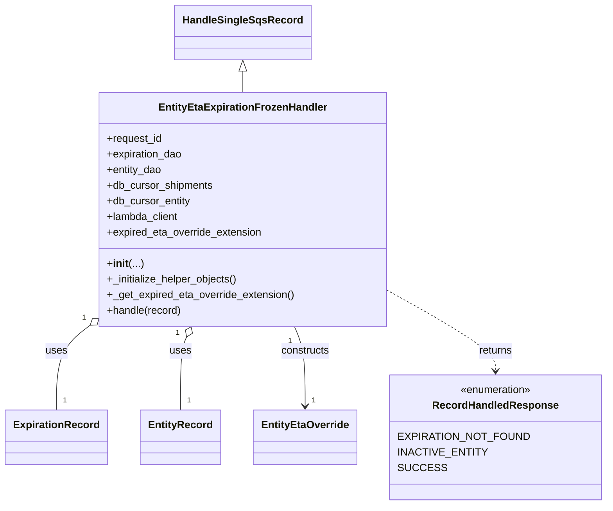

# Diagram: shipment_core/shipment_service/shipment_service/eta/handlers/entity_eta_frozen_expiration_handler.py


> Auto-generated by Obscura crawlers

## Diagram 1



### SVG

<svg id="container" width="881.453125" xmlns="http://www.w3.org/2000/svg" class="classDiagram" height="776" viewBox="0 0 881.453125 776" role="graphics-document document" aria-roledescription="class"><style>#container{font-family:"trebuchet ms",verdana,arial,sans-serif;font-size:16px;fill:#333;}@keyframes edge-animation-frame{from{stroke-dashoffset:0;}}@keyframes dash{to{stroke-dashoffset:0;}}#container .edge-animation-slow{stroke-dasharray:9,5!important;stroke-dashoffset:900;animation:dash 50s linear infinite;stroke-linecap:round;}#container .edge-animation-fast{stroke-dasharray:9,5!important;stroke-dashoffset:900;animation:dash 20s linear infinite;stroke-linecap:round;}#container .error-icon{fill:#552222;}#container .error-text{fill:#552222;stroke:#552222;}#container .edge-thickness-normal{stroke-width:1px;}#container .edge-thickness-thick{stroke-width:3.5px;}#container .edge-pattern-solid{stroke-dasharray:0;}#container .edge-thickness-invisible{stroke-width:0;fill:none;}#container .edge-pattern-dashed{stroke-dasharray:3;}#container .edge-pattern-dotted{stroke-dasharray:2;}#container .marker{fill:#333333;stroke:#333333;}#container .marker.cross{stroke:#333333;}#container svg{font-family:"trebuchet ms",verdana,arial,sans-serif;font-size:16px;}#container p{margin:0;}#container g.classGroup text{fill:#9370DB;stroke:none;font-family:"trebuchet ms",verdana,arial,sans-serif;font-size:10px;}#container g.classGroup text .title{font-weight:bolder;}#container .nodeLabel,#container .edgeLabel{color:#131300;}#container .edgeLabel .label rect{fill:#ECECFF;}#container .label text{fill:#131300;}#container .labelBkg{background:#ECECFF;}#container .edgeLabel .label span{background:#ECECFF;}#container .classTitle{font-weight:bolder;}#container .node rect,#container .node circle,#container .node ellipse,#container .node polygon,#container .node path{fill:#ECECFF;stroke:#9370DB;stroke-width:1px;}#container .divider{stroke:#9370DB;stroke-width:1;}#container g.clickable{cursor:pointer;}#container g.classGroup rect{fill:#ECECFF;stroke:#9370DB;}#container g.classGroup line{stroke:#9370DB;stroke-width:1;}#container .classLabel .box{stroke:none;stroke-width:0;fill:#ECECFF;opacity:0.5;}#container .classLabel .label{fill:#9370DB;font-size:10px;}#container .relation{stroke:#333333;stroke-width:1;fill:none;}#container .dashed-line{stroke-dasharray:3;}#container .dotted-line{stroke-dasharray:1 2;}#container #compositionStart,#container .composition{fill:#333333!important;stroke:#333333!important;stroke-width:1;}#container #compositionEnd,#container .composition{fill:#333333!important;stroke:#333333!important;stroke-width:1;}#container #dependencyStart,#container .dependency{fill:#333333!important;stroke:#333333!important;stroke-width:1;}#container #dependencyStart,#container .dependency{fill:#333333!important;stroke:#333333!important;stroke-width:1;}#container #extensionStart,#container .extension{fill:transparent!important;stroke:#333333!important;stroke-width:1;}#container #extensionEnd,#container .extension{fill:transparent!important;stroke:#333333!important;stroke-width:1;}#container #aggregationStart,#container .aggregation{fill:transparent!important;stroke:#333333!important;stroke-width:1;}#container #aggregationEnd,#container .aggregation{fill:transparent!important;stroke:#333333!important;stroke-width:1;}#container #lollipopStart,#container .lollipop{fill:#ECECFF!important;stroke:#333333!important;stroke-width:1;}#container #lollipopEnd,#container .lollipop{fill:#ECECFF!important;stroke:#333333!important;stroke-width:1;}#container .edgeTerminals{font-size:11px;line-height:initial;}#container .classTitleText{text-anchor:middle;font-size:18px;fill:#333;}#container .label-icon{display:inline-block;height:1em;overflow:visible;vertical-align:-0.125em;}#container .node .label-icon path{fill:currentColor;stroke:revert;stroke-width:revert;}#container :root{--mermaid-font-family:"trebuchet ms",verdana,arial,sans-serif;}</style><g><defs><marker id="container_class-aggregationStart" class="marker aggregation class" refX="18" refY="7" markerWidth="190" markerHeight="240" orient="auto"><path d="M 18,7 L9,13 L1,7 L9,1 Z"></path></marker></defs><defs><marker id="container_class-aggregationEnd" class="marker aggregation class" refX="1" refY="7" markerWidth="20" markerHeight="28" orient="auto"><path d="M 18,7 L9,13 L1,7 L9,1 Z"></path></marker></defs><defs><marker id="container_class-extensionStart" class="marker extension class" refX="18" refY="7" markerWidth="190" markerHeight="240" orient="auto"><path d="M 1,7 L18,13 V 1 Z"></path></marker></defs><defs><marker id="container_class-extensionEnd" class="marker extension class" refX="1" refY="7" markerWidth="20" markerHeight="28" orient="auto"><path d="M 1,1 V 13 L18,7 Z"></path></marker></defs><defs><marker id="container_class-compositionStart" class="marker composition class" refX="18" refY="7" markerWidth="190" markerHeight="240" orient="auto"><path d="M 18,7 L9,13 L1,7 L9,1 Z"></path></marker></defs><defs><marker id="container_class-compositionEnd" class="marker composition class" refX="1" refY="7" markerWidth="20" markerHeight="28" orient="auto"><path d="M 18,7 L9,13 L1,7 L9,1 Z"></path></marker></defs><defs><marker id="container_class-dependencyStart" class="marker dependency class" refX="6" refY="7" markerWidth="190" markerHeight="240" orient="auto"><path d="M 5,7 L9,13 L1,7 L9,1 Z"></path></marker></defs><defs><marker id="container_class-dependencyEnd" class="marker dependency class" refX="13" refY="7" markerWidth="20" markerHeight="28" orient="auto"><path d="M 18,7 L9,13 L14,7 L9,1 Z"></path></marker></defs><defs><marker id="container_class-lollipopStart" class="marker lollipop class" refX="13" refY="7" markerWidth="190" markerHeight="240" orient="auto"><circle stroke="black" fill="transparent" cx="7" cy="7" r="6"></circle></marker></defs><defs><marker id="container_class-lollipopEnd" class="marker lollipop class" refX="1" refY="7" markerWidth="190" markerHeight="240" orient="auto"><circle stroke="black" fill="transparent" cx="7" cy="7" r="6"></circle></marker></defs><g class="root"><g class="clusters"></g><g class="edgePaths"><path d="M358.484,109.25L358.484,110.542C358.484,111.833,358.484,114.417,358.484,119.875C358.484,125.333,358.484,133.667,358.484,137.833L358.484,142" id="id_HandleSingleSqsRecord_EntityEtaExpirationFrozenHandler_1" class="edge-thickness-normal edge-pattern-solid relation" style=";;;" data-edge="true" data-et="edge" data-id="id_HandleSingleSqsRecord_EntityEtaExpirationFrozenHandler_1" data-points="W3sieCI6MzU4LjQ4NDM3NSwieSI6OTJ9LHsieCI6MzU4LjQ4NDM3NSwieSI6MTE3fSx7IngiOjM1OC40ODQzNzUsInkiOjE0Mn1d" marker-start="url(#container_class-extensionStart)"></path><path d="M127.051,504.053L119.647,509.877C112.243,515.702,97.434,527.351,90.029,548.342C82.625,569.333,82.625,599.667,82.625,614.833L82.625,630" id="id_EntityEtaExpirationFrozenHandler_ExpirationRecord_2" class="edge-thickness-normal edge-pattern-solid relation" style=";;;" data-edge="true" data-et="edge" data-id="id_EntityEtaExpirationFrozenHandler_ExpirationRecord_2" data-points="W3sieCI6MTQwLjYwOTM3NSwieSI6NDkzLjM4NzU5NTU4MTk4ODF9LHsieCI6ODIuNjI1LCJ5Ijo1Mzl9LHsieCI6ODIuNjI1LCJ5Ijo2MzB9XQ==" marker-start="url(#container_class-aggregationStart)"></path><path d="M274.895,517.866L273.391,521.388C271.888,524.91,268.882,531.955,267.378,550.644C265.875,569.333,265.875,599.667,265.875,614.833L265.875,630" id="id_EntityEtaExpirationFrozenHandler_EntityRecord_3" class="edge-thickness-normal edge-pattern-solid relation" style=";;;" data-edge="true" data-et="edge" data-id="id_EntityEtaExpirationFrozenHandler_EntityRecord_3" data-points="W3sieCI6MjgxLjY2NTUzODU5NDQ3MDA0LCJ5Ijo1MDJ9LHsieCI6MjY1Ljg3NSwieSI6NTM5fSx7IngiOjI2NS44NzUsInkiOjYzMH1d" marker-start="url(#container_class-aggregationStart)"></path><path d="M435.303,502L437.935,508.167C440.567,514.333,445.83,526.667,448.462,547C451.094,567.333,451.094,595.667,451.094,609.833L451.094,624" id="id_EntityEtaExpirationFrozenHandler_EntityEtaOverride_4" class="edge-thickness-normal edge-pattern-solid relation" style=";;;" data-edge="true" data-et="edge" data-id="id_EntityEtaExpirationFrozenHandler_EntityEtaOverride_4" data-points="W3sieCI6NDM1LjMwMzIxMTQwNTUyOTk2LCJ5Ijo1MDJ9LHsieCI6NDUxLjA5Mzc1LCJ5Ijo1Mzl9LHsieCI6NDUxLjA5Mzc1LCJ5Ijo2MzB9XQ==" marker-end="url(#container_class-dependencyEnd)"></path><path d="M576.359,450.795L601.228,465.496C626.096,480.197,675.833,509.598,700.702,529.466C725.57,549.333,725.57,559.667,725.57,564.833L725.57,570" id="id_EntityEtaExpirationFrozenHandler_RecordHandledResponse_5" class="edge-thickness-normal edge-pattern-dashed relation" style=";;;" data-edge="true" data-et="edge" data-id="id_EntityEtaExpirationFrozenHandler_RecordHandledResponse_5" data-points="W3sieCI6NTc2LjM1OTM3NSwieSI6NDUwLjc5NTExMzU0MjA0MzV9LHsieCI6NzI1LjU3MDMxMjUsInkiOjUzOX0seyJ4Ijo3MjUuNTcwMzEyNSwieSI6NTc2fV0=" marker-end="url(#container_class-dependencyEnd)"></path></g><g class="edgeLabels"><g class="edgeLabel"><g class="label" data-id="id_HandleSingleSqsRecord_EntityEtaExpirationFrozenHandler_1" transform="translate(0, 0)"><foreignObject width="0" height="0"><div xmlns="http://www.w3.org/1999/xhtml" class="labelBkg" style="display: table-cell; white-space: nowrap; line-height: 1.5; max-width: 200px; text-align: center;"><span class="edgeLabel"></span></div></foreignObject></g></g><g class="edgeLabel" transform="translate(82.625, 539)"><g class="label" data-id="id_EntityEtaExpirationFrozenHandler_ExpirationRecord_2" transform="translate(-16.4921875, -12)"><foreignObject width="32.984375" height="24"><div xmlns="http://www.w3.org/1999/xhtml" class="labelBkg" style="display: table-cell; white-space: nowrap; line-height: 1.5; max-width: 200px; text-align: center;"><span class="edgeLabel"><p>uses</p></span></div></foreignObject></g></g><g class="edgeLabel" transform="translate(265.875, 539)"><g class="label" data-id="id_EntityEtaExpirationFrozenHandler_EntityRecord_3" transform="translate(-16.4921875, -12)"><foreignObject width="32.984375" height="24"><div xmlns="http://www.w3.org/1999/xhtml" class="labelBkg" style="display: table-cell; white-space: nowrap; line-height: 1.5; max-width: 200px; text-align: center;"><span class="edgeLabel"><p>uses</p></span></div></foreignObject></g></g><g class="edgeLabel" transform="translate(451.09375, 539)"><g class="label" data-id="id_EntityEtaExpirationFrozenHandler_EntityEtaOverride_4" transform="translate(-37.84375, -12)"><foreignObject width="75.6875" height="24"><div xmlns="http://www.w3.org/1999/xhtml" class="labelBkg" style="display: table-cell; white-space: nowrap; line-height: 1.5; max-width: 200px; text-align: center;"><span class="edgeLabel"><p>constructs</p></span></div></foreignObject></g></g><g class="edgeLabel" transform="translate(725.5703125, 539)"><g class="label" data-id="id_EntityEtaExpirationFrozenHandler_RecordHandledResponse_5" transform="translate(-26.265625, -12)"><foreignObject width="52.53125" height="24"><div xmlns="http://www.w3.org/1999/xhtml" class="labelBkg" style="display: table-cell; white-space: nowrap; line-height: 1.5; max-width: 200px; text-align: center;"><span class="edgeLabel"><p>returns</p></span></div></foreignObject></g></g><g class="edgeTerminals" transform="translate(117.58092556906098, 492.4177700799166)"><g class="inner" transform="translate(0, 0)"><foreignObject style="width: 9px; height: 12px;"><div xmlns="http://www.w3.org/1999/xhtml" style="display: inline-block; padding-right: 1px; white-space: nowrap;"><span class="edgeLabel">1</span></div></foreignObject></g></g><g class="edgeTerminals" transform="translate(261.0002836796833, 512.2077066627758)"><g class="inner" transform="translate(0, 0)"><foreignObject style="width: 9px; height: 12px;"><div xmlns="http://www.w3.org/1999/xhtml" style="display: inline-block; padding-right: 1px; white-space: nowrap;"><span class="edgeLabel">1</span></div></foreignObject></g></g><g class="edgeTerminals" transform="translate(428.3761650852133, 523.9833133372242)"><g class="inner" transform="translate(0, 0)"><foreignObject style="width: 9px; height: 12px;"><div xmlns="http://www.w3.org/1999/xhtml" style="display: inline-block; padding-right: 1px; white-space: nowrap;"><span class="edgeLabel">1</span></div></foreignObject></g></g><g class="edgeTerminals" transform="translate(92.625, 607.5)"><g class="inner" transform="translate(0, 0)"></g><foreignObject style="width: 9px; height: 12px;"><div xmlns="http://www.w3.org/1999/xhtml" style="display: inline-block; padding-right: 1px; white-space: nowrap;"><span class="edgeLabel">1</span></div></foreignObject></g><g class="edgeTerminals" transform="translate(275.875, 607.5)"><g class="inner" transform="translate(0, 0)"></g><foreignObject style="width: 9px; height: 12px;"><div xmlns="http://www.w3.org/1999/xhtml" style="display: inline-block; padding-right: 1px; white-space: nowrap;"><span class="edgeLabel">1</span></div></foreignObject></g><g class="edgeTerminals" transform="translate(461.09375, 607.5)"><g class="inner" transform="translate(0, 0)"></g><foreignObject style="width: 9px; height: 12px;"><div xmlns="http://www.w3.org/1999/xhtml" style="display: inline-block; padding-right: 1px; white-space: nowrap;"><span class="edgeLabel">1</span></div></foreignObject></g></g><g class="nodes"><g class="node default" id="classId-RecordHandledResponse-0" transform="translate(725.5703125, 672)"><g class="basic label-container"><path d="M-147.8828125 -96 L147.8828125 -96 L147.8828125 96 L-147.8828125 96" stroke="none" stroke-width="0" fill="#ECECFF" style=""></path><path d="M-147.8828125 -96 C-87.14055644172304 -96, -26.39830038344607 -96, 147.8828125 -96 M-147.8828125 -96 C-75.55777473934597 -96, -3.232736978691946 -96, 147.8828125 -96 M147.8828125 -96 C147.8828125 -49.201793175817684, 147.8828125 -2.4035863516353686, 147.8828125 96 M147.8828125 -96 C147.8828125 -30.73470263842438, 147.8828125 34.53059472315124, 147.8828125 96 M147.8828125 96 C54.5613641383415 96, -38.760084223316994 96, -147.8828125 96 M147.8828125 96 C41.15213479105789 96, -65.57854291788422 96, -147.8828125 96 M-147.8828125 96 C-147.8828125 53.473409007804506, -147.8828125 10.946818015609011, -147.8828125 -96 M-147.8828125 96 C-147.8828125 24.021373459430293, -147.8828125 -47.95725308113941, -147.8828125 -96" stroke="#9370DB" stroke-width="1.3" fill="none" stroke-dasharray="0 0" style=""></path></g><g class="annotation-group text" transform="translate(-55.5546875, -72)"><g class="label" style="" transform="translate(0,-12)"><foreignObject width="111.109375" height="24"><div xmlns="http://www.w3.org/1999/xhtml" style="display: table-cell; white-space: nowrap; line-height: 1.5; max-width: 161px; text-align: center;"><span class="nodeLabel markdown-node-label" style=""><p>«enumeration»</p></span></div></foreignObject></g></g><g class="label-group text" transform="translate(-91.46875, -48)"><g class="label" style="font-weight: bolder" transform="translate(0,-12)"><foreignObject width="182.9375" height="24"><div xmlns="http://www.w3.org/1999/xhtml" style="display: table-cell; white-space: nowrap; line-height: 1.5; max-width: 232px; text-align: center;"><span class="nodeLabel markdown-node-label" style=""><p>RecordHandledResponse</p></span></div></foreignObject></g></g><g class="members-group text" transform="translate(-135.8828125, 0)"><g class="label" style="" transform="translate(0,-12)"><foreignObject width="180.296875" height="24"><div xmlns="http://www.w3.org/1999/xhtml" style="display: table-cell; white-space: nowrap; line-height: 1.5; max-width: 230px; text-align: center;"><span class="nodeLabel markdown-node-label" style=""><p>EXPIRATION_NOT_FOUND</p></span></div></foreignObject></g><g class="label" style="" transform="translate(0,12)"><foreignObject width="121.78125" height="24"><div xmlns="http://www.w3.org/1999/xhtml" style="display: table-cell; white-space: nowrap; line-height: 1.5; max-width: 172px; text-align: center;"><span class="nodeLabel markdown-node-label" style=""><p>INACTIVE_ENTITY</p></span></div></foreignObject></g><g class="label" style="" transform="translate(0,36)"><foreignObject width="62.5625" height="24"><div xmlns="http://www.w3.org/1999/xhtml" style="display: table-cell; white-space: nowrap; line-height: 1.5; max-width: 113px; text-align: center;"><span class="nodeLabel markdown-node-label" style=""><p>SUCCESS</p></span></div></foreignObject></g></g><g class="methods-group text" transform="translate(-135.8828125, 96)"></g><g class="divider" style=""><path d="M-147.8828125 -24 C-59.01837740594199 -24, 29.84605768811602 -24, 147.8828125 -24 M-147.8828125 -24 C-33.6141590729799 -24, 80.6544943540402 -24, 147.8828125 -24" stroke="#9370DB" stroke-width="1.3" fill="none" stroke-dasharray="0 0" style=""></path></g><g class="divider" style=""><path d="M-147.8828125 72 C-34.614324521022 72, 78.654163457956 72, 147.8828125 72 M-147.8828125 72 C-34.93013038602463 72, 78.02255172795074 72, 147.8828125 72" stroke="#9370DB" stroke-width="1.3" fill="none" stroke-dasharray="0 0" style=""></path></g></g><g class="node default" id="classId-HandleSingleSqsRecord-1" transform="translate(358.484375, 50)"><g class="basic label-container"><path d="M-99.078125 -42 L99.078125 -42 L99.078125 42 L-99.078125 42" stroke="none" stroke-width="0" fill="#ECECFF" style=""></path><path d="M-99.078125 -42 C-35.8916320600078 -42, 27.294860879984398 -42, 99.078125 -42 M-99.078125 -42 C-39.51195999380206 -42, 20.054205012395883 -42, 99.078125 -42 M99.078125 -42 C99.078125 -11.335548886712104, 99.078125 19.328902226575792, 99.078125 42 M99.078125 -42 C99.078125 -13.458763733581744, 99.078125 15.082472532836512, 99.078125 42 M99.078125 42 C39.6656044915537 42, -19.746916016892598 42, -99.078125 42 M99.078125 42 C35.13727019549423 42, -28.803584609011537 42, -99.078125 42 M-99.078125 42 C-99.078125 21.132458637116002, -99.078125 0.26491727423200473, -99.078125 -42 M-99.078125 42 C-99.078125 15.120528916562975, -99.078125 -11.75894216687405, -99.078125 -42" stroke="#9370DB" stroke-width="1.3" fill="none" stroke-dasharray="0 0" style=""></path></g><g class="annotation-group text" transform="translate(0, -18)"></g><g class="label-group text" transform="translate(-87.078125, -18)"><g class="label" style="font-weight: bolder" transform="translate(0,-12)"><foreignObject width="174.15625" height="24"><div xmlns="http://www.w3.org/1999/xhtml" style="display: table-cell; white-space: nowrap; line-height: 1.5; max-width: 222px; text-align: center;"><span class="nodeLabel markdown-node-label" style=""><p>HandleSingleSqsRecord</p></span></div></foreignObject></g></g><g class="members-group text" transform="translate(-87.078125, 30)"></g><g class="methods-group text" transform="translate(-87.078125, 60)"></g><g class="divider" style=""><path d="M-99.078125 6 C-25.139790953034762 6, 48.798543093930476 6, 99.078125 6 M-99.078125 6 C-28.408270778211374 6, 42.26158344357725 6, 99.078125 6" stroke="#9370DB" stroke-width="1.3" fill="none" stroke-dasharray="0 0" style=""></path></g><g class="divider" style=""><path d="M-99.078125 24 C-23.90927329524166 24, 51.25957840951668 24, 99.078125 24 M-99.078125 24 C-52.681974934948194 24, -6.285824869896388 24, 99.078125 24" stroke="#9370DB" stroke-width="1.3" fill="none" stroke-dasharray="0 0" style=""></path></g></g><g class="node default" id="classId-EntityEtaExpirationFrozenHandler-2" transform="translate(358.484375, 322)"><g class="basic label-container"><path d="M-217.875 -180 L217.875 -180 L217.875 180 L-217.875 180" stroke="none" stroke-width="0" fill="#ECECFF" style=""></path><path d="M-217.875 -180 C-110.81800051301092 -180, -3.7610010260218303 -180, 217.875 -180 M-217.875 -180 C-100.04045332318923 -180, 17.794093353621548 -180, 217.875 -180 M217.875 -180 C217.875 -95.92571084234385, 217.875 -11.851421684687693, 217.875 180 M217.875 -180 C217.875 -88.39514844726676, 217.875 3.209703105466474, 217.875 180 M217.875 180 C122.95403589200183 180, 28.033071784003653 180, -217.875 180 M217.875 180 C76.51065676111861 180, -64.85368647776278 180, -217.875 180 M-217.875 180 C-217.875 54.55120750403985, -217.875 -70.8975849919203, -217.875 -180 M-217.875 180 C-217.875 87.93588036180425, -217.875 -4.128239276391497, -217.875 -180" stroke="#9370DB" stroke-width="1.3" fill="none" stroke-dasharray="0 0" style=""></path></g><g class="annotation-group text" transform="translate(0, -156)"></g><g class="label-group text" transform="translate(-122.90625, -156)"><g class="label" style="font-weight: bolder" transform="translate(0,-12)"><foreignObject width="245.8125" height="24"><div xmlns="http://www.w3.org/1999/xhtml" style="display: table-cell; white-space: nowrap; line-height: 1.5; max-width: 294px; text-align: center;"><span class="nodeLabel markdown-node-label" style=""><p>EntityEtaExpirationFrozenHandler</p></span></div></foreignObject></g></g><g class="members-group text" transform="translate(-205.875, -108)"><g class="label" style="" transform="translate(0,-12)"><foreignObject width="85.65625" height="24"><div xmlns="http://www.w3.org/1999/xhtml" style="display: table-cell; white-space: nowrap; line-height: 1.5; max-width: 143px; text-align: center;"><span class="nodeLabel markdown-node-label" style=""><p>+request_id</p></span></div></foreignObject></g><g class="label" style="" transform="translate(0,12)"><foreignObject width="117.28125" height="24"><div xmlns="http://www.w3.org/1999/xhtml" style="display: table-cell; white-space: nowrap; line-height: 1.5; max-width: 175px; text-align: center;"><span class="nodeLabel markdown-node-label" style=""><p>+expiration_dao</p></span></div></foreignObject></g><g class="label" style="" transform="translate(0,36)"><foreignObject width="85.078125" height="24"><div xmlns="http://www.w3.org/1999/xhtml" style="display: table-cell; white-space: nowrap; line-height: 1.5; max-width: 142px; text-align: center;"><span class="nodeLabel markdown-node-label" style=""><p>+entity_dao</p></span></div></foreignObject></g><g class="label" style="" transform="translate(0,60)"><foreignObject width="163.4375" height="24"><div xmlns="http://www.w3.org/1999/xhtml" style="display: table-cell; white-space: nowrap; line-height: 1.5; max-width: 221px; text-align: center;"><span class="nodeLabel markdown-node-label" style=""><p>+db_cursor_shipments</p></span></div></foreignObject></g><g class="label" style="" transform="translate(0,84)"><foreignObject width="129.140625" height="24"><div xmlns="http://www.w3.org/1999/xhtml" style="display: table-cell; white-space: nowrap; line-height: 1.5; max-width: 187px; text-align: center;"><span class="nodeLabel markdown-node-label" style=""><p>+db_cursor_entity</p></span></div></foreignObject></g><g class="label" style="" transform="translate(0,108)"><foreignObject width="111.515625" height="24"><div xmlns="http://www.w3.org/1999/xhtml" style="display: table-cell; white-space: nowrap; line-height: 1.5; max-width: 169px; text-align: center;"><span class="nodeLabel markdown-node-label" style=""><p>+lambda_client</p></span></div></foreignObject></g><g class="label" style="" transform="translate(0,132)"><foreignObject width="240.734375" height="24"><div xmlns="http://www.w3.org/1999/xhtml" style="display: table-cell; white-space: nowrap; line-height: 1.5; max-width: 298px; text-align: center;"><span class="nodeLabel markdown-node-label" style=""><p>+expired_eta_override_extension</p></span></div></foreignObject></g></g><g class="methods-group text" transform="translate(-205.875, 84)"><g class="label" style="" transform="translate(0,-12)"><foreignObject width="54.3125" height="24"><div xmlns="http://www.w3.org/1999/xhtml" style="display: table-cell; white-space: nowrap; line-height: 1.5; max-width: 143px; text-align: center;"><span class="nodeLabel markdown-node-label" style=""><p>+<strong>init</strong>(...)</p></span></div></foreignObject></g><g class="label" style="" transform="translate(0,12)"><foreignObject width="202.28125" height="24"><div xmlns="http://www.w3.org/1999/xhtml" style="display: table-cell; white-space: nowrap; line-height: 1.5; max-width: 260px; text-align: center;"><span class="nodeLabel markdown-node-label" style=""><p>+_initialize_helper_objects()</p></span></div></foreignObject></g><g class="label" style="" transform="translate(0,36)"><foreignObject width="288.84375" height="24"><div xmlns="http://www.w3.org/1999/xhtml" style="display: table-cell; white-space: nowrap; line-height: 1.5; max-width: 346px; text-align: center;"><span class="nodeLabel markdown-node-label" style=""><p>+_get_expired_eta_override_extension()</p></span></div></foreignObject></g><g class="label" style="" transform="translate(0,60)"><foreignObject width="115.0625" height="24"><div xmlns="http://www.w3.org/1999/xhtml" style="display: table-cell; white-space: nowrap; line-height: 1.5; max-width: 172px; text-align: center;"><span class="nodeLabel markdown-node-label" style=""><p>+handle(record)</p></span></div></foreignObject></g></g><g class="divider" style=""><path d="M-217.875 -132 C-87.50015484268272 -132, 42.87469031463456 -132, 217.875 -132 M-217.875 -132 C-89.69504434371112 -132, 38.484911312577765 -132, 217.875 -132" stroke="#9370DB" stroke-width="1.3" fill="none" stroke-dasharray="0 0" style=""></path></g><g class="divider" style=""><path d="M-217.875 60 C-127.15615893574326 60, -36.43731787148653 60, 217.875 60 M-217.875 60 C-63.34942288298049 60, 91.17615423403902 60, 217.875 60" stroke="#9370DB" stroke-width="1.3" fill="none" stroke-dasharray="0 0" style=""></path></g></g><g class="node default" id="classId-ExpirationRecord-3" transform="translate(82.625, 672)"><g class="basic label-container"><path d="M-74.625 -42 L74.625 -42 L74.625 42 L-74.625 42" stroke="none" stroke-width="0" fill="#ECECFF" style=""></path><path d="M-74.625 -42 C-25.011839110866475 -42, 24.60132177826705 -42, 74.625 -42 M-74.625 -42 C-35.23482051761715 -42, 4.155358964765696 -42, 74.625 -42 M74.625 -42 C74.625 -16.908969805391692, 74.625 8.182060389216616, 74.625 42 M74.625 -42 C74.625 -18.303890138333525, 74.625 5.39221972333295, 74.625 42 M74.625 42 C28.44954846342373 42, -17.725903073152537 42, -74.625 42 M74.625 42 C44.17078083984527 42, 13.716561679690543 42, -74.625 42 M-74.625 42 C-74.625 20.138832258775228, -74.625 -1.7223354824495445, -74.625 -42 M-74.625 42 C-74.625 23.129401875326135, -74.625 4.25880375065227, -74.625 -42" stroke="#9370DB" stroke-width="1.3" fill="none" stroke-dasharray="0 0" style=""></path></g><g class="annotation-group text" transform="translate(0, -18)"></g><g class="label-group text" transform="translate(-62.625, -18)"><g class="label" style="font-weight: bolder" transform="translate(0,-12)"><foreignObject width="125.25" height="24"><div xmlns="http://www.w3.org/1999/xhtml" style="display: table-cell; white-space: nowrap; line-height: 1.5; max-width: 174px; text-align: center;"><span class="nodeLabel markdown-node-label" style=""><p>ExpirationRecord</p></span></div></foreignObject></g></g><g class="members-group text" transform="translate(-62.625, 30)"></g><g class="methods-group text" transform="translate(-62.625, 60)"></g><g class="divider" style=""><path d="M-74.625 6 C-27.169884824073627 6, 20.285230351852746 6, 74.625 6 M-74.625 6 C-29.059592914644178 6, 16.505814170711645 6, 74.625 6" stroke="#9370DB" stroke-width="1.3" fill="none" stroke-dasharray="0 0" style=""></path></g><g class="divider" style=""><path d="M-74.625 24 C-18.623925774007667 24, 37.37714845198467 24, 74.625 24 M-74.625 24 C-37.159861954479965 24, 0.3052760910400707 24, 74.625 24" stroke="#9370DB" stroke-width="1.3" fill="none" stroke-dasharray="0 0" style=""></path></g></g><g class="node default" id="classId-EntityRecord-4" transform="translate(265.875, 672)"><g class="basic label-container"><path d="M-58.625 -42 L58.625 -42 L58.625 42 L-58.625 42" stroke="none" stroke-width="0" fill="#ECECFF" style=""></path><path d="M-58.625 -42 C-26.786958039922634 -42, 5.051083920154731 -42, 58.625 -42 M-58.625 -42 C-12.056848470921302 -42, 34.511303058157395 -42, 58.625 -42 M58.625 -42 C58.625 -21.423914410948267, 58.625 -0.8478288218965346, 58.625 42 M58.625 -42 C58.625 -12.148235517620577, 58.625 17.703528964758846, 58.625 42 M58.625 42 C28.11133784139342 42, -2.402324317213157 42, -58.625 42 M58.625 42 C15.755049495329743 42, -27.114901009340514 42, -58.625 42 M-58.625 42 C-58.625 12.386484849245452, -58.625 -17.227030301509096, -58.625 -42 M-58.625 42 C-58.625 21.81981811999126, -58.625 1.6396362399825222, -58.625 -42" stroke="#9370DB" stroke-width="1.3" fill="none" stroke-dasharray="0 0" style=""></path></g><g class="annotation-group text" transform="translate(0, -18)"></g><g class="label-group text" transform="translate(-46.625, -18)"><g class="label" style="font-weight: bolder" transform="translate(0,-12)"><foreignObject width="93.25" height="24"><div xmlns="http://www.w3.org/1999/xhtml" style="display: table-cell; white-space: nowrap; line-height: 1.5; max-width: 142px; text-align: center;"><span class="nodeLabel markdown-node-label" style=""><p>EntityRecord</p></span></div></foreignObject></g></g><g class="members-group text" transform="translate(-46.625, 30)"></g><g class="methods-group text" transform="translate(-46.625, 60)"></g><g class="divider" style=""><path d="M-58.625 6 C-20.97152895791006 6, 16.68194208417988 6, 58.625 6 M-58.625 6 C-30.44008645540837 6, -2.2551729108167393 6, 58.625 6" stroke="#9370DB" stroke-width="1.3" fill="none" stroke-dasharray="0 0" style=""></path></g><g class="divider" style=""><path d="M-58.625 24 C-35.040306378070426 24, -11.455612756140859 24, 58.625 24 M-58.625 24 C-33.416548019043 24, -8.208096038085998 24, 58.625 24" stroke="#9370DB" stroke-width="1.3" fill="none" stroke-dasharray="0 0" style=""></path></g></g><g class="node default" id="classId-EntityEtaOverride-5" transform="translate(451.09375, 672)"><g class="basic label-container"><path d="M-76.59375 -42 L76.59375 -42 L76.59375 42 L-76.59375 42" stroke="none" stroke-width="0" fill="#ECECFF" style=""></path><path d="M-76.59375 -42 C-24.773472843666696 -42, 27.04680431266661 -42, 76.59375 -42 M-76.59375 -42 C-20.493912568344605 -42, 35.60592486331079 -42, 76.59375 -42 M76.59375 -42 C76.59375 -11.758090699600388, 76.59375 18.483818600799225, 76.59375 42 M76.59375 -42 C76.59375 -24.87100167184211, 76.59375 -7.7420033436842175, 76.59375 42 M76.59375 42 C43.883181417265675 42, 11.17261283453135 42, -76.59375 42 M76.59375 42 C45.94390741611185 42, 15.294064832223697 42, -76.59375 42 M-76.59375 42 C-76.59375 11.259832135957168, -76.59375 -19.480335728085663, -76.59375 -42 M-76.59375 42 C-76.59375 9.581731813045671, -76.59375 -22.836536373908658, -76.59375 -42" stroke="#9370DB" stroke-width="1.3" fill="none" stroke-dasharray="0 0" style=""></path></g><g class="annotation-group text" transform="translate(0, -18)"></g><g class="label-group text" transform="translate(-64.59375, -18)"><g class="label" style="font-weight: bolder" transform="translate(0,-12)"><foreignObject width="129.1875" height="24"><div xmlns="http://www.w3.org/1999/xhtml" style="display: table-cell; white-space: nowrap; line-height: 1.5; max-width: 177px; text-align: center;"><span class="nodeLabel markdown-node-label" style=""><p>EntityEtaOverride</p></span></div></foreignObject></g></g><g class="members-group text" transform="translate(-64.59375, 30)"></g><g class="methods-group text" transform="translate(-64.59375, 60)"></g><g class="divider" style=""><path d="M-76.59375 6 C-24.48637154802556 6, 27.62100690394888 6, 76.59375 6 M-76.59375 6 C-26.260072705215144 6, 24.07360458956971 6, 76.59375 6" stroke="#9370DB" stroke-width="1.3" fill="none" stroke-dasharray="0 0" style=""></path></g><g class="divider" style=""><path d="M-76.59375 24 C-16.49898679073592 24, 43.59577641852816 24, 76.59375 24 M-76.59375 24 C-19.34095470030256 24, 37.91184059939488 24, 76.59375 24" stroke="#9370DB" stroke-width="1.3" fill="none" stroke-dasharray="0 0" style=""></path></g></g></g></g></g></svg>

## Diagram 2

```mermaid
flowchart TD
    Start([Start]) --> ParseMsg[/"Parse SQS record (eta_utils.parse_sqs_record)"/]
    ParseMsg --> SetExpirationId[/"Set expiration.id from message"/]
    SetExpirationId --> GetExpiration{Get expiration_record\n(expiration_dao.get_expiration_record)}
    GetExpiration -- empty --> ExpNotFound[Return EXPIRATION_NOT_FOUND]
    GetExpiration -- found --> ParseExpiration["parse_expiration_record(expiration)"]
    ParseExpiration --> SetProcessing["set_expiration_record_status(PROCESSING)"]
    SetProcessing --> GetEntity{get_entity_data_for_expiration_processing(entity_id)}
    GetEntity -- None --> DeleteExpiration["delete_expiration_record(expiration.id)"]
    DeleteExpiration --> InactiveEntity[Return INACTIVE_ENTITY]
    GetEntity -- exists --> ParseEntity["parse_entity_record(entity_record)"]
    ParseEntity --> ComputeExtension["_get_expired_eta_override_extension()"]
    ComputeExtension --> Now["now = datetime.now(UTC)"]
    Now --> ExpiredETA["expired_eta_override_dt = now + expired_eta_override_extension"]
    ExpiredETA --> FreezeUntil["freeze_until = now.strftime(STANDARD_ETA_STRING_FORMAT)"]
    FreezeUntil --> GetShipment["get_shipment_if_entity_on_final_leg(db_cursor_entity, external_id, solution_id)"]
    GetShipment --> CheckDeparted{atl_external_id is not None}
    CheckDeparted -- true --> HasDeparted["has_departed_from_origin(db_cursor_shipments, atl_external_id)"]
    CheckDeparted -- false --> NoDeparted[Set has_departed_final_leg = False]
    HasDeparted --> DisplayWindow["get_display_eta_strings(expired_eta_override_dt, solution_id, has_departed)"]
    NoDeparted --> DisplayWindow
    DisplayWindow --> CreateOverride["Create EntityEtaOverride(internal_entity_id, external_entity_id, eta, eta_display_window, freeze_until)"]
    CreateOverride --> UpdateEntity["override_obj.update_entity_with_override(request_id, lambda_client)"]
    UpdateEntity --> AddProgUpdate["override_obj.add_entity_prog_update_with_override(request_id, lambda_client)"]
    AddProgUpdate --> SetFreeze["override_obj.set_freeze_expiration(expiration_dao) -> (new_expiration_record_id, expiration_is_update)"]
    SetFreeze --> SaveNewId["expiration_dao.new_expiration_record_id = new_expiration_record_id"]
    SaveNewId --> CheckIsUpdate{expiration_is_update?}
    CheckIsUpdate -- false --> DeleteOld["delete_expiration_record(old_id)"]
    CheckIsUpdate -- true --> SkipDelete[skip delete]
    DeleteOld --> Success[Return SUCCESS]
    SkipDelete --> Success
    ExpNotFound --> End([End])
    InactiveEntity --> End
    Success --> End
```

> SVG rendering failed for this diagram.
