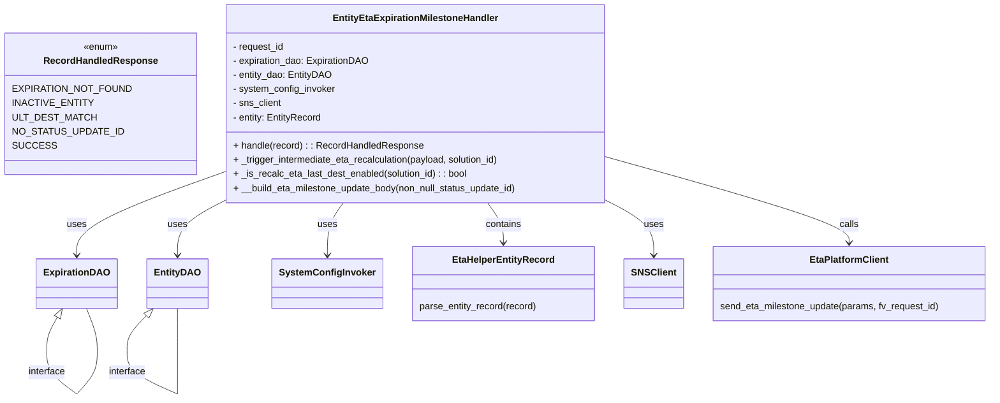
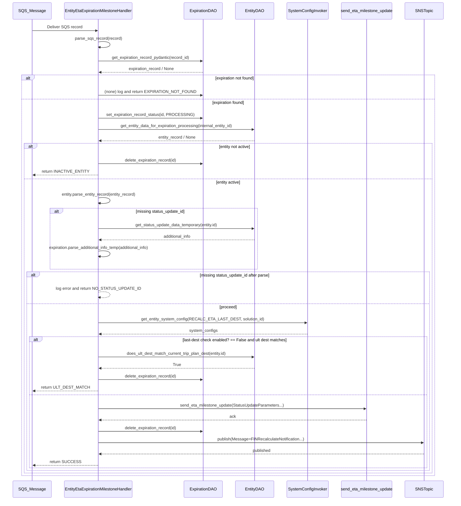

# Diagram: shipment_core/shipment_service/shipment_service/eta/handlers/entity_eta_milestone_expiration_handler.py

> Auto-generated by Obscura crawlers

## Diagram 1

### SVG

<svg id="container" width="1646.462890625" xmlns="http://www.w3.org/2000/svg" class="classDiagram" height="676.25" viewBox="0 0 1646.462890625 676.25" role="graphics-document document" aria-roledescription="class"><g><defs><marker id="container_class-aggregationStart" class="marker aggregation class" refX="18" refY="7" markerWidth="190" markerHeight="240" orient="auto"><path d="M 18,7 L9,13 L1,7 L9,1 Z"></path></marker></defs><defs><marker id="container_class-aggregationEnd" class="marker aggregation class" refX="1" refY="7" markerWidth="20" markerHeight="28" orient="auto"><path d="M 18,7 L9,13 L1,7 L9,1 Z"></path></marker></defs><defs><marker id="container_class-extensionStart" class="marker extension class" refX="18" refY="7" markerWidth="190" markerHeight="240" orient="auto"><path d="M 1,7 L18,13 V 1 Z"></path></marker></defs><defs><marker id="container_class-extensionEnd" class="marker extension class" refX="1" refY="7" markerWidth="20" markerHeight="28" orient="auto"><path d="M 1,1 V 13 L18,7 Z"></path></marker></defs><defs><marker id="container_class-compositionStart" class="marker composition class" refX="18" refY="7" markerWidth="190" markerHeight="240" orient="auto"><path d="M 18,7 L9,13 L1,7 L9,1 Z"></path></marker></defs><defs><marker id="container_class-compositionEnd" class="marker composition class" refX="1" refY="7" markerWidth="20" markerHeight="28" orient="auto"><path d="M 18,7 L9,13 L1,7 L9,1 Z"></path></marker></defs><defs><marker id="container_class-dependencyStart" class="marker dependency class" refX="6" refY="7" markerWidth="190" markerHeight="240" orient="auto"><path d="M 5,7 L9,13 L1,7 L9,1 Z"></path></marker></defs><defs><marker id="container_class-dependencyEnd" class="marker dependency class" refX="13" refY="7" markerWidth="20" markerHeight="28" orient="auto"><path d="M 18,7 L9,13 L14,7 L9,1 Z"></path></marker></defs><defs><marker id="container_class-lollipopStart" class="marker lollipop class" refX="13" refY="7" markerWidth="190" markerHeight="240" orient="auto"><circle stroke="black" fill="transparent" cx="7" cy="7" r="6"></circle></marker></defs><defs><marker id="container_class-lollipopEnd" class="marker lollipop class" refX="1" refY="7" markerWidth="190" markerHeight="240" orient="auto"><circle stroke="black" fill="transparent" cx="7" cy="7" r="6"></circle></marker></defs><g class="root"><g class="clusters"></g><g class="edgePaths"><path d="M353.766,295.385L315.01,309.654C276.254,323.923,198.742,352.462,159.986,375.397C121.23,398.333,121.23,415.667,121.23,424.333L121.23,433" id="id_EntityEtaExpirationMilestoneHandler_ExpirationDAO_1" class="edge-thickness-normal edge-pattern-solid relation" style=";;;" data-edge="true" data-et="edge" data-id="id_EntityEtaExpirationMilestoneHandler_ExpirationDAO_1" data-points="W3sieCI6MzUzLjc2NTYyNSwieSI6Mjk1LjM4NDYyMDI0MTYxOTh9LHsieCI6MTIxLjIzMDQ2ODc1LCJ5IjozODF9LHsieCI6MTIxLjIzMDQ2ODc1LCJ5Ijo0Mzl9XQ==" marker-end="url(#container_class-dependencyEnd)"></path><path d="M355.433,344L343.592,350.167C331.751,356.333,308.069,368.667,296.228,383.5C284.387,398.333,284.387,415.667,284.387,424.333L284.387,433" id="id_EntityEtaExpirationMilestoneHandler_EntityDAO_2" class="edge-thickness-normal edge-pattern-solid relation" style=";;;" data-edge="true" data-et="edge" data-id="id_EntityEtaExpirationMilestoneHandler_EntityDAO_2" data-points="W3sieCI6MzU1LjQzMjY0MTAwNjA5NzYsInkiOjM0NH0seyJ4IjoyODQuMzg2NzE4NzUsInkiOjM4MX0seyJ4IjoyODQuMzg2NzE4NzUsInkiOjQzOX1d" marker-end="url(#container_class-dependencyEnd)"></path><path d="M558.081,344L553.679,350.167C549.276,356.333,540.471,368.667,536.069,383.5C531.666,398.333,531.666,415.667,531.666,424.333L531.666,433" id="id_EntityEtaExpirationMilestoneHandler_SystemConfigInvoker_3" class="edge-thickness-normal edge-pattern-solid relation" style=";;;" data-edge="true" data-et="edge" data-id="id_EntityEtaExpirationMilestoneHandler_SystemConfigInvoker_3" data-points="W3sieCI6NTU4LjA4MTA0MDM5NjM0MTUsInkiOjM0NH0seyJ4Ijo1MzEuNjY2MDE1NjI1LCJ5IjozODF9LHsieCI6NTMxLjY2NjAxNTYyNSwieSI6NDM5fV0=" marker-end="url(#container_class-dependencyEnd)"></path><path d="M797.958,344L802.361,350.167C806.763,356.333,815.568,368.667,819.971,380C824.373,391.333,824.373,401.667,824.373,406.833L824.373,412" id="id_EntityEtaExpirationMilestoneHandler_EtaHelperEntityRecord_4" class="edge-thickness-normal edge-pattern-solid relation" style=";;;" data-edge="true" data-et="edge" data-id="id_EntityEtaExpirationMilestoneHandler_EtaHelperEntityRecord_4" data-points="W3sieCI6Nzk3Ljk1ODAyMjEwMzY1ODUsInkiOjM0NH0seyJ4Ijo4MjQuMzczMDQ2ODc1LCJ5IjozODF9LHsieCI6ODI0LjM3MzA0Njg3NSwieSI6NDE4fV0=" marker-end="url(#container_class-dependencyEnd)"></path><path d="M1002.273,343.121L1014.522,349.434C1026.771,355.747,1051.27,368.374,1063.519,383.353C1075.768,398.333,1075.768,415.667,1075.768,424.333L1075.768,433" id="id_EntityEtaExpirationMilestoneHandler_SNSClient_5" class="edge-thickness-normal edge-pattern-solid relation" style=";;;" data-edge="true" data-et="edge" data-id="id_EntityEtaExpirationMilestoneHandler_SNSClient_5" data-points="W3sieCI6MTAwMi4yNzM0Mzc1LCJ5IjozNDMuMTIwOTk4NTkwNjk4Nn0seyJ4IjoxMDc1Ljc2NzU3ODEyNSwieSI6MzgxfSx7IngiOjEwNzUuNzY3NTc4MTI1LCJ5Ijo0Mzl9XQ==" marker-end="url(#container_class-dependencyEnd)"></path><path d="M1002.273,267.312L1069.558,286.26C1136.843,305.208,1271.413,343.104,1338.698,367.219C1405.982,391.333,1405.982,401.667,1405.982,406.833L1405.982,412" id="id_EntityEtaExpirationMilestoneHandler_EtaPlatformClient_6" class="edge-thickness-normal edge-pattern-solid relation" style=";;;" data-edge="true" data-et="edge" data-id="id_EntityEtaExpirationMilestoneHandler_EtaPlatformClient_6" data-points="W3sieCI6MTAwMi4yNzM0Mzc1LCJ5IjoyNjcuMzEyNDE2NjU5Mjg4NDN9LHsieCI6MTQwNS45ODI0MjE4NzUsInkiOjM4MX0seyJ4IjoxNDA1Ljk4MjQyMTg3NSwieSI6NDE4fV0=" marker-end="url(#container_class-dependencyEnd)"></path><path d="M87.608,537.848L84.538,543.04C81.467,548.232,75.325,558.616,72.254,567.975C69.184,577.333,69.184,585.667,69.184,589.833L69.184,594" id="ExpirationDAO-cyclic-special-1" class="edge-thickness-normal edge-pattern-solid relation" style=";;;" data-edge="true" data-et="edge" data-id="ExpirationDAO-cyclic-special-1" data-points="W3sieCI6OTYuMzg5OTE0NzcyNzI3MjgsInkiOjUyM30seyJ4Ijo2OS4xODM1OTM3NSwieSI6NTY5fSx7IngiOjY5LjE4MzU5Mzc1LCJ5Ijo1OTR9XQ==" marker-start="url(#container_class-extensionStart)"></path><path d="M69.184,594.1L69.184,600.267C69.184,606.433,69.184,618.767,77.85,631.102C86.516,643.438,103.848,655.776,112.514,661.945L121.18,668.114" id="ExpirationDAO-cyclic-special-mid" class="edge-thickness-normal edge-pattern-solid relation" style=";;;" data-edge="true" data-et="edge" data-id="ExpirationDAO-cyclic-special-mid" data-points="W3sieCI6NjkuMTgzNTkzNzUsInkiOjU5NC4xMDAwMDAwMDE0OTAxfSx7IngiOjY5LjE4MzU5Mzc1LCJ5Ijo2MzEuMTAwMDAwMDAxNDkwMX0seyJ4IjoxMjEuMTgwNDY4NzQ5MjU0OTQsInkiOjY2OC4xMTQ0MDcwODY2NjM1fV0="></path><path d="M121.27,668.1L126.186,661.933C131.101,655.767,140.931,643.433,145.846,631.092C150.762,618.75,150.762,606.4,150.762,596.05C150.762,585.7,150.762,577.35,148.189,565.508C145.616,553.667,140.471,538.333,137.898,530.667L135.325,523" id="ExpirationDAO-cyclic-special-2" class="edge-thickness-normal edge-pattern-solid relation" style=";;;" data-edge="true" data-et="edge" data-id="ExpirationDAO-cyclic-special-2" data-points="W3sieCI6MTIxLjI3MDMyMTk4OTQ1OTQ2LCJ5Ijo2NjguMTAwMDAwMDAxNDkwMX0seyJ4IjoxNTAuNzYxNzE4NzUsInkiOjYzMS4xMDAwMDAwMDE0OTAxfSx7IngiOjE1MC43NjE3MTg3NSwieSI6NTk0LjA1MDAwMDAwMDc0NTF9LHsieCI6MTUwLjc2MTcxODc1LCJ5Ijo1Njl9LHsieCI6MTM1LjMyNDkyODk3NzI3MjcyLCJ5Ijo1MjN9XQ=="></path><path d="M233.724,535.65L228.572,541.209C223.419,546.767,213.114,557.883,207.961,567.608C202.809,577.333,202.809,585.667,202.809,589.833L202.809,594" id="EntityDAO-cyclic-special-1" class="edge-thickness-normal edge-pattern-solid relation" style=";;;" data-edge="true" data-et="edge" data-id="EntityDAO-cyclic-special-1" data-points="W3sieCI6MjQ1LjQ1MTcwNDU0NTQ1NDU2LCJ5Ijo1MjN9LHsieCI6MjAyLjgwODU5Mzc1LCJ5Ijo1Njl9LHsieCI6MjAyLjgwODU5Mzc1LCJ5Ijo1OTR9XQ==" marker-start="url(#container_class-extensionStart)"></path><path d="M202.809,594.1L202.809,600.267C202.809,606.433,202.809,618.767,216.397,631.105C229.985,643.442,257.161,655.785,270.749,661.956L284.337,668.127" id="EntityDAO-cyclic-special-mid" class="edge-thickness-normal edge-pattern-solid relation" style=";;;" data-edge="true" data-et="edge" data-id="EntityDAO-cyclic-special-mid" data-points="W3sieCI6MjAyLjgwODU5Mzc1LCJ5Ijo1OTQuMTAwMDAwMDAxNDkwMX0seyJ4IjoyMDIuODA4NTkzNzUsInkiOjYzMS4xMDAwMDAwMDE0OTAxfSx7IngiOjI4NC4zMzY3MTg3NDkyNTQ5NCwieSI6NjY4LjEyNzI5MTcwODQ2NTl9XQ=="></path><path d="M284.387,668.1L284.387,661.933C284.387,655.767,284.387,643.433,284.387,631.092C284.387,618.75,284.387,606.4,284.387,596.05C284.387,585.7,284.387,577.35,284.387,565.508C284.387,553.667,284.387,538.333,284.387,530.667L284.387,523" id="EntityDAO-cyclic-special-2" class="edge-thickness-normal edge-pattern-solid relation" style=";;;" data-edge="true" data-et="edge" data-id="EntityDAO-cyclic-special-2" data-points="W3sieCI6Mjg0LjM4NjcxODc1LCJ5Ijo2NjguMTAwMDAwMDAxNDkwMX0seyJ4IjoyODQuMzg2NzE4NzUsInkiOjYzMS4xMDAwMDAwMDE0OTAxfSx7IngiOjI4NC4zODY3MTg3NSwieSI6NTk0LjA1MDAwMDAwMDc0NTF9LHsieCI6Mjg0LjM4NjcxODc1LCJ5Ijo1Njl9LHsieCI6Mjg0LjM4NjcxODc1LCJ5Ijo1MjN9XQ=="></path></g><g class="edgeLabels"><g class="edgeLabel" transform="translate(121.23046875, 381)"><g class="label" data-id="id_EntityEtaExpirationMilestoneHandler_ExpirationDAO_1" transform="translate(-16.4921875, -12)"><foreignObject width="32.984375" height="24">

uses

</foreignObject></g></g><g class="edgeLabel" transform="translate(284.38671875, 381)"><g class="label" data-id="id_EntityEtaExpirationMilestoneHandler_EntityDAO_2" transform="translate(-16.4921875, -12)"><foreignObject width="32.984375" height="24">

uses

</foreignObject></g></g><g class="edgeLabel" transform="translate(531.666015625, 381)"><g class="label" data-id="id_EntityEtaExpirationMilestoneHandler_SystemConfigInvoker_3" transform="translate(-16.4921875, -12)"><foreignObject width="32.984375" height="24">

uses

</foreignObject></g></g><g class="edgeLabel" transform="translate(824.373046875, 381)"><g class="label" data-id="id_EntityEtaExpirationMilestoneHandler_EtaHelperEntityRecord_4" transform="translate(-30.890625, -12)"><foreignObject width="61.78125" height="24">

contains

</foreignObject></g></g><g class="edgeLabel" transform="translate(1075.767578125, 381)"><g class="label" data-id="id_EntityEtaExpirationMilestoneHandler_SNSClient_5" transform="translate(-16.4921875, -12)"><foreignObject width="32.984375" height="24">

uses

</foreignObject></g></g><g class="edgeLabel" transform="translate(1405.982421875, 381)"><g class="label" data-id="id_EntityEtaExpirationMilestoneHandler_EtaPlatformClient_6" transform="translate(-16.4453125, -12)"><foreignObject width="32.890625" height="24">

calls

</foreignObject></g></g><g class="edgeLabel"><g class="label" data-id="ExpirationDAO-cyclic-special-1" transform="translate(0, 0)"><foreignObject width="0" height="0">

</foreignObject></g></g><g class="edgeLabel" transform="translate(69.18359375, 631.1000000014901)"><g class="label" data-id="ExpirationDAO-cyclic-special-mid" transform="translate(-32.046875, -12)"><foreignObject width="64.09375" height="24">

interface

</foreignObject></g></g><g class="edgeLabel"><g class="label" data-id="ExpirationDAO-cyclic-special-2" transform="translate(0, 0)"><foreignObject width="0" height="0">

</foreignObject></g></g><g class="edgeLabel"><g class="label" data-id="EntityDAO-cyclic-special-1" transform="translate(0, 0)"><foreignObject width="0" height="0">

</foreignObject></g></g><g class="edgeLabel" transform="translate(202.80859375, 631.1000000014901)"><g class="label" data-id="EntityDAO-cyclic-special-mid" transform="translate(-32.046875, -12)"><foreignObject width="64.09375" height="24">

interface

</foreignObject></g></g><g class="edgeLabel"><g class="label" data-id="EntityDAO-cyclic-special-2" transform="translate(0, 0)"><foreignObject width="0" height="0">

</foreignObject></g></g></g><g class="nodes"><g class="node default" id="classId-RecordHandledResponse-0" transform="translate(155.8828125, 176)"><g class="basic label-container"><path d="M-147.8828125 -120 L147.8828125 -120 L147.8828125 120 L-147.8828125 120" stroke="none" stroke-width="0" fill="#ECECFF" style=""></path><path d="M-147.8828125 -120 C-32.86661256687994 -120, 82.14958736624013 -120, 147.8828125 -120 M-147.8828125 -120 C-34.5082298298602 -120, 78.8663528402796 -120, 147.8828125 -120 M147.8828125 -120 C147.8828125 -55.20909594398772, 147.8828125 9.58180811202456, 147.8828125 120 M147.8828125 -120 C147.8828125 -60.892106660176445, 147.8828125 -1.7842133203528903, 147.8828125 120 M147.8828125 120 C78.10067338623155 120, 8.318534272463097 120, -147.8828125 120 M147.8828125 120 C33.07817319230763 120, -81.72646611538474 120, -147.8828125 120 M-147.8828125 120 C-147.8828125 32.32090020354815, -147.8828125 -55.3581995929037, -147.8828125 -120 M-147.8828125 120 C-147.8828125 30.45766543797609, -147.8828125 -59.08466912404782, -147.8828125 -120" stroke="#9370DB" stroke-width="1.3" fill="none" stroke-dasharray="0 0" style=""></path></g><g class="annotation-group text" transform="translate(-29.53125, -96)"><g class="label" style="" transform="translate(0,-12)"><foreignObject width="59.0625" height="24">

«enum»

</foreignObject></g></g><g class="label-group text" transform="translate(-91.46875, -72)"><g class="label" style="font-weight: bolder" transform="translate(0,-12)"><foreignObject width="182.9375" height="24">

RecordHandledResponse

</foreignObject></g></g><g class="members-group text" transform="translate(-135.8828125, -24)"><g class="label" style="" transform="translate(0,-12)"><foreignObject width="180.296875" height="24">

EXPIRATION_NOT_FOUND

</foreignObject></g><g class="label" style="" transform="translate(0,12)"><foreignObject width="121.78125" height="24">

INACTIVE_ENTITY

</foreignObject></g><g class="label" style="" transform="translate(0,36)"><foreignObject width="124.265625" height="24">

ULT_DEST_MATCH

</foreignObject></g><g class="label" style="" transform="translate(0,60)"><foreignObject width="166.984375" height="24">

NO_STATUS_UPDATE_ID

</foreignObject></g><g class="label" style="" transform="translate(0,84)"><foreignObject width="62.5625" height="24">

SUCCESS

</foreignObject></g></g><g class="methods-group text" transform="translate(-135.8828125, 120)"></g><g class="divider" style=""><path d="M-147.8828125 -48 C-38.32443214441446 -48, 71.23394821117108 -48, 147.8828125 -48 M-147.8828125 -48 C-60.69144607874797 -48, 26.499920342504055 -48, 147.8828125 -48" stroke="#9370DB" stroke-width="1.3" fill="none" stroke-dasharray="0 0" style=""></path></g><g class="divider" style=""><path d="M-147.8828125 96 C-35.01635711382137 96, 77.85009827235726 96, 147.8828125 96 M-147.8828125 96 C-35.72566827416567 96, 76.43147595166866 96, 147.8828125 96" stroke="#9370DB" stroke-width="1.3" fill="none" stroke-dasharray="0 0" style=""></path></g></g><g class="node default" id="classId-EntityEtaExpirationMilestoneHandler-1" transform="translate(678.01953125, 176)"><g class="basic label-container"><path d="M-324.25390625 -168 L324.25390625 -168 L324.25390625 168 L-324.25390625 168" stroke="none" stroke-width="0" fill="#ECECFF" style=""></path><path d="M-324.25390625 -168 C-178.83753849111943 -168, -33.42117073223886 -168, 324.25390625 -168 M-324.25390625 -168 C-173.1202401020682 -168, -21.986573954136418 -168, 324.25390625 -168 M324.25390625 -168 C324.25390625 -50.81526690935236, 324.25390625 66.36946618129528, 324.25390625 168 M324.25390625 -168 C324.25390625 -95.93003342900191, 324.25390625 -23.86006685800382, 324.25390625 168 M324.25390625 168 C179.4821556587523 168, 34.71040506750461 168, -324.25390625 168 M324.25390625 168 C179.65009771144165 168, 35.04628917288329 168, -324.25390625 168 M-324.25390625 168 C-324.25390625 99.69738791358292, -324.25390625 31.39477582716583, -324.25390625 -168 M-324.25390625 168 C-324.25390625 37.42914460434085, -324.25390625 -93.1417107913183, -324.25390625 -168" stroke="#9370DB" stroke-width="1.3" fill="none" stroke-dasharray="0 0" style=""></path></g><g class="annotation-group text" transform="translate(0, -144)"></g><g class="label-group text" transform="translate(-134.8984375, -144)"><g class="label" style="font-weight: bolder" transform="translate(0,-12)"><foreignObject width="269.796875" height="24">

EntityEtaExpirationMilestoneHandler

</foreignObject></g></g><g class="members-group text" transform="translate(-312.25390625, -96)"><g class="label" style="" transform="translate(0,-12)"><foreignObject width="88.359375" height="24">

- request_id

</foreignObject></g><g class="label" style="" transform="translate(0,12)"><foreignObject width="231.953125" height="24">

- expiration_dao: ExpirationDAO

</foreignObject></g><g class="label" style="" transform="translate(0,36)"><foreignObject width="167.71875" height="24">

- entity_dao: EntityDAO

</foreignObject></g><g class="label" style="" transform="translate(0,60)"><foreignObject width="174.921875" height="24">

- system_config_invoker

</foreignObject></g><g class="label" style="" transform="translate(0,84)"><foreignObject width="83.421875" height="24">

- sns_client

</foreignObject></g><g class="label" style="" transform="translate(0,108)"><foreignObject width="152.515625" height="24">

- entity: EntityRecord

</foreignObject></g></g><g class="methods-group text" transform="translate(-312.25390625, 72)"><g class="label" style="" transform="translate(0,-12)"><foreignObject width="321.265625" height="24">

+ handle(record) : : RecordHandledResponse

</foreignObject></g><g class="label" style="" transform="translate(0,12)"><foreignObject width="460.484375" height="24">

+ _trigger_intermediate_eta_recalculation(payload, solution_id)

</foreignObject></g><g class="label" style="" transform="translate(0,36)"><foreignObject width="401.5" height="24">

+ _is_recalc_eta_last_dest_enabled(solution_id) : : bool

</foreignObject></g><g class="label" style="" transform="translate(0,60)"><foreignObject width="489.609375" height="24">

+ __build_eta_milestone_update_body(non_null_status_update_id)

</foreignObject></g></g><g class="divider" style=""><path d="M-324.25390625 -120 C-92.43122973369256 -120, 139.39144678261488 -120, 324.25390625 -120 M-324.25390625 -120 C-126.6086577269501 -120, 71.0365907960998 -120, 324.25390625 -120" stroke="#9370DB" stroke-width="1.3" fill="none" stroke-dasharray="0 0" style=""></path></g><g class="divider" style=""><path d="M-324.25390625 48 C-172.30425172369652 48, -20.354597197393048 48, 324.25390625 48 M-324.25390625 48 C-157.60937398212013 48, 9.035158285759735 48, 324.25390625 48" stroke="#9370DB" stroke-width="1.3" fill="none" stroke-dasharray="0 0" style=""></path></g></g><g class="node default" id="classId-ExpirationDAO-2" transform="translate(121.23046875, 481)"><g class="basic label-container"><path d="M-64.578125 -42 L64.578125 -42 L64.578125 42 L-64.578125 42" stroke="none" stroke-width="0" fill="#ECECFF" style=""></path><path d="M-64.578125 -42 C-17.812076749018885 -42, 28.95397150196223 -42, 64.578125 -42 M-64.578125 -42 C-35.02084568566116 -42, -5.463566371322315 -42, 64.578125 -42 M64.578125 -42 C64.578125 -20.85004454267705, 64.578125 0.29991091464589914, 64.578125 42 M64.578125 -42 C64.578125 -15.589876610434906, 64.578125 10.820246779130187, 64.578125 42 M64.578125 42 C13.902820103216598 42, -36.772484793566804 42, -64.578125 42 M64.578125 42 C22.026796441013325 42, -20.52453211797335 42, -64.578125 42 M-64.578125 42 C-64.578125 10.182871754094894, -64.578125 -21.634256491810213, -64.578125 -42 M-64.578125 42 C-64.578125 22.429903606996547, -64.578125 2.8598072139930935, -64.578125 -42" stroke="#9370DB" stroke-width="1.3" fill="none" stroke-dasharray="0 0" style=""></path></g><g class="annotation-group text" transform="translate(0, -18)"></g><g class="label-group text" transform="translate(-52.578125, -18)"><g class="label" style="font-weight: bolder" transform="translate(0,-12)"><foreignObject width="105.15625" height="24">

ExpirationDAO

</foreignObject></g></g><g class="members-group text" transform="translate(-52.578125, 30)"></g><g class="methods-group text" transform="translate(-52.578125, 60)"></g><g class="divider" style=""><path d="M-64.578125 6 C-27.07065870329088 6, 10.436807593418237 6, 64.578125 6 M-64.578125 6 C-19.885713906312517 6, 24.806697187374965 6, 64.578125 6" stroke="#9370DB" stroke-width="1.3" fill="none" stroke-dasharray="0 0" style=""></path></g><g class="divider" style=""><path d="M-64.578125 24 C-17.903915393914524 24, 28.770294212170953 24, 64.578125 24 M-64.578125 24 C-26.597600866622514 24, 11.382923266754972 24, 64.578125 24" stroke="#9370DB" stroke-width="1.3" fill="none" stroke-dasharray="0 0" style=""></path></g></g><g class="node default" id="classId-EntityDAO-3" transform="translate(284.38671875, 481)"><g class="basic label-container"><path d="M-48.578125 -42 L48.578125 -42 L48.578125 42 L-48.578125 42" stroke="none" stroke-width="0" fill="#ECECFF" style=""></path><path d="M-48.578125 -42 C-17.8223121815945 -42, 12.933500636810997 -42, 48.578125 -42 M-48.578125 -42 C-14.25760256057125 -42, 20.0629198788575 -42, 48.578125 -42 M48.578125 -42 C48.578125 -21.128686386859247, 48.578125 -0.2573727737184939, 48.578125 42 M48.578125 -42 C48.578125 -16.10077922024069, 48.578125 9.798441559518622, 48.578125 42 M48.578125 42 C28.197744815089354 42, 7.817364630178709 42, -48.578125 42 M48.578125 42 C28.45260489765704 42, 8.327084795314079 42, -48.578125 42 M-48.578125 42 C-48.578125 12.502395453163992, -48.578125 -16.995209093672017, -48.578125 -42 M-48.578125 42 C-48.578125 19.710718022586274, -48.578125 -2.5785639548274517, -48.578125 -42" stroke="#9370DB" stroke-width="1.3" fill="none" stroke-dasharray="0 0" style=""></path></g><g class="annotation-group text" transform="translate(0, -18)"></g><g class="label-group text" transform="translate(-36.578125, -18)"><g class="label" style="font-weight: bolder" transform="translate(0,-12)"><foreignObject width="73.15625" height="24">

EntityDAO

</foreignObject></g></g><g class="members-group text" transform="translate(-36.578125, 30)"></g><g class="methods-group text" transform="translate(-36.578125, 60)"></g><g class="divider" style=""><path d="M-48.578125 6 C-19.468557872486148 6, 9.641009255027704 6, 48.578125 6 M-48.578125 6 C-27.089918799181106 6, -5.601712598362212 6, 48.578125 6" stroke="#9370DB" stroke-width="1.3" fill="none" stroke-dasharray="0 0" style=""></path></g><g class="divider" style=""><path d="M-48.578125 24 C-23.813565076579014 24, 0.9509948468419722 24, 48.578125 24 M-48.578125 24 C-24.371257124743916 24, -0.16438924948783296 24, 48.578125 24" stroke="#9370DB" stroke-width="1.3" fill="none" stroke-dasharray="0 0" style=""></path></g></g><g class="node default" id="classId-SystemConfigInvoker-4" transform="translate(531.666015625, 481)"><g class="basic label-container"><path d="M-89.046875 -42 L89.046875 -42 L89.046875 42 L-89.046875 42" stroke="none" stroke-width="0" fill="#ECECFF" style=""></path><path d="M-89.046875 -42 C-30.859198430692416 -42, 27.328478138615168 -42, 89.046875 -42 M-89.046875 -42 C-50.40078476227593 -42, -11.754694524551866 -42, 89.046875 -42 M89.046875 -42 C89.046875 -8.80033826891686, 89.046875 24.39932346216628, 89.046875 42 M89.046875 -42 C89.046875 -14.162013414665061, 89.046875 13.675973170669877, 89.046875 42 M89.046875 42 C21.160189001214007 42, -46.726496997571985 42, -89.046875 42 M89.046875 42 C38.613497659937316 42, -11.819879680125368 42, -89.046875 42 M-89.046875 42 C-89.046875 13.97522435225618, -89.046875 -14.049551295487639, -89.046875 -42 M-89.046875 42 C-89.046875 12.765674215207717, -89.046875 -16.468651569584566, -89.046875 -42" stroke="#9370DB" stroke-width="1.3" fill="none" stroke-dasharray="0 0" style=""></path></g><g class="annotation-group text" transform="translate(0, -18)"></g><g class="label-group text" transform="translate(-77.046875, -18)"><g class="label" style="font-weight: bolder" transform="translate(0,-12)"><foreignObject width="154.09375" height="24">

SystemConfigInvoker

</foreignObject></g></g><g class="members-group text" transform="translate(-77.046875, 30)"></g><g class="methods-group text" transform="translate(-77.046875, 60)"></g><g class="divider" style=""><path d="M-89.046875 6 C-29.238961207724046 6, 30.56895258455191 6, 89.046875 6 M-89.046875 6 C-46.06271273161652 6, -3.078550463233043 6, 89.046875 6" stroke="#9370DB" stroke-width="1.3" fill="none" stroke-dasharray="0 0" style=""></path></g><g class="divider" style=""><path d="M-89.046875 24 C-48.978701226012 24, -8.910527452023999 24, 89.046875 24 M-89.046875 24 C-34.76798569030981 24, 19.510903619380386 24, 89.046875 24" stroke="#9370DB" stroke-width="1.3" fill="none" stroke-dasharray="0 0" style=""></path></g></g><g class="node default" id="classId-EtaHelperEntityRecord-5" transform="translate(824.373046875, 481)"><g class="basic label-container"><path d="M-153.66015625 -63 L153.66015625 -63 L153.66015625 63 L-153.66015625 63" stroke="none" stroke-width="0" fill="#ECECFF" style=""></path><path d="M-153.66015625 -63 C-67.20439749658824 -63, 19.251361256823515 -63, 153.66015625 -63 M-153.66015625 -63 C-85.85985184209656 -63, -18.05954743419312 -63, 153.66015625 -63 M153.66015625 -63 C153.66015625 -14.741215537710538, 153.66015625 33.517568924578924, 153.66015625 63 M153.66015625 -63 C153.66015625 -30.816793842354038, 153.66015625 1.3664123152919245, 153.66015625 63 M153.66015625 63 C57.8878087155167 63, -37.884538818966604 63, -153.66015625 63 M153.66015625 63 C71.0351544782573 63, -11.589847293485406 63, -153.66015625 63 M-153.66015625 63 C-153.66015625 19.2406528153571, -153.66015625 -24.518694369285797, -153.66015625 -63 M-153.66015625 63 C-153.66015625 36.56040978588966, -153.66015625 10.120819571779329, -153.66015625 -63" stroke="#9370DB" stroke-width="1.3" fill="none" stroke-dasharray="0 0" style=""></path></g><g class="annotation-group text" transform="translate(0, -39)"></g><g class="label-group text" transform="translate(-82.5859375, -39)"><g class="label" style="font-weight: bolder" transform="translate(0,-12)"><foreignObject width="165.171875" height="24">

EtaHelperEntityRecord

</foreignObject></g></g><g class="members-group text" transform="translate(-141.66015625, 9)"></g><g class="methods-group text" transform="translate(-141.66015625, 39)"><g class="label" style="" transform="translate(0,-12)"><foreignObject width="200.734375" height="24">

parse_entity_record(record)

</foreignObject></g></g><g class="divider" style=""><path d="M-153.66015625 -15 C-46.706929769989245 -15, 60.24629671002151 -15, 153.66015625 -15 M-153.66015625 -15 C-89.41747972034595 -15, -25.174803190691904 -15, 153.66015625 -15" stroke="#9370DB" stroke-width="1.3" fill="none" stroke-dasharray="0 0" style=""></path></g><g class="divider" style=""><path d="M-153.66015625 9 C-85.4278282548744 9, -17.195500259748798 9, 153.66015625 9 M-153.66015625 9 C-69.34797066660138 9, 14.964214916797232 9, 153.66015625 9" stroke="#9370DB" stroke-width="1.3" fill="none" stroke-dasharray="0 0" style=""></path></g></g><g class="node default" id="classId-SNSClient-6" transform="translate(1075.767578125, 481)"><g class="basic label-container"><path d="M-47.734375 -42 L47.734375 -42 L47.734375 42 L-47.734375 42" stroke="none" stroke-width="0" fill="#ECECFF" style=""></path><path d="M-47.734375 -42 C-14.17490608131093 -42, 19.38456283737814 -42, 47.734375 -42 M-47.734375 -42 C-13.410786930311936 -42, 20.91280113937613 -42, 47.734375 -42 M47.734375 -42 C47.734375 -14.255999149560466, 47.734375 13.488001700879067, 47.734375 42 M47.734375 -42 C47.734375 -22.79390895203386, 47.734375 -3.5878179040677196, 47.734375 42 M47.734375 42 C24.29893292414173 42, 0.8634908482834618 42, -47.734375 42 M47.734375 42 C24.981627630597774 42, 2.228880261195549 42, -47.734375 42 M-47.734375 42 C-47.734375 23.724288342389517, -47.734375 5.4485766847790345, -47.734375 -42 M-47.734375 42 C-47.734375 17.029274600074018, -47.734375 -7.941450799851964, -47.734375 -42" stroke="#9370DB" stroke-width="1.3" fill="none" stroke-dasharray="0 0" style=""></path></g><g class="annotation-group text" transform="translate(0, -18)"></g><g class="label-group text" transform="translate(-35.734375, -18)"><g class="label" style="font-weight: bolder" transform="translate(0,-12)"><foreignObject width="71.46875" height="24">

SNSClient

</foreignObject></g></g><g class="members-group text" transform="translate(-35.734375, 30)"></g><g class="methods-group text" transform="translate(-35.734375, 60)"></g><g class="divider" style=""><path d="M-47.734375 6 C-16.611483002900822 6, 14.511408994198355 6, 47.734375 6 M-47.734375 6 C-14.337761377169976 6, 19.05885224566005 6, 47.734375 6" stroke="#9370DB" stroke-width="1.3" fill="none" stroke-dasharray="0 0" style=""></path></g><g class="divider" style=""><path d="M-47.734375 24 C-25.619699117772452 24, -3.505023235544904 24, 47.734375 24 M-47.734375 24 C-18.116228827624735 24, 11.501917344750531 24, 47.734375 24" stroke="#9370DB" stroke-width="1.3" fill="none" stroke-dasharray="0 0" style=""></path></g></g><g class="node default" id="classId-EtaPlatformClient-7" transform="translate(1405.982421875, 481)"><g class="basic label-container"><path d="M-232.48046875 -63 L232.48046875 -63 L232.48046875 63 L-232.48046875 63" stroke="none" stroke-width="0" fill="#ECECFF" style=""></path><path d="M-232.48046875 -63 C-129.8520387022652 -63, -27.22360865453038 -63, 232.48046875 -63 M-232.48046875 -63 C-132.38050122426512 -63, -32.280533698530235 -63, 232.48046875 -63 M232.48046875 -63 C232.48046875 -26.5851147600357, 232.48046875 9.829770479928598, 232.48046875 63 M232.48046875 -63 C232.48046875 -32.882951667300816, 232.48046875 -2.7659033346016244, 232.48046875 63 M232.48046875 63 C50.596031471196795 63, -131.2884058076064 63, -232.48046875 63 M232.48046875 63 C94.70162548358715 63, -43.0772177828257 63, -232.48046875 63 M-232.48046875 63 C-232.48046875 25.82664339140488, -232.48046875 -11.346713217190242, -232.48046875 -63 M-232.48046875 63 C-232.48046875 20.119352371302583, -232.48046875 -22.761295257394835, -232.48046875 -63" stroke="#9370DB" stroke-width="1.3" fill="none" stroke-dasharray="0 0" style=""></path></g><g class="annotation-group text" transform="translate(0, -39)"></g><g class="label-group text" transform="translate(-64.6484375, -39)"><g class="label" style="font-weight: bolder" transform="translate(0,-12)"><foreignObject width="129.296875" height="24">

EtaPlatformClient

</foreignObject></g></g><g class="members-group text" transform="translate(-220.48046875, 9)"></g><g class="methods-group text" transform="translate(-220.48046875, 39)"><g class="label" style="" transform="translate(0,-12)"><foreignObject width="376.3125" height="24">

send_eta_milestone_update(params, fv_request_id)

</foreignObject></g></g><g class="divider" style=""><path d="M-232.48046875 -15 C-70.89640283171337 -15, 90.68766308657325 -15, 232.48046875 -15 M-232.48046875 -15 C-53.08972867901369 -15, 126.30101139197262 -15, 232.48046875 -15" stroke="#9370DB" stroke-width="1.3" fill="none" stroke-dasharray="0 0" style=""></path></g><g class="divider" style=""><path d="M-232.48046875 9 C-109.91527397083378 9, 12.649920808332439 9, 232.48046875 9 M-232.48046875 9 C-74.35533445843029 9, 83.76979983313942 9, 232.48046875 9" stroke="#9370DB" stroke-width="1.3" fill="none" stroke-dasharray="0 0" style=""></path></g></g><g class="label edgeLabel" id="ExpirationDAO---ExpirationDAO---1" transform="translate(69.18359375, 594.0500000007451)"><rect width="0.1" height="0.1"></rect><g class="label" style="" transform="translate(0, 0)"><rect></rect><foreignObject width="0" height="0">

</foreignObject></g></g><g class="label edgeLabel" id="ExpirationDAO---ExpirationDAO---2" transform="translate(121.23046875, 668.1500000022352)"><rect width="0.1" height="0.1"></rect><g class="label" style="" transform="translate(0, 0)"><rect></rect><foreignObject width="0" height="0">

</foreignObject></g></g><g class="label edgeLabel" id="EntityDAO---EntityDAO---1" transform="translate(202.80859375, 594.0500000007451)"><rect width="0.1" height="0.1"></rect><g class="label" style="" transform="translate(0, 0)"><rect></rect><foreignObject width="0" height="0">

</foreignObject></g></g><g class="label edgeLabel" id="EntityDAO---EntityDAO---2" transform="translate(284.38671875, 668.1500000022352)"><rect width="0.1" height="0.1"></rect><g class="label" style="" transform="translate(0, 0)"><rect></rect><foreignObject width="0" height="0">

</foreignObject></g></g></g></g></g></svg>

## Diagram 2

### SVG

<svg id="container" width="1826" xmlns="http://www.w3.org/2000/svg" height="2052" viewBox="-50 -10 1826 2052" role="graphics-document document" aria-roledescription="sequence"><g><rect x="1576" y="1966" fill="#eaeaea" stroke="#666" width="150" height="65" name="SNS" rx="3" ry="3" class="actor actor-bottom"></rect><text x="1651" y="1998.5" dominant-baseline="central" alignment-baseline="central" class="actor actor-box" style="text-anchor: middle; font-size: 16px; font-weight: 400;"><tspan x="1651" dy="0">SNSTopic</tspan></text></g><g><rect x="1300" y="1966" fill="#eaeaea" stroke="#666" width="226" height="65" name="ETAClient" rx="3" ry="3" class="actor actor-bottom"></rect><text x="1413" y="1998.5" dominant-baseline="central" alignment-baseline="central" class="actor actor-box" style="text-anchor: middle; font-size: 16px; font-weight: 400;"><tspan x="1413" dy="0">send_eta_milestone_update</tspan></text></g><g><rect x="1078" y="1966" fill="#eaeaea" stroke="#666" width="172" height="65" name="SysCfg" rx="3" ry="3" class="actor actor-bottom"></rect><text x="1164" y="1998.5" dominant-baseline="central" alignment-baseline="central" class="actor actor-box" style="text-anchor: middle; font-size: 16px; font-weight: 400;"><tspan x="1164" dy="0">SystemConfigInvoker</tspan></text></g><g><rect x="878" y="1966" fill="#eaeaea" stroke="#666" width="150" height="65" name="EntDAO" rx="3" ry="3" class="actor actor-bottom"></rect><text x="953" y="1998.5" dominant-baseline="central" alignment-baseline="central" class="actor actor-box" style="text-anchor: middle; font-size: 16px; font-weight: 400;"><tspan x="953" dy="0">EntityDAO</tspan></text></g><g><rect x="678" y="1966" fill="#eaeaea" stroke="#666" width="150" height="65" name="ExpDAO" rx="3" ry="3" class="actor actor-bottom"></rect><text x="753" y="1998.5" dominant-baseline="central" alignment-baseline="central" class="actor actor-box" style="text-anchor: middle; font-size: 16px; font-weight: 400;"><tspan x="753" dy="0">ExpirationDAO</tspan></text></g><g><rect x="200" y="1966" fill="#eaeaea" stroke="#666" width="288" height="65" name="Handler" rx="3" ry="3" class="actor actor-bottom"></rect><text x="344" y="1998.5" dominant-baseline="central" alignment-baseline="central" class="actor actor-box" style="text-anchor: middle; font-size: 16px; font-weight: 400;"><tspan x="344" dy="0">EntityEtaExpirationMilestoneHandler</tspan></text></g><g><rect x="0" y="1966" fill="#eaeaea" stroke="#666" width="150" height="65" name="SQS" rx="3" ry="3" class="actor actor-bottom"></rect><text x="75" y="1998.5" dominant-baseline="central" alignment-baseline="central" class="actor actor-box" style="text-anchor: middle; font-size: 16px; font-weight: 400;"><tspan x="75" dy="0">SQS_Message</tspan></text></g><g><line id="actor6" x1="1651" y1="65" x2="1651" y2="1966" class="actor-line 200" stroke-width="0.5px" stroke="#999" name="SNS"></line><g id="root-6"><rect x="1576" y="0" fill="#eaeaea" stroke="#666" width="150" height="65" name="SNS" rx="3" ry="3" class="actor actor-top"></rect><text x="1651" y="32.5" dominant-baseline="central" alignment-baseline="central" class="actor actor-box" style="text-anchor: middle; font-size: 16px; font-weight: 400;"><tspan x="1651" dy="0">SNSTopic</tspan></text></g></g><g><line id="actor5" x1="1413" y1="65" x2="1413" y2="1966" class="actor-line 200" stroke-width="0.5px" stroke="#999" name="ETAClient"></line><g id="root-5"><rect x="1300" y="0" fill="#eaeaea" stroke="#666" width="226" height="65" name="ETAClient" rx="3" ry="3" class="actor actor-top"></rect><text x="1413" y="32.5" dominant-baseline="central" alignment-baseline="central" class="actor actor-box" style="text-anchor: middle; font-size: 16px; font-weight: 400;"><tspan x="1413" dy="0">send_eta_milestone_update</tspan></text></g></g><g><line id="actor4" x1="1164" y1="65" x2="1164" y2="1966" class="actor-line 200" stroke-width="0.5px" stroke="#999" name="SysCfg"></line><g id="root-4"><rect x="1078" y="0" fill="#eaeaea" stroke="#666" width="172" height="65" name="SysCfg" rx="3" ry="3" class="actor actor-top"></rect><text x="1164" y="32.5" dominant-baseline="central" alignment-baseline="central" class="actor actor-box" style="text-anchor: middle; font-size: 16px; font-weight: 400;"><tspan x="1164" dy="0">SystemConfigInvoker</tspan></text></g></g><g><line id="actor3" x1="953" y1="65" x2="953" y2="1966" class="actor-line 200" stroke-width="0.5px" stroke="#999" name="EntDAO"></line><g id="root-3"><rect x="878" y="0" fill="#eaeaea" stroke="#666" width="150" height="65" name="EntDAO" rx="3" ry="3" class="actor actor-top"></rect><text x="953" y="32.5" dominant-baseline="central" alignment-baseline="central" class="actor actor-box" style="text-anchor: middle; font-size: 16px; font-weight: 400;"><tspan x="953" dy="0">EntityDAO</tspan></text></g></g><g><line id="actor2" x1="753" y1="65" x2="753" y2="1966" class="actor-line 200" stroke-width="0.5px" stroke="#999" name="ExpDAO"></line><g id="root-2"><rect x="678" y="0" fill="#eaeaea" stroke="#666" width="150" height="65" name="ExpDAO" rx="3" ry="3" class="actor actor-top"></rect><text x="753" y="32.5" dominant-baseline="central" alignment-baseline="central" class="actor actor-box" style="text-anchor: middle; font-size: 16px; font-weight: 400;"><tspan x="753" dy="0">ExpirationDAO</tspan></text></g></g><g><line id="actor1" x1="344" y1="65" x2="344" y2="1966" class="actor-line 200" stroke-width="0.5px" stroke="#999" name="Handler"></line><g id="root-1"><rect x="200" y="0" fill="#eaeaea" stroke="#666" width="288" height="65" name="Handler" rx="3" ry="3" class="actor actor-top"></rect><text x="344" y="32.5" dominant-baseline="central" alignment-baseline="central" class="actor actor-box" style="text-anchor: middle; font-size: 16px; font-weight: 400;"><tspan x="344" dy="0">EntityEtaExpirationMilestoneHandler</tspan></text></g></g><g><line id="actor0" x1="75" y1="65" x2="75" y2="1966" class="actor-line 200" stroke-width="0.5px" stroke="#999" name="SQS"></line><g id="root-0"><rect x="0" y="0" fill="#eaeaea" stroke="#666" width="150" height="65" name="SQS" rx="3" ry="3" class="actor actor-top"></rect><text x="75" y="32.5" dominant-baseline="central" alignment-baseline="central" class="actor actor-box" style="text-anchor: middle; font-size: 16px; font-weight: 400;"><tspan x="75" dy="0">SQS_Message</tspan></text></g></g><g></g><defs><symbol id="computer" width="24" height="24"><path transform="scale(.5)" d="M2 2v13h20v-13h-20zm18 11h-16v-9h16v9zm-10.228 6l.466-1h3.524l.467 1h-4.457zm14.228 3h-24l2-6h2.104l-1.33 4h18.45l-1.297-4h2.073l2 6zm-5-10h-14v-7h14v7z"></path></symbol></defs><defs><symbol id="database" fill-rule="evenodd" clip-rule="evenodd"><path transform="scale(.5)" d="M12.258.001l.256.004.255.005.253.008.251.01.249.012.247.015.246.016.242.019.241.02.239.023.236.024.233.027.231.028.229.031.225.032.223.034.22.036.217.038.214.04.211.041.208.043.205.045.201.046.198.048.194.05.191.051.187.053.183.054.18.056.175.057.172.059.168.06.163.061.16.063.155.064.15.066.074.033.073.033.071.034.07.034.069.035.068.035.067.035.066.035.064.036.064.036.062.036.06.036.06.037.058.037.058.037.055.038.055.038.053.038.052.038.051.039.05.039.048.039.047.039.045.04.044.04.043.04.041.04.04.041.039.041.037.041.036.041.034.041.033.042.032.042.03.042.029.042.027.042.026.043.024.043.023.043.021.043.02.043.018.044.017.043.015.044.013.044.012.044.011.045.009.044.007.045.006.045.004.045.002.045.001.045v17l-.001.045-.002.045-.004.045-.006.045-.007.045-.009.044-.011.045-.012.044-.013.044-.015.044-.017.043-.018.044-.02.043-.021.043-.023.043-.024.043-.026.043-.027.042-.029.042-.03.042-.032.042-.033.042-.034.041-.036.041-.037.041-.039.041-.04.041-.041.04-.043.04-.044.04-.045.04-.047.039-.048.039-.05.039-.051.039-.052.038-.053.038-.055.038-.055.038-.058.037-.058.037-.06.037-.06.036-.062.036-.064.036-.064.036-.066.035-.067.035-.068.035-.069.035-.07.034-.071.034-.073.033-.074.033-.15.066-.155.064-.16.063-.163.061-.168.06-.172.059-.175.057-.18.056-.183.054-.187.053-.191.051-.194.05-.198.048-.201.046-.205.045-.208.043-.211.041-.214.04-.217.038-.22.036-.223.034-.225.032-.229.031-.231.028-.233.027-.236.024-.239.023-.241.02-.242.019-.246.016-.247.015-.249.012-.251.01-.253.008-.255.005-.256.004-.258.001-.258-.001-.256-.004-.255-.005-.253-.008-.251-.01-.249-.012-.247-.015-.245-.016-.243-.019-.241-.02-.238-.023-.236-.024-.234-.027-.231-.028-.228-.031-.226-.032-.223-.034-.22-.036-.217-.038-.214-.04-.211-.041-.208-.043-.204-.045-.201-.046-.198-.048-.195-.05-.19-.051-.187-.053-.184-.054-.179-.056-.176-.057-.172-.059-.167-.06-.164-.061-.159-.063-.155-.064-.151-.066-.074-.033-.072-.033-.072-.034-.07-.034-.069-.035-.068-.035-.067-.035-.066-.035-.064-.036-.063-.036-.062-.036-.061-.036-.06-.037-.058-.037-.057-.037-.056-.038-.055-.038-.053-.038-.052-.038-.051-.039-.049-.039-.049-.039-.046-.039-.046-.04-.044-.04-.043-.04-.041-.04-.04-.041-.039-.041-.037-.041-.036-.041-.034-.041-.033-.042-.032-.042-.03-.042-.029-.042-.027-.042-.026-.043-.024-.043-.023-.043-.021-.043-.02-.043-.018-.044-.017-.043-.015-.044-.013-.044-.012-.044-.011-.045-.009-.044-.007-.045-.006-.045-.004-.045-.002-.045-.001-.045v-17l.001-.045.002-.045.004-.045.006-.045.007-.045.009-.044.011-.045.012-.044.013-.044.015-.044.017-.043.018-.044.02-.043.021-.043.023-.043.024-.043.026-.043.027-.042.029-.042.03-.042.032-.042.033-.042.034-.041.036-.041.037-.041.039-.041.04-.041.041-.04.043-.04.044-.04.046-.04.046-.039.049-.039.049-.039.051-.039.052-.038.053-.038.055-.038.056-.038.057-.037.058-.037.06-.037.061-.036.062-.036.063-.036.064-.036.066-.035.067-.035.068-.035.069-.035.07-.034.072-.034.072-.033.074-.033.151-.066.155-.064.159-.063.164-.061.167-.06.172-.059.176-.057.179-.056.184-.054.187-.053.19-.051.195-.05.198-.048.201-.046.204-.045.208-.043.211-.041.214-.04.217-.038.22-.036.223-.034.226-.032.228-.031.231-.028.234-.027.236-.024.238-.023.241-.02.243-.019.245-.016.247-.015.249-.012.251-.01.253-.008.255-.005.256-.004.258-.001.258.001zm-9.258 20.499v.01l.001.021.003.021.004.022.005.021.006.022.007.022.009.023.01.022.011.023.012.023.013.023.015.023.016.024.017.023.018.024.019.024.021.024.022.025.023.024.024.025.052.049.056.05.061.051.066.051.07.051.075.051.079.052.084.052.088.052.092.052.097.052.102.051.105.052.11.052.114.051.119.051.123.051.127.05.131.05.135.05.139.048.144.049.147.047.152.047.155.047.16.045.163.045.167.043.171.043.176.041.178.041.183.039.187.039.19.037.194.035.197.035.202.033.204.031.209.03.212.029.216.027.219.025.222.024.226.021.23.02.233.018.236.016.24.015.243.012.246.01.249.008.253.005.256.004.259.001.26-.001.257-.004.254-.005.25-.008.247-.011.244-.012.241-.014.237-.016.233-.018.231-.021.226-.021.224-.024.22-.026.216-.027.212-.028.21-.031.205-.031.202-.034.198-.034.194-.036.191-.037.187-.039.183-.04.179-.04.175-.042.172-.043.168-.044.163-.045.16-.046.155-.046.152-.047.148-.048.143-.049.139-.049.136-.05.131-.05.126-.05.123-.051.118-.052.114-.051.11-.052.106-.052.101-.052.096-.052.092-.052.088-.053.083-.051.079-.052.074-.052.07-.051.065-.051.06-.051.056-.05.051-.05.023-.024.023-.025.021-.024.02-.024.019-.024.018-.024.017-.024.015-.023.014-.024.013-.023.012-.023.01-.023.01-.022.008-.022.006-.022.006-.022.004-.022.004-.021.001-.021.001-.021v-4.127l-.077.055-.08.053-.083.054-.085.053-.087.052-.09.052-.093.051-.095.05-.097.05-.1.049-.102.049-.105.048-.106.047-.109.047-.111.046-.114.045-.115.045-.118.044-.12.043-.122.042-.124.042-.126.041-.128.04-.13.04-.132.038-.134.038-.135.037-.138.037-.139.035-.142.035-.143.034-.144.033-.147.032-.148.031-.15.03-.151.03-.153.029-.154.027-.156.027-.158.026-.159.025-.161.024-.162.023-.163.022-.165.021-.166.02-.167.019-.169.018-.169.017-.171.016-.173.015-.173.014-.175.013-.175.012-.177.011-.178.01-.179.008-.179.008-.181.006-.182.005-.182.004-.184.003-.184.002h-.37l-.184-.002-.184-.003-.182-.004-.182-.005-.181-.006-.179-.008-.179-.008-.178-.01-.176-.011-.176-.012-.175-.013-.173-.014-.172-.015-.171-.016-.17-.017-.169-.018-.167-.019-.166-.02-.165-.021-.163-.022-.162-.023-.161-.024-.159-.025-.157-.026-.156-.027-.155-.027-.153-.029-.151-.03-.15-.03-.148-.031-.146-.032-.145-.033-.143-.034-.141-.035-.14-.035-.137-.037-.136-.037-.134-.038-.132-.038-.13-.04-.128-.04-.126-.041-.124-.042-.122-.042-.12-.044-.117-.043-.116-.045-.113-.045-.112-.046-.109-.047-.106-.047-.105-.048-.102-.049-.1-.049-.097-.05-.095-.05-.093-.052-.09-.051-.087-.052-.085-.053-.083-.054-.08-.054-.077-.054v4.127zm0-5.654v.011l.001.021.003.021.004.021.005.022.006.022.007.022.009.022.01.022.011.023.012.023.013.023.015.024.016.023.017.024.018.024.019.024.021.024.022.024.023.025.024.024.052.05.056.05.061.05.066.051.07.051.075.052.079.051.084.052.088.052.092.052.097.052.102.052.105.052.11.051.114.051.119.052.123.05.127.051.131.05.135.049.139.049.144.048.147.048.152.047.155.046.16.045.163.045.167.044.171.042.176.042.178.04.183.04.187.038.19.037.194.036.197.034.202.033.204.032.209.03.212.028.216.027.219.025.222.024.226.022.23.02.233.018.236.016.24.014.243.012.246.01.249.008.253.006.256.003.259.001.26-.001.257-.003.254-.006.25-.008.247-.01.244-.012.241-.015.237-.016.233-.018.231-.02.226-.022.224-.024.22-.025.216-.027.212-.029.21-.03.205-.032.202-.033.198-.035.194-.036.191-.037.187-.039.183-.039.179-.041.175-.042.172-.043.168-.044.163-.045.16-.045.155-.047.152-.047.148-.048.143-.048.139-.05.136-.049.131-.05.126-.051.123-.051.118-.051.114-.052.11-.052.106-.052.101-.052.096-.052.092-.052.088-.052.083-.052.079-.052.074-.051.07-.052.065-.051.06-.05.056-.051.051-.049.023-.025.023-.024.021-.025.02-.024.019-.024.018-.024.017-.024.015-.023.014-.023.013-.024.012-.022.01-.023.01-.023.008-.022.006-.022.006-.022.004-.021.004-.022.001-.021.001-.021v-4.139l-.077.054-.08.054-.083.054-.085.052-.087.053-.09.051-.093.051-.095.051-.097.05-.1.049-.102.049-.105.048-.106.047-.109.047-.111.046-.114.045-.115.044-.118.044-.12.044-.122.042-.124.042-.126.041-.128.04-.13.039-.132.039-.134.038-.135.037-.138.036-.139.036-.142.035-.143.033-.144.033-.147.033-.148.031-.15.03-.151.03-.153.028-.154.028-.156.027-.158.026-.159.025-.161.024-.162.023-.163.022-.165.021-.166.02-.167.019-.169.018-.169.017-.171.016-.173.015-.173.014-.175.013-.175.012-.177.011-.178.009-.179.009-.179.007-.181.007-.182.005-.182.004-.184.003-.184.002h-.37l-.184-.002-.184-.003-.182-.004-.182-.005-.181-.007-.179-.007-.179-.009-.178-.009-.176-.011-.176-.012-.175-.013-.173-.014-.172-.015-.171-.016-.17-.017-.169-.018-.167-.019-.166-.02-.165-.021-.163-.022-.162-.023-.161-.024-.159-.025-.157-.026-.156-.027-.155-.028-.153-.028-.151-.03-.15-.03-.148-.031-.146-.033-.145-.033-.143-.033-.141-.035-.14-.036-.137-.036-.136-.037-.134-.038-.132-.039-.13-.039-.128-.04-.126-.041-.124-.042-.122-.043-.12-.043-.117-.044-.116-.044-.113-.046-.112-.046-.109-.046-.106-.047-.105-.048-.102-.049-.1-.049-.097-.05-.095-.051-.093-.051-.09-.051-.087-.053-.085-.052-.083-.054-.08-.054-.077-.054v4.139zm0-5.666v.011l.001.02.003.022.004.021.005.022.006.021.007.022.009.023.01.022.011.023.012.023.013.023.015.023.016.024.017.024.018.023.019.024.021.025.022.024.023.024.024.025.052.05.056.05.061.05.066.051.07.051.075.052.079.051.084.052.088.052.092.052.097.052.102.052.105.051.11.052.114.051.119.051.123.051.127.05.131.05.135.05.139.049.144.048.147.048.152.047.155.046.16.045.163.045.167.043.171.043.176.042.178.04.183.04.187.038.19.037.194.036.197.034.202.033.204.032.209.03.212.028.216.027.219.025.222.024.226.021.23.02.233.018.236.017.24.014.243.012.246.01.249.008.253.006.256.003.259.001.26-.001.257-.003.254-.006.25-.008.247-.01.244-.013.241-.014.237-.016.233-.018.231-.02.226-.022.224-.024.22-.025.216-.027.212-.029.21-.03.205-.032.202-.033.198-.035.194-.036.191-.037.187-.039.183-.039.179-.041.175-.042.172-.043.168-.044.163-.045.16-.045.155-.047.152-.047.148-.048.143-.049.139-.049.136-.049.131-.051.126-.05.123-.051.118-.052.114-.051.11-.052.106-.052.101-.052.096-.052.092-.052.088-.052.083-.052.079-.052.074-.052.07-.051.065-.051.06-.051.056-.05.051-.049.023-.025.023-.025.021-.024.02-.024.019-.024.018-.024.017-.024.015-.023.014-.024.013-.023.012-.023.01-.022.01-.023.008-.022.006-.022.006-.022.004-.022.004-.021.001-.021.001-.021v-4.153l-.077.054-.08.054-.083.053-.085.053-.087.053-.09.051-.093.051-.095.051-.097.05-.1.049-.102.048-.105.048-.106.048-.109.046-.111.046-.114.046-.115.044-.118.044-.12.043-.122.043-.124.042-.126.041-.128.04-.13.039-.132.039-.134.038-.135.037-.138.036-.139.036-.142.034-.143.034-.144.033-.147.032-.148.032-.15.03-.151.03-.153.028-.154.028-.156.027-.158.026-.159.024-.161.024-.162.023-.163.023-.165.021-.166.02-.167.019-.169.018-.169.017-.171.016-.173.015-.173.014-.175.013-.175.012-.177.01-.178.01-.179.009-.179.007-.181.006-.182.006-.182.004-.184.003-.184.001-.185.001-.185-.001-.184-.001-.184-.003-.182-.004-.182-.006-.181-.006-.179-.007-.179-.009-.178-.01-.176-.01-.176-.012-.175-.013-.173-.014-.172-.015-.171-.016-.17-.017-.169-.018-.167-.019-.166-.02-.165-.021-.163-.023-.162-.023-.161-.024-.159-.024-.157-.026-.156-.027-.155-.028-.153-.028-.151-.03-.15-.03-.148-.032-.146-.032-.145-.033-.143-.034-.141-.034-.14-.036-.137-.036-.136-.037-.134-.038-.132-.039-.13-.039-.128-.041-.126-.041-.124-.041-.122-.043-.12-.043-.117-.044-.116-.044-.113-.046-.112-.046-.109-.046-.106-.048-.105-.048-.102-.048-.1-.05-.097-.049-.095-.051-.093-.051-.09-.052-.087-.052-.085-.053-.083-.053-.08-.054-.077-.054v4.153zm8.74-8.179l-.257.004-.254.005-.25.008-.247.011-.244.012-.241.014-.237.016-.233.018-.231.021-.226.022-.224.023-.22.026-.216.027-.212.028-.21.031-.205.032-.202.033-.198.034-.194.036-.191.038-.187.038-.183.04-.179.041-.175.042-.172.043-.168.043-.163.045-.16.046-.155.046-.152.048-.148.048-.143.048-.139.049-.136.05-.131.05-.126.051-.123.051-.118.051-.114.052-.11.052-.106.052-.101.052-.096.052-.092.052-.088.052-.083.052-.079.052-.074.051-.07.052-.065.051-.06.05-.056.05-.051.05-.023.025-.023.024-.021.024-.02.025-.019.024-.018.024-.017.023-.015.024-.014.023-.013.023-.012.023-.01.023-.01.022-.008.022-.006.023-.006.021-.004.022-.004.021-.001.021-.001.021.001.021.001.021.004.021.004.022.006.021.006.023.008.022.01.022.01.023.012.023.013.023.014.023.015.024.017.023.018.024.019.024.02.025.021.024.023.024.023.025.051.05.056.05.06.05.065.051.07.052.074.051.079.052.083.052.088.052.092.052.096.052.101.052.106.052.11.052.114.052.118.051.123.051.126.051.131.05.136.05.139.049.143.048.148.048.152.048.155.046.16.046.163.045.168.043.172.043.175.042.179.041.183.04.187.038.191.038.194.036.198.034.202.033.205.032.21.031.212.028.216.027.22.026.224.023.226.022.231.021.233.018.237.016.241.014.244.012.247.011.25.008.254.005.257.004.26.001.26-.001.257-.004.254-.005.25-.008.247-.011.244-.012.241-.014.237-.016.233-.018.231-.021.226-.022.224-.023.22-.026.216-.027.212-.028.21-.031.205-.032.202-.033.198-.034.194-.036.191-.038.187-.038.183-.04.179-.041.175-.042.172-.043.168-.043.163-.045.16-.046.155-.046.152-.048.148-.048.143-.048.139-.049.136-.05.131-.05.126-.051.123-.051.118-.051.114-.052.11-.052.106-.052.101-.052.096-.052.092-.052.088-.052.083-.052.079-.052.074-.051.07-.052.065-.051.06-.05.056-.05.051-.05.023-.025.023-.024.021-.024.02-.025.019-.024.018-.024.017-.023.015-.024.014-.023.013-.023.012-.023.01-.023.01-.022.008-.022.006-.023.006-.021.004-.022.004-.021.001-.021.001-.021-.001-.021-.001-.021-.004-.021-.004-.022-.006-.021-.006-.023-.008-.022-.01-.022-.01-.023-.012-.023-.013-.023-.014-.023-.015-.024-.017-.023-.018-.024-.019-.024-.02-.025-.021-.024-.023-.024-.023-.025-.051-.05-.056-.05-.06-.05-.065-.051-.07-.052-.074-.051-.079-.052-.083-.052-.088-.052-.092-.052-.096-.052-.101-.052-.106-.052-.11-.052-.114-.052-.118-.051-.123-.051-.126-.051-.131-.05-.136-.05-.139-.049-.143-.048-.148-.048-.152-.048-.155-.046-.16-.046-.163-.045-.168-.043-.172-.043-.175-.042-.179-.041-.183-.04-.187-.038-.191-.038-.194-.036-.198-.034-.202-.033-.205-.032-.21-.031-.212-.028-.216-.027-.22-.026-.224-.023-.226-.022-.231-.021-.233-.018-.237-.016-.241-.014-.244-.012-.247-.011-.25-.008-.254-.005-.257-.004-.26-.001-.26.001z"></path></symbol></defs><defs><symbol id="clock" width="24" height="24"><path transform="scale(.5)" d="M12 2c5.514 0 10 4.486 10 10s-4.486 10-10 10-10-4.486-10-10 4.486-10 10-10zm0-2c-6.627 0-12 5.373-12 12s5.373 12 12 12 12-5.373 12-12-5.373-12-12-12zm5.848 12.459c.202.038.202.333.001.372-1.907.361-6.045 1.111-6.547 1.111-.719 0-1.301-.582-1.301-1.301 0-.512.77-5.447 1.125-7.445.034-.192.312-.181.343.014l.985 6.238 5.394 1.011z"></path></symbol></defs><defs><marker id="arrowhead" refX="7.9" refY="5" markerUnits="userSpaceOnUse" markerWidth="12" markerHeight="12" orient="auto-start-reverse"><path d="M -1 0 L 10 5 L 0 10 z"></path></marker></defs><defs><marker id="crosshead" markerWidth="15" markerHeight="8" orient="auto" refX="4" refY="4.5"><path fill="none" stroke="#000000" stroke-width="1pt" d="M 1,2 L 6,7 M 6,2 L 1,7" style="stroke-dasharray: 0, 0;"></path></marker></defs><defs><marker id="filled-head" refX="15.5" refY="7" markerWidth="20" markerHeight="28" orient="auto"><path d="M 18,7 L9,13 L14,7 L9,1 Z"></path></marker></defs><defs><marker id="sequencenumber" refX="15" refY="15" markerWidth="60" markerHeight="40" orient="auto"><circle cx="15" cy="15" r="6"></circle></marker></defs><g><line x1="133" y1="843" x2="964" y2="843" class="loopLine"></line><line x1="964" y1="843" x2="964" y2="1092" class="loopLine"></line><line x1="133" y1="1092" x2="964" y2="1092" class="loopLine"></line><line x1="133" y1="843" x2="133" y2="1092" class="loopLine"></line><polygon points="133,843 183,843 183,856 174.6,863 133,863" class="labelBox"></polygon><text x="158" y="856" text-anchor="middle" dominant-baseline="middle" alignment-baseline="middle" class="labelText" style="font-size: 16px; font-weight: 400;">alt</text><text x="573.5" y="861" text-anchor="middle" class="loopText" style="font-size: 16px; font-weight: 400;"><tspan x="573.5">[missing status_update_id]</tspan></text></g><g><line x1="64" y1="1366" x2="1662" y2="1366" class="loopLine"></line><line x1="1662" y1="1366" x2="1662" y2="1916" class="loopLine"></line><line x1="64" y1="1916" x2="1662" y2="1916" class="loopLine"></line><line x1="64" y1="1366" x2="64" y2="1916" class="loopLine"></line><line x1="64" y1="1608" x2="1662" y2="1608" class="loopLine" style="stroke-dasharray: 3, 3;"></line><polygon points="64,1366 114,1366 114,1379 105.6,1386 64,1386" class="labelBox"></polygon><text x="89" y="1379" text-anchor="middle" dominant-baseline="middle" alignment-baseline="middle" class="labelText" style="font-size: 16px; font-weight: 400;">alt</text><text x="888" y="1384" text-anchor="middle" class="loopText" style="font-size: 16px; font-weight: 400;"><tspan x="888">[last-dest check enabled? == False and ult dest matches]</tspan></text></g><g><line x1="54" y1="1102" x2="1672" y2="1102" class="loopLine"></line><line x1="1672" y1="1102" x2="1672" y2="1926" class="loopLine"></line><line x1="54" y1="1926" x2="1672" y2="1926" class="loopLine"></line><line x1="54" y1="1102" x2="54" y2="1926" class="loopLine"></line><line x1="54" y1="1230" x2="1672" y2="1230" class="loopLine" style="stroke-dasharray: 3, 3;"></line><polygon points="54,1102 104,1102 104,1115 95.6,1122 54,1122" class="labelBox"></polygon><text x="79" y="1115" text-anchor="middle" dominant-baseline="middle" alignment-baseline="middle" class="labelText" style="font-size: 16px; font-weight: 400;">alt</text><text x="888" y="1120" text-anchor="middle" class="loopText" style="font-size: 16px; font-weight: 400;"><tspan x="888">[missing status_update_id after parse]</tspan></text><text x="863" y="1248" text-anchor="middle" class="loopText" style="font-size: 16px; font-weight: 400;">[proceed]</text></g><g><line x1="44" y1="579" x2="1682" y2="579" class="loopLine"></line><line x1="1682" y1="579" x2="1682" y2="1936" class="loopLine"></line><line x1="44" y1="1936" x2="1682" y2="1936" class="loopLine"></line><line x1="44" y1="579" x2="44" y2="1936" class="loopLine"></line><line x1="44" y1="725" x2="1682" y2="725" class="loopLine" style="stroke-dasharray: 3, 3;"></line><polygon points="44,579 94,579 94,592 85.6,599 44,599" class="labelBox"></polygon><text x="69" y="592" text-anchor="middle" dominant-baseline="middle" alignment-baseline="middle" class="labelText" style="font-size: 16px; font-weight: 400;">alt</text><text x="888" y="597" text-anchor="middle" class="loopText" style="font-size: 16px; font-weight: 400;"><tspan x="888">[entity not active]</tspan></text><text x="863" y="743" text-anchor="middle" class="loopText" style="font-size: 16px; font-weight: 400;">[entity active]</text></g><g><line x1="34" y1="297" x2="1692" y2="297" class="loopLine"></line><line x1="1692" y1="297" x2="1692" y2="1946" class="loopLine"></line><line x1="34" y1="1946" x2="1692" y2="1946" class="loopLine"></line><line x1="34" y1="297" x2="34" y2="1946" class="loopLine"></line><line x1="34" y1="395" x2="1692" y2="395" class="loopLine" style="stroke-dasharray: 3, 3;"></line><polygon points="34,297 84,297 84,310 75.6,317 34,317" class="labelBox"></polygon><text x="59" y="310" text-anchor="middle" dominant-baseline="middle" alignment-baseline="middle" class="labelText" style="font-size: 16px; font-weight: 400;">alt</text><text x="888" y="315" text-anchor="middle" class="loopText" style="font-size: 16px; font-weight: 400;"><tspan x="888">[expiration not found]</tspan></text><text x="863" y="413" text-anchor="middle" class="loopText" style="font-size: 16px; font-weight: 400;">[expiration found]</text></g><text x="208" y="80" text-anchor="middle" dominant-baseline="middle" alignment-baseline="middle" class="messageText" dy="1em" style="font-size: 16px; font-weight: 400;">Deliver SQS record</text><line x1="76" y1="113" x2="340" y2="113" class="messageLine0" stroke-width="2" stroke="none" marker-end="url(#arrowhead)" style="fill: none;"></line><text x="345" y="128" text-anchor="middle" dominant-baseline="middle" alignment-baseline="middle" class="messageText" dy="1em" style="font-size: 16px; font-weight: 400;">parse_sqs_record(record)</text><path d="M 345,161 C 405,151 405,191 345,181" class="messageLine0" stroke-width="2" stroke="none" marker-end="url(#arrowhead)" style="fill: none;"></path><text x="547" y="206" text-anchor="middle" dominant-baseline="middle" alignment-baseline="middle" class="messageText" dy="1em" style="font-size: 16px; font-weight: 400;">get_expiration_record_pydantic(record_id)</text><line x1="345" y1="239" x2="749" y2="239" class="messageLine0" stroke-width="2" stroke="none" marker-end="url(#arrowhead)" style="fill: none;"></line><text x="550" y="254" text-anchor="middle" dominant-baseline="middle" alignment-baseline="middle" class="messageText" dy="1em" style="font-size: 16px; font-weight: 400;">expiration_record / None</text><line x1="752" y1="287" x2="348" y2="287" class="messageLine1" stroke-width="2" stroke="none" marker-end="url(#arrowhead)" style="stroke-dasharray: 3, 3; fill: none;"></line><text x="547" y="347" text-anchor="middle" dominant-baseline="middle" alignment-baseline="middle" class="messageText" dy="1em" style="font-size: 16px; font-weight: 400;">(none) log and return EXPIRATION_NOT_FOUND</text><line x1="345" y1="380" x2="749" y2="380" class="messageLine0" stroke-width="2" stroke="none" marker-end="url(#arrowhead)" style="fill: none;"></line><text x="547" y="440" text-anchor="middle" dominant-baseline="middle" alignment-baseline="middle" class="messageText" dy="1em" style="font-size: 16px; font-weight: 400;">set_expiration_record_status(id, PROCESSING)</text><line x1="345" y1="473" x2="749" y2="473" class="messageLine0" stroke-width="2" stroke="none" marker-end="url(#arrowhead)" style="fill: none;"></line><text x="647" y="488" text-anchor="middle" dominant-baseline="middle" alignment-baseline="middle" class="messageText" dy="1em" style="font-size: 16px; font-weight: 400;">get_entity_data_for_expiration_processing(internal_entity_id)</text><line x1="345" y1="521" x2="949" y2="521" class="messageLine0" stroke-width="2" stroke="none" marker-end="url(#arrowhead)" style="fill: none;"></line><text x="650" y="536" text-anchor="middle" dominant-baseline="middle" alignment-baseline="middle" class="messageText" dy="1em" style="font-size: 16px; font-weight: 400;">entity_record / None</text><line x1="952" y1="569" x2="348" y2="569" class="messageLine1" stroke-width="2" stroke="none" marker-end="url(#arrowhead)" style="stroke-dasharray: 3, 3; fill: none;"></line><text x="547" y="629" text-anchor="middle" dominant-baseline="middle" alignment-baseline="middle" class="messageText" dy="1em" style="font-size: 16px; font-weight: 400;">delete_expiration_record(id)</text><line x1="345" y1="662" x2="749" y2="662" class="messageLine0" stroke-width="2" stroke="none" marker-end="url(#arrowhead)" style="fill: none;"></line><text x="211" y="677" text-anchor="middle" dominant-baseline="middle" alignment-baseline="middle" class="messageText" dy="1em" style="font-size: 16px; font-weight: 400;">return INACTIVE_ENTITY</text><line x1="343" y1="710" x2="79" y2="710" class="messageLine1" stroke-width="2" stroke="none" marker-end="url(#arrowhead)" style="stroke-dasharray: 3, 3; fill: none;"></line><text x="345" y="770" text-anchor="middle" dominant-baseline="middle" alignment-baseline="middle" class="messageText" dy="1em" style="font-size: 16px; font-weight: 400;">entity.parse_entity_record(entity_record)</text><path d="M 345,803 C 405,793 405,833 345,823" class="messageLine0" stroke-width="2" stroke="none" marker-end="url(#arrowhead)" style="fill: none;"></path><text x="647" y="893" text-anchor="middle" dominant-baseline="middle" alignment-baseline="middle" class="messageText" dy="1em" style="font-size: 16px; font-weight: 400;">get_status_update_data_temporary(entity.id)</text><line x1="345" y1="926" x2="949" y2="926" class="messageLine0" stroke-width="2" stroke="none" marker-end="url(#arrowhead)" style="fill: none;"></line><text x="650" y="941" text-anchor="middle" dominant-baseline="middle" alignment-baseline="middle" class="messageText" dy="1em" style="font-size: 16px; font-weight: 400;">additional_info</text><line x1="952" y1="974" x2="348" y2="974" class="messageLine1" stroke-width="2" stroke="none" marker-end="url(#arrowhead)" style="stroke-dasharray: 3, 3; fill: none;"></line><text x="345" y="989" text-anchor="middle" dominant-baseline="middle" alignment-baseline="middle" class="messageText" dy="1em" style="font-size: 16px; font-weight: 400;">expiration.parse_additional_info_temp(additional_info)</text><path d="M 345,1022 C 405,1012 405,1052 345,1042" class="messageLine0" stroke-width="2" stroke="none" marker-end="url(#arrowhead)" style="fill: none;"></path><text x="345" y="1152" text-anchor="middle" dominant-baseline="middle" alignment-baseline="middle" class="messageText" dy="1em" style="font-size: 16px; font-weight: 400;">log error and return NO_STATUS_UPDATE_ID</text><path d="M 345,1185 C 405,1175 405,1215 345,1205" class="messageLine1" stroke-width="2" stroke="none" marker-end="url(#arrowhead)" style="stroke-dasharray: 3, 3; fill: none;"></path><text x="753" y="1275" text-anchor="middle" dominant-baseline="middle" alignment-baseline="middle" class="messageText" dy="1em" style="font-size: 16px; font-weight: 400;">get_entity_system_config(RECALC_ETA_LAST_DEST, solution_id)</text><line x1="345" y1="1308" x2="1160" y2="1308" class="messageLine0" stroke-width="2" stroke="none" marker-end="url(#arrowhead)" style="fill: none;"></line><text x="756" y="1323" text-anchor="middle" dominant-baseline="middle" alignment-baseline="middle" class="messageText" dy="1em" style="font-size: 16px; font-weight: 400;">system_configs</text><line x1="1163" y1="1356" x2="348" y2="1356" class="messageLine1" stroke-width="2" stroke="none" marker-end="url(#arrowhead)" style="stroke-dasharray: 3, 3; fill: none;"></line><text x="647" y="1416" text-anchor="middle" dominant-baseline="middle" alignment-baseline="middle" class="messageText" dy="1em" style="font-size: 16px; font-weight: 400;">does_ult_dest_match_current_trip_plan_dest(entity.id)</text><line x1="345" y1="1449" x2="949" y2="1449" class="messageLine0" stroke-width="2" stroke="none" marker-end="url(#arrowhead)" style="fill: none;"></line><text x="650" y="1464" text-anchor="middle" dominant-baseline="middle" alignment-baseline="middle" class="messageText" dy="1em" style="font-size: 16px; font-weight: 400;">True</text><line x1="952" y1="1497" x2="348" y2="1497" class="messageLine1" stroke-width="2" stroke="none" marker-end="url(#arrowhead)" style="stroke-dasharray: 3, 3; fill: none;"></line><text x="547" y="1512" text-anchor="middle" dominant-baseline="middle" alignment-baseline="middle" class="messageText" dy="1em" style="font-size: 16px; font-weight: 400;">delete_expiration_record(id)</text><line x1="345" y1="1545" x2="749" y2="1545" class="messageLine0" stroke-width="2" stroke="none" marker-end="url(#arrowhead)" style="fill: none;"></line><text x="211" y="1560" text-anchor="middle" dominant-baseline="middle" alignment-baseline="middle" class="messageText" dy="1em" style="font-size: 16px; font-weight: 400;">return ULT_DEST_MATCH</text><line x1="343" y1="1593" x2="79" y2="1593" class="messageLine1" stroke-width="2" stroke="none" marker-end="url(#arrowhead)" style="stroke-dasharray: 3, 3; fill: none;"></line><text x="877" y="1633" text-anchor="middle" dominant-baseline="middle" alignment-baseline="middle" class="messageText" dy="1em" style="font-size: 16px; font-weight: 400;">send_eta_milestone_update(StatusUpdateParameters...)</text><line x1="345" y1="1666" x2="1409" y2="1666" class="messageLine0" stroke-width="2" stroke="none" marker-end="url(#arrowhead)" style="fill: none;"></line><text x="880" y="1681" text-anchor="middle" dominant-baseline="middle" alignment-baseline="middle" class="messageText" dy="1em" style="font-size: 16px; font-weight: 400;">ack</text><line x1="1412" y1="1714" x2="348" y2="1714" class="messageLine1" stroke-width="2" stroke="none" marker-end="url(#arrowhead)" style="stroke-dasharray: 3, 3; fill: none;"></line><text x="547" y="1729" text-anchor="middle" dominant-baseline="middle" alignment-baseline="middle" class="messageText" dy="1em" style="font-size: 16px; font-weight: 400;">delete_expiration_record(id)</text><line x1="345" y1="1762" x2="749" y2="1762" class="messageLine0" stroke-width="2" stroke="none" marker-end="url(#arrowhead)" style="fill: none;"></line><text x="996" y="1777" text-anchor="middle" dominant-baseline="middle" alignment-baseline="middle" class="messageText" dy="1em" style="font-size: 16px; font-weight: 400;">publish(Message=FINRecalculateNotification...)</text><line x1="345" y1="1810" x2="1647" y2="1810" class="messageLine0" stroke-width="2" stroke="none" marker-end="url(#arrowhead)" style="fill: none;"></line><text x="999" y="1825" text-anchor="middle" dominant-baseline="middle" alignment-baseline="middle" class="messageText" dy="1em" style="font-size: 16px; font-weight: 400;">published</text><line x1="1650" y1="1858" x2="348" y2="1858" class="messageLine1" stroke-width="2" stroke="none" marker-end="url(#arrowhead)" style="stroke-dasharray: 3, 3; fill: none;"></line><text x="211" y="1873" text-anchor="middle" dominant-baseline="middle" alignment-baseline="middle" class="messageText" dy="1em" style="font-size: 16px; font-weight: 400;">return SUCCESS</text><line x1="343" y1="1906" x2="79" y2="1906" class="messageLine1" stroke-width="2" stroke="none" marker-end="url(#arrowhead)" style="stroke-dasharray: 3, 3; fill: none;"></line></svg>
