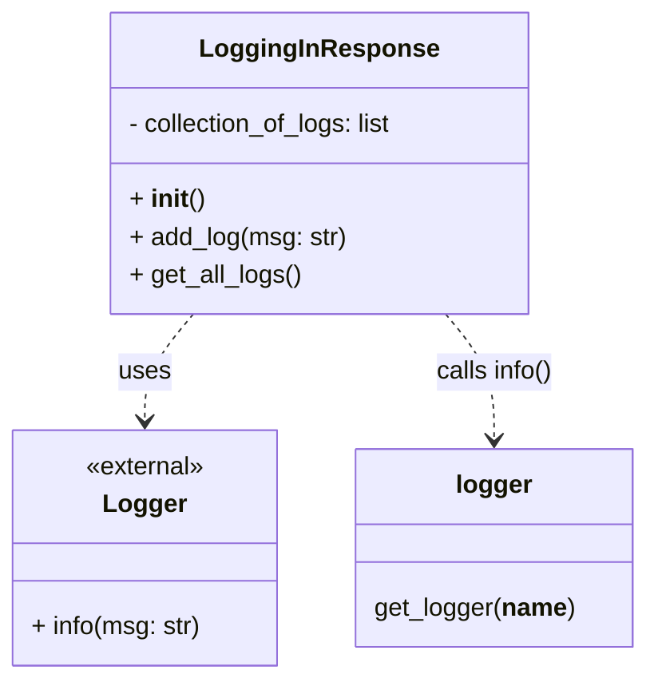

# Diagram: shipment_core/shipment_service/shipment_service/eta/helpers/logging_in_response.py

> Auto-generated by Obscura crawlers

## Mermaid

### SVG

<svg id="container" width="410.6640625" xmlns="http://www.w3.org/2000/svg" class="classDiagram" height="432" viewBox="0 0 410.6640625 432" role="graphics-document document" aria-roledescription="class"><g><defs><marker id="container_class-aggregationStart" class="marker aggregation class" refX="18" refY="7" markerWidth="190" markerHeight="240" orient="auto"><path d="M 18,7 L9,13 L1,7 L9,1 Z"></path></marker></defs><defs><marker id="container_class-aggregationEnd" class="marker aggregation class" refX="1" refY="7" markerWidth="20" markerHeight="28" orient="auto"><path d="M 18,7 L9,13 L1,7 L9,1 Z"></path></marker></defs><defs><marker id="container_class-extensionStart" class="marker extension class" refX="18" refY="7" markerWidth="190" markerHeight="240" orient="auto"><path d="M 1,7 L18,13 V 1 Z"></path></marker></defs><defs><marker id="container_class-extensionEnd" class="marker extension class" refX="1" refY="7" markerWidth="20" markerHeight="28" orient="auto"><path d="M 1,1 V 13 L18,7 Z"></path></marker></defs><defs><marker id="container_class-compositionStart" class="marker composition class" refX="18" refY="7" markerWidth="190" markerHeight="240" orient="auto"><path d="M 18,7 L9,13 L1,7 L9,1 Z"></path></marker></defs><defs><marker id="container_class-compositionEnd" class="marker composition class" refX="1" refY="7" markerWidth="20" markerHeight="28" orient="auto"><path d="M 18,7 L9,13 L1,7 L9,1 Z"></path></marker></defs><defs><marker id="container_class-dependencyStart" class="marker dependency class" refX="6" refY="7" markerWidth="190" markerHeight="240" orient="auto"><path d="M 5,7 L9,13 L1,7 L9,1 Z"></path></marker></defs><defs><marker id="container_class-dependencyEnd" class="marker dependency class" refX="13" refY="7" markerWidth="20" markerHeight="28" orient="auto"><path d="M 18,7 L9,13 L14,7 L9,1 Z"></path></marker></defs><defs><marker id="container_class-lollipopStart" class="marker lollipop class" refX="13" refY="7" markerWidth="190" markerHeight="240" orient="auto"><circle stroke="black" fill="transparent" cx="7" cy="7" r="6"></circle></marker></defs><defs><marker id="container_class-lollipopEnd" class="marker lollipop class" refX="1" refY="7" markerWidth="190" markerHeight="240" orient="auto"><circle stroke="black" fill="transparent" cx="7" cy="7" r="6"></circle></marker></defs><g class="root"><g class="clusters"></g><g class="edgePaths"><path d="M124.277,200L119.123,206.167C113.969,212.333,103.66,224.667,98.506,236C93.352,247.333,93.352,257.667,93.352,262.833L93.352,268" id="id_LoggingInResponse_Logger_1" class="edge-thickness-normal edge-pattern-dashed relation" style=";;;" data-edge="true" data-et="edge" data-id="id_LoggingInResponse_Logger_1" data-points="W3sieCI6MTI0LjI3NzQ0NjU0NjA1MjYzLCJ5IjoyMDB9LHsieCI6OTMuMzUxNTYyNSwieSI6MjM3fSx7IngiOjkzLjM1MTU2MjUsInkiOjI3NH1d" marker-end="url(#container_class-dependencyEnd)"></path><path d="M284.758,200L289.912,206.167C295.066,212.333,305.375,224.667,310.529,238C315.684,251.333,315.684,265.667,315.684,272.833L315.684,280" id="id_LoggingInResponse_logger_2" class="edge-thickness-normal edge-pattern-dashed relation" style=";;;" data-edge="true" data-et="edge" data-id="id_LoggingInResponse_logger_2" data-points="W3sieCI6Mjg0Ljc1NzcwOTcwMzk0NzQsInkiOjIwMH0seyJ4IjozMTUuNjgzNTkzNzUsInkiOjIzN30seyJ4IjozMTUuNjgzNTkzNzUsInkiOjI4Nn1d" marker-end="url(#container_class-dependencyEnd)"></path></g><g class="edgeLabels"><g class="edgeLabel" transform="translate(93.3515625, 237)"><g class="label" data-id="id_LoggingInResponse_Logger_1" transform="translate(-16.4921875, -12)"><foreignObject width="32.984375" height="24">

uses

</foreignObject></g></g><g class="edgeLabel" transform="translate(315.68359375, 237)"><g class="label" data-id="id_LoggingInResponse_logger_2" transform="translate(-37.9609375, -12)"><foreignObject width="75.921875" height="24">

calls info()

</foreignObject></g></g></g><g class="nodes"><g class="node default" id="classId-LoggingInResponse-0" transform="translate(204.517578125, 104)"><g class="basic label-container"><path d="M-133.828125 -96 L133.828125 -96 L133.828125 96 L-133.828125 96" stroke="none" stroke-width="0" fill="#ECECFF" style=""></path><path d="M-133.828125 -96 C-75.78293772330917 -96, -17.737750446618335 -96, 133.828125 -96 M-133.828125 -96 C-29.794860175336822 -96, 74.23840464932636 -96, 133.828125 -96 M133.828125 -96 C133.828125 -36.81653738841639, 133.828125 22.366925223167215, 133.828125 96 M133.828125 -96 C133.828125 -53.0657693356296, 133.828125 -10.131538671259193, 133.828125 96 M133.828125 96 C71.66174720834593 96, 9.495369416691858 96, -133.828125 96 M133.828125 96 C64.84400990765394 96, -4.140105184692118 96, -133.828125 96 M-133.828125 96 C-133.828125 31.4414095205085, -133.828125 -33.117180958983, -133.828125 -96 M-133.828125 96 C-133.828125 33.59439818740465, -133.828125 -28.8112036251907, -133.828125 -96" stroke="#9370DB" stroke-width="1.3" fill="none" stroke-dasharray="0 0" style=""></path></g><g class="annotation-group text" transform="translate(0, -72)"></g><g class="label-group text" transform="translate(-71.078125, -72)"><g class="label" style="font-weight: bolder" transform="translate(0,-12)"><foreignObject width="142.15625" height="24">

LoggingInResponse

</foreignObject></g></g><g class="members-group text" transform="translate(-121.828125, -24)"><g class="label" style="" transform="translate(0,-12)"><foreignObject width="172.578125" height="24">

- collection_of_logs: list

</foreignObject></g></g><g class="methods-group text" transform="translate(-121.828125, 24)"><g class="label" style="" transform="translate(0,-12)"><foreignObject width="47.046875" height="24">

+ <strong>init</strong>()

</foreignObject></g><g class="label" style="" transform="translate(0,12)"><foreignObject width="137.875" height="24">

+ add_log(msg: str)

</foreignObject></g><g class="label" style="" transform="translate(0,36)"><foreignObject width="108.875" height="24">

+ get_all_logs()

</foreignObject></g></g><g class="divider" style=""><path d="M-133.828125 -48 C-31.630591824230024 -48, 70.56694135153995 -48, 133.828125 -48 M-133.828125 -48 C-54.336312254468794 -48, 25.155500491062412 -48, 133.828125 -48" stroke="#9370DB" stroke-width="1.3" fill="none" stroke-dasharray="0 0" style=""></path></g><g class="divider" style=""><path d="M-133.828125 0 C-27.264802957210946 0, 79.2985190855781 0, 133.828125 0 M-133.828125 0 C-28.15064419317288 0, 77.52683661365424 0, 133.828125 0" stroke="#9370DB" stroke-width="1.3" fill="none" stroke-dasharray="0 0" style=""></path></g></g><g class="node default" id="classId-Logger-1" transform="translate(93.3515625, 349)"><g class="basic label-container"><path d="M-85.3515625 -75 L85.3515625 -75 L85.3515625 75 L-85.3515625 75" stroke="none" stroke-width="0" fill="#ECECFF" style=""></path><path d="M-85.3515625 -75 C-44.009964049282885 -75, -2.668365598565771 -75, 85.3515625 -75 M-85.3515625 -75 C-48.96999809424831 -75, -12.588433688496622 -75, 85.3515625 -75 M85.3515625 -75 C85.3515625 -29.222970210057852, 85.3515625 16.554059579884296, 85.3515625 75 M85.3515625 -75 C85.3515625 -25.059485835738585, 85.3515625 24.88102832852283, 85.3515625 75 M85.3515625 75 C34.33289409010082 75, -16.685774319798355 75, -85.3515625 75 M85.3515625 75 C35.61528641111073 75, -14.120989677778539 75, -85.3515625 75 M-85.3515625 75 C-85.3515625 35.649698241401225, -85.3515625 -3.7006035171975498, -85.3515625 -75 M-85.3515625 75 C-85.3515625 29.20640000870587, -85.3515625 -16.58719998258826, -85.3515625 -75" stroke="#9370DB" stroke-width="1.3" fill="none" stroke-dasharray="0 0" style=""></path></g><g class="annotation-group text" transform="translate(-38.65625, -51)"><g class="label" style="" transform="translate(0,-12)"><foreignObject width="77.3125" height="24">

«external»

</foreignObject></g></g><g class="label-group text" transform="translate(-24.84375, -27)"><g class="label" style="font-weight: bolder" transform="translate(0,-12)"><foreignObject width="49.6875" height="24">

Logger

</foreignObject></g></g><g class="members-group text" transform="translate(-73.3515625, 21)"></g><g class="methods-group text" transform="translate(-73.3515625, 51)"><g class="label" style="" transform="translate(0,-12)"><foreignObject width="108.046875" height="24">

+ info(msg: str)

</foreignObject></g></g><g class="divider" style=""><path d="M-85.3515625 -3 C-36.53712130779341 -3, 12.277319884413174 -3, 85.3515625 -3 M-85.3515625 -3 C-28.59582626639166 -3, 28.159909967216677 -3, 85.3515625 -3" stroke="#9370DB" stroke-width="1.3" fill="none" stroke-dasharray="0 0" style=""></path></g><g class="divider" style=""><path d="M-85.3515625 21 C-18.033658279040566 21, 49.28424594191887 21, 85.3515625 21 M-85.3515625 21 C-48.318399135270646 21, -11.285235770541291 21, 85.3515625 21" stroke="#9370DB" stroke-width="1.3" fill="none" stroke-dasharray="0 0" style=""></path></g></g><g class="node default" id="classId-logger-2" transform="translate(315.68359375, 349)"><g class="basic label-container"><path d="M-86.98046875 -63 L86.98046875 -63 L86.98046875 63 L-86.98046875 63" stroke="none" stroke-width="0" fill="#ECECFF" style=""></path><path d="M-86.98046875 -63 C-31.318629995970007 -63, 24.343208758059987 -63, 86.98046875 -63 M-86.98046875 -63 C-45.49765336742837 -63, -4.01483798485674 -63, 86.98046875 -63 M86.98046875 -63 C86.98046875 -31.359722162315634, 86.98046875 0.28055567536873127, 86.98046875 63 M86.98046875 -63 C86.98046875 -23.933940113369715, 86.98046875 15.13211977326057, 86.98046875 63 M86.98046875 63 C30.173417129980457 63, -26.633634490039086 63, -86.98046875 63 M86.98046875 63 C25.559690741400125 63, -35.86108726719975 63, -86.98046875 63 M-86.98046875 63 C-86.98046875 24.815469905858244, -86.98046875 -13.369060188283513, -86.98046875 -63 M-86.98046875 63 C-86.98046875 21.556596374644727, -86.98046875 -19.886807250710547, -86.98046875 -63" stroke="#9370DB" stroke-width="1.3" fill="none" stroke-dasharray="0 0" style=""></path></g><g class="annotation-group text" transform="translate(0, -39)"></g><g class="label-group text" transform="translate(-23.2734375, -39)"><g class="label" style="font-weight: bolder" transform="translate(0,-12)"><foreignObject width="46.546875" height="24">

logger

</foreignObject></g></g><g class="members-group text" transform="translate(-74.98046875, 9)"></g><g class="methods-group text" transform="translate(-74.98046875, 39)"><g class="label" style="" transform="translate(0,-12)"><foreignObject width="126.6875" height="24">

get_logger(<strong>name</strong>)

</foreignObject></g></g><g class="divider" style=""><path d="M-86.98046875 -15 C-20.77610693266662 -15, 45.42825488466676 -15, 86.98046875 -15 M-86.98046875 -15 C-23.0706645673908 -15, 40.8391396152184 -15, 86.98046875 -15" stroke="#9370DB" stroke-width="1.3" fill="none" stroke-dasharray="0 0" style=""></path></g><g class="divider" style=""><path d="M-86.98046875 9 C-24.454490240910054 9, 38.07148826817989 9, 86.98046875 9 M-86.98046875 9 C-44.80993301127092 9, -2.639397272541842 9, 86.98046875 9" stroke="#9370DB" stroke-width="1.3" fill="none" stroke-dasharray="0 0" style=""></path></g></g></g></g></g></svg>
