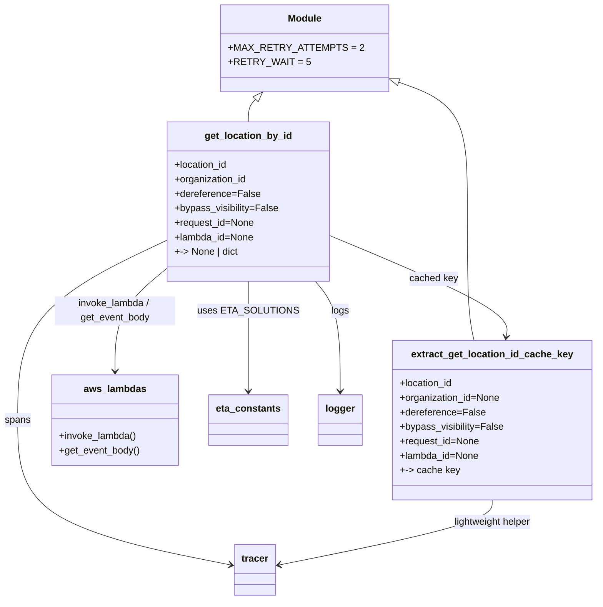

# Diagram: shipment_core/shipment_service/shipment_service/eta/invokers/locations_invoker.py


> Auto-generated by Obscura crawlers

## Diagram 1



### SVG

<svg id="container" width="971.859375" xmlns="http://www.w3.org/2000/svg" class="classDiagram" height="994" viewBox="0 0 971.859375 994" role="graphics-document document" aria-roledescription="class"><style>#container{font-family:"trebuchet ms",verdana,arial,sans-serif;font-size:16px;fill:#333;}@keyframes edge-animation-frame{from{stroke-dashoffset:0;}}@keyframes dash{to{stroke-dashoffset:0;}}#container .edge-animation-slow{stroke-dasharray:9,5!important;stroke-dashoffset:900;animation:dash 50s linear infinite;stroke-linecap:round;}#container .edge-animation-fast{stroke-dasharray:9,5!important;stroke-dashoffset:900;animation:dash 20s linear infinite;stroke-linecap:round;}#container .error-icon{fill:#552222;}#container .error-text{fill:#552222;stroke:#552222;}#container .edge-thickness-normal{stroke-width:1px;}#container .edge-thickness-thick{stroke-width:3.5px;}#container .edge-pattern-solid{stroke-dasharray:0;}#container .edge-thickness-invisible{stroke-width:0;fill:none;}#container .edge-pattern-dashed{stroke-dasharray:3;}#container .edge-pattern-dotted{stroke-dasharray:2;}#container .marker{fill:#333333;stroke:#333333;}#container .marker.cross{stroke:#333333;}#container svg{font-family:"trebuchet ms",verdana,arial,sans-serif;font-size:16px;}#container p{margin:0;}#container g.classGroup text{fill:#9370DB;stroke:none;font-family:"trebuchet ms",verdana,arial,sans-serif;font-size:10px;}#container g.classGroup text .title{font-weight:bolder;}#container .nodeLabel,#container .edgeLabel{color:#131300;}#container .edgeLabel .label rect{fill:#ECECFF;}#container .label text{fill:#131300;}#container .labelBkg{background:#ECECFF;}#container .edgeLabel .label span{background:#ECECFF;}#container .classTitle{font-weight:bolder;}#container .node rect,#container .node circle,#container .node ellipse,#container .node polygon,#container .node path{fill:#ECECFF;stroke:#9370DB;stroke-width:1px;}#container .divider{stroke:#9370DB;stroke-width:1;}#container g.clickable{cursor:pointer;}#container g.classGroup rect{fill:#ECECFF;stroke:#9370DB;}#container g.classGroup line{stroke:#9370DB;stroke-width:1;}#container .classLabel .box{stroke:none;stroke-width:0;fill:#ECECFF;opacity:0.5;}#container .classLabel .label{fill:#9370DB;font-size:10px;}#container .relation{stroke:#333333;stroke-width:1;fill:none;}#container .dashed-line{stroke-dasharray:3;}#container .dotted-line{stroke-dasharray:1 2;}#container #compositionStart,#container .composition{fill:#333333!important;stroke:#333333!important;stroke-width:1;}#container #compositionEnd,#container .composition{fill:#333333!important;stroke:#333333!important;stroke-width:1;}#container #dependencyStart,#container .dependency{fill:#333333!important;stroke:#333333!important;stroke-width:1;}#container #dependencyStart,#container .dependency{fill:#333333!important;stroke:#333333!important;stroke-width:1;}#container #extensionStart,#container .extension{fill:transparent!important;stroke:#333333!important;stroke-width:1;}#container #extensionEnd,#container .extension{fill:transparent!important;stroke:#333333!important;stroke-width:1;}#container #aggregationStart,#container .aggregation{fill:transparent!important;stroke:#333333!important;stroke-width:1;}#container #aggregationEnd,#container .aggregation{fill:transparent!important;stroke:#333333!important;stroke-width:1;}#container #lollipopStart,#container .lollipop{fill:#ECECFF!important;stroke:#333333!important;stroke-width:1;}#container #lollipopEnd,#container .lollipop{fill:#ECECFF!important;stroke:#333333!important;stroke-width:1;}#container .edgeTerminals{font-size:11px;line-height:initial;}#container .classTitleText{text-anchor:middle;font-size:18px;fill:#333;}#container .label-icon{display:inline-block;height:1em;overflow:visible;vertical-align:-0.125em;}#container .node .label-icon path{fill:currentColor;stroke:revert;stroke-width:revert;}#container :root{--mermaid-font-family:"trebuchet ms",verdana,arial,sans-serif;}</style><g><defs><marker id="container_class-aggregationStart" class="marker aggregation class" refX="18" refY="7" markerWidth="190" markerHeight="240" orient="auto"><path d="M 18,7 L9,13 L1,7 L9,1 Z"></path></marker></defs><defs><marker id="container_class-aggregationEnd" class="marker aggregation class" refX="1" refY="7" markerWidth="20" markerHeight="28" orient="auto"><path d="M 18,7 L9,13 L1,7 L9,1 Z"></path></marker></defs><defs><marker id="container_class-extensionStart" class="marker extension class" refX="18" refY="7" markerWidth="190" markerHeight="240" orient="auto"><path d="M 1,7 L18,13 V 1 Z"></path></marker></defs><defs><marker id="container_class-extensionEnd" class="marker extension class" refX="1" refY="7" markerWidth="20" markerHeight="28" orient="auto"><path d="M 1,1 V 13 L18,7 Z"></path></marker></defs><defs><marker id="container_class-compositionStart" class="marker composition class" refX="18" refY="7" markerWidth="190" markerHeight="240" orient="auto"><path d="M 18,7 L9,13 L1,7 L9,1 Z"></path></marker></defs><defs><marker id="container_class-compositionEnd" class="marker composition class" refX="1" refY="7" markerWidth="20" markerHeight="28" orient="auto"><path d="M 18,7 L9,13 L1,7 L9,1 Z"></path></marker></defs><defs><marker id="container_class-dependencyStart" class="marker dependency class" refX="6" refY="7" markerWidth="190" markerHeight="240" orient="auto"><path d="M 5,7 L9,13 L1,7 L9,1 Z"></path></marker></defs><defs><marker id="container_class-dependencyEnd" class="marker dependency class" refX="13" refY="7" markerWidth="20" markerHeight="28" orient="auto"><path d="M 18,7 L9,13 L14,7 L9,1 Z"></path></marker></defs><defs><marker id="container_class-lollipopStart" class="marker lollipop class" refX="13" refY="7" markerWidth="190" markerHeight="240" orient="auto"><circle stroke="black" fill="transparent" cx="7" cy="7" r="6"></circle></marker></defs><defs><marker id="container_class-lollipopEnd" class="marker lollipop class" refX="1" refY="7" markerWidth="190" markerHeight="240" orient="auto"><circle stroke="black" fill="transparent" cx="7" cy="7" r="6"></circle></marker></defs><g class="root"><g class="clusters"></g><g class="edgePaths"><path d="M417.956,164.527L415.988,166.606C414.02,168.685,410.084,172.842,408.116,179.088C406.148,185.333,406.148,193.667,406.148,197.833L406.148,202" id="id_Module_get_location_by_id_1" class="edge-thickness-normal edge-pattern-solid relation" style=";;;" data-edge="true" data-et="edge" data-id="id_Module_get_location_by_id_1" data-points="W3sieCI6NDI5LjgxNTQ4MDAyNTc3MzIsInkiOjE1Mn0seyJ4Ijo0MDYuMTQ4NDM3NSwieSI6MTc3fSx7IngiOjQwNi4xNDg0Mzc1LCJ5IjoyMDJ9XQ==" marker-start="url(#container_class-extensionStart)"></path><path d="M636.755,130.955L657.656,138.629C678.557,146.304,720.359,161.652,741.259,195.493C762.16,229.333,762.16,281.667,762.16,338C762.16,394.333,762.16,454.667,763.96,493C765.761,531.333,769.361,547.667,771.161,555.833L772.961,564" id="id_Module_extract_get_location_id_cache_key_2" class="edge-thickness-normal edge-pattern-solid relation" style=";;;" data-edge="true" data-et="edge" data-id="id_Module_extract_get_location_id_cache_key_2" data-points="W3sieCI6NjIwLjU2MjUsInkiOjEyNS4wMDk3NDQwNTIyODM3MX0seyJ4Ijo3NjIuMTYwMTU2MjUsInkiOjE3N30seyJ4Ijo3NjIuMTYwMTU2MjUsInkiOjMzNH0seyJ4Ijo3NjIuMTYwMTU2MjUsInkiOjUxNX0seyJ4Ijo3NzIuOTYxMzkwNzExMzI2LCJ5Ijo1NjR9XQ==" marker-start="url(#container_class-extensionStart)"></path><path d="M538.426,390.203L587.378,411.003C636.331,431.802,734.236,473.401,781.995,501.381C829.754,529.36,827.367,543.721,826.174,550.901L824.981,558.081" id="id_get_location_by_id_extract_get_location_id_cache_key_3" class="edge-thickness-normal edge-pattern-solid relation" style=";;;" data-edge="true" data-et="edge" data-id="id_get_location_by_id_extract_get_location_id_cache_key_3" data-points="W3sieCI6NTM4LjQyNTc4MTI1LCJ5IjozOTAuMjAzMzc2MzA4OTg0NTZ9LHsieCI6ODMyLjE0MDYyNSwieSI6NTE1fSx7IngiOjgyMy45OTY4NzA2ODM3MDE3LCJ5Ijo1NjR9XQ==" marker-end="url(#container_class-dependencyEnd)"></path><path d="M273.871,444.247L259.723,456.039C245.574,467.832,217.277,491.416,203.129,519.875C188.98,548.333,188.98,581.667,188.98,598.333L188.98,615" id="id_get_location_by_id_aws_lambdas_4" class="edge-thickness-normal edge-pattern-solid relation" style=";;;" data-edge="true" data-et="edge" data-id="id_get_location_by_id_aws_lambdas_4" data-points="W3sieCI6MjczLjg3MTA5Mzc1LCJ5Ijo0NDQuMjQ3Mzc4MzYxMzYzNH0seyJ4IjoxODguOTgwNDY4NzUsInkiOjUxNX0seyJ4IjoxODguOTgwNDY4NzUsInkiOjYyMX1d" marker-end="url(#container_class-dependencyEnd)"></path><path d="M406.148,466L406.148,474.167C406.148,482.333,406.148,498.667,406.148,529C406.148,559.333,406.148,603.667,406.148,625.833L406.148,648" id="id_get_location_by_id_eta_constants_5" class="edge-thickness-normal edge-pattern-solid relation" style=";;;" data-edge="true" data-et="edge" data-id="id_get_location_by_id_eta_constants_5" data-points="W3sieCI6NDA2LjE0ODQzNzUsInkiOjQ2Nn0seyJ4Ijo0MDYuMTQ4NDM3NSwieSI6NTE1fSx7IngiOjQwNi4xNDg0Mzc1LCJ5Ijo2NTR9XQ==" marker-end="url(#container_class-dependencyEnd)"></path><path d="M514.692,466L521.407,474.167C528.123,482.333,541.554,498.667,548.269,529C554.984,559.333,554.984,603.667,554.984,625.833L554.984,648" id="id_get_location_by_id_logger_6" class="edge-thickness-normal edge-pattern-solid relation" style=";;;" data-edge="true" data-et="edge" data-id="id_get_location_by_id_logger_6" data-points="W3sieCI6NTE0LjY5MTc3MzEzNTM1OTEsInkiOjQ2Nn0seyJ4Ijo1NTQuOTg0Mzc1LCJ5Ijo1MTV9LHsieCI6NTU0Ljk4NDM3NSwieSI6NjU0fV0=" marker-end="url(#container_class-dependencyEnd)"></path><path d="M273.871,397.514L233.09,417.095C192.31,436.676,110.749,475.838,69.968,525.586C29.188,575.333,29.188,635.667,29.188,694C29.188,752.333,29.188,808.667,86.997,848.651C144.806,888.636,260.424,912.272,318.233,924.09L376.042,935.908" id="id_get_location_by_id_tracer_7" class="edge-thickness-normal edge-pattern-solid relation" style=";;;" data-edge="true" data-et="edge" data-id="id_get_location_by_id_tracer_7" data-points="W3sieCI6MjczLjg3MTA5Mzc1LCJ5IjozOTcuNTEzNzQwNjQ3ODYyMn0seyJ4IjoyOS4xODc1LCJ5Ijo1MTV9LHsieCI6MjkuMTg3NSwieSI6Njk2fSx7IngiOjI5LjE4NzUsInkiOjg2NX0seyJ4IjozODEuOTE5OTIxODc1LCJ5Ijo5MzcuMTA5OTg0NTg0NjcwNX1d" marker-end="url(#container_class-dependencyEnd)"></path><path d="M802.059,828L802.059,834.167C802.059,840.333,802.059,852.667,744.25,870.651C686.441,888.636,570.823,912.272,513.014,924.09L455.205,935.908" id="id_extract_get_location_id_cache_key_tracer_8" class="edge-thickness-normal edge-pattern-solid relation" style=";;;" data-edge="true" data-et="edge" data-id="id_extract_get_location_id_cache_key_tracer_8" data-points="W3sieCI6ODAyLjA1ODU5Mzc1LCJ5Ijo4Mjh9LHsieCI6ODAyLjA1ODU5Mzc1LCJ5Ijo4NjV9LHsieCI6NDQ5LjMyNjE3MTg3NSwieSI6OTM3LjEwOTk4NDU4NDY3MDV9XQ==" marker-end="url(#container_class-dependencyEnd)"></path></g><g class="edgeLabels"><g class="edgeLabel"><g class="label" data-id="id_Module_get_location_by_id_1" transform="translate(0, 0)"><foreignObject width="0" height="0"><div xmlns="http://www.w3.org/1999/xhtml" class="labelBkg" style="display: table-cell; white-space: nowrap; line-height: 1.5; max-width: 200px; text-align: center;"><span class="edgeLabel"></span></div></foreignObject></g></g><g class="edgeLabel"><g class="label" data-id="id_Module_extract_get_location_id_cache_key_2" transform="translate(0, 0)"><foreignObject width="0" height="0"><div xmlns="http://www.w3.org/1999/xhtml" class="labelBkg" style="display: table-cell; white-space: nowrap; line-height: 1.5; max-width: 200px; text-align: center;"><span class="edgeLabel"></span></div></foreignObject></g></g><g class="edgeLabel" transform="translate(708.1415, 462.31396)"><g class="label" data-id="id_get_location_by_id_extract_get_location_id_cache_key_3" transform="translate(-40.1640625, -12)"><foreignObject width="80.328125" height="24"><div xmlns="http://www.w3.org/1999/xhtml" class="labelBkg" style="display: table-cell; white-space: nowrap; line-height: 1.5; max-width: 200px; text-align: center;"><span class="edgeLabel"><p>cached key</p></span></div></foreignObject></g></g><g class="edgeLabel" transform="translate(188.98046875, 515)"><g class="label" data-id="id_get_location_by_id_aws_lambdas_4" transform="translate(-100, -24)"><foreignObject width="200" height="48"><div xmlns="http://www.w3.org/1999/xhtml" class="labelBkg" style="display: table; white-space: break-spaces; line-height: 1.5; max-width: 200px; text-align: center; width: 200px;"><span class="edgeLabel"><p>invoke_lambda / get_event_body</p></span></div></foreignObject></g></g><g class="edgeLabel" transform="translate(406.1484375, 515)"><g class="label" data-id="id_get_location_by_id_eta_constants_5" transform="translate(-76.046875, -12)"><foreignObject width="152.09375" height="24"><div xmlns="http://www.w3.org/1999/xhtml" class="labelBkg" style="display: table-cell; white-space: nowrap; line-height: 1.5; max-width: 200px; text-align: center;"><span class="edgeLabel"><p>uses ETA_SOLUTIONS</p></span></div></foreignObject></g></g><g class="edgeLabel" transform="translate(554.984375, 515)"><g class="label" data-id="id_get_location_by_id_logger_6" transform="translate(-14.8203125, -12)"><foreignObject width="29.640625" height="24"><div xmlns="http://www.w3.org/1999/xhtml" class="labelBkg" style="display: table-cell; white-space: nowrap; line-height: 1.5; max-width: 200px; text-align: center;"><span class="edgeLabel"><p>logs</p></span></div></foreignObject></g></g><g class="edgeLabel" transform="translate(29.1875, 696)"><g class="label" data-id="id_get_location_by_id_tracer_7" transform="translate(-21.1875, -12)"><foreignObject width="42.375" height="24"><div xmlns="http://www.w3.org/1999/xhtml" class="labelBkg" style="display: table-cell; white-space: nowrap; line-height: 1.5; max-width: 200px; text-align: center;"><span class="edgeLabel"><p>spans</p></span></div></foreignObject></g></g><g class="edgeLabel" transform="translate(802.05859375, 865)"><g class="label" data-id="id_extract_get_location_id_cache_key_tracer_8" transform="translate(-66.140625, -12)"><foreignObject width="132.28125" height="24"><div xmlns="http://www.w3.org/1999/xhtml" class="labelBkg" style="display: table-cell; white-space: nowrap; line-height: 1.5; max-width: 200px; text-align: center;"><span class="edgeLabel"><p>lightweight helper</p></span></div></foreignObject></g></g></g><g class="nodes"><g class="node default" id="classId-Module-0" transform="translate(497.9765625, 80)"><g class="basic label-container"><path d="M-122.5859375 -72 L122.5859375 -72 L122.5859375 72 L-122.5859375 72" stroke="none" stroke-width="0" fill="#ECECFF" style=""></path><path d="M-122.5859375 -72 C-51.535775209112444 -72, 19.514387081775112 -72, 122.5859375 -72 M-122.5859375 -72 C-68.3657911441141 -72, -14.14564478822821 -72, 122.5859375 -72 M122.5859375 -72 C122.5859375 -19.32612953178908, 122.5859375 33.34774093642184, 122.5859375 72 M122.5859375 -72 C122.5859375 -36.31660739704295, 122.5859375 -0.6332147940859016, 122.5859375 72 M122.5859375 72 C65.51420396015276 72, 8.442470420305511 72, -122.5859375 72 M122.5859375 72 C67.03429619221079 72, 11.482654884421578 72, -122.5859375 72 M-122.5859375 72 C-122.5859375 17.954175147504806, -122.5859375 -36.09164970499039, -122.5859375 -72 M-122.5859375 72 C-122.5859375 39.6744157742507, -122.5859375 7.348831548501394, -122.5859375 -72" stroke="#9370DB" stroke-width="1.3" fill="none" stroke-dasharray="0 0" style=""></path></g><g class="annotation-group text" transform="translate(0, -48)"></g><g class="label-group text" transform="translate(-27.09375, -48)"><g class="label" style="font-weight: bolder" transform="translate(0,-12)"><foreignObject width="54.1875" height="24"><div xmlns="http://www.w3.org/1999/xhtml" style="display: table-cell; white-space: nowrap; line-height: 1.5; max-width: 104px; text-align: center;"><span class="nodeLabel markdown-node-label" style=""><p>Module</p></span></div></foreignObject></g></g><g class="members-group text" transform="translate(-110.5859375, 0)"><g class="label" style="" transform="translate(0,-12)"><foreignObject width="194.078125" height="24"><div xmlns="http://www.w3.org/1999/xhtml" style="display: table-cell; white-space: nowrap; line-height: 1.5; max-width: 252px; text-align: center;"><span class="nodeLabel markdown-node-label" style=""><p>+MAX_RETRY_ATTEMPTS = 2</p></span></div></foreignObject></g><g class="label" style="" transform="translate(0,12)"><foreignObject width="118.515625" height="24"><div xmlns="http://www.w3.org/1999/xhtml" style="display: table-cell; white-space: nowrap; line-height: 1.5; max-width: 176px; text-align: center;"><span class="nodeLabel markdown-node-label" style=""><p>+RETRY_WAIT = 5</p></span></div></foreignObject></g></g><g class="methods-group text" transform="translate(-110.5859375, 72)"></g><g class="divider" style=""><path d="M-122.5859375 -24 C-56.08514657152607 -24, 10.415644356947865 -24, 122.5859375 -24 M-122.5859375 -24 C-55.94545485062311 -24, 10.695027798753785 -24, 122.5859375 -24" stroke="#9370DB" stroke-width="1.3" fill="none" stroke-dasharray="0 0" style=""></path></g><g class="divider" style=""><path d="M-122.5859375 48 C-50.431595897872995 48, 21.72274570425401 48, 122.5859375 48 M-122.5859375 48 C-68.93819482452989 48, -15.29045214905976 48, 122.5859375 48" stroke="#9370DB" stroke-width="1.3" fill="none" stroke-dasharray="0 0" style=""></path></g></g><g class="node default" id="classId-get_location_by_id-1" transform="translate(406.1484375, 334)"><g class="basic label-container"><path d="M-132.27734375 -132 L132.27734375 -132 L132.27734375 132 L-132.27734375 132" stroke="none" stroke-width="0" fill="#ECECFF" style=""></path><path d="M-132.27734375 -132 C-31.458256770542235 -132, 69.36083020891553 -132, 132.27734375 -132 M-132.27734375 -132 C-61.03743059138394 -132, 10.202482567232124 -132, 132.27734375 -132 M132.27734375 -132 C132.27734375 -63.145928977642754, 132.27734375 5.708142044714492, 132.27734375 132 M132.27734375 -132 C132.27734375 -70.02810710671406, 132.27734375 -8.056214213428134, 132.27734375 132 M132.27734375 132 C41.21759125399407 132, -49.842161242011855 132, -132.27734375 132 M132.27734375 132 C64.16850918498201 132, -3.940325380035972 132, -132.27734375 132 M-132.27734375 132 C-132.27734375 36.437566375024815, -132.27734375 -59.12486724995037, -132.27734375 -132 M-132.27734375 132 C-132.27734375 56.81468484996243, -132.27734375 -18.370630300075135, -132.27734375 -132" stroke="#9370DB" stroke-width="1.3" fill="none" stroke-dasharray="0 0" style=""></path></g><g class="annotation-group text" transform="translate(0, -108)"></g><g class="label-group text" transform="translate(-69.5859375, -108)"><g class="label" style="font-weight: bolder" transform="translate(0,-12)"><foreignObject width="139.171875" height="24"><div xmlns="http://www.w3.org/1999/xhtml" style="display: table-cell; white-space: nowrap; line-height: 1.5; max-width: 187px; text-align: center;"><span class="nodeLabel markdown-node-label" style=""><p>get_location_by_id</p></span></div></foreignObject></g></g><g class="members-group text" transform="translate(-120.27734375, -60)"><g class="label" style="" transform="translate(0,-12)"><foreignObject width="89.546875" height="24"><div xmlns="http://www.w3.org/1999/xhtml" style="display: table-cell; white-space: nowrap; line-height: 1.5; max-width: 147px; text-align: center;"><span class="nodeLabel markdown-node-label" style=""><p>+location_id</p></span></div></foreignObject></g><g class="label" style="" transform="translate(0,12)"><foreignObject width="120.75" height="24"><div xmlns="http://www.w3.org/1999/xhtml" style="display: table-cell; white-space: nowrap; line-height: 1.5; max-width: 178px; text-align: center;"><span class="nodeLabel markdown-node-label" style=""><p>+organization_id</p></span></div></foreignObject></g><g class="label" style="" transform="translate(0,36)"><foreignObject width="138.78125" height="24"><div xmlns="http://www.w3.org/1999/xhtml" style="display: table-cell; white-space: nowrap; line-height: 1.5; max-width: 196px; text-align: center;"><span class="nodeLabel markdown-node-label" style=""><p>+dereference=False</p></span></div></foreignObject></g><g class="label" style="" transform="translate(0,60)"><foreignObject width="170.96875" height="24"><div xmlns="http://www.w3.org/1999/xhtml" style="display: table-cell; white-space: nowrap; line-height: 1.5; max-width: 228px; text-align: center;"><span class="nodeLabel markdown-node-label" style=""><p>+bypass_visibility=False</p></span></div></foreignObject></g><g class="label" style="" transform="translate(0,84)"><foreignObject width="132.03125" height="24"><div xmlns="http://www.w3.org/1999/xhtml" style="display: table-cell; white-space: nowrap; line-height: 1.5; max-width: 189px; text-align: center;"><span class="nodeLabel markdown-node-label" style=""><p>+request_id=None</p></span></div></foreignObject></g><g class="label" style="" transform="translate(0,108)"><foreignObject width="131.5625" height="24"><div xmlns="http://www.w3.org/1999/xhtml" style="display: table-cell; white-space: nowrap; line-height: 1.5; max-width: 189px; text-align: center;"><span class="nodeLabel markdown-node-label" style=""><p>+lambda_id=None</p></span></div></foreignObject></g><g class="label" style="" transform="translate(0,132)"><foreignObject width="107.484375" height="24"><div xmlns="http://www.w3.org/1999/xhtml" style="display: table-cell; white-space: nowrap; line-height: 1.5; max-width: 186px; text-align: center;"><span class="nodeLabel markdown-node-label" style=""><p>+-&gt; None | dict</p></span></div></foreignObject></g></g><g class="methods-group text" transform="translate(-120.27734375, 132)"></g><g class="divider" style=""><path d="M-132.27734375 -84 C-56.10707135508497 -84, 20.063201039830062 -84, 132.27734375 -84 M-132.27734375 -84 C-45.63277464540256 -84, 41.011794459194874 -84, 132.27734375 -84" stroke="#9370DB" stroke-width="1.3" fill="none" stroke-dasharray="0 0" style=""></path></g><g class="divider" style=""><path d="M-132.27734375 108 C-60.36128241726314 108, 11.554778915473719 108, 132.27734375 108 M-132.27734375 108 C-40.7297748508569 108, 50.8177940482862 108, 132.27734375 108" stroke="#9370DB" stroke-width="1.3" fill="none" stroke-dasharray="0 0" style=""></path></g></g><g class="node default" id="classId-extract_get_location_id_cache_key-2" transform="translate(802.05859375, 696)"><g class="basic label-container"><path d="M-161.80078125 -132 L161.80078125 -132 L161.80078125 132 L-161.80078125 132" stroke="none" stroke-width="0" fill="#ECECFF" style=""></path><path d="M-161.80078125 -132 C-82.10250491780891 -132, -2.4042285856178296 -132, 161.80078125 -132 M-161.80078125 -132 C-61.87347711093744 -132, 38.05382702812511 -132, 161.80078125 -132 M161.80078125 -132 C161.80078125 -43.37982541585296, 161.80078125 45.240349168294074, 161.80078125 132 M161.80078125 -132 C161.80078125 -70.93585462876393, 161.80078125 -9.871709257527868, 161.80078125 132 M161.80078125 132 C71.22095821296237 132, -19.358864824075255 132, -161.80078125 132 M161.80078125 132 C84.19317322893016 132, 6.585565207860327 132, -161.80078125 132 M-161.80078125 132 C-161.80078125 30.193294206028582, -161.80078125 -71.61341158794284, -161.80078125 -132 M-161.80078125 132 C-161.80078125 63.23207169457869, -161.80078125 -5.535856610842615, -161.80078125 -132" stroke="#9370DB" stroke-width="1.3" fill="none" stroke-dasharray="0 0" style=""></path></g><g class="annotation-group text" transform="translate(0, -108)"></g><g class="label-group text" transform="translate(-128.6328125, -108)"><g class="label" style="font-weight: bolder" transform="translate(0,-12)"><foreignObject width="257.265625" height="24"><div xmlns="http://www.w3.org/1999/xhtml" style="display: table-cell; white-space: nowrap; line-height: 1.5; max-width: 303px; text-align: center;"><span class="nodeLabel markdown-node-label" style=""><p>extract_get_location_id_cache_key</p></span></div></foreignObject></g></g><g class="members-group text" transform="translate(-149.80078125, -60)"><g class="label" style="" transform="translate(0,-12)"><foreignObject width="89.546875" height="24"><div xmlns="http://www.w3.org/1999/xhtml" style="display: table-cell; white-space: nowrap; line-height: 1.5; max-width: 147px; text-align: center;"><span class="nodeLabel markdown-node-label" style=""><p>+location_id</p></span></div></foreignObject></g><g class="label" style="" transform="translate(0,12)"><foreignObject width="167.109375" height="24"><div xmlns="http://www.w3.org/1999/xhtml" style="display: table-cell; white-space: nowrap; line-height: 1.5; max-width: 224px; text-align: center;"><span class="nodeLabel markdown-node-label" style=""><p>+organization_id=None</p></span></div></foreignObject></g><g class="label" style="" transform="translate(0,36)"><foreignObject width="138.78125" height="24"><div xmlns="http://www.w3.org/1999/xhtml" style="display: table-cell; white-space: nowrap; line-height: 1.5; max-width: 196px; text-align: center;"><span class="nodeLabel markdown-node-label" style=""><p>+dereference=False</p></span></div></foreignObject></g><g class="label" style="" transform="translate(0,60)"><foreignObject width="170.96875" height="24"><div xmlns="http://www.w3.org/1999/xhtml" style="display: table-cell; white-space: nowrap; line-height: 1.5; max-width: 228px; text-align: center;"><span class="nodeLabel markdown-node-label" style=""><p>+bypass_visibility=False</p></span></div></foreignObject></g><g class="label" style="" transform="translate(0,84)"><foreignObject width="132.03125" height="24"><div xmlns="http://www.w3.org/1999/xhtml" style="display: table-cell; white-space: nowrap; line-height: 1.5; max-width: 189px; text-align: center;"><span class="nodeLabel markdown-node-label" style=""><p>+request_id=None</p></span></div></foreignObject></g><g class="label" style="" transform="translate(0,108)"><foreignObject width="131.5625" height="24"><div xmlns="http://www.w3.org/1999/xhtml" style="display: table-cell; white-space: nowrap; line-height: 1.5; max-width: 189px; text-align: center;"><span class="nodeLabel markdown-node-label" style=""><p>+lambda_id=None</p></span></div></foreignObject></g><g class="label" style="" transform="translate(0,132)"><foreignObject width="97.4375" height="24"><div xmlns="http://www.w3.org/1999/xhtml" style="display: table-cell; white-space: nowrap; line-height: 1.5; max-width: 176px; text-align: center;"><span class="nodeLabel markdown-node-label" style=""><p>+-&gt; cache key</p></span></div></foreignObject></g></g><g class="methods-group text" transform="translate(-149.80078125, 132)"></g><g class="divider" style=""><path d="M-161.80078125 -84 C-53.98172511015963 -84, 53.83733102968074 -84, 161.80078125 -84 M-161.80078125 -84 C-32.88788891593504 -84, 96.02500341812993 -84, 161.80078125 -84" stroke="#9370DB" stroke-width="1.3" fill="none" stroke-dasharray="0 0" style=""></path></g><g class="divider" style=""><path d="M-161.80078125 108 C-74.26806816654953 108, 13.264644916900949 108, 161.80078125 108 M-161.80078125 108 C-35.51360518803176 108, 90.77357087393648 108, 161.80078125 108" stroke="#9370DB" stroke-width="1.3" fill="none" stroke-dasharray="0 0" style=""></path></g></g><g class="node default" id="classId-aws_lambdas-3" transform="translate(188.98046875, 696)"><g class="basic label-container"><path d="M-103.60546875 -75 L103.60546875 -75 L103.60546875 75 L-103.60546875 75" stroke="none" stroke-width="0" fill="#ECECFF" style=""></path><path d="M-103.60546875 -75 C-37.198592381840385 -75, 29.20828398631923 -75, 103.60546875 -75 M-103.60546875 -75 C-42.75060144740534 -75, 18.104265855189325 -75, 103.60546875 -75 M103.60546875 -75 C103.60546875 -31.87275415123495, 103.60546875 11.2544916975301, 103.60546875 75 M103.60546875 -75 C103.60546875 -24.044641538063836, 103.60546875 26.91071692387233, 103.60546875 75 M103.60546875 75 C38.574301168646784 75, -26.456866412706432 75, -103.60546875 75 M103.60546875 75 C31.543838266698046 75, -40.51779221660391 75, -103.60546875 75 M-103.60546875 75 C-103.60546875 36.29734095028497, -103.60546875 -2.405318099430062, -103.60546875 -75 M-103.60546875 75 C-103.60546875 35.84040931695402, -103.60546875 -3.3191813660919536, -103.60546875 -75" stroke="#9370DB" stroke-width="1.3" fill="none" stroke-dasharray="0 0" style=""></path></g><g class="annotation-group text" transform="translate(0, -51)"></g><g class="label-group text" transform="translate(-49.3515625, -51)"><g class="label" style="font-weight: bolder" transform="translate(0,-12)"><foreignObject width="98.703125" height="24"><div xmlns="http://www.w3.org/1999/xhtml" style="display: table-cell; white-space: nowrap; line-height: 1.5; max-width: 148px; text-align: center;"><span class="nodeLabel markdown-node-label" style=""><p>aws_lambdas</p></span></div></foreignObject></g></g><g class="members-group text" transform="translate(-91.60546875, -3)"></g><g class="methods-group text" transform="translate(-91.60546875, 27)"><g class="label" style="" transform="translate(0,-12)"><foreignObject width="128.703125" height="24"><div xmlns="http://www.w3.org/1999/xhtml" style="display: table-cell; white-space: nowrap; line-height: 1.5; max-width: 186px; text-align: center;"><span class="nodeLabel markdown-node-label" style=""><p>+invoke_lambda()</p></span></div></foreignObject></g><g class="label" style="" transform="translate(0,12)"><foreignObject width="133.859375" height="24"><div xmlns="http://www.w3.org/1999/xhtml" style="display: table-cell; white-space: nowrap; line-height: 1.5; max-width: 191px; text-align: center;"><span class="nodeLabel markdown-node-label" style=""><p>+get_event_body()</p></span></div></foreignObject></g></g><g class="divider" style=""><path d="M-103.60546875 -27 C-23.912053126318852 -27, 55.781362497362295 -27, 103.60546875 -27 M-103.60546875 -27 C-57.016253324774574 -27, -10.427037899549148 -27, 103.60546875 -27" stroke="#9370DB" stroke-width="1.3" fill="none" stroke-dasharray="0 0" style=""></path></g><g class="divider" style=""><path d="M-103.60546875 -3 C-20.830249100040817 -3, 61.94497054991837 -3, 103.60546875 -3 M-103.60546875 -3 C-55.29400683711738 -3, -6.982544924234759 -3, 103.60546875 -3" stroke="#9370DB" stroke-width="1.3" fill="none" stroke-dasharray="0 0" style=""></path></g></g><g class="node default" id="classId-eta_constants-4" transform="translate(406.1484375, 696)"><g class="basic label-container"><path d="M-63.5625 -42 L63.5625 -42 L63.5625 42 L-63.5625 42" stroke="none" stroke-width="0" fill="#ECECFF" style=""></path><path d="M-63.5625 -42 C-18.475498684902583 -42, 26.611502630194835 -42, 63.5625 -42 M-63.5625 -42 C-31.695859679275245 -42, 0.170780641449511 -42, 63.5625 -42 M63.5625 -42 C63.5625 -21.465279059548948, 63.5625 -0.9305581190978955, 63.5625 42 M63.5625 -42 C63.5625 -13.359380440790144, 63.5625 15.281239118419712, 63.5625 42 M63.5625 42 C30.50498940693324 42, -2.552521186133518 42, -63.5625 42 M63.5625 42 C34.99770784036018 42, 6.432915680720363 42, -63.5625 42 M-63.5625 42 C-63.5625 18.273929054148553, -63.5625 -5.452141891702894, -63.5625 -42 M-63.5625 42 C-63.5625 11.241008597451017, -63.5625 -19.517982805097965, -63.5625 -42" stroke="#9370DB" stroke-width="1.3" fill="none" stroke-dasharray="0 0" style=""></path></g><g class="annotation-group text" transform="translate(0, -18)"></g><g class="label-group text" transform="translate(-51.5625, -18)"><g class="label" style="font-weight: bolder" transform="translate(0,-12)"><foreignObject width="103.125" height="24"><div xmlns="http://www.w3.org/1999/xhtml" style="display: table-cell; white-space: nowrap; line-height: 1.5; max-width: 152px; text-align: center;"><span class="nodeLabel markdown-node-label" style=""><p>eta_constants</p></span></div></foreignObject></g></g><g class="members-group text" transform="translate(-51.5625, 30)"></g><g class="methods-group text" transform="translate(-51.5625, 60)"></g><g class="divider" style=""><path d="M-63.5625 6 C-29.890135625226627 6, 3.7822287495467464 6, 63.5625 6 M-63.5625 6 C-12.86376203834368 6, 37.83497592331264 6, 63.5625 6" stroke="#9370DB" stroke-width="1.3" fill="none" stroke-dasharray="0 0" style=""></path></g><g class="divider" style=""><path d="M-63.5625 24 C-13.400095454195004 24, 36.76230909160999 24, 63.5625 24 M-63.5625 24 C-21.40423556347495 24, 20.754028873050103 24, 63.5625 24" stroke="#9370DB" stroke-width="1.3" fill="none" stroke-dasharray="0 0" style=""></path></g></g><g class="node default" id="classId-logger-5" transform="translate(554.984375, 696)"><g class="basic label-container"><path d="M-35.2734375 -42 L35.2734375 -42 L35.2734375 42 L-35.2734375 42" stroke="none" stroke-width="0" fill="#ECECFF" style=""></path><path d="M-35.2734375 -42 C-12.545708050882407 -42, 10.182021398235186 -42, 35.2734375 -42 M-35.2734375 -42 C-10.567118587960689 -42, 14.139200324078622 -42, 35.2734375 -42 M35.2734375 -42 C35.2734375 -8.632978988591667, 35.2734375 24.734042022816666, 35.2734375 42 M35.2734375 -42 C35.2734375 -17.67360523911016, 35.2734375 6.652789521779681, 35.2734375 42 M35.2734375 42 C15.778708943091228 42, -3.7160196138175436 42, -35.2734375 42 M35.2734375 42 C15.889204662537683 42, -3.4950281749246344 42, -35.2734375 42 M-35.2734375 42 C-35.2734375 16.98502999222499, -35.2734375 -8.029940015550018, -35.2734375 -42 M-35.2734375 42 C-35.2734375 23.208249828639524, -35.2734375 4.416499657279047, -35.2734375 -42" stroke="#9370DB" stroke-width="1.3" fill="none" stroke-dasharray="0 0" style=""></path></g><g class="annotation-group text" transform="translate(0, -18)"></g><g class="label-group text" transform="translate(-23.2734375, -18)"><g class="label" style="font-weight: bolder" transform="translate(0,-12)"><foreignObject width="46.546875" height="24"><div xmlns="http://www.w3.org/1999/xhtml" style="display: table-cell; white-space: nowrap; line-height: 1.5; max-width: 96px; text-align: center;"><span class="nodeLabel markdown-node-label" style=""><p>logger</p></span></div></foreignObject></g></g><g class="members-group text" transform="translate(-23.2734375, 30)"></g><g class="methods-group text" transform="translate(-23.2734375, 60)"></g><g class="divider" style=""><path d="M-35.2734375 6 C-8.094572329482869 6, 19.084292841034262 6, 35.2734375 6 M-35.2734375 6 C-8.593160002260039 6, 18.087117495479923 6, 35.2734375 6" stroke="#9370DB" stroke-width="1.3" fill="none" stroke-dasharray="0 0" style=""></path></g><g class="divider" style=""><path d="M-35.2734375 24 C-16.168865054769704 24, 2.9357073904605926 24, 35.2734375 24 M-35.2734375 24 C-15.97165397917449 24, 3.3301295416510186 24, 35.2734375 24" stroke="#9370DB" stroke-width="1.3" fill="none" stroke-dasharray="0 0" style=""></path></g></g><g class="node default" id="classId-tracer-6" transform="translate(415.623046875, 944)"><g class="basic label-container"><path d="M-33.703125 -42 L33.703125 -42 L33.703125 42 L-33.703125 42" stroke="none" stroke-width="0" fill="#ECECFF" style=""></path><path d="M-33.703125 -42 C-15.126686880584078 -42, 3.449751238831844 -42, 33.703125 -42 M-33.703125 -42 C-17.184941974316438 -42, -0.6667589486328751 -42, 33.703125 -42 M33.703125 -42 C33.703125 -24.901754469449923, 33.703125 -7.803508938899846, 33.703125 42 M33.703125 -42 C33.703125 -16.64083458352734, 33.703125 8.71833083294532, 33.703125 42 M33.703125 42 C9.390592018114646 42, -14.921940963770709 42, -33.703125 42 M33.703125 42 C10.387488496063934 42, -12.928148007872132 42, -33.703125 42 M-33.703125 42 C-33.703125 21.033691787791355, -33.703125 0.06738357558270991, -33.703125 -42 M-33.703125 42 C-33.703125 14.999170040093041, -33.703125 -12.001659919813918, -33.703125 -42" stroke="#9370DB" stroke-width="1.3" fill="none" stroke-dasharray="0 0" style=""></path></g><g class="annotation-group text" transform="translate(0, -18)"></g><g class="label-group text" transform="translate(-21.703125, -18)"><g class="label" style="font-weight: bolder" transform="translate(0,-12)"><foreignObject width="43.40625" height="24"><div xmlns="http://www.w3.org/1999/xhtml" style="display: table-cell; white-space: nowrap; line-height: 1.5; max-width: 93px; text-align: center;"><span class="nodeLabel markdown-node-label" style=""><p>tracer</p></span></div></foreignObject></g></g><g class="members-group text" transform="translate(-21.703125, 30)"></g><g class="methods-group text" transform="translate(-21.703125, 60)"></g><g class="divider" style=""><path d="M-33.703125 6 C-14.247331213604657 6, 5.208462572790687 6, 33.703125 6 M-33.703125 6 C-13.219491729460497 6, 7.264141541079006 6, 33.703125 6" stroke="#9370DB" stroke-width="1.3" fill="none" stroke-dasharray="0 0" style=""></path></g><g class="divider" style=""><path d="M-33.703125 24 C-8.67464410683203 24, 16.35383678633594 24, 33.703125 24 M-33.703125 24 C-16.370760065086067 24, 0.9616048698278661 24, 33.703125 24" stroke="#9370DB" stroke-width="1.3" fill="none" stroke-dasharray="0 0" style=""></path></g></g></g></g></g></svg>

## Diagram 2

```mermaid
flowchart TD
    A[Call get_location_by_id] --> B{is cached?}
    B -- yes --> C[Return cached value]
    B -- no --> D[Start tracing span]
    D --> E[Build admin event payload]
    E --> F{bypass_visibility?}
    F -- yes --> G[Add SUPER_PRIVILEGE to privileges]
    F -- no --> H[Use normal privileges]
    G --> I[Set headers, pathParameters, queryStringParameters]
    H --> I
    I --> J[Normalize location_id (str->int) or error]
    J -- invalid --> K[Set span attribute invalid_location_id_format\nlogger.error()\nReturn None]
    J -- valid --> L[Prepare for remote call]
    L --> M[Attempt loop (MAX_RETRY_ATTEMPTS)]
    M --> N[Invoke locations-get lambda]
    N --> O{response is None or 5xx?}
    O -- yes --> P[Append to failed_attempts\nsleep(RETRY_WAIT)\nretry]
    O -- no --> Q[successful_response -> get_event_body -> return result]
    P --> M
    M --> R{all attempts failed?}
    R -- yes --> S[span.set_attribute(all_retry_attempts_failed=true)\nlogger.error()\nReturn None]
    R -- no --> Q
```

> SVG rendering failed for this diagram.
