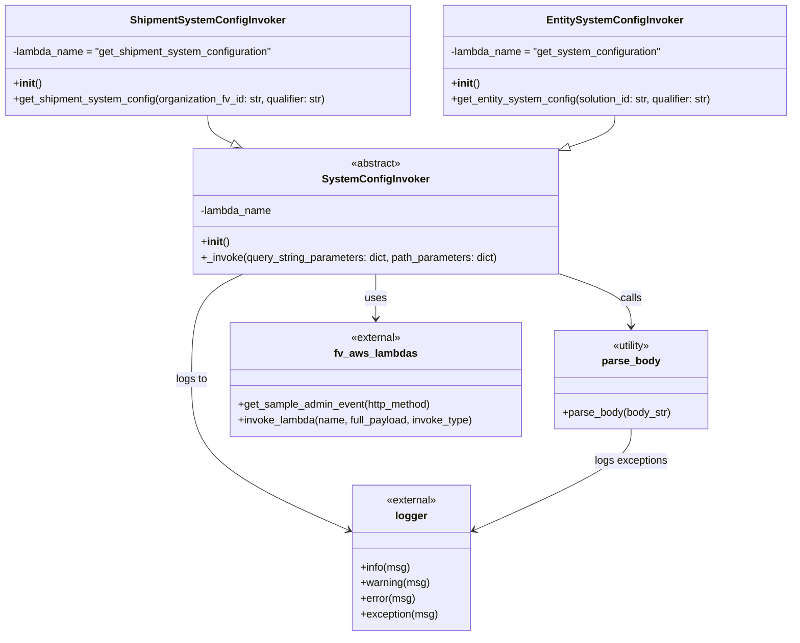
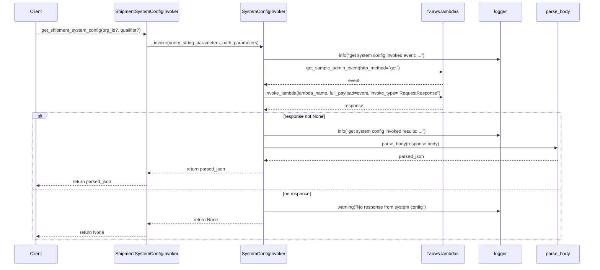

# Diagram: shipment_core/shipment_service/shipment_service/eta/invokers/system_config_invoker.py

> Auto-generated by Obscura crawlers

## Diagram 1

### SVG

<svg id="container" width="1214.234375" xmlns="http://www.w3.org/2000/svg" class="classDiagram" height="970" viewBox="0 0 1214.234375 970" role="graphics-document document" aria-roledescription="class"><g><defs><marker id="container_class-aggregationStart" class="marker aggregation class" refX="18" refY="7" markerWidth="190" markerHeight="240" orient="auto"><path d="M 18,7 L9,13 L1,7 L9,1 Z"></path></marker></defs><defs><marker id="container_class-aggregationEnd" class="marker aggregation class" refX="1" refY="7" markerWidth="20" markerHeight="28" orient="auto"><path d="M 18,7 L9,13 L1,7 L9,1 Z"></path></marker></defs><defs><marker id="container_class-extensionStart" class="marker extension class" refX="18" refY="7" markerWidth="190" markerHeight="240" orient="auto"><path d="M 1,7 L18,13 V 1 Z"></path></marker></defs><defs><marker id="container_class-extensionEnd" class="marker extension class" refX="1" refY="7" markerWidth="20" markerHeight="28" orient="auto"><path d="M 1,1 V 13 L18,7 Z"></path></marker></defs><defs><marker id="container_class-compositionStart" class="marker composition class" refX="18" refY="7" markerWidth="190" markerHeight="240" orient="auto"><path d="M 18,7 L9,13 L1,7 L9,1 Z"></path></marker></defs><defs><marker id="container_class-compositionEnd" class="marker composition class" refX="1" refY="7" markerWidth="20" markerHeight="28" orient="auto"><path d="M 18,7 L9,13 L1,7 L9,1 Z"></path></marker></defs><defs><marker id="container_class-dependencyStart" class="marker dependency class" refX="6" refY="7" markerWidth="190" markerHeight="240" orient="auto"><path d="M 5,7 L9,13 L1,7 L9,1 Z"></path></marker></defs><defs><marker id="container_class-dependencyEnd" class="marker dependency class" refX="13" refY="7" markerWidth="20" markerHeight="28" orient="auto"><path d="M 18,7 L9,13 L14,7 L9,1 Z"></path></marker></defs><defs><marker id="container_class-lollipopStart" class="marker lollipop class" refX="13" refY="7" markerWidth="190" markerHeight="240" orient="auto"><circle stroke="black" fill="transparent" cx="7" cy="7" r="6"></circle></marker></defs><defs><marker id="container_class-lollipopEnd" class="marker lollipop class" refX="1" refY="7" markerWidth="190" markerHeight="240" orient="auto"><circle stroke="black" fill="transparent" cx="7" cy="7" r="6"></circle></marker></defs><g class="root"><g class="clusters"></g><g class="edgePaths"><path d="M318.16,176L318.16,180.167C318.16,184.333,318.16,192.667,324.456,199.781C330.752,206.895,343.343,212.79,349.639,215.738L355.934,218.686" id="id_ShipmentSystemConfigInvoker_SystemConfigInvoker_1" class="edge-thickness-normal edge-pattern-solid relation" style=";;;" data-edge="true" data-et="edge" data-id="id_ShipmentSystemConfigInvoker_SystemConfigInvoker_1" data-points="W3sieCI6MzE4LjE2MDE1NjI1LCJ5IjoxNzZ9LHsieCI6MzE4LjE2MDE1NjI1LCJ5IjoyMDF9LHsieCI6MzcxLjU1NjczNzQ3NDE3MzYsInkiOjIyNn1d" marker-end="url(#container_class-extensionEnd)"></path><path d="M942.277,176L942.277,180.167C942.277,184.333,942.277,192.667,930.678,200.672C919.078,208.676,895.879,216.353,884.279,220.191L872.679,224.029" id="id_EntitySystemConfigInvoker_SystemConfigInvoker_2" class="edge-thickness-normal edge-pattern-solid relation" style=";;;" data-edge="true" data-et="edge" data-id="id_EntitySystemConfigInvoker_SystemConfigInvoker_2" data-points="W3sieCI6OTQyLjI3NzM0Mzc1LCJ5IjoxNzZ9LHsieCI6OTQyLjI3NzM0Mzc1LCJ5IjoyMDF9LHsieCI6ODU2LjMwMjczNDM3NSwieSI6MjI5LjQ0ODM0ODc5NTg0Njc1fV0=" marker-end="url(#container_class-extensionEnd)"></path><path d="M576.6,418L576.6,424.167C576.6,430.333,576.6,442.667,576.6,454C576.6,465.333,576.6,475.667,576.6,480.833L576.6,486" id="id_SystemConfigInvoker_fv_aws_lambdas_3" class="edge-thickness-normal edge-pattern-solid relation" style=";;;" data-edge="true" data-et="edge" data-id="id_SystemConfigInvoker_fv_aws_lambdas_3" data-points="W3sieCI6NTc2LjU5OTYwOTM3NSwieSI6NDE4fSx7IngiOjU3Ni41OTk2MDkzNzUsInkiOjQ1NX0seyJ4Ijo1NzYuNTk5NjA5Mzc1LCJ5Ijo0OTJ9XQ==" marker-end="url(#container_class-dependencyEnd)"></path><path d="M372.577,418L359.471,424.167C346.366,430.333,320.155,442.667,307.049,469.5C293.943,496.333,293.943,537.667,293.943,579C293.943,620.333,293.943,661.667,333.969,699.949C373.994,738.231,454.044,773.463,494.069,791.078L534.094,808.694" id="id_SystemConfigInvoker_logger_4" class="edge-thickness-normal edge-pattern-solid relation" style=";;;" data-edge="true" data-et="edge" data-id="id_SystemConfigInvoker_logger_4" data-points="W3sieCI6MzcyLjU3NzA1Mjk4NDAyMjU0LCJ5Ijo0MTh9LHsieCI6MjkzLjk0MzM1OTM3NSwieSI6NDU1fSx7IngiOjI5My45NDMzNTkzNzUsInkiOjU3OX0seyJ4IjoyOTMuOTQzMzU5Mzc1LCJ5Ijo3MDN9LHsieCI6NTM5LjU4NTkzNzUsInkiOjgxMS4xMTEwOTc1NTg4NTA3fV0=" marker-end="url(#container_class-dependencyEnd)"></path><path d="M856.303,417.412L874.668,423.676C893.033,429.941,929.764,442.471,948.129,455.902C966.494,469.333,966.494,483.667,966.494,490.833L966.494,498" id="id_SystemConfigInvoker_parse_body_5" class="edge-thickness-normal edge-pattern-solid relation" style=";;;" data-edge="true" data-et="edge" data-id="id_SystemConfigInvoker_parse_body_5" data-points="W3sieCI6ODU2LjMwMjczNDM3NSwieSI6NDE3LjQxMTczOTk1MzcxMzQ0fSx7IngiOjk2Ni40OTQxNDA2MjUsInkiOjQ1NX0seyJ4Ijo5NjYuNDk0MTQwNjI1LCJ5Ijo1MDR9XQ==" marker-end="url(#container_class-dependencyEnd)"></path><path d="M966.494,654L966.494,662.167C966.494,670.333,966.494,686.667,926.469,712.449C886.444,738.231,806.394,773.463,766.368,791.078L726.343,808.694" id="id_parse_body_logger_6" class="edge-thickness-normal edge-pattern-solid relation" style=";;;" data-edge="true" data-et="edge" data-id="id_parse_body_logger_6" data-points="W3sieCI6OTY2LjQ5NDE0MDYyNSwieSI6NjU0fSx7IngiOjk2Ni40OTQxNDA2MjUsInkiOjcwM30seyJ4Ijo3MjAuODUxNTYyNSwieSI6ODExLjExMTA5NzU1ODg1MDd9XQ==" marker-end="url(#container_class-dependencyEnd)"></path></g><g class="edgeLabels"><g class="edgeLabel"><g class="label" data-id="id_ShipmentSystemConfigInvoker_SystemConfigInvoker_1" transform="translate(0, 0)"><foreignObject width="0" height="0">

</foreignObject></g></g><g class="edgeLabel"><g class="label" data-id="id_EntitySystemConfigInvoker_SystemConfigInvoker_2" transform="translate(0, 0)"><foreignObject width="0" height="0">

</foreignObject></g></g><g class="edgeLabel" transform="translate(576.599609375, 455)"><g class="label" data-id="id_SystemConfigInvoker_fv_aws_lambdas_3" transform="translate(-16.4921875, -12)"><foreignObject width="32.984375" height="24">

uses

</foreignObject></g></g><g class="edgeLabel" transform="translate(293.943359375, 579)"><g class="label" data-id="id_SystemConfigInvoker_logger_4" transform="translate(-24.3828125, -12)"><foreignObject width="48.765625" height="24">

logs to

</foreignObject></g></g><g class="edgeLabel" transform="translate(966.494140625, 455)"><g class="label" data-id="id_SystemConfigInvoker_parse_body_5" transform="translate(-16.4453125, -12)"><foreignObject width="32.890625" height="24">

calls

</foreignObject></g></g><g class="edgeLabel" transform="translate(966.494140625, 703)"><g class="label" data-id="id_parse_body_logger_6" transform="translate(-56.0546875, -12)"><foreignObject width="112.109375" height="24">

logs exceptions

</foreignObject></g></g></g><g class="nodes"><g class="node default" id="classId-SystemConfigInvoker-0" transform="translate(576.599609375, 322)"><g class="basic label-container"><path d="M-279.703125 -96 L279.703125 -96 L279.703125 96 L-279.703125 96" stroke="none" stroke-width="0" fill="#ECECFF" style=""></path><path d="M-279.703125 -96 C-70.02461043925976 -96, 139.65390412148048 -96, 279.703125 -96 M-279.703125 -96 C-149.48098389335428 -96, -19.258842786708556 -96, 279.703125 -96 M279.703125 -96 C279.703125 -39.81898056916398, 279.703125 16.362038861672033, 279.703125 96 M279.703125 -96 C279.703125 -45.93571564010242, 279.703125 4.128568719795155, 279.703125 96 M279.703125 96 C78.11678139532592 96, -123.46956220934817 96, -279.703125 96 M279.703125 96 C75.04641015807047 96, -129.61030468385906 96, -279.703125 96 M-279.703125 96 C-279.703125 46.37432558617427, -279.703125 -3.251348827651455, -279.703125 -96 M-279.703125 96 C-279.703125 27.09367844833406, -279.703125 -41.81264310333188, -279.703125 -96" stroke="#9370DB" stroke-width="1.3" fill="none" stroke-dasharray="0 0" style=""></path></g><g class="annotation-group text" transform="translate(-38.609375, -72)"><g class="label" style="" transform="translate(0,-12)"><foreignObject width="77.21875" height="24">

«abstract»

</foreignObject></g></g><g class="label-group text" transform="translate(-77.046875, -48)"><g class="label" style="font-weight: bolder" transform="translate(0,-12)"><foreignObject width="154.09375" height="24">

SystemConfigInvoker

</foreignObject></g></g><g class="members-group text" transform="translate(-267.703125, 0)"><g class="label" style="" transform="translate(0,-12)"><foreignObject width="110.09375" height="24">

-lambda_name

</foreignObject></g></g><g class="methods-group text" transform="translate(-267.703125, 48)"><g class="label" style="" transform="translate(0,-12)"><foreignObject width="42.796875" height="24">

+<strong>init</strong>()

</foreignObject></g><g class="label" style="" transform="translate(0,12)"><foreignObject width="458.359375" height="24">

+_invoke(query_string_parameters: dict, path_parameters: dict)

</foreignObject></g></g><g class="divider" style=""><path d="M-279.703125 -24 C-78.48136094291536 -24, 122.74040311416928 -24, 279.703125 -24 M-279.703125 -24 C-66.92192619100368 -24, 145.85927261799264 -24, 279.703125 -24" stroke="#9370DB" stroke-width="1.3" fill="none" stroke-dasharray="0 0" style=""></path></g><g class="divider" style=""><path d="M-279.703125 24 C-125.21185164178118 24, 29.27942171643764 24, 279.703125 24 M-279.703125 24 C-59.95578437332205 24, 159.7915562533559 24, 279.703125 24" stroke="#9370DB" stroke-width="1.3" fill="none" stroke-dasharray="0 0" style=""></path></g></g><g class="node default" id="classId-ShipmentSystemConfigInvoker-1" transform="translate(318.16015625, 92)"><g class="basic label-container"><path d="M-310.16015625 -84 L310.16015625 -84 L310.16015625 84 L-310.16015625 84" stroke="none" stroke-width="0" fill="#ECECFF" style=""></path><path d="M-310.16015625 -84 C-136.75756906705743 -84, 36.64501811588514 -84, 310.16015625 -84 M-310.16015625 -84 C-124.82332655608684 -84, 60.51350313782632 -84, 310.16015625 -84 M310.16015625 -84 C310.16015625 -44.224920981337426, 310.16015625 -4.449841962674853, 310.16015625 84 M310.16015625 -84 C310.16015625 -34.98487174515391, 310.16015625 14.03025650969218, 310.16015625 84 M310.16015625 84 C175.18843161257405 84, 40.2167069751481 84, -310.16015625 84 M310.16015625 84 C143.32772265837275 84, -23.5047109332545 84, -310.16015625 84 M-310.16015625 84 C-310.16015625 45.64406418883127, -310.16015625 7.288128377662545, -310.16015625 -84 M-310.16015625 84 C-310.16015625 38.66419702714862, -310.16015625 -6.671605945702765, -310.16015625 -84" stroke="#9370DB" stroke-width="1.3" fill="none" stroke-dasharray="0 0" style=""></path></g><g class="annotation-group text" transform="translate(0, -60)"></g><g class="label-group text" transform="translate(-112.1484375, -60)"><g class="label" style="font-weight: bolder" transform="translate(0,-12)"><foreignObject width="224.296875" height="24">

ShipmentSystemConfigInvoker

</foreignObject></g></g><g class="members-group text" transform="translate(-298.16015625, -12)"><g class="label" style="" transform="translate(0,-12)"><foreignObject width="401.265625" height="24">

-lambda_name = "get_shipment_system_configuration"

</foreignObject></g></g><g class="methods-group text" transform="translate(-298.16015625, 36)"><g class="label" style="" transform="translate(0,-12)"><foreignObject width="42.796875" height="24">

+<strong>init</strong>()

</foreignObject></g><g class="label" style="" transform="translate(0,12)"><foreignObject width="484.171875" height="24">

+get_shipment_system_config(organization_fv_id: str, qualifier: str)

</foreignObject></g></g><g class="divider" style=""><path d="M-310.16015625 -36 C-182.28973594060494 -36, -54.419315631209855 -36, 310.16015625 -36 M-310.16015625 -36 C-149.57069641064624 -36, 11.01876342870753 -36, 310.16015625 -36" stroke="#9370DB" stroke-width="1.3" fill="none" stroke-dasharray="0 0" style=""></path></g><g class="divider" style=""><path d="M-310.16015625 12 C-118.61963197515448 12, 72.92089229969105 12, 310.16015625 12 M-310.16015625 12 C-112.27603053582874 12, 85.60809517834252 12, 310.16015625 12" stroke="#9370DB" stroke-width="1.3" fill="none" stroke-dasharray="0 0" style=""></path></g></g><g class="node default" id="classId-EntitySystemConfigInvoker-2" transform="translate(942.27734375, 92)"><g class="basic label-container"><path d="M-263.95703125 -84 L263.95703125 -84 L263.95703125 84 L-263.95703125 84" stroke="none" stroke-width="0" fill="#ECECFF" style=""></path><path d="M-263.95703125 -84 C-85.32501118687864 -84, 93.30700887624272 -84, 263.95703125 -84 M-263.95703125 -84 C-122.77502157909797 -84, 18.406988091804067 -84, 263.95703125 -84 M263.95703125 -84 C263.95703125 -27.803959268241577, 263.95703125 28.392081463516845, 263.95703125 84 M263.95703125 -84 C263.95703125 -27.228796731038564, 263.95703125 29.542406537922872, 263.95703125 84 M263.95703125 84 C146.00310575350352 84, 28.049180257007038 84, -263.95703125 84 M263.95703125 84 C128.62523855350673 84, -6.706554142986533 84, -263.95703125 84 M-263.95703125 84 C-263.95703125 39.11337671089259, -263.95703125 -5.773246578214824, -263.95703125 -84 M-263.95703125 84 C-263.95703125 43.78533566911103, -263.95703125 3.5706713382220556, -263.95703125 -84" stroke="#9370DB" stroke-width="1.3" fill="none" stroke-dasharray="0 0" style=""></path></g><g class="annotation-group text" transform="translate(0, -60)"></g><g class="label-group text" transform="translate(-98.3203125, -60)"><g class="label" style="font-weight: bolder" transform="translate(0,-12)"><foreignObject width="196.640625" height="24">

EntitySystemConfigInvoker

</foreignObject></g></g><g class="members-group text" transform="translate(-251.95703125, -12)"><g class="label" style="" transform="translate(0,-12)"><foreignObject width="324.5" height="24">

-lambda_name = "get_system_configuration"

</foreignObject></g></g><g class="methods-group text" transform="translate(-251.95703125, 36)"><g class="label" style="" transform="translate(0,-12)"><foreignObject width="42.796875" height="24">

+<strong>init</strong>()

</foreignObject></g><g class="label" style="" transform="translate(0,12)"><foreignObject width="405.59375" height="24">

+get_entity_system_config(solution_id: str, qualifier: str)

</foreignObject></g></g><g class="divider" style=""><path d="M-263.95703125 -36 C-69.3898379859624 -36, 125.1773552780752 -36, 263.95703125 -36 M-263.95703125 -36 C-69.42286768224105 -36, 125.1112958855179 -36, 263.95703125 -36" stroke="#9370DB" stroke-width="1.3" fill="none" stroke-dasharray="0 0" style=""></path></g><g class="divider" style=""><path d="M-263.95703125 12 C-83.86267042212566 12, 96.23169040574868 12, 263.95703125 12 M-263.95703125 12 C-57.76658516431999 12, 148.42386092136002 12, 263.95703125 12" stroke="#9370DB" stroke-width="1.3" fill="none" stroke-dasharray="0 0" style=""></path></g></g><g class="node default" id="classId-parse_body-3" transform="translate(966.494140625, 579)"><g class="basic label-container"><path d="M-116.62109375 -75 L116.62109375 -75 L116.62109375 75 L-116.62109375 75" stroke="none" stroke-width="0" fill="#ECECFF" style=""></path><path d="M-116.62109375 -75 C-57.99083131106567 -75, 0.6394311278686615 -75, 116.62109375 -75 M-116.62109375 -75 C-26.45031542613701 -75, 63.72046289772598 -75, 116.62109375 -75 M116.62109375 -75 C116.62109375 -25.714117342329914, 116.62109375 23.571765315340173, 116.62109375 75 M116.62109375 -75 C116.62109375 -31.767336802324174, 116.62109375 11.465326395351653, 116.62109375 75 M116.62109375 75 C48.832926183108356 75, -18.95524138378329 75, -116.62109375 75 M116.62109375 75 C55.05212003518686 75, -6.51685367962628 75, -116.62109375 75 M-116.62109375 75 C-116.62109375 20.188967461326847, -116.62109375 -34.622065077346306, -116.62109375 -75 M-116.62109375 75 C-116.62109375 16.63135606156353, -116.62109375 -41.73728787687294, -116.62109375 -75" stroke="#9370DB" stroke-width="1.3" fill="none" stroke-dasharray="0 0" style=""></path></g><g class="annotation-group text" transform="translate(-30.3125, -51)"><g class="label" style="" transform="translate(0,-12)"><foreignObject width="60.625" height="24">

«utility»

</foreignObject></g></g><g class="label-group text" transform="translate(-42.8671875, -27)"><g class="label" style="font-weight: bolder" transform="translate(0,-12)"><foreignObject width="85.734375" height="24">

parse_body

</foreignObject></g></g><g class="members-group text" transform="translate(-104.62109375, 21)"></g><g class="methods-group text" transform="translate(-104.62109375, 51)"><g class="label" style="" transform="translate(0,-12)"><foreignObject width="166.375" height="24">

+parse_body(body_str)

</foreignObject></g></g><g class="divider" style=""><path d="M-116.62109375 -3 C-60.7107022149672 -3, -4.800310679934398 -3, 116.62109375 -3 M-116.62109375 -3 C-58.74352205849001 -3, -0.8659503669800159 -3, 116.62109375 -3" stroke="#9370DB" stroke-width="1.3" fill="none" stroke-dasharray="0 0" style=""></path></g><g class="divider" style=""><path d="M-116.62109375 21 C-44.92450964222479 21, 26.772074465550418 21, 116.62109375 21 M-116.62109375 21 C-38.04469747601635 21, 40.531698797967294 21, 116.62109375 21" stroke="#9370DB" stroke-width="1.3" fill="none" stroke-dasharray="0 0" style=""></path></g></g><g class="node default" id="classId-fv_aws_lambdas-4" transform="translate(576.599609375, 579)"><g class="basic label-container"><path d="M-223.2734375 -87 L223.2734375 -87 L223.2734375 87 L-223.2734375 87" stroke="none" stroke-width="0" fill="#ECECFF" style=""></path><path d="M-223.2734375 -87 C-74.9999226764186 -87, 73.27359214716279 -87, 223.2734375 -87 M-223.2734375 -87 C-118.18670011169701 -87, -13.099962723394015 -87, 223.2734375 -87 M223.2734375 -87 C223.2734375 -18.097977854557556, 223.2734375 50.80404429088489, 223.2734375 87 M223.2734375 -87 C223.2734375 -31.928141954898656, 223.2734375 23.143716090202687, 223.2734375 87 M223.2734375 87 C57.58441983342229 87, -108.10459783315542 87, -223.2734375 87 M223.2734375 87 C124.4196195584243 87, 25.565801616848603 87, -223.2734375 87 M-223.2734375 87 C-223.2734375 34.31905743510383, -223.2734375 -18.36188512979234, -223.2734375 -87 M-223.2734375 87 C-223.2734375 23.873499488013906, -223.2734375 -39.25300102397219, -223.2734375 -87" stroke="#9370DB" stroke-width="1.3" fill="none" stroke-dasharray="0 0" style=""></path></g><g class="annotation-group text" transform="translate(-38.65625, -63)"><g class="label" style="" transform="translate(0,-12)"><foreignObject width="77.3125" height="24">

«external»

</foreignObject></g></g><g class="label-group text" transform="translate(-60.0625, -39)"><g class="label" style="font-weight: bolder" transform="translate(0,-12)"><foreignObject width="120.125" height="24">

fv_aws_lambdas

</foreignObject></g></g><g class="members-group text" transform="translate(-211.2734375, 9)"></g><g class="methods-group text" transform="translate(-211.2734375, 39)"><g class="label" style="" transform="translate(0,-12)"><foreignObject width="298.609375" height="24">

+get_sample_admin_event(http_method)

</foreignObject></g><g class="label" style="" transform="translate(0,12)"><foreignObject width="362.484375" height="24">

+invoke_lambda(name, full_payload, invoke_type)

</foreignObject></g></g><g class="divider" style=""><path d="M-223.2734375 -15 C-62.72200769812321 -15, 97.82942210375359 -15, 223.2734375 -15 M-223.2734375 -15 C-127.88686231248022 -15, -32.50028712496044 -15, 223.2734375 -15" stroke="#9370DB" stroke-width="1.3" fill="none" stroke-dasharray="0 0" style=""></path></g><g class="divider" style=""><path d="M-223.2734375 9 C-92.78242301427795 9, 37.708591471444095 9, 223.2734375 9 M-223.2734375 9 C-133.8632918133099 9, -44.45314612661983 9, 223.2734375 9" stroke="#9370DB" stroke-width="1.3" fill="none" stroke-dasharray="0 0" style=""></path></g></g><g class="node default" id="classId-logger-5" transform="translate(630.21875, 851)"><g class="basic label-container"><path d="M-90.6328125 -111 L90.6328125 -111 L90.6328125 111 L-90.6328125 111" stroke="none" stroke-width="0" fill="#ECECFF" style=""></path><path d="M-90.6328125 -111 C-39.62269104967279 -111, 11.387430400654424 -111, 90.6328125 -111 M-90.6328125 -111 C-44.63256706952097 -111, 1.3676783609580667 -111, 90.6328125 -111 M90.6328125 -111 C90.6328125 -23.07690175905266, 90.6328125 64.84619648189468, 90.6328125 111 M90.6328125 -111 C90.6328125 -57.86710885880502, 90.6328125 -4.734217717610036, 90.6328125 111 M90.6328125 111 C33.91032818792642 111, -22.812156124147165 111, -90.6328125 111 M90.6328125 111 C45.10099474894915 111, -0.4308230021017039 111, -90.6328125 111 M-90.6328125 111 C-90.6328125 55.47666038568477, -90.6328125 -0.046679228630466696, -90.6328125 -111 M-90.6328125 111 C-90.6328125 22.675824860761963, -90.6328125 -65.64835027847607, -90.6328125 -111" stroke="#9370DB" stroke-width="1.3" fill="none" stroke-dasharray="0 0" style=""></path></g><g class="annotation-group text" transform="translate(-38.65625, -87)"><g class="label" style="" transform="translate(0,-12)"><foreignObject width="77.3125" height="24">

«external»

</foreignObject></g></g><g class="label-group text" transform="translate(-23.2734375, -63)"><g class="label" style="font-weight: bolder" transform="translate(0,-12)"><foreignObject width="46.546875" height="24">

logger

</foreignObject></g></g><g class="members-group text" transform="translate(-78.6328125, -15)"></g><g class="methods-group text" transform="translate(-78.6328125, 15)"><g class="label" style="" transform="translate(0,-12)"><foreignObject width="76.296875" height="24">

+info(msg)

</foreignObject></g><g class="label" style="" transform="translate(0,12)"><foreignObject width="105.609375" height="24">

+warning(msg)

</foreignObject></g><g class="label" style="" transform="translate(0,36)"><foreignObject width="83.96875" height="24">

+error(msg)

</foreignObject></g><g class="label" style="" transform="translate(0,60)"><foreignObject width="118.609375" height="24">

+exception(msg)

</foreignObject></g></g><g class="divider" style=""><path d="M-90.6328125 -39 C-38.40763821017083 -39, 13.817536079658339 -39, 90.6328125 -39 M-90.6328125 -39 C-30.354641508817323 -39, 29.923529482365353 -39, 90.6328125 -39" stroke="#9370DB" stroke-width="1.3" fill="none" stroke-dasharray="0 0" style=""></path></g><g class="divider" style=""><path d="M-90.6328125 -15 C-41.82414914628334 -15, 6.984514207433321 -15, 90.6328125 -15 M-90.6328125 -15 C-49.97680131073435 -15, -9.320790121468704 -15, 90.6328125 -15" stroke="#9370DB" stroke-width="1.3" fill="none" stroke-dasharray="0 0" style=""></path></g></g></g></g></g></svg>

## Diagram 2

### SVG

<svg id="container" width="2203" xmlns="http://www.w3.org/2000/svg" height="991" viewBox="-50 -10 2203 991" role="graphics-document document" aria-roledescription="sequence"><g><rect x="1953" y="905" fill="#eaeaea" stroke="#666" width="150" height="65" name="Parser" rx="3" ry="3" class="actor actor-bottom"></rect><text x="2028" y="937.5" dominant-baseline="central" alignment-baseline="central" class="actor actor-box" style="text-anchor: middle; font-size: 16px; font-weight: 400;"><tspan x="2028" dy="0">parse_body</tspan></text></g><g><rect x="1753" y="905" fill="#eaeaea" stroke="#666" width="150" height="65" name="Logger" rx="3" ry="3" class="actor actor-bottom"></rect><text x="1828" y="937.5" dominant-baseline="central" alignment-baseline="central" class="actor actor-box" style="text-anchor: middle; font-size: 16px; font-weight: 400;"><tspan x="1828" dy="0">logger</tspan></text></g><g><rect x="1553" y="905" fill="#eaeaea" stroke="#666" width="150" height="65" name="FV" rx="3" ry="3" class="actor actor-bottom"></rect><text x="1628" y="937.5" dominant-baseline="central" alignment-baseline="central" class="actor actor-box" style="text-anchor: middle; font-size: 16px; font-weight: 400;"><tspan x="1628" dy="0">fv.aws.lambdas</tspan></text></g><g><rect x="856" y="905" fill="#eaeaea" stroke="#666" width="172" height="65" name="Base" rx="3" ry="3" class="actor actor-bottom"></rect><text x="942" y="937.5" dominant-baseline="central" alignment-baseline="central" class="actor actor-box" style="text-anchor: middle; font-size: 16px; font-weight: 400;"><tspan x="942" dy="0">SystemConfigInvoker</tspan></text></g><g><rect x="371.5" y="905" fill="#eaeaea" stroke="#666" width="241" height="65" name="ShipmentInvoker" rx="3" ry="3" class="actor actor-bottom"></rect><text x="492" y="937.5" dominant-baseline="central" alignment-baseline="central" class="actor actor-box" style="text-anchor: middle; font-size: 16px; font-weight: 400;"><tspan x="492" dy="0">ShipmentSystemConfigInvoker</tspan></text></g><g><rect x="0" y="905" fill="#eaeaea" stroke="#666" width="150" height="65" name="Client" rx="3" ry="3" class="actor actor-bottom"></rect><text x="75" y="937.5" dominant-baseline="central" alignment-baseline="central" class="actor actor-box" style="text-anchor: middle; font-size: 16px; font-weight: 400;"><tspan x="75" dy="0">Client</tspan></text></g><g><line id="actor5" x1="2028" y1="65" x2="2028" y2="905" class="actor-line 200" stroke-width="0.5px" stroke="#999" name="Parser"></line><g id="root-5"><rect x="1953" y="0" fill="#eaeaea" stroke="#666" width="150" height="65" name="Parser" rx="3" ry="3" class="actor actor-top"></rect><text x="2028" y="32.5" dominant-baseline="central" alignment-baseline="central" class="actor actor-box" style="text-anchor: middle; font-size: 16px; font-weight: 400;"><tspan x="2028" dy="0">parse_body</tspan></text></g></g><g><line id="actor4" x1="1828" y1="65" x2="1828" y2="905" class="actor-line 200" stroke-width="0.5px" stroke="#999" name="Logger"></line><g id="root-4"><rect x="1753" y="0" fill="#eaeaea" stroke="#666" width="150" height="65" name="Logger" rx="3" ry="3" class="actor actor-top"></rect><text x="1828" y="32.5" dominant-baseline="central" alignment-baseline="central" class="actor actor-box" style="text-anchor: middle; font-size: 16px; font-weight: 400;"><tspan x="1828" dy="0">logger</tspan></text></g></g><g><line id="actor3" x1="1628" y1="65" x2="1628" y2="905" class="actor-line 200" stroke-width="0.5px" stroke="#999" name="FV"></line><g id="root-3"><rect x="1553" y="0" fill="#eaeaea" stroke="#666" width="150" height="65" name="FV" rx="3" ry="3" class="actor actor-top"></rect><text x="1628" y="32.5" dominant-baseline="central" alignment-baseline="central" class="actor actor-box" style="text-anchor: middle; font-size: 16px; font-weight: 400;"><tspan x="1628" dy="0">fv.aws.lambdas</tspan></text></g></g><g><line id="actor2" x1="942" y1="65" x2="942" y2="905" class="actor-line 200" stroke-width="0.5px" stroke="#999" name="Base"></line><g id="root-2"><rect x="856" y="0" fill="#eaeaea" stroke="#666" width="172" height="65" name="Base" rx="3" ry="3" class="actor actor-top"></rect><text x="942" y="32.5" dominant-baseline="central" alignment-baseline="central" class="actor actor-box" style="text-anchor: middle; font-size: 16px; font-weight: 400;"><tspan x="942" dy="0">SystemConfigInvoker</tspan></text></g></g><g><line id="actor1" x1="492" y1="65" x2="492" y2="905" class="actor-line 200" stroke-width="0.5px" stroke="#999" name="ShipmentInvoker"></line><g id="root-1"><rect x="371.5" y="0" fill="#eaeaea" stroke="#666" width="241" height="65" name="ShipmentInvoker" rx="3" ry="3" class="actor actor-top"></rect><text x="492" y="32.5" dominant-baseline="central" alignment-baseline="central" class="actor actor-box" style="text-anchor: middle; font-size: 16px; font-weight: 400;"><tspan x="492" dy="0">ShipmentSystemConfigInvoker</tspan></text></g></g><g><line id="actor0" x1="75" y1="65" x2="75" y2="905" class="actor-line 200" stroke-width="0.5px" stroke="#999" name="Client"></line><g id="root-0"><rect x="0" y="0" fill="#eaeaea" stroke="#666" width="150" height="65" name="Client" rx="3" ry="3" class="actor actor-top"></rect><text x="75" y="32.5" dominant-baseline="central" alignment-baseline="central" class="actor actor-box" style="text-anchor: middle; font-size: 16px; font-weight: 400;"><tspan x="75" dy="0">Client</tspan></text></g></g><g></g><defs><symbol id="computer" width="24" height="24"><path transform="scale(.5)" d="M2 2v13h20v-13h-20zm18 11h-16v-9h16v9zm-10.228 6l.466-1h3.524l.467 1h-4.457zm14.228 3h-24l2-6h2.104l-1.33 4h18.45l-1.297-4h2.073l2 6zm-5-10h-14v-7h14v7z"></path></symbol></defs><defs><symbol id="database" fill-rule="evenodd" clip-rule="evenodd"><path transform="scale(.5)" d="M12.258.001l.256.004.255.005.253.008.251.01.249.012.247.015.246.016.242.019.241.02.239.023.236.024.233.027.231.028.229.031.225.032.223.034.22.036.217.038.214.04.211.041.208.043.205.045.201.046.198.048.194.05.191.051.187.053.183.054.18.056.175.057.172.059.168.06.163.061.16.063.155.064.15.066.074.033.073.033.071.034.07.034.069.035.068.035.067.035.066.035.064.036.064.036.062.036.06.036.06.037.058.037.058.037.055.038.055.038.053.038.052.038.051.039.05.039.048.039.047.039.045.04.044.04.043.04.041.04.04.041.039.041.037.041.036.041.034.041.033.042.032.042.03.042.029.042.027.042.026.043.024.043.023.043.021.043.02.043.018.044.017.043.015.044.013.044.012.044.011.045.009.044.007.045.006.045.004.045.002.045.001.045v17l-.001.045-.002.045-.004.045-.006.045-.007.045-.009.044-.011.045-.012.044-.013.044-.015.044-.017.043-.018.044-.02.043-.021.043-.023.043-.024.043-.026.043-.027.042-.029.042-.03.042-.032.042-.033.042-.034.041-.036.041-.037.041-.039.041-.04.041-.041.04-.043.04-.044.04-.045.04-.047.039-.048.039-.05.039-.051.039-.052.038-.053.038-.055.038-.055.038-.058.037-.058.037-.06.037-.06.036-.062.036-.064.036-.064.036-.066.035-.067.035-.068.035-.069.035-.07.034-.071.034-.073.033-.074.033-.15.066-.155.064-.16.063-.163.061-.168.06-.172.059-.175.057-.18.056-.183.054-.187.053-.191.051-.194.05-.198.048-.201.046-.205.045-.208.043-.211.041-.214.04-.217.038-.22.036-.223.034-.225.032-.229.031-.231.028-.233.027-.236.024-.239.023-.241.02-.242.019-.246.016-.247.015-.249.012-.251.01-.253.008-.255.005-.256.004-.258.001-.258-.001-.256-.004-.255-.005-.253-.008-.251-.01-.249-.012-.247-.015-.245-.016-.243-.019-.241-.02-.238-.023-.236-.024-.234-.027-.231-.028-.228-.031-.226-.032-.223-.034-.22-.036-.217-.038-.214-.04-.211-.041-.208-.043-.204-.045-.201-.046-.198-.048-.195-.05-.19-.051-.187-.053-.184-.054-.179-.056-.176-.057-.172-.059-.167-.06-.164-.061-.159-.063-.155-.064-.151-.066-.074-.033-.072-.033-.072-.034-.07-.034-.069-.035-.068-.035-.067-.035-.066-.035-.064-.036-.063-.036-.062-.036-.061-.036-.06-.037-.058-.037-.057-.037-.056-.038-.055-.038-.053-.038-.052-.038-.051-.039-.049-.039-.049-.039-.046-.039-.046-.04-.044-.04-.043-.04-.041-.04-.04-.041-.039-.041-.037-.041-.036-.041-.034-.041-.033-.042-.032-.042-.03-.042-.029-.042-.027-.042-.026-.043-.024-.043-.023-.043-.021-.043-.02-.043-.018-.044-.017-.043-.015-.044-.013-.044-.012-.044-.011-.045-.009-.044-.007-.045-.006-.045-.004-.045-.002-.045-.001-.045v-17l.001-.045.002-.045.004-.045.006-.045.007-.045.009-.044.011-.045.012-.044.013-.044.015-.044.017-.043.018-.044.02-.043.021-.043.023-.043.024-.043.026-.043.027-.042.029-.042.03-.042.032-.042.033-.042.034-.041.036-.041.037-.041.039-.041.04-.041.041-.04.043-.04.044-.04.046-.04.046-.039.049-.039.049-.039.051-.039.052-.038.053-.038.055-.038.056-.038.057-.037.058-.037.06-.037.061-.036.062-.036.063-.036.064-.036.066-.035.067-.035.068-.035.069-.035.07-.034.072-.034.072-.033.074-.033.151-.066.155-.064.159-.063.164-.061.167-.06.172-.059.176-.057.179-.056.184-.054.187-.053.19-.051.195-.05.198-.048.201-.046.204-.045.208-.043.211-.041.214-.04.217-.038.22-.036.223-.034.226-.032.228-.031.231-.028.234-.027.236-.024.238-.023.241-.02.243-.019.245-.016.247-.015.249-.012.251-.01.253-.008.255-.005.256-.004.258-.001.258.001zm-9.258 20.499v.01l.001.021.003.021.004.022.005.021.006.022.007.022.009.023.01.022.011.023.012.023.013.023.015.023.016.024.017.023.018.024.019.024.021.024.022.025.023.024.024.025.052.049.056.05.061.051.066.051.07.051.075.051.079.052.084.052.088.052.092.052.097.052.102.051.105.052.11.052.114.051.119.051.123.051.127.05.131.05.135.05.139.048.144.049.147.047.152.047.155.047.16.045.163.045.167.043.171.043.176.041.178.041.183.039.187.039.19.037.194.035.197.035.202.033.204.031.209.03.212.029.216.027.219.025.222.024.226.021.23.02.233.018.236.016.24.015.243.012.246.01.249.008.253.005.256.004.259.001.26-.001.257-.004.254-.005.25-.008.247-.011.244-.012.241-.014.237-.016.233-.018.231-.021.226-.021.224-.024.22-.026.216-.027.212-.028.21-.031.205-.031.202-.034.198-.034.194-.036.191-.037.187-.039.183-.04.179-.04.175-.042.172-.043.168-.044.163-.045.16-.046.155-.046.152-.047.148-.048.143-.049.139-.049.136-.05.131-.05.126-.05.123-.051.118-.052.114-.051.11-.052.106-.052.101-.052.096-.052.092-.052.088-.053.083-.051.079-.052.074-.052.07-.051.065-.051.06-.051.056-.05.051-.05.023-.024.023-.025.021-.024.02-.024.019-.024.018-.024.017-.024.015-.023.014-.024.013-.023.012-.023.01-.023.01-.022.008-.022.006-.022.006-.022.004-.022.004-.021.001-.021.001-.021v-4.127l-.077.055-.08.053-.083.054-.085.053-.087.052-.09.052-.093.051-.095.05-.097.05-.1.049-.102.049-.105.048-.106.047-.109.047-.111.046-.114.045-.115.045-.118.044-.12.043-.122.042-.124.042-.126.041-.128.04-.13.04-.132.038-.134.038-.135.037-.138.037-.139.035-.142.035-.143.034-.144.033-.147.032-.148.031-.15.03-.151.03-.153.029-.154.027-.156.027-.158.026-.159.025-.161.024-.162.023-.163.022-.165.021-.166.02-.167.019-.169.018-.169.017-.171.016-.173.015-.173.014-.175.013-.175.012-.177.011-.178.01-.179.008-.179.008-.181.006-.182.005-.182.004-.184.003-.184.002h-.37l-.184-.002-.184-.003-.182-.004-.182-.005-.181-.006-.179-.008-.179-.008-.178-.01-.176-.011-.176-.012-.175-.013-.173-.014-.172-.015-.171-.016-.17-.017-.169-.018-.167-.019-.166-.02-.165-.021-.163-.022-.162-.023-.161-.024-.159-.025-.157-.026-.156-.027-.155-.027-.153-.029-.151-.03-.15-.03-.148-.031-.146-.032-.145-.033-.143-.034-.141-.035-.14-.035-.137-.037-.136-.037-.134-.038-.132-.038-.13-.04-.128-.04-.126-.041-.124-.042-.122-.042-.12-.044-.117-.043-.116-.045-.113-.045-.112-.046-.109-.047-.106-.047-.105-.048-.102-.049-.1-.049-.097-.05-.095-.05-.093-.052-.09-.051-.087-.052-.085-.053-.083-.054-.08-.054-.077-.054v4.127zm0-5.654v.011l.001.021.003.021.004.021.005.022.006.022.007.022.009.022.01.022.011.023.012.023.013.023.015.024.016.023.017.024.018.024.019.024.021.024.022.024.023.025.024.024.052.05.056.05.061.05.066.051.07.051.075.052.079.051.084.052.088.052.092.052.097.052.102.052.105.052.11.051.114.051.119.052.123.05.127.051.131.05.135.049.139.049.144.048.147.048.152.047.155.046.16.045.163.045.167.044.171.042.176.042.178.04.183.04.187.038.19.037.194.036.197.034.202.033.204.032.209.03.212.028.216.027.219.025.222.024.226.022.23.02.233.018.236.016.24.014.243.012.246.01.249.008.253.006.256.003.259.001.26-.001.257-.003.254-.006.25-.008.247-.01.244-.012.241-.015.237-.016.233-.018.231-.02.226-.022.224-.024.22-.025.216-.027.212-.029.21-.03.205-.032.202-.033.198-.035.194-.036.191-.037.187-.039.183-.039.179-.041.175-.042.172-.043.168-.044.163-.045.16-.045.155-.047.152-.047.148-.048.143-.048.139-.05.136-.049.131-.05.126-.051.123-.051.118-.051.114-.052.11-.052.106-.052.101-.052.096-.052.092-.052.088-.052.083-.052.079-.052.074-.051.07-.052.065-.051.06-.05.056-.051.051-.049.023-.025.023-.024.021-.025.02-.024.019-.024.018-.024.017-.024.015-.023.014-.023.013-.024.012-.022.01-.023.01-.023.008-.022.006-.022.006-.022.004-.021.004-.022.001-.021.001-.021v-4.139l-.077.054-.08.054-.083.054-.085.052-.087.053-.09.051-.093.051-.095.051-.097.05-.1.049-.102.049-.105.048-.106.047-.109.047-.111.046-.114.045-.115.044-.118.044-.12.044-.122.042-.124.042-.126.041-.128.04-.13.039-.132.039-.134.038-.135.037-.138.036-.139.036-.142.035-.143.033-.144.033-.147.033-.148.031-.15.03-.151.03-.153.028-.154.028-.156.027-.158.026-.159.025-.161.024-.162.023-.163.022-.165.021-.166.02-.167.019-.169.018-.169.017-.171.016-.173.015-.173.014-.175.013-.175.012-.177.011-.178.009-.179.009-.179.007-.181.007-.182.005-.182.004-.184.003-.184.002h-.37l-.184-.002-.184-.003-.182-.004-.182-.005-.181-.007-.179-.007-.179-.009-.178-.009-.176-.011-.176-.012-.175-.013-.173-.014-.172-.015-.171-.016-.17-.017-.169-.018-.167-.019-.166-.02-.165-.021-.163-.022-.162-.023-.161-.024-.159-.025-.157-.026-.156-.027-.155-.028-.153-.028-.151-.03-.15-.03-.148-.031-.146-.033-.145-.033-.143-.033-.141-.035-.14-.036-.137-.036-.136-.037-.134-.038-.132-.039-.13-.039-.128-.04-.126-.041-.124-.042-.122-.043-.12-.043-.117-.044-.116-.044-.113-.046-.112-.046-.109-.046-.106-.047-.105-.048-.102-.049-.1-.049-.097-.05-.095-.051-.093-.051-.09-.051-.087-.053-.085-.052-.083-.054-.08-.054-.077-.054v4.139zm0-5.666v.011l.001.02.003.022.004.021.005.022.006.021.007.022.009.023.01.022.011.023.012.023.013.023.015.023.016.024.017.024.018.023.019.024.021.025.022.024.023.024.024.025.052.05.056.05.061.05.066.051.07.051.075.052.079.051.084.052.088.052.092.052.097.052.102.052.105.051.11.052.114.051.119.051.123.051.127.05.131.05.135.05.139.049.144.048.147.048.152.047.155.046.16.045.163.045.167.043.171.043.176.042.178.04.183.04.187.038.19.037.194.036.197.034.202.033.204.032.209.03.212.028.216.027.219.025.222.024.226.021.23.02.233.018.236.017.24.014.243.012.246.01.249.008.253.006.256.003.259.001.26-.001.257-.003.254-.006.25-.008.247-.01.244-.013.241-.014.237-.016.233-.018.231-.02.226-.022.224-.024.22-.025.216-.027.212-.029.21-.03.205-.032.202-.033.198-.035.194-.036.191-.037.187-.039.183-.039.179-.041.175-.042.172-.043.168-.044.163-.045.16-.045.155-.047.152-.047.148-.048.143-.049.139-.049.136-.049.131-.051.126-.05.123-.051.118-.052.114-.051.11-.052.106-.052.101-.052.096-.052.092-.052.088-.052.083-.052.079-.052.074-.052.07-.051.065-.051.06-.051.056-.05.051-.049.023-.025.023-.025.021-.024.02-.024.019-.024.018-.024.017-.024.015-.023.014-.024.013-.023.012-.023.01-.022.01-.023.008-.022.006-.022.006-.022.004-.022.004-.021.001-.021.001-.021v-4.153l-.077.054-.08.054-.083.053-.085.053-.087.053-.09.051-.093.051-.095.051-.097.05-.1.049-.102.048-.105.048-.106.048-.109.046-.111.046-.114.046-.115.044-.118.044-.12.043-.122.043-.124.042-.126.041-.128.04-.13.039-.132.039-.134.038-.135.037-.138.036-.139.036-.142.034-.143.034-.144.033-.147.032-.148.032-.15.03-.151.03-.153.028-.154.028-.156.027-.158.026-.159.024-.161.024-.162.023-.163.023-.165.021-.166.02-.167.019-.169.018-.169.017-.171.016-.173.015-.173.014-.175.013-.175.012-.177.01-.178.01-.179.009-.179.007-.181.006-.182.006-.182.004-.184.003-.184.001-.185.001-.185-.001-.184-.001-.184-.003-.182-.004-.182-.006-.181-.006-.179-.007-.179-.009-.178-.01-.176-.01-.176-.012-.175-.013-.173-.014-.172-.015-.171-.016-.17-.017-.169-.018-.167-.019-.166-.02-.165-.021-.163-.023-.162-.023-.161-.024-.159-.024-.157-.026-.156-.027-.155-.028-.153-.028-.151-.03-.15-.03-.148-.032-.146-.032-.145-.033-.143-.034-.141-.034-.14-.036-.137-.036-.136-.037-.134-.038-.132-.039-.13-.039-.128-.041-.126-.041-.124-.041-.122-.043-.12-.043-.117-.044-.116-.044-.113-.046-.112-.046-.109-.046-.106-.048-.105-.048-.102-.048-.1-.05-.097-.049-.095-.051-.093-.051-.09-.052-.087-.052-.085-.053-.083-.053-.08-.054-.077-.054v4.153zm8.74-8.179l-.257.004-.254.005-.25.008-.247.011-.244.012-.241.014-.237.016-.233.018-.231.021-.226.022-.224.023-.22.026-.216.027-.212.028-.21.031-.205.032-.202.033-.198.034-.194.036-.191.038-.187.038-.183.04-.179.041-.175.042-.172.043-.168.043-.163.045-.16.046-.155.046-.152.048-.148.048-.143.048-.139.049-.136.05-.131.05-.126.051-.123.051-.118.051-.114.052-.11.052-.106.052-.101.052-.096.052-.092.052-.088.052-.083.052-.079.052-.074.051-.07.052-.065.051-.06.05-.056.05-.051.05-.023.025-.023.024-.021.024-.02.025-.019.024-.018.024-.017.023-.015.024-.014.023-.013.023-.012.023-.01.023-.01.022-.008.022-.006.023-.006.021-.004.022-.004.021-.001.021-.001.021.001.021.001.021.004.021.004.022.006.021.006.023.008.022.01.022.01.023.012.023.013.023.014.023.015.024.017.023.018.024.019.024.02.025.021.024.023.024.023.025.051.05.056.05.06.05.065.051.07.052.074.051.079.052.083.052.088.052.092.052.096.052.101.052.106.052.11.052.114.052.118.051.123.051.126.051.131.05.136.05.139.049.143.048.148.048.152.048.155.046.16.046.163.045.168.043.172.043.175.042.179.041.183.04.187.038.191.038.194.036.198.034.202.033.205.032.21.031.212.028.216.027.22.026.224.023.226.022.231.021.233.018.237.016.241.014.244.012.247.011.25.008.254.005.257.004.26.001.26-.001.257-.004.254-.005.25-.008.247-.011.244-.012.241-.014.237-.016.233-.018.231-.021.226-.022.224-.023.22-.026.216-.027.212-.028.21-.031.205-.032.202-.033.198-.034.194-.036.191-.038.187-.038.183-.04.179-.041.175-.042.172-.043.168-.043.163-.045.16-.046.155-.046.152-.048.148-.048.143-.048.139-.049.136-.05.131-.05.126-.051.123-.051.118-.051.114-.052.11-.052.106-.052.101-.052.096-.052.092-.052.088-.052.083-.052.079-.052.074-.051.07-.052.065-.051.06-.05.056-.05.051-.05.023-.025.023-.024.021-.024.02-.025.019-.024.018-.024.017-.023.015-.024.014-.023.013-.023.012-.023.01-.023.01-.022.008-.022.006-.023.006-.021.004-.022.004-.021.001-.021.001-.021-.001-.021-.001-.021-.004-.021-.004-.022-.006-.021-.006-.023-.008-.022-.01-.022-.01-.023-.012-.023-.013-.023-.014-.023-.015-.024-.017-.023-.018-.024-.019-.024-.02-.025-.021-.024-.023-.024-.023-.025-.051-.05-.056-.05-.06-.05-.065-.051-.07-.052-.074-.051-.079-.052-.083-.052-.088-.052-.092-.052-.096-.052-.101-.052-.106-.052-.11-.052-.114-.052-.118-.051-.123-.051-.126-.051-.131-.05-.136-.05-.139-.049-.143-.048-.148-.048-.152-.048-.155-.046-.16-.046-.163-.045-.168-.043-.172-.043-.175-.042-.179-.041-.183-.04-.187-.038-.191-.038-.194-.036-.198-.034-.202-.033-.205-.032-.21-.031-.212-.028-.216-.027-.22-.026-.224-.023-.226-.022-.231-.021-.233-.018-.237-.016-.241-.014-.244-.012-.247-.011-.25-.008-.254-.005-.257-.004-.26-.001-.26.001z"></path></symbol></defs><defs><symbol id="clock" width="24" height="24"><path transform="scale(.5)" d="M12 2c5.514 0 10 4.486 10 10s-4.486 10-10 10-10-4.486-10-10 4.486-10 10-10zm0-2c-6.627 0-12 5.373-12 12s5.373 12 12 12 12-5.373 12-12-5.373-12-12-12zm5.848 12.459c.202.038.202.333.001.372-1.907.361-6.045 1.111-6.547 1.111-.719 0-1.301-.582-1.301-1.301 0-.512.77-5.447 1.125-7.445.034-.192.312-.181.343.014l.985 6.238 5.394 1.011z"></path></symbol></defs><defs><marker id="arrowhead" refX="7.9" refY="5" markerUnits="userSpaceOnUse" markerWidth="12" markerHeight="12" orient="auto-start-reverse"><path d="M -1 0 L 10 5 L 0 10 z"></path></marker></defs><defs><marker id="crosshead" markerWidth="15" markerHeight="8" orient="auto" refX="4" refY="4.5"><path fill="none" stroke="#000000" stroke-width="1pt" d="M 1,2 L 6,7 M 6,2 L 1,7" style="stroke-dasharray: 0, 0;"></path></marker></defs><defs><marker id="filled-head" refX="15.5" refY="7" markerWidth="20" markerHeight="28" orient="auto"><path d="M 18,7 L9,13 L14,7 L9,1 Z"></path></marker></defs><defs><marker id="sequencenumber" refX="15" refY="15" markerWidth="60" markerHeight="40" orient="auto"><circle cx="15" cy="15" r="6"></circle></marker></defs><g><line x1="64" y1="411" x2="2039" y2="411" class="loopLine"></line><line x1="2039" y1="411" x2="2039" y2="885" class="loopLine"></line><line x1="64" y1="885" x2="2039" y2="885" class="loopLine"></line><line x1="64" y1="411" x2="64" y2="885" class="loopLine"></line><line x1="64" y1="701" x2="2039" y2="701" class="loopLine" style="stroke-dasharray: 3, 3;"></line><polygon points="64,411 114,411 114,424 105.6,431 64,431" class="labelBox"></polygon><text x="89" y="424" text-anchor="middle" dominant-baseline="middle" alignment-baseline="middle" class="labelText" style="font-size: 16px; font-weight: 400;">alt</text><text x="1076.5" y="429" text-anchor="middle" class="loopText" style="font-size: 16px; font-weight: 400;"><tspan x="1076.5">[response not None]</tspan></text><text x="1051.5" y="719" text-anchor="middle" class="loopText" style="font-size: 16px; font-weight: 400;">[no response]</text></g><text x="282" y="80" text-anchor="middle" dominant-baseline="middle" alignment-baseline="middle" class="messageText" dy="1em" style="font-size: 16px; font-weight: 400;">get_shipment_system_config(org_id?, qualifier?)</text><line x1="76" y1="113" x2="488" y2="113" class="messageLine0" stroke-width="2" stroke="none" marker-end="url(#arrowhead)" style="fill: none;"></line><text x="716" y="128" text-anchor="middle" dominant-baseline="middle" alignment-baseline="middle" class="messageText" dy="1em" style="font-size: 16px; font-weight: 400;">_invoke(query_string_parameters, path_parameters)</text><line x1="493" y1="161" x2="938" y2="161" class="messageLine0" stroke-width="2" stroke="none" marker-end="url(#arrowhead)" style="fill: none;"></line><text x="1384" y="176" text-anchor="middle" dominant-baseline="middle" alignment-baseline="middle" class="messageText" dy="1em" style="font-size: 16px; font-weight: 400;">info("get system config invoked event: ...")</text><line x1="943" y1="209" x2="1824" y2="209" class="messageLine0" stroke-width="2" stroke="none" marker-end="url(#arrowhead)" style="fill: none;"></line><text x="1284" y="224" text-anchor="middle" dominant-baseline="middle" alignment-baseline="middle" class="messageText" dy="1em" style="font-size: 16px; font-weight: 400;">get_sample_admin_event(http_method="get")</text><line x1="943" y1="257" x2="1624" y2="257" class="messageLine0" stroke-width="2" stroke="none" marker-end="url(#arrowhead)" style="fill: none;"></line><text x="1287" y="272" text-anchor="middle" dominant-baseline="middle" alignment-baseline="middle" class="messageText" dy="1em" style="font-size: 16px; font-weight: 400;">event</text><line x1="1627" y1="305" x2="946" y2="305" class="messageLine1" stroke-width="2" stroke="none" marker-end="url(#arrowhead)" style="stroke-dasharray: 3, 3; fill: none;"></line><text x="1284" y="320" text-anchor="middle" dominant-baseline="middle" alignment-baseline="middle" class="messageText" dy="1em" style="font-size: 16px; font-weight: 400;">invoke_lambda(lambda_name, full_payload=event, invoke_type="RequestResponse")</text><line x1="943" y1="353" x2="1624" y2="353" class="messageLine0" stroke-width="2" stroke="none" marker-end="url(#arrowhead)" style="fill: none;"></line><text x="1287" y="368" text-anchor="middle" dominant-baseline="middle" alignment-baseline="middle" class="messageText" dy="1em" style="font-size: 16px; font-weight: 400;">response</text><line x1="1627" y1="401" x2="946" y2="401" class="messageLine1" stroke-width="2" stroke="none" marker-end="url(#arrowhead)" style="stroke-dasharray: 3, 3; fill: none;"></line><text x="1384" y="461" text-anchor="middle" dominant-baseline="middle" alignment-baseline="middle" class="messageText" dy="1em" style="font-size: 16px; font-weight: 400;">info("get system config invoked results: ...")</text><line x1="943" y1="494" x2="1824" y2="494" class="messageLine0" stroke-width="2" stroke="none" marker-end="url(#arrowhead)" style="fill: none;"></line><text x="1484" y="509" text-anchor="middle" dominant-baseline="middle" alignment-baseline="middle" class="messageText" dy="1em" style="font-size: 16px; font-weight: 400;">parse_body(response.body)</text><line x1="943" y1="542" x2="2024" y2="542" class="messageLine0" stroke-width="2" stroke="none" marker-end="url(#arrowhead)" style="fill: none;"></line><text x="1487" y="557" text-anchor="middle" dominant-baseline="middle" alignment-baseline="middle" class="messageText" dy="1em" style="font-size: 16px; font-weight: 400;">parsed_json</text><line x1="2027" y1="590" x2="946" y2="590" class="messageLine1" stroke-width="2" stroke="none" marker-end="url(#arrowhead)" style="stroke-dasharray: 3, 3; fill: none;"></line><text x="719" y="605" text-anchor="middle" dominant-baseline="middle" alignment-baseline="middle" class="messageText" dy="1em" style="font-size: 16px; font-weight: 400;">return parsed_json</text><line x1="941" y1="638" x2="496" y2="638" class="messageLine1" stroke-width="2" stroke="none" marker-end="url(#arrowhead)" style="stroke-dasharray: 3, 3; fill: none;"></line><text x="285" y="653" text-anchor="middle" dominant-baseline="middle" alignment-baseline="middle" class="messageText" dy="1em" style="font-size: 16px; font-weight: 400;">return parsed_json</text><line x1="491" y1="686" x2="79" y2="686" class="messageLine1" stroke-width="2" stroke="none" marker-end="url(#arrowhead)" style="stroke-dasharray: 3, 3; fill: none;"></line><text x="1384" y="746" text-anchor="middle" dominant-baseline="middle" alignment-baseline="middle" class="messageText" dy="1em" style="font-size: 16px; font-weight: 400;">warning("No response from system config")</text><line x1="943" y1="779" x2="1824" y2="779" class="messageLine0" stroke-width="2" stroke="none" marker-end="url(#arrowhead)" style="fill: none;"></line><text x="719" y="794" text-anchor="middle" dominant-baseline="middle" alignment-baseline="middle" class="messageText" dy="1em" style="font-size: 16px; font-weight: 400;">return None</text><line x1="941" y1="827" x2="496" y2="827" class="messageLine1" stroke-width="2" stroke="none" marker-end="url(#arrowhead)" style="stroke-dasharray: 3, 3; fill: none;"></line><text x="285" y="842" text-anchor="middle" dominant-baseline="middle" alignment-baseline="middle" class="messageText" dy="1em" style="font-size: 16px; font-weight: 400;">return None</text><line x1="491" y1="875" x2="79" y2="875" class="messageLine1" stroke-width="2" stroke="none" marker-end="url(#arrowhead)" style="stroke-dasharray: 3, 3; fill: none;"></line></svg>
