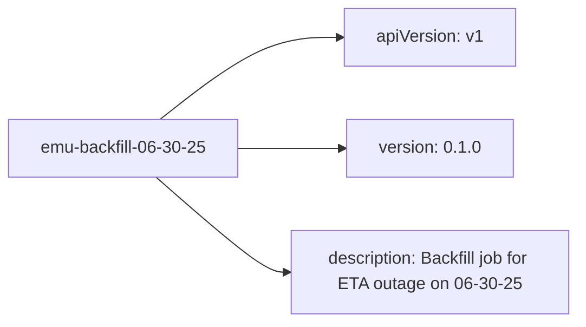

# Diagram: shipment_core/shipment_service/shipment_service/eta/jobs/emu_replay/Chart.yaml

> Auto-generated by Obscura crawlers

## Mermaid

### SVG

<svg id="container" width="544.21875" xmlns="http://www.w3.org/2000/svg" class="flowchart" height="302" viewBox="0 0 544.21875 302" role="graphics-document document" aria-roledescription="flowchart-v2"><g><marker id="container_flowchart-v2-pointEnd" class="marker flowchart-v2" viewBox="0 0 10 10" refX="5" refY="5" markerUnits="userSpaceOnUse" markerWidth="8" markerHeight="8" orient="auto"><path d="M 0 0 L 10 5 L 0 10 z" class="arrowMarkerPath" style="stroke-width: 1; stroke-dasharray: 1, 0;"></path></marker><marker id="container_flowchart-v2-pointStart" class="marker flowchart-v2" viewBox="0 0 10 10" refX="4.5" refY="5" markerUnits="userSpaceOnUse" markerWidth="8" markerHeight="8" orient="auto"><path d="M 0 5 L 10 10 L 10 0 z" class="arrowMarkerPath" style="stroke-width: 1; stroke-dasharray: 1, 0;"></path></marker><marker id="container_flowchart-v2-circleEnd" class="marker flowchart-v2" viewBox="0 0 10 10" refX="11" refY="5" markerUnits="userSpaceOnUse" markerWidth="11" markerHeight="11" orient="auto"><circle cx="5" cy="5" r="5" class="arrowMarkerPath" style="stroke-width: 1; stroke-dasharray: 1, 0;"></circle></marker><marker id="container_flowchart-v2-circleStart" class="marker flowchart-v2" viewBox="0 0 10 10" refX="-1" refY="5" markerUnits="userSpaceOnUse" markerWidth="11" markerHeight="11" orient="auto"><circle cx="5" cy="5" r="5" class="arrowMarkerPath" style="stroke-width: 1; stroke-dasharray: 1, 0;"></circle></marker><marker id="container_flowchart-v2-crossEnd" class="marker cross flowchart-v2" viewBox="0 0 11 11" refX="12" refY="5.2" markerUnits="userSpaceOnUse" markerWidth="11" markerHeight="11" orient="auto"><path d="M 1,1 l 9,9 M 10,1 l -9,9" class="arrowMarkerPath" style="stroke-width: 2; stroke-dasharray: 1, 0;"></path></marker><marker id="container_flowchart-v2-crossStart" class="marker cross flowchart-v2" viewBox="0 0 11 11" refX="-1" refY="5.2" markerUnits="userSpaceOnUse" markerWidth="11" markerHeight="11" orient="auto"><path d="M 1,1 l 9,9 M 10,1 l -9,9" class="arrowMarkerPath" style="stroke-width: 2; stroke-dasharray: 1, 0;"></path></marker><g class="root"><g class="clusters"></g><g class="edgePaths"><path d="M151.926,112L168.475,99.167C185.024,86.333,218.121,60.667,246.548,47.833C274.974,35,298.729,35,310.607,35L322.484,35" id="L_Job_ApiVersion_0" class="edge-thickness-normal edge-pattern-solid edge-thickness-normal edge-pattern-solid flowchart-link" style=";" data-edge="true" data-et="edge" data-id="L_Job_ApiVersion_0" data-points="W3sieCI6MTUxLjkyNjIzMTk3MTE1Mzg0LCJ5IjoxMTJ9LHsieCI6MjUxLjIxODc1LCJ5IjozNX0seyJ4IjozMjYuNDg0Mzc1LCJ5IjozNX1d" marker-end="url(#container_flowchart-v2-pointEnd)"></path><path d="M226.219,139L230.385,139C234.552,139,242.885,139,259.574,139C276.263,139,301.307,139,313.829,139L326.352,139" id="L_Job_Version_0" class="edge-thickness-normal edge-pattern-solid edge-thickness-normal edge-pattern-solid flowchart-link" style=";" data-edge="true" data-et="edge" data-id="L_Job_Version_0" data-points="W3sieCI6MjI2LjIxODc1LCJ5IjoxMzl9LHsieCI6MjUxLjIxODc1LCJ5IjoxMzl9LHsieCI6MzMwLjM1MTU2MjUsInkiOjEzOX1d" marker-end="url(#container_flowchart-v2-pointEnd)"></path><path d="M148.324,166L165.474,180.833C182.623,195.667,216.921,225.333,237.57,240.167C258.219,255,265.219,255,268.719,255L272.219,255" id="L_Job_Description_0" class="edge-thickness-normal edge-pattern-solid edge-thickness-normal edge-pattern-solid flowchart-link" style=";" data-edge="true" data-et="edge" data-id="L_Job_Description_0" data-points="W3sieCI6MTQ4LjMyNDQ4ODE0NjU1MTcyLCJ5IjoxNjZ9LHsieCI6MjUxLjIxODc1LCJ5IjoyNTV9LHsieCI6Mjc2LjIxODc1LCJ5IjoyNTV9XQ==" marker-end="url(#container_flowchart-v2-pointEnd)"></path></g><g class="edgeLabels"><g class="edgeLabel"><g class="label" data-id="L_Job_ApiVersion_0" transform="translate(0, 0)"><foreignObject width="0" height="0">

</foreignObject></g></g><g class="edgeLabel"><g class="label" data-id="L_Job_Version_0" transform="translate(0, 0)"><foreignObject width="0" height="0">

</foreignObject></g></g><g class="edgeLabel"><g class="label" data-id="L_Job_Description_0" transform="translate(0, 0)"><foreignObject width="0" height="0">

</foreignObject></g></g></g><g class="nodes"><g class="node default" id="flowchart-Job-0" transform="translate(117.109375, 139)"><rect class="basic label-container" style="" x="-109.109375" y="-27" width="218.21875" height="54"></rect><g class="label" style="" transform="translate(-79.109375, -12)"><rect></rect><foreignObject width="158.21875" height="24">

emu-backfill-06-30-25

</foreignObject></g></g><g class="node default" id="flowchart-ApiVersion-1" transform="translate(406.21875, 35)"><rect class="basic label-container" style="" x="-79.734375" y="-27" width="159.46875" height="54"></rect><g class="label" style="" transform="translate(-49.734375, -12)"><rect></rect><foreignObject width="99.46875" height="24">

apiVersion: v1

</foreignObject></g></g><g class="node default" id="flowchart-Version-2" transform="translate(406.21875, 139)"><rect class="basic label-container" style="" x="-75.8671875" y="-27" width="151.734375" height="54"></rect><g class="label" style="" transform="translate(-45.8671875, -12)"><rect></rect><foreignObject width="91.734375" height="24">

version: 0.1.0

</foreignObject></g></g><g class="node default" id="flowchart-Description-3" transform="translate(406.21875, 255)"><rect class="basic label-container" style="" x="-130" y="-39" width="260" height="78"></rect><g class="label" style="" transform="translate(-100, -24)"><rect></rect><foreignObject width="200" height="48">

description: Backfill job for ETA outage on 06-30-25

</foreignObject></g></g></g></g></g></svg>
