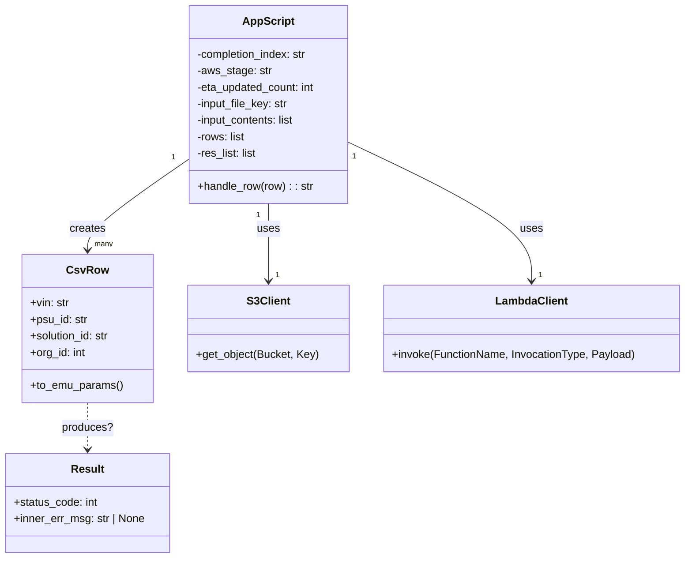

# Diagram: shipment_core/shipment_service/shipment_service/eta/jobs/emu_replay/process_csv.py


> Auto-generated by Obscura crawlers

## Diagram 1

```mermaid
flowchart LR
  subgraph AWS
    S3[S3 Bucket] -->|get_object input file| App
    Lambda[ETA Lambda] 
  end
  App[Local App / Script] --> Read[Read input lines]
  Read --> CSVParse[csv.DictReader]
  CSVParse --> Rows[ CsvRow.model_validate -> CsvRow instances ]
  Rows --> ForEach{for each row}
  ForEach --> Invoke[handle_row -> invoke lambda_client.invoke]
  Invoke -->|on success| PayloadResp[Parse resp Payload]
  PayloadResp --> CheckBody{body present?}
  CheckBody -->|yes| ParseBody[json.loads(body) -> eta_updated]
  ParseBody -->|eta_updated true| Increment[eta_updated_count += 1]
  Increment --> LogUpdate[logger.info updated]
  CheckBody -->|no| LogNoBody[logger.info result]
  Invoke -->|on ClientError| LogException[logger.exception & return error code]
  ForEach --> CollectRes[collect handle_row return values -> res_list]
  CollectRes --> Sort[sort res_list -> data]
  Sort --> Group[groupby -> groups dict]
  Group --> FinalLog[logger.info totals & groups]
  App -->|uses| AWS
  App -->|creates| CsvRow
  App -->|creates| Result
```

> SVG rendering failed for this diagram.

## Diagram 2



### SVG

<svg id="container" width="987.73046875" xmlns="http://www.w3.org/2000/svg" class="classDiagram" height="812" viewBox="0 0 987.73046875 812" role="graphics-document document" aria-roledescription="class"><style>#container{font-family:"trebuchet ms",verdana,arial,sans-serif;font-size:16px;fill:#333;}@keyframes edge-animation-frame{from{stroke-dashoffset:0;}}@keyframes dash{to{stroke-dashoffset:0;}}#container .edge-animation-slow{stroke-dasharray:9,5!important;stroke-dashoffset:900;animation:dash 50s linear infinite;stroke-linecap:round;}#container .edge-animation-fast{stroke-dasharray:9,5!important;stroke-dashoffset:900;animation:dash 20s linear infinite;stroke-linecap:round;}#container .error-icon{fill:#552222;}#container .error-text{fill:#552222;stroke:#552222;}#container .edge-thickness-normal{stroke-width:1px;}#container .edge-thickness-thick{stroke-width:3.5px;}#container .edge-pattern-solid{stroke-dasharray:0;}#container .edge-thickness-invisible{stroke-width:0;fill:none;}#container .edge-pattern-dashed{stroke-dasharray:3;}#container .edge-pattern-dotted{stroke-dasharray:2;}#container .marker{fill:#333333;stroke:#333333;}#container .marker.cross{stroke:#333333;}#container svg{font-family:"trebuchet ms",verdana,arial,sans-serif;font-size:16px;}#container p{margin:0;}#container g.classGroup text{fill:#9370DB;stroke:none;font-family:"trebuchet ms",verdana,arial,sans-serif;font-size:10px;}#container g.classGroup text .title{font-weight:bolder;}#container .nodeLabel,#container .edgeLabel{color:#131300;}#container .edgeLabel .label rect{fill:#ECECFF;}#container .label text{fill:#131300;}#container .labelBkg{background:#ECECFF;}#container .edgeLabel .label span{background:#ECECFF;}#container .classTitle{font-weight:bolder;}#container .node rect,#container .node circle,#container .node ellipse,#container .node polygon,#container .node path{fill:#ECECFF;stroke:#9370DB;stroke-width:1px;}#container .divider{stroke:#9370DB;stroke-width:1;}#container g.clickable{cursor:pointer;}#container g.classGroup rect{fill:#ECECFF;stroke:#9370DB;}#container g.classGroup line{stroke:#9370DB;stroke-width:1;}#container .classLabel .box{stroke:none;stroke-width:0;fill:#ECECFF;opacity:0.5;}#container .classLabel .label{fill:#9370DB;font-size:10px;}#container .relation{stroke:#333333;stroke-width:1;fill:none;}#container .dashed-line{stroke-dasharray:3;}#container .dotted-line{stroke-dasharray:1 2;}#container #compositionStart,#container .composition{fill:#333333!important;stroke:#333333!important;stroke-width:1;}#container #compositionEnd,#container .composition{fill:#333333!important;stroke:#333333!important;stroke-width:1;}#container #dependencyStart,#container .dependency{fill:#333333!important;stroke:#333333!important;stroke-width:1;}#container #dependencyStart,#container .dependency{fill:#333333!important;stroke:#333333!important;stroke-width:1;}#container #extensionStart,#container .extension{fill:transparent!important;stroke:#333333!important;stroke-width:1;}#container #extensionEnd,#container .extension{fill:transparent!important;stroke:#333333!important;stroke-width:1;}#container #aggregationStart,#container .aggregation{fill:transparent!important;stroke:#333333!important;stroke-width:1;}#container #aggregationEnd,#container .aggregation{fill:transparent!important;stroke:#333333!important;stroke-width:1;}#container #lollipopStart,#container .lollipop{fill:#ECECFF!important;stroke:#333333!important;stroke-width:1;}#container #lollipopEnd,#container .lollipop{fill:#ECECFF!important;stroke:#333333!important;stroke-width:1;}#container .edgeTerminals{font-size:11px;line-height:initial;}#container .classTitleText{text-anchor:middle;font-size:18px;fill:#333;}#container .label-icon{display:inline-block;height:1em;overflow:visible;vertical-align:-0.125em;}#container .node .label-icon path{fill:currentColor;stroke:revert;stroke-width:revert;}#container :root{--mermaid-font-family:"trebuchet ms",verdana,arial,sans-serif;}</style><g><defs><marker id="container_class-aggregationStart" class="marker aggregation class" refX="18" refY="7" markerWidth="190" markerHeight="240" orient="auto"><path d="M 18,7 L9,13 L1,7 L9,1 Z"></path></marker></defs><defs><marker id="container_class-aggregationEnd" class="marker aggregation class" refX="1" refY="7" markerWidth="20" markerHeight="28" orient="auto"><path d="M 18,7 L9,13 L1,7 L9,1 Z"></path></marker></defs><defs><marker id="container_class-extensionStart" class="marker extension class" refX="18" refY="7" markerWidth="190" markerHeight="240" orient="auto"><path d="M 1,7 L18,13 V 1 Z"></path></marker></defs><defs><marker id="container_class-extensionEnd" class="marker extension class" refX="1" refY="7" markerWidth="20" markerHeight="28" orient="auto"><path d="M 1,1 V 13 L18,7 Z"></path></marker></defs><defs><marker id="container_class-compositionStart" class="marker composition class" refX="18" refY="7" markerWidth="190" markerHeight="240" orient="auto"><path d="M 18,7 L9,13 L1,7 L9,1 Z"></path></marker></defs><defs><marker id="container_class-compositionEnd" class="marker composition class" refX="1" refY="7" markerWidth="20" markerHeight="28" orient="auto"><path d="M 18,7 L9,13 L1,7 L9,1 Z"></path></marker></defs><defs><marker id="container_class-dependencyStart" class="marker dependency class" refX="6" refY="7" markerWidth="190" markerHeight="240" orient="auto"><path d="M 5,7 L9,13 L1,7 L9,1 Z"></path></marker></defs><defs><marker id="container_class-dependencyEnd" class="marker dependency class" refX="13" refY="7" markerWidth="20" markerHeight="28" orient="auto"><path d="M 18,7 L9,13 L14,7 L9,1 Z"></path></marker></defs><defs><marker id="container_class-lollipopStart" class="marker lollipop class" refX="13" refY="7" markerWidth="190" markerHeight="240" orient="auto"><circle stroke="black" fill="transparent" cx="7" cy="7" r="6"></circle></marker></defs><defs><marker id="container_class-lollipopEnd" class="marker lollipop class" refX="1" refY="7" markerWidth="190" markerHeight="240" orient="auto"><circle stroke="black" fill="transparent" cx="7" cy="7" r="6"></circle></marker></defs><g class="root"><g class="clusters"></g><g class="edgePaths"><path d="M268.402,234.292L244.87,250.744C221.339,267.195,174.275,300.097,150.743,321.715C127.211,343.333,127.211,353.667,127.211,358.833L127.211,364" id="id_AppScript_CsvRow_1" class="edge-thickness-normal edge-pattern-solid relation" style=";;;" data-edge="true" data-et="edge" data-id="id_AppScript_CsvRow_1" data-points="W3sieCI6MjY4LjQwMjM0Mzc1LCJ5IjoyMzQuMjkyMzM5OTU2ODQ5MDh9LHsieCI6MTI3LjIxMDkzNzUsInkiOjMzM30seyJ4IjoxMjcuMjEwOTM3NSwieSI6MzcwfV0=" marker-end="url(#container_class-dependencyEnd)"></path><path d="M386.113,296L386.113,302.167C386.113,308.333,386.113,320.667,386.113,339.5C386.113,358.333,386.113,383.667,386.113,396.333L386.113,409" id="id_AppScript_S3Client_2" class="edge-thickness-normal edge-pattern-solid relation" style=";;;" data-edge="true" data-et="edge" data-id="id_AppScript_S3Client_2" data-points="W3sieCI6Mzg2LjExMzI4MTI1LCJ5IjoyOTZ9LHsieCI6Mzg2LjExMzI4MTI1LCJ5IjozMzN9LHsieCI6Mzg2LjExMzI4MTI1LCJ5Ijo0MTV9XQ==" marker-end="url(#container_class-dependencyEnd)"></path><path d="M503.824,208.114L547.487,228.928C591.15,249.742,678.475,291.371,722.138,324.852C765.801,358.333,765.801,383.667,765.801,396.333L765.801,409" id="id_AppScript_LambdaClient_3" class="edge-thickness-normal edge-pattern-solid relation" style=";;;" data-edge="true" data-et="edge" data-id="id_AppScript_LambdaClient_3" data-points="W3sieCI6NTAzLjgyNDIxODc1LCJ5IjoyMDguMTEzNzI0Mjc5ODM1NH0seyJ4Ijo3NjUuODAwNzgxMjUsInkiOjMzM30seyJ4Ijo3NjUuODAwNzgxMjUsInkiOjQxNX1d" marker-end="url(#container_class-dependencyEnd)"></path><path d="M127.211,586L127.211,592.167C127.211,598.333,127.211,610.667,127.211,622C127.211,633.333,127.211,643.667,127.211,648.833L127.211,654" id="id_CsvRow_Result_4" class="edge-thickness-normal edge-pattern-dashed relation" style=";;;" data-edge="true" data-et="edge" data-id="id_CsvRow_Result_4" data-points="W3sieCI6MTI3LjIxMDkzNzUsInkiOjU4Nn0seyJ4IjoxMjcuMjEwOTM3NSwieSI6NjIzfSx7IngiOjEyNy4yMTA5Mzc1LCJ5Ijo2NjB9XQ==" marker-end="url(#container_class-dependencyEnd)"></path></g><g class="edgeLabels"><g class="edgeLabel" transform="translate(127.2109375, 333)"><g class="label" data-id="id_AppScript_CsvRow_1" transform="translate(-26.171875, -12)"><foreignObject width="52.34375" height="24"><div xmlns="http://www.w3.org/1999/xhtml" class="labelBkg" style="display: table-cell; white-space: nowrap; line-height: 1.5; max-width: 200px; text-align: center;"><span class="edgeLabel"><p>creates</p></span></div></foreignObject></g></g><g class="edgeLabel" transform="translate(386.11328125, 333)"><g class="label" data-id="id_AppScript_S3Client_2" transform="translate(-16.4921875, -12)"><foreignObject width="32.984375" height="24"><div xmlns="http://www.w3.org/1999/xhtml" class="labelBkg" style="display: table-cell; white-space: nowrap; line-height: 1.5; max-width: 200px; text-align: center;"><span class="edgeLabel"><p>uses</p></span></div></foreignObject></g></g><g class="edgeLabel" transform="translate(765.80078125, 333)"><g class="label" data-id="id_AppScript_LambdaClient_3" transform="translate(-16.4921875, -12)"><foreignObject width="32.984375" height="24"><div xmlns="http://www.w3.org/1999/xhtml" class="labelBkg" style="display: table-cell; white-space: nowrap; line-height: 1.5; max-width: 200px; text-align: center;"><span class="edgeLabel"><p>uses</p></span></div></foreignObject></g></g><g class="edgeLabel" transform="translate(127.2109375, 623)"><g class="label" data-id="id_CsvRow_Result_4" transform="translate(-36.90625, -12)"><foreignObject width="73.8125" height="24"><div xmlns="http://www.w3.org/1999/xhtml" class="labelBkg" style="display: table-cell; white-space: nowrap; line-height: 1.5; max-width: 200px; text-align: center;"><span class="edgeLabel"><p>produces?</p></span></div></foreignObject></g></g><g class="edgeTerminals" transform="translate(245.46520722625087, 232.02566961444944)"><g class="inner" transform="translate(0, 0)"><foreignObject style="width: 9px; height: 12px;"><div xmlns="http://www.w3.org/1999/xhtml" style="display: inline-block; padding-right: 1px; white-space: nowrap;"><span class="edgeLabel">1</span></div></foreignObject></g></g><g class="edgeTerminals" transform="translate(371.113280625, 313.4999994642857)"><g class="inner" transform="translate(0, 0)"><foreignObject style="width: 9px; height: 12px;"><div xmlns="http://www.w3.org/1999/xhtml" style="display: inline-block; padding-right: 1px; white-space: nowrap;"><span class="edgeLabel">1</span></div></foreignObject></g></g><g class="edgeTerminals" transform="translate(513.1663918546861, 229.18440996284332)"><g class="inner" transform="translate(0, 0)"><foreignObject style="width: 9px; height: 12px;"><div xmlns="http://www.w3.org/1999/xhtml" style="display: inline-block; padding-right: 1px; white-space: nowrap;"><span class="edgeLabel">1</span></div></foreignObject></g></g><g class="edgeTerminals" transform="translate(137.21093874999997, 347.5000010714286)"><g class="inner" transform="translate(0, 0)"></g><foreignObject style="width: 36px; height: 12px;"><div xmlns="http://www.w3.org/1999/xhtml" style="display: inline-block; padding-right: 1px; white-space: nowrap;"><span class="edgeLabel">many</span></div></foreignObject></g><g class="edgeTerminals" transform="translate(396.113280625, 392.4999994642857)"><g class="inner" transform="translate(0, 0)"></g><foreignObject style="width: 9px; height: 12px;"><div xmlns="http://www.w3.org/1999/xhtml" style="display: inline-block; padding-right: 1px; white-space: nowrap;"><span class="edgeLabel">1</span></div></foreignObject></g><g class="edgeTerminals" transform="translate(775.800780625, 392.49999946428574)"><g class="inner" transform="translate(0, 0)"></g><foreignObject style="width: 9px; height: 12px;"><div xmlns="http://www.w3.org/1999/xhtml" style="display: inline-block; padding-right: 1px; white-space: nowrap;"><span class="edgeLabel">1</span></div></foreignObject></g></g><g class="nodes"><g class="node default" id="classId-CsvRow-0" transform="translate(127.2109375, 478)"><g class="basic label-container"><path d="M-93.14453125 -108 L93.14453125 -108 L93.14453125 108 L-93.14453125 108" stroke="none" stroke-width="0" fill="#ECECFF" style=""></path><path d="M-93.14453125 -108 C-42.407936932113394 -108, 8.328657385773212 -108, 93.14453125 -108 M-93.14453125 -108 C-21.456577373973687 -108, 50.231376502052626 -108, 93.14453125 -108 M93.14453125 -108 C93.14453125 -59.00306336154407, 93.14453125 -10.006126723088144, 93.14453125 108 M93.14453125 -108 C93.14453125 -27.61301011317063, 93.14453125 52.77397977365874, 93.14453125 108 M93.14453125 108 C22.813680622308624 108, -47.51717000538275 108, -93.14453125 108 M93.14453125 108 C41.438540458050156 108, -10.267450333899689 108, -93.14453125 108 M-93.14453125 108 C-93.14453125 24.924434991209225, -93.14453125 -58.15113001758155, -93.14453125 -108 M-93.14453125 108 C-93.14453125 35.04086877758242, -93.14453125 -37.918262444835165, -93.14453125 -108" stroke="#9370DB" stroke-width="1.3" fill="none" stroke-dasharray="0 0" style=""></path></g><g class="annotation-group text" transform="translate(0, -84)"></g><g class="label-group text" transform="translate(-27.8359375, -84)"><g class="label" style="font-weight: bolder" transform="translate(0,-12)"><foreignObject width="55.671875" height="24"><div xmlns="http://www.w3.org/1999/xhtml" style="display: table-cell; white-space: nowrap; line-height: 1.5; max-width: 105px; text-align: center;"><span class="nodeLabel markdown-node-label" style=""><p>CsvRow</p></span></div></foreignObject></g></g><g class="members-group text" transform="translate(-81.14453125, -36)"><g class="label" style="" transform="translate(0,-12)"><foreignObject width="57.09375" height="24"><div xmlns="http://www.w3.org/1999/xhtml" style="display: table-cell; white-space: nowrap; line-height: 1.5; max-width: 115px; text-align: center;"><span class="nodeLabel markdown-node-label" style=""><p>+vin: str</p></span></div></foreignObject></g><g class="label" style="" transform="translate(0,12)"><foreignObject width="84.1875" height="24"><div xmlns="http://www.w3.org/1999/xhtml" style="display: table-cell; white-space: nowrap; line-height: 1.5; max-width: 142px; text-align: center;"><span class="nodeLabel markdown-node-label" style=""><p>+psu_id: str</p></span></div></foreignObject></g><g class="label" style="" transform="translate(0,36)"><foreignObject width="117.71875" height="24"><div xmlns="http://www.w3.org/1999/xhtml" style="display: table-cell; white-space: nowrap; line-height: 1.5; max-width: 176px; text-align: center;"><span class="nodeLabel markdown-node-label" style=""><p>+solution_id: str</p></span></div></foreignObject></g><g class="label" style="" transform="translate(0,60)"><foreignObject width="81.796875" height="24"><div xmlns="http://www.w3.org/1999/xhtml" style="display: table-cell; white-space: nowrap; line-height: 1.5; max-width: 139px; text-align: center;"><span class="nodeLabel markdown-node-label" style=""><p>+org_id: int</p></span></div></foreignObject></g></g><g class="methods-group text" transform="translate(-81.14453125, 84)"><g class="label" style="" transform="translate(0,-12)"><foreignObject width="134.453125" height="24"><div xmlns="http://www.w3.org/1999/xhtml" style="display: table-cell; white-space: nowrap; line-height: 1.5; max-width: 192px; text-align: center;"><span class="nodeLabel markdown-node-label" style=""><p>+to_emu_params()</p></span></div></foreignObject></g></g><g class="divider" style=""><path d="M-93.14453125 -60 C-36.4400871004054 -60, 20.2643570491892 -60, 93.14453125 -60 M-93.14453125 -60 C-54.99222468294727 -60, -16.839918115894534 -60, 93.14453125 -60" stroke="#9370DB" stroke-width="1.3" fill="none" stroke-dasharray="0 0" style=""></path></g><g class="divider" style=""><path d="M-93.14453125 60 C-52.46442048776086 60, -11.784309725521723 60, 93.14453125 60 M-93.14453125 60 C-36.92904618789256 60, 19.28643887421488 60, 93.14453125 60" stroke="#9370DB" stroke-width="1.3" fill="none" stroke-dasharray="0 0" style=""></path></g></g><g class="node default" id="classId-Result-1" transform="translate(127.2109375, 732)"><g class="basic label-container"><path d="M-119.2109375 -72 L119.2109375 -72 L119.2109375 72 L-119.2109375 72" stroke="none" stroke-width="0" fill="#ECECFF" style=""></path><path d="M-119.2109375 -72 C-26.614124718333926 -72, 65.98268806333215 -72, 119.2109375 -72 M-119.2109375 -72 C-66.25724637969799 -72, -13.303555259395964 -72, 119.2109375 -72 M119.2109375 -72 C119.2109375 -35.9815081594549, 119.2109375 0.03698368109020578, 119.2109375 72 M119.2109375 -72 C119.2109375 -14.525768794940973, 119.2109375 42.948462410118054, 119.2109375 72 M119.2109375 72 C61.58827654939763 72, 3.965615598795253 72, -119.2109375 72 M119.2109375 72 C24.764309209250243 72, -69.68231908149951 72, -119.2109375 72 M-119.2109375 72 C-119.2109375 42.17834799713168, -119.2109375 12.356695994263369, -119.2109375 -72 M-119.2109375 72 C-119.2109375 39.26555643822367, -119.2109375 6.531112876447338, -119.2109375 -72" stroke="#9370DB" stroke-width="1.3" fill="none" stroke-dasharray="0 0" style=""></path></g><g class="annotation-group text" transform="translate(0, -48)"></g><g class="label-group text" transform="translate(-23.140625, -48)"><g class="label" style="font-weight: bolder" transform="translate(0,-12)"><foreignObject width="46.28125" height="24"><div xmlns="http://www.w3.org/1999/xhtml" style="display: table-cell; white-space: nowrap; line-height: 1.5; max-width: 96px; text-align: center;"><span class="nodeLabel markdown-node-label" style=""><p>Result</p></span></div></foreignObject></g></g><g class="members-group text" transform="translate(-107.2109375, 0)"><g class="label" style="" transform="translate(0,-12)"><foreignObject width="122.78125" height="24"><div xmlns="http://www.w3.org/1999/xhtml" style="display: table-cell; white-space: nowrap; line-height: 1.5; max-width: 180px; text-align: center;"><span class="nodeLabel markdown-node-label" style=""><p>+status_code: int</p></span></div></foreignObject></g><g class="label" style="" transform="translate(0,12)"><foreignObject width="191.28125" height="24"><div xmlns="http://www.w3.org/1999/xhtml" style="display: table-cell; white-space: nowrap; line-height: 1.5; max-width: 249px; text-align: center;"><span class="nodeLabel markdown-node-label" style=""><p>+inner_err_msg: str | None</p></span></div></foreignObject></g></g><g class="methods-group text" transform="translate(-107.2109375, 72)"></g><g class="divider" style=""><path d="M-119.2109375 -24 C-66.76757013537186 -24, -14.32420277074371 -24, 119.2109375 -24 M-119.2109375 -24 C-40.96930625195559 -24, 37.27232499608883 -24, 119.2109375 -24" stroke="#9370DB" stroke-width="1.3" fill="none" stroke-dasharray="0 0" style=""></path></g><g class="divider" style=""><path d="M-119.2109375 48 C-46.81402069881027 48, 25.582896102379465 48, 119.2109375 48 M-119.2109375 48 C-47.11396250353221 48, 24.983012492935586 48, 119.2109375 48" stroke="#9370DB" stroke-width="1.3" fill="none" stroke-dasharray="0 0" style=""></path></g></g><g class="node default" id="classId-S3Client-2" transform="translate(386.11328125, 478)"><g class="basic label-container"><path d="M-115.7578125 -63 L115.7578125 -63 L115.7578125 63 L-115.7578125 63" stroke="none" stroke-width="0" fill="#ECECFF" style=""></path><path d="M-115.7578125 -63 C-60.72554888760994 -63, -5.693285275219878 -63, 115.7578125 -63 M-115.7578125 -63 C-25.45463943634094 -63, 64.84853362731812 -63, 115.7578125 -63 M115.7578125 -63 C115.7578125 -12.787642316284341, 115.7578125 37.42471536743132, 115.7578125 63 M115.7578125 -63 C115.7578125 -20.18884971410686, 115.7578125 22.622300571786283, 115.7578125 63 M115.7578125 63 C68.09494170027179 63, 20.43207090054358 63, -115.7578125 63 M115.7578125 63 C29.565069285711743 63, -56.62767392857651 63, -115.7578125 63 M-115.7578125 63 C-115.7578125 15.577870992903044, -115.7578125 -31.844258014193912, -115.7578125 -63 M-115.7578125 63 C-115.7578125 23.339642252667936, -115.7578125 -16.320715494664128, -115.7578125 -63" stroke="#9370DB" stroke-width="1.3" fill="none" stroke-dasharray="0 0" style=""></path></g><g class="annotation-group text" transform="translate(0, -39)"></g><g class="label-group text" transform="translate(-30.015625, -39)"><g class="label" style="font-weight: bolder" transform="translate(0,-12)"><foreignObject width="60.03125" height="24"><div xmlns="http://www.w3.org/1999/xhtml" style="display: table-cell; white-space: nowrap; line-height: 1.5; max-width: 109px; text-align: center;"><span class="nodeLabel markdown-node-label" style=""><p>S3Client</p></span></div></foreignObject></g></g><g class="members-group text" transform="translate(-103.7578125, 9)"></g><g class="methods-group text" transform="translate(-103.7578125, 39)"><g class="label" style="" transform="translate(0,-12)"><foreignObject width="177.5" height="24"><div xmlns="http://www.w3.org/1999/xhtml" style="display: table-cell; white-space: nowrap; line-height: 1.5; max-width: 235px; text-align: center;"><span class="nodeLabel markdown-node-label" style=""><p>+get_object(Bucket, Key)</p></span></div></foreignObject></g></g><g class="divider" style=""><path d="M-115.7578125 -15 C-49.575717071446746 -15, 16.606378357106507 -15, 115.7578125 -15 M-115.7578125 -15 C-40.5988794977189 -15, 34.560053504562205 -15, 115.7578125 -15" stroke="#9370DB" stroke-width="1.3" fill="none" stroke-dasharray="0 0" style=""></path></g><g class="divider" style=""><path d="M-115.7578125 9 C-36.83598200177521 9, 42.085848496449586 9, 115.7578125 9 M-115.7578125 9 C-25.409948948373824 9, 64.93791460325235 9, 115.7578125 9" stroke="#9370DB" stroke-width="1.3" fill="none" stroke-dasharray="0 0" style=""></path></g></g><g class="node default" id="classId-LambdaClient-3" transform="translate(765.80078125, 478)"><g class="basic label-container"><path d="M-213.9296875 -63 L213.9296875 -63 L213.9296875 63 L-213.9296875 63" stroke="none" stroke-width="0" fill="#ECECFF" style=""></path><path d="M-213.9296875 -63 C-54.748977578401565 -63, 104.43173234319687 -63, 213.9296875 -63 M-213.9296875 -63 C-124.61025446364555 -63, -35.29082142729109 -63, 213.9296875 -63 M213.9296875 -63 C213.9296875 -14.30643435134791, 213.9296875 34.38713129730418, 213.9296875 63 M213.9296875 -63 C213.9296875 -17.710902787880563, 213.9296875 27.578194424238873, 213.9296875 63 M213.9296875 63 C85.42273606687971 63, -43.084215366240585 63, -213.9296875 63 M213.9296875 63 C44.977490009455806 63, -123.97470748108839 63, -213.9296875 63 M-213.9296875 63 C-213.9296875 25.582984265977984, -213.9296875 -11.834031468044031, -213.9296875 -63 M-213.9296875 63 C-213.9296875 34.88439448585653, -213.9296875 6.7687889717130645, -213.9296875 -63" stroke="#9370DB" stroke-width="1.3" fill="none" stroke-dasharray="0 0" style=""></path></g><g class="annotation-group text" transform="translate(0, -39)"></g><g class="label-group text" transform="translate(-50.40625, -39)"><g class="label" style="font-weight: bolder" transform="translate(0,-12)"><foreignObject width="100.8125" height="24"><div xmlns="http://www.w3.org/1999/xhtml" style="display: table-cell; white-space: nowrap; line-height: 1.5; max-width: 150px; text-align: center;"><span class="nodeLabel markdown-node-label" style=""><p>LambdaClient</p></span></div></foreignObject></g></g><g class="members-group text" transform="translate(-201.9296875, 9)"></g><g class="methods-group text" transform="translate(-201.9296875, 39)"><g class="label" style="" transform="translate(0,-12)"><foreignObject width="353.453125" height="24"><div xmlns="http://www.w3.org/1999/xhtml" style="display: table-cell; white-space: nowrap; line-height: 1.5; max-width: 411px; text-align: center;"><span class="nodeLabel markdown-node-label" style=""><p>+invoke(FunctionName, InvocationType, Payload)</p></span></div></foreignObject></g></g><g class="divider" style=""><path d="M-213.9296875 -15 C-67.17678300135623 -15, 79.57612149728755 -15, 213.9296875 -15 M-213.9296875 -15 C-70.85715711652273 -15, 72.21537326695454 -15, 213.9296875 -15" stroke="#9370DB" stroke-width="1.3" fill="none" stroke-dasharray="0 0" style=""></path></g><g class="divider" style=""><path d="M-213.9296875 9 C-93.45994392659004 9, 27.009799646819914 9, 213.9296875 9 M-213.9296875 9 C-92.5345911641383 9, 28.86050517172339 9, 213.9296875 9" stroke="#9370DB" stroke-width="1.3" fill="none" stroke-dasharray="0 0" style=""></path></g></g><g class="node default" id="classId-AppScript-4" transform="translate(386.11328125, 152)"><g class="basic label-container"><path d="M-117.7109375 -144 L117.7109375 -144 L117.7109375 144 L-117.7109375 144" stroke="none" stroke-width="0" fill="#ECECFF" style=""></path><path d="M-117.7109375 -144 C-60.00812323857243 -144, -2.305308977144861 -144, 117.7109375 -144 M-117.7109375 -144 C-32.99944034279039 -144, 51.71205681441921 -144, 117.7109375 -144 M117.7109375 -144 C117.7109375 -35.86969995737226, 117.7109375 72.26060008525548, 117.7109375 144 M117.7109375 -144 C117.7109375 -69.20175118567288, 117.7109375 5.596497628654248, 117.7109375 144 M117.7109375 144 C42.543945853836505 144, -32.62304579232699 144, -117.7109375 144 M117.7109375 144 C59.79602492900782 144, 1.881112358015642 144, -117.7109375 144 M-117.7109375 144 C-117.7109375 84.17774500850527, -117.7109375 24.355490017010553, -117.7109375 -144 M-117.7109375 144 C-117.7109375 66.29478769715524, -117.7109375 -11.410424605689514, -117.7109375 -144" stroke="#9370DB" stroke-width="1.3" fill="none" stroke-dasharray="0 0" style=""></path></g><g class="annotation-group text" transform="translate(0, -120)"></g><g class="label-group text" transform="translate(-36.015625, -120)"><g class="label" style="font-weight: bolder" transform="translate(0,-12)"><foreignObject width="72.03125" height="24"><div xmlns="http://www.w3.org/1999/xhtml" style="display: table-cell; white-space: nowrap; line-height: 1.5; max-width: 121px; text-align: center;"><span class="nodeLabel markdown-node-label" style=""><p>AppScript</p></span></div></foreignObject></g></g><g class="members-group text" transform="translate(-105.7109375, -72)"><g class="label" style="" transform="translate(0,-12)"><foreignObject width="164.359375" height="24"><div xmlns="http://www.w3.org/1999/xhtml" style="display: table-cell; white-space: nowrap; line-height: 1.5; max-width: 223px; text-align: center;"><span class="nodeLabel markdown-node-label" style=""><p>-completion_index: str</p></span></div></foreignObject></g><g class="label" style="" transform="translate(0,12)"><foreignObject width="107.75" height="24"><div xmlns="http://www.w3.org/1999/xhtml" style="display: table-cell; white-space: nowrap; line-height: 1.5; max-width: 166px; text-align: center;"><span class="nodeLabel markdown-node-label" style=""><p>-aws_stage: str</p></span></div></foreignObject></g><g class="label" style="" transform="translate(0,36)"><foreignObject width="175.40625" height="24"><div xmlns="http://www.w3.org/1999/xhtml" style="display: table-cell; white-space: nowrap; line-height: 1.5; max-width: 233px; text-align: center;"><span class="nodeLabel markdown-node-label" style=""><p>-eta_updated_count: int</p></span></div></foreignObject></g><g class="label" style="" transform="translate(0,60)"><foreignObject width="135.609375" height="24"><div xmlns="http://www.w3.org/1999/xhtml" style="display: table-cell; white-space: nowrap; line-height: 1.5; max-width: 194px; text-align: center;"><span class="nodeLabel markdown-node-label" style=""><p>-input_file_key: str</p></span></div></foreignObject></g><g class="label" style="" transform="translate(0,84)"><foreignObject width="146.390625" height="24"><div xmlns="http://www.w3.org/1999/xhtml" style="display: table-cell; white-space: nowrap; line-height: 1.5; max-width: 204px; text-align: center;"><span class="nodeLabel markdown-node-label" style=""><p>-input_contents: list</p></span></div></foreignObject></g><g class="label" style="" transform="translate(0,108)"><foreignObject width="70.96875" height="24"><div xmlns="http://www.w3.org/1999/xhtml" style="display: table-cell; white-space: nowrap; line-height: 1.5; max-width: 129px; text-align: center;"><span class="nodeLabel markdown-node-label" style=""><p>-rows: list</p></span></div></foreignObject></g><g class="label" style="" transform="translate(0,132)"><foreignObject width="89.21875" height="24"><div xmlns="http://www.w3.org/1999/xhtml" style="display: table-cell; white-space: nowrap; line-height: 1.5; max-width: 147px; text-align: center;"><span class="nodeLabel markdown-node-label" style=""><p>-res_list: list</p></span></div></foreignObject></g></g><g class="methods-group text" transform="translate(-105.7109375, 120)"><g class="label" style="" transform="translate(0,-12)"><foreignObject width="169.5625" height="24"><div xmlns="http://www.w3.org/1999/xhtml" style="display: table-cell; white-space: nowrap; line-height: 1.5; max-width: 228px; text-align: center;"><span class="nodeLabel markdown-node-label" style=""><p>+handle_row(row) : : str</p></span></div></foreignObject></g></g><g class="divider" style=""><path d="M-117.7109375 -96 C-49.29400046110155 -96, 19.122936577796906 -96, 117.7109375 -96 M-117.7109375 -96 C-42.896889378004616 -96, 31.91715874399077 -96, 117.7109375 -96" stroke="#9370DB" stroke-width="1.3" fill="none" stroke-dasharray="0 0" style=""></path></g><g class="divider" style=""><path d="M-117.7109375 96 C-47.83299604613643 96, 22.04494540772714 96, 117.7109375 96 M-117.7109375 96 C-36.13365480865251 96, 45.44362788269498 96, 117.7109375 96" stroke="#9370DB" stroke-width="1.3" fill="none" stroke-dasharray="0 0" style=""></path></g></g></g></g></g></svg>
