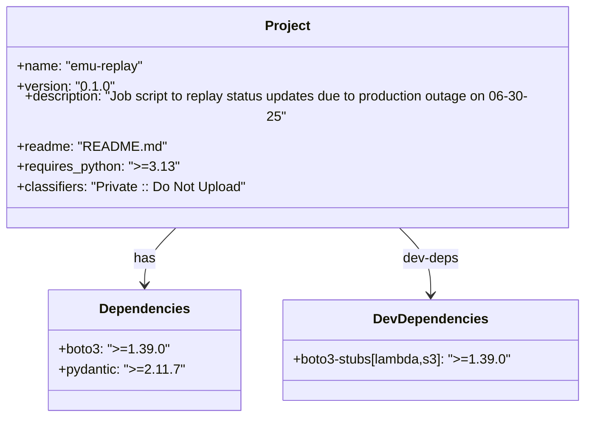

# Diagram: shipment_core/shipment_service/shipment_service/eta/jobs/emu_replay/pyproject.toml

> Auto-generated by Obscura crawlers

## Mermaid

### SVG

<svg id="container" width="703.1171875" xmlns="http://www.w3.org/2000/svg" class="classDiagram" height="474" viewBox="0 0 703.1171875 474" role="graphics-document document" aria-roledescription="class"><g><defs><marker id="container_class-aggregationStart" class="marker aggregation class" refX="18" refY="7" markerWidth="190" markerHeight="240" orient="auto"><path d="M 18,7 L9,13 L1,7 L9,1 Z"></path></marker></defs><defs><marker id="container_class-aggregationEnd" class="marker aggregation class" refX="1" refY="7" markerWidth="20" markerHeight="28" orient="auto"><path d="M 18,7 L9,13 L1,7 L9,1 Z"></path></marker></defs><defs><marker id="container_class-extensionStart" class="marker extension class" refX="18" refY="7" markerWidth="190" markerHeight="240" orient="auto"><path d="M 1,7 L18,13 V 1 Z"></path></marker></defs><defs><marker id="container_class-extensionEnd" class="marker extension class" refX="1" refY="7" markerWidth="20" markerHeight="28" orient="auto"><path d="M 1,1 V 13 L18,7 Z"></path></marker></defs><defs><marker id="container_class-compositionStart" class="marker composition class" refX="18" refY="7" markerWidth="190" markerHeight="240" orient="auto"><path d="M 18,7 L9,13 L1,7 L9,1 Z"></path></marker></defs><defs><marker id="container_class-compositionEnd" class="marker composition class" refX="1" refY="7" markerWidth="20" markerHeight="28" orient="auto"><path d="M 18,7 L9,13 L1,7 L9,1 Z"></path></marker></defs><defs><marker id="container_class-dependencyStart" class="marker dependency class" refX="6" refY="7" markerWidth="190" markerHeight="240" orient="auto"><path d="M 5,7 L9,13 L1,7 L9,1 Z"></path></marker></defs><defs><marker id="container_class-dependencyEnd" class="marker dependency class" refX="13" refY="7" markerWidth="20" markerHeight="28" orient="auto"><path d="M 18,7 L9,13 L14,7 L9,1 Z"></path></marker></defs><defs><marker id="container_class-lollipopStart" class="marker lollipop class" refX="13" refY="7" markerWidth="190" markerHeight="240" orient="auto"><circle stroke="black" fill="transparent" cx="7" cy="7" r="6"></circle></marker></defs><defs><marker id="container_class-lollipopEnd" class="marker lollipop class" refX="1" refY="7" markerWidth="190" markerHeight="240" orient="auto"><circle stroke="black" fill="transparent" cx="7" cy="7" r="6"></circle></marker></defs><g class="root"><g class="clusters"></g><g class="edgePaths"><path d="M224.959,248L218.453,254.167C211.947,260.333,198.935,272.667,192.43,284C185.924,295.333,185.924,305.667,185.924,310.833L185.924,316" id="id_Project_Dependencies_1" class="edge-thickness-normal edge-pattern-solid relation" style=";;;" data-edge="true" data-et="edge" data-id="id_Project_Dependencies_1" data-points="W3sieCI6MjI0Ljk1ODc3Mjg5MDEyNzQsInkiOjI0OH0seyJ4IjoxODUuOTIzODI4MTI1LCJ5IjoyODV9LHsieCI6MTg1LjkyMzgyODEyNSwieSI6MzIyfV0=" marker-end="url(#container_class-dependencyEnd)"></path><path d="M478.158,248L484.664,254.167C491.17,260.333,504.182,272.667,510.688,286C517.193,299.333,517.193,313.667,517.193,320.833L517.193,328" id="id_Project_DevDependencies_2" class="edge-thickness-normal edge-pattern-solid relation" style=";;;" data-edge="true" data-et="edge" data-id="id_Project_DevDependencies_2" data-points="W3sieCI6NDc4LjE1ODQxNDYwOTg3MjYsInkiOjI0OH0seyJ4Ijo1MTcuMTkzMzU5Mzc1LCJ5IjoyODV9LHsieCI6NTE3LjE5MzM1OTM3NSwieSI6MzM0fV0=" marker-end="url(#container_class-dependencyEnd)"></path></g><g class="edgeLabels"><g class="edgeLabel" transform="translate(185.923828125, 285)"><g class="label" data-id="id_Project_Dependencies_1" transform="translate(-12.703125, -12)"><foreignObject width="25.40625" height="24">

has

</foreignObject></g></g><g class="edgeLabel" transform="translate(517.193359375, 285)"><g class="label" data-id="id_Project_DevDependencies_2" transform="translate(-33.828125, -12)"><foreignObject width="67.65625" height="24">

dev-deps

</foreignObject></g></g></g><g class="nodes"><g class="node default" id="classId-Project-0" transform="translate(351.55859375, 128)"><g class="basic label-container"><path d="M-343.55859375 -120 L343.55859375 -120 L343.55859375 120 L-343.55859375 120" stroke="none" stroke-width="0" fill="#ECECFF" style=""></path><path d="M-343.55859375 -120 C-128.7687258195672 -120, 86.02114211086558 -120, 343.55859375 -120 M-343.55859375 -120 C-113.37416095012989 -120, 116.81027184974022 -120, 343.55859375 -120 M343.55859375 -120 C343.55859375 -63.50126283660839, 343.55859375 -7.00252567321678, 343.55859375 120 M343.55859375 -120 C343.55859375 -53.48788853864119, 343.55859375 13.024222922717627, 343.55859375 120 M343.55859375 120 C176.39568767795484 120, 9.232781605909679 120, -343.55859375 120 M343.55859375 120 C142.6216560208439 120, -58.31528170831223 120, -343.55859375 120 M-343.55859375 120 C-343.55859375 38.918834606200534, -343.55859375 -42.16233078759893, -343.55859375 -120 M-343.55859375 120 C-343.55859375 54.41744263724044, -343.55859375 -11.165114725519118, -343.55859375 -120" stroke="#9370DB" stroke-width="1.3" fill="none" stroke-dasharray="0 0" style=""></path></g><g class="annotation-group text" transform="translate(0, -96)"></g><g class="label-group text" transform="translate(-25.8671875, -96)"><g class="label" style="font-weight: bolder" transform="translate(0,-12)"><foreignObject width="51.734375" height="24">

Project

</foreignObject></g></g><g class="members-group text" transform="translate(-331.55859375, -48)"><g class="label" style="" transform="translate(0,-12)"><foreignObject width="152.25" height="24">

+name: "emu-replay"

</foreignObject></g><g class="label" style="" transform="translate(0,12)"><foreignObject width="112.015625" height="24">

+version: "0.1.0"

</foreignObject></g><g class="label" style="" transform="translate(0,36)"><foreignObject width="637.25" height="24">

+description: "Job script to replay status updates due to production outage on 06-30-25"

</foreignObject></g><g class="label" style="" transform="translate(0,60)"><foreignObject width="169.53125" height="24">

+readme: "README.md"

</foreignObject></g><g class="label" style="" transform="translate(0,84)"><foreignObject width="188.296875" height="24">

+requires_python: "&gt;=3.13"

</foreignObject></g><g class="label" style="" transform="translate(0,108)"><foreignObject width="273" height="24">

+classifiers: "Private :: Do Not Upload"

</foreignObject></g></g><g class="methods-group text" transform="translate(-331.55859375, 120)"></g><g class="divider" style=""><path d="M-343.55859375 -72 C-165.41436400252326 -72, 12.729865744953486 -72, 343.55859375 -72 M-343.55859375 -72 C-72.54050751732973 -72, 198.47757871534054 -72, 343.55859375 -72" stroke="#9370DB" stroke-width="1.3" fill="none" stroke-dasharray="0 0" style=""></path></g><g class="divider" style=""><path d="M-343.55859375 96 C-161.56513496749628 96, 20.428323815007445 96, 343.55859375 96 M-343.55859375 96 C-174.4914223301611 96, -5.4242509103222005 96, 343.55859375 96" stroke="#9370DB" stroke-width="1.3" fill="none" stroke-dasharray="0 0" style=""></path></g></g><g class="node default" id="classId-Dependencies-1" transform="translate(185.923828125, 394)"><g class="basic label-container"><path d="M-109.12109375 -72 L109.12109375 -72 L109.12109375 72 L-109.12109375 72" stroke="none" stroke-width="0" fill="#ECECFF" style=""></path><path d="M-109.12109375 -72 C-37.729410907225144 -72, 33.66227193554971 -72, 109.12109375 -72 M-109.12109375 -72 C-44.922629539537695 -72, 19.27583467092461 -72, 109.12109375 -72 M109.12109375 -72 C109.12109375 -15.495243045970788, 109.12109375 41.00951390805842, 109.12109375 72 M109.12109375 -72 C109.12109375 -20.59852267558169, 109.12109375 30.802954648836618, 109.12109375 72 M109.12109375 72 C24.28089858776714 72, -60.55929657446572 72, -109.12109375 72 M109.12109375 72 C58.7323192708605 72, 8.343544791721001 72, -109.12109375 72 M-109.12109375 72 C-109.12109375 32.20040108326565, -109.12109375 -7.599197833468693, -109.12109375 -72 M-109.12109375 72 C-109.12109375 17.668684147840672, -109.12109375 -36.662631704318656, -109.12109375 -72" stroke="#9370DB" stroke-width="1.3" fill="none" stroke-dasharray="0 0" style=""></path></g><g class="annotation-group text" transform="translate(0, -48)"></g><g class="label-group text" transform="translate(-51.6328125, -48)"><g class="label" style="font-weight: bolder" transform="translate(0,-12)"><foreignObject width="103.265625" height="24">

Dependencies

</foreignObject></g></g><g class="members-group text" transform="translate(-97.12109375, 0)"><g class="label" style="" transform="translate(0,-12)"><foreignObject width="124.546875" height="24">

+boto3: "&gt;=1.39.0"

</foreignObject></g><g class="label" style="" transform="translate(0,12)"><foreignObject width="142.609375" height="24">

+pydantic: "&gt;=2.11.7"

</foreignObject></g></g><g class="methods-group text" transform="translate(-97.12109375, 72)"></g><g class="divider" style=""><path d="M-109.12109375 -24 C-63.340696443566095 -24, -17.56029913713219 -24, 109.12109375 -24 M-109.12109375 -24 C-57.839809766983954 -24, -6.558525783967909 -24, 109.12109375 -24" stroke="#9370DB" stroke-width="1.3" fill="none" stroke-dasharray="0 0" style=""></path></g><g class="divider" style=""><path d="M-109.12109375 48 C-54.978029186330794 48, -0.8349646226615874 48, 109.12109375 48 M-109.12109375 48 C-59.10109641099642 48, -9.081099071992838 48, 109.12109375 48" stroke="#9370DB" stroke-width="1.3" fill="none" stroke-dasharray="0 0" style=""></path></g></g><g class="node default" id="classId-DevDependencies-2" transform="translate(517.193359375, 394)"><g class="basic label-container"><path d="M-172.1484375 -60 L172.1484375 -60 L172.1484375 60 L-172.1484375 60" stroke="none" stroke-width="0" fill="#ECECFF" style=""></path><path d="M-172.1484375 -60 C-58.83202785622461 -60, 54.484381787550774 -60, 172.1484375 -60 M-172.1484375 -60 C-44.2396432525895 -60, 83.669150994821 -60, 172.1484375 -60 M172.1484375 -60 C172.1484375 -18.356028139629764, 172.1484375 23.287943720740472, 172.1484375 60 M172.1484375 -60 C172.1484375 -27.796532016495284, 172.1484375 4.4069359670094315, 172.1484375 60 M172.1484375 60 C36.02173234000085 60, -100.1049728199983 60, -172.1484375 60 M172.1484375 60 C44.22639467220809 60, -83.69564815558383 60, -172.1484375 60 M-172.1484375 60 C-172.1484375 29.6429903426675, -172.1484375 -0.714019314665002, -172.1484375 -60 M-172.1484375 60 C-172.1484375 18.998471183468155, -172.1484375 -22.00305763306369, -172.1484375 -60" stroke="#9370DB" stroke-width="1.3" fill="none" stroke-dasharray="0 0" style=""></path></g><g class="annotation-group text" transform="translate(0, -36)"></g><g class="label-group text" transform="translate(-65.296875, -36)"><g class="label" style="font-weight: bolder" transform="translate(0,-12)"><foreignObject width="130.59375" height="24">

DevDependencies

</foreignObject></g></g><g class="members-group text" transform="translate(-160.1484375, 12)"><g class="label" style="" transform="translate(0,-12)"><foreignObject width="255" height="24">

+boto3-stubs[lambda,s3]: "&gt;=1.39.0"

</foreignObject></g></g><g class="methods-group text" transform="translate(-160.1484375, 60)"></g><g class="divider" style=""><path d="M-172.1484375 -12 C-75.51324282651679 -12, 21.121951846966425 -12, 172.1484375 -12 M-172.1484375 -12 C-47.66514004686664 -12, 76.81815740626672 -12, 172.1484375 -12" stroke="#9370DB" stroke-width="1.3" fill="none" stroke-dasharray="0 0" style=""></path></g><g class="divider" style=""><path d="M-172.1484375 36 C-82.75739814762036 36, 6.633641204759272 36, 172.1484375 36 M-172.1484375 36 C-80.5734634072268 36, 11.001510685546407 36, 172.1484375 36" stroke="#9370DB" stroke-width="1.3" fill="none" stroke-dasharray="0 0" style=""></path></g></g></g></g></g></svg>
