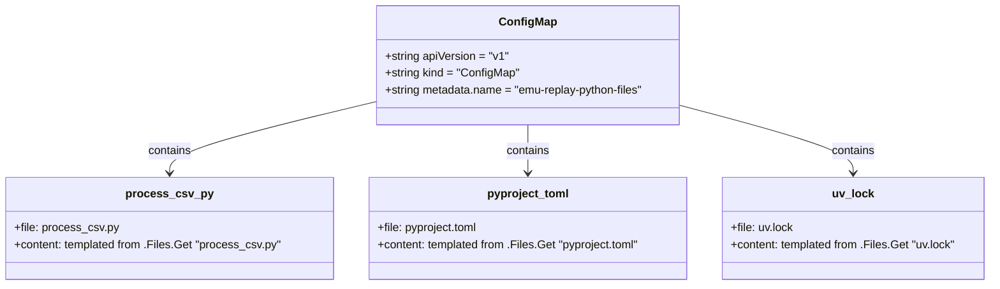

# Diagram: shipment_core/shipment_service/shipment_service/eta/jobs/emu_replay/templates/pythonFiles.yaml

> Auto-generated by Obscura crawlers

## Mermaid

### SVG

<svg id="container" width="1400.3203125" xmlns="http://www.w3.org/2000/svg" class="classDiagram" height="402" viewBox="0 0 1400.3203125 402" role="graphics-document document" aria-roledescription="class"><g><defs><marker id="container_class-aggregationStart" class="marker aggregation class" refX="18" refY="7" markerWidth="190" markerHeight="240" orient="auto"><path d="M 18,7 L9,13 L1,7 L9,1 Z"></path></marker></defs><defs><marker id="container_class-aggregationEnd" class="marker aggregation class" refX="1" refY="7" markerWidth="20" markerHeight="28" orient="auto"><path d="M 18,7 L9,13 L1,7 L9,1 Z"></path></marker></defs><defs><marker id="container_class-extensionStart" class="marker extension class" refX="18" refY="7" markerWidth="190" markerHeight="240" orient="auto"><path d="M 1,7 L18,13 V 1 Z"></path></marker></defs><defs><marker id="container_class-extensionEnd" class="marker extension class" refX="1" refY="7" markerWidth="20" markerHeight="28" orient="auto"><path d="M 1,1 V 13 L18,7 Z"></path></marker></defs><defs><marker id="container_class-compositionStart" class="marker composition class" refX="18" refY="7" markerWidth="190" markerHeight="240" orient="auto"><path d="M 18,7 L9,13 L1,7 L9,1 Z"></path></marker></defs><defs><marker id="container_class-compositionEnd" class="marker composition class" refX="1" refY="7" markerWidth="20" markerHeight="28" orient="auto"><path d="M 18,7 L9,13 L1,7 L9,1 Z"></path></marker></defs><defs><marker id="container_class-dependencyStart" class="marker dependency class" refX="6" refY="7" markerWidth="190" markerHeight="240" orient="auto"><path d="M 5,7 L9,13 L1,7 L9,1 Z"></path></marker></defs><defs><marker id="container_class-dependencyEnd" class="marker dependency class" refX="13" refY="7" markerWidth="20" markerHeight="28" orient="auto"><path d="M 18,7 L9,13 L14,7 L9,1 Z"></path></marker></defs><defs><marker id="container_class-lollipopStart" class="marker lollipop class" refX="13" refY="7" markerWidth="190" markerHeight="240" orient="auto"><circle stroke="black" fill="transparent" cx="7" cy="7" r="6"></circle></marker></defs><defs><marker id="container_class-lollipopEnd" class="marker lollipop class" refX="1" refY="7" markerWidth="190" markerHeight="240" orient="auto"><circle stroke="black" fill="transparent" cx="7" cy="7" r="6"></circle></marker></defs><g class="root"><g class="clusters"></g><g class="edgePaths"><path d="M524.746,144.084L476.714,155.57C428.681,167.056,332.616,190.028,284.583,206.681C236.551,223.333,236.551,233.667,236.551,238.833L236.551,244" id="id_ConfigMap_process_csv_py_1" class="edge-thickness-normal edge-pattern-solid relation" style=";;;" data-edge="true" data-et="edge" data-id="id_ConfigMap_process_csv_py_1" data-points="W3sieCI6NTI0Ljc0NjA5Mzc1LCJ5IjoxNDQuMDg0MjYxNjM5NTMxNTh9LHsieCI6MjM2LjU1MDc4MTI1LCJ5IjoyMTN9LHsieCI6MjM2LjU1MDc4MTI1LCJ5IjoyNTB9XQ==" marker-end="url(#container_class-dependencyEnd)"></path><path d="M742.555,176L742.555,182.167C742.555,188.333,742.555,200.667,742.555,212C742.555,223.333,742.555,233.667,742.555,238.833L742.555,244" id="id_ConfigMap_pyproject_toml_2" class="edge-thickness-normal edge-pattern-solid relation" style=";;;" data-edge="true" data-et="edge" data-id="id_ConfigMap_pyproject_toml_2" data-points="W3sieCI6NzQyLjU1NDY4NzUsInkiOjE3Nn0seyJ4Ijo3NDIuNTU0Njg3NSwieSI6MjEzfSx7IngiOjc0Mi41NTQ2ODc1LCJ5IjoyNTB9XQ==" marker-end="url(#container_class-dependencyEnd)"></path><path d="M960.363,148.847L1001.33,159.539C1042.297,170.231,1124.23,191.616,1165.197,207.475C1206.164,223.333,1206.164,233.667,1206.164,238.833L1206.164,244" id="id_ConfigMap_uv_lock_3" class="edge-thickness-normal edge-pattern-solid relation" style=";;;" data-edge="true" data-et="edge" data-id="id_ConfigMap_uv_lock_3" data-points="W3sieCI6OTYwLjM2MzI4MTI1LCJ5IjoxNDguODQ3MDgxMzI1MTk5N30seyJ4IjoxMjA2LjE2NDA2MjUsInkiOjIxM30seyJ4IjoxMjA2LjE2NDA2MjUsInkiOjI1MH1d" marker-end="url(#container_class-dependencyEnd)"></path></g><g class="edgeLabels"><g class="edgeLabel" transform="translate(236.55078125, 213)"><g class="label" data-id="id_ConfigMap_process_csv_py_1" transform="translate(-30.890625, -12)"><foreignObject width="61.78125" height="24">

contains

</foreignObject></g></g><g class="edgeLabel" transform="translate(742.5546875, 213)"><g class="label" data-id="id_ConfigMap_pyproject_toml_2" transform="translate(-30.890625, -12)"><foreignObject width="61.78125" height="24">

contains

</foreignObject></g></g><g class="edgeLabel" transform="translate(1206.1640625, 213)"><g class="label" data-id="id_ConfigMap_uv_lock_3" transform="translate(-30.890625, -12)"><foreignObject width="61.78125" height="24">

contains

</foreignObject></g></g></g><g class="nodes"><g class="node default" id="classId-ConfigMap-0" transform="translate(742.5546875, 92)"><g class="basic label-container"><path d="M-217.80859375 -84 L217.80859375 -84 L217.80859375 84 L-217.80859375 84" stroke="none" stroke-width="0" fill="#ECECFF" style=""></path><path d="M-217.80859375 -84 C-104.92441976443398 -84, 7.9597542211320444 -84, 217.80859375 -84 M-217.80859375 -84 C-109.9670116412339 -84, -2.125429532467791 -84, 217.80859375 -84 M217.80859375 -84 C217.80859375 -33.54199265243016, 217.80859375 16.91601469513968, 217.80859375 84 M217.80859375 -84 C217.80859375 -38.3266895526817, 217.80859375 7.346620894636601, 217.80859375 84 M217.80859375 84 C49.583853815994104 84, -118.64088611801179 84, -217.80859375 84 M217.80859375 84 C74.08407621890538 84, -69.64044131218924 84, -217.80859375 84 M-217.80859375 84 C-217.80859375 20.457744665957037, -217.80859375 -43.084510668085926, -217.80859375 -84 M-217.80859375 84 C-217.80859375 35.60555752983439, -217.80859375 -12.788884940331215, -217.80859375 -84" stroke="#9370DB" stroke-width="1.3" fill="none" stroke-dasharray="0 0" style=""></path></g><g class="annotation-group text" transform="translate(0, -60)"></g><g class="label-group text" transform="translate(-38.3828125, -60)"><g class="label" style="font-weight: bolder" transform="translate(0,-12)"><foreignObject width="76.765625" height="24">

ConfigMap

</foreignObject></g></g><g class="members-group text" transform="translate(-205.80859375, -12)"><g class="label" style="" transform="translate(0,-12)"><foreignObject width="174.484375" height="24">

+string apiVersion = "v1"

</foreignObject></g><g class="label" style="" transform="translate(0,12)"><foreignObject width="190.140625" height="24">

+string kind = "ConfigMap"

</foreignObject></g><g class="label" style="" transform="translate(0,36)"><foreignObject width="373.234375" height="24">

+string metadata.name = "emu-replay-python-files"

</foreignObject></g></g><g class="methods-group text" transform="translate(-205.80859375, 84)"></g><g class="divider" style=""><path d="M-217.80859375 -36 C-126.63658771366138 -36, -35.46458167732277 -36, 217.80859375 -36 M-217.80859375 -36 C-83.85339689714982 -36, 50.10179995570036 -36, 217.80859375 -36" stroke="#9370DB" stroke-width="1.3" fill="none" stroke-dasharray="0 0" style=""></path></g><g class="divider" style=""><path d="M-217.80859375 60 C-120.0103285387299 60, -22.212063327459788 60, 217.80859375 60 M-217.80859375 60 C-56.21937307018217 60, 105.36984760963566 60, 217.80859375 60" stroke="#9370DB" stroke-width="1.3" fill="none" stroke-dasharray="0 0" style=""></path></g></g><g class="node default" id="classId-process_csv_py-1" transform="translate(236.55078125, 322)"><g class="basic label-container"><path d="M-228.55078125 -72 L228.55078125 -72 L228.55078125 72 L-228.55078125 72" stroke="none" stroke-width="0" fill="#ECECFF" style=""></path><path d="M-228.55078125 -72 C-60.63572252364855 -72, 107.2793362027029 -72, 228.55078125 -72 M-228.55078125 -72 C-70.8401589943667 -72, 86.8704632612666 -72, 228.55078125 -72 M228.55078125 -72 C228.55078125 -22.375842908584943, 228.55078125 27.248314182830114, 228.55078125 72 M228.55078125 -72 C228.55078125 -19.208782004588407, 228.55078125 33.582435990823186, 228.55078125 72 M228.55078125 72 C118.90098251606359 72, 9.251183782127185 72, -228.55078125 72 M228.55078125 72 C117.30646550076462 72, 6.062149751529233 72, -228.55078125 72 M-228.55078125 72 C-228.55078125 33.73883044418347, -228.55078125 -4.522339111633059, -228.55078125 -72 M-228.55078125 72 C-228.55078125 22.33560538098849, -228.55078125 -27.32878923802302, -228.55078125 -72" stroke="#9370DB" stroke-width="1.3" fill="none" stroke-dasharray="0 0" style=""></path></g><g class="annotation-group text" transform="translate(0, -48)"></g><g class="label-group text" transform="translate(-56.4453125, -48)"><g class="label" style="font-weight: bolder" transform="translate(0,-12)"><foreignObject width="112.890625" height="24">

process_csv_py

</foreignObject></g></g><g class="members-group text" transform="translate(-216.55078125, 0)"><g class="label" style="" transform="translate(0,-12)"><foreignObject width="144.640625" height="24">

+file: process_csv.py

</foreignObject></g><g class="label" style="" transform="translate(0,12)"><foreignObject width="376.65625" height="24">

+content: templated from .Files.Get "process_csv.py"

</foreignObject></g></g><g class="methods-group text" transform="translate(-216.55078125, 72)"></g><g class="divider" style=""><path d="M-228.55078125 -24 C-99.11554503269565 -24, 30.3196911846087 -24, 228.55078125 -24 M-228.55078125 -24 C-73.84549164427031 -24, 80.85979796145938 -24, 228.55078125 -24" stroke="#9370DB" stroke-width="1.3" fill="none" stroke-dasharray="0 0" style=""></path></g><g class="divider" style=""><path d="M-228.55078125 48 C-85.93822920311399 48, 56.67432284377202 48, 228.55078125 48 M-228.55078125 48 C-67.20964329220485 48, 94.13149466559031 48, 228.55078125 48" stroke="#9370DB" stroke-width="1.3" fill="none" stroke-dasharray="0 0" style=""></path></g></g><g class="node default" id="classId-pyproject_toml-2" transform="translate(742.5546875, 322)"><g class="basic label-container"><path d="M-227.453125 -72 L227.453125 -72 L227.453125 72 L-227.453125 72" stroke="none" stroke-width="0" fill="#ECECFF" style=""></path><path d="M-227.453125 -72 C-56.67712283079004 -72, 114.09887933841992 -72, 227.453125 -72 M-227.453125 -72 C-121.5446888476665 -72, -15.636252695333013 -72, 227.453125 -72 M227.453125 -72 C227.453125 -31.992049188159, 227.453125 8.015901623681998, 227.453125 72 M227.453125 -72 C227.453125 -16.45252379442948, 227.453125 39.09495241114104, 227.453125 72 M227.453125 72 C127.474289038735 72, 27.49545307746999 72, -227.453125 72 M227.453125 72 C60.69344102609938 72, -106.06624294780124 72, -227.453125 72 M-227.453125 72 C-227.453125 20.1146235602765, -227.453125 -31.770752879447002, -227.453125 -72 M-227.453125 72 C-227.453125 24.802576082648756, -227.453125 -22.39484783470249, -227.453125 -72" stroke="#9370DB" stroke-width="1.3" fill="none" stroke-dasharray="0 0" style=""></path></g><g class="annotation-group text" transform="translate(0, -48)"></g><g class="label-group text" transform="translate(-55.609375, -48)"><g class="label" style="font-weight: bolder" transform="translate(0,-12)"><foreignObject width="111.21875" height="24">

pyproject_toml

</foreignObject></g></g><g class="members-group text" transform="translate(-215.453125, 0)"><g class="label" style="" transform="translate(0,-12)"><foreignObject width="143.546875" height="24">

+file: pyproject.toml

</foreignObject></g><g class="label" style="" transform="translate(0,12)"><foreignObject width="375.296875" height="24">

+content: templated from .Files.Get "pyproject.toml"

</foreignObject></g></g><g class="methods-group text" transform="translate(-215.453125, 72)"></g><g class="divider" style=""><path d="M-227.453125 -24 C-98.07610696203952 -24, 31.300911075920965 -24, 227.453125 -24 M-227.453125 -24 C-86.22350401239754 -24, 55.00611697520492 -24, 227.453125 -24" stroke="#9370DB" stroke-width="1.3" fill="none" stroke-dasharray="0 0" style=""></path></g><g class="divider" style=""><path d="M-227.453125 48 C-114.33328821160832 48, -1.2134514232166396 48, 227.453125 48 M-227.453125 48 C-114.8444551554508 48, -2.235785310901605 48, 227.453125 48" stroke="#9370DB" stroke-width="1.3" fill="none" stroke-dasharray="0 0" style=""></path></g></g><g class="node default" id="classId-uv_lock-3" transform="translate(1206.1640625, 322)"><g class="basic label-container"><path d="M-186.15625 -72 L186.15625 -72 L186.15625 72 L-186.15625 72" stroke="none" stroke-width="0" fill="#ECECFF" style=""></path><path d="M-186.15625 -72 C-107.18827431916264 -72, -28.22029863832529 -72, 186.15625 -72 M-186.15625 -72 C-92.39878797323613 -72, 1.35867405352775 -72, 186.15625 -72 M186.15625 -72 C186.15625 -27.404289438465135, 186.15625 17.19142112306973, 186.15625 72 M186.15625 -72 C186.15625 -37.57052452114112, 186.15625 -3.1410490422822335, 186.15625 72 M186.15625 72 C74.14147667246897 72, -37.87329665506206 72, -186.15625 72 M186.15625 72 C88.01187670362025 72, -10.132496592759509 72, -186.15625 72 M-186.15625 72 C-186.15625 27.759559360132656, -186.15625 -16.48088127973469, -186.15625 -72 M-186.15625 72 C-186.15625 27.253981904719325, -186.15625 -17.49203619056135, -186.15625 -72" stroke="#9370DB" stroke-width="1.3" fill="none" stroke-dasharray="0 0" style=""></path></g><g class="annotation-group text" transform="translate(0, -48)"></g><g class="label-group text" transform="translate(-27.78125, -48)"><g class="label" style="font-weight: bolder" transform="translate(0,-12)"><foreignObject width="55.5625" height="24">

uv_lock

</foreignObject></g></g><g class="members-group text" transform="translate(-174.15625, 0)"><g class="label" style="" transform="translate(0,-12)"><foreignObject width="88.53125" height="24">

+file: uv.lock

</foreignObject></g><g class="label" style="" transform="translate(0,12)"><foreignObject width="320.53125" height="24">

+content: templated from .Files.Get "uv.lock"

</foreignObject></g></g><g class="methods-group text" transform="translate(-174.15625, 72)"></g><g class="divider" style=""><path d="M-186.15625 -24 C-55.02536883182512 -24, 76.10551233634976 -24, 186.15625 -24 M-186.15625 -24 C-80.2520167333512 -24, 25.652216533297604 -24, 186.15625 -24" stroke="#9370DB" stroke-width="1.3" fill="none" stroke-dasharray="0 0" style=""></path></g><g class="divider" style=""><path d="M-186.15625 48 C-41.15959525019187 48, 103.83705949961626 48, 186.15625 48 M-186.15625 48 C-80.11845304959364 48, 25.91934390081272 48, 186.15625 48" stroke="#9370DB" stroke-width="1.3" fill="none" stroke-dasharray="0 0" style=""></path></g></g></g></g></g></svg>
