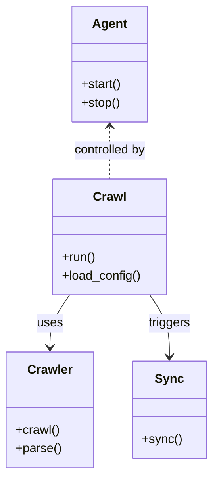

# Diagram: shipment_core/shipment_service/shipment_service/eta/jobs/emu_replay/values.yaml

> Auto-generated by Obscura crawlers

## Mermaid

### SVG

<svg id="container" width="267.8125" xmlns="http://www.w3.org/2000/svg" class="classDiagram" height="614" viewBox="0 0 267.8125 614" role="graphics-document document" aria-roledescription="class"><g><defs><marker id="container_class-aggregationStart" class="marker aggregation class" refX="18" refY="7" markerWidth="190" markerHeight="240" orient="auto"><path d="M 18,7 L9,13 L1,7 L9,1 Z"></path></marker></defs><defs><marker id="container_class-aggregationEnd" class="marker aggregation class" refX="1" refY="7" markerWidth="20" markerHeight="28" orient="auto"><path d="M 18,7 L9,13 L1,7 L9,1 Z"></path></marker></defs><defs><marker id="container_class-extensionStart" class="marker extension class" refX="18" refY="7" markerWidth="190" markerHeight="240" orient="auto"><path d="M 1,7 L18,13 V 1 Z"></path></marker></defs><defs><marker id="container_class-extensionEnd" class="marker extension class" refX="1" refY="7" markerWidth="20" markerHeight="28" orient="auto"><path d="M 1,1 V 13 L18,7 Z"></path></marker></defs><defs><marker id="container_class-compositionStart" class="marker composition class" refX="18" refY="7" markerWidth="190" markerHeight="240" orient="auto"><path d="M 18,7 L9,13 L1,7 L9,1 Z"></path></marker></defs><defs><marker id="container_class-compositionEnd" class="marker composition class" refX="1" refY="7" markerWidth="20" markerHeight="28" orient="auto"><path d="M 18,7 L9,13 L1,7 L9,1 Z"></path></marker></defs><defs><marker id="container_class-dependencyStart" class="marker dependency class" refX="6" refY="7" markerWidth="190" markerHeight="240" orient="auto"><path d="M 5,7 L9,13 L1,7 L9,1 Z"></path></marker></defs><defs><marker id="container_class-dependencyEnd" class="marker dependency class" refX="13" refY="7" markerWidth="20" markerHeight="28" orient="auto"><path d="M 18,7 L9,13 L14,7 L9,1 Z"></path></marker></defs><defs><marker id="container_class-lollipopStart" class="marker lollipop class" refX="13" refY="7" markerWidth="190" markerHeight="240" orient="auto"><circle stroke="black" fill="transparent" cx="7" cy="7" r="6"></circle></marker></defs><defs><marker id="container_class-lollipopEnd" class="marker lollipop class" refX="1" refY="7" markerWidth="190" markerHeight="240" orient="auto"><circle stroke="black" fill="transparent" cx="7" cy="7" r="6"></circle></marker></defs><g class="root"><g class="clusters"></g><g class="edgePaths"><path d="M88.059,382L83.905,388.167C79.75,394.333,71.442,406.667,67.287,418C63.133,429.333,63.133,439.667,63.133,444.833L63.133,450" id="id_Crawl_Crawler_1" class="edge-thickness-normal edge-pattern-solid relation" style=";;;" data-edge="true" data-et="edge" data-id="id_Crawl_Crawler_1" data-points="W3sieCI6ODguMDU5MjkxMjk0NjQyODYsInkiOjM4Mn0seyJ4Ijo2My4xMzI4MTI1LCJ5Ijo0MTl9LHsieCI6NjMuMTMyODEyNSwieSI6NDU2fV0=" marker-end="url(#container_class-dependencyEnd)"></path><path d="M189.113,382L193.267,388.167C197.421,394.333,205.73,406.667,209.885,420C214.039,433.333,214.039,447.667,214.039,454.833L214.039,462" id="id_Crawl_Sync_2" class="edge-thickness-normal edge-pattern-solid relation" style=";;;" data-edge="true" data-et="edge" data-id="id_Crawl_Sync_2" data-points="W3sieCI6MTg5LjExMjU4MzcwNTM1NzE0LCJ5IjozODJ9LHsieCI6MjE0LjAzOTA2MjUsInkiOjQxOX0seyJ4IjoyMTQuMDM5MDYyNSwieSI6NDY4fV0=" marker-end="url(#container_class-dependencyEnd)"></path><path d="M138.586,164L138.586,169.167C138.586,174.333,138.586,184.667,138.586,196C138.586,207.333,138.586,219.667,138.586,225.833L138.586,232" id="id_Agent_Crawl_3" class="edge-thickness-normal edge-pattern-dashed relation" style=";;;" data-edge="true" data-et="edge" data-id="id_Agent_Crawl_3" data-points="W3sieCI6MTM4LjU4NTkzNzUsInkiOjE1OH0seyJ4IjoxMzguNTg1OTM3NSwieSI6MTk1fSx7IngiOjEzOC41ODU5Mzc1LCJ5IjoyMzJ9XQ==" marker-start="url(#container_class-dependencyStart)"></path></g><g class="edgeLabels"><g class="edgeLabel" transform="translate(63.1328125, 419)"><g class="label" data-id="id_Crawl_Crawler_1" transform="translate(-16.4921875, -12)"><foreignObject width="32.984375" height="24">

uses

</foreignObject></g></g><g class="edgeLabel" transform="translate(214.0390625, 419)"><g class="label" data-id="id_Crawl_Sync_2" transform="translate(-27.4921875, -12)"><foreignObject width="54.984375" height="24">

triggers

</foreignObject></g></g><g class="edgeLabel" transform="translate(138.5859375, 195)"><g class="label" data-id="id_Agent_Crawl_3" transform="translate(-48.0078125, -12)"><foreignObject width="96.015625" height="24">

controlled by

</foreignObject></g></g></g><g class="nodes"><g class="node default" id="classId-Crawl-0" transform="translate(138.5859375, 307)"><g class="basic label-container"><path d="M-73.06640625 -75 L73.06640625 -75 L73.06640625 75 L-73.06640625 75" stroke="none" stroke-width="0" fill="#ECECFF" style=""></path><path d="M-73.06640625 -75 C-41.815552467513996 -75, -10.564698685027999 -75, 73.06640625 -75 M-73.06640625 -75 C-31.582214247108794 -75, 9.901977755782411 -75, 73.06640625 -75 M73.06640625 -75 C73.06640625 -16.692859026636157, 73.06640625 41.61428194672769, 73.06640625 75 M73.06640625 -75 C73.06640625 -38.46972305961522, 73.06640625 -1.939446119230439, 73.06640625 75 M73.06640625 75 C34.927789415465284 75, -3.2108274190694317 75, -73.06640625 75 M73.06640625 75 C25.459974212851698 75, -22.146457824296604 75, -73.06640625 75 M-73.06640625 75 C-73.06640625 27.30724466288096, -73.06640625 -20.385510674238077, -73.06640625 -75 M-73.06640625 75 C-73.06640625 20.037359336423016, -73.06640625 -34.92528132715397, -73.06640625 -75" stroke="#9370DB" stroke-width="1.3" fill="none" stroke-dasharray="0 0" style=""></path></g><g class="annotation-group text" transform="translate(0, -51)"></g><g class="label-group text" transform="translate(-20.1484375, -51)"><g class="label" style="font-weight: bolder" transform="translate(0,-12)"><foreignObject width="40.296875" height="24">

Crawl

</foreignObject></g></g><g class="members-group text" transform="translate(-61.06640625, -3)"></g><g class="methods-group text" transform="translate(-61.06640625, 27)"><g class="label" style="" transform="translate(0,-12)"><foreignObject width="43.21875" height="24">

+run()

</foreignObject></g><g class="label" style="" transform="translate(0,12)"><foreignObject width="101.984375" height="24">

+load_config()

</foreignObject></g></g><g class="divider" style=""><path d="M-73.06640625 -27 C-24.178394939516366 -27, 24.709616370967268 -27, 73.06640625 -27 M-73.06640625 -27 C-25.616233323472237 -27, 21.833939603055526 -27, 73.06640625 -27" stroke="#9370DB" stroke-width="1.3" fill="none" stroke-dasharray="0 0" style=""></path></g><g class="divider" style=""><path d="M-73.06640625 -3 C-19.836456821088916 -3, 33.39349260782217 -3, 73.06640625 -3 M-73.06640625 -3 C-26.388886794602655 -3, 20.28863266079469 -3, 73.06640625 -3" stroke="#9370DB" stroke-width="1.3" fill="none" stroke-dasharray="0 0" style=""></path></g></g><g class="node default" id="classId-Crawler-1" transform="translate(63.1328125, 531)"><g class="basic label-container"><path d="M-55.1328125 -75 L55.1328125 -75 L55.1328125 75 L-55.1328125 75" stroke="none" stroke-width="0" fill="#ECECFF" style=""></path><path d="M-55.1328125 -75 C-32.984636452049294 -75, -10.836460404098588 -75, 55.1328125 -75 M-55.1328125 -75 C-11.503997960757609 -75, 32.12481657848478 -75, 55.1328125 -75 M55.1328125 -75 C55.1328125 -34.87333570084126, 55.1328125 5.253328598317481, 55.1328125 75 M55.1328125 -75 C55.1328125 -28.14005520577888, 55.1328125 18.719889588442243, 55.1328125 75 M55.1328125 75 C13.47567295830985 75, -28.1814665833803 75, -55.1328125 75 M55.1328125 75 C25.031228523156283 75, -5.070355453687434 75, -55.1328125 75 M-55.1328125 75 C-55.1328125 44.33879287091947, -55.1328125 13.67758574183894, -55.1328125 -75 M-55.1328125 75 C-55.1328125 27.067367260810727, -55.1328125 -20.865265478378547, -55.1328125 -75" stroke="#9370DB" stroke-width="1.3" fill="none" stroke-dasharray="0 0" style=""></path></g><g class="annotation-group text" transform="translate(0, -51)"></g><g class="label-group text" transform="translate(-27.734375, -51)"><g class="label" style="font-weight: bolder" transform="translate(0,-12)"><foreignObject width="55.46875" height="24">

Crawler

</foreignObject></g></g><g class="members-group text" transform="translate(-43.1328125, -3)"></g><g class="methods-group text" transform="translate(-43.1328125, 27)"><g class="label" style="" transform="translate(0,-12)"><foreignObject width="56.40625" height="24">

+crawl()

</foreignObject></g><g class="label" style="" transform="translate(0,12)"><foreignObject width="58.53125" height="24">

+parse()

</foreignObject></g></g><g class="divider" style=""><path d="M-55.1328125 -27 C-23.45083330345201 -27, 8.231145893095977 -27, 55.1328125 -27 M-55.1328125 -27 C-27.767055023244936 -27, -0.4012975464898716 -27, 55.1328125 -27" stroke="#9370DB" stroke-width="1.3" fill="none" stroke-dasharray="0 0" style=""></path></g><g class="divider" style=""><path d="M-55.1328125 -3 C-29.002326896524778 -3, -2.871841293049556 -3, 55.1328125 -3 M-55.1328125 -3 C-27.658091372997184 -3, -0.18337024599436802 -3, 55.1328125 -3" stroke="#9370DB" stroke-width="1.3" fill="none" stroke-dasharray="0 0" style=""></path></g></g><g class="node default" id="classId-Sync-2" transform="translate(214.0390625, 531)"><g class="basic label-container"><path d="M-45.7734375 -63 L45.7734375 -63 L45.7734375 63 L-45.7734375 63" stroke="none" stroke-width="0" fill="#ECECFF" style=""></path><path d="M-45.7734375 -63 C-25.13325641013894 -63, -4.493075320277882 -63, 45.7734375 -63 M-45.7734375 -63 C-26.735421283207277 -63, -7.697405066414554 -63, 45.7734375 -63 M45.7734375 -63 C45.7734375 -23.69193501240825, 45.7734375 15.616129975183497, 45.7734375 63 M45.7734375 -63 C45.7734375 -27.64873201286101, 45.7734375 7.702535974277978, 45.7734375 63 M45.7734375 63 C21.331555579001034 63, -3.110326341997933 63, -45.7734375 63 M45.7734375 63 C15.595475026110542 63, -14.582487447778917 63, -45.7734375 63 M-45.7734375 63 C-45.7734375 16.945930368156503, -45.7734375 -29.108139263686994, -45.7734375 -63 M-45.7734375 63 C-45.7734375 16.178862673817655, -45.7734375 -30.64227465236469, -45.7734375 -63" stroke="#9370DB" stroke-width="1.3" fill="none" stroke-dasharray="0 0" style=""></path></g><g class="annotation-group text" transform="translate(0, -39)"></g><g class="label-group text" transform="translate(-17.09375, -39)"><g class="label" style="font-weight: bolder" transform="translate(0,-12)"><foreignObject width="34.1875" height="24">

Sync

</foreignObject></g></g><g class="members-group text" transform="translate(-33.7734375, 9)"></g><g class="methods-group text" transform="translate(-33.7734375, 39)"><g class="label" style="" transform="translate(0,-12)"><foreignObject width="50.453125" height="24">

+sync()

</foreignObject></g></g><g class="divider" style=""><path d="M-45.7734375 -15 C-19.599527438544463 -15, 6.574382622911074 -15, 45.7734375 -15 M-45.7734375 -15 C-10.4893151789298 -15, 24.7948071421404 -15, 45.7734375 -15" stroke="#9370DB" stroke-width="1.3" fill="none" stroke-dasharray="0 0" style=""></path></g><g class="divider" style=""><path d="M-45.7734375 9 C-10.434800767589323 9, 24.903835964821354 9, 45.7734375 9 M-45.7734375 9 C-12.2670823027752 9, 21.2392728944496 9, 45.7734375 9" stroke="#9370DB" stroke-width="1.3" fill="none" stroke-dasharray="0 0" style=""></path></g></g><g class="node default" id="classId-Agent-3" transform="translate(138.5859375, 83)"><g class="basic label-container"><path d="M-48.6171875 -75 L48.6171875 -75 L48.6171875 75 L-48.6171875 75" stroke="none" stroke-width="0" fill="#ECECFF" style=""></path><path d="M-48.6171875 -75 C-13.120000459715364 -75, 22.377186580569273 -75, 48.6171875 -75 M-48.6171875 -75 C-24.465726274482407 -75, -0.31426504896481333 -75, 48.6171875 -75 M48.6171875 -75 C48.6171875 -16.522031404029, 48.6171875 41.955937191942, 48.6171875 75 M48.6171875 -75 C48.6171875 -28.877666637078995, 48.6171875 17.24466672584201, 48.6171875 75 M48.6171875 75 C14.281355035380322 75, -20.054477429239356 75, -48.6171875 75 M48.6171875 75 C10.53617574529288 75, -27.54483600941424 75, -48.6171875 75 M-48.6171875 75 C-48.6171875 17.86497031632768, -48.6171875 -39.27005936734464, -48.6171875 -75 M-48.6171875 75 C-48.6171875 41.89817322651962, -48.6171875 8.796346453039234, -48.6171875 -75" stroke="#9370DB" stroke-width="1.3" fill="none" stroke-dasharray="0 0" style=""></path></g><g class="annotation-group text" transform="translate(0, -51)"></g><g class="label-group text" transform="translate(-21.078125, -51)"><g class="label" style="font-weight: bolder" transform="translate(0,-12)"><foreignObject width="42.15625" height="24">

Agent

</foreignObject></g></g><g class="members-group text" transform="translate(-36.6171875, -3)"></g><g class="methods-group text" transform="translate(-36.6171875, 27)"><g class="label" style="" transform="translate(0,-12)"><foreignObject width="52.15625" height="24">

+start()

</foreignObject></g><g class="label" style="" transform="translate(0,12)"><foreignObject width="50.21875" height="24">

+stop()

</foreignObject></g></g><g class="divider" style=""><path d="M-48.6171875 -27 C-14.290999093067512 -27, 20.035189313864976 -27, 48.6171875 -27 M-48.6171875 -27 C-21.59315761180248 -27, 5.430872276395043 -27, 48.6171875 -27" stroke="#9370DB" stroke-width="1.3" fill="none" stroke-dasharray="0 0" style=""></path></g><g class="divider" style=""><path d="M-48.6171875 -3 C-27.60536654579508 -3, -6.593545591590157 -3, 48.6171875 -3 M-48.6171875 -3 C-26.733785022301888 -3, -4.850382544603775 -3, 48.6171875 -3" stroke="#9370DB" stroke-width="1.3" fill="none" stroke-dasharray="0 0" style=""></path></g></g></g></g></g></svg>
