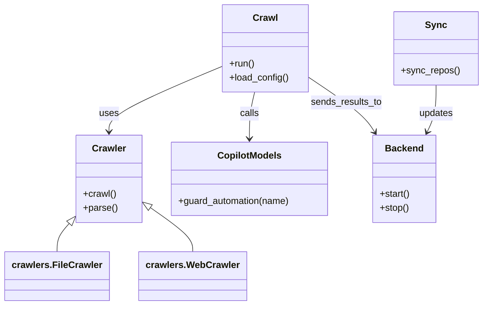

# Diagram: shipment_core/shipment_service/shipment_service/eta/jobs/profiles/values.prod-b.yaml


> Auto-generated by Obscura crawlers

## Diagram 1



### SVG

<svg id="container" width="816.515625" xmlns="http://www.w3.org/2000/svg" class="classDiagram" height="524" viewBox="0 0 816.515625 524" role="graphics-document document" aria-roledescription="class"><style>#container{font-family:"trebuchet ms",verdana,arial,sans-serif;font-size:16px;fill:#333;}@keyframes edge-animation-frame{from{stroke-dashoffset:0;}}@keyframes dash{to{stroke-dashoffset:0;}}#container .edge-animation-slow{stroke-dasharray:9,5!important;stroke-dashoffset:900;animation:dash 50s linear infinite;stroke-linecap:round;}#container .edge-animation-fast{stroke-dasharray:9,5!important;stroke-dashoffset:900;animation:dash 20s linear infinite;stroke-linecap:round;}#container .error-icon{fill:#552222;}#container .error-text{fill:#552222;stroke:#552222;}#container .edge-thickness-normal{stroke-width:1px;}#container .edge-thickness-thick{stroke-width:3.5px;}#container .edge-pattern-solid{stroke-dasharray:0;}#container .edge-thickness-invisible{stroke-width:0;fill:none;}#container .edge-pattern-dashed{stroke-dasharray:3;}#container .edge-pattern-dotted{stroke-dasharray:2;}#container .marker{fill:#333333;stroke:#333333;}#container .marker.cross{stroke:#333333;}#container svg{font-family:"trebuchet ms",verdana,arial,sans-serif;font-size:16px;}#container p{margin:0;}#container g.classGroup text{fill:#9370DB;stroke:none;font-family:"trebuchet ms",verdana,arial,sans-serif;font-size:10px;}#container g.classGroup text .title{font-weight:bolder;}#container .nodeLabel,#container .edgeLabel{color:#131300;}#container .edgeLabel .label rect{fill:#ECECFF;}#container .label text{fill:#131300;}#container .labelBkg{background:#ECECFF;}#container .edgeLabel .label span{background:#ECECFF;}#container .classTitle{font-weight:bolder;}#container .node rect,#container .node circle,#container .node ellipse,#container .node polygon,#container .node path{fill:#ECECFF;stroke:#9370DB;stroke-width:1px;}#container .divider{stroke:#9370DB;stroke-width:1;}#container g.clickable{cursor:pointer;}#container g.classGroup rect{fill:#ECECFF;stroke:#9370DB;}#container g.classGroup line{stroke:#9370DB;stroke-width:1;}#container .classLabel .box{stroke:none;stroke-width:0;fill:#ECECFF;opacity:0.5;}#container .classLabel .label{fill:#9370DB;font-size:10px;}#container .relation{stroke:#333333;stroke-width:1;fill:none;}#container .dashed-line{stroke-dasharray:3;}#container .dotted-line{stroke-dasharray:1 2;}#container #compositionStart,#container .composition{fill:#333333!important;stroke:#333333!important;stroke-width:1;}#container #compositionEnd,#container .composition{fill:#333333!important;stroke:#333333!important;stroke-width:1;}#container #dependencyStart,#container .dependency{fill:#333333!important;stroke:#333333!important;stroke-width:1;}#container #dependencyStart,#container .dependency{fill:#333333!important;stroke:#333333!important;stroke-width:1;}#container #extensionStart,#container .extension{fill:transparent!important;stroke:#333333!important;stroke-width:1;}#container #extensionEnd,#container .extension{fill:transparent!important;stroke:#333333!important;stroke-width:1;}#container #aggregationStart,#container .aggregation{fill:transparent!important;stroke:#333333!important;stroke-width:1;}#container #aggregationEnd,#container .aggregation{fill:transparent!important;stroke:#333333!important;stroke-width:1;}#container #lollipopStart,#container .lollipop{fill:#ECECFF!important;stroke:#333333!important;stroke-width:1;}#container #lollipopEnd,#container .lollipop{fill:#ECECFF!important;stroke:#333333!important;stroke-width:1;}#container .edgeTerminals{font-size:11px;line-height:initial;}#container .classTitleText{text-anchor:middle;font-size:18px;fill:#333;}#container .label-icon{display:inline-block;height:1em;overflow:visible;vertical-align:-0.125em;}#container .node .label-icon path{fill:currentColor;stroke:revert;stroke-width:revert;}#container :root{--mermaid-font-family:"trebuchet ms",verdana,arial,sans-serif;}</style><g><defs><marker id="container_class-aggregationStart" class="marker aggregation class" refX="18" refY="7" markerWidth="190" markerHeight="240" orient="auto"><path d="M 18,7 L9,13 L1,7 L9,1 Z"></path></marker></defs><defs><marker id="container_class-aggregationEnd" class="marker aggregation class" refX="1" refY="7" markerWidth="20" markerHeight="28" orient="auto"><path d="M 18,7 L9,13 L1,7 L9,1 Z"></path></marker></defs><defs><marker id="container_class-extensionStart" class="marker extension class" refX="18" refY="7" markerWidth="190" markerHeight="240" orient="auto"><path d="M 1,7 L18,13 V 1 Z"></path></marker></defs><defs><marker id="container_class-extensionEnd" class="marker extension class" refX="1" refY="7" markerWidth="20" markerHeight="28" orient="auto"><path d="M 1,1 V 13 L18,7 Z"></path></marker></defs><defs><marker id="container_class-compositionStart" class="marker composition class" refX="18" refY="7" markerWidth="190" markerHeight="240" orient="auto"><path d="M 18,7 L9,13 L1,7 L9,1 Z"></path></marker></defs><defs><marker id="container_class-compositionEnd" class="marker composition class" refX="1" refY="7" markerWidth="20" markerHeight="28" orient="auto"><path d="M 18,7 L9,13 L1,7 L9,1 Z"></path></marker></defs><defs><marker id="container_class-dependencyStart" class="marker dependency class" refX="6" refY="7" markerWidth="190" markerHeight="240" orient="auto"><path d="M 5,7 L9,13 L1,7 L9,1 Z"></path></marker></defs><defs><marker id="container_class-dependencyEnd" class="marker dependency class" refX="13" refY="7" markerWidth="20" markerHeight="28" orient="auto"><path d="M 18,7 L9,13 L14,7 L9,1 Z"></path></marker></defs><defs><marker id="container_class-lollipopStart" class="marker lollipop class" refX="13" refY="7" markerWidth="190" markerHeight="240" orient="auto"><circle stroke="black" fill="transparent" cx="7" cy="7" r="6"></circle></marker></defs><defs><marker id="container_class-lollipopEnd" class="marker lollipop class" refX="1" refY="7" markerWidth="190" markerHeight="240" orient="auto"><circle stroke="black" fill="transparent" cx="7" cy="7" r="6"></circle></marker></defs><g class="root"><g class="clusters"></g><g class="edgePaths"><path d="M371.492,113.756L339.324,127.297C307.156,140.837,242.819,167.919,210.651,186.626C178.482,205.333,178.482,215.667,178.482,220.833L178.482,226" id="id_Crawl_Crawler_1" class="edge-thickness-normal edge-pattern-solid relation" style=";;;" data-edge="true" data-et="edge" data-id="id_Crawl_Crawler_1" data-points="W3sieCI6MzcxLjQ5MjE4NzUsInkiOjExMy43NTU5OTUzMzE0NTkwNn0seyJ4IjoxNzguNDgyNDIxODc1LCJ5IjoxOTV9LHsieCI6MTc4LjQ4MjQyMTg3NSwieSI6MjMyfV0=" marker-end="url(#container_class-dependencyEnd)"></path><path d="M426.945,158L425.497,164.167C424.049,170.333,421.152,182.667,419.704,196C418.256,209.333,418.256,223.667,418.256,230.833L418.256,238" id="id_Crawl_CopilotModels_2" class="edge-thickness-normal edge-pattern-solid relation" style=";;;" data-edge="true" data-et="edge" data-id="id_Crawl_CopilotModels_2" data-points="W3sieCI6NDI2Ljk0NTE1NTU1MjQ1NTMzLCJ5IjoxNTh9LHsieCI6NDE4LjI1NTg1OTM3NSwieSI6MTk1fSx7IngiOjQxOC4yNTU4NTkzNzUsInkiOjI0NH1d" marker-end="url(#container_class-dependencyEnd)"></path><path d="M517.625,131.715L533.445,142.263C549.264,152.81,580.904,173.905,600.066,189.773C619.229,205.64,625.916,216.28,629.259,221.6L632.602,226.92" id="id_Crawl_Backend_3" class="edge-thickness-normal edge-pattern-solid relation" style=";;;" data-edge="true" data-et="edge" data-id="id_Crawl_Backend_3" data-points="W3sieCI6NTE3LjYyNSwieSI6MTMxLjcxNTQ2ODMyODUyNzU4fSx7IngiOjYxMi41NDI5Njg3NSwieSI6MTk1fSx7IngiOjYzNS43OTQ0MzM1OTM3NSwieSI6MjMyfV0=" marker-end="url(#container_class-dependencyEnd)"></path><path d="M738.211,146L738.211,154.167C738.211,162.333,738.211,178.667,735.61,192.103C733.008,205.54,727.806,216.08,725.204,221.35L722.603,226.62" id="id_Sync_Backend_4" class="edge-thickness-normal edge-pattern-solid relation" style=";;;" data-edge="true" data-et="edge" data-id="id_Sync_Backend_4" data-points="W3sieCI6NzM4LjIxMDkzNzUsInkiOjE0Nn0seyJ4Ijo3MzguMjEwOTM3NSwieSI6MTk1fSx7IngiOjcxOS45NDcwOTEyMzg4MzkzLCJ5IjoyMzJ9XQ==" marker-end="url(#container_class-dependencyEnd)"></path><path d="M112.152,384.73L108.985,388.442C105.818,392.153,99.483,399.577,96.316,407.455C93.148,415.333,93.148,423.667,93.148,427.833L93.148,432" id="id_Crawler_crawlers.FileCrawler_5" class="edge-thickness-normal edge-pattern-solid relation" style=";;;" data-edge="true" data-et="edge" data-id="id_Crawler_crawlers.FileCrawler_5" data-points="W3sieCI6MTIzLjM0OTYwOTM3NSwieSI6MzcxLjYwODI3MTcyNjQ0MjV9LHsieCI6OTMuMTQ4NDM3NSwieSI6NDA3fSx7IngiOjkzLjE0ODQzNzUsInkiOjQzMn1d" marker-start="url(#container_class-extensionStart)"></path><path d="M247.581,357.094L259.055,365.411C270.528,373.729,293.475,390.365,304.948,402.849C316.422,415.333,316.422,423.667,316.422,427.833L316.422,432" id="id_Crawler_crawlers.WebCrawler_6" class="edge-thickness-normal edge-pattern-solid relation" style=";;;" data-edge="true" data-et="edge" data-id="id_Crawler_crawlers.WebCrawler_6" data-points="W3sieCI6MjMzLjYxNTIzNDM3NSwieSI6MzQ2Ljk2ODg0OTU1NzUyMjF9LHsieCI6MzE2LjQyMTg3NSwieSI6NDA3fSx7IngiOjMxNi40MjE4NzUsInkiOjQzMn1d" marker-start="url(#container_class-extensionStart)"></path></g><g class="edgeLabels"><g class="edgeLabel" transform="translate(178.482421875, 195)"><g class="label" data-id="id_Crawl_Crawler_1" transform="translate(-16.4921875, -12)"><foreignObject width="32.984375" height="24"><div xmlns="http://www.w3.org/1999/xhtml" class="labelBkg" style="display: table-cell; white-space: nowrap; line-height: 1.5; max-width: 200px; text-align: center;"><span class="edgeLabel"><p>uses</p></span></div></foreignObject></g></g><g class="edgeLabel" transform="translate(418.255859375, 195)"><g class="label" data-id="id_Crawl_CopilotModels_2" transform="translate(-16.4453125, -12)"><foreignObject width="32.890625" height="24"><div xmlns="http://www.w3.org/1999/xhtml" class="labelBkg" style="display: table-cell; white-space: nowrap; line-height: 1.5; max-width: 200px; text-align: center;"><span class="edgeLabel"><p>calls</p></span></div></foreignObject></g></g><g class="edgeLabel" transform="translate(583.26348, 175.47853)"><g class="label" data-id="id_Crawl_Backend_3" transform="translate(-61.15625, -12)"><foreignObject width="122.3125" height="24"><div xmlns="http://www.w3.org/1999/xhtml" class="labelBkg" style="display: table-cell; white-space: nowrap; line-height: 1.5; max-width: 200px; text-align: center;"><span class="edgeLabel"><p>sends_results_to</p></span></div></foreignObject></g></g><g class="edgeLabel" transform="translate(738.2109375, 195)"><g class="label" data-id="id_Sync_Backend_4" transform="translate(-29.4140625, -12)"><foreignObject width="58.828125" height="24"><div xmlns="http://www.w3.org/1999/xhtml" class="labelBkg" style="display: table-cell; white-space: nowrap; line-height: 1.5; max-width: 200px; text-align: center;"><span class="edgeLabel"><p>updates</p></span></div></foreignObject></g></g><g class="edgeLabel"><g class="label" data-id="id_Crawler_crawlers.FileCrawler_5" transform="translate(0, 0)"><foreignObject width="0" height="0"><div xmlns="http://www.w3.org/1999/xhtml" class="labelBkg" style="display: table-cell; white-space: nowrap; line-height: 1.5; max-width: 200px; text-align: center;"><span class="edgeLabel"></span></div></foreignObject></g></g><g class="edgeLabel"><g class="label" data-id="id_Crawler_crawlers.WebCrawler_6" transform="translate(0, 0)"><foreignObject width="0" height="0"><div xmlns="http://www.w3.org/1999/xhtml" class="labelBkg" style="display: table-cell; white-space: nowrap; line-height: 1.5; max-width: 200px; text-align: center;"><span class="edgeLabel"></span></div></foreignObject></g></g></g><g class="nodes"><g class="node default" id="classId-Crawl-0" transform="translate(444.55859375, 83)"><g class="basic label-container"><path d="M-73.06640625 -75 L73.06640625 -75 L73.06640625 75 L-73.06640625 75" stroke="none" stroke-width="0" fill="#ECECFF" style=""></path><path d="M-73.06640625 -75 C-24.274692852842044 -75, 24.517020544315912 -75, 73.06640625 -75 M-73.06640625 -75 C-20.924806679814132 -75, 31.216792890371735 -75, 73.06640625 -75 M73.06640625 -75 C73.06640625 -38.51351242923212, 73.06640625 -2.0270248584642445, 73.06640625 75 M73.06640625 -75 C73.06640625 -36.2156311931469, 73.06640625 2.5687376137062046, 73.06640625 75 M73.06640625 75 C24.646305299678986 75, -23.77379565064203 75, -73.06640625 75 M73.06640625 75 C23.069450969454344 75, -26.92750431109131 75, -73.06640625 75 M-73.06640625 75 C-73.06640625 44.07938276209774, -73.06640625 13.158765524195474, -73.06640625 -75 M-73.06640625 75 C-73.06640625 24.641026011879255, -73.06640625 -25.71794797624149, -73.06640625 -75" stroke="#9370DB" stroke-width="1.3" fill="none" stroke-dasharray="0 0" style=""></path></g><g class="annotation-group text" transform="translate(0, -51)"></g><g class="label-group text" transform="translate(-20.1484375, -51)"><g class="label" style="font-weight: bolder" transform="translate(0,-12)"><foreignObject width="40.296875" height="24"><div xmlns="http://www.w3.org/1999/xhtml" style="display: table-cell; white-space: nowrap; line-height: 1.5; max-width: 89px; text-align: center;"><span class="nodeLabel markdown-node-label" style=""><p>Crawl</p></span></div></foreignObject></g></g><g class="members-group text" transform="translate(-61.06640625, -3)"></g><g class="methods-group text" transform="translate(-61.06640625, 27)"><g class="label" style="" transform="translate(0,-12)"><foreignObject width="43.21875" height="24"><div xmlns="http://www.w3.org/1999/xhtml" style="display: table-cell; white-space: nowrap; line-height: 1.5; max-width: 101px; text-align: center;"><span class="nodeLabel markdown-node-label" style=""><p>+run()</p></span></div></foreignObject></g><g class="label" style="" transform="translate(0,12)"><foreignObject width="101.984375" height="24"><div xmlns="http://www.w3.org/1999/xhtml" style="display: table-cell; white-space: nowrap; line-height: 1.5; max-width: 159px; text-align: center;"><span class="nodeLabel markdown-node-label" style=""><p>+load_config()</p></span></div></foreignObject></g></g><g class="divider" style=""><path d="M-73.06640625 -27 C-20.077186624483844 -27, 32.91203300103231 -27, 73.06640625 -27 M-73.06640625 -27 C-26.455772061278687 -27, 20.154862127442627 -27, 73.06640625 -27" stroke="#9370DB" stroke-width="1.3" fill="none" stroke-dasharray="0 0" style=""></path></g><g class="divider" style=""><path d="M-73.06640625 -3 C-26.691945418609265 -3, 19.68251541278147 -3, 73.06640625 -3 M-73.06640625 -3 C-24.320997719055548 -3, 24.424410811888905 -3, 73.06640625 -3" stroke="#9370DB" stroke-width="1.3" fill="none" stroke-dasharray="0 0" style=""></path></g></g><g class="node default" id="classId-Crawler-1" transform="translate(178.482421875, 307)"><g class="basic label-container"><path d="M-55.1328125 -75 L55.1328125 -75 L55.1328125 75 L-55.1328125 75" stroke="none" stroke-width="0" fill="#ECECFF" style=""></path><path d="M-55.1328125 -75 C-28.551729371586717 -75, -1.9706462431734337 -75, 55.1328125 -75 M-55.1328125 -75 C-23.017948236075185 -75, 9.09691602784963 -75, 55.1328125 -75 M55.1328125 -75 C55.1328125 -18.610155300700697, 55.1328125 37.779689398598606, 55.1328125 75 M55.1328125 -75 C55.1328125 -15.992235302837088, 55.1328125 43.015529394325824, 55.1328125 75 M55.1328125 75 C23.877207395394628 75, -7.378397709210745 75, -55.1328125 75 M55.1328125 75 C27.998338262514622 75, 0.863864025029244 75, -55.1328125 75 M-55.1328125 75 C-55.1328125 31.213724819811937, -55.1328125 -12.572550360376127, -55.1328125 -75 M-55.1328125 75 C-55.1328125 41.80250131023258, -55.1328125 8.605002620465157, -55.1328125 -75" stroke="#9370DB" stroke-width="1.3" fill="none" stroke-dasharray="0 0" style=""></path></g><g class="annotation-group text" transform="translate(0, -51)"></g><g class="label-group text" transform="translate(-27.734375, -51)"><g class="label" style="font-weight: bolder" transform="translate(0,-12)"><foreignObject width="55.46875" height="24"><div xmlns="http://www.w3.org/1999/xhtml" style="display: table-cell; white-space: nowrap; line-height: 1.5; max-width: 105px; text-align: center;"><span class="nodeLabel markdown-node-label" style=""><p>Crawler</p></span></div></foreignObject></g></g><g class="members-group text" transform="translate(-43.1328125, -3)"></g><g class="methods-group text" transform="translate(-43.1328125, 27)"><g class="label" style="" transform="translate(0,-12)"><foreignObject width="56.40625" height="24"><div xmlns="http://www.w3.org/1999/xhtml" style="display: table-cell; white-space: nowrap; line-height: 1.5; max-width: 114px; text-align: center;"><span class="nodeLabel markdown-node-label" style=""><p>+crawl()</p></span></div></foreignObject></g><g class="label" style="" transform="translate(0,12)"><foreignObject width="58.53125" height="24"><div xmlns="http://www.w3.org/1999/xhtml" style="display: table-cell; white-space: nowrap; line-height: 1.5; max-width: 116px; text-align: center;"><span class="nodeLabel markdown-node-label" style=""><p>+parse()</p></span></div></foreignObject></g></g><g class="divider" style=""><path d="M-55.1328125 -27 C-27.356551217796895 -27, 0.4197100644062104 -27, 55.1328125 -27 M-55.1328125 -27 C-21.873145972384414 -27, 11.386520555231172 -27, 55.1328125 -27" stroke="#9370DB" stroke-width="1.3" fill="none" stroke-dasharray="0 0" style=""></path></g><g class="divider" style=""><path d="M-55.1328125 -3 C-21.8285332885079 -3, 11.475745922984203 -3, 55.1328125 -3 M-55.1328125 -3 C-19.20704781371859 -3, 16.718716872562823 -3, 55.1328125 -3" stroke="#9370DB" stroke-width="1.3" fill="none" stroke-dasharray="0 0" style=""></path></g></g><g class="node default" id="classId-CopilotModels-2" transform="translate(418.255859375, 307)"><g class="basic label-container"><path d="M-134.640625 -63 L134.640625 -63 L134.640625 63 L-134.640625 63" stroke="none" stroke-width="0" fill="#ECECFF" style=""></path><path d="M-134.640625 -63 C-52.63245181328355 -63, 29.375721373432896 -63, 134.640625 -63 M-134.640625 -63 C-61.60160619234591 -63, 11.437412615308176 -63, 134.640625 -63 M134.640625 -63 C134.640625 -25.641885802343232, 134.640625 11.716228395313536, 134.640625 63 M134.640625 -63 C134.640625 -19.221731965151015, 134.640625 24.55653606969797, 134.640625 63 M134.640625 63 C80.25125992119479 63, 25.86189484238959 63, -134.640625 63 M134.640625 63 C78.74735464577549 63, 22.85408429155096 63, -134.640625 63 M-134.640625 63 C-134.640625 26.418066793954424, -134.640625 -10.163866412091153, -134.640625 -63 M-134.640625 63 C-134.640625 21.579763899370114, -134.640625 -19.84047220125977, -134.640625 -63" stroke="#9370DB" stroke-width="1.3" fill="none" stroke-dasharray="0 0" style=""></path></g><g class="annotation-group text" transform="translate(0, -39)"></g><g class="label-group text" transform="translate(-52.65625, -39)"><g class="label" style="font-weight: bolder" transform="translate(0,-12)"><foreignObject width="105.3125" height="24"><div xmlns="http://www.w3.org/1999/xhtml" style="display: table-cell; white-space: nowrap; line-height: 1.5; max-width: 154px; text-align: center;"><span class="nodeLabel markdown-node-label" style=""><p>CopilotModels</p></span></div></foreignObject></g></g><g class="members-group text" transform="translate(-122.640625, 9)"></g><g class="methods-group text" transform="translate(-122.640625, 39)"><g class="label" style="" transform="translate(0,-12)"><foreignObject width="192.625" height="24"><div xmlns="http://www.w3.org/1999/xhtml" style="display: table-cell; white-space: nowrap; line-height: 1.5; max-width: 250px; text-align: center;"><span class="nodeLabel markdown-node-label" style=""><p>+guard_automation(name)</p></span></div></foreignObject></g></g><g class="divider" style=""><path d="M-134.640625 -15 C-48.85104186346793 -15, 36.938541273064146 -15, 134.640625 -15 M-134.640625 -15 C-63.83545506977907 -15, 6.969714860441854 -15, 134.640625 -15" stroke="#9370DB" stroke-width="1.3" fill="none" stroke-dasharray="0 0" style=""></path></g><g class="divider" style=""><path d="M-134.640625 9 C-45.762958614135684 9, 43.11470777172863 9, 134.640625 9 M-134.640625 9 C-48.644830861968074 9, 37.35096327606385 9, 134.640625 9" stroke="#9370DB" stroke-width="1.3" fill="none" stroke-dasharray="0 0" style=""></path></g></g><g class="node default" id="classId-Backend-3" transform="translate(682.92578125, 307)"><g class="basic label-container"><path d="M-53.7265625 -75 L53.7265625 -75 L53.7265625 75 L-53.7265625 75" stroke="none" stroke-width="0" fill="#ECECFF" style=""></path><path d="M-53.7265625 -75 C-17.39962899583427 -75, 18.92730450833146 -75, 53.7265625 -75 M-53.7265625 -75 C-20.223685982818736 -75, 13.279190534362527 -75, 53.7265625 -75 M53.7265625 -75 C53.7265625 -41.57760369227197, 53.7265625 -8.155207384543942, 53.7265625 75 M53.7265625 -75 C53.7265625 -24.027241558711268, 53.7265625 26.945516882577465, 53.7265625 75 M53.7265625 75 C32.11497031702058 75, 10.50337813404115 75, -53.7265625 75 M53.7265625 75 C30.135855995493323 75, 6.5451494909866454 75, -53.7265625 75 M-53.7265625 75 C-53.7265625 33.48228056076493, -53.7265625 -8.035438878470146, -53.7265625 -75 M-53.7265625 75 C-53.7265625 34.493914563591666, -53.7265625 -6.012170872816668, -53.7265625 -75" stroke="#9370DB" stroke-width="1.3" fill="none" stroke-dasharray="0 0" style=""></path></g><g class="annotation-group text" transform="translate(0, -51)"></g><g class="label-group text" transform="translate(-31.296875, -51)"><g class="label" style="font-weight: bolder" transform="translate(0,-12)"><foreignObject width="62.59375" height="24"><div xmlns="http://www.w3.org/1999/xhtml" style="display: table-cell; white-space: nowrap; line-height: 1.5; max-width: 112px; text-align: center;"><span class="nodeLabel markdown-node-label" style=""><p>Backend</p></span></div></foreignObject></g></g><g class="members-group text" transform="translate(-41.7265625, -3)"></g><g class="methods-group text" transform="translate(-41.7265625, 27)"><g class="label" style="" transform="translate(0,-12)"><foreignObject width="52.15625" height="24"><div xmlns="http://www.w3.org/1999/xhtml" style="display: table-cell; white-space: nowrap; line-height: 1.5; max-width: 110px; text-align: center;"><span class="nodeLabel markdown-node-label" style=""><p>+start()</p></span></div></foreignObject></g><g class="label" style="" transform="translate(0,12)"><foreignObject width="50.21875" height="24"><div xmlns="http://www.w3.org/1999/xhtml" style="display: table-cell; white-space: nowrap; line-height: 1.5; max-width: 108px; text-align: center;"><span class="nodeLabel markdown-node-label" style=""><p>+stop()</p></span></div></foreignObject></g></g><g class="divider" style=""><path d="M-53.7265625 -27 C-18.978205873880455 -27, 15.77015075223909 -27, 53.7265625 -27 M-53.7265625 -27 C-16.727340434481953 -27, 20.271881631036095 -27, 53.7265625 -27" stroke="#9370DB" stroke-width="1.3" fill="none" stroke-dasharray="0 0" style=""></path></g><g class="divider" style=""><path d="M-53.7265625 -3 C-30.668308564821718 -3, -7.610054629643436 -3, 53.7265625 -3 M-53.7265625 -3 C-30.438197186969056 -3, -7.149831873938112 -3, 53.7265625 -3" stroke="#9370DB" stroke-width="1.3" fill="none" stroke-dasharray="0 0" style=""></path></g></g><g class="node default" id="classId-Sync-4" transform="translate(738.2109375, 83)"><g class="basic label-container"><path d="M-70.3046875 -63 L70.3046875 -63 L70.3046875 63 L-70.3046875 63" stroke="none" stroke-width="0" fill="#ECECFF" style=""></path><path d="M-70.3046875 -63 C-30.16767784205951 -63, 9.969331815880977 -63, 70.3046875 -63 M-70.3046875 -63 C-20.662879653567607 -63, 28.978928192864785 -63, 70.3046875 -63 M70.3046875 -63 C70.3046875 -35.3195098887866, 70.3046875 -7.639019777573196, 70.3046875 63 M70.3046875 -63 C70.3046875 -25.975457175462346, 70.3046875 11.049085649075309, 70.3046875 63 M70.3046875 63 C35.05579985438445 63, -0.19308779123109332 63, -70.3046875 63 M70.3046875 63 C38.50873540368271 63, 6.712783307365413 63, -70.3046875 63 M-70.3046875 63 C-70.3046875 34.64207609998046, -70.3046875 6.284152199960914, -70.3046875 -63 M-70.3046875 63 C-70.3046875 26.20451462108702, -70.3046875 -10.590970757825957, -70.3046875 -63" stroke="#9370DB" stroke-width="1.3" fill="none" stroke-dasharray="0 0" style=""></path></g><g class="annotation-group text" transform="translate(0, -39)"></g><g class="label-group text" transform="translate(-17.09375, -39)"><g class="label" style="font-weight: bolder" transform="translate(0,-12)"><foreignObject width="34.1875" height="24"><div xmlns="http://www.w3.org/1999/xhtml" style="display: table-cell; white-space: nowrap; line-height: 1.5; max-width: 84px; text-align: center;"><span class="nodeLabel markdown-node-label" style=""><p>Sync</p></span></div></foreignObject></g></g><g class="members-group text" transform="translate(-58.3046875, 9)"></g><g class="methods-group text" transform="translate(-58.3046875, 39)"><g class="label" style="" transform="translate(0,-12)"><foreignObject width="99.515625" height="24"><div xmlns="http://www.w3.org/1999/xhtml" style="display: table-cell; white-space: nowrap; line-height: 1.5; max-width: 157px; text-align: center;"><span class="nodeLabel markdown-node-label" style=""><p>+sync_repos()</p></span></div></foreignObject></g></g><g class="divider" style=""><path d="M-70.3046875 -15 C-34.70101059710206 -15, 0.9026663057958757 -15, 70.3046875 -15 M-70.3046875 -15 C-26.450485018291552 -15, 17.403717463416896 -15, 70.3046875 -15" stroke="#9370DB" stroke-width="1.3" fill="none" stroke-dasharray="0 0" style=""></path></g><g class="divider" style=""><path d="M-70.3046875 9 C-16.750390714671454 9, 36.80390607065709 9, 70.3046875 9 M-70.3046875 9 C-38.21354814808229 9, -6.122408796164578 9, 70.3046875 9" stroke="#9370DB" stroke-width="1.3" fill="none" stroke-dasharray="0 0" style=""></path></g></g><g class="node default" id="classId-crawlers.FileCrawler-5" transform="translate(93.1484375, 474)"><g class="basic label-container"><path d="M-85.1484375 -42 L85.1484375 -42 L85.1484375 42 L-85.1484375 42" stroke="none" stroke-width="0" fill="#ECECFF" style=""></path><path d="M-85.1484375 -42 C-45.69016316322178 -42, -6.231888826443566 -42, 85.1484375 -42 M-85.1484375 -42 C-43.83457204570893 -42, -2.520706591417863 -42, 85.1484375 -42 M85.1484375 -42 C85.1484375 -12.173852018330589, 85.1484375 17.652295963338823, 85.1484375 42 M85.1484375 -42 C85.1484375 -18.100115597398972, 85.1484375 5.799768805202056, 85.1484375 42 M85.1484375 42 C43.647509128985284 42, 2.1465807579705682 42, -85.1484375 42 M85.1484375 42 C22.888357585511905 42, -39.37172232897619 42, -85.1484375 42 M-85.1484375 42 C-85.1484375 18.012584137115386, -85.1484375 -5.974831725769228, -85.1484375 -42 M-85.1484375 42 C-85.1484375 16.999326350012268, -85.1484375 -8.001347299975464, -85.1484375 -42" stroke="#9370DB" stroke-width="1.3" fill="none" stroke-dasharray="0 0" style=""></path></g><g class="annotation-group text" transform="translate(0, -18)"></g><g class="label-group text" transform="translate(-73.1484375, -18)"><g class="label" style="font-weight: bolder" transform="translate(0,-12)"><foreignObject width="146.296875" height="24"><div xmlns="http://www.w3.org/1999/xhtml" style="display: table-cell; white-space: nowrap; line-height: 1.5; max-width: 194px; text-align: center;"><span class="nodeLabel markdown-node-label" style=""><p>crawlers.FileCrawler</p></span></div></foreignObject></g></g><g class="members-group text" transform="translate(-73.1484375, 30)"></g><g class="methods-group text" transform="translate(-73.1484375, 60)"></g><g class="divider" style=""><path d="M-85.1484375 6 C-41.780684143418334 6, 1.587069213163332 6, 85.1484375 6 M-85.1484375 6 C-26.389441553642413 6, 32.36955439271517 6, 85.1484375 6" stroke="#9370DB" stroke-width="1.3" fill="none" stroke-dasharray="0 0" style=""></path></g><g class="divider" style=""><path d="M-85.1484375 24 C-19.405815247543643 24, 46.336807004912714 24, 85.1484375 24 M-85.1484375 24 C-36.734467181593004 24, 11.679503136813992 24, 85.1484375 24" stroke="#9370DB" stroke-width="1.3" fill="none" stroke-dasharray="0 0" style=""></path></g></g><g class="node default" id="classId-crawlers.WebCrawler-6" transform="translate(316.421875, 474)"><g class="basic label-container"><path d="M-88.125 -42 L88.125 -42 L88.125 42 L-88.125 42" stroke="none" stroke-width="0" fill="#ECECFF" style=""></path><path d="M-88.125 -42 C-18.63958636620093 -42, 50.84582726759814 -42, 88.125 -42 M-88.125 -42 C-43.39765665714935 -42, 1.3296866857013043 -42, 88.125 -42 M88.125 -42 C88.125 -12.352835502902739, 88.125 17.294328994194522, 88.125 42 M88.125 -42 C88.125 -23.18371019415077, 88.125 -4.3674203883015394, 88.125 42 M88.125 42 C22.01411844877036 42, -44.09676310245928 42, -88.125 42 M88.125 42 C42.74992251967271 42, -2.6251549606545836 42, -88.125 42 M-88.125 42 C-88.125 11.071762896523197, -88.125 -19.856474206953607, -88.125 -42 M-88.125 42 C-88.125 18.619967368030593, -88.125 -4.760065263938813, -88.125 -42" stroke="#9370DB" stroke-width="1.3" fill="none" stroke-dasharray="0 0" style=""></path></g><g class="annotation-group text" transform="translate(0, -18)"></g><g class="label-group text" transform="translate(-76.125, -18)"><g class="label" style="font-weight: bolder" transform="translate(0,-12)"><foreignObject width="152.25" height="24"><div xmlns="http://www.w3.org/1999/xhtml" style="display: table-cell; white-space: nowrap; line-height: 1.5; max-width: 199px; text-align: center;"><span class="nodeLabel markdown-node-label" style=""><p>crawlers.WebCrawler</p></span></div></foreignObject></g></g><g class="members-group text" transform="translate(-76.125, 30)"></g><g class="methods-group text" transform="translate(-76.125, 60)"></g><g class="divider" style=""><path d="M-88.125 6 C-43.30449434304585 6, 1.5160113139082938 6, 88.125 6 M-88.125 6 C-38.78134284304185 6, 10.562314313916303 6, 88.125 6" stroke="#9370DB" stroke-width="1.3" fill="none" stroke-dasharray="0 0" style=""></path></g><g class="divider" style=""><path d="M-88.125 24 C-51.09453634675464 24, -14.064072693509274 24, 88.125 24 M-88.125 24 C-47.574217748465074 24, -7.023435496930148 24, 88.125 24" stroke="#9370DB" stroke-width="1.3" fill="none" stroke-dasharray="0 0" style=""></path></g></g></g></g></g></svg>

## Diagram 2

```mermaid
flowchart TD
    A[Trigger (cron / CLI)] --> B{Which task?}
    B -->|crawl| C[Crawl.run()]
    C --> D[Instantiate Crawlers]
    D --> E[Fetch source files]
    E --> F[Parse & extract entities]
    F --> G[Call copilot_models.guard_automation]
    G --> H[Generate diagrams (Mermaid)]
    H --> I[Save diagrams to repos/ or docs/]
    I --> J[Backend API / UI]
    B -->|sync| K[Sync.sync_repos()]
    K --> L[Backend update repository state]
    L --> J
```

> SVG rendering failed for this diagram.
