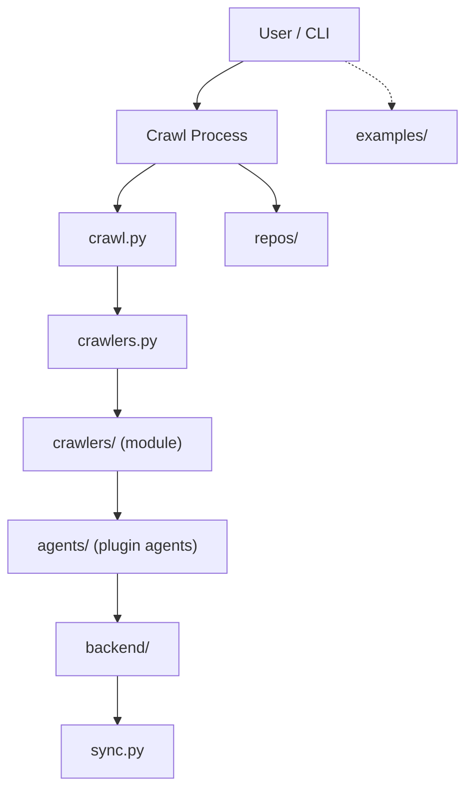
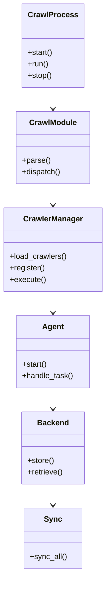

# Diagram: shipment_core/shipment_service/shipment_service/eta/jobs/profiles/values.staging.yaml

> Auto-generated by Obscura crawlers

## Diagram 1

### SVG

<svg id="container" width="478.73046875" xmlns="http://www.w3.org/2000/svg" class="flowchart" height="798" viewBox="0 0 478.73046875 798" role="graphics-document document" aria-roledescription="flowchart-v2"><g><marker id="container_flowchart-v2-pointEnd" class="marker flowchart-v2" viewBox="0 0 10 10" refX="5" refY="5" markerUnits="userSpaceOnUse" markerWidth="8" markerHeight="8" orient="auto"><path d="M 0 0 L 10 5 L 0 10 z" class="arrowMarkerPath" style="stroke-width: 1; stroke-dasharray: 1, 0;"></path></marker><marker id="container_flowchart-v2-pointStart" class="marker flowchart-v2" viewBox="0 0 10 10" refX="4.5" refY="5" markerUnits="userSpaceOnUse" markerWidth="8" markerHeight="8" orient="auto"><path d="M 0 5 L 10 10 L 10 0 z" class="arrowMarkerPath" style="stroke-width: 1; stroke-dasharray: 1, 0;"></path></marker><marker id="container_flowchart-v2-circleEnd" class="marker flowchart-v2" viewBox="0 0 10 10" refX="11" refY="5" markerUnits="userSpaceOnUse" markerWidth="11" markerHeight="11" orient="auto"><circle cx="5" cy="5" r="5" class="arrowMarkerPath" style="stroke-width: 1; stroke-dasharray: 1, 0;"></circle></marker><marker id="container_flowchart-v2-circleStart" class="marker flowchart-v2" viewBox="0 0 10 10" refX="-1" refY="5" markerUnits="userSpaceOnUse" markerWidth="11" markerHeight="11" orient="auto"><circle cx="5" cy="5" r="5" class="arrowMarkerPath" style="stroke-width: 1; stroke-dasharray: 1, 0;"></circle></marker><marker id="container_flowchart-v2-crossEnd" class="marker cross flowchart-v2" viewBox="0 0 11 11" refX="12" refY="5.2" markerUnits="userSpaceOnUse" markerWidth="11" markerHeight="11" orient="auto"><path d="M 1,1 l 9,9 M 10,1 l -9,9" class="arrowMarkerPath" style="stroke-width: 2; stroke-dasharray: 1, 0;"></path></marker><marker id="container_flowchart-v2-crossStart" class="marker cross flowchart-v2" viewBox="0 0 11 11" refX="-1" refY="5.2" markerUnits="userSpaceOnUse" markerWidth="11" markerHeight="11" orient="auto"><path d="M 1,1 l 9,9 M 10,1 l -9,9" class="arrowMarkerPath" style="stroke-width: 2; stroke-dasharray: 1, 0;"></path></marker><g class="root"><g class="clusters"></g><g class="edgePaths"><path d="M252,62L244.08,66.167C236.16,70.333,220.32,78.667,212.4,86.333C204.48,94,204.48,101,204.48,104.5L204.48,108" id="L_CLI_CrawlProcess_0" class="edge-thickness-normal edge-pattern-solid edge-thickness-normal edge-pattern-solid flowchart-link" style=";" data-edge="true" data-et="edge" data-id="L_CLI_CrawlProcess_0" data-points="W3sieCI6MjUxLjk5OTYyNDM5OTAzODQ1LCJ5Ijo2Mn0seyJ4IjoyMDQuNDgwNDY4NzUsInkiOjg3fSx7IngiOjIwNC40ODA0Njg3NSwieSI6MTEyfV0=" marker-end="url(#container_flowchart-v2-pointEnd)"></path><path d="M161.861,166L155.284,170.167C148.707,174.333,135.553,182.667,128.976,190.333C122.398,198,122.398,205,122.398,208.5L122.398,212" id="L_CrawlProcess_crawl_py_0" class="edge-thickness-normal edge-pattern-solid edge-thickness-normal edge-pattern-solid flowchart-link" style=";" data-edge="true" data-et="edge" data-id="L_CrawlProcess_crawl_py_0" data-points="W3sieCI6MTYxLjg2MDk1MjUyNDAzODQ1LCJ5IjoxNjZ9LHsieCI6MTIyLjM5ODQzNzUsInkiOjE5MX0seyJ4IjoxMjIuMzk4NDM3NSwieSI6MjE2fV0=" marker-end="url(#container_flowchart-v2-pointEnd)"></path><path d="M122.398,270L122.398,274.167C122.398,278.333,122.398,286.667,122.398,294.333C122.398,302,122.398,309,122.398,312.5L122.398,316" id="L_crawl_py_crawlers_py_0" class="edge-thickness-normal edge-pattern-solid edge-thickness-normal edge-pattern-solid flowchart-link" style=";" data-edge="true" data-et="edge" data-id="L_crawl_py_crawlers_py_0" data-points="W3sieCI6MTIyLjM5ODQzNzUsInkiOjI3MH0seyJ4IjoxMjIuMzk4NDM3NSwieSI6Mjk1fSx7IngiOjEyMi4zOTg0Mzc1LCJ5IjozMjB9XQ==" marker-end="url(#container_flowchart-v2-pointEnd)"></path><path d="M122.398,374L122.398,378.167C122.398,382.333,122.398,390.667,122.398,398.333C122.398,406,122.398,413,122.398,416.5L122.398,420" id="L_crawlers_py_CrawlersFolder_0" class="edge-thickness-normal edge-pattern-solid edge-thickness-normal edge-pattern-solid flowchart-link" style=";" data-edge="true" data-et="edge" data-id="L_crawlers_py_CrawlersFolder_0" data-points="W3sieCI6MTIyLjM5ODQzNzUsInkiOjM3NH0seyJ4IjoxMjIuMzk4NDM3NSwieSI6Mzk5fSx7IngiOjEyMi4zOTg0Mzc1LCJ5Ijo0MjR9XQ==" marker-end="url(#container_flowchart-v2-pointEnd)"></path><path d="M122.398,478L122.398,482.167C122.398,486.333,122.398,494.667,122.398,502.333C122.398,510,122.398,517,122.398,520.5L122.398,524" id="L_CrawlersFolder_AgentsFolder_0" class="edge-thickness-normal edge-pattern-solid edge-thickness-normal edge-pattern-solid flowchart-link" style=";" data-edge="true" data-et="edge" data-id="L_CrawlersFolder_AgentsFolder_0" data-points="W3sieCI6MTIyLjM5ODQzNzUsInkiOjQ3OH0seyJ4IjoxMjIuMzk4NDM3NSwieSI6NTAzfSx7IngiOjEyMi4zOTg0Mzc1LCJ5Ijo1Mjh9XQ==" marker-end="url(#container_flowchart-v2-pointEnd)"></path><path d="M122.398,582L122.398,586.167C122.398,590.333,122.398,598.667,122.398,606.333C122.398,614,122.398,621,122.398,624.5L122.398,628" id="L_AgentsFolder_Backend_0" class="edge-thickness-normal edge-pattern-solid edge-thickness-normal edge-pattern-solid flowchart-link" style=";" data-edge="true" data-et="edge" data-id="L_AgentsFolder_Backend_0" data-points="W3sieCI6MTIyLjM5ODQzNzUsInkiOjU4Mn0seyJ4IjoxMjIuMzk4NDM3NSwieSI6NjA3fSx7IngiOjEyMi4zOTg0Mzc1LCJ5Ijo2MzJ9XQ==" marker-end="url(#container_flowchart-v2-pointEnd)"></path><path d="M247.1,166L253.677,170.167C260.254,174.333,273.408,182.667,279.985,190.333C286.563,198,286.563,205,286.563,208.5L286.563,212" id="L_CrawlProcess_Repos_0" class="edge-thickness-normal edge-pattern-solid edge-thickness-normal edge-pattern-solid flowchart-link" style=";" data-edge="true" data-et="edge" data-id="L_CrawlProcess_Repos_0" data-points="W3sieCI6MjQ3LjA5OTk4NDk3NTk2MTU1LCJ5IjoxNjZ9LHsieCI6Mjg2LjU2MjUsInkiOjE5MX0seyJ4IjoyODYuNTYyNSwieSI6MjE2fV0=" marker-end="url(#container_flowchart-v2-pointEnd)"></path><path d="M122.398,686L122.398,690.167C122.398,694.333,122.398,702.667,122.398,710.333C122.398,718,122.398,725,122.398,728.5L122.398,732" id="L_Backend_Sync_0" class="edge-thickness-normal edge-pattern-solid edge-thickness-normal edge-pattern-solid flowchart-link" style=";" data-edge="true" data-et="edge" data-id="L_Backend_Sync_0" data-points="W3sieCI6MTIyLjM5ODQzNzUsInkiOjY4Nn0seyJ4IjoxMjIuMzk4NDM3NSwieSI6NzExfSx7IngiOjEyMi4zOTg0Mzc1LCJ5Ijo3MzZ9XQ==" marker-end="url(#container_flowchart-v2-pointEnd)"></path><path d="M354.641,62L362.561,66.167C370.481,70.333,386.32,78.667,394.24,86.333C402.16,94,402.16,101,402.16,104.5L402.16,108" id="L_CLI_Examples_0" class="edge-thickness-normal edge-pattern-dotted edge-thickness-normal edge-pattern-solid flowchart-link" style=";" data-edge="true" data-et="edge" data-id="L_CLI_Examples_0" data-points="W3sieCI6MzU0LjY0MTAwMDYwMDk2MTU1LCJ5Ijo2Mn0seyJ4Ijo0MDIuMTYwMTU2MjUsInkiOjg3fSx7IngiOjQwMi4xNjAxNTYyNSwieSI6MTEyfV0=" marker-end="url(#container_flowchart-v2-pointEnd)"></path></g><g class="edgeLabels"><g class="edgeLabel"><g class="label" data-id="L_CLI_CrawlProcess_0" transform="translate(0, 0)"><foreignObject width="0" height="0">

</foreignObject></g></g><g class="edgeLabel"><g class="label" data-id="L_CrawlProcess_crawl_py_0" transform="translate(0, 0)"><foreignObject width="0" height="0">

</foreignObject></g></g><g class="edgeLabel"><g class="label" data-id="L_crawl_py_crawlers_py_0" transform="translate(0, 0)"><foreignObject width="0" height="0">

</foreignObject></g></g><g class="edgeLabel"><g class="label" data-id="L_crawlers_py_CrawlersFolder_0" transform="translate(0, 0)"><foreignObject width="0" height="0">

</foreignObject></g></g><g class="edgeLabel"><g class="label" data-id="L_CrawlersFolder_AgentsFolder_0" transform="translate(0, 0)"><foreignObject width="0" height="0">

</foreignObject></g></g><g class="edgeLabel"><g class="label" data-id="L_AgentsFolder_Backend_0" transform="translate(0, 0)"><foreignObject width="0" height="0">

</foreignObject></g></g><g class="edgeLabel"><g class="label" data-id="L_CrawlProcess_Repos_0" transform="translate(0, 0)"><foreignObject width="0" height="0">

</foreignObject></g></g><g class="edgeLabel"><g class="label" data-id="L_Backend_Sync_0" transform="translate(0, 0)"><foreignObject width="0" height="0">

</foreignObject></g></g><g class="edgeLabel"><g class="label" data-id="L_CLI_Examples_0" transform="translate(0, 0)"><foreignObject width="0" height="0">

</foreignObject></g></g></g><g class="nodes"><g class="node default" id="flowchart-CLI-0" transform="translate(303.3203125, 35)"><rect class="basic label-container" style="" x="-65.671875" y="-27" width="131.34375" height="54"></rect><g class="label" style="" transform="translate(-35.671875, -12)"><rect></rect><foreignObject width="71.34375" height="24">

User / CLI

</foreignObject></g></g><g class="node default" id="flowchart-CrawlProcess-1" transform="translate(204.48046875, 139)"><rect class="basic label-container" style="" x="-79.109375" y="-27" width="158.21875" height="54"></rect><g class="label" style="" transform="translate(-49.109375, -12)"><rect></rect><foreignObject width="98.21875" height="24">

Crawl Process

</foreignObject></g></g><g class="node default" id="flowchart-crawl_py-3" transform="translate(122.3984375, 243)"><rect class="basic label-container" style="" x="-59.6328125" y="-27" width="119.265625" height="54"></rect><g class="label" style="" transform="translate(-29.6328125, -12)"><rect></rect><foreignObject width="59.265625" height="24">

crawl.py

</foreignObject></g></g><g class="node default" id="flowchart-crawlers_py-5" transform="translate(122.3984375, 347)"><rect class="basic label-container" style="" x="-70.625" y="-27" width="141.25" height="54"></rect><g class="label" style="" transform="translate(-40.625, -12)"><rect></rect><foreignObject width="81.25" height="24">

crawlers.py

</foreignObject></g></g><g class="node default" id="flowchart-CrawlersFolder-7" transform="translate(122.3984375, 451)"><rect class="basic label-container" style="" x="-99.1484375" y="-27" width="198.296875" height="54"></rect><g class="label" style="" transform="translate(-69.1484375, -12)"><rect></rect><foreignObject width="138.296875" height="24">

crawlers/ (module)

</foreignObject></g></g><g class="node default" id="flowchart-AgentsFolder-9" transform="translate(122.3984375, 555)"><rect class="basic label-container" style="" x="-114.3984375" y="-27" width="228.796875" height="54"></rect><g class="label" style="" transform="translate(-84.3984375, -12)"><rect></rect><foreignObject width="168.796875" height="24">

agents/ (plugin agents)

</foreignObject></g></g><g class="node default" id="flowchart-Backend-11" transform="translate(122.3984375, 659)"><rect class="basic label-container" style="" x="-64.8671875" y="-27" width="129.734375" height="54"></rect><g class="label" style="" transform="translate(-34.8671875, -12)"><rect></rect><foreignObject width="69.734375" height="24">

backend/

</foreignObject></g></g><g class="node default" id="flowchart-Repos-13" transform="translate(286.5625, 243)"><rect class="basic label-container" style="" x="-54.53125" y="-27" width="109.0625" height="54"></rect><g class="label" style="" transform="translate(-24.53125, -12)"><rect></rect><foreignObject width="49.0625" height="24">

repos/

</foreignObject></g></g><g class="node default" id="flowchart-Sync-15" transform="translate(122.3984375, 763)"><rect class="basic label-container" style="" x="-56.7109375" y="-27" width="113.421875" height="54"></rect><g class="label" style="" transform="translate(-26.7109375, -12)"><rect></rect><foreignObject width="53.421875" height="24">

sync.py

</foreignObject></g></g><g class="node default" id="flowchart-Examples-17" transform="translate(402.16015625, 139)"><rect class="basic label-container" style="" x="-68.5703125" y="-27" width="137.140625" height="54"></rect><g class="label" style="" transform="translate(-38.5703125, -12)"><rect></rect><foreignObject width="77.140625" height="24">

examples/

</foreignObject></g></g></g></g></g></svg>

## Diagram 2

### SVG

<svg id="container" width="217.6953125" xmlns="http://www.w3.org/2000/svg" class="classDiagram" height="1190" viewBox="0 0 217.6953125 1190" role="graphics-document document" aria-roledescription="class"><g><defs><marker id="container_class-aggregationStart" class="marker aggregation class" refX="18" refY="7" markerWidth="190" markerHeight="240" orient="auto"><path d="M 18,7 L9,13 L1,7 L9,1 Z"></path></marker></defs><defs><marker id="container_class-aggregationEnd" class="marker aggregation class" refX="1" refY="7" markerWidth="20" markerHeight="28" orient="auto"><path d="M 18,7 L9,13 L1,7 L9,1 Z"></path></marker></defs><defs><marker id="container_class-extensionStart" class="marker extension class" refX="18" refY="7" markerWidth="190" markerHeight="240" orient="auto"><path d="M 1,7 L18,13 V 1 Z"></path></marker></defs><defs><marker id="container_class-extensionEnd" class="marker extension class" refX="1" refY="7" markerWidth="20" markerHeight="28" orient="auto"><path d="M 1,1 V 13 L18,7 Z"></path></marker></defs><defs><marker id="container_class-compositionStart" class="marker composition class" refX="18" refY="7" markerWidth="190" markerHeight="240" orient="auto"><path d="M 18,7 L9,13 L1,7 L9,1 Z"></path></marker></defs><defs><marker id="container_class-compositionEnd" class="marker composition class" refX="1" refY="7" markerWidth="20" markerHeight="28" orient="auto"><path d="M 18,7 L9,13 L1,7 L9,1 Z"></path></marker></defs><defs><marker id="container_class-dependencyStart" class="marker dependency class" refX="6" refY="7" markerWidth="190" markerHeight="240" orient="auto"><path d="M 5,7 L9,13 L1,7 L9,1 Z"></path></marker></defs><defs><marker id="container_class-dependencyEnd" class="marker dependency class" refX="13" refY="7" markerWidth="20" markerHeight="28" orient="auto"><path d="M 18,7 L9,13 L14,7 L9,1 Z"></path></marker></defs><defs><marker id="container_class-lollipopStart" class="marker lollipop class" refX="13" refY="7" markerWidth="190" markerHeight="240" orient="auto"><circle stroke="black" fill="transparent" cx="7" cy="7" r="6"></circle></marker></defs><defs><marker id="container_class-lollipopEnd" class="marker lollipop class" refX="1" refY="7" markerWidth="190" markerHeight="240" orient="auto"><circle stroke="black" fill="transparent" cx="7" cy="7" r="6"></circle></marker></defs><g class="root"><g class="clusters"></g><g class="edgePaths"><path d="M108.848,182L108.848,186.167C108.848,190.333,108.848,198.667,108.848,206C108.848,213.333,108.848,219.667,108.848,222.833L108.848,226" id="id_CrawlProcess_CrawlModule_1" class="edge-thickness-normal edge-pattern-solid relation" style=";;;" data-edge="true" data-et="edge" data-id="id_CrawlProcess_CrawlModule_1" data-points="W3sieCI6MTA4Ljg0NzY1NjI1LCJ5IjoxODJ9LHsieCI6MTA4Ljg0NzY1NjI1LCJ5IjoyMDd9LHsieCI6MTA4Ljg0NzY1NjI1LCJ5IjoyMzJ9XQ==" marker-end="url(#container_class-dependencyEnd)"></path><path d="M108.848,382L108.848,386.167C108.848,390.333,108.848,398.667,108.848,406C108.848,413.333,108.848,419.667,108.848,422.833L108.848,426" id="id_CrawlModule_CrawlerManager_2" class="edge-thickness-normal edge-pattern-solid relation" style=";;;" data-edge="true" data-et="edge" data-id="id_CrawlModule_CrawlerManager_2" data-points="W3sieCI6MTA4Ljg0NzY1NjI1LCJ5IjozODJ9LHsieCI6MTA4Ljg0NzY1NjI1LCJ5Ijo0MDd9LHsieCI6MTA4Ljg0NzY1NjI1LCJ5Ijo0MzJ9XQ==" marker-end="url(#container_class-dependencyEnd)"></path><path d="M108.848,606L108.848,610.167C108.848,614.333,108.848,622.667,108.848,630C108.848,637.333,108.848,643.667,108.848,646.833L108.848,650" id="id_CrawlerManager_Agent_3" class="edge-thickness-normal edge-pattern-solid relation" style=";;;" data-edge="true" data-et="edge" data-id="id_CrawlerManager_Agent_3" data-points="W3sieCI6MTA4Ljg0NzY1NjI1LCJ5Ijo2MDZ9LHsieCI6MTA4Ljg0NzY1NjI1LCJ5Ijo2MzF9LHsieCI6MTA4Ljg0NzY1NjI1LCJ5Ijo2NTZ9XQ==" marker-end="url(#container_class-dependencyEnd)"></path><path d="M108.848,806L108.848,810.167C108.848,814.333,108.848,822.667,108.848,830C108.848,837.333,108.848,843.667,108.848,846.833L108.848,850" id="id_Agent_Backend_4" class="edge-thickness-normal edge-pattern-solid relation" style=";;;" data-edge="true" data-et="edge" data-id="id_Agent_Backend_4" data-points="W3sieCI6MTA4Ljg0NzY1NjI1LCJ5Ijo4MDZ9LHsieCI6MTA4Ljg0NzY1NjI1LCJ5Ijo4MzF9LHsieCI6MTA4Ljg0NzY1NjI1LCJ5Ijo4NTZ9XQ==" marker-end="url(#container_class-dependencyEnd)"></path><path d="M108.848,1006L108.848,1010.167C108.848,1014.333,108.848,1022.667,108.848,1030C108.848,1037.333,108.848,1043.667,108.848,1046.833L108.848,1050" id="id_Backend_Sync_5" class="edge-thickness-normal edge-pattern-solid relation" style=";;;" data-edge="true" data-et="edge" data-id="id_Backend_Sync_5" data-points="W3sieCI6MTA4Ljg0NzY1NjI1LCJ5IjoxMDA2fSx7IngiOjEwOC44NDc2NTYyNSwieSI6MTAzMX0seyJ4IjoxMDguODQ3NjU2MjUsInkiOjEwNTZ9XQ==" marker-end="url(#container_class-dependencyEnd)"></path></g><g class="edgeLabels"><g class="edgeLabel"><g class="label" data-id="id_CrawlProcess_CrawlModule_1" transform="translate(0, 0)"><foreignObject width="0" height="0">

</foreignObject></g></g><g class="edgeLabel"><g class="label" data-id="id_CrawlModule_CrawlerManager_2" transform="translate(0, 0)"><foreignObject width="0" height="0">

</foreignObject></g></g><g class="edgeLabel"><g class="label" data-id="id_CrawlerManager_Agent_3" transform="translate(0, 0)"><foreignObject width="0" height="0">

</foreignObject></g></g><g class="edgeLabel"><g class="label" data-id="id_Agent_Backend_4" transform="translate(0, 0)"><foreignObject width="0" height="0">

</foreignObject></g></g><g class="edgeLabel"><g class="label" data-id="id_Backend_Sync_5" transform="translate(0, 0)"><foreignObject width="0" height="0">

</foreignObject></g></g></g><g class="nodes"><g class="node default" id="classId-CrawlProcess-0" transform="translate(108.84765625, 95)"><g class="basic label-container"><path d="M-62.171875 -87 L62.171875 -87 L62.171875 87 L-62.171875 87" stroke="none" stroke-width="0" fill="#ECECFF" style=""></path><path d="M-62.171875 -87 C-24.126747707983725 -87, 13.91837958403255 -87, 62.171875 -87 M-62.171875 -87 C-31.434216130726508 -87, -0.696557261453016 -87, 62.171875 -87 M62.171875 -87 C62.171875 -51.225182866928854, 62.171875 -15.450365733857709, 62.171875 87 M62.171875 -87 C62.171875 -39.28625623393726, 62.171875 8.427487532125483, 62.171875 87 M62.171875 87 C21.787683054478904 87, -18.59650889104219 87, -62.171875 87 M62.171875 87 C18.23565236753626 87, -25.700570264927478 87, -62.171875 87 M-62.171875 87 C-62.171875 19.331471871930802, -62.171875 -48.337056256138396, -62.171875 -87 M-62.171875 87 C-62.171875 29.0632903009531, -62.171875 -28.8734193980938, -62.171875 -87" stroke="#9370DB" stroke-width="1.3" fill="none" stroke-dasharray="0 0" style=""></path></g><g class="annotation-group text" transform="translate(0, -63)"></g><g class="label-group text" transform="translate(-48.1875, -63)"><g class="label" style="font-weight: bolder" transform="translate(0,-12)"><foreignObject width="96.375" height="24">

CrawlProcess

</foreignObject></g></g><g class="members-group text" transform="translate(-50.171875, -15)"></g><g class="methods-group text" transform="translate(-50.171875, 15)"><g class="label" style="" transform="translate(0,-12)"><foreignObject width="52.15625" height="24">

+start()

</foreignObject></g><g class="label" style="" transform="translate(0,12)"><foreignObject width="43.21875" height="24">

+run()

</foreignObject></g><g class="label" style="" transform="translate(0,36)"><foreignObject width="50.21875" height="24">

+stop()

</foreignObject></g></g><g class="divider" style=""><path d="M-62.171875 -39 C-37.22716975002169 -39, -12.282464500043368 -39, 62.171875 -39 M-62.171875 -39 C-27.291644936518168 -39, 7.588585126963665 -39, 62.171875 -39" stroke="#9370DB" stroke-width="1.3" fill="none" stroke-dasharray="0 0" style=""></path></g><g class="divider" style=""><path d="M-62.171875 -15 C-20.234844582207295 -15, 21.70218583558541 -15, 62.171875 -15 M-62.171875 -15 C-37.01382702107657 -15, -11.855779042153145 -15, 62.171875 -15" stroke="#9370DB" stroke-width="1.3" fill="none" stroke-dasharray="0 0" style=""></path></g></g><g class="node default" id="classId-CrawlModule-1" transform="translate(108.84765625, 307)"><g class="basic label-container"><path d="M-75.875 -75 L75.875 -75 L75.875 75 L-75.875 75" stroke="none" stroke-width="0" fill="#ECECFF" style=""></path><path d="M-75.875 -75 C-33.54567606725897 -75, 8.783647865482067 -75, 75.875 -75 M-75.875 -75 C-32.126938170582214 -75, 11.621123658835572 -75, 75.875 -75 M75.875 -75 C75.875 -25.314097321252028, 75.875 24.371805357495944, 75.875 75 M75.875 -75 C75.875 -39.302479075936105, 75.875 -3.6049581518722107, 75.875 75 M75.875 75 C42.34724579407437 75, 8.819491588148736 75, -75.875 75 M75.875 75 C16.136851620026242 75, -43.601296759947516 75, -75.875 75 M-75.875 75 C-75.875 25.182792432684394, -75.875 -24.63441513463121, -75.875 -75 M-75.875 75 C-75.875 42.20800296336437, -75.875 9.416005926728744, -75.875 -75" stroke="#9370DB" stroke-width="1.3" fill="none" stroke-dasharray="0 0" style=""></path></g><g class="annotation-group text" transform="translate(0, -51)"></g><g class="label-group text" transform="translate(-47.234375, -51)"><g class="label" style="font-weight: bolder" transform="translate(0,-12)"><foreignObject width="94.46875" height="24">

CrawlModule

</foreignObject></g></g><g class="members-group text" transform="translate(-63.875, -3)"></g><g class="methods-group text" transform="translate(-63.875, 27)"><g class="label" style="" transform="translate(0,-12)"><foreignObject width="58.53125" height="24">

+parse()

</foreignObject></g><g class="label" style="" transform="translate(0,12)"><foreignObject width="80.515625" height="24">

+dispatch()

</foreignObject></g></g><g class="divider" style=""><path d="M-75.875 -27 C-19.438466326595993 -27, 36.998067346808014 -27, 75.875 -27 M-75.875 -27 C-40.20429336047697 -27, -4.5335867209539344 -27, 75.875 -27" stroke="#9370DB" stroke-width="1.3" fill="none" stroke-dasharray="0 0" style=""></path></g><g class="divider" style=""><path d="M-75.875 -3 C-24.26203066398225 -3, 27.350938672035497 -3, 75.875 -3 M-75.875 -3 C-21.341411913320563 -3, 33.192176173358874 -3, 75.875 -3" stroke="#9370DB" stroke-width="1.3" fill="none" stroke-dasharray="0 0" style=""></path></g></g><g class="node default" id="classId-CrawlerManager-2" transform="translate(108.84765625, 519)"><g class="basic label-container"><path d="M-100.84765625 -87 L100.84765625 -87 L100.84765625 87 L-100.84765625 87" stroke="none" stroke-width="0" fill="#ECECFF" style=""></path><path d="M-100.84765625 -87 C-21.16655115775346 -87, 58.51455393449308 -87, 100.84765625 -87 M-100.84765625 -87 C-47.31146519184258 -87, 6.2247258663148415 -87, 100.84765625 -87 M100.84765625 -87 C100.84765625 -21.08796685813111, 100.84765625 44.82406628373778, 100.84765625 87 M100.84765625 -87 C100.84765625 -48.56676099240841, 100.84765625 -10.133521984816824, 100.84765625 87 M100.84765625 87 C54.28051768359687 87, 7.713379117193739 87, -100.84765625 87 M100.84765625 87 C20.572284820450463 87, -59.703086609099074 87, -100.84765625 87 M-100.84765625 87 C-100.84765625 44.634115617737734, -100.84765625 2.2682312354754686, -100.84765625 -87 M-100.84765625 87 C-100.84765625 33.954529072453205, -100.84765625 -19.09094185509359, -100.84765625 -87" stroke="#9370DB" stroke-width="1.3" fill="none" stroke-dasharray="0 0" style=""></path></g><g class="annotation-group text" transform="translate(0, -63)"></g><g class="label-group text" transform="translate(-59.1796875, -63)"><g class="label" style="font-weight: bolder" transform="translate(0,-12)"><foreignObject width="118.359375" height="24">

CrawlerManager

</foreignObject></g></g><g class="members-group text" transform="translate(-88.84765625, -15)"></g><g class="methods-group text" transform="translate(-88.84765625, 15)"><g class="label" style="" transform="translate(0,-12)"><foreignObject width="118.515625" height="24">

+load_crawlers()

</foreignObject></g><g class="label" style="" transform="translate(0,12)"><foreignObject width="73.515625" height="24">

+register()

</foreignObject></g><g class="label" style="" transform="translate(0,36)"><foreignObject width="74.328125" height="24">

+execute()

</foreignObject></g></g><g class="divider" style=""><path d="M-100.84765625 -39 C-47.04450555603655 -39, 6.758645137926905 -39, 100.84765625 -39 M-100.84765625 -39 C-39.65671768653213 -39, 21.534220876935734 -39, 100.84765625 -39" stroke="#9370DB" stroke-width="1.3" fill="none" stroke-dasharray="0 0" style=""></path></g><g class="divider" style=""><path d="M-100.84765625 -15 C-48.36574749459607 -15, 4.116161260807857 -15, 100.84765625 -15 M-100.84765625 -15 C-48.05579017954439 -15, 4.7360758909112235 -15, 100.84765625 -15" stroke="#9370DB" stroke-width="1.3" fill="none" stroke-dasharray="0 0" style=""></path></g></g><g class="node default" id="classId-Agent-3" transform="translate(108.84765625, 731)"><g class="basic label-container"><path d="M-75.671875 -75 L75.671875 -75 L75.671875 75 L-75.671875 75" stroke="none" stroke-width="0" fill="#ECECFF" style=""></path><path d="M-75.671875 -75 C-44.727879864772774 -75, -13.783884729545541 -75, 75.671875 -75 M-75.671875 -75 C-18.949338901643642 -75, 37.773197196712715 -75, 75.671875 -75 M75.671875 -75 C75.671875 -37.94627360763158, 75.671875 -0.8925472152631642, 75.671875 75 M75.671875 -75 C75.671875 -42.9818892700967, 75.671875 -10.963778540193402, 75.671875 75 M75.671875 75 C41.38344217351264 75, 7.095009347025282 75, -75.671875 75 M75.671875 75 C41.73862286943037 75, 7.805370738860745 75, -75.671875 75 M-75.671875 75 C-75.671875 44.05845156671538, -75.671875 13.116903133430746, -75.671875 -75 M-75.671875 75 C-75.671875 32.45132792477626, -75.671875 -10.097344150447483, -75.671875 -75" stroke="#9370DB" stroke-width="1.3" fill="none" stroke-dasharray="0 0" style=""></path></g><g class="annotation-group text" transform="translate(0, -51)"></g><g class="label-group text" transform="translate(-21.078125, -51)"><g class="label" style="font-weight: bolder" transform="translate(0,-12)"><foreignObject width="42.15625" height="24">

Agent

</foreignObject></g></g><g class="members-group text" transform="translate(-63.671875, -3)"></g><g class="methods-group text" transform="translate(-63.671875, 27)"><g class="label" style="" transform="translate(0,-12)"><foreignObject width="52.15625" height="24">

+start()

</foreignObject></g><g class="label" style="" transform="translate(0,12)"><foreignObject width="106.265625" height="24">

+handle_task()

</foreignObject></g></g><g class="divider" style=""><path d="M-75.671875 -27 C-18.151176384226574 -27, 39.36952223154685 -27, 75.671875 -27 M-75.671875 -27 C-43.72422166179224 -27, -11.776568323584478 -27, 75.671875 -27" stroke="#9370DB" stroke-width="1.3" fill="none" stroke-dasharray="0 0" style=""></path></g><g class="divider" style=""><path d="M-75.671875 -3 C-42.14808270512237 -3, -8.62429041024474 -3, 75.671875 -3 M-75.671875 -3 C-24.054417342577217 -3, 27.563040314845566 -3, 75.671875 -3" stroke="#9370DB" stroke-width="1.3" fill="none" stroke-dasharray="0 0" style=""></path></g></g><g class="node default" id="classId-Backend-4" transform="translate(108.84765625, 931)"><g class="basic label-container"><path d="M-64.859375 -75 L64.859375 -75 L64.859375 75 L-64.859375 75" stroke="none" stroke-width="0" fill="#ECECFF" style=""></path><path d="M-64.859375 -75 C-16.495172790875053 -75, 31.869029418249895 -75, 64.859375 -75 M-64.859375 -75 C-24.826928459101545 -75, 15.20551808179691 -75, 64.859375 -75 M64.859375 -75 C64.859375 -32.56510985791952, 64.859375 9.869780284160953, 64.859375 75 M64.859375 -75 C64.859375 -28.73266991222011, 64.859375 17.53466017555978, 64.859375 75 M64.859375 75 C26.55290610255134 75, -11.75356279489732 75, -64.859375 75 M64.859375 75 C26.30375331194672 75, -12.251868376106557 75, -64.859375 75 M-64.859375 75 C-64.859375 44.68809491342093, -64.859375 14.376189826841866, -64.859375 -75 M-64.859375 75 C-64.859375 18.22124576814413, -64.859375 -38.55750846371174, -64.859375 -75" stroke="#9370DB" stroke-width="1.3" fill="none" stroke-dasharray="0 0" style=""></path></g><g class="annotation-group text" transform="translate(0, -51)"></g><g class="label-group text" transform="translate(-31.296875, -51)"><g class="label" style="font-weight: bolder" transform="translate(0,-12)"><foreignObject width="62.59375" height="24">

Backend

</foreignObject></g></g><g class="members-group text" transform="translate(-52.859375, -3)"></g><g class="methods-group text" transform="translate(-52.859375, 27)"><g class="label" style="" transform="translate(0,-12)"><foreignObject width="55.125" height="24">

+store()

</foreignObject></g><g class="label" style="" transform="translate(0,12)"><foreignObject width="74.421875" height="24">

+retrieve()

</foreignObject></g></g><g class="divider" style=""><path d="M-64.859375 -27 C-26.435742959879484 -27, 11.987889080241033 -27, 64.859375 -27 M-64.859375 -27 C-22.4514056485436 -27, 19.956563702912803 -27, 64.859375 -27" stroke="#9370DB" stroke-width="1.3" fill="none" stroke-dasharray="0 0" style=""></path></g><g class="divider" style=""><path d="M-64.859375 -3 C-22.224183063132912 -3, 20.411008873734175 -3, 64.859375 -3 M-64.859375 -3 C-26.060474741160633 -3, 12.738425517678735 -3, 64.859375 -3" stroke="#9370DB" stroke-width="1.3" fill="none" stroke-dasharray="0 0" style=""></path></g></g><g class="node default" id="classId-Sync-5" transform="translate(108.84765625, 1119)"><g class="basic label-container"><path d="M-58.734375 -63 L58.734375 -63 L58.734375 63 L-58.734375 63" stroke="none" stroke-width="0" fill="#ECECFF" style=""></path><path d="M-58.734375 -63 C-20.167252343142735 -63, 18.39987031371453 -63, 58.734375 -63 M-58.734375 -63 C-20.605274062786805 -63, 17.52382687442639 -63, 58.734375 -63 M58.734375 -63 C58.734375 -28.147659235069376, 58.734375 6.704681529861247, 58.734375 63 M58.734375 -63 C58.734375 -13.964722092079377, 58.734375 35.070555815841246, 58.734375 63 M58.734375 63 C27.652656756725918 63, -3.4290614865481643 63, -58.734375 63 M58.734375 63 C14.97633010437162 63, -28.78171479125676 63, -58.734375 63 M-58.734375 63 C-58.734375 22.686057481024193, -58.734375 -17.627885037951614, -58.734375 -63 M-58.734375 63 C-58.734375 23.63965130059156, -58.734375 -15.720697398816881, -58.734375 -63" stroke="#9370DB" stroke-width="1.3" fill="none" stroke-dasharray="0 0" style=""></path></g><g class="annotation-group text" transform="translate(0, -39)"></g><g class="label-group text" transform="translate(-17.09375, -39)"><g class="label" style="font-weight: bolder" transform="translate(0,-12)"><foreignObject width="34.1875" height="24">

Sync

</foreignObject></g></g><g class="members-group text" transform="translate(-46.734375, 9)"></g><g class="methods-group text" transform="translate(-46.734375, 39)"><g class="label" style="" transform="translate(0,-12)"><foreignObject width="76.375" height="24">

+sync_all()

</foreignObject></g></g><g class="divider" style=""><path d="M-58.734375 -15 C-26.55501399881407 -15, 5.624347002371863 -15, 58.734375 -15 M-58.734375 -15 C-26.674492414981955 -15, 5.385390170036089 -15, 58.734375 -15" stroke="#9370DB" stroke-width="1.3" fill="none" stroke-dasharray="0 0" style=""></path></g><g class="divider" style=""><path d="M-58.734375 9 C-14.83659036198619 9, 29.06119427602762 9, 58.734375 9 M-58.734375 9 C-19.743492780906358 9, 19.247389438187284 9, 58.734375 9" stroke="#9370DB" stroke-width="1.3" fill="none" stroke-dasharray="0 0" style=""></path></g></g></g></g></g></svg>
