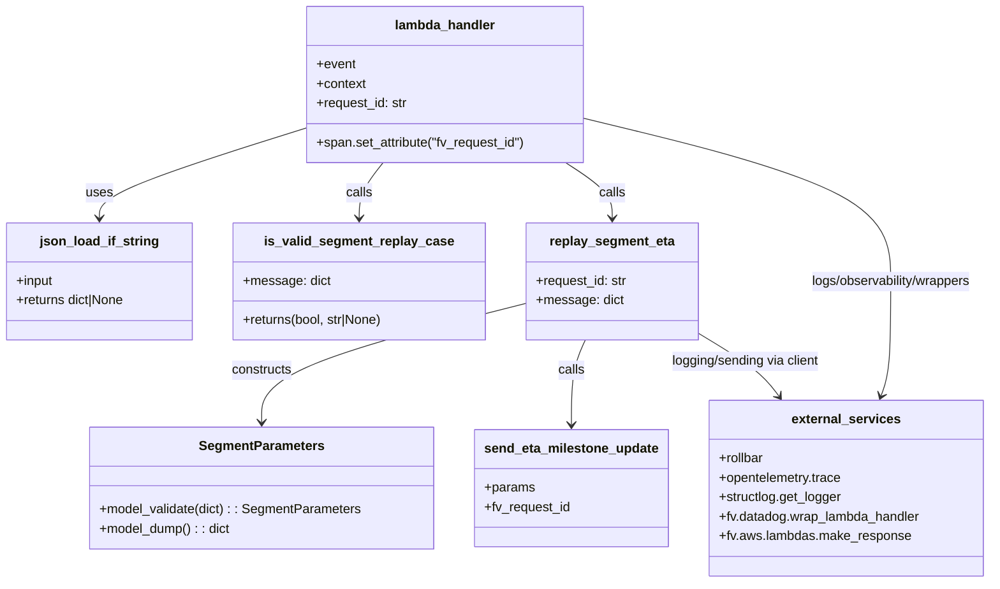

# Diagram: shipment_core/shipment_service/shipment_service/eta/replay_segment_eta.py


> Auto-generated by Obscura crawlers

## Diagram 1

```mermaid
flowchart LR
  A[lambda_handler(event, context)] --> B{for each record in event.Records}
  B --> C[parse record body -> record_body = json_load_if_string(record.body)]
  C --> D[message = json_load_if_string(record_body.Message)]
  D --> E{message exists?}
  E -- No --> F[return make_response(error_message: "No SQS message provided")]
  E -- Yes --> G[logger.info incoming parsed message]
  G --> H[is_valid_segment_replay_case(message)]
  H --> I{replay == True?}
  I -- True --> J[replay_segment_eta(request_id, message)]
  J --> K[build SegmentParameters and send_eta_milestone_update]
  I -- False --> L{err_msg present?}
  L -- Yes --> M[logger.error(err_msg) & response.error_message = err_msg]
  L -- No --> N[continue]
  N --> O[after loop return make_response(response)]
```

> SVG rendering failed for this diagram.

## Diagram 2



### SVG

<svg id="container" width="1222.8671875" xmlns="http://www.w3.org/2000/svg" class="classDiagram" height="716" viewBox="0 0 1222.8671875 716" role="graphics-document document" aria-roledescription="class"><style>#container{font-family:"trebuchet ms",verdana,arial,sans-serif;font-size:16px;fill:#333;}@keyframes edge-animation-frame{from{stroke-dashoffset:0;}}@keyframes dash{to{stroke-dashoffset:0;}}#container .edge-animation-slow{stroke-dasharray:9,5!important;stroke-dashoffset:900;animation:dash 50s linear infinite;stroke-linecap:round;}#container .edge-animation-fast{stroke-dasharray:9,5!important;stroke-dashoffset:900;animation:dash 20s linear infinite;stroke-linecap:round;}#container .error-icon{fill:#552222;}#container .error-text{fill:#552222;stroke:#552222;}#container .edge-thickness-normal{stroke-width:1px;}#container .edge-thickness-thick{stroke-width:3.5px;}#container .edge-pattern-solid{stroke-dasharray:0;}#container .edge-thickness-invisible{stroke-width:0;fill:none;}#container .edge-pattern-dashed{stroke-dasharray:3;}#container .edge-pattern-dotted{stroke-dasharray:2;}#container .marker{fill:#333333;stroke:#333333;}#container .marker.cross{stroke:#333333;}#container svg{font-family:"trebuchet ms",verdana,arial,sans-serif;font-size:16px;}#container p{margin:0;}#container g.classGroup text{fill:#9370DB;stroke:none;font-family:"trebuchet ms",verdana,arial,sans-serif;font-size:10px;}#container g.classGroup text .title{font-weight:bolder;}#container .nodeLabel,#container .edgeLabel{color:#131300;}#container .edgeLabel .label rect{fill:#ECECFF;}#container .label text{fill:#131300;}#container .labelBkg{background:#ECECFF;}#container .edgeLabel .label span{background:#ECECFF;}#container .classTitle{font-weight:bolder;}#container .node rect,#container .node circle,#container .node ellipse,#container .node polygon,#container .node path{fill:#ECECFF;stroke:#9370DB;stroke-width:1px;}#container .divider{stroke:#9370DB;stroke-width:1;}#container g.clickable{cursor:pointer;}#container g.classGroup rect{fill:#ECECFF;stroke:#9370DB;}#container g.classGroup line{stroke:#9370DB;stroke-width:1;}#container .classLabel .box{stroke:none;stroke-width:0;fill:#ECECFF;opacity:0.5;}#container .classLabel .label{fill:#9370DB;font-size:10px;}#container .relation{stroke:#333333;stroke-width:1;fill:none;}#container .dashed-line{stroke-dasharray:3;}#container .dotted-line{stroke-dasharray:1 2;}#container #compositionStart,#container .composition{fill:#333333!important;stroke:#333333!important;stroke-width:1;}#container #compositionEnd,#container .composition{fill:#333333!important;stroke:#333333!important;stroke-width:1;}#container #dependencyStart,#container .dependency{fill:#333333!important;stroke:#333333!important;stroke-width:1;}#container #dependencyStart,#container .dependency{fill:#333333!important;stroke:#333333!important;stroke-width:1;}#container #extensionStart,#container .extension{fill:transparent!important;stroke:#333333!important;stroke-width:1;}#container #extensionEnd,#container .extension{fill:transparent!important;stroke:#333333!important;stroke-width:1;}#container #aggregationStart,#container .aggregation{fill:transparent!important;stroke:#333333!important;stroke-width:1;}#container #aggregationEnd,#container .aggregation{fill:transparent!important;stroke:#333333!important;stroke-width:1;}#container #lollipopStart,#container .lollipop{fill:#ECECFF!important;stroke:#333333!important;stroke-width:1;}#container #lollipopEnd,#container .lollipop{fill:#ECECFF!important;stroke:#333333!important;stroke-width:1;}#container .edgeTerminals{font-size:11px;line-height:initial;}#container .classTitleText{text-anchor:middle;font-size:18px;fill:#333;}#container .label-icon{display:inline-block;height:1em;overflow:visible;vertical-align:-0.125em;}#container .node .label-icon path{fill:currentColor;stroke:revert;stroke-width:revert;}#container :root{--mermaid-font-family:"trebuchet ms",verdana,arial,sans-serif;}</style><g><defs><marker id="container_class-aggregationStart" class="marker aggregation class" refX="18" refY="7" markerWidth="190" markerHeight="240" orient="auto"><path d="M 18,7 L9,13 L1,7 L9,1 Z"></path></marker></defs><defs><marker id="container_class-aggregationEnd" class="marker aggregation class" refX="1" refY="7" markerWidth="20" markerHeight="28" orient="auto"><path d="M 18,7 L9,13 L1,7 L9,1 Z"></path></marker></defs><defs><marker id="container_class-extensionStart" class="marker extension class" refX="18" refY="7" markerWidth="190" markerHeight="240" orient="auto"><path d="M 1,7 L18,13 V 1 Z"></path></marker></defs><defs><marker id="container_class-extensionEnd" class="marker extension class" refX="1" refY="7" markerWidth="20" markerHeight="28" orient="auto"><path d="M 1,1 V 13 L18,7 Z"></path></marker></defs><defs><marker id="container_class-compositionStart" class="marker composition class" refX="18" refY="7" markerWidth="190" markerHeight="240" orient="auto"><path d="M 18,7 L9,13 L1,7 L9,1 Z"></path></marker></defs><defs><marker id="container_class-compositionEnd" class="marker composition class" refX="1" refY="7" markerWidth="20" markerHeight="28" orient="auto"><path d="M 18,7 L9,13 L1,7 L9,1 Z"></path></marker></defs><defs><marker id="container_class-dependencyStart" class="marker dependency class" refX="6" refY="7" markerWidth="190" markerHeight="240" orient="auto"><path d="M 5,7 L9,13 L1,7 L9,1 Z"></path></marker></defs><defs><marker id="container_class-dependencyEnd" class="marker dependency class" refX="13" refY="7" markerWidth="20" markerHeight="28" orient="auto"><path d="M 18,7 L9,13 L14,7 L9,1 Z"></path></marker></defs><defs><marker id="container_class-lollipopStart" class="marker lollipop class" refX="13" refY="7" markerWidth="190" markerHeight="240" orient="auto"><circle stroke="black" fill="transparent" cx="7" cy="7" r="6"></circle></marker></defs><defs><marker id="container_class-lollipopEnd" class="marker lollipop class" refX="1" refY="7" markerWidth="190" markerHeight="240" orient="auto"><circle stroke="black" fill="transparent" cx="7" cy="7" r="6"></circle></marker></defs><g class="root"><g class="clusters"></g><g class="edgePaths"><path d="M380.559,157.577L337.74,170.815C294.922,184.052,209.285,210.526,166.467,228.93C123.648,247.333,123.648,257.667,123.648,262.833L123.648,268" id="id_lambda_handler_json_load_if_string_1" class="edge-thickness-normal edge-pattern-solid relation" style=";;;" data-edge="true" data-et="edge" data-id="id_lambda_handler_json_load_if_string_1" data-points="W3sieCI6MzgwLjU1ODU5Mzc1LCJ5IjoxNTcuNTc3NDk1MDk2OTcxfSx7IngiOjEyMy42NDg0Mzc1LCJ5IjoyMzd9LHsieCI6MTIzLjY0ODQzNzUsInkiOjI3NH1d" marker-end="url(#container_class-dependencyEnd)"></path><path d="M474.993,200L469.927,206.167C464.86,212.333,454.727,224.667,449.66,236C444.594,247.333,444.594,257.667,444.594,262.833L444.594,268" id="id_lambda_handler_is_valid_segment_replay_case_2" class="edge-thickness-normal edge-pattern-solid relation" style=";;;" data-edge="true" data-et="edge" data-id="id_lambda_handler_is_valid_segment_replay_case_2" data-points="W3sieCI6NDc0Ljk5MzEyNzM0OTYyNDA1LCJ5IjoyMDB9LHsieCI6NDQ0LjU5Mzc1LCJ5IjoyMzd9LHsieCI6NDQ0LjU5Mzc1LCJ5IjoyNzR9XQ==" marker-end="url(#container_class-dependencyEnd)"></path><path d="M699.452,200L708.804,206.167C718.155,212.333,736.859,224.667,746.211,236C755.563,247.333,755.563,257.667,755.563,262.833L755.563,268" id="id_lambda_handler_replay_segment_eta_3" class="edge-thickness-normal edge-pattern-solid relation" style=";;;" data-edge="true" data-et="edge" data-id="id_lambda_handler_replay_segment_eta_3" data-points="W3sieCI6Njk5LjQ1MTc3Mzk2NjE2NTQsInkiOjIwMH0seyJ4Ijo3NTUuNTYyNSwieSI6MjM3fSx7IngiOjc1NS41NjI1LCJ5IjoyNzR9XQ==" marker-end="url(#container_class-dependencyEnd)"></path><path d="M649.891,373.186L596.889,386.822C543.888,400.457,437.885,427.729,384.884,452.031C331.883,476.333,331.883,497.667,331.883,508.333L331.883,519" id="id_replay_segment_eta_SegmentParameters_4" class="edge-thickness-normal edge-pattern-solid relation" style=";;;" data-edge="true" data-et="edge" data-id="id_replay_segment_eta_SegmentParameters_4" data-points="W3sieCI6NjQ5Ljg5MDYyNSwieSI6MzczLjE4NjE4NTAyMzMyNjF9LHsieCI6MzMxLjg4MjgxMjUsInkiOjQ1NX0seyJ4IjozMzEuODgyODEyNSwieSI6NTI1fV0=" marker-end="url(#container_class-dependencyEnd)"></path><path d="M725.038,418L722.423,424.167C719.809,430.333,714.58,442.667,711.966,460C709.352,477.333,709.352,499.667,709.352,510.833L709.352,522" id="id_replay_segment_eta_send_eta_milestone_update_5" class="edge-thickness-normal edge-pattern-solid relation" style=";;;" data-edge="true" data-et="edge" data-id="id_replay_segment_eta_send_eta_milestone_update_5" data-points="W3sieCI6NzI1LjAzNzg0NDAzNjY5NzMsInkiOjQxOH0seyJ4Ijo3MDkuMzUxNTYyNSwieSI6NDU1fSx7IngiOjcwOS4zNTE1NjI1LCJ5Ijo1Mjh9XQ==" marker-end="url(#container_class-dependencyEnd)"></path><path d="M727.176,145.997L789.766,161.164C852.357,176.331,977.538,206.666,1040.128,239.999C1102.719,273.333,1102.719,309.667,1102.719,346C1102.719,382.333,1102.719,418.667,1100.658,442.069C1098.597,465.472,1094.475,475.945,1092.414,481.181L1090.353,486.417" id="id_lambda_handler_external_services_6" class="edge-thickness-normal edge-pattern-solid relation" style=";;;" data-edge="true" data-et="edge" data-id="id_lambda_handler_external_services_6" data-points="W3sieCI6NzI3LjE3NTc4MTI1LCJ5IjoxNDUuOTk2ODYxMzQzOTk5NTR9LHsieCI6MTEwMi43MTg3NSwieSI6MjM3fSx7IngiOjExMDIuNzE4NzUsInkiOjM0Nn0seyJ4IjoxMTAyLjcxODc1LCJ5Ijo0NTV9LHsieCI6MTA4OC4xNTU5ODA2MDM0NDg0LCJ5Ijo0OTJ9XQ==" marker-end="url(#container_class-dependencyEnd)"></path><path d="M861.234,407.519L874.827,415.433C888.421,423.346,915.607,439.173,932.996,452.438C950.384,465.702,957.976,476.404,961.772,481.755L965.567,487.106" id="id_replay_segment_eta_external_services_7" class="edge-thickness-normal edge-pattern-solid relation" style=";;;" data-edge="true" data-et="edge" data-id="id_replay_segment_eta_external_services_7" data-points="W3sieCI6ODYxLjIzNDM3NSwieSI6NDA3LjUxOTAxNjkyMDE1NjA1fSx7IngiOjk0Mi43OTI5Njg3NSwieSI6NDU1fSx7IngiOjk2OS4wMzg4NDY5ODI3NTg2LCJ5Ijo0OTJ9XQ==" marker-end="url(#container_class-dependencyEnd)"></path></g><g class="edgeLabels"><g class="edgeLabel" transform="translate(123.6484375, 237)"><g class="label" data-id="id_lambda_handler_json_load_if_string_1" transform="translate(-16.4921875, -12)"><foreignObject width="32.984375" height="24"><div xmlns="http://www.w3.org/1999/xhtml" class="labelBkg" style="display: table-cell; white-space: nowrap; line-height: 1.5; max-width: 200px; text-align: center;"><span class="edgeLabel"><p>uses</p></span></div></foreignObject></g></g><g class="edgeLabel" transform="translate(444.59375, 237)"><g class="label" data-id="id_lambda_handler_is_valid_segment_replay_case_2" transform="translate(-16.4453125, -12)"><foreignObject width="32.890625" height="24"><div xmlns="http://www.w3.org/1999/xhtml" class="labelBkg" style="display: table-cell; white-space: nowrap; line-height: 1.5; max-width: 200px; text-align: center;"><span class="edgeLabel"><p>calls</p></span></div></foreignObject></g></g><g class="edgeLabel" transform="translate(755.5625, 237)"><g class="label" data-id="id_lambda_handler_replay_segment_eta_3" transform="translate(-16.4453125, -12)"><foreignObject width="32.890625" height="24"><div xmlns="http://www.w3.org/1999/xhtml" class="labelBkg" style="display: table-cell; white-space: nowrap; line-height: 1.5; max-width: 200px; text-align: center;"><span class="edgeLabel"><p>calls</p></span></div></foreignObject></g></g><g class="edgeLabel" transform="translate(331.8828125, 455)"><g class="label" data-id="id_replay_segment_eta_SegmentParameters_4" transform="translate(-37.84375, -12)"><foreignObject width="75.6875" height="24"><div xmlns="http://www.w3.org/1999/xhtml" class="labelBkg" style="display: table-cell; white-space: nowrap; line-height: 1.5; max-width: 200px; text-align: center;"><span class="edgeLabel"><p>constructs</p></span></div></foreignObject></g></g><g class="edgeLabel" transform="translate(709.3515625, 455)"><g class="label" data-id="id_replay_segment_eta_send_eta_milestone_update_5" transform="translate(-16.4453125, -12)"><foreignObject width="32.890625" height="24"><div xmlns="http://www.w3.org/1999/xhtml" class="labelBkg" style="display: table-cell; white-space: nowrap; line-height: 1.5; max-width: 200px; text-align: center;"><span class="edgeLabel"><p>calls</p></span></div></foreignObject></g></g><g class="edgeLabel" transform="translate(1102.71875, 346)"><g class="label" data-id="id_lambda_handler_external_services_6" transform="translate(-103.203125, -12)"><foreignObject width="206.40625" height="24"><div xmlns="http://www.w3.org/1999/xhtml" class="labelBkg" style="display: table; white-space: break-spaces; line-height: 1.5; max-width: 200px; text-align: center; width: 200px;"><span class="edgeLabel"><p>logs/observability/wrappers</p></span></div></foreignObject></g></g><g class="edgeLabel" transform="translate(921.6156, 442.67117)"><g class="label" data-id="id_replay_segment_eta_external_services_7" transform="translate(-94.140625, -12)"><foreignObject width="188.28125" height="24"><div xmlns="http://www.w3.org/1999/xhtml" class="labelBkg" style="display: table-cell; white-space: nowrap; line-height: 1.5; max-width: 200px; text-align: center;"><span class="edgeLabel"><p>logging/sending via client</p></span></div></foreignObject></g></g></g><g class="nodes"><g class="node default" id="classId-lambda_handler-0" transform="translate(553.8671875, 104)"><g class="basic label-container"><path d="M-173.30859375 -96 L173.30859375 -96 L173.30859375 96 L-173.30859375 96" stroke="none" stroke-width="0" fill="#ECECFF" style=""></path><path d="M-173.30859375 -96 C-98.65270975098713 -96, -23.996825751974256 -96, 173.30859375 -96 M-173.30859375 -96 C-50.96105524215737 -96, 71.38648326568526 -96, 173.30859375 -96 M173.30859375 -96 C173.30859375 -51.23305194964139, 173.30859375 -6.4661038992827855, 173.30859375 96 M173.30859375 -96 C173.30859375 -28.774022334731683, 173.30859375 38.451955330536634, 173.30859375 96 M173.30859375 96 C45.89680392416602 96, -81.51498590166796 96, -173.30859375 96 M173.30859375 96 C52.24638777584239 96, -68.81581819831521 96, -173.30859375 96 M-173.30859375 96 C-173.30859375 55.48127020221793, -173.30859375 14.962540404435856, -173.30859375 -96 M-173.30859375 96 C-173.30859375 52.19955648757103, -173.30859375 8.39911297514206, -173.30859375 -96" stroke="#9370DB" stroke-width="1.3" fill="none" stroke-dasharray="0 0" style=""></path></g><g class="annotation-group text" transform="translate(0, -72)"></g><g class="label-group text" transform="translate(-59.9765625, -72)"><g class="label" style="font-weight: bolder" transform="translate(0,-12)"><foreignObject width="119.953125" height="24"><div xmlns="http://www.w3.org/1999/xhtml" style="display: table-cell; white-space: nowrap; line-height: 1.5; max-width: 170px; text-align: center;"><span class="nodeLabel markdown-node-label" style=""><p>lambda_handler</p></span></div></foreignObject></g></g><g class="members-group text" transform="translate(-161.30859375, -24)"><g class="label" style="" transform="translate(0,-12)"><foreignObject width="48.328125" height="24"><div xmlns="http://www.w3.org/1999/xhtml" style="display: table-cell; white-space: nowrap; line-height: 1.5; max-width: 106px; text-align: center;"><span class="nodeLabel markdown-node-label" style=""><p>+event</p></span></div></foreignObject></g><g class="label" style="" transform="translate(0,12)"><foreignObject width="61.6875" height="24"><div xmlns="http://www.w3.org/1999/xhtml" style="display: table-cell; white-space: nowrap; line-height: 1.5; max-width: 119px; text-align: center;"><span class="nodeLabel markdown-node-label" style=""><p>+context</p></span></div></foreignObject></g><g class="label" style="" transform="translate(0,36)"><foreignObject width="113.15625" height="24"><div xmlns="http://www.w3.org/1999/xhtml" style="display: table-cell; white-space: nowrap; line-height: 1.5; max-width: 171px; text-align: center;"><span class="nodeLabel markdown-node-label" style=""><p>+request_id: str</p></span></div></foreignObject></g></g><g class="methods-group text" transform="translate(-161.30859375, 72)"><g class="label" style="" transform="translate(0,-12)"><foreignObject width="262.640625" height="24"><div xmlns="http://www.w3.org/1999/xhtml" style="display: table-cell; white-space: nowrap; line-height: 1.5; max-width: 320px; text-align: center;"><span class="nodeLabel markdown-node-label" style=""><p>+span.set_attribute("fv_request_id")</p></span></div></foreignObject></g></g><g class="divider" style=""><path d="M-173.30859375 -48 C-43.9233510799684 -48, 85.4618915900632 -48, 173.30859375 -48 M-173.30859375 -48 C-66.21691471360965 -48, 40.87476432278069 -48, 173.30859375 -48" stroke="#9370DB" stroke-width="1.3" fill="none" stroke-dasharray="0 0" style=""></path></g><g class="divider" style=""><path d="M-173.30859375 48 C-86.74444045502885 48, -0.18028716005770207 48, 173.30859375 48 M-173.30859375 48 C-84.83186509699459 48, 3.6448635560108187 48, 173.30859375 48" stroke="#9370DB" stroke-width="1.3" fill="none" stroke-dasharray="0 0" style=""></path></g></g><g class="node default" id="classId-json_load_if_string-1" transform="translate(123.6484375, 346)"><g class="basic label-container"><path d="M-115.6484375 -72 L115.6484375 -72 L115.6484375 72 L-115.6484375 72" stroke="none" stroke-width="0" fill="#ECECFF" style=""></path><path d="M-115.6484375 -72 C-26.101003952599626 -72, 63.44642959480075 -72, 115.6484375 -72 M-115.6484375 -72 C-30.215740273348985 -72, 55.21695695330203 -72, 115.6484375 -72 M115.6484375 -72 C115.6484375 -37.295341140459655, 115.6484375 -2.59068228091931, 115.6484375 72 M115.6484375 -72 C115.6484375 -18.59081574662971, 115.6484375 34.81836850674058, 115.6484375 72 M115.6484375 72 C56.363925638084154 72, -2.920586223831691 72, -115.6484375 72 M115.6484375 72 C37.99605968076904 72, -39.65631813846193 72, -115.6484375 72 M-115.6484375 72 C-115.6484375 34.67003090986346, -115.6484375 -2.6599381802730733, -115.6484375 -72 M-115.6484375 72 C-115.6484375 32.61580465824325, -115.6484375 -6.768390683513502, -115.6484375 -72" stroke="#9370DB" stroke-width="1.3" fill="none" stroke-dasharray="0 0" style=""></path></g><g class="annotation-group text" transform="translate(0, -48)"></g><g class="label-group text" transform="translate(-70.21875, -48)"><g class="label" style="font-weight: bolder" transform="translate(0,-12)"><foreignObject width="140.4375" height="24"><div xmlns="http://www.w3.org/1999/xhtml" style="display: table-cell; white-space: nowrap; line-height: 1.5; max-width: 190px; text-align: center;"><span class="nodeLabel markdown-node-label" style=""><p>json_load_if_string</p></span></div></foreignObject></g></g><g class="members-group text" transform="translate(-103.6484375, 0)"><g class="label" style="" transform="translate(0,-12)"><foreignObject width="46.46875" height="24"><div xmlns="http://www.w3.org/1999/xhtml" style="display: table-cell; white-space: nowrap; line-height: 1.5; max-width: 104px; text-align: center;"><span class="nodeLabel markdown-node-label" style=""><p>+input</p></span></div></foreignObject></g><g class="label" style="" transform="translate(0,12)"><foreignObject width="137.078125" height="24"><div xmlns="http://www.w3.org/1999/xhtml" style="display: table-cell; white-space: nowrap; line-height: 1.5; max-width: 194px; text-align: center;"><span class="nodeLabel markdown-node-label" style=""><p>+returns dict|None</p></span></div></foreignObject></g></g><g class="methods-group text" transform="translate(-103.6484375, 72)"></g><g class="divider" style=""><path d="M-115.6484375 -24 C-52.75751053267823 -24, 10.133416434643536 -24, 115.6484375 -24 M-115.6484375 -24 C-37.967252087738984 -24, 39.71393332452203 -24, 115.6484375 -24" stroke="#9370DB" stroke-width="1.3" fill="none" stroke-dasharray="0 0" style=""></path></g><g class="divider" style=""><path d="M-115.6484375 48 C-66.62521371711154 48, -17.601989934223056 48, 115.6484375 48 M-115.6484375 48 C-61.96854721838722 48, -8.288656936774444 48, 115.6484375 48" stroke="#9370DB" stroke-width="1.3" fill="none" stroke-dasharray="0 0" style=""></path></g></g><g class="node default" id="classId-is_valid_segment_replay_case-2" transform="translate(444.59375, 346)"><g class="basic label-container"><path d="M-155.296875 -72 L155.296875 -72 L155.296875 72 L-155.296875 72" stroke="none" stroke-width="0" fill="#ECECFF" style=""></path><path d="M-155.296875 -72 C-52.84523816812502 -72, 49.60639866374996 -72, 155.296875 -72 M-155.296875 -72 C-33.09788638927789 -72, 89.10110222144422 -72, 155.296875 -72 M155.296875 -72 C155.296875 -26.99581998721525, 155.296875 18.0083600255695, 155.296875 72 M155.296875 -72 C155.296875 -26.596340585737103, 155.296875 18.807318828525794, 155.296875 72 M155.296875 72 C32.70826250405629 72, -89.88034999188741 72, -155.296875 72 M155.296875 72 C75.51016368376254 72, -4.276547632474916 72, -155.296875 72 M-155.296875 72 C-155.296875 18.373429067026095, -155.296875 -35.25314186594781, -155.296875 -72 M-155.296875 72 C-155.296875 18.926397336647206, -155.296875 -34.14720532670559, -155.296875 -72" stroke="#9370DB" stroke-width="1.3" fill="none" stroke-dasharray="0 0" style=""></path></g><g class="annotation-group text" transform="translate(0, -48)"></g><g class="label-group text" transform="translate(-110.4375, -48)"><g class="label" style="font-weight: bolder" transform="translate(0,-12)"><foreignObject width="220.875" height="24"><div xmlns="http://www.w3.org/1999/xhtml" style="display: table-cell; white-space: nowrap; line-height: 1.5; max-width: 268px; text-align: center;"><span class="nodeLabel markdown-node-label" style=""><p>is_valid_segment_replay_case</p></span></div></foreignObject></g></g><g class="members-group text" transform="translate(-143.296875, 0)"><g class="label" style="" transform="translate(0,-12)"><foreignObject width="105.953125" height="24"><div xmlns="http://www.w3.org/1999/xhtml" style="display: table-cell; white-space: nowrap; line-height: 1.5; max-width: 164px; text-align: center;"><span class="nodeLabel markdown-node-label" style=""><p>+message: dict</p></span></div></foreignObject></g></g><g class="methods-group text" transform="translate(-143.296875, 48)"><g class="label" style="" transform="translate(0,-12)"><foreignObject width="176.15625" height="24"><div xmlns="http://www.w3.org/1999/xhtml" style="display: table-cell; white-space: nowrap; line-height: 1.5; max-width: 234px; text-align: center;"><span class="nodeLabel markdown-node-label" style=""><p>+returns(bool, str|None)</p></span></div></foreignObject></g></g><g class="divider" style=""><path d="M-155.296875 -24 C-60.38245622362011 -24, 34.53196255275978 -24, 155.296875 -24 M-155.296875 -24 C-61.54716665184138 -24, 32.20254169631724 -24, 155.296875 -24" stroke="#9370DB" stroke-width="1.3" fill="none" stroke-dasharray="0 0" style=""></path></g><g class="divider" style=""><path d="M-155.296875 24 C-60.17315558557041 24, 34.950563828859174 24, 155.296875 24 M-155.296875 24 C-60.02977442964513 24, 35.23732614070974 24, 155.296875 24" stroke="#9370DB" stroke-width="1.3" fill="none" stroke-dasharray="0 0" style=""></path></g></g><g class="node default" id="classId-replay_segment_eta-3" transform="translate(755.5625, 346)"><g class="basic label-container"><path d="M-105.671875 -72 L105.671875 -72 L105.671875 72 L-105.671875 72" stroke="none" stroke-width="0" fill="#ECECFF" style=""></path><path d="M-105.671875 -72 C-44.72847213889622 -72, 16.214930722207555 -72, 105.671875 -72 M-105.671875 -72 C-46.03028487677762 -72, 13.611305246444758 -72, 105.671875 -72 M105.671875 -72 C105.671875 -24.916856560961186, 105.671875 22.166286878077628, 105.671875 72 M105.671875 -72 C105.671875 -37.1929470263169, 105.671875 -2.3858940526338017, 105.671875 72 M105.671875 72 C32.48905375781882 72, -40.693767484362354 72, -105.671875 72 M105.671875 72 C49.728067740174666 72, -6.215739519650668 72, -105.671875 72 M-105.671875 72 C-105.671875 41.80224486913107, -105.671875 11.604489738262153, -105.671875 -72 M-105.671875 72 C-105.671875 31.117380001590107, -105.671875 -9.765239996819787, -105.671875 -72" stroke="#9370DB" stroke-width="1.3" fill="none" stroke-dasharray="0 0" style=""></path></g><g class="annotation-group text" transform="translate(0, -48)"></g><g class="label-group text" transform="translate(-74.1875, -48)"><g class="label" style="font-weight: bolder" transform="translate(0,-12)"><foreignObject width="148.375" height="24"><div xmlns="http://www.w3.org/1999/xhtml" style="display: table-cell; white-space: nowrap; line-height: 1.5; max-width: 196px; text-align: center;"><span class="nodeLabel markdown-node-label" style=""><p>replay_segment_eta</p></span></div></foreignObject></g></g><g class="members-group text" transform="translate(-93.671875, 0)"><g class="label" style="" transform="translate(0,-12)"><foreignObject width="113.15625" height="24"><div xmlns="http://www.w3.org/1999/xhtml" style="display: table-cell; white-space: nowrap; line-height: 1.5; max-width: 171px; text-align: center;"><span class="nodeLabel markdown-node-label" style=""><p>+request_id: str</p></span></div></foreignObject></g><g class="label" style="" transform="translate(0,12)"><foreignObject width="105.953125" height="24"><div xmlns="http://www.w3.org/1999/xhtml" style="display: table-cell; white-space: nowrap; line-height: 1.5; max-width: 164px; text-align: center;"><span class="nodeLabel markdown-node-label" style=""><p>+message: dict</p></span></div></foreignObject></g></g><g class="methods-group text" transform="translate(-93.671875, 72)"></g><g class="divider" style=""><path d="M-105.671875 -24 C-52.45864381548518 -24, 0.7545873690296361 -24, 105.671875 -24 M-105.671875 -24 C-30.38200885517746 -24, 44.90785728964508 -24, 105.671875 -24" stroke="#9370DB" stroke-width="1.3" fill="none" stroke-dasharray="0 0" style=""></path></g><g class="divider" style=""><path d="M-105.671875 48 C-50.5736752888012 48, 4.524524422397604 48, 105.671875 48 M-105.671875 48 C-27.916851615603292 48, 49.838171768793416 48, 105.671875 48" stroke="#9370DB" stroke-width="1.3" fill="none" stroke-dasharray="0 0" style=""></path></g></g><g class="node default" id="classId-SegmentParameters-4" transform="translate(331.8828125, 600)"><g class="basic label-container"><path d="M-210.390625 -75 L210.390625 -75 L210.390625 75 L-210.390625 75" stroke="none" stroke-width="0" fill="#ECECFF" style=""></path><path d="M-210.390625 -75 C-52.794438328953106 -75, 104.80174834209379 -75, 210.390625 -75 M-210.390625 -75 C-95.26589756994652 -75, 19.858829860106965 -75, 210.390625 -75 M210.390625 -75 C210.390625 -43.13963280521338, 210.390625 -11.27926561042677, 210.390625 75 M210.390625 -75 C210.390625 -32.714091340911104, 210.390625 9.571817318177793, 210.390625 75 M210.390625 75 C99.814099479901 75, -10.762426040197994 75, -210.390625 75 M210.390625 75 C56.30883028582588 75, -97.77296442834825 75, -210.390625 75 M-210.390625 75 C-210.390625 23.491549651626123, -210.390625 -28.016900696747754, -210.390625 -75 M-210.390625 75 C-210.390625 25.87557661200843, -210.390625 -23.24884677598314, -210.390625 -75" stroke="#9370DB" stroke-width="1.3" fill="none" stroke-dasharray="0 0" style=""></path></g><g class="annotation-group text" transform="translate(0, -51)"></g><g class="label-group text" transform="translate(-73.875, -51)"><g class="label" style="font-weight: bolder" transform="translate(0,-12)"><foreignObject width="147.75" height="24"><div xmlns="http://www.w3.org/1999/xhtml" style="display: table-cell; white-space: nowrap; line-height: 1.5; max-width: 195px; text-align: center;"><span class="nodeLabel markdown-node-label" style=""><p>SegmentParameters</p></span></div></foreignObject></g></g><g class="members-group text" transform="translate(-198.390625, -3)"></g><g class="methods-group text" transform="translate(-198.390625, 27)"><g class="label" style="" transform="translate(0,-12)"><foreignObject width="322.90625" height="24"><div xmlns="http://www.w3.org/1999/xhtml" style="display: table-cell; white-space: nowrap; line-height: 1.5; max-width: 380px; text-align: center;"><span class="nodeLabel markdown-node-label" style=""><p>+model_validate(dict) : : SegmentParameters</p></span></div></foreignObject></g><g class="label" style="" transform="translate(0,12)"><foreignObject width="162.390625" height="24"><div xmlns="http://www.w3.org/1999/xhtml" style="display: table-cell; white-space: nowrap; line-height: 1.5; max-width: 220px; text-align: center;"><span class="nodeLabel markdown-node-label" style=""><p>+model_dump() : : dict</p></span></div></foreignObject></g></g><g class="divider" style=""><path d="M-210.390625 -27 C-83.19707546350345 -27, 43.996474072993095 -27, 210.390625 -27 M-210.390625 -27 C-44.780187114517304 -27, 120.83025077096539 -27, 210.390625 -27" stroke="#9370DB" stroke-width="1.3" fill="none" stroke-dasharray="0 0" style=""></path></g><g class="divider" style=""><path d="M-210.390625 -3 C-106.64118678036789 -3, -2.8917485607357776 -3, 210.390625 -3 M-210.390625 -3 C-69.4646493901547 -3, 71.46132621969059 -3, 210.390625 -3" stroke="#9370DB" stroke-width="1.3" fill="none" stroke-dasharray="0 0" style=""></path></g></g><g class="node default" id="classId-send_eta_milestone_update-5" transform="translate(709.3515625, 600)"><g class="basic label-container"><path d="M-117.078125 -72 L117.078125 -72 L117.078125 72 L-117.078125 72" stroke="none" stroke-width="0" fill="#ECECFF" style=""></path><path d="M-117.078125 -72 C-55.62289323106344 -72, 5.832338537873113 -72, 117.078125 -72 M-117.078125 -72 C-54.05419563158031 -72, 8.969733736839373 -72, 117.078125 -72 M117.078125 -72 C117.078125 -16.910845635904657, 117.078125 38.178308728190686, 117.078125 72 M117.078125 -72 C117.078125 -28.7429933748761, 117.078125 14.5140132502478, 117.078125 72 M117.078125 72 C64.66448215506885 72, 12.250839310137707 72, -117.078125 72 M117.078125 72 C64.96339393465834 72, 12.848662869316698 72, -117.078125 72 M-117.078125 72 C-117.078125 22.244470398116505, -117.078125 -27.51105920376699, -117.078125 -72 M-117.078125 72 C-117.078125 42.669811260948165, -117.078125 13.339622521896338, -117.078125 -72" stroke="#9370DB" stroke-width="1.3" fill="none" stroke-dasharray="0 0" style=""></path></g><g class="annotation-group text" transform="translate(0, -48)"></g><g class="label-group text" transform="translate(-103.671875, -48)"><g class="label" style="font-weight: bolder" transform="translate(0,-12)"><foreignObject width="207.34375" height="24"><div xmlns="http://www.w3.org/1999/xhtml" style="display: table-cell; white-space: nowrap; line-height: 1.5; max-width: 256px; text-align: center;"><span class="nodeLabel markdown-node-label" style=""><p>send_eta_milestone_update</p></span></div></foreignObject></g></g><g class="members-group text" transform="translate(-105.078125, 0)"><g class="label" style="" transform="translate(0,-12)"><foreignObject width="61.546875" height="24"><div xmlns="http://www.w3.org/1999/xhtml" style="display: table-cell; white-space: nowrap; line-height: 1.5; max-width: 119px; text-align: center;"><span class="nodeLabel markdown-node-label" style=""><p>+params</p></span></div></foreignObject></g><g class="label" style="" transform="translate(0,12)"><foreignObject width="106.484375" height="24"><div xmlns="http://www.w3.org/1999/xhtml" style="display: table-cell; white-space: nowrap; line-height: 1.5; max-width: 164px; text-align: center;"><span class="nodeLabel markdown-node-label" style=""><p>+fv_request_id</p></span></div></foreignObject></g></g><g class="methods-group text" transform="translate(-105.078125, 72)"></g><g class="divider" style=""><path d="M-117.078125 -24 C-28.635585174904293 -24, 59.806954650191415 -24, 117.078125 -24 M-117.078125 -24 C-28.879796532435165 -24, 59.31853193512967 -24, 117.078125 -24" stroke="#9370DB" stroke-width="1.3" fill="none" stroke-dasharray="0 0" style=""></path></g><g class="divider" style=""><path d="M-117.078125 48 C-68.44381253880499 48, -19.809500077609982 48, 117.078125 48 M-117.078125 48 C-29.737196214370954 48, 57.60373257125809 48, 117.078125 48" stroke="#9370DB" stroke-width="1.3" fill="none" stroke-dasharray="0 0" style=""></path></g></g><g class="node default" id="classId-external_services-6" transform="translate(1045.6484375, 600)"><g class="basic label-container"><path d="M-169.21875 -108 L169.21875 -108 L169.21875 108 L-169.21875 108" stroke="none" stroke-width="0" fill="#ECECFF" style=""></path><path d="M-169.21875 -108 C-65.41222294100486 -108, 38.39430411799029 -108, 169.21875 -108 M-169.21875 -108 C-57.17789549216201 -108, 54.86295901567598 -108, 169.21875 -108 M169.21875 -108 C169.21875 -59.29429632565956, 169.21875 -10.588592651319118, 169.21875 108 M169.21875 -108 C169.21875 -25.80668526986699, 169.21875 56.38662946026602, 169.21875 108 M169.21875 108 C93.53457277026784 108, 17.850395540535686 108, -169.21875 108 M169.21875 108 C36.65604217389023 108, -95.90666565221954 108, -169.21875 108 M-169.21875 108 C-169.21875 36.6885793140507, -169.21875 -34.6228413718986, -169.21875 -108 M-169.21875 108 C-169.21875 21.81886628227508, -169.21875 -64.36226743544984, -169.21875 -108" stroke="#9370DB" stroke-width="1.3" fill="none" stroke-dasharray="0 0" style=""></path></g><g class="annotation-group text" transform="translate(0, -84)"></g><g class="label-group text" transform="translate(-64.234375, -84)"><g class="label" style="font-weight: bolder" transform="translate(0,-12)"><foreignObject width="128.46875" height="24"><div xmlns="http://www.w3.org/1999/xhtml" style="display: table-cell; white-space: nowrap; line-height: 1.5; max-width: 176px; text-align: center;"><span class="nodeLabel markdown-node-label" style=""><p>external_services</p></span></div></foreignObject></g></g><g class="members-group text" transform="translate(-157.21875, -36)"><g class="label" style="" transform="translate(0,-12)"><foreignObject width="56.625" height="24"><div xmlns="http://www.w3.org/1999/xhtml" style="display: table-cell; white-space: nowrap; line-height: 1.5; max-width: 115px; text-align: center;"><span class="nodeLabel markdown-node-label" style=""><p>+rollbar</p></span></div></foreignObject></g><g class="label" style="" transform="translate(0,12)"><foreignObject width="153.640625" height="24"><div xmlns="http://www.w3.org/1999/xhtml" style="display: table-cell; white-space: nowrap; line-height: 1.5; max-width: 211px; text-align: center;"><span class="nodeLabel markdown-node-label" style=""><p>+opentelemetry.trace</p></span></div></foreignObject></g><g class="label" style="" transform="translate(0,36)"><foreignObject width="151.890625" height="24"><div xmlns="http://www.w3.org/1999/xhtml" style="display: table-cell; white-space: nowrap; line-height: 1.5; max-width: 210px; text-align: center;"><span class="nodeLabel markdown-node-label" style=""><p>+structlog.get_logger</p></span></div></foreignObject></g><g class="label" style="" transform="translate(0,60)"><foreignObject width="250.203125" height="24"><div xmlns="http://www.w3.org/1999/xhtml" style="display: table-cell; white-space: nowrap; line-height: 1.5; max-width: 308px; text-align: center;"><span class="nodeLabel markdown-node-label" style=""><p>+fv.datadog.wrap_lambda_handler</p></span></div></foreignObject></g><g class="label" style="" transform="translate(0,84)"><foreignObject width="235.03125" height="24"><div xmlns="http://www.w3.org/1999/xhtml" style="display: table-cell; white-space: nowrap; line-height: 1.5; max-width: 292px; text-align: center;"><span class="nodeLabel markdown-node-label" style=""><p>+fv.aws.lambdas.make_response</p></span></div></foreignObject></g></g><g class="methods-group text" transform="translate(-157.21875, 108)"></g><g class="divider" style=""><path d="M-169.21875 -60 C-74.93885314475209 -60, 19.341043710495825 -60, 169.21875 -60 M-169.21875 -60 C-81.92392188743963 -60, 5.370906225120734 -60, 169.21875 -60" stroke="#9370DB" stroke-width="1.3" fill="none" stroke-dasharray="0 0" style=""></path></g><g class="divider" style=""><path d="M-169.21875 84 C-85.70832688338372 84, -2.197903766767439 84, 169.21875 84 M-169.21875 84 C-96.89370879246685 84, -24.568667584933706 84, 169.21875 84" stroke="#9370DB" stroke-width="1.3" fill="none" stroke-dasharray="0 0" style=""></path></g></g></g></g></g></svg>
