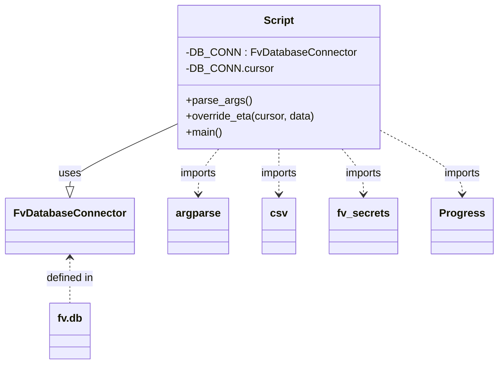
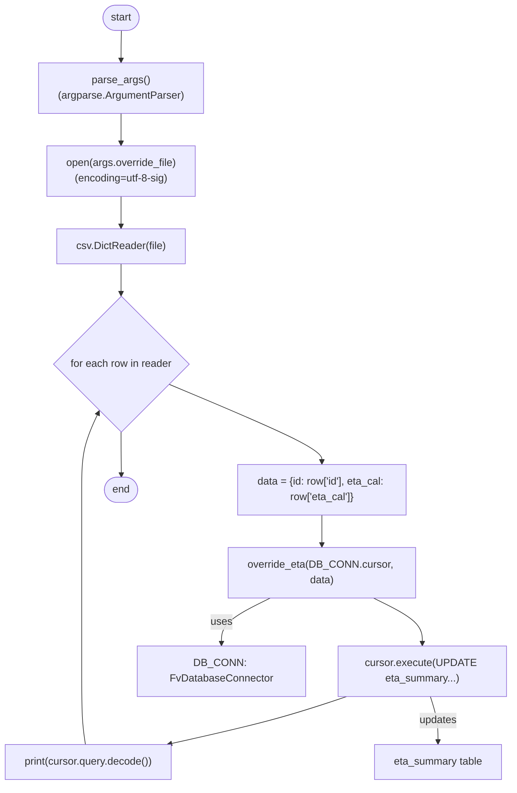

# Diagram: shipment_core/shipment_service/shipment_service/eta/scripts/override_etas.py

> Auto-generated by Obscura crawlers

## Diagram 1

### SVG

<svg id="container" width="720.8125" xmlns="http://www.w3.org/2000/svg" class="classDiagram" height="548" viewBox="0 0 720.8125 548" role="graphics-document document" aria-roledescription="class"><g><defs><marker id="container_class-aggregationStart" class="marker aggregation class" refX="18" refY="7" markerWidth="190" markerHeight="240" orient="auto"><path d="M 18,7 L9,13 L1,7 L9,1 Z"></path></marker></defs><defs><marker id="container_class-aggregationEnd" class="marker aggregation class" refX="1" refY="7" markerWidth="20" markerHeight="28" orient="auto"><path d="M 18,7 L9,13 L1,7 L9,1 Z"></path></marker></defs><defs><marker id="container_class-extensionStart" class="marker extension class" refX="18" refY="7" markerWidth="190" markerHeight="240" orient="auto"><path d="M 1,7 L18,13 V 1 Z"></path></marker></defs><defs><marker id="container_class-extensionEnd" class="marker extension class" refX="1" refY="7" markerWidth="20" markerHeight="28" orient="auto"><path d="M 1,1 V 13 L18,7 Z"></path></marker></defs><defs><marker id="container_class-compositionStart" class="marker composition class" refX="18" refY="7" markerWidth="190" markerHeight="240" orient="auto"><path d="M 18,7 L9,13 L1,7 L9,1 Z"></path></marker></defs><defs><marker id="container_class-compositionEnd" class="marker composition class" refX="1" refY="7" markerWidth="20" markerHeight="28" orient="auto"><path d="M 18,7 L9,13 L1,7 L9,1 Z"></path></marker></defs><defs><marker id="container_class-dependencyStart" class="marker dependency class" refX="6" refY="7" markerWidth="190" markerHeight="240" orient="auto"><path d="M 5,7 L9,13 L1,7 L9,1 Z"></path></marker></defs><defs><marker id="container_class-dependencyEnd" class="marker dependency class" refX="13" refY="7" markerWidth="20" markerHeight="28" orient="auto"><path d="M 18,7 L9,13 L14,7 L9,1 Z"></path></marker></defs><defs><marker id="container_class-lollipopStart" class="marker lollipop class" refX="13" refY="7" markerWidth="190" markerHeight="240" orient="auto"><circle stroke="black" fill="transparent" cx="7" cy="7" r="6"></circle></marker></defs><defs><marker id="container_class-lollipopEnd" class="marker lollipop class" refX="1" refY="7" markerWidth="190" markerHeight="240" orient="auto"><circle stroke="black" fill="transparent" cx="7" cy="7" r="6"></circle></marker></defs><g class="root"><g class="clusters"></g><g class="edgePaths"><path d="M257.973,185.249L231.528,197.875C205.083,210.5,152.194,235.75,125.749,251.667C99.305,267.583,99.305,274.167,99.305,277.458L99.305,280.75" id="id_Script_FvDatabaseConnector_1" class="edge-thickness-normal edge-pattern-solid relation" style=";;;" data-edge="true" data-et="edge" data-id="id_Script_FvDatabaseConnector_1" data-points="W3sieCI6MjU3Ljk3MjY1NjI1LCJ5IjoxODUuMjQ5NDcyNjgyMzc0NzR9LHsieCI6OTkuMzA0Njg3NSwieSI6MjYxfSx7IngiOjk5LjMwNDY4NzUsInkiOjI5OH1d" marker-end="url(#container_class-extensionEnd)"></path><path d="M315.111,224L310.091,230.167C305.071,236.333,295.032,248.667,290.012,260C284.992,271.333,284.992,281.667,284.992,286.833L284.992,292" id="id_Script_argparse_2" class="edge-thickness-normal edge-pattern-dashed relation" style=";;;" data-edge="true" data-et="edge" data-id="id_Script_argparse_2" data-points="W3sieCI6MzE1LjExMDUwNjQ2NTUxNzIzLCJ5IjoyMjR9LHsieCI6Mjg0Ljk5MjE4NzUsInkiOjI2MX0seyJ4IjoyODQuOTkyMTg3NSwieSI6Mjk4fV0=" marker-end="url(#container_class-dependencyEnd)"></path><path d="M403.023,224L403.023,230.167C403.023,236.333,403.023,248.667,403.023,260C403.023,271.333,403.023,281.667,403.023,286.833L403.023,292" id="id_Script_csv_3" class="edge-thickness-normal edge-pattern-dashed relation" style=";;;" data-edge="true" data-et="edge" data-id="id_Script_csv_3" data-points="W3sieCI6NDAzLjAyMzQzNzUsInkiOjIyNH0seyJ4Ijo0MDMuMDIzNDM3NSwieSI6MjYxfSx7IngiOjQwMy4wMjM0Mzc1LCJ5IjoyOTh9XQ==" marker-end="url(#container_class-dependencyEnd)"></path><path d="M494.614,224L499.844,230.167C505.073,236.333,515.533,248.667,520.762,260C525.992,271.333,525.992,281.667,525.992,286.833L525.992,292" id="id_Script_fv_secrets_4" class="edge-thickness-normal edge-pattern-dashed relation" style=";;;" data-edge="true" data-et="edge" data-id="id_Script_fv_secrets_4" data-points="W3sieCI6NDk0LjYxMzk1NDc0MTM3OTMsInkiOjIyNH0seyJ4Ijo1MjUuOTkyMTg3NSwieSI6MjYxfSx7IngiOjUyNS45OTIxODc1LCJ5IjoyOTh9XQ==" marker-end="url(#container_class-dependencyEnd)"></path><path d="M548.074,195.057L568.239,206.048C588.404,217.038,628.733,239.019,648.898,255.176C669.063,271.333,669.063,281.667,669.063,286.833L669.063,292" id="id_Script_Progress_5" class="edge-thickness-normal edge-pattern-dashed relation" style=";;;" data-edge="true" data-et="edge" data-id="id_Script_Progress_5" data-points="W3sieCI6NTQ4LjA3NDIxODc1LCJ5IjoxOTUuMDU3NDI1MTkwMTQ0Nzh9LHsieCI6NjY5LjA2MjUsInkiOjI2MX0seyJ4Ijo2NjkuMDYyNSwieSI6Mjk4fV0=" marker-end="url(#container_class-dependencyEnd)"></path><path d="M99.305,388L99.305,393.167C99.305,398.333,99.305,408.667,99.305,420C99.305,431.333,99.305,443.667,99.305,449.833L99.305,456" id="id_FvDatabaseConnector_fv.db_6" class="edge-thickness-normal edge-pattern-dashed relation" style=";;;" data-edge="true" data-et="edge" data-id="id_FvDatabaseConnector_fv.db_6" data-points="W3sieCI6OTkuMzA0Njg3NSwieSI6MzgyfSx7IngiOjk5LjMwNDY4NzUsInkiOjQxOX0seyJ4Ijo5OS4zMDQ2ODc1LCJ5Ijo0NTZ9XQ==" marker-start="url(#container_class-dependencyStart)"></path></g><g class="edgeLabels"><g class="edgeLabel" transform="translate(99.3046875, 261)"><g class="label" data-id="id_Script_FvDatabaseConnector_1" transform="translate(-16.4921875, -12)"><foreignObject width="32.984375" height="24">

uses

</foreignObject></g></g><g class="edgeLabel" transform="translate(284.9921875, 261)"><g class="label" data-id="id_Script_argparse_2" transform="translate(-28.25, -12)"><foreignObject width="56.5" height="24">

imports

</foreignObject></g></g><g class="edgeLabel" transform="translate(403.0234375, 261)"><g class="label" data-id="id_Script_csv_3" transform="translate(-28.25, -12)"><foreignObject width="56.5" height="24">

imports

</foreignObject></g></g><g class="edgeLabel" transform="translate(525.9921875, 261)"><g class="label" data-id="id_Script_fv_secrets_4" transform="translate(-28.25, -12)"><foreignObject width="56.5" height="24">

imports

</foreignObject></g></g><g class="edgeLabel" transform="translate(669.0625, 261)"><g class="label" data-id="id_Script_Progress_5" transform="translate(-28.25, -12)"><foreignObject width="56.5" height="24">

imports

</foreignObject></g></g><g class="edgeLabel" transform="translate(99.3046875, 419)"><g class="label" data-id="id_FvDatabaseConnector_fv.db_6" transform="translate(-36.640625, -12)"><foreignObject width="73.28125" height="24">

defined in

</foreignObject></g></g></g><g class="nodes"><g class="node default" id="classId-Script-0" transform="translate(403.0234375, 116)"><g class="basic label-container"><path d="M-145.05078125 -108 L145.05078125 -108 L145.05078125 108 L-145.05078125 108" stroke="none" stroke-width="0" fill="#ECECFF" style=""></path><path d="M-145.05078125 -108 C-36.73647329180355 -108, 71.5778346663929 -108, 145.05078125 -108 M-145.05078125 -108 C-67.0175843988915 -108, 11.015612452216999 -108, 145.05078125 -108 M145.05078125 -108 C145.05078125 -55.162558726979626, 145.05078125 -2.325117453959251, 145.05078125 108 M145.05078125 -108 C145.05078125 -48.490070505390975, 145.05078125 11.01985898921805, 145.05078125 108 M145.05078125 108 C42.31200885341275 108, -60.4267635431745 108, -145.05078125 108 M145.05078125 108 C58.88439635308225 108, -27.281988543835496 108, -145.05078125 108 M-145.05078125 108 C-145.05078125 45.77364456046785, -145.05078125 -16.4527108790643, -145.05078125 -108 M-145.05078125 108 C-145.05078125 59.76890805735846, -145.05078125 11.537816114716918, -145.05078125 -108" stroke="#9370DB" stroke-width="1.3" fill="none" stroke-dasharray="0 0" style=""></path></g><g class="annotation-group text" transform="translate(0, -84)"></g><g class="label-group text" transform="translate(-21.7421875, -84)"><g class="label" style="font-weight: bolder" transform="translate(0,-12)"><foreignObject width="43.484375" height="24">

Script

</foreignObject></g></g><g class="members-group text" transform="translate(-133.05078125, -36)"><g class="label" style="" transform="translate(0,-12)"><foreignObject width="244.359375" height="24">

-DB_CONN : FvDatabaseConnector

</foreignObject></g><g class="label" style="" transform="translate(0,12)"><foreignObject width="124.828125" height="24">

-DB_CONN.cursor

</foreignObject></g></g><g class="methods-group text" transform="translate(-133.05078125, 36)"><g class="label" style="" transform="translate(0,-12)"><foreignObject width="96.53125" height="24">

+parse_args()

</foreignObject></g><g class="label" style="" transform="translate(0,12)"><foreignObject width="195.25" height="24">

+override_eta(cursor, data)

</foreignObject></g><g class="label" style="" transform="translate(0,36)"><foreignObject width="54.65625" height="24">

+main()

</foreignObject></g></g><g class="divider" style=""><path d="M-145.05078125 -60 C-69.8615976126961 -60, 5.327586024607797 -60, 145.05078125 -60 M-145.05078125 -60 C-61.21953781965571 -60, 22.611705610688574 -60, 145.05078125 -60" stroke="#9370DB" stroke-width="1.3" fill="none" stroke-dasharray="0 0" style=""></path></g><g class="divider" style=""><path d="M-145.05078125 12 C-41.57769795747642 12, 61.895385335047166 12, 145.05078125 12 M-145.05078125 12 C-79.23393445125798 12, -13.41708765251596 12, 145.05078125 12" stroke="#9370DB" stroke-width="1.3" fill="none" stroke-dasharray="0 0" style=""></path></g></g><g class="node default" id="classId-FvDatabaseConnector-1" transform="translate(99.3046875, 340)"><g class="basic label-container"><path d="M-91.3046875 -42 L91.3046875 -42 L91.3046875 42 L-91.3046875 42" stroke="none" stroke-width="0" fill="#ECECFF" style=""></path><path d="M-91.3046875 -42 C-21.57229944740908 -42, 48.16008860518184 -42, 91.3046875 -42 M-91.3046875 -42 C-43.46440192866338 -42, 4.375883642673244 -42, 91.3046875 -42 M91.3046875 -42 C91.3046875 -11.733708174846878, 91.3046875 18.532583650306243, 91.3046875 42 M91.3046875 -42 C91.3046875 -15.55171230523958, 91.3046875 10.89657538952084, 91.3046875 42 M91.3046875 42 C30.852885860794373 42, -29.598915778411254 42, -91.3046875 42 M91.3046875 42 C31.04398279244692 42, -29.216721915106163 42, -91.3046875 42 M-91.3046875 42 C-91.3046875 10.113495536809985, -91.3046875 -21.77300892638003, -91.3046875 -42 M-91.3046875 42 C-91.3046875 16.809973136093998, -91.3046875 -8.380053727812005, -91.3046875 -42" stroke="#9370DB" stroke-width="1.3" fill="none" stroke-dasharray="0 0" style=""></path></g><g class="annotation-group text" transform="translate(0, -18)"></g><g class="label-group text" transform="translate(-79.3046875, -18)"><g class="label" style="font-weight: bolder" transform="translate(0,-12)"><foreignObject width="158.609375" height="24">

FvDatabaseConnector

</foreignObject></g></g><g class="members-group text" transform="translate(-79.3046875, 30)"></g><g class="methods-group text" transform="translate(-79.3046875, 60)"></g><g class="divider" style=""><path d="M-91.3046875 6 C-21.41746571319264 6, 48.46975607361472 6, 91.3046875 6 M-91.3046875 6 C-40.03661470641714 6, 11.23145808716572 6, 91.3046875 6" stroke="#9370DB" stroke-width="1.3" fill="none" stroke-dasharray="0 0" style=""></path></g><g class="divider" style=""><path d="M-91.3046875 24 C-37.607921524818885 24, 16.08884445036223 24, 91.3046875 24 M-91.3046875 24 C-39.74134412154361 24, 11.821999256912775 24, 91.3046875 24" stroke="#9370DB" stroke-width="1.3" fill="none" stroke-dasharray="0 0" style=""></path></g></g><g class="node default" id="classId-argparse-2" transform="translate(284.9921875, 340)"><g class="basic label-container"><path d="M-44.3828125 -42 L44.3828125 -42 L44.3828125 42 L-44.3828125 42" stroke="none" stroke-width="0" fill="#ECECFF" style=""></path><path d="M-44.3828125 -42 C-11.856612855140398 -42, 20.669586789719204 -42, 44.3828125 -42 M-44.3828125 -42 C-26.47822900152176 -42, -8.573645503043522 -42, 44.3828125 -42 M44.3828125 -42 C44.3828125 -9.366714454153168, 44.3828125 23.266571091693663, 44.3828125 42 M44.3828125 -42 C44.3828125 -8.99370177812989, 44.3828125 24.01259644374022, 44.3828125 42 M44.3828125 42 C26.33247756153015 42, 8.282142623060302 42, -44.3828125 42 M44.3828125 42 C22.13681992514103 42, -0.10917264971794083 42, -44.3828125 42 M-44.3828125 42 C-44.3828125 12.129307472330371, -44.3828125 -17.741385055339258, -44.3828125 -42 M-44.3828125 42 C-44.3828125 12.167404789986694, -44.3828125 -17.66519042002661, -44.3828125 -42" stroke="#9370DB" stroke-width="1.3" fill="none" stroke-dasharray="0 0" style=""></path></g><g class="annotation-group text" transform="translate(0, -18)"></g><g class="label-group text" transform="translate(-32.3828125, -18)"><g class="label" style="font-weight: bolder" transform="translate(0,-12)"><foreignObject width="64.765625" height="24">

argparse

</foreignObject></g></g><g class="members-group text" transform="translate(-32.3828125, 30)"></g><g class="methods-group text" transform="translate(-32.3828125, 60)"></g><g class="divider" style=""><path d="M-44.3828125 6 C-24.31259131678104 6, -4.242370133562083 6, 44.3828125 6 M-44.3828125 6 C-16.767260217289397 6, 10.848292065421205 6, 44.3828125 6" stroke="#9370DB" stroke-width="1.3" fill="none" stroke-dasharray="0 0" style=""></path></g><g class="divider" style=""><path d="M-44.3828125 24 C-22.886313514823506 24, -1.389814529647012 24, 44.3828125 24 M-44.3828125 24 C-21.909688285248098 24, 0.5634359295038038 24, 44.3828125 24" stroke="#9370DB" stroke-width="1.3" fill="none" stroke-dasharray="0 0" style=""></path></g></g><g class="node default" id="classId-csv-3" transform="translate(403.0234375, 340)"><g class="basic label-container"><path d="M-23.6484375 -42 L23.6484375 -42 L23.6484375 42 L-23.6484375 42" stroke="none" stroke-width="0" fill="#ECECFF" style=""></path><path d="M-23.6484375 -42 C-6.8229833342615755 -42, 10.002470831476849 -42, 23.6484375 -42 M-23.6484375 -42 C-9.259179941857067 -42, 5.130077616285867 -42, 23.6484375 -42 M23.6484375 -42 C23.6484375 -24.23788590822064, 23.6484375 -6.475771816441281, 23.6484375 42 M23.6484375 -42 C23.6484375 -16.625156706819272, 23.6484375 8.749686586361456, 23.6484375 42 M23.6484375 42 C11.06536109672596 42, -1.5177153065480802 42, -23.6484375 42 M23.6484375 42 C9.350130031432995 42, -4.94817743713401 42, -23.6484375 42 M-23.6484375 42 C-23.6484375 20.94610797151501, -23.6484375 -0.10778405696998306, -23.6484375 -42 M-23.6484375 42 C-23.6484375 22.11638273527824, -23.6484375 2.2327654705564797, -23.6484375 -42" stroke="#9370DB" stroke-width="1.3" fill="none" stroke-dasharray="0 0" style=""></path></g><g class="annotation-group text" transform="translate(0, -18)"></g><g class="label-group text" transform="translate(-11.6484375, -18)"><g class="label" style="font-weight: bolder" transform="translate(0,-12)"><foreignObject width="23.296875" height="24">

csv

</foreignObject></g></g><g class="members-group text" transform="translate(-11.6484375, 30)"></g><g class="methods-group text" transform="translate(-11.6484375, 60)"></g><g class="divider" style=""><path d="M-23.6484375 6 C-10.778124189171407 6, 2.092189121657185 6, 23.6484375 6 M-23.6484375 6 C-11.36896905368225 6, 0.9104993926355007 6, 23.6484375 6" stroke="#9370DB" stroke-width="1.3" fill="none" stroke-dasharray="0 0" style=""></path></g><g class="divider" style=""><path d="M-23.6484375 24 C-7.3327543469775165 24, 8.982928806044967 24, 23.6484375 24 M-23.6484375 24 C-11.48501535724504 24, 0.678406785509921 24, 23.6484375 24" stroke="#9370DB" stroke-width="1.3" fill="none" stroke-dasharray="0 0" style=""></path></g></g><g class="node default" id="classId-fv_secrets-4" transform="translate(525.9921875, 340)"><g class="basic label-container"><path d="M-49.3203125 -42 L49.3203125 -42 L49.3203125 42 L-49.3203125 42" stroke="none" stroke-width="0" fill="#ECECFF" style=""></path><path d="M-49.3203125 -42 C-17.17787611304614 -42, 14.964560273907722 -42, 49.3203125 -42 M-49.3203125 -42 C-12.557458666504921 -42, 24.205395166990158 -42, 49.3203125 -42 M49.3203125 -42 C49.3203125 -14.636988357170654, 49.3203125 12.726023285658691, 49.3203125 42 M49.3203125 -42 C49.3203125 -8.799989806856196, 49.3203125 24.400020386287608, 49.3203125 42 M49.3203125 42 C16.7467349756272 42, -15.826842548745603 42, -49.3203125 42 M49.3203125 42 C24.64049530089828 42, -0.03932189820343979 42, -49.3203125 42 M-49.3203125 42 C-49.3203125 17.572839518721295, -49.3203125 -6.854320962557409, -49.3203125 -42 M-49.3203125 42 C-49.3203125 10.907757556852335, -49.3203125 -20.18448488629533, -49.3203125 -42" stroke="#9370DB" stroke-width="1.3" fill="none" stroke-dasharray="0 0" style=""></path></g><g class="annotation-group text" transform="translate(0, -18)"></g><g class="label-group text" transform="translate(-37.3203125, -18)"><g class="label" style="font-weight: bolder" transform="translate(0,-12)"><foreignObject width="74.640625" height="24">

fv_secrets

</foreignObject></g></g><g class="members-group text" transform="translate(-37.3203125, 30)"></g><g class="methods-group text" transform="translate(-37.3203125, 60)"></g><g class="divider" style=""><path d="M-49.3203125 6 C-16.391221188819053 6, 16.537870122361895 6, 49.3203125 6 M-49.3203125 6 C-25.965020267808818 6, -2.6097280356176356 6, 49.3203125 6" stroke="#9370DB" stroke-width="1.3" fill="none" stroke-dasharray="0 0" style=""></path></g><g class="divider" style=""><path d="M-49.3203125 24 C-22.151046055285917 24, 5.018220389428166 24, 49.3203125 24 M-49.3203125 24 C-24.019738256236256 24, 1.2808359875274888 24, 49.3203125 24" stroke="#9370DB" stroke-width="1.3" fill="none" stroke-dasharray="0 0" style=""></path></g></g><g class="node default" id="classId-Progress-5" transform="translate(669.0625, 340)"><g class="basic label-container"><path d="M-43.75 -42 L43.75 -42 L43.75 42 L-43.75 42" stroke="none" stroke-width="0" fill="#ECECFF" style=""></path><path d="M-43.75 -42 C-10.098055720895267 -42, 23.553888558209465 -42, 43.75 -42 M-43.75 -42 C-16.832077321473697 -42, 10.085845357052605 -42, 43.75 -42 M43.75 -42 C43.75 -11.726958641121637, 43.75 18.546082717756725, 43.75 42 M43.75 -42 C43.75 -23.74390600410356, 43.75 -5.487812008207122, 43.75 42 M43.75 42 C22.363506666217805 42, 0.977013332435611 42, -43.75 42 M43.75 42 C18.82924386952887 42, -6.09151226094226 42, -43.75 42 M-43.75 42 C-43.75 18.82755281383467, -43.75 -4.344894372330657, -43.75 -42 M-43.75 42 C-43.75 19.467184052702283, -43.75 -3.065631894595434, -43.75 -42" stroke="#9370DB" stroke-width="1.3" fill="none" stroke-dasharray="0 0" style=""></path></g><g class="annotation-group text" transform="translate(0, -18)"></g><g class="label-group text" transform="translate(-31.75, -18)"><g class="label" style="font-weight: bolder" transform="translate(0,-12)"><foreignObject width="63.5" height="24">

Progress

</foreignObject></g></g><g class="members-group text" transform="translate(-31.75, 30)"></g><g class="methods-group text" transform="translate(-31.75, 60)"></g><g class="divider" style=""><path d="M-43.75 6 C-17.837225379723947 6, 8.075549240552107 6, 43.75 6 M-43.75 6 C-10.175600450303385 6, 23.39879909939323 6, 43.75 6" stroke="#9370DB" stroke-width="1.3" fill="none" stroke-dasharray="0 0" style=""></path></g><g class="divider" style=""><path d="M-43.75 24 C-21.252952462491475 24, 1.24409507501705 24, 43.75 24 M-43.75 24 C-15.142017573886513 24, 13.465964852226975 24, 43.75 24" stroke="#9370DB" stroke-width="1.3" fill="none" stroke-dasharray="0 0" style=""></path></g></g><g class="node default" id="classId-fv.db-6" transform="translate(99.3046875, 498)"><g class="basic label-container"><path d="M-30.0546875 -42 L30.0546875 -42 L30.0546875 42 L-30.0546875 42" stroke="none" stroke-width="0" fill="#ECECFF" style=""></path><path d="M-30.0546875 -42 C-8.993407673887337 -42, 12.067872152225327 -42, 30.0546875 -42 M-30.0546875 -42 C-12.929836769187308 -42, 4.195013961625385 -42, 30.0546875 -42 M30.0546875 -42 C30.0546875 -18.39120014776815, 30.0546875 5.2175997044637015, 30.0546875 42 M30.0546875 -42 C30.0546875 -15.276086861310187, 30.0546875 11.447826277379626, 30.0546875 42 M30.0546875 42 C13.661469843317185 42, -2.7317478133656294 42, -30.0546875 42 M30.0546875 42 C16.915852641011902 42, 3.7770177820238047 42, -30.0546875 42 M-30.0546875 42 C-30.0546875 14.553517274325067, -30.0546875 -12.892965451349866, -30.0546875 -42 M-30.0546875 42 C-30.0546875 22.53255582640451, -30.0546875 3.0651116528090228, -30.0546875 -42" stroke="#9370DB" stroke-width="1.3" fill="none" stroke-dasharray="0 0" style=""></path></g><g class="annotation-group text" transform="translate(0, -18)"></g><g class="label-group text" transform="translate(-18.0546875, -18)"><g class="label" style="font-weight: bolder" transform="translate(0,-12)"><foreignObject width="36.109375" height="24">

fv.db

</foreignObject></g></g><g class="members-group text" transform="translate(-18.0546875, 30)"></g><g class="methods-group text" transform="translate(-18.0546875, 60)"></g><g class="divider" style=""><path d="M-30.0546875 6 C-13.796002320067664 6, 2.462682859864671 6, 30.0546875 6 M-30.0546875 6 C-8.988512862997549 6, 12.077661774004902 6, 30.0546875 6" stroke="#9370DB" stroke-width="1.3" fill="none" stroke-dasharray="0 0" style=""></path></g><g class="divider" style=""><path d="M-30.0546875 24 C-17.181251940502435 24, -4.307816381004873 24, 30.0546875 24 M-30.0546875 24 C-10.379643151983576 24, 9.295401196032849 24, 30.0546875 24" stroke="#9370DB" stroke-width="1.3" fill="none" stroke-dasharray="0 0" style=""></path></g></g></g></g></g></svg>

## Diagram 2

### SVG

<svg id="container" width="793.279052734375" xmlns="http://www.w3.org/2000/svg" class="flowchart" height="1190.796875" viewBox="0 0 793.279052734375 1190.796875" role="graphics-document document" aria-roledescription="flowchart-v2"><g><marker id="container_flowchart-v2-pointEnd" class="marker flowchart-v2" viewBox="0 0 10 10" refX="5" refY="5" markerUnits="userSpaceOnUse" markerWidth="8" markerHeight="8" orient="auto"><path d="M 0 0 L 10 5 L 0 10 z" class="arrowMarkerPath" style="stroke-width: 1; stroke-dasharray: 1, 0;"></path></marker><marker id="container_flowchart-v2-pointStart" class="marker flowchart-v2" viewBox="0 0 10 10" refX="4.5" refY="5" markerUnits="userSpaceOnUse" markerWidth="8" markerHeight="8" orient="auto"><path d="M 0 5 L 10 10 L 10 0 z" class="arrowMarkerPath" style="stroke-width: 1; stroke-dasharray: 1, 0;"></path></marker><marker id="container_flowchart-v2-circleEnd" class="marker flowchart-v2" viewBox="0 0 10 10" refX="11" refY="5" markerUnits="userSpaceOnUse" markerWidth="11" markerHeight="11" orient="auto"><circle cx="5" cy="5" r="5" class="arrowMarkerPath" style="stroke-width: 1; stroke-dasharray: 1, 0;"></circle></marker><marker id="container_flowchart-v2-circleStart" class="marker flowchart-v2" viewBox="0 0 10 10" refX="-1" refY="5" markerUnits="userSpaceOnUse" markerWidth="11" markerHeight="11" orient="auto"><circle cx="5" cy="5" r="5" class="arrowMarkerPath" style="stroke-width: 1; stroke-dasharray: 1, 0;"></circle></marker><marker id="container_flowchart-v2-crossEnd" class="marker cross flowchart-v2" viewBox="0 0 11 11" refX="12" refY="5.2" markerUnits="userSpaceOnUse" markerWidth="11" markerHeight="11" orient="auto"><path d="M 1,1 l 9,9 M 10,1 l -9,9" class="arrowMarkerPath" style="stroke-width: 2; stroke-dasharray: 1, 0;"></path></marker><marker id="container_flowchart-v2-crossStart" class="marker cross flowchart-v2" viewBox="0 0 11 11" refX="-1" refY="5.2" markerUnits="userSpaceOnUse" markerWidth="11" markerHeight="11" orient="auto"><path d="M 1,1 l 9,9 M 10,1 l -9,9" class="arrowMarkerPath" style="stroke-width: 2; stroke-dasharray: 1, 0;"></path></marker><g class="root"><g class="clusters"></g><g class="edgePaths"><path d="M190.779,47.5L190.696,51.583C190.612,55.667,190.446,63.833,190.362,71.417C190.279,79,190.279,86,190.279,89.5L190.279,93" id="L_Start_ParseArgs_0" class="edge-thickness-normal edge-pattern-solid edge-thickness-normal edge-pattern-solid flowchart-link" style=";" data-edge="true" data-et="edge" data-id="L_Start_ParseArgs_0" data-points="W3sieCI6MTkwLjc3OTA0MzE5NzYzMTg0LCJ5Ijo0Ny41fSx7IngiOjE5MC4yNzkwNDMxOTc2MzE4NCwieSI6NzJ9LHsieCI6MTkwLjI3OTA0MzE5NzYzMTg0LCJ5Ijo5N31d" marker-end="url(#container_flowchart-v2-pointEnd)"></path><path d="M190.279,151L190.279,155.167C190.279,159.333,190.279,167.667,190.279,175.333C190.279,183,190.279,190,190.279,193.5L190.279,197" id="L_ParseArgs_OpenFile_0" class="edge-thickness-normal edge-pattern-solid edge-thickness-normal edge-pattern-solid flowchart-link" style=";" data-edge="true" data-et="edge" data-id="L_ParseArgs_OpenFile_0" data-points="W3sieCI6MTkwLjI3OTA0MzE5NzYzMTg0LCJ5IjoxNTF9LHsieCI6MTkwLjI3OTA0MzE5NzYzMTg0LCJ5IjoxNzZ9LHsieCI6MTkwLjI3OTA0MzE5NzYzMTg0LCJ5IjoyMDF9XQ==" marker-end="url(#container_flowchart-v2-pointEnd)"></path><path d="M190.279,279L190.279,283.167C190.279,287.333,190.279,295.667,190.279,303.333C190.279,311,190.279,318,190.279,321.5L190.279,325" id="L_OpenFile_ReadCSV_0" class="edge-thickness-normal edge-pattern-solid edge-thickness-normal edge-pattern-solid flowchart-link" style=";" data-edge="true" data-et="edge" data-id="L_OpenFile_ReadCSV_0" data-points="W3sieCI6MTkwLjI3OTA0MzE5NzYzMTg0LCJ5IjoyNzl9LHsieCI6MTkwLjI3OTA0MzE5NzYzMTg0LCJ5IjozMDR9LHsieCI6MTkwLjI3OTA0MzE5NzYzMTg0LCJ5IjozMjl9XQ==" marker-end="url(#container_flowchart-v2-pointEnd)"></path><path d="M190.279,383L190.279,387.167C190.279,391.333,190.279,399.667,190.279,407.333C190.279,415,190.279,422,190.279,425.5L190.279,429" id="L_ReadCSV_ForEachRow_0" class="edge-thickness-normal edge-pattern-solid edge-thickness-normal edge-pattern-solid flowchart-link" style=";" data-edge="true" data-et="edge" data-id="L_ReadCSV_ForEachRow_0" data-points="W3sieCI6MTkwLjI3OTA0MzE5NzYzMTg0LCJ5IjozODN9LHsieCI6MTkwLjI3OTA0MzE5NzYzMTg0LCJ5Ijo0MDh9LHsieCI6MTkwLjI3OTA0MzE5NzYzMTg0LCJ5Ijo0MzN9XQ==" marker-end="url(#container_flowchart-v2-pointEnd)"></path><path d="M265.27,571.806L304.438,588.471C343.607,605.136,421.943,638.466,461.111,658.632C500.279,678.797,500.279,685.797,500.279,689.297L500.279,692.797" id="L_ForEachRow_BuildData_0" class="edge-thickness-normal edge-pattern-solid edge-thickness-normal edge-pattern-solid flowchart-link" style=";" data-edge="true" data-et="edge" data-id="L_ForEachRow_BuildData_0" data-points="W3sieCI6MjY1LjI3MDI5MTg5Mzc3NTk1LCJ5Ijo1NzEuODA1NjI2MzAzODU1OX0seyJ4Ijo1MDAuMjc5MDQzMTk3NjMxODQsInkiOjY3MS43OTY4NzV9LHsieCI6NTAwLjI3OTA0MzE5NzYzMTg0LCJ5Ijo2OTYuNzk2ODc1fV0=" marker-end="url(#container_flowchart-v2-pointEnd)"></path><path d="M500.279,774.797L500.279,778.964C500.279,783.13,500.279,791.464,500.279,799.13C500.279,806.797,500.279,813.797,500.279,817.297L500.279,820.797" id="L_BuildData_CallOverride_0" class="edge-thickness-normal edge-pattern-solid edge-thickness-normal edge-pattern-solid flowchart-link" style=";" data-edge="true" data-et="edge" data-id="L_BuildData_CallOverride_0" data-points="W3sieCI6NTAwLjI3OTA0MzE5NzYzMTg0LCJ5Ijo3NzQuNzk2ODc1fSx7IngiOjUwMC4yNzkwNDMxOTc2MzE4NCwieSI6Nzk5Ljc5Njg3NX0seyJ4Ijo1MDAuMjc5MDQzMTk3NjMxODQsInkiOjgyNC43OTY4NzV9XQ==" marker-end="url(#container_flowchart-v2-pointEnd)"></path><path d="M579.819,902.797L592.395,908.964C604.972,915.13,630.126,927.464,642.702,939.13C655.279,950.797,655.279,961.797,655.279,967.297L655.279,972.797" id="L_CallOverride_ExecuteSQL_0" class="edge-thickness-normal edge-pattern-solid edge-thickness-normal edge-pattern-solid flowchart-link" style=";" data-edge="true" data-et="edge" data-id="L_CallOverride_ExecuteSQL_0" data-points="W3sieCI6NTc5LjgxODUxNjg4MTg0MjQsInkiOjkwMi43OTY4NzV9LHsieCI6NjU1LjI3OTA0MzE5NzYzMTgsInkiOjkzOS43OTY4NzV9LHsieCI6NjU1LjI3OTA0MzE5NzYzMTgsInkiOjk3Ni43OTY4NzV9XQ==" marker-end="url(#container_flowchart-v2-pointEnd)"></path><path d="M538.536,1054.797L520.076,1060.964C501.617,1067.13,464.698,1079.464,419.072,1091.653C373.446,1103.842,319.112,1115.886,291.946,1121.909L264.779,1127.931" id="L_ExecuteSQL_PrintQuery_0" class="edge-thickness-normal edge-pattern-solid edge-thickness-normal edge-pattern-solid flowchart-link" style=";" data-edge="true" data-et="edge" data-id="L_ExecuteSQL_PrintQuery_0" data-points="W3sieCI6NTM4LjUzNTYyMjE0NTAwMDMsInkiOjEwNTQuNzk2ODc1fSx7IngiOjQyNy43NzkwNDMxOTc2MzE4NCwieSI6MTA5MS43OTY4NzV9LHsieCI6MjYwLjg3MzgyNDg2NDYyNTkzLCJ5IjoxMTI4Ljc5Njg3NX1d" marker-end="url(#container_flowchart-v2-pointEnd)"></path><path d="M134.859,1128.797L133.896,1122.63C132.932,1116.464,131.005,1104.13,130.042,1085.297C129.078,1066.464,129.078,1041.13,129.078,1015.797C129.078,990.464,129.078,965.13,129.078,939.797C129.078,914.464,129.078,889.13,129.078,865.797C129.078,842.464,129.078,821.13,129.078,799.797C129.078,778.464,129.078,757.13,129.078,735.797C129.078,714.464,129.078,693.13,133.351,673.255C137.624,653.38,146.169,634.962,150.442,625.754L154.715,616.545" id="L_PrintQuery_ForEachRow_0" class="edge-thickness-normal edge-pattern-solid edge-thickness-normal edge-pattern-solid flowchart-link" style=";" data-edge="true" data-et="edge" data-id="L_PrintQuery_ForEachRow_0" data-points="W3sieCI6MTM0Ljg1OTM3NSwieSI6MTEyOC43OTY4NzV9LHsieCI6MTI5LjA3ODEyNSwieSI6MTA5MS43OTY4NzV9LHsieCI6MTI5LjA3ODEyNSwieSI6MTAxNS43OTY4NzV9LHsieCI6MTI5LjA3ODEyNSwieSI6OTM5Ljc5Njg3NX0seyJ4IjoxMjkuMDc4MTI1LCJ5Ijo4NjMuNzk2ODc1fSx7IngiOjEyOS4wNzgxMjUsInkiOjc5OS43OTY4NzV9LHsieCI6MTI5LjA3ODEyNSwieSI6NzM1Ljc5Njg3NX0seyJ4IjoxMjkuMDc4MTI1LCJ5Ijo2NzEuNzk2ODc1fSx7IngiOjE1Ni4zOTg2NDc3NjQ2Mzc3LCJ5Ijo2MTIuOTE2NDc5NTY3MDA1OX1d" marker-end="url(#container_flowchart-v2-pointEnd)"></path><path d="M190.279,646.797L190.279,650.964C190.279,655.13,190.279,663.464,190.355,674.464C190.431,685.464,190.583,699.13,190.659,705.964L190.735,712.797" id="L_ForEachRow_End_0" class="edge-thickness-normal edge-pattern-solid edge-thickness-normal edge-pattern-solid flowchart-link" style=";" data-edge="true" data-et="edge" data-id="L_ForEachRow_End_0" data-points="W3sieCI6MTkwLjI3OTA0MzE5NzYzMTg0LCJ5Ijo2NDYuNzk2ODc1fSx7IngiOjE5MC4yNzkwNDMxOTc2MzE4NCwieSI6NjcxLjc5Njg3NX0seyJ4IjoxOTAuNzc5MDQzMTk3NjMxODQsInkiOjcxNi43OTY4NzV9XQ==" marker-end="url(#container_flowchart-v2-pointEnd)"></path><path d="M420.74,902.797L408.163,908.964C395.586,915.13,370.433,927.464,357.856,939.13C345.279,950.797,345.279,961.797,345.279,967.297L345.279,972.797" id="L_CallOverride_DB_CONN_0" class="edge-thickness-normal edge-pattern-solid edge-thickness-normal edge-pattern-solid flowchart-link" style=";" data-edge="true" data-et="edge" data-id="L_CallOverride_DB_CONN_0" data-points="W3sieCI6NDIwLjczOTU2OTUxMzQyMTMsInkiOjkwMi43OTY4NzV9LHsieCI6MzQ1LjI3OTA0MzE5NzYzMTg0LCJ5Ijo5MzkuNzk2ODc1fSx7IngiOjM0NS4yNzkwNDMxOTc2MzE4NCwieSI6OTc2Ljc5Njg3NX1d" marker-end="url(#container_flowchart-v2-pointEnd)"></path><path d="M667.958,1054.797L669.962,1060.964C671.967,1067.13,675.977,1079.464,677.981,1091.13C679.986,1102.797,679.986,1113.797,679.986,1119.297L679.986,1124.797" id="L_ExecuteSQL_ETA_0" class="edge-thickness-normal edge-pattern-solid edge-thickness-normal edge-pattern-solid flowchart-link" style=";" data-edge="true" data-et="edge" data-id="L_ExecuteSQL_ETA_0" data-points="W3sieCI6NjY3Ljk1NzY1MTMzOTA3OTIsInkiOjEwNTQuNzk2ODc1fSx7IngiOjY3OS45ODYwNzQ0NDc2MzE4LCJ5IjoxMDkxLjc5Njg3NX0seyJ4Ijo2NzkuOTg2MDc0NDQ3NjMxOCwieSI6MTEyOC43OTY4NzV9XQ==" marker-end="url(#container_flowchart-v2-pointEnd)"></path></g><g class="edgeLabels"><g class="edgeLabel"><g class="label" data-id="L_Start_ParseArgs_0" transform="translate(0, 0)"><foreignObject width="0" height="0">

</foreignObject></g></g><g class="edgeLabel"><g class="label" data-id="L_ParseArgs_OpenFile_0" transform="translate(0, 0)"><foreignObject width="0" height="0">

</foreignObject></g></g><g class="edgeLabel"><g class="label" data-id="L_OpenFile_ReadCSV_0" transform="translate(0, 0)"><foreignObject width="0" height="0">

</foreignObject></g></g><g class="edgeLabel"><g class="label" data-id="L_ReadCSV_ForEachRow_0" transform="translate(0, 0)"><foreignObject width="0" height="0">

</foreignObject></g></g><g class="edgeLabel"><g class="label" data-id="L_ForEachRow_BuildData_0" transform="translate(0, 0)"><foreignObject width="0" height="0">

</foreignObject></g></g><g class="edgeLabel"><g class="label" data-id="L_BuildData_CallOverride_0" transform="translate(0, 0)"><foreignObject width="0" height="0">

</foreignObject></g></g><g class="edgeLabel"><g class="label" data-id="L_CallOverride_ExecuteSQL_0" transform="translate(0, 0)"><foreignObject width="0" height="0">

</foreignObject></g></g><g class="edgeLabel"><g class="label" data-id="L_ExecuteSQL_PrintQuery_0" transform="translate(0, 0)"><foreignObject width="0" height="0">

</foreignObject></g></g><g class="edgeLabel"><g class="label" data-id="L_PrintQuery_ForEachRow_0" transform="translate(0, 0)"><foreignObject width="0" height="0">

</foreignObject></g></g><g class="edgeLabel"><g class="label" data-id="L_ForEachRow_End_0" transform="translate(0, 0)"><foreignObject width="0" height="0">

</foreignObject></g></g><g class="edgeLabel" transform="translate(345.27904319763184, 939.796875)"><g class="label" data-id="L_CallOverride_DB_CONN_0" transform="translate(-16.4921875, -12)"><foreignObject width="32.984375" height="24">

uses

</foreignObject></g></g><g class="edgeLabel" transform="translate(679.9860744476318, 1091.796875)"><g class="label" data-id="L_ExecuteSQL_ETA_0" transform="translate(-29.4140625, -12)"><foreignObject width="58.828125" height="24">

updates

</foreignObject></g></g></g><g class="nodes"><g class="node default" id="flowchart-Start-0" transform="translate(190.27904319763184, 27.5)"><g class="basic label-container outer-path"><path d="M-9.7734375 -19.5 C-5.327498587211054 -19.5, -0.8815596744221086 -19.5, 9.7734375 -19.5 C9.7734375 -19.5, 9.773437499999998 -19.5, 9.773437499999998 -19.5 C10.032145207334024 -19.4917037473698, 10.290852914668049 -19.483407494739605, 11.0228067896239 -19.45993515863156 C11.333427107055519 -19.429969990184517, 11.644047424487136 -19.40000482173748, 12.267042152847864 -19.3399052695533 C12.579997936621929 -19.28930900544106, 12.892953720395994 -19.23871274132882, 13.501030759676757 -19.140403561325776 C13.883923851110579 -19.053010711816935, 14.266816942544402 -18.965617862308093, 14.71970188623539 -18.862249829261074 C14.962041360040345 -18.79032474550162, 15.204380833845303 -18.718399661742165, 15.918047751460602 -18.50658706670804 C16.315104089733353 -18.360466663875112, 16.7121604280061 -18.214346261042184, 17.091144095147794 -18.074876768247425 C17.437910476222342 -17.92137357780494, 17.784676857296894 -17.76787038736245, 18.23417041279238 -17.568892924097174 C18.560581254814565 -17.398604596890323, 18.88699209683675 -17.228316269683475, 19.342429764076783 -16.990714730406097 C19.575071626503906 -16.84968586624744, 19.807713488931025 -16.70865700208878, 20.411368073605697 -16.342718045390892 C20.659276177975617 -16.16978808355131, 20.907184282345536 -15.996858121711726, 21.436592844578712 -15.627565626425154 C21.69733352701143 -15.419631870786024, 21.958074209444145 -15.211698115146895, 22.41389120850187 -14.848196188198123 C22.7689765106251 -14.525717111852067, 23.12406181274833 -14.203238035506013, 23.339247236767985 -14.007812326905688 C23.557865750578767 -13.782070762482267, 23.77648426438955 -13.556329198058846, 24.208858442968648 -13.10986736009568 C24.457972716963226 -12.817243558857902, 24.7070869909578 -12.524619757620123, 25.019151408126582 -12.158051136245305 C25.189457578468698 -11.929856383198167, 25.35976374881081 -11.70166163015103, 25.766796464640635 -11.156274872382312 C26.035407912990404 -10.743615555443716, 26.30401936134017 -10.330956238505122, 26.448721378604247 -10.108655082055241 C26.67685342795998 -9.703583527549167, 26.904985477315712 -9.298511973043093, 27.0621239742735 -9.019496659696287 C27.189435814835743 -8.755130898731785, 27.316747655397986 -8.490765137767283, 27.60448364880834 -7.893275190886684 C27.78727736041548 -7.441771189141057, 27.97007107202262 -6.990267187395428, 28.073571729970325 -6.734618561215508 C28.17075109042475 -6.441929810955175, 28.267930450879177 -6.149241060694843, 28.46746063421488 -5.548287939305138 C28.555626727588344 -5.212072413845545, 28.643792820961806 -4.875856888385952, 28.78453178754556 -4.339158212148133 C28.873341314988046 -3.8831400586312346, 28.962150842430535 -3.427121905114336, 29.023482276581777 -3.1121979531509023 C29.05622227753286 -2.8582729710187653, 29.08896227848394 -2.6043479888866283, 29.183330202509367 -1.872449005199798 C29.209683991872545 -1.4619674634724062, 29.236037781235723 -1.0514859217450145, 29.263418715913414 -0.6250057626472757 C29.263418715913414 -0.27426301197327485, 29.263418715913414 0.076479738700726, 29.263418715913414 0.625005762647271 C29.24005078337095 0.9889801742518105, 29.216682850828484 1.3529545858563499, 29.183330202509367 1.8724490051997846 C29.122145825965813 2.3469829474498556, 29.06096144942226 2.821516889699926, 29.023482276581777 3.1121979531508885 C28.958001298338033 3.4484289370228587, 28.89252032009429 3.784659920894829, 28.78453178754556 4.339158212148129 C28.688091233119504 4.706927843775368, 28.591650678693448 5.074697475402607, 28.467460634214884 5.548287939305125 C28.327163559601637 5.970840374737022, 28.186866484988393 6.393392810168918, 28.07357172997033 6.734618561215495 C27.898901770126155 7.166056739044542, 27.72423181028198 7.597494916873589, 27.604483648808344 7.893275190886679 C27.39744194762524 8.323201713376132, 27.190400246442135 8.753128235865587, 27.062123974273504 9.019496659696284 C26.893551313658687 9.318814488450768, 26.72497865304387 9.61813231720525, 26.44872137860425 10.108655082055236 C26.27429129628675 10.376626529530382, 26.09986121396925 10.644597977005528, 25.76679646464064 11.156274872382301 C25.586876834567068 11.397350785665395, 25.406957204493494 11.638426698948491, 25.019151408126582 12.158051136245302 C24.74424548265168 12.480971278898418, 24.469339557176777 12.803891421551532, 24.20885844296866 13.10986736009567 C23.92566557631034 13.40228724548714, 23.64247270965202 13.694707130878609, 23.33924723676799 14.007812326905684 C23.057696086050953 14.263509632551665, 22.776144935333917 14.519206938197646, 22.413891208501887 14.848196188198111 C22.1347961746108 15.070767050695487, 21.855701140719713 15.293337913192861, 21.436592844578715 15.627565626425152 C21.07477149852875 15.87995653443598, 20.712950152478786 16.132347442446807, 20.411368073605708 16.34271804539089 C20.166109917580755 16.491394980870123, 19.920851761555802 16.640071916349353, 19.342429764076787 16.990714730406093 C18.980423305434748 17.17957326800344, 18.61841684679271 17.36843180560079, 18.234170412792388 17.56889292409717 C17.919748632924907 17.70807811905379, 17.60532685305743 17.847263314010412, 17.091144095147804 18.07487676824742 C16.72183353922756 18.210786466695424, 16.352522983307317 18.34669616514343, 15.918047751460616 18.506587066708033 C15.445082577233645 18.64696064777374, 14.972117403006676 18.787334228839445, 14.719701886235413 18.86224982926107 C14.436355479572207 18.926921797573844, 14.153009072909 18.99159376588662, 13.501030759676766 19.140403561325773 C13.202333198229928 19.18869466662631, 12.90363563678309 19.236985771926854, 12.267042152847878 19.3399052695533 C11.943371807193337 19.371129358528048, 11.619701461538796 19.4023534475028, 11.0228067896239 19.45993515863156 C10.531127337558926 19.475702361663288, 10.039447885493951 19.491469564695013, 9.773437500000004 19.5 C9.773437500000004 19.5, 9.773437500000002 19.5, 9.7734375 19.5 C4.612174487903457 19.5, -0.5490885241930865 19.5, -9.773437499999996 19.5 C-10.173232999235923 19.487179336494236, -10.573028498471848 19.474358672988473, -11.022806789623893 19.45993515863156 C-11.385422242045584 19.424954082045325, -11.748037694467275 19.38997300545909, -12.267042152847871 19.3399052695533 C-12.72556131761762 19.265775446862555, -13.184080482387367 19.191645624171812, -13.501030759676759 19.140403561325773 C-13.87864246317804 19.054216154148257, -14.256254166679318 18.96802874697074, -14.719701886235388 18.862249829261074 C-14.992300500396283 18.781343991477446, -15.264899114557176 18.70043815369382, -15.918047751460593 18.506587066708043 C-16.371733484772474 18.339626523024325, -16.825419218084356 18.172665979340607, -17.091144095147797 18.074876768247425 C-17.398186992544236 17.93895798567396, -17.705229889940675 17.803039203100496, -18.23417041279238 17.568892924097174 C-18.46153787215989 17.450275466180955, -18.688905331527398 17.331658008264732, -19.34242976407678 16.990714730406097 C-19.67030848393711 16.791952723597532, -19.99818720379744 16.593190716788968, -20.411368073605686 16.3427180453909 C-20.717134477238375 16.129428638631016, -21.022900880871063 15.916139231871135, -21.436592844578712 15.627565626425156 C-21.817427689634254 15.323859971934208, -22.198262534689796 15.020154317443259, -22.41389120850187 14.848196188198125 C-22.721992641132797 14.568386618999913, -23.030094073763724 14.2885770498017, -23.339247236767974 14.007812326905697 C-23.607834912097104 13.730473500670128, -23.87642258742623 13.453134674434558, -24.208858442968655 13.109867360095677 C-24.516924412854422 12.747995542417579, -24.82499038274019 12.38612372473948, -25.01915140812658 12.158051136245307 C-25.202727303554227 11.912076160480378, -25.386303198981878 11.666101184715451, -25.766796464640635 11.156274872382316 C-25.950129378760003 10.874626284514427, -26.13346229287937 10.592977696646537, -26.448721378604244 10.108655082055249 C-26.625767694444505 9.794291420397352, -26.802814010284767 9.479927758739455, -27.0621239742735 9.019496659696289 C-27.18371329764679 8.767013828116898, -27.305302621020083 8.514530996537509, -27.60448364880834 7.893275190886686 C-27.701265402107307 7.654222389090333, -27.798047155406273 7.415169587293981, -28.073571729970325 6.73461856121551 C-28.170783619222785 6.441831839398261, -28.26799550847524 6.149045117581013, -28.46746063421488 5.5482879393051325 C-28.560363230761173 5.194010074434085, -28.65326582730746 4.839732209563037, -28.784531787545557 4.339158212148136 C-28.833104086810298 4.089749721182773, -28.881676386075043 3.840341230217411, -29.023482276581777 3.112197953150904 C-29.0583136221218 2.8420529153696297, -29.093144967661825 2.571907877588355, -29.183330202509364 1.872449005199809 C-29.207839547749572 1.4906961694961687, -29.23234889298978 1.1089433337925283, -29.263418715913414 0.6250057626472781 C-29.263418715913414 0.15347410675304607, -29.263418715913414 -0.318057549141186, -29.263418715913414 -0.6250057626472687 C-29.23765959983169 -1.0262247880043973, -29.211900483749965 -1.427443813361526, -29.183330202509367 -1.8724490051997822 C-29.123069328981526 -2.339820440426279, -29.062808455453684 -2.8071918756527756, -29.023482276581777 -3.112197953150895 C-28.93381266112933 -3.5726324768192703, -28.844143045676883 -4.033067000487645, -28.78453178754556 -4.339158212148126 C-28.67376270971384 -4.761568713542479, -28.562993631882126 -5.183979214936833, -28.467460634214884 -5.548287939305123 C-28.33634260462617 -5.943194553605339, -28.20522457503746 -6.338101167905556, -28.073571729970332 -6.734618561215485 C-27.97789452209756 -6.970943114454209, -27.882217314224786 -7.207267667692932, -27.604483648808344 -7.893275190886676 C-27.425016366601195 -8.265942842374507, -27.245549084394046 -8.63861049386234, -27.062123974273504 -9.019496659696282 C-26.9080077776607 -9.293145572739473, -26.7538915810479 -9.566794485782662, -26.448721378604247 -10.108655082055243 C-26.293835580058936 -10.346601261281275, -26.13894978151362 -10.584547440507308, -25.76679646464064 -11.156274872382308 C-25.601539812126248 -11.377703731560839, -25.436283159611854 -11.59913259073937, -25.019151408126586 -12.158051136245302 C-24.782517124175012 -12.436015231047021, -24.545882840223438 -12.71397932584874, -24.208858442968662 -13.10986736009567 C-24.026551528588605 -13.298114216869108, -23.844244614208552 -13.486361073642545, -23.339247236767996 -14.007812326905677 C-23.137629661928536 -14.190916073866166, -22.936012087089075 -14.374019820826655, -22.413891208501887 -14.848196188198107 C-22.07878214428937 -15.115436749280875, -21.743673080076857 -15.382677310363642, -21.43659284457872 -15.627565626425149 C-21.225271323751386 -15.7749743713931, -21.013949802924053 -15.92238311636105, -20.41136807360571 -16.342718045390885 C-20.09481543066779 -16.534614117809667, -19.778262787729872 -16.726510190228453, -19.34242976407679 -16.99071473040609 C-19.002968844243814 -17.167811274847857, -18.663507924410837 -17.344907819289624, -18.234170412792388 -17.56889292409717 C-17.952729163386493 -17.693478616551126, -17.671287913980603 -17.818064309005077, -17.091144095147804 -18.07487676824742 C-16.67907223575874 -18.226523021653108, -16.267000376369673 -18.378169275058795, -15.918047751460618 -18.506587066708033 C-15.53474715881606 -18.62034867061907, -15.151446566171503 -18.734110274530106, -14.719701886235413 -18.862249829261067 C-14.427635142874209 -18.928912157519644, -14.135568399513003 -18.995574485778224, -13.501030759676768 -19.140403561325773 C-13.219958696416693 -19.185845112767257, -12.93888663315662 -19.231286664208742, -12.26704215284788 -19.3399052695533 C-11.930551579583392 -19.372366110467002, -11.594061006318904 -19.404826951380706, -11.022806789623903 -19.45993515863156 C-10.570847280579162 -19.474428620400808, -10.118887771534421 -19.488922082170053, -9.773437500000005 -19.5 C-9.773437500000004 -19.5, -9.773437500000004 -19.5, -9.7734375 -19.5" stroke="none" stroke-width="0" fill="#ECECFF" style=""></path><path d="M-9.7734375 -19.5 C-5.272652266174246 -19.5, -0.7718670323484922 -19.5, 9.7734375 -19.5 M-9.7734375 -19.5 C-3.5556847867616774 -19.5, 2.662067926476645 -19.5, 9.7734375 -19.5 M9.7734375 -19.5 C9.7734375 -19.5, 9.773437499999998 -19.5, 9.773437499999998 -19.5 M9.7734375 -19.5 C9.7734375 -19.5, 9.7734375 -19.5, 9.773437499999998 -19.5 M9.773437499999998 -19.5 C10.204597668234575 -19.486173532607072, 10.635757836469153 -19.472347065214148, 11.0228067896239 -19.45993515863156 M9.773437499999998 -19.5 C10.21227194848174 -19.485927433376627, 10.651106396963481 -19.471854866753254, 11.0228067896239 -19.45993515863156 M11.0228067896239 -19.45993515863156 C11.495013617584661 -19.414381933849985, 11.96722044554542 -19.368828709068406, 12.267042152847864 -19.3399052695533 M11.0228067896239 -19.45993515863156 C11.395691420652723 -19.42396342673559, 11.768576051681546 -19.38799169483962, 12.267042152847864 -19.3399052695533 M12.267042152847864 -19.3399052695533 C12.652612139929476 -19.277569304181853, 13.038182127011085 -19.215233338810407, 13.501030759676757 -19.140403561325776 M12.267042152847864 -19.3399052695533 C12.571389491825308 -19.29070075203629, 12.875736830802753 -19.241496234519282, 13.501030759676757 -19.140403561325776 M13.501030759676757 -19.140403561325776 C13.879487997038158 -19.054023166562313, 14.257945234399557 -18.967642771798847, 14.71970188623539 -18.862249829261074 M13.501030759676757 -19.140403561325776 C13.954788952249425 -19.036836214919994, 14.40854714482209 -18.933268868514215, 14.71970188623539 -18.862249829261074 M14.71970188623539 -18.862249829261074 C15.14659535131014 -18.735550089636412, 15.573488816384891 -18.608850350011753, 15.918047751460602 -18.50658706670804 M14.71970188623539 -18.862249829261074 C14.981941739577227 -18.784418417314296, 15.244181592919064 -18.70658700536752, 15.918047751460602 -18.50658706670804 M15.918047751460602 -18.50658706670804 C16.21353093545309 -18.397846523582192, 16.509014119445578 -18.28910598045635, 17.091144095147794 -18.074876768247425 M15.918047751460602 -18.50658706670804 C16.355497847863912 -18.345601387487257, 16.792947944267222 -18.184615708266477, 17.091144095147794 -18.074876768247425 M17.091144095147794 -18.074876768247425 C17.534454439308213 -17.878636429221736, 17.977764783468636 -17.682396090196043, 18.23417041279238 -17.568892924097174 M17.091144095147794 -18.074876768247425 C17.44075439539755 -17.920114659147938, 17.79036469564731 -17.76535255004845, 18.23417041279238 -17.568892924097174 M18.23417041279238 -17.568892924097174 C18.52823617109534 -17.41547900634863, 18.8223019293983 -17.26206508860008, 19.342429764076783 -16.990714730406097 M18.23417041279238 -17.568892924097174 C18.627314890803223 -17.363789701739975, 19.02045936881407 -17.158686479382773, 19.342429764076783 -16.990714730406097 M19.342429764076783 -16.990714730406097 C19.7174573721632 -16.763370790477254, 20.09248498024962 -16.536026850548414, 20.411368073605697 -16.342718045390892 M19.342429764076783 -16.990714730406097 C19.621303303492883 -16.82165995196923, 19.900176842908984 -16.652605173532365, 20.411368073605697 -16.342718045390892 M20.411368073605697 -16.342718045390892 C20.806417892635356 -16.06714839306684, 21.201467711665018 -15.791578740742791, 21.436592844578712 -15.627565626425154 M20.411368073605697 -16.342718045390892 C20.81907777069967 -16.058317410166463, 21.226787467793645 -15.773916774942037, 21.436592844578712 -15.627565626425154 M21.436592844578712 -15.627565626425154 C21.72672306929278 -15.39619449290521, 22.016853294006854 -15.164823359385267, 22.41389120850187 -14.848196188198123 M21.436592844578712 -15.627565626425154 C21.669965254600168 -15.441457339733688, 21.903337664621624 -15.255349053042224, 22.41389120850187 -14.848196188198123 M22.41389120850187 -14.848196188198123 C22.610828472220998 -14.669342975962874, 22.807765735940126 -14.490489763727624, 23.339247236767985 -14.007812326905688 M22.41389120850187 -14.848196188198123 C22.77360424858611 -14.521514322679115, 23.13331728867035 -14.194832457160107, 23.339247236767985 -14.007812326905688 M23.339247236767985 -14.007812326905688 C23.65986861020167 -13.676744435331097, 23.98048998363536 -13.345676543756506, 24.208858442968648 -13.10986736009568 M23.339247236767985 -14.007812326905688 C23.61642242668729 -13.7216061868077, 23.893597616606595 -13.43540004670971, 24.208858442968648 -13.10986736009568 M24.208858442968648 -13.10986736009568 C24.458910955368886 -12.816141450639336, 24.708963467769124 -12.52241554118299, 25.019151408126582 -12.158051136245305 M24.208858442968648 -13.10986736009568 C24.384109827796095 -12.904007111391069, 24.559361212623543 -12.698146862686457, 25.019151408126582 -12.158051136245305 M25.019151408126582 -12.158051136245305 C25.22455197400679 -11.882833090342327, 25.429952539886997 -11.607615044439347, 25.766796464640635 -11.156274872382312 M25.019151408126582 -12.158051136245305 C25.281952385187388 -11.805921768645362, 25.544753362248194 -11.453792401045417, 25.766796464640635 -11.156274872382312 M25.766796464640635 -11.156274872382312 C25.940445701501652 -10.889503013214687, 26.11409493836267 -10.622731154047063, 26.448721378604247 -10.108655082055241 M25.766796464640635 -11.156274872382312 C26.017874424507596 -10.770551702154203, 26.268952384374558 -10.384828531926093, 26.448721378604247 -10.108655082055241 M26.448721378604247 -10.108655082055241 C26.653389547799573 -9.74524602274948, 26.858057716994896 -9.381836963443721, 27.0621239742735 -9.019496659696287 M26.448721378604247 -10.108655082055241 C26.572929998340094 -9.888110100227642, 26.69713861807594 -9.667565118400043, 27.0621239742735 -9.019496659696287 M27.0621239742735 -9.019496659696287 C27.27504157864084 -8.577368698520589, 27.487959183008172 -8.135240737344892, 27.60448364880834 -7.893275190886684 M27.0621239742735 -9.019496659696287 C27.26294260540629 -8.602492475318682, 27.463761236539078 -8.185488290941079, 27.60448364880834 -7.893275190886684 M27.60448364880834 -7.893275190886684 C27.726489237689016 -7.591919027533824, 27.84849482656969 -7.290562864180964, 28.073571729970325 -6.734618561215508 M27.60448364880834 -7.893275190886684 C27.710507380076542 -7.63139452482483, 27.816531111344744 -7.369513858762977, 28.073571729970325 -6.734618561215508 M28.073571729970325 -6.734618561215508 C28.20484205664573 -6.339253252355419, 28.336112383321137 -5.943887943495328, 28.46746063421488 -5.548287939305138 M28.073571729970325 -6.734618561215508 C28.230547498205944 -6.261832557981979, 28.38752326644156 -5.78904655474845, 28.46746063421488 -5.548287939305138 M28.46746063421488 -5.548287939305138 C28.55884999242466 -5.199780708052858, 28.650239350634436 -4.851273476800578, 28.78453178754556 -4.339158212148133 M28.46746063421488 -5.548287939305138 C28.537305165583835 -5.281940470383942, 28.607149696952785 -5.015593001462747, 28.78453178754556 -4.339158212148133 M28.78453178754556 -4.339158212148133 C28.87247533284381 -3.88758669391651, 28.960418878142058 -3.4360151756848865, 29.023482276581777 -3.1121979531509023 M28.78453178754556 -4.339158212148133 C28.867043695075427 -3.915477005880094, 28.949555602605297 -3.491795799612055, 29.023482276581777 -3.1121979531509023 M29.023482276581777 -3.1121979531509023 C29.059496635349888 -2.8328776983849933, 29.095510994117994 -2.553557443619084, 29.183330202509367 -1.872449005199798 M29.023482276581777 -3.1121979531509023 C29.06469864335919 -2.792531951517507, 29.105915010136602 -2.4728659498841115, 29.183330202509367 -1.872449005199798 M29.183330202509367 -1.872449005199798 C29.205248635596817 -1.5310517176219849, 29.22716706868427 -1.1896544300441718, 29.263418715913414 -0.6250057626472757 M29.183330202509367 -1.872449005199798 C29.20413852991218 -1.5483425097214099, 29.224946857314993 -1.2242360142430218, 29.263418715913414 -0.6250057626472757 M29.263418715913414 -0.6250057626472757 C29.263418715913414 -0.300031247060062, 29.263418715913414 0.024943268527151674, 29.263418715913414 0.625005762647271 M29.263418715913414 -0.6250057626472757 C29.263418715913414 -0.3441434613072646, 29.263418715913414 -0.06328115996725348, 29.263418715913414 0.625005762647271 M29.263418715913414 0.625005762647271 C29.238102844959357 1.019320887359922, 29.212786974005304 1.4136360120725726, 29.183330202509367 1.8724490051997846 M29.263418715913414 0.625005762647271 C29.231935738123116 1.1153785543334493, 29.20045276033282 1.6057513460196275, 29.183330202509367 1.8724490051997846 M29.183330202509367 1.8724490051997846 C29.12049886906318 2.359756419958251, 29.057667535616993 2.8470638347167165, 29.023482276581777 3.1121979531508885 M29.183330202509367 1.8724490051997846 C29.1486215876082 2.141642168381969, 29.113912972707038 2.410835331564153, 29.023482276581777 3.1121979531508885 M29.023482276581777 3.1121979531508885 C28.969465492141598 3.3895627247997693, 28.915448707701422 3.6669274964486496, 28.78453178754556 4.339158212148129 M29.023482276581777 3.1121979531508885 C28.961823688487982 3.428801771465329, 28.900165100394183 3.745405589779769, 28.78453178754556 4.339158212148129 M28.78453178754556 4.339158212148129 C28.715810770958274 4.601221232272443, 28.647089754370988 4.863284252396757, 28.467460634214884 5.548287939305125 M28.78453178754556 4.339158212148129 C28.693451937932405 4.686485152979614, 28.60237208831925 5.0338120938111, 28.467460634214884 5.548287939305125 M28.467460634214884 5.548287939305125 C28.33036545858428 5.961196765154627, 28.193270282953677 6.374105591004129, 28.07357172997033 6.734618561215495 M28.467460634214884 5.548287939305125 C28.350268526341853 5.901251896192016, 28.233076418468823 6.2542158530789065, 28.07357172997033 6.734618561215495 M28.07357172997033 6.734618561215495 C27.97271552411194 6.9837353396078035, 27.871859318253552 7.232852118000112, 27.604483648808344 7.893275190886679 M28.07357172997033 6.734618561215495 C27.89349715359038 7.179406246379057, 27.713422577210434 7.62419393154262, 27.604483648808344 7.893275190886679 M27.604483648808344 7.893275190886679 C27.48167183455415 8.148296550937381, 27.358860020299957 8.403317910988083, 27.062123974273504 9.019496659696284 M27.604483648808344 7.893275190886679 C27.42714803436105 8.261516388660791, 27.249812419913752 8.629757586434902, 27.062123974273504 9.019496659696284 M27.062123974273504 9.019496659696284 C26.924285077716856 9.264243578234408, 26.78644618116021 9.508990496772533, 26.44872137860425 10.108655082055236 M27.062123974273504 9.019496659696284 C26.901021416668904 9.305550564126172, 26.739918859064304 9.59160446855606, 26.44872137860425 10.108655082055236 M26.44872137860425 10.108655082055236 C26.25147121589775 10.411684301057475, 26.054221053191252 10.714713520059714, 25.76679646464064 11.156274872382301 M26.44872137860425 10.108655082055236 C26.274511227706284 10.376288655810123, 26.100301076808318 10.64392222956501, 25.76679646464064 11.156274872382301 M25.76679646464064 11.156274872382301 C25.5252392436586 11.479939542182692, 25.28368202267656 11.803604211983082, 25.019151408126582 12.158051136245302 M25.76679646464064 11.156274872382301 C25.58364167598573 11.401685603435375, 25.400486887330825 11.647096334488449, 25.019151408126582 12.158051136245302 M25.019151408126582 12.158051136245302 C24.75891020773443 12.463745258369723, 24.49866900734228 12.769439380494143, 24.20885844296866 13.10986736009567 M25.019151408126582 12.158051136245302 C24.809592480690057 12.404210976653012, 24.600033553253535 12.650370817060724, 24.20885844296866 13.10986736009567 M24.20885844296866 13.10986736009567 C23.983872026291323 13.342184307043356, 23.758885609613987 13.574501253991043, 23.33924723676799 14.007812326905684 M24.20885844296866 13.10986736009567 C24.02843995643591 13.296164260073953, 23.848021469903163 13.482461160052237, 23.33924723676799 14.007812326905684 M23.33924723676799 14.007812326905684 C22.986436037974507 14.32822612277714, 22.633624839181024 14.648639918648596, 22.413891208501887 14.848196188198111 M23.33924723676799 14.007812326905684 C23.054051833050494 14.266819246705031, 22.768856429333 14.52582616650438, 22.413891208501887 14.848196188198111 M22.413891208501887 14.848196188198111 C22.10723543264647 15.092746008989895, 21.80057965679105 15.337295829781679, 21.436592844578715 15.627565626425152 M22.413891208501887 14.848196188198111 C22.0840019748647 15.111274073302576, 21.754112741227516 15.374351958407043, 21.436592844578715 15.627565626425152 M21.436592844578715 15.627565626425152 C21.22986945590506 15.77176691345263, 21.023146067231405 15.915968200480107, 20.411368073605708 16.34271804539089 M21.436592844578715 15.627565626425152 C21.12128462311788 15.847510992243315, 20.805976401657045 16.067456358061477, 20.411368073605708 16.34271804539089 M20.411368073605708 16.34271804539089 C20.180306460899526 16.48278895288213, 19.949244848193345 16.622859860373378, 19.342429764076787 16.990714730406093 M20.411368073605708 16.34271804539089 C20.18182885781295 16.481866066926617, 19.952289642020194 16.62101408846235, 19.342429764076787 16.990714730406093 M19.342429764076787 16.990714730406093 C18.90374150301416 17.219578115209224, 18.465053241951534 17.448441500012354, 18.234170412792388 17.56889292409717 M19.342429764076787 16.990714730406093 C18.910383433197534 17.216113024486916, 18.47833710231828 17.44151131856774, 18.234170412792388 17.56889292409717 M18.234170412792388 17.56889292409717 C17.81294768880019 17.75535572888036, 17.39172496480799 17.941818533663554, 17.091144095147804 18.07487676824742 M18.234170412792388 17.56889292409717 C17.78921229511307 17.765862683580213, 17.344254177433754 17.962832443063252, 17.091144095147804 18.07487676824742 M17.091144095147804 18.07487676824742 C16.792124397353145 18.18491878114364, 16.493104699558483 18.294960794039863, 15.918047751460616 18.506587066708033 M17.091144095147804 18.07487676824742 C16.851130429259538 18.16320401595631, 16.61111676337127 18.251531263665196, 15.918047751460616 18.506587066708033 M15.918047751460616 18.506587066708033 C15.657167150296162 18.584015059743425, 15.396286549131709 18.661443052778814, 14.719701886235413 18.86224982926107 M15.918047751460616 18.506587066708033 C15.555751175614919 18.6141147886855, 15.193454599769222 18.721642510662974, 14.719701886235413 18.86224982926107 M14.719701886235413 18.86224982926107 C14.440111999829377 18.92606439633873, 14.16052211342334 18.98987896341639, 13.501030759676766 19.140403561325773 M14.719701886235413 18.86224982926107 C14.297854007176914 18.958533854841498, 13.876006128118416 19.054817880421925, 13.501030759676766 19.140403561325773 M13.501030759676766 19.140403561325773 C13.175944477614806 19.19296099032778, 12.850858195552846 19.245518419329787, 12.267042152847878 19.3399052695533 M13.501030759676766 19.140403561325773 C13.138015076149689 19.19909312180976, 12.774999392622611 19.257782682293747, 12.267042152847878 19.3399052695533 M12.267042152847878 19.3399052695533 C11.855820640658111 19.37957531426802, 11.444599128468344 19.419245358982742, 11.0228067896239 19.45993515863156 M12.267042152847878 19.3399052695533 C11.816351930477753 19.38338281327105, 11.365661708107625 19.4268603569888, 11.0228067896239 19.45993515863156 M11.0228067896239 19.45993515863156 C10.772821154360798 19.467951711386927, 10.522835519097697 19.475968264142292, 9.773437500000004 19.5 M11.0228067896239 19.45993515863156 C10.614633013871147 19.473024497157894, 10.206459238118397 19.486113835684225, 9.773437500000004 19.5 M9.773437500000004 19.5 C9.773437500000002 19.5, 9.773437500000002 19.5, 9.7734375 19.5 M9.773437500000004 19.5 C9.773437500000002 19.5, 9.773437500000002 19.5, 9.7734375 19.5 M9.7734375 19.5 C2.220350039872918 19.5, -5.332737420254164 19.5, -9.773437499999996 19.5 M9.7734375 19.5 C3.942590396116479 19.5, -1.8882567077670416 19.5, -9.773437499999996 19.5 M-9.773437499999996 19.5 C-10.266964488117777 19.48417355008307, -10.76049147623556 19.468347100166138, -11.022806789623893 19.45993515863156 M-9.773437499999996 19.5 C-10.113622334845784 19.489090934476106, -10.453807169691572 19.478181868952216, -11.022806789623893 19.45993515863156 M-11.022806789623893 19.45993515863156 C-11.381778086913098 19.42530562930822, -11.740749384202305 19.390676099984876, -12.267042152847871 19.3399052695533 M-11.022806789623893 19.45993515863156 C-11.341214908521602 19.429218710343285, -11.659623027419313 19.398502262055015, -12.267042152847871 19.3399052695533 M-12.267042152847871 19.3399052695533 C-12.673584087950758 19.274178722265656, -13.080126023053644 19.208452174978017, -13.501030759676759 19.140403561325773 M-12.267042152847871 19.3399052695533 C-12.758299211320827 19.26048263809478, -13.249556269793782 19.181060006636258, -13.501030759676759 19.140403561325773 M-13.501030759676759 19.140403561325773 C-13.9496081402373 19.0380187014538, -14.398185520797842 18.935633841581833, -14.719701886235388 18.862249829261074 M-13.501030759676759 19.140403561325773 C-13.784823569005637 19.07562970451761, -14.068616378334514 19.010855847709443, -14.719701886235388 18.862249829261074 M-14.719701886235388 18.862249829261074 C-14.977749041894958 18.785662787978474, -15.235796197554526 18.709075746695877, -15.918047751460593 18.506587066708043 M-14.719701886235388 18.862249829261074 C-15.050892369278902 18.76395423234808, -15.382082852322416 18.665658635435086, -15.918047751460593 18.506587066708043 M-15.918047751460593 18.506587066708043 C-16.28192502858882 18.372676865080177, -16.645802305717048 18.238766663452314, -17.091144095147797 18.074876768247425 M-15.918047751460593 18.506587066708043 C-16.32094358007628 18.358317677449257, -16.723839408691966 18.21004828819047, -17.091144095147797 18.074876768247425 M-17.091144095147797 18.074876768247425 C-17.51393489106028 17.887719824540323, -17.936725686972768 17.70056288083322, -18.23417041279238 17.568892924097174 M-17.091144095147797 18.074876768247425 C-17.438668120235313 17.92103819127511, -17.786192145322826 17.767199614302793, -18.23417041279238 17.568892924097174 M-18.23417041279238 17.568892924097174 C-18.46593194354178 17.44798308195556, -18.697693474291178 17.32707323981394, -19.34242976407678 16.990714730406097 M-18.23417041279238 17.568892924097174 C-18.463395839832295 17.449306165636344, -18.69262126687221 17.329719407175514, -19.34242976407678 16.990714730406097 M-19.34242976407678 16.990714730406097 C-19.710268184695657 16.767728918168434, -20.078106605314535 16.54474310593077, -20.411368073605686 16.3427180453909 M-19.34242976407678 16.990714730406097 C-19.585517775530754 16.843353349318978, -19.828605786984724 16.69599196823186, -20.411368073605686 16.3427180453909 M-20.411368073605686 16.3427180453909 C-20.659416543839672 16.169690170400884, -20.907465014073658 15.99666229541087, -21.436592844578712 15.627565626425156 M-20.411368073605686 16.3427180453909 C-20.73549870641942 16.116618547328986, -21.059629339233155 15.890519049267077, -21.436592844578712 15.627565626425156 M-21.436592844578712 15.627565626425156 C-21.66348121507824 15.44662818870489, -21.890369585577766 15.265690750984625, -22.41389120850187 14.848196188198125 M-21.436592844578712 15.627565626425156 C-21.775903781911836 15.356974183345244, -22.115214719244957 15.086382740265334, -22.41389120850187 14.848196188198125 M-22.41389120850187 14.848196188198125 C-22.71876880561858 14.571314421115911, -23.02364640273529 14.294432654033695, -23.339247236767974 14.007812326905697 M-22.41389120850187 14.848196188198125 C-22.691927673800404 14.595690826855748, -22.969964139098938 14.343185465513368, -23.339247236767974 14.007812326905697 M-23.339247236767974 14.007812326905697 C-23.6270346127067 13.710648233465983, -23.914821988645425 13.413484140026268, -24.208858442968655 13.109867360095677 M-23.339247236767974 14.007812326905697 C-23.602053547124058 13.736443234663689, -23.86485985748014 13.46507414242168, -24.208858442968655 13.109867360095677 M-24.208858442968655 13.109867360095677 C-24.52367795247174 12.740062450495788, -24.838497461974825 12.370257540895897, -25.01915140812658 12.158051136245307 M-24.208858442968655 13.109867360095677 C-24.489905811725528 12.779733128705539, -24.770953180482397 12.449598897315399, -25.01915140812658 12.158051136245307 M-25.01915140812658 12.158051136245307 C-25.314642108206655 11.762120517894573, -25.610132808286732 11.36618989954384, -25.766796464640635 11.156274872382316 M-25.01915140812658 12.158051136245307 C-25.179254691724406 11.943527321933411, -25.339357975322233 11.729003507621515, -25.766796464640635 11.156274872382316 M-25.766796464640635 11.156274872382316 C-25.975240708816543 10.836048538211305, -26.18368495299245 10.515822204040294, -26.448721378604244 10.108655082055249 M-25.766796464640635 11.156274872382316 C-25.917619790770487 10.924569741713016, -26.068443116900344 10.692864611043717, -26.448721378604244 10.108655082055249 M-26.448721378604244 10.108655082055249 C-26.59375612345632 9.851131206209935, -26.7387908683084 9.593607330364621, -27.0621239742735 9.019496659696289 M-26.448721378604244 10.108655082055249 C-26.68993449245099 9.680356772943963, -26.93114760629774 9.252058463832679, -27.0621239742735 9.019496659696289 M-27.0621239742735 9.019496659696289 C-27.18411633635083 8.766176909624315, -27.306108698428158 8.512857159552341, -27.60448364880834 7.893275190886686 M-27.0621239742735 9.019496659696289 C-27.27030808673773 8.587197895737892, -27.478492199201963 8.154899131779496, -27.60448364880834 7.893275190886686 M-27.60448364880834 7.893275190886686 C-27.735886546419177 7.568707493285724, -27.867289444030014 7.244139795684762, -28.073571729970325 6.73461856121551 M-27.60448364880834 7.893275190886686 C-27.764906764975514 7.4970269923838195, -27.925329881142684 7.100778793880952, -28.073571729970325 6.73461856121551 M-28.073571729970325 6.73461856121551 C-28.187463905814703 6.3915934738261555, -28.30135608165908 6.048568386436801, -28.46746063421488 5.5482879393051325 M-28.073571729970325 6.73461856121551 C-28.218570904515055 6.297904149967865, -28.363570079059787 5.861189738720219, -28.46746063421488 5.5482879393051325 M-28.46746063421488 5.5482879393051325 C-28.569514250858028 5.159113268727568, -28.671567867501178 4.769938598150003, -28.784531787545557 4.339158212148136 M-28.46746063421488 5.5482879393051325 C-28.574380286832774 5.14055696460253, -28.681299939450668 4.732825989899927, -28.784531787545557 4.339158212148136 M-28.784531787545557 4.339158212148136 C-28.848780897351396 4.009252612349328, -28.913030007157232 3.67934701255052, -29.023482276581777 3.112197953150904 M-28.784531787545557 4.339158212148136 C-28.853798750624566 3.9834869963152673, -28.923065713703572 3.6278157804823987, -29.023482276581777 3.112197953150904 M-29.023482276581777 3.112197953150904 C-29.07853690734165 2.6852051087438378, -29.133591538101527 2.258212264336771, -29.183330202509364 1.872449005199809 M-29.023482276581777 3.112197953150904 C-29.060888950943692 2.822079173583251, -29.098295625305607 2.5319603940155977, -29.183330202509364 1.872449005199809 M-29.183330202509364 1.872449005199809 C-29.210097258619676 1.4555305003028738, -29.23686431472999 1.0386119954059387, -29.263418715913414 0.6250057626472781 M-29.183330202509364 1.872449005199809 C-29.21356326549189 1.4015446455577636, -29.243796328474417 0.930640285915718, -29.263418715913414 0.6250057626472781 M-29.263418715913414 0.6250057626472781 C-29.263418715913414 0.3698872853013625, -29.263418715913414 0.11476880795544686, -29.263418715913414 -0.6250057626472687 M-29.263418715913414 0.6250057626472781 C-29.263418715913414 0.24052598996804536, -29.263418715913414 -0.14395378271118742, -29.263418715913414 -0.6250057626472687 M-29.263418715913414 -0.6250057626472687 C-29.24635643434288 -0.8907645705341659, -29.229294152772344 -1.1565233784210631, -29.183330202509367 -1.8724490051997822 M-29.263418715913414 -0.6250057626472687 C-29.233340851667798 -1.0934927766877598, -29.203262987422185 -1.5619797907282509, -29.183330202509367 -1.8724490051997822 M-29.183330202509367 -1.8724490051997822 C-29.14089872938691 -2.201539131695447, -29.098467256264456 -2.5306292581911114, -29.023482276581777 -3.112197953150895 M-29.183330202509367 -1.8724490051997822 C-29.134703304763846 -2.2495896216469724, -29.086076407018325 -2.6267302380941624, -29.023482276581777 -3.112197953150895 M-29.023482276581777 -3.112197953150895 C-28.947445722106025 -3.5026295900524067, -28.871409167630272 -3.8930612269539178, -28.78453178754556 -4.339158212148126 M-29.023482276581777 -3.112197953150895 C-28.959701014339377 -3.439701254591083, -28.895919752096972 -3.7672045560312704, -28.78453178754556 -4.339158212148126 M-28.78453178754556 -4.339158212148126 C-28.70935055706136 -4.625856827735791, -28.634169326577158 -4.9125554433234555, -28.467460634214884 -5.548287939305123 M-28.78453178754556 -4.339158212148126 C-28.65925931846848 -4.816876430170587, -28.533986849391393 -5.294594648193048, -28.467460634214884 -5.548287939305123 M-28.467460634214884 -5.548287939305123 C-28.34980752888656 -5.902640347077387, -28.232154423558235 -6.2569927548496524, -28.073571729970332 -6.734618561215485 M-28.467460634214884 -5.548287939305123 C-28.372220076662348 -5.835137324131257, -28.276979519109812 -6.121986708957392, -28.073571729970332 -6.734618561215485 M-28.073571729970332 -6.734618561215485 C-27.90651565638847 -7.147250292772142, -27.73945958280661 -7.5598820243287985, -27.604483648808344 -7.893275190886676 M-28.073571729970332 -6.734618561215485 C-27.956738660670315 -7.023198501200256, -27.8399055913703 -7.311778441185028, -27.604483648808344 -7.893275190886676 M-27.604483648808344 -7.893275190886676 C-27.42690654508437 -8.262017846310851, -27.2493294413604 -8.630760501735026, -27.062123974273504 -9.019496659696282 M-27.604483648808344 -7.893275190886676 C-27.403949485920815 -8.309688670866356, -27.203415323033283 -8.726102150846035, -27.062123974273504 -9.019496659696282 M-27.062123974273504 -9.019496659696282 C-26.939203116220757 -9.237755090255526, -26.816282258168012 -9.456013520814771, -26.448721378604247 -10.108655082055243 M-27.062123974273504 -9.019496659696282 C-26.84956257283064 -9.39692095213399, -26.637001171387773 -9.774345244571697, -26.448721378604247 -10.108655082055243 M-26.448721378604247 -10.108655082055243 C-26.21006434439932 -10.475296374980918, -25.97140731019439 -10.841937667906592, -25.76679646464064 -11.156274872382308 M-26.448721378604247 -10.108655082055243 C-26.204269054258535 -10.484199496890463, -25.95981672991282 -10.859743911725682, -25.76679646464064 -11.156274872382308 M-25.76679646464064 -11.156274872382308 C-25.471964812860705 -11.55132242605139, -25.177133161080768 -11.946369979720473, -25.019151408126586 -12.158051136245302 M-25.76679646464064 -11.156274872382308 C-25.61051706542039 -11.365675029991287, -25.45423766620014 -11.575075187600264, -25.019151408126586 -12.158051136245302 M-25.019151408126586 -12.158051136245302 C-24.83655533888182 -12.372538869190882, -24.65395926963705 -12.587026602136463, -24.208858442968662 -13.10986736009567 M-25.019151408126586 -12.158051136245302 C-24.710495375841468 -12.520616074793178, -24.401839343556347 -12.883181013341057, -24.208858442968662 -13.10986736009567 M-24.208858442968662 -13.10986736009567 C-23.96391864404344 -13.36278781241745, -23.71897884511821 -13.61570826473923, -23.339247236767996 -14.007812326905677 M-24.208858442968662 -13.10986736009567 C-23.93106250564418 -13.396714472853809, -23.653266568319705 -13.68356158561195, -23.339247236767996 -14.007812326905677 M-23.339247236767996 -14.007812326905677 C-23.078459914898357 -14.244652472573257, -22.817672593028718 -14.481492618240837, -22.413891208501887 -14.848196188198107 M-23.339247236767996 -14.007812326905677 C-23.030440624685767 -14.288262321423536, -22.721634012603538 -14.568712315941394, -22.413891208501887 -14.848196188198107 M-22.413891208501887 -14.848196188198107 C-22.169179172305157 -15.04334752500423, -21.924467136108422 -15.238498861810353, -21.43659284457872 -15.627565626425149 M-22.413891208501887 -14.848196188198107 C-22.059085909052758 -15.131143972743242, -21.70428060960363 -15.414091757288375, -21.43659284457872 -15.627565626425149 M-21.43659284457872 -15.627565626425149 C-21.056551261403516 -15.89266618311319, -20.67650967822831 -16.157766739801232, -20.41136807360571 -16.342718045390885 M-21.43659284457872 -15.627565626425149 C-21.2007191640731 -15.792100895138809, -20.96484548356748 -15.956636163852469, -20.41136807360571 -16.342718045390885 M-20.41136807360571 -16.342718045390885 C-19.998936731774926 -16.5927363485243, -19.586505389944136 -16.842754651657717, -19.34242976407679 -16.99071473040609 M-20.41136807360571 -16.342718045390885 C-20.112116173213685 -16.524126306007897, -19.812864272821663 -16.705534566624912, -19.34242976407679 -16.99071473040609 M-19.34242976407679 -16.99071473040609 C-19.108310182404647 -17.112854766203696, -18.874190600732504 -17.234994802001307, -18.234170412792388 -17.56889292409717 M-19.34242976407679 -16.99071473040609 C-18.949242964238135 -17.19584003203375, -18.55605616439948 -17.400965333661414, -18.234170412792388 -17.56889292409717 M-18.234170412792388 -17.56889292409717 C-17.8351059217543 -17.745546936452204, -17.43604143071622 -17.922200948807234, -17.091144095147804 -18.07487676824742 M-18.234170412792388 -17.56889292409717 C-17.909045806345954 -17.712815942892224, -17.58392119989952 -17.85673896168728, -17.091144095147804 -18.07487676824742 M-17.091144095147804 -18.07487676824742 C-16.692562195441017 -18.22155859179021, -16.29398029573423 -18.368240415333, -15.918047751460618 -18.506587066708033 M-17.091144095147804 -18.07487676824742 C-16.66542417931183 -18.231545632586823, -16.239704263475854 -18.388214496926224, -15.918047751460618 -18.506587066708033 M-15.918047751460618 -18.506587066708033 C-15.521379824424438 -18.624316025299933, -15.124711897388257 -18.742044983891834, -14.719701886235413 -18.862249829261067 M-15.918047751460618 -18.506587066708033 C-15.514025194517481 -18.626498840851077, -15.110002637574345 -18.746410614994122, -14.719701886235413 -18.862249829261067 M-14.719701886235413 -18.862249829261067 C-14.453568988607804 -18.92299292646511, -14.187436090980196 -18.983736023669156, -13.501030759676768 -19.140403561325773 M-14.719701886235413 -18.862249829261067 C-14.29375959378105 -18.959468377980556, -13.867817301326689 -19.056686926700046, -13.501030759676768 -19.140403561325773 M-13.501030759676768 -19.140403561325773 C-13.198226687420012 -19.189358575447592, -12.895422615163257 -19.238313589569415, -12.26704215284788 -19.3399052695533 M-13.501030759676768 -19.140403561325773 C-13.157564540181745 -19.195932516073416, -12.814098320686723 -19.251461470821056, -12.26704215284788 -19.3399052695533 M-12.26704215284788 -19.3399052695533 C-11.962427282858059 -19.369291099708235, -11.657812412868239 -19.398676929863175, -11.022806789623903 -19.45993515863156 M-12.26704215284788 -19.3399052695533 C-11.95717093326839 -19.369798173431466, -11.647299713688898 -19.399691077309633, -11.022806789623903 -19.45993515863156 M-11.022806789623903 -19.45993515863156 C-10.65771451082883 -19.471642957403507, -10.292622232033755 -19.483350756175454, -9.773437500000005 -19.5 M-11.022806789623903 -19.45993515863156 C-10.758074897142277 -19.468424595154076, -10.49334300466065 -19.476914031676593, -9.773437500000005 -19.5 M-9.773437500000005 -19.5 C-9.773437500000004 -19.5, -9.773437500000002 -19.5, -9.7734375 -19.5 M-9.773437500000005 -19.5 C-9.773437500000004 -19.5, -9.773437500000002 -19.5, -9.7734375 -19.5" stroke="#9370DB" stroke-width="1.3" fill="none" stroke-dasharray="0 0" style=""></path></g><g class="label" style="" transform="translate(-16.8984375, -12)"><rect></rect><foreignObject width="33.796875" height="24">

start

</foreignObject></g></g><g class="node default" id="flowchart-ParseArgs-1" transform="translate(190.27904319763184, 124)"><rect class="basic label-container" style="" x="-179.5390625" y="-27" width="359.078125" height="54"></rect><g class="label" style="" transform="translate(-149.5390625, -12)"><rect></rect><foreignObject width="299.078125" height="24">

parse_args()\n(argparse.ArgumentParser)

</foreignObject></g></g><g class="node default" id="flowchart-OpenFile-2" transform="translate(190.27904319763184, 240)"><rect class="basic label-container" style="" x="-178.2421875" y="-39" width="356.484375" height="78"></rect><g class="label" style="" transform="translate(-148.2421875, -24)"><rect></rect><foreignObject width="296.484375" height="48">

open(args.override_file)\n(encoding=utf-8-sig)

</foreignObject></g></g><g class="node default" id="flowchart-ReadCSV-3" transform="translate(190.27904319763184, 356)"><rect class="basic label-container" style="" x="-99.1171875" y="-27" width="198.234375" height="54"></rect><g class="label" style="" transform="translate(-69.1171875, -12)"><rect></rect><foreignObject width="138.234375" height="24">

csv.DictReader(file)

</foreignObject></g></g><g class="node default" id="flowchart-ForEachRow-4" transform="translate(190.27904319763184, 539.8984375)"><polygon points="106.8984375,0 213.796875,-106.8984375 106.8984375,-213.796875 0,-106.8984375" class="label-container" transform="translate(-106.3984375, 106.8984375)"></polygon><g class="label" style="" transform="translate(-79.8984375, -12)"><rect></rect><foreignObject width="159.796875" height="24">

for each row in reader

</foreignObject></g></g><g class="node default" id="flowchart-BuildData-5" transform="translate(500.27904319763184, 735.796875)"><rect class="basic label-container" style="" x="-130" y="-39" width="260" height="78"></rect><g class="label" style="" transform="translate(-100, -24)"><rect></rect><foreignObject width="200" height="48">

data = {id: row['id'], eta_cal: row['eta_cal']}

</foreignObject></g></g><g class="node default" id="flowchart-CallOverride-6" transform="translate(500.27904319763184, 863.796875)"><rect class="basic label-container" style="" x="-141.046875" y="-39" width="282.09375" height="78"></rect><g class="label" style="" transform="translate(-111.046875, -24)"><rect></rect><foreignObject width="222.09375" height="48">

override_eta(DB_CONN.cursor, data)

</foreignObject></g></g><g class="node default" id="flowchart-ExecuteSQL-7" transform="translate(655.2790431976318, 1015.796875)"><rect class="basic label-container" style="" x="-130" y="-39" width="260" height="78"></rect><g class="label" style="" transform="translate(-100, -24)"><rect></rect><foreignObject width="200" height="48">

cursor.execute(UPDATE eta_summary...)

</foreignObject></g></g><g class="node default" id="flowchart-PrintQuery-8" transform="translate(139.078125, 1155.796875)"><rect class="basic label-container" style="" x="-131.078125" y="-27" width="262.15625" height="54"></rect><g class="label" style="" transform="translate(-101.078125, -12)"><rect></rect><foreignObject width="202.15625" height="24">

print(cursor.query.decode())

</foreignObject></g></g><g class="node default" id="flowchart-End-9" transform="translate(190.27904319763184, 735.796875)"><g class="basic label-container outer-path"><path d="M-6.7109375 -19.5 C-1.5927554833293103 -19.5, 3.5254265333413795 -19.5, 6.7109375 -19.5 C6.7109375 -19.5, 6.710937499999999 -19.5, 6.710937499999999 -19.5 C7.012357737043288 -19.49033403967692, 7.313777974086577 -19.480668079353844, 7.9603067896239 -19.45993515863156 C8.419260554468462 -19.41566044090966, 8.878214319313026 -19.371385723187764, 9.204542152847864 -19.3399052695533 C9.649995149461844 -19.267887883600334, 10.095448146075825 -19.19587049764737, 10.438530759676757 -19.140403561325776 C10.735816124285682 -19.072550116822093, 11.033101488894609 -19.00469667231841, 11.65720188623539 -18.862249829261074 C12.038891024889292 -18.74896649643577, 12.420580163543194 -18.635683163610466, 12.855547751460602 -18.50658706670804 C13.25847976402722 -18.35830436142083, 13.661411776593836 -18.21002165613362, 14.028644095147794 -18.074876768247425 C14.411183842376257 -17.905537769787802, 14.79372358960472 -17.736198771328183, 15.171670412792382 -17.568892924097174 C15.582507108588253 -17.35455968305393, 15.993343804384123 -17.14022644201069, 16.279929764076783 -16.990714730406097 C16.699323808334615 -16.736475596144025, 17.118717852592447 -16.48223646188195, 17.348868073605697 -16.342718045390892 C17.569953077708423 -16.188498717144405, 17.791038081811152 -16.03427938889792, 18.374092844578712 -15.627565626425154 C18.66486717849309 -15.39568083295843, 18.95564151240747 -15.163796039491707, 19.35139120850187 -14.848196188198123 C19.6916770622547 -14.539157579290118, 20.031962916007533 -14.230118970382112, 20.276747236767985 -14.007812326905688 C20.52321366488637 -13.75331550460338, 20.76968009300476 -13.498818682301073, 21.146358442968648 -13.10986736009568 C21.39332103136964 -12.819771051190504, 21.640283619770635 -12.529674742285328, 21.956651408126582 -12.158051136245305 C22.227769556215843 -11.7947775171771, 22.498887704305105 -11.431503898108893, 22.704296464640635 -11.156274872382312 C22.962617126784913 -10.759424966518367, 23.22093778892919 -10.362575060654422, 23.386221378604247 -10.108655082055241 C23.52815289289369 -9.856641306310056, 23.670084407183133 -9.604627530564871, 23.9996239742735 -9.019496659696287 C24.194868069429937 -8.614068118549543, 24.390112164586373 -8.2086395774028, 24.54198364880834 -7.893275190886684 C24.70305321247272 -7.495430254567497, 24.864122776137105 -7.097585318248309, 25.011071729970325 -6.734618561215508 C25.138545284593764 -6.350688524842472, 25.2660188392172 -5.966758488469434, 25.40496063421488 -5.548287939305138 C25.477608444666355 -5.2712503522934435, 25.55025625511783 -4.99421276528175, 25.72203178754556 -4.339158212148133 C25.784692930592993 -4.017406486036847, 25.847354073640425 -3.69565475992556, 25.960982276581777 -3.1121979531509023 C25.999047241465107 -2.816973602293331, 26.037112206348432 -2.5217492514357605, 26.120830202509367 -1.872449005199798 C26.14976351050731 -1.4217893785859492, 26.178696818505255 -0.9711297519721006, 26.200918715913414 -0.6250057626472757 C26.200918715913414 -0.36546781504975123, 26.200918715913414 -0.10592986745222677, 26.200918715913414 0.625005762647271 C26.17758589156984 0.9884333357152507, 26.154253067226268 1.3518609087832303, 26.120830202509367 1.8724490051997846 C26.082997785899828 2.165869757567702, 26.045165369290288 2.45929050993562, 25.960982276581777 3.1121979531508885 C25.90150001917132 3.4176267733740464, 25.842017761760857 3.723055593597204, 25.72203178754556 4.339158212148129 C25.606607800204802 4.779319900951, 25.491183812864044 5.2194815897538716, 25.404960634214884 5.548287939305125 C25.277432573496657 5.9323821393513, 25.14990451277843 6.316476339397475, 25.01107172997033 6.734618561215495 C24.88976281780302 7.034253919617014, 24.76845390563571 7.333889278018534, 24.541983648808344 7.893275190886679 C24.330467232060833 8.3324935559892, 24.11895081531332 8.771711921091722, 23.999623974273504 9.019496659696284 C23.759682171644222 9.445537627006734, 23.519740369014944 9.871578594317185, 23.38622137860425 10.108655082055236 C23.248473286426794 10.320273142181726, 23.110725194249333 10.531891202308215, 22.70429646464064 11.156274872382301 C22.488827905072124 11.444983112614521, 22.273359345503604 11.73369135284674, 21.956651408126582 12.158051136245302 C21.780165739162733 12.365361245329291, 21.60368007019888 12.57267135441328, 21.14635844296866 13.10986736009567 C20.839543985323154 13.426678477550096, 20.53272952767765 13.74348959500452, 20.27674723676799 14.007812326905684 C20.08717194155801 14.17997959412794, 19.89759664634803 14.352146861350192, 19.351391208501887 14.848196188198111 C19.02797792734723 15.106109673530092, 18.704564646192576 15.364023158862073, 18.374092844578715 15.627565626425152 C18.043852894347566 15.857926719849365, 17.71361294411642 16.088287813273578, 17.348868073605708 16.34271804539089 C16.9719004368047 16.57123804212739, 16.594932800003686 16.799758038863892, 16.279929764076787 16.990714730406093 C15.852322897663742 17.213796958718508, 15.424716031250696 17.436879187030925, 15.171670412792386 17.56889292409717 C14.79412331417398 17.73602182511878, 14.416576215555574 17.90315072614039, 14.028644095147804 18.07487676824742 C13.67644172539317 18.204490496040144, 13.324239355638534 18.334104223832863, 12.855547751460616 18.506587066708033 C12.613330889790314 18.578475759829526, 12.371114028120012 18.650364452951024, 11.657201886235413 18.86224982926107 C11.31381829143843 18.94062489398611, 10.970434696641448 19.018999958711156, 10.438530759676766 19.140403561325773 C9.967685065196184 19.216526241746497, 9.496839370715602 19.292648922167224, 9.204542152847878 19.3399052695533 C8.748357798863625 19.383912825540204, 8.292173444879372 19.427920381527112, 7.960306789623901 19.45993515863156 C7.56963319688378 19.472463300350718, 7.1789596041436585 19.484991442069877, 6.7109375000000036 19.5 C6.710937500000003 19.5, 6.710937500000002 19.5, 6.7109375 19.5 C2.7753821393838347 19.5, -1.1601732212323306 19.5, -6.7109374999999964 19.5 C-6.978364090440122 19.491424149758867, -7.245790680880248 19.48284829951773, -7.9603067896238935 19.45993515863156 C-8.24151665999638 19.432807180641074, -8.522726530368866 19.405679202650592, -9.204542152847871 19.3399052695533 C-9.548254342642446 19.284336548235153, -9.89196653243702 19.228767826917007, -10.438530759676759 19.140403561325773 C-10.866919233654178 19.042626687636474, -11.295307707631595 18.944849813947172, -11.657201886235388 18.862249829261074 C-12.125700159527767 18.723202000945516, -12.594198432820148 18.584154172629958, -12.855547751460593 18.506587066708043 C-13.1667398756992 18.392065488359773, -13.477931999937807 18.277543910011502, -14.028644095147797 18.074876768247425 C-14.305800488933487 17.952187854270807, -14.582956882719179 17.829498940294194, -15.17167041279238 17.568892924097174 C-15.48782264990019 17.403956504503203, -15.803974887008001 17.23902008490923, -16.27992976407678 16.990714730406097 C-16.57823556198796 16.809880002672887, -16.876541359899136 16.629045274939678, -17.348868073605686 16.3427180453909 C-17.58920134256505 16.17507196082438, -17.829534611524416 16.007425876257862, -18.374092844578712 15.627565626425156 C-18.740363119491857 15.335474829043282, -19.106633394405 15.043384031661406, -19.35139120850187 14.848196188198125 C-19.58375794143461 14.637166869435461, -19.816124674367348 14.426137550672795, -20.276747236767974 14.007812326905697 C-20.525982630349684 13.750456320426217, -20.77521802393139 13.493100313946739, -21.146358442968655 13.109867360095677 C-21.310424942228547 12.917145514416731, -21.474491441488443 12.724423668737783, -21.95665140812658 12.158051136245307 C-22.146400419517665 11.903804747471806, -22.33614943090875 11.649558358698304, -22.704296464640635 11.156274872382316 C-22.876109980078216 10.892323174281314, -23.047923495515796 10.628371476180313, -23.386221378604244 10.108655082055249 C-23.571740922005418 9.779246346855626, -23.75726046540659 9.449837611656003, -23.9996239742735 9.019496659696289 C-24.20564489964566 8.591689800019374, -24.411665825017813 8.163882940342459, -24.54198364880834 7.893275190886686 C-24.660019698521253 7.601723866024016, -24.77805574823417 7.310172541161346, -25.011071729970325 6.73461856121551 C-25.15526478479649 6.300332054122454, -25.29945783962265 5.866045547029399, -25.40496063421488 5.5482879393051325 C-25.50111698157796 5.181602112385137, -25.597273328941043 4.8149162854651415, -25.722031787545557 4.339158212148136 C-25.814596213246954 3.8638594496697776, -25.907160638948348 3.3885606871914193, -25.960982276581777 3.112197953150904 C-26.020772178521447 2.6484792805584068, -26.080562080461117 2.1847606079659094, -26.120830202509364 1.872449005199809 C-26.14450183525854 1.5037442177333056, -26.168173468007723 1.135039430266802, -26.200918715913414 0.6250057626472781 C-26.200918715913414 0.18839363148815635, -26.200918715913414 -0.24821849967096543, -26.200918715913414 -0.6250057626472687 C-26.178551363325813 -0.9733953338011851, -26.156184010738215 -1.3217849049551016, -26.120830202509367 -1.8724490051997822 C-26.07815290951952 -2.203445662044312, -26.035475616529673 -2.534442318888842, -25.960982276581777 -3.112197953150895 C-25.900059728877437 -3.4250223596276714, -25.839137181173093 -3.737846766104447, -25.72203178754556 -4.339158212148126 C-25.638225174856448 -4.658749148347421, -25.55441856216733 -4.978340084546716, -25.404960634214884 -5.548287939305123 C-25.28209413768035 -5.918342250749408, -25.159227641145815 -6.288396562193693, -25.011071729970332 -6.734618561215485 C-24.834228041631423 -7.17142589045271, -24.657384353292514 -7.608233219689935, -24.541983648808344 -7.893275190886676 C-24.32853499718707 -8.33650588304777, -24.115086345565793 -8.779736575208863, -23.999623974273504 -9.019496659696282 C-23.862699873224642 -9.262619266177246, -23.725775772175776 -9.505741872658213, -23.386221378604247 -10.108655082055243 C-23.226511929996786 -10.354011683108139, -23.066802481389328 -10.599368284161036, -22.70429646464064 -11.156274872382308 C-22.506365691859987 -11.421484076044035, -22.308434919079332 -11.68669327970576, -21.956651408126586 -12.158051136245302 C-21.778285499691222 -12.367569881601188, -21.59991959125586 -12.577088626957073, -21.146358442968662 -13.10986736009567 C-20.890588432244673 -13.3739708952766, -20.634818421520684 -13.638074430457527, -20.276747236767996 -14.007812326905677 C-19.911124343037265 -14.339861365140269, -19.54550144930653 -14.671910403374863, -19.351391208501887 -14.848196188198107 C-19.056631940482664 -15.083258860569897, -18.761872672463436 -15.318321532941686, -18.37409284457872 -15.627565626425149 C-18.021733621823987 -15.873356166833938, -17.669374399069255 -16.119146707242727, -17.34886807360571 -16.342718045390885 C-17.058864539123093 -16.518519892244186, -16.768861004640478 -16.694321739097486, -16.27992976407679 -16.99071473040609 C-15.915370951784789 -17.180904829267764, -15.550812139492786 -17.371094928129438, -15.17167041279239 -17.56889292409717 C-14.841534085539282 -17.715034483025924, -14.511397758286174 -17.86117604195468, -14.028644095147806 -18.07487676824742 C-13.671222917854974 -18.206411065456326, -13.313801740562143 -18.337945362665234, -12.855547751460618 -18.506587066708033 C-12.422897974032153 -18.634995249623778, -11.99024819660369 -18.76340343253952, -11.657201886235413 -18.862249829261067 C-11.17903392987623 -18.971388544962526, -10.700865973517049 -19.080527260663985, -10.438530759676768 -19.140403561325773 C-10.166255757345837 -19.18442287217846, -9.893980755014905 -19.228442183031145, -9.20454215284788 -19.3399052695533 C-8.889037347386815 -19.370341638686085, -8.573532541925749 -19.400778007818868, -7.960306789623903 -19.45993515863156 C-7.703010808097718 -19.468186139962857, -7.4457148265715345 -19.476437121294154, -6.710937500000006 -19.5 C-6.710937500000004 -19.5, -6.7109375000000036 -19.5, -6.7109375 -19.5" stroke="none" stroke-width="0" fill="#ECECFF" style=""></path><path d="M-6.7109375 -19.5 C-3.239825097697149 -19.5, 0.23128730460570157 -19.5, 6.7109375 -19.5 M-6.7109375 -19.5 C-2.264984351537638 -19.5, 2.1809687969247236 -19.5, 6.7109375 -19.5 M6.7109375 -19.5 C6.7109375 -19.5, 6.710937499999999 -19.5, 6.710937499999999 -19.5 M6.7109375 -19.5 C6.7109375 -19.5, 6.710937499999999 -19.5, 6.710937499999999 -19.5 M6.710937499999999 -19.5 C7.016206830595709 -19.4902106067385, 7.32147616119142 -19.480421213477005, 7.9603067896239 -19.45993515863156 M6.710937499999999 -19.5 C7.2007864643318005 -19.484291497147048, 7.690635428663601 -19.468582994294096, 7.9603067896239 -19.45993515863156 M7.9603067896239 -19.45993515863156 C8.380858232854987 -19.419365066690165, 8.801409676086074 -19.37879497474877, 9.204542152847864 -19.3399052695533 M7.9603067896239 -19.45993515863156 C8.417609317915142 -19.41581973371406, 8.874911846206384 -19.37170430879656, 9.204542152847864 -19.3399052695533 M9.204542152847864 -19.3399052695533 C9.658465270578777 -19.26651850010492, 10.112388388309691 -19.19313173065654, 10.438530759676757 -19.140403561325776 M9.204542152847864 -19.3399052695533 C9.52779620082086 -19.287644061949607, 9.851050248793857 -19.235382854345918, 10.438530759676757 -19.140403561325776 M10.438530759676757 -19.140403561325776 C10.852071940446972 -19.046015485423375, 11.265613121217187 -18.951627409520977, 11.65720188623539 -18.862249829261074 M10.438530759676757 -19.140403561325776 C10.829162571597717 -19.051244399365615, 11.219794383518677 -18.962085237405457, 11.65720188623539 -18.862249829261074 M11.65720188623539 -18.862249829261074 C12.027524425486682 -18.752340043473968, 12.397846964737973 -18.642430257686858, 12.855547751460602 -18.50658706670804 M11.65720188623539 -18.862249829261074 C11.904355800647673 -18.78889584480088, 12.151509715059957 -18.715541860340686, 12.855547751460602 -18.50658706670804 M12.855547751460602 -18.50658706670804 C13.159147548695318 -18.394859534879902, 13.462747345930033 -18.283132003051765, 14.028644095147794 -18.074876768247425 M12.855547751460602 -18.50658706670804 C13.120019071498719 -18.40925917618793, 13.384490391536838 -18.311931285667818, 14.028644095147794 -18.074876768247425 M14.028644095147794 -18.074876768247425 C14.41186714522735 -17.905235291885084, 14.795090195306905 -17.735593815522744, 15.171670412792382 -17.568892924097174 M14.028644095147794 -18.074876768247425 C14.441846567090723 -17.89196429113412, 14.855049039033654 -17.709051814020818, 15.171670412792382 -17.568892924097174 M15.171670412792382 -17.568892924097174 C15.487769318343728 -17.403984327542048, 15.803868223895075 -17.239075730986922, 16.279929764076783 -16.990714730406097 M15.171670412792382 -17.568892924097174 C15.579130898641775 -17.356321049620444, 15.986591384491168 -17.14374917514371, 16.279929764076783 -16.990714730406097 M16.279929764076783 -16.990714730406097 C16.501422981249306 -16.85644424051749, 16.722916198421828 -16.722173750628883, 17.348868073605697 -16.342718045390892 M16.279929764076783 -16.990714730406097 C16.61917000935497 -16.78506530012149, 16.958410254633158 -16.579415869836886, 17.348868073605697 -16.342718045390892 M17.348868073605697 -16.342718045390892 C17.62423217467435 -16.15063596880521, 17.899596275743008 -15.958553892219532, 18.374092844578712 -15.627565626425154 M17.348868073605697 -16.342718045390892 C17.60972854558506 -16.160753072605917, 17.870589017564424 -15.978788099820944, 18.374092844578712 -15.627565626425154 M18.374092844578712 -15.627565626425154 C18.725496000544283 -15.347330960773318, 19.076899156509853 -15.067096295121482, 19.35139120850187 -14.848196188198123 M18.374092844578712 -15.627565626425154 C18.58494262511705 -15.459418537394132, 18.79579240565539 -15.291271448363112, 19.35139120850187 -14.848196188198123 M19.35139120850187 -14.848196188198123 C19.666339529727214 -14.562168455937208, 19.981287850952555 -14.276140723676294, 20.276747236767985 -14.007812326905688 M19.35139120850187 -14.848196188198123 C19.683556050800068 -14.546532867023027, 20.015720893098266 -14.24486954584793, 20.276747236767985 -14.007812326905688 M20.276747236767985 -14.007812326905688 C20.616897383244797 -13.656579373821986, 20.957047529721606 -13.305346420738283, 21.146358442968648 -13.10986736009568 M20.276747236767985 -14.007812326905688 C20.54543512615485 -13.730370021427778, 20.814123015541714 -13.452927715949865, 21.146358442968648 -13.10986736009568 M21.146358442968648 -13.10986736009568 C21.437831242548754 -12.767486824436755, 21.729304042128856 -12.42510628877783, 21.956651408126582 -12.158051136245305 M21.146358442968648 -13.10986736009568 C21.34195298856558 -12.88011087719259, 21.537547534162513 -12.6503543942895, 21.956651408126582 -12.158051136245305 M21.956651408126582 -12.158051136245305 C22.24655247047192 -11.769610123232647, 22.536453532817255 -11.381169110219991, 22.704296464640635 -11.156274872382312 M21.956651408126582 -12.158051136245305 C22.254820274644835 -11.758532018853394, 22.55298914116309 -11.359012901461483, 22.704296464640635 -11.156274872382312 M22.704296464640635 -11.156274872382312 C22.96877953351927 -10.749957854936483, 23.23326260239791 -10.343640837490655, 23.386221378604247 -10.108655082055241 M22.704296464640635 -11.156274872382312 C22.910772985453015 -10.83907148970539, 23.11724950626539 -10.521868107028467, 23.386221378604247 -10.108655082055241 M23.386221378604247 -10.108655082055241 C23.509667725154742 -9.889463593456767, 23.633114071705233 -9.670272104858292, 23.9996239742735 -9.019496659696287 M23.386221378604247 -10.108655082055241 C23.557516783371906 -9.804502745349643, 23.728812188139567 -9.500350408644046, 23.9996239742735 -9.019496659696287 M23.9996239742735 -9.019496659696287 C24.192633577638485 -8.61870808856496, 24.385643181003466 -8.21791951743363, 24.54198364880834 -7.893275190886684 M23.9996239742735 -9.019496659696287 C24.119564594975788 -8.770437394489816, 24.23950521567808 -8.521378129283347, 24.54198364880834 -7.893275190886684 M24.54198364880834 -7.893275190886684 C24.721727613628435 -7.449304122667899, 24.901471578448533 -7.005333054449113, 25.011071729970325 -6.734618561215508 M24.54198364880834 -7.893275190886684 C24.69895706694166 -7.505547813222813, 24.855930485074975 -7.117820435558941, 25.011071729970325 -6.734618561215508 M25.011071729970325 -6.734618561215508 C25.14082590573006 -6.343819657347567, 25.2705800814898 -5.953020753479628, 25.40496063421488 -5.548287939305138 M25.011071729970325 -6.734618561215508 C25.10431683028183 -6.453779175666417, 25.19756193059334 -6.1729397901173275, 25.40496063421488 -5.548287939305138 M25.40496063421488 -5.548287939305138 C25.523739176474525 -5.095333878723266, 25.642517718734165 -4.642379818141394, 25.72203178754556 -4.339158212148133 M25.40496063421488 -5.548287939305138 C25.490065893337288 -5.223744701418768, 25.5751711524597 -4.899201463532399, 25.72203178754556 -4.339158212148133 M25.72203178754556 -4.339158212148133 C25.81090421568787 -3.8828170768317065, 25.899776643830183 -3.4264759415152803, 25.960982276581777 -3.1121979531509023 M25.72203178754556 -4.339158212148133 C25.805891538791112 -3.9085561132669215, 25.889751290036667 -3.4779540143857104, 25.960982276581777 -3.1121979531509023 M25.960982276581777 -3.1121979531509023 C26.015440708661007 -2.689829107978164, 26.06989914074024 -2.267460262805426, 26.120830202509367 -1.872449005199798 M25.960982276581777 -3.1121979531509023 C25.99350682798897 -2.859943955135858, 26.026031379396162 -2.607689957120813, 26.120830202509367 -1.872449005199798 M26.120830202509367 -1.872449005199798 C26.139117471499755 -1.5876100294566542, 26.157404740490144 -1.3027710537135102, 26.200918715913414 -0.6250057626472757 M26.120830202509367 -1.872449005199798 C26.13857628909054 -1.5960393823147663, 26.15632237567171 -1.3196297594297346, 26.200918715913414 -0.6250057626472757 M26.200918715913414 -0.6250057626472757 C26.200918715913414 -0.35227078378937454, 26.200918715913414 -0.07953580493147339, 26.200918715913414 0.625005762647271 M26.200918715913414 -0.6250057626472757 C26.200918715913414 -0.2374081575634311, 26.200918715913414 0.15018944752041352, 26.200918715913414 0.625005762647271 M26.200918715913414 0.625005762647271 C26.1700019708767 1.1065590221414927, 26.139085225839988 1.5881122816357145, 26.120830202509367 1.8724490051997846 M26.200918715913414 0.625005762647271 C26.180522442862486 0.9426941789907525, 26.16012616981156 1.2603825953342338, 26.120830202509367 1.8724490051997846 M26.120830202509367 1.8724490051997846 C26.068865311905455 2.275478435095398, 26.016900421301546 2.678507864991012, 25.960982276581777 3.1121979531508885 M26.120830202509367 1.8724490051997846 C26.058694481632728 2.3543613862330863, 25.996558760756084 2.8362737672663885, 25.960982276581777 3.1121979531508885 M25.960982276581777 3.1121979531508885 C25.890861946545144 3.4722510279520002, 25.82074161650851 3.8323041027531115, 25.72203178754556 4.339158212148129 M25.960982276581777 3.1121979531508885 C25.890705157357953 3.473056107290815, 25.820428038134132 3.8339142614307415, 25.72203178754556 4.339158212148129 M25.72203178754556 4.339158212148129 C25.613219920625248 4.75410502007672, 25.504408053704935 5.169051828005311, 25.404960634214884 5.548287939305125 M25.72203178754556 4.339158212148129 C25.62381259658257 4.713710555756649, 25.52559340561958 5.088262899365171, 25.404960634214884 5.548287939305125 M25.404960634214884 5.548287939305125 C25.29453190005799 5.880881692156272, 25.184103165901096 6.213475445007419, 25.01107172997033 6.734618561215495 M25.404960634214884 5.548287939305125 C25.263602328150785 5.974036634782722, 25.122244022086686 6.399785330260319, 25.01107172997033 6.734618561215495 M25.01107172997033 6.734618561215495 C24.90482609384775 6.997047336557905, 24.798580457725166 7.259476111900317, 24.541983648808344 7.893275190886679 M25.01107172997033 6.734618561215495 C24.845911604830967 7.142567263463511, 24.680751479691605 7.550515965711527, 24.541983648808344 7.893275190886679 M24.541983648808344 7.893275190886679 C24.368910657947605 8.252664959577768, 24.19583766708687 8.612054728268857, 23.999623974273504 9.019496659696284 M24.541983648808344 7.893275190886679 C24.413664950414233 8.15973171368236, 24.285346252020126 8.42618823647804, 23.999623974273504 9.019496659696284 M23.999623974273504 9.019496659696284 C23.828749103010363 9.322902296580978, 23.65787423174722 9.62630793346567, 23.38622137860425 10.108655082055236 M23.999623974273504 9.019496659696284 C23.832874920616977 9.315576489636095, 23.66612586696045 9.611656319575909, 23.38622137860425 10.108655082055236 M23.38622137860425 10.108655082055236 C23.19158345468516 10.407671200795686, 22.996945530766066 10.706687319536139, 22.70429646464064 11.156274872382301 M23.38622137860425 10.108655082055236 C23.187316784255017 10.414225952337818, 22.988412189905784 10.719796822620399, 22.70429646464064 11.156274872382301 M22.70429646464064 11.156274872382301 C22.525836045682723 11.395395575707287, 22.3473756267248 11.634516279032272, 21.956651408126582 12.158051136245302 M22.70429646464064 11.156274872382301 C22.420771793878416 11.536172101574811, 22.137247123116193 11.916069330767321, 21.956651408126582 12.158051136245302 M21.956651408126582 12.158051136245302 C21.65640311298139 12.510739868334825, 21.356154817836195 12.863428600424347, 21.14635844296866 13.10986736009567 M21.956651408126582 12.158051136245302 C21.714254432547346 12.442784416539316, 21.471857456968106 12.727517696833333, 21.14635844296866 13.10986736009567 M21.14635844296866 13.10986736009567 C20.85220060221776 13.413609481478842, 20.55804276146686 13.717351602862013, 20.27674723676799 14.007812326905684 M21.14635844296866 13.10986736009567 C20.922692375900375 13.340820937669289, 20.699026308832096 13.571774515242907, 20.27674723676799 14.007812326905684 M20.27674723676799 14.007812326905684 C19.983096876533377 14.274497814507985, 19.68944651629877 14.541183302110285, 19.351391208501887 14.848196188198111 M20.27674723676799 14.007812326905684 C19.991772373449226 14.266618957750083, 19.70679751013046 14.525425588594482, 19.351391208501887 14.848196188198111 M19.351391208501887 14.848196188198111 C19.057244336341967 15.082770491168642, 18.763097464182046 15.317344794139174, 18.374092844578715 15.627565626425152 M19.351391208501887 14.848196188198111 C19.119233343749716 15.03333590735773, 18.88707547899754 15.218475626517348, 18.374092844578715 15.627565626425152 M18.374092844578715 15.627565626425152 C18.06424524554212 15.843701898426698, 17.75439764650553 16.059838170428243, 17.348868073605708 16.34271804539089 M18.374092844578715 15.627565626425152 C18.164117034292005 15.774035661974834, 17.954141224005298 15.920505697524515, 17.348868073605708 16.34271804539089 M17.348868073605708 16.34271804539089 C16.9619352921545 16.577278971376032, 16.575002510703293 16.81183989736117, 16.279929764076787 16.990714730406093 M17.348868073605708 16.34271804539089 C16.993490640583428 16.558149933718603, 16.638113207561148 16.773581822046317, 16.279929764076787 16.990714730406093 M16.279929764076787 16.990714730406093 C15.915556965722237 17.180807785915746, 15.551184167367689 17.370900841425396, 15.171670412792386 17.56889292409717 M16.279929764076787 16.990714730406093 C15.867651981789978 17.2057997853486, 15.455374199503167 17.420884840291105, 15.171670412792386 17.56889292409717 M15.171670412792386 17.56889292409717 C14.880522671477527 17.697775392586372, 14.58937493016267 17.82665786107557, 14.028644095147804 18.07487676824742 M15.171670412792386 17.56889292409717 C14.82312477899076 17.72318373694228, 14.474579145189132 17.877474549787387, 14.028644095147804 18.07487676824742 M14.028644095147804 18.07487676824742 C13.64088993529982 18.21757388343164, 13.253135775451836 18.36027099861586, 12.855547751460616 18.506587066708033 M14.028644095147804 18.07487676824742 C13.710024068958557 18.192131883176298, 13.39140404276931 18.309386998105175, 12.855547751460616 18.506587066708033 M12.855547751460616 18.506587066708033 C12.394456791549233 18.643436443293893, 11.93336583163785 18.780285819879758, 11.657201886235413 18.86224982926107 M12.855547751460616 18.506587066708033 C12.53310369069504 18.602286771399843, 12.210659629929463 18.697986476091653, 11.657201886235413 18.86224982926107 M11.657201886235413 18.86224982926107 C11.332375066769158 18.93638943111115, 11.007548247302903 19.01052903296123, 10.438530759676766 19.140403561325773 M11.657201886235413 18.86224982926107 C11.369288573744601 18.92796416402715, 11.081375261253791 18.99367849879323, 10.438530759676766 19.140403561325773 M10.438530759676766 19.140403561325773 C9.998831074654936 19.211490796478117, 9.559131389633105 19.282578031630464, 9.204542152847878 19.3399052695533 M10.438530759676766 19.140403561325773 C10.010845782842452 19.209548351633813, 9.583160806008136 19.278693141941854, 9.204542152847878 19.3399052695533 M9.204542152847878 19.3399052695533 C8.888816716093176 19.370362922721633, 8.573091279338474 19.400820575889966, 7.960306789623901 19.45993515863156 M9.204542152847878 19.3399052695533 C8.875110216560723 19.37168517224705, 8.545678280273568 19.403465074940804, 7.960306789623901 19.45993515863156 M7.960306789623901 19.45993515863156 C7.683284536020593 19.46881872311351, 7.406262282417285 19.477702287595463, 6.7109375000000036 19.5 M7.960306789623901 19.45993515863156 C7.490195069371207 19.47501072648311, 7.020083349118513 19.49008629433466, 6.7109375000000036 19.5 M6.7109375000000036 19.5 C6.710937500000003 19.5, 6.710937500000002 19.5, 6.7109375 19.5 M6.7109375000000036 19.5 C6.710937500000003 19.5, 6.710937500000002 19.5, 6.7109375 19.5 M6.7109375 19.5 C3.888655146117875 19.5, 1.0663727922357502 19.5, -6.7109374999999964 19.5 M6.7109375 19.5 C2.532581974188843 19.5, -1.6457735516223142 19.5, -6.7109374999999964 19.5 M-6.7109374999999964 19.5 C-7.06955144542584 19.488499948769892, -7.428165390851684 19.476999897539788, -7.9603067896238935 19.45993515863156 M-6.7109374999999964 19.5 C-7.1091997496113954 19.487228504825406, -7.5074619992227944 19.47445700965081, -7.9603067896238935 19.45993515863156 M-7.9603067896238935 19.45993515863156 C-8.37608120170175 19.419825901140296, -8.791855613779605 19.379716643649036, -9.204542152847871 19.3399052695533 M-7.9603067896238935 19.45993515863156 C-8.294265467053624 19.427718566663984, -8.628224144483355 19.395501974696412, -9.204542152847871 19.3399052695533 M-9.204542152847871 19.3399052695533 C-9.617276349357553 19.27317760546311, -10.030010545867235 19.206449941372924, -10.438530759676759 19.140403561325773 M-9.204542152847871 19.3399052695533 C-9.548136058811226 19.28435567144768, -9.89172996477458 19.22880607334206, -10.438530759676759 19.140403561325773 M-10.438530759676759 19.140403561325773 C-10.859073340353968 19.044417461583006, -11.279615921031176 18.948431361840242, -11.657201886235388 18.862249829261074 M-10.438530759676759 19.140403561325773 C-10.923483445018087 19.029716275508637, -11.408436130359416 18.919028989691498, -11.657201886235388 18.862249829261074 M-11.657201886235388 18.862249829261074 C-12.00437006215563 18.759212136970888, -12.351538238075873 18.656174444680705, -12.855547751460593 18.506587066708043 M-11.657201886235388 18.862249829261074 C-12.020803794789575 18.75433469138756, -12.384405703343765 18.64641955351404, -12.855547751460593 18.506587066708043 M-12.855547751460593 18.506587066708043 C-13.179809698875781 18.38725567261467, -13.504071646290969 18.2679242785213, -14.028644095147797 18.074876768247425 M-12.855547751460593 18.506587066708043 C-13.295255767695835 18.344770452117128, -13.734963783931077 18.182953837526213, -14.028644095147797 18.074876768247425 M-14.028644095147797 18.074876768247425 C-14.413509632819979 17.904508211350493, -14.79837517049216 17.734139654453557, -15.17167041279238 17.568892924097174 M-14.028644095147797 18.074876768247425 C-14.434616188384847 17.89516496530565, -14.840588281621898 17.715453162363875, -15.17167041279238 17.568892924097174 M-15.17167041279238 17.568892924097174 C-15.494262231564061 17.40059697887391, -15.816854050335742 17.232301033650646, -16.27992976407678 16.990714730406097 M-15.17167041279238 17.568892924097174 C-15.499946655335252 17.397631418633527, -15.828222897878124 17.22636991316988, -16.27992976407678 16.990714730406097 M-16.27992976407678 16.990714730406097 C-16.635304666181398 16.77528437633554, -16.990679568286016 16.559854022264986, -17.348868073605686 16.3427180453909 M-16.27992976407678 16.990714730406097 C-16.628935070883696 16.779145662436907, -16.977940377690608 16.567576594467717, -17.348868073605686 16.3427180453909 M-17.348868073605686 16.3427180453909 C-17.678353260046002 16.112883442513976, -18.007838446486318 15.883048839637052, -18.374092844578712 15.627565626425156 M-17.348868073605686 16.3427180453909 C-17.705098265527926 16.094227284462413, -18.06132845745017 15.845736523533922, -18.374092844578712 15.627565626425156 M-18.374092844578712 15.627565626425156 C-18.67243892906724 15.389642563368291, -18.970785013555773 15.151719500311428, -19.35139120850187 14.848196188198125 M-18.374092844578712 15.627565626425156 C-18.684986517148133 15.379636195779124, -18.995880189717553 15.13170676513309, -19.35139120850187 14.848196188198125 M-19.35139120850187 14.848196188198125 C-19.571107569480596 14.648655602533594, -19.79082393045932 14.449115016869062, -20.276747236767974 14.007812326905697 M-19.35139120850187 14.848196188198125 C-19.59473692009594 14.627196051503097, -19.83808263169001 14.406195914808066, -20.276747236767974 14.007812326905697 M-20.276747236767974 14.007812326905697 C-20.52302074499861 13.753514710226508, -20.76929425322925 13.49921709354732, -21.146358442968655 13.109867360095677 M-20.276747236767974 14.007812326905697 C-20.48763746583092 13.790050850988393, -20.69852769489387 13.572289375071092, -21.146358442968655 13.109867360095677 M-21.146358442968655 13.109867360095677 C-21.418228987776562 12.790512748292066, -21.69009953258447 12.471158136488457, -21.95665140812658 12.158051136245307 M-21.146358442968655 13.109867360095677 C-21.325088381246232 12.899921004573244, -21.50381831952381 12.689974649050809, -21.95665140812658 12.158051136245307 M-21.95665140812658 12.158051136245307 C-22.114385373571064 11.946701992409565, -22.27211933901555 11.735352848573822, -22.704296464640635 11.156274872382316 M-21.95665140812658 12.158051136245307 C-22.24183537637595 11.775930599585132, -22.527019344625323 11.39381006292496, -22.704296464640635 11.156274872382316 M-22.704296464640635 11.156274872382316 C-22.92266544909143 10.820801471983156, -23.141034433542224 10.485328071583998, -23.386221378604244 10.108655082055249 M-22.704296464640635 11.156274872382316 C-22.887058532616326 10.875503257484766, -23.069820600592017 10.594731642587217, -23.386221378604244 10.108655082055249 M-23.386221378604244 10.108655082055249 C-23.515011852618805 9.879974553992737, -23.643802326633363 9.651294025930225, -23.9996239742735 9.019496659696289 M-23.386221378604244 10.108655082055249 C-23.586076337393994 9.753792365214993, -23.78593129618374 9.398929648374738, -23.9996239742735 9.019496659696289 M-23.9996239742735 9.019496659696289 C-24.17831821970306 8.648434235617467, -24.357012465132613 8.277371811538645, -24.54198364880834 7.893275190886686 M-23.9996239742735 9.019496659696289 C-24.196359153127982 8.610971851346473, -24.393094331982464 8.202447042996656, -24.54198364880834 7.893275190886686 M-24.54198364880834 7.893275190886686 C-24.655320332153266 7.613331391809014, -24.768657015498192 7.333387592731343, -25.011071729970325 6.73461856121551 M-24.54198364880834 7.893275190886686 C-24.675746127349584 7.56287928276823, -24.809508605890823 7.2324833746497745, -25.011071729970325 6.73461856121551 M-25.011071729970325 6.73461856121551 C-25.16125884231566 6.282278907898075, -25.311445954660996 5.829939254580639, -25.40496063421488 5.5482879393051325 M-25.011071729970325 6.73461856121551 C-25.120492942779702 6.405059302136355, -25.22991415558908 6.0755000430571995, -25.40496063421488 5.5482879393051325 M-25.40496063421488 5.5482879393051325 C-25.52642096670536 5.085107050277846, -25.647881299195838 4.621926161250558, -25.722031787545557 4.339158212148136 M-25.40496063421488 5.5482879393051325 C-25.47362471902042 5.286442024739003, -25.54228880382596 5.024596110172874, -25.722031787545557 4.339158212148136 M-25.722031787545557 4.339158212148136 C-25.804957849270536 3.9133504116197333, -25.887883910995512 3.4875426110913303, -25.960982276581777 3.112197953150904 M-25.722031787545557 4.339158212148136 C-25.772928580772092 4.077813935970933, -25.82382537399863 3.8164696597937295, -25.960982276581777 3.112197953150904 M-25.960982276581777 3.112197953150904 C-25.995424299988752 2.8450724209532092, -26.029866323395726 2.5779468887555144, -26.120830202509364 1.872449005199809 M-25.960982276581777 3.112197953150904 C-26.002565899116597 2.7896835883859152, -26.044149521651413 2.4671692236209264, -26.120830202509364 1.872449005199809 M-26.120830202509364 1.872449005199809 C-26.142502109946616 1.5348915536157604, -26.16417401738387 1.1973341020317119, -26.200918715913414 0.6250057626472781 M-26.120830202509364 1.872449005199809 C-26.149999460417224 1.418114268283678, -26.179168718325087 0.9637795313675468, -26.200918715913414 0.6250057626472781 M-26.200918715913414 0.6250057626472781 C-26.200918715913414 0.21169493738108447, -26.200918715913414 -0.2016158878851092, -26.200918715913414 -0.6250057626472687 M-26.200918715913414 0.6250057626472781 C-26.200918715913414 0.33190194242858206, -26.200918715913414 0.03879812220988599, -26.200918715913414 -0.6250057626472687 M-26.200918715913414 -0.6250057626472687 C-26.17895017818522 -0.9671834704483558, -26.15698164045703 -1.309361178249443, -26.120830202509367 -1.8724490051997822 M-26.200918715913414 -0.6250057626472687 C-26.178758755432895 -0.9701650343294934, -26.156598794952377 -1.3153243060117181, -26.120830202509367 -1.8724490051997822 M-26.120830202509367 -1.8724490051997822 C-26.06202267366355 -2.3285485860678903, -26.003215144817727 -2.784648166935998, -25.960982276581777 -3.112197953150895 M-26.120830202509367 -1.8724490051997822 C-26.06631347250658 -2.2952699975554034, -26.01179674250379 -2.7180909899110244, -25.960982276581777 -3.112197953150895 M-25.960982276581777 -3.112197953150895 C-25.896929621308505 -3.4410948004456627, -25.832876966035233 -3.7699916477404303, -25.72203178754556 -4.339158212148126 M-25.960982276581777 -3.112197953150895 C-25.905049321312973 -3.399401857021921, -25.849116366044168 -3.686605760892947, -25.72203178754556 -4.339158212148126 M-25.72203178754556 -4.339158212148126 C-25.63279603027776 -4.679452829632101, -25.543560273009955 -5.0197474471160755, -25.404960634214884 -5.548287939305123 M-25.72203178754556 -4.339158212148126 C-25.607118760012945 -4.7773713897511705, -25.492205732480326 -5.215584567354215, -25.404960634214884 -5.548287939305123 M-25.404960634214884 -5.548287939305123 C-25.31610559397844 -5.815905163369218, -25.22725055374199 -6.083522387433313, -25.011071729970332 -6.734618561215485 M-25.404960634214884 -5.548287939305123 C-25.316644751488806 -5.814281306851065, -25.22832886876273 -6.080274674397007, -25.011071729970332 -6.734618561215485 M-25.011071729970332 -6.734618561215485 C-24.853370570767233 -7.124143473391642, -24.69566941156413 -7.513668385567798, -24.541983648808344 -7.893275190886676 M-25.011071729970332 -6.734618561215485 C-24.840428660039944 -7.156110243102865, -24.669785590109555 -7.577601924990245, -24.541983648808344 -7.893275190886676 M-24.541983648808344 -7.893275190886676 C-24.429159668722686 -8.127556599580998, -24.316335688637025 -8.361838008275319, -23.999623974273504 -9.019496659696282 M-24.541983648808344 -7.893275190886676 C-24.41757059537195 -8.151621558360247, -24.293157541935553 -8.40996792583382, -23.999623974273504 -9.019496659696282 M-23.999623974273504 -9.019496659696282 C-23.77799487094129 -9.41302157504291, -23.556365767609076 -9.806546490389536, -23.386221378604247 -10.108655082055243 M-23.999623974273504 -9.019496659696282 C-23.813688289851292 -9.34964429541761, -23.627752605429077 -9.679791931138938, -23.386221378604247 -10.108655082055243 M-23.386221378604247 -10.108655082055243 C-23.217036576366013 -10.368568370773723, -23.047851774127775 -10.6284816594922, -22.70429646464064 -11.156274872382308 M-23.386221378604247 -10.108655082055243 C-23.206660898749373 -10.384508197852432, -23.0271004188945 -10.66036131364962, -22.70429646464064 -11.156274872382308 M-22.70429646464064 -11.156274872382308 C-22.414042733284095 -11.545188429741179, -22.123789001927545 -11.93410198710005, -21.956651408126586 -12.158051136245302 M-22.70429646464064 -11.156274872382308 C-22.471163557470128 -11.468651729146032, -22.23803065029961 -11.781028585909754, -21.956651408126586 -12.158051136245302 M-21.956651408126586 -12.158051136245302 C-21.7037251842298 -12.455152670744313, -21.45079896033301 -12.752254205243323, -21.146358442968662 -13.10986736009567 M-21.956651408126586 -12.158051136245302 C-21.76500677584964 -12.383167826206304, -21.57336214357269 -12.608284516167304, -21.146358442968662 -13.10986736009567 M-21.146358442968662 -13.10986736009567 C-20.85856783421105 -13.407034791686304, -20.57077722545344 -13.704202223276939, -20.276747236767996 -14.007812326905677 M-21.146358442968662 -13.10986736009567 C-20.96981387559758 -13.292164120484856, -20.793269308226495 -13.474460880874043, -20.276747236767996 -14.007812326905677 M-20.276747236767996 -14.007812326905677 C-20.083622929235155 -14.183202713217833, -19.890498621702314 -14.35859309952999, -19.351391208501887 -14.848196188198107 M-20.276747236767996 -14.007812326905677 C-19.99079742736321 -14.267504377989741, -19.70484761795842 -14.527196429073806, -19.351391208501887 -14.848196188198107 M-19.351391208501887 -14.848196188198107 C-19.04143994938301 -15.095374069196007, -18.731488690264136 -15.342551950193906, -18.37409284457872 -15.627565626425149 M-19.351391208501887 -14.848196188198107 C-19.093681964356385 -15.053712452473144, -18.835972720210883 -15.259228716748183, -18.37409284457872 -15.627565626425149 M-18.37409284457872 -15.627565626425149 C-18.059281366208545 -15.84716448576693, -17.744469887838367 -16.06676334510871, -17.34886807360571 -16.342718045390885 M-18.37409284457872 -15.627565626425149 C-18.112122963025836 -15.810304475303045, -17.85015308147295 -15.993043324180942, -17.34886807360571 -16.342718045390885 M-17.34886807360571 -16.342718045390885 C-17.02482444742668 -16.539155195872333, -16.700780821247655 -16.73559234635378, -16.27992976407679 -16.99071473040609 M-17.34886807360571 -16.342718045390885 C-16.975957092158126 -16.56877887381259, -16.603046110710537 -16.79483970223429, -16.27992976407679 -16.99071473040609 M-16.27992976407679 -16.99071473040609 C-15.96020745534066 -17.157513654081818, -15.640485146604528 -17.324312577757546, -15.17167041279239 -17.56889292409717 M-16.27992976407679 -16.99071473040609 C-16.00930878942551 -17.131897519540654, -15.73868781477423 -17.273080308675222, -15.17167041279239 -17.56889292409717 M-15.17167041279239 -17.56889292409717 C-14.917252891834192 -17.68151601359775, -14.662835370875992 -17.794139103098335, -14.028644095147806 -18.07487676824742 M-15.17167041279239 -17.56889292409717 C-14.857192906640718 -17.708102787426743, -14.542715400489046 -17.847312650756315, -14.028644095147806 -18.07487676824742 M-14.028644095147806 -18.07487676824742 C-13.763322900003146 -18.1725174206629, -13.498001704858485 -18.270158073078374, -12.855547751460618 -18.506587066708033 M-14.028644095147806 -18.07487676824742 C-13.628225817247344 -18.222234395940777, -13.227807539346882 -18.36959202363413, -12.855547751460618 -18.506587066708033 M-12.855547751460618 -18.506587066708033 C-12.494324004360767 -18.61379637874513, -12.133100257260915 -18.721005690782224, -11.657201886235413 -18.862249829261067 M-12.855547751460618 -18.506587066708033 C-12.605207140494347 -18.58088684597814, -12.354866529528076 -18.65518662524825, -11.657201886235413 -18.862249829261067 M-11.657201886235413 -18.862249829261067 C-11.390858128803762 -18.923041053839395, -11.124514371372113 -18.983832278417722, -10.438530759676768 -19.140403561325773 M-11.657201886235413 -18.862249829261067 C-11.290266253623614 -18.946000492925933, -10.923330621011814 -19.029751156590798, -10.438530759676768 -19.140403561325773 M-10.438530759676768 -19.140403561325773 C-10.03059001596073 -19.206356257142065, -9.622649272244692 -19.272308952958358, -9.20454215284788 -19.3399052695533 M-10.438530759676768 -19.140403561325773 C-9.981115808215137 -19.21435486337216, -9.523700856753504 -19.28830616541855, -9.20454215284788 -19.3399052695533 M-9.20454215284788 -19.3399052695533 C-8.747568362575421 -19.383988981509493, -8.290594572302965 -19.428072693465687, -7.960306789623903 -19.45993515863156 M-9.20454215284788 -19.3399052695533 C-8.80327328913072 -19.37861519423968, -8.402004425413558 -19.41732511892606, -7.960306789623903 -19.45993515863156 M-7.960306789623903 -19.45993515863156 C-7.475645513800443 -19.475477302411274, -6.990984237976983 -19.491019446190986, -6.710937500000006 -19.5 M-7.960306789623903 -19.45993515863156 C-7.612525160515956 -19.471087838561175, -7.264743531408009 -19.48224051849079, -6.710937500000006 -19.5 M-6.710937500000006 -19.5 C-6.7109375000000036 -19.5, -6.710937500000002 -19.5, -6.7109375 -19.5 M-6.710937500000006 -19.5 C-6.7109375000000036 -19.5, -6.710937500000002 -19.5, -6.7109375 -19.5" stroke="#9370DB" stroke-width="1.3" fill="none" stroke-dasharray="0 0" style=""></path></g><g class="label" style="" transform="translate(-13.8359375, -12)"><rect></rect><foreignObject width="27.671875" height="24">

end

</foreignObject></g></g><g class="node default" id="flowchart-DB_CONN-24" transform="translate(345.27904319763184, 1015.796875)"><rect class="basic label-container" style="" x="-130" y="-39" width="260" height="78"></rect><g class="label" style="" transform="translate(-100, -24)"><rect></rect><foreignObject width="200" height="48">

DB_CONN: FvDatabaseConnector

</foreignObject></g></g><g class="node default" id="flowchart-ETA-26" transform="translate(679.9860744476318, 1155.796875)"><rect class="basic label-container" style="" x="-99.90625" y="-27" width="199.8125" height="54"></rect><g class="label" style="" transform="translate(-69.90625, -12)"><rect></rect><foreignObject width="139.8125" height="24">

eta_summary table

</foreignObject></g></g></g></g></g></svg>
