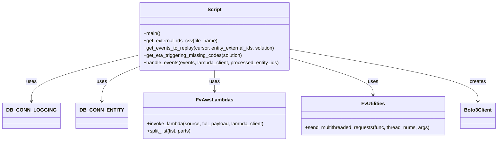

# Diagram: shipment_core/shipment_service/shipment_service/eta/scripts/replay_vin_etas_from_csv.py


> Auto-generated by Obscura crawlers

## Diagram 1



### SVG

<svg id="container" width="1579.5859375" xmlns="http://www.w3.org/2000/svg" class="classDiagram" height="462" viewBox="0 0 1579.5859375 462" role="graphics-document document" aria-roledescription="class"><style>#container{font-family:"trebuchet ms",verdana,arial,sans-serif;font-size:16px;fill:#333;}@keyframes edge-animation-frame{from{stroke-dashoffset:0;}}@keyframes dash{to{stroke-dashoffset:0;}}#container .edge-animation-slow{stroke-dasharray:9,5!important;stroke-dashoffset:900;animation:dash 50s linear infinite;stroke-linecap:round;}#container .edge-animation-fast{stroke-dasharray:9,5!important;stroke-dashoffset:900;animation:dash 20s linear infinite;stroke-linecap:round;}#container .error-icon{fill:#552222;}#container .error-text{fill:#552222;stroke:#552222;}#container .edge-thickness-normal{stroke-width:1px;}#container .edge-thickness-thick{stroke-width:3.5px;}#container .edge-pattern-solid{stroke-dasharray:0;}#container .edge-thickness-invisible{stroke-width:0;fill:none;}#container .edge-pattern-dashed{stroke-dasharray:3;}#container .edge-pattern-dotted{stroke-dasharray:2;}#container .marker{fill:#333333;stroke:#333333;}#container .marker.cross{stroke:#333333;}#container svg{font-family:"trebuchet ms",verdana,arial,sans-serif;font-size:16px;}#container p{margin:0;}#container g.classGroup text{fill:#9370DB;stroke:none;font-family:"trebuchet ms",verdana,arial,sans-serif;font-size:10px;}#container g.classGroup text .title{font-weight:bolder;}#container .nodeLabel,#container .edgeLabel{color:#131300;}#container .edgeLabel .label rect{fill:#ECECFF;}#container .label text{fill:#131300;}#container .labelBkg{background:#ECECFF;}#container .edgeLabel .label span{background:#ECECFF;}#container .classTitle{font-weight:bolder;}#container .node rect,#container .node circle,#container .node ellipse,#container .node polygon,#container .node path{fill:#ECECFF;stroke:#9370DB;stroke-width:1px;}#container .divider{stroke:#9370DB;stroke-width:1;}#container g.clickable{cursor:pointer;}#container g.classGroup rect{fill:#ECECFF;stroke:#9370DB;}#container g.classGroup line{stroke:#9370DB;stroke-width:1;}#container .classLabel .box{stroke:none;stroke-width:0;fill:#ECECFF;opacity:0.5;}#container .classLabel .label{fill:#9370DB;font-size:10px;}#container .relation{stroke:#333333;stroke-width:1;fill:none;}#container .dashed-line{stroke-dasharray:3;}#container .dotted-line{stroke-dasharray:1 2;}#container #compositionStart,#container .composition{fill:#333333!important;stroke:#333333!important;stroke-width:1;}#container #compositionEnd,#container .composition{fill:#333333!important;stroke:#333333!important;stroke-width:1;}#container #dependencyStart,#container .dependency{fill:#333333!important;stroke:#333333!important;stroke-width:1;}#container #dependencyStart,#container .dependency{fill:#333333!important;stroke:#333333!important;stroke-width:1;}#container #extensionStart,#container .extension{fill:transparent!important;stroke:#333333!important;stroke-width:1;}#container #extensionEnd,#container .extension{fill:transparent!important;stroke:#333333!important;stroke-width:1;}#container #aggregationStart,#container .aggregation{fill:transparent!important;stroke:#333333!important;stroke-width:1;}#container #aggregationEnd,#container .aggregation{fill:transparent!important;stroke:#333333!important;stroke-width:1;}#container #lollipopStart,#container .lollipop{fill:#ECECFF!important;stroke:#333333!important;stroke-width:1;}#container #lollipopEnd,#container .lollipop{fill:#ECECFF!important;stroke:#333333!important;stroke-width:1;}#container .edgeTerminals{font-size:11px;line-height:initial;}#container .classTitleText{text-anchor:middle;font-size:18px;fill:#333;}#container .label-icon{display:inline-block;height:1em;overflow:visible;vertical-align:-0.125em;}#container .node .label-icon path{fill:currentColor;stroke:revert;stroke-width:revert;}#container :root{--mermaid-font-family:"trebuchet ms",verdana,arial,sans-serif;}</style><g><defs><marker id="container_class-aggregationStart" class="marker aggregation class" refX="18" refY="7" markerWidth="190" markerHeight="240" orient="auto"><path d="M 18,7 L9,13 L1,7 L9,1 Z"></path></marker></defs><defs><marker id="container_class-aggregationEnd" class="marker aggregation class" refX="1" refY="7" markerWidth="20" markerHeight="28" orient="auto"><path d="M 18,7 L9,13 L1,7 L9,1 Z"></path></marker></defs><defs><marker id="container_class-extensionStart" class="marker extension class" refX="18" refY="7" markerWidth="190" markerHeight="240" orient="auto"><path d="M 1,7 L18,13 V 1 Z"></path></marker></defs><defs><marker id="container_class-extensionEnd" class="marker extension class" refX="1" refY="7" markerWidth="20" markerHeight="28" orient="auto"><path d="M 1,1 V 13 L18,7 Z"></path></marker></defs><defs><marker id="container_class-compositionStart" class="marker composition class" refX="18" refY="7" markerWidth="190" markerHeight="240" orient="auto"><path d="M 18,7 L9,13 L1,7 L9,1 Z"></path></marker></defs><defs><marker id="container_class-compositionEnd" class="marker composition class" refX="1" refY="7" markerWidth="20" markerHeight="28" orient="auto"><path d="M 18,7 L9,13 L1,7 L9,1 Z"></path></marker></defs><defs><marker id="container_class-dependencyStart" class="marker dependency class" refX="6" refY="7" markerWidth="190" markerHeight="240" orient="auto"><path d="M 5,7 L9,13 L1,7 L9,1 Z"></path></marker></defs><defs><marker id="container_class-dependencyEnd" class="marker dependency class" refX="13" refY="7" markerWidth="20" markerHeight="28" orient="auto"><path d="M 18,7 L9,13 L14,7 L9,1 Z"></path></marker></defs><defs><marker id="container_class-lollipopStart" class="marker lollipop class" refX="13" refY="7" markerWidth="190" markerHeight="240" orient="auto"><circle stroke="black" fill="transparent" cx="7" cy="7" r="6"></circle></marker></defs><defs><marker id="container_class-lollipopEnd" class="marker lollipop class" refX="1" refY="7" markerWidth="190" markerHeight="240" orient="auto"><circle stroke="black" fill="transparent" cx="7" cy="7" r="6"></circle></marker></defs><g class="root"><g class="clusters"></g><g class="edgePaths"><path d="M413.047,182.981L359.37,196.984C305.693,210.987,198.339,238.994,144.661,263.664C90.984,288.333,90.984,309.667,90.984,320.333L90.984,331" id="id_Script_DB_CONN_LOGGING_1" class="edge-thickness-normal edge-pattern-solid relation" style=";;;" data-edge="true" data-et="edge" data-id="id_Script_DB_CONN_LOGGING_1" data-points="W3sieCI6NDEzLjA0Njg3NSwieSI6MTgyLjk4MTE4ODg0ODI2NDV9LHsieCI6OTAuOTg0Mzc1LCJ5IjoyNjd9LHsieCI6OTAuOTg0Mzc1LCJ5IjozMzd9XQ==" marker-end="url(#container_class-dependencyEnd)"></path><path d="M413.047,220.243L394.169,228.036C375.292,235.829,337.536,251.414,318.659,269.874C299.781,288.333,299.781,309.667,299.781,320.333L299.781,331" id="id_Script_DB_CONN_ENTITY_2" class="edge-thickness-normal edge-pattern-solid relation" style=";;;" data-edge="true" data-et="edge" data-id="id_Script_DB_CONN_ENTITY_2" data-points="W3sieCI6NDEzLjA0Njg3NSwieSI6MjIwLjI0Mjk1ODc4MjMxODh9LHsieCI6Mjk5Ljc4MTI1LCJ5IjoyNjd9LHsieCI6Mjk5Ljc4MTI1LCJ5IjozMzd9XQ==" marker-end="url(#container_class-dependencyEnd)"></path><path d="M658.301,230L658.301,236.167C658.301,242.333,658.301,254.667,658.301,266C658.301,277.333,658.301,287.667,658.301,292.833L658.301,298" id="id_Script_FvAwsLambdas_3" class="edge-thickness-normal edge-pattern-solid relation" style=";;;" data-edge="true" data-et="edge" data-id="id_Script_FvAwsLambdas_3" data-points="W3sieCI6NjU4LjMwMDc4MTI1LCJ5IjoyMzB9LHsieCI6NjU4LjMwMDc4MTI1LCJ5IjoyNjd9LHsieCI6NjU4LjMwMDc4MTI1LCJ5IjozMDR9XQ==" marker-end="url(#container_class-dependencyEnd)"></path><path d="M903.555,189.005L949.095,202.005C994.635,215.004,1085.716,241.002,1131.257,261.168C1176.797,281.333,1176.797,295.667,1176.797,302.833L1176.797,310" id="id_Script_FvUtilities_4" class="edge-thickness-normal edge-pattern-solid relation" style=";;;" data-edge="true" data-et="edge" data-id="id_Script_FvUtilities_4" data-points="W3sieCI6OTAzLjU1NDY4NzUsInkiOjE4OS4wMDU0OTk2Nzk4MTMxN30seyJ4IjoxMTc2Ljc5Njg3NSwieSI6MjY3fSx7IngiOjExNzYuNzk2ODc1LCJ5IjozMTZ9XQ==" marker-end="url(#container_class-dependencyEnd)"></path><path d="M903.555,161.266L1005.81,178.888C1108.065,196.511,1312.576,231.755,1414.831,260.044C1517.086,288.333,1517.086,309.667,1517.086,320.333L1517.086,331" id="id_Script_Boto3Client_5" class="edge-thickness-normal edge-pattern-solid relation" style=";;;" data-edge="true" data-et="edge" data-id="id_Script_Boto3Client_5" data-points="W3sieCI6OTAzLjU1NDY4NzUsInkiOjE2MS4yNjYxOTE3OTUyNzc2OH0seyJ4IjoxNTE3LjA4NTkzNzUsInkiOjI2N30seyJ4IjoxNTE3LjA4NTkzNzUsInkiOjMzN31d" marker-end="url(#container_class-dependencyEnd)"></path></g><g class="edgeLabels"><g class="edgeLabel" transform="translate(90.984375, 267)"><g class="label" data-id="id_Script_DB_CONN_LOGGING_1" transform="translate(-16.4921875, -12)"><foreignObject width="32.984375" height="24"><div xmlns="http://www.w3.org/1999/xhtml" class="labelBkg" style="display: table-cell; white-space: nowrap; line-height: 1.5; max-width: 200px; text-align: center;"><span class="edgeLabel"><p>uses</p></span></div></foreignObject></g></g><g class="edgeLabel" transform="translate(299.78125, 267)"><g class="label" data-id="id_Script_DB_CONN_ENTITY_2" transform="translate(-16.4921875, -12)"><foreignObject width="32.984375" height="24"><div xmlns="http://www.w3.org/1999/xhtml" class="labelBkg" style="display: table-cell; white-space: nowrap; line-height: 1.5; max-width: 200px; text-align: center;"><span class="edgeLabel"><p>uses</p></span></div></foreignObject></g></g><g class="edgeLabel" transform="translate(658.30078125, 267)"><g class="label" data-id="id_Script_FvAwsLambdas_3" transform="translate(-16.4921875, -12)"><foreignObject width="32.984375" height="24"><div xmlns="http://www.w3.org/1999/xhtml" class="labelBkg" style="display: table-cell; white-space: nowrap; line-height: 1.5; max-width: 200px; text-align: center;"><span class="edgeLabel"><p>uses</p></span></div></foreignObject></g></g><g class="edgeLabel" transform="translate(1176.796875, 267)"><g class="label" data-id="id_Script_FvUtilities_4" transform="translate(-16.4921875, -12)"><foreignObject width="32.984375" height="24"><div xmlns="http://www.w3.org/1999/xhtml" class="labelBkg" style="display: table-cell; white-space: nowrap; line-height: 1.5; max-width: 200px; text-align: center;"><span class="edgeLabel"><p>uses</p></span></div></foreignObject></g></g><g class="edgeLabel" transform="translate(1517.0859375, 267)"><g class="label" data-id="id_Script_Boto3Client_5" transform="translate(-26.171875, -12)"><foreignObject width="52.34375" height="24"><div xmlns="http://www.w3.org/1999/xhtml" class="labelBkg" style="display: table-cell; white-space: nowrap; line-height: 1.5; max-width: 200px; text-align: center;"><span class="edgeLabel"><p>creates</p></span></div></foreignObject></g></g></g><g class="nodes"><g class="node default" id="classId-Script-0" transform="translate(658.30078125, 119)"><g class="basic label-container"><path d="M-245.25390625 -111 L245.25390625 -111 L245.25390625 111 L-245.25390625 111" stroke="none" stroke-width="0" fill="#ECECFF" style=""></path><path d="M-245.25390625 -111 C-124.79809386346015 -111, -4.342281476920306 -111, 245.25390625 -111 M-245.25390625 -111 C-122.2887581287448 -111, 0.6763899925103942 -111, 245.25390625 -111 M245.25390625 -111 C245.25390625 -38.74619950225966, 245.25390625 33.507600995480686, 245.25390625 111 M245.25390625 -111 C245.25390625 -45.44017377079737, 245.25390625 20.119652458405255, 245.25390625 111 M245.25390625 111 C144.49230808656966 111, 43.73070992313936 111, -245.25390625 111 M245.25390625 111 C131.40752800583624 111, 17.56114976167251 111, -245.25390625 111 M-245.25390625 111 C-245.25390625 40.15044010619353, -245.25390625 -30.699119787612943, -245.25390625 -111 M-245.25390625 111 C-245.25390625 35.894633221624346, -245.25390625 -39.21073355675131, -245.25390625 -111" stroke="#9370DB" stroke-width="1.3" fill="none" stroke-dasharray="0 0" style=""></path></g><g class="annotation-group text" transform="translate(0, -87)"></g><g class="label-group text" transform="translate(-21.7421875, -87)"><g class="label" style="font-weight: bolder" transform="translate(0,-12)"><foreignObject width="43.484375" height="24"><div xmlns="http://www.w3.org/1999/xhtml" style="display: table-cell; white-space: nowrap; line-height: 1.5; max-width: 93px; text-align: center;"><span class="nodeLabel markdown-node-label" style=""><p>Script</p></span></div></foreignObject></g></g><g class="members-group text" transform="translate(-233.25390625, -39)"></g><g class="methods-group text" transform="translate(-233.25390625, -9)"><g class="label" style="" transform="translate(0,-12)"><foreignObject width="54.65625" height="24"><div xmlns="http://www.w3.org/1999/xhtml" style="display: table-cell; white-space: nowrap; line-height: 1.5; max-width: 112px; text-align: center;"><span class="nodeLabel markdown-node-label" style=""><p>+main()</p></span></div></foreignObject></g><g class="label" style="" transform="translate(0,12)"><foreignObject width="239.609375" height="24"><div xmlns="http://www.w3.org/1999/xhtml" style="display: table-cell; white-space: nowrap; line-height: 1.5; max-width: 297px; text-align: center;"><span class="nodeLabel markdown-node-label" style=""><p>+get_external_ids_csv(file_name)</p></span></div></foreignObject></g><g class="label" style="" transform="translate(0,36)"><foreignObject width="431.296875" height="24"><div xmlns="http://www.w3.org/1999/xhtml" style="display: table-cell; white-space: nowrap; line-height: 1.5; max-width: 489px; text-align: center;"><span class="nodeLabel markdown-node-label" style=""><p>+get_events_to_replay(cursor, entity_external_ids, solution)</p></span></div></foreignObject></g><g class="label" style="" transform="translate(0,60)"><foreignObject width="323.875" height="24"><div xmlns="http://www.w3.org/1999/xhtml" style="display: table-cell; white-space: nowrap; line-height: 1.5; max-width: 381px; text-align: center;"><span class="nodeLabel markdown-node-label" style=""><p>+get_eta_triggering_missing_codes(solution)</p></span></div></foreignObject></g><g class="label" style="" transform="translate(0,84)"><foreignObject width="444.765625" height="24"><div xmlns="http://www.w3.org/1999/xhtml" style="display: table-cell; white-space: nowrap; line-height: 1.5; max-width: 502px; text-align: center;"><span class="nodeLabel markdown-node-label" style=""><p>+handle_events(events, lambda_client, processed_entity_ids)</p></span></div></foreignObject></g></g><g class="divider" style=""><path d="M-245.25390625 -63 C-101.90163272107219 -63, 41.45064080785562 -63, 245.25390625 -63 M-245.25390625 -63 C-129.8391900252384 -63, -14.424473800476761 -63, 245.25390625 -63" stroke="#9370DB" stroke-width="1.3" fill="none" stroke-dasharray="0 0" style=""></path></g><g class="divider" style=""><path d="M-245.25390625 -39 C-107.92847162771557 -39, 29.396962994568867 -39, 245.25390625 -39 M-245.25390625 -39 C-124.81520902476431 -39, -4.376511799528629 -39, 245.25390625 -39" stroke="#9370DB" stroke-width="1.3" fill="none" stroke-dasharray="0 0" style=""></path></g></g><g class="node default" id="classId-DB_CONN_LOGGING-1" transform="translate(90.984375, 379)"><g class="basic label-container"><path d="M-82.984375 -42 L82.984375 -42 L82.984375 42 L-82.984375 42" stroke="none" stroke-width="0" fill="#ECECFF" style=""></path><path d="M-82.984375 -42 C-36.57484186775174 -42, 9.834691264496513 -42, 82.984375 -42 M-82.984375 -42 C-41.95845361307123 -42, -0.932532226142456 -42, 82.984375 -42 M82.984375 -42 C82.984375 -9.320086687584308, 82.984375 23.359826624831385, 82.984375 42 M82.984375 -42 C82.984375 -14.874964860104548, 82.984375 12.250070279790904, 82.984375 42 M82.984375 42 C34.591125220344416 42, -13.802124559311167 42, -82.984375 42 M82.984375 42 C30.68509676998943 42, -21.614181460021143 42, -82.984375 42 M-82.984375 42 C-82.984375 14.909917367157071, -82.984375 -12.180165265685858, -82.984375 -42 M-82.984375 42 C-82.984375 16.823525398878186, -82.984375 -8.352949202243629, -82.984375 -42" stroke="#9370DB" stroke-width="1.3" fill="none" stroke-dasharray="0 0" style=""></path></g><g class="annotation-group text" transform="translate(0, -18)"></g><g class="label-group text" transform="translate(-70.984375, -18)"><g class="label" style="font-weight: bolder" transform="translate(0,-12)"><foreignObject width="141.96875" height="24"><div xmlns="http://www.w3.org/1999/xhtml" style="display: table-cell; white-space: nowrap; line-height: 1.5; max-width: 192px; text-align: center;"><span class="nodeLabel markdown-node-label" style=""><p>DB_CONN_LOGGING</p></span></div></foreignObject></g></g><g class="members-group text" transform="translate(-70.984375, 30)"></g><g class="methods-group text" transform="translate(-70.984375, 60)"></g><g class="divider" style=""><path d="M-82.984375 6 C-43.398044453463086 6, -3.8117139069261725 6, 82.984375 6 M-82.984375 6 C-36.519458699338024 6, 9.945457601323952 6, 82.984375 6" stroke="#9370DB" stroke-width="1.3" fill="none" stroke-dasharray="0 0" style=""></path></g><g class="divider" style=""><path d="M-82.984375 24 C-49.611496949365 24, -16.238618898729996 24, 82.984375 24 M-82.984375 24 C-19.019465295163798 24, 44.945444409672405 24, 82.984375 24" stroke="#9370DB" stroke-width="1.3" fill="none" stroke-dasharray="0 0" style=""></path></g></g><g class="node default" id="classId-DB_CONN_ENTITY-2" transform="translate(299.78125, 379)"><g class="basic label-container"><path d="M-75.8125 -42 L75.8125 -42 L75.8125 42 L-75.8125 42" stroke="none" stroke-width="0" fill="#ECECFF" style=""></path><path d="M-75.8125 -42 C-26.532824427411057 -42, 22.746851145177885 -42, 75.8125 -42 M-75.8125 -42 C-41.04538296367428 -42, -6.278265927348556 -42, 75.8125 -42 M75.8125 -42 C75.8125 -23.94748798421674, 75.8125 -5.894975968433478, 75.8125 42 M75.8125 -42 C75.8125 -10.767071588867456, 75.8125 20.46585682226509, 75.8125 42 M75.8125 42 C15.577627451264263 42, -44.657245097471474 42, -75.8125 42 M75.8125 42 C37.74978254549024 42, -0.3129349090195177 42, -75.8125 42 M-75.8125 42 C-75.8125 19.417571043710446, -75.8125 -3.1648579125791088, -75.8125 -42 M-75.8125 42 C-75.8125 23.44981048987693, -75.8125 4.899620979753863, -75.8125 -42" stroke="#9370DB" stroke-width="1.3" fill="none" stroke-dasharray="0 0" style=""></path></g><g class="annotation-group text" transform="translate(0, -18)"></g><g class="label-group text" transform="translate(-63.8125, -18)"><g class="label" style="font-weight: bolder" transform="translate(0,-12)"><foreignObject width="127.625" height="24"><div xmlns="http://www.w3.org/1999/xhtml" style="display: table-cell; white-space: nowrap; line-height: 1.5; max-width: 177px; text-align: center;"><span class="nodeLabel markdown-node-label" style=""><p>DB_CONN_ENTITY</p></span></div></foreignObject></g></g><g class="members-group text" transform="translate(-63.8125, 30)"></g><g class="methods-group text" transform="translate(-63.8125, 60)"></g><g class="divider" style=""><path d="M-75.8125 6 C-31.06294693105817 6, 13.686606137883658 6, 75.8125 6 M-75.8125 6 C-38.49762127451511 6, -1.1827425490302232 6, 75.8125 6" stroke="#9370DB" stroke-width="1.3" fill="none" stroke-dasharray="0 0" style=""></path></g><g class="divider" style=""><path d="M-75.8125 24 C-28.76684562771544 24, 18.27880874456912 24, 75.8125 24 M-75.8125 24 C-30.819166722075757 24, 14.174166555848487 24, 75.8125 24" stroke="#9370DB" stroke-width="1.3" fill="none" stroke-dasharray="0 0" style=""></path></g></g><g class="node default" id="classId-FvAwsLambdas-3" transform="translate(658.30078125, 379)"><g class="basic label-container"><path d="M-232.70703125 -75 L232.70703125 -75 L232.70703125 75 L-232.70703125 75" stroke="none" stroke-width="0" fill="#ECECFF" style=""></path><path d="M-232.70703125 -75 C-125.67671399566765 -75, -18.64639674133531 -75, 232.70703125 -75 M-232.70703125 -75 C-117.33035411329247 -75, -1.9536769765849442 -75, 232.70703125 -75 M232.70703125 -75 C232.70703125 -17.96968334946321, 232.70703125 39.06063330107358, 232.70703125 75 M232.70703125 -75 C232.70703125 -29.804848264087, 232.70703125 15.390303471826002, 232.70703125 75 M232.70703125 75 C112.20853523220627 75, -8.289960785587454 75, -232.70703125 75 M232.70703125 75 C66.82667366544266 75, -99.05368391911469 75, -232.70703125 75 M-232.70703125 75 C-232.70703125 16.692950844325665, -232.70703125 -41.61409831134867, -232.70703125 -75 M-232.70703125 75 C-232.70703125 39.46018956659827, -232.70703125 3.9203791331965334, -232.70703125 -75" stroke="#9370DB" stroke-width="1.3" fill="none" stroke-dasharray="0 0" style=""></path></g><g class="annotation-group text" transform="translate(0, -51)"></g><g class="label-group text" transform="translate(-55.2109375, -51)"><g class="label" style="font-weight: bolder" transform="translate(0,-12)"><foreignObject width="110.421875" height="24"><div xmlns="http://www.w3.org/1999/xhtml" style="display: table-cell; white-space: nowrap; line-height: 1.5; max-width: 159px; text-align: center;"><span class="nodeLabel markdown-node-label" style=""><p>FvAwsLambdas</p></span></div></foreignObject></g></g><g class="members-group text" transform="translate(-220.70703125, -3)"></g><g class="methods-group text" transform="translate(-220.70703125, 27)"><g class="label" style="" transform="translate(0,-12)"><foreignObject width="386.203125" height="24"><div xmlns="http://www.w3.org/1999/xhtml" style="display: table-cell; white-space: nowrap; line-height: 1.5; max-width: 444px; text-align: center;"><span class="nodeLabel markdown-node-label" style=""><p>+invoke_lambda(source, full_payload, lambda_client)</p></span></div></foreignObject></g><g class="label" style="" transform="translate(0,12)"><foreignObject width="148.984375" height="24"><div xmlns="http://www.w3.org/1999/xhtml" style="display: table-cell; white-space: nowrap; line-height: 1.5; max-width: 206px; text-align: center;"><span class="nodeLabel markdown-node-label" style=""><p>+split_list(list, parts)</p></span></div></foreignObject></g></g><g class="divider" style=""><path d="M-232.70703125 -27 C-53.638288771859095 -27, 125.43045370628181 -27, 232.70703125 -27 M-232.70703125 -27 C-81.9729610661243 -27, 68.7611091177514 -27, 232.70703125 -27" stroke="#9370DB" stroke-width="1.3" fill="none" stroke-dasharray="0 0" style=""></path></g><g class="divider" style=""><path d="M-232.70703125 -3 C-87.129456575435 -3, 58.44811809913 -3, 232.70703125 -3 M-232.70703125 -3 C-95.62319825194189 -3, 41.46063474611623 -3, 232.70703125 -3" stroke="#9370DB" stroke-width="1.3" fill="none" stroke-dasharray="0 0" style=""></path></g></g><g class="node default" id="classId-FvUtilities-4" transform="translate(1176.796875, 379)"><g class="basic label-container"><path d="M-235.7890625 -63 L235.7890625 -63 L235.7890625 63 L-235.7890625 63" stroke="none" stroke-width="0" fill="#ECECFF" style=""></path><path d="M-235.7890625 -63 C-82.74813362327251 -63, 70.29279525345498 -63, 235.7890625 -63 M-235.7890625 -63 C-109.40884332912297 -63, 16.971375841754053 -63, 235.7890625 -63 M235.7890625 -63 C235.7890625 -26.50468757869932, 235.7890625 9.990624842601363, 235.7890625 63 M235.7890625 -63 C235.7890625 -26.08733941863204, 235.7890625 10.825321162735918, 235.7890625 63 M235.7890625 63 C58.921318057124324 63, -117.94642638575135 63, -235.7890625 63 M235.7890625 63 C90.16605357543983 63, -55.456955349120335 63, -235.7890625 63 M-235.7890625 63 C-235.7890625 32.54201923433111, -235.7890625 2.0840384686622073, -235.7890625 -63 M-235.7890625 63 C-235.7890625 24.659046449344864, -235.7890625 -13.681907101310273, -235.7890625 -63" stroke="#9370DB" stroke-width="1.3" fill="none" stroke-dasharray="0 0" style=""></path></g><g class="annotation-group text" transform="translate(0, -39)"></g><g class="label-group text" transform="translate(-36.53125, -39)"><g class="label" style="font-weight: bolder" transform="translate(0,-12)"><foreignObject width="73.0625" height="24"><div xmlns="http://www.w3.org/1999/xhtml" style="display: table-cell; white-space: nowrap; line-height: 1.5; max-width: 122px; text-align: center;"><span class="nodeLabel markdown-node-label" style=""><p>FvUtilities</p></span></div></foreignObject></g></g><g class="members-group text" transform="translate(-223.7890625, 9)"></g><g class="methods-group text" transform="translate(-223.7890625, 39)"><g class="label" style="" transform="translate(0,-12)"><foreignObject width="411.046875" height="24"><div xmlns="http://www.w3.org/1999/xhtml" style="display: table-cell; white-space: nowrap; line-height: 1.5; max-width: 468px; text-align: center;"><span class="nodeLabel markdown-node-label" style=""><p>+send_multithreaded_requests(func, thread_nums, args)</p></span></div></foreignObject></g></g><g class="divider" style=""><path d="M-235.7890625 -15 C-83.81778403694105 -15, 68.1534944261179 -15, 235.7890625 -15 M-235.7890625 -15 C-92.14180702798379 -15, 51.505448444032425 -15, 235.7890625 -15" stroke="#9370DB" stroke-width="1.3" fill="none" stroke-dasharray="0 0" style=""></path></g><g class="divider" style=""><path d="M-235.7890625 9 C-51.77279596973119 9, 132.24347056053762 9, 235.7890625 9 M-235.7890625 9 C-138.77545575788287 9, -41.761849015765705 9, 235.7890625 9" stroke="#9370DB" stroke-width="1.3" fill="none" stroke-dasharray="0 0" style=""></path></g></g><g class="node default" id="classId-Boto3Client-5" transform="translate(1517.0859375, 379)"><g class="basic label-container"><path d="M-54.5 -42 L54.5 -42 L54.5 42 L-54.5 42" stroke="none" stroke-width="0" fill="#ECECFF" style=""></path><path d="M-54.5 -42 C-19.99396737868758 -42, 14.512065242624843 -42, 54.5 -42 M-54.5 -42 C-23.05934550802346 -42, 8.381308983953083 -42, 54.5 -42 M54.5 -42 C54.5 -21.167542035028266, 54.5 -0.3350840700565314, 54.5 42 M54.5 -42 C54.5 -14.668867054564146, 54.5 12.662265890871709, 54.5 42 M54.5 42 C22.41867274418715 42, -9.662654511625703 42, -54.5 42 M54.5 42 C22.64292170876651 42, -9.214156582466977 42, -54.5 42 M-54.5 42 C-54.5 20.755647720278652, -54.5 -0.4887045594426951, -54.5 -42 M-54.5 42 C-54.5 20.24204131170899, -54.5 -1.515917376582017, -54.5 -42" stroke="#9370DB" stroke-width="1.3" fill="none" stroke-dasharray="0 0" style=""></path></g><g class="annotation-group text" transform="translate(0, -18)"></g><g class="label-group text" transform="translate(-42.5, -18)"><g class="label" style="font-weight: bolder" transform="translate(0,-12)"><foreignObject width="85" height="24"><div xmlns="http://www.w3.org/1999/xhtml" style="display: table-cell; white-space: nowrap; line-height: 1.5; max-width: 134px; text-align: center;"><span class="nodeLabel markdown-node-label" style=""><p>Boto3Client</p></span></div></foreignObject></g></g><g class="members-group text" transform="translate(-42.5, 30)"></g><g class="methods-group text" transform="translate(-42.5, 60)"></g><g class="divider" style=""><path d="M-54.5 6 C-32.4754476543655 6, -10.450895308731006 6, 54.5 6 M-54.5 6 C-19.275983215846544 6, 15.948033568306911 6, 54.5 6" stroke="#9370DB" stroke-width="1.3" fill="none" stroke-dasharray="0 0" style=""></path></g><g class="divider" style=""><path d="M-54.5 24 C-19.156648675463707 24, 16.186702649072586 24, 54.5 24 M-54.5 24 C-30.90520742140313 24, -7.31041484280626 24, 54.5 24" stroke="#9370DB" stroke-width="1.3" fill="none" stroke-dasharray="0 0" style=""></path></g></g></g></g></g></svg>

## Diagram 2

```mermaid
flowchart TD
    Start[Start script]
    ReadCSV[Read CSV (get_external_ids_csv)]
    ForEachSolution[For each solution in CSV]
    SplitIDs[Split VINs into threads]
    ForEachChunk[For each chunk of external_ids]
    QueryDB[Query DB (get_events_to_replay)]
    BuildArgs[Build events/lambda_client/processed_ids args]
    SendThreads[send_multithreaded_requests(handle_events)]
    HandleEvent[handle_events -> for each event:\nprepare payload -> invoke_lambda]
    InvokeLambda[Invoke AWS Lambda (fv.aws.lambdas.invoke_lambda)]
    ErrorMark[Mark processed_entity_ids on failure]
    End[End]

    Start --> ReadCSV
    ReadCSV --> ForEachSolution
    ForEachSolution --> SplitIDs
    SplitIDs --> ForEachChunk
    ForEachChunk --> QueryDB
    QueryDB --> BuildArgs
    BuildArgs --> SendThreads
    SendThreads --> HandleEvent
    HandleEvent --> InvokeLambda
    InvokeLambda -->|statusCode != 200| ErrorMark
    InvokeLambda -->|statusCode == 200| ForEachChunk
    ErrorMark --> ForEachChunk
    ForEachChunk --> End
```

> SVG rendering failed for this diagram.
