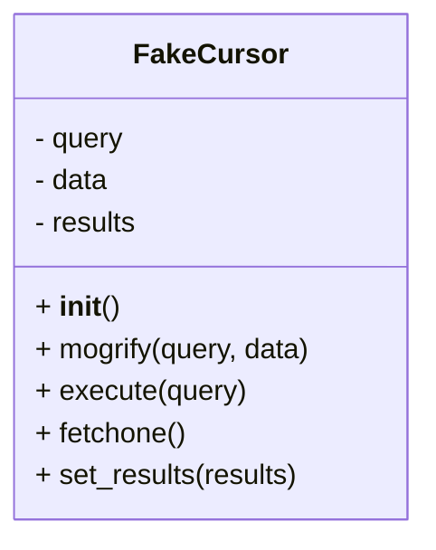

# Diagram: shipment_core/shipment_service/shipment_service/eta/tests/fake_implementations/FakeCursor.py

> Auto-generated by Obscura crawlers

## Mermaid

### SVG

<svg id="container" width="240.0625" xmlns="http://www.w3.org/2000/svg" class="classDiagram" height="304" viewBox="0 0 240.0625 304" role="graphics-document document" aria-roledescription="class"><g><defs><marker id="container_class-aggregationStart" class="marker aggregation class" refX="18" refY="7" markerWidth="190" markerHeight="240" orient="auto"><path d="M 18,7 L9,13 L1,7 L9,1 Z"></path></marker></defs><defs><marker id="container_class-aggregationEnd" class="marker aggregation class" refX="1" refY="7" markerWidth="20" markerHeight="28" orient="auto"><path d="M 18,7 L9,13 L1,7 L9,1 Z"></path></marker></defs><defs><marker id="container_class-extensionStart" class="marker extension class" refX="18" refY="7" markerWidth="190" markerHeight="240" orient="auto"><path d="M 1,7 L18,13 V 1 Z"></path></marker></defs><defs><marker id="container_class-extensionEnd" class="marker extension class" refX="1" refY="7" markerWidth="20" markerHeight="28" orient="auto"><path d="M 1,1 V 13 L18,7 Z"></path></marker></defs><defs><marker id="container_class-compositionStart" class="marker composition class" refX="18" refY="7" markerWidth="190" markerHeight="240" orient="auto"><path d="M 18,7 L9,13 L1,7 L9,1 Z"></path></marker></defs><defs><marker id="container_class-compositionEnd" class="marker composition class" refX="1" refY="7" markerWidth="20" markerHeight="28" orient="auto"><path d="M 18,7 L9,13 L1,7 L9,1 Z"></path></marker></defs><defs><marker id="container_class-dependencyStart" class="marker dependency class" refX="6" refY="7" markerWidth="190" markerHeight="240" orient="auto"><path d="M 5,7 L9,13 L1,7 L9,1 Z"></path></marker></defs><defs><marker id="container_class-dependencyEnd" class="marker dependency class" refX="13" refY="7" markerWidth="20" markerHeight="28" orient="auto"><path d="M 18,7 L9,13 L14,7 L9,1 Z"></path></marker></defs><defs><marker id="container_class-lollipopStart" class="marker lollipop class" refX="13" refY="7" markerWidth="190" markerHeight="240" orient="auto"><circle stroke="black" fill="transparent" cx="7" cy="7" r="6"></circle></marker></defs><defs><marker id="container_class-lollipopEnd" class="marker lollipop class" refX="1" refY="7" markerWidth="190" markerHeight="240" orient="auto"><circle stroke="black" fill="transparent" cx="7" cy="7" r="6"></circle></marker></defs><g class="root"><g class="clusters"></g><g class="edgePaths"></g><g class="edgeLabels"></g><g class="nodes"><g class="node default" id="classId-FakeCursor-0" transform="translate(120.03125, 152)"><g class="basic label-container"><path d="M-112.03125 -144 L112.03125 -144 L112.03125 144 L-112.03125 144" stroke="none" stroke-width="0" fill="#ECECFF" style=""></path><path d="M-112.03125 -144 C-39.156033303555944 -144, 33.71918339288811 -144, 112.03125 -144 M-112.03125 -144 C-64.77549438078199 -144, -17.51973876156397 -144, 112.03125 -144 M112.03125 -144 C112.03125 -50.86029126426267, 112.03125 42.27941747147466, 112.03125 144 M112.03125 -144 C112.03125 -79.86897047735609, 112.03125 -15.737940954712172, 112.03125 144 M112.03125 144 C28.78054215409132 144, -54.47016569181736 144, -112.03125 144 M112.03125 144 C55.335885175435486 144, -1.3594796491290282 144, -112.03125 144 M-112.03125 144 C-112.03125 83.19420286748985, -112.03125 22.388405734979713, -112.03125 -144 M-112.03125 144 C-112.03125 77.76207728940776, -112.03125 11.524154578815512, -112.03125 -144" stroke="#9370DB" stroke-width="1.3" fill="none" stroke-dasharray="0 0" style=""></path></g><g class="annotation-group text" transform="translate(0, -120)"></g><g class="label-group text" transform="translate(-40.4375, -120)"><g class="label" style="font-weight: bolder" transform="translate(0,-12)"><foreignObject width="80.875" height="24">

FakeCursor

</foreignObject></g></g><g class="members-group text" transform="translate(-100.03125, -72)"><g class="label" style="" transform="translate(0,-12)"><foreignObject width="52.34375" height="24">

- query

</foreignObject></g><g class="label" style="" transform="translate(0,12)"><foreignObject width="43.328125" height="24">

- data

</foreignObject></g><g class="label" style="" transform="translate(0,36)"><foreignObject width="59.828125" height="24">

- results

</foreignObject></g></g><g class="methods-group text" transform="translate(-100.03125, 24)"><g class="label" style="" transform="translate(0,-12)"><foreignObject width="47.046875" height="24">

+ <strong>init</strong>()

</foreignObject></g><g class="label" style="" transform="translate(0,12)"><foreignObject width="159.625" height="24">

+ mogrify(query, data)

</foreignObject></g><g class="label" style="" transform="translate(0,36)"><foreignObject width="120.21875" height="24">

+ execute(query)

</foreignObject></g><g class="label" style="" transform="translate(0,60)"><foreignObject width="86.515625" height="24">

+ fetchone()

</foreignObject></g><g class="label" style="" transform="translate(0,84)"><foreignObject width="151.15625" height="24">

+ set_results(results)

</foreignObject></g></g><g class="divider" style=""><path d="M-112.03125 -96 C-58.69577833808821 -96, -5.360306676176421 -96, 112.03125 -96 M-112.03125 -96 C-42.750656620522605 -96, 26.52993675895479 -96, 112.03125 -96" stroke="#9370DB" stroke-width="1.3" fill="none" stroke-dasharray="0 0" style=""></path></g><g class="divider" style=""><path d="M-112.03125 0 C-24.892932523042163 0, 62.245384953915675 0, 112.03125 0 M-112.03125 0 C-45.80378712238665 0, 20.423675755226697 0, 112.03125 0" stroke="#9370DB" stroke-width="1.3" fill="none" stroke-dasharray="0 0" style=""></path></g></g></g></g></g></svg>
