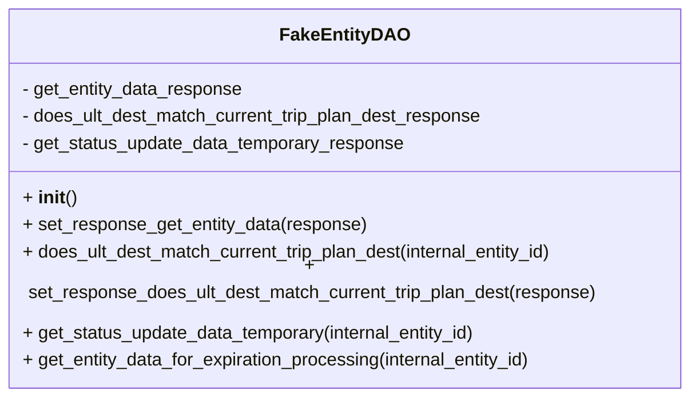

# Diagram: shipment_core/shipment_service/shipment_service/eta/tests/fake_implementations/fake_entity_dao.py

> Auto-generated by Obscura crawlers

## Mermaid

### SVG

<svg id="container" width="615.921875" xmlns="http://www.w3.org/2000/svg" class="classDiagram" height="328" viewBox="0 0 615.921875 328" role="graphics-document document" aria-roledescription="class"><g><defs><marker id="container_class-aggregationStart" class="marker aggregation class" refX="18" refY="7" markerWidth="190" markerHeight="240" orient="auto"><path d="M 18,7 L9,13 L1,7 L9,1 Z"></path></marker></defs><defs><marker id="container_class-aggregationEnd" class="marker aggregation class" refX="1" refY="7" markerWidth="20" markerHeight="28" orient="auto"><path d="M 18,7 L9,13 L1,7 L9,1 Z"></path></marker></defs><defs><marker id="container_class-extensionStart" class="marker extension class" refX="18" refY="7" markerWidth="190" markerHeight="240" orient="auto"><path d="M 1,7 L18,13 V 1 Z"></path></marker></defs><defs><marker id="container_class-extensionEnd" class="marker extension class" refX="1" refY="7" markerWidth="20" markerHeight="28" orient="auto"><path d="M 1,1 V 13 L18,7 Z"></path></marker></defs><defs><marker id="container_class-compositionStart" class="marker composition class" refX="18" refY="7" markerWidth="190" markerHeight="240" orient="auto"><path d="M 18,7 L9,13 L1,7 L9,1 Z"></path></marker></defs><defs><marker id="container_class-compositionEnd" class="marker composition class" refX="1" refY="7" markerWidth="20" markerHeight="28" orient="auto"><path d="M 18,7 L9,13 L1,7 L9,1 Z"></path></marker></defs><defs><marker id="container_class-dependencyStart" class="marker dependency class" refX="6" refY="7" markerWidth="190" markerHeight="240" orient="auto"><path d="M 5,7 L9,13 L1,7 L9,1 Z"></path></marker></defs><defs><marker id="container_class-dependencyEnd" class="marker dependency class" refX="13" refY="7" markerWidth="20" markerHeight="28" orient="auto"><path d="M 18,7 L9,13 L14,7 L9,1 Z"></path></marker></defs><defs><marker id="container_class-lollipopStart" class="marker lollipop class" refX="13" refY="7" markerWidth="190" markerHeight="240" orient="auto"><circle stroke="black" fill="transparent" cx="7" cy="7" r="6"></circle></marker></defs><defs><marker id="container_class-lollipopEnd" class="marker lollipop class" refX="1" refY="7" markerWidth="190" markerHeight="240" orient="auto"><circle stroke="black" fill="transparent" cx="7" cy="7" r="6"></circle></marker></defs><g class="root"><g class="clusters"></g><g class="edgePaths"></g><g class="edgeLabels"></g><g class="nodes"><g class="node default" id="classId-FakeEntityDAO-0" transform="translate(307.9609375, 164)"><g class="basic label-container"><path d="M-299.9609375 -156 L299.9609375 -156 L299.9609375 156 L-299.9609375 156" stroke="none" stroke-width="0" fill="#ECECFF" style=""></path><path d="M-299.9609375 -156 C-125.01966871728769 -156, 49.92160006542463 -156, 299.9609375 -156 M-299.9609375 -156 C-83.81384861505458 -156, 132.33324026989084 -156, 299.9609375 -156 M299.9609375 -156 C299.9609375 -53.32404581719156, 299.9609375 49.35190836561688, 299.9609375 156 M299.9609375 -156 C299.9609375 -53.70103821625456, 299.9609375 48.59792356749088, 299.9609375 156 M299.9609375 156 C160.96891189835722 156, 21.97688629671444 156, -299.9609375 156 M299.9609375 156 C74.0272556489524 156, -151.9064262020952 156, -299.9609375 156 M-299.9609375 156 C-299.9609375 49.73477653172546, -299.9609375 -56.53044693654908, -299.9609375 -156 M-299.9609375 156 C-299.9609375 93.13154365360977, -299.9609375 30.263087307219536, -299.9609375 -156" stroke="#9370DB" stroke-width="1.3" fill="none" stroke-dasharray="0 0" style=""></path></g><g class="annotation-group text" transform="translate(0, -132)"></g><g class="label-group text" transform="translate(-53.109375, -132)"><g class="label" style="font-weight: bolder" transform="translate(0,-12)"><foreignObject width="106.21875" height="24">

FakeEntityDAO

</foreignObject></g></g><g class="members-group text" transform="translate(-287.9609375, -84)"><g class="label" style="" transform="translate(0,-12)"><foreignObject width="198" height="24">

- get_entity_data_response

</foreignObject></g><g class="label" style="" transform="translate(0,12)"><foreignObject width="414.953125" height="24">

- does_ult_dest_match_current_trip_plan_dest_response

</foreignObject></g><g class="label" style="" transform="translate(0,36)"><foreignObject width="342.65625" height="24">

- get_status_update_data_temporary_response

</foreignObject></g></g><g class="methods-group text" transform="translate(-287.9609375, 12)"><g class="label" style="" transform="translate(0,-12)"><foreignObject width="47.046875" height="24">

+ <strong>init</strong>()

</foreignObject></g><g class="label" style="" transform="translate(0,12)"><foreignObject width="306.3125" height="24">

+ set_response_get_entity_data(response)

</foreignObject></g><g class="label" style="" transform="translate(0,36)"><foreignObject width="481.03125" height="24">

+ does_ult_dest_match_current_trip_plan_dest(internal_entity_id)

</foreignObject></g><g class="label" style="" transform="translate(0,60)"><foreignObject width="522.8125" height="24">

+ set_response_does_ult_dest_match_current_trip_plan_dest(response)

</foreignObject></g><g class="label" style="" transform="translate(0,84)"><foreignObject width="409.203125" height="24">

+ get_status_update_data_temporary(internal_entity_id)

</foreignObject></g><g class="label" style="" transform="translate(0,108)"><foreignObject width="459.09375" height="24">

+ get_entity_data_for_expiration_processing(internal_entity_id)

</foreignObject></g></g><g class="divider" style=""><path d="M-299.9609375 -108 C-167.06885728607745 -108, -34.17677707215489 -108, 299.9609375 -108 M-299.9609375 -108 C-116.17963562286246 -108, 67.60166625427507 -108, 299.9609375 -108" stroke="#9370DB" stroke-width="1.3" fill="none" stroke-dasharray="0 0" style=""></path></g><g class="divider" style=""><path d="M-299.9609375 -12 C-82.9697689450602 -12, 134.0213996098796 -12, 299.9609375 -12 M-299.9609375 -12 C-161.76705881273887 -12, -23.573180125477734 -12, 299.9609375 -12" stroke="#9370DB" stroke-width="1.3" fill="none" stroke-dasharray="0 0" style=""></path></g></g></g></g></g></svg>
