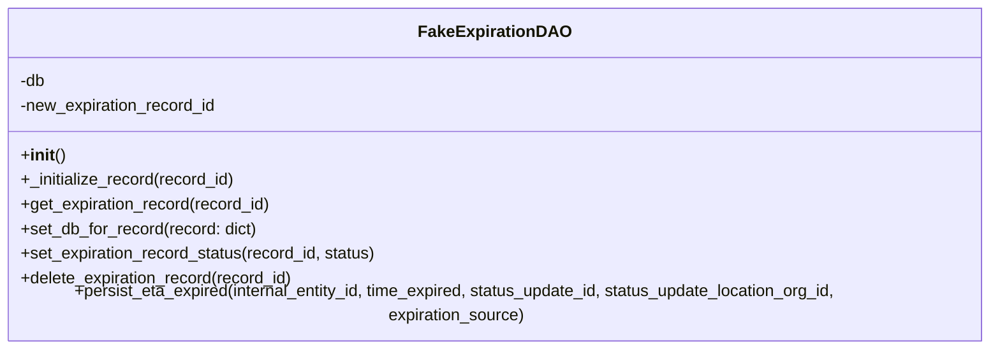

# Diagram: shipment_core/shipment_service/shipment_service/eta/tests/fake_implementations/fake_expiration_dao.py

> Auto-generated by Obscura crawlers

## Mermaid

### SVG

<svg id="container" width="1006" xmlns="http://www.w3.org/2000/svg" class="classDiagram" height="328" viewBox="0 0 1006 328" role="graphics-document document" aria-roledescription="class"><g><defs><marker id="container_class-aggregationStart" class="marker aggregation class" refX="18" refY="7" markerWidth="190" markerHeight="240" orient="auto"><path d="M 18,7 L9,13 L1,7 L9,1 Z"></path></marker></defs><defs><marker id="container_class-aggregationEnd" class="marker aggregation class" refX="1" refY="7" markerWidth="20" markerHeight="28" orient="auto"><path d="M 18,7 L9,13 L1,7 L9,1 Z"></path></marker></defs><defs><marker id="container_class-extensionStart" class="marker extension class" refX="18" refY="7" markerWidth="190" markerHeight="240" orient="auto"><path d="M 1,7 L18,13 V 1 Z"></path></marker></defs><defs><marker id="container_class-extensionEnd" class="marker extension class" refX="1" refY="7" markerWidth="20" markerHeight="28" orient="auto"><path d="M 1,1 V 13 L18,7 Z"></path></marker></defs><defs><marker id="container_class-compositionStart" class="marker composition class" refX="18" refY="7" markerWidth="190" markerHeight="240" orient="auto"><path d="M 18,7 L9,13 L1,7 L9,1 Z"></path></marker></defs><defs><marker id="container_class-compositionEnd" class="marker composition class" refX="1" refY="7" markerWidth="20" markerHeight="28" orient="auto"><path d="M 18,7 L9,13 L1,7 L9,1 Z"></path></marker></defs><defs><marker id="container_class-dependencyStart" class="marker dependency class" refX="6" refY="7" markerWidth="190" markerHeight="240" orient="auto"><path d="M 5,7 L9,13 L1,7 L9,1 Z"></path></marker></defs><defs><marker id="container_class-dependencyEnd" class="marker dependency class" refX="13" refY="7" markerWidth="20" markerHeight="28" orient="auto"><path d="M 18,7 L9,13 L14,7 L9,1 Z"></path></marker></defs><defs><marker id="container_class-lollipopStart" class="marker lollipop class" refX="13" refY="7" markerWidth="190" markerHeight="240" orient="auto"><circle stroke="black" fill="transparent" cx="7" cy="7" r="6"></circle></marker></defs><defs><marker id="container_class-lollipopEnd" class="marker lollipop class" refX="1" refY="7" markerWidth="190" markerHeight="240" orient="auto"><circle stroke="black" fill="transparent" cx="7" cy="7" r="6"></circle></marker></defs><g class="root"><g class="clusters"></g><g class="edgePaths"></g><g class="edgeLabels"></g><g class="nodes"><g class="node default" id="classId-FakeExpirationDAO-0" transform="translate(503, 164)"><g class="basic label-container"><path d="M-495 -156 L495 -156 L495 156 L-495 156" stroke="none" stroke-width="0" fill="#ECECFF" style=""></path><path d="M-495 -156 C-152.95783975494948 -156, 189.08432049010105 -156, 495 -156 M-495 -156 C-99.03101282569463 -156, 296.93797434861074 -156, 495 -156 M495 -156 C495 -69.27158219032384, 495 17.45683561935232, 495 156 M495 -156 C495 -88.31614716342983, 495 -20.632294326859665, 495 156 M495 156 C260.7943374202432 156, 26.588674840486362 156, -495 156 M495 156 C188.6036112001902 156, -117.79277759961963 156, -495 156 M-495 156 C-495 35.96609036597032, -495 -84.06781926805937, -495 -156 M-495 156 C-495 86.61549541892323, -495 17.230990837846463, -495 -156" stroke="#9370DB" stroke-width="1.3" fill="none" stroke-dasharray="0 0" style=""></path></g><g class="annotation-group text" transform="translate(0, -132)"></g><g class="label-group text" transform="translate(-69.109375, -132)"><g class="label" style="font-weight: bolder" transform="translate(0,-12)"><foreignObject width="138.21875" height="24">

FakeExpirationDAO

</foreignObject></g></g><g class="members-group text" transform="translate(-483, -84)"><g class="label" style="" transform="translate(0,-12)"><foreignObject width="25.53125" height="24">

-db

</foreignObject></g><g class="label" style="" transform="translate(0,12)"><foreignObject width="194.453125" height="24">

-new_expiration_record_id

</foreignObject></g></g><g class="methods-group text" transform="translate(-483, -12)"><g class="label" style="" transform="translate(0,-12)"><foreignObject width="42.796875" height="24">

+<strong>init</strong>()

</foreignObject></g><g class="label" style="" transform="translate(0,12)"><foreignObject width="210.53125" height="24">

+_initialize_record(record_id)

</foreignObject></g><g class="label" style="" transform="translate(0,36)"><foreignObject width="246.03125" height="24">

+get_expiration_record(record_id)

</foreignObject></g><g class="label" style="" transform="translate(0,60)"><foreignObject width="231.125" height="24">

+set_db_for_record(record: dict)

</foreignObject></g><g class="label" style="" transform="translate(0,84)"><foreignObject width="350.625" height="24">

+set_expiration_record_status(record_id, status)

</foreignObject></g><g class="label" style="" transform="translate(0,108)"><foreignObject width="269.015625" height="24">

+delete_expiration_record(record_id)

</foreignObject></g><g class="label" style="" transform="translate(0,132)"><foreignObject width="896.890625" height="24">

+persist_eta_expired(internal_entity_id, time_expired, status_update_id, status_update_location_org_id, expiration_source)

</foreignObject></g></g><g class="divider" style=""><path d="M-495 -108 C-194.9809130576669 -108, 105.03817388466621 -108, 495 -108 M-495 -108 C-238.44826211339728 -108, 18.103475773205446 -108, 495 -108" stroke="#9370DB" stroke-width="1.3" fill="none" stroke-dasharray="0 0" style=""></path></g><g class="divider" style=""><path d="M-495 -36 C-196.974983036908 -36, 101.05003392618403 -36, 495 -36 M-495 -36 C-219.68282780255362 -36, 55.634344394892764 -36, 495 -36" stroke="#9370DB" stroke-width="1.3" fill="none" stroke-dasharray="0 0" style=""></path></g></g></g></g></g></svg>
