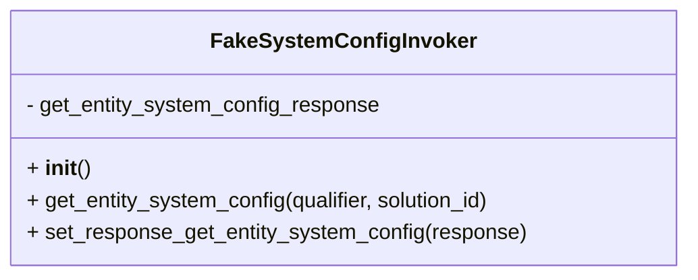

# Diagram: shipment_core/shipment_service/shipment_service/eta/tests/fake_implementations/fake_system_config_invoker.py

> Auto-generated by Obscura crawlers

## Mermaid

### SVG

<svg id="container" width="509.5234375" xmlns="http://www.w3.org/2000/svg" class="classDiagram" height="208" viewBox="0 0 509.5234375 208" role="graphics-document document" aria-roledescription="class"><g><defs><marker id="container_class-aggregationStart" class="marker aggregation class" refX="18" refY="7" markerWidth="190" markerHeight="240" orient="auto"><path d="M 18,7 L9,13 L1,7 L9,1 Z"></path></marker></defs><defs><marker id="container_class-aggregationEnd" class="marker aggregation class" refX="1" refY="7" markerWidth="20" markerHeight="28" orient="auto"><path d="M 18,7 L9,13 L1,7 L9,1 Z"></path></marker></defs><defs><marker id="container_class-extensionStart" class="marker extension class" refX="18" refY="7" markerWidth="190" markerHeight="240" orient="auto"><path d="M 1,7 L18,13 V 1 Z"></path></marker></defs><defs><marker id="container_class-extensionEnd" class="marker extension class" refX="1" refY="7" markerWidth="20" markerHeight="28" orient="auto"><path d="M 1,1 V 13 L18,7 Z"></path></marker></defs><defs><marker id="container_class-compositionStart" class="marker composition class" refX="18" refY="7" markerWidth="190" markerHeight="240" orient="auto"><path d="M 18,7 L9,13 L1,7 L9,1 Z"></path></marker></defs><defs><marker id="container_class-compositionEnd" class="marker composition class" refX="1" refY="7" markerWidth="20" markerHeight="28" orient="auto"><path d="M 18,7 L9,13 L1,7 L9,1 Z"></path></marker></defs><defs><marker id="container_class-dependencyStart" class="marker dependency class" refX="6" refY="7" markerWidth="190" markerHeight="240" orient="auto"><path d="M 5,7 L9,13 L1,7 L9,1 Z"></path></marker></defs><defs><marker id="container_class-dependencyEnd" class="marker dependency class" refX="13" refY="7" markerWidth="20" markerHeight="28" orient="auto"><path d="M 18,7 L9,13 L14,7 L9,1 Z"></path></marker></defs><defs><marker id="container_class-lollipopStart" class="marker lollipop class" refX="13" refY="7" markerWidth="190" markerHeight="240" orient="auto"><circle stroke="black" fill="transparent" cx="7" cy="7" r="6"></circle></marker></defs><defs><marker id="container_class-lollipopEnd" class="marker lollipop class" refX="1" refY="7" markerWidth="190" markerHeight="240" orient="auto"><circle stroke="black" fill="transparent" cx="7" cy="7" r="6"></circle></marker></defs><g class="root"><g class="clusters"></g><g class="edgePaths"></g><g class="edgeLabels"></g><g class="nodes"><g class="node default" id="classId-FakeSystemConfigInvoker-0" transform="translate(254.76171875, 104)"><g class="basic label-container"><path d="M-246.76171875 -96 L246.76171875 -96 L246.76171875 96 L-246.76171875 96" stroke="none" stroke-width="0" fill="#ECECFF" style=""></path><path d="M-246.76171875 -96 C-85.28335031526046 -96, 76.19501811947907 -96, 246.76171875 -96 M-246.76171875 -96 C-89.04809385794533 -96, 68.66553103410934 -96, 246.76171875 -96 M246.76171875 -96 C246.76171875 -20.046980511918434, 246.76171875 55.90603897616313, 246.76171875 96 M246.76171875 -96 C246.76171875 -19.529520618805293, 246.76171875 56.940958762389414, 246.76171875 96 M246.76171875 96 C96.0980919291774 96, -54.5655348916452 96, -246.76171875 96 M246.76171875 96 C99.51077999804258 96, -47.74015875391484 96, -246.76171875 96 M-246.76171875 96 C-246.76171875 45.95495541492641, -246.76171875 -4.090089170147181, -246.76171875 -96 M-246.76171875 96 C-246.76171875 46.03643901694824, -246.76171875 -3.9271219661035133, -246.76171875 -96" stroke="#9370DB" stroke-width="1.3" fill="none" stroke-dasharray="0 0" style=""></path></g><g class="annotation-group text" transform="translate(0, -72)"></g><g class="label-group text" transform="translate(-93.5703125, -72)"><g class="label" style="font-weight: bolder" transform="translate(0,-12)"><foreignObject width="187.140625" height="24">

FakeSystemConfigInvoker

</foreignObject></g></g><g class="members-group text" transform="translate(-234.76171875, -24)"><g class="label" style="" transform="translate(0,-12)"><foreignObject width="267.703125" height="24">

- get_entity_system_config_response

</foreignObject></g></g><g class="methods-group text" transform="translate(-234.76171875, 24)"><g class="label" style="" transform="translate(0,-12)"><foreignObject width="47.046875" height="24">

+ <strong>init</strong>()

</foreignObject></g><g class="label" style="" transform="translate(0,12)"><foreignObject width="354.671875" height="24">

+ get_entity_system_config(qualifier, solution_id)

</foreignObject></g><g class="label" style="" transform="translate(0,36)"><foreignObject width="375.953125" height="24">

+ set_response_get_entity_system_config(response)

</foreignObject></g></g><g class="divider" style=""><path d="M-246.76171875 -48 C-77.20258470537328 -48, 92.35654933925343 -48, 246.76171875 -48 M-246.76171875 -48 C-120.4937303917046 -48, 5.774257966590795 -48, 246.76171875 -48" stroke="#9370DB" stroke-width="1.3" fill="none" stroke-dasharray="0 0" style=""></path></g><g class="divider" style=""><path d="M-246.76171875 0 C-110.84421681531146 0, 25.07328511937709 0, 246.76171875 0 M-246.76171875 0 C-123.40849117611275 0, -0.055263602225494424 0, 246.76171875 0" stroke="#9370DB" stroke-width="1.3" fill="none" stroke-dasharray="0 0" style=""></path></g></g></g></g></g></svg>
