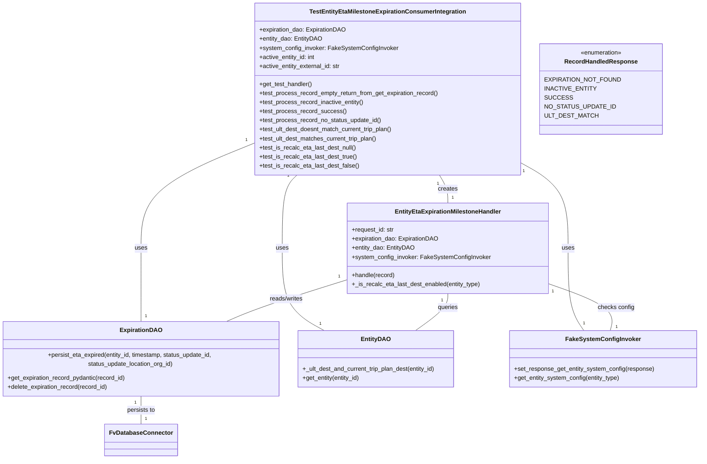
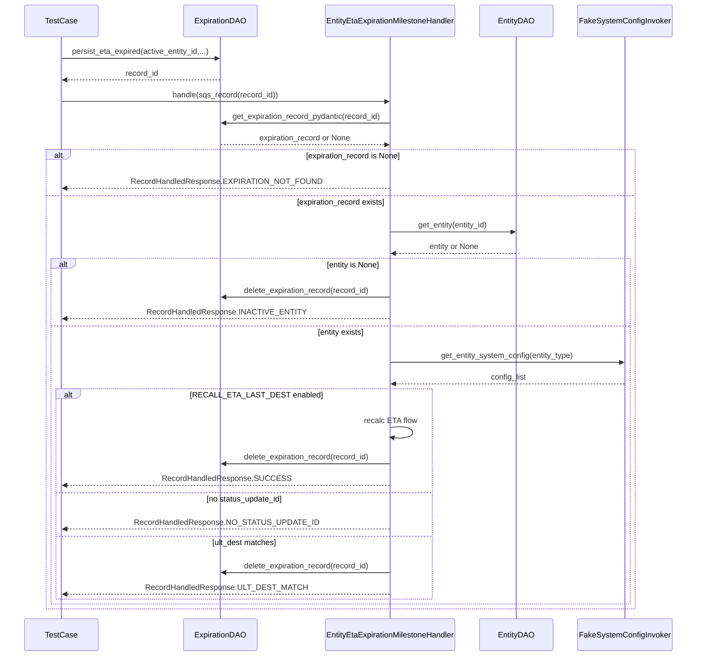

# Diagram: shipment_core/shipment_service/shipment_service/eta/tests/test_entity_eta_milestone_expiration_handler.py

> Auto-generated by Obscura crawlers

## Diagram 1

### SVG

<svg id="container" width="1871.173828125" xmlns="http://www.w3.org/2000/svg" class="classDiagram" height="1192" viewBox="0 0 1871.173828125 1192" role="graphics-document document" aria-roledescription="class"><g><defs><marker id="container_class-aggregationStart" class="marker aggregation class" refX="18" refY="7" markerWidth="190" markerHeight="240" orient="auto"><path d="M 18,7 L9,13 L1,7 L9,1 Z"></path></marker></defs><defs><marker id="container_class-aggregationEnd" class="marker aggregation class" refX="1" refY="7" markerWidth="20" markerHeight="28" orient="auto"><path d="M 18,7 L9,13 L1,7 L9,1 Z"></path></marker></defs><defs><marker id="container_class-extensionStart" class="marker extension class" refX="18" refY="7" markerWidth="190" markerHeight="240" orient="auto"><path d="M 1,7 L18,13 V 1 Z"></path></marker></defs><defs><marker id="container_class-extensionEnd" class="marker extension class" refX="1" refY="7" markerWidth="20" markerHeight="28" orient="auto"><path d="M 1,1 V 13 L18,7 Z"></path></marker></defs><defs><marker id="container_class-compositionStart" class="marker composition class" refX="18" refY="7" markerWidth="190" markerHeight="240" orient="auto"><path d="M 18,7 L9,13 L1,7 L9,1 Z"></path></marker></defs><defs><marker id="container_class-compositionEnd" class="marker composition class" refX="1" refY="7" markerWidth="20" markerHeight="28" orient="auto"><path d="M 18,7 L9,13 L1,7 L9,1 Z"></path></marker></defs><defs><marker id="container_class-dependencyStart" class="marker dependency class" refX="6" refY="7" markerWidth="190" markerHeight="240" orient="auto"><path d="M 5,7 L9,13 L1,7 L9,1 Z"></path></marker></defs><defs><marker id="container_class-dependencyEnd" class="marker dependency class" refX="13" refY="7" markerWidth="20" markerHeight="28" orient="auto"><path d="M 18,7 L9,13 L14,7 L9,1 Z"></path></marker></defs><defs><marker id="container_class-lollipopStart" class="marker lollipop class" refX="13" refY="7" markerWidth="190" markerHeight="240" orient="auto"><circle stroke="black" fill="transparent" cx="7" cy="7" r="6"></circle></marker></defs><defs><marker id="container_class-lollipopEnd" class="marker lollipop class" refX="1" refY="7" markerWidth="190" markerHeight="240" orient="auto"><circle stroke="black" fill="transparent" cx="7" cy="7" r="6"></circle></marker></defs><g class="root"><g class="clusters"></g><g class="edgePaths"><path d="M702.809,375.02L649.796,396.017C596.784,417.014,490.759,459.007,437.747,506.17C384.734,553.333,384.734,605.667,384.734,658C384.734,710.333,384.734,762.667,384.734,795C384.734,827.333,384.734,839.667,384.734,845.833L384.734,852" id="id_TestEntityEtaMilestoneExpirationConsumerIntegration_ExpirationDAO_1" class="edge-thickness-normal edge-pattern-solid relation" style=";;;" data-edge="true" data-et="edge" data-id="id_TestEntityEtaMilestoneExpirationConsumerIntegration_ExpirationDAO_1" data-points="W3sieCI6NzAyLjgwODU5Mzc1LCJ5IjozNzUuMDIwNDUxNTMzNDI3MTV9LHsieCI6Mzg0LjczNDM3NSwieSI6NTAxfSx7IngiOjM4NC43MzQzNzUsInkiOjY1OH0seyJ4IjozODQuNzM0Mzc1LCJ5Ijo4MTV9LHsieCI6Mzg0LjczNDM3NSwieSI6ODUyfV0="></path><path d="M808.534,464L801.9,470.167C795.266,476.333,781.998,488.667,775.364,521C768.73,553.333,768.73,605.667,768.73,658C768.73,710.333,768.73,762.667,785.334,797C801.938,831.333,835.145,847.667,851.749,855.833L868.353,864" id="id_TestEntityEtaMilestoneExpirationConsumerIntegration_EntityDAO_2" class="edge-thickness-normal edge-pattern-solid relation" style=";;;" data-edge="true" data-et="edge" data-id="id_TestEntityEtaMilestoneExpirationConsumerIntegration_EntityDAO_2" data-points="W3sieCI6ODA4LjUzMzgyOTU5OTA1NjYsInkiOjQ2NH0seyJ4Ijo3NjguNzMwNDY4NzUsInkiOjUwMX0seyJ4Ijo3NjguNzMwNDY4NzUsInkiOjY1OH0seyJ4Ijo3NjguNzMwNDY4NzUsInkiOjgxNX0seyJ4Ijo4NjguMzUyNzkxMDc4NjI5LCJ5Ijo4NjR9XQ=="></path><path d="M1404.809,434.296L1424.487,445.413C1444.166,456.53,1483.523,478.765,1503.202,516.049C1522.881,553.333,1522.881,605.667,1522.881,658C1522.881,710.333,1522.881,762.667,1529.18,797C1535.48,831.333,1548.079,847.667,1554.378,855.833L1560.677,864" id="id_TestEntityEtaMilestoneExpirationConsumerIntegration_FakeSystemConfigInvoker_3" class="edge-thickness-normal edge-pattern-solid relation" style=";;;" data-edge="true" data-et="edge" data-id="id_TestEntityEtaMilestoneExpirationConsumerIntegration_FakeSystemConfigInvoker_3" data-points="W3sieCI6MTQwNC44MDg1OTM3NSwieSI6NDM0LjI5NTY3MTcyNTY4ODZ9LHsieCI6MTUyMi44ODA4NTkzNzUsInkiOjUwMX0seyJ4IjoxNTIyLjg4MDg1OTM3NSwieSI6NjU4fSx7IngiOjE1MjIuODgwODU5Mzc1LCJ5Ijo4MTV9LHsieCI6MTU2MC42Nzc0MTkzNTQ4Mzg4LCJ5Ijo4NjR9XQ=="></path><path d="M1188.335,464L1191.973,470.167C1195.612,476.333,1202.889,488.667,1206.528,501C1210.166,513.333,1210.166,525.667,1210.166,531.833L1210.166,538" id="id_TestEntityEtaMilestoneExpirationConsumerIntegration_EntityEtaExpirationMilestoneHandler_4" class="edge-thickness-normal edge-pattern-solid relation" style=";;;" data-edge="true" data-et="edge" data-id="id_TestEntityEtaMilestoneExpirationConsumerIntegration_EntityEtaExpirationMilestoneHandler_4" data-points="W3sieCI6MTE4OC4zMzQ5NzkzNjMyMDc2LCJ5Ijo0NjR9LHsieCI6MTIxMC4xNjYwMTU2MjUsInkiOjUwMX0seyJ4IjoxMjEwLjE2NjAxNTYyNSwieSI6NTM4fV0="></path><path d="M948.943,738.831L907.917,751.526C866.891,764.22,784.838,789.61,727.994,808.472C671.151,827.333,639.517,839.667,623.7,845.833L607.883,852" id="id_EntityEtaExpirationMilestoneHandler_ExpirationDAO_5" class="edge-thickness-normal edge-pattern-solid relation" style=";;;" data-edge="true" data-et="edge" data-id="id_EntityEtaExpirationMilestoneHandler_ExpirationDAO_5" data-points="W3sieCI6OTQ4Ljk0MzM1OTM3NSwieSI6NzM4LjgzMDcxMzc5OTAzNjl9LHsieCI6NzAyLjc4NTE1NjI1LCJ5Ijo4MTV9LHsieCI6NjA3Ljg4MjkwNzAwNjA0ODQsInkiOjg1Mn1d"></path><path d="M1210.166,778L1210.166,784.167C1210.166,790.333,1210.166,802.667,1197.697,817C1185.227,831.333,1160.289,847.667,1147.819,855.833L1135.35,864" id="id_EntityEtaExpirationMilestoneHandler_EntityDAO_6" class="edge-thickness-normal edge-pattern-solid relation" style=";;;" data-edge="true" data-et="edge" data-id="id_EntityEtaExpirationMilestoneHandler_EntityDAO_6" data-points="W3sieCI6MTIxMC4xNjYwMTU2MjUsInkiOjc3OH0seyJ4IjoxMjEwLjE2NjAxNTYyNSwieSI6ODE1fSx7IngiOjExMzUuMzUwMDk3NjU2MjUsInkiOjg2NH1d"></path><path d="M1471.389,750.669L1501.612,761.391C1531.835,772.113,1592.282,793.556,1620.253,812.445C1648.224,831.333,1643.719,847.667,1641.467,855.833L1639.214,864" id="id_EntityEtaExpirationMilestoneHandler_FakeSystemConfigInvoker_7" class="edge-thickness-normal edge-pattern-solid relation" style=";;;" data-edge="true" data-et="edge" data-id="id_EntityEtaExpirationMilestoneHandler_FakeSystemConfigInvoker_7" data-points="W3sieCI6MTQ3MS4zODg2NzE4NzUsInkiOjc1MC42NjkyOTk4ODcwMjE2fSx7IngiOjE2NTIuNzI4NTE1NjI1LCJ5Ijo4MTV9LHsieCI6MTYzOS4yMTQzMDgyMTU3MjU5LCJ5Ijo4NjR9XQ=="></path><path d="M384.734,1026L384.734,1032.167C384.734,1038.333,384.734,1050.667,384.734,1063C384.734,1075.333,384.734,1087.667,384.734,1093.833L384.734,1100" id="id_ExpirationDAO_FvDatabaseConnector_8" class="edge-thickness-normal edge-pattern-solid relation" style=";;;" data-edge="true" data-et="edge" data-id="id_ExpirationDAO_FvDatabaseConnector_8" data-points="W3sieCI6Mzg0LjczNDM3NSwieSI6MTAyNn0seyJ4IjozODQuNzM0Mzc1LCJ5IjoxMDYzfSx7IngiOjM4NC43MzQzNzUsInkiOjExMDB9XQ=="></path></g><g class="edgeLabels"><g class="edgeLabel" transform="translate(384.734375, 658)"><g class="label" data-id="id_TestEntityEtaMilestoneExpirationConsumerIntegration_ExpirationDAO_1" transform="translate(-16.4921875, -12)"><foreignObject width="32.984375" height="24">

uses

</foreignObject></g></g><g class="edgeLabel" transform="translate(768.73046875, 658)"><g class="label" data-id="id_TestEntityEtaMilestoneExpirationConsumerIntegration_EntityDAO_2" transform="translate(-16.4921875, -12)"><foreignObject width="32.984375" height="24">

uses

</foreignObject></g></g><g class="edgeLabel" transform="translate(1522.880859375, 658)"><g class="label" data-id="id_TestEntityEtaMilestoneExpirationConsumerIntegration_FakeSystemConfigInvoker_3" transform="translate(-16.4921875, -12)"><foreignObject width="32.984375" height="24">

uses

</foreignObject></g></g><g class="edgeLabel" transform="translate(1210.166015625, 501)"><g class="label" data-id="id_TestEntityEtaMilestoneExpirationConsumerIntegration_EntityEtaExpirationMilestoneHandler_4" transform="translate(-26.171875, -12)"><foreignObject width="52.34375" height="24">

creates

</foreignObject></g></g><g class="edgeLabel" transform="translate(777.21034, 791.97045)"><g class="label" data-id="id_EntityEtaExpirationMilestoneHandler_ExpirationDAO_5" transform="translate(-45.9453125, -12)"><foreignObject width="91.890625" height="24">

reads/writes

</foreignObject></g></g><g class="edgeLabel" transform="translate(1210.166015625, 815)"><g class="label" data-id="id_EntityEtaExpirationMilestoneHandler_EntityDAO_6" transform="translate(-27.2421875, -12)"><foreignObject width="54.484375" height="24">

queries

</foreignObject></g></g><g class="edgeLabel" transform="translate(1586.01079, 791.33174)"><g class="label" data-id="id_EntityEtaExpirationMilestoneHandler_FakeSystemConfigInvoker_7" transform="translate(-48.3984375, -12)"><foreignObject width="96.796875" height="24">

checks config

</foreignObject></g></g><g class="edgeLabel" transform="translate(384.734375, 1063)"><g class="label" data-id="id_ExpirationDAO_FvDatabaseConnector_8" transform="translate(-37.9921875, -12)"><foreignObject width="75.984375" height="24">

persists to

</foreignObject></g></g><g class="edgeTerminals" transform="translate(681.0147149045202, 367.5186551138265)"><g class="inner" transform="translate(0, 0)"><foreignObject style="width: 9px; height: 12px;">
1
</foreignObject></g></g><g class="edgeTerminals" transform="translate(785.5036699904782, 464.92833328851214)"><g class="inner" transform="translate(0, 0)"><foreignObject style="width: 9px; height: 12px;">
1
</foreignObject></g></g><g class="edgeTerminals" transform="translate(1412.6670610591184, 455.9634930517382)"><g class="inner" transform="translate(0, 0)"><foreignObject style="width: 9px; height: 12px;">
1
</foreignObject></g></g><g class="edgeTerminals" transform="translate(1184.309020464547, 486.6945285109928)"><g class="inner" transform="translate(0, 0)"><foreignObject style="width: 9px; height: 12px;">
1
</foreignObject></g></g><g class="edgeTerminals" transform="translate(927.7913661259007, 729.6741229827015)"><g class="inner" transform="translate(0, 0)"><foreignObject style="width: 9px; height: 12px;">
1
</foreignObject></g></g><g class="edgeTerminals" transform="translate(1195.1660178125, 795.500001875)"><g class="inner" transform="translate(0, 0)"><foreignObject style="width: 9px; height: 12px;">
1
</foreignObject></g></g><g class="edgeTerminals" transform="translate(1482.866544165501, 770.6570064001005)"><g class="inner" transform="translate(0, 0)"><foreignObject style="width: 9px; height: 12px;">
1
</foreignObject></g></g><g class="edgeTerminals" transform="translate(369.73437750000016, 1043.500002142857)"><g class="inner" transform="translate(0, 0)"><foreignObject style="width: 9px; height: 12px;">
1
</foreignObject></g></g><g class="edgeTerminals" transform="translate(394.7343774999998, 829.5000021428572)"><g class="inner" transform="translate(0, 0)"></g><foreignObject style="width: 9px; height: 12px;">
1
</foreignObject></g><g class="edgeTerminals" transform="translate(854.2698888913093, 837.8162599602141)"><g class="inner" transform="translate(0, 0)"></g><foreignObject style="width: 9px; height: 12px;">
1
</foreignObject></g><g class="edgeTerminals" transform="translate(1556.8661071525974, 835.9818114487307)"><g class="inner" transform="translate(0, 0)"></g><foreignObject style="width: 9px; height: 12px;">
1
</foreignObject></g><g class="edgeTerminals" transform="translate(1220.1660178124996, 515.500001875)"><g class="inner" transform="translate(0, 0)"></g><foreignObject style="width: 9px; height: 12px;">
1
</foreignObject></g><g class="edgeTerminals" transform="translate(624.6362133053224, 854.6186407760316)"><g class="inner" transform="translate(0, 0)"></g><foreignObject style="width: 9px; height: 12px;">
1
</foreignObject></g><g class="edgeTerminals" transform="translate(1153.208078982534, 861.9601641357328)"><g class="inner" transform="translate(0, 0)"></g><foreignObject style="width: 9px; height: 12px;">
1
</foreignObject></g><g class="edgeTerminals" transform="translate(1653.3272131593344, 846.117961931656)"><g class="inner" transform="translate(0, 0)"></g><foreignObject style="width: 9px; height: 12px;">
1
</foreignObject></g><g class="edgeTerminals" transform="translate(394.7343774999998, 1077.500002142857)"><g class="inner" transform="translate(0, 0)"></g><foreignObject style="width: 9px; height: 12px;">
1
</foreignObject></g></g><g class="nodes"><g class="node default" id="classId-TestEntityEtaMilestoneExpirationConsumerIntegration-0" transform="translate(1053.80859375, 236)"><g class="basic label-container"><path d="M-351 -228 L351 -228 L351 228 L-351 228" stroke="none" stroke-width="0" fill="#ECECFF" style=""></path><path d="M-351 -228 C-108.23387354750878 -228, 134.53225290498244 -228, 351 -228 M-351 -228 C-159.3602580660189 -228, 32.2794838679622 -228, 351 -228 M351 -228 C351 -70.16657695849318, 351 87.66684608301364, 351 228 M351 -228 C351 -60.034871832774655, 351 107.93025633445069, 351 228 M351 228 C95.1845300229289 228, -160.6309399541422 228, -351 228 M351 228 C188.9896498570956 228, 26.9792997141912 228, -351 228 M-351 228 C-351 109.1359644026693, -351 -9.728071194661396, -351 -228 M-351 228 C-351 58.54830534700659, -351 -110.90338930598682, -351 -228" stroke="#9370DB" stroke-width="1.3" fill="none" stroke-dasharray="0 0" style=""></path></g><g class="annotation-group text" transform="translate(0, -204)"></g><g class="label-group text" transform="translate(-198.28125, -204)"><g class="label" style="font-weight: bolder" transform="translate(0,-12)"><foreignObject width="396.5625" height="24">

TestEntityEtaMilestoneExpirationConsumerIntegration

</foreignObject></g></g><g class="members-group text" transform="translate(-339, -156)"><g class="label" style="" transform="translate(0,-12)"><foreignObject width="229.25" height="24">

+expiration_dao: ExpirationDAO

</foreignObject></g><g class="label" style="" transform="translate(0,12)"><foreignObject width="165.015625" height="24">

+entity_dao: EntityDAO

</foreignObject></g><g class="label" style="" transform="translate(0,36)"><foreignObject width="363.546875" height="24">

+system_config_invoker: FakeSystemConfigInvoker

</foreignObject></g><g class="label" style="" transform="translate(0,60)"><foreignObject width="150.21875" height="24">

+active_entity_id: int

</foreignObject></g><g class="label" style="" transform="translate(0,84)"><foreignObject width="217.359375" height="24">

+active_entity_external_id: str

</foreignObject></g></g><g class="methods-group text" transform="translate(-339, -12)"><g class="label" style="" transform="translate(0,-12)"><foreignObject width="141.265625" height="24">

+get_test_handler()

</foreignObject></g><g class="label" style="" transform="translate(0,12)"><foreignObject width="479.71875" height="24">

+test_process_record_empty_return_from_get_expiration_record()

</foreignObject></g><g class="label" style="" transform="translate(0,36)"><foreignObject width="278.84375" height="24">

+test_process_record_inactive_entity()

</foreignObject></g><g class="label" style="" transform="translate(0,60)"><foreignObject width="227.09375" height="24">

+test_process_record_success()

</foreignObject></g><g class="label" style="" transform="translate(0,84)"><foreignObject width="324.375" height="24">

+test_process_record_no_status_update_id()

</foreignObject></g><g class="label" style="" transform="translate(0,108)"><foreignObject width="359.359375" height="24">

+test_ult_dest_doesnt_match_current_trip_plan()

</foreignObject></g><g class="label" style="" transform="translate(0,132)"><foreignObject width="316.96875" height="24">

+test_ult_dest_matches_current_trip_plan()

</foreignObject></g><g class="label" style="" transform="translate(0,156)"><foreignObject width="258.359375" height="24">

+test_is_recalc_eta_last_dest_null()

</foreignObject></g><g class="label" style="" transform="translate(0,180)"><foreignObject width="259.953125" height="24">

+test_is_recalc_eta_last_dest_true()

</foreignObject></g><g class="label" style="" transform="translate(0,204)"><foreignObject width="264.40625" height="24">

+test_is_recalc_eta_last_dest_false()

</foreignObject></g></g><g class="divider" style=""><path d="M-351 -180 C-144.58768657505905 -180, 61.824626849881895 -180, 351 -180 M-351 -180 C-80.32143262513068 -180, 190.35713474973863 -180, 351 -180" stroke="#9370DB" stroke-width="1.3" fill="none" stroke-dasharray="0 0" style=""></path></g><g class="divider" style=""><path d="M-351 -36 C-178.3392578246638 -36, -5.678515649327608 -36, 351 -36 M-351 -36 C-197.4842071494898 -36, -43.96841429897961 -36, 351 -36" stroke="#9370DB" stroke-width="1.3" fill="none" stroke-dasharray="0 0" style=""></path></g></g><g class="node default" id="classId-EntityEtaExpirationMilestoneHandler-1" transform="translate(1210.166015625, 658)"><g class="basic label-container"><path d="M-261.22265625 -120 L261.22265625 -120 L261.22265625 120 L-261.22265625 120" stroke="none" stroke-width="0" fill="#ECECFF" style=""></path><path d="M-261.22265625 -120 C-121.55787881562964 -120, 18.10689861874073 -120, 261.22265625 -120 M-261.22265625 -120 C-97.80603065022049 -120, 65.61059494955902 -120, 261.22265625 -120 M261.22265625 -120 C261.22265625 -61.02255590718555, 261.22265625 -2.045111814371097, 261.22265625 120 M261.22265625 -120 C261.22265625 -64.00504242780482, 261.22265625 -8.010084855609648, 261.22265625 120 M261.22265625 120 C146.04214148618183 120, 30.86162672236364 120, -261.22265625 120 M261.22265625 120 C125.08118772001572 120, -11.06028080996856 120, -261.22265625 120 M-261.22265625 120 C-261.22265625 58.7455219774852, -261.22265625 -2.5089560450296062, -261.22265625 -120 M-261.22265625 120 C-261.22265625 39.387480632554286, -261.22265625 -41.22503873489143, -261.22265625 -120" stroke="#9370DB" stroke-width="1.3" fill="none" stroke-dasharray="0 0" style=""></path></g><g class="annotation-group text" transform="translate(0, -96)"></g><g class="label-group text" transform="translate(-134.8984375, -96)"><g class="label" style="font-weight: bolder" transform="translate(0,-12)"><foreignObject width="269.796875" height="24">

EntityEtaExpirationMilestoneHandler

</foreignObject></g></g><g class="members-group text" transform="translate(-249.22265625, -48)"><g class="label" style="" transform="translate(0,-12)"><foreignObject width="113.15625" height="24">

+request_id: str

</foreignObject></g><g class="label" style="" transform="translate(0,12)"><foreignObject width="229.25" height="24">

+expiration_dao: ExpirationDAO

</foreignObject></g><g class="label" style="" transform="translate(0,36)"><foreignObject width="165.015625" height="24">

+entity_dao: EntityDAO

</foreignObject></g><g class="label" style="" transform="translate(0,60)"><foreignObject width="363.546875" height="24">

+system_config_invoker: FakeSystemConfigInvoker

</foreignObject></g></g><g class="methods-group text" transform="translate(-249.22265625, 72)"><g class="label" style="" transform="translate(0,-12)"><foreignObject width="115.0625" height="24">

+handle(record)

</foreignObject></g><g class="label" style="" transform="translate(0,12)"><foreignObject width="341.734375" height="24">

+_is_recalc_eta_last_dest_enabled(entity_type)

</foreignObject></g></g><g class="divider" style=""><path d="M-261.22265625 -72 C-121.00060163527482 -72, 19.221452979450362 -72, 261.22265625 -72 M-261.22265625 -72 C-94.49195446792689 -72, 72.23874731414622 -72, 261.22265625 -72" stroke="#9370DB" stroke-width="1.3" fill="none" stroke-dasharray="0 0" style=""></path></g><g class="divider" style=""><path d="M-261.22265625 48 C-130.6938184093795 48, -0.16498056875900602 48, 261.22265625 48 M-261.22265625 48 C-105.86299610138593 48, 49.49666404722814 48, 261.22265625 48" stroke="#9370DB" stroke-width="1.3" fill="none" stroke-dasharray="0 0" style=""></path></g></g><g class="node default" id="classId-RecordHandledResponse-2" transform="translate(1602.69140625, 236)"><g class="basic label-container"><path d="M-147.8828125 -120 L147.8828125 -120 L147.8828125 120 L-147.8828125 120" stroke="none" stroke-width="0" fill="#ECECFF" style=""></path><path d="M-147.8828125 -120 C-45.53731048444975 -120, 56.808191531100505 -120, 147.8828125 -120 M-147.8828125 -120 C-84.57948564260522 -120, -21.276158785210455 -120, 147.8828125 -120 M147.8828125 -120 C147.8828125 -41.81141160962936, 147.8828125 36.37717678074128, 147.8828125 120 M147.8828125 -120 C147.8828125 -50.46525438410892, 147.8828125 19.069491231782166, 147.8828125 120 M147.8828125 120 C71.3160895830399 120, -5.250633333920206 120, -147.8828125 120 M147.8828125 120 C87.57544384231639 120, 27.268075184632792 120, -147.8828125 120 M-147.8828125 120 C-147.8828125 39.5536357339647, -147.8828125 -40.892728532070606, -147.8828125 -120 M-147.8828125 120 C-147.8828125 49.99377065774871, -147.8828125 -20.012458684502576, -147.8828125 -120" stroke="#9370DB" stroke-width="1.3" fill="none" stroke-dasharray="0 0" style=""></path></g><g class="annotation-group text" transform="translate(-55.5546875, -96)"><g class="label" style="" transform="translate(0,-12)"><foreignObject width="111.109375" height="24">

«enumeration»

</foreignObject></g></g><g class="label-group text" transform="translate(-91.46875, -72)"><g class="label" style="font-weight: bolder" transform="translate(0,-12)"><foreignObject width="182.9375" height="24">

RecordHandledResponse

</foreignObject></g></g><g class="members-group text" transform="translate(-135.8828125, -24)"><g class="label" style="" transform="translate(0,-12)"><foreignObject width="180.296875" height="24">

EXPIRATION_NOT_FOUND

</foreignObject></g><g class="label" style="" transform="translate(0,12)"><foreignObject width="121.78125" height="24">

INACTIVE_ENTITY

</foreignObject></g><g class="label" style="" transform="translate(0,36)"><foreignObject width="62.5625" height="24">

SUCCESS

</foreignObject></g><g class="label" style="" transform="translate(0,60)"><foreignObject width="166.984375" height="24">

NO_STATUS_UPDATE_ID

</foreignObject></g><g class="label" style="" transform="translate(0,84)"><foreignObject width="124.265625" height="24">

ULT_DEST_MATCH

</foreignObject></g></g><g class="methods-group text" transform="translate(-135.8828125, 120)"></g><g class="divider" style=""><path d="M-147.8828125 -48 C-49.033681186465856 -48, 49.81545012706829 -48, 147.8828125 -48 M-147.8828125 -48 C-35.1086191974744 -48, 77.6655741050512 -48, 147.8828125 -48" stroke="#9370DB" stroke-width="1.3" fill="none" stroke-dasharray="0 0" style=""></path></g><g class="divider" style=""><path d="M-147.8828125 96 C-54.447644356298156 96, 38.98752378740369 96, 147.8828125 96 M-147.8828125 96 C-36.59933770244143 96, 74.68413709511714 96, 147.8828125 96" stroke="#9370DB" stroke-width="1.3" fill="none" stroke-dasharray="0 0" style=""></path></g></g><g class="node default" id="classId-ExpirationDAO-3" transform="translate(384.734375, 939)"><g class="basic label-container"><path d="M-376.734375 -87 L376.734375 -87 L376.734375 87 L-376.734375 87" stroke="none" stroke-width="0" fill="#ECECFF" style=""></path><path d="M-376.734375 -87 C-139.44060186538104 -87, 97.85317126923792 -87, 376.734375 -87 M-376.734375 -87 C-187.15097637177962 -87, 2.432422256440759 -87, 376.734375 -87 M376.734375 -87 C376.734375 -35.2966859986475, 376.734375 16.406628002705006, 376.734375 87 M376.734375 -87 C376.734375 -41.73417107489814, 376.734375 3.5316578502037146, 376.734375 87 M376.734375 87 C75.57480641412678 87, -225.58476217174643 87, -376.734375 87 M376.734375 87 C208.60519651531456 87, 40.47601803062912 87, -376.734375 87 M-376.734375 87 C-376.734375 44.15684354384623, -376.734375 1.3136870876924576, -376.734375 -87 M-376.734375 87 C-376.734375 18.83083165328638, -376.734375 -49.33833669342724, -376.734375 -87" stroke="#9370DB" stroke-width="1.3" fill="none" stroke-dasharray="0 0" style=""></path></g><g class="annotation-group text" transform="translate(0, -63)"></g><g class="label-group text" transform="translate(-52.578125, -63)"><g class="label" style="font-weight: bolder" transform="translate(0,-12)"><foreignObject width="105.15625" height="24">

ExpirationDAO

</foreignObject></g></g><g class="members-group text" transform="translate(-364.734375, -15)"></g><g class="methods-group text" transform="translate(-364.734375, 15)"><g class="label" style="" transform="translate(0,-12)"><foreignObject width="676.890625" height="24">

+persist_eta_expired(entity_id, timestamp, status_update_id, status_update_location_org_id)

</foreignObject></g><g class="label" style="" transform="translate(0,12)"><foreignObject width="317.171875" height="24">

+get_expiration_record_pydantic(record_id)

</foreignObject></g><g class="label" style="" transform="translate(0,36)"><foreignObject width="269.015625" height="24">

+delete_expiration_record(record_id)

</foreignObject></g></g><g class="divider" style=""><path d="M-376.734375 -39 C-95.6053208557118 -39, 185.5237332885764 -39, 376.734375 -39 M-376.734375 -39 C-199.18485289109634 -39, -21.635330782192682 -39, 376.734375 -39" stroke="#9370DB" stroke-width="1.3" fill="none" stroke-dasharray="0 0" style=""></path></g><g class="divider" style=""><path d="M-376.734375 -15 C-202.00343247195548 -15, -27.272489943910955 -15, 376.734375 -15 M-376.734375 -15 C-154.34975729217484 -15, 68.03486041565031 -15, 376.734375 -15" stroke="#9370DB" stroke-width="1.3" fill="none" stroke-dasharray="0 0" style=""></path></g></g><g class="node default" id="classId-EntityDAO-4" transform="translate(1020.8359375, 939)"><g class="basic label-container"><path d="M-209.3671875 -75 L209.3671875 -75 L209.3671875 75 L-209.3671875 75" stroke="none" stroke-width="0" fill="#ECECFF" style=""></path><path d="M-209.3671875 -75 C-113.31022411728117 -75, -17.253260734562332 -75, 209.3671875 -75 M-209.3671875 -75 C-112.51626291722535 -75, -15.665338334450695 -75, 209.3671875 -75 M209.3671875 -75 C209.3671875 -34.20094927518392, 209.3671875 6.5981014496321535, 209.3671875 75 M209.3671875 -75 C209.3671875 -42.59932015304596, 209.3671875 -10.198640306091917, 209.3671875 75 M209.3671875 75 C58.89630597555987 75, -91.57457554888026 75, -209.3671875 75 M209.3671875 75 C69.91635199418775 75, -69.5344835116245 75, -209.3671875 75 M-209.3671875 75 C-209.3671875 31.40420389762425, -209.3671875 -12.191592204751501, -209.3671875 -75 M-209.3671875 75 C-209.3671875 18.231302241441824, -209.3671875 -38.53739551711635, -209.3671875 -75" stroke="#9370DB" stroke-width="1.3" fill="none" stroke-dasharray="0 0" style=""></path></g><g class="annotation-group text" transform="translate(0, -51)"></g><g class="label-group text" transform="translate(-36.578125, -51)"><g class="label" style="font-weight: bolder" transform="translate(0,-12)"><foreignObject width="73.15625" height="24">

EntityDAO

</foreignObject></g></g><g class="members-group text" transform="translate(-197.3671875, -3)"></g><g class="methods-group text" transform="translate(-197.3671875, 27)"><g class="label" style="" transform="translate(0,-12)"><foreignObject width="358.15625" height="24">

+_ult_dest_and_current_trip_plan_dest(entity_id)

</foreignObject></g><g class="label" style="" transform="translate(0,12)"><foreignObject width="154.75" height="24">

+get_entity(entity_id)

</foreignObject></g></g><g class="divider" style=""><path d="M-209.3671875 -27 C-73.06902745418486 -27, 63.229132591630275 -27, 209.3671875 -27 M-209.3671875 -27 C-76.90625230120875 -27, 55.554682897582495 -27, 209.3671875 -27" stroke="#9370DB" stroke-width="1.3" fill="none" stroke-dasharray="0 0" style=""></path></g><g class="divider" style=""><path d="M-209.3671875 -3 C-90.65054350022744 -3, 28.066100499545115 -3, 209.3671875 -3 M-209.3671875 -3 C-91.18908470255847 -3, 26.98901809488305 -3, 209.3671875 -3" stroke="#9370DB" stroke-width="1.3" fill="none" stroke-dasharray="0 0" style=""></path></g></g><g class="node default" id="classId-FakeSystemConfigInvoker-5" transform="translate(1618.529296875, 939)"><g class="basic label-container"><path d="M-244.64453125 -75 L244.64453125 -75 L244.64453125 75 L-244.64453125 75" stroke="none" stroke-width="0" fill="#ECECFF" style=""></path><path d="M-244.64453125 -75 C-126.59053777973567 -75, -8.536544309471338 -75, 244.64453125 -75 M-244.64453125 -75 C-63.39739073260347 -75, 117.84974978479306 -75, 244.64453125 -75 M244.64453125 -75 C244.64453125 -29.860559852554196, 244.64453125 15.278880294891607, 244.64453125 75 M244.64453125 -75 C244.64453125 -38.46835929754822, 244.64453125 -1.936718595096437, 244.64453125 75 M244.64453125 75 C127.38007095699145 75, 10.115610663982892 75, -244.64453125 75 M244.64453125 75 C101.49288799169483 75, -41.65875526661034 75, -244.64453125 75 M-244.64453125 75 C-244.64453125 44.55156592677219, -244.64453125 14.103131853544383, -244.64453125 -75 M-244.64453125 75 C-244.64453125 16.321946308009387, -244.64453125 -42.356107383981225, -244.64453125 -75" stroke="#9370DB" stroke-width="1.3" fill="none" stroke-dasharray="0 0" style=""></path></g><g class="annotation-group text" transform="translate(0, -51)"></g><g class="label-group text" transform="translate(-93.5703125, -51)"><g class="label" style="font-weight: bolder" transform="translate(0,-12)"><foreignObject width="187.140625" height="24">

FakeSystemConfigInvoker

</foreignObject></g></g><g class="members-group text" transform="translate(-232.64453125, -3)"></g><g class="methods-group text" transform="translate(-232.64453125, 27)"><g class="label" style="" transform="translate(0,-12)"><foreignObject width="371.71875" height="24">

+set_response_get_entity_system_config(response)

</foreignObject></g><g class="label" style="" transform="translate(0,12)"><foreignObject width="281.9375" height="24">

+get_entity_system_config(entity_type)

</foreignObject></g></g><g class="divider" style=""><path d="M-244.64453125 -27 C-119.33769194652862 -27, 5.969147356942756 -27, 244.64453125 -27 M-244.64453125 -27 C-114.0564647445027 -27, 16.53160176099459 -27, 244.64453125 -27" stroke="#9370DB" stroke-width="1.3" fill="none" stroke-dasharray="0 0" style=""></path></g><g class="divider" style=""><path d="M-244.64453125 -3 C-124.37935439017284 -3, -4.114177530345671 -3, 244.64453125 -3 M-244.64453125 -3 C-81.64477291964585 -3, 81.35498541070831 -3, 244.64453125 -3" stroke="#9370DB" stroke-width="1.3" fill="none" stroke-dasharray="0 0" style=""></path></g></g><g class="node default" id="classId-FvDatabaseConnector-6" transform="translate(384.734375, 1142)"><g class="basic label-container"><path d="M-91.3046875 -42 L91.3046875 -42 L91.3046875 42 L-91.3046875 42" stroke="none" stroke-width="0" fill="#ECECFF" style=""></path><path d="M-91.3046875 -42 C-46.15164306948371 -42, -0.9985986389674224 -42, 91.3046875 -42 M-91.3046875 -42 C-33.75443188074176 -42, 23.795823738516475 -42, 91.3046875 -42 M91.3046875 -42 C91.3046875 -21.368088088796853, 91.3046875 -0.7361761775937055, 91.3046875 42 M91.3046875 -42 C91.3046875 -13.49063085847742, 91.3046875 15.01873828304516, 91.3046875 42 M91.3046875 42 C54.29087186435271 42, 17.27705622870542 42, -91.3046875 42 M91.3046875 42 C52.30659035836946 42, 13.308493216738924 42, -91.3046875 42 M-91.3046875 42 C-91.3046875 18.858131375881953, -91.3046875 -4.283737248236093, -91.3046875 -42 M-91.3046875 42 C-91.3046875 17.920413964852518, -91.3046875 -6.159172070294964, -91.3046875 -42" stroke="#9370DB" stroke-width="1.3" fill="none" stroke-dasharray="0 0" style=""></path></g><g class="annotation-group text" transform="translate(0, -18)"></g><g class="label-group text" transform="translate(-79.3046875, -18)"><g class="label" style="font-weight: bolder" transform="translate(0,-12)"><foreignObject width="158.609375" height="24">

FvDatabaseConnector

</foreignObject></g></g><g class="members-group text" transform="translate(-79.3046875, 30)"></g><g class="methods-group text" transform="translate(-79.3046875, 60)"></g><g class="divider" style=""><path d="M-91.3046875 6 C-37.52874928352797 6, 16.247188932944056 6, 91.3046875 6 M-91.3046875 6 C-28.888895793918834 6, 33.52689591216233 6, 91.3046875 6" stroke="#9370DB" stroke-width="1.3" fill="none" stroke-dasharray="0 0" style=""></path></g><g class="divider" style=""><path d="M-91.3046875 24 C-43.01741873092635 24, 5.269850038147297 24, 91.3046875 24 M-91.3046875 24 C-19.24576075553084 24, 52.81316598893832 24, 91.3046875 24" stroke="#9370DB" stroke-width="1.3" fill="none" stroke-dasharray="0 0" style=""></path></g></g></g></g></g></svg>

## Diagram 2

### SVG

<svg id="container" width="1505" xmlns="http://www.w3.org/2000/svg" height="1410" viewBox="-50 -10 1505 1410" role="graphics-document document" aria-roledescription="sequence"><g><rect x="1201" y="1324" fill="#eaeaea" stroke="#666" width="204" height="65" name="Config" rx="3" ry="3" class="actor actor-bottom"></rect><text x="1303" y="1356.5" dominant-baseline="central" alignment-baseline="central" class="actor actor-box" style="text-anchor: middle; font-size: 16px; font-weight: 400;"><tspan x="1303" dy="0">FakeSystemConfigInvoker</tspan></text></g><g><rect x="1001" y="1324" fill="#eaeaea" stroke="#666" width="150" height="65" name="Entity" rx="3" ry="3" class="actor actor-bottom"></rect><text x="1076" y="1356.5" dominant-baseline="central" alignment-baseline="central" class="actor actor-box" style="text-anchor: middle; font-size: 16px; font-weight: 400;"><tspan x="1076" dy="0">EntityDAO</tspan></text></g><g><rect x="663" y="1324" fill="#eaeaea" stroke="#666" width="288" height="65" name="Handler" rx="3" ry="3" class="actor actor-bottom"></rect><text x="807" y="1356.5" dominant-baseline="central" alignment-baseline="central" class="actor actor-box" style="text-anchor: middle; font-size: 16px; font-weight: 400;"><tspan x="807" dy="0">EntityEtaExpirationMilestoneHandler</tspan></text></g><g><rect x="353" y="1324" fill="#eaeaea" stroke="#666" width="150" height="65" name="DAO" rx="3" ry="3" class="actor actor-bottom"></rect><text x="428" y="1356.5" dominant-baseline="central" alignment-baseline="central" class="actor actor-box" style="text-anchor: middle; font-size: 16px; font-weight: 400;"><tspan x="428" dy="0">ExpirationDAO</tspan></text></g><g><rect x="0" y="1324" fill="#eaeaea" stroke="#666" width="150" height="65" name="Test" rx="3" ry="3" class="actor actor-bottom"></rect><text x="75" y="1356.5" dominant-baseline="central" alignment-baseline="central" class="actor actor-box" style="text-anchor: middle; font-size: 16px; font-weight: 400;"><tspan x="75" dy="0">TestCase</tspan></text></g><g><line id="actor4" x1="1303" y1="65" x2="1303" y2="1324" class="actor-line 200" stroke-width="0.5px" stroke="#999" name="Config"></line><g id="root-4"><rect x="1201" y="0" fill="#eaeaea" stroke="#666" width="204" height="65" name="Config" rx="3" ry="3" class="actor actor-top"></rect><text x="1303" y="32.5" dominant-baseline="central" alignment-baseline="central" class="actor actor-box" style="text-anchor: middle; font-size: 16px; font-weight: 400;"><tspan x="1303" dy="0">FakeSystemConfigInvoker</tspan></text></g></g><g><line id="actor3" x1="1076" y1="65" x2="1076" y2="1324" class="actor-line 200" stroke-width="0.5px" stroke="#999" name="Entity"></line><g id="root-3"><rect x="1001" y="0" fill="#eaeaea" stroke="#666" width="150" height="65" name="Entity" rx="3" ry="3" class="actor actor-top"></rect><text x="1076" y="32.5" dominant-baseline="central" alignment-baseline="central" class="actor actor-box" style="text-anchor: middle; font-size: 16px; font-weight: 400;"><tspan x="1076" dy="0">EntityDAO</tspan></text></g></g><g><line id="actor2" x1="807" y1="65" x2="807" y2="1324" class="actor-line 200" stroke-width="0.5px" stroke="#999" name="Handler"></line><g id="root-2"><rect x="663" y="0" fill="#eaeaea" stroke="#666" width="288" height="65" name="Handler" rx="3" ry="3" class="actor actor-top"></rect><text x="807" y="32.5" dominant-baseline="central" alignment-baseline="central" class="actor actor-box" style="text-anchor: middle; font-size: 16px; font-weight: 400;"><tspan x="807" dy="0">EntityEtaExpirationMilestoneHandler</tspan></text></g></g><g><line id="actor1" x1="428" y1="65" x2="428" y2="1324" class="actor-line 200" stroke-width="0.5px" stroke="#999" name="DAO"></line><g id="root-1"><rect x="353" y="0" fill="#eaeaea" stroke="#666" width="150" height="65" name="DAO" rx="3" ry="3" class="actor actor-top"></rect><text x="428" y="32.5" dominant-baseline="central" alignment-baseline="central" class="actor actor-box" style="text-anchor: middle; font-size: 16px; font-weight: 400;"><tspan x="428" dy="0">ExpirationDAO</tspan></text></g></g><g><line id="actor0" x1="75" y1="65" x2="75" y2="1324" class="actor-line 200" stroke-width="0.5px" stroke="#999" name="Test"></line><g id="root-0"><rect x="0" y="0" fill="#eaeaea" stroke="#666" width="150" height="65" name="Test" rx="3" ry="3" class="actor actor-top"></rect><text x="75" y="32.5" dominant-baseline="central" alignment-baseline="central" class="actor actor-box" style="text-anchor: middle; font-size: 16px; font-weight: 400;"><tspan x="75" dy="0">TestCase</tspan></text></g></g><g></g><defs><symbol id="computer" width="24" height="24"><path transform="scale(.5)" d="M2 2v13h20v-13h-20zm18 11h-16v-9h16v9zm-10.228 6l.466-1h3.524l.467 1h-4.457zm14.228 3h-24l2-6h2.104l-1.33 4h18.45l-1.297-4h2.073l2 6zm-5-10h-14v-7h14v7z"></path></symbol></defs><defs><symbol id="database" fill-rule="evenodd" clip-rule="evenodd"><path transform="scale(.5)" d="M12.258.001l.256.004.255.005.253.008.251.01.249.012.247.015.246.016.242.019.241.02.239.023.236.024.233.027.231.028.229.031.225.032.223.034.22.036.217.038.214.04.211.041.208.043.205.045.201.046.198.048.194.05.191.051.187.053.183.054.18.056.175.057.172.059.168.06.163.061.16.063.155.064.15.066.074.033.073.033.071.034.07.034.069.035.068.035.067.035.066.035.064.036.064.036.062.036.06.036.06.037.058.037.058.037.055.038.055.038.053.038.052.038.051.039.05.039.048.039.047.039.045.04.044.04.043.04.041.04.04.041.039.041.037.041.036.041.034.041.033.042.032.042.03.042.029.042.027.042.026.043.024.043.023.043.021.043.02.043.018.044.017.043.015.044.013.044.012.044.011.045.009.044.007.045.006.045.004.045.002.045.001.045v17l-.001.045-.002.045-.004.045-.006.045-.007.045-.009.044-.011.045-.012.044-.013.044-.015.044-.017.043-.018.044-.02.043-.021.043-.023.043-.024.043-.026.043-.027.042-.029.042-.03.042-.032.042-.033.042-.034.041-.036.041-.037.041-.039.041-.04.041-.041.04-.043.04-.044.04-.045.04-.047.039-.048.039-.05.039-.051.039-.052.038-.053.038-.055.038-.055.038-.058.037-.058.037-.06.037-.06.036-.062.036-.064.036-.064.036-.066.035-.067.035-.068.035-.069.035-.07.034-.071.034-.073.033-.074.033-.15.066-.155.064-.16.063-.163.061-.168.06-.172.059-.175.057-.18.056-.183.054-.187.053-.191.051-.194.05-.198.048-.201.046-.205.045-.208.043-.211.041-.214.04-.217.038-.22.036-.223.034-.225.032-.229.031-.231.028-.233.027-.236.024-.239.023-.241.02-.242.019-.246.016-.247.015-.249.012-.251.01-.253.008-.255.005-.256.004-.258.001-.258-.001-.256-.004-.255-.005-.253-.008-.251-.01-.249-.012-.247-.015-.245-.016-.243-.019-.241-.02-.238-.023-.236-.024-.234-.027-.231-.028-.228-.031-.226-.032-.223-.034-.22-.036-.217-.038-.214-.04-.211-.041-.208-.043-.204-.045-.201-.046-.198-.048-.195-.05-.19-.051-.187-.053-.184-.054-.179-.056-.176-.057-.172-.059-.167-.06-.164-.061-.159-.063-.155-.064-.151-.066-.074-.033-.072-.033-.072-.034-.07-.034-.069-.035-.068-.035-.067-.035-.066-.035-.064-.036-.063-.036-.062-.036-.061-.036-.06-.037-.058-.037-.057-.037-.056-.038-.055-.038-.053-.038-.052-.038-.051-.039-.049-.039-.049-.039-.046-.039-.046-.04-.044-.04-.043-.04-.041-.04-.04-.041-.039-.041-.037-.041-.036-.041-.034-.041-.033-.042-.032-.042-.03-.042-.029-.042-.027-.042-.026-.043-.024-.043-.023-.043-.021-.043-.02-.043-.018-.044-.017-.043-.015-.044-.013-.044-.012-.044-.011-.045-.009-.044-.007-.045-.006-.045-.004-.045-.002-.045-.001-.045v-17l.001-.045.002-.045.004-.045.006-.045.007-.045.009-.044.011-.045.012-.044.013-.044.015-.044.017-.043.018-.044.02-.043.021-.043.023-.043.024-.043.026-.043.027-.042.029-.042.03-.042.032-.042.033-.042.034-.041.036-.041.037-.041.039-.041.04-.041.041-.04.043-.04.044-.04.046-.04.046-.039.049-.039.049-.039.051-.039.052-.038.053-.038.055-.038.056-.038.057-.037.058-.037.06-.037.061-.036.062-.036.063-.036.064-.036.066-.035.067-.035.068-.035.069-.035.07-.034.072-.034.072-.033.074-.033.151-.066.155-.064.159-.063.164-.061.167-.06.172-.059.176-.057.179-.056.184-.054.187-.053.19-.051.195-.05.198-.048.201-.046.204-.045.208-.043.211-.041.214-.04.217-.038.22-.036.223-.034.226-.032.228-.031.231-.028.234-.027.236-.024.238-.023.241-.02.243-.019.245-.016.247-.015.249-.012.251-.01.253-.008.255-.005.256-.004.258-.001.258.001zm-9.258 20.499v.01l.001.021.003.021.004.022.005.021.006.022.007.022.009.023.01.022.011.023.012.023.013.023.015.023.016.024.017.023.018.024.019.024.021.024.022.025.023.024.024.025.052.049.056.05.061.051.066.051.07.051.075.051.079.052.084.052.088.052.092.052.097.052.102.051.105.052.11.052.114.051.119.051.123.051.127.05.131.05.135.05.139.048.144.049.147.047.152.047.155.047.16.045.163.045.167.043.171.043.176.041.178.041.183.039.187.039.19.037.194.035.197.035.202.033.204.031.209.03.212.029.216.027.219.025.222.024.226.021.23.02.233.018.236.016.24.015.243.012.246.01.249.008.253.005.256.004.259.001.26-.001.257-.004.254-.005.25-.008.247-.011.244-.012.241-.014.237-.016.233-.018.231-.021.226-.021.224-.024.22-.026.216-.027.212-.028.21-.031.205-.031.202-.034.198-.034.194-.036.191-.037.187-.039.183-.04.179-.04.175-.042.172-.043.168-.044.163-.045.16-.046.155-.046.152-.047.148-.048.143-.049.139-.049.136-.05.131-.05.126-.05.123-.051.118-.052.114-.051.11-.052.106-.052.101-.052.096-.052.092-.052.088-.053.083-.051.079-.052.074-.052.07-.051.065-.051.06-.051.056-.05.051-.05.023-.024.023-.025.021-.024.02-.024.019-.024.018-.024.017-.024.015-.023.014-.024.013-.023.012-.023.01-.023.01-.022.008-.022.006-.022.006-.022.004-.022.004-.021.001-.021.001-.021v-4.127l-.077.055-.08.053-.083.054-.085.053-.087.052-.09.052-.093.051-.095.05-.097.05-.1.049-.102.049-.105.048-.106.047-.109.047-.111.046-.114.045-.115.045-.118.044-.12.043-.122.042-.124.042-.126.041-.128.04-.13.04-.132.038-.134.038-.135.037-.138.037-.139.035-.142.035-.143.034-.144.033-.147.032-.148.031-.15.03-.151.03-.153.029-.154.027-.156.027-.158.026-.159.025-.161.024-.162.023-.163.022-.165.021-.166.02-.167.019-.169.018-.169.017-.171.016-.173.015-.173.014-.175.013-.175.012-.177.011-.178.01-.179.008-.179.008-.181.006-.182.005-.182.004-.184.003-.184.002h-.37l-.184-.002-.184-.003-.182-.004-.182-.005-.181-.006-.179-.008-.179-.008-.178-.01-.176-.011-.176-.012-.175-.013-.173-.014-.172-.015-.171-.016-.17-.017-.169-.018-.167-.019-.166-.02-.165-.021-.163-.022-.162-.023-.161-.024-.159-.025-.157-.026-.156-.027-.155-.027-.153-.029-.151-.03-.15-.03-.148-.031-.146-.032-.145-.033-.143-.034-.141-.035-.14-.035-.137-.037-.136-.037-.134-.038-.132-.038-.13-.04-.128-.04-.126-.041-.124-.042-.122-.042-.12-.044-.117-.043-.116-.045-.113-.045-.112-.046-.109-.047-.106-.047-.105-.048-.102-.049-.1-.049-.097-.05-.095-.05-.093-.052-.09-.051-.087-.052-.085-.053-.083-.054-.08-.054-.077-.054v4.127zm0-5.654v.011l.001.021.003.021.004.021.005.022.006.022.007.022.009.022.01.022.011.023.012.023.013.023.015.024.016.023.017.024.018.024.019.024.021.024.022.024.023.025.024.024.052.05.056.05.061.05.066.051.07.051.075.052.079.051.084.052.088.052.092.052.097.052.102.052.105.052.11.051.114.051.119.052.123.05.127.051.131.05.135.049.139.049.144.048.147.048.152.047.155.046.16.045.163.045.167.044.171.042.176.042.178.04.183.04.187.038.19.037.194.036.197.034.202.033.204.032.209.03.212.028.216.027.219.025.222.024.226.022.23.02.233.018.236.016.24.014.243.012.246.01.249.008.253.006.256.003.259.001.26-.001.257-.003.254-.006.25-.008.247-.01.244-.012.241-.015.237-.016.233-.018.231-.02.226-.022.224-.024.22-.025.216-.027.212-.029.21-.03.205-.032.202-.033.198-.035.194-.036.191-.037.187-.039.183-.039.179-.041.175-.042.172-.043.168-.044.163-.045.16-.045.155-.047.152-.047.148-.048.143-.048.139-.05.136-.049.131-.05.126-.051.123-.051.118-.051.114-.052.11-.052.106-.052.101-.052.096-.052.092-.052.088-.052.083-.052.079-.052.074-.051.07-.052.065-.051.06-.05.056-.051.051-.049.023-.025.023-.024.021-.025.02-.024.019-.024.018-.024.017-.024.015-.023.014-.023.013-.024.012-.022.01-.023.01-.023.008-.022.006-.022.006-.022.004-.021.004-.022.001-.021.001-.021v-4.139l-.077.054-.08.054-.083.054-.085.052-.087.053-.09.051-.093.051-.095.051-.097.05-.1.049-.102.049-.105.048-.106.047-.109.047-.111.046-.114.045-.115.044-.118.044-.12.044-.122.042-.124.042-.126.041-.128.04-.13.039-.132.039-.134.038-.135.037-.138.036-.139.036-.142.035-.143.033-.144.033-.147.033-.148.031-.15.03-.151.03-.153.028-.154.028-.156.027-.158.026-.159.025-.161.024-.162.023-.163.022-.165.021-.166.02-.167.019-.169.018-.169.017-.171.016-.173.015-.173.014-.175.013-.175.012-.177.011-.178.009-.179.009-.179.007-.181.007-.182.005-.182.004-.184.003-.184.002h-.37l-.184-.002-.184-.003-.182-.004-.182-.005-.181-.007-.179-.007-.179-.009-.178-.009-.176-.011-.176-.012-.175-.013-.173-.014-.172-.015-.171-.016-.17-.017-.169-.018-.167-.019-.166-.02-.165-.021-.163-.022-.162-.023-.161-.024-.159-.025-.157-.026-.156-.027-.155-.028-.153-.028-.151-.03-.15-.03-.148-.031-.146-.033-.145-.033-.143-.033-.141-.035-.14-.036-.137-.036-.136-.037-.134-.038-.132-.039-.13-.039-.128-.04-.126-.041-.124-.042-.122-.043-.12-.043-.117-.044-.116-.044-.113-.046-.112-.046-.109-.046-.106-.047-.105-.048-.102-.049-.1-.049-.097-.05-.095-.051-.093-.051-.09-.051-.087-.053-.085-.052-.083-.054-.08-.054-.077-.054v4.139zm0-5.666v.011l.001.02.003.022.004.021.005.022.006.021.007.022.009.023.01.022.011.023.012.023.013.023.015.023.016.024.017.024.018.023.019.024.021.025.022.024.023.024.024.025.052.05.056.05.061.05.066.051.07.051.075.052.079.051.084.052.088.052.092.052.097.052.102.052.105.051.11.052.114.051.119.051.123.051.127.05.131.05.135.05.139.049.144.048.147.048.152.047.155.046.16.045.163.045.167.043.171.043.176.042.178.04.183.04.187.038.19.037.194.036.197.034.202.033.204.032.209.03.212.028.216.027.219.025.222.024.226.021.23.02.233.018.236.017.24.014.243.012.246.01.249.008.253.006.256.003.259.001.26-.001.257-.003.254-.006.25-.008.247-.01.244-.013.241-.014.237-.016.233-.018.231-.02.226-.022.224-.024.22-.025.216-.027.212-.029.21-.03.205-.032.202-.033.198-.035.194-.036.191-.037.187-.039.183-.039.179-.041.175-.042.172-.043.168-.044.163-.045.16-.045.155-.047.152-.047.148-.048.143-.049.139-.049.136-.049.131-.051.126-.05.123-.051.118-.052.114-.051.11-.052.106-.052.101-.052.096-.052.092-.052.088-.052.083-.052.079-.052.074-.052.07-.051.065-.051.06-.051.056-.05.051-.049.023-.025.023-.025.021-.024.02-.024.019-.024.018-.024.017-.024.015-.023.014-.024.013-.023.012-.023.01-.022.01-.023.008-.022.006-.022.006-.022.004-.022.004-.021.001-.021.001-.021v-4.153l-.077.054-.08.054-.083.053-.085.053-.087.053-.09.051-.093.051-.095.051-.097.05-.1.049-.102.048-.105.048-.106.048-.109.046-.111.046-.114.046-.115.044-.118.044-.12.043-.122.043-.124.042-.126.041-.128.04-.13.039-.132.039-.134.038-.135.037-.138.036-.139.036-.142.034-.143.034-.144.033-.147.032-.148.032-.15.03-.151.03-.153.028-.154.028-.156.027-.158.026-.159.024-.161.024-.162.023-.163.023-.165.021-.166.02-.167.019-.169.018-.169.017-.171.016-.173.015-.173.014-.175.013-.175.012-.177.01-.178.01-.179.009-.179.007-.181.006-.182.006-.182.004-.184.003-.184.001-.185.001-.185-.001-.184-.001-.184-.003-.182-.004-.182-.006-.181-.006-.179-.007-.179-.009-.178-.01-.176-.01-.176-.012-.175-.013-.173-.014-.172-.015-.171-.016-.17-.017-.169-.018-.167-.019-.166-.02-.165-.021-.163-.023-.162-.023-.161-.024-.159-.024-.157-.026-.156-.027-.155-.028-.153-.028-.151-.03-.15-.03-.148-.032-.146-.032-.145-.033-.143-.034-.141-.034-.14-.036-.137-.036-.136-.037-.134-.038-.132-.039-.13-.039-.128-.041-.126-.041-.124-.041-.122-.043-.12-.043-.117-.044-.116-.044-.113-.046-.112-.046-.109-.046-.106-.048-.105-.048-.102-.048-.1-.05-.097-.049-.095-.051-.093-.051-.09-.052-.087-.052-.085-.053-.083-.053-.08-.054-.077-.054v4.153zm8.74-8.179l-.257.004-.254.005-.25.008-.247.011-.244.012-.241.014-.237.016-.233.018-.231.021-.226.022-.224.023-.22.026-.216.027-.212.028-.21.031-.205.032-.202.033-.198.034-.194.036-.191.038-.187.038-.183.04-.179.041-.175.042-.172.043-.168.043-.163.045-.16.046-.155.046-.152.048-.148.048-.143.048-.139.049-.136.05-.131.05-.126.051-.123.051-.118.051-.114.052-.11.052-.106.052-.101.052-.096.052-.092.052-.088.052-.083.052-.079.052-.074.051-.07.052-.065.051-.06.05-.056.05-.051.05-.023.025-.023.024-.021.024-.02.025-.019.024-.018.024-.017.023-.015.024-.014.023-.013.023-.012.023-.01.023-.01.022-.008.022-.006.023-.006.021-.004.022-.004.021-.001.021-.001.021.001.021.001.021.004.021.004.022.006.021.006.023.008.022.01.022.01.023.012.023.013.023.014.023.015.024.017.023.018.024.019.024.02.025.021.024.023.024.023.025.051.05.056.05.06.05.065.051.07.052.074.051.079.052.083.052.088.052.092.052.096.052.101.052.106.052.11.052.114.052.118.051.123.051.126.051.131.05.136.05.139.049.143.048.148.048.152.048.155.046.16.046.163.045.168.043.172.043.175.042.179.041.183.04.187.038.191.038.194.036.198.034.202.033.205.032.21.031.212.028.216.027.22.026.224.023.226.022.231.021.233.018.237.016.241.014.244.012.247.011.25.008.254.005.257.004.26.001.26-.001.257-.004.254-.005.25-.008.247-.011.244-.012.241-.014.237-.016.233-.018.231-.021.226-.022.224-.023.22-.026.216-.027.212-.028.21-.031.205-.032.202-.033.198-.034.194-.036.191-.038.187-.038.183-.04.179-.041.175-.042.172-.043.168-.043.163-.045.16-.046.155-.046.152-.048.148-.048.143-.048.139-.049.136-.05.131-.05.126-.051.123-.051.118-.051.114-.052.11-.052.106-.052.101-.052.096-.052.092-.052.088-.052.083-.052.079-.052.074-.051.07-.052.065-.051.06-.05.056-.05.051-.05.023-.025.023-.024.021-.024.02-.025.019-.024.018-.024.017-.023.015-.024.014-.023.013-.023.012-.023.01-.023.01-.022.008-.022.006-.023.006-.021.004-.022.004-.021.001-.021.001-.021-.001-.021-.001-.021-.004-.021-.004-.022-.006-.021-.006-.023-.008-.022-.01-.022-.01-.023-.012-.023-.013-.023-.014-.023-.015-.024-.017-.023-.018-.024-.019-.024-.02-.025-.021-.024-.023-.024-.023-.025-.051-.05-.056-.05-.06-.05-.065-.051-.07-.052-.074-.051-.079-.052-.083-.052-.088-.052-.092-.052-.096-.052-.101-.052-.106-.052-.11-.052-.114-.052-.118-.051-.123-.051-.126-.051-.131-.05-.136-.05-.139-.049-.143-.048-.148-.048-.152-.048-.155-.046-.16-.046-.163-.045-.168-.043-.172-.043-.175-.042-.179-.041-.183-.04-.187-.038-.191-.038-.194-.036-.198-.034-.202-.033-.205-.032-.21-.031-.212-.028-.216-.027-.22-.026-.224-.023-.226-.022-.231-.021-.233-.018-.237-.016-.241-.014-.244-.012-.247-.011-.25-.008-.254-.005-.257-.004-.26-.001-.26.001z"></path></symbol></defs><defs><symbol id="clock" width="24" height="24"><path transform="scale(.5)" d="M12 2c5.514 0 10 4.486 10 10s-4.486 10-10 10-10-4.486-10-10 4.486-10 10-10zm0-2c-6.627 0-12 5.373-12 12s5.373 12 12 12 12-5.373 12-12-5.373-12-12-12zm5.848 12.459c.202.038.202.333.001.372-1.907.361-6.045 1.111-6.547 1.111-.719 0-1.301-.582-1.301-1.301 0-.512.77-5.447 1.125-7.445.034-.192.312-.181.343.014l.985 6.238 5.394 1.011z"></path></symbol></defs><defs><marker id="arrowhead" refX="7.9" refY="5" markerUnits="userSpaceOnUse" markerWidth="12" markerHeight="12" orient="auto-start-reverse"><path d="M -1 0 L 10 5 L 0 10 z"></path></marker></defs><defs><marker id="crosshead" markerWidth="15" markerHeight="8" orient="auto" refX="4" refY="4.5"><path fill="none" stroke="#000000" stroke-width="1pt" d="M 1,2 L 6,7 M 6,2 L 1,7" style="stroke-dasharray: 0, 0;"></path></marker></defs><defs><marker id="filled-head" refX="15.5" refY="7" markerWidth="20" markerHeight="28" orient="auto"><path d="M 18,7 L9,13 L14,7 L9,1 Z"></path></marker></defs><defs><marker id="sequencenumber" refX="15" refY="15" markerWidth="60" markerHeight="40" orient="auto"><circle cx="15" cy="15" r="6"></circle></marker></defs><g><line x1="64" y1="831" x2="893" y2="831" class="loopLine"></line><line x1="893" y1="831" x2="893" y2="1284" class="loopLine"></line><line x1="64" y1="1284" x2="893" y2="1284" class="loopLine"></line><line x1="64" y1="831" x2="64" y2="1284" class="loopLine"></line><line x1="64" y1="1055" x2="893" y2="1055" class="loopLine" style="stroke-dasharray: 3, 3;"></line><line x1="64" y1="1148" x2="893" y2="1148" class="loopLine" style="stroke-dasharray: 3, 3;"></line><polygon points="64,831 114,831 114,844 105.6,851 64,851" class="labelBox"></polygon><text x="89" y="844" text-anchor="middle" dominant-baseline="middle" alignment-baseline="middle" class="labelText" style="font-size: 16px; font-weight: 400;">alt</text><text x="503.5" y="849" text-anchor="middle" class="loopText" style="font-size: 16px; font-weight: 400;"><tspan x="503.5">[RECALL_ETA_LAST_DEST enabled]</tspan></text><text x="478.5" y="1073" text-anchor="middle" class="loopText" style="font-size: 16px; font-weight: 400;">[no status_update_id]</text><text x="478.5" y="1166" text-anchor="middle" class="loopText" style="font-size: 16px; font-weight: 400;">[ult_dest matches]</text></g><g><line x1="54" y1="549" x2="1314" y2="549" class="loopLine"></line><line x1="1314" y1="549" x2="1314" y2="1294" class="loopLine"></line><line x1="54" y1="1294" x2="1314" y2="1294" class="loopLine"></line><line x1="54" y1="549" x2="54" y2="1294" class="loopLine"></line><line x1="54" y1="695" x2="1314" y2="695" class="loopLine" style="stroke-dasharray: 3, 3;"></line><polygon points="54,549 104,549 104,562 95.6,569 54,569" class="labelBox"></polygon><text x="79" y="562" text-anchor="middle" dominant-baseline="middle" alignment-baseline="middle" class="labelText" style="font-size: 16px; font-weight: 400;">alt</text><text x="709" y="567" text-anchor="middle" class="loopText" style="font-size: 16px; font-weight: 400;"><tspan x="709">[entity is None]</tspan></text><text x="684" y="713" text-anchor="middle" class="loopText" style="font-size: 16px; font-weight: 400;">[entity exists]</text></g><g><line x1="44" y1="315" x2="1324" y2="315" class="loopLine"></line><line x1="1324" y1="315" x2="1324" y2="1304" class="loopLine"></line><line x1="44" y1="1304" x2="1324" y2="1304" class="loopLine"></line><line x1="44" y1="315" x2="44" y2="1304" class="loopLine"></line><line x1="44" y1="413" x2="1324" y2="413" class="loopLine" style="stroke-dasharray: 3, 3;"></line><polygon points="44,315 94,315 94,328 85.6,335 44,335" class="labelBox"></polygon><text x="69" y="328" text-anchor="middle" dominant-baseline="middle" alignment-baseline="middle" class="labelText" style="font-size: 16px; font-weight: 400;">alt</text><text x="709" y="333" text-anchor="middle" class="loopText" style="font-size: 16px; font-weight: 400;"><tspan x="709">[expiration_record is None]</tspan></text><text x="684" y="431" text-anchor="middle" class="loopText" style="font-size: 16px; font-weight: 400;">[expiration_record exists]</text></g><text x="250" y="80" text-anchor="middle" dominant-baseline="middle" alignment-baseline="middle" class="messageText" dy="1em" style="font-size: 16px; font-weight: 400;">persist_eta_expired(active_entity_id,...)</text><line x1="76" y1="113" x2="424" y2="113" class="messageLine0" stroke-width="2" stroke="none" marker-end="url(#arrowhead)" style="fill: none;"></line><text x="253" y="128" text-anchor="middle" dominant-baseline="middle" alignment-baseline="middle" class="messageText" dy="1em" style="font-size: 16px; font-weight: 400;">record_id</text><line x1="427" y1="161" x2="79" y2="161" class="messageLine1" stroke-width="2" stroke="none" marker-end="url(#arrowhead)" style="stroke-dasharray: 3, 3; fill: none;"></line><text x="440" y="176" text-anchor="middle" dominant-baseline="middle" alignment-baseline="middle" class="messageText" dy="1em" style="font-size: 16px; font-weight: 400;">handle(sqs_record(record_id))</text><line x1="76" y1="209" x2="803" y2="209" class="messageLine0" stroke-width="2" stroke="none" marker-end="url(#arrowhead)" style="fill: none;"></line><text x="619" y="224" text-anchor="middle" dominant-baseline="middle" alignment-baseline="middle" class="messageText" dy="1em" style="font-size: 16px; font-weight: 400;">get_expiration_record_pydantic(record_id)</text><line x1="806" y1="257" x2="432" y2="257" class="messageLine0" stroke-width="2" stroke="none" marker-end="url(#arrowhead)" style="fill: none;"></line><text x="616" y="272" text-anchor="middle" dominant-baseline="middle" alignment-baseline="middle" class="messageText" dy="1em" style="font-size: 16px; font-weight: 400;">expiration_record or None</text><line x1="429" y1="305" x2="803" y2="305" class="messageLine1" stroke-width="2" stroke="none" marker-end="url(#arrowhead)" style="stroke-dasharray: 3, 3; fill: none;"></line><text x="443" y="365" text-anchor="middle" dominant-baseline="middle" alignment-baseline="middle" class="messageText" dy="1em" style="font-size: 16px; font-weight: 400;">RecordHandledResponse.EXPIRATION_NOT_FOUND</text><line x1="806" y1="398" x2="79" y2="398" class="messageLine1" stroke-width="2" stroke="none" marker-end="url(#arrowhead)" style="stroke-dasharray: 3, 3; fill: none;"></line><text x="940" y="458" text-anchor="middle" dominant-baseline="middle" alignment-baseline="middle" class="messageText" dy="1em" style="font-size: 16px; font-weight: 400;">get_entity(entity_id)</text><line x1="808" y1="491" x2="1072" y2="491" class="messageLine0" stroke-width="2" stroke="none" marker-end="url(#arrowhead)" style="fill: none;"></line><text x="943" y="506" text-anchor="middle" dominant-baseline="middle" alignment-baseline="middle" class="messageText" dy="1em" style="font-size: 16px; font-weight: 400;">entity or None</text><line x1="1075" y1="539" x2="811" y2="539" class="messageLine1" stroke-width="2" stroke="none" marker-end="url(#arrowhead)" style="stroke-dasharray: 3, 3; fill: none;"></line><text x="619" y="599" text-anchor="middle" dominant-baseline="middle" alignment-baseline="middle" class="messageText" dy="1em" style="font-size: 16px; font-weight: 400;">delete_expiration_record(record_id)</text><line x1="806" y1="632" x2="432" y2="632" class="messageLine0" stroke-width="2" stroke="none" marker-end="url(#arrowhead)" style="fill: none;"></line><text x="443" y="647" text-anchor="middle" dominant-baseline="middle" alignment-baseline="middle" class="messageText" dy="1em" style="font-size: 16px; font-weight: 400;">RecordHandledResponse.INACTIVE_ENTITY</text><line x1="806" y1="680" x2="79" y2="680" class="messageLine1" stroke-width="2" stroke="none" marker-end="url(#arrowhead)" style="stroke-dasharray: 3, 3; fill: none;"></line><text x="1054" y="740" text-anchor="middle" dominant-baseline="middle" alignment-baseline="middle" class="messageText" dy="1em" style="font-size: 16px; font-weight: 400;">get_entity_system_config(entity_type)</text><line x1="808" y1="773" x2="1299" y2="773" class="messageLine0" stroke-width="2" stroke="none" marker-end="url(#arrowhead)" style="fill: none;"></line><text x="1057" y="788" text-anchor="middle" dominant-baseline="middle" alignment-baseline="middle" class="messageText" dy="1em" style="font-size: 16px; font-weight: 400;">config_list</text><line x1="1302" y1="821" x2="811" y2="821" class="messageLine1" stroke-width="2" stroke="none" marker-end="url(#arrowhead)" style="stroke-dasharray: 3, 3; fill: none;"></line><text x="808" y="881" text-anchor="middle" dominant-baseline="middle" alignment-baseline="middle" class="messageText" dy="1em" style="font-size: 16px; font-weight: 400;">recalc ETA flow</text><path d="M 808,914 C 868,904 868,944 808,934" class="messageLine0" stroke-width="2" stroke="none" marker-end="url(#arrowhead)" style="fill: none;"></path><text x="619" y="959" text-anchor="middle" dominant-baseline="middle" alignment-baseline="middle" class="messageText" dy="1em" style="font-size: 16px; font-weight: 400;">delete_expiration_record(record_id)</text><line x1="806" y1="992" x2="432" y2="992" class="messageLine0" stroke-width="2" stroke="none" marker-end="url(#arrowhead)" style="fill: none;"></line><text x="443" y="1007" text-anchor="middle" dominant-baseline="middle" alignment-baseline="middle" class="messageText" dy="1em" style="font-size: 16px; font-weight: 400;">RecordHandledResponse.SUCCESS</text><line x1="806" y1="1040" x2="79" y2="1040" class="messageLine1" stroke-width="2" stroke="none" marker-end="url(#arrowhead)" style="stroke-dasharray: 3, 3; fill: none;"></line><text x="443" y="1100" text-anchor="middle" dominant-baseline="middle" alignment-baseline="middle" class="messageText" dy="1em" style="font-size: 16px; font-weight: 400;">RecordHandledResponse.NO_STATUS_UPDATE_ID</text><line x1="806" y1="1133" x2="79" y2="1133" class="messageLine1" stroke-width="2" stroke="none" marker-end="url(#arrowhead)" style="stroke-dasharray: 3, 3; fill: none;"></line><text x="619" y="1193" text-anchor="middle" dominant-baseline="middle" alignment-baseline="middle" class="messageText" dy="1em" style="font-size: 16px; font-weight: 400;">delete_expiration_record(record_id)</text><line x1="806" y1="1226" x2="432" y2="1226" class="messageLine0" stroke-width="2" stroke="none" marker-end="url(#arrowhead)" style="fill: none;"></line><text x="443" y="1241" text-anchor="middle" dominant-baseline="middle" alignment-baseline="middle" class="messageText" dy="1em" style="font-size: 16px; font-weight: 400;">RecordHandledResponse.ULT_DEST_MATCH</text><line x1="806" y1="1274" x2="79" y2="1274" class="messageLine1" stroke-width="2" stroke="none" marker-end="url(#arrowhead)" style="stroke-dasharray: 3, 3; fill: none;"></line></svg>
