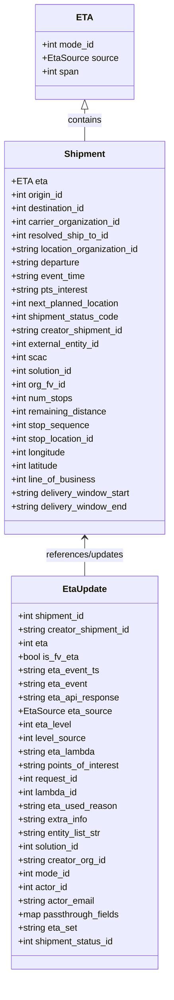

# Diagram: shipment_core/shipment_service/shipment_service/eta/tests/test_eta_entities.py

> Auto-generated by Obscura crawlers

## Mermaid

### SVG

<svg id="container" width="308.875" xmlns="http://www.w3.org/2000/svg" class="classDiagram" height="1724" viewBox="0 0 308.875 1724" role="graphics-document document" aria-roledescription="class"><g><defs><marker id="container_class-aggregationStart" class="marker aggregation class" refX="18" refY="7" markerWidth="190" markerHeight="240" orient="auto"><path d="M 18,7 L9,13 L1,7 L9,1 Z"></path></marker></defs><defs><marker id="container_class-aggregationEnd" class="marker aggregation class" refX="1" refY="7" markerWidth="20" markerHeight="28" orient="auto"><path d="M 18,7 L9,13 L1,7 L9,1 Z"></path></marker></defs><defs><marker id="container_class-extensionStart" class="marker extension class" refX="18" refY="7" markerWidth="190" markerHeight="240" orient="auto"><path d="M 1,7 L18,13 V 1 Z"></path></marker></defs><defs><marker id="container_class-extensionEnd" class="marker extension class" refX="1" refY="7" markerWidth="20" markerHeight="28" orient="auto"><path d="M 1,1 V 13 L18,7 Z"></path></marker></defs><defs><marker id="container_class-compositionStart" class="marker composition class" refX="18" refY="7" markerWidth="190" markerHeight="240" orient="auto"><path d="M 18,7 L9,13 L1,7 L9,1 Z"></path></marker></defs><defs><marker id="container_class-compositionEnd" class="marker composition class" refX="1" refY="7" markerWidth="20" markerHeight="28" orient="auto"><path d="M 18,7 L9,13 L1,7 L9,1 Z"></path></marker></defs><defs><marker id="container_class-dependencyStart" class="marker dependency class" refX="6" refY="7" markerWidth="190" markerHeight="240" orient="auto"><path d="M 5,7 L9,13 L1,7 L9,1 Z"></path></marker></defs><defs><marker id="container_class-dependencyEnd" class="marker dependency class" refX="13" refY="7" markerWidth="20" markerHeight="28" orient="auto"><path d="M 18,7 L9,13 L14,7 L9,1 Z"></path></marker></defs><defs><marker id="container_class-lollipopStart" class="marker lollipop class" refX="13" refY="7" markerWidth="190" markerHeight="240" orient="auto"><circle stroke="black" fill="transparent" cx="7" cy="7" r="6"></circle></marker></defs><defs><marker id="container_class-lollipopEnd" class="marker lollipop class" refX="1" refY="7" markerWidth="190" markerHeight="240" orient="auto"><circle stroke="black" fill="transparent" cx="7" cy="7" r="6"></circle></marker></defs><g class="root"><g class="clusters"></g><g class="edgePaths"><path d="M154.438,193.25L154.438,196.542C154.438,199.833,154.438,206.417,154.438,215.875C154.438,225.333,154.438,237.667,154.438,243.833L154.438,250" id="id_ETA_Shipment_1" class="edge-thickness-normal edge-pattern-solid relation" style=";;;" data-edge="true" data-et="edge" data-id="id_ETA_Shipment_1" data-points="W3sieCI6MTU0LjQzNzUsInkiOjE3Nn0seyJ4IjoxNTQuNDM3NSwieSI6MjEzfSx7IngiOjE1NC40Mzc1LCJ5IjoyNTB9XQ==" marker-start="url(#container_class-extensionStart)"></path><path d="M154.438,952L154.438,957.167C154.438,962.333,154.438,972.667,154.438,984C154.438,995.333,154.438,1007.667,154.438,1013.833L154.438,1020" id="id_Shipment_EtaUpdate_2" class="edge-thickness-normal edge-pattern-solid relation" style=";;;" data-edge="true" data-et="edge" data-id="id_Shipment_EtaUpdate_2" data-points="W3sieCI6MTU0LjQzNzUsInkiOjk0Nn0seyJ4IjoxNTQuNDM3NSwieSI6OTgzfSx7IngiOjE1NC40Mzc1LCJ5IjoxMDIwfV0=" marker-start="url(#container_class-dependencyStart)"></path></g><g class="edgeLabels"><g class="edgeLabel" transform="translate(154.4375, 213)"><g class="label" data-id="id_ETA_Shipment_1" transform="translate(-30.890625, -12)"><foreignObject width="61.78125" height="24">

contains

</foreignObject></g></g><g class="edgeLabel" transform="translate(154.4375, 983)"><g class="label" data-id="id_Shipment_EtaUpdate_2" transform="translate(-71.15625, -12)"><foreignObject width="142.3125" height="24">

references/updates

</foreignObject></g></g></g><g class="nodes"><g class="node default" id="classId-ETA-0" transform="translate(154.4375, 92)"><g class="basic label-container"><path d="M-84.38671875 -84 L84.38671875 -84 L84.38671875 84 L-84.38671875 84" stroke="none" stroke-width="0" fill="#ECECFF" style=""></path><path d="M-84.38671875 -84 C-50.44641208991428 -84, -16.506105429828565 -84, 84.38671875 -84 M-84.38671875 -84 C-24.474890883009678 -84, 35.436936983980644 -84, 84.38671875 -84 M84.38671875 -84 C84.38671875 -24.585433525991434, 84.38671875 34.82913294801713, 84.38671875 84 M84.38671875 -84 C84.38671875 -41.874000287785634, 84.38671875 0.2519994244287318, 84.38671875 84 M84.38671875 84 C50.026948051329036 84, 15.667177352658072 84, -84.38671875 84 M84.38671875 84 C17.274492407248147 84, -49.83773393550371 84, -84.38671875 84 M-84.38671875 84 C-84.38671875 35.408303274411125, -84.38671875 -13.18339345117775, -84.38671875 -84 M-84.38671875 84 C-84.38671875 17.45134711564461, -84.38671875 -49.09730576871078, -84.38671875 -84" stroke="#9370DB" stroke-width="1.3" fill="none" stroke-dasharray="0 0" style=""></path></g><g class="annotation-group text" transform="translate(0, -60)"></g><g class="label-group text" transform="translate(-12.8515625, -60)"><g class="label" style="font-weight: bolder" transform="translate(0,-12)"><foreignObject width="25.703125" height="24">

ETA

</foreignObject></g></g><g class="members-group text" transform="translate(-72.38671875, -12)"><g class="label" style="" transform="translate(0,-12)"><foreignObject width="95.3125" height="24">

+int mode_id

</foreignObject></g><g class="label" style="" transform="translate(0,12)"><foreignObject width="131.921875" height="24">

+EtaSource source

</foreignObject></g><g class="label" style="" transform="translate(0,36)"><foreignObject width="66.796875" height="24">

+int span

</foreignObject></g></g><g class="methods-group text" transform="translate(-72.38671875, 84)"></g><g class="divider" style=""><path d="M-84.38671875 -36 C-41.2324040172145 -36, 1.921910715571002 -36, 84.38671875 -36 M-84.38671875 -36 C-34.59112599422839 -36, 15.204466761543216 -36, 84.38671875 -36" stroke="#9370DB" stroke-width="1.3" fill="none" stroke-dasharray="0 0" style=""></path></g><g class="divider" style=""><path d="M-84.38671875 60 C-48.2285735550967 60, -12.070428360193404 60, 84.38671875 60 M-84.38671875 60 C-49.11594489774054 60, -13.84517104548108 60, 84.38671875 60" stroke="#9370DB" stroke-width="1.3" fill="none" stroke-dasharray="0 0" style=""></path></g></g><g class="node default" id="classId-Shipment-1" transform="translate(154.4375, 598)"><g class="basic label-container"><path d="M-146.4375 -348 L146.4375 -348 L146.4375 348 L-146.4375 348" stroke="none" stroke-width="0" fill="#ECECFF" style=""></path><path d="M-146.4375 -348 C-71.52774861170755 -348, 3.3820027765848977 -348, 146.4375 -348 M-146.4375 -348 C-66.98845200819778 -348, 12.460595983604435 -348, 146.4375 -348 M146.4375 -348 C146.4375 -140.8050478186887, 146.4375 66.38990436262259, 146.4375 348 M146.4375 -348 C146.4375 -116.27076174042503, 146.4375 115.45847651914994, 146.4375 348 M146.4375 348 C42.811461719430156 348, -60.81457656113969 348, -146.4375 348 M146.4375 348 C62.82048076452749 348, -20.796538470945023 348, -146.4375 348 M-146.4375 348 C-146.4375 141.01236426881397, -146.4375 -65.97527146237206, -146.4375 -348 M-146.4375 348 C-146.4375 169.18735732102618, -146.4375 -9.625285357947632, -146.4375 -348" stroke="#9370DB" stroke-width="1.3" fill="none" stroke-dasharray="0 0" style=""></path></g><g class="annotation-group text" transform="translate(0, -324)"></g><g class="label-group text" transform="translate(-35.109375, -324)"><g class="label" style="font-weight: bolder" transform="translate(0,-12)"><foreignObject width="70.21875" height="24">

Shipment

</foreignObject></g></g><g class="members-group text" transform="translate(-134.4375, -276)"><g class="label" style="" transform="translate(0,-12)"><foreignObject width="60.515625" height="24">

+ETA eta

</foreignObject></g><g class="label" style="" transform="translate(0,12)"><foreignObject width="96.53125" height="24">

+int origin_id

</foreignObject></g><g class="label" style="" transform="translate(0,36)"><foreignObject width="137.4375" height="24">

+int destination_id

</foreignObject></g><g class="label" style="" transform="translate(0,60)"><foreignObject width="199.3125" height="24">

+int carrier_organization_id

</foreignObject></g><g class="label" style="" transform="translate(0,84)"><foreignObject width="177.578125" height="24">

+int resolved_ship_to_id

</foreignObject></g><g class="label" style="" transform="translate(0,108)"><foreignObject width="233.765625" height="24">

+string location_organization_id

</foreignObject></g><g class="label" style="" transform="translate(0,132)"><foreignObject width="125.875" height="24">

+string departure

</foreignObject></g><g class="label" style="" transform="translate(0,156)"><foreignObject width="134.921875" height="24">

+string event_time

</foreignObject></g><g class="label" style="" transform="translate(0,180)"><foreignObject width="140.421875" height="24">

+string pts_interest

</foreignObject></g><g class="label" style="" transform="translate(0,204)"><foreignObject width="198.875" height="24">

+int next_planned_location

</foreignObject></g><g class="label" style="" transform="translate(0,228)"><foreignObject width="195.703125" height="24">

+int shipment_status_code

</foreignObject></g><g class="label" style="" transform="translate(0,252)"><foreignObject width="203.421875" height="24">

+string creator_shipment_id

</foreignObject></g><g class="label" style="" transform="translate(0,276)"><foreignObject width="163.140625" height="24">

+int external_entity_id

</foreignObject></g><g class="label" style="" transform="translate(0,300)"><foreignObject width="63.203125" height="24">

+int scac

</foreignObject></g><g class="label" style="" transform="translate(0,324)"><foreignObject width="114.125" height="24">

+int solution_id

</foreignObject></g><g class="label" style="" transform="translate(0,348)"><foreignObject width="98.71875" height="24">

+int org_fv_id

</foreignObject></g><g class="label" style="" transform="translate(0,372)"><foreignObject width="111.9375" height="24">

+int num_stops

</foreignObject></g><g class="label" style="" transform="translate(0,396)"><foreignObject width="174.234375" height="24">

+int remaining_distance

</foreignObject></g><g class="label" style="" transform="translate(0,420)"><foreignObject width="140.96875" height="24">

+int stop_sequence

</foreignObject></g><g class="label" style="" transform="translate(0,444)"><foreignObject width="153.140625" height="24">

+int stop_location_id

</foreignObject></g><g class="label" style="" transform="translate(0,468)"><foreignObject width="101.4375" height="24">

+int longitude

</foreignObject></g><g class="label" style="" transform="translate(0,492)"><foreignObject width="88.875" height="24">

+int latitude

</foreignObject></g><g class="label" style="" transform="translate(0,516)"><foreignObject width="153.09375" height="24">

+int line_of_business

</foreignObject></g><g class="label" style="" transform="translate(0,540)"><foreignObject width="216.984375" height="24">

+string delivery_window_start

</foreignObject></g><g class="label" style="" transform="translate(0,564)"><foreignObject width="210.53125" height="24">

+string delivery_window_end

</foreignObject></g></g><g class="methods-group text" transform="translate(-134.4375, 348)"></g><g class="divider" style=""><path d="M-146.4375 -300 C-64.23538476447547 -300, 17.96673047104906 -300, 146.4375 -300 M-146.4375 -300 C-60.49549956367407 -300, 25.446500872651853 -300, 146.4375 -300" stroke="#9370DB" stroke-width="1.3" fill="none" stroke-dasharray="0 0" style=""></path></g><g class="divider" style=""><path d="M-146.4375 324 C-71.34800380112577 324, 3.741492397748459 324, 146.4375 324 M-146.4375 324 C-33.866349746628345 324, 78.70480050674331 324, 146.4375 324" stroke="#9370DB" stroke-width="1.3" fill="none" stroke-dasharray="0 0" style=""></path></g></g><g class="node default" id="classId-EtaUpdate-2" transform="translate(154.4375, 1368)"><g class="basic label-container"><path d="M-132.6953125 -348 L132.6953125 -348 L132.6953125 348 L-132.6953125 348" stroke="none" stroke-width="0" fill="#ECECFF" style=""></path><path d="M-132.6953125 -348 C-64.89412174599835 -348, 2.9070690080033046 -348, 132.6953125 -348 M-132.6953125 -348 C-50.57518030884553 -348, 31.544951882308936 -348, 132.6953125 -348 M132.6953125 -348 C132.6953125 -172.2306865805414, 132.6953125 3.538626838917196, 132.6953125 348 M132.6953125 -348 C132.6953125 -193.41753105368204, 132.6953125 -38.83506210736408, 132.6953125 348 M132.6953125 348 C33.819269956540566 348, -65.05677258691887 348, -132.6953125 348 M132.6953125 348 C48.8793023807073 348, -34.9367077385854 348, -132.6953125 348 M-132.6953125 348 C-132.6953125 123.17372011526746, -132.6953125 -101.65255976946509, -132.6953125 -348 M-132.6953125 348 C-132.6953125 75.19363219083425, -132.6953125 -197.6127356183315, -132.6953125 -348" stroke="#9370DB" stroke-width="1.3" fill="none" stroke-dasharray="0 0" style=""></path></g><g class="annotation-group text" transform="translate(0, -324)"></g><g class="label-group text" transform="translate(-37.96875, -324)"><g class="label" style="font-weight: bolder" transform="translate(0,-12)"><foreignObject width="75.9375" height="24">

EtaUpdate

</foreignObject></g></g><g class="members-group text" transform="translate(-120.6953125, -276)"><g class="label" style="" transform="translate(0,-12)"><foreignObject width="122.75" height="24">

+int shipment_id

</foreignObject></g><g class="label" style="" transform="translate(0,12)"><foreignObject width="203.421875" height="24">

+string creator_shipment_id

</foreignObject></g><g class="label" style="" transform="translate(0,36)"><foreignObject width="54.984375" height="24">

+int eta

</foreignObject></g><g class="label" style="" transform="translate(0,60)"><foreignObject width="108.609375" height="24">

+bool is_fv_eta

</foreignObject></g><g class="label" style="" transform="translate(0,84)"><foreignObject width="146.53125" height="24">

+string eta_event_ts

</foreignObject></g><g class="label" style="" transform="translate(0,108)"><foreignObject width="125.28125" height="24">

+string eta_event

</foreignObject></g><g class="label" style="" transform="translate(0,132)"><foreignObject width="182.296875" height="24">

+string eta_api_response

</foreignObject></g><g class="label" style="" transform="translate(0,156)"><foreignObject width="163.34375" height="24">

+EtaSource eta_source

</foreignObject></g><g class="label" style="" transform="translate(0,180)"><foreignObject width="97.625" height="24">

+int eta_level

</foreignObject></g><g class="label" style="" transform="translate(0,204)"><foreignObject width="122.5625" height="24">

+int level_source

</foreignObject></g><g class="label" style="" transform="translate(0,228)"><foreignObject width="139.90625" height="24">

+string eta_lambda

</foreignObject></g><g class="label" style="" transform="translate(0,252)"><foreignObject width="185.875" height="24">

+string points_of_interest

</foreignObject></g><g class="label" style="" transform="translate(0,276)"><foreignObject width="109.5625" height="24">

+int request_id

</foreignObject></g><g class="label" style="" transform="translate(0,300)"><foreignObject width="109.09375" height="24">

+int lambda_id

</foreignObject></g><g class="label" style="" transform="translate(0,324)"><foreignObject width="177.34375" height="24">

+string eta_used_reason

</foreignObject></g><g class="label" style="" transform="translate(0,348)"><foreignObject width="127.046875" height="24">

+string extra_info

</foreignObject></g><g class="label" style="" transform="translate(0,372)"><foreignObject width="153.6875" height="24">

+string entity_list_str

</foreignObject></g><g class="label" style="" transform="translate(0,396)"><foreignObject width="114.125" height="24">

+int solution_id

</foreignObject></g><g class="label" style="" transform="translate(0,420)"><foreignObject width="158.3125" height="24">

+string creator_org_id

</foreignObject></g><g class="label" style="" transform="translate(0,444)"><foreignObject width="95.3125" height="24">

+int mode_id

</foreignObject></g><g class="label" style="" transform="translate(0,468)"><foreignObject width="90.421875" height="24">

+int actor_id

</foreignObject></g><g class="label" style="" transform="translate(0,492)"><foreignObject width="138.328125" height="24">

+string actor_email

</foreignObject></g><g class="label" style="" transform="translate(0,516)"><foreignObject width="181.59375" height="24">

+map passthrough_fields

</foreignObject></g><g class="label" style="" transform="translate(0,540)"><foreignObject width="107.234375" height="24">

+string eta_set

</foreignObject></g><g class="label" style="" transform="translate(0,564)"><foreignObject width="175.140625" height="24">

+int shipment_status_id

</foreignObject></g></g><g class="methods-group text" transform="translate(-120.6953125, 348)"></g><g class="divider" style=""><path d="M-132.6953125 -300 C-49.2467475278786 -300, 34.201817444242806 -300, 132.6953125 -300 M-132.6953125 -300 C-43.76089518291195 -300, 45.173522134176096 -300, 132.6953125 -300" stroke="#9370DB" stroke-width="1.3" fill="none" stroke-dasharray="0 0" style=""></path></g><g class="divider" style=""><path d="M-132.6953125 324 C-37.607939739567385 324, 57.47943302086523 324, 132.6953125 324 M-132.6953125 324 C-56.58004684013508 324, 19.535218819729835 324, 132.6953125 324" stroke="#9370DB" stroke-width="1.3" fill="none" stroke-dasharray="0 0" style=""></path></g></g></g></g></g></svg>
