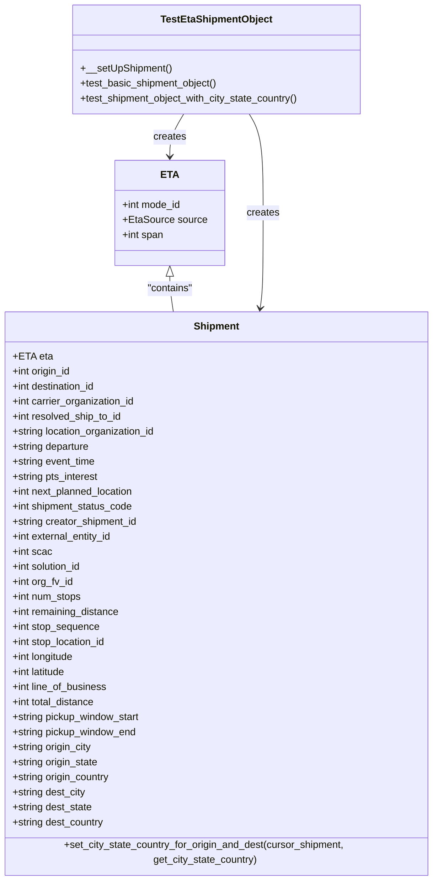
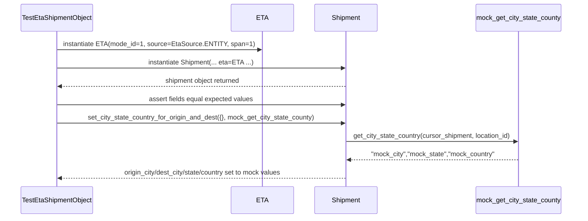

# Diagram: shipment_core/shipment_service/shipment_service/eta/tests/test_eta_shipment_object.py

> Auto-generated by Obscura crawlers

## Diagram 1

### SVG

<svg id="container" width="700.796875" xmlns="http://www.w3.org/2000/svg" class="classDiagram" height="1394" viewBox="0 0 700.796875 1394" role="graphics-document document" aria-roledescription="class"><g><defs><marker id="container_class-aggregationStart" class="marker aggregation class" refX="18" refY="7" markerWidth="190" markerHeight="240" orient="auto"><path d="M 18,7 L9,13 L1,7 L9,1 Z"></path></marker></defs><defs><marker id="container_class-aggregationEnd" class="marker aggregation class" refX="1" refY="7" markerWidth="20" markerHeight="28" orient="auto"><path d="M 18,7 L9,13 L1,7 L9,1 Z"></path></marker></defs><defs><marker id="container_class-extensionStart" class="marker extension class" refX="18" refY="7" markerWidth="190" markerHeight="240" orient="auto"><path d="M 1,7 L18,13 V 1 Z"></path></marker></defs><defs><marker id="container_class-extensionEnd" class="marker extension class" refX="1" refY="7" markerWidth="20" markerHeight="28" orient="auto"><path d="M 1,1 V 13 L18,7 Z"></path></marker></defs><defs><marker id="container_class-compositionStart" class="marker composition class" refX="18" refY="7" markerWidth="190" markerHeight="240" orient="auto"><path d="M 18,7 L9,13 L1,7 L9,1 Z"></path></marker></defs><defs><marker id="container_class-compositionEnd" class="marker composition class" refX="1" refY="7" markerWidth="20" markerHeight="28" orient="auto"><path d="M 18,7 L9,13 L1,7 L9,1 Z"></path></marker></defs><defs><marker id="container_class-dependencyStart" class="marker dependency class" refX="6" refY="7" markerWidth="190" markerHeight="240" orient="auto"><path d="M 5,7 L9,13 L1,7 L9,1 Z"></path></marker></defs><defs><marker id="container_class-dependencyEnd" class="marker dependency class" refX="13" refY="7" markerWidth="20" markerHeight="28" orient="auto"><path d="M 18,7 L9,13 L14,7 L9,1 Z"></path></marker></defs><defs><marker id="container_class-lollipopStart" class="marker lollipop class" refX="13" refY="7" markerWidth="190" markerHeight="240" orient="auto"><circle stroke="black" fill="transparent" cx="7" cy="7" r="6"></circle></marker></defs><defs><marker id="container_class-lollipopEnd" class="marker lollipop class" refX="1" refY="7" markerWidth="190" markerHeight="240" orient="auto"><circle stroke="black" fill="transparent" cx="7" cy="7" r="6"></circle></marker></defs><g class="root"><g class="clusters"></g><g class="edgePaths"><path d="M277.619,441.25L277.619,444.542C277.619,447.833,277.619,454.417,278.552,463.875C279.485,473.333,281.351,485.667,282.284,491.833L283.218,498" id="id_ETA_Shipment_1" class="edge-thickness-normal edge-pattern-solid relation" style=";;;" data-edge="true" data-et="edge" data-id="id_ETA_Shipment_1" data-points="W3sieCI6Mjc3LjYxOTE0MDYyNSwieSI6NDI0fSx7IngiOjI3Ny42MTkxNDA2MjUsInkiOjQ2MX0seyJ4IjoyODMuMjE3NTQ4MDc2OTIzMSwieSI6NDk4fV0=" marker-start="url(#container_class-extensionStart)"></path><path d="M401.461,182L405.081,188.167C408.7,194.333,415.939,206.667,419.558,233C423.178,259.333,423.178,299.667,423.178,340C423.178,380.333,423.178,420.667,422.394,446.011C421.611,471.356,420.044,481.712,419.26,486.89L418.477,492.068" id="id_TestEtaShipmentObject_Shipment_2" class="edge-thickness-normal edge-pattern-solid relation" style=";;;" data-edge="true" data-et="edge" data-id="id_TestEtaShipmentObject_Shipment_2" data-points="W3sieCI6NDAxLjQ2MTMzMTI3NTIwMTYsInkiOjE4Mn0seyJ4Ijo0MjMuMTc3NzM0Mzc1LCJ5IjoyMTl9LHsieCI6NDIzLjE3NzczNDM3NSwieSI6MzQwfSx7IngiOjQyMy4xNzc3MzQzNzUsInkiOjQ2MX0seyJ4Ijo0MTcuNTc5MzI2OTIzMDc2OSwieSI6NDk4fV0=" marker-end="url(#container_class-dependencyEnd)"></path><path d="M299.336,182L295.716,188.167C292.097,194.333,284.858,206.667,281.239,218C277.619,229.333,277.619,239.667,277.619,244.833L277.619,250" id="id_TestEtaShipmentObject_ETA_3" class="edge-thickness-normal edge-pattern-solid relation" style=";;;" data-edge="true" data-et="edge" data-id="id_TestEtaShipmentObject_ETA_3" data-points="W3sieCI6Mjk5LjMzNTU0MzcyNDc5ODQsInkiOjE4Mn0seyJ4IjoyNzcuNjE5MTQwNjI1LCJ5IjoyMTl9LHsieCI6Mjc3LjYxOTE0MDYyNSwieSI6MjU2fV0=" marker-end="url(#container_class-dependencyEnd)"></path></g><g class="edgeLabels"><g class="edgeLabel" transform="translate(277.619140625, 461)"><g class="label" data-id="id_ETA_Shipment_1" transform="translate(-37.078125, -12)"><foreignObject width="74.15625" height="24">

"contains"

</foreignObject></g></g><g class="edgeLabel" transform="translate(423.177734375, 340)"><g class="label" data-id="id_TestEtaShipmentObject_Shipment_2" transform="translate(-26.171875, -12)"><foreignObject width="52.34375" height="24">

creates

</foreignObject></g></g><g class="edgeLabel" transform="translate(277.619140625, 219)"><g class="label" data-id="id_TestEtaShipmentObject_ETA_3" transform="translate(-26.171875, -12)"><foreignObject width="52.34375" height="24">

creates

</foreignObject></g></g></g><g class="nodes"><g class="node default" id="classId-ETA-0" transform="translate(277.619140625, 340)"><g class="basic label-container"><path d="M-84.38671875 -84 L84.38671875 -84 L84.38671875 84 L-84.38671875 84" stroke="none" stroke-width="0" fill="#ECECFF" style=""></path><path d="M-84.38671875 -84 C-21.074507085354767 -84, 42.237704579290465 -84, 84.38671875 -84 M-84.38671875 -84 C-20.77420990294489 -84, 42.83829894411022 -84, 84.38671875 -84 M84.38671875 -84 C84.38671875 -45.83741992383498, 84.38671875 -7.674839847669958, 84.38671875 84 M84.38671875 -84 C84.38671875 -17.32310462594434, 84.38671875 49.35379074811132, 84.38671875 84 M84.38671875 84 C17.03965885174121 84, -50.30740104651758 84, -84.38671875 84 M84.38671875 84 C47.76653995854841 84, 11.146361167096813 84, -84.38671875 84 M-84.38671875 84 C-84.38671875 18.201738845509837, -84.38671875 -47.596522308980326, -84.38671875 -84 M-84.38671875 84 C-84.38671875 37.24642174093178, -84.38671875 -9.50715651813644, -84.38671875 -84" stroke="#9370DB" stroke-width="1.3" fill="none" stroke-dasharray="0 0" style=""></path></g><g class="annotation-group text" transform="translate(0, -60)"></g><g class="label-group text" transform="translate(-12.8515625, -60)"><g class="label" style="font-weight: bolder" transform="translate(0,-12)"><foreignObject width="25.703125" height="24">

ETA

</foreignObject></g></g><g class="members-group text" transform="translate(-72.38671875, -12)"><g class="label" style="" transform="translate(0,-12)"><foreignObject width="95.3125" height="24">

+int mode_id

</foreignObject></g><g class="label" style="" transform="translate(0,12)"><foreignObject width="131.921875" height="24">

+EtaSource source

</foreignObject></g><g class="label" style="" transform="translate(0,36)"><foreignObject width="66.796875" height="24">

+int span

</foreignObject></g></g><g class="methods-group text" transform="translate(-72.38671875, 84)"></g><g class="divider" style=""><path d="M-84.38671875 -36 C-40.55353860417952 -36, 3.279641541640956 -36, 84.38671875 -36 M-84.38671875 -36 C-49.784311690171975 -36, -15.18190463034395 -36, 84.38671875 -36" stroke="#9370DB" stroke-width="1.3" fill="none" stroke-dasharray="0 0" style=""></path></g><g class="divider" style=""><path d="M-84.38671875 60 C-49.03630964257354 60, -13.685900535147084 60, 84.38671875 60 M-84.38671875 60 C-49.966920646035774 60, -15.547122542071548 60, 84.38671875 60" stroke="#9370DB" stroke-width="1.3" fill="none" stroke-dasharray="0 0" style=""></path></g></g><g class="node default" id="classId-Shipment-1" transform="translate(350.3984375, 942)"><g class="basic label-container"><path d="M-342.3984375 -444 L342.3984375 -444 L342.3984375 444 L-342.3984375 444" stroke="none" stroke-width="0" fill="#ECECFF" style=""></path><path d="M-342.3984375 -444 C-97.98785462074073 -444, 146.42272825851853 -444, 342.3984375 -444 M-342.3984375 -444 C-79.74785924578947 -444, 182.90271900842106 -444, 342.3984375 -444 M342.3984375 -444 C342.3984375 -136.98411364632585, 342.3984375 170.0317727073483, 342.3984375 444 M342.3984375 -444 C342.3984375 -154.99634072824443, 342.3984375 134.00731854351113, 342.3984375 444 M342.3984375 444 C118.21105585538297 444, -105.97632578923407 444, -342.3984375 444 M342.3984375 444 C150.10031317453357 444, -42.197811150932864 444, -342.3984375 444 M-342.3984375 444 C-342.3984375 234.94268074468198, -342.3984375 25.88536148936396, -342.3984375 -444 M-342.3984375 444 C-342.3984375 188.3655826925873, -342.3984375 -67.26883461482538, -342.3984375 -444" stroke="#9370DB" stroke-width="1.3" fill="none" stroke-dasharray="0 0" style=""></path></g><g class="annotation-group text" transform="translate(0, -420)"></g><g class="label-group text" transform="translate(-35.109375, -420)"><g class="label" style="font-weight: bolder" transform="translate(0,-12)"><foreignObject width="70.21875" height="24">

Shipment

</foreignObject></g></g><g class="members-group text" transform="translate(-330.3984375, -372)"><g class="label" style="" transform="translate(0,-12)"><foreignObject width="60.515625" height="24">

+ETA eta

</foreignObject></g><g class="label" style="" transform="translate(0,12)"><foreignObject width="96.53125" height="24">

+int origin_id

</foreignObject></g><g class="label" style="" transform="translate(0,36)"><foreignObject width="137.4375" height="24">

+int destination_id

</foreignObject></g><g class="label" style="" transform="translate(0,60)"><foreignObject width="199.3125" height="24">

+int carrier_organization_id

</foreignObject></g><g class="label" style="" transform="translate(0,84)"><foreignObject width="177.578125" height="24">

+int resolved_ship_to_id

</foreignObject></g><g class="label" style="" transform="translate(0,108)"><foreignObject width="233.765625" height="24">

+string location_organization_id

</foreignObject></g><g class="label" style="" transform="translate(0,132)"><foreignObject width="125.875" height="24">

+string departure

</foreignObject></g><g class="label" style="" transform="translate(0,156)"><foreignObject width="134.921875" height="24">

+string event_time

</foreignObject></g><g class="label" style="" transform="translate(0,180)"><foreignObject width="140.421875" height="24">

+string pts_interest

</foreignObject></g><g class="label" style="" transform="translate(0,204)"><foreignObject width="198.875" height="24">

+int next_planned_location

</foreignObject></g><g class="label" style="" transform="translate(0,228)"><foreignObject width="195.703125" height="24">

+int shipment_status_code

</foreignObject></g><g class="label" style="" transform="translate(0,252)"><foreignObject width="203.421875" height="24">

+string creator_shipment_id

</foreignObject></g><g class="label" style="" transform="translate(0,276)"><foreignObject width="163.140625" height="24">

+int external_entity_id

</foreignObject></g><g class="label" style="" transform="translate(0,300)"><foreignObject width="63.203125" height="24">

+int scac

</foreignObject></g><g class="label" style="" transform="translate(0,324)"><foreignObject width="114.125" height="24">

+int solution_id

</foreignObject></g><g class="label" style="" transform="translate(0,348)"><foreignObject width="98.71875" height="24">

+int org_fv_id

</foreignObject></g><g class="label" style="" transform="translate(0,372)"><foreignObject width="111.9375" height="24">

+int num_stops

</foreignObject></g><g class="label" style="" transform="translate(0,396)"><foreignObject width="174.234375" height="24">

+int remaining_distance

</foreignObject></g><g class="label" style="" transform="translate(0,420)"><foreignObject width="140.96875" height="24">

+int stop_sequence

</foreignObject></g><g class="label" style="" transform="translate(0,444)"><foreignObject width="153.140625" height="24">

+int stop_location_id

</foreignObject></g><g class="label" style="" transform="translate(0,468)"><foreignObject width="101.4375" height="24">

+int longitude

</foreignObject></g><g class="label" style="" transform="translate(0,492)"><foreignObject width="88.875" height="24">

+int latitude

</foreignObject></g><g class="label" style="" transform="translate(0,516)"><foreignObject width="153.09375" height="24">

+int line_of_business

</foreignObject></g><g class="label" style="" transform="translate(0,540)"><foreignObject width="135.015625" height="24">

+int total_distance

</foreignObject></g><g class="label" style="" transform="translate(0,564)"><foreignObject width="207.640625" height="24">

+string pickup_window_start

</foreignObject></g><g class="label" style="" transform="translate(0,588)"><foreignObject width="201.1875" height="24">

+string pickup_window_end

</foreignObject></g><g class="label" style="" transform="translate(0,612)"><foreignObject width="129.828125" height="24">

+string origin_city

</foreignObject></g><g class="label" style="" transform="translate(0,636)"><foreignObject width="140.515625" height="24">

+string origin_state

</foreignObject></g><g class="label" style="" transform="translate(0,660)"><foreignObject width="159.28125" height="24">

+string origin_country

</foreignObject></g><g class="label" style="" transform="translate(0,684)"><foreignObject width="119.125" height="24">

+string dest_city

</foreignObject></g><g class="label" style="" transform="translate(0,708)"><foreignObject width="129.8125" height="24">

+string dest_state

</foreignObject></g><g class="label" style="" transform="translate(0,732)"><foreignObject width="148.578125" height="24">

+string dest_country

</foreignObject></g></g><g class="methods-group text" transform="translate(-330.3984375, 420)"><g class="label" style="" transform="translate(0,-12)"><foreignObject width="625.6875" height="24">

+set_city_state_country_for_origin_and_dest(cursor_shipment, get_city_state_country)

</foreignObject></g></g><g class="divider" style=""><path d="M-342.3984375 -396 C-85.09349446857112 -396, 172.21144856285775 -396, 342.3984375 -396 M-342.3984375 -396 C-162.4819931469874 -396, 17.434451206025187 -396, 342.3984375 -396" stroke="#9370DB" stroke-width="1.3" fill="none" stroke-dasharray="0 0" style=""></path></g><g class="divider" style=""><path d="M-342.3984375 396 C-91.61582555436419 396, 159.16678639127161 396, 342.3984375 396 M-342.3984375 396 C-169.248666551208 396, 3.9011043975839925 396, 342.3984375 396" stroke="#9370DB" stroke-width="1.3" fill="none" stroke-dasharray="0 0" style=""></path></g></g><g class="node default" id="classId-TestEtaShipmentObject-2" transform="translate(350.3984375, 95)"><g class="basic label-container"><path d="M-232.6875 -87 L232.6875 -87 L232.6875 87 L-232.6875 87" stroke="none" stroke-width="0" fill="#ECECFF" style=""></path><path d="M-232.6875 -87 C-64.72972192871171 -87, 103.22805614257658 -87, 232.6875 -87 M-232.6875 -87 C-96.7955537026786 -87, 39.09639259464279 -87, 232.6875 -87 M232.6875 -87 C232.6875 -24.611040017642154, 232.6875 37.77791996471569, 232.6875 87 M232.6875 -87 C232.6875 -29.954166666393263, 232.6875 27.091666667213474, 232.6875 87 M232.6875 87 C80.60685057614151 87, -71.47379884771698 87, -232.6875 87 M232.6875 87 C93.04449074103954 87, -46.59851851792092 87, -232.6875 87 M-232.6875 87 C-232.6875 26.19162411265117, -232.6875 -34.61675177469766, -232.6875 -87 M-232.6875 87 C-232.6875 47.286613549009154, -232.6875 7.573227098018307, -232.6875 -87" stroke="#9370DB" stroke-width="1.3" fill="none" stroke-dasharray="0 0" style=""></path></g><g class="annotation-group text" transform="translate(0, -63)"></g><g class="label-group text" transform="translate(-85.6875, -63)"><g class="label" style="font-weight: bolder" transform="translate(0,-12)"><foreignObject width="171.375" height="24">

TestEtaShipmentObject

</foreignObject></g></g><g class="members-group text" transform="translate(-220.6875, -15)"></g><g class="methods-group text" transform="translate(-220.6875, 15)"><g class="label" style="" transform="translate(0,-12)"><foreignObject width="145.3125" height="24">

+__setUpShipment()

</foreignObject></g><g class="label" style="" transform="translate(0,12)"><foreignObject width="221.859375" height="24">

+test_basic_shipment_object()

</foreignObject></g><g class="label" style="" transform="translate(0,36)"><foreignObject width="355.6875" height="24">

+test_shipment_object_with_city_state_country()

</foreignObject></g></g><g class="divider" style=""><path d="M-232.6875 -39 C-76.67946707870445 -39, 79.3285658425911 -39, 232.6875 -39 M-232.6875 -39 C-118.29613683640892 -39, -3.9047736728178393 -39, 232.6875 -39" stroke="#9370DB" stroke-width="1.3" fill="none" stroke-dasharray="0 0" style=""></path></g><g class="divider" style=""><path d="M-232.6875 -15 C-99.33680614169015 -15, 34.013887716619706 -15, 232.6875 -15 M-232.6875 -15 C-54.1033540863381 -15, 124.4807918273238 -15, 232.6875 -15" stroke="#9370DB" stroke-width="1.3" fill="none" stroke-dasharray="0 0" style=""></path></g></g></g></g></g></svg>

## Diagram 2

### SVG

<svg id="container" width="1471.5" xmlns="http://www.w3.org/2000/svg" height="555" viewBox="-50 -10 1471.5 555" role="graphics-document document" aria-roledescription="sequence"><g><rect x="1147.5" y="469" fill="#eaeaea" stroke="#666" width="224" height="65" name="Mock" rx="3" ry="3" class="actor actor-bottom"></rect><text x="1259.5" y="501.5" dominant-baseline="central" alignment-baseline="central" class="actor actor-box" style="text-anchor: middle; font-size: 16px; font-weight: 400;"><tspan x="1259.5" dy="0">mock_get_city_state_county</tspan></text></g><g><rect x="730.5" y="469" fill="#eaeaea" stroke="#666" width="150" height="65" name="Shipment" rx="3" ry="3" class="actor actor-bottom"></rect><text x="805.5" y="501.5" dominant-baseline="central" alignment-baseline="central" class="actor actor-box" style="text-anchor: middle; font-size: 16px; font-weight: 400;"><tspan x="805.5" dy="0">Shipment</tspan></text></g><g><rect x="530.5" y="469" fill="#eaeaea" stroke="#666" width="150" height="65" name="ETA" rx="3" ry="3" class="actor actor-bottom"></rect><text x="605.5" y="501.5" dominant-baseline="central" alignment-baseline="central" class="actor actor-box" style="text-anchor: middle; font-size: 16px; font-weight: 400;"><tspan x="605.5" dy="0">ETA</tspan></text></g><g><rect x="0" y="469" fill="#eaeaea" stroke="#666" width="189" height="65" name="Test" rx="3" ry="3" class="actor actor-bottom"></rect><text x="94.5" y="501.5" dominant-baseline="central" alignment-baseline="central" class="actor actor-box" style="text-anchor: middle; font-size: 16px; font-weight: 400;"><tspan x="94.5" dy="0">TestEtaShipmentObject</tspan></text></g><g><line id="actor3" x1="1259.5" y1="65" x2="1259.5" y2="469" class="actor-line 200" stroke-width="0.5px" stroke="#999" name="Mock"></line><g id="root-3"><rect x="1147.5" y="0" fill="#eaeaea" stroke="#666" width="224" height="65" name="Mock" rx="3" ry="3" class="actor actor-top"></rect><text x="1259.5" y="32.5" dominant-baseline="central" alignment-baseline="central" class="actor actor-box" style="text-anchor: middle; font-size: 16px; font-weight: 400;"><tspan x="1259.5" dy="0">mock_get_city_state_county</tspan></text></g></g><g><line id="actor2" x1="805.5" y1="65" x2="805.5" y2="469" class="actor-line 200" stroke-width="0.5px" stroke="#999" name="Shipment"></line><g id="root-2"><rect x="730.5" y="0" fill="#eaeaea" stroke="#666" width="150" height="65" name="Shipment" rx="3" ry="3" class="actor actor-top"></rect><text x="805.5" y="32.5" dominant-baseline="central" alignment-baseline="central" class="actor actor-box" style="text-anchor: middle; font-size: 16px; font-weight: 400;"><tspan x="805.5" dy="0">Shipment</tspan></text></g></g><g><line id="actor1" x1="605.5" y1="65" x2="605.5" y2="469" class="actor-line 200" stroke-width="0.5px" stroke="#999" name="ETA"></line><g id="root-1"><rect x="530.5" y="0" fill="#eaeaea" stroke="#666" width="150" height="65" name="ETA" rx="3" ry="3" class="actor actor-top"></rect><text x="605.5" y="32.5" dominant-baseline="central" alignment-baseline="central" class="actor actor-box" style="text-anchor: middle; font-size: 16px; font-weight: 400;"><tspan x="605.5" dy="0">ETA</tspan></text></g></g><g><line id="actor0" x1="94.5" y1="65" x2="94.5" y2="469" class="actor-line 200" stroke-width="0.5px" stroke="#999" name="Test"></line><g id="root-0"><rect x="0" y="0" fill="#eaeaea" stroke="#666" width="189" height="65" name="Test" rx="3" ry="3" class="actor actor-top"></rect><text x="94.5" y="32.5" dominant-baseline="central" alignment-baseline="central" class="actor actor-box" style="text-anchor: middle; font-size: 16px; font-weight: 400;"><tspan x="94.5" dy="0">TestEtaShipmentObject</tspan></text></g></g><g></g><defs><symbol id="computer" width="24" height="24"><path transform="scale(.5)" d="M2 2v13h20v-13h-20zm18 11h-16v-9h16v9zm-10.228 6l.466-1h3.524l.467 1h-4.457zm14.228 3h-24l2-6h2.104l-1.33 4h18.45l-1.297-4h2.073l2 6zm-5-10h-14v-7h14v7z"></path></symbol></defs><defs><symbol id="database" fill-rule="evenodd" clip-rule="evenodd"><path transform="scale(.5)" d="M12.258.001l.256.004.255.005.253.008.251.01.249.012.247.015.246.016.242.019.241.02.239.023.236.024.233.027.231.028.229.031.225.032.223.034.22.036.217.038.214.04.211.041.208.043.205.045.201.046.198.048.194.05.191.051.187.053.183.054.18.056.175.057.172.059.168.06.163.061.16.063.155.064.15.066.074.033.073.033.071.034.07.034.069.035.068.035.067.035.066.035.064.036.064.036.062.036.06.036.06.037.058.037.058.037.055.038.055.038.053.038.052.038.051.039.05.039.048.039.047.039.045.04.044.04.043.04.041.04.04.041.039.041.037.041.036.041.034.041.033.042.032.042.03.042.029.042.027.042.026.043.024.043.023.043.021.043.02.043.018.044.017.043.015.044.013.044.012.044.011.045.009.044.007.045.006.045.004.045.002.045.001.045v17l-.001.045-.002.045-.004.045-.006.045-.007.045-.009.044-.011.045-.012.044-.013.044-.015.044-.017.043-.018.044-.02.043-.021.043-.023.043-.024.043-.026.043-.027.042-.029.042-.03.042-.032.042-.033.042-.034.041-.036.041-.037.041-.039.041-.04.041-.041.04-.043.04-.044.04-.045.04-.047.039-.048.039-.05.039-.051.039-.052.038-.053.038-.055.038-.055.038-.058.037-.058.037-.06.037-.06.036-.062.036-.064.036-.064.036-.066.035-.067.035-.068.035-.069.035-.07.034-.071.034-.073.033-.074.033-.15.066-.155.064-.16.063-.163.061-.168.06-.172.059-.175.057-.18.056-.183.054-.187.053-.191.051-.194.05-.198.048-.201.046-.205.045-.208.043-.211.041-.214.04-.217.038-.22.036-.223.034-.225.032-.229.031-.231.028-.233.027-.236.024-.239.023-.241.02-.242.019-.246.016-.247.015-.249.012-.251.01-.253.008-.255.005-.256.004-.258.001-.258-.001-.256-.004-.255-.005-.253-.008-.251-.01-.249-.012-.247-.015-.245-.016-.243-.019-.241-.02-.238-.023-.236-.024-.234-.027-.231-.028-.228-.031-.226-.032-.223-.034-.22-.036-.217-.038-.214-.04-.211-.041-.208-.043-.204-.045-.201-.046-.198-.048-.195-.05-.19-.051-.187-.053-.184-.054-.179-.056-.176-.057-.172-.059-.167-.06-.164-.061-.159-.063-.155-.064-.151-.066-.074-.033-.072-.033-.072-.034-.07-.034-.069-.035-.068-.035-.067-.035-.066-.035-.064-.036-.063-.036-.062-.036-.061-.036-.06-.037-.058-.037-.057-.037-.056-.038-.055-.038-.053-.038-.052-.038-.051-.039-.049-.039-.049-.039-.046-.039-.046-.04-.044-.04-.043-.04-.041-.04-.04-.041-.039-.041-.037-.041-.036-.041-.034-.041-.033-.042-.032-.042-.03-.042-.029-.042-.027-.042-.026-.043-.024-.043-.023-.043-.021-.043-.02-.043-.018-.044-.017-.043-.015-.044-.013-.044-.012-.044-.011-.045-.009-.044-.007-.045-.006-.045-.004-.045-.002-.045-.001-.045v-17l.001-.045.002-.045.004-.045.006-.045.007-.045.009-.044.011-.045.012-.044.013-.044.015-.044.017-.043.018-.044.02-.043.021-.043.023-.043.024-.043.026-.043.027-.042.029-.042.03-.042.032-.042.033-.042.034-.041.036-.041.037-.041.039-.041.04-.041.041-.04.043-.04.044-.04.046-.04.046-.039.049-.039.049-.039.051-.039.052-.038.053-.038.055-.038.056-.038.057-.037.058-.037.06-.037.061-.036.062-.036.063-.036.064-.036.066-.035.067-.035.068-.035.069-.035.07-.034.072-.034.072-.033.074-.033.151-.066.155-.064.159-.063.164-.061.167-.06.172-.059.176-.057.179-.056.184-.054.187-.053.19-.051.195-.05.198-.048.201-.046.204-.045.208-.043.211-.041.214-.04.217-.038.22-.036.223-.034.226-.032.228-.031.231-.028.234-.027.236-.024.238-.023.241-.02.243-.019.245-.016.247-.015.249-.012.251-.01.253-.008.255-.005.256-.004.258-.001.258.001zm-9.258 20.499v.01l.001.021.003.021.004.022.005.021.006.022.007.022.009.023.01.022.011.023.012.023.013.023.015.023.016.024.017.023.018.024.019.024.021.024.022.025.023.024.024.025.052.049.056.05.061.051.066.051.07.051.075.051.079.052.084.052.088.052.092.052.097.052.102.051.105.052.11.052.114.051.119.051.123.051.127.05.131.05.135.05.139.048.144.049.147.047.152.047.155.047.16.045.163.045.167.043.171.043.176.041.178.041.183.039.187.039.19.037.194.035.197.035.202.033.204.031.209.03.212.029.216.027.219.025.222.024.226.021.23.02.233.018.236.016.24.015.243.012.246.01.249.008.253.005.256.004.259.001.26-.001.257-.004.254-.005.25-.008.247-.011.244-.012.241-.014.237-.016.233-.018.231-.021.226-.021.224-.024.22-.026.216-.027.212-.028.21-.031.205-.031.202-.034.198-.034.194-.036.191-.037.187-.039.183-.04.179-.04.175-.042.172-.043.168-.044.163-.045.16-.046.155-.046.152-.047.148-.048.143-.049.139-.049.136-.05.131-.05.126-.05.123-.051.118-.052.114-.051.11-.052.106-.052.101-.052.096-.052.092-.052.088-.053.083-.051.079-.052.074-.052.07-.051.065-.051.06-.051.056-.05.051-.05.023-.024.023-.025.021-.024.02-.024.019-.024.018-.024.017-.024.015-.023.014-.024.013-.023.012-.023.01-.023.01-.022.008-.022.006-.022.006-.022.004-.022.004-.021.001-.021.001-.021v-4.127l-.077.055-.08.053-.083.054-.085.053-.087.052-.09.052-.093.051-.095.05-.097.05-.1.049-.102.049-.105.048-.106.047-.109.047-.111.046-.114.045-.115.045-.118.044-.12.043-.122.042-.124.042-.126.041-.128.04-.13.04-.132.038-.134.038-.135.037-.138.037-.139.035-.142.035-.143.034-.144.033-.147.032-.148.031-.15.03-.151.03-.153.029-.154.027-.156.027-.158.026-.159.025-.161.024-.162.023-.163.022-.165.021-.166.02-.167.019-.169.018-.169.017-.171.016-.173.015-.173.014-.175.013-.175.012-.177.011-.178.01-.179.008-.179.008-.181.006-.182.005-.182.004-.184.003-.184.002h-.37l-.184-.002-.184-.003-.182-.004-.182-.005-.181-.006-.179-.008-.179-.008-.178-.01-.176-.011-.176-.012-.175-.013-.173-.014-.172-.015-.171-.016-.17-.017-.169-.018-.167-.019-.166-.02-.165-.021-.163-.022-.162-.023-.161-.024-.159-.025-.157-.026-.156-.027-.155-.027-.153-.029-.151-.03-.15-.03-.148-.031-.146-.032-.145-.033-.143-.034-.141-.035-.14-.035-.137-.037-.136-.037-.134-.038-.132-.038-.13-.04-.128-.04-.126-.041-.124-.042-.122-.042-.12-.044-.117-.043-.116-.045-.113-.045-.112-.046-.109-.047-.106-.047-.105-.048-.102-.049-.1-.049-.097-.05-.095-.05-.093-.052-.09-.051-.087-.052-.085-.053-.083-.054-.08-.054-.077-.054v4.127zm0-5.654v.011l.001.021.003.021.004.021.005.022.006.022.007.022.009.022.01.022.011.023.012.023.013.023.015.024.016.023.017.024.018.024.019.024.021.024.022.024.023.025.024.024.052.05.056.05.061.05.066.051.07.051.075.052.079.051.084.052.088.052.092.052.097.052.102.052.105.052.11.051.114.051.119.052.123.05.127.051.131.05.135.049.139.049.144.048.147.048.152.047.155.046.16.045.163.045.167.044.171.042.176.042.178.04.183.04.187.038.19.037.194.036.197.034.202.033.204.032.209.03.212.028.216.027.219.025.222.024.226.022.23.02.233.018.236.016.24.014.243.012.246.01.249.008.253.006.256.003.259.001.26-.001.257-.003.254-.006.25-.008.247-.01.244-.012.241-.015.237-.016.233-.018.231-.02.226-.022.224-.024.22-.025.216-.027.212-.029.21-.03.205-.032.202-.033.198-.035.194-.036.191-.037.187-.039.183-.039.179-.041.175-.042.172-.043.168-.044.163-.045.16-.045.155-.047.152-.047.148-.048.143-.048.139-.05.136-.049.131-.05.126-.051.123-.051.118-.051.114-.052.11-.052.106-.052.101-.052.096-.052.092-.052.088-.052.083-.052.079-.052.074-.051.07-.052.065-.051.06-.05.056-.051.051-.049.023-.025.023-.024.021-.025.02-.024.019-.024.018-.024.017-.024.015-.023.014-.023.013-.024.012-.022.01-.023.01-.023.008-.022.006-.022.006-.022.004-.021.004-.022.001-.021.001-.021v-4.139l-.077.054-.08.054-.083.054-.085.052-.087.053-.09.051-.093.051-.095.051-.097.05-.1.049-.102.049-.105.048-.106.047-.109.047-.111.046-.114.045-.115.044-.118.044-.12.044-.122.042-.124.042-.126.041-.128.04-.13.039-.132.039-.134.038-.135.037-.138.036-.139.036-.142.035-.143.033-.144.033-.147.033-.148.031-.15.03-.151.03-.153.028-.154.028-.156.027-.158.026-.159.025-.161.024-.162.023-.163.022-.165.021-.166.02-.167.019-.169.018-.169.017-.171.016-.173.015-.173.014-.175.013-.175.012-.177.011-.178.009-.179.009-.179.007-.181.007-.182.005-.182.004-.184.003-.184.002h-.37l-.184-.002-.184-.003-.182-.004-.182-.005-.181-.007-.179-.007-.179-.009-.178-.009-.176-.011-.176-.012-.175-.013-.173-.014-.172-.015-.171-.016-.17-.017-.169-.018-.167-.019-.166-.02-.165-.021-.163-.022-.162-.023-.161-.024-.159-.025-.157-.026-.156-.027-.155-.028-.153-.028-.151-.03-.15-.03-.148-.031-.146-.033-.145-.033-.143-.033-.141-.035-.14-.036-.137-.036-.136-.037-.134-.038-.132-.039-.13-.039-.128-.04-.126-.041-.124-.042-.122-.043-.12-.043-.117-.044-.116-.044-.113-.046-.112-.046-.109-.046-.106-.047-.105-.048-.102-.049-.1-.049-.097-.05-.095-.051-.093-.051-.09-.051-.087-.053-.085-.052-.083-.054-.08-.054-.077-.054v4.139zm0-5.666v.011l.001.02.003.022.004.021.005.022.006.021.007.022.009.023.01.022.011.023.012.023.013.023.015.023.016.024.017.024.018.023.019.024.021.025.022.024.023.024.024.025.052.05.056.05.061.05.066.051.07.051.075.052.079.051.084.052.088.052.092.052.097.052.102.052.105.051.11.052.114.051.119.051.123.051.127.05.131.05.135.05.139.049.144.048.147.048.152.047.155.046.16.045.163.045.167.043.171.043.176.042.178.04.183.04.187.038.19.037.194.036.197.034.202.033.204.032.209.03.212.028.216.027.219.025.222.024.226.021.23.02.233.018.236.017.24.014.243.012.246.01.249.008.253.006.256.003.259.001.26-.001.257-.003.254-.006.25-.008.247-.01.244-.013.241-.014.237-.016.233-.018.231-.02.226-.022.224-.024.22-.025.216-.027.212-.029.21-.03.205-.032.202-.033.198-.035.194-.036.191-.037.187-.039.183-.039.179-.041.175-.042.172-.043.168-.044.163-.045.16-.045.155-.047.152-.047.148-.048.143-.049.139-.049.136-.049.131-.051.126-.05.123-.051.118-.052.114-.051.11-.052.106-.052.101-.052.096-.052.092-.052.088-.052.083-.052.079-.052.074-.052.07-.051.065-.051.06-.051.056-.05.051-.049.023-.025.023-.025.021-.024.02-.024.019-.024.018-.024.017-.024.015-.023.014-.024.013-.023.012-.023.01-.022.01-.023.008-.022.006-.022.006-.022.004-.022.004-.021.001-.021.001-.021v-4.153l-.077.054-.08.054-.083.053-.085.053-.087.053-.09.051-.093.051-.095.051-.097.05-.1.049-.102.048-.105.048-.106.048-.109.046-.111.046-.114.046-.115.044-.118.044-.12.043-.122.043-.124.042-.126.041-.128.04-.13.039-.132.039-.134.038-.135.037-.138.036-.139.036-.142.034-.143.034-.144.033-.147.032-.148.032-.15.03-.151.03-.153.028-.154.028-.156.027-.158.026-.159.024-.161.024-.162.023-.163.023-.165.021-.166.02-.167.019-.169.018-.169.017-.171.016-.173.015-.173.014-.175.013-.175.012-.177.01-.178.01-.179.009-.179.007-.181.006-.182.006-.182.004-.184.003-.184.001-.185.001-.185-.001-.184-.001-.184-.003-.182-.004-.182-.006-.181-.006-.179-.007-.179-.009-.178-.01-.176-.01-.176-.012-.175-.013-.173-.014-.172-.015-.171-.016-.17-.017-.169-.018-.167-.019-.166-.02-.165-.021-.163-.023-.162-.023-.161-.024-.159-.024-.157-.026-.156-.027-.155-.028-.153-.028-.151-.03-.15-.03-.148-.032-.146-.032-.145-.033-.143-.034-.141-.034-.14-.036-.137-.036-.136-.037-.134-.038-.132-.039-.13-.039-.128-.041-.126-.041-.124-.041-.122-.043-.12-.043-.117-.044-.116-.044-.113-.046-.112-.046-.109-.046-.106-.048-.105-.048-.102-.048-.1-.05-.097-.049-.095-.051-.093-.051-.09-.052-.087-.052-.085-.053-.083-.053-.08-.054-.077-.054v4.153zm8.74-8.179l-.257.004-.254.005-.25.008-.247.011-.244.012-.241.014-.237.016-.233.018-.231.021-.226.022-.224.023-.22.026-.216.027-.212.028-.21.031-.205.032-.202.033-.198.034-.194.036-.191.038-.187.038-.183.04-.179.041-.175.042-.172.043-.168.043-.163.045-.16.046-.155.046-.152.048-.148.048-.143.048-.139.049-.136.05-.131.05-.126.051-.123.051-.118.051-.114.052-.11.052-.106.052-.101.052-.096.052-.092.052-.088.052-.083.052-.079.052-.074.051-.07.052-.065.051-.06.05-.056.05-.051.05-.023.025-.023.024-.021.024-.02.025-.019.024-.018.024-.017.023-.015.024-.014.023-.013.023-.012.023-.01.023-.01.022-.008.022-.006.023-.006.021-.004.022-.004.021-.001.021-.001.021.001.021.001.021.004.021.004.022.006.021.006.023.008.022.01.022.01.023.012.023.013.023.014.023.015.024.017.023.018.024.019.024.02.025.021.024.023.024.023.025.051.05.056.05.06.05.065.051.07.052.074.051.079.052.083.052.088.052.092.052.096.052.101.052.106.052.11.052.114.052.118.051.123.051.126.051.131.05.136.05.139.049.143.048.148.048.152.048.155.046.16.046.163.045.168.043.172.043.175.042.179.041.183.04.187.038.191.038.194.036.198.034.202.033.205.032.21.031.212.028.216.027.22.026.224.023.226.022.231.021.233.018.237.016.241.014.244.012.247.011.25.008.254.005.257.004.26.001.26-.001.257-.004.254-.005.25-.008.247-.011.244-.012.241-.014.237-.016.233-.018.231-.021.226-.022.224-.023.22-.026.216-.027.212-.028.21-.031.205-.032.202-.033.198-.034.194-.036.191-.038.187-.038.183-.04.179-.041.175-.042.172-.043.168-.043.163-.045.16-.046.155-.046.152-.048.148-.048.143-.048.139-.049.136-.05.131-.05.126-.051.123-.051.118-.051.114-.052.11-.052.106-.052.101-.052.096-.052.092-.052.088-.052.083-.052.079-.052.074-.051.07-.052.065-.051.06-.05.056-.05.051-.05.023-.025.023-.024.021-.024.02-.025.019-.024.018-.024.017-.023.015-.024.014-.023.013-.023.012-.023.01-.023.01-.022.008-.022.006-.023.006-.021.004-.022.004-.021.001-.021.001-.021-.001-.021-.001-.021-.004-.021-.004-.022-.006-.021-.006-.023-.008-.022-.01-.022-.01-.023-.012-.023-.013-.023-.014-.023-.015-.024-.017-.023-.018-.024-.019-.024-.02-.025-.021-.024-.023-.024-.023-.025-.051-.05-.056-.05-.06-.05-.065-.051-.07-.052-.074-.051-.079-.052-.083-.052-.088-.052-.092-.052-.096-.052-.101-.052-.106-.052-.11-.052-.114-.052-.118-.051-.123-.051-.126-.051-.131-.05-.136-.05-.139-.049-.143-.048-.148-.048-.152-.048-.155-.046-.16-.046-.163-.045-.168-.043-.172-.043-.175-.042-.179-.041-.183-.04-.187-.038-.191-.038-.194-.036-.198-.034-.202-.033-.205-.032-.21-.031-.212-.028-.216-.027-.22-.026-.224-.023-.226-.022-.231-.021-.233-.018-.237-.016-.241-.014-.244-.012-.247-.011-.25-.008-.254-.005-.257-.004-.26-.001-.26.001z"></path></symbol></defs><defs><symbol id="clock" width="24" height="24"><path transform="scale(.5)" d="M12 2c5.514 0 10 4.486 10 10s-4.486 10-10 10-10-4.486-10-10 4.486-10 10-10zm0-2c-6.627 0-12 5.373-12 12s5.373 12 12 12 12-5.373 12-12-5.373-12-12-12zm5.848 12.459c.202.038.202.333.001.372-1.907.361-6.045 1.111-6.547 1.111-.719 0-1.301-.582-1.301-1.301 0-.512.77-5.447 1.125-7.445.034-.192.312-.181.343.014l.985 6.238 5.394 1.011z"></path></symbol></defs><defs><marker id="arrowhead" refX="7.9" refY="5" markerUnits="userSpaceOnUse" markerWidth="12" markerHeight="12" orient="auto-start-reverse"><path d="M -1 0 L 10 5 L 0 10 z"></path></marker></defs><defs><marker id="crosshead" markerWidth="15" markerHeight="8" orient="auto" refX="4" refY="4.5"><path fill="none" stroke="#000000" stroke-width="1pt" d="M 1,2 L 6,7 M 6,2 L 1,7" style="stroke-dasharray: 0, 0;"></path></marker></defs><defs><marker id="filled-head" refX="15.5" refY="7" markerWidth="20" markerHeight="28" orient="auto"><path d="M 18,7 L9,13 L14,7 L9,1 Z"></path></marker></defs><defs><marker id="sequencenumber" refX="15" refY="15" markerWidth="60" markerHeight="40" orient="auto"><circle cx="15" cy="15" r="6"></circle></marker></defs><text x="349" y="80" text-anchor="middle" dominant-baseline="middle" alignment-baseline="middle" class="messageText" dy="1em" style="font-size: 16px; font-weight: 400;">instantiate ETA(mode_id=1, source=EtaSource.ENTITY, span=1)</text><line x1="95.5" y1="113" x2="601.5" y2="113" class="messageLine0" stroke-width="2" stroke="none" marker-end="url(#arrowhead)" style="fill: none;"></line><text x="449" y="128" text-anchor="middle" dominant-baseline="middle" alignment-baseline="middle" class="messageText" dy="1em" style="font-size: 16px; font-weight: 400;">instantiate Shipment(... eta=ETA ...)</text><line x1="95.5" y1="161" x2="801.5" y2="161" class="messageLine0" stroke-width="2" stroke="none" marker-end="url(#arrowhead)" style="fill: none;"></line><text x="452" y="176" text-anchor="middle" dominant-baseline="middle" alignment-baseline="middle" class="messageText" dy="1em" style="font-size: 16px; font-weight: 400;">shipment object returned</text><line x1="804.5" y1="209" x2="98.5" y2="209" class="messageLine1" stroke-width="2" stroke="none" marker-end="url(#arrowhead)" style="stroke-dasharray: 3, 3; fill: none;"></line><text x="449" y="224" text-anchor="middle" dominant-baseline="middle" alignment-baseline="middle" class="messageText" dy="1em" style="font-size: 16px; font-weight: 400;">assert fields equal expected values</text><line x1="95.5" y1="257" x2="801.5" y2="257" class="messageLine0" stroke-width="2" stroke="none" marker-end="url(#arrowhead)" style="fill: none;"></line><text x="449" y="272" text-anchor="middle" dominant-baseline="middle" alignment-baseline="middle" class="messageText" dy="1em" style="font-size: 16px; font-weight: 400;">set_city_state_country_for_origin_and_dest({}, mock_get_city_state_county)</text><line x1="95.5" y1="305" x2="801.5" y2="305" class="messageLine0" stroke-width="2" stroke="none" marker-end="url(#arrowhead)" style="fill: none;"></line><text x="1031" y="320" text-anchor="middle" dominant-baseline="middle" alignment-baseline="middle" class="messageText" dy="1em" style="font-size: 16px; font-weight: 400;">get_city_state_country(cursor_shipment, location_id)</text><line x1="806.5" y1="353" x2="1255.5" y2="353" class="messageLine0" stroke-width="2" stroke="none" marker-end="url(#arrowhead)" style="fill: none;"></line><text x="1034" y="368" text-anchor="middle" dominant-baseline="middle" alignment-baseline="middle" class="messageText" dy="1em" style="font-size: 16px; font-weight: 400;">"mock_city","mock_state","mock_country"</text><line x1="1258.5" y1="401" x2="809.5" y2="401" class="messageLine1" stroke-width="2" stroke="none" marker-end="url(#arrowhead)" style="stroke-dasharray: 3, 3; fill: none;"></line><text x="452" y="416" text-anchor="middle" dominant-baseline="middle" alignment-baseline="middle" class="messageText" dy="1em" style="font-size: 16px; font-weight: 400;">origin_city/dest_city/state/country set to mock values</text><line x1="804.5" y1="449" x2="98.5" y2="449" class="messageLine1" stroke-width="2" stroke="none" marker-end="url(#arrowhead)" style="stroke-dasharray: 3, 3; fill: none;"></line></svg>
